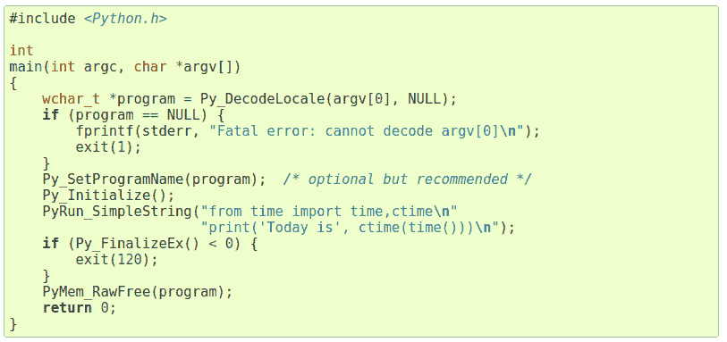
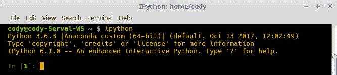
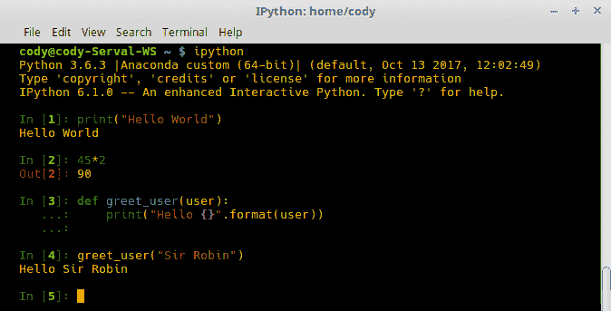
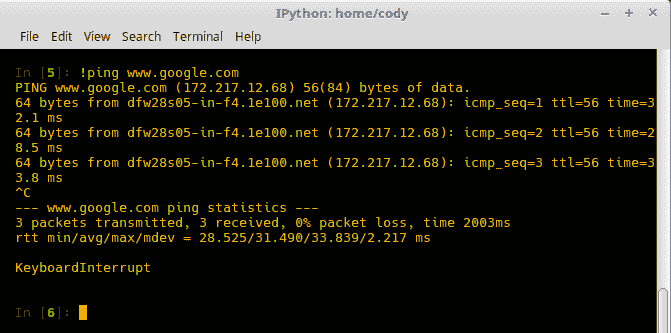

# 第二章：利用 Python 解释器

在本章中，我们将讨论 Python 解释器，无论是作为交互式工具还是用于启动 Python 程序。具体来说，我们将涵盖：

+   启动 Python 环境

+   利用 Python 命令选项

+   环境变量的使用

+   使脚本可执行

+   修改交互式解释器启动

+   替代 Python 实现

+   在 Windows 上安装 Python

+   将 Python 嵌入到其他应用程序中

+   使用替代 Python 外壳 – IPython

+   使用替代 Python 外壳 – bpython

+   使用替代 Python 外壳 – DreamPie

# 简介

Python 编程语言的一个优点是它是解释型的，而不是编译型的。这意味着 Python 代码在调用时被处理，而不是在使用前必须预先编译。正因为如此，解释型语言通常具有交互式外壳，允许用户测试代码，并在不创建单独的源代码文件的情况下立即获得反馈。

当然，为了从编程语言中获得最大功能，拥有永久的代码文件是必要的。当使用交互式提示符时，代码存在于 RAM 中；一旦交互式会话关闭，该代码就会丢失。因此，使用交互式提示符是快速测试编程想法的好方法，但你不希望从它运行一个完整的程序。

本章将讨论如何使用命令提示符来启动程序，以及使用交互式外壳的 Python 功能。我们将讨论 Windows 操作系统的特殊功能，并在最后讨论开发者可能感兴趣的替代 Python 外壳。

# 启动 Python 环境

默认情况下，Python 被安装在包含 Python 解释器且在系统路径上的计算机上。这意味着解释器将监视命令提示符上的任何对`python`的调用。

Python 最常用的用法是运行脚本。然而，可能需要为特定程序启动 Python 的特定版本。

# 如何做到...

1.  执行 Python 程序的最基本命令如下：

```py
 $ python <script_name>.py
```

1.  以下示例显示了如何根据需要启动 Python 的特定版本：

```py
 $ python2 some_script.py # Use the latest version of Python 2
 $ python2.7 ... # Specifically use Python 2.7
 $ python3 ... # Use the latest version of Python 3
 $ python3.5.2 ... # Specifically use Python 3.5.2
```

# 它是如何工作的...

调用`python2`或`python3`将打开相应分支的最新安装版本，而其他示例显示了如何调用特定版本号。无论 Python 站点是否有新版本可用，只有安装在系统上的版本才可供使用。

这是有益的，因为开发者可能需要支持旧版软件，而这些程序的一些功能可能不兼容较新的 Python 版本。因此，能够调用特定版本可以确保开发者正在使用正确的环境。

# 利用 Python 命令选项

当非交互式使用时，Python 解释器会监控命令行，并在实际执行命令之前解析所有输入。以下代码片段显示了从命令行调用 Python 时所有可能的选项：

```py
python [-bBdEhiIOqsSuvVWx?] [-c command | -m module-name | script | - ] [args] 
```

在使用 **命令行界面**（**CLI**）时，shell 命令的示例通常使用方括号 `[]` 来表示可选指令。在这种情况下，可以提供三个可选输入组给 `python` 命令：通用选项、接口选项和参数。

# 如何操作...

1.  Python 命令行调用有多个选项可用。要进入交互模式，无需附加选项调用 Python：

```py
 $ python
 Python 3.6.3 |Anaconda, Inc.| (default, Oct 13 2017, 12:02:49) 
      [GCC 7.2.0] on linux 
 Type "help", "copyright", "credits" or "license" for
      more information. 
 >>>
```

1.  要执行没有特殊选项的常规 Python 程序，请添加程序名称：

```py
 $ python <script>.py
```

1.  要在不进入交互模式或调用文件的情况下执行一系列 Python 命令，请使用 `-c`：

```py
 $ python -c "print('Hello World')"
```

1.  要将 Python 模块作为独立程序调用，请使用 `-m`：

```py
 $ python -m random
```

1.  其他可能选项的讨论将在以下部分提供。

# 它是如何工作的...

Python 命令行接受接口选项、通用选项、杂项选项和参数。每组都是可选的，大多数开发者在大多数情况下不需要担心任何特殊选项。然而，了解可用的选项是有好处的，以防你决定超越基础。

# 接口选项

当没有选项调用时，Python 解释器以交互模式启动。在这种模式下，解释器监控命令行以查找 Python 命令，并在输入时执行它们。

要退出，请输入一个 `EOF`（文件结束）字符；在 *NIX 操作系统中，这是 Windows 上的 `Ctl-D` 和 `Ctl-Z`（通常，在从文件读取时自动提供 EOF 字符，但在交互式模式下并非如此，用户必须提供它）。

本节中的选项可以与以下杂项选项结合使用：

+   `-c <"command">`：选择此选项会导致 Python 执行输入的命令。命令可以是一行或多行语句，由新行分隔，并考虑正常的 Python 空白。引号（单引号或双引号）必须包含，并包围构成命令的所有语句。

+   `-m <module>`：此选项会导致 Python 在 `sys.path` 中搜索指定的模块，然后将其内容作为 `__main__` 模块执行。通过此方法执行的可执行模块不需要 `.py` 扩展名。此外，还可以提供模块包；在这种情况下，Python 将执行 `<pkg>.__main__` 作为 `__main__` 模块。

    此选项不能与任何编译的 C 模块一起使用，包括内置模块，因为它们不是 Python 代码。然而，`.pyc` 预编译的 Python 文件可以使用此选项，即使原始源代码文件不可用，因为它们是纯 Python 代码。

    当此选项被调用时，位于 `if __name__ == "__main__"` 行以下的任何代码都将被执行。这是一个放置自我测试或配置代码的好地方。

+   `<script>`: 此选项会导致执行指定脚本中的 Python 代码。提供的脚本必须具有文件系统路径（绝对或相对），该路径指向一个常规 Python 文件、包含 `__main__.py` 文件的目录，或包含 `__main__.py` 文件的压缩文件。

+   `-`: 一个空短横线选项告诉解释器从标准输入 (`sys.stdin`) 读取；如果标准输入连接到终端，则启动正常交互模式。虽然键盘是默认输入设备，但 `sys.stdin` 实际上接受任何 `File` 对象，因此用户键盘到文件的内容都可以用作输入方法。因此，任何类型的文件都可以用作输入，从普通文本文件到 CSV 文件。

# 通用选项

与大多数程序一样，Python 有一些通用选项，这些选项在商业产品中很常见，在大多数自编软件中也是如此：

+   `-?`, `-h`, `--help`: 任何一个这些选项都会打印出命令的简短描述以及所有可用的命令行选项。

+   `-V`, `-VV`, `--version`: 调用 `-V` 或 `-version` 将打印 Python 解释器的版本号。使用 `-VV` 将其置于详细模式（仅当使用 Python 3 时），这会提供更多信息，例如 Python 环境，例如 Anaconda，或使用的 GCC 版本。

# 杂项选项

`python` 命令提供了十多种杂项选项。虽然大多数选项在 Python 2 和 Python 3 中都可用，但版本之间可能存在一些差异。如果有疑问，最好双查 [`docs.python.org/2.7/using/cmdline.html`](https://docs.python.org/2.7/using/cmdline.html)（确保切换到您使用的版本）。

每个选项在这里都有解释：

+   `-b`, `-bb`: 在比较 `bytes/bytesarray` 与 `str` 或 `bytes` 与 `int` 时提供警告。双 `b` 将提供错误而不是警告。

+   `-B`: 在导入源模块时不要写入 `.pyc` 字节码文件。与 `PYTHONDONTWRITEBYTECODE` 相关。

+   `-d`: 打开解析器调试输出。与 `PYTHONDEBUG` 相关。

+   `-E`: 忽略所有已设置的 `PYTHON*` 环境变量，例如 `PYTHONDEBUG`。

+   `-i`: 当脚本作为 `python` 命令的第一个参数，或使用 `-c` 选项时，此选项会导致 Python 解释器在执行脚本或命令后进入交互模式。即使 `sys.stdin` 不是终端，此模式更改也会发生。当抛出异常且开发者需要交互式审查堆栈跟踪时，这很有用。

+   `-I`: 以隔离模式运行解释器（自动隐含 `-E` 和 `-s` 选项）。隔离模式导致 `sys.path` 不捕获脚本目录或用户的 site-packages 目录。此外，所有 `PYTHON*` 环境变量都被忽略。可以采用额外的限制来防止用户将恶意代码注入 Python 程序。

+   `-J`: 保留供 Jython 实现使用。

+   `-O`, `-OO`: 启用基本优化。如第一章 *比较源代码与字节码* 菜谱中所述，*使用 Python 模块*，这会从 Python 代码中删除 `assert` 语句。与 `PYTHONOPTIMIZE` 相关。使用 `-OO` 还会从代码中删除文档字符串。

+   `-q`: 静默模式；防止 Python 解释器在交互模式下显示版权和版本信息。当运行从远程系统读取数据的程序且不需要显示该信息时很有用。

+   `-R`: 对于 Python 3.3 或更高版本不相关。通过加盐 `__hash__()` 值来启用哈希随机化，用于 `str`、`bytes` 和 `datetime`。它们在单个 Python 进程中是常量，但在 Python 调用之间是随机的。与 `PYTHONHASHSEED` 相关。

+   `-s`: 不要将用户的 `site-packages` 目录添加到 `sys.path`。这需要用户明确提供 `site-packages` 的路径。

+   `-S`: 禁用导入 `site` 模块和 `sys.path` 的站点相关修改。即使后来显式导入 `site`，这些修改仍然被禁用。调用 `site.main()` 是允许这些修改的必要条件。

+   `-u`: 强制从 `stdout` 和 `stderr` 流输出无缓冲的二进制数据。在交互模式下不影响文本 I/O 层，或在非交互模式下不影响块缓冲。与 `PYTHONUNBUFFERED` 相关。

+   `-v`, `-vv`: 每次初始化模块时打印一条消息，指示加载它的位置（文件或内置模块）；退出时还提供有关模块清理的信息。使用 `-vv` 时，在搜索模块时每次检查文件都会打印一条消息。与 `PYTHONVERBOSE` 相关。

+   `-W <arg>`: 控制警告何时打印；默认情况下，每个警告只针对导致警告的每行代码打印一次。可以使用多个 `-W` 选项，每个选项有不同的参数；如果警告与多个选项匹配，则返回最后一个匹配的选项。与 `PYTHONWARNINGS` 相关。

可用的参数有：

+   +   `ignore`: 忽略所有警告

    +   `default`: 明确请求默认行为，即无论该行代码被处理多少次，都只针对源代码行打印一次警告

    +   `all`: 每次出现时打印警告；如果同一行代码多次触发警告，则可能打印多条消息，例如在循环中

    +   `module`: 在每个模块首次出现时打印警告

    +   `once`: 在程序首次出现时打印警告

    +   `error`: 不打印警告，而是引发异常

可以将 `warnings` 模块导入到 Python 程序中，以在程序内部控制警告：

+   `-x`: 跳过第一行源代码。由于 *NIX 脚本通常将 `#!/usr/bin/python` 这样的内容作为第一行来指定 Python 环境的查找位置，此选项将跳过该行。因此，这允许使用非 Unix 的 `#!<command>` 格式。

+   `-X <value>`: 保留用于实现特定选项，以及传递任意值和通过 `sys._xoptions` 字典检索它们。

    目前，以下值被定义：

    +   `faulthandler`: 启用 `faulthandler` 模块，当程序出现错误时，该模块会输出 Python 调试跟踪。

    +   `showrefcount`: 仅在调试时有效。当程序结束时或在每次交互会话语句之后，输出总引用计数和使用的内存块数量。

    +   `tracemalloc`: 通过 `tracemalloc` 模块开始跟踪 Python 内存分配。默认情况下，最近的帧存储在调试跟踪中。

    +   `showalloccount`: 当程序结束时，返回每种类型的已分配对象的总数。仅在构建 Python 时定义了 `COUNT_ALLOCS` 时才有效。

# 参见...

更多信息可以在第一章 *Python 编译技巧* 的 *使用 Python 模块* 菜谱中找到。第一章，*使用 Python 模块*。

# 使用环境变量

环境变量是操作系统的一部分，影响系统操作。Python 有一些特定的变量，影响 Python 的功能，即 Python 解释器的行为。虽然它们在命令行选项之前处理，但如果存在冲突，命令行开关将覆盖环境变量。

# 如何操作...

1.  通过 Python 的 `os.environ` 访问环境变量。

1.  由于 `environ` 对象是一个字典，您可以指定一个特定的变量来查看：

```py
 >>> import os
      >>> print(os.environ["PATH"])
 /home/cody/anaconda3/bin:/home/cody/bin:/home/cody/
      .local/bin:/usr/local/sbin:/usr/local/bin:/usr
       /sbin:/usr/bin:/sbin:/bin:/usr/games:/usr/local/games 
```

1.  添加新变量就像以下这样：

```py
 >>> os.environ["PYTHONOPTIMIZE"] = "1"
```

# 它是如何工作的...

有大量的 Python 特定环境变量可用。其中一些如下：

+   `PYTHONHOME`: 用于更改标准 Python 库的位置。默认情况下，库在 `/usr/local/lib/<python_version>` 中搜索。

+   `PYTHONPATH`: 修改模块文件的默认搜索路径；格式与 shell 的 `PATH` 相同。

    虽然目录通常放在 `PYTHONPATH` 中，但单个条目可以指向包含纯 Python 模块的 ZIP 文件。这些 `zipfile` 模块可以是源代码或编译后的 Python 文件。

+   `PYTHONSTARTUP`: 在交互式模式提示符出现之前，在指定的启动文件中执行 Python 命令。该文件在交互式提示符的相同命名空间中执行，因此启动文件中定义或导入的对象可以原生使用，即不需要点符号命名法。

可以通过此文件修改交互模式提示。具体来说，交互模式中使用的 `sys.ps1` (`>>>`) 和 `sys.ps2` (`...`) 提示可以更改为其他符号。

此外，可以通过此文件修改 `sys.__interactivehook__` 钩子。该钩子配置 `rlcompleter` 模块，该模块定义了 Python 如何为 GNU `readline` 模块完成有效的标识符和关键字。换句话说，钩子负责设置 Python 命令的自动补全，并将默认命令历史文件设置为 `~/.python_history`。

+   `PYTHONOPTIMIZE`: 如果设置为非空字符串，则等同于使用 `-O` 选项。如果设置为字符串数字，例如 "2"，则等同于多次设置 `-O`。

+   `PYTHONDEBUG`: 如果设置为非空字符串，则等同于使用 `-d` 选项。如果设置为字符串数字，例如 "2"，则等同于多次设置 `-d`。

+   `PYTHONINSPECT`: 如果设置为非空字符串，则等同于使用 `-i` 选项。此环境变量也可以通过使用 Python 代码并使用 `os.environ` 命令来修改，以在程序结束时强制进入检查模式。

+   `PYTHONUNBUFFERED`: 当设置为非空字符串时，这的作用与 `-u` 选项相同。

+   `PYTHONVERBOSE`: 如果设置为非空字符串，则等同于使用 `-v` 选项。如果设置为整数值，则等同于多次设置 `-v`。

+   `PYTHONCASEOK`: 当设置时，Python 将在 `import` 语句中忽略字符大小写。这仅适用于 Windows 和 macOS。

+   `PYTHONDONTWRITEBYTECODE`: 当设置为非空字符串时，解释器在导入源代码文件时不会写入字节码（`.pyc`）文件。这与使用 `-B` 选项具有相同的功能。

+   `PYTHONHASHSEED`: 当设置为 `random` 或未设置时，将使用随机值作为 `str`、`bytes` 和 `datetime` 对象的哈希摘要的种子值。如果设置为整数值，则该整数将用作生成哈希的种子值；这允许结果的重复性。

+   `PYTHONIOENCODING`: 如果在运行解释器之前设置，则覆盖 `stdin`、`stdout` 和 `stderr` 的编码；使用的语法是 `encodingname:errorhandler`。语法两部分都是可选的，其意义与 `str.encode()` 函数相同。

    截至 Python 版本 3.6，当使用交互式控制台时，除非设置了 `PYTHONLEGACYWINDOWSSTDIO`，否则此变量指定的编码在 Windows 上将被忽略。

+   `PYTHONNOUSERSITE`: 当设置时，Python 不会将用户 `site-packages` 目录添加到 `sys.path`。

+   `PYTHONUSERBASE`: 定义用户 `base` 目录。当调用 `python setup.py install -user` 时，`base` 目录用于计算 `site-packages` 和 `Distutils` 安装路径。

+   `PYTHONEXECUTABLE`: 当设置时，`sys.argv[0]` 将设置为传入的值，而不是 C 运行时的值。此变量仅适用于 macOS。

+   `PYTHONWARNINGS`：当设置时，这与使用 `-W` 选项相同；将其设置为逗号分隔的字符串相当于设置多个 `-W`。

+   `PYTHONFAULTHANDLER`：当设置为非空字符串时，在 Python 启动时调用 `faulthandler.enable()` 函数。这与使用 `-X faulthandler` 选项相同。

+   `PYTHONTRACEMALLOC`：当设置为非空字符串时，`tracemalloc` 模块开始跟踪 Python 内存分配。变量值指定了存储在 traceback 中的帧数。

+   `PYTHONASYNCIODEBUG`：当设置为非空字符串时，启用 `asyncio` 模块的 `debug` 模式。

+   `PYTHONMALLOC`：设置 Python 的内存分配器，并安装调试钩子。

可用的内存分配器包括：

+   +   `malloc`：对所有域使用 C 的 `malloc()` 函数。

    +   `pymalloc`：对 `PYMEM_DOMAIN_MEM` 和 `PYMEM_DOMAIN_OBJ` 域使用 `pymalloc` 分配器，但对于 `PYMEM_DOMAIN_RAW` 域使用 C 的 `malloc()` 函数。

可用的调试钩子包括：

+   +   `debug`：在默认内存分配器之上安装调试钩子。

    +   `malloc_debug`：与 `malloc`（之前所示）相同，但还安装了调试钩子。

    +   `pymalloc_debug`：与 `pymalloc`（之前所示）相同，但还安装了调试钩子。

+   当 Python 以调试模式编译时，会设置 `pymalloc_debug` 并自动使用调试钩子。当以发布模式编译时，会设置正常的 `pymalloc` 模式。如果两种 `pymalloc` 模式都不可用，则使用常规的 `malloc` 模式。

+   `PYTHONMALLOCSTATS`：当设置为非空字符串时，Python 在每次创建新的 `pymalloc` 对象以及程序关闭时打印 `pymalloc` 分配器的统计信息。如果 `pymalloc` 不可用，则忽略此变量。

+   `PYTHONLEGACYWINDOWSENCODING`：当设置时，默认文件系统编码和错误模式将回退到 3.6 版本之前的值。如果使用 3.6 或更高版本，编码设置为 `utf-8`，错误模式设置为 `surrogatepass`。此选项仅在 Windows 系统上可用。

+   `PYTHONLEGACYWINDOWSTDIO`：当设置时，不会使用新的控制台读取器和写入器，导致 Unicode 字符根据活动控制台代码页进行编码，而不是 UTF-8。此选项仅在 Windows 系统上可用。

+   `PYTHONTHREADDEBUG`：当设置时，Python 将打印线程调试信息（仅在 Python 以调试模式编译时设置）。

+   `PYTHONDUMPREFS`：当设置时，Python 将在关闭解释器后转储仍然存活的对象和引用计数（仅在 Python 以调试模式编译时设置）。

# 使脚本可执行

通常，执行 Python 程序需要键入 `python <program>.py`。然而，可以使 Python 程序自我执行，这样就不需要键入 `python` 作为调用命令。

# 如何做到...

1.  在 *NIX 系统上，将 `#!/usr/bin/env python` 作为程序的第一行可以使程序通过引用用户 `PATH` 中 Python 的位置来执行。当然，这假设 Python 在 `PATH` 上；如果不是，那么程序将像正常一样调用。

1.  在将此内容添加到程序后，需要修改文件本身以使其可执行，即 `chmod +x <程序名>.py`。

1.  如果你使用的是显示文件和目录颜色不同的终端程序，运行位于文件所在目录的 `ls` 命令应该会以不同于不可执行文件的颜色显示它。

1.  要执行程序，只需输入 `./<程序名>.py`，程序就会执行，无需先调用 `python`。

# 更多内容...

由于 Windows 没有可执行模式，这些文件添加仅适用于 *NIX 兼容性。Windows 会自动将 `.py` 文件与 `python.exe` 关联，因此它们已经与 Python 解释器关联。此外，可以使用 `.pyw` 扩展名来抑制在运行 Windows Python 程序时打开控制台窗口。

# 修改交互式解释器启动

如在“*使用环境变量*”配方中所述，可以将 `PYTHONSTARTUP` 环境变量设置为指向包含在 Python 解释器启动前运行的命令的文件。此功能与 *NIX shell 中的 `.profile` 类似。

由于此启动文件仅在交互模式下使用时才会检查，因此无需担心尝试为运行脚本设置配置（尽管稍后我们将展示如何将启动文件包含在脚本中）。此文件中的命令在交互解释器的相同命名空间中执行，因此无需使用点命名法来限定函数或其他导入。此文件还负责更改交互提示：`>>>` (`sys.ps1`) 和 `...` (`sys.ps2`)。

# 如何做到...

1.  要从当前目录读取额外的启动文件，以下示例命令展示了如何在全局启动文件（`read_startup.py`）中编码它：

```py
        if os.path.isfile('.pythonrc.py'): exec(open('.pythonrc.py').read()
```

1.  虽然启动文件仅在交互模式下查看，但可以在脚本中引用它。"startup_script.py" 展示了如何做到这一点：

```py
      import os
      filename = os.environ.get('PYTHONSTARTUP')
      if filename and os.path.isfile(filename):
          with open(filename) as fobj:
              startup_file = fobj.read()
          exec(startup_file)
```

# 参见

你还可以参考本章中的“*使用环境变量*”配方。

# 替代 Python 实现

Python 已被移植到许多其他环境，如 Java 和 .NET。这意味着 Python 可以在这些环境中像平常一样使用，但可以获得对这些环境的 API 和代码基础访问权限。

Jython 用于 Java 集成，IronPython 用于 .NET 框架，Stackless Python 可用于增强线程性能，MicroPython 用于微控制器。

# 如何做到...

1.  要使用 Jython，Java 的 `.jar` 文件提供了安装可执行文件。安装有几种选项。

1.  正常的 GUI 安装可以通过以下方式实现：

```py
 java -jar jython_installer-2.7.1.jar
```

1.  对于基于控制台的系统，例如无头服务器，可以使用以下命令进行安装：

```py
 java -jar jython_installer-2.7.1.jar --console
```

1.  IronPython 可以使用 Windows 的 `.msi` 安装程序、`.zip` 文件或下载源代码进行安装。使用 `.msi` 文件安装类似于正常的 Windows 软件安装；`.zip` 文件或源代码可用于非 Windows 平台。

1.  NuGet 是 .NET 框架的包管理器。IronPython 可以通过 NuGet 安装，就像 `pip` 包一样。需要两个文件，因为标准库是单独的包。在这种情况下，NuGet 命令如下：

```py
 Install-Package IronPython
      Install-Package IronPython.StdLib
```

1.  要安装 Stackless，方法取决于所使用的操作系统。对于 *NIX 系统，安装是一个标准的 `configure`/`make`/`install` 过程：

```py
 $ ./configure
        $ make
        $ make test
        $ sudo make install
```

1.  对于 macOS，情况要复杂一些。Python 应该使用 `--enable-framework` 选项进行配置，然后使用 `make frameworkinstall` 完成 Stackless 的安装。

1.  对于 Windows，情况更加复杂。必须安装 Microsoft Visual Studio 2015 以及 `Subversion` 版本控制软件。使用 `build.bat -e` 命令构建 Stackless Python。文档中还有更多深入的信息，因此建议在安装之前进行审查。

1.  MicroPython 可提供 `.zip` 和 `.tar.gz` 文件，以及通过 GitHub 获取。安装需要一些选项和依赖项，但一般的构建命令如下：

```py
 $ git submodule update --init
 $ cd ports/unix
 $ make axtls
 $ make
```

# 还有更多...

在这里，我们将讨论适用于不同平台和框架的 Python 的各种实现：

+   **Jython**：Jython 是针对 Java 虚拟机（**JVM**）的 Python 实现。Jython 将正常的 Python 解释器修改为能够与 Java 平台通信并在其上运行。因此，在两者之间建立了无缝集成，允许在 Python 中使用 Java 库和基于 Java 的应用程序。

虽然 Jython 项目已努力确保所有 Python 模块都能在 JVM 上运行，但仍然可以发现一些差异。主要差异是 C 扩展在 Jython 中无法工作；大多数 Python 模块在 Jython 中无需修改即可工作。Python 代码中包含的任何 C 扩展都无法正确移植。这些 C 扩展应该用 Java 重新编写，以确保它们能正确工作。

Jython 代码在 Java 环境中运行良好，但使用标准的 CPython 代码（默认的 Python 环境）可能会出现问题。然而，Jython 代码通常在 CPython 环境中运行没有问题，除非它利用某种形式的 Java 集成。

+   **IronPython**：IronPython 是针对微软的 .NET 框架的 Python。IronPython 程序可以利用 .NET 框架以及常规的 Python 库；此外，其他 .NET 语言（如 C#）可以实现 IronPython 代码。

由于这个 .NET 功能，IronPython 对于 Windows 开发者或使用 Mono 的 Linux 开发者来说是一个非常好的工具。虽然可以在 IronPython 中编写正常的 Python 项目，但它还允许开发者使用 Python 替代其他脚本语言，例如 VBScript 或 PowerShell。微软的开发环境 Visual Studio 有一个 Python 工具插件，允许使用 Python 代码来完全利用 Visual Studio 的功能。

IronPython 仅适用于 Python 2.7。它尚未移植到 Python 3。使用 `3to2` 将 Python 3 代码回溯到 Python 2 并不保证能正常工作，因为 Python 3 与 Python 2 不兼容。

+   **Stackless Python**：Stackless 是 Python 的一个增强版本，专注于改进基于线程的编程，而不涉及常规 Python 线程的复杂问题。利用 microthreads，Stackless 旨在改进程序结构，使多线程代码更易于阅读，并提高程序员的生产力。

这些改进是通过避免常规的 C 调用栈并利用由解释器管理的自定义栈来实现的。Microthreads 处理同一 CPU 内程序的任务执行，为传统的异步编程方法提供了一种替代方案。它们还消除了与单 CPU 程序的多线程相关的开销，因为在用户模式和内核模式之间切换时没有延迟。

Microthreads 使用 tasklets 来表示 Python 线程中的小任务，并且可以用作功能齐全的线程或进程的替代品。微线程之间的双向通信由通道处理，调度配置为循环设置，允许以协作或抢占式的方式调度 tasklet。最后，通过 Python pickles 提供序列化，允许延迟恢复微线程。

Stackless 有一点需要注意，尽管 microthreads 改进了常规的 Python 线程，但它们并没有消除全局解释器锁。此外，tasklets 在单个线程内；没有执行多线程或多进程。

换句话说，并没有发生真正的并行处理，只是在共享于 tasklets 的单个 CPU 内进行协作式多任务处理；这与 Python 多线程提供的功能相同。要利用跨多个 CPU 的并行性，需要在 Stackless 进程之上配置一个进程间通信系统。

最后，由于对底层 Python 源代码的更改以实现 microthreads，Stackless 无法安装在现有的 Python 安装之上。因此，需要安装一个完整的 Stackless，与任何其他 Python 发行版分开。

+   **MicroPython**：MicroPython 是 Python 3.4 的简化版本，专为微控制器和嵌入式系统设计使用。虽然 MicroPython 包含标准 Python 中的大多数功能，但为了使语言与微控制器设备很好地工作，已经对语言进行了一些修改。MicroPython 的一个关键特性是它可以在仅 16 KB RAM 上运行，源代码仅占用 256 KB 的存储空间。

可购买的独特微控制器 pyboard，专为 MicroPython 设计使用。pyboard 类似于 Raspberry Pi，但更小。然而，它有 30 个 GPIO 连接，内置四个 LED，加速度计和许多其他功能。由于它是为 MicroPython 设计的，你实际上得到的是一个能够在裸机上运行的 Python 操作系统。

# 在 Windows 上安装 Python

与默认安装 Python 的*NIX 计算机相比，Windows 操作系统出厂时不包含 Python。然而，MSI 安装程序包可用于在多个基于 Windows 的环境中安装 Python。这些安装程序旨在供单个用户使用，而不是特定计算机的所有用户。但是，在安装过程中可以配置它们，以便单个机器的所有系统用户都可以访问 Python。

# 准备工作

由于 Python 包含针对各种操作系统的平台特定代码，为了最小化不必要的代码量，Python 仅支持由 Microsoft 支持的 Windows 操作系统；这包括扩展支持，因此任何达到生命周期的产品都不再受支持。

因此，Windows XP 及更早版本无法安装 3.4 版以上的任何 Python 版本。Python 文档仍然声明 Windows Vista 及更高版本可以安装 3.6 及更高版本，但 Windows Vista 已于 2017 年达到生命周期终点，因此该操作系统上的 Python 支持将不再继续。此外，了解您的计算机使用的是哪种类型的 CPU，即 32 位或 64 位，也很重要。虽然 32 位软件可以在 64 位系统上运行，但反之则不然。

最后，有两种类型的安装程序：离线和基于 Web 的。离线安装程序包括默认安装所需的所有组件；仅需要互联网访问来安装可选功能。基于 Web 的安装程序比离线版本文件小，允许用户仅安装特定功能，并在需要时下载它们。

# 如何操作...

1.  当首次运行 Windows 安装程序时，有两个选项：默认安装或自定义。如果以下条件适用，请选择*默认*：

    +   您是在为自己安装，也就是说，其他用户不需要访问 Python

    +   您只需要安装 Python 标准库、测试套件、*pip*和 Windows 启动器

    +   与 Python 相关的快捷方式仅对当前用户可见

1.  如果您需要更多控制，特别是对以下方面：

    +   要安装的功能

    +   安装位置

    +   安装调试符号或二进制文件

    +   为所有系统用户安装

    +   将标准库预编译成字节码

1.  自定义安装需要管理员凭据。GUI 是安装 Python 的正常方式，使用安装向导引导过程。或者，可以使用命令行脚本来自动化多台机器的安装，无需用户交互。要使用命令行安装，在运行安装程序 `.exe` 时，有几种基本选项可用：

```py
 python-3.6.0.exe /quiet # Suppress the GUI and install base
      installation silently
 ... /passive # Skip user interaction but display progress and errors
 ... /uninstall # Immediately start removing Python;
      no prompt displayed
```

# 使用 Windows Python 启动器

从版本 3.3 开始，Python 默认在安装语言的其他部分时安装 Python 启动器。启动器允许 Python 脚本或 Windows 命令行指定特定的 Python 版本，并将定位并启动该版本。

当使用 v3.3 或更高版本安装时，启动器与所有版本的 Python 兼容。Python 启动器将为脚本选择最合适的 Python 版本，并使用每个用户的 Python 安装而不是所有用户的安装。

# 如何操作...

1.  要检查启动器是否已安装，只需在 Windows 命令提示符中键入 `py`。如果已安装，将启动最新的 Python 版本。

1.  如果未安装，您将收到以下错误：

```py
 'py' is not recognized as an internal or external command, 
      operable program or batch file.
```

1.  假设已安装不同版本的 Python，要使用不同的版本，只需通过 `-` 选项指定：

```py
 py -2.6 # Launches Python version 2.6
 py -2 # Launches the latest version of Python 2
```

1.  如果使用 Python 虚拟环境并且启动器没有明确指定 Python 版本，启动器将使用虚拟环境的解释器而不是系统解释器。要使用系统解释器，必须首先停用虚拟环境或明确调用系统的 Python 版本号。

1.  启动器允许在 *NIX 程序中使用的 `shebang` (`#!`) 行在 Windows 中使用。虽然有多种 Python 环境路径的变体可用，但值得注意的是，其中最常见的一种 `/usr/bin/env python` 在 Windows 中的执行方式与 *NIX 相同。这意味着 Windows 将在查找已安装的解释器之前在 `PATH` 中搜索 Python 可执行文件，这正是 *NIX 系统的工作方式。

1.  Shebang 行可以包含 Python 解释器选项，就像在命令行中包含它们一样。例如，`#! /usr/bin/python -v` 将提供正在使用的 Python 版本；这与在命令行中使用 `python -v` 的行为相同。

# 将 Python 集成到其他应用程序中

Python 的嵌入式分发是一个包含最小 Python 解释器的 `zipfile`。其目的是为其他程序提供 Python 环境，而不是直接供最终用户使用。

当从`zipfile`中提取时，环境基本上与底层操作系统隔离，也就是说，Python 环境是自包含的。标准库预先编译成字节码，所有与 Python 相关的`.exe`和`.dll`文件都包含在内。然而，`pip`、文档文件和`Tcl/tk`环境不包括在内。由于`Tcl/tk`不可用，IDLE 开发环境和相关的 Tkinter 文件也无法使用。

此外，Microsoft C 运行时不包括在内置的发行版中。虽然它通常由其他软件或通过 Windows 更新安装在用户的系统上，但最终确保它可供 Python 使用的责任在于程序安装程序。

除了内置的 Python 环境之外，程序安装程序还需要安装必要的第三方 Python 包。由于`pip`不可用，这些包应包含在整体应用程序中，以便在应用程序本身更新时它们也会更新。

# 如何实现...

1.  正常编写 Python 应用程序。

1.  如果 Python 的使用不应对最终用户明显，则还应编写一个定制的可执行启动器。这个可执行文件只需通过硬编码的命令调用 Python 程序的`__main__`模块。

如果使用自定义启动器，Python 包可以位于文件系统的任何位置，因为启动器可以编码为在程序启动时指示特定的搜索路径。

1.  如果 Python 的使用不需要如此透明，一个简单的批处理文件或快捷方式文件可以直接调用带有必要参数的`python.exe`。如果这样做，Python 的使用将很明显，因为程序的真实名称不会被使用，而看起来像是 Python 解释器本身。因此，对于最终用户来说，在众多运行的 Python 进程之间识别特定的程序可能会很困难。

如果使用这种方法，建议将 Python 包安装为与 Python 可执行文件相同位置的目录。这样，这些包将被包含在`PATH`中，因为它们是主程序的子目录。

1.  内置 Python 的另一种用途是作为粘合语言，为原生代码提供脚本功能，例如 C++程序。在这种情况下，大多数软件是用非 Python 语言编写的，并且将通过`python.exe`或通过`python3.dll`调用 Python。无论哪种方式，Python 都会从内置发行版中提取到子目录中，允许调用 Python 解释器。

包可以安装在任何文件系统目录中，因为它们的路径可以在配置 Python 解释器之前在代码中提供。

1.  这里是一个非常高级的嵌入示例，由[`docs.python.org/3/extending/embedding.html`](https://docs.python.org/3/extending/embedding.html)提供：



# 它是如何工作的...

在前面的 C 代码中 `(fprintf())` 被用来访问 Python。由于这不是一本 C 编程书，我不会提供代码的深入工作原理，但以下是一个简要概述：

1.  Python 作为头文件被导入到代码中。

1.  C 代码被告知 Python 运行时库的路径。

1.  Python 解释器被初始化。

1.  Python 脚本被硬编码到 C 代码中并处理。

1.  Python 解释器被关闭。

1.  C 程序完成。

在实际实践中，要执行的 Python 程序会从文件中提取，而不是硬编码，这样可以消除程序员分配内存和加载文件内容的需求。

# 使用替代的 Python shell – IPython

虽然可以使用，但与现在的计算机能力相比，Python 解释器的默认 shell 存在显著的局限性。首先，常规的 Python 交互式解释器不支持语法高亮或自动缩进，以及其他功能。

IPython 是 Python 最受欢迎的交互式 shell 之一。与纯 Python 相比，IPython 提供的一些功能包括：

+   完整的对象内省，允许访问文档字符串、源代码和其他解释器可访问的对象

+   持久输入历史记录

+   缓存输出结果

+   可扩展的自动补全，支持变量、关键字、函数和文件名

+   `magic`命令（以前置的`%`表示）用于控制环境和与操作系统交互

+   详细的配置系统

+   会话记录和重新加载

+   可嵌入到 Python 程序和 GUI 中

+   集成访问调试器和性能分析器

+   多行编辑

+   语法高亮

IPython 包含 Jupyter，它提供了创建笔记本的能力。笔记本最初是 IPython 的一部分，但 Jupyter 分成了单独的项目，将笔记本的力量带到了其他语言。因此，IPython 和 Jupyter 可以单独使用，不同的前端和后端根据需要提供不同的功能。

Jupyter 笔记本提供了一个基于浏览器的应用程序，可用于开发、文档编写和执行代码，包括以文本、图像或其他媒体类型显示结果。

Jupyter 笔记本作为 Web 应用，提供以下功能：

+   在浏览器中编辑，包括语法高亮、自动缩进、内省和自动补全

+   在浏览器中执行代码，并将结果附加到源代码

+   显示丰富媒体的能力，包括 HTML、LaTeX、PNG、SVG 等

+   使用 Markdown 进行富文本编辑

+   使用 LaTeX 的数学符号

另一个属于 IPython 家族的包是 IPython Parallel，也称为`ipyparallel`。IPython Parallel 支持以下并行编程模型：

+   SPMD（单程序，多数据）

+   MPMD（多程序，多数据）

+   通过 MPI 进行消息传递

+   任务农场

+   数据并行

+   之前的组合

+   自定义定义的方法

`ipyparallel` 的主要好处是它允许开发、测试和交互式使用并行处理的应用程序。通常，并行性是通过编写代码然后执行它来查看结果实现的；交互式编码可以通过显示某个特定算法是否值得进一步追求，而无需投入大量时间编写支持代码，从而大大提高开发速度。

# 准备工作

IPython 可以通过 `pip` 简单安装，但您可能需要先安装 `setuptools`：

```py
$ pip install ipython
```

IPython 也可以作为 Anaconda 的一部分使用，Anaconda 是 Python 的数据科学/机器学习发行版。除了 IPython 之外，Anaconda 还提供大量用于科学、数据分析和人工智能工作的软件包。

如果您没有使用预构建的环境，如 Anaconda，来将 Jupyter 功能与 IPython 集成，请使用以下命令：

```py
$ python -m pip install ipykernel
$ python -m ipykernel install [--user] [--name <machine-readable-name>] [--display-name <"User Friendly Name">]
```

+   `user` 指定安装是为当前用户而不是全局使用。

+   `name` 为 IPython 内核命名。这仅在多个 IPython 内核同时运行时才是必要的。

+   `display-name` 是特定 IPython 内核的名称。当存在多个内核时最有用。

# 如何做到这一点...

1.  要启动与 IPython 的交互式会话，请使用命令 `ipython`。如果您安装了不同的 Python 版本，您必须指定 `ipython3`：



1.  注意输入提示符是 `In [N]:`，而不是 `>>>`。数字 `N` 指的是 IPython 历史中的命令，可以再次调用以供使用，就像 Bash shell 的历史一样。

1.  IPython 的解释器功能与标准的 Python 解释器类似，同时增加了功能。这些示例中的静态文本并不能完全展示环境的功能，因为语法高亮、自动缩进和自动补全都是实时发生的。以下是在 IPython 解释器中的一些简单命令示例：



1.  注意在先前的示例中，第二个命令使用 `Out[N]:` 提示符打印结果。像 `In [N]:` 提示符一样，这个行号可以在未来的代码中再次引用。

1.  要了解更多关于任何对象的信息，请使用问号：`<object>?`。要获取更多信息，请添加两个问号：`<object>??`。

1.  魔术函数是 IPython 的独特部分。它们本质上是控制 IPython 操作的内置快捷方式，同时也提供类似系统函数的功能，类似于访问 Bash 命令。

    +   行魔术实例以 `%` 字符为前缀，其操作类似于 Bash 命令：将参数传递给魔术函数。函数调用本身之后的行被视为参数的一部分。

        行魔术实例返回结果，就像一个常规函数一样。因此，它们可以被用来将结果分配给一个变量。

    +   单元魔法实例以`%%`为前缀。它们的行为类似于行魔法，不同之处在于可以使用多行作为参数，而不是单行。

    +   魔法函数可用于影响 IPython shell，与代码交互，并提供通用实用函数。

1.  IPython 包含一个内置的命令历史记录日志，它跟踪输入命令及其结果。`%history`魔法函数将显示命令历史。可以使用其他魔法函数与历史交互，例如重新运行过去的命令或将它们复制到当前会话中。

1.  通过使用命令前的`!`前缀，可以进行 OS shell 交互。因此，要在 IPython 中利用 Bash shell 而无需退出会话或打开新终端，可以使用`!<command>`发送命令，例如将`ping`命令发送到 Bash 执行：



1.  当 IPython 作为其他前端软件的内核使用时，它支持丰富的媒体输出。可以通过`matplotlib`进行绘图；这在使用 Jupyter 笔记本在浏览器窗口中显示代码和结果图时尤其有用。

1.  还支持交互式 GUI 开发。在这种情况下，IPython 将等待 GUI 工具包的事件循环输入。要启动此功能，只需使用魔法函数`%gui <toolkit_name>`。支持的 GUI 框架包括 wxPython、PyQT、PyGTK 和 Tk。

1.  IPython 具有交互式运行脚本的能力，例如与演示一起使用。在源代码中嵌入的注释中添加一些标签可以将代码分成单独的块，每个块单独运行。IPython 将在运行代码之前打印块，然后返回到交互式 shell，允许交互式使用结果。

1.  支持将 IPython 嵌入到其他程序中，类似于 Python 的嵌入式发行版。

# 还有更多...

从 IPython 版本 6.0 开始，不支持低于 3.3 的 Python 版本。要使用较旧的 Python 版本，应使用 IPython 5 LTS。

# 使用替代 Python shell – bpython

bpython 是为那些希望在 Python 环境中获得更多功能但不想承受 IPython 相关的开销或学习曲线的开发者而创建的。因此，bpython 提供了许多 IDE 风格的特性，但以轻量级的方式提供。一些可用的特性包括：

+   行内语法高亮

+   输入时自动完成建议

+   函数补全的建议参数

+   一个弹出最后一条语句并重新评估整个源代码的代码`rewind`功能

+   Pastebin 集成，允许可见的代码被发送到 Pastebin 网站

# 准备工作

要使用 bpython，除了下载包本身外，还必须确保以下包已安装到您的系统上：

+   Pygments

+   requests

+   Sphinx（可选；仅用于文档）

+   mock（可选；仅用于测试套件）

+   babel（可选；用于国际化目的）

+   curtsies

+   greenlet

+   urwid（可选；仅适用于 bpython-urwind）

+   适用于 Python 版本小于 2.7.7 的`requests[security]`

# 如何做...

1.  为您的项目创建一个虚拟环境，例如：

```py
 $ virtualenv bpython-dev # determines Python version used
 $ source bpython-dev/bin/activate 
      # necessary every time you work on bpython
```

1.  将`bpython`GitHub 仓库克隆到您的开发系统：

```py
 $ git clone git@github.com:<github_username>/bpython/bpython.git
```

1.  安装 bpython 及其依赖项：

```py
 $ cd bpython
 $ pip install -e . # installs bpython and necessary dependencies
 $ pip install watchdog urwid # install optional dependencies
 $ pip install sphinx mock nose # install development dependencies
 $ bpython # launch bpython
```

1.  作为 pip 安装的替代方案，您的*NIX 发行版很可能包含必要的文件。运行`apt search python-<package>`将显示特定包是否可用。要安装特定包，请使用以下命令：

```py
 $ sudo apt install python[3]-<package>
```

如果您正在为 Python 2 安装，则`3`是可选的，但如果您想安装 Python 3 版本的包，则它是必需的。

bpython 也可以使用`easyinstall`、`pip`以及通过正常的`apt install`进行安装。

1.  bpython 的文档包含在 bpython 仓库中。要创建文档的本地副本，请确保您已安装 sphinx，并运行以下命令：

```py
 $ make -C doc/sphinx html
```

一旦生成文档，您可以通过在浏览器中使用 URL `doc/sphinx/build/html/index.html` 来访问它。

1.  在`bpython`配置文件中（默认位置为`~/.config/bpython/config`）提供了大量的配置选项。您可以选择设置自动完成、颜色方案、自动缩进、键盘映射等选项。

1.  主题配置也是可用的；主题通过配置文件中的`color_scheme`选项设置。主题用于控制语法高亮以及 Python 外壳本身。

# 更多...

在撰写本文时，当前版本为 0.17。虽然它被归类为测试版，但作者指出，它对于大多数日常工作来说已经足够好了。支持通过 IRC、Google Groups 邮件列表和各种社交媒体网站提供。有关截图等信息可在项目网站上找到。

# 使用替代 Python 外壳 – DreamPie

继续改进原始 Python 体验，DreamPie 提供了一些关于替代外壳的新想法。DreamPie 提供的功能包括：

+   将交互式外壳分为历史记录框和代码框。与 IPython 类似，历史记录框是之前命令和结果列表，而代码框是当前正在编辑的代码。与代码框的区别在于，它更像是一个文本编辑器，允许您在执行之前编写尽可能多的代码。

+   一个仅复制代码的命令，它只复制所需的代码，允许将其粘贴到文件中并保留缩进。

+   自动属性和文件名完成。

+   代码内省，显示函数参数和文档。

+   会话历史可以保存到 HTML 文件以供将来参考；该 HTML 文件可以加载回 DreamPie 以快速重用。

+   在函数和方法之后自动添加括号和引号。

+   Matplotlib 集成以实现交互式绘图。

+   几乎支持所有 Python 实现，包括 Jython、IronPython 和 PyPy。

+   跨平台支持。

# 准备工作

在安装 DreamPie 之前，您需要安装 Python 2.7、PyGTK 和`pygtksourceview`（需要 Python 2.7 的原因是 PyGTK 尚未为 Python 3 支持重写）。

# 如何操作...

1.  下载 DreamPie 的推荐方法是克隆 GitHub 仓库：

```py
 git clone https://github.com/noamraph/dreampie.git
```

1.  另外，Windows、macOS 和 Linux 都有可用的二进制文件（链接可以在 DreamPie 网站上找到 [(http://www.dreampie.org/download.html)。](http://www.dreampie.org/download.html) 这通常比 GitHub 仓库更新得慢，因此稳定性也相对较低。

# 还有更多...

我无法在 Xubuntu 16.04 和 Python 2.7.11 上使 DreamPie 工作；出现了一个错误，表明 GLib 对象系统`(gobject)`模块无法导入。即使尝试手动安装`gobject`包，我也无法安装 DreamPie 并验证它的实用性。

DreamPie 网站的最后一次更新是在 2012 年，网站和 GitHub 网站上都没有关于如何使用该软件的文档。根据 GitHub 网站的信息，它最后一次更新是在 2017 年 11 月，因此看起来 GitHub 网站现在是该项目的主要位置。
