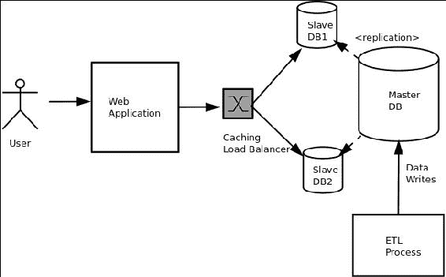
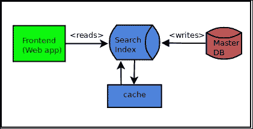
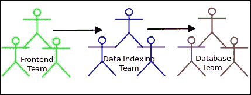
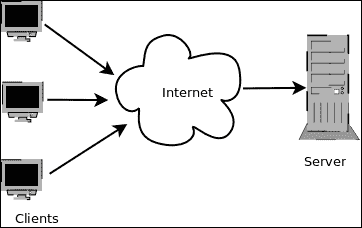
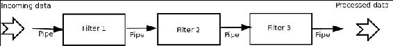
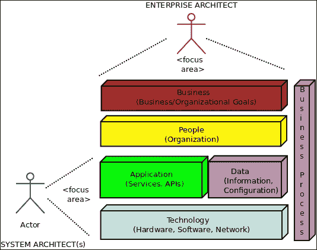
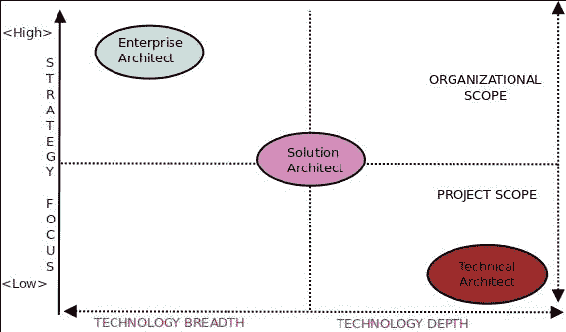
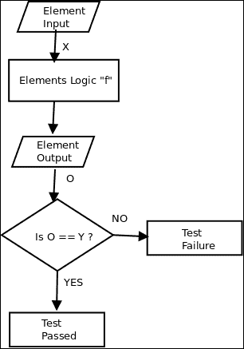
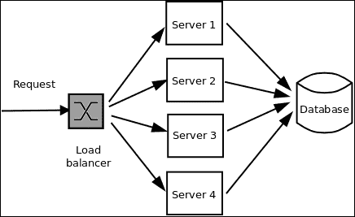

# 第一章：软件架构原则

这是一本关于 Python 的书。与此同时，它也是一本关于软件架构及其在软件开发生命周期中涉及的各种属性的书。

为了让你理解并结合这两个方面，这对于从本书中获得最大价值是至关重要的，重要的是要掌握软件架构的基本原理，与之相关的主题和概念，以及软件架构的各种质量属性。

许多软件工程师在组织中担任高级角色时，经常对软件设计和架构的定义以及它们在构建可测试、可维护、可扩展、安全和功能性软件中的作用有着非常不同的解释。

尽管该领域有大量的文献，无论是传统的书籍形式还是互联网上，但我们中的从业者往往对这些非常重要的概念产生混淆的印象。这往往是由于*学习技术*而不是学习技术在构建系统中的基本设计和架构原则方面所带来的压力。这在软件开发组织中是一种常见做法，其中交付可工作的代码的压力往往压倒和掩盖了其他一切。

像本书这样的一本书，努力超越中间路径，将软件开发中与其架构质量属性相关的颇为晦涩的方面与使用编程语言、库和框架构建软件的平凡细节联系起来——在本例中，使用 Python 及其开发者生态系统。

这个开场章节的作用是揭开这些概念的神秘面纱，并以非常清晰的方式向读者解释，为他准备好理解本书其余部分的内容。希望到本书结束时，这些概念及其实际细节将对读者构成一个连贯的知识体系。

我们将立即开始这条道路，将这一章大致分为以下几个部分：

+   定义软件架构

+   软件架构与设计

+   软件架构的方面

+   软件架构的特点

+   为什么软件架构很重要？

+   系统与企业架构

+   架构质量属性

+   可修改性

+   可测试性

+   可扩展性/性能

+   安全性

+   可部署性

# 定义软件架构

关于这个主题的文献中有各种各样的软件架构定义。一个简单的定义如下：

**软件架构**是对软件系统的子系统或组件以及它们之间的关系的描述。

以下是来自**IEEE**技术的**软件密集型系统架构描述的推荐实践**的更正式定义：

> “架构是一个系统在其组件中体现的基本组织，它们相互之间的关系，以及与环境的关系，以及指导其设计和演变的原则。”

如果花一些时间在网上搜索，可能会找到无数关于软件架构的定义。措辞可能不同，但所有的定义都指的是软件架构的一些核心、基本方面。

## 软件架构与设计

在作者的经验中，系统的软件架构与其设计的问题似乎经常出现在在线和离线论坛中。因此，让我们花一点时间来理解这一方面。

尽管这两个术语有时可以互换使用，但架构与设计的粗略区别可以总结如下：

+   架构涉及系统中的描述结构和交互的更高层次。它涉及那些需要对系统的*骨架*做出决策的问题，不仅涉及其功能，还涉及其组织、技术、业务和质量属性。

+   设计是关于系统的部分或组件的组织以及涉及制作系统的子系统。这里的问题通常更接近于代码或相关模块，比如：

+   将代码分割成哪些模块？如何组织它们？

+   将不同的功能分配给哪些类（或模块）？

+   我应该为类“C”使用哪种设计模式？

+   我的对象在运行时如何交互？传递了哪些消息，如何组织这种交互？

软件架构是关于整个系统的设计，而软件设计大多是关于细节，通常是关于构成这些子系统的各种子系统和组件的实现级别。

换句话说，*设计*这个词在两种情境中都出现了，不过前者的抽象程度和范围要比后者高得多。

对于软件架构和设计，即**架构模式和设计模式**，都有丰富的知识体系可供参考。我们将在本书的后续章节中讨论这两个主题。

## 软件架构的特点

在正式的 IEEE 定义和之前给出的相当不正式的定义中，我们发现了一些共同的、反复出现的主题。为了进一步讨论软件架构，理解它们是很重要的：

+   **系统**：系统是以特定方式组织的组件集合，以实现特定的功能。软件系统是这种软件组件的集合。系统通常可以分为子系统。

+   **结构**：结构是根据指导原则或原则组合或组织在一起的一组元素。这些元素可以是软件或硬件系统。根据观察者的情境，软件架构可以展示不同级别的结构。

+   **环境**：软件系统构建的上下文或环境，对其架构有直接影响。这些上下文可以是技术、业务、专业、运营等。

+   **利益相关者**：任何对系统及其成功感兴趣或关注的人或人群。利益相关者的例子包括架构师、开发团队、客户、项目经理、营销团队等。

现在您已经了解了软件架构的一些核心方面，让我们简要列出一些其特点。

# 软件架构的特点

所有软件架构都具有一组共同的特征。让我们在这里看一些最重要的特征。

## 架构定义了一个结构

系统的架构最好表示为系统的结构细节。实践者通常会将系统架构绘制为结构组件或类图，以表示子系统之间的关系。

例如，以下架构图描述了一个应用程序的后端，该应用程序从分层数据库系统中读取数据，使用 ETL 过程加载：

示例架构图显示系统结构

结构提供了对架构的洞察，并为分析架构提供了独特的视角，以便考虑其质量属性。

以下是一些示例：

+   运行时结构，即运行时创建的对象以及它们的交互，通常决定了部署架构。部署架构与可伸缩性、性能、安全性和互操作性等质量属性密切相关。

+   模块结构，即代码如何分解和组织成模块和包以进行任务分解，通常直接影响系统的可维护性和可修改性（可扩展性）。解释如下：

+   代码的组织方式旨在可扩展性，通常会将父类放在单独定义良好的包中，并配有适当的文档和配置，这样外部模块就可以轻松地进行扩展，而无需解决太多的依赖关系。

+   依赖于外部或第三方开发人员（库、框架等）的代码通常会提供设置或部署步骤，手动或自动地从外部来源获取这些依赖项。这样的代码还会提供文档（README、INSTALL 等），清楚地记录这些步骤。

## 架构选择了一组核心元素

良好定义的架构清楚地捕捉了构建系统核心功能所需的一组核心结构元素，并对系统产生持久影响。它并不打算记录系统的每个组件的所有内容。

例如，描述用户与用于浏览网页的 Web 服务器进行交互的架构师（典型的客户端/服务器架构）主要关注两个组件：用户的浏览器（客户端）和远程 Web 服务器（服务器），它们构成了系统的核心元素。

系统可能有其他组件，例如从服务器到客户端的路径上有多个缓存代理，或者服务器上有一个远程缓存，可以加快网页传送速度。然而，这不是架构描述的重点。

## 架构捕捉早期设计决策

这是先前描述的特征的必然结果。帮助架构师专注于系统的一些核心元素（及其相互作用）的决策是对系统的早期设计决策的结果。因此，这些决策由于其初始权重在系统的进一步发展中起着重要作用。

例如，架构师可能在仔细分析系统需求后做出以下早期设计决策：

+   系统将仅部署在 Linux 64 位服务器上，因为这满足了客户的要求和性能约束。

+   系统将使用 HTTP 作为实现后端 API 的协议

+   系统将尝试使用 HTTPS 来传输从后端到前端的敏感数据的 API，使用 2048 位或更高的加密证书

+   系统的编程语言将是 Python 用于后端，Python 或 Ruby 用于前端

### 注意

第一个决定在很大程度上冻结了系统的部署选择，限定了特定操作系统和系统架构。接下来的两个决定在实现后端 API 方面具有很大的影响。最后一个决定冻结了系统的编程语言选择。

早期的设计决策需要在仔细分析需求并将其与约束进行匹配后做出，例如组织、技术、人员和时间约束。

## 架构管理利益相关者的需求

系统的设计和构建最终是为了满足利益相关者的要求。然而，由于这些要求往往是矛盾的，因此不可能完全满足每个利益相关者的要求。以下是一些例子：

+   市场团队关心拥有功能齐全的软件应用程序，而开发团队关心在添加许多功能时的*功能蔓延*和性能问题。

+   系统架构师关注使用最新技术将其部署扩展到云端，而项目经理关注这种技术部署对其预算的影响。最终用户关注正确的功能、性能、安全性、可用性和可靠性，而开发组织（架构师、开发团队和经理）关注在保持项目进度和预算范围内交付所有这些质量的同时。

+   一个好的架构尽力平衡这些要求，通过权衡，提供具有良好质量属性的系统，同时保持人力和资源成本在限制范围内。

+   架构还为利益相关者提供了一个共同的语言，使他们能够通过表达这些约束来有效地进行沟通，并帮助架构师朝着最能满足这些要求和它们的权衡的架构前进。

## 架构影响组织结构

系统结构描述的架构往往直接映射到构建这些系统的团队的结构。

例如，一个架构可能有一个数据访问层，描述了一组读写大量数据的服务——这样的系统自然会被分配给数据库团队，他们已经具备所需的技能。

由于系统的架构是对自上而下结构的最佳描述，因此它经常被用作任务分解结构的基础。因此，软件架构往往直接影响构建它的组织结构：

搜索 Web 应用程序的系统架构

以下图表显示了构建此应用程序的团队结构的映射：

## 架构受其环境的影响

环境对架构必须运行的外部约束或限制。在文献中，这些通常被称为*上下文中的架构* [参考：Bass，Kazman]。以下是一些例子：

+   **质量属性要求**：在现代 Web 应用程序中，很常见地将应用程序的可扩展性和可用性要求作为早期的技术约束，并在架构中加以捕捉。这是从业务角度看的技术背景的一个例子。

+   **标准符合**：在一些组织中，软件通常有一大套管理标准，特别是在银行、保险和医疗保健领域，这些标准被添加到架构的早期约束中。这是一个外部技术背景的例子。

+   **组织约束**：通常可以看到，那些具有某种架构风格经验或一组团队在某些编程环境中操作的组织（J2EE 是一个很好的例子），更倾向于采用类似的架构来减少成本，并确保由于当前对这些架构和相关技能的投资而提高生产力。这是一个内部业务背景的例子。

+   **专业背景**：除了这些外部背景之外，架构师对系统架构的选择大多是根据他独特经验的选择。架构师通常会继续在新项目中使用他过去取得最大成功的一套架构选择。

架构选择也源自个人的教育和专业培训，以及来自专业同行的影响。

## 架构记录了系统

每个系统都有一个架构，无论它是否被正式记录。然而，适当记录的架构可以作为系统的有效文档。由于架构捕获了系统的初始需求、约束和利益相关者的权衡，适当记录它是一个很好的做法。文档可以作为后续培训的基础。它还有助于持续的利益相关者沟通，并根据不断变化的需求进行架构的后续迭代。

记录架构的最简单方法是为系统的不同方面和组织架构创建图表，例如组件架构、部署架构、通信架构以及团队或企业架构。

可以早期捕获的其他数据包括系统需求、约束、早期设计决策以及这些决策的基本原理。

## 架构通常符合一种模式

大多数架构符合一定的在实践中取得了很大成功的风格。这些被称为架构模式。此类模式的示例包括客户端-服务器、管道和过滤器、基于数据的架构等。当架构师选择现有模式时，他可以参考和重用许多与这些模式相关的现有用例和示例。在现代架构中，架构师的工作归结为混合和匹配现有的这些可用模式集来解决手头的问题。

例如，以下图表显示了客户端-服务器架构的示例：

客户端-服务器架构示例

以下图表描述了另一种常见的架构模式，即管道和过滤器架构，用于处理数据流：

管道和过滤器架构示例

我们将在本书的后面看到架构模式的示例。

# 软件架构的重要性

到目前为止，我们已经讨论了软件架构的基本原则，并且也看到了一些特征。当然，这些部分假定了软件架构是重要的，并且是软件开发过程中的关键步骤。

现在是时候扮演魔鬼的辩护人，回顾软件架构并提出一些关于它的存在性问题，如下所示：

+   为什么软件架构？

+   为什么软件架构很重要？

+   为什么不建立一个没有正式软件架构的系统？

让我们来看看软件架构提供的关键见解，这些见解在非正式的软件开发过程中将会缺失。我们只关注以下表中系统的技术或开发方面：

| 方面 | 洞察/影响 | 示例 |
| --- | --- | --- |
| 架构选择要为系统优化的质量属性。 | 诸如可伸缩性、可用性、可修改性、安全性等系统方面取决于在选择架构时的早期决策和权衡。通常你会在一个属性和另一个属性之间进行权衡。 | 一个优化了可伸缩性的系统必须使用分散式架构来开发，其中元素之间没有紧密耦合。例如：微服务、代理。 |
| 架构有助于早期原型设计。 | 定义架构允许开发组织尝试并构建早期原型，这可以为系统的行为提供宝贵的见解，而无需自上而下地构建完整的系统。 | 许多组织快速构建服务的原型——通常是仅构建这些服务的外部 API 并模拟其余行为。这允许进行早期集成测试，并及早解决架构中的交互问题。 |
| 架构允许系统逐个构建组件。 | 有一个明确定义的架构可以重复使用和组装现有的、现成的组件，以实现功能，而不必从头开始实现所有内容。 | 提供服务的现成构件的库或框架。例如：Django/RoR 等 Web 应用框架，以及 Celery 等任务分发框架。 |
| 架构有助于管理系统的变更。 | 架构允许架构师以受影响的组件和未受影响的组件来界定系统的变更。这有助于在实现新功能、性能修复等时将系统变更最小化。例如，如果架构实施正确，对系统的数据库读取进行性能修复只需要对数据库和数据访问层（DAL）进行更改，根本不需要触及应用程序代码。例如，这就是大多数现代 Web 框架的构建方式。 |

还有一些与系统的业务背景相关的其他方面，架构为此提供了宝贵的见解。然而，由于这本书主要讨论软件架构的技术方面，我们将讨论限制在前表中给出的内容。

现在，让我们来探讨第二个问题：

**为什么不建立一个没有正式软件架构的系统呢？**

如果您迄今为止一直在认真地跟随这些论点，那么很容易看出答案。然而，可以总结为以下几个陈述：

+   每个系统都有一个架构，无论是否有文档记录

+   记录架构使其正式化，使其能够在利益相关者之间共享，从而使变更管理和迭代开发成为可能

+   当您有一个明确定义和记录的正式架构时，所有其他软件架构的好处和特征都可以被利用

+   您可能仍然能够在没有正式架构的情况下工作和构建一个功能性的系统，但这不会产生一个可扩展和可修改的系统，很可能会产生一个与原始要求相去甚远的一组质量属性的系统

# 系统与企业架构

您可能已经听说过*架构师*这个术语。在软件行业中，以下*角色*或*头衔*对架构师来说是相当常见的：

+   技术架构师

+   安全架构师

+   信息架构师

+   基础架构架构师

您可能也听说过*系统架构师*这个术语，也许还有*企业架构师*，也可能是*解决方案架构师*。有趣的问题是：*这些人做什么？*

让我们试着找到这个问题的答案。

企业架构师审视组织的整体业务和组织战略，并应用架构原则和实践指导组织通过业务、信息、流程和技术变化，以执行他们的战略。企业架构师通常更关注战略，而较少关注技术。其他架构师角色负责自己的子系统和流程。例如：

+   **技术架构师**：技术架构师关注组织中使用的核心技术（硬件/软件/网络）。安全架构师创建或调整应用程序中使用的安全策略，以适应组织的信息安全目标。信息架构师提出架构解决方案，使信息能够以有利于组织业务目标的方式在应用程序之间可用。

这些特定的建筑角色都关注自己的系统和子系统。因此，这些角色中的每一个都是系统架构师角色。

这些架构师帮助企业架构师了解他们负责的每个业务领域的细节，这有助于企业架构师获取有助于制定业务和组织战略的信息。

+   **系统架构师**：系统架构师通常更注重技术，较少关注战略。在一些面向服务的软件组织中，通常会有解决方案架构师，他将不同的系统结合起来为特定客户创建解决方案。在这种情况下，不同的架构师角色通常会根据组织的规模以及项目的特定时间和成本要求进行合并。

+   **解决方案架构师**：解决方案架构师通常处于战略与技术关注以及组织与项目范围之间的中间位置。

以下示意图描述了组织中不同层次的**技术**、**应用**、**数据**、**人员**、**流程**和**业务**，并清晰地展示了架构师角色的关注领域：

企业与系统架构师

让我们稍微讨论一下前面的图表，以了解它所呈现的情况。

系统架构师位于图表的左下方，关注企业的系统组件。他的关注点是驱动企业的应用程序、它们的数据以及驱动应用程序的硬件和软件堆栈。

另一方面，企业架构师位于顶部，从顶层视角看待企业，包括业务目标和人员，而不仅仅是支撑组织的基础系统。业务流程的垂直堆栈将支撑组织的技术组件与其人员和业务组件连接起来。这些流程是由企业架构师与其他利益相关者讨论定义的。

既然你已经了解了企业和系统架构背后的图景，让我们来看一些正式的定义：

> *"企业架构是定义组织结构和行为的概念蓝图。它确定了组织结构、流程、人员和信息流如何与其核心目标对齐，以有效实现当前和未来的目标。"*
> 
> "系统架构是系统的基本组织，由其结构和行为视图表示。结构由系统的组件确定，行为由它们之间的关系以及与外部系统的互动确定。"

企业架构师关注的是组织中不同元素及其相互作用如何调整以有效实现组织目标。在这项工作中，他不仅需要组织中的技术架构师的支持，还需要项目经理和人力资源专业人员等组织管理人员的支持。

另一方面，系统架构师关注核心系统架构如何映射到软件和硬件架构，以及人与系统组件的各种细节交互。他的关注点永远不会超出系统及其交互所定义的范围。

以下图表描述了我们迄今讨论的不同架构师角色的不同关注领域和范围：

软件组织中各种架构师角色的范围和重点

# 架构质量属性

现在让我们关注本书其余部分的主题——架构质量属性。

在前面的部分中，我们讨论了架构如何平衡和优化利益相关者的需求。我们还看到了一些相互矛盾的利益相关者需求的例子，架构师通过选择必要的权衡来平衡这些需求。

术语**质量属性**已被用来宽泛地定义架构为之做出权衡的一些方面。现在是正式定义什么是架构质量属性的时候了：

> *"质量属性是系统的可度量和可测试的属性，可用于评估系统在其规定环境中相对于其非功能方面的性能"*

有许多方面符合架构质量属性的一般定义。然而，在本书的其余部分，我们将专注于以下质量属性：

+   可修改性

+   可测试性

+   可扩展性和性能

+   可用性

+   安全性

+   可部署性

## 可修改性

许多研究表明，典型软件系统的成本约 80%发生在初始开发和部署之后。这显示了可修改性对系统初始架构的重要性。

可修改性可以定义为对系统进行更改的容易程度，以及系统调整到变化的灵活性。这是一个重要的质量属性，因为几乎每个软件系统在其生命周期中都会发生变化——修复问题，添加新功能，进行性能改进等。

从架构师的角度来看，对可修改性的兴趣在于以下方面：

+   **难度**：对系统进行更改的容易程度

+   **成本**：对进行更改所需的时间和资源而言

+   **风险**：与对系统进行更改相关的任何风险

现在，我们在这里谈论的是什么样的变化？是对代码的改动，对部署的改动，还是对整个架构的改动？

答案是：它可以在*任何*级别。

从架构的角度来看，这些变化通常可以在以下三个级别进行捕捉：

1.  **本地**：本地变化只影响特定元素。该元素可以是代码的一部分，如函数、类、模块，或者是配置元素，如 XML 或 JSON 文件。变化*不会级联*到任何相邻元素或系统的其余部分。本地变化是最容易进行的，也是最不冒险的。这些变化通常可以通过本地单元测试快速验证。

1.  **非本地**：这些变化涉及多个元素。以下是一些例子：

+   修改数据库模式，然后需要在应用程序代码中表示该模式的模型类中进行级联。

+   在 JSON 文件中添加一个新的配置参数，然后需要由解析器解析文件和/或使用参数的应用程序进行处理。

非本地变化比本地变化更难进行，需要仔细分析，并在可能的情况下进行集成测试，以避免代码回归。

1.  **全局**：这些变化要么涉及自顶向下的架构变化，要么涉及全局级别的元素变化，这些变化会级联到软件系统的重要部分。以下是一些例子：

+   将系统架构从 RESTful 更改为基于消息传递（SOAP、XML-RPC 等）的 Web 服务

+   将 Web 应用程序控制器从 Django 更改为基于 Angular-js 的组件

+   性能变化要求所有数据在前端预加载，以避免在线新闻应用程序中的任何内联模型 API 调用

这些变化是最具风险的，也是最昂贵的，涉及资源、时间和金钱。架构师需要仔细审查变化可能带来的不同情景，并让他的团队通过集成测试对其进行建模。在这类大规模变化中，模拟可以非常有用。

以下表格显示了不同系统可修改性水平的**成本**和**风险**之间的关系：

| 等级 | 成本 | 风险 |
| --- | --- | --- |
| 本地 | 低 | 低 |
| 非本地 | 中 | 中 |
| 全局 | 高 | 高 |

代码级别的可修改性也与其可读性直接相关：

> “代码越可读，就越容易修改。代码的可修改性与其可读性成反比。”

可修改性方面也与代码的可维护性相关。代码模块中元素耦合度非常紧密的话，修改的可能性就会比元素耦合度较松的模块小得多——这就是可修改性的**耦合**方面。

同样，一个类或模块如果没有清晰地定义其角色和责任，就会比另一个定义了明确责任和功能的类或模块更难修改。这个方面被称为软件模块的**内聚性**。

以下表格显示了假设模块 A 的**内聚性**、**耦合**和**可修改性**之间的关系。假设耦合是从这个模块到另一个模块 B：

| 内聚性 | 耦合 | 可修改性 |
| --- | --- | --- |
| 低 | 高 | 低 |
| 低 | 低 | 中 |
| 高 | 高 | 中 |
| 高 | 低 | 高 |

从前面的表格可以清楚地看出，内聚性更高，耦合更低是代码模块可修改性的最佳情况。

影响可修改性的其他因素如下：

+   **模块的大小（代码行数）**：大小增加时，可修改性减少。

+   **在模块上工作的团队成员数量**：通常，当更多的团队成员在模块上工作时，模块变得不太可修改，因为合并和维护统一的代码基础变得更加复杂。

+   **模块的外部第三方依赖**：外部第三方依赖的数量越多，修改模块就越困难。这可以被视为模块耦合方面的延伸。

+   **错误使用模块 API**：如果有其他模块使用模块的私有数据而不是（正确地）使用其公共 API，那么修改模块就会更加困难。在组织中确保模块的正确使用标准以避免这种情况非常重要。这可以被视为紧密**耦合**的极端情况。

## 可测试性

可测试性指的是软件系统通过测试展示其故障的程度。可测试性也可以被视为软件系统*隐藏*其故障程度的程度——系统越可测试，就越难以隐藏其故障。

可测试性也与软件系统行为的可预测性相关。系统越可预测，就越允许可重复的测试，并且可以基于一组输入数据或标准开发标准测试套件。不可预测的系统很难进行任何形式的测试，或者在极端情况下根本无法测试。

在软件测试中，通常通过发送一组已知输入来控制系统的行为，然后观察系统的一组已知输出。这两者结合起来形成一个测试用例。一个测试套件或测试工具通常包括许多这样的测试用例。

测试断言是用于在测试用例的输出与给定输入的预期输出不匹配时使测试用例失败的技术。这些断言通常在测试执行阶段的特定步骤手动编码，以检查测试用例的不同步骤的数据值：

简单单元测试用例函数 f('X') = 'Y'的代表性流程图

前面的图表显示了一个代表性流程图的例子，用于可测试函数**“f”**，输入为**“X”**，预期输出为**“Y”**。

为了在故障发生时重新创建会话或状态，通常使用*记录*/*回放*策略。这使用专门的软件（如 Selenium），记录导致特定故障的所有用户操作，并将其保存为测试用例。通过使用相同的软件重放测试用例来再现测试，该软件尝试模拟相同的测试用例；这是通过重复相同的 UI 操作集和顺序来完成的。

可测试性也与代码的复杂性有关，与可修改性非常相似。当系统的部分可以被隔离并独立于系统的其余部分工作时，系统变得更具可测试性。换句话说，耦合度低的系统比耦合度高的系统更具可测试性。

测试的另一个方面与前面提到的可预测性有关，即减少非确定性。在编写测试套件时，我们需要将要测试的元素与系统的其他部分隔离开来，这些部分往往表现出不可预测的行为，以便测试元素的行为变得可预测。

一个例子是多线程系统，它响应系统其他部分引发的事件。整个系统可能相当不可预测，不适合重复测试。相反，需要将事件子系统分离出来，并可能模拟其行为，以便可以控制这些输入，并且接收事件的子系统变得可预测，因此可测试。

以下示意图解释了系统的可测试性和可预测性与其组件之间的**耦合**和**内聚**之间的关系：

系统的可测试性和可预测性与耦合和内聚的关系

## 可伸缩性

现代 Web 应用程序都是关于*扩展*的。如果您是现代软件组织的一部分，很可能您已经听说过或者正在开发一款为云端编写的应用程序，它能够根据需求弹性扩展。

系统的可伸缩性是指其在保持性能在可接受范围内的情况下，能够容纳不断增加的工作负载的能力。

在软件系统的背景下，可伸缩性通常分为两类，如下所示：

+   **水平可伸缩性**：水平可伸缩性意味着通过向软件系统添加更多计算节点来扩展/缩减系统。过去十年中集群计算的进步催生了商业水平可伸缩的**弹性**系统作为 Web 服务的出现。一个著名的例子是亚马逊网络服务。在水平可伸缩系统中，通常数据和/或计算是在单元或节点上进行的，通常是在称为虚拟专用服务器（VPS）的商品系统上运行的虚拟机。通过向系统添加 n 个或更多节点，通常由负载均衡器进行前端处理，可实现“n”倍的可伸缩性。扩展意味着通过添加更多节点来扩展可伸缩性，而缩减意味着通过移除现有节点来减少可伸缩性。

显示水平扩展 Web 应用程序服务器的示例部署架构

+   **垂直可伸缩性**：垂直可伸缩性涉及向系统中的单个节点添加或移除资源。通常是通过向集群中的单个虚拟服务器添加或移除 CPU 或 RAM（内存）来实现的。前者称为扩展，后者称为缩减。另一种扩展是增加系统中现有软件进程的容量，通常是通过增加可用于应用程序的进程或线程数量来实现的。一些例子如下：

+   通过增加其工作进程的数量来增加 Nginx 服务器进程的容量

+   通过增加其最大连接数来增加 PostgreSQL 服务器的容量

## 性能

系统的性能与其可伸缩性相关。系统的性能可以定义如下：

> *“计算机系统的性能是系统使用给定的计算资源单位所完成的工作量。工作/单位比率越高，性能越高。”*

用于衡量性能的计算资源单位可以是以下之一：

+   **响应时间**：函数或任何执行单元在实时（用户时间）和时钟时间（CPU 时间）方面执行所需的时间。

+   **延迟**：系统获取刺激并提供响应所需的时间。一个例子是 Web 应用程序的请求-响应循环完成所需的时间，从最终用户的角度来衡量。

+   **吞吐量**：系统处理信息的速率。性能更高的系统通常具有更高的吞吐量，相应地具有更高的可伸缩性。一个例子是电子商务网站的吞吐量，以每分钟完成的交易数量来衡量。

性能与可伸缩性密切相关，特别是纵向可伸缩性。一个在内存管理方面表现出色的系统将通过添加更多 RAM 轻松实现纵向扩展。

同样，具有多线程工作负载特性并且针对多核 CPU 进行了最佳编写的系统，将通过添加更多 CPU 核来扩展。

水平可伸缩性被认为与系统在其自己的计算节点内的性能没有直接联系。然而，如果系统以一种不利用网络的方式编写，从而产生网络延迟问题，它可能会在水平方面有效地扩展，因为在网络延迟上花费的时间会抵消通过分发工作获得的可伸缩性增益。

一些动态编程语言，如 Python，在纵向扩展时存在内置的可伸缩性问题。例如，Python（CPython）的全局解释器锁（GIL）阻止它通过多个线程充分利用可用的 CPU 核进行计算。

## 可用性

可用性是指软件系统在需要时执行其操作的准备性质。

系统的可用性与其可靠性密切相关。系统越可靠，可用性就越高。

另一个修改可用性的因素是系统从故障中恢复的能力。一个系统可能非常可靠，但如果系统无法从其子系统的完全或部分故障中恢复，那么它可能无法保证可用性。这一方面被称为**恢复**。

系统的可用性可以定义如下：

> *“系统的可用性是系统在随机调用或调用时完全可操作状态的程度。”*

在数学上，这可以表示如下：

*可用性* = *MTBF* / (*MTBF* + *MTTR*)

看一下前面公式中使用的以下术语：

+   **MTBF**：平均故障间隔时间

+   **MTTR**：平均修复时间

这通常被称为系统的**任务可执行率**。

可用性的技术与恢复技术密切相关。这是因为系统永远无法 100%可用。相反，需要计划故障和从故障中恢复的策略，这直接决定了可用性。这些技术可以分类如下：

+   **故障检测**：检测故障并采取行动的能力有助于避免系统或系统部分完全不可用的情况。故障检测通常涉及监视、心跳和 ping/echo 消息等步骤，这些消息被发送到系统中的节点，并测量响应以计算节点是活着的、死了的还是正在失败的。

+   **故障恢复**：一旦检测到故障，下一步是准备系统从故障中恢复，并使其达到可以被认为是可用的状态。这里通常使用的策略包括热备份/冷备份（主/备份冗余）、回滚、优雅降级和重试。

+   **故障预防**：这种方法使用主动方法来预见和防止故障发生，以便系统没有机会进行恢复。

系统的可用性与其数据的一致性密切相关，根据 CAP 定理，系统在网络分区的情况下在一致性和可用性之间存在理论上的限制。CAP 定理指出系统可以选择在一致性和可用性之间进行权衡，通常导致两种类型的系统，即 CP（一致性和网络故障容忍）和 AP（可用性和网络故障容忍）。

可用性还与系统的可扩展策略、性能指标和安全性相关。例如，高度横向扩展的系统将具有非常高的可用性，因为它允许负载均衡器快速确定非活动节点并将其从配置中移除。

一个试图扩展的系统可能需要仔细监控其性能指标。即使系统所在的节点完全可用，如果软件进程受到系统资源（如 CPU 时间或内存）的挤压，系统可能会出现可用性问题。这就是性能测量变得至关重要的地方，系统的负载因子需要被监控和优化。

随着 Web 应用程序和分布式计算的日益流行，安全也是影响可用性的一个方面。恶意黑客可能对您的服务器发动远程拒绝服务攻击，如果系统没有针对这种攻击做出防范，可能导致系统变得不可用或只部分可用。

## 安全

在软件领域，安全可以定义为系统避免未经授权访问对其数据和逻辑造成损害的能力，同时继续向其他经过适当认证的系统和角色提供服务。

安全危机或攻击发生在系统被有意破坏，以获取非法访问、损害其服务、复制或修改其数据，或拒绝合法用户访问的情况下。

在现代软件系统中，用户与具有对系统不同部分独占权限的特定角色相关联。例如，具有数据库的典型 Web 应用程序可能定义以下角色：

+   **用户**：系统的最终用户，具有登录和访问自己私人数据的权限

+   **dbadmin**：数据库管理员，可以查看、修改或删除所有数据库数据

+   **报告**：报告管理员，只对处理报告生成的数据库和代码部分具有管理员权限

+   **管理员**：超级用户，对整个系统具有编辑权限

通过用户角色分配系统控制的方式称为**访问控制**。访问控制通过将用户角色与某些系统特权关联起来，从而将实际用户登录与这些特权授予的权限分离开来。

这个原则是安全的**授权**技术。

安全的另一个方面是与交易相关的，每个人都必须验证对方的真实身份。公钥加密、消息签名等是常用的技术。例如，当您用您的 GPG 或 PGP 密钥签署电子邮件时，您正在验证自己——*发送此消息的人确实是我，A 先生*——给您在电子邮件另一端的朋友 B。这个原则是安全的**认证**技术。

安全的其他方面如下：

+   **完整性**：这些技术用于确保数据或信息在传输到最终用户的过程中没有被篡改。例如消息哈希、CRC 校验和等。

+   **来源**：这些技术用于向最终接收者保证数据的来源与其所宣称的完全相同。这些技术包括 SPF、Sender-ID（用于电子邮件）、使用 SSL 的网站的公钥证书和链等。

+   **真实性**：这些是将消息的完整性和来源结合在一起的技术。这确保了消息的作者不能否认消息的内容以及其来源（他/她自己）。这通常使用**数字证书机制**。

## 部署性

部署性是软件质量属性之一，但并非对软件至关重要。然而，在本书中，我们对这一方面感兴趣，因为它在 Python 编程语言的生态系统的许多方面以及对程序员的实用性中起着关键作用。

部署性是指软件从开发环境到生产环境的易用程度。这更多地取决于技术环境、模块结构和构建系统所使用的编程运行时/语言的功能，与系统的实际逻辑或代码无关。

以下是一些影响部署性的因素：

+   **模块结构**：如果您的系统将代码组织成明确定义的模块/项目，将系统分隔成易于部署的子单元，那么部署将更加容易。另一方面，如果代码组织成单体项目，只需进行一次设置步骤，那么将很难将代码部署到多节点集群中。

+   **生产环境与开发环境的对比**：拥有与开发环境结构非常相似的生产环境可以使部署变得简单。当环境相似时，开发人员/Devops 团队使用的相同一组脚本和工具链可以用于将系统部署到开发服务器以及生产服务器，只需进行少量更改—主要是在配置方面。

+   **开发生态系统支持**：拥有成熟的工具链支持系统运行时，可以自动建立和满足依赖关系的配置，可以增加部署性。像 Python 这样的编程语言在其开发生态系统中拥有丰富的支持，为 Devops 专业人员提供了丰富的工具。

+   **标准化配置**：保持开发和生产环境的配置结构（文件、数据库表等）相同是一个好主意。实际对象或文件名可以不同，但如果配置结构在两个环境中差异很大，部署性会降低，因为需要额外的工作来将环境的配置映射到其结构。

+   **标准化基础设施**：众所周知，将部署保持在同质化或标准化的基础设施集上极大地有助于部署性。例如，如果您将前端应用程序标准化为在 4GB RAM、基于 Debian 的 64 位 Linux VPS 上运行，那么很容易自动化这些节点的部署—可以使用脚本，也可以使用提供商如亚马逊的弹性计算方法—并在开发和生产环境中保持一组标准脚本。另一方面，如果您的生产部署包括异构基础设施，比如混合使用 Windows 和 Linux 服务器，容量和资源规格各不相同，那么对于每种类型的基础设施，工作量通常会增加，从而降低部署性。

+   **容器的使用**：容器软件的使用，由 Docker 和 Vagrant 等技术的出现所推广，已成为在服务器上部署软件的最新趋势。使用容器可以使您标准化软件，并通过减少启动/停止节点所需的开销，使部署变得更加容易，因为容器不会带来完整虚拟机的开销。这是一个值得关注的有趣趋势。

# 总结

在本章中，我们了解了软件架构。我们看到了软件架构的不同方面，并了解到每个架构都包括一个系统，该系统在其利益相关者的环境中运作。我们简要地看了软件架构与软件设计的区别。

我们继续研究了软件架构的各种特征，比如软件架构如何定义结构、选择核心元素并连接利益相关者。

接着，我们讨论了软件架构对组织的重要性，以及为软件系统定义正式软件架构的好处。

接下来讨论了组织中架构师的不同角色。我们看到了系统架构师在组织中扮演的各种角色，以及企业架构师的关注重点与系统架构师的不同。战略和技术广度与技术深度的关注重点通过图示得到了澄清。

然后，我们讨论了本书主题的要素——架构质量属性。我们定义了质量属性是什么，然后详细讨论了可修改性、可测试性、可扩展性/性能、安全性和可部署性等质量属性。在讨论这些属性的细节时，我们讨论了它们的定义、技术以及它们之间的关系。

有了本章作为基础，我们现在准备好去探讨这些质量属性，然后详细讨论使用 Python 编程语言实现它们的各种策略和技术。这构成了本书的其余部分。

在下一章中，我们将从本章讨论的第一个质量属性开始，即可修改性及其相关属性可读性。
