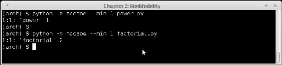
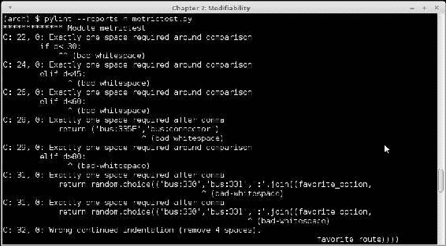
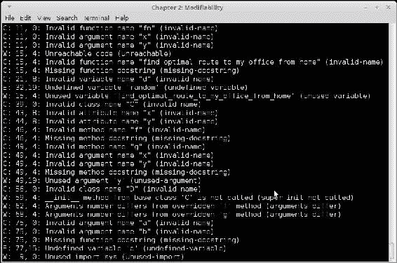
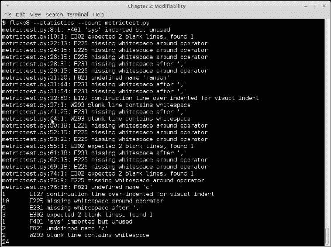
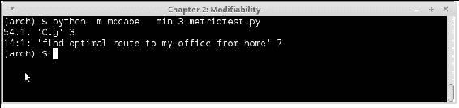
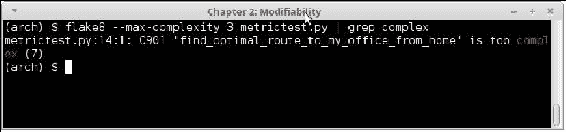
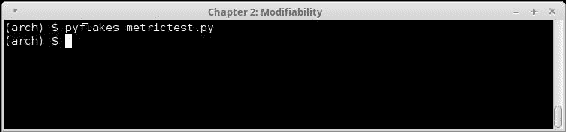
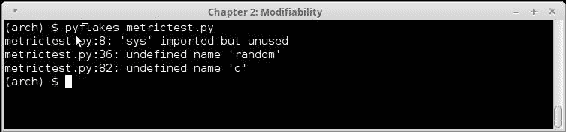
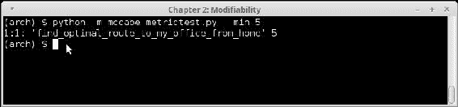
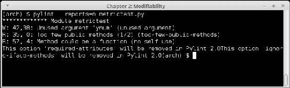

# 第二章：编写可修改和可读的代码

在第一章中，我们讨论了软件架构的各个方面，并介绍了涉及的术语的一些定义。我们看了架构师应该关注的软件架构的不同方面。在章末，我们讨论了在构建系统时架构师应该关注的各种架构质量属性。我们详细讨论了每个属性，看了一些定义，以及在构建系统以实现这些属性时应该牢记的各种关注点。

从本章开始，我们将逐一关注这些质量属性，并逐章详细讨论它们。我们将深入研究一个属性，比如它的各种因素、实现它的技术、在编程时要牢记的方面等等。由于本书的重点是 Python 及其生态系统，我们还将查看 Python 为实现和维护这些质量属性提供的各种代码示例和第三方软件支持。

本章重点关注可修改性的质量属性。

# 什么是可修改性？

可修改性的架构质量属性可以定义为：

> *可修改性是指系统可以轻松进行更改的程度，以及系统适应这些更改的灵活性。*

我们在第一章中讨论了可修改性的各个方面，如**内聚**、**耦合**等。在本章中，我们将通过一些示例更深入地挖掘这些方面。然而，在深入研究之前，看一看可修改性如何与其他与之相关的质量属性相互关联可能是个好主意。

# 与可修改性相关的方面

我们已经在上一章中看到了可修改性的一些方面。让我们进一步讨论一下，并看一看与可修改性密切相关的一些相关质量属性：

+   **可读性**：可读性可以定义为程序逻辑能够被跟随和理解的轻松程度。可读的软件是以特定风格编写的代码，遵循通常采用的编程语言的指南，并且其逻辑以简洁、清晰的方式使用语言提供的特性。

+   **模块化**：模块化意味着软件系统是以良好封装的模块编写的，这些模块执行非常具体、有文档记录的功能。换句话说，模块化代码为系统的其余部分提供了程序员友好的 API。可修改性与可重用性密切相关。

+   **可重用性**：这衡量了软件系统的各个部分（包括代码、工具、设计等）可以在系统的其他部分中零或很少修改地重复使用的数量。一个好的设计会从一开始就强调可重用性。可重用性体现在软件开发的 DRY 原则中。

+   **可维护性**：软件的可维护性是指系统可以被其预期的利益相关者轻松高效地更新并保持在有用状态的程度。可维护性是一个度量标准，包括可修改性、可读性、模块化和可测试性的方面。

在本章中，我们将深入研究可读性和可重用性/模块化方面。我们将从 Python 编程语言的背景下逐一查看这些方面。我们将首先从可读性开始。

# 理解可读性

软件系统的可读性与其可修改性密切相关。写得好、有文档记录的代码，遵循编程语言的标准或采用的实践，往往会产生简单、简洁的代码，易于阅读和修改。

可读性不仅与遵循良好的编码指南相关，而且还与逻辑的清晰程度、代码使用语言的标准特性的程度、函数的模块化程度等相关。

实际上，我们可以总结可读性的不同方面如下：

+   写得好：如果一段代码使用简单的语法，使用语言的常见特性和习语，逻辑清晰简洁，并且有意义地使用变量、函数和类/模块名称，那么它就是写得好的。

+   **文档良好**：文档通常指的是代码中的内联注释。一段文档良好的代码告诉它做了什么，它的输入参数（如果有的话）是什么，它的返回值（如果有的话）是什么，以及详细的逻辑或算法。它还记录了运行代码所需的任何外部库或 API 使用和配置，无论是内联还是在单独的文件中。

+   **格式良好**：大多数编程语言，特别是通过分布但紧密结合的编程社区在互联网上开发的开源语言，往往有良好的文档化风格指南。遵循这些缩进和格式等方面的指南的代码，往往比不遵循的代码更易读。

一般来说，不遵循这些指南的代码在可读性方面会有所欠缺。

可读性的缺乏影响了代码的可修改性，因此，维护代码的成本不断增加，主要是资源方面——主要是人力和时间——以保持系统处于有用状态。

## Python 和可读性

Python 是一种从头开始设计用于可读性的语言。借用一句著名的 Python 禅语。

> *可读性很重要*

### 提示

Python 的禅是影响 Python 编程语言设计的 20 个原则，其中 19 个已经被写下来。你可以通过打开 Python 解释器提示符并输入以下内容来查看 Python 的禅：

```py
>>>import this

```

Python 作为一种语言，强调可读性。它通过清晰、简洁的关键字实现了这一点，这些关键字模仿了它们的英语语言对应词，使用最少的运算符，并遵循以下哲学：

*应该有一种——最好只有一种——明显的方法来做到这一点。*

例如，在 Python 中迭代一个序列并打印它的索引的一种方法如下：

```py
for idx in range(len(seq)):
    item = seq[idx]
    print(idx, '=>', item)
```

然而，在 Python 中更常见的习惯是使用`enumerate()`辅助函数来进行迭代，它为序列中的每个项目返回一个两元组（`idx`，`item`）：

```py
for idx, item in enumerate(seq):
    print(idx, '=>', item)
```

在许多编程语言中，如 C++、Java 或 Ruby，第一个版本将被认为与第二个版本一样好。然而，在 Python 中，有一些写代码的习惯，它们比其他一些更符合语言的原则——Python 的禅。

在这种情况下，第二个版本更接近 Python 程序员解决问题的方式。第一种方式被认为不如第二种方式 Pythonic。

当你与 Python 社区互动时，你会经常遇到“Pythonic”这个词。它意味着代码不仅解决了问题，而且遵循了 Python 社区通常遵循的约定和习惯，并且以其预期的方式使用了语言。

### 注意

Pythonic 的定义是主观的，但你可以把它看作是 Python 代码遵循 Python 禅的方式，或者一般来说，遵循社区采用的众所周知的惯用编程实践。

Python，根据其设计原则和清晰的语法，使得编写可读代码变得容易。然而，对于从其他更为拘谨和不太符合惯用法的语言（比如 C++或 Java）迁移到 Python 的程序员来说，以一种不太符合 Python 习惯的方式编写 Python 代码是一个常见的陷阱。例如，第一个循环的版本更可能是由从这些语言迁移到 Python 的人编写，而不是已经在 Python 中编码了一段时间的人。

对于 Python 程序员来说，早期了解这一方面是很重要的，这样你在逐渐熟悉语言的过程中就更有可能编写符合习惯或 Python 风格的代码。如果你熟悉其编码原则和习惯用法，长期来看你可以更有效地使用 Python。

## 可读性-反模式

总的来说，Python 鼓励并便于编写可读代码。然而，当然，说任何用 Python 编写的代码都非常可读是非常不现实的。即使具有所有可读性的 DNA，Python 也有其公平份额的难以阅读、编写不佳或难以阅读的代码，这可以通过花一些时间浏览一些在网络上用 Python 编写的公开开源代码来明显看出。

在编程语言中有一些实践往往会产生难以阅读或难以阅读的代码。这些可以被认为是反模式，不仅在 Python 编程中是一种祸害，而且在任何编程语言中都是如此：

+   **几乎没有注释的代码**：缺乏代码注释通常是产生难以阅读的代码的主要原因。往往程序员并没有很好地记录他们的想法，这导致了特定实现方式的难以理解。当另一个程序员或同一个程序员几个月后（这种情况经常发生！）阅读相同的代码时，很难弄清为什么采用了特定的实现方式。这使得很难推理出替代方法的利弊。

这也使得在修改代码时做出决策（也许是为了修复客户问题）变得困难，并且一般来说，会影响长期的代码可修改性。代码的注释通常是编写代码的程序员的纪律和严谨的指标，也是组织强制执行这些实践的指标。

+   **违反语言最佳实践的代码**：编程语言的最佳实践通常是由开发者社区多年使用该语言的经验和高效反馈所演变而来的。它们捕捉了将编程语言有效地用于解决问题的最佳方式，通常捕捉了使用该语言的习惯用法和常见模式。

例如，在 Python 中，禅可以被认为是其最佳实践和社区采用的常见编程习惯的闪亮火炬。

通常，那些经验不足或从其他编程语言或环境迁移而来的程序员往往会产生不符合这些实践的代码，因此最终编写出了可读性较低的代码。

+   **编程反模式**：有许多编码或编程反模式，往往会产生难以阅读，因此难以维护的代码。以下是一些众所周知的反模式：

+   **意大利面代码**：没有可辨识的结构或控制流的代码片段。通常是通过遵循复杂逻辑、大量无条件跳转和无结构的异常处理、设计不良的并发结构等方式产生的。

+   **大泥球**：一个系统，其中的代码片段没有整体结构或目标。大泥球通常由许多意大利面代码片段组成，通常是代码被多人修改多次，几乎没有文档的迹象。

+   **复制粘贴编程**：通常在组织中产生，其中交付速度优先于深思熟虑的设计，复制/粘贴编码会产生长而重复的代码块，基本上一遍又一遍地做同样的事情，只是进行了微小的修改。这导致代码膨胀，并且从长远来看，代码变得难以维护。

类似的反模式是*模仿式编程*，程序员一遍又一遍地遵循相同的设计或编程模式，而不考虑它是否适合特定的场景或问题。

+   **自我编程**：自我编程是指程序员——通常是经验丰富的程序员——更喜欢他个人的风格，而不是文档化的最佳实践或组织的编码风格。这有时会产生晦涩难懂的代码，对其他人——通常是年轻或经验较少的程序员来说，阅读起来困难。一个例子是倾向于在 Python 中使用函数式编程构造将所有东西写成一行的倾向。

通过在组织中采用结构化编程的实践，并强制执行编码准则和最佳实践，可以避免编码反模式。

以下是一些特定于 Python 的反模式：

+   **混合缩进**：Python 使用缩进来分隔代码块，因为它缺少像 C/C++或 Java 这样的语言中分隔代码块的大括号或其他语法结构。然而，在 Python 中缩进代码时需要小心。一个常见的反模式是人们在他们的 Python 代码中混合使用制表符（`\t`字符）和空格。可以通过使用总是使用制表符或空格来缩进代码的编辑器来解决这个问题。

Python 自带内置模块，如*tabnanny*，可用于检查代码的缩进问题。

+   **混合字符串文字类型**：Python 提供了三种不同的创建字符串文字的方式：使用单引号（`'`）、双引号（`"`）或 Python 自己特殊的三引号（`'''`或`"""`）。在同一段代码或功能单元中混合这三种文字类型的代码会变得更难阅读。

与之相关的字符串滥用是程序员在他们的 Python 代码中使用三引号字符串来进行内联注释，而不是使用`#`字符来为他们的注释添加前缀。

+   **过度使用函数式构造**：Python 作为一种混合范式语言，通过其 lambda 关键字和`map()`、`reduce()`和`filter()`函数提供对函数式编程的支持。然而，有时，经验丰富的程序员或从函数式编程背景转到 Python 的程序员会过度使用这些构造，产生过于晦涩的代码，因此对其他程序员来说难以阅读。

## 可读性技巧

现在我们对提高 Python 代码的可读性的方法有了很好的了解，让我们看看我们可以采用的方法来改善 Python 代码的可读性。

## 记录你的代码

改善代码可读性的一个简单有效的方法是记录它的功能。文档对于代码的可读性和长期可修改性非常重要。

代码文档可以分为以下几类：

+   **内联文档**：程序员通过使用代码注释、函数文档、模块文档等作为代码本身的一部分来记录他的代码。这是最有效和有用的代码文档类型。

+   **外部文档**：这些是捕获在单独文件中的附加文档，通常记录代码的使用方式、代码更改、安装步骤、部署等方面。例如，`README`、`INSTALL`或`CHANGELOG`，通常在遵循 GNU 构建原则的开源项目中找到。

+   **用户手册**：这些是正式文件，通常由专门的人或团队编写，使用图片和通常面向系统用户的文本。这种文档通常在软件项目结束时准备和交付，当产品稳定并准备发货时。我们在这里的讨论中不关心这种类型的文档。

Python 是一种从头开始设计的智能内联代码文档的语言。在 Python 中，内联文档可以在以下级别完成：

+   **代码注释**：这是与代码一起的内联文本，以井号（`#`）字符为前缀。它们可以在代码内部自由使用，解释代码的每个步骤。

这是一个例子：

```py
# This loop performs a network fetch of the URL, retrying upto 3
# times in case of errors. In case the URL cant be fetched, 
# an error is returned.

# Initialize all state
count, ntries, result, error = 0, 3, None, None
while count < ntries:
    try:
        # NOTE: We are using an explicit   timeout of 30s here
        result = requests.get(url, timeout=30)
    except Exception as error:
        print('Caught exception', error, 'trying again after a while')
      # increment count
      count += 1
      # sleep 1 second every time
      time.sleep(1)

  if result == None:
    print("Error, could not fetch URL",url)
    # Return a tuple of (<return code>, <lasterror>)
    return (2, error)

      # Return data of URL
    return result.content
```

即使在可能被认为是多余的地方，也要大量使用注释。我们稍后将看一些关于在代码中添加注释的一般规则。

+   **函数文档字符串**：Python 提供了一种简单的方法，通过在函数定义的下方使用字符串文字来记录函数的功能。这可以通过使用三种风格的字符串文字之一来完成。

这是一个例子：

```py
def fetch_url(url, ntries=3, timeout=30):
         " Fetch a given url and return its contents "

        # This loop performs a network fetch of the URL, retrying 
        # upto
        # 3 times in case of errors. In case the URL cant be 
        # fetched,       
        # an error is returned.

        # Initialize all state
        count, result, error = 0, None, None
        while count < ntries:
            try:
                result = requests.get(url, timeout=timeout)
            except Exception as error:
                print('Caught exception', error, 'trying again after a while')
                # increment count
                count += 1
                # sleep 1 second every time
                time.sleep(1)

        if result == None:
            print("Error, could not fetch URL",url)
            # Return a tuple of (<return code>, <lasterror>)
            return (2, error)

        # Return data of URL
        return result.content
```

函数文档字符串是一行，其中写着*获取给定 URL 并返回其内容*。然而，尽管它很有用，但使用范围有限，因为它只说明函数的功能，而不解释其参数。这里是一个改进版本：

```py
def fetch_url(url, ntries=3, timeout=30):
        """ Fetch a given url and return its contents. 

        @params
            url - The URL to be fetched.
            ntries - The maximum number of retries.
            timeout - Timout per call in seconds.

        @returns
            On success - Contents of URL.
            On failure - (error_code, last_error)
        """

        # This loop performs a network fetch of the URL, 
        # retrying upto      
        # 'ntries' times in case of errors. In case the URL 
        # cant be
        # fetched, an error is returned.

        # Initialize all state
        count, result, error = 0, None, None
        while count < ntries:
            try:
                result = requests.get(url, timeout=timeout)
            except Exception as error:
                print('Caught exception', error, 'trying again after a while')
                # increment count
                count += 1
                # sleep 1 second every time
                time.sleep(1)

        if result == None:
            print("Error, could not fetch URL",url)
            # Return a tuple of (<return code>, <lasterror>)
            return (2, error)

        # Return data of the URL
        return result.content
```

在前面的代码中，函数的使用对于计划导入其定义并在其代码中使用的程序员来说变得更加清晰。请注意，这种扩展文档通常会跨越多行，因此，始终使用三引号与函数文档字符串是一个好主意。

+   **类文档字符串**：这些与函数文档字符串的工作方式相同，只是它们直接为类提供文档。这是在定义类的关键字下方提供的。

这是一个例子：

```py
class UrlFetcher(object):
         """ Implements the steps of fetching a URL.

        Main methods:
            fetch - Fetches the URL.
            get - Return the URLs data.
        """

        def __init__(self, url, timeout=30, ntries=3, headers={}):
            """ Initializer. 
            @params
                url - URL to fetch.
                timeout - Timeout per connection (seconds).
                ntries - Max number of retries.
                headers - Optional request headers.
            """
            self.url = url
            self.timeout = timeout
            self.ntries = retries
            self.headers = headers
            # Enapsulated result object
            self.result = result 

        def fetch(self):
            """ Fetch the URL and save the result """

            # This loop performs a network fetch of the URL, 
            # retrying 
            # upto 'ntries' times in case of errors. 

            count, result, error = 0, None, None
            while count < self.ntries:
                try:
                    result = requests.get(self.url,
                                          timeout=self.timeout,
                                          headers = self.headers)
                except Exception as error:
                    print('Caught exception', error, 'trying again after a while')
                    # increment count
                    count += 1
                    # sleep 1 second every time
                    time.sleep(1)

            if result != None:
                # Save result
                self.result = result

        def get(self):
            """ Return the data for the URL """

            if self.result != None:
                return self.result.content
```

查看类文档字符串如何定义类的一些主要方法。这是一个非常有用的做法，因为它在顶层为程序员提供了有用的信息，而无需去检查每个函数的文档。

+   **模块文档字符串**：模块文档字符串在模块级别捕获信息，通常是关于模块功能的信息以及模块的每个成员（函数、类和其他）的一些详细信息。语法与类或函数文档字符串相同。这些信息通常在模块代码的开头捕获。

如果模块文档还可以捕获模块的任何特定外部依赖项，如果它们不是非常明显的话，例如，导入一个不太常用的第三方包：

```py
"""
    urlhelper - Utility classes and functions to work with URLs.

    Members:

        # UrlFetcher - A class which encapsulates action of 
        # fetching
        content of a URL.
        # get_web_url - Converts URLs so they can be used on the 
        # web.
        # get_domain - Returns the domain (site) of the URL.
"""

import urllib

def get_domain(url):
    """ Return the domain name (site) for the URL"""

    urlp = urllib.parse.urlparse(url)
    return urlp.netloc

def get_web_url(url, default='http'):
    """ Make a URL useful for fetch requests
    -  Prefix network scheme in front of it if not present already
    """ 

    urlp = urllib.parse.urlparse(url)
    if urlp.scheme == '' and urlp.netloc == '':
              # No scheme, prefix default
      return default + '://' + url

    return url

class UrlFetcher(object):
     """ Implements the steps of fetching a URL.

    Main methods:
        fetch - Fetches the URL.
        get - Return the URLs data.
    """

    def __init__(self, url, timeout=30, ntries=3, headers={}):
        """ Initializer. 
        @params
            url - URL to fetch.
            timeout - Timeout per connection (seconds).
            ntries - Max number of retries.
            headers - Optional request headers.
        """
        self.url = url
        self.timeout = timeout
        self.ntries = retries
        self.headers = headers
        # Enapsulated result object
        self.result = result 

    def fetch(self):
        """ Fetch the URL and save the result """

        # This loop performs a network fetch of the URL, retrying 
        # upto 'ntries' times in case of errors. 

        count, result, error = 0, None, None
        while count < self.ntries:
            try:
                result = requests.get(self.url,
                                      timeout=self.timeout,
                                      headers = self.headers)
            except Exception as error:
                print('Caught exception', error, 'trying again after a while')
                # increment count
                count += 1
                # sleep 1 second every time
                time.sleep(1)

        if result != None:
            # Save result
            self.result = result

    def get(self):
        """ Return the data for the URL """

        if self.result != None:
            return self.result.content
```

## 遵循编码和风格指南

大多数编程语言都有一个相对知名的编码和/或风格指南。这些要么是作为惯例多年使用而形成的，要么是作为该编程语言在线社区讨论的结果。C/C++是前者的一个很好的例子，Python 是后者的一个很好的例子。

公司通常会制定自己的指南，大多数情况下是通过采用现有的标准指南，并根据公司自己的特定开发环境和要求进行定制。

对于 Python，Python 编程社区发布了一套清晰的编码风格指南。这个指南被称为 PEP-8，可以在线作为 Python 增强提案（PEP）文档的一部分找到。

### 注意

您可以在以下网址找到 PEP-8：

[`www.python.org/dev/peps/pep-0008/`](http://www.python.org/dev/peps/pep-0008/)。

PEP-8 首次创建于 2001 年，自那时以来已经经历了多次修订。主要作者是 Python 的创始人 Guido Van Rossum，Barry Warsaw 和 Nick Coghlan 提供了输入。

PEP-8 是通过调整 Guido 的原始*Python 风格指南*并加入 Barry 的风格指南而创建的。

我们不会在本书中深入讨论 PEP-8，因为本节的目标不是教你 PEP-8。然而，我们将讨论 PEP-8 的基本原则，并列出一些其主要建议。

PEP-8 的基本原则可以总结如下：

+   代码被阅读的次数比被编写的次数要多。因此，提供一个准则会使代码更易读，并使其在整个 Python 代码的全谱上保持一致。

+   项目内的一致性很重要。但是，在一个模块或包内的一致性更重要。在代码单元内（如类或函数）的一致性是最重要的。

+   知道何时忽略一个准则。例如，如果采用该准则使您的代码变得不太可读，破坏了周围的代码，或者破坏了代码的向后兼容性，那么可能会发生这种情况。学习示例，并选择最好的。

+   如果一个准则对您的组织不直接适用或有用，那么自定义它。如果您对某个准则有任何疑问，请向乐于助人的 Python 社区寻求澄清。

我们不会在这里详细介绍 PEP-8 准则。有兴趣的读者可以参考在线文档，使用这里提供的 URL。

## 审查和重构代码

代码需要维护。在生产中使用的未维护的代码可能会成为一个问题，如果不定期处理，可能会变成一个噩梦。

定期安排代码审查非常有助于保持代码的可读性和良好的健康，有助于可修改性和可维护性。在生产中对系统或应用程序至关重要的代码往往会随着时间的推移得到许多快速修复，因为它被定制或增强以适应不同的用例或为问题打补丁。观察到程序员通常不会记录这些快速修复（称为“补丁”或“热修复”），因为时间要求通常会加速立即测试和部署，而不是遵循良好的工程实践，如文档和遵循准则！

随着时间的推移，这样的补丁可能会积累，从而导致代码膨胀，并为团队创造巨大的未来工程债务，这可能会成为一项昂贵的事务。解决方案是定期审查。

审查应该由熟悉应用程序的工程师进行，但不一定要在同一段代码上工作。这给了代码一个新鲜的视角，通常有助于发现原始作者可能忽视的错误。最好让经验丰富的开发人员对大的更改进行审查。

这可以与代码的一般重构结合起来，以改进实现，减少耦合，或增加内聚。

## 注释代码

我们即将结束对代码可读性的讨论，现在是介绍一些编写代码注释时要遵循的一般经验法则的好时机。这些可以列举如下：

+   注释应该是描述性的，并解释代码。一个简单重复函数名称显而易见的注释并不是很有用。

这是一个例子。以下两个代码都展示了相同的**均方根**（**RMS**）速度计算实现，但第二个版本比第一个版本有一个更有用的`docstring`：

```py
def rms(varray=[]):
    """ RMS velocity """

    squares = map(lambda x: x*x, varray)
    return pow(sum(squares), 0.5) 

def rms(varray=[]):
    """ Root mean squared velocity. Returns
    square root of sum of squares of velocities """

    squares = map(lambda x: x*x, varray)
    return pow(sum(squares), 0.5)
```

+   代码注释应该写在我们正在评论的代码块中，而不是像下面这样：

```py
# This code calculates the sum of squares of velocities 
squares = map(lambda x: x*x, varray)
```

前一个版本比下一个版本更清晰，下一个版本使用了代码下面的注释，因为它符合从上到下的自然阅读顺序。

```py
squares = map(lambda x: x*x, varray)
# The above code calculates the sum of squares of velocities 
```

+   尽量少使用内联注释。这是因为很容易将其混淆为代码本身的一部分，特别是如果分隔注释字符被意外删除，导致错误：

```py
# Not good !
squares = map(lambda x: x*x, varray)   # Calculate squares of velocities
```

+   尽量避免多余的、增加很少价值的注释：

```py
# The following code iterates through odd numbers
for num in nums:
    # Skip if number is odd
    if num % 2 == 0: continue
```

在最后一段代码中，第二条评论增加了很少的价值，可以省略。

# 可修改性的基本原则-内聚性和耦合性

现在让我们回到代码可修改性的主题，并讨论影响代码可修改性的两个基本方面，即内聚性和耦合。

我们已经在第一章中简要讨论了这些概念。让我们在这里进行快速回顾。

内聚指的是模块的责任之间的紧密关联程度。执行特定任务或一组相关任务的模块具有高内聚性。如果一个模块在没有考虑核心功能的情况下堆积了大量功能，那么它的内聚性就会很低。

耦合是模块 A 和 B 的功能相关程度。如果两个模块的功能在代码级别（在函数或方法调用方面）有很强的重叠，那么它们就是强耦合的。对模块 A 的任何更改可能需要对模块 B 进行更改。

强耦合对可修改性总是具有禁止作用，因为它增加了维护代码库的成本。

旨在提高可修改性的代码应该追求高内聚性和低耦合性。

我们将在以下各小节中通过一些例子分析内聚和耦合。

## 衡量内聚和耦合

让我们来看一个简单的例子，有两个模块，以找出如何定量地衡量耦合和内聚。以下是模块 A 的代码，据称实现了对一系列（数组）数字进行操作的函数：

```py
"" Module A (a.py) – Implement functions that operate on series of numbers """

def squares(narray):
    """ Return array of squares of numbers """
    return pow_n(array, 2)

def cubes(narray):
    """ Return array of cubes of numbers """
    return pow_n(narray, 3)

def pow_n(narray, n):
    """ Return array of numbers raised to arbitrary power n each """
    return [pow(x, n) for x in narray]

def frequency(string, word):
    """ Find the frequency of occurrences of word in string
    as percentage """

    word_l = word.lower()
    string_l = string.lower()

    # Words in string
    words = string_l.split()
    count = w.count(word_l)

    # Return frequency as percentage
    return 100.0*count/len(words)
```

接下来是模块 B 的列表。

```py
""" Module B (b.py) – Implement functions provide some statistical methods """

import a

def rms(narray):
    """ Return root mean square of array of numbers"""

    return pow(sum(a.squares(narray)), 0.5)

def mean(array):
    """ Return mean of an array of numbers """

    return 1.0*sum(array)/len(array)

def variance(array):
    """ Return variance of an array of numbers """

    # Square of variation from mean
    avg = mean(array)
    array_d = [(x – avg) for x in array]
    variance = sum(a.squares(array_d))
    return variance

def standard_deviation(array):
    """ Return standard deviation of an array of numbers """

    # S.D is square root of variance
    return pow(variance(array), 0.5)
```

让我们对模块 A 和 B 中的函数进行分析。以下是报告：

| 模块 | 核心功能 | 无关功能 | 函数依赖 |
| --- | --- | --- | --- |
| B | 4 | 0 | 3 x 1 = 3 |
| A | 3 | 1 | 0 |

这有四个函数，可以解释如下：

+   模块 B 有四个函数，所有这些函数都涉及核心功能。在这个模块中没有与核心功能无关的函数。模块 B 的内聚性为 100%。

+   模块 A 有四个函数，其中三个与其核心功能相关，但最后一个（frequency）不相关。这使得模块 A 的内聚性约为`75%`。

+   模块 B 的三个函数依赖于模块 A 中的一个函数，即 square。这使得模块 B 与模块 A 强耦合。从模块 B 到 A 的函数级耦合为*75%*。

+   模块 A 不依赖于模块 B 的任何功能。模块 A 将独立于模块 B 工作。从模块 A 到 B 的耦合为零。

现在让我们看看如何改进模块 A 的内聚性。在这种情况下，简单地删除最后一个实际上不属于那里的函数就可以了。它可以完全删除或移动到另一个模块。

以下是重写后的模块 A 代码，现在在责任方面具有 100%的内聚性：

```py
""" Module A (a.py) – Implement functions that operate on series of numbers """

def squares(narray):
    """ Return array of squares of numbers """
    return pow_n(array, 2)

def cubes(narray):
    """ Return array of cubes of numbers """
    return pow_n(narray, 3)

def pow_n(narray, n):
    """ Return array of numbers raised to arbitrary power n each """
    return [pow(x, n) for x in narray]
```

现在让我们分析从模块 B 到 A 的耦合质量，并查看与 A 中的代码相关的 B 代码的可修改性风险因素，如下所示：

+   B 中的三个函数仅依赖于模块 A 中的一个函数。

+   该函数名为 squares，它接受一个数组并返回每个成员的平方。

+   函数签名（API）很简单，因此将来更改函数签名的可能性较小。

+   系统中没有双向耦合。依赖仅来自 B 到 A 的方向。

换句话说，尽管从 B 到 A 存在强耦合，但这是良好的耦合，并且不会以任何方式影响系统的可修改性。

现在让我们看另一个例子。

## 衡量内聚和耦合 - 字符串和文本处理

现在让我们考虑一个不同的用例，一个涉及大量字符串和文本处理的函数的例子：

```py
""" Module A (a.py) – Provides string processing functions """
import b

def ntimes(string, char):
    """ Return number of times character 'char'
    occurs in string """

    return string.count(char)

def common_words(text1, text2):
    """ Return common words across text1 and text2"""

    # A text is a collection of strings split using newlines
    strings1 = text1.split("\n")
    strings2 = text2.split("\n")

    common = []
    for string1 in strings1:
        for string2 in strings2:
            common += b.common(string1, string2)

    # Drop duplicates
    return list(set(common))
```

接下来是模块 B 的列表，如下所示：

```py
""" Module B (b.py) – Provides text processing functions to user """

import a

def common(string1, string2):
    """ Return common words across strings1 1 & 2 """

    s1 = set(string1.lower().split())
    s2 = set(string2.lower().split())
    return s1.intersection(s2)    

def common_words(text1, text2):
    """ Return common words across two input files """

    lines1 = open(filename1).read()
    lines2 = open(filename2).read()

    return a.common_words(lines1, lines2)
```

让我们来看一下这些模块的耦合和内聚分析，如下表所示：

| 模块 | 核心功能 | 无关功能 | 函数依赖 |
| --- | --- | --- | --- |
| B | 2 | 0 | 1 x 1 = 1 |
| A | 2 | 0 | 1 x 1 = 1 |

以下是表中这些数字的解释：

+   模块 A 和 B 各有两个函数，每个函数都处理核心功能。模块 A 和 B 都具有*100%*的内聚。

+   模块 A 的一个函数依赖于模块 B 的一个函数。同样，模块 B 的一个函数依赖于模块 A 的一个函数。从 A 到 B 有强耦合，从 B 到 A 也是如此。换句话说，耦合是双向的。

两个模块之间的双向耦合会使它们的可修改性之间产生非常强烈的联系。模块 A 的任何更改都会迅速影响模块 B 的行为，反之亦然。换句话说，这是不好的耦合。

# 探索可修改性的策略

现在我们已经看到了一些好的和坏的耦合和内聚的例子，让我们来看看软件设计师或架构师可以使用的策略和方法，以减少这些方面对可修改性的影响，从而改进软件系统的可修改性。

## 提供明确的接口

一个模块应该标记一组函数、类或方法作为其提供给外部代码的**接口**。这可以被视为该模块的 API，从中导出。使用此 API 的任何外部代码都将成为该模块的客户端。

模块认为是其内部功能的方法或函数，不构成其 API 的，应该明确地作为模块的私有部分，或者应该被记录为这样的部分。

在 Python 中，函数或类方法没有提供变量访问范围，可以通过约定来实现，例如在函数名前加上单下划线或双下划线，从而向潜在客户表明这些函数是内部函数，不应该从外部引用。

## 减少双向依赖

如前面的例子所示，如果耦合方向是单向的，那么两个软件模块之间的耦合是可以管理的。然而，双向耦合会在模块之间创建非常强的联系，这可能会使模块的使用复杂化，并增加其维护成本。

在像 Python 这样使用基于引用的垃圾收集的语言中，这也可能为变量和对象创建难以理解的引用循环，从而使它们的垃圾收集变得困难。

通过重构代码的方式打破双向依赖，使一个模块始终使用另一个模块，而不是反之。换句话说，将所有相关函数封装在同一个模块中。

以下是我们之前例子中的模块 A 和 B，重写以打破它们的双向依赖：

```py
    """ Module A (a.py) – Provides string processing functions """

    def ntimes(string, char):
        """ Return number of times character 'char'
        occurs in string """

        return string.count(char)

    def common(string1, string2):
        """ Return common words across strings1 1 & 2 """

        s1 = set(string1.lower().split())
        s2 = set(string2.lower().split())
        return s1.intersection(s2)  

    def common_words(text1, text2):
        """ Return common words across text1 and text2"""

        # A text is a collection of strings split using newlines
        strings1 = text1.split("\n")
        strings2 = text2.split("\n")

        common_w = []
        for string1 in strings1:
            for string2 in strings2:
                common_w += common(string1, string2)

        return list(set(common_w))
```

接下来是模块 B 的清单。

```py
  """ Module B (b.py) – Provides text processing functions to user """

  import a

  def common_words(filename1, filename2):
    """ Return common words across two input files """

    lines1 = open(filename1).read()
    lines2 = open(filename2).read()

    return a.common_words(lines1, lines2)
```

我们通过简单地将模块 B 中从两个字符串中选择共同单词的函数`common`移动到模块 A 来实现这一点。这是改进可修改性的重构的一个例子。

## 抽象共同服务

使用抽象共同函数和方法的辅助模块可以减少两个模块之间的耦合，并增加它们的内聚。例如，在第一个例子中，模块 A 充当了模块 B 的辅助模块。在第二个例子中，重构后，模块 A 也充当了模块 B 的辅助模块。

辅助模块可以被视为中介或调解者，它们为其他模块提供共同服务，以便依赖代码都在一个地方进行抽象，避免重复。它们还可以通过将不需要或不相关的函数移动到合适的辅助模块来帮助模块增加它们的内聚。

## 使用继承技术

当我们发现类中出现相似的代码或功能时，可能是时候对其进行重构，以创建类层次结构，以便通过继承共享公共代码。

让我们看下面的例子：

```py
""" Module textrank - Rank text files in order of degree of a specific word frequency. """

import operator

class TextRank(object):
    """ Accept text files as inputs and rank them in
    terms of how much a word occurs in them """

    def __init__(self, word, *filenames):
        self.word = word.strip().lower()
        self.filenames = filenames

    def rank(self):
        """ Rank the files. A tuple is returned with
        (filename, #occur) in decreasing order of
        occurences """

        occurs = []

        for fpath in self.filenames:
            data = open(fpath).read()
            words = map(lambda x: x.lower().strip(), data.split())
            # Filter empty words
            count = words.count(self.word)
            occurs.append((fpath, count))

        # Return in sorted order
        return sorted(occurs, key=operator.itemgetter(1), reverse=True)
```

这里是另一个模块`urlrank`，它在 URL 上执行相同的功能：

```py
    """ Module urlrank - Rank URLs in order of degree of a specific word frequency """
    import operator
import operator
import requests

class UrlRank(object):
    """ Accept URLs as inputs and rank them in
    terms of how much a word occurs in them """

    def __init__(self, word, *urls):
        self.word = word.strip().lower()
        self.urls = urls

    def rank(self):
        """ Rank the URLs. A tuple is returned with
        (url, #occur) in decreasing order of
        occurences """

        occurs = []

        for url in self.urls:
            data = requests.get(url).content
            words = map(lambda x: x.lower().strip(), data.split())
            # Filter empty words
            count = words.count(self.word)
            occurs.append((url, count))

        # Return in sorted order
        return sorted(occurs, key=operator.itemgetter(1), reverse=True)
```

这两个模块都执行类似的功能，即根据给定关键字在一组输入数据中出现的频率对其进行排名。随着时间的推移，这些类可能会开发出许多相似的功能，组织可能会出现大量重复的代码，降低了可修改性。

我们可以使用继承来帮助我们在父类中抽象出通用逻辑。这里是名为`RankBase`的父类，通过将所有通用代码移动到自身来实现这一点：

```py
""" Module rankbase - Logic for ranking text using degree of word frequency """

import operator

class RankBase(object):
    """ Accept text data as inputs and rank them in
    terms of how much a word occurs in them """

    def __init__(self, word):
        self.word = word.strip().lower()

    def rank(self, *texts):
        """ Rank input data. A tuple is returned with
        (idx, #occur) in decreasing order of
        occurences """

        occurs = {}

        for idx,text in enumerate(texts):
            # print text
            words = map(lambda x: x.lower().strip(), text.split())
            count = words.count(self.word)
            occurs[idx] = count

        # Return dictionary
        return occurs

    def sort(self, occurs):
        """ Return the ranking data in sorted order """

        return sorted(occurs, key=operator.itemgetter(1), reverse=True)
```

现在我们已经重写了`textrank`和`urlrank`模块，以利用父类中的逻辑：

```py
""" Module textrank - Rank text files in order of degree of a specific word frequency. """

import operator
from rankbase import RankBase

class TextRank(object):
    """ Accept text files as inputs and rank them in
    terms of how much a word occurs in them """

    def __init__(self, word, *filenames):
        self.word = word.strip().lower()
        self.filenames = filenames

    def rank(self):
        """ Rank the files. A tuple is returned with
        (filename, #occur) in decreasing order of
        occurences """

        texts = map(lambda x: open(x).read(), self.filenames)
        occurs = super(TextRank, self).rank(*texts)
        # Convert to filename list
        occurs = [(self.filenames[x],y) for x,y in occurs.items()]

        return self.sort(occurs)
```

这是`urlrank`模块的修改列表：

```py
""" Module urlrank - Rank URLs in order of degree of a specific word frequency """

import requests
from rankbase import RankBase

class UrlRank(RankBase):
    """ Accept URLs as inputs and rank them in
    terms of how much a word occurs in them """

def __init__(self, word, *urls):
    self.word = word.strip().lower()
    self.urls = urls

def rank(self):
    """ Rank the URLs. A tuple is returned with
    (url, #occur) in decreasing order of
    occurences"""

    texts = map(lambda x: requests.get(x).content, self.urls)
    # Rank using a call to parent class's 'rank' method
    occurs = super(UrlRank, self).rank(*texts)
    # Convert to URLs list
    occurs = [(self.urls[x],y) for x,y in occurs.items()]

    return self.sort(occurs)
```

重构不仅减少了每个模块中代码的大小，还通过将通用代码抽象到父模块/类中，从而改善了类的可修改性，这可以独立开发。

## 使用后期绑定技术

后期绑定是指尽可能晚地将值绑定到代码执行顺序中的参数的做法。后期绑定允许程序员推迟影响代码执行的因素，从而推迟执行结果和代码性能，通过使用多种技术。

以下是一些可以使用的后期绑定技术：

+   **插件机制**：这种技术使用在运行时解析的值来加载插件，执行特定的依赖代码，而不是静态地将模块绑定在一起，这会增加耦合。插件可以是 Python 模块，其名称在运行时的计算中获取，也可以是从数据库查询或配置文件中加载的 ID 或变量名称。

+   **经纪人/注册表查找服务**：某些服务可以完全推迟到经纪人，经纪人根据需要从注册表中查找服务名称，并动态调用并返回结果。例如，货币兑换服务可以接受特定货币转换作为输入（例如 USDINR），并在运行时动态查找和配置服务，因此系统在任何时候只需要相同的代码执行。由于系统上没有依赖于输入的代码，系统不会受到任何变化的影响，因此它被推迟到外部服务。

+   **通知服务**：发布/订阅机制在对象值发生变化或事件发布时通知订阅者，对于将系统与易变参数及其值解耦非常有用。这些系统不会在内部跟踪这些变量/对象的变化，而是将客户端仅绑定到外部 API，该 API 仅通知客户端值的变化。

+   **部署时间绑定**：通过将变量值与名称或 ID 关联到配置文件中，我们可以将对象/变量绑定推迟到部署时间。软件系统在启动时通过加载配置文件绑定值，然后调用创建适当对象的代码路径。

这种方法可以与工厂等面向对象模式结合使用，工厂可以在运行时根据名称或 ID 创建所需的对象，从而使依赖于这些对象的客户端免受任何内部更改的影响，增加了它们的可修改性。

+   **使用创建型模式**：创建型设计模式（如工厂或生成器）将对象的创建任务与创建细节抽象出来，非常适合客户端模块的关注点分离，这些模块不希望在创建依赖对象的代码发生更改时修改它们的代码。

这些方法与部署/配置时间或动态绑定（使用查找服务）相结合，可以极大地增加系统的灵活性，并帮助其可修改性。

我们将在本书的后面章节中看一些 Python 模式的例子。

# 度量标准-静态分析工具

静态代码分析工具可以提供关于代码静态属性的丰富摘要信息，可以提供有关代码复杂性和可修改性/可读性等方面的见解。

Python 有很多第三方工具支持，可以帮助衡量 Python 代码的静态方面，比如：

+   遵守编码规范，如 PEP-8

+   像 McCabe 度量这样的代码复杂度指标

+   代码中的错误，如语法错误、缩进问题、缺少导入、变量覆盖等

+   代码中的逻辑问题

+   代码异味

以下是 Python 生态系统中一些最流行的工具，可以进行静态分析：

+   **Pylint**：Pylint 是 Python 代码的静态检查器，可以检测一系列的编码错误、代码异味和风格错误。Pylint 使用接近 PEP-8 的风格。较新版本的 Pylint 还提供有关代码复杂性的统计信息，并可以打印报告。Pylint 要求在检查代码之前执行代码。您可以参考[`pylint.org`](http://pylint.org)链接。

+   **Pyflakes**：Pyflakes 是一个比 Pylint 更新的项目。它与 Pylint 的不同之处在于，在检查代码错误之前，它不需要执行代码。Pyflakes 不检查编码风格错误，只在代码中执行逻辑检查。您可以参考[`launchpad.net/pyflakes`](https://launchpad.net/pyflakes)链接。

+   **McCabe**：这是一个检查并打印代码 McCabe 复杂度报告的脚本。您可以参考[`pypi.python.org/pypi/mccabe`](http://pypi.python.org/pypi/mccabe)链接。

+   **Pycodestyle**：Pycodestyle 是一个检查 Python 代码是否符合 PEP-8 指南的工具。这个工具以前被称为 PEP-8。请参考[`github.com/PyCQA/pycodestyle`](http://github.com/PyCQA/pycodestyle)链接。

+   **Flake8**：Flake8 是 Pyflakes、McCabe 和 pycodestyle 工具的包装器，可以执行一些检查，包括这些工具提供的检查。请参考[`gitlab.com/pycqa/flake8/`](http://gitlab.com/pycqa/flake8/)链接。

## 什么是代码异味？

**代码异味**是代码中更深层次问题的表面症状。它们通常表明设计上存在问题，可能会导致将来的错误或对特定代码段的开发产生负面影响。

代码异味本身并不是错误，而是指示代码解决问题的方法不正确，并且应该通过重构来修复的模式。

一些常见的代码异味包括：

在类级别：

+   **God Object**：一个试图做太多事情的类。简而言之，这个类缺乏任何形式的内聚性。

+   **Constant Class**：一个仅仅是常量集合的类，被其他地方使用，因此理想情况下不应该存在于这里。

+   **Refused Bequest**：一个不遵守基类合同的类，因此违反了继承的替换原则。

+   **Freeloader**：一个函数太少的类，几乎什么都不做，价值很小。

+   **Feature Envy**：一个过度依赖另一个类方法的类，表明耦合度很高。

在方法/函数级别：

+   **Long method**：一个变得太大和复杂的方法或函数。

+   **Parameter creep**：函数或方法的参数太多。这使得函数的可调用性和可测试性变得困难。

+   **圈复杂度**：具有太多分支或循环的函数或方法，这会导致复杂的逻辑难以跟踪，并可能导致微妙的错误。这样的函数应该被重构并拆分为多个函数，或者重写逻辑以避免过多的分支。

+   **过长或过短的标识符**：使用过长或过短的变量名的函数，使得它们的用途无法从它们的名称中清楚地看出。对函数名称也适用相同的规则。

与代码异味相关的反模式是设计异味，这些是系统设计中的表面症状，表明架构中存在更深层次的问题。

## 圈复杂度 – McCabe 度量

圈复杂度是计算机程序复杂性的一种度量。它被计算为程序源代码从开始到结束的线性独立路径的数量。

对于没有任何分支的代码片段，例如接下来给出的代码，圈复杂度将为`1`，因为代码只有一条路径。

```py
""" Module power.py """

def power(x, y):
    """ Return power of x to y """
    return x^y
```

具有一个分支的代码片段，如下面的代码，复杂度将为 2：

```py
""" Module factorial.py """

def factorial(n):
    """ Return factorial of n """
    if n == 0:
        return 1
    else:
        return n*factorial(n-1)
```

使用代码的控制图作为度量标准的圈复杂度是由 Thomas J. McCabe 于 1976 年开发的。因此，它也被称为 McCabe 复杂度或 McCabe 指数。

为了测量度量标准，控制图可以被描绘为一个有向图，其中节点表示程序的块，边表示从一个块到另一个块的控制流。

关于程序的控制图，McCabe 复杂度可以表示如下：

*M = E - N + 2P*

其中，

*E => 图中的边数*

*N => 图中的节点数*

*P => 图中的连通分量数*

在 Python 中，可以使用由 Ned Batcheldor 编写的`mccabe`包来测量程序的圈复杂度。它可以作为独立模块使用，也可以作为 Flake8 或 Pylint 等程序的插件使用。

例如，这里是我们如何测量前面给出的两个代码片段的圈复杂度：



一些示例 Python 程序的 McCabe 度量

参数`–min`告诉`mccabe`模块从给定的 McCabe 指数开始测量和报告。

### 测试度量标准

现在让我们尝试一下前面提到的一些工具，并在一个示例模块上使用它们，以找出这些工具报告了什么样的信息。

### 注意

以下各节的目的不是教授读者如何使用这些工具或它们的命令行选项——这些可以通过工具的文档来学习。相反，目的是探索这些工具在代码的样式、逻辑和其他问题方面提供的深度和丰富信息。

为了进行这项测试，使用了以下人为构造的模块示例。它故意写有许多编码错误、样式错误和编码异味。

由于我们使用的工具按行号列出错误，因此代码已经被呈现为带有编号的行，以便轻松地将工具的输出追溯到代码：

```py
     1  """
     2  Module metrictest.py
     3  
     4  Metric example - Module which is used as a testbed for static checkers.
     5  This is a mix of different functions and classes doing different things.
     6  
     7  """
     8  import random
     9  
    10  def fn(x, y):
    11      """ A function which performs a sum """
    12      return x + y
    13  
    14  def find_optimal_route_to_my_office_from_home(start_time,
    15                                      expected_time,
    16                                      favorite_route='SBS1K',
    17                                      favorite_option='bus'):
    18  
    19      # If I am very late, always drive.
    20      d = (expected_time – start_time).total_seconds()/60.0
    21  
    22      if d<=30:
    23          return 'car'
    24  
    25      # If d>30 but <45, first drive then take metro
    26      if d>30 and d<45:
    27          return ('car', 'metro')
    28  
    29      # If d>45 there are a combination of options
    30      if d>45:
    31          if d<60:
    32              # First volvo,then connecting bus
    33              return ('bus:335E','bus:connector')
    34          elif d>80:
    35              # Might as well go by normal bus
    36              return random.choice(('bus:330','bus:331',':'.join((favorite_option,
    37                           favorite_route))))
    38          elif d>90:
    39              # Relax and choose favorite route
    40              return ':'.join((favorite_option,
    41                               favorite_route))
    42  
    43      
    44  class C(object):
    45      """ A class which does almost nothing """
    46  
    47      def __init__(self, x,y):
    48          self.x = x
    49          self.y = y
    50          
    51      def f(self):
    52          pass
    53  
    54      def g(self, x, y):
    55  
    56          if self.x>x:
    57              return self.x+self.y
    58          elif x>self.x:
    59              return x+ self.y
    60  
    61  class D(C):
    62      """ D class """
    63  
    64      def __init__(self, x):
    65          self.x = x
    66  
    67      def f(self, x,y):
    68          if x>y:
    69              return x-y
    70          else:
    71              return x+y
    72  
    73      def g(self, y):
    74  
    75          if self.x>y:
    76              return self.x+y
    77          else:
    78              return y-self.x
```

## 运行静态检查器

让我们看看 Pylint 对我们相当可怕的测试代码的看法。

### 注意

Pylint 打印了许多样式错误，但由于这个示例的目的是专注于逻辑问题和代码异味，因此日志只显示了从这些报告开始。

```py
$ pylint –reports=n metrictest.py

```

以下是两个截图中捕获的详细输出：



图 2. 测量测试程序的 Pylint 输出（第 1 页）

再看另一张截图：



测量测试程序的 Pylint 输出（第 2 页）

让我们专注于 Pylint 报告的最后 10-20 行非常有趣的部分，跳过早期的样式和约定警告。

以下是分类为表格的错误。为了保持表格的简洁，我们已跳过了类似的情况：

| 错误 | 出现次数 | 说明 | 代码异味类型 |
| --- | --- | --- | --- |
| 无效的函数名称 | 函数`fn` | 名称`fn`太短，无法解释函数的作用 | 标识符太短 |
| 无效的变量名称 | 函数`f`的变量`x`，`y` | 名称`x`，`y`太短，无法指示变量代表什么 | 标识符太短 |
| 无效的函数名称 | 函数名称`find_optimal_route_to_my_office_from_home` | 函数名称太长 | 标识符太长 |
| 无效的变量名称 | 函数`find_optimal`的变量`d` | 名称`d`太短，无法指示变量代表什么 | 标识符太短 |
| 无效的类名 | 类`C` | 名称`C`不表明类的任何信息 | 标识符太短 |
| 无效的方法名称 | 类`C`：方法`f` | 名称`f`太短，无法解释其作用 | 标识符太短 |
| 无效的`__init__`方法 | 类`D`：方法`__init__` | 不调用基类的`__init__` | 与基类的合同违约 |
| `f`的参数在类`D`中与类`C`不同 | 类`D`：方法`f` | 方法签名与基类的签名不符 | 拒绝继承 |
| `g`的参数在类`D`中与类`C`不同 | 类`D`：方法`g` | 方法签名与基类的签名不符 | 拒绝继承 |

正如您所看到的，Pylint 检测到了许多代码异味，我们在上一节中讨论过。其中一些最有趣的是它如何检测到荒谬的长函数名称，以及子类 D 如何在其`__init__`和其他方法中违反了与基类`C`的合同。 

让我们看看`flake8`对我们的代码有什么看法。我们将运行它以报告错误计数的统计和摘要：

```py
$  flake8 --statistics --count metrictest.py

```



图 4。度量测试程序的 flake8 静态检查输出

正如您所期望的那样，这个工具大部分是按照 PEP-8 约定编写的，报告的错误都是样式和约定错误。这些错误对于提高代码的可读性并使其更接近 PEP-8 的样式指南是有用的。

### 注意

通过将选项“-show-pep8”传递给 Flake8，您可以获取有关 PEP-8 测试的更多信息。

现在是检查我们的代码复杂性的好时机。首先，我们将直接使用`mccabe`，然后通过 Flake8 调用它：



度量测试程序的 mccabe 复杂度

正如预期的那样，办公室路线函数的复杂性太高，因为它有太多的分支和子分支。

由于`flake8`打印了太多的样式错误，我们将专门搜索复杂性的报告：



由 flake8 报告的度量测试程序的 mccabe 复杂度

正如预期的那样，Flake8 报告了函数`find_optimal_route_to_my_office_from_home`的复杂性太高。

### 注意

还有一种方法可以从 Pylint 作为插件运行`mccabe`，但由于涉及一些配置步骤，我们将不在这里介绍。

最后一步，让我们在代码上运行`pyflakes`：



pyflakes 对度量测试代码的静态分析输出

没有输出！因此，Pyflakes 在代码中找不到任何问题。原因是 PyFlakes 是一个基本的检查器，除了明显的语法和逻辑错误、未使用的导入、缺少变量名称和类似的问题外，它不报告任何其他问题。

让我们在我们的代码中添加一些错误，然后重新运行 Pyflakes。以下是带有行号的调整后的代码：

```py
     1  """
     2  Module metrictest.py
     3  
     4  Metric example - Module which is used as a testbed for static checkers.
     5  This is a mix of different functions and classes doing different things.
     6  
     7  """
     8  import sys
     9  
    10  def fn(x, y):
    11      """ A function which performs a sum """
    12      return x + y
    13  
    14  def find_optimal_route_to_my_office_from_home(start_time,
    15                                      expected_time,
    16                                      favorite_route='SBS1K',
    17                                      favorite_option='bus'):
    18  
    19      # If I am very late, always drive.
    20      d = (expected_time – start_time).total_seconds()/60.0
    21  
    22      if d<=30:
    23          return 'car'
    24  
    25      # If d>30 but <45, first drive then take metro
    26      if d>30 and d<45:
    27          return ('car', 'metro')
    28  
    29      # If d>45 there are a combination of options
    30      if d>45:
    31          if d<60:
    32              # First volvo,then connecting bus
    33              return ('bus:335E','bus:connector')
    34          elif d>80:
    35              # Might as well go by normal bus
    36              return random.choice(('bus:330','bus:331',':'.join((favorite_option,
    37                           favorite_route))))
    38          elif d>90:
    39              # Relax and choose favorite route
    40              return ':'.join((favorite_option,
    41                               favorite_route))
    42  
    43      
    44  class C(object):
    45      """ A class which does almost nothing """
    46  
    47      def __init__(self, x,y):
    48          self.x = x
    49          self.y = y
    50          
    51      def f(self):
    52          pass
    53  
    54      def g(self, x, y):
    55  
    56          if self.x>x:
    57              return self.x+self.y
    58          elif x>self.x:
    59              return x+ self.y
    60  
    61  class D(C):
    62      """ D class """
    63  
    64      def __init__(self, x):
    65          self.x = x
    66  
    67      def f(self, x,y):
    68          if x>y:
    69              return x-y
    70          else:
    71              return x+y
    72  
    73      def g(self, y):
    74  
    75          if self.x>y:
    76              return self.x+y
    77          else:
    78              return y-self.x
    79  
    80  def myfunc(a, b):
    81      if a>b:
    82          return c
    83      else:
    84          return a
```

看一下以下输出： 



图 8。修改后的度量测试代码的 pyflakes 静态分析输出

Pyflakes 现在返回一些有用的信息，例如缺少名称（random）、未使用的导入（`sys`）和新引入函数`myfunc`中的未定义名称（变量`c`）。因此，它对代码进行了一些有用的静态分析。例如，有关缺少和未定义名称的信息对于修复前面代码中的明显错误很有用。

### 提示

在编写代码后，运行 Pylint 和/或 Pyflakes 对代码进行报告和查找逻辑和语法错误是个好主意。要运行 Pylint 仅报告错误，使用-E 选项。要运行 Pyflakes，只需按照前面的示例。

# 重构代码

现在我们已经看到静态工具如何用于报告我们 Python 代码中的各种错误和问题，让我们做一个简单的重构练习。我们将以我们编写不好的度量测试模块作为用例（它的第一个版本），并执行一些重构步骤。

在进行重构时，我们将遵循以下大致指南：

1.  **首先修复复杂代码**：这将大量代码放在一边，因为通常情况下，当复杂的代码被重构时，我们最终会减少代码行数。这将全面改善代码质量，并减少代码异味。您可能会在这里创建新的函数或类，因此最好先执行此步骤。

1.  **现在对代码进行分析**：在这一步运行复杂性检查器是个好主意，看看代码的整体复杂性——类/模块或函数——是否有所减少。如果没有，再次迭代。

1.  **接下来修复代码异味**：接下来修复任何与代码异味有关的问题——类、函数或模块。这将使您的代码变得更好，并且还会改善整体语义。

1.  **运行检查器**：现在在代码上运行 Pylint 等检查器，并获取有关代码异味的报告。理想情况下，它们应该接近零，或者与原始值相比大大减少。

1.  **修复低悬果**：最后修复低悬果，如代码风格和约定错误。这是因为在重构过程中，试图减少复杂性和代码异味时，通常会引入或删除大量代码。因此，在较早的阶段尝试改进编码约定是没有意义的。

1.  **使用工具进行最终检查**：您可以运行 Pylint 检查代码异味，运行 Flake8 检查 PEP-8 约定，运行 Pyflakes 捕获逻辑、语法和缺少变量问题。

这是一个逐步演示，使用下一节中的方法修复我们编写不好的度量测试模块的过程。

## 重构代码-修复复杂性

大部分复杂性在 office route 函数中，所以让我们尝试修复它。这是重写的版本（仅显示该函数）：

```py
def find_optimal_route_to_my_office_from_home(start_time,
                                              expected_time,
                                              favorite_route='SBS1K',
                                              favorite_option='bus'):

        # If I am very late, always drive.
        d = (expected_time - start_time).total_seconds()/60.0

        if d<=30:
            return 'car'
        elif d<45:
            return ('car', 'metro')
        elif d<60:
            # First volvo,then connecting bus
            return ('bus:335E','bus:connector')
        elif d>80:
            # Might as well go by normal bus
            return random.choice(('bus:330','bus:331',':'.join((favorite_option,
                                         favorite_route))))
        # Relax and choose favorite route
        return ':'.join((favorite_option, favorite_route))
```

在前面的重写中，我们摆脱了多余的 if.. else 条件。现在让我们检查一下复杂性：



重构步骤#1 后度量测试程序的 mccabe 度量

我们已经将复杂性从`7`降低到`5`。我们能做得更好吗？

在以下代码片段中，代码被重写为使用值范围作为键，相应的返回值作为值。这大大简化了我们的代码。此外，之前的默认返回最终永远不会被选中，所以现在它被移除了，从而消除了一个分支，并减少了一个复杂性。代码变得简单多了：

```py
deffind_optimal_route_to_my_office_from_home(start_time,
    expected_time,
    favorite_route='SBS1K',
    favorite_option='bus'):

    # If I am very late, always drive.
    d = (expected_time – start_time).total_seconds()/60.0
    options = { range(0,30): 'car',
    range(30, 45): ('car','metro'),
    range(45, 60): ('bus:335E','bus:connector') }

if d<80:
# Pick the range it falls into
for drange in options:
    if d in drange:
    return drange[d]

    # Might as well go by normal bus
    return random.choice(('bus:330','bus:331',':'.join((favorite_option, favorite_route))))

```


重构步骤#2 后度量测试程序的 mccabe 度量

该函数的复杂性现在降低到`4`，这是可以管理的。

## 重构代码-修复代码异味

下一步是修复代码异味。幸运的是，我们有一个非常好的列表来自上一次分析，所以这并不太困难。大多数情况下，我们需要更改函数名称、变量名称，并且还需要从子类到基类修复合同问题。

这是所有修复的代码：

```py
""" Module metrictest.py - testing static quality metrics of Python code """

import random

def sum_fn(xnum, ynum):
    """ A function which performs a sum """

    return xnum + ynum

def find_optimal_route(start_time,
                       expected_time,
                       favorite_route='SBS1K',
                       favorite_option='bus'):
    """ Find optimal route for me to go from home to office """

    # Time difference in minutes - inputs must be datetime instances
    tdiff = (expected_time - start_time).total_seconds()/60.0

    options = {range(0, 30): 'car',
               range(30, 45): ('car', 'metro'),
               range(45, 60): ('bus:335E', 'bus:connector')}

    if tdiff < 80:
        # Pick the range it falls into
        for drange in options:
            if tdiff in drange:
                return drange[tdiff]

    # Might as well go by normal bus
    return random.choice(('bus:330', 'bus:331', ':'.join((favorite_option,
                                    favorite_route))))

class MiscClassC(object):
    """ A miscellaneous class with some utility methods """

    def __init__(self, xnum, ynum):
        self.xnum = xnum
        self.ynum = ynum

    def compare_and_sum(self, xnum=0, ynum=0):
        """ Compare local and argument variables
        and perform some sums """

        if self.xnum > xnum:
            return self.xnum + self.ynum
        else:
            return xnum + self.ynum

class MiscClassD(MiscClassC):
    """ Sub-class of MiscClassC overriding some methods """

    def __init__(self, xnum, ynum=0):
        super(MiscClassD, self).__init__(xnum, ynum)

    def some_func(self, xnum, ynum):
        """ A function which does summing """

        if xnum > ynum:
            return xnum - ynum
        else:
            return xnum + ynum

    def compare_and_sum(self, xnum=0, ynum=0):
        """ Compare local and argument variables
        and perform some sums """

        if self.xnum > ynum:
            return self.xnum + ynum
        else: 
            return ynum - self.xnum

```

让我们在这段代码上运行 Pylint，看看这次它输出了什么：



重构后的度量测试程序的 Pylint 输出

您会发现代码异味的数量已经减少到接近零，除了缺少`public`方法的投诉，以及类`MiscClassD`的方法`some_func`可以是一个函数的洞察，因为它不使用类的任何属性。

### 注意

我们已经使用选项`–reports=n`调用了 Pylint，以避免 Pylint 打印其摘要报告，因为这样会使整个输出太长而无法在此处显示。可以通过调用 Pylint 而不带任何参数来启用这些报告。

## 重构代码-修复样式和编码问题

现在我们已经解决了主要的代码问题，下一步是修复代码风格和约定错误。然而，为了缩短步骤数量和在本书中打印的代码量，这已经与最后一步合并，正如您可能从 Pylint 的输出中猜到的那样。

除了一些空白警告之外，所有问题都已解决。

这完成了我们的重构练习。

# 摘要

在本章中，我们看了修改性的架构质量属性及其各个方面。我们详细讨论了可读性，包括可读性反模式以及一些编码反模式。在讨论过程中，我们了解到 Python 从根本上就是一种为了可读性而编写的语言。

我们看了改进代码可读性的各种技术，并花了一些时间讨论了代码注释的各个方面，并在函数、类和模块级别上看了 Python 的文档字符串。我们还看了 PEP-8，这是 Python 的官方编码约定指南，并了解到持续重构代码对于保持其可修改性并在长期内减少维护成本是很重要的。

然后，我们看了一些代码注释的经验法则，并讨论了代码的修改性基本原理，即代码的耦合性和内聚性。我们用一些例子看了不同情况下的耦合和内聚。然后我们讨论了改进代码修改性的策略，比如提供明确的接口或 API、避免双向依赖、将常见服务抽象到辅助模块中，以及使用继承技术。我们看了一个例子，通过继承重构了一个类层次结构，以抽象出共同的代码并改进系统的修改性。

最后，我们列出了提供 Python 静态代码度量的不同工具，如 PyLint、Flake8、PyFlakes 等。我们通过一些例子了解了 McCabe 圈复杂度。我们还了解了代码异味是什么，并进行了重构练习，以逐步改进代码的质量。

在下一章中，我们将讨论软件架构的另一个重要质量属性，即可测试性。
