# 第三章：可测试性 - 编写可测试代码

在上一章中，我们涵盖了软件的一个非常重要的架构属性，即可修改性及其相关方面。在本章中，我们将讨论软件的一个与之密切相关的质量属性——软件的可测试性。

在本书的第一章中，我们简要介绍了可测试性，了解了可测试性是什么，以及它与代码复杂性的关系。在本章中，我们将详细探讨软件可测试性的不同方面。

软件测试本身已经发展成一个拥有自己标准和独特工具和流程的大领域。本章的重点不是涵盖软件测试的正式方面。相反，我们在这里将努力从架构的角度理解软件测试，了解它与其他质量属性的关系，并在本章的后半部分讨论与我们在 Python 中使用软件测试相关的 Python 工具和库。

# 理解可测试性

可测试性可以定义如下：

> *“软件系统通过基于执行的测试轻松暴露其故障的程度”*

具有高可测试性的软件系统通过测试提供了其故障的高度暴露，从而使开发人员更容易访问系统的问题，并允许他们更快地找到和修复错误。另一方面，可测试性较低的系统会使开发人员难以找出其中的问题，并且往往会导致生产中的意外故障。

因此，可测试性是确保软件系统在生产中的质量、稳定性和可预测性的重要方面。

## 软件的可测试性和相关属性

如果软件系统能够很容易地向测试人员暴露其故障，那么它就是可测试的。而且，系统应该以可预测的方式对测试人员进行有用的测试。一个不可预测的系统会在不同的时间给出不同的输出，因此是不可测试的（或者说没有用！）。

与不可预测性一样，复杂或混乱的系统也不太适合测试。例如，一个在负载下行为迥异的系统并不适合进行负载测试。因此，确定性行为对于确保系统的可测试性也是重要的。

另一个方面是测试人员对系统子结构的控制程度。为了设计有意义的测试，系统应该很容易地被识别为具有明确定义的 API 的子系统，可以为其编写测试。一个复杂的软件系统，如果不能轻松访问其子系统，从定义上来说，比那些可以访问的系统要难以测试得多。

这意味着结构上更复杂的系统比那些不复杂的系统更难测试。

让我们把这些列在一个易于阅读的表格中。

| 确定性 | 复杂性 | 可测试性 |
| --- | --- | --- |
| 高 | 低 | 高 |
| 低 | 高 | 低 |

## 可测试性 - 架构方面

软件测试通常意味着正在评估被测试的软件产品的功能。然而，在实际的软件测试中，功能只是可能失败的方面之一。测试意味着评估软件的其他质量属性，如性能、安全性、健壮性等。

由于测试的不同方面，软件的可测试性通常被分为不同的级别。我们将从软件架构的角度来看这些方面。

以下是通常属于软件测试的不同方面的简要列表：

+   功能测试：这涉及测试软件以验证其功能。如果软件单元按照其开发规范的预期行为，它通过了功能测试。功能测试通常有两种类型：

+   白盒测试：这些通常是由开发人员实施的测试，他们可以看到软件代码。这里测试的单元是组成软件的个别函数、方法、类或模块，而不是最终用户功能。白盒测试的最基本形式是单元测试。其他类型包括集成测试和系统测试。

+   黑盒测试：这种类型的测试通常由开发团队之外的人员执行。测试对软件代码没有可见性，将整个系统视为黑盒。黑盒测试测试系统的最终用户功能，而不关心其内部细节。这些测试通常由专门的测试或 QA 工程师执行。然而，如今，许多基于 Web 的应用程序的黑盒测试可以通过使用 Selenium 等测试框架进行自动化。

除了功能测试之外，还有许多测试方法，用于评估系统的各种架构质量属性。我们将在下面讨论这些。

+   性能测试：衡量软件在高负载下的响应性和鲁棒性（稳定性）的测试属于这一类别。性能测试通常分为以下几种：

+   负载测试：评估系统在特定负载下的性能，无论是并发用户数量、输入数据还是事务。

+   压力测试：当某些输入突然或高速增长并达到极限时，测试系统的鲁棒性和响应。压力测试通常倾向于在规定的设计极限之外轻微测试系统。压力测试的变体是在一定的负载下长时间运行系统，并测量其响应性和稳定性。

+   可扩展性测试：衡量系统在负载增加时能够扩展或扩大多少。例如，如果系统配置为使用云服务，这可以测试水平可扩展性——即系统在负载增加时如何自动扩展到一定数量的节点，或垂直可扩展性——即系统 CPU 核心和/或 RAM 的利用程度。

+   安全测试：验证系统安全性的测试属于这一类别。对于基于 Web 的应用程序，这通常涉及通过检查给定的登录或角色只能执行指定的一组操作而不多（或更少）来验证角色的授权。属于安全性的其他测试包括验证对数据或静态文件的适当访问，以确保应用程序的所有敏感数据都受到适当的登录授权保护。

+   可用性测试：可用性测试涉及测试系统的用户界面对其最终用户是否易于使用、直观和可理解。可用性测试通常通过包括符合预期受众或系统最终用户定义的选定人员的目标群体来进行。

+   安装测试：对于运送到客户位置并在那里安装的软件，安装测试很重要。这测试并验证了在客户端构建和/或安装软件的所有步骤是否按预期工作。如果开发硬件与客户的不同，那么测试还涉及验证最终用户硬件中的步骤和组件。除了常规软件安装外，当交付软件更新、部分升级等时，安装测试也很重要。

+   **可访问性测试**：从软件角度来看，可访问性指的是软件系统对残障用户的可用性和包容性程度。通常通过在系统中加入对可访问性工具的支持，并使用可访问性设计原则设计用户界面来实现。多年来已经制定了许多标准和指南，允许组织开发软件以使其对这样的受众具有可访问性。例如，W3C 的**Web 内容可访问性指南**（**WCAG**）、美国政府的第五百零八部分等。

可访问性测试旨在根据这些标准评估软件的可访问性，适用时。

还有各种其他类型的软件测试，涉及不同的方法，并在软件开发的各个阶段调用，例如回归测试、验收测试、Alpha 或 Beta 测试等。

然而，由于我们讨论的重点是软件测试的架构方面，我们将把注意力限制在前面列表中提到的主题上。

## 可测试性 - 策略

我们在前面的部分中看到，测试性根据正在测试的软件系统的复杂性和确定性而变化。

能够隔离和控制正在测试的工件对软件测试至关重要。在测试系统的关注点分离中，即能够独立测试组件并且不过多地依赖外部是关键。

让我们看看软件架构师可以采用的策略，以确保他正在测试的组件提供可预测和确定的行为，从而提供有效和有用的测试结果。

### 减少系统复杂性

如前所述，复杂系统的可测试性较低。系统复杂性可以通过将系统拆分为子系统、为系统提供明确定义的 API 以进行测试等技术来减少。以下是这些技术的一些详细列表：

**减少耦合**：隔离组件，以减少系统中的耦合。组件间的依赖关系应该被明确定义，并且如果可能的话，应该被记录下来。

**增加内聚性**：增加模块的内聚性，即确保特定模块或类只执行一组明确定义的功能。

**提供明确定义的接口**：尝试为获取/设置组件和类的状态提供明确定义的接口。例如，getter 和 setter 允许提供用于获取和设置类属性值的特定方法。重置方法允许将对象的内部状态设置为其创建时的状态。在 Python 中，可以通过定义属性来实现这一点。

**减少类的复杂性**：减少一个类派生的类的数量。一个称为**类响应**（**RFC**）的度量是类 C 的一组方法，以及类 C 的方法调用的其他类的方法。建议将类的 RFC 保持在可管理的限制范围内，通常对于小到中等规模的系统，不超过 50。

### 提高可预测性

我们看到，具有确定性行为对设计提供可预测结果的测试非常重要，因此可以用于构建可重复测试的测试工具。以下是一些改善被测试代码可预测性的策略：

+   **正确的异常处理**：缺少或编写不当的异常处理程序是软件系统中错误和不可预测行为的主要原因之一。重要的是找出代码中可能发生异常的地方，然后处理错误。大多数情况下，异常发生在代码与外部资源交互时，例如执行数据库查询、获取 URL、等待共享互斥锁等。

+   无限循环和/或阻塞等待：当编写依赖于特定条件的循环时，比如外部资源的可用性，或者从共享资源（如共享互斥锁或队列）获取句柄或数据时，重要的是要确保代码中始终提供安全的退出或中断条件。否则，代码可能会陷入永远不会中断的无限循环，或者在资源上永远阻塞等待，导致难以排查和修复的错误。

+   时间相关的逻辑：在实现依赖于一天中特定时间（小时或特定工作日）的逻辑时，确保代码以可预测的方式工作。在测试这样的代码时，通常需要使用模拟或存根来隔离这些依赖关系。

+   并发：在编写使用并发方法（如多线程和/或进程）的代码时，重要的是确保系统逻辑不依赖于线程或进程以任何特定顺序启动。系统状态应该通过定义良好的函数或方法以一种干净和可重复的方式初始化，从而使系统行为可重复，因此可测试。

+   内存管理：软件错误和不可预测性的一个非常常见的原因是内存的错误使用和管理不当。在具有动态内存管理的现代运行时环境中，如 Python、Java 或 Ruby，这不再是一个问题。然而，内存泄漏和未释放的内存导致软件膨胀仍然是现代软件系统中非常真实的问题。

重要的是要分析并能够预测软件系统的最大内存使用量，以便为其分配足够的内存，并在正确的硬件上运行。此外，软件应定期进行内存泄漏和更好的内存管理的评估和测试，并且应该解决和修复任何主要问题。

### 控制和隔离外部依赖

测试通常具有某种外部依赖。例如，一个测试可能需要从数据库中加载/保存数据。另一个可能依赖于一天中特定的时间运行测试。第三个可能需要从 Web 上的 URL 获取数据。

然而，具有外部依赖通常会使测试场景变得更加复杂。这是因为外部依赖通常不在测试设计者的控制范围内。在上述情况下，数据库可能位于另一个数据中心，或者连接可能失败，或者网站可能在配置的时间内不响应，或者出现 50X 错误。

在设计和编写可重复的测试时，隔离这些外部依赖非常重要。以下是一些相同的技术：

+   数据源：大多数真实的测试都需要某种形式的数据。往往情况下，数据是从数据库中读取的。然而，数据库作为外部依赖，不能被依赖。以下是一些控制数据源依赖的技术：

+   使用本地文件而不是数据库：经常可以使用预填充数据的测试文件，而不是查询数据库。这些文件可以是文本、JSON、CSV 或 YAML 文件。通常，这些文件与模拟或存根对象一起使用。

+   使用内存数据库：与连接到真实数据库不同，可以使用一个小型的内存数据库。一个很好的例子是 SQLite DB，它是一个基于文件或内存的数据库，实现了一个良好但是最小的 SQL 子集。

+   使用测试数据库：如果测试确实需要数据库，操作可以使用一个使用事务的测试数据库。数据库在测试用例的`setUp()`方法中设置，并在`tearDown()`方法中回滚，以便在操作结束时不留下真实数据。

+   **资源虚拟化**: 为了控制系统外部资源的行为，可以对它们进行虚拟化，即构建这些资源的版本，模仿它们的 API，但不是内部实现。一些常见的资源虚拟化技术如下：

+   **存根**: 存根为测试期间进行的函数调用提供标准（预定义）响应。`Stub()`函数替换了它替代的函数的细节，只返回所需的响应。

例如，这是一个根据给定 URL 返回`data`的函数：

```py
import hashlib
import requests

def get_url_data(url):
    """ Return data for a URL """

    # Return data while saving the data in a file 
    # which is a hash of the URL
    data = requests.get(url).content
    # Save it in a filename
    filename = hashlib.md5(url).hexdigest()
    open(filename, 'w').write(data)
    return data
```

以下是替代它的存根，它内部化了 URL 的外部依赖：

```py
import os

def get_url_data_stub(url):
    """ Stub function replacing get_url_data """

    # No actual web request is made, instead 
    # the file is opened and data returned
    filename = hashlib.md5(url).hexdigest()
    if os.path.isfile(filename):
        return open(filename).read()
```

编写这样一个函数的更常见的方法是将原始请求和文件缓存合并到同一代码中。URL 只被请求一次——在第一次调用函数时——在后续请求中，从文件缓存返回数据。

```py
def get_url_data(url):
    """ Return data for a URL """

    # First check for cached file - if so return its
    # contents. Note that we are not checking for
    # age of the file - so content may be stale.
    filename = hashlib.md5(url).hexdigest()
    if os.path.isfile(filename):
        return open(filename).read()

    # First time - so fetch the URL and write to the
    # file. In subsequent calls, the file contents will
    # be returned.
    data = requests.get(url).content
    open(filename, 'w').write(data)

    return data
```

+   **模拟**: 模拟对象是对它们替代的真实世界对象的 API 进行伪装。一个程序可以通过设置期望来直接在测试中模拟对象——期望函数将期望的参数类型和顺序以及它们将返回的响应。稍后，可以选择性地在验证步骤中验证这些期望。

### 注意

模拟和存根之间的主要区别在于存根只实现了足够的行为，使得被测试对象能够执行测试。模拟通常会超出范围，还会验证被测试对象是否按预期调用模拟——例如，参数的数量和顺序。

使用模拟对象时，测试的一部分涉及验证模拟是否被正确使用。换句话说，模拟和存根都回答了问题，“结果是什么？”，但模拟还回答了问题，“结果是如何实现的？”

我们将在后面看到使用 Python 进行模拟的单元测试的示例。

+   **伪造**: `Fake`对象具有工作实现，但由于存在一些限制，不足以用于生产。`Fake`对象提供了一个非常轻量级的实现，不仅仅是存根对象。

例如，这是一个实现非常简单的日志记录的`Fake`对象，模仿了 Python 的日志记录模块的`Logger`对象的 API：

```py
import logging

class FakeLogger(object):
    """ A class that fakes the interface of the 
    logging.Logger object in a minimalistic fashion """

    def __init__(self):
        self.lvl = logging.INFO

    def setLevel(self, level):
        """ Set the logging level """
        self.lvl = level

    def _log(self, msg, *args):
        """ Perform the actual logging """

        # Since this is a fake object - no actual logging is 
        # done.
        # Instead the message is simply printed to standard 
        # output.

        print (msg, end=' ')
        for arg in args:
            print(arg, end=' ')
        print()

    def info(self, msg, *args):
        """ Log at info level """
        if self.lvl<=logging.INFO: return self._log(msg, *args)

    def debug(self, msg, *args):
        """ Log at debug level """
        if self.lvl<=logging.DEBUG: return self._log(msg, *args)

    def warning(self, msg, *args):
        """ Log at warning level """
        if self.lvl<=logging.WARNING: return self._log(msg, *args)          

    def error(self, msg, *args):
        """ Log at error level """
        if self.lvl<=logging.ERROR: return self._log(msg, *args)    

    def critical(self, msg, *args):
        """ Log at critical level """
        if self.lvl<=logging.CRITICAL: return self._log(msg, *args)
```

前面代码中的`FakeLogger`类实现了`logging.Logger`类的一些主要方法，它试图伪装。

它作为替换`Logger`对象来实现测试的伪造对象是理想的。

# 白盒测试原则

从软件架构的角度来看，测试的一个最重要的步骤是在软件开发时进行。软件的行为或功能，只对最终用户可见，是软件实现细节的产物。

因此，一个早期进行测试并经常进行测试的系统更有可能产生一个可测试和健壮的系统，以满意的方式为最终用户提供所需的功能。

因此，实施测试原则的最佳方式是从源头开始，也就是软件编写的地方，由开发人员来实施。由于源代码对开发人员可见，这种测试通常被称为白盒测试。

那么，我们如何确保我们可以遵循正确的测试原则，并在软件开发过程中进行尽职调查呢？让我们来看看在软件最终呈现给客户之前，在开发阶段涉及的不同类型的测试。

## 单元测试

单元测试是开发人员执行的最基本的测试类型。单元测试通过使用可执行的断言来应用软件代码的最基本单元——通常是函数或类方法——来检查被测试单元的输出与预期结果是否一致。

在 Python 中，通过标准库中的`unittest`模块提供对单元测试的支持。

单元测试模块提供以下高级对象。

+   **测试用例**：`unittest`模块提供了`TestCase`类，它提供了对测试用例的支持。可以通过继承这个类并设置测试方法来设置一个新的测试用例类。每个测试方法将通过检查响应与预期结果是否匹配来实现单元测试。

+   **测试固件**：测试固件代表一个或多个测试所需的任何设置或准备工作，然后是任何清理操作。例如，这可能涉及创建临时或内存数据库，启动服务器，创建目录树等。在`unittest`模块中，通过`TestCase`类的`setUp()`和`tearDown()`方法以及`TestSuite`类的相关类和模块方法提供了对固件的支持。

+   **测试套件**：测试套件是相关测试用例的聚合。测试套件还可以包含其他测试套件。测试套件允许将在软件系统上执行功能相似的测试的测试用例分组，并且其结果应该一起阅读或分析。`unittest`模块通过`TestSuite`类提供了对测试套件的支持。

+   **测试运行器**：测试运行器是一个管理和运行测试用例，并向测试人员提供结果的对象。测试运行器可以使用文本界面或图形界面。

+   **测试结果**：测试结果类管理向测试人员显示的测试结果输出。测试结果总结了成功、失败和出错的测试用例数量。在`unittest`模块中，这是通过`TestResult`类实现的，具体的默认实现是`TextTestResult`类。

在 Python 中提供支持单元测试的其他模块包括 nose（nose2）和**py.test**。我们将在接下来的部分简要讨论每一个。

## 单元测试实例

让我们来做一个具体的单元测试任务，然后尝试构建一些测试用例和测试套件。由于`unittest`模块是最流行的，并且在 Python 标准库中默认可用，我们将首先从它开始。

为了我们的测试目的，我们将创建一个具有一些用于日期/时间转换的方法的类。

以下代码显示了我们的类：

```py
""" Module datetime helper - Contains the class DateTimeHelper providing some helpful methods for working with date and datetime objects """

import datetime
class DateTimeHelper(object):
    """ A class which provides some convenient date/time
    conversion and utility methods """

    def today(self):
        """ Return today's datetime """
        return datetime.datetime.now()

    def date(self):
        """ Return today's date in the form of DD/MM/YYYY """
        return self.today().strftime("%d/%m/%Y")

    def weekday(self):
        """ Return the full week day for today """
        return self.today().strftime("%A")

    def us_to_indian(self, date):
        """ Convert a U.S style date i.e mm/dd/yy to Indian style dd/mm/yyyy """

        # Split it
        mm,dd,yy = date.split('/')
        yy = int(yy)
        # Check if year is >16, else add 2000 to it
        if yy<=16: yy += 2000
        # Create a date object from it
        date_obj = datetime.date(year=yy, month=int(mm), day=int(dd))
        # Retur it in correct format
        return date_obj.strftime("%d/%m/%Y")
```

我们的`DateTimeHelper`类有一些方法，如下所示：

+   `date`：以 dd/mm/yyyy 格式返回当天的时间戳

+   `weekday`：返回当天的星期几，例如，星期日，星期一等等

+   `us_to_indian`：将美国日期格式（mm/dd/yy(yy)）转换为印度格式（dd/mm/yyyy）

这是一个`unittest TestCase`类，它实现了对最后一个方法的测试：

```py
""" Module test_datetimehelper -  Unit test module for testing datetimehelper module """

import unittest
import datetimehelper

class DateTimeHelperTestCase(unittest.TestCase):
     """ Unit-test testcase class for DateTimeHelper class """

    def setUp(self):
        print("Setting up...")
        self.obj = datetimehelper.DateTimeHelper()

    def test_us_india_conversion(self):
        """ Test us=>india date format conversion """

        # Test a few dates
        d1 = '08/12/16'
        d2 = '07/11/2014'
        d3 = '04/29/00'
        self.assertEqual(self.obj.us_to_indian(d1), '12/08/2016')
        self.assertEqual(self.obj.us_to_indian(d2), '11/07/2014')
        self.assertEqual(self.obj.us_to_indian(d3), '29/04/2000')

if __name__ == "__main__":
    unittest.main()
```

请注意，在测试用例代码的主要部分中，我们只是调用了`unittest.main()`。这会自动找出模块中的测试用例，并执行它们。以下图片显示了测试运行的输出：

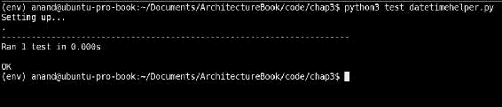

`datetimehelper`模块的单元测试案例输出 - 版本#1

从输出中可以看出，这个简单的测试用例通过了。

### 扩展我们的单元测试用例

您可能已经注意到`datetimehelper`模块的第一个版本的单元测试用例只包含了一个方法的测试，即将美国日期格式转换为印度日期格式的方法。

但是，其他两种方法呢？难道我们也不应该为它们编写单元测试吗？

其他两种方法的问题在于它们获取来自今天日期的数据。换句话说，输出取决于代码运行的确切日期。因此，无法通过输入日期值并期望结果与预期结果匹配来为它们编写特定的测试用例，因为代码是时间相关的。我们需要一种方法来控制这种外部依赖。

这里是 Mocking 来拯救我们。记住我们曾讨论过 Mock 对象作为控制外部依赖的一种方式。我们可以使用`unittest.mock`库的修补支持，并修补返回今天日期的方法，以返回我们控制的日期。这样，我们就能够测试依赖于它的方法。

以下是修改后的测试用例，使用了这种技术来支持两种方法：

```py
""" Module test_datetimehelper -  Unit test module for testing datetimehelper module """

import unittest
import datetime
import datetimehelper
from unittest.mock import patch

class DateTimeHelperTestCase(unittest.TestCase):
    """ Unit-test testcase class for DateTimeHelper class """

    def setUp(self):
        self.obj = datetimehelper.DateTimeHelper()

    def test_date(self):
        """ Test date() method """

        # Put a specific date to test
        my_date = datetime.datetime(year=2016, month=8, day=16)

        # Patch the 'today' method with a specific return value
        with patch.object(self.obj, 'today', return_value=my_date):
            response = self.obj.date()
            self.assertEqual(response, '16/08/2016')

    def test_weekday(self):
        """ Test weekday() method """

        # Put a specific date to test
        my_date = datetime.datetime(year=2016, month=8, day=21)

        # Patch the 'today' method with a specific return value
        with patch.object(self.obj, 'today', return_value=my_date):
            response = self.obj.weekday()
            self.assertEqual(response, 'Sunday')            

    def test_us_india_conversion(self):
        """ Test us=>india date format conversion """

        # Test a few dates
        d1 = '08/12/16'
        d2 = '07/11/2014'
        d3 = '04/29/00'
        self.assertEqual(self.obj.us_to_indian(d1), '12/08/2016')
        self.assertEqual(self.obj.us_to_indian(d2), '11/07/2014')
        self.assertEqual(self.obj.us_to_indian(d3), '29/04/2000')

if __name__ == "__main__":
    unittest.main()
```

正如你所看到的，我们已经对`today`方法进行了修补，使其在两个测试方法中返回特定日期。这使我们能够控制该方法的输出，并将结果与特定结果进行比较。

以下是测试用例的新输出：

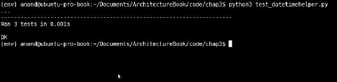

单元测试用例的输出，用于 datetimehelper 模块，增加了两个测试 - 版本＃2

### 提示

注意：`unittest.main`是`unittest`模块上的一个便利函数，它可以轻松地从一个模块中自动加载一组测试用例并运行它们。

要了解测试运行时发生了什么的更多细节，我们可以通过增加冗长度来让测试运行器显示更多信息。可以通过将`verbosity`参数传递给`unittest.main`，或者通过在命令行上传递`-v`选项来实现。

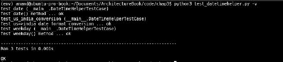

通过传递`-v`参数来从单元测试用例中生成冗长输出

## 用 nose2 四处嗅探

Python 中还有其他单元测试模块，它们不是标准库的一部分，但作为第三方包可用。我们将看一下第一个名为`nose`的模块。最新版本（写作时）是版本 2，该库已更名为 nose2。

可以使用 Python 包安装程序 pip 来安装 nose2 包。

```py
$ pip install nose2
```

运行 nose2 非常简单。它会自动检测要从中运行的 Python 测试用例所在的文件夹，方法是查找从`unittest.TestCase`派生的类，以及以`test`开头的函数。

在我们的 datetimehelper 测试用例中，nose2 会自动捡起它。只需从包含模块的文件夹中运行它。以下是测试输出：

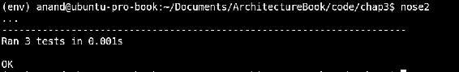

使用 nose2 运行单元测试

然而，前面的输出并没有报告任何内容，因为默认情况下，nose2 会静默运行。我们可以通过使用冗长选项（`-v`）来打开一些测试报告。

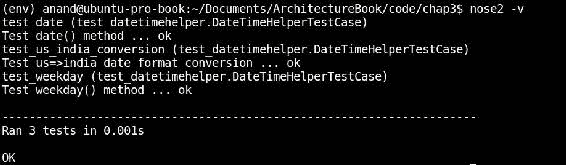

使用 nose2 运行单元测试，带有冗长输出

nose2 还支持使用插件来报告代码覆盖。我们将在后面的部分看到代码覆盖。

## 使用 py.test 进行测试

py.test 包，通常称为 pytest，是 Python 的一个功能齐全、成熟的测试框架。与 nose2 一样，py.test 也支持通过查找以特定模式开头的文件来发现测试。

py.test 也可以使用 pip 安装。

```py
$ pip install pytest

```

像 nose2 一样，使用 py.test 进行测试也很容易。只需在包含测试用例的文件夹中运行可执行文件 pytest。

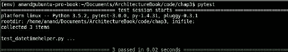

使用 py.test 进行测试发现和执行

像 nose2 一样，pytest 也具有自己的插件支持，其中最有用的是代码覆盖插件。我们将在后面的部分看到示例。

需要注意的是，pytest 不要求测试用例正式派生自`unittest.TestCase`模块。Py.test 会自动从包含以`Test`为前缀的类或以`test_`为前缀的函数的模块中发现测试。

例如，这里有一个新的测试用例，没有依赖于`unittest`模块，但测试用例类是从 Python 中最基本的类型 object 派生的。新模块名为`test_datetimehelper_object`。

```py
""" Module test_datetimehelper_object - Simple test case with test class derived from object """ 

import datetimehelper

class TestDateTimeHelper(object):

    def test_us_india_conversion(self):
        """ Test us=>india date format conversion """

        obj = datetimehelper.DateTimeHelper()
        assert obj.us_to_indian('1/1/1') == '01/01/2001'
```

请注意，这个类与`unittest`模块没有任何依赖关系，并且没有定义任何固定装置。以下是现在在文件夹中运行 pytest 的输出：

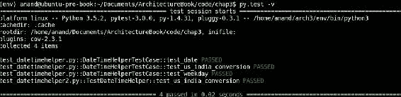

使用 py.test 进行测试用例发现和执行，而不使用 unittest 模块支持

pytest 已经捕捉到了这个模块中的测试用例，并自动执行了它，正如输出所示。

nose2 也具有类似的功能来捕捉这样的测试用例。下一张图片显示了 nose2 对新测试用例的输出。

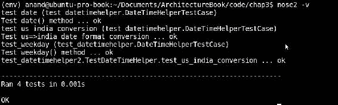

使用 nose2 进行测试用例发现和执行，而不使用 unittest 模块支持

上述输出显示了新测试已被捕捉并执行。

`unittest`模块、nose2 和 py.test 包提供了大量支持，以非常灵活和可定制的方式开发和实现测试用例、固定装置和测试套件。讨论这些工具的多种选项超出了本章的范围，因为我们的重点是了解这些工具，以理解我们如何使用它们来满足测试性的架构质量属性。

因此，我们将继续讨论单元测试的下一个重要主题，即**代码覆盖率**。我们将看看这三个工具，即`unittest`、nose2 和 py.test，以及它们如何允许架构师帮助他的开发人员和测试人员找到有关他们单元测试中代码覆盖率的信息。

## 代码覆盖率

代码覆盖率是衡量被测试的源代码被特定测试套件覆盖的程度。理想情况下，测试套件应该追求更高的代码覆盖率，因为这将使更大比例的源代码暴露给测试，并有助于发现错误。

代码覆盖率指标通常报告为**代码行数**（**LOC**）的百分比，或者测试套件覆盖的子程序（函数）的百分比。

现在让我们看看不同工具对于测量代码覆盖率的支持。我们将继续使用我们的测试示例（`datetimehelper`）进行这些说明。

### 使用 coverage.py 进行覆盖率测量

Coverage.py 是一个第三方的 Python 模块，它与使用`unittest`模块编写的测试套件和测试用例一起工作，并报告它们的代码覆盖率。

Coverage.py 可以像其他工具一样使用 pip 进行安装。

```py
$ pip install coverage

```

这个最后的命令安装了 coverage 应用程序，用于运行和报告代码覆盖率。

Coverage.py 有两个阶段：首先，它运行一段源代码，并收集覆盖信息，然后报告覆盖数据。

要运行 coverage.py，请使用以下语法：

```py
 **$ coverage run <source file1> <source file 2> …

```

运行完成后，使用此命令报告覆盖率：

```py
 **$ coverage report -m

```

例如，这是我们测试模块的输出：

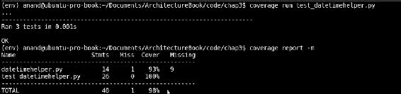

使用 coverage.py 对 datetimehelper 模块进行测试覆盖率报告

Coverage.py 报告称我们的测试覆盖了`datetimehelper`模块中`93%`的代码，这是相当不错的代码覆盖率。（您可以忽略关于测试模块本身的报告。）

### 使用 nose2 进行覆盖率测量

nose2 包带有用于代码覆盖率的插件支持。这不是默认安装的。要为 nose2 安装代码覆盖插件，请使用此命令：

```py
$ pip install cov-core

```

现在，nose2 可以使用代码覆盖选项运行测试用例，并一次性报告覆盖率。可以这样做：

```py
$ nose2 -v -C

```

### 注意

注意：在幕后，cov-core 利用 coverage.py 来完成其工作，因此 coverage.py 和 nose2 的覆盖度度量报告是相同的。

以下是使用 nose2 运行测试覆盖率的输出：

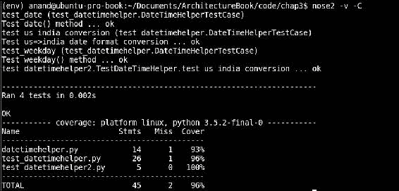

使用 nose2 对 datetimehelper 模块进行测试覆盖率报告

默认情况下，覆盖率报告会被写入控制台。要生成其他形式的输出，可以使用`–coverage-report`选项。例如，`--coverage-report html`将以 HTML 格式将覆盖率报告写入名为`htmlcov`的子文件夹。

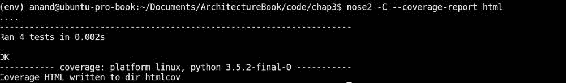

使用 nose2 生成 HTML 覆盖率输出

以下是浏览器中的 HTML 输出效果：

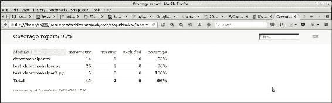

在浏览器中查看的 HTML 覆盖报告

### 使用 py.test 测量覆盖率

Pytest 还配备了自己的覆盖插件，用于报告代码覆盖。与 nose2 一样，它在后台利用 coverage.py 来完成工作。

为了为 py.test 提供代码覆盖支持，需要安装`pytest-cov`包，如下所示：

```py
$ pip install pytest-cov

```

要报告当前文件夹中测试用例的代码覆盖率，请使用以下命令：

```py
$ pytest –cov

```

以下是 pytest 代码覆盖的示例输出：

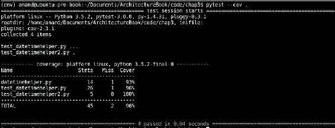

使用 py.test 运行当前文件夹的代码覆盖

## 模拟事物

我们在之前的测试示例中看到了使用`unittest.mock`的 patch 支持的示例。然而，`unittest`提供的 Mock 支持甚至比这个更强大，所以让我们看一个更多的例子来理解它的强大和适用性在编写单元测试中。

为了说明这一点，我们将考虑一个在大型数据集上执行关键字搜索并按权重排序返回结果的类，并假设数据集存储在数据库中，并且结果作为（句子、相关性）元组列表返回，其中句子是具有关键字匹配的原始字符串，相关性是其在结果集中的命中权重。

以下是代码：

```py
"""
Module textsearcher - Contains class TextSearcher for performing search on a database and returning results
"""

import operator

class TextSearcher(object):
    """ A class which performs a text search and returns results """

    def __init__(self, db):
        """ Initializer - keyword and database object """

        self.cache = False
        self.cache_dict = {}
        self.db = db
        self.db.connect()

    def setup(self, cache=False, max_items=500):
        """ Setup parameters such as caching """

        self.cache = cache
        # Call configure on the db
        self.db.configure(max_items=max_items)

    def get_results(self, keyword, num=10):
        """ Query keyword on db and get results for given keyword """

        # If results in cache return from there
        if keyword in self.cache_dict:
            print ('From cache')
            return self.cache_dict[keyword]

        results = self.db.query(keyword)
        # Results are list of (string, weightage) tuples
        results = sorted(results, key=operator.itemgetter(1), reverse=True)[:num]
        # Cache it
        if self.cache:
            self.cache_dict[keyword] = results

        return results
```

该类有以下三种方法：

+   `__init__`：初始化器，它接受一个充当数据源（数据库）句柄的对象；还初始化了一些属性，并连接到数据库

+   `setup`：它设置搜索器，并配置数据库对象

+   `get_results`：它使用数据源（数据库）执行搜索，并返回给定关键字的结果

我们现在想要为这个搜索器实现一个单元测试用例。由于数据库是一个外部依赖，我们将通过模拟来虚拟化数据库对象。我们将仅测试搜索器的逻辑、可调用签名和返回数据。

我们将逐步开发这个程序，以便每个模拟步骤对您来说都是清晰的。我们将使用 Python 交互式解释器会话来进行相同的操作。

首先，是必要的导入。

```py
>>> from unittest.mock import Mock, MagicMock
>>> import textsearcher
>>> import operator
```

由于我们想要模拟数据库，第一步就是确切地做到这一点。

```py
>>> db = Mock()
```

现在让我们创建`searcher`对象。我们不打算模拟这个，因为我们需要测试其方法的调用签名和返回值。

```py
>>> searcher = textsearcher.TextSearcher(db)
```

此时，数据库对象已被传递给`searcher`的`__init__`方法，并且已经在其上调用了`connect`。让我们验证这个期望。

```py
>>> db.connect.assert_called_with()
```

没有问题，所以断言成功了！现在让我们设置`searcher`。

```py
>>> searcher.setup(cache=True, max_items=100)
```

查看`TextSearcher`类的代码，我们意识到前面的调用应该调用数据库对象上的`configure`方法，并将参数`max_items`设置为值`100`。让我们验证一下。

```py
>>> searcher.db.configure.assert_called_with(max_items=100)
<Mock name='mock.configure_assert_called_with()' id='139637252379648'>
```

太棒了！

最后，让我们尝试并测试`get_results`方法的逻辑。由于我们的数据库是一个模拟对象，它将无法执行任何实际查询，因此我们将一些预先准备好的结果传递给它的`query`方法，有效地模拟它。

```py
>>> canned_results = [('Python is wonderful', 0.4),
...                       ('I like Python',0.8),
...                       ('Python is easy', 0.5),
...                       ('Python can be learnt in an afternoon!', 0.3)]
>>> db.query = MagicMock(return_value=canned_results)
```

现在我们设置关键字和结果的数量，并使用这些参数调用`get_results`。

```py
>>> keyword, num = 'python', 3
>>> data = searcher.get_results(python, num=num)
```

让我们检查数据。

```py
>>> data
[('I like Python', 0.8), ('Python is easy', 0.5), ('Python is wonderful', 0.4)]
```

看起来不错！

在下一步中，我们验证`get_results`确实使用给定的关键字调用了`query`。

```py
>>> searcher.db.query.assert_called_with(keyword)
```

最后，我们验证返回的数据是否已正确排序并截断到我们传递的结果数（`num`）值。

```py
>>> results = sorted(canned_results, key=operator.itemgetter(1), reverse=True)[:num]
>>> assert data == results
True
```

一切正常！

该示例显示了如何使用`unittest`模块中的 Mock 支持来模拟外部依赖项并有效地虚拟化它，同时测试程序的逻辑、控制流、可调用参数和返回值。

这是一个测试模块，将所有这些测试组合成一个单独的测试模块，并在其上运行 nose2 的输出。

```py
"""
Module test_textsearch - Unittest case with mocks for textsearch module
"""

from unittest.mock import Mock, MagicMock
import textsearcher
import operator

def test_search():
    """ Test search via a mock """

    # Mock the database object
    db = Mock()
    searcher = textsearcher.TextSearcher(db)
    # Verify connect has been called with no arguments
    db.connect.assert_called_with()
    # Setup searcher
    searcher.setup(cache=True, max_items=100)
    # Verify configure called on db with correct parameter
    searcher.db.configure.assert_called_with(max_items=100)

    canned_results = [('Python is wonderful', 0.4),
                      ('I like Python',0.8),
                      ('Python is easy', 0.5),
                      ('Python can be learnt in an afternoon!', 0.3)]
    db.query = MagicMock(return_value=canned_results)

    # Mock the results data
    keyword, num = 'python', 3
    data = searcher.get_results(keyword,num=num)
    searcher.db.query.assert_called_with(keyword)

    # Verify data 
    results = sorted(canned_results, key=operator.itemgetter(1), reverse=True)[:num]
    assert data == results
```

这是 nose2 在这个测试用例上的输出：

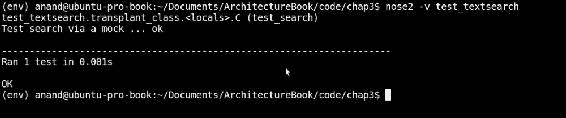

使用 nose2 运行 testsearcher 测试用例

为了保险起见，让我们也看一下我们的模拟测试示例`test_textsearch`模块的覆盖率，使用 py.test 覆盖率插件。

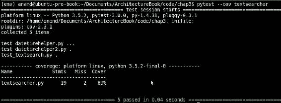

通过使用 py.test 测试文本搜索测试用例来测量 textsearcher 模块的覆盖率

所以我们的模拟测试覆盖率为*90%*，只有*20*个语句中的两个没有覆盖到。还不错！

## 文档中的内联测试 - doctests

Python 对另一种内联代码测试有独特的支持，通常称为**doctests**。这些是函数、类或模块文档中的内联单元测试，通过将代码和测试结合在一个地方，无需开发或维护单独的测试套件，从而增加了很多价值。

doctest 模块通过查找代码文档中看起来像 Python 字符串的文本片段来工作，并执行这些会话以验证它们确实与找到的一样工作。任何测试失败都会在控制台上报告。

让我们看一个代码示例来看看它是如何运作的。以下代码实现了简单的阶乘函数，采用了迭代方法：

```py
"""
Module factorial - Demonstrating an example of writing doctests
"""

import functools
import operator

def factorial(n):
    """ Factorial of a number.

    >>> factorial(0)
    1    
    >>> factorial(1)
    1
    >>> factorial(5)
    120
    >>> factorial(10)
    3628800

    """

    return functools.reduce(operator.mul, range(1,n+1))

if __name__ == "__main__":
    import doctest
    doctest.testmod(verbose=True)
```

让我们来看一下执行这个模块的输出。

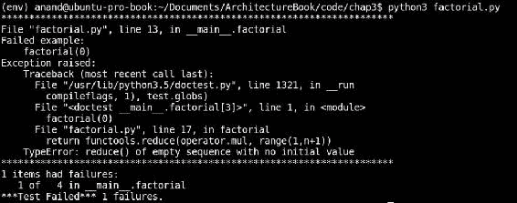

阶乘模块的 doctest 输出

Doctest 报告说四个测试中有一个失败了。

快速扫描输出告诉我们，我们忘记编写计算零的阶乘的特殊情况。错误是因为代码尝试计算 range(1, 1)，这会导致`reduce`引发异常。

代码可以很容易地重写以解决这个问题。以下是修改后的代码：

```py
"""
Module factorial - Demonstrating an example of writing doctests
"""

import functools
import operator

def factorial(n):
    """ Factorial of a number.

    >>> factorial(0)
    1    
    >>> factorial(1)
    1
    >>> factorial(5)
    120
    >>> factorial(10)
    3628800
    """

    # Handle 0 as a special case
    if n == 0:
        return 1

    return functools.reduce(operator.mul, range(1,n+1))

if __name__ == "__main__":
    import doctest
    doctest.testmod(verbose=True)
```

下一张图片显示了现在执行模块的新输出：

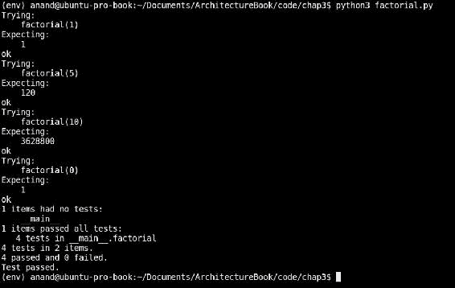

修复后阶乘模块的 doctest 输出

现在所有的测试都通过了。

### 注意

注意：在这个例子中，我们打开了 doctest 模块的`testmod`函数的详细选项，以显示测试的详细信息。如果没有这个选项，如果所有测试都通过，doctest 将保持沉默，不产生任何输出。

doctest 模块非常灵活。它不仅可以加载 Python 代码，还可以从文本文件等来源加载 Python 交互会话，并将它们作为测试执行。

Doctest 检查所有文档字符串，包括函数、类和模块文档字符串，以搜索 Python 交互会话。

### 注意

注意：pytest 包内置支持 doctests。要允许 pytest 发现并运行当前文件夹中的 doctests，请使用以下命令：

```py
$ pytest –doctest-modules
```

## 集成测试

单元测试虽然在软件开发生命周期早期的白盒测试中非常有用，可以发现和修复错误，但单靠它们是不够的。只有当不同组件按预期方式协同工作，以向最终用户提供所需的功能并满足预定义的架构质量属性时，软件系统才能完全正常运行。这就是集成测试的重要性所在。

集成测试的目的是验证软件系统的不同功能子系统的功能、性能和其他质量要求，这些子系统作为一个逻辑单元提供某些功能。这些子系统通过它们各自单元的累积行动来提供一些功能。虽然每个组件可能已经定义了自己的单元测试，但通过编写集成测试来验证系统的组合功能也是很重要的。

集成测试通常是在单元测试完成之后，验证测试之前编写的。

在这一点上，列出集成测试提供的优势将是有益的，因为这对于任何在设计和实现了不同组件的单元测试的软件架构师来说都是有用的。

+   **测试组件的互操作性**：功能子系统中的每个单元可能由不同的程序员编写。尽管每个程序员都知道他的组件应该如何执行，并可能已经为其编写了单元测试，但整个系统可能在协同工作方面存在问题，因为组件之间的集成点可能存在错误或误解。集成测试将揭示这样的错误。

+   **测试系统需求修改**：需求可能在实施期间发生了变化。这些更新的需求可能没有经过单元测试，因此，集成测试非常有用，可以揭示问题。此外，系统的某些部分可能没有正确实现需求，这也可以通过适当的集成测试来揭示。

+   **测试外部依赖和 API**：当今软件组件使用大量第三方 API，这些 API 通常在单元测试期间被模拟或存根。只有集成测试才能揭示这些 API 的性能，并暴露调用约定、响应数据或性能方面的任何问题。

+   **调试硬件问题**：集成测试有助于获取有关任何硬件问题的信息，调试这些测试可以为开发人员提供有关是否需要更新或更改硬件配置的数据。

+   **揭示代码路径中的异常**：集成测试还可以帮助开发人员找出他们在代码中可能没有处理的异常，因为单元测试不会执行引发此类错误的路径或条件。更高的代码覆盖率可以识别和修复许多此类问题。然而，一个良好的集成测试结合每个功能的已知代码路径和高覆盖率是确保在使用过程中可能发生的大多数潜在错误都被发现并在测试期间执行的良好公式。

编写集成测试有三种方法。它们如下：

+   自下而上：在这种方法中，首先测试低层组件，然后使用这些测试结果来集成链中更高级组件的测试。该过程重复进行，直到达到与控制流相关的组件层次结构的顶部。在这种方法中，层次结构顶部的关键模块可能得到不充分的测试。

如果顶层组件正在开发中，可能需要使用驱动程序来模拟它们。

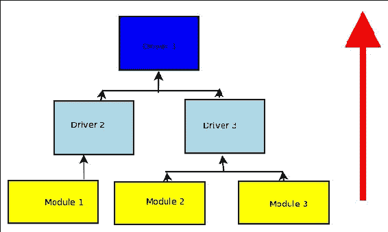

自下而上的集成测试策略

+   **自上而下**：测试开发和测试按照软件系统中的工作流程自上而下进行。因此，首先测试层次结构顶部的组件，最后测试低级模块。在这种方法中，首要测试关键模块，因此我们可以首先识别主要的设计或开发缺陷并加以修复。然而，低级模块可能得到不充分的测试。

低级模块可以被模拟其功能的存根所替代。在这种方法中，早期原型是可能的，因为低级模块逻辑可以被存根化。

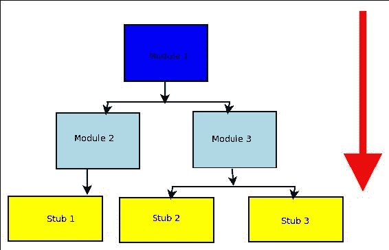

自上而下的集成测试策略

+   **大爆炸**：这种方法是在开发的最后阶段集成和测试所有组件。由于集成测试是在最后进行的，这种方法节省了开发时间。然而，这可能不会给予足够的时间来测试关键模块，因为可能没有足够的时间平等地花在所有组件上。

没有特定的软件用于一般集成测试。某些类别的应用程序，如 Web 框架，定义了自己特定的集成测试框架。例如，一些 Web 框架如 Django、Pyramid 和 Flask 都有一些由其自己社区开发的特定测试框架。

另一个例子是流行的`webtest`框架，它对 Python WSGI 应用程序的自动化测试很有用。这些框架的详细讨论超出了本章和本书的范围。

## 测试自动化

互联网上有许多有用的工具，用于自动化软件应用程序的集成测试。我们将在这里快速看一些流行的工具。

### 使用 Selenium Web Driver 进行测试自动化

Selenium 一直是自动化集成、回归和验证测试的热门选择，适用于许多软件应用程序。Selenium 是免费开源的，并支持大多数流行的 Web 浏览器引擎。

在 Selenium 中，主要对象是**web driver**，它是客户端上的一个有状态的对象，代表一个浏览器。Web driver 可以被编程访问 URL，执行操作（如点击、填写表单和提交表单），有效地替换通常手动执行这些步骤的人类测试对象。

Selenium 为大多数流行的编程语言和运行时提供客户端驱动程序支持。

要在 Python 中安装 Selenium Web Driver，请使用以下命令：

```py
$ pip install selenium

```

我们将看一个小例子，使用 Selenium 和 pytest 来实现一个小的自动化测试，测试 Python 网站（[`www.python.org`](http://www.python.org)）的一些简单测试用例。

这是我们的测试代码。模块名为`selenium_testcase.py`。

```py
"""
Module selenium_testcase - Example of implementing an automated UI test using selenium framework
"""

from selenium import webdriver
import pytest
import contextlib

@contextlib.contextmanager
@pytest.fixture(scope='session')
def setup():
    driver = webdriver.Firefox()    
    yield driver
    driver.quit()

def test_python_dotorg():
    """ Test details of python.org website URLs """

    with setup() as driver:
        driver.get('http://www.python.org')
        # Some tests
        assert driver.title == 'Welcome to Python.org'
        # Find out the 'Community' link
        comm_elem = driver.find_elements_by_link_text('Community')[0]
        # Get the URL
        comm_url = comm_elem.get_attribute('href')
        # Visit it
        print ('Community URL=>',comm_url)
        driver.get(comm_url)
        # Assert its title
        assert driver.title == 'Our Community | Python.org'
        assert comm_url == 'https://www.python.org/community/'
```

在运行上述示例并显示输出之前，让我们稍微检查一下函数。

+   函数`setUp`是一个测试装置，它为我们的测试设置了主要对象，即 Firefox 的 Selenium Web driver。我们通过在`contextlib`模块中使用`contextmanager`装饰器将`setUp`函数转换为上下文管理器。在`setUp`函数的末尾，驱动程序退出，因为调用了它的`quit`方法。

+   在测试函数`test_python_dot_org`中，我们设置了一个相当简单的、人为的测试，用于访问主 Python 网站 URL，并通过断言检查其标题。然后我们通过在主页上找到它来加载 Python 社区的 URL，然后访问这个 URL。最后在结束测试之前断言其标题和 URL。

让我们看看程序的运行情况。我们将明确要求 pytest 只加载这个模块，并运行它。这个命令行如下：

```py
$ pytest -s selenium_testcase.py** 

```

Selenium 驱动程序将启动浏览器（Firefox），并自动打开一个窗口，访问 Python 网站 URL，同时运行测试。测试的控制台输出如下图所示：

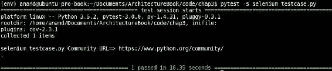

简单的 Selenium 测试用例在 Python 编程语言网站上的控制台输出

Selenium 可以用于更复杂的测试用例，因为它提供了许多方法来检查页面的 HTML，定位元素并与之交互。还有一些 Selenium 的插件，可以执行页面的 JavaScript 内容，以通过 JavaScript 执行复杂的交互（如 AJAX 请求）。

Selenium 也可以在服务器上运行。它通过远程驱动程序支持提供对远程客户端的支持。浏览器在服务器上实例化（通常使用虚拟 X 会话），而测试可以通过网络从客户端机器运行和控制。

## 测试驱动开发

**测试驱动开发**（**TDD**）是一种敏捷软件开发实践，使用非常短的开发周期，编写代码以满足增量测试用例。

在 TDD 中，将功能需求映射到特定的测试用例。编写代码以通过第一个测试用例。任何新需求都被添加为一个新的测试用例。代码被重构以支持新的测试用例。这个过程一直持续到代码能够支持整个用户功能的范围。

TDD 的步骤如下：

1.  定义一些起始测试用例作为程序的规范。

1.  编写代码使早期测试用例通过。

1.  添加一个定义新功能的新测试用例。

1.  运行所有测试，看看新测试是失败还是通过。

1.  如果新测试失败，请编写一些代码使测试通过。

1.  再次运行测试。

1.  重复步骤 4 到 6，直到新测试通过。

1.  重复步骤 3 到 7，通过测试用例添加新功能。

在 TDD 中，重点是保持一切简单，包括单元测试用例和为支持测试用例而添加的新代码。TDD 的实践者认为，提前编写测试允许开发人员更好地理解产品需求，从开发生命周期的最开始就专注于软件质量。

在 TDD 中，通常在系统中添加了许多测试之后，还会进行最终的重构步骤，以确保不会引入编码异味或反模式，并保持代码的可读性和可维护性。

TDD 没有特定的软件，而是一种软件开发的方法和过程。大多数情况下，TDD 使用单元测试，因此，工具链支持主要是`unittest`模块和本章讨论过的相关软件包。

## 回文的 TDD

让我们像之前讨论的那样，通过一个简单的示例来理解 TDD，开发一个检查输入字符串是否为回文的 Python 程序。

### 注意

回文是一个在两个方向上都读取相同的字符串。例如，*bob*，*rotator*和*Malayalam*都是回文。当你去掉标点符号时，句子*Madam, I'm Adam*也是回文。

让我们遵循 TDD 的步骤。最初，我们需要一个定义程序基本规范的测试用例。我们的测试代码的第一个版本看起来像这样：

```py
"""
Module test_palindrome - TDD for palindrome module
"""

import palindrome

def test_basic():
    """ Basic test for palindrome """

    # True positives
    for test in ('Rotator','bob','madam','mAlAyAlam', '1'):
        assert palindrome.is_palindrome(test)==True

    # True negatives
    for test in ('xyz','elephant', 'Country'):
        assert palindrome.is_palindrome(test)==False        
```

注意，上述代码不仅在早期功能方面为我们提供了程序的规范，还给出了函数名称和签名——包括参数和返回值。我们可以通过查看测试来列出第一个版本的要求。

+   该函数名为`_palindrome`。它应该接受一个字符串，如果是回文则返回 True，否则返回 False。该函数位于`palindrome`模块中。

+   该函数应将字符串视为不区分大小写。

有了这些规范，这是我们的`palindrome`模块的第一个版本：

```py
def is_palindrome(in_string):
    """ Returns True whether in_string is palindrome, False otherwise """

    # Case insensitive
    in_string = in_string.lower()
    # Check if string is same as in reverse
    return in_string == in_string[-1::-1]
```

让我们检查一下这是否通过了我们的测试。我们将在测试模块上运行 py.test 来验证这一点。

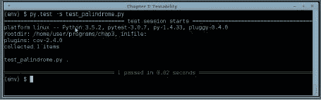

test_palindrome.py 版本＃1 的测试输出

正如你在最后一张图片中看到的，基本测试通过了；所以，我们得到了一个`palindrome`模块的第一个版本，它可以工作并通过测试。

现在按照 TDD 步骤，让我们进行第三步，添加一个新的测试用例。这增加了对带有空格的回文字符串进行测试的检查。以下是带有这个额外测试的新测试模块：

```py
"""
Module test_palindrome - TDD for palindrome module
"""

import palindrome

def test_basic():
    """ Basic test for palindrome """

    # True positives
    for test in ('Rotator','bob','madam','mAlAyAlam', '1'):
        assert palindrome.is_palindrome(test)==True

    # True negatives
    for test in ('xyz','elephant', 'Country'):
        assert palindrome.is_palindrome(test)==False        

def test_with_spaces():
    """ Testing palindrome strings with extra spaces """

    # True positives
    for test in ('Able was I ere I saw Elba',
                 'Madam Im Adam',
                 'Step on no pets',
                 'Top spot'):
        assert palindrome.is_palindrome(test)==True

    # True negatives
    for test in ('Top post','Wonderful fool','Wild Imagination'):
        assert palindrome.is_palindrome(test)==False        
```

让我们运行更新后的测试并查看结果。

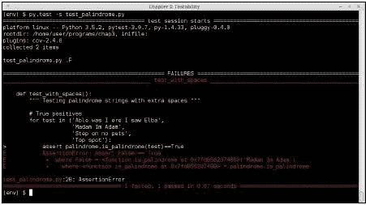

test_palindrome.py 版本＃2 的测试输出

测试失败，因为代码无法处理带有空格的回文字符串。所以让我们按照 TDD 步骤（5）的说法，编写一些代码使这个测试通过。

由于明显需要忽略空格，一个快速的解决方法是从输入字符串中清除所有空格。以下是带有这个简单修复的修改后的回文模块：

```py
"""
Module palindrome - Returns whether an input string is palindrome or not
"""

import re

def is_palindrome(in_string):
    """ Returns True whether in_string is palindrome, False otherwise """

    # Case insensitive
    in_string = in_string.lower()
    # Purge spaces
    in_string = re.sub('\s+','', in_string)
    # Check if string is same as in reverse
    return in_string == in_string[-1::-1]
```

现在让我们重复 TDD 的第四步，看看更新后的代码是否使测试通过。

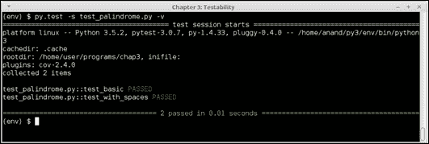

代码更新后的 test_palindrome.py 版本＃2 的控制台输出

当然，现在代码通过了测试！

我们刚刚看到的是 TDD 的一个实例，用于在 Python 中实现一个模块的更新周期，该模块检查字符串是否为回文。以类似的方式，可以不断添加测试，并根据 TDD 的第 8 步不断更新代码，从而在维护更新的测试的过程中添加新功能。

我们用检查最终版本的回文测试用例结束了本节，其中添加了一个检查带有额外标点符号的字符串的测试用例。

```py
"""
Module test_palindrome - TDD for palindrome module
"""

import palindrome

def test_basic():
    """ Basic test for palindrome """

    # True positives
    for test in ('Rotator','bob','madam','mAlAyAlam', '1'):
        assert palindrome.is_palindrome(test)==True

    # True negatives
    for test in ('xyz','elephant', 'Country'):
        assert palindrome.is_palindrome(test)==False        

def test_with_spaces():
    """ Testing palindrome strings with extra spaces """

    # True positives
    for test in ('Able was I ere I saw Elba',
                 'Madam Im Adam',
                 'Step on no pets',
                 'Top spot'):
        assert palindrome.is_palindrome(test)==True

    # True negatives
    for test in ('Top post','Wonderful fool','Wild Imagination'):
        assert palindrome.is_palindrome(test)==False        

def test_with_punctuations():
    """ Testing palindrome strings with extra punctuations """

    # True positives
    for test in ('Able was I, ere I saw Elba',
                 "Madam I'm Adam",
                 'Step on no pets.',
                 'Top spot!'):
        assert palindrome.is_palindrome(test)==True

    # True negatives
    for test in ('Top . post','Wonderful-fool','Wild Imagination!!'):
        assert palindrome.is_palindrome(test)==False            
```

以下是更新后的回文模块，使得这个测试通过：

```py
"""
Module palindrome - Returns whether an input string is palindrome or not
"""

import re
from string import punctuation

def is_palindrome(in_string):
    """ Returns True whether in_string is palindrome, False otherwise """

    # Case insensitive
    in_string = in_string.lower()
    # Purge spaces
    in_string = re.sub('\s+','', in_string)
    # Purge all punctuations
    in_string = re.sub('[' + re.escape(punctuation) + ']+', '', in_string)
    # Check if string is same as in reverse
    return in_string == in_string[-1::-1]
```

让我们检查一下控制台上`_palindrome`模块的最终输出。

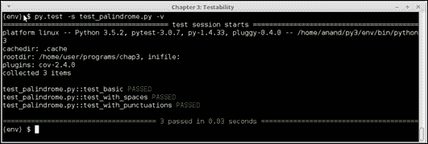

test_palindrome.py 版本＃3 的控制台输出，带有匹配的代码更新

## 总结

在本章中，我们重新审视了可测试性的定义及其相关的架构质量方面，如复杂性和确定性。我们研究了被测试的不同架构方面，并了解了软件测试过程通常执行的测试类型。

然后，我们讨论了改进软件可测试性的各种策略，并研究了减少系统复杂性、提高可预测性以及控制和管理外部依赖的技术。在这个过程中，我们学习了不同的虚拟化和管理外部依赖的方法，例如伪装、模拟和存根，通过示例进行了说明。

然后，我们从 Python `unittest`模块的角度主要讨论了单元测试及其各个方面。我们通过使用一个 datetime 辅助类的示例，解释了如何编写有效的单元测试——先是一个简单的例子，然后是使用`unittest`的 Mock 库对函数进行打补丁的有趣的例子。

接下来，我们介绍并学习了 Python 中另外两个著名的测试框架，即 nose2 和 py.test。接下来我们讨论了代码覆盖率的非常重要的方面，并看到了使用 coverage.py 包直接测量代码覆盖率的示例，以及通过 nose2 和 pytest 的插件使用它的示例。

在下一节中，我们勾勒了一个使用高级模拟对象的 textsearch 类的示例，我们对其外部依赖进行了模拟，并编写了一个单元测试用例。我们继续讨论了 Python doctest 支持，通过 doctest 模块在类、模块、方法和函数的文档中嵌入测试的示例。

下一个话题是集成测试，我们讨论了集成测试的不同方面和优势，并看了一下测试可以在软件组织中集成的三种不同方式。接下来讨论了通过 Selenium 进行测试自动化，以及使用 Selenium 和 py.test 在 Python 语言网站上自动化一些测试的示例。

我们以对 TDD 的快速概述结束了本章，并讨论了使用 TDD 原则编写 Python 中检测回文的程序的示例，我们以逐步的方式使用测试开发了这个程序。

在下一章中，我们将讨论在开发软件时架构的一个最关键的质量属性，即性能。
