# 第四章：良好的性能是有回报的！

性能是现代软件应用的基石之一。每天我们以多种不同的方式与高性能计算系统进行交互，作为我们工作和休闲的一部分。

当你在网上的旅行网站之一预订航班时，你正在与一个高性能系统交互，该系统在特定时间内执行数百个此类交易。当你向某人转账或通过互联网银行交易支付信用卡账单时，你正在与一个高性能和高吞吐量的交易系统交互。同样，当你在手机上玩在线游戏并与其他玩家互动时，又有一个网络服务器系统专为高并发和低延迟而建，它接收你和成千上万其他玩家的输入，进行后台计算并向你发送数据 - 所有这些都以合理而安静的效率进行。

现代网络应用程序可以同时为数百万用户提供服务，这是因为高速互联网的出现以及硬件价格/性能比的大幅下降。性能仍然是现代软件架构的关键质量属性，编写高性能和可扩展软件仍然是一门艰难的艺术。你可能编写了一个功能和其他质量属性都符合要求的应用程序，但如果它未通过性能测试，那么它就不能投入生产。

在本章和下一章中，我们将重点关注写高吞吐量软件的两个方面 - 即性能和可扩展性。在本章中，重点是性能，以及它的各个方面，如何衡量它，各种数据结构的性能，以及在何时选择什么 - 重点放在 Python 上。

本章我们将讨论的主题大致包括以下几个部分：

+   定义性能

+   软件性能工程

+   性能测试工具的类型

+   性能复杂性和大 O 符号：

+   性能测量

+   使用图表找到性能复杂性

+   提高性能

+   性能分析：

+   确定性分析

+   `cProfile` 和 `profile`

+   第三方性能分析工具

+   其他工具：

+   Objgraph

+   Pympler

+   为性能编程 - 数据结构：

+   列表

+   字典

+   集合

+   元组

+   高性能容器 - collections 模块：

+   `deque`

+   `defaultdict`

+   `OrderedDict`

+   `Counter`

+   `ChainMap`

+   `namedtuple`

+   概率数据结构 - 布隆过滤器

# 什么是性能？

软件系统的性能可以广义地定义为：

> “系统能够满足其吞吐量和/或延迟要求的程度，以每秒事务数或单个事务所需时间来衡量。”

我们已经在介绍章节中概述了性能测量。性能可以用响应时间/延迟或吞吐量来衡量。前者是应用程序完成请求/响应循环的平均时间。后者是系统以每分钟成功完成的请求或交易数量来处理其输入的速率。

系统的性能是其软件和硬件能力的函数。一个糟糕编写的软件仍然可以通过扩展硬件（例如 RAM 的数量）来提高性能。

同样，通过增加性能（例如，通过重写例程或函数以在时间或内存方面更有效，或通过修改架构），可以使现有硬件上的软件更好地运行。

然而，正确的性能工程是软件以最佳方式针对硬件进行调整，使得软件相对于可用硬件的线性扩展或更好。

# 软件性能工程

软件性能工程包括软件工程和分析的所有活动，应用于**软件开发生命周期**（**SDLC**），旨在满足性能要求。

在传统的软件工程中，性能测试和反馈通常是在 SDLC 的最后阶段进行的。这种方法纯粹基于测量，并等待系统开发完成后再应用测试和诊断，并根据结果调整系统。

另一个更正式的模型名为**软件性能工程**（**SPE**）本身，在 SDLC 的早期开发性能模型，并使用模型的结果来修改软件设计和架构，以满足多次迭代中的性能要求。

在这种方法中，性能作为非功能性需求和软件开发满足其功能性需求并行进行。有一个特定的**性能工程生命周期**（**PELC**），与 SDLC 中的步骤相对应。从设计和架构一直到部署的每一步，都利用两个生命周期之间的反馈来迭代地提高软件质量：

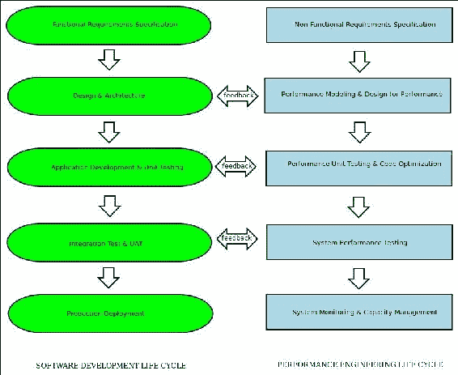

SPE - 性能工程生命周期反映软件开发生命周期

在这两种方法中，性能测试和诊断都很重要，随后根据所获得的结果调整设计/架构或代码。因此，性能测试和测量工具在这一步中起着重要作用。

# 性能测试和测量工具

这些工具分为两大类 - 用于性能测试和诊断的工具，以及用于收集性能指标和仪器的工具。

性能测试和诊断工具可以进一步分类如下：

+   **压力测试工具**：这些工具用于向被测试系统提供工作负载，模拟生产中的高峰工作负载。这些工具可以配置为向应用程序发送连续的输入流，以模拟高压力，或者定期发送一大批非常高的流量 - 远远超过甚至高峰压力 - 以测试系统的稳健性。这些工具也被称为**负载生成器**。用于 Web 应用程序测试的常见压力测试工具的示例包括**httpperf**、**ApacheBench**、**LoadRunner**、**Apache JMeter**和**Locust**。另一类工具涉及实际记录真实用户流量，然后通过网络重放以模拟真实用户负载。例如，流行的网络数据包捕获和监视工具**Wireshark**及其控制台表亲程序`tcpdump`可以用于此目的。我们不会在本章讨论这些工具，因为它们是通用工具，可以在网络上找到大量的使用示例。

+   **监控工具**：这些工具与应用程序代码一起生成性能指标，例如函数执行所需的时间和内存，每个请求-响应循环中进行的函数调用次数，每个函数花费的平均和峰值时间等。

+   **仪器工具**：仪器工具跟踪指标，例如每个计算步骤所需的时间和内存，并跟踪事件，例如代码中的异常，涵盖诸如发生异常的模块/函数/行号、事件的时间戳以及应用程序的环境（环境变量、应用程序配置参数、用户信息、系统信息等）的详细信息。现代 Web 应用程序编程系统通常使用外部仪器工具来捕获和详细分析此类数据。

+   **代码或应用程序分析工具**：这些工具生成关于函数的统计信息，它们的调用频率和持续时间，以及每个函数调用所花费的时间。这是一种动态程序分析。它允许程序员找到代码中花费最多时间的关键部分，从而优化这些部分。不建议在没有进行分析的情况下进行优化，因为程序员可能最终会优化错误的代码，从而无法实现预期的应用程序效益。

大多数编程语言都配备了自己的一套工具和性能分析工具。在 Python 中，标准库中的一组工具（如`profile`和`cProfile`模块）可以做到这一点 - 这得益于丰富的第三方工具生态系统。我们将在接下来的部分讨论这些工具。

# 性能复杂度

在我们跳入 Python 中的代码示例并讨论测量和优化性能的工具之前，花点时间讨论一下我们所说的代码的性能复杂度是什么意思会很有帮助。

例程或函数的性能复杂度是根据它们对输入大小的变化的响应来定义的，通常是根据执行代码所花费的时间来定义的。

这通常由所谓的大 O 符号表示，它属于一类称为**巴赫曼-兰道符号或渐近**符号的符号。

字母 O 用作函数相对于输入大小的增长速度 - 也称为函数的**顺序**。

常用的大 O 符号或函数顺序按照增加复杂度的顺序显示在以下表中：

| # | 顺序 | 复杂度 | 例子 |
| --- | --- | --- | --- |
| 1 | *O(1)* | 常数 | 在常数查找表中查找键，例如 Python 中的 HashMap 或字典 |
| 2 | *O(log (n))* | 对数 | 在排序数组中使用二分搜索查找项目。Python 中对 heapq 的所有操作 |
| 3 | *O(n)* | 线性 | 通过遍历数组（Python 中的列表）来搜索项目 |
| 4 | *O(n*k)* | 线性 | 基数排序的最坏情况复杂度 |
| 5 | *O(n * log (n))* | n 对数星 n | 归并排序或堆排序算法的最坏情况复杂度 |
| 6 | *O(n²)* | 二次 | 简单的排序算法，如冒泡排序，插入排序和选择排序。某些排序算法的最坏情况复杂度，如快速排序，希尔排序等 |
| 7 | *O(2^n)* | 指数 | 尝试使用暴力破解破解大小为 n 的密码，使用动态规划解决旅行推销员问题 |
| 8 | *O(n!)* | 阶乘 | 生成集合的所有分区 |

表 1：关于输入大小“n”的函数顺序的常见大 O 符号

当实现一个接受特定大小输入*n*的例程或算法时，程序员理想情况下应该目标是将其实现在前五个顺序中。任何*O(n)或 O(n * log(n))*或更低顺序的东西都表明合理到良好的性能。

具有*O(n²)*顺序的算法通常可以优化为更低的顺序。我们将在以下图表中的部分中看到一些例子。

以下图表显示了这些顺序随着*n*的增长而增长的方式：

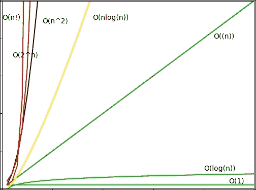

每个复杂度顺序的增长率图（y 轴）相对于输入大小（x 轴）的增长率图。

# 性能测量

既然我们已经概述了性能复杂度是什么，也了解了性能测试和测量工具，让我们实际看看用 Python 测量性能复杂度的各种方法。

最简单的时间测量之一是使用 POSIX/Linux 系统的`time`命令。

通过使用以下命令行完成：

```py
$ time <command>

```

例如，这是从 Web 获取一个非常流行页面所需时间的截图：

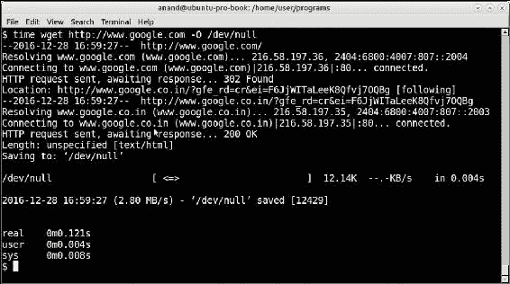

通过 wget 从互联网获取网页的时间命令输出

请注意，它显示了三种时间输出，即`real`、`user`和`sys`。重要的是要知道这三者之间的区别，让我们简要地看一下它们：

+   `real`：实际时间是操作所经历的实际挂钟时间。这是操作从开始到结束的时间。它将包括进程休眠或阻塞的任何时间，例如 I/O 完成所花费的时间。

+   `User`：用户时间是进程在用户模式（在内核之外）内实际花费的 CPU 时间。任何休眠时间或在等待中花费的时间，如 I/O，不会增加用户时间。

+   `Sys`：系统时间是程序内核中执行系统调用所花费的 CPU 时间。这仅计算在内核空间中执行的函数，如特权系统调用。它不计算在用户空间中执行的任何系统调用（这在`User`中计算）。

一个进程所花费的总 CPU 时间是`user` + `sys`时间。真实或挂钟时间是由简单的时间计数器大多数测量的时间。

## 使用上下文管理器测量时间

在 Python 中，编写一个简单的函数作为代码块的上下文管理器，用于测量其执行时间并不是很困难。

但首先我们需要一个可以测量性能的程序。

请看以下步骤，了解如何使用上下文管理器来测量时间：

1.  让我们编写一个计算两个序列之间共同元素的程序作为测试程序。以下是代码：

```py
def common_items(seq1, seq2):
    """ Find common items between two sequences """

    common = []
    for item in seq1:
        if item in seq2:
            common.append(item)

    return common
```

1.  让我们编写一个简单的上下文管理器计时器来计时这段代码。为了计时，我们将使用`time`模块的`perf_counter`，它可以给出最精确的时间分辨率：

```py
from time import perf_counter as timer_func
from contextlib import contextmanager

@contextmanager
def timer():
    """ A simple timing function for routines """

    try:
        start = timer_func()
        yield
    except Exception as e:
        print(e)
        raise
    finally:
        end = timer_func()
        print ('Time spent=>',1000.0*(end – start),'ms.')
```

1.  让我们为一些简单的输入数据计时函数。为此，一个`test`函数很有用，它可以生成随机数据，给定一个输入大小：

```py
def test(n):
    """ Generate test data for numerical lists given input size """

    a1=random.sample(range(0, 2*n), n)
    a2=random.sample(range(0, 2*n), n)

    return a1, a2
```

以下是在 Python 交互解释器上对`test`函数的`timer`方法的输出：

```py
>>> with timer() as t:
... common = common_items(*test(100))
... Time spent=> 2.0268699999999864 ms.
```

1.  实际上，测试数据生成和测试可以结合在同一个函数中，以便轻松地测试和生成一系列输入大小的数据：

```py
def test(n, func):
    """ Generate test data and perform test on a given function """

    a1=random.sample(range(0, 2*n), n)
    a2=random.sample(range(0, 2*n), n)

    with timer() as t:
        result = func(a1, a2)
```

1.  现在让我们在 Python 交互控制台中测量不同范围的输入大小所花费的时间：

```py
>>> test(100, common_items)
    Time spent=> 0.6799279999999963 ms.
>>> test(200, common_items)
    Time spent=> 2.7455590000000085 ms.
>>> test(400, common_items)
    Time spent=> 11.440810000000024 ms.
>>> test(500, common_items)
    Time spent=> 16.83928100000001 ms.
>>> test(800, common_items)
    Time spent=> 21.15130400000004 ms.
>>> test(1000, common_items)
    Time spent=> 13.200749999999983 ms.
```

哎呀，`1000`个项目所花费的时间比`800`的时间少！这怎么可能？让我们再试一次：

```py
>>> test(800, common_items)
    Time spent=> 8.328282999999992 ms.
>>> test(1000, common_items)
    Time spent=> 34.85899500000001 ms.
```

现在，`800`个项目所花费的时间似乎比`400`和`500`的时间少。而`1000`个项目所花费的时间增加到了之前的两倍以上。

原因是我们的输入数据是随机的，这意味着它有时会有很多共同的项目-这需要更多的时间-有时会少得多。因此，在后续调用中，所花费的时间可能会显示一系列值。

换句话说，我们的计时函数对于获得一个大致的图片是有用的，但是当涉及到获取程序执行所花费的真实统计度量时，它并不是非常有用，这更为重要。

1.  为此，我们需要多次运行计时器并取平均值。这与算法的**摊销**分析有些类似，它考虑了执行算法所花费的时间的下限和上限，并给程序员一个实际的平均时间估计。

Python 自带了这样一个模块，它可以帮助在其标准库中执行这样的计时分析，即`timeit`模块。让我们在下一节中看看这个模块。

## 使用`timeit`模块计时代码

Python 标准库中的`timeit`模块允许程序员测量执行小代码片段所花费的时间。代码片段可以是 Python 语句、表达式或函数。

使用`timeit`模块的最简单方法是在 Python 命令行中将其作为模块执行。

例如，以下是一些简单的 Python 内联代码的计时数据，用于测量在范围内计算数字平方的列表推导的性能：

```py
$ python3 -m timeit '[x*x for x in range(100)]'
100000 loops, best of 3: 5.5 usec per loop

$ python3 -m timeit '[x*x for x in range(1000)]'
10000 loops, best of 3: 56.5 usec per loop

$ python3 -m timeit '[x*x for x in range(10000)]'
1000 loops, best of 3: 623 usec per loop

```

结果显示了执行代码片段所花费的时间。在命令行上运行时，`timeit`模块会自动确定运行代码的循环次数，并计算单次执行的平均时间。

### 注意

结果显示，我们正在执行的语句是线性的或 O(n)，因为大小为 100 的范围需要 5.5 微秒，而 1000 的范围需要 56.5 微秒，大约是其时间的 10 倍。微秒是秒的百万分之一，即 1*10-6 秒。

使用 Python 解释器中的`timeit`模块的方法如下：

```py
>>> 1000000.0*timeit.timeit('[x*x for x in range(100)]', number=100000)/100000.0
6.007622049946804

>>> 1000000.0*timeit.timeit('[x*x for x in range(1000)]', number=10000)/10000.0
58.761584300373215
```

### 注意

请注意，以这种方式使用时，程序员必须将正确的迭代次数作为`number`参数传递，并且为了求平均值，必须除以相同的数字。乘以`1000000`是为了将时间转换为微秒（usec）。

`timeit`模块在后台使用`Timer`类。该类也可以直接使用，以及进行更精细的控制。

使用此类时，`timeit`成为类的实例的方法，循环次数作为参数传递。

`Timer`类构造函数还接受一个可选的`setup`参数，用于设置`Timer`类的代码。这可以包含用于导入包含函数的模块、设置全局变量等的语句。它接受用分号分隔的多个语句。

### 使用 timeit 测量我们代码的性能

让我们重写我们的`test`函数，以测试两个序列之间的共同项目。现在我们将使用`timeit`模块，可以从代码中删除上下文管理器计时器。我们还将在函数中硬编码调用`common_items`。

### 注意

我们还需要在测试函数之外创建随机输入，否则它所花费的时间将增加到测试函数的时间中，从而破坏我们的结果。

因此，我们需要将变量作为全局变量移到模块中，并编写一个`setup`函数，作为第一步为我们生成数据。

我们重写的`test`函数如下：

```py
def test():
    """ Testing the common_items function """

    common = common_items(a1, a2)
```

具有全局变量的`setup`函数如下：

```py
# Global lists for storing test data
a1, a2 = [], []

def setup(n):
    """ Setup data for test function """

    global a1, a2
    a1=random.sample(range(0, 2*n), n)
    a2=random.sample(range(0, 2*n), n)
```

假设包含`test`和`common_items`函数的模块名为`common_items.py`。

现在可以运行计时器测试如下：

```py
>>> t=timeit.Timer('test()', 'from common_items import test,setup; setup(100)')
>>> 1000000.0*t.timeit(number=10000)/10000
116.58759460115107
```

因此，100 个数字的范围平均需要 117 微秒（0.12 微秒）。

现在对其他输入大小的几个范围进行执行，得到以下输出：

```py
>>> t=timeit.Timer('test()','from common_items import test,setup; setup(200)')
>>> 1000000.0*t.timeit(number=10000)/10000
482.8089299000567

>>> t=timeit.Timer('test()','from common_items import test,setup; setup(400)')
>>> 1000000.0*t.timeit(number=10000)/10000
1919.577144399227

>>> t=timeit.Timer('test()','from common_items import test,setup; setup(800)')
>>> 1000000.0*t.timeit(number=1000)/1000
7822.607815993251

>>> t=timeit.Timer('test()','from common_items import test,setup; setup(1000)')
>>> 1000000.0*t.timeit(number=1000)/1000
12394.932234004957
```

因此，此测试运行的最长时间为 1000 个项目的输入大小需要 12.4 微秒。

## 找出时间复杂度-图表

从这些结果中是否可以找出我们函数的时间性能复杂度？让我们尝试在图表中绘制它并查看结果。

`matplotlib`库在 Python 中绘制任何类型的输入数据的图表非常有用。我们只需要以下简单的代码即可实现：

```py
import matplotlib.pyplot as plt

def plot(xdata, ydata):
    """ Plot a range of ydata (on y-axis) against xdata (on x-axis) """

    plt.plot(xdata, ydata)
    plt.show()
```

上述代码给出了以下输出：

```py
This is our x data.
>>> xdata = [100, 200, 400, 800, 1000]
This is the corresponding y data.
>>> ydata = [117,483,1920,7823,12395]
>>> plot(xdata, ydata)
```

看一下下面的图表：

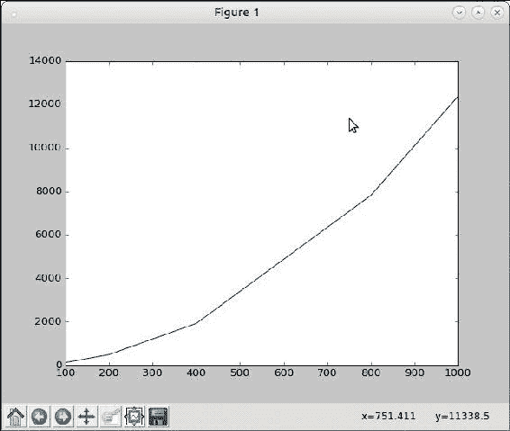

输入范围与 common_items 函数所花费时间的图表

显然这不是线性的，当然也不是二次的（与大 O 符号的图形相比）。让我们尝试绘制一个 O(n*log(n))的图表叠加在当前图表上，看看是否匹配。

由于我们现在需要两个`ydata`系列，我们需要另一个略微修改的函数：

```py
def plot_many(xdata, ydatas):
    """ Plot a sequence of ydatas (on y-axis) against xdata (on x-axis) """

    for ydata in ydatas:
        plt.plot(xdata, ydata)
    plt.show()
```

上述代码给出了以下输出：

```py
>>> ydata2=map(lambda x: x*math.log(x, 2), input)

>>> plot_many(xdata, [ydata2, ydata])
```

你会得到以下图表：

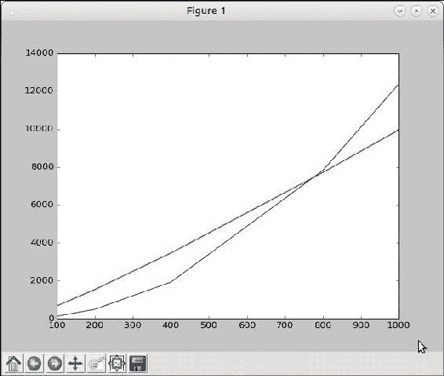

common_items 的时间复杂度图表叠加在 y=x*log(x)的图表上

叠加的图表显示，该函数与 n*log(n)阶数非常匹配，如果不是完全相同的话。因此，我们当前实现的复杂度似乎大致为 O(n*log(n))。

现在我们已经完成了性能分析，让我们看看是否可以重写我们的例程以获得更好的性能。

以下是当前的代码：

```py
def common_items(seq1, seq2):
    """ Find common items between two sequences """

    common = []
    for item in seq1:
        if item in seq2:
            common.append(item)

    return common
```

例程首先对外部的`for`循环（大小为`n`）进行一次遍历，并在一个序列（同样大小为`n`）中检查该项。现在第二次搜索的平均时间复杂度也是`n`。

然而，有些项会立即被找到，有些项会花费线性时间(k)，其中 1 < k < n。平均而言，分布会在两者之间，这就是为什么代码的平均复杂度接近 O(n*log(n))。

快速分析会告诉你，通过将外部序列转换为字典并将值设置为 1，可以避免内部搜索。内部搜索将被在第二个序列上的循环替代，该循环将值递增 1。

最后，所有共同项在新字典中的值都将大于 1。

新代码如下：

```py
def common_items(seq1, seq2):
    """ Find common items between two sequences, version 2.0 """

    seq_dict1 = {item:1 for item in seq1}

    for item in seq2:
        try:
            seq_dict1[item] += 1
        except KeyError:
            pass

    # Common items will have value > 1
    return [item[0] for item in seq_dict1.items() if item[1]>1]
```

通过这个改变，计时器给出了以下更新后的结果：

```py
>>> t=timeit.Timer('test()','from common_items import test,setup; setup(100)')
>>> 1000000.0*t.timeit(number=10000)/10000
35.777671200048644

>>> t=timeit.Timer('test()','from common_items import test,setup; setup(200)')
>>> 1000000.0*t.timeit(number=10000)/10000
65.20369809877593

>>> t=timeit.Timer('test()','from common_items import test,setup; setup(400)')
>>> 1000000.0*t.timeit(number=10000)/10000
139.67061050061602

>>> t=timeit.Timer('test()','from common_items import test,setup; setup(800)')
>>> 1000000.0*t.timeit(number=10000)/10000
287.0645995993982

>>> t=timeit.Timer('test()','from common_items import test,setup; setup(1000)')
>>> 1000000.0*t.timeit(number=10000)/10000
357.764518300246
```

让我们绘制这个图并叠加在 O(n)图上：

```py
>>> input=[100,200,400,800,1000]
>>> ydata=[36,65,140,287,358]

# Note that ydata2 is same as input as we are superimposing with y = x 
# graph
>>> ydata2=input
>>> plot.plot_many(xdata, [ydata, ydata2])
```

让我们来看一下下面的图表：

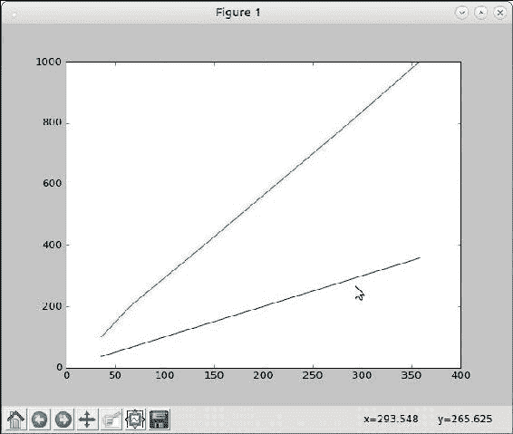

common_items 函数（v2）所花费的时间的图与 y = x 图

上面的绿线是参考**y** = **x**图，下面的蓝线是我们新函数所花费的时间的图。很明显，时间复杂度现在是线性的或者 O(n)。

然而，这里似乎有一个常数因子，因为两条线的斜率不同。通过快速计算，可以大致计算出这个因子约为`0.35`。

应用这个改变后，你会得到以下输出：

```py
>>> input=[100,200,400,800,1000]
>>> ydata=[36,65,140,287,358]

# Adjust ydata2 with the constant factor
>>> ydata2=map(lambda x: 0.35*x, input)
>>> plot.plot_many(xdata, [ydata, ydata2])
```

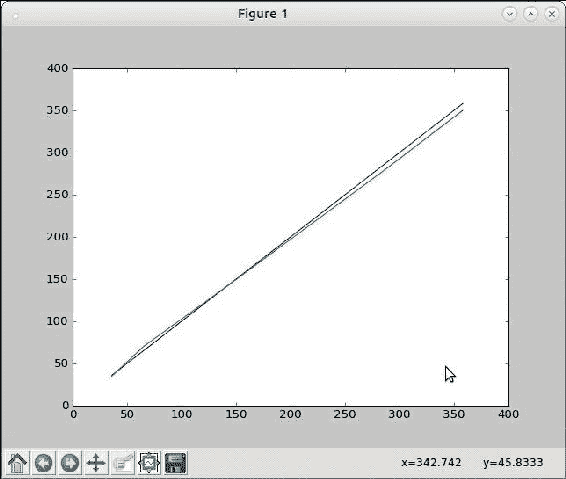

common_items 函数（v2）所花费的时间的图与 y = 0.35*x 图

你可以看到这些图几乎完全叠加在一起。因此我们的函数现在的性能是 O(c*n)，其中 c 约等于 0.35。

### 注意

`common_items`函数的另一个实现是将两个序列都转换为集合并返回它们的交集。读者可以尝试进行这种改变，计时并绘制图表以确定时间复杂度。

## 使用 timeit 测量 CPU 时间

`Timer`模块默认使用时间模块的`perf_counter`函数作为默认的`timer`函数。正如前面提到的，这个函数返回小时间段的最大精度的墙钟时间，因此它将包括任何睡眠时间、I/O 时间等。

通过向我们的测试函数添加一点睡眠时间，可以澄清这一点：

```py
def test():
    """ Testing the common_items function using a given input size """

    sleep(0.01)
    common = common_items(a1, a2)
```

上述代码将给出以下输出：

```py
>>> t=timeit.Timer('test()','from common_items import test,setup; setup(100)')
>>> 1000000.0*t.timeit(number=100)/100
10545.260819926625
```

由于我们在每次调用时睡眠了`0.01`秒（10 毫秒），所以时间增加了 300 倍，因此代码实际消耗的时间现在几乎完全由睡眠时间决定，因为结果显示为`10545.260819926625`微秒（大约 10 毫秒）。

有时候你可能会有这样的睡眠时间和其他阻塞/等待时间，但你只想测量函数实际消耗的 CPU 时间。为了使用这个功能，可以使用时间模块的`process_time`函数作为`timer`函数来创建`Timer`对象。

当你创建`Timer`对象时，可以通过传入一个`timer`参数来实现：

```py
>>> from time import process_time
>>> t=timeit.Timer('test()','from common_items import test,setup;setup(100)', timer=process_time)
>>> 1000000.0*t.timeit(number=100)/100
345.22438
```

如果你现在将睡眠时间增加 10 倍，测试时间也会增加相应的倍数，但计时器的返回值仍然保持不变。

例如，当睡眠 1 秒时，结果如下。输出大约在 100 秒后出现（因为我们迭代了`100`次），但请注意返回值（每次调用所花费的时间）并没有改变：

```py
>>> t=timeit.Timer('test()','from common_items import test,setup;setup(100)', timer=process_time)
>>> 1000000.0*t.timeit(number=100)/100
369.8039100000002

```

让我们接下来进行分析。

# 分析

在本节中，我们将讨论分析器，并深入研究 Python 标准库中提供的支持确定性分析的模块。我们还将研究提供分析支持的第三方库，如`line_profiler`和`memory_profiler`。

## 确定性分析

确定性性能分析意味着监视所有函数调用、函数返回和异常事件，并对这些事件之间的时间间隔进行精确计时。另一种类型的性能分析，即**统计性能分析**，会随机抽样指令指针，并推断时间花费在哪里-但这可能不是非常准确。

作为一种解释性语言，Python 在元数据方面已经有一定的开销。大多数确定性性能分析工具利用了这些信息，因此对于大多数应用程序来说，只会增加很少的额外处理开销。因此，在 Python 中进行确定性性能分析并不是一项非常昂贵的操作。

## 使用 cProfile 和 profile

`profile`和`cProfile`模块在 Python 标准库中提供了确定性性能分析的支持。`profile`模块纯粹由 Python 编写。`cProfile`模块是一个 C 扩展，模仿了`profile`模块的接口，但与`profile`相比，它的开销更小。

这两个模块都报告统计数据，使用`pstats`模块将其转换为可报告的结果。

我们将使用以下代码，这是一个质数迭代器，以展示我们使用`profile`模块的示例：

```py
class Prime(object):
    """ A prime number iterator for first 'n' primes """

    def __init__(self, n):
        self.n = n
        self.count = 0
        self.value = 0

    def __iter__(self):
        return self

    def __next__(self):
        """ Return next item in iterator """

        if self.count == self.n:
            raise StopIteration("end of iteration")
        return self.compute()

    def is_prime(self):
        """ Whether current value is prime ? """

        vroot = int(self.value ** 0.5) + 1
        for i in range(3, vroot):
            if self.value % i == 0:
                return False
        return True

    def compute(self):
        """ Compute next prime """

        # Second time, reset value
        if self.count == 1:
            self.value = 1

        while True:
            self.value += 2

            if self.is_prime():
                self.count += 1
                break

        return self.value
```

给定值`n`，质数迭代器生成前`n`个质数：

```py
>>> for p in Prime(5):
... print(p)
...
2
3
5
7
11
```

要对此代码进行性能分析，我们只需要将要执行的代码作为字符串传递给`profile`或`cProfile`模块的`run`方法。在以下示例中，我们将使用`cProfile`模块：

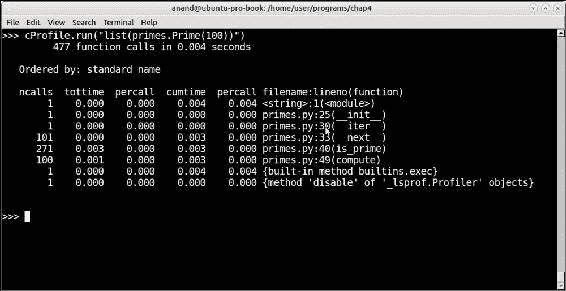

对前 100 个质数的质数迭代器函数的性能分析输出

看看性能分析器如何报告其输出。输出按以下六列排序：

+   `ncalls`：每个函数的调用次数

+   `tottime`：调用中花费的总时间

+   `percall`：`percall`时间（`tottime`/`ncalls`的商）

+   `cumtime`：此函数及任何子函数中的累积时间

+   `percall`：另一个`percall`列（`cumtime`/原始调用次数的商）

+   `filename: lineno(function)`：函数调用的文件名和行号

在这种情况下，我们的函数完成需要`4`微秒，其中大部分时间（`3`微秒）花在`is_prime`方法内部，这也占据了 271 次调用中的大部分。

以下是`n = 1000`和`10000`的性能分析输出：


对前 1,000 个质数的质数迭代器函数的性能分析输出

看一下以下额外输出：

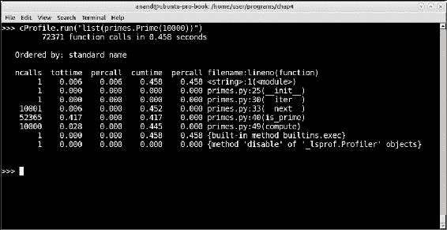

对前 10,000 个质数的质数迭代器函数的性能分析输出

如您所见，在`n`=`1000`时，大约需要`0.043`秒（43 微秒），而在`n`=`10000`时，需要`0.458`秒（458 微秒）。我们的`Prime`迭代器似乎以接近 O(n)的顺序执行。

像往常一样，大部分时间都花在`is_primes`上。有没有办法减少这段时间？

在这一点上，让我们分析一下代码。

### 质数迭代器类-性能调整

对代码的快速分析告诉我们，在`is_prime`内部，我们将值除以从`3`到值的平方根的后继数的范围内的每个数。

这包含许多偶数-我们正在进行不必要的计算，我们可以通过仅除以奇数来避免这种情况。

修改后的`is_prime`方法如下：

```py
    def is_prime(self):
        """ Whether current value is prime ? """

        vroot = int(self.value ** 0.5) + 1
        for i in range(3, vroot, 2):
            if self.value % i == 0:
                return False
        return True
```

因此，`n`=`1000`和`n`=`10000`的性能分析如下。

以下是`n = 1000`的性能分析输出。

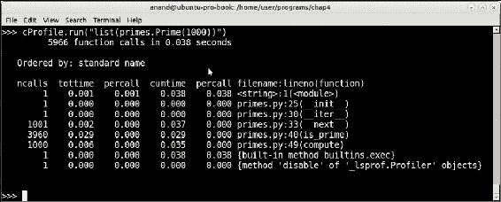

对前 1,000 个质数的质数迭代器函数的性能分析输出，使用了调整后的代码

以下是`n`=`10000`时的性能分析输出：

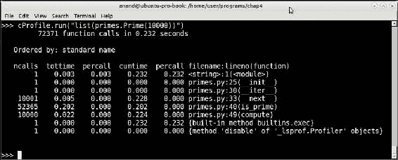

对调整后的代码进行前 10000 个质数的 Prime 迭代器函数的分析输出

您可以看到，在`1000`时，时间有所下降（从 43 微秒到 38 微秒），但在`10000`时，几乎有 50%的下降，从 458 微秒到 232 微秒。此时，该函数的性能优于 O(n)。

## 分析-收集和报告统计信息

我们之前在示例中使用 cProfile 的方式是直接运行并报告统计数据。使用该模块的另一种方式是将`filename`参数传递给它，它会将统计数据写入文件，稍后可以由`pstats`模块加载和解释。

我们修改代码如下：

```py
>>> cProfile.run("list(primes.Prime(100))", filename='prime.stats')
```

通过这样做，统计数据不会被打印出来，而是保存到名为`prime.stats`的文件中。

以下是如何使用`pstats`模块解析统计数据并按调用次数排序打印结果：

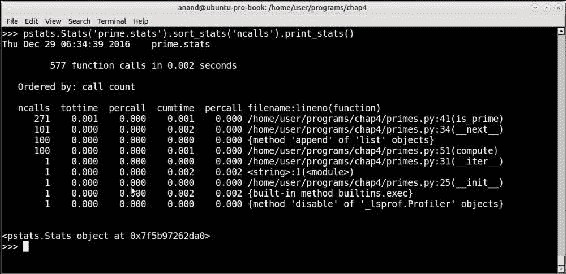

使用 pstats 模块解析和打印保存的配置文件结果

`pstats`模块允许按照多个标题对配置文件结果进行排序，例如总时间（`tottime`）、原始调用次数（`pcalls`）、累积时间（`cumtime`）等等。您可以从 pstats 的输出中再次看到，大部分处理都是在 is_prime 方法中进行的，因为我们按照'ncalls'或函数调用次数对输出进行排序。

`pstats`模块的`Stats`类在每次操作后都会返回对自身的引用。这是一些 Python 类的非常有用的特性，它允许我们通过链接方法调用来编写紧凑的一行代码。

`Stats`对象的另一个有用方法是找出被调用者/调用者的关系。这可以通过使用`print_callers`方法而不是`print_stats`来实现。以下是我们当前统计数据的输出：

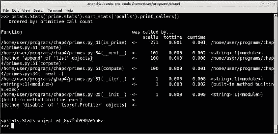

使用 pstats 模块按原始调用次数排序打印被调用者/调用者关系

## 第三方分析器

Python 生态系统提供了大量用于解决大多数问题的第三方模块。在分析器的情况下也是如此。在本节中，我们将快速浏览一下 Python 社区开发人员贡献的一些流行的第三方分析器应用程序。

### 行分析器

行分析器是由 Robert Kern 开发的一款应用程序，用于对 Python 应用程序进行逐行分析。它是用 Cython 编写的，Cython 是 Python 的优化静态编译器，可以减少分析的开销。

可以通过以下方式使用 pip 安装行分析器：

```py
$ pip3 install line_profiler

```

与 Python 中的分析模块相反，它们分析函数，行分析器能够逐行分析代码，从而提供更详细的统计信息。

行分析器附带一个名为`kernprof.py`的脚本，它使得使用行分析器对代码进行分析变得容易。当使用`kernprof`时，只需使用`@profile`装饰器装饰需要进行分析的函数。

例如，我们意识到我们的质数迭代器中大部分时间都花在了`is_prime`方法上。然而，行分析器允许我们更详细地查找这些函数中哪些行花费了最多的时间。

要做到这一点，只需使用`@profile`装饰器装饰该方法：

```py
    @profile
    def is_prime(self):
        """ Whether current value is prime ? """

        vroot = int(self.value ** 0.5) + 1
        for i in range(3, vroot, 2):
            if self.value % i == 0:
                return False
        return True
```

由于`kernprof`接受脚本作为参数，我们需要添加一些代码来调用质数迭代器。为此，我们可以在`primes.py`模块的末尾添加以下内容：

```py
# Invoke the code.
if __name__ == "__main__":
    l=list(Prime(1000))
```

现在，使用行分析器运行它：

```py
$ kernprof -l -v primes.py

```

通过向`kernprof`脚本传递`-v`，我们告诉它显示分析结果，而不仅仅是保存它们。

以下是输出：

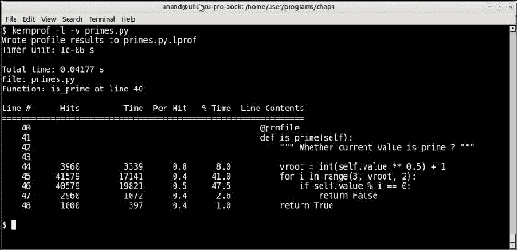

使用 n = 1000 对 is_prime 方法进行分析的行分析器结果

行分析器告诉我们，大部分时间-接近总时间的 90%都花在了方法的前两行上：for 循环和余数检查。

这告诉我们，如果我们想要优化这种方法，我们需要集中在这两个方面。

### 内存分析器

内存分析器类似于行分析器，它逐行分析 Python 代码。但是，它不是分析代码每行所花费的时间，而是通过内存消耗逐行分析代码。

内存分析器可以像行分析器一样安装：

```py
$ pip3 install memory_profiler

```

安装后，可以通过将函数装饰为`@profile`装饰器来打印行的内存，类似于行分析器。

这是一个简单的例子：

```py
# mem_profile_example.py
@profile
def squares(n):
    return [x*x for x in range(1, n+1)]

squares(1000)
```

以下是如何运行的：


内存分析器对前 1000 个数字的平方的列表推导式进行分析

内存分析器逐行显示内存增量。在这种情况下，包含平方数（列表推导式）的行几乎没有增量，因为数字相当小。总内存使用量保持在开始时的水平：约 32 MB。

如果我们将`n`的值更改为一百万会发生什么？可以通过将代码的最后一行改写为以下内容来实现：

```py
squares(100000)
```

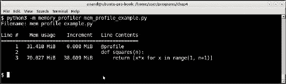

内存分析器对前 100 万个数字的平方的列表推导式进行分析

现在您可以看到，计算平方的列表推导式的内存增加约为 39 MB，最终总内存使用量约为 70 MB。

为了展示内存分析器的真正用处，让我们看另一个例子。

这涉及查找序列中作为另一个序列中任何字符串的子序列的字符串，通常包含较大的字符串。

### 子字符串（子序列）问题

假设您有一个包含以下字符串的序列：

```py
>>> seq1 = ["capital","wisdom","material","category","wonder"]
```

假设还有另一个序列如下：

```py
>>> seq2 = ["cap","mat","go","won","to","man"]
```

问题是要找到`seq2`中作为`seq1`中任何字符串中连续出现的子字符串：

在这种情况下，答案如下：

```py
>>> sub=["cap","mat","go","won"]
```

这可以通过蛮力搜索来解决-逐个检查每个字符串是否在父字符串中，如下所示：

```py
def sub_string_brute(seq1, seq2):
    """ Sub-string by brute force """

    subs = []
    for item in seq2:
        for parent in seq1:
            if item in parent:
                subs.append(item)

    return subs
```

然而，快速分析会告诉您，该函数的时间复杂度随着序列大小的增加而变得非常糟糕。由于每个步骤都需要迭代两个序列，然后在第一个序列的每个字符串中进行搜索，平均性能将是 O(n1*n2)，其中 n1，n2 分别是序列的大小。

以下是对此函数进行一些测试的结果，输入大小为随机字符串的长度 2 到 10 的两个序列的大小相同：

| 输入大小 | 花费时间 |
| --- | --- |
| 100 | 450 微秒 |
| 1000 | 52 微秒 |
| 10000 | 5.4 秒 |

结果表明性能几乎完全是 O(n²)。

有没有办法重写函数以提高性能？这种方法体现在以下`sub_string`函数中：

```py
def slices(s, n):
    return map(''.join, zip(*(s[i:] for i in range(n))))

def sub_string(seq1, seq2):
    """ Return sub-strings from seq2 which are part of strings in seq1 """

    # Create all slices of lengths in a given range
    min_l, max_l = min(map(len, seq2)), max(map(len, seq2))
    sequences = {}

    for i in range(min_l, max_l+1):
        for string in seq1:
	      # Create all sub sequences of given length i
         sequences.update({}.fromkeys(slices(string, i)))

    subs = []
    for item in seq2:
        if item in sequences:
            subs.append(item)

    return subs
```

在这种方法中，我们预先计算`seq1`中字符串的大小范围的所有子字符串，并将其存储在字典中。然后只需遍历`seq2`中的字符串，并检查它们是否在此字典中，如果是，则将它们添加到列表中。

为了优化计算，我们只计算大小在`seq2`字符串的最小和最大长度范围内的字符串。

与几乎所有解决性能问题的解决方案一样，这种方法以时间换空间。通过预先计算所有子字符串，我们在内存中消耗了更多的空间，但这简化了计算时间。

测试代码如下：

```py
import random
import string

seq1, seq2 = [], []

def random_strings(n, N):
     """ Create N random strings in range of 4..n and append
     to global sequences seq1, seq2 """

    global seq1, seq2
    for i in range(N):
        seq1.append(''.join(random.sample(string.ascii_lowercase,
                             random.randrange(4, n))))

    for i in range(N):
        seq2.append(''.join(random.sample(string.ascii_lowercase,
                             random.randrange(2, n/2))))  

def test(N):
    random_strings(10, N)
    subs=sub_string(seq1, seq2)

def test2():
    # random_strings has to be called before this
    subs=sub_string(seq1, seq2)
```

以下是使用`timeit`模块运行此函数的时间结果：

```py
>>> t=timeit.Timer('test2()',setup='from sub_string import test2, random_
strings;random_strings(10, 100)')
>>> 1000000*t.timeit(number=10000)/10000.0
1081.6103347984608
>>> t=timeit.Timer('test2()',setup='from sub_string import test2, random_
strings;random_strings(10, 1000)')
>>> 1000000*t.timeit(number=1000)/1000.0
11974.320339999394
>>> t=timeit.Timer('test2()',setup='from sub_string import test2, random_
strings;random_strings(10, 10000)')
>>> 1000000*t.timeit(number=100)/100.0124718.30968977883
124718.30968977883
>>> t=timeit.Timer('test2()',setup='from sub_string import test2, random_
strings;random_strings(10, 100000)')
>>> 1000000*t.timeit(number=100)/100.0
1261111.164370086
```

以下是此测试的总结结果：

| 输入大小 | 花费时间 |
| --- | --- |
| 100 | 1.08 微秒 |
| 1000 | 11.97 微秒 |
| 10000 | 0.12 微秒 |
| 100000 | 1.26 秒 |

表 2：通过蛮力解决方案的输入大小与花费时间

快速计算告诉我们，该算法现在的性能为 O(n)。非常好！

但这是以预先计算的字符串的内存为代价。我们可以通过调用内存分析器来估计这一点。

这是用于执行此操作的装饰函数：

```py
@profile
def sub_string(seq1, seq2):
    """ Return sub-strings from seq2 which are part of strings in seq1 """

    # Create all slices of lengths in a given range
    min_l, max_l = min(map(len, seq2)), max(map(len, seq2))
    sequences = {}

    for i in range(min_l, max_l+1):
        for string in seq1:
            sequences.update({}.fromkeys(slices(string, i)))

    subs = []
    for item in seq2:
        if item in sequences:
            subs.append(item)
```

现在测试函数如下：

```py
def test(N):
    random_strings(10, N)
    subs = sub_string(seq1, seq2)
```

让我们分别测试大小为 1,000 和 10,000 的序列。

以下是输入大小为 1,000 时的结果：

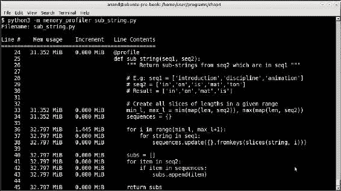

测试大小为 1,000 的序列的内存分析器结果

以下是输入大小为 10,000 时的结果：

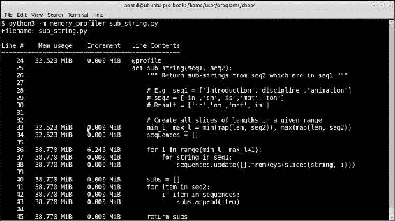

测试大小为 10,000 的序列的内存分析器结果

对于大小为 1,000 的序列，内存使用量增加了微不足道的 1.4 MB。对于大小为 10,000 的序列，它增加了 6.2 MB。显然，这些数字并不是非常显著的。

因此，使用内存分析器进行测试清楚地表明，尽管我们的算法在时间性能上效率高，但也具有高效的内存利用率。

# 其他工具

在本节中，我们将讨论一些其他工具，这些工具将帮助程序员调试内存泄漏，并使其能够可视化其对象及其关系。

## Objgraph

Objgraph（**对象图**）是一个 Python 对象可视化工具，它利用`graphviz`包绘制对象引用图。

它不是一个分析或检测工具，但可以与此类工具一起使用，以可视化复杂程序中的对象树和引用，同时寻找难以捉摸的内存泄漏。它允许您查找对象的引用，以找出是什么引用使对象保持活动状态。

与 Python 世界中的几乎所有内容一样，它可以通过`pip`安装：

```py
$ pip3 install objgraph

```

然而，objgraph 只有在能够生成图形时才真正有用。因此，我们需要安装`graphviz`包和`xdot`工具。

在 Debian/Ubuntu 系统中，您可以按照以下步骤安装：

```py
$ sudo apt install graphviz xdot -y

```

让我们看一个使用`objgraph`查找隐藏引用的简单示例：

```py
import objgraph

class MyRefClass(object):
    pass

ref=MyRefClass()
class C(object):pass

c_objects=[]
for i in range(100):
    c=C()
    c.ref=ref
    c_objects.append(c)

import pdb; pdb.set_trace()
```

我们有一个名为`MyRefClass`的类，其中有一个单一实例`ref`，由`for`循环中创建的 100 个`C`类的实例引用。这些是可能导致内存泄漏的引用。让我们看看`objgraph`如何帮助我们识别它们。

当执行这段代码时，它会停在调试器（`pdb`）处：

```py
$ python3 objgraph_example.py
--Return--
[0] > /home/user/programs/chap4/objgraph_example.py(15)<module>()->None
-> import pdb; pdb.set_trace()
(Pdb++) objgraph.show_backrefs(ref, max_depth=2, too_many=2, filename='refs.png')
Graph written to /tmp/objgraph-xxhaqwxl.dot (6 nodes)
Image generated as refs.png

```

### 注意

图像的左侧已被裁剪，只显示相关部分。

接下来是 objgraph 生成的图表：

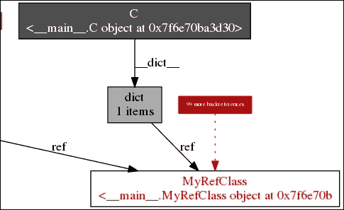

Objgraph 对象引用的可视化

前面图表中的红色框显示**99 个更多的引用**，这意味着它显示了一个**C**类的实例，并告诉我们还有 99 个类似的实例 - 总共有 100 个 C 类的实例，引用了单个对象**ref**。

在一个复杂的程序中，我们无法跟踪导致内存泄漏的对象引用，程序员可以利用这样的引用图。

## Pympler

Pympler 是一个用于监视和测量 Python 应用程序中对象内存使用情况的工具。它适用于 Python 2.x 和 3.x。可以使用`pip`安装如下：

```py
$ pip3 install pympler

```

Pympler 的文档相当缺乏。但是，它的众所周知的用途是通过其`asizeof`模块跟踪对象并打印其实际内存使用情况。

以下是我们修改后用于打印序列字典（其中存储了所有生成的子串）的内存使用情况的`sub_string`函数：

```py
from pympler import asizeof

def sub_string(seq1, seq2):
    """ Return sub-strings from seq2 which are part of strings in seq1 """

    # Create all slices of lengths in a given range
    min_l, max_l = min(map(len, seq2)), max(map(len, seq2))
    sequences = {}

    for i in range(min_l, max_l+1):
        for string in seq1:
            sequences.update({}.fromkeys(slices(string, i)))

    subs = []
    for item in seq2:
        if item in sequences:
            subs.append(item)
    print('Memory usage',asizeof.asized(sequences).format())

    return subs
```

当对大小为 10,000 的序列运行时：

```py
$ python3 sub_string.py
Memory usage {'awg': None, 'qlbo': None, 'gvap': No....te':** 
 **None, 'luwr':
 **None, 'ipat': None}** 
size=5874384** 
flat=3145824

```

`5870408`字节（约 5.6 MB）的内存大小与内存分析器报告的一致（约 6 MB）

Pympler 还带有一个名为`muppy`的包，允许跟踪程序中的所有对象。这可以通过`summary`包总结应用程序中所有对象（根据其类型分类）的内存使用情况。

这是我们使用 n =10,000 运行的`sub_string`模块的报告。为此，执行部分必须修改如下：

```py
if __name__ == "__main__":
    from pympler import summary
    from pympler import muppy
    test(10000)
    all_objects = muppy.get_objects()
    sum1 = summary.summarize(all_objects)
    summary.print_(sum1)
```

以下显示了`pympler`在程序结束时总结的输出：

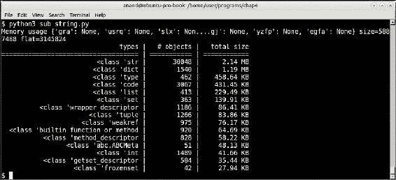

由 pympler 按对象类型分类的内存使用摘要

# 为性能编程——数据结构

我们已经看过了性能的定义、性能复杂度的测量以及测量程序性能的不同工具。我们还通过对代码进行统计、内存使用等进行了性能分析。

我们还看到了一些程序优化的例子，以改善代码的时间性能。

在本节中，我们将看一下常见的 Python 数据结构，并讨论它们的最佳和最差性能场景，还将讨论它们适合的理想情况以及它们可能不是最佳选择的一些情况。

## 可变容器——列表、字典和集合

列表、字典和集合是 Python 中最受欢迎和有用的可变容器。

列表适用于通过已知索引访问对象。字典为具有已知键的对象提供接近常数时间的查找。集合可用于保留项目组，同时丢弃重复项，并在接近线性时间内找到它们的差异、交集、并集等。

让我们依次看看每个。

### 列表

列表为以下操作提供了接近常数时间 O(1)的顺序：

+   通过`[]`运算符的`get(index)`

+   通过`.append`方法的`append(item)`

但是，在以下情况下，列表的性能表现不佳（O(n)）：

+   通过`in`运算符寻找项目

+   通过`.insert`方法在索引处插入

在以下情况下，列表是理想的选择：

+   如果您需要一个可变存储来保存不同类型或类的项目（异构）。

+   如果您的对象搜索涉及通过已知索引获取项目。

+   如果您不需要通过搜索列表进行大量查找（**item in list**）。

+   如果您的任何元素是不可哈希的。字典和集合要求它们的条目是可哈希的。因此，在这种情况下，您几乎默认使用列表。

如果您有一个庞大的列表——比如超过 100,000 个项目——并且您发现自己通过`in`运算符搜索元素，您应该将其替换为字典。

同样，如果您发现自己大部分时间都在向列表插入而不是附加，您可以考虑使用`collections`模块中的`deque`替换列表。

### 字典

字典为以下情况提供了常数时间顺序：

+   通过键设置项目

+   通过键获取项目

+   通过键删除项目

然而，与列表相比，字典占用的内存略多。字典在以下情况下很有用：

+   您不关心元素的插入顺序

+   在键方面没有重复的元素

字典也非常适合在应用程序开始时从源（数据库或磁盘）加载大量通过键唯一索引的数据，并且需要快速访问它们——换句话说，大量随机读取而不是较少的写入或更新。

### 集合

集合的使用场景介于列表和字典之间。在 Python 中，集合的实现更接近于字典——因为它们是无序的，不支持重复元素，并且通过键提供接近 O(1)的时间访问项目。它们在某种程度上类似于列表，因为它们支持弹出操作（即使它们不允许索引访问！）。

在 Python 中，集合通常用作处理其他容器的中间数据结构——用于删除重复项、查找两个容器之间的共同项等操作。

由于集合操作的顺序与字典完全相同，您可以在大多数需要使用字典的情况下使用它们，只是没有值与键相关联。

示例包括：

+   在丢弃重复项的同时，保留来自另一个集合的异构、无序数据

+   在应用程序中为特定目的处理中间数据-例如查找公共元素，组合多个容器中的唯一元素，删除重复项等

## 不可变容器-元组

元组是 Python 中列表的不可变版本。由于它们在创建后无法更改，因此不支持列表修改的任何方法，例如插入、附加等。

元组与使用索引和搜索（通过**item in tuple**）时的时间复杂度相同。但是，与列表相比，它们占用的内存开销要少得多；解释器对它们进行了更多优化，因为它们是不可变的。

因此，只要存在读取、返回或创建不会更改但需要迭代的数据容器的用例，就可以使用元组。以下是一些示例：

+   从数据存储加载的逐行数据，将仅具有读取访问权限。例如，来自 DB 查询的结果，从读取 CSV 文件的处理行等。

+   需要反复迭代的一组常量值。例如，从配置文件加载的配置参数列表。

+   从函数返回多个值。在这种情况下，除非显式返回列表，否则 Python 始终默认返回元组。

+   当可变容器需要成为字典键时。例如，当需要将列表或集合与字典键关联时，快速方法是将其转换为元组。

## 高性能容器-集合模块

集合模块提供了 Python 内置默认容器类型的高性能替代品，即`list`、`set`、`dict`和`tuple`。

我们将简要介绍集合模块中的以下容器类型：

+   `deque`：列表容器的替代品，支持快速插入和弹出

+   `defaultdict`：为提供缺失值的类型提供工厂函数的`dict`的子类

+   `OrderedDict`：记住插入键的顺序的`dict`的子类

+   `Counter`：用于保持可散列类型的计数和统计信息的字典子类

+   `Chainmap`：具有类似字典的接口的类，用于跟踪多个映射

+   `namedtuple`：用于创建具有命名字段的类似元组的类型

### 双端队列

双端队列或*双端队列*类似于列表，但支持几乎恒定的（O(1)）时间附加和弹出，而不是列表，列表在左侧弹出和插入的成本为 O(n)。

双端队列还支持旋转等操作，用于将`k`个元素从后面移动到前面，并且具有 O(k)的平均性能。这通常比列表中的类似操作稍快，列表涉及切片和附加：

```py
def rotate_seq1(seq1, n):
    """ Rotate a list left by n """
    # E.g: rotate([1,2,3,4,5], 2) => [4,5,1,2,3]

    k = len(seq1) - n
    return seq1[k:] + seq1[:k]

def rotate_seq2(seq1, n):
    """ Rotate a list left by n using deque """

    d = deque(seq1)
    d.rotate(n)
    return d
```

通过简单的`timeit`测量，您应该发现双端队列在性能上略优于列表（约 10-15%），在上面的示例中。

### defaultdict

默认字典是使用类型工厂提供默认值以提供字典键的字典子类。

在 Python 中遇到的一个常见问题是，当循环遍历项目列表并尝试增加字典计数时，可能不存在该项的现有条目。

例如，如果要计算文本中单词出现的次数：

```py
counts = {}
for word in text.split():
    word = word.lower().strip()
    try:
        counts[word] += 1
    except KeyError:
        counts[word] = 1
```

我们被迫编写前面的代码或其变体。

另一个例子是根据特定条件将对象分组到字典中，例如，尝试将所有长度相同的字符串分组到字典中：

```py
cities = ['Jakarta','Delhi','Newyork','Bonn','Kolkata','Bangalore','Seoul']
cities_len = {}
for city in cities:
  clen = len(city)
  # First create entry
  if clen not in cities_len:
    cities_len[clen] = []
  cities_len[clen].append(city)
```

`defaultdict`容器通过定义类型工厂来解决这些问题，以为尚未存在于字典中的任何键提供默认参数。默认工厂类型支持任何默认类型，并默认为`None`。

对于每种类型，其空值是默认值。这意味着：

```py
0 → default value for integers
[] → default value for lists
'' → default value for strings
{} → default value for dictionaries
```

然后可以将单词计数代码重写如下：

```py
counts = defautldict(int)
for word in text.split():
    word = word.lower().strip()
    # Value is set to 0 and incremented by 1 in one go
    counts[word] += 1
```

同样，对于按其长度分组字符串的代码，我们可以这样写：

```py
cities = ['Jakarta','Delhi','Newyork','Bonn','Kolkata','Bangalore','Seoul']
cities_len = defaultdict(list)
for city in cities:
    # Empty list is created as value and appended to in one go
    cities_len[len(city)].append(city)
```

### 有序字典

OrderedDict 是 dict 的子类，它记住条目插入的顺序。它有点像字典和列表的混合体。它的行为类似于映射类型，但也具有列表般的行为，可以记住插入顺序，并支持诸如`popitem`之类的方法来移除最后或第一个条目。

这里有一个例子：

```py
>>> cities = ['Jakarta','Delhi','Newyork','Bonn','Kolkata','Bangalore','Seoul']
>>> cities_dict = dict.fromkeys(cities)
>>> cities_dict
{'Kolkata': None, 'Newyork': None, 'Seoul': None, 'Jakarta': None, 'Delhi': None, 'Bonn': None, 'Bangalore': None}

# Ordered dictionary
>>> cities_odict = OrderedDict.fromkeys(cities)
>>> cities_odict
OrderedDict([('Jakarta', None), ('Delhi', None), ('Newyork', None), ('Bonn', None), ('Kolkata', None), ('Bangalore', None), ('Seoul', None)])
>>> cities_odict.popitem()
('Seoul', None)
>>> cities_odict.popitem(last=False)
('Jakarta', None)
```

你可以比较和对比字典如何改变顺序以及`OrdredDict`容器如何保持原始顺序。

这允许使用`OrderedDict`容器的一些配方。

#### 在不丢失顺序的情况下从容器中删除重复项

让我们修改城市列表以包括重复项：

```py
>>> cities = ['Jakarta','Delhi','Newyork','Bonn','Kolkata','Bangalore','Bonn','Seoul','Delhi','Jakarta','Mumbai']
>>> cities_odict = OrderedDict.fromkeys(cities)
>>> print(cities_odict.keys())
odict_keys(['Jakarta', 'Delhi', 'Newyork', 'Bonn', 'Kolkata', 'Bangalore', 'Seoul', 'Mumbai'])
```

看看重复项是如何被删除但顺序被保留的。

#### 实现最近最少使用（LRU）缓存字典

LRU 缓存优先考虑最近使用（访问）的条目，并丢弃最少使用的条目。这是 HTTP 缓存服务器（如 Squid）中常用的缓存算法，以及需要保持有限大小容器的地方，优先保留最近访问的项目。

在这里，我们利用了`OrderedDict`的行为：当现有键被移除并重新添加时，它会被添加到末尾（右侧）：

```py
class LRU(OrderedDict):
    """ Least recently used cache dictionary """

    def __init__(self, size=10):
        self.size = size

    def set(self, key):
        # If key is there delete and reinsert so
        # it moves to end.
        if key in self:
            del self[key]

        self[key] = 1
        if len(self)>self.size:
            # Pop from left
            self.popitem(last=False)
```

这里有一个演示。

```py
>>> d=LRU(size=5)
>>> d.set('bangalore')
>>> d.set('chennai')
>>> d.set('mumbai')
>>> d.set('bangalore')
>>> d.set('kolkata')
>>> d.set('delhi')
>>> d.set('chennai')

>>> len(d)
5
>>> d.set('kochi')
>>> d
LRU([('bangalore', 1), ('chennai', 1), ('kolkata', 1), ('delhi', 1), ('kochi', 1)])
```

由于键`mumbai`首先设置并且再也没有设置过，它成为了最左边的一个，并被删除了。

### 注意

注意下一个要删除的候选者是`bangalore`，接着是`chennai`。这是因为在`bangalore`设置后又设置了`chennai`。

### 计数器

计数器是字典的子类，用于保持可散列对象的计数。元素存储为字典键，它们的计数存储为值。`Counter`类是 C++等语言中多重集合的并行体，或者是 Smalltalk 等语言中的 Bag。

计数器是在处理任何容器时保持项目频率的自然选择。例如，可以使用计数器在解析文本时保持单词的频率或在解析单词时保持字符的频率。

例如，以下两个代码片段执行相同的操作，但计数器的代码更简洁紧凑。

它们都从在线古腾堡版本的著名福尔摩斯小说《巴斯克维尔的猎犬》的文本中返回最常见的 10 个单词。

+   在以下代码中使用`defaultdict`容器：

```py
import requests, operator
    text=requests.get('https://www.gutenberg.org/files/2852/2852-0.txt').text
    freq=defaultdict(int)
    for word in text.split():
        if len(word.strip())==0: continue
        freq[word.lower()] += 1
        print(sorted(freq.items(), key=operator.itemgetter(1), reverse=True) [:10])
```

+   在以下代码中使用`Counter`类：

```py
import requests
text = requests.get('https://www.gutenberg.org/files/2852/2852-0.txt').text
freq = Counter(filter(None, map(lambda x:x.lower().strip(), text.split())))
print(freq.most_common(10))
```

### ChainMap

`ChainMap`是一个类似字典的类，它将多个字典或类似的映射数据结构组合在一起，创建一个可更新的单一视图。

所有通常的字典方法都受支持。查找会搜索连续的映射，直到找到一个键。

`ChainMap`类是 Python 中较新的添加内容，它是在 Python 3.3 中添加的。

当你有一个场景，需要一遍又一遍地从源字典更新键到目标字典时，`ChainMap`类可以在性能方面对你有利，特别是如果更新次数很大。

以下是`ChainMap`的一些实际用途：

+   程序员可以将 web 框架的`GET`和`POST`参数保持在单独的字典中，并通过单个`ChainMap`更新配置。

+   在应用程序中保持多层配置覆盖。

+   当没有重叠的键时，可以将多个字典作为视图进行迭代。

+   `ChainMap`类在其 maps 属性中保留了先前的映射。然而，当你使用另一个字典的映射更新一个字典时，原始字典状态就会丢失。这里有一个简单的演示：

```py
>>> d1={i:i for i in range(100)}
>>> d2={i:i*i for i in range(100) if i%2}
>>> c=ChainMap(d1,d2)
# Older value accessible via chainmap
>>> c[5]
5
>>> c.maps[0][5]
5
# Update d1
>>> d1.update(d2)
# Older values also got updated
>>> c[5]
25
>>> c.maps[0][5]
25
```

### namedtuple

命名元组类似于具有固定字段的类。字段可以通过属性查找访问，就像普通类一样，但也可以通过索引访问。整个命名元组也可以像容器一样进行迭代。换句话说，命名元组行为类似于类和元组的结合体：

```py
>>> Employee = namedtuple('Employee', 'name, age, gender, title, department')
>>> Employee
<class '__main__.Employee'>
```

让我们创建一个 Employee 的实例：

```py
>>> jack = Employee('Jack',25,'M','Programmer','Engineering')
>>> print(jack)
Employee(name='Jack', age=25, gender='M', title='Programmer', department='Engineering')
```

我们可以遍历实例的字段，就好像它是一个迭代器：

```py
>>> for field in jack:
... print(field)
...
Jack
25
M
Programmer
Engineering
```

创建后，`namedtuple`实例就像元组一样是只读的：

```py
>>> jack.age=32
Traceback (most recent call last):
  File "<stdin>", line 1, in <module>
AttributeError: can't set attribute
```

要更新值，可以使用`_replace`方法。它返回一个具有指定关键字参数替换为新值的新实例：

```py
>>> jack._replace(age=32)
Employee(name='Jack', age=32, gender='M', title='Programmer', department='Engineering')
```

与具有相同字段的类相比，命名元组在内存效率上要高得多。因此，在以下情况下，命名元组非常有用：

+   需要将大量数据作为只读加载，从存储中获取键和值。例如，通过 DB 查询加载列和值，或者从大型 CSV 文件加载数据。

+   当需要创建大量类的实例，但属性上并不需要进行许多写入或设置操作时，可以创建`namedtuple`实例以节省内存，而不是创建类实例。

+   可以使用`_make`方法加载现有的可迭代对象，以相同顺序返回一个`namedtuple`实例。例如，如果有一个`employees.csv`文件，其中列名、年龄、性别、职称和部门按顺序排列，我们可以使用以下命令将它们全部加载到`namedtuples`的容器中：

```py
employees = map(Employee._make, csv.reader(open('employees.csv'))
```

## 概率数据结构 - 布隆过滤器

在我们结束对 Python 中容器数据类型的讨论之前，让我们来看看一个重要的概率数据结构，名为**布隆过滤器**。Python 中的布隆过滤器实现类似于容器，但它们具有概率性质。

布隆过滤器是一种稀疏的数据结构，允许我们测试集合中元素的存在性。但是，我们只能确定元素在集合中不存在 - 也就是说，我们只能断言真负。当布隆过滤器告诉我们元素在集合中时，它可能在那里 - 换句话说，元素实际上可能丢失的概率不为零。

布隆过滤器通常实现为位向量。它们的工作方式类似于 Python 字典，因为它们使用哈希函数。但是，与字典不同，布隆过滤器不存储实际的元素本身。此外，一旦添加元素，就无法从布隆过滤器中删除。

当源数据的数量意味着如果我们存储所有数据而没有哈希冲突，就会占用非常大的内存时，就会使用布隆过滤器。

在 Python 中，`pybloom`包提供了一个简单的布隆过滤器实现（但是在撰写本文时，它不支持 Python 3.x，因此这里的示例是在 Python 2.7.x 中显示的）：

```py
$ pip install pybloom

```

让我们编写一个程序，从《巴斯克维尔的猎犬》文本中读取并索引单词，这是我们在讨论计数器数据结构时使用的示例，但这次使用布隆过滤器：

```py
# bloom_example.py
from pybloom import BloomFilter
import requests

f=BloomFilter(capacity=100000, error_rate=0.01)
text=requests.get('https://www.gutenberg.org/files/2852/2852-0.txt').text

for word in text.split():
    word = word.lower().strip()
    f.add(word)

print len(f)
print len(text.split())
for w in ('holmes','watson','hound','moor','queen'):
    print 'Found',w,w in f
```

执行此操作，我们得到以下输出：

```py
$ python bloomtest.py
9403
62154
Found holmes True
Found watson True
Found moor True
Found queen False

```

### 注意

在《巴斯克维尔的猎犬》故事中，`holmes`、`watson`、`hound`和`moor`是最常见的单词，因此布隆过滤器能够找到这些单词是令人放心的。另一方面，`queen`这个词在文本中从未出现，因此布隆过滤器在这一点上是正确的（真负）。文本中单词的长度为 62,154，其中只有 9,403 个被索引到过滤器中。

让我们尝试测量布隆过滤器的内存使用情况，与计数器相比。为此，我们将依赖于内存分析器。

对于这个测试，我们将使用`Counter`类重写代码如下：

```py
# counter_hound.py
import requests
from collections import Counter

@profile
def hound():
    text=requests.get('https://www.gutenberg.org/files/2852/2852-0.txt').text
    c = Counter()
    words = [word.lower().strip() for word in text.split()]
    c.update(words)

if __name__ == "__main__":
    hound()
```

使用布隆过滤器的情况如下：

```py
# bloom_hound.py
from pybloom import BloomFilter
import requests

@profile
def hound():
    f=BloomFilter(capacity=100000, error_rate=0.01)
    text=requests.get('https://www.gutenberg.org/files/2852/2852-0.txt').text

    for word in text.split():
        word = word.lower().strip()
        f.add(word)

if __name__ == "__main__":
    hound()
```

以下是运行内存分析器的第一个输出：

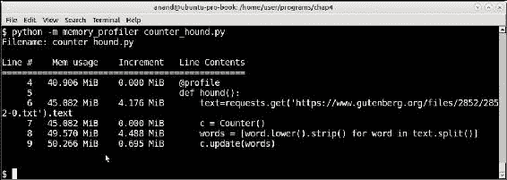

解析《巴斯克维尔的猎犬》文本时计数器对象的内存使用情况

第二个的结果如下：

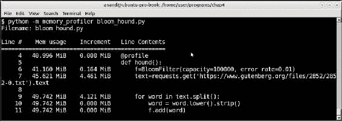

布隆过滤器用于解析《巴斯克维尔的猎犬》文本的内存使用情况

最终的内存使用量大约相同，每个约为 50 MB。在 Counter 的情况下，当 Counter 类被创建时几乎不使用内存，但在向计数器添加单词时使用了接近 0.7 MB。

然而，这两种数据结构之间的内存增长模式存在明显的差异。

在布隆过滤器的情况下，在创建时为其分配了 0.16 MB 的初始内存。添加单词似乎几乎不会给过滤器或程序增加内存。

那么，什么时候应该使用布隆过滤器，而不是在 Python 中使用字典或集合？以下是一些一般原则和现实世界使用场景：

+   当您对不存储实际元素本身，而只对元素的存在（或不存在）感兴趣时。换句话说，您的应用用例更依赖于检查数据的缺失而不是其存在。

+   当您的输入数据量非常大，以至于在内存中存储每个项目（如字典或哈希表）是不可行的时。布隆过滤器在内存中占用的数据要少得多，而不是确定性数据结构。

+   当您对数据集的*假阳性*具有一定的明确定义的错误率满意时 - 比如说在 100 万条数据中有 5% - 您可以为特定的错误率配置一个布隆过滤器，并获得满足您要求的数据命中率。

一些使用布隆过滤器的现实世界例子如下：

+   **安全测试**：在浏览器中存储恶意 URL 的数据，例如

+   **生物信息学**：测试基因组中某种模式（k-mer）的存在

+   为了避免在分布式网络缓存基础设施中存储只有一个命中的 URL

# 总结

本章主要讨论了性能。在本章开始时，我们讨论了性能和 SPE。我们看了性能测试和诊断工具的两类 - 即压力测试工具和分析/仪器工具。

然后我们讨论了性能复杂性在大 O 符号中的真正含义，并简要讨论了函数的常见时间顺序。我们看了函数执行所花费的时间，并学习了 POSIX 系统中的三种时间使用方式 - 即`real`，`user`和`sys`。

我们在下一节中转向了性能和时间的测量 - 从简单的上下文管理器计时器开始，然后使用`timeit`模块进行更准确的测量。我们测量了一系列输入大小的某些算法所花费的时间。通过将所花费的时间与输入大小进行绘图，并将其叠加在标准时间复杂性图上，我们能够直观地了解函数的性能复杂性。我们将常见的项目问题从 O(n*log(n))性能优化到 O(n)，并绘制了时间使用的图表来证实这一点。

然后我们开始讨论代码的性能分析，并看到了使用`cProfile`模块进行性能分析的一些示例。我们选择的示例是一个返回前`n`个质数的质数迭代器，其性能为 O(n)。使用分析数据，我们对代码进行了一些优化，使其性能优于 O(n)。我们简要讨论了`pstats`模块，并使用其`Stats`类来读取分析数据并生成按可用数据字段数量排序的自定义报告。我们讨论了另外两个第三方分析器 - `liner_profiler`和`memory_profiler`，它们逐行分析代码 - 并讨论了在两个字符串序列中查找子序列的问题，编写了它们的优化版本，并使用这些分析器测量了其时间和内存使用情况。

在其他工具中，我们讨论了 objgraph 和 pympler - 前者作为一种可视化工具，用于查找对象之间的关系和引用，帮助探索内存泄漏，后者作为一种监视和报告代码中对象内存使用情况并提供摘要的工具。

在上一节关于 Python 容器的部分中，我们看了标准 Python 容器（如列表、字典、集合和元组）的最佳和最差的使用情况。然后我们研究了 collections 模块中的高性能容器类，包括`deque`、`defaultdict`、`OrderedDict`、`Counter`、`Chainmap`和`namedtuple`，并提供了每个容器的示例和用法。具体来说，我们看到了如何使用`OrderedDict`非常自然地创建 LRU 缓存。

在本章的最后，我们讨论了一种特殊的数据结构，称为布隆过滤器，它作为一种概率数据结构非常有用，可以确定地报告真负例，并在预定义的错误率内报告真正例。

在下一章中，我们将讨论性能的近亲扩展性，我们将探讨编写可扩展应用程序的技术，以及在 Python 中编写可扩展和并发程序的细节。
