# 第五章：编写可扩展的应用程序

想象一下超市的收银台在一个周六晚上，通常是高峰时间。常见的是看到长队的人在等待结账购物。店长可以做些什么来减少拥挤和等待时间呢？

典型的经理会尝试一些方法，包括告诉那些操作结账柜台的人加快速度，并尝试重新分配人员到不同的队列，以便每个队列大致等待时间相同。换句话说，他将通过*优化现有资源的性能*来管理当前负载与可用资源。

然而，如果商店有未使用的柜台，并且有足够的人手来管理它们，经理可以启用这些柜台，并将人员移动到这些新柜台。换句话说，他将向商店添加资源以*扩展*操作。

软件系统也以类似的方式扩展。可以通过向现有软件应用程序添加计算资源来扩展它。

当系统通过添加或更好地利用计算节点内的资源（如 CPU 或 RAM）来扩展时，它被称为*垂直扩展*或*向上扩展*。另一方面，当系统通过向其添加更多计算节点（例如创建负载平衡的服务器集群）来扩展时，它被称为*水平扩展*或*向外扩展*。

当计算资源增加时，软件系统能够扩展的程度称为其*可扩展性*。可扩展性是指系统的性能特征，如吞吐量或延迟，随着资源的增加而改善的程度。例如，如果一个系统通过增加服务器数量来扩展其容量，它就是线性扩展的。

增加系统的并发通常会增加其可扩展性。在前面给出的超市例子中，经理能够通过开设额外的柜台来扩展他的业务。换句话说，他增加了商店中同时进行的工作量。并发是系统中同时完成的工作量。

在本章中，我们将探讨使用 Python 扩展软件应用程序的不同技术。

在本章中，我们将按照下面的主题大致讨论。

+   可扩展性和性能

+   并发

+   并发性和并行性

+   Python 中的并发性 - 多线程

缩略图生成器

缩略图生成器 - 生产者/消费者架构

缩略图生成器 - 程序结束条件

缩略图生成器 - 使用锁的资源约束

缩略图生成器 - 使用信号量的资源约束

资源约束 - 信号量 vs 锁

缩略图生成器 - 使用条件控制器的 URL 速率控制器

多线程 - Python 和 GIL

+   Python 中的并发性 - 多进程

素性检查器

排序磁盘文件

排序磁盘文件 - 使用计数器

排序磁盘文件 - 使用多进程

+   多线程 vs 多进程

+   Python 中的并发性 - 异步执行

抢占式 vs 协作式多任务处理

Python 中的 Asyncio

等待未来 - 异步和等待

并发未来 - 高级并发处理

+   并发选项 - 如何选择？

+   并行处理库

+   joblib

+   PyMP

分形 - 曼德布洛特集

分形 - 缩放曼德布洛特集实现

+   为 Web 扩展

+   扩展工作流程 - 消息队列和任务队列

+   Celery - 分布式任务队列

曼德布洛特集 - 使用 Celery

+   在 Web 上提供 Python - WSGI

uWSGI - WSGI 中间件的超级版

gunicorn - WSGI 的独角兽

gunicorn vs uWSGI

+   可扩展性架构

+   垂直可扩展性架构

+   水平可扩展性架构

# 可扩展性和性能

我们如何衡量系统的可扩展性？让我们举个例子，看看如何做到这一点。

假设我们的应用是一个简单的员工报告生成系统。它能够从数据库中加载员工数据，并批量生成各种报告，如工资单、税收扣除报告、员工请假报告等。

系统能够每分钟生成 120 份报告——这是系统吞吐量或容量的表达，表示在给定时间内成功完成的操作数量。假设在服务器端生成报告所需的时间（延迟）大约为 2 秒。

假设架构师决定通过在服务器上加倍 RAM 来扩展系统

完成此操作后，测试显示系统能够将吞吐量提高到每分钟 180 份报告。延迟保持在 2 秒。

因此，此时系统在增加的内存方面实现了“接近线性”的扩展。系统的可伸缩性以吞吐量增加的方式表达如下：

可伸缩性（吞吐量）= 180/120 = 1.5 倍

作为第二步，架构师决定在后端将服务器数量加倍，所有服务器的内存相同。此步骤后，他发现系统的性能吞吐量现在增加到每分钟 350 份报告。此步骤实现的可伸缩性如下：

可伸缩性（吞吐量）= 350/180 = 1.9 倍

系统现在以接近线性的方式做出了更好的响应，提高了可伸缩性。

经过进一步分析，架构师发现通过重写在服务器上处理报告的代码，使其在多个进程中运行而不是单个进程，他能够在高峰时期将每个请求的处理时间减少约 1 秒。延迟现在从 2 秒降至 1 秒。

系统的性能在延迟方面已经变得更好

性能（延迟）：X = 2/1 = 2 倍

这如何改善可伸缩性？由于现在处理每个请求所需的时间更短，系统整体将能够以比之前更快的速度响应类似的负载。在其他因素保持不变的情况下，系统的吞吐性能和因此可伸缩性已经提高。

让我们总结一下我们迄今讨论的内容：

1.  在第一步中，架构师通过增加额外内存作为资源来扩展单个系统的吞吐量，从而增加了系统的整体可伸缩性。换句话说，他通过“纵向扩展”来扩展单个系统的性能，从而提高了整个系统的性能。

1.  在第二步中，他向系统添加了更多节点，因此系统能够同时执行工作，并发现系统以接近线性的可伸缩性因子回报他。换句话说，他通过增加计算节点来扩展系统的资源容量，从而提高了系统的可伸缩性。因此，他通过“横向扩展”来增加了系统的可伸缩性，即通过添加更多计算节点。

1.  在第三步中，他通过在多个进程中运行计算来进行关键修复。换句话说，他通过将计算分成多个部分来增加单个系统的并发性。他发现这提高了应用程序的性能特征，通过减少其延迟，潜在地使应用程序能够更好地处理高压工作负载。

我们发现可伸缩性、性能、并发性和延迟之间存在关系。这可以解释如下：

1.  当系统中某个组件的性能提高时，通常整个系统的性能也会提高。

1.  当应用程序通过增加并发性在单台机器上扩展时，它有潜力提高性能，从而提高部署系统的净可伸缩性。

1.  当系统减少其性能时间或服务器端的延迟时，这对可伸缩性是积极的贡献。

我们已经在以下表格中捕捉到了这些关系：

| 并发性 | 延迟 | 性能 | 可扩展性 |
| --- | --- | --- | --- |
| 高 | 低 | 高 | 高 |
| 高 | 高 | 可变 | 可变 |
| 低 | 高 | 差 | 差 |

理想的系统是具有良好并发性和低延迟的系统；这样的系统具有高性能，并且对于扩展和/或横向扩展会有更好的响应。

具有高并发性但也有高延迟的系统将具有可变的特征——其性能，因此，可扩展性可能对其他因素非常敏感，例如当前系统负载、网络拥塞、计算资源和请求的地理分布等。

低并发和高延迟的系统是最糟糕的情况——很难扩展这样的系统，因为它具有较差的性能特征。在架构师决定横向或纵向扩展系统之前，应该先解决延迟和并发性问题。

可扩展性总是以性能吞吐量的变化来描述。

# 并发性

系统的并发性是系统能够同时执行工作而不是顺序执行的程度。一般来说，编写为并发的应用程序在给定时间内可以执行更多的工作单位，而不是编写为顺序或串行的应用程序。

当将串行应用程序并发化时，可以更好地利用系统中现有的计算资源——CPU 和/或 RAM——在给定时间内。换句话说，并发性是以计算资源成本为代价，使应用程序在机器内扩展的最便宜的方式。

并发可以通过不同的技术实现。常见的包括以下几种：

1.  **多线程**：并发的最简单形式是将应用程序重写为在不同线程中执行并行任务。线程是 CPU 可以执行的最简单的编程指令序列。一个程序可以包含任意数量的线程。通过将任务分配给多个线程，程序可以同时执行更多的工作。所有线程都在同一个进程内运行。

1.  **多进程**：将程序并发地扩展到多个进程而不是单个进程是另一种方法。多进程在消息传递和共享内存方面的开销比多线程更大。然而，执行大量 CPU 密集型计算的程序比多线程更适合多进程。

1.  **异步处理**：在这种技术中，操作是异步执行的，没有特定的任务顺序与时间有关。异步处理通常从任务队列中选择任务，并安排它们在将来的某个时间执行，通常在回调函数或特殊的 future 对象中接收结果。异步处理通常发生在单个线程中。

还有其他形式的并发计算，但在本章中，我们将只关注这三种。

Python，特别是 Python 3，在其标准库中内置支持所有这些类型的并发计算技术。例如，它通过其*threading*模块支持多线程，并通过其*multiprocessing*模块支持多进程。异步执行支持可通过*asyncio*模块获得。一种将异步执行与线程和进程结合起来的并发处理形式可通过*concurrent.futures*模块获得。

在接下来的章节中，我们将逐个查看每个，并提供足够的示例。

### 注意

注意：asyncio 模块仅在 Python 3 中可用

## 并发与并行

我们将简要介绍并发概念及其近亲并行概念。

并发和并行都是关于同时执行工作而不是顺序执行。然而，在并发中，两个任务不需要在完全相同的时间执行；相反，它们只需要被安排同时执行。另一方面，并行性要求两个任务在给定的时间点同时执行。

举一个现实生活的例子，假设你正在为你房子的两面外墙涂漆。你只雇用了一个画家，你发现他花的时间比你想象的要多。你可以通过以下两种方式解决问题：

1.  指示画家在切换到下一面墙之前在一面墙上涂几层，然后在另一面墙上做同样的事情。假设他很有效，他将同时（虽然不是在同一时间）在两面墙上工作，并在给定的时间内达到相同的完成度。这是一个*并发*解决方案。

1.  再雇用一个画家。指示第一个画家涂第一面墙，第二个画家涂第二面墙。这是一个*并行*解决方案。

两个线程在单核 CPU 中执行字节码计算并不完全进行并行计算，因为 CPU 一次只能容纳一个线程。然而，从程序员的角度来看，它们是并发的，因为 CPU 调度程序快速地在线程之间进行切换，使它们看起来是并行运行的。

然而，在多核 CPU 上，两个线程可以在不同的核心上同时进行并行计算。这是真正的并行。

并行计算要求计算资源至少与其规模成线性增长。通过使用多任务处理技术，可以实现并发计算，其中工作被安排并批量执行，更好地利用现有资源。

### 注意

在本章中，我们将统一使用术语*并发*来指示两种类型的执行。在某些地方，它可能表示传统方式的并发处理，而在其他地方，它可能表示真正的并行处理。使用上下文来消除歧义。

## Python 中的并发 - 多线程

我们将从 Python 中的多线程开始讨论并发技术。

Python 通过其*threading*模块支持多线程编程。线程模块公开了一个`Thread`类，它封装了一个执行线程。除此之外，它还公开了以下同步原语：

1.  一个`Lock`对象，用于同步保护对共享资源的访问，以及它的表兄弟`RLock`。

1.  一个 Condition 对象，用于线程在等待任意条件时进行同步。

1.  `Event`对象，它提供了线程之间的基本信号机制。

1.  一个`Semaphore`对象，它允许对有限资源进行同步访问。

1.  一个`Barrier`对象，它允许一组固定的线程等待彼此，同步到特定状态，然后继续。

Python 中的线程对象可以与队列模块中的同步`Queue`类结合使用，用于实现线程安全的生产者/消费者工作流程。

# 缩略图生成器

让我们从一个用于生成图像 URL 缩略图的程序的例子开始讨论 Python 中的多线程。

在这个例子中，我们使用**Pillow**，它是**Python Imaging Library**（**PIL**）的一个分支，来执行这个操作：

```py
# thumbnail_converter.py
from PIL import Image
import urllib.request

def thumbnail_image(url, size=(64, 64), format='.png'):
    """ Save thumbnail of an image URL """

    im = Image.open(urllib.request.urlopen(url))
    # filename is last part of the URL minus extension + '.format'
    pieces = url.split('/')
    filename = ''.join((pieces[-2],'_',pieces[-1].split('.')[0],'_thumb',format))
    im.thumbnail(size, Image.ANTIALIAS)
    im.save(filename)  
    print('Saved',filename)
```

前面的代码对单个 URL 非常有效。

假设我们想要将五个图像 URL 转换为它们的缩略图：

```py
img_urls = ['https://dummyimage.com/256x256/000/fff.jpg',
 **'https://dummyimage.com/320x240/fff/00.jpg',
 **'https://dummyimage.com/640x480/ccc/aaa.jpg',
 **'https://dummyimage.com/128x128/ddd/eee.jpg',
 **'https://dummyimage.com/720x720/111/222.jpg']
for url in img_urls:
    thumbnail_image(urls)
```

让我们看看这样一个函数在所花费的时间方面的表现：

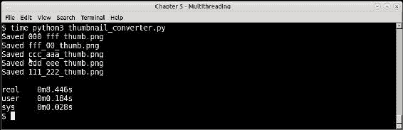

对于 5 个 URL 的串行缩略图转换的响应时间

该函数大约每个 URL 花费了 1.7 秒的时间。

现在让我们将程序扩展到多个线程，这样我们就可以同时进行转换。以下是重写的代码，以便在每个转换中运行自己的线程：

```py
import threading

for url in img_urls:
    t=threading.Thread(target=thumbnail_image,args=(url,))
    t.start()
```

现在，这个最后一个程序的时间显示在这个截图中：

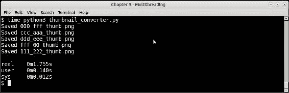

5 个 URL 的线程缩略图转换的响应时间

通过这个改变，程序返回时间为 1.76 秒，几乎等于串行执行之前单个 URL 所花费的时间。换句话说，程序现在与线程数量成线性关系。请注意，我们无需对函数本身进行任何更改即可获得这种可伸缩性提升。

## 缩略图生成器 - 生产者/消费者架构

在前面的例子中，我们看到一组图像 URL 被缩略图生成器函数并发处理，使用多个线程。通过使用多个线程，我们能够实现接近线性的可伸缩性，与串行执行相比。

然而，在现实生活中，与其处理固定的 URL 列表，更常见的是 URL 数据由某种 URL 生产者生成。例如，可以从数据库、逗号分隔值（CSV）文件或 TCP 套接字中获取这些数据。

在这种情况下，为每个 URL 创建一个线程将是一种巨大的资源浪费。在系统中创建线程需要一定的开销。我们需要一种方法来重用我们创建的线程。

对于涉及一定数量的线程生成数据和另一组线程消耗或处理数据的系统，生产者/消费者模型是一个理想的选择。这样的系统具有以下特点：

1.  生产者是一种专门的工作者（线程）类，用于生成数据。它们可以从特定来源接收数据，或者自己生成数据。

1.  生产者将数据添加到共享的同步队列中。在 Python 中，这个队列由名为 `queue` 的模块中的 `Queue` 类提供。

1.  另一组专门的工作者类，即消费者，等待队列获取（消费）数据。一旦获取数据，他们就会处理它并产生结果。

1.  当生产者停止生成数据并且消费者无法获取数据时，程序结束。可以使用超时、轮询或毒丸等技术来实现这一点。当发生这种情况时，所有线程退出，程序完成。

我们已经将我们的缩略图生成器重写为生产者消费者架构。接下来是生成的代码。由于这有点详细，我们将逐个讨论每个类。

首先，让我们看一下导入部分 - 这些都相当容易理解：

```py
# thumbnail_pc.py
import threading
import time
import string
import random
import urllib.request
from PIL import Image
from queue import Queue
```

接下来是生产者类的代码：

```py
class ThumbnailURL_Generator(threading.Thread):
    """ Worker class that generates image URLs """

    def __init__(self, queue, sleep_time=1,):
        self.sleep_time = sleep_time
        self.queue = queue
        # A flag for stopping
        self.flag = True
        # choice of sizes
        self._sizes = (240,320,360,480,600,720)
        # URL scheme
        self.url_template = 'https://dummyimage.com/%s/%s/%s.jpg'
        threading.Thread.__init__(self, name='producer')

    def __str__(self):
        return 'Producer'

    def get_size(self):
        return '%dx%d' % (random.choice(self._sizes),
                          random.choice(self._sizes))

    def get_color(self):
        return ''.join(random.sample(string.hexdigits[:-6], 3))

    def run(self):
        """ Main thread function """

        while self.flag:
            # generate image URLs of random sizes and fg/bg colors
            url = self.url_template % (self.get_size(),
                                       self.get_color(),
                                       self.get_color())
            # Add to queue
            print(self,'Put',url)
            self.queue.put(url)
            time.sleep(self.sleep_time)

    def stop(self):
        """ Stop the thread """

        self.flag = False
```

让我们分析生产者类的代码：

1.  该类名为 `ThumbnailURL_Generator`。它生成不同尺寸、前景和背景颜色的 URL（通过使用名为 [`dummyimage.com`](http://dummyimage.com) 的网站的服务）。它继承自 `threading.Thread` 类。

1.  它有一个 `run` 方法，进入循环，生成一个随机图像 URL，并将其推送到共享队列。每次，线程都会休眠一段固定的时间，由 `sleep_time` 参数配置。

1.  该类公开了一个 `stop` 方法，它将内部标志设置为 `False`，导致循环中断并且线程完成其处理。这通常可以由另一个线程外部调用，通常是主线程。

现在，URL 消费者类消耗缩略图 URL 并创建缩略图：

```py
class ThumbnailURL_Consumer(threading.Thread):
    """ Worker class that consumes URLs and generates thumbnails """

    def __init__(self, queue):
        self.queue = queue
        self.flag = True
        threading.Thread.__init__(self, name='consumer')     

    def __str__(self):
        return 'Consumer'

    def thumbnail_image(self, url, size=(64,64), format='.png'):
        """ Save image thumbnails, given a URL """

        im=Image.open(urllib.request.urlopen(url))
        # filename is last part of URL minus extension + '.format'
        filename = url.split('/')[-1].split('.')[0] + '_thumb' + format
        im.thumbnail(size, Image.ANTIALIAS)
        im.save(filename)
        print(self,'Saved',filename)    

    def run(self):
        """ Main thread function """

        while self.flag:
            url = self.queue.get()
            print(self,'Got',url)
            self.thumbnail_image(url)

    def stop(self):
        """ Stop the thread """

        self.flag = False            
```

以下是消费者类的分析：

1.  该类名为 `ThumbnailURL_Consumer`，它从队列中获取 URL，并创建其缩略图图像。

1.  该类的 `run` 方法进入循环，从队列中获取一个 URL，并通过将其传递给 `thumbnail_image` 方法将其转换为缩略图。（请注意，此代码与我们之前创建的 `thumbnail_image` 函数完全相同。）

1.  `stop` 方法非常相似，每次在循环中检查停止标志，并在标志被取消后结束。

这是代码的主要部分 - 设置一对生产者和消费者，并运行它们：

```py
    q = Queue(maxsize=200)
    producers, consumers = [], []

    for i in range(2):
        t = ThumbnailURL_Generator(q)
        producers.append(t)
        t.start()

    for i in range(2):
        t = ThumbnailURL_Consumer(q)
        consumers.append(t)
        t.start()
```

这是程序运行的屏幕截图：

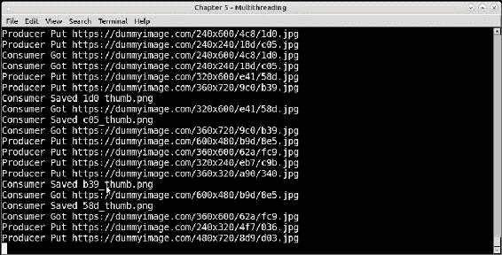

使用 4 个线程运行缩略图生产者/消费者程序，每种类型 2 个

在上述程序中，由于生产者不断生成随机数据而没有结束，消费者将继续消耗它而没有结束。我们的程序没有适当的结束条件。

因此，该程序将一直运行，直到网络请求被拒绝或超时，或者由于缩略图而使机器的磁盘空间耗尽。

然而，解决真实世界问题的程序应该以可预测的方式结束。

这可能是由于许多外部约束造成的。

+   可以引入一个超时，在这种情况下，消费者等待一定的最大时间获取数据，如果在此期间没有可用数据，则退出。例如，这可以在队列的`get`方法中配置为超时。

+   另一种技术是在消耗或创建一定数量的资源后发出程序结束信号。例如，在该程序中，可以限制创建的缩略图数量。

在接下来的部分中，我们将看到如何通过使用线程同步原语（如 Locks 和 Semaphores）来强制执行此类资源限制。

### 注意

您可能已经注意到，我们使用`start`方法启动线程，尽管线程子类中的重写方法是`run`。这是因为在父`Thread`类中，`start`方法设置了一些状态，然后在内部调用`run`方法。这是调用线程的运行方法的正确方式。它不应该直接调用。

## 缩略图生成器-使用锁的资源约束

在前面的部分中，我们看到了如何重写生产者/消费者架构中的缩略图生成器程序。然而，我们的程序有一个问题——它会无休止地运行，直到磁盘空间或网络带宽耗尽。

在本节中，我们将看到如何使用`Lock`来修改程序，`Lock`是一种同步原语，用于实现限制创建图像数量的计数器，以结束程序。

Python 中的 Lock 对象允许线程对共享资源进行独占访问。

伪代码如下：

```py
try:
  lock.acquire()
  # Do some modification on a shared, mutable resource
  mutable_object.modify()
finally:
  lock.release()
```

然而，Lock 对象支持上下文管理器，通过`with`语句更常见地编写如下：

```py
with lock:
  mutable_object.modify()
```

为了实现每次运行固定数量的图像，我们的代码需要支持添加一个计数器。然而，由于多个线程将检查和增加此计数器，因此需要通过`Lock`对象进行同步。

这是我们使用 Locks 实现的资源计数器类的第一个实现。

```py
class ThumbnailImageSaver(object):
    """ Class which saves URLs to thumbnail images and keeps a counter """

    def __init__(self, limit=10):
        self.limit = limit
        self.lock = threading.Lock()
        self.counter = {}

    def thumbnail_image(self, url, size=(64,64), format='.png'):
        """ Save image thumbnails, given a URL """

        im=Image.open(urllib.request.urlopen(url))
        # filename is last two parts of URL minus extension + '.format'
        pieces = url.split('/')
        filename = ''.join((pieces[-2],'_',pieces[-1].split('.')[0],'_thumb',format))
        im.thumbnail(size, Image.ANTIALIAS)
        im.save(filename)
        print('Saved',filename)
        self.counter[filename] = 1      
        return True

    def save(self, url):
        """ Save a URL as thumbnail """

        with self.lock:
            if len(self.counter)>=self.limit:
                return False
            self.thumbnail_image(url)
            print('Count=>',len(self.counter))
            return True
```

由于这也修改了消费者类，因此讨论这两个更改是有意义的。这是修改后的消费者类，以适应需要跟踪图像的额外计数器：

```py
class ThumbnailURL_Consumer(threading.Thread):
    """ Worker class that consumes URLs and generates thumbnails """

    def __init__(self, queue, saver):
        self.queue = queue
        self.flag = True
        self.saver = saver
        # Internal id
        self._id = uuid.uuid4().hex
        threading.Thread.__init__(self, name='Consumer-'+ self._id)     

    def __str__(self):
        return 'Consumer-' + self._id

    def run(self):
        """ Main thread function """

        while self.flag:
            url = self.queue.get()
            print(self,'Got',url)
            if not self.saver.save(url):
               # Limit reached, break out
               print(self, 'Set limit reached, quitting')
               break

    def stop(self):
        """ Stop the thread """

        self.flag = False
```

让我们分析这两个类。首先是新类`ThumbnailImageSaver`。

1.  这个类派生自`object`。换句话说，它不是一个`Thread`。它不是一个`Thread`。

1.  它在初始化方法中初始化了一个锁对象和一个计数器字典。锁用于线程同步访问计数器。它还接受一个等于应保存的图像数量的`limit`参数。

1.  `thumbnail_image`方法从消费者类移动到这里。它从一个使用锁的上下文中的`save`方法调用。

1.  `save`方法首先检查计数是否超过了配置的限制；当这种情况发生时，该方法返回`False`。否则，通过调用`thumbnail_image`保存图像，并将图像文件名添加到计数器，有效地增加计数。

接下来是修改后的`ThumbnailURL_Consumer`类。

1.  该类的初始化程序已修改为接受`ThumbnailImageSaver`的实例作为`saver`参数。其余参数保持不变。

1.  在这个类中，`thumbnail_image`方法不再存在，因为它已经移动到新的类中。

1.  `run`方法大大简化。它调用保存程序实例的`save`方法。如果返回`False`，则表示已达到限制，循环中断，消费者线程退出。

1.  我们还修改了`__str__`方法，以返回每个线程的唯一 ID，该 ID 在初始化时使用`uuid`模块设置。这有助于在实际示例中调试线程。

调用代码也稍有更改，因为它需要设置新对象，并配置消费者线程：

```py
q = Queue(maxsize=2000)
# Create an instance of the saver object
saver = ThumbnailImageSaver(limit=100)

    producers, consumers = [], []
    for i in range(3):
        t = ThumbnailURL_Generator(q)
        producers.append(t)
        t.start()

    for i in range(5):
        t = ThumbnailURL_Consumer(q, saver)     
        consumers.append(t)
        t.start()

    for t in consumers:
        t.join()
        print('Joined', t, flush=True)

    # To make sure producers don't block on a full queue
    while not q.empty():
        item=q.get()

    for t in producers:
        t.stop()
        print('Stopped',t, flush=True)

    print('Total number of PNG images',len(glob.glob('*.png')))
```

以下是需要注意的主要要点：

1.  我们创建了新的`ThumbnailImageSaver`类的实例，并在创建消费者线程时将其传递给它们。

1.  我们首先等待消费者。请注意，主线程不调用`stop`，而是对它们调用`join`。这是因为当达到限制时，消费者会自动退出，因此主线程应该等待它们停止。

1.  在消费者退出后，我们明确地停止生产者-因为否则它们将永远工作，因为没有条件让生产者退出。

我们使用字典而不是整数，因为数据的性质。

由于图像是随机生成的，因此有可能一个图像 URL 与之前创建的另一个图像 URL 相同，导致文件名冲突。使用字典可以解决这种可能的重复情况。

以下屏幕截图显示了使用 100 张图像限制运行程序的情况。请注意，我们只能显示控制台日志的最后几行，因为它会产生大量输出：

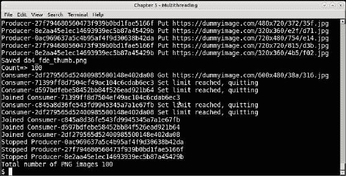

使用锁限制 100 张图像的缩略图生成程序的运行

您可以将此程序配置为任何图像限制，并且它将始终获取完全相同的数量-既不多也不少。

在下一节中，我们将熟悉另一个同步原语，即*信号量*，并学习如何使用信号量以类似的方式实现资源限制类。

## 使用信号量的缩略图生成器-资源约束

锁不是实现同步约束和在其上编写逻辑的唯一方法，例如限制系统使用/生成的资源。

信号量是计算机科学中最古老的同步原语之一，非常适合这种用例。

信号量是用大于零的值初始化的：

1.  当线程在具有正内部值的信号量上调用`acquire`时，该值会减少一个，并且线程会继续进行。

1.  当另一个线程在信号量上调用`release`时，该值会增加 1。

1.  一旦值达到零，任何线程调用`acquire`都会在信号量上被阻塞，直到另一个线程调用*release*唤醒它。

由于这种行为，信号量非常适合在共享资源上实现固定限制。

在下面的代码示例中，我们将使用信号量实现另一个用于限制缩略图生成器程序资源的类：

```py
class ThumbnailImageSemaSaver(object):
    """ Class which keeps an exact counter of saved images
    and restricts the total count using a semaphore """

    def __init__(self, limit = 10):
        self.limit = limit
        self.counter = threading.BoundedSemaphore(value=limit)
        self.count = 0

    def acquire(self):
        # Acquire counter, if limit is exhausted, it
        # returns False
        return self.counter.acquire(blocking=False)

    def release(self):
        # Release counter, incrementing count
        return self.counter.release()

    def thumbnail_image(self, url, size=(64,64), format='.png'):
        """ Save image thumbnails, given a URL """

        im=Image.open(urllib.request.urlopen(url))
        # filename is last two parts of URL minus extension + '.format'
        pieces = url.split('/')
        filename = ''.join((pieces[-2],'_',pieces[-1].split('.')[0],format))        
        try:
            im.thumbnail(size, Image.ANTIALIAS)
            im.save(filename)
            print('Saved',filename)
            self.count += 1
        except Exception as e:
            print('Error saving URL',url,e)
            # Image can't be counted, increment semaphore
            self.release()

        return True

    def save(self, url):
        """ Save a URL as thumbnail """

        if self.acquire():
            self.thumbnail_image(url)
            return True
        else:
            print('Semaphore limit reached, returning False')
            return False
```

由于基于信号量的新类保持与基于锁的先前类完全相同的接口-具有保存方法-因此不需要更改任何消费者代码！

只有调用代码需要更改。

在先前的代码中初始化了`ThumbnailImageSaver`实例的这一行：

```py
saver = ThumbnailImageSaver(limit=100)
```

前一行需要替换为以下行：

```py
   saver = ThumbnailImageSemaSaver(limit=100)
```

其余代码保持完全相同。

在看到这段代码之前，让我们快速讨论一下使用信号量的新类：

1.  `acquire`和`release`方法只是对信号量上相同方法的简单包装。

1.  我们在初始化程序中使用图像限制的值来初始化信号量。

1.  在保存方法中，我们调用`acquire`方法。如果信号量的限制已达到，它将返回`False`。否则，线程保存图像并返回`True`。在前一种情况下，调用线程退出。

### 注意

这个类的内部计数属性只用于调试。它对限制图像的逻辑没有任何添加。

这个类的行为方式与前一个类似，并且确切地限制资源。以下是一个限制为 200 张图片的示例：

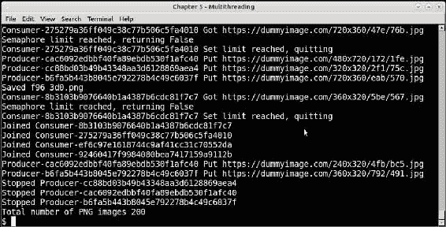

使用信号量运行缩略图生成程序，限制为 200 张图片

## 资源约束-信号量与锁

在前两个示例中，我们看到了两个实现固定资源约束的竞争版本——一个使用`Lock`，另一个使用`Semaphore`。

两个版本之间的区别如下：

1.  使用锁的版本保护了所有修改资源的代码——在这种情况下，检查计数器、保存缩略图和增加计数器——以确保没有数据不一致。

1.  信号量版本更像是一个门，当计数低于限制时门是打开的，任意数量的线程可以通过，只有当达到限制时才关闭。换句话说，它不会互斥地排除线程调用缩略图保存函数。

因此，信号量版本的效果将比使用锁的版本更快。

有多快？以下是一个运行 100 张图片的计时示例。

这个截图显示了使用锁版本保存 100 张图片所需的时间：

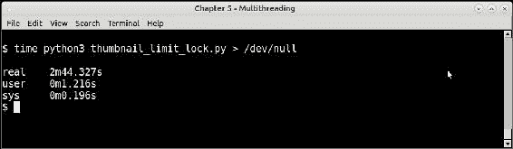

计时缩略图生成程序的运行——锁版本——100 张图片

以下截图显示了使用信号量版本保存类似数量的时间：

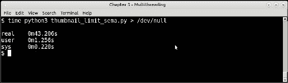

计时缩略图生成程序的运行——信号量版本——100 张图片

通过快速计算，您可以看到信号量版本比锁版本快大约 4 倍，逻辑相同。换句话说，它*扩展 4 倍*。

## 缩略图生成器-使用条件控制 URL 速率

在本节中，我们将简要介绍线程中另一个重要的同步原语的应用，即`Condition`对象。

首先，我们将得到一个使用`Condition`对象的现实生活示例。我们将为我们的缩略图生成器实现一个节流器，以管理 URL 生成的速率。

在现实生活中的生产者/消费者系统中，关于数据生产和消费速度，可能会出现以下三种情况：

1.  生产者产生的数据速度比消费者消耗的速度快。这导致消费者总是在追赶生产者。生产者产生的多余数据可能会积累在队列中，导致队列消耗更多的内存和 CPU 使用率，从而使程序变慢。

1.  消费者以比生产者更快的速度消耗数据。这导致消费者总是在队列上等待数据。这本身并不是问题，只要生产者不落后太多。在最坏的情况下，这会导致系统的一半，即消费者，保持空闲，而另一半——生产者——试图满足需求。

1.  生产者和消费者以几乎相同的速度工作，保持队列大小在限制范围内。这是理想的情况。

有许多方法可以解决这个问题。其中一些如下：

1.  **具有固定大小的队列**——一旦队列大小限制达到，生产者将被迫等待，直到数据被消费者消耗。然而，这几乎总是使队列保持满状态。

1.  **为工作线程提供超时和其他职责**：生产者和/或消费者可以使用超时在队列上等待，而不是保持阻塞状态。当超时时，它们可以在返回并等待队列之前睡眠或执行其他职责。

1.  **动态配置工作线程的数量**：这是一种方法，其中工作线程池的大小会根据需求自动增加或减少。如果某一类工作线程领先，系统将启动相反类别的所需数量的工作线程以保持平衡。

1.  **调整数据生成速率**：在这种方法中，我们通过生产者静态或动态地调整数据生成速率。例如，系统可以配置为以固定速率生成数据，比如每分钟 50 个 URL，或者它可以计算消费者的消费速率，并动态调整生产者的数据生成速率以保持平衡。

在下面的示例中，我们将实现最后一种方法 - 使用`Condition`对象将 URL 的生产速率限制为固定限制。

`Condition`对象是一种复杂的同步原语，带有隐式内置锁。它可以等待任意条件直到条件变为 True。当线程在条件上调用`wait`时，内部锁被释放，但线程本身变为阻塞状态：

```py
cond = threading.Condition()
# In thread #1
with cond:
    while not some_condition_is_satisfied():
        # this thread is now blocked
        cond.wait()
```

现在，另一个线程可以通过将条件设置为 True 来唤醒前面的线程，然后在条件对象上调用`notify`或`notify_all`。此时，前面被阻塞的线程被唤醒，并继续执行：

```py
# In thread #2
with cond:
    # Condition is satisfied
    if some_condition_is_satisfied():
        # Notify all threads waiting on the condition
        cond.notify_all()
```

这是我们的新类，即`ThumbnailURLController`，它使用条件对象实现 URL 生成的速率控制。

```py
class ThumbnailURLController(threading.Thread):
    """ A rate limiting controller thread for URLs using conditions """

    def __init__(self, rate_limit=0, nthreads=0):
        # Configured rate limit
        self.rate_limit = rate_limit
        # Number of producer threads
        self.nthreads = nthreads
        self.count = 0
        self.start_t = time.time()
        self.flag = True
        self.cond = threading.Condition()
        threading.Thread.__init__(self)

    def increment(self):
        # Increment count of URLs
        self.count += 1

    def calc_rate(self):
        rate = 60.0*self.count/(time.time() - self.start_t)
        return rate

    def run(self):
        while self.flag:
            rate = self.calc_rate()
            if rate<=self.rate_limit:
                with self.cond:
                    # print('Notifying all...')
                    self.cond.notify_all()

    def stop(self):
        self.flag = False

    def throttle(self, thread):
        """ Throttle threads to manage rate """
        # Current total rate
        rate = self.calc_rate()
        print('Current Rate',rate)
        # If rate > limit, add more sleep time to thread
        diff = abs(rate - self.rate_limit)
        sleep_diff = diff/(self.nthreads*60.0)

        if rate>self.rate_limit:
            # Adjust threads sleep_time
            thread.sleep_time += sleep_diff
            # Hold this thread till rate settles down with a 5% error
            with self.cond:
                print('Controller, rate is high, sleep more by',rate,sleep_diff)                
                while self.calc_rate() > self.rate_limit:
                    self.cond.wait()
        elif rate<self.rate_limit:
            print('Controller, rate is low, sleep less by',rate,sleep_diff)                         
            # Decrease sleep time
            sleep_time = thread.sleep_time
            sleep_time -= sleep_diff
            # If this goes off < zero, make it zero
            thread.sleep_time = max(0, sleep_time)
```

在讨论生产者类中的更改之前，让我们先讨论上述代码：

1.  该类是`Thread`的一个实例，因此它在自己的执行线程中运行。它还持有一个 Condition 对象。

1.  它有一个`calc_rate`方法，通过保持计数器和使用时间戳来计算 URL 生成的速率。

1.  在`run`方法中，检查速率。如果低于配置的限制，条件对象会通知所有等待它的线程。

1.  最重要的是，它实现了一个`throttle`方法。该方法使用通过`calc_rate`计算的当前速率，并用它来限制和调整生产者的睡眠时间。它主要做这两件事：

1.  如果速率高于配置的限制，则导致调用线程在条件对象上等待，直到速率稳定下来。它还计算了线程在循环中应该睡眠的额外时间，以调整速率到所需水平。

1.  如果速率低于配置的限制，则线程需要更快地工作并产生更多数据，因此它计算睡眠差并相应地降低睡眠限制。

以下是生产者类的代码，以包含这些更改：

```py
class ThumbnailURL_Generator(threading.Thread):
    """ Worker class that generates image URLs and supports throttling via an external controller """

    def __init__(self, queue, controller=None, sleep_time=1):
        self.sleep_time = sleep_time
        self.queue = queue
        # A flag for stopping
        self.flag = True
        # sizes
        self._sizes = (240,320,360,480,600,720)
        # URL scheme
        self.url_template = 'https://dummyimage.com/%s/%s/%s.jpg'
        # Rate controller
        self.controller = controller
        # Internal id
        self._id = uuid.uuid4().hex
        threading.Thread.__init__(self, name='Producer-'+ self._id)

    def __str__(self):
        return 'Producer-'+self._id

    def get_size(self):
        return '%dx%d' % (random.choice(self._sizes),
                          random.choice(self._sizes))

    def get_color(self):
        return ''.join(random.sample(string.hexdigits[:-6], 3))

    def run(self):
        """ Main thread function """

        while self.flag:
            # generate image URLs of random sizes and fg/bg colors
            url = self.url_template % (self.get_size(),
                                       self.get_color(),
                                       self.get_color())
            # Add to queue
            print(self,'Put',url)
            self.queue.put(url)
            self.controller.increment()
            # Throttle after putting a few images
            if self.controller.count>5:
                self.controller.throttle(self)

            time.sleep(self.sleep_time)

    def stop(self):
        """ Stop the thread """

        self.flag = False
```

让我们看看这段最后的代码是如何工作的：

1.  该类现在在初始化时接受一个额外的控制器对象。这是之前给出的控制器类的实例。

1.  放置 URL 后，它会增加控制器上的计数。一旦计数达到最小限制（设置为 5 以避免过早地限制生产者），它会在控制器上调用`throttle`，并将自身作为参数传递。

调用代码也需要进行相当多的更改。修改后的代码如下所示：

```py
    q = Queue(maxsize=2000)
    # The controller needs to be configured with exact number of 
    # producers
    controller = ThumbnailURLController(rate_limit=50, nthreads=3)
    saver = ThumbnailImageSemaSaver(limit=200)

    controller.start()

    producers, consumers = [], []
    for i in range(3):
        t = ThumbnailURL_Generator(q, controller)
        producers.append(t)
        t.start()

    for i in range(5):
        t = ThumbnailURL_Consumer(q, saver)     
        consumers.append(t)
        t.start()

    for t in consumers:
        t.join()
        print('Joined', t, flush=True)

    # To make sure producers dont block on a full queue
    while not q.empty():
        item=q.get()
    controller.stop()

    for t in producers:
        t.stop()
        print('Stopped',t, flush=True)

    print('Total number of PNG images',len(glob.glob('*.png')))
```

这里的主要更改如下所列：

1.  控制器对象被创建 - 具有将要创建的生产者的确切数量。这有助于正确计算每个线程的睡眠时间。

1.  生产者线程本身在初始化时会传入控制器的实例。

1.  控制器在所有其他线程之前作为一个线程启动。

这是以每分钟 50 张图片的速率配置了 200 张图片的程序运行。我们展示了运行程序输出的两张图片，一张是程序开始时的，另一张是接近结束时的。

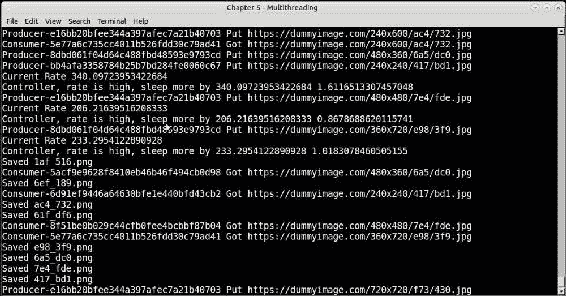

以每分钟 50 个 URL 的速率启动缩略图程序

你会发现，当程序启动时，几乎立即变慢，几乎停止，因为原始速率很高。这里发生的是，生产者调用`throttle`方法，由于速率很高，它们都被阻塞在条件对象上。

几秒钟后，速率下降到规定的限制，因为没有生成 URL。这在控制器的循环中被检测到，并调用`notify_all`唤醒它们。

过一会儿，你会发现速率稳定在每分钟 50 个 URL 的设定限制周围。

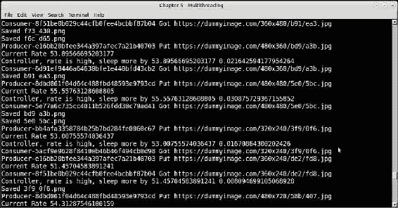

带有 URL 速率控制器的缩略图程序在启动后 5-6 秒

在程序接近结束时，你会发现速率几乎已经稳定在确切的限制上：

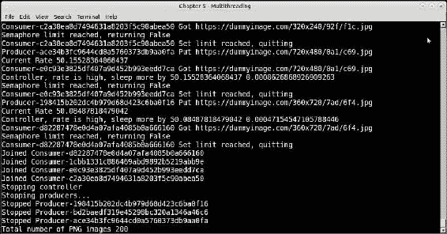

朝着结束的方向，带有 URL 速率控制器的缩略图程序

我们即将结束我们关于线程原语的讨论，以及如何在程序中提高并发性和实现共享资源约束和控制时使用它们。

在我们结束之前，我们将看一下 Python 线程的一个方面，它阻止多线程程序在 Python 中充分利用 CPU 的能力 - 即 GIL 或全局解释器锁。

# 多线程 - Python 和 GIL

在 Python 中，有一个全局锁，防止多个线程同时执行本机字节码。这个锁是必需的，因为 CPython（Python 的本机实现）的内存管理不是线程安全的。

这个锁被称为**全局解释器锁**或**GIL**。

由于全局解释器锁（GIL），Python 无法在 CPU 上并发执行字节码操作。因此，Python 几乎不适用于以下情况：

+   当程序依赖于一些重型字节码操作，希望并发运行时

+   当程序使用多线程在单台机器上充分利用多个 CPU 核心的全部性能

I/O 调用和长时间运行的操作通常发生在 GIL 之外。因此，在 Python 中，多线程只有在涉及一定量的 I/O 或类似操作（如图像处理）时才有效。

在这种情况下，将程序扩展到超出单个进程的并发扩展是一个方便的方法。Python 通过其`multiprocessing`模块实现了这一点，这是我们下一个讨论的主题。

## Python 中的并发性 - 多进程

Python 标准库提供了一个多进程模块，允许程序员编写使用多个进程而不是线程并发扩展的程序。

由于多进程可以跨多个进程扩展计算，它有效地消除了 Python 中的 GIL 问题。程序可以有效地利用多个 CPU 核心使用这个模块。

此模块公开的主要类是`Process`类，它是线程模块中`Thread`类的类似物。它还提供了一些同步原语，几乎与线程模块中的同类相对应。

我们将通过使用此模块提供的`Pool`对象来开始一个示例。它允许一个函数在多个输入上并行执行进程。

## 一个素数检查器

以下函数是一个简单的素数检查函数，即输入的数字是否为素数：

```py
def is_prime(n):
    """ Check for input number primality """

    for i in range(3, int(n**0.5+1), 2):
        if n % i == 0:
            print(n,'is not prime')
            return False

    print(n,'is prime')     
    return True
```

以下是一个使用上述函数从队列中检查素数的线程类：

```py
# prime_thread.py
import threading

class PrimeChecker(threading.Thread):
    """ Thread class for primality checking """

    def __init__(self, queue):
        self.queue = queue
        self.flag = True
        threading.Thread.__init__(self)     

    def run(self):

        while self.flag:
            try:
                n = self.queue.get(timeout=1)
                is_prime(n)
            except Empty:
                break
```

我们将用 1000 个大素数进行测试。为了节省这里表示的列表的空间，我们做的是取其中的 10 个数字并将列表乘以 100：

```py
    numbers = [1297337, 1116281, 104395303, 472882027, 533000389,     
               817504243, 982451653, 112272535095293, 115280095190773,    
               1099726899285419]*100

    q = Queue(1000)

    for n in numbers:
        q.put(n)

    threads = []
    for i in range(4):
        t = PrimeChecker(q)
        threads.append(t)
        t.start()

    for t in threads:
        t.join()
```

我们已经为这个测试使用了四个线程。让我们看看程序的表现，如下截图所示：

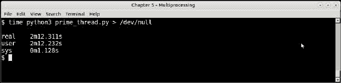

使用 4 个线程的 1000 个数字的素数检查器

现在，这是使用多进程`Pool`对象的等效代码：

```py
    numbers = [1297337, 1116281, 104395303, 472882027, 533000389,   
               817504243, 982451653, 112272535095293, 115280095190773,  
               1099726899285419]*100
    pool = multiprocessing.Pool(4)
    pool.map(is_prime, numbers)
```

下面的截图显示了它在相同一组数字上的表现：

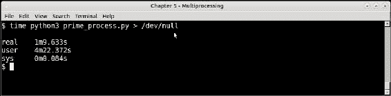

使用 4 个进程的多进程池的 1000 个数字的素数检查器

通过比较这些数字，我们得出以下结论：

1.  进程池版本的实际时间，即 1 分 9.6 秒（69.6 秒）的挂钟时间，几乎比线程池版本的 2 分 12 秒（132 秒）少了 50%。

1.  但是，请注意，进程池版本的用户时间——即在 CPU 内部用于用户代码的时间——为 4 分 22 秒（262 秒），几乎是线程池版本的 2 分 12 秒（132 秒）的两倍。

1.  线程池版本的真实 CPU 时间和用户 CPU 时间完全相同，都是 2 分 12 秒。这清楚地表明，线程版本只能在一个 CPU 核心中有效地执行。

这意味着进程池版本能够更好地利用所有的 CPU 核心，因为对于线程池版本的实际时间的 50%，它能够利用 CPU 时间两倍。

因此，两个程序在 CPU 时间/实际时间方面的真正性能提升如下：

1.  线程版本 → 132 秒/132 秒 = 1

1.  进程版本 → 262 秒/69.6 秒 = 3.76 约等于 4

因此，进程版本相对于线程版本的真实性能比率如下：

4/1 = 4

程序执行的机器具有四核 CPU。这清楚地表明，代码的多进程版本能够几乎平均利用 CPU 的所有四个核心。

这是因为线程版本受到了 GIL 的限制，而进程版本没有这样的限制，可以自由地利用所有的核心。

在下一节中，让我们来解决一个更复杂的问题——对基于磁盘的文件进行排序。

## 排序磁盘文件

想象一下，你在磁盘上有数十万个文件，每个文件包含一定数量的整数，范围在给定范围内。假设我们需要对这些文件进行排序并合并成一个单一的文件。

如果我们决定将所有这些数据加载到内存中，将需要大量的 RAM。让我们快速计算一下，对于一百万个文件，每个文件包含大约 100 个整数，范围在 1 到 10,000 之间，总共 1 亿个整数。

假设每个文件都作为一个整数列表从磁盘加载——我们暂时忽略字符串处理等。

使用`sys.getsizeof`，我们可以进行一个粗略的计算：

```py
>>> sys.getsizeof([100000]*1000)*100000/(1024.0*1024.0)
769.04296875

```

因此，如果一次性加载到内存中，整个数据将占用接近 800MB。现在乍一看，这可能并不像是一个很大的内存占用，但是列表越大，将其作为一个大列表在内存中排序所需的系统资源就越多。

这是将所有加载到内存中的磁盘文件中的所有整数进行排序的最简单的代码：

```py
# sort_in_memory.py
import sys

all_lists = []

for i in range(int(sys.argv[1])):
    num_list = map(int, open('numbers/numbers_%d.txt' % i).readlines())
    all_lists += num_list

print('Length of list',len(all_lists))
print('Sorting...')
all_lists.sort()
open('sorted_nums.txt','w').writelines('\n'.join(map(str, all_lists)) + '\n')
print('Sorted')
```

上述代码从磁盘加载了一定数量的文件，每个文件包含 1 到 10,000 范围内的 100 个整数。它读取每个文件，将其映射到一个整数列表，并将每个列表添加到一个累积列表中。最后，对列表进行排序并写入文件。

下表显示了对一定数量的磁盘文件进行排序所需的时间：

| 文件数量（n） | 排序所需时间 |
| --- | --- |
| 1000 | 17.4 秒 |
| 10000 | 101 秒 |
| 100000 | 138 秒 |
| 1000000 | 不适用 |

正如您所看到的，所花费的时间相当合理 - 小于*O(n)*。但是，这是一个更多关于空间 - 即内存及其上的操作 - 而不是时间的问题。

例如，在用于进行测试的机器上，一台配备 8GB RAM、4 核 CPU 和 64 位 Linux 的笔记本电脑上，百万个数字的测试没有完成。相反，它导致系统挂起，因此未完成。

### 排序磁盘文件 - 使用计数器

如果您查看数据，会发现有一个方面使我们可以将问题视为更多关于空间而不是时间。这是观察到整数处于固定范围内，最大限制为 10,000。

因此，可以使用计数器之类的数据结构，而不是将所有数据加载为单独的列表并将它们合并。

这是它的基本工作原理：

1.  初始化一个数据结构 - 一个计数器，其中每个整数从 1… 10,000 开始，最大条目初始化为零。

1.  加载每个文件并将数据转换为列表。对于列表中找到的任何数字，在第 1 步初始化的计数器数据结构中递增其计数。

1.  最后，循环遍历计数器，并输出每个计数大于零的数字*如此多次*，并将输出保存到文件中。输出即为合并和排序后的单个文件：

```py
# sort_counter.py
import sys
import collections

MAXINT = 100000

def sort():
    """ Sort files on disk by using a counter """

counter = collections.defaultdict(int)
for i in range(int(sys.argv[1])):
filename = 'numbers/numbers_%d.txt' % i
for n in open(filename):
counter[n] += 1
print('Sorting...')

with open('sorted_nums.txt','w') as fp:
for i in range(1, MAXINT+1):
    count = counter.get(str(i) + '\n', 0)
if count>0:
fp.write((str(i)+'\n')*count)

print('Sorted')
```

在上述代码中，我们使用了来自 collections 模块的`defaultdict`作为计数器。每当遇到一个整数，我们就会递增其计数。最后，循环遍历计数器，并将每个项目输出多次，就像它被找到的次数一样。

排序和合并是由于我们将问题从整数排序问题转换为计数并以自然排序顺序输出的方式而发生的。

以下表总结了排序数字所需的时间，以及输入大小（以磁盘文件数量表示）：

| 文件数量（n） | 排序所需时间 |
| --- | --- |
| 1000 | 16.5 秒 |
| 10000 | 83 秒 |
| 100000 | 86 秒 |
| 1000000 | 359 秒 |

尽管最小情况下的性能 - 即 1,000 个文件的情况与内存排序相似，但随着输入大小的增加，性能会变得更好。该代码还能够在大约 5 分 59 秒内完成对 100 万个文件或 1 亿个整数的排序。

### 注意

在对读取文件的进程进行时间测量时，总会受到内核缓冲区缓存的影响。您会发现，连续运行相同的性能测试会显示巨大的改进，因为 Linux 会将文件的内容缓存在其缓冲区缓存中。因此，应在清除缓冲区缓存后进行相同输入大小的后续测试。在 Linux 中，可以通过以下命令完成：

```py
$ echo 3 > /proc/sys/vm/drop_caches

```

在我们对连续数字的测试中，*不*像之前所示那样重置缓冲区缓存。这意味着对于更高的数字，可以从先前运行期间创建的缓存中获得性能提升。但是，由于这对每个测试都是统一进行的，因此结果是可比较的。在针对特定算法的测试套件开始之前，会重置缓存。

由于每次运行的内存需求都是*相同*的，因此这种算法还需要更少的内存，因为我们使用的是一个整数数组，最多到 MAXINT，并且只是递增计数。

这是使用*memory_profiler*对 100,000 个文件的内存排序程序的内存使用情况，我们在上一章中已经遇到过。

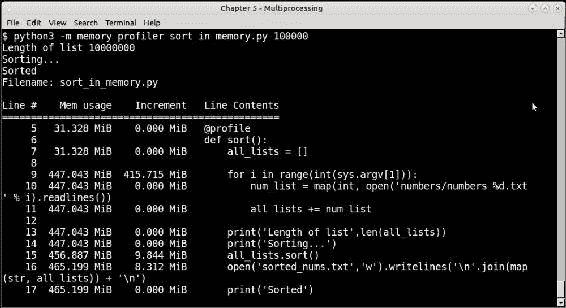

100,000 个文件输入的内存排序程序的内存使用情况

以下截图显示了相同数量文件的计数器排序的内存使用情况：

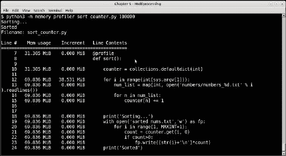

100,000 个文件输入的计数器排序程序的内存使用情况

内存使用率在内存排序程序中为 465MB，比 70MB 的计数排序程序高出六倍多。还要注意，在内存版本中，排序操作本身需要额外的近 10MB 内存。

### 使用多进程对磁盘文件进行排序

在本节中，我们使用多个进程重写计数排序程序。方法是通过将文件路径列表拆分为进程池，以便为多个进程扩展处理输入文件，并计划利用由此产生的数据并行性。

以下是代码的重写：

```py
# sort_counter_mp.py
import sys
import time
import collections
from multiprocessing import Pool

MAXINT = 100000

def sorter(filenames):
    """ Sorter process sorting files using a counter """

    counter = collections.defaultdict(int)

    for filename in filenames:
for i in open(filename):
counter[i] += 1

return counter

def batch_files(pool_size, limit):
""" Create batches of files to process by a multiprocessing Pool """
batch_size = limit // pool_size

filenames = []

for i in range(pool_size):
batch = []
for j in range(i*batch_size, (i+1)*batch_size):
filename = 'numbers/numbers_%d.txt' % j
batch.append(filename)

filenames.append(batch)

return filenames

def sort_files(pool_size, filenames):
""" Sort files by batches using a multiprocessing Pool """

with Pool(pool_size) as pool:
counters = pool.map(sorter, filenames)
with open('sorted_nums.txt','w') as fp:
for i in range(1, MAXINT+1):
count = sum([x.get(str(i)+'\n',0) for x in counters])
if count>0:
fp.write((str(i)+'\n')*count)
print('Sorted')
if __name__ == "__main__":
limit = int(sys.argv[1])
pool_size = 4
filenames = batch_files(pool_size, limit)
sort_files(pool_size,
```

这与之前的代码完全相同，只有以下更改：

1.  将文件名分批处理，每批大小等于池的大小，而不是将所有文件作为单个列表处理。

1.  我们使用一个排序函数，该函数接受文件名列表，处理它们，并返回一个包含计数的字典。

1.  对于 1 到 MAXINT 范围内的每个整数，计数都被求和，因此许多数字被写入排序文件。

以下表格显示了不同文件数量的处理数据，分别为池大小为 2 和 4：

| 文件数量（n） | 池大小 | 排序所需时间 |
| --- | --- | --- |
| 1,000 | 2 | 18 秒 |
| 4 | 20 秒 |
| 10,000 | 2 | 92 秒 |
| 4 | 77 秒 |
| 100,000 | 2 | 96 秒 |
| 4 | 86 秒 |
| 1,000,000 | 2 | 350 秒 |
| 4 | 329 秒 |

这些数字讲述了一个有趣的故事：

1.  具有 4 个进程的多进程版本整体上比具有 2 个进程和单进程的版本效果更好。

1.  然而，与单进程版本相比，多进程版本似乎并没有提供太多性能优势。性能数字非常相似，任何改进都在误差和变化范围内。例如，对于 100 万个数字输入，具有 4 个进程的多进程版本仅比单进程版本提高了 8%。

1.  这是因为瓶颈在于加载文件到内存所需的处理时间，而不是计算（排序）的时间，因为排序只是计数的增量。因此，单进程版本非常高效，因为它能够将所有文件数据加载到相同的地址空间。多进程版本能够通过在多个地址空间中加载文件来稍微改善这一点，但改善并不多。

这个例子表明，在没有太多计算但瓶颈是磁盘或文件 I/O 的情况下，通过多进程进行扩展的影响要小得多。

# 多线程与多进程

现在我们讨论多进程的内容结束了，现在是比较和对比在 Python 中选择使用单进程中的线程扩展还是使用多个进程的情况的好时机。

以下是一些指导方针。

在以下情况下使用多线程：

1.  程序需要维护大量共享状态，特别是可变状态。Python 中的许多标准数据结构，如列表、字典等，都是线程安全的，因此使用线程维护可变共享状态的成本要低得多，而不是通过进程。

1.  程序需要保持低内存占用。

1.  程序花费大量时间进行 I/O。由于线程执行 I/O 时 GIL 被释放，因此它不会影响线程执行 I/O 所需的时间。

1.  程序没有太多可以跨多个进程扩展的数据并行操作

在这些情况下使用多进程：

1.  程序执行大量的 CPU 密集型计算：字节码操作、数值计算等，处理相当大的输入。

1.  程序有输入，可以并行化成块，然后在之后合并结果——换句话说，程序的输入很适合数据并行计算。

1.  程序对内存使用没有限制，并且您使用的是具有多核 CPU 和足够大内存的现代计算机。

1.  在需要同步的进程之间没有太多共享的可变状态-这可能会减慢系统的速度，并抵消多进程带来的任何好处。

1.  您的程序不太依赖 I/O-文件或磁盘 I/O 或套接字 I/O。

## Python 中的并发-异步执行

我们已经看到了使用多个线程和多个进程进行并发执行的两种不同方式。我们看到了使用线程及其同步原语的不同示例。我们还看到了使用多进程的几个示例，结果略有不同。

除了这两种并发编程的方式，另一种常见的技术是异步编程或异步 I/O。

在执行的异步模型中，调度程序从任务队列中选择要执行的任务，并以交错的方式执行这些任务。不能保证任务将按任何特定顺序执行。任务的执行顺序取决于任务愿意向队列中的另一个任务*yield*多少处理时间。换句话说，异步执行是通过合作式多任务处理来实现的。

异步执行通常发生在单个线程中。这意味着没有真正的数据并行性或真正的并行执行。相反，该模型只提供了一种类似并行的外观。

由于执行是无序的，异步系统需要一种方法将函数执行的结果返回给调用者。这通常通过*回调*来实现，这些是在结果准备好时要调用的函数，或者使用接收结果的特殊对象，通常称为*future*。

Python 3 通过其*asyncio*模块使用协程提供了对这种执行的支持。在讨论这个之前，我们将花一些时间了解抢占式多任务处理与合作式多任务处理，以及如何使用生成器在 Python 中实现一个简单的合作式多任务处理调度程序。

# 抢占式与合作式多任务处理

我们之前使用多个线程编写的程序是并发的示例。然而，我们不必担心操作系统选择何时以及如何运行线程，我们只需要准备好线程（或进程），提供目标函数，并执行它们。调度由操作系统处理。

CPU 时钟的每几个滴答声，操作系统会抢占一个正在运行的线程，并在特定的核心中用另一个线程替换它。这可能是由于不同的原因，但程序员不必担心细节。他只需创建线程，为它们设置它们需要处理的数据，使用正确的同步原语，并启动它们。操作系统会处理剩下的工作，包括切换和调度。

这几乎是所有现代操作系统的工作方式。在所有其他条件相等的情况下，它保证每个线程公平分享执行时间。这被称为**抢占式多任务处理**。

还有一种调度类型，与抢占式多任务处理相反。这被称为合作式多任务处理，操作系统不参与决定竞争线程或进程的优先级和执行。相反，一个进程或线程自愿放弃控制权，让另一个进程或线程运行。或者一个线程可以取代另一个正在空闲（睡眠）或等待 I/O 的线程。

这是使用协程进行并发执行的异步模型中使用的技术。一个函数在等待数据时，比如等待尚未返回的网络调用，可以将控制权让给另一个函数或任务运行。

在讨论使用`asyncio`的实际协程之前，让我们使用简单的 Python 生成器编写我们自己的协作式多任务调度器。如下所示，这并不是很难做到。

```py
# generator_tasks.py
import random
import time
import collections
import threading

def number_generator(n):
    """ A co-routine that generates numbers in range 1..n """

    for i in range(1, n+1):
        yield i

def square_mapper(numbers):
    """ A co-routine task for converting numbers to squares """

    for n in numbers:
        yield n*n

def prime_filter(numbers):
    """ A co-routine which yields prime numbers """

    primes = []
    for n in numbers:
        if n % 2 == 0: continue
        flag = True
        for i in range(3, int(n**0.5+1), 2):
            if n % i == 0:
                flag = False
                break

        if flag:
            yield n

def scheduler(tasks, runs=10000):
    """ Basic task scheduler for co-routines """

    results = collections.defaultdict(list)

    for i in range(runs):
        for t in tasks:
            print('Switching to task',t.__name__)
            try:
                result = t.__next__()
                print('Result=>',result)
                results[t.__name__].append(result)
            except StopIteration:
                break

    return results
```

让我们分析前面的代码：

+   我们有四个函数 - 三个生成器，因为它们使用`yield`关键字返回数据，以及一个调度器，它运行一定的任务

+   `square_mapper`函数接受一个迭代器，返回整数并通过它进行迭代，并产生成员的平方

+   `prime_filter`函数接受一个类似的迭代器，并过滤掉非质数，只产生质数

+   `number_generator`函数作为这两个函数的输入迭代器，为它们提供整数的输入流

现在让我们看看将所有四个函数联系在一起的调用代码。

```py
    import sys

    tasks = []
    start = time.clock()

    limit = int(sys.argv[1])

    # Append sqare_mapper tasks to list of tasks 
    tasks.append(square_mapper(number_generator(limit)))
    # Append prime_filter tasks to list of tasks
    tasks.append(prime_filter(number_generator(limit))) 

    results = scheduler(tasks, runs=limit)
    print('Last prime=>',results['prime_filter'][-1])
    end = time.clock()
    print('Time taken=>',end-start)
```

以下是调用代码的分析：

+   数字生成器初始化为一个计数，通过命令行参数接收。它传递给`square_mapper`函数。组合函数被添加为`tasks`列表的一个任务。

+   对于`prime_filter`函数也执行类似的操作。

+   通过将任务列表传递给`scheduler`方法来运行它，它通过`for`循环迭代运行每个任务，一个接一个地运行。结果被附加到一个字典中，使用函数的名称作为键，并在执行结束时返回。

+   我们打印最后一个质数的值来验证正确执行，还有调度器处理所花费的时间。

让我们看看我们的简单协作式多任务调度器在限制为`10`时的输出。这允许在单个命令窗口中捕获所有输入，如下面的屏幕截图所示：

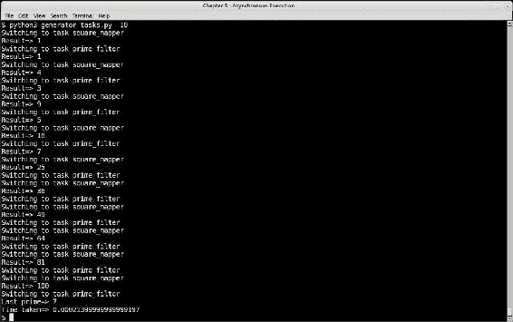

对于输入为 10 的简单协作式多任务程序示例的输出

让我们分析输出：

1.  `square_mapper`和`prime_filter`函数的输出在控制台上交替显示。这是因为调度器在`for`循环中在它们之间切换。每个函数都是协程（生成器），因此它们*yield*执行 - 即控制从一个函数传递到下一个函数 - 反之亦然。这允许两个函数同时运行，同时保持状态并产生输出。

1.  由于我们在这里使用了生成器，它们提供了一种自然的方式来生成结果并一次性地让出控制，使用`yield`关键字。

# Python 中的 asyncio 模块

Python 中的`asyncio`模块支持使用协程编写并发的单线程程序。它仅在 Python 3 中可用。

使用`asyncio`模块的协程是使用以下方法之一的协程：

+   使用`async def`语句来定义函数

+   使用`@asyncio.coroutine`表达式进行装饰

基于生成器的协程使用第二种技术，并从表达式中产生。

使用第一种技术创建的协程通常使用`await <future>`表达式等待未来完成。

协程通过`事件`循环进行调度执行，它连接对象并将它们安排为任务。为不同的操作系统提供了不同类型的事件循环。

以下代码重新编写了我们之前的一个简单协作式多任务调度器的示例，使用了`asyncio`模块：

```py
# asyncio_tasks.py
import asyncio

def number_generator(m, n):
    """ A number generator co-routine in range(m...n+1) """
    yield from range(m, n+1)

async prime_filter(m, n):
    """ Prime number co-routine """

    primes = []
    for i in number_generator(m, n):
        if i % 2 == 0: continue
        flag = True

        for j in range(3, int(i**0.5+1), 2):
            if i % j == 0:
                flag = False
                break

        if flag:
print('Prime=>',i)
primes.append(i)

# At this point the co-routine suspends execution
# so that another co-routine can be scheduled
await asyncio.sleep(1.0)
return tuple(primes)

async def square_mapper(m, n):
""" Square mapper co-routine """
squares = []

for i in number_generator(m, n):
print('Square=>',i*i) 
squares.append(i*i)
# At this point the co-routine suspends execution
# so that another co-routine can be scheduled
await asyncio.sleep(1.0)
return squares

def print_result(future):
print('Result=>',future.result())
```

这是最后一段代码的工作原理：

1.  `number_generator`函数是一个协程，从子生成器`range(m, n+1)`中产生，它是一个迭代器。这允许其他协程调用这个协程。

1.  `square_mapper`函数是使用`async def`关键字的第一种类型的协程。它使用数字生成器返回一个平方数列表。

1.  `prime_filter`函数也是相同类型的函数。它也使用数字生成器，将质数附加到列表并返回。

1.  两个协程通过使用*asyncio.sleep*函数进入睡眠并等待。这允许两个协程以交错的方式同时工作。

以下是带有`event`循环和其余管道的调用代码：

```py
loop = asyncio.get_event_loop()
future = asyncio.gather(prime_filter(10, 50), square_mapper(10, 50))
future.add_done_callback(print_result)
loop.run_until_complete(future)

loop.close()
```

这是程序的输出。请注意每个任务的结果是如何以交错的方式打印出来的。

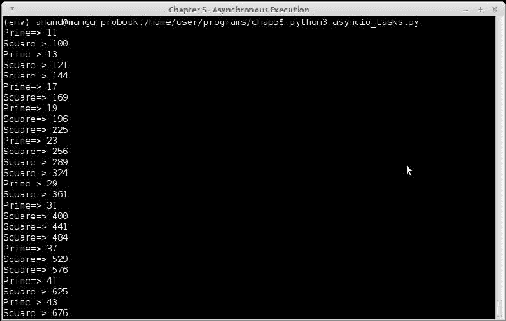

执行计算素数和平方的 asyncio 任务的结果

让我们逐行分析前面的代码是如何工作的，按照自上而下的方式：

1.  我们首先使用`factory`函数`asyncio.get_event_loop`获取一个 asyncio 事件`loop`。这会返回操作系统的默认事件循环实现。

1.  我们通过使用模块的`gather`方法设置了一个 asyncio `future`对象。这个方法用于聚合作为其参数传递的一组协程或 futures 的结果。我们将`prime_filter`和`square_mapper`都传递给它。

1.  一个回调被添加到`future`对象 - `print_result`函数。一旦 future 的执行完成，它将自动被调用。

1.  循环运行直到 future 的执行完成。在这一点上，回调被调用并打印结果。请注意输出是交错的 - 每个任务使用 asyncio 模块的*sleep*函数让步给另一个任务。

1.  循环被关闭并终止其操作。

# 等待 future - async 和 await

我们讨论了如何在协程内部使用 await 等待来自 future 的数据。我们看到了一个使用 await 让控制权让给其他协程的示例。现在让我们看一个等待来自网络的 future 的 I/O 完成的示例。

对于这个示例，您需要`aiohttp`模块，它提供了一个 HTTP 客户端和服务器，可以与 asyncio 模块一起使用，并支持 futures。我们还需要`async_timeout`模块，它允许在异步协程上设置超时。这两个模块都可以使用 pip 安装。

这是代码 - 这是一个使用超时获取 URL 的协程，并等待 future 的结果的示例：

```py
# async_http.py
import asyncio
import aiohttp
import async_timeout

@asyncio.coroutine
def fetch_page(session, url, timeout=60):
""" Asynchronous URL fetcher """

with async_timeout.timeout(timeout):
response = session.get(url)
return response
```

以下是带有事件循环的调用代码：

```py
loop = asyncio.get_event_loop()
urls = ('http://www.google.com',
        'http://www.yahoo.com',
        'http://www.facebook.com',
        'http://www.reddit.com',
        'http://www.twitter.com')

session = aiohttp.ClientSession(loop=loop)
tasks = map(lambda x: fetch_page(session, x), urls)
# Wait for tasks
done, pending = loop.run_until_complete(asyncio.wait(tasks, timeout=120))
loop.close()

for future in done:
    response = future.result()
    print(response)
    response.close()
    session.close()

loop.close()
```

在前面的代码中我们在做什么？

1.  我们创建一个事件循环和要获取的 URL 列表。我们还创建了`aiohttp ClientSession`对象的实例，它是获取 URL 的辅助程序。

1.  我们通过将`fetch_page`函数映射到每个 URL 来创建一个任务映射。会话对象作为*fetch_page*函数的第一个参数传递。

1.  任务被传递给`asyncio`的等待方法，并设置了`120`秒的超时时间。

1.  循环运行直到完成。它返回两组 futures - `done`和`pending`。

1.  我们遍历完成的 future，并通过使用`future`的`result`方法获取响应并打印它。

您可以在以下截图中看到操作的结果（前几行，因为输出了很多行）：

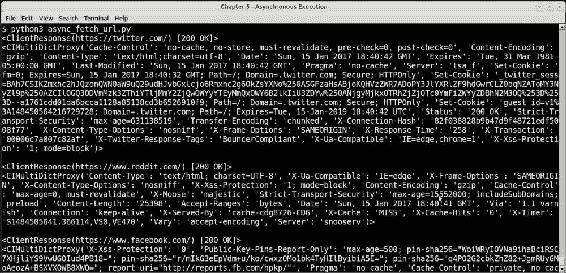

进行 5 个 URL 的异步获取程序的输出

正如您所看到的，我们能够以简单的摘要打印响应。那么如何处理响应以获取更多关于它的细节，比如实际的响应文本、内容长度、状态码等呢？

下面的函数解析了一个*done* futures 列表 - 通过在响应的*read*方法上使用*await*等待响应数据。这会异步返回每个响应的数据。

```py
async def parse_response(futures):
""" Parse responses of fetch """
for future in futures:
response = future.result()
data = await response.text()
        print('Response for URL',response.url,'=>', response.status, len(data))
        response.close()
```

`response`对象的细节 - 最终的 URL、状态码和数据长度 - 在关闭响应之前，通过这个方法输出每个响应。

我们只需要在完成的响应列表上再添加一个处理步骤，这样就可以工作。

```py
session = aiohttp.ClientSession(loop=loop)
# Wait for futures
tasks = map(lambda x: fetch_page(session, x), urls)
done, pending = loop.run_until_complete(asyncio.wait(tasks, timeout=300))

# One more processing step to parse responses of futures
loop.run_until_complete(parse_response(done))

session.close()
loop.close()
```

请注意我们如何将协程链接在一起。链中的最后一个链接是`parse_response`协程，在循环结束之前处理完成的 futures 列表。

以下截图显示了程序的输出：

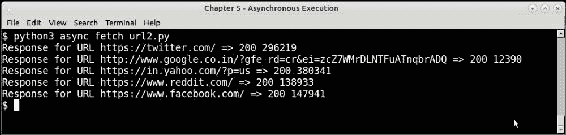

程序异步获取和处理 5 个 URL 的输出

使用`asyncio`模块可以完成许多复杂的编程。可以等待 futures，取消它们的执行，并从多个线程运行`asyncio`操作。本章讨论的范围之外。

我们将继续介绍 Python 中执行并发任务的另一个模块，即`concurrent.futures`模块。

# 并发 futures - 高级并发处理

`concurrent.futures`模块提供了使用线程或进程进行高级并发处理的功能，同时使用 future 对象异步返回数据。

它提供了一个执行器接口，主要暴露了两种方法，如下所示：

+   `submit`：提交一个可调用对象以异步执行，返回代表可调用对象执行的`future`对象。

+   `map`：将可调用对象映射到一组可迭代对象，以`future`对象异步调度执行。但是，该方法直接返回处理结果，而不是返回 futures 列表。

执行器接口有两个具体的实现：`ThreadPoolExecutor`在线程池中执行可调用对象，而`ProcessPoolExecutor`在进程池中执行可调用对象。

这是一个异步计算一组整数阶乘的`future`对象的简单示例：

```py
from concurrent.futures import ThreadPoolExecutor, as_completed
import functools
import operator

def factorial(n):
    return functools.reduce(operator.mul, [i for i in range(1, n+1)])

with ThreadPoolExecutor(max_workers=2) as executor:
    future_map = {executor.submit(factorial, n): n for n in range(10, 21)}
    for future in as_completed(future_map):
        num = future_map[future]
        print('Factorial of',num,'is',future.result())
```

以下是前面代码的详细解释：

+   `factorial`函数通过使用`functools.reduce`和乘法运算符迭代计算给定数字的阶乘。

+   我们创建了一个具有两个工作线程的执行器，并通过其`submit`方法将数字（从 10 到 20）提交给它。

+   通过字典推导式进行提交，返回一个以 future 为键、数字为值的字典

+   我们通过`concurrent.futures`模块的`as_completed`方法迭代已计算完成的 futures。

+   通过`result`方法获取 future 的结果并打印结果

当执行时，程序按顺序打印其输出，如下一个截图所示：

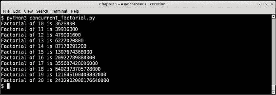

并发 futures 阶乘程序的输出

## 磁盘缩略图生成器

在我们之前关于线程的讨论中，我们使用了从 Web 中随机图像生成缩略图的示例，以演示如何使用线程和处理信息。

在这个例子中，我们将做类似的事情。在这里，我们不是从 Web 处理随机图像 URL，而是从磁盘加载图像，并使用`concurrent.futures`函数将它们转换为缩略图。

我们将重用之前的缩略图创建函数。除此之外，我们将添加并发处理。

首先，这里是导入：

```py
import os
import sys
import mimetypes
from concurrent.futures import ThreadPoolExecutor, ProcessPoolExecutor, as_completed
```

这是我们熟悉的缩略图创建函数：

```py
def thumbnail_image(filename, size=(64,64), format='.png'):
    """ Convert image thumbnails, given a filename """

    try:
        im=Image.open(filename)         
        im.thumbnail(size, Image.ANTIALIAS)

        basename = os.path.basename(filename)
        thumb_filename = os.path.join('thumbs',
            basename.rsplit('.')[0] + '_thumb.png')
        im.save(thumb_filename)
        print('Saved',thumb_filename)
        return True

    except Exception as e:
        print('Error converting file',filename)
        return False
```

我们将处理特定文件夹中的图像 - 在这种情况下，是`home`文件夹的`Pictures`子目录。为了处理这个，我们需要一个迭代器来产生图像文件名。我们已经使用`os.walk`函数编写了一个。 

```py
def directory_walker(start_dir):
    """ Walk a directory and generate list of valid images """

    for root,dirs,files in os.walk(os.path.expanduser(start_dir)):
        for f in files:
            filename = os.path.join(root,f)
            # Only process if its a type of image
            file_type = mimetypes.guess_type(filename.lower())[0]
            if file_type != None and file_type.startswith('image/'):
                yield filename
```

正如你所看到的，前面的函数是一个生成器。

以下是主要的调用代码，它设置了一个执行器并在文件夹上运行它：

```py
    root_dir = os.path.expanduser('~/Pictures/')
    if '--process' in sys.argv:
        executor = ProcessPoolExecutor(max_workers=10)
    else:
        executor = ThreadPoolExecutor(max_workers=10)

    with executor:
        future_map = {executor.submit(thumbnail_image, filename): filename for filename in directory_walker(root_dir)}
        for future in as_completed(future_map):
            num = future_map[future]
            status = future.result()
            if status:
                print('Thumbnail of',future_map[future],'saved')
```

前面的代码使用了相同的技术，异步地向函数提交参数，将结果的 futures 保存在字典中，然后在 futures 完成时处理结果。

要将执行器更改为使用进程，只需将`ThreadPoolExecutor`替换为`ProcessPoolExecutor`；代码的其余部分保持不变。我们提供了一个简单的命令行标志`--process`，以便轻松实现这一点。

这是程序在`~/Pictures`文件夹上使用线程池和进程池的样本运行输出-在大约相同的时间内生成了大约 2000 张图像。

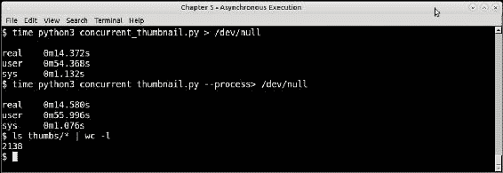

并发 future 磁盘缩略图程序的输出-使用线程和进程执行器

## 并发选项-如何选择？

我们讨论了 Python 中的并发技术。我们讨论了线程、进程、异步 I/O 和并发 future。自然而然地，一个问题出现了-何时选择什么？

这个问题已经在选择线程和进程之间得到了解答，决定主要受 GIL 的影响。

在选择并发选项时，以下是一些粗略的指南。

+   **并发 future vs 多处理：**并发 future 提供了一种优雅的方式，使用线程或进程池执行并行化任务。因此，如果底层应用程序具有与线程或进程类似的可伸缩性指标，那么它是理想的选择，因为从一个到另一个的切换非常容易，就像我们在之前的例子中看到的那样。当操作的结果不需要立即可用时，也可以选择并发 future。当数据可以被细粒度地并行化，并且操作可以异步执行时，并且操作涉及简单的可调用而不需要复杂的同步技术时，并发 future 是一个不错的选择。

如果并发执行更复杂，并不仅仅基于数据并行性，而是涉及同步、共享内存等方面，则应选择多处理。例如，如果程序需要进程、同步原语和 IPC，则唯一真正扩展的方法是使用多处理模块提供的原语编写并发程序。

同样，当您的多线程逻辑涉及跨多个任务并行化数据时，可以选择使用线程池的并发 future。但是，如果有大量共享状态需要使用复杂的线程同步对象进行管理，则必须使用线程对象，并使用`threading`模块切换到多个线程以更好地控制状态。

+   **异步 I/O vs 线程并发：**当您的程序不需要真正的并发（并行），而更依赖于异步处理和回调时，`asyncio`是一个不错的选择。当应用程序中涉及大量等待或休眠周期时，例如等待用户输入、等待 I/O 等，需要通过协程让其他任务利用这些等待或休眠时间时，Asyncio 是一个不错的选择。Asyncio 不适用于 CPU 密集型并发处理，或涉及真正数据并行性的任务。

AsyncIO 似乎适用于请求-响应循环，其中发生大量 I/O 操作，因此适用于编写不需要实时数据要求的 Web 应用服务器。

在决定正确的并发包时，您可以使用上述列出的这些要点作为粗略的指南。

## 并行处理库

除了我们迄今讨论过的标准库模块外，Python 还拥有丰富的第三方库生态系统，支持在对称多处理（SMP）或多核系统中进行并行处理。

我们将看一下几个这样的包，它们有些不同，并且具有一些有趣的特性。

## Joblib

`joblib`是一个提供了对多处理的包装器，用于在循环中并行执行代码。代码被编写为生成器表达式，并使用多处理模块在 CPU 核心上并行执行。

例如，取以下代码，计算前 10 个数字的平方根：

```py
>>> [i ** 0.5 for i in range(1, 11)]
[1.0, 1.4142135623730951, 1.7320508075688772, 2.0, 2.23606797749979, 2.449489742783178, 2.6457513110645907, 2.8284271247461903, 3.0, 3.1622776601683795]
```

前面的代码可以通过以下方式转换为在两个 CPU 核心上运行：

```py
>>> import math
>>> from joblib import Parallel, delayed
    [1.0, 1.4142135623730951, 1.7320508075688772, 2.0, 2.23606797749979, 2.449489742783178, 2.6457513110645907, 2.8284271247461903, 3.0, 3.1622776601683795]
```

这里是另一个例子：这是我们之前编写的用于使用多处理重写为使用`joblib`包的素性检查器：

```py
# prime_joblib.py
from joblib import Parallel, delayed

def is_prime(n):
    """ Check for input number primality """

    for i in range(3, int(n**0.5+1), 2):
        if n % i == 0:
            print(n,'is not prime')
            return False

    print(n,'is prime')     
    return True

if __name__ == "__main__":
    numbers = [1297337, 1116281, 104395303, 472882027, 533000389, 817504243, 982451653, 112272535095293, 115280095190773, 1099726899285419]*100
    Parallel(n_jobs=10)(delayed(is_prime)(i) for i in numbers)
```

如果你执行并计时前面的代码，你会发现性能指标与使用多处理版本的性能非常相似。

## PyMP

`OpenMP`是一个开放的 API，支持 C/C++和 Fortran 中的共享内存多处理。它使用特殊的工作共享结构，比如指示如何在线程或进程之间分割工作的编译器特殊指令（称为 pragma）。

例如，以下 C 代码使用`OpenMP` API 指示应该使用多个线程并行初始化数组：

```py
int parallel(int argc, char **argv)
{
    int array[100000];

    #pragma omp parallel for
    for (int i = 0; i < 100000; i++) {
array[i] = i * i;
	}

return 0;
}
```

`PyMP`受到`OpenMP`背后的想法的启发，但使用`fork`系统调用来并行化在表达式中执行的代码，比如在循环中。为此，`PyMP`还提供了对共享数据结构（如列表和字典）的支持，并为`numpy`数组提供了一个包装器。

我们将看一个有趣而奇异的例子——分形图——来说明`PyMP`如何用于并行化代码并获得性能改进。

### 注意

注意：PyMP 的 PyPI 软件包名为 pymp-pypi，因此在尝试使用 pip 安装时，请确保使用此名称。还要注意，它在拉取其依赖项（如 numpy）方面做得不好，因此这些必须单独安装。

## 分形图——Mandelbrot 集

以下是一个非常受欢迎的复数类的代码列表，当绘制时，会产生非常有趣的分形几何图形：即**Mandelbrot 集**：

```py
# mandelbrot.py
import sys
import argparse
from PIL import Image

def mandelbrot_calc_row(y, w, h, image, max_iteration = 1000):
    """ Calculate one row of the Mandelbrot set with size wxh """

    y0 = y * (2/float(h)) - 1 # rescale to -1 to 1

    for x in range(w):
        x0 = x * (3.5/float(w)) - 2.5 # rescale to -2.5 to 1

        i, z = 0, 0 + 0j
        c = complex(x0, y0)
        while abs(z) < 2 and i < max_iteration:
            z = z**2 + c
            i += 1

        # Color scheme is that of Julia sets
        color = (i % 8 * 32, i % 16 * 16, i % 32 * 8)
        image.putpixel((x, y), color)

def mandelbrot_calc_set(w, h, max_iteration=10000, output='mandelbrot.png'):
    """ Calculate a mandelbrot set given the width, height and
    maximum number of iterations """

    image = Image.new("RGB", (w, h))

    for y in range(h):
        mandelbrot_calc_row(y, w, h, image, max_iteration)

    image.save(output, "PNG")

if __name__ == "__main__":
    parser = argparse.ArgumentParser(prog='mandelbrot', description='Mandelbrot fractal generator')
    parser.add_argument('-W','--width',help='Width of the image',type=int, default=640)
    parser.add_argument('-H','--height',help='Height of the image',type=int, default=480) 
    parser.add_argument('-n','--niter',help='Number of iterations',type=int, default=1000)
    parser.add_argument('-o','--output',help='Name of output image file',default='mandelbrot.png')

    args = parser.parse_args()
    print('Creating Mandelbrot set with size %(width)sx%(height)s, #iterations=%(niter)s' % args.__dict__)
    mandelbrot_calc_set(args.width, args.height, max_iteration=args.niter, output=args.output)  
```

前面的代码使用一定数量的`c`和可变的几何形状（*宽 x 高*）计算了 Mandelbrot 集。它完整地解析了参数，以产生不同几何形状的分形图像，并支持不同的迭代次数。

### 注意

为了简单起见，以及为了产生比 Mandelbrot 通常做的更美丽的图片，代码做了一些自由，并使用了一个相关分形类的颜色方案，即 Julia 集。

它是如何工作的？这里是代码的解释。

1.  `mandelbrot_calc_row`函数计算了 Mandelbrot 集的一行，对于特定的*y*坐标值和最大迭代次数。计算了整行的像素颜色值，从*x*坐标的`0`到宽度`w`。像素值被放入传递给这个函数的`Image`对象中。

1.  `mandelbrot_calc_set`函数调用`mandelbrot_calc_row`函数，对从`0`到图像高度`h`的*y*坐标的所有值进行计算。为给定的几何形状（*宽 x 高*）创建了一个`Image`对象（通过**Pillow 库**），并填充了像素值。最后，我们将这个图像保存到文件中，我们得到了我们的分形图！

不多说了，让我们看看代码的运行情况。

这是我们的 Mandelbrot 程序为默认迭代次数 1000 生成的图像。


1000 次迭代的 Mandelbrot 集分形图像

这是创建这个图像所需的时间。

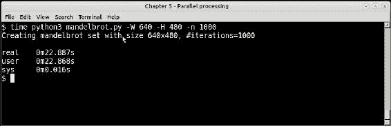

单进程 Mandelbrot 程序的时间——1000 次迭代

然而，如果增加迭代次数，单进程版本的速度会慢下来很多。当我们将迭代次数增加 10 倍时，即 10000 次迭代时，输出如下：

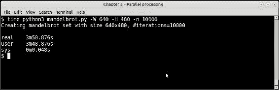

单进程 Mandelbrot 程序的时间——10000 次迭代

如果我们看一下代码，我们会发现`mandelbrot_calc_set`函数中有一个外部的 for 循环，它启动了一切。它为图像的每一行调用`mandelbrot_calc_row`，范围从`0`到函数的高度，由*y*坐标变化。

由于每次调用`mandelbrot_calc_row`函数计算图像的一行，它自然适用于数据并行问题，并且可以相当容易地并行化。

在下一节中，我们将看到如何使用 PyMP 来实现这一点。

### 分形图 - 缩放曼德勃罗集实现

我们将使用`PyMP`来并行化前一个简单实现曼德勃罗集的外部 for 循环，以利用解决方案中固有的数据并行性。

以下是曼德勃罗程序的两个函数的`PyMP`版本。其余代码保持不变。

```py
# mandelbrot_mp.py
import sys
from PIL import Image
import pymp
import argparse

def mandelbrot_calc_row(y, w, h, image_rows, max_iteration = 1000):
    """ Calculate one row of the mandelbrot set with size wxh """

    y0 = y * (2/float(h)) - 1 # rescale to -1 to 1

    for x in range(w):
        x0 = x * (3.5/float(w)) - 2.5 # rescale to -2.5 to 1

        i, z = 0, 0 + 0j
        c = complex(x0, y0)
        while abs(z) < 2 and i < max_iteration:
            z = z**2 + c
            i += 1

        color = (i % 8 * 32, i % 16 * 16, i % 32 * 8)
        image_rows[y*w + x] = color

def mandelbrot_calc_set(w, h, max_iteration=10000, output='mandelbrot_mp.png'):
    """ Calculate a mandelbrot set given the width, height and
    maximum number of iterations """

    image = Image.new("RGB", (w, h))
    image_rows = pymp.shared.dict()

    with pymp.Parallel(4) as p:
        for y in p.range(0, h):
            mandelbrot_calc_row(y, w, h, image_rows, max_iteration)

    for i in range(w*h):
        x,y = i % w, i // w
        image.putpixel((x,y), image_rows[i])

    image.save(output, "PNG")
    print('Saved to',output)
```

重写主要涉及将代码转换为逐行构建曼德勃罗图像的代码，每行数据都是单独计算的，并且以可以并行计算的方式进行计算 - 在一个单独的进程中。

+   在单进程版本中，我们直接在`mandelbrot_calc_row`函数中将像素值放入图像中。然而，由于新代码在并行进程中执行此函数，我们不能直接修改其中的图像数据。相反，新代码将一个共享字典传递给函数，并且它使用位置作为`key`，像素 RGB 值作为`value`来设置像素颜色值。

+   因此，在`mandelbrot_calc_set`函数中添加了一个新的共享数据结构 - 共享字典，最终对其进行迭代，并在`Image`对象中填充像素数据，然后保存到最终输出中。

+   我们使用了四个`PyMP`并行进程，因为该机器有四个 CPU 核心，使用了一个上下文和将外部 for 循环封装在其中。这使得代码在四个核心中并行执行，每个核心计算大约 25%的行。最终的数据写入主进程中的图像。

以下是代码的`PyMP`版本的结果时间：

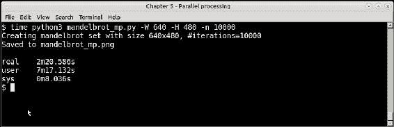

使用 PyMP 进行 10000 次迭代的并行进程曼德勃罗程序的时间

该程序在实时方面快了大约 33%。在 CPU 使用方面，您可以看到`PyMP`版本的用户 CPU 时间与实际 CPU 时间的比率更高，表明进程对 CPU 的使用比单进程版本更高。

### 注意

注意：我们可以通过避免使用共享数据结构 image_rows 来编写程序的更高效版本，该数据结构用于保存图像的像素值。然而，这个版本使用了 PyMP 的特性来展示。本书的代码存档中包含程序的另外两个版本，一个使用了多进程，另一个使用了 PyMP 但没有共享字典。

这是程序运行产生的分形图像输出：


使用 PyMP 进行 10000 次迭代的曼德勃罗集分形图像

您可以观察到颜色不同，这张图片由于迭代次数增加，提供了更多的细节和更精细的结构。

# 网络扩展

到目前为止，我们讨论的所有可扩展性和并发技术都涉及在单个服务器或机器的范围内进行可扩展性 - 换句话说，扩展。在现实世界中，应用程序也通过扩展其计算到多台机器上来进行扩展。这是大多数现实世界的 Web 应用程序目前的运行和扩展方式。

我们将研究一些技术，包括在通信/工作流程方面扩展应用程序、扩展计算和使用不同协议进行水平扩展。

# 扩展工作流程 - 消息队列和任务队列

可扩展性的一个重要方面是减少系统之间的耦合。当两个系统紧密耦合时，它们会阻止彼此在一定限制之上进行扩展。

例如，串行编写的代码，其中数据和计算绑定到同一个函数中，阻止程序利用多个 CPU 核心等现有资源。当同一个程序被重写以使用多个线程（或进程）和消息传递系统，如队列之间，我们发现它可以很好地扩展到多个 CPU。在我们的并发讨论中，我们已经看到了很多这样的例子。

同样，通过 Web 进行系统扩展时，解耦会更好。经典的例子是 Web 本身的客户端/服务器架构，客户端通过 HTTP 等众所周知的 RestFUL 协议与世界各地的服务器进行交互。

消息队列是允许应用程序以解耦方式相互通信的系统，通过向彼此发送消息。这些应用程序通常在连接到互联网的不同机器或服务器上运行，并通过排队协议进行通信。

可以将消息队列看作是多线程同步队列的放大版本，不同机器上的应用程序取代了线程，共享的分布式队列取代了简单的进程内队列。

消息队列携带称为消息的数据包，这些数据包从**发送应用程序**传递到**接收应用程序**。大多数**消息队列**提供**存储和转发**语义，即消息存储在队列中，直到接收者可以处理消息为止。

这是一个简单的**消息队列**的示意模型：


分布式消息队列的示意模型

最流行和标准化的消息队列或**消息导向中间件**（**MoM**）的实现是**高级消息队列协议**（**AMQP**）。AMQP 提供了排队、路由、可靠传递和安全等功能。AMQP 的起源在金融行业，可靠和安全的消息传递语义至关重要。

AMQP（版本 1.0）的最流行的实现是 Apache Active MQ、RabbitMQ 和 Apache Qpid。

RabbitMQ 是用 Erlang 编写的 MoM。它提供了许多语言的库，包括 Python。在 RabbitMQ 中，消息总是通过交换机通过路由键传递，这些键指示消息应传递到的队列。

我们将不再在本节讨论 RabbitMQ，而是转向一个相关但略有不同的中间件，即 Celery。

# Celery – 一个分布式任务队列

Celery 是一个用 Python 编写的分布式任务队列，使用分布式消息进行工作。Celery 中的每个执行单元称为**任务**。任务可以使用称为**工作者**的进程在一个或多个服务器上并发执行。默认情况下，Celery 使用`multiprocessing`来实现这一点，但也可以使用其他后端，例如 gevent。

任务可以同步或异步执行，结果可以在将来像对象一样可用。此外，任务结果可以存储在后端存储中，如 Redis、数据库或文件中。

Celery 与消息队列的不同之处在于，Celery 的基本单元是可执行任务-在 Python 中可调用-而不仅仅是一条消息。

然而，Celery 可以与消息队列一起工作。事实上，Celery 传递消息的默认代理是 RabbitMQ，这是 AMQP 的流行实现。Celery 也可以使用 Redis 作为代理后端。

由于 Celery 接受一个任务，并在多个工作进程上扩展它；在多台服务器上，它适用于涉及数据并行性以及计算扩展的问题。Celery 可以接受来自队列的消息，并将其作为任务分发到多台机器上，以实现分布式电子邮件传递系统，例如，实现水平扩展。或者，它可以接受单个函数，并通过将数据分割到多个进程中实现并行数据计算，实现并行数据处理。

在下面的示例中，我们将把我们的 Mandelbrot 分形程序重写为与 Celery 一起工作。我们将尝试通过在多个 celery 工作进程中计算 Mandelbrot 集的行来扩展程序，类似于我们在`PyMP`中所做的方式。

## 使用 Celery 的 Mandelbrot 集

为了实现一个利用 Celery 的程序，它需要被实现为一个任务。这并不像听起来那么困难。大多数情况下，它只涉及准备一个 celery 应用程序的实例，选择一个经纪后端，并使用特殊的装饰器`@app.task`装饰我们想要并行化的可调用对象-其中*app*是 Celery 的一个实例。

我们将逐步查看此程序清单，因为它涉及一些新内容。本次会话的软件要求如下：

+   Celery

+   AMQP 后端；首选 RabbitMQ

+   Redis 作为结果存储后端

首先，我们将提供 Mandelbrot 任务模块的清单：

```py
# mandelbrot_tasks.py
from celery import Celery

app = Celery('tasks', broker='pyamqp://guest@localhost//',
             backend='redis://localhost')

@app.task
def mandelbrot_calc_row(y, w, h, max_iteration = 1000):
    """ Calculate one row of the mandelbrot set with size w x h """

    y0 = y * (2/float(h)) - 1 # rescale to -1 to 1

    image_rows = {}
    for x in range(w):
        x0 = x * (3.5/float(w)) - 2.5 # rescale to -2.5 to 1

        i, z = 0, 0 + 0j
        c = complex(x0, y0)
        while abs(z) < 2 and i < max_iteration:
            z = z**2 + c
            i += 1

        color = (i % 8 * 32, i % 16 * 16, i % 32 * 8)
        image_rows[y*w + x] = color

    return image_rows
```

让我们分析一下前面的代码：

+   我们首先导入了 celery 所需的导入。这需要从`celery`模块中导入`Celery`类。

+   我们准备了一个`Celery`类的实例作为 celery 应用程序，使用 AMQP 作为消息代理和 Redis 作为结果后端。AMQP 配置将使用系统上可用的任何 AMQP MoM（在本例中是 RabbitMQ）。

+   我们有一个修改过的`mandelbrot_calc_row`版本。在`PyMP`版本中，`image_rows`字典作为参数传递给函数。在这里，函数在本地计算并返回一个值。我们将在接收端使用此返回值来创建我们的图像。

+   我们使用`@app.task`装饰函数，其中 app 是`Celery`实例。这使得它可以被 celery 工作进程执行为 celery 任务。

接下来是主程序，它调用一系列`y`输入值的任务并创建图像：

```py
# celery_mandelbrot.py
import argparse
from celery import group
from PIL import Image
from mandelbrot_tasks import mandelbrot_calc_row

def mandelbrot_main(w, h, max_iterations=1000, 
output='mandelbrot_celery.png'):
    """ Main function for mandelbrot program with celery """

    # Create a job – a group of tasks
    job = group([mandelbrot_calc_row.s(y, w, h, max_iterations) for y in range(h)])
    # Call it asynchronously
    result = job.apply_async()

    image = Image.new('RGB', (w, h))

    for image_rows in result.join():
        for k,v in image_rows.items():
            k = int(k)
            v = tuple(map(int, v))
            x,y = k % args.width, k // args.width
            image.putpixel((x,y), v)

    image.save(output, 'PNG')
    print('Saved to',output)
```

参数解析器是相同的，因此这里不再重复。

代码的最后一部分介绍了一些新概念，因此需要一些解释。让我们详细分析一下代码：

1.  `mandelbrot_main`函数与先前的`mandelbrot_calc_set`函数在其参数上是相似的。

1.  此函数设置了一组任务，每个任务在给定的`y`输入上执行`mandelbrot_calc_row`，覆盖从`0`到图像高度的整个`y`输入范围。它使用 celery 的`group`对象来执行此操作。组是一组可以一起执行的任务。

1.  通过在组上调用`apply_async`函数来执行任务。这将在多个工作进程中异步执行任务。我们得到一个异步的`result`对象作为返回值-任务尚未完成。

1.  然后，我们通过在其上调用`join`等待此结果对象，返回结果-图像的行作为字典，来自`mandelbrot_calc_row`任务的单次执行。我们遍历这个，对值进行整数转换，因为 celery 返回数据为字符串，并将像素值放入图像中。

1.  最后，图像保存在输出文件中。

那么，Celery 如何执行任务呢？这需要 celery 程序运行，处理具有一定数量工作进程的任务模块。在这种情况下，这是我们启动它的方式：

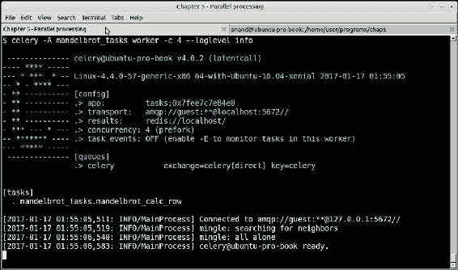

Celery 控制台-使用 Mandelbrot 任务作为目标启动工作人员

该命令使用从模块`mandelbrot_tasks.py`加载的任务启动 celery，并使用一组 4 个工作进程。由于机器有 4 个 CPU 核心，我们选择了这个并发性。

### 注意

请注意，如果没有特别配置，Celery 将自动将工作进程默认为核心数。

程序在 15 秒内运行，比单进程版本和`PyMP`版本快了一倍。

如果您观察 celery 控制台，您会发现有很多消息被回显，因为我们将 celery 配置为`INFO`日志级别。所有这些都是包含有关任务及其结果的信息消息：

下面的截图显示了对`10000`次迭代的运行结果。这个性能比之前的`PyMP`版本稍好一些，大约快了 20 秒：

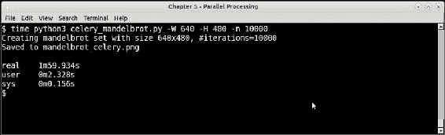

Mandelbrot 程序的 Celery 版本，迭代 10000 次。

Celery 在许多组织的生产系统中使用。它为一些更受欢迎的 Python Web 应用程序框架提供了插件。例如，celery 支持 Django，具有一些基本的管道和配置。还有一些扩展模块，如`django-celery-results`，允许程序员使用 Django ORM 作为 celery 结果后端。

本章和本书的范围不包括详细讨论这个问题，因此建议读者参考 celery 项目网站上提供的文档。

## 使用 Python 在 Web 上提供 WSGI 服务

**Web 服务器网关接口**（**WSGI**）是 Python Web 应用程序框架和 Web 服务器之间标准接口的规范。

在 Python Web 应用程序的早期，存在将 Web 应用程序框架连接到 Web 服务器的问题，因为没有共同的标准。Python Web 应用程序被设计为与 CGI、FastCGI 或`mod_python`（Apache）的现有标准之一配合使用。这意味着为一个 Web 服务器编写的应用程序可能无法在另一个 Web 服务器上运行。换句话说，统一应用程序和 Web 服务器之间的互操作性是缺失的。

WSGI 通过规定一个简单但统一的接口来解决了这个问题，允许可移植的 Web 应用程序开发。

WSGI 规定了两个方面：服务器（或网关）方面和应用程序或框架方面。WSGI 请求的处理如下：

+   服务器端执行应用程序，为其提供环境和回调函数

+   应用程序处理请求，并使用提供的回调函数将响应返回给服务器

以下是一个示意图，显示了 Web 服务器和 Web 应用程序使用 WSGI 的交互：

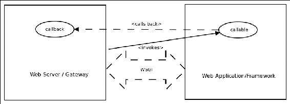

显示 WSGI 协议交互的示意图

以下是与 WSGI 应用程序或框架兼容的最简单的函数：

```py
def simple_app(environ, start_response):
    """Simplest possible application object"""

    status = '200 OK'
    response_headers = [('Content-type', 'text/plain')]
    start_response(status, response_headers)
    return ['Hello world!\n']
```

上述函数可以解释如下：

1.  `environ`变量是一个字典，包含从服务器传递到应用程序的环境变量，由**公共网关接口**（**CGI**）规范定义。WSGI 在其规范中强制要求其中的一些环境变量。

1.  `start_response`是一个可调用的回调函数，由服务器端提供给应用程序端，用于在服务器端启动响应处理。它必须接受两个位置参数。第一个参数应该是一个带有整数状态码的状态字符串，第二个参数是一个描述 HTTP 响应头的（`header_name`，`header_value`）元组列表。

### 注意

有关更多详细信息，读者可以参考 Python 语言网站上发布的 WSGI 规范 v1.0.1，即 PEP 3333。

### 注意

**Python Enhancement Proposal** (**PEP**) 是一个 Web 上的设计文档，描述了 Python 的新功能或功能建议，或者向 Python 社区提供有关现有功能的信息。Python 社区使用 PEPs 作为描述、讨论和采纳 Python 编程语言及其标准库的新功能和增强的标准流程。

WSGI 中间件组件是实现规范两端的软件，因此提供以下功能：

+   从服务器到应用程序的多个请求的负载均衡

+   远程处理请求，通过在网络上传递请求和响应

+   在同一进程中多租户或共托管多个服务器和/或应用程序

+   基于 URL 的请求路由到不同的应用程序对象

中间件位于服务器和应用程序之间。它将请求从服务器转发到应用程序，将应用程序的响应转发到服务器。

架构师可以选择多种 WSGI 中间件。我们将简要介绍两种最流行的中间件，即 uWSGI 和 Gunicorn。

## uWSGI – WSGI 中间件的超级版本

uWSGI 是一个旨在构建托管服务的完整堆栈的开源项目和应用程序。uWSGI 项目的 WSGI 源于该项目中开发的 Python 的 WSGI 接口插件是第一个。

除了 WSGI，uWSGI 项目还支持 Perl Webserver Gateway Interface（PSGI）用于 Perl Web 应用程序，以及 Rack Web 服务器接口用于 Ruby Web 应用程序。它还提供网关、负载均衡器和请求和响应的路由器。uWSGI 的 Emperor 插件提供了对生产系统中多个 uWSGI 部署的管理和监控。

uWSGI 的组件可以以预分叉、线程、异步或绿色线程/协程模式运行。

uWSGI 还配备了一个快速的内存缓存框架，允许 Web 应用程序的响应存储在 uWSGI 服务器上的多个缓存中。缓存也可以备份到文件等持久存储。除了其他功能外，uWSGI 还支持基于 Python 的 virtualenv 部署。

uWSGI 还提供了一个本地协议，被 uWSGI 服务器使用。uWSGI 1.9 版本还增加了对 Web 套接字的本地支持。

以下是 uWSGI 配置文件的典型示例：

```py
[uwsgi]

# the base directory (full path)
chdir           = /home/user/my-django-app/
# Django's wsgi file
module          = app.wsgi
# the virtualenv (full path)
home            = /home/user/django-virtualenv/
# process-related settings
master          = true
# maximum number of worker processes
processes       = 10
# the socket 
socket          = /home/user/my-django-app/myapp.sock
# clear environment on exit
vacuum          = true
```

uWSGI 的典型部署架构如下图所示。在这种情况下，Web 服务器是 Nginx，Web 应用程序框架是 Django。uWSGI 以反向代理配置与 Nginx 部署，转发请求和响应之间的 Nginx 和 Django：

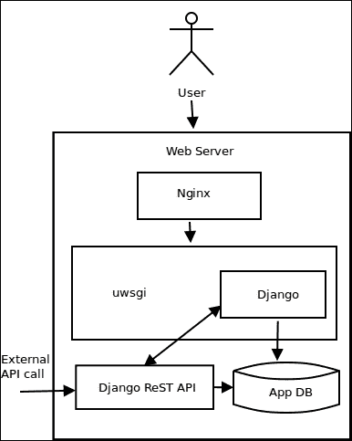

Nginx 和 Django 的 uWSGI 部署

### 注意

Nginx Web 服务器自 0.8.40 版本以来支持 uWSGI 协议的本地实现。Apache 中也有一个名为`mod_proxy_uwsgi`的 uWSGI 代理模块支持。

uWSGI 是 Python Web 应用程序生产部署的理想选择，其中需要在高性能和功能之间取得良好的平衡。它是 WSGI Web 应用程序部署的瑞士军刀组件。

## Gunicorn – WSGI 的独角兽

Gunicorn 项目是另一个流行的 WSGI 中间件实现，是开源的。它使用预分叉模型，并且是从 Ruby 的 unicorn 项目移植过来的。Gunicorn 有不同的工作类型，如 uWSGI 支持请求的同步和异步处理。异步工作进程使用构建在 gevent 之上的`Greenlet`库。

Gunicorn 中有一个主进程，运行一个事件循环，处理和响应各种信号。主进程管理工作进程，工作进程处理请求并发送响应。

## Gunicorn 与 uWSGI

在选择是使用 Gunicorn 还是 uWSGI 进行 Python Web 应用程序部署时，有一些指导原则：

+   对于不需要大量定制的简单应用程序部署，Gunicorn 是一个不错的选择。与 Gunicorn 相比，uWSGI 的学习曲线更陡，需要一段时间才能适应。Gunicorn 的默认设置对大多数部署都非常有效。

+   如果您的部署是同质的 Python，那么 Gunicorn 是一个不错的选择。另一方面，uWSGI 允许您执行异构部署，因为它支持其他堆栈，如 PSGI 和 Rack。

+   如果您希望使用更全面的 WSGI 中间件，并且具有很高的可定制性，那么 uWSGI 是一个安全的选择。例如，uWSGI 使基于 Python 的虚拟环境部署变得简单，而 Gunicorn 并不原生支持虚拟环境；相反，Gunicorn 本身必须部署在虚拟环境中。

+   由于 Nginx 本身原生支持 uWSGI，因此它在生产系统上非常常见。因此，如果您使用 Nginx，并且希望具有全功能且高度可定制的 WSGI 中间件与缓存，uWSGI 是默认选择。

+   在性能方面，根据 Web 上发布的不同基准测试，Gunicorn 和 uWSGI 在不同基准测试中得分相似。

## 可扩展性架构

正如讨论的那样，系统可以垂直扩展，也可以水平扩展，或者两者兼而有之。在本节中，我们将简要介绍一些架构，架构师在将系统部署到生产环境中时可以选择，以利用可扩展性选项。

### 垂直可扩展性架构

垂直可扩展性技术有以下两种类型：

+   **向现有系统添加更多资源**：这可能意味着向物理或虚拟机器添加更多 RAM，向虚拟机器或 VPS 添加更多 vCPU 等。然而，这些选项都不是动态的，因为它们需要停止、重新配置和重新启动实例。

+   **更好地利用系统中现有资源**：我们在本章中花了很多时间讨论这种方法。这是当应用程序被重写以更有效地利用现有资源，如多个 CPU 核心，通过并发技术如线程、多进程和/或异步处理。这种方法可以动态扩展，因为系统中没有添加新资源，因此不需要停止/启动。

### 水平可扩展性架构

水平可扩展性涉及一系列技术，架构师可以添加到其工具箱中，并进行选择。它们包括下面列出的技术：

+   **主动冗余**：这是扩展的最简单技术，涉及向系统添加多个同类处理节点，通常由负载均衡器前置。这是扩展 Web 应用程序服务器部署的常见做法。多个节点确保即使其中一个或几个系统失败，其余系统仍然继续进行请求处理，确保应用程序没有停机时间。

在冗余系统中，所有节点都处于活动状态，尽管在特定时间只有一个或几个节点可能会响应请求。

+   热备份：热备份（热备用）是一种技术，用于切换到一个准备好为请求提供服务的系统，但在主系统宕机之前并不活动。热备用在许多方面与正在提供应用程序服务的主节点（节点）完全相似。在发生关键故障时，负载均衡器被配置为切换到热备用系统。

热备用本身可能是一组冗余节点，而不仅仅是单个节点。将冗余系统与热备用结合起来，确保最大的可靠性和故障转移。

### 注意

热备份的变种是软件备份，它提供了一种模式，可以在极端负载下将系统切换到最低的**服务质量**（**QoS**），而不是提供完整的功能。例如，一个 Web 应用程序在高负载下切换到只读模式，为大多数用户提供服务，但不允许写入。

+   **读取副本**: 依赖于数据库上读取密集型操作的系统的响应可以通过添加数据库的读取副本来改善。读取副本本质上是提供热备份（在线备份）的数据库节点，它们不断地与主数据库节点同步。在某一时间点上，读取副本可能与主数据库节点不完全一致，但它们提供具有 SLA 保证的最终一致性。

云服务提供商如亚马逊提供了 RDS 数据库服务，并提供了读取副本的选择。这些副本可以在地理位置更接近活跃用户的地方分布，以确保更少的响应时间和故障转移，以防主节点崩溃或无响应。

读取副本基本上为您的系统提供了一种数据冗余。

+   **蓝绿部署**: 这是一种技术，其中两个单独的系统（在文献中标记为`蓝色`和`绿色`）并行运行。在任何给定的时刻，只有一个系统是活动的并提供服务。例如，蓝色是*活动的*，绿色是*空闲的*。

在准备新部署时，它是在空闲系统上完成的。一旦系统准备就绪，负载均衡器就会切换到空闲系统（绿色），远离活动系统（蓝色）。此时，绿色是活动的，蓝色是空闲的。在下一次切换时，位置会再次颠倒。

如果正确执行，蓝绿部署可以确保生产应用的零到最小停机时间。

+   **故障监控和/或重启**: 故障监视器是一种检测部署的关键组件（软件或硬件）故障的系统，它会通知您，并/或采取措施减轻停机时间。

例如，您可以在服务器上安装一个监控应用程序，当关键组件（例如 celery 或 rabbitmq 服务器）崩溃时，它会发送电子邮件给 DevOps 联系人，并尝试重新启动守护程序。

心跳监控是另一种技术，其中软件主动向监控软件或硬件发送 ping 或心跳，这可以在同一台机器或另一台服务器上。如果在一定时间间隔后未能发送心跳，监视器将检测系统的停机，并通知和/或尝试重新启动组件。

Nagios 是一个常见的生产监控服务器的例子，通常部署在一个单独的环境中，并监控您的部署服务器。其他系统切换监视器和重启组件的例子包括**Monit**和**Supervisord**。

除了这些技术之外，在执行系统部署时应遵循以下最佳实践，以确保可伸缩性、可用性和冗余/故障转移：

+   **缓存**: 在系统中尽可能多地使用缓存，如果可能的话，使用分布式缓存。缓存可以有各种类型。最简单的缓存是在应用服务提供商的**内容传送网络**（**CDN**）上缓存静态资源。这样的缓存可以确保资源在用户附近地理分布，从而减少响应时间和页面加载时间。

第二种缓存是应用程序的缓存，它缓存响应和数据库查询结果。Memcached 和 Redis 通常用于这些场景，并且它们提供分布式部署，通常是主/从模式。应该使用这样的缓存来加载和缓存应用程序中最常请求的内容，并设置适当的过期时间，以确保数据不会太陈旧。

有效且设计良好的缓存可以最小化系统负载，并避免多次冗余操作，这些操作可能会人为增加系统负载并降低性能：

+   **解耦**：尽可能解耦组件，以充分利用网络的共享地理位置。例如，消息队列可用于解耦应用程序中需要发布和订阅数据的组件，而不是使用本地数据库或同一台机器上的套接字。解耦时，您自动引入了冗余和数据备份到系统中，因为您为解耦添加的新组件（消息队列、任务队列和分布式缓存）通常都带有自己的有状态存储和集群。

解耦的额外复杂性在于额外系统的配置。然而，在当今时代，大多数系统都能够执行自动配置或提供简单的基于 Web 的配置，这不是问题。

您可以参考文献，了解提供有效解耦的应用架构，例如观察者模式、中介者和其他中间件：

+   **优雅降级**：与无法回答请求并提供超时相比，为系统提供优雅降级行为更为重要。例如，当写入密集型 Web 应用程序发现数据库节点未响应时，可以在负载过重时切换到只读模式。另一个例子是，当提供大量依赖 JS 的动态网页的系统在服务器负载过重时，可以在 JS 中间件响应不佳时切换到类似的静态页面。

优雅降级可以在应用程序本身或负载均衡器上进行配置，也可以两者兼而有之。为应用程序本身提供优雅降级行为，并配置负载均衡器在负载过重时切换到该路由是一个好主意。

+   **将数据靠近代码**：性能强大的软件的黄金法则是将数据提供给计算所在的地方。例如，如果您的应用程序每次请求都要从远程数据库加载数据进行 50 次 SQL 查询，那么您的做法就不正确。

将数据靠近计算可以减少数据访问和传输时间，从而减少处理时间，降低应用程序的延迟，并使其更具可扩展性。

有不同的技术可以实现这一点：如前所述，缓存是一种受欢迎的技术。另一种技术是将数据库分为本地和远程两部分，其中大部分读取操作都来自本地读取副本，而写入（可能需要时间）则发生在远程写入主机上。需要注意的是，在这种情况下，本地可能并不意味着同一台机器，但通常指的是同一数据中心，如果可能的话，共享同一子网。

此外，常见配置可以从磁盘数据库（如 SQLite）或本地 JSON 文件中加载，从而减少准备应用实例所需的时间。

另一种技术是不在应用程序层或前端存储任何事务状态，而是将状态移至计算所在的后端。由于这使得所有应用服务器节点在中间状态上都是相等的，因此可以使用负载均衡器对其进行前置，并提供一个相等的冗余集群，其中任何一个都可以处理特定请求。

+   **根据 SLA 设计**：对于架构师来说，了解应用程序向用户提供的保证，并相应地设计部署架构非常重要。

CAP 定理确保在分布式系统中发生网络分区故障时，系统只能在特定时间内保证一致性或可用性。这将分布式系统分为两种常见类型，即 CP 和 AP 系统。

当今世界上大多数网络应用都是 AP。它们确保可用性，但数据只是最终一致，这意味着它们会向用户提供过时的数据，例如在网络分区中的一个系统（比如主数据库节点）发生故障时。

另一方面，许多企业，如银行、金融和医疗保健，需要确保即使存在网络分区故障，数据也是一致的。这些是 CP 系统。这些系统中的数据不应该过时，因此，在可用性和一致性数据之间做出选择时，它们会选择后者。

软件组件的选择、应用架构和最终部署架构受到这些约束的影响。例如，AP 系统可以使用保证最终一致行为的 NoSQL 数据库。它可以更好地利用缓存。另一方面，CP 系统可能需要**关系数据库系统**（**RDBMs**）提供的 ACID 保证。

# 总结

在本章中，我们重复使用了您在上一章关于性能的许多想法和概念。

我们从可扩展性的定义开始，并研究了它与并发、延迟和性能等其他方面的关系。我们简要比较和对比了并发及其近亲并行性。

然后，我们继续讨论了 Python 中各种并发技术，包括详细的示例和性能比较。我们以来自网络的随机 URL 的缩略图生成器为例，来说明使用 Python 中的多线程实现并发的各种技术。您还学习并看到了生产者/消费者模式的示例，并使用了一些示例来学习如何使用同步原语来实现资源约束和限制。

接下来，我们讨论了如何使用多进程来扩展应用程序，并看到了使用`multiprocessing`模块的一些示例，比如一个素数检查器，它向我们展示了`GIL`对 Python 中多线程的影响，以及一个磁盘文件排序程序，它展示了在处理大量磁盘 I/O 时，多进程在扩展程序方面的限制。

我们将异步处理作为并发的下一个技术。我们看到了基于生成器的协作式多任务调度程序，以及使用`asyncio`的对应部分。我们看了一些使用 asyncio 的示例，并学习了如何使用 aiohttp 模块异步执行 URL 获取。并发处理部分比较和对比了并发未来与 Python 中其他并发选项，同时勾勒了一些示例。

我们以 Mandelbrot 分形作为示例，展示了如何实现数据并行程序，并展示了使用`PyMP`来在多个进程和多个核心上扩展 mandelbrot 分形程序的示例。

接下来，我们讨论了如何在网络上扩展您的程序。我们简要讨论了消息队列和任务队列的理论方面。我们看了一下 celery，Python 任务队列库，并重新编写了 Mandelbrot 程序，使用 celery 工作者进行扩展，并进行了性能比较。

WSGI，Python 在 Web 服务器上提供 Web 应用程序的方式，是接下来讨论的话题。我们讨论了 WSGI 规范，并比较和对比了两个流行的 WSGI 中间件，即 uWSGI 和 Gunicorn。

在本章的最后，我们讨论了可扩展性架构，并研究了在网络上垂直和水平扩展的不同选项。我们还讨论了一些最佳实践，架构师在设计、实施和部署分布式应用程序时应遵循，以实现高可扩展性。

在下一章中，我们将讨论软件架构中的安全性，并讨论架构师应该了解的安全性方面以及使应用程序安全的策略。
