# 第六章：安全 - 编写安全代码

软件应用程序的安全性（或缺乏安全性）在过去几年在行业和媒体中引起了很大的重视。似乎每隔一天，我们都会听到恶意黑客在世界各地的软件系统中造成大规模数据泄露，并造成数百万美元的损失。受害者可能是政府部门、金融机构、处理敏感客户数据（如密码、信用卡等）的公司等。

由于软件和硬件系统之间共享的数据数量空前增加 - 智能个人技术（如智能手机、智能手表、智能音乐播放器等）的爆炸式增长，以及其他智能系统的出现和帮助，已经在互联网上大规模传播了大量数据。随着 IPv6 的出现和预计在未来几年大规模采用**物联网**设备（**物联网**）的数量将呈指数级增长，数据量只会不断增加。

正如我们在第一章中讨论的，安全是软件架构的一个重要方面。除了使用安全原则构建系统外，架构师还应该尝试灌输团队安全编码原则，以最小化团队编写的代码中的安全漏洞。

在本章中，我们将探讨构建安全系统的原则，并探讨在 Python 中编写安全代码的技巧和技术。

我们将讨论的主题可以总结如下列表。

+   信息安全架构

+   安全编码

+   常见的安全漏洞

+   Python 是否安全？

+   读取输入

+   评估任意输入

+   溢出错误

+   序列化对象

+   Web 应用程序的安全问题

+   安全策略 - Python

+   安全编码策略

# 信息安全架构

安全架构涉及创建一个能够为授权人员和系统提供数据和信息访问权限的系统，同时防止任何未经授权的访问。为您的系统创建信息安全架构涉及以下方面：

+   **机密性**：一组规则或程序，限制对系统中信息的访问范围。机密性确保数据不会暴露给未经授权的访问或修改。

+   **完整性**：完整性是系统的属性，确保信息通道是可信赖和可靠的，并且系统没有外部操纵。换句话说，完整性确保数据在系统中的组件之间流动时是可信的。

+   **可用性**：系统将根据其服务级别协议（SLA）确保向其授权用户提供一定级别的服务的属性。可用性确保系统不会拒绝向其授权用户提供服务。

机密性、完整性和可用性这三个方面，通常称为 CIA 三位一体，构成了为系统构建信息安全架构的基石。

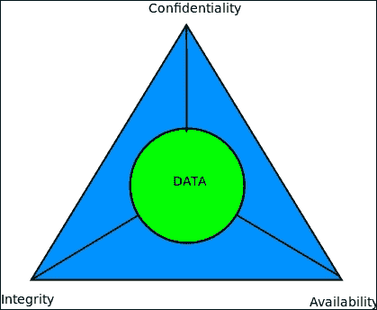

信息安全架构的 CIA 三位一体

这些方面受到其他特征的支持，例如以下特征：

+   **身份验证**：验证交易参与者的身份，并确保他们确实是他们所声称的人。例如，在电子邮件中使用的数字证书，用于登录系统的公钥等。

+   **授权**：授予特定用户/角色执行特定任务或相关任务组的权限。授权确保某些用户组与某些角色相关联，限制其在系统中的访问（读取）和修改（写入）权限。

+   不可否认性：保证参与交易的用户不能以后否认交易发生。例如，电子邮件的发送者不能以后否认他们发送了电子邮件；银行资金转账的接收方不能以后否认他们收到了钱，等等。

# 安全编码

安全编码是软件开发的实践，它保护程序免受安全漏洞的侵害，并使其抵抗恶意攻击，从程序设计到实施。这是关于编写固有安全的代码，而不是将安全视为后来添加的层。

安全编码背后的理念包括以下内容：

+   安全是设计和开发程序或应用程序时需要考虑的一个方面；这不是事后的想法。

+   安全需求应在开发周期的早期确定，并应传播到系统开发的后续阶段，以确保合规性得到维持。

+   使用威胁建模来预测系统从一开始面临的安全威胁。威胁建模包括以下内容：

1.  识别重要资产（代码/数据）。

1.  将应用程序分解为组件。

1.  识别和分类对每个资产或组件的威胁。

1.  根据已建立的风险模型对威胁进行排名。

1.  制定威胁缓解策略。

安全编码的实践或策略包括以下主要任务：

1.  应用程序的兴趣领域的定义：识别应用程序中代码/数据中的重要资产，这些资产是关键的，需要得到保护。

1.  软件架构分析：分析软件架构中的明显安全缺陷。组件之间的安全交互，以确保数据的保密性和完整性。确保通过适当的身份验证和授权技术保护机密数据。确保可用性从一开始就内置到架构中。

1.  实施细节审查：使用安全编码技术审查代码。确保进行同行审查以发现安全漏洞。向开发人员提供反馈并确保进行更改。

1.  逻辑和语法的验证：审查代码逻辑和语法，以确保实施中没有明显的漏洞。确保编程是根据编程语言/平台的常用安全编码指南进行的。

1.  白盒/单元测试：开发人员对其代码进行安全测试，除了确保功能的测试之外。可以使用模拟数据和/或 API 来虚拟化测试所需的第三方数据/API。

1.  黑盒测试：应用程序由经验丰富的质量保证工程师进行测试，他寻找安全漏洞，如未经授权访问数据，意外暴露代码或数据的路径，弱密码或哈希等。测试报告反馈给利益相关者，包括架构师，以确保修复已识别的漏洞。

实际上，安全编码是一个实践和习惯，软件开发组织应该通过经过精心制定和审查的安全编码策略来培养，如上述的策略。

# 常见的安全漏洞

那么，今天的专业程序员应该准备面对和减轻职业生涯中可能遇到的常见安全漏洞？从现有的文献来看，这些可以组织成几个特定的类别：

+   溢出错误：这些包括流行且经常被滥用的缓冲区溢出错误，以及较少为人知但仍然容易受到攻击的算术或整数溢出错误：

+   **缓冲区溢出**：缓冲区溢出是由编程错误产生的，允许应用程序在缓冲区的末尾或开头之外写入。缓冲区溢出允许攻击者通过精心制作的攻击数据访问应用程序的堆栈或堆内存，从而控制系统。

+   **整数或算术溢出**：当对整数进行算术或数学运算产生超出所用于存储的类型的最大大小的结果时，会发生这些错误。

如果未正确处理，整数溢出可能会导致安全漏洞。在支持有符号和无符号整数的编程语言中，溢出可能会导致数据包装并产生负数，从而允许攻击者获得类似于缓冲区溢出的结果，以访问程序执行限制之外的堆或栈内存。

+   **未经验证/未正确验证的输入**：现代 Web 应用程序中非常常见的安全问题，未经验证的输入可能会导致严重的漏洞，攻击者可以欺骗程序接受恶意输入，如代码数据或系统命令，当执行时可能会危害系统。旨在减轻此类攻击的系统应具有过滤器，以检查和删除恶意内容，并仅接受对系统合理和安全的数据。

此类攻击的常见子类型包括 SQL 注入、服务器端模板注入、**跨站脚本**（**XSS**）和 Shell 执行漏洞。

现代 Web 应用程序框架由于使用混合代码和数据的 HTML 模板而容易受到此类攻击的影响，但其中许多都有标准的缓解程序，如转义或过滤输入。

+   **不正确的访问控制**：现代应用程序应为其用户类别定义单独的角色，例如普通用户和具有特殊权限的用户，如超级用户或管理员。当应用程序未能或不正确地执行此操作时，可能会暴露路由（URL）或工作流程（由特定 URL 指定的一系列操作）的攻击向量，这可能会将敏感数据暴露给攻击者，或者在最坏的情况下，允许攻击者 compromise 并控制系统。

+   **密码学问题**：仅确保访问控制已经就位并不足以加固和保护系统。相反，应验证和确定安全级别和强度，否则，您的系统仍可能被黑客入侵或妥协。以下是一些示例：

+   **HTTP 而不是 HTTPS**：在实现 RestFUL Web 服务时，请确保优先选择 HTTPS（SSL/TLS）而不是 HTTP。在 HTTP 中，客户端和服务器之间的所有通信都是明文的，可以被被动网络嗅探器或精心制作的数据包捕获软件或安装在路由器中的设备轻松捕获。

像 letsencrypt 这样的项目已经为系统管理员提供了便利，可以获取和更新免费的 SSL 证书，因此使用 SSL/TLS 来保护您的服务器比以往任何时候都更容易。

+   **不安全的身份验证**：在 Web 服务器上，优先选择安全的身份验证技术而不是不安全的技术。例如，在 Web 服务器上，优先选择 HTTP 摘要身份验证而不是基本身份验证，因为在基本身份验证中，密码是明文传输的。同样，在大型共享网络中使用**Kerberos**身份验证，而不是**轻量级目录访问协议**（**LDAP**）或**NT LAN Manager**（**NTLM**）等不太安全的替代方案。

+   **使用弱密码**：易于猜测的或默认/琐碎的密码是许多现代 Web 应用程序的祸根。

+   **重用安全哈希/密钥** - 安全哈希或密钥通常特定于应用程序或项目，不应跨应用程序重用。每当需要时生成新的哈希和/或密钥。

+   **弱加密技术**：用于在服务器（SSL 证书）或个人计算机（GPG/PGP 密钥）上加密通信的密码应该使用高级别的安全性——至少 2048 位，并使用经过同行评审和加密安全的算法。

+   **弱哈希技术**：就像密码一样，用于保持敏感数据（如密码）的哈希技术应该谨慎选择强大的算法。例如，如果今天编写一个需要计算和存储哈希的应用程序，最好使用 SHA-1 或 SHA-2 算法，而不是较弱的 MD5。

+   **无效或过期的证书/密钥**：网站管理员经常忘记更新其 SSL 证书，这可能成为一个大问题，损害其 Web 服务器的安全性，因为无效的证书没有提供任何保护。类似地，用于电子邮件通信的个人密钥（如 GPG 或 PGP 公钥/私钥对）应该保持更新。

启用密码的 SSH - 使用明文密码对远程系统进行 SSH 访问是一个安全漏洞。禁用基于密码的访问，只允许特定用户通过授权的 SSH 密钥进行访问。禁用远程 root SSH 访问。

+   **信息泄漏**：许多 Web 服务器系统——主要是由于开放配置、或配置错误、或由于缺乏对输入的验证——可以向攻击者泄露许多关于自身的信息。以下是一些例子：

+   **服务器元信息**：许多 Web 服务器通过其 404 页面泄露有关自身的信息，有时还通过其登陆页面。以下是一个例子：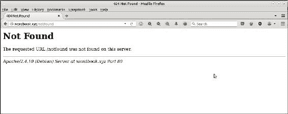

暴露服务器元信息的 Web 服务器 404 页面

仅仅通过请求一个不存在的页面，我们得知在前面截图中看到的网站在 Debian 服务器上运行 Apache 版本 2.4.10。对于狡猾的攻击者来说，这通常已经足够提供特定攻击的信息，针对特定的 Web 服务器/操作系统组合。

+   **打开索引页面**：许多网站不保护其目录页面，而是让它们对世界开放。以下图片显示了一个例子：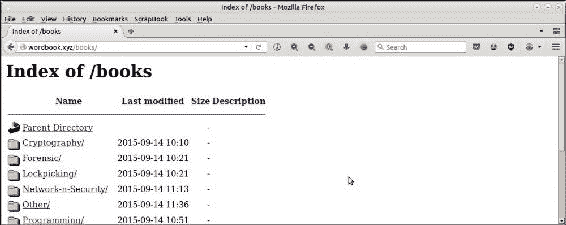

打开 Web 服务器的索引页面

+   **打开端口**：常见的错误是在远程 Web 服务器上运行的应用程序端口提供全球访问权限，而不是通过使用防火墙（如*iptables*）限制它们的访问权限，例如特定 IP 地址或安全组。类似的错误是允许服务在 0.0.0.0（服务器上的所有 IP 地址）上运行，而该服务仅在本地主机上使用。这使得攻击者可以使用网络侦察工具（如*nmap/hping3*等）扫描此类端口，并计划他们的攻击。

对文件/文件夹/数据库开放访问 - 提供应用程序配置文件、日志文件、进程 ID 文件和其他文件的开放或全球访问是一个非常糟糕的做法，以便任何登录用户都可以访问并从这些文件中获取信息。相反，这些文件应该成为安全策略的一部分，以确保只有具有所需特权的特定角色可以访问这些文件。

+   **竞争条件**：当程序有两个或更多的参与者试图访问某个资源，但输出取决于访问的正确顺序，而这不能得到保证时，就存在竞争条件。一个例子是两个线程试图在共享内存中递增一个数值而没有适当的同步。

狡猾的攻击者可以利用这种情况插入恶意代码，更改文件名，或者有时利用代码处理中的小时间间隙干扰操作的顺序。

+   **系统时钟漂移**：这是一个现象，即由于不正确或缺失的同步，服务器上的系统或本地时钟时间慢慢偏离参考时间。随着时间的推移，时钟漂移可能导致严重的安全漏洞，例如 SSL 证书验证错误，可以通过高度复杂的技术（如*定时攻击*）利用，攻击者试图通过分析执行加密算法所需的时间来控制系统。时间同步协议如 NTP 可以用来减轻这种情况。

+   **不安全的文件/文件夹操作**：程序员经常对文件或文件夹的所有权、位置或属性做出假设，而这在实践中可能并不成立。这可能导致安全漏洞或我们可能无法检测到对系统的篡改。以下是一些例子：

+   在写操作后未检查结果，假设它成功了

+   假设本地文件路径总是本地文件（而实际上，它们可能是对应用程序可能无法访问的系统文件的符号链接）

+   在执行系统命令时不正确使用 sudo，如果不正确执行，可能会导致漏洞，可以用来获取系统的根访问权限

+   对共享文件或文件夹过度使用权限，例如，打开程序的所有执行位，应该限制为一个组，或者可以被任何登录用户读取的开放家庭文件夹

+   使用不安全的代码或数据对象序列化和反序列化

本章的范围超出了访问此列表中每一种漏洞的范围。然而，我们将尽力审查和解释影响 Python 及其一些 Web 框架的常见软件漏洞类别，并在接下来的部分中进行解释。

# Python 安全吗？

Python 是一种非常易读的语言，语法简单，通常有一种清晰的方法来做事情。它配备了一组经过充分测试和紧凑的标准库模块。所有这些似乎表明 Python 应该是一种非常安全的语言。

但是真的吗？

让我们看看 Python 中的一些例子，并尝试分析 Python 及其标准库的安全性方面。

为了实用性，我们将展示本节中显示的代码示例使用 Python 2.x 和 Python 3.x 版本。这是因为 Python 2.x 版本中存在的许多安全漏洞在最近的 3.x 版本中得到了修复。然而，由于许多 Python 开发人员仍在使用 Python 2.x 的某种形式，这些代码示例对他们来说是有用的，并且还说明了迁移到 Python 3.x 的重要性。

所有示例都在运行 Linux（Ubuntu 16.0），x86_64 架构的机器上执行：

### 注意

注意：这些示例使用的 Python 3.x 版本是 Python 3.5.2，使用的 Python 2.x 版本是 Python 2.7.12。所有示例都在运行 Linux（Ubuntu 16.0）的机器上执行，64 位 x86 架构

```py
$ python3
Python 3.5.2 (default, Jul  5 2016, 12:43:10) 
[GCC 5.4.0 20160609] on linux
Type "help", "copyright", "credits" or "license" for more information.
>>> import sys
>>> print (sys.version)
3.5.2 (default, Jul  5 2016, 12:43:10) 
[GCC 5.4.0 20160609]
```

```py
$ python2
Python 2.7.12 (default, Jul  1 2016, 15:12:24) 
[GCC 5.4.0 20160609] on linux2
Type "help", "copyright", "credits" or "license" for more information.
>>> import sys
>>> print sys.version
2.7.12 (default, Jul  1 2016, 15:12:24) 
[GCC 5.4.0 20160609]
```

### 注意

注意：大多数示例将使用一个版本的代码，该代码将在 Python 2.x 和 Python 3.x 中运行。在无法实现这一点的情况下，将列出代码的两个版本。

## 读取输入

让我们看看这个简单的猜数字游戏程序。它从标准输入读取一个数字，并将其与一个随机数进行比较。如果匹配，用户就赢了，否则，用户必须再试一次：

```py
# guessing.py
import random

# Some global password information which is hard-coded
passwords={"joe": "world123",
          "jane": "hello123"}

def game():
     """A guessing game """

    # Use 'input' to read the standard input
    value=input("Please enter your guess (between 1 and 10): ")
    print("Entered value is",value)
    if value == random.randrange(1, 10):
        print("You won!")
    else:
        print("Try again")

if __name__ == "__main__":
    game()
```

前面的代码很简单，只是有一些敏感的全局数据，即系统中一些用户的密码。在一个现实的例子中，这些可能由一些其他函数填充，这些函数读取密码并将它们缓存在内存中。

让我们尝试使用一些标准输入运行程序。我们将首先使用 Python 2.7 运行它，如下所示：

```py
$ python2 guessing.py
Please enter your guess (between 1 and 10): 6
('Entered value is', 6)
Try again
$ python2 guessing.py
Please enter your guess (between 1 and 10): 8
('Entered value is', 8)
You won!

```

现在，让我们尝试一个“非标准”的输入：

```py
$ python2 guessing.py
Please enter your guess (between 1 and 10): passwords
('Entered value is', {'jane': 'hello123', 'joe': 'world123'})
Try again
```

注意前面的运行暴露了全局密码数据！

问题在于在 Python 2 中，输入值被评估为一个表达式而不进行任何检查，当它被打印时，表达式打印出它的值。在这种情况下，它恰好匹配一个全局变量，所以它的值被打印出来。

现在让我们看看这个：

```py
$ python2 guessing.py
Please enter your guess (between 1 and 10): globals()
('Entered value is', {'passwords': {'jane': 'hello123', 
'joe' : 'world123'}, '__builtins__': <module '__builtin__' (built-in)>,
 '__file__': 'guessing.py', 'random': 
<module 'random' from '/usr/lib/python2.7/random.pyc'>,
 '__package__': None, 'game': 
<function game at 0x7f6ef9c65d70>,
 '__name__': '__main__', '__doc__': None})
Try again
```

现在，它不仅暴露了密码，还暴露了代码中的完整全局变量，包括密码。即使程序中没有敏感数据，使用这种方法的黑客也可以揭示有关程序的有价值的信息，如变量名、函数名、使用的包等等。

这个问题的解决方案是什么？对于 Python 2，一个解决方案是用`raw_input`替换`input`，`raw_input`不评估内容。由于`raw_input`不返回数字，需要将其转换为目标类型。（可以通过将返回数据转换为`int`来完成。）以下代码不仅完成了这一点，还为类型转换添加了异常处理程序以提高安全性：

```py
# guessing_fix.py
import random

passwords={"joe": "world123",
                  "jane": "hello123"}

def game():
    value=raw_input("Please enter your guess (between 1 and 10): ")
    try:
        value=int(value)
    except TypeError:
        print ('Wrong type entered, try again',value)
        return

    print("Entered value is",value)
    if value == random.randrange(1, 10):
        print("You won!")
    else:
        print("Try again")

if __name__ == "__main__":
    game()
```

让我们看看这个版本如何修复评估输入的安全漏洞

```py
$ python2 guessing_fix.py 
Please enter your guess (between 1 and 10): 9
('Entered value is', 9)
Try again
$ python2 guessing_fix.py 
Please enter your guess (between1 and 10): 2
('Entered value is', 2)
You won!

$ python2 guessing_fix.py 
Please enter your guess (between 1 and 10): passwords
(Wrong type entered, try again =>, passwords)

$ python2 guessing_fix.py 
Please enter your guess (between 1 and 10): globals()
(Wrong type entered, try again =>, globals())
```

新程序现在比第一个版本安全得多。

这个问题在 Python 3.x 中不存在，如下图所示。（我们使用原始版本来运行这个）。

```py
$ python3 guessing.py 
Please enter your guess (between 1 and 10): passwords
Entered value is passwords
Try again

$ python3 guessing.py 
Please enter your guess (between 1 and 10): globals()
Entered value is globals()
Try again
```

## 评估任意输入

Python 中的`eval`函数非常强大，但也很危险，因为它允许将任意字符串传递给它，这可能会评估潜在危险的代码或命令。

让我们看看这个相当愚蠢的代码作为一个测试程序，看看`eval`能做什么：

```py
# test_eval.py
import sys
import os

def run_code(string):
    """ Evaluate the passed string as code """

    try:
eval(string, {})
    except Exception as e:
        print(repr(e))

if __name__ == "__main__":
     run_code(sys.argv[1])
```

让我们假设一个攻击者试图利用这段代码来查找应用程序运行的目录的内容。（暂时可以假设攻击者可以通过 Web 应用程序运行此代码，但没有直接访问机器本身）。

假设攻击者试图列出当前文件夹的内容：

```py
$ python2 test_eval.py "os.system('ls -a')"
NameError("name 'os' is not defined",)
```

这个先前的攻击不起作用，因为`eval`需要一个第二个参数，在评估过程中提供要使用的全局值。由于在我们的代码中，我们将这个第二个参数作为空字典传递，我们会得到错误，因为 Python 无法解析`os`名称。

这是否意味着`eval`是安全的？不，它不是。让我们看看为什么。

当我们将以下输入传递给代码时会发生什么？

```py
$ python2 test_eval.py "__import__('os').system('ls -a')"
.   guessing_fix.py  test_eval.py    test_input.py
..  guessing.py      test_format.py  test_io.py
```

我们可以看到，我们仍然能够通过使用内置函数`__import__`来诱使`eval`执行我们的命令。

这样做的原因是因为像`__import__`这样的名称在默认内置的`__builtins__`全局中是可用的。我们可以通过将其作为空字典传递给第二个参数来拒绝`eval`。这是修改后的版本：

```py
# test_eval.py
import sys
import os

def run_code(string):
    """ Evaluate the passed string as code """

    try:
        # Pass __builtins__ dictionary as empty
        eval(string,  {'__builtins__':{}})
    except Exception as e:
        print(repr(e))

if __name__ == "__main__":
run_code(sys.argv[1])
```

现在攻击者无法通过内置的`__import__`进行利用：

```py
$ python2 test_eval.py "__import__('os').system('ls -a')"
NameError("name '__import__' is not defined",)
```

然而，这并不意味着`eval`更安全，因为它容易受到稍长一点但聪明的攻击。以下是这样一种攻击：

```py
$ python2 test_eval.py "(lambda f=(lambda x: [c for c in [].__class__.__bases__[0].__subclasses__() if c.__name__ == x][0]): f('function')(f('code')(0,0,0,0,'BOOM',(), (),(),'','',0,''),{})())()"
Segmentation fault (core dumped)
```

我们能够使用一个看起来相当晦涩的恶意代码来使 Python 解释器崩溃。这是怎么发生的？

这里是步骤的一些详细解释。

首先，让我们考虑一下这个：

```py
>>> [].__class__.__bases__[0]
<type 'object'>
```

这只是基类`object`。由于我们无法访问内置函数，这是一种间接访问它的方法。

接下来，以下代码行加载了 Python 解释器中当前加载的`object`的所有子类：

```py
>>> [c for c in [].__class__.__bases__[0].__subclasses__()]
```

其中，我们想要的是`code`对象类型。这可以通过检查项目的名称通过`__name__`属性来访问：

```py
>>> [c for c in [].__class__.__bases__[0].__subclasses__() if c.__name__ == 'code']
```

这是通过使用匿名`lambda`函数实现的相同效果：

```py
>>> (lambda x: [c for c in [].__class__.__bases__[0].__subclasses__() if c.__name__ == x])('code')
[<type 'code'>]
```

接下来，我们想要执行这个代码对象。然而，`code`对象不能直接调用。它们需要绑定到一个函数才能被调用。这是通过将前面的`lambda`函数包装在外部`lambda`函数中实现的：

```py
>>> (lambda f: (lambda x: [c for c in [].__class__.__bases__[0].__subclasses__() if c.__name__ == x])('code'))
<function <lambda> at 0x7f8b16a89668
```

现在我们的内部`lambda`函数可以分两步调用：

```py
>>> (lambda f=(lambda x: [c for c in [].__class__.__bases__[0].__subclasses__() if c.__name__ == x][0]): f('function')(f('code')))
<function <lambda> at 0x7fd35e0db7d0>
```

最后，我们通过这个外部的`lambda`函数调用`code`对象，传递了大多数默认参数。代码字符串被传递为字符串`BOOM`，当然，这是一个虚假的代码字符串，会导致 Python 解释器崩溃，产生核心转储：

```py
>>> (lambda f=(lambda x: 
[c for c in [].__class__.__bases__[0].__subclasses__() if c.__name__ == x][0]): 
f('function')(f('code')(0,0,0,0,'BOOM',(), (),(),'','',0,''),{})())()
Segmentation fault (core dumped)
```

这表明在任何情况下，即使没有内置模块的支持，`eval`都是不安全的，并且可以被聪明而恶意的黑客利用来使 Python 解释器崩溃，从而可能控制系统。

请注意，相同的利用在 Python 3 中也有效，但是我们需要对`code`对象的参数进行一些修改，因为在 Python 3 中，`code`对象需要额外的参数。此外，代码字符串和一些参数必须是`byte`类型。

以下是在 Python 3 上运行的利用。最终结果是相同的：

```py
$ python3 test_eval.py 
"(lambda f=(lambda x: [c for c in ().__class__.__bases__[0].__subclasses__() 
  if c.__name__ == x][0]): f('function')(f('code')(0,0,0,0,0,b't\x00\x00j\x01\x00d\x01\x00\x83\x01\x00\x01d\x00\x00S',(), (),(),'','',0,b''),{})())()"
Segmentation fault (core dumped)
```

## 溢出错误

在 Python 2 中，如果`xrange()`函数的范围无法适应 Python 的整数范围，则会产生溢出错误：

```py
>>> print xrange(2**63)
Traceback (most recent call last):
    File "<stdin>", line 1, in <module>
OverflowError: Python int too large to convert to C long
```

`range()`函数也会出现略有不同的溢出错误：

```py
>>> print range(2**63)
Traceback (most recent call last):
    File "<stdin>", line 1, in <module>
OverflowError: range() result has too many items
```

问题在于`xrange()`和`range()`使用普通整数对象（类型`<int>`），而不是自动转换为仅受系统内存限制的`long`类型。

然而，在 Python 3.x 版本中，这个问题已经得到解决，因为类型`int`和`long`被统一为一个（`int`类型），而`range()`对象在内部管理内存。此外，不再有单独的`xrange()`对象：

```py
>>> range(2**63)
range(0, 9223372036854775808)
```

这是 Python 中整数溢出错误的另一个例子，这次是针对`len`函数。

在以下示例中，我们尝试对两个类 A 和 B 的实例使用`len`函数，这两个类的魔术方法`__len__`已被覆盖以支持`len`函数。请注意，A 是一个新式类，继承自`object`，而 B 是一个旧式类。

```py
# len_overflow.py

class A(object):
    def __len__(self): 
        return 100 ** 100

class B:
    def __len__(self): 
        return 100 ** 100

try:
    len(A())
    print("OK: 'class A(object)' with 'return 100 ** 100' - len calculated")
except Exception as e:
    print("Not OK: 'class A(object)' with 'return 100 ** 100' - len raise Error: " + repr(e))

try:
    len(B())
    print("OK: 'class B' with 'return 100 ** 100' - len calculated")
except Exception as e:
    print("Not OK: 'class B' with 'return 100 ** 100' - len raise Error: " + repr(e))
```

以下是在 Python2 中执行代码时的输出：

```py
$ python2 len_overflow.py** 
Not OK: 'class A(object)' with 'return 100 ** 100' - len raise Error: OverflowError('long int too large to convert to int',)
Not OK: 'class B' with 'return 100 ** 100' - len raise Error: TypeError('__len__() should return an int',)

```

在 Python 3 中执行相同的代码如下：

```py
$ python3 len_overflow.py** 
Not OK: 'class A(object)' with 'return 100 ** 100' - len raise Error: OverflowError("cannot fit 'int' into an index-sized integer",)
Not OK: 'class B' with 'return 100 ** 100' - len raise Error: OverflowError("cannot fit 'int' into an index-sized integer",)

```

在前面的代码中的问题在于`len`返回`integer`对象，在这种情况下，实际值太大而无法适应`int`，因此 Python 引发了溢出错误。然而，在 Python 2 中，对于未从`object`派生的类的情况，执行的代码略有不同，它预期一个`int`对象，但得到了`long`并抛出了`TypeError`。在 Python 3 中，这两个示例都返回溢出错误。

这样的整数溢出错误是否存在安全问题？

在实际情况中，这取决于应用程序代码和所使用的依赖模块代码，以及它们如何处理或捕获/掩盖溢出错误。

然而，由于 Python 是用 C 编写的，任何在底层 C 代码中没有正确处理的溢出错误都可能导致缓冲区溢出异常，攻击者可以向溢出缓冲区写入并劫持底层进程/应用程序。

通常，如果一个模块或数据结构能够处理溢出错误并引发异常以阻止进一步的代码执行，那么代码利用的可能性就会减少。

## 对象序列化

对于 Python 开发人员来说，使用`pickle`模块及其 C 实现的`cPickle`来对 Python 中的对象进行序列化是非常常见的。然而，这两个模块都允许未经检查的代码执行，因为它们不对被序列化的对象进行任何类型检查或规则的强制，以验证它是一个良性的 Python 对象还是一个可能利用系统的潜在命令。

### 注意

注意：在 Python3 中，`cPickle`和`pickle`模块合并为一个单独的`pickle`模块。

这是通过 shell 利用的示例，它列出了 Linux/POSIX 系统中根文件夹（/）的内容：

```py
# test_serialize.py
import os
import pickle

class ShellExploit(object):
    """ A shell exploit class """

    def __reduce__(self):
        # this will list contents of root / folder.
        return (os.system, ('ls -al /',)

def serialize():
    shellcode = pickle.dumps(ShellExploit())
    return shellcode

def deserialize(exploit_code):
    pickle.loads(exploit_code)

if __name__ == '__main__':
    shellcode = serialize()
    deserialize(shellcode)
```

最后的代码简单地打包了一个`ShellExploit`类，该类在进行 pickle 时通过`os.system()`方法返回列出根文件系统`/`内容的命令。`Exploit`类将恶意代码伪装成`pickle`对象，该对象在解 pickle 时执行代码，并将机器的根文件夹内容暴露给攻击者。上述代码的输出如下所示：

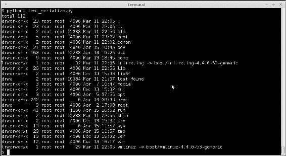

使用 pickle 进行序列化的 shell 利用代码的输出，暴露了/文件夹的内容。

正如你所看到的，输出清楚地列出了根文件夹的内容。

如何防止这种利用的解决方法是什么？

首先，不要在应用程序中使用像`pickle`这样的不安全模块进行序列化。而是依赖于更安全的替代方案，如`json`或`yaml`。如果你的应用程序确实依赖于某种原因使用`pickle`模块，那么使用沙箱软件或`codeJail`来创建防止系统上恶意代码执行的安全环境。

例如，这是对先前代码的轻微修改，现在使用一个简单的 chroot 监狱，防止在实际根文件夹上执行代码。它使用一个本地的`safe_root/`子文件夹作为新的根目录，通过上下文管理器钩子。请注意，这只是一个简单的例子。实际的监狱会比这个复杂得多：

```py
# test_serialize_safe.py
import os
import pickle
from contextlib import contextmanager

class ShellExploit(object):
    def __reduce__(self):
        # this will list contents of root / folder.
        return (os.system, ('ls -al /',))

@contextmanager
def system_jail():
    """ A simple chroot jail """

    os.chroot('safe_root/')
    yield
    os.chroot('/')

def serialize():
    with system_jail():
        shellcode = pickle.dumps(ShellExploit())
        return shellcode

def deserialize(exploit_code):
    with system_jail():
        pickle.loads(exploit_code)

if __name__ == '__main__':
    shellcode = serialize()
    deserialize(shellcode)
```

有了这个监狱，代码执行如下：

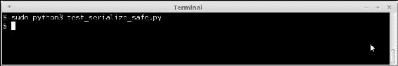

使用 pickle 进行序列化的 shell 利用代码的输出，带有一个简单的 chroot 监狱。

现在不会产生任何输出，因为这是一个虚假的监狱，Python 在新根目录中找不到`ls`命令。当然，为了使这在生产系统中起作用，应该设置一个适当的监狱，允许程序执行，但同时防止或限制恶意程序的执行。

其他序列化格式如 JSON 怎么样？这样的利用可以使用它们吗？让我们用一个例子来看看。

这里是使用`json`模块编写的相同序列化代码：

```py
# test_serialize_json.py
import os
import json
import datetime

class ExploitEncoder(json.JSONEncoder):
    def default(self, obj):
        if any(isinstance(obj, x) for x in (datetime.datetime, datetime.date)):
            return str(obj)

        # this will list contents of root / folder.
        return (os.system, ('ls -al /',))

def serialize():
    shellcode = json.dumps([range(10),
                            datetime.datetime.now()],
                           cls=ExploitEncoder)
    print(shellcode)
    return shellcode

def deserialize(exploit_code):
    print(json.loads(exploit_code))

if __name__ == '__main__':
    shellcode = serialize()
    deserialize(shellcode)
```

请注意，使用自定义编码器`ExploitEncoder`覆盖了默认的 JSON 编码器。然而，由于 JSON 格式不支持这种序列化，它返回了作为输入传递的列表的正确序列化：

```py
$ python2 test_serialize_json.py 
[[0, 1, 2, 3, 4, 5, 6, 7, 8, 9], "2017-04-15 12:27:09.549154"]
[[0, 1, 2, 3, 4, 5, 6, 7, 8, 9], u'2017-04-15 12:27:09.549154']
```

使用 Python3，利用程序失败，因为 Python3 会引发异常。

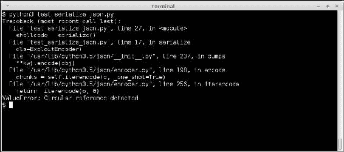

使用 Python3 进行序列化的 shell 利用代码的输出

# Web 应用程序的安全问题

到目前为止，我们已经看到了 Python 的四种安全问题，即读取输入、评估表达式、溢出错误和序列化问题。到目前为止，我们所有的例子都是在控制台上使用 Python。

然而，我们几乎每天都与 Web 应用程序进行交互，其中许多是使用 Python Web 框架编写的，如 Django、Flask、Pyramid 等。因此，我们更有可能在这些应用程序中暴露出安全问题。我们将在这里看一些例子。

## 服务器端模板注入

**服务器端模板注入**（**SSTI**）是一种使用常见 Web 框架的服务器端模板作为攻击向量的攻击。该攻击利用了用户输入嵌入模板的方式中的弱点。SSTI 攻击可以用于查找 Web 应用程序的内部情况，执行 shell 命令，甚至完全破坏服务器。

我们将看到一个使用 Python 中非常流行的 Web 应用程序框架 Flask 的示例。

以下是一个在 Flask 中使用内联模板的相当简单的 Web 应用程序的示例代码：

```py
# ssti-example.py
from flask import Flask
from flask import request, render_template_string, render_template

app = Flask(__name__)

@app.route('/hello-ssti')
defhello_ssti():
    person = {'name':"world", 'secret': 'jo5gmvlligcZ5YZGenWnGcol8JnwhWZd2lJZYo=='}
    if request.args.get('name'):
        person['name'] = request.args.get('name')

    template = '<h2>Hello %s!</h2>' % person['name']
    return render_template_string(template, person=person)

if __name__ == "__main__":
app.run(debug=True)
```

在控制台上运行，并在浏览器中打开，允许我们在`hello-ssti`路由中玩耍：

```py
$ python3 ssti_example.py 
 * Running on http://127.0.0.1:5000/ (Press CTRL+C to quit)
 * Restarting with stat
 * Debugger is active!
 * Debugger pin code: 163-936-023
```

首先，让我们尝试一些良性输入：

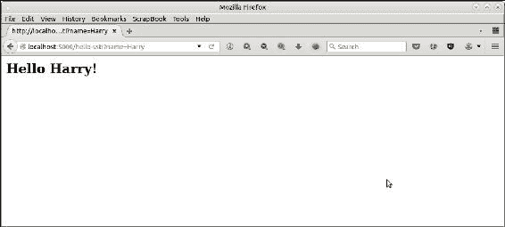

这里是另一个例子。

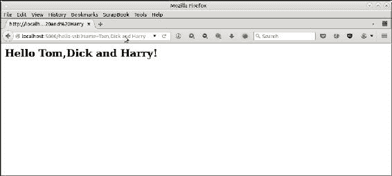

接下来，让我们尝试一些攻击者可能使用的巧妙输入。

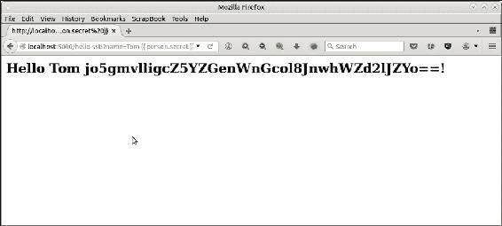

这里发生了什么？

由于模板使用不安全的`%s`字符串模板，它会将传递给它的任何内容评估为 Python 表达式。我们传递了`{{ person.secret }}`，在 Flask 模板语言（Flask 使用 Jinja2 模板）中，它被评估为字典`person`中密钥 secret 的值，从而有效地暴露了应用程序的秘密密钥！

我们可以进行更加雄心勃勃的攻击，因为代码中的这个漏洞允许攻击者尝试 Jinja 模板的全部功能，包括 for 循环。以下是一个示例：

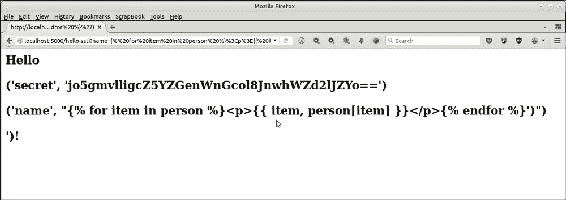

用于攻击的 URL 如下：

```py
http://localhost:5000/hello-ssti?name=<p>{{ item, person[item] }}</p>
```

这通过一个 for 循环，尝试打印`person`字典的所有内容。

这也允许攻击者轻松访问敏感的服务器端配置参数。例如，他可以通过将名称参数传递为`{{ config }}`来打印 Flask 配置。

这是浏览器的图像，使用此攻击打印服务器配置。

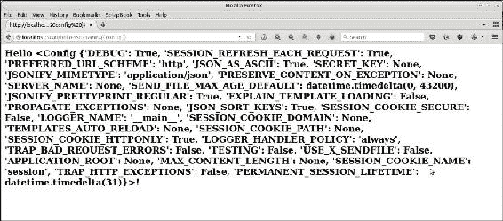

## 服务器端模板注入 - 缓解

我们在上一节中看到了一些使用服务器端模板作为攻击向量来暴露 Web 应用程序/服务器敏感信息的示例。在本节中，我们将看到程序员如何保护他的代码免受此类攻击。

在这种特定情况下，修复此问题的方法是在模板中使用我们想要的特定变量，而不是危险的、允许所有`%s`字符串。以下是带有修复的修改后的代码：

```py
# ssti-example-fixed.py
from flask import Flask
from flask import request, render_template_string, render_template

app = Flask(__name__)

@app.route('/hello-ssti')
defhello_ssti():
    person = {'name':"world", 'secret': 'jo5gmvlligcZ5YZGenWnGcol8JnwhWZd2lJZYo=='}
    if request.args.get('name'):
        person['name'] = request.args.get('name')

    template = '<h2>Hello {{ person.name }} !</h2>'
    return render_template_string(template, person=person)

if __name__ == "__main__":
app.run(debug=True)
```

现在，先前的所有攻击都会失败。

这是第一次攻击的浏览器图像：

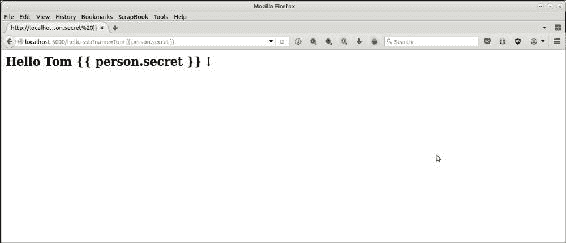

以下是下一次攻击的浏览器图像。

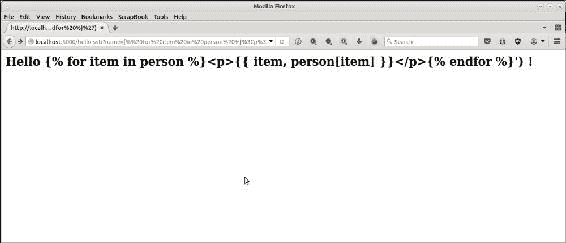

## 拒绝服务

现在让我们看看另一种常被恶意黑客使用的攻击，即**拒绝服务**（**DOS**）。

DoS 攻击针对 Web 应用程序中的易受攻击的路由或 URL，并向其发送巧妙的数据包或 URL，这些数据包或 URL 要么迫使服务器执行无限循环或 CPU 密集型计算，要么迫使服务器从数据库中加载大量数据，这会给服务器 CPU 带来很大负载，从而阻止服务器执行其他请求。

### 注意

DDoS 或分布式 DoS 攻击是指以协调的方式使用多个系统针对单个域的 DoS 攻击。通常使用数千个 IP 地址，这些 IP 地址通过僵尸网络进行管理以进行 DDoS 攻击。

我们将看到一个使用我们先前示例的变体的 DoS 攻击的最小示例：

```py
# ssti-example-dos.py
from flask import Flask
from flask import request, render_template_string, render_template

app = Flask(__name__)

TEMPLATE = '''
<html>
 <head><title> Hello {{ person.name }} </title></head>
 <body> Hello FOO </body>
</html>
'''

@app.route('/hello-ssti')
defhello_ssti():
    person = {'name':"world", 'secret': 'jo5gmvlligcZ5YZGenWnGcol8JnwhWZd2lJZYo=='} 
    if request.args.get('name'):
        person['name'] = request.args.get('name')

    # Replace FOO with person's name
    template = TEMPLATE.replace("FOO", person['name'])
    return render_template_string(template, person=person)

if __name__ == "__main__":
app.run(debug=True)
```

在上述代码中，我们使用一个名为`TEMPLATE`的全局模板变量，并使用`safer {{ person.name }}`模板变量作为与 SSTI 修复一起使用的模板变量。但是，这里的附加代码是用名称值替换了持有名称`FOO`。

这个版本具有原始代码的所有漏洞，即使删除了`%s`代码。例如，看一下浏览器暴露了`{{ person.secret }}`变量值的图像，但没有在页面标题中暴露。

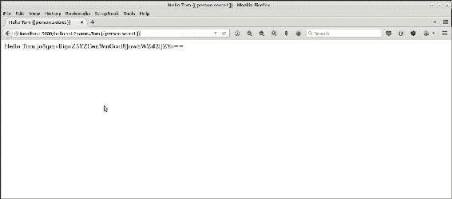

这是由于我们添加的以下代码行。

```py
 # Replace FOO with person's name
 template = TEMPLATE.replace("FOO", person['name'])
```

任何传递的表达式都会被评估，包括算术表达式。例如：

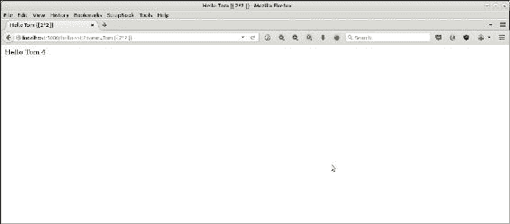

这打开了通过传递服务器无法处理的 CPU 密集型计算的简单 DoS 攻击的途径。例如，在以下攻击中，我们传递了一个非常大的数字计算，它占用了系统的 CPU，减慢了系统的速度，并使应用程序无响应：

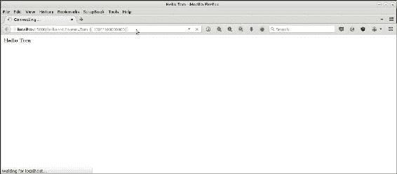

使用计算密集型代码演示 DoS 风格攻击的示例。请求从未完成。

此攻击使用的 URL 是`http://localhost:5000/hello-ssti?name=Tom`。

通过传入计算密集的算术表达式`{{ 100**100000000 }}`，服务器被超载，无法处理其他请求。

正如您在上一张图片中所看到的，请求从未完成，也阻止了服务器响应其他请求；正如您可以从右侧打开的新标签页上对同一应用程序的正常请求也被阻塞，导致了 DoS 风格攻击的效果。

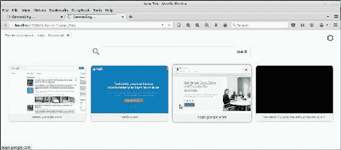

右侧打开的新标签页显示应用程序已经无响应。

## 跨站脚本攻击（XSS）

我们在前一节中使用的代码来演示最小化 DOS 攻击也容易受到脚本注入的影响。以下是一个示例：

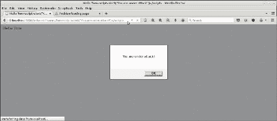

使用服务器端模板和 JavaScript 注入演示 XSS 脚本注入的简单示例

此攻击使用的 URL 是：

```py
http://localhost:5000/hello-ssti?name=Tom<script>alert("You are under attack!")</script>
```

这些脚本注入漏洞可能导致 XSS，这是一种常见的 Web 利用形式，攻击者能够将恶意脚本注入到您服务器的代码中，从其他网站加载，并控制它。

## 缓解- DoS 和 XSS

在上一节中，我们看到了一些 DoS 攻击和简单的 XSS 攻击的示例。现在让我们看看程序员如何在他的代码中采取措施来缓解这种攻击。

在我们用于说明的先前特定示例中，修复方法是删除替换字符串`FOO`的行，并将其替换为参数模板本身。为了保险起见，我们还确保输出通过使用 Jinja 2 的转义过滤器`|e`进行适当的转义。以下是重写的代码：

```py
# ssti-example-dos-fix.py
from flask import Flask
from flask import request, render_template_string, render_template

app = Flask(__name__)

TEMPLATE = '''
<html>
 <head><title> Hello {{ person.name | e }} </title></head>
 <body> Hello {{ person.name | e }} </body>
</html>
'''

@app.route('/hello-ssti')
defhello_ssti():
    person = {'name':"world", 'secret': 'jo5gmvlligcZ5YZGenWnGcol8JnwhWZd2lJZYo=='} 
    if request.args.get('name'):
        person['name'] = request.args.get('name')
    return render_template_string(TEMPLATE, person=person)

if __name__ == "__main__":
app.run(debug=True)
```

现在这两个漏洞都得到了缓解，攻击没有效果，也没有造成伤害。

这是一个演示 DoS 攻击的图像。

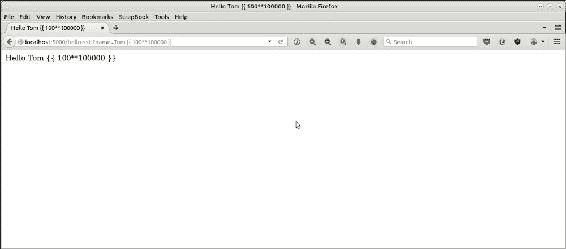

这是一个演示 XSS 攻击的示例。

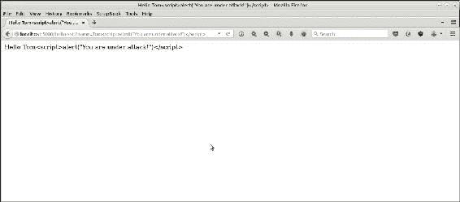

由于服务器端模板中的糟糕代码，类似的漏洞也存在于其他 Python Web 框架，如 Django、Pyramid、Tornado 等。然而，逐步讨论每个框架的内容超出了本章的范围。有兴趣的读者可以查阅网络上讨论此类问题的安全资源。

# 安全策略- Python

我们已经讨论了 Python 编程语言核心中存在的许多漏洞，还看了一些影响 Python Web 应用程序的常见安全问题。

现在是时候了解安全架构师可以使用的策略-提示和技术，以便他们的团队可以从程序设计和开发阶段开始应用安全编码原则来缓解安全问题：

+   **读取输入**：在读取控制台输入时，优先使用 raw_input 而不是 input，因为前者不会评估 Python 表达式，而是将输入作为纯字符串返回。任何类型转换或验证都应手动完成，如果类型不匹配，则抛出异常或返回错误。对于读取密码，使用 getpass 等库，并对返回的数据进行验证。一旦验证成功，可以安全地对数据进行评估。

+   **评估表达式**：正如我们在示例中所看到的，eval 无论如何使用都存在漏洞。因此，Python 的最佳策略是避免使用 eval 及其邪恶的表亲 exec。如果必须使用 eval，请务必不要与用户输入字符串、或从第三方库或 API 读取的数据一起使用。只能与您控制并信任的函数的输入源和返回值一起使用 eval。

+   序列化：不要使用`pickle`或`cPickle`进行序列化。更倾向于其他模块，如 JASON 或 YAML。如果绝对必须使用`pickle`/`cPickle`，则使用缓解策略，如 chroot 监狱或沙盒，以避免恶意代码执行的不良影响。

+   溢出错误：通过使用异常处理程序来防范整数溢出。Python 不会受到纯缓冲区溢出错误的影响，因为它总是检查其容器是否超出边界的读/写访问，并抛出异常。对于类中重写的`__len__`方法，根据需要捕获溢出或`TypeError`异常。

+   字符串格式化：更倾向于使用模板字符串的新方法，而不是旧的和不安全的`%s`插值。

例如：

```py
def display_safe(employee):
    """ Display details of the employee instance """

    print("Employee: {name}, Age: {age}, 
             profession: {job}".format(**employee))

def display_unsafe(employee):
    """ Display details of employee instance """

    print ("Employee: %s, Age: %d, 
              profession: %s" % (employee['name'],
                                             employee['age'],
                                             employee['job']))

>>> employee={'age': 25, 'job': 'software engineer', 'name': 'Jack'}
>>> display_safe(employee)
Employee: Jack, Age: 25, profession: software engineer
>>> display_unsafe(employee)
Employee: Jack, Age: 25, profession: software engineer
```

+   文件：在处理文件时，最好使用上下文管理器来确保在操作后关闭文件描述符。

例如，更倾向于这种方法：

```py
with open('somefile.txt','w') as fp:
 fp.write(buffer)
```

并避免以下情况：

```py
fp = open('somefile.txt','w')
fp.write(buffer)
```

这也将确保在文件读取或写入期间发生任何异常时关闭文件描述符，而不是在系统中保持打开文件句柄。

+   处理密码和敏感信息：在验证密码等敏感信息时，最好比较加密哈希而不是比较内存中的原始数据：

+   这样，即使攻击者能够通过利用诸如 shell 执行漏洞或输入数据评估中的弱点等漏洞从程序中窃取敏感数据，实际的敏感数据也会受到保护，不会立即泄露。以下是一个简单的方法：

```py
# compare_passwords.py - basic
import hashlib
import sqlite3
import getpass

def read_password(user):
    """ Read password from a password DB """
    # Using an sqlite db for demo purpose

    db = sqlite3.connect('passwd.db')
    cursor = db.cursor()
    try:
        passwd=cursor.execute("select password from passwds where user='%(user)s'" % locals()).fetchone()[0]
        return hashlib.sha1(passwd.encode('utf-8')).hexdigest()
    except TypeError:
        pass

def verify_password(user):
    """ Verify password for user """

    hash_pass = hashlib.sha1(getpass.getpass("Password: ").encode('utf-8')).hexdigest()
    print(hash_pass)
    if hash_pass==read_password(user):
        print('Password accepted')
    else:
        print('Wrong password, Try again')

if __name__ == "__main__":
    import sys
    verify_password(sys.argv[1])
```

更加密码学上正确的技术是使用内置盐和固定数量的哈希轮次的强密码哈希库。

以下是在 Python 中使用`passlib`库的示例：

```py
# crypto_password_compare.py
import sqlite3
import getpass
from passlib.hash import bcrypt

def read_passwords():
    """ Read passwords for all users from a password DB """
    # Using an sqlite db for demo purpose

    db = sqlite3.connect('passwd.db')
    cursor = db.cursor()
    hashes = {}

    for user,passwd in cursor.execute("select user,password from passwds"):
        hashes[user] = bcrypt.encrypt(passwd, rounds=8)

    return hashes

def verify_password(user):
    """ Verify password for user """

    passwds = read_passwords()
    # get the cipher
    cipher = passwds.get(user)
    if bcrypt.verify(getpass.getpass("Password: "), cipher):
        print('Password accepted')      
    else:
        print('Wrong password, Try again')

if __name__ == "__main__":
    import sys
    verify_password(sys.argv[1])
```

为了说明，已创建了一个包含两个用户及其密码的`passwd.db` sqlite 数据库，如下截图所示：

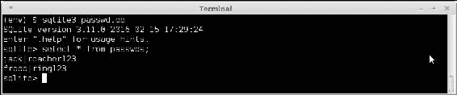

以下是代码的实际操作：

### 注意

请注意，为了清晰起见，此处显示了键入的密码-实际程序中不会显示，因为它使用`getpass`库。

以下是代码的实际操作：

```py
$ python3 crytpo_password_compare.py jack
Password: test
Wrong password, Try again

$ python3 crytpo_password_compare.py jack
Password: reacher123
Password accepted
```

+   本地数据：尽量避免将敏感数据存储在函数的本地。函数中的任何输入验证或评估漏洞都可以被利用来访问本地堆栈，从而访问本地数据。始终将敏感数据加密或散列存储在单独的模块中。

以下是一个简单的示例：

```py
def func(input):
  secret='e4fe5775c1834cc8bd6abb712e79d058'
  verify_secret(input, secret)
  # Do other things
```

上述函数对于秘钥“secret”是不安全的，因为任何攻击者访问函数堆栈的能力都可以访问秘密。

这些秘密最好保存在一个单独的模块中。如果您正在使用秘密进行哈希和验证，以下代码比第一个更安全，因为它不会暴露“秘密”的原始值：

```py
 # This is the 'secret' encrypted via bcrypt with eight rounds.
 secret_hash=''$2a$08$Q/lrMAMe14vETxJC1kmxp./JtvF4vI7/b/VnddtUIbIzgCwA07Hty'
 def func(input):
  verify_secret(input, secret_hash)
```

+   竞争条件：Python 提供了一组优秀的线程原语。如果您的程序使用多个线程和共享资源，请遵循以下准则来同步对资源的访问，以避免竞争条件和死锁：

+   通过互斥锁（`threading.Lock`）保护可以同时写入的资源

+   通过信号量（`threading.BoundedSemaphore`）保护需要序列化的资源，以便对多个但有限的并发访问进行处理

+   使用条件对象唤醒同步等待可编程条件或函数的多个线程（`threading.Condition`）

+   避免循环一段时间后休眠，然后轮询条件或标准。而是使用条件或事件对象进行同步（`threading.Event`）

对于使用多个进程的程序，应该使用`multiprocessing`库提供的类似对应物来管理对资源的并发访问

+   **保持系统更新**：尽管这听起来陈词滥调，但及时了解系统中软件包的安全更新以及一般安全新闻，特别是对影响您应用程序的软件包，是保持系统和应用程序安全的简单方法。许多网站提供了许多开源项目（包括 Python 及其标准库模块）安全状态的持续更新。

这些报告通常被称为**常见漏洞和暴露**（**CVEs**）-诸如 Mitre（[`cve.mitre.org`](http://cve.mitre.org)）之类的网站提供不断更新的信息。

在这些网站上搜索 Python 显示了 213 个结果：

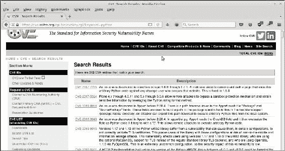

在 Mitre CVE 列表上搜索'python'关键字的结果

架构师、运维工程师和网站管理员也可以调整系统软件包更新，并始终默认启用安全更新。对于远程服务器，建议每两到三个月升级到最新的安全补丁。

+   同样，Python **开放式 Web 应用安全项目**（**OWASP**）是一个免费的第三方项目，旨在创建一个比标准 Cpython 更能抵御安全威胁的 Python 强化版本。它是更大的 OWASP 计划的一部分。

+   Python OWASP 项目通过其网站和相关的 GitHub 项目提供了 Python 错误报告、工具和其他工件。主要网站是，大部分代码可从 GitHub 项目页面获取：[`github.com/ebranca/owasp-pysec/`](https://github.com/ebranca/owasp-pysec/)。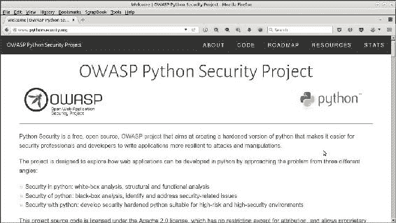

OWASP Python 安全项目主页

对于利益相关者来说，跟踪该项目、运行测试并阅读报告以了解 Python 安全方面的最新信息是一个好主意。

# 安全编码策略

我们即将结束对软件架构安全方面的讨论。现在是总结应该从安全架构师的角度向软件开发团队传授的策略的好时机。以下是总结其中前 10 个策略的表格。其中一些可能与我们之前的讨论重复，因为我们之前已经看到过它们。

| SL | 策略 | 它如何帮助 |
| --- | --- | --- |
| 1 | 验证输入 | 验证来自所有不受信任数据源的输入。适当的输入验证可以消除绝大多数软件漏洞。 |
| 2 | 保持简单 | 尽量简化程序设计。复杂的设计增加了在实施、配置和部署过程中出现安全错误的几率。 |
| 3 | 最小权限原则 | 每个进程应以完成工作所需的最少系统权限执行。例如，要从/tmp 读取数据，不需要 root 权限，但任何非特权用户都可以。 |
| 4 | 清理数据 | 清理从所有第三方系统（如数据库、命令行 shell、COTs 组件、第三方中间件等）读取和发送的数据。这减少了 SQL 注入、shell 利用或其他类似攻击的机会。 |
| 5 | 授权访问 | 通过需要特定身份验证的角色将应用程序的各个部分分开。不要在同一代码中混合不同部分的应用程序，这些部分需要不同级别的访问权限。采用适当的路由确保不会通过未受保护的路由暴露敏感数据。 |
| 6 | 进行有效的 QA | 良好的安全测试技术能够有效地识别和消除漏洞。模糊测试、渗透测试和源代码审计应作为程序的一部分进行。 |
| 7 | 分层实践防御 | 通过多层安全性减轻风险。例如，将安全编程技术与安全运行时配置相结合，将减少在运行时环境中暴露任何剩余代码漏洞的机会。 |
| 8 | 定义安全需求 | 在系统早期生命周期中识别和记录安全约束，并不断更新它们，确保后续功能符合这些要求。 |
| 9 | 建模威胁 | 使用威胁建模来预测软件将受到的威胁。 |
| 10 | 为安全策略进行架构和设计 | 创建并维护一个软件架构，强制执行一致的安全策略模式，覆盖系统及其子系统。 |

# 总结

在本章中，我们首先看了一个建立安全性的系统架构的细节。我们继续定义了安全编码，并研究了安全编码实践背后的哲学和原则。

然后，我们研究了软件系统中遇到的常见安全漏洞类型，如缓冲区溢出、输入验证问题、访问控制问题、加密弱点、信息泄漏、不安全的文件操作等。

然后，我们详细讨论了 Python 安全问题，并举了很多例子。我们详细研究了读取和评估输入、溢出错误和序列化问题。然后，我们继续研究了 Python Web 应用程序框架中的常见漏洞，选择了 Flask 作为候选对象。我们看到了如何利用 Web 应用程序模板的弱点，并执行 SSTI、XSS 和 DOS 等攻击。我们还看到了如何通过多个代码示例来减轻这些攻击。

然后，我们列出了 Python 中编写安全代码的具体技术。我们详细研究了在代码中管理密码和其他敏感数据的加密哈希，并讨论了一些正确的示例。还提到了保持自己了解安全新闻和项目的重要性，以及保持系统更新安全补丁的重要性。

最后，我们总结了安全编码策略的前十名，安全架构师可以向团队传授这些策略，以创建安全的代码和系统。

在下一章中，我们将看一下软件工程和设计中最有趣的方面之一，即设计模式。
