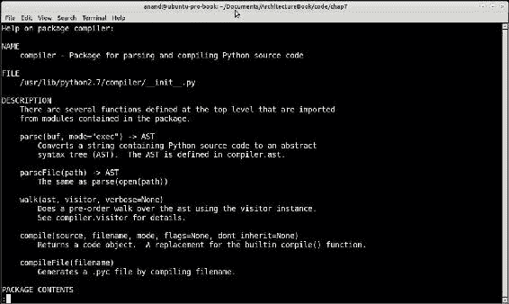
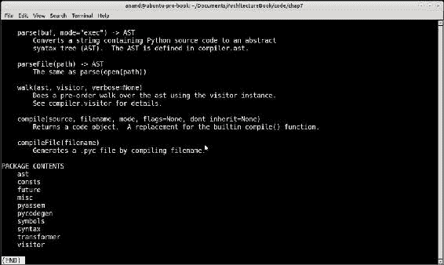

# 第七章：Python 中的设计模式

设计模式通过重用成功的设计和架构简化软件构建。模式建立在软件工程师和架构师的集体经验之上。当遇到需要编写新代码的问题时，经验丰富的软件架构师倾向于利用可用的设计/架构模式丰富的生态系统。

当专家发现特定的设计或架构帮助他们一贯解决相关问题类时，模式会不断演变。他们倾向于越来越多地应用它，将解决方案的结构编码为模式。

Python 是一种支持动态类型和高级面向对象结构（如类和元类）、一级函数、协程、可调用对象等的语言，非常适合构建可重用的设计和架构模式。实际上，与 C++或 Java 等语言相反，你会经常发现在 Python 中实现特定设计模式的多种方法。而且，往往你会发现 Python 实现模式的方式比从 C++/Java 中复制标准实现更直观和有说明性。

本章的重点主要是后一方面——说明如何构建更符合 Python 风格的设计模式，而不是通常关于这个主题的书籍和文献所倾向于做的。它并不旨在成为设计模式的全面指南，尽管随着内容的展开，我们将涵盖大部分常见方面。

我们计划在本章中涵盖的主题如下：

+   设计模式元素

+   设计模式的类别

+   可插拔哈希算法

+   总结可插拔哈希算法

+   Python 中的模式 - 创造性

+   单例模式

+   波格模式

+   工厂模式

+   原型模式

+   生成器模式

+   Python 中的模式 - 结构性

+   适配器模式

+   外观模式

+   代理模式

+   Python 中的模式 - 行为

+   迭代器模式

+   观察者模式

+   状态模式

# 设计模式 - 元素

设计模式试图记录面向对象系统中解决问题或一类问题的重复设计的方面。

当我们检查设计模式时，我们发现几乎所有设计模式都具有以下元素：

+   名称：常用于描述模式的知名句柄或标题。为设计模式使用标准名称有助于沟通并增加我们的设计词汇量。

+   背景：问题出现的情况。背景可以是通用的，如“开发 Web 应用软件”，也可以是具体的，如“在发布者-订阅者系统的共享内存实现中实现资源更改通知”。

+   问题：描述了模式适用的实际问题。问题可以根据其力量来描述，如下所示：

+   要求：解决方案应满足的要求，例如，“发布者-订阅者模式实现必须支持 HTTP”。

+   约束：解决方案的约束，如果有的话，例如，“可扩展的点对点发布者模式在发布通知时不应交换超过三条消息”。

+   属性：解决方案的期望属性，例如，“解决方案应在 Windows 和 Linux 平台上同样有效”。

+   解决方案：显示了问题的实际解决方案。它描述了解决方案的结构和责任、静态关系以及组成解决方案的元素之间的运行时交互（协作）。解决方案还应讨论它解决的问题的“力量”，以及它不解决的问题。解决方案还应尝试提及其后果，即应用模式的结果和权衡。

### 注意

设计模式解决方案几乎从不解决导致它的问题的所有力量，而是留下一些力量供相关或替代实现使用。

# 设计模式的分类

设计模式可以根据所选择的标准以不同的方式进行分类。一个常见的分类方式是使用模式的目的作为标准。换句话说，我们问模式解决了什么类的问题。

这种分类给我们提供了三种模式类的清晰变体。它们如下：

+   **创建模式**：这些模式解决了与对象创建和初始化相关的问题。这些问题是在对象和类的问题解决生命周期的最早阶段出现的。看一下以下的例子：

+   **工厂模式**："如何确保我可以以可重复和可预测的方式创建相关的类实例？"这个问题由工厂模式类解决

+   **原型模式**："如何智能地实例化一个对象，然后通过复制这个对象创建数百个类似的对象？"这个问题由原型模式解决

+   **单例和相关模式**："如何确保我创建的类的任何实例只创建和初始化一次"或"如何确保类的任何实例共享相同的初始状态？"这些问题由单例和相关模式解决

+   **结构模式**：这些模式涉及对象的组合和组装成有意义的结构，为架构师和开发人员提供可重用的行为，其中“整体大于部分的总和”。自然地，它们出现在解决对象问题的下一步，一旦它们被创建。这些问题的例子如下：

+   **代理模式**："如何通过包装器控制对对象及其方法的访问，以及在顶部的行为？"

+   **组合模式**："如何使用相同的类同时表示部分和整体来表示由许多组件组成的对象，例如，一个 Widget 树？"

+   **行为模式**：这些模式解决了对象在运行时交互产生的问题，以及它们如何分配责任。自然地，它们出现在后期阶段，一旦类被创建，然后组合成更大的结构。以下是一些例子：

+   **在这种情况下使用中介者模式**："确保所有对象在运行时使用松散耦合来相互引用，以促进交互的运行时动态性"

+   **在这种情况下使用观察者模式**："一个对象希望在资源的状态发生变化时得到通知，但它不想一直轮询资源来找到这一点。系统中可能有许多这样的对象实例"

### 注意

创建模式、结构模式和行为模式的顺序隐含地嵌入了系统中对象的生命周期。对象首先被创建（创建模式），然后组合成有用的结构（结构模式），然后它们相互作用（行为模式）。

让我们现在把注意力转向本章的主题，即以 Python 独特的方式在 Python 中实现模式。我们将看一个例子来开始讨论这个问题。

## 可插拔的哈希算法

让我们看一下以下的问题。

你想从输入流（文件或网络套接字）中读取数据，并以分块的方式对内容进行哈希。你写了一些像这样的代码：

```py
# hash_stream.py
from hashlib import md5

def hash_stream(stream, chunk_size=4096):
    """ Hash a stream of data using md5 """

    shash = md5()

    for chunk in iter(lambda: stream.read(chunk_size), ''):
        shash.update(chunk)

    return shash.hexdigest()
```

### 注意

所有代码都是 Python3，除非另有明确说明。

```py
>>> import hash_stream
>>> hash_stream.hash_stream(open('hash_stream.py'))
'e51e8ddf511d64aeb460ef12a43ce480'

```

所以这样做是符合预期的。

现在假设你想要一个更可重用和多功能的实现，可以与多个哈希算法一起使用。你首先尝试修改以前的代码，但很快意识到这意味着重写大量的代码，这不是一个很聪明的做法：

```py
# hash_stream.py
from hashlib import sha1
from hashlib import md5

def hash_stream_sha1(stream, chunk_size=4096):
    """ Hash a stream of data using sha1 """

    shash = sha1()

    for chunk in iter(lambda: stream.read(chunk_size), ''):
        shash.update(chunk.encode('utf-8'))

    return shash.hexdigest()

def hash_stream_md5(stream, chunk_size=4096):
    """ Hash a stream of data using md5 """

    shash = md5()

    for chunk in iter(lambda: stream.read(chunk_size), ''):
        shash.update(chunk.encode('utf-8'))

    return shash.hexdigest()
```

```py
>>> import hash_stream
>>> hash_stream.hash_stream_md5(open('hash_stream.py'))
'e752a82db93e145fcb315277f3045f8d'
>>> hash_stream.hash_stream_sha1(open('hash_stream.py'))
'360e3bd56f788ee1a2d8c7eeb3e2a5a34cca1710'

```

您会意识到，通过使用类，您可以重复使用大量代码。作为一名经验丰富的程序员，经过几次迭代后，您可能会得到类似这样的东西：

```py
# hasher.py
class StreamHasher(object):
    """ Stream hasher class with configurable algorithm """

    def __init__(self, algorithm, chunk_size=4096):
        self.chunk_size = chunk_size
        self.hash = algorithm()

    def get_hash(self, stream):

        for chunk in iter(lambda: stream.read(self.chunk_size), ''):
            self.hash.update(chunk.encode('utf-8'))

        return self.hash.hexdigest()  
```

首先让我们尝试使用`md5`，如下所示：

```py
>>> import hasher
>>> from hashlib import md5
>>> md5h = hasher.StreamHasher(algorithm=md5)
>>> md5h.get_hash(open('hasher.py'))
'7d89cdc1f11ec62ec918e0c6e5ea550d'

```

现在使用`sha1`：

```py
>>> from hashlib import sha1
>>> shah_h = hasher.StreamHasher(algorithm=sha1)
>>> shah_h.get_hash(open('hasher.py'))
'1f0976e070b3320b60819c6aef5bd6b0486389dd'

```

正如现在显而易见的那样，您可以构建不同的哈希对象，每个对象都有一个特定的算法，将返回流的相应哈希摘要（在这种情况下是文件）。

现在让我们总结一下我们刚刚做的事情。

我们首先开发了一个名为`hash_stream`的函数，它接受一个流对象，并使用`md5`算法逐块对其进行哈希。然后我们开发了一个名为`StreamHasher`的类，允许我们一次配置一个算法，从而使代码更可重用。我们通过`get_hash`方法获得哈希摘要，该方法接受流对象作为参数。

现在让我们把注意力转向 Python 可以为我们做的更多事情。

我们的类对于不同的哈希算法是多功能的，并且肯定更可重用，但是有没有一种方法可以像调用函数一样调用它？那将非常棒，不是吗？

这是我们的`StreamHasher`类的一个轻微重新实现，它就是这样做的：

```py
# hasher.py
class StreamHasher(object):
    """ Stream hasher class with configurable algorithm """

    def __init__(self, algorithm, chunk_size=4096):
        self.chunk_size = chunk_size
        self.hash = algorithm()

    def __call__(self, stream):

        for chunk in iter(lambda: stream.read(self.chunk_size), ''):
            self.hash.update(chunk.encode('utf-8'))

        return self.hash.hexdigest() 
```

在上一段代码中我们做了什么？我们只是将`get_hash`函数重命名为`Get_Call`。让我们看看这会产生什么影响。

```py
>>> from hashlib import md5, sha1
>>> md5_h = hasher.StreamHasher(md5)
>>> md5_h(open('hasher.py'))
'ad5d5673a3c9a4f421240c4dbc139b22'
>>> sha_h = hasher.StreamHasher(sha1)
>>> sha_h(open('hasher.py'))
'd174e2fae1d6e1605146ca9d7ca6ee927a74d6f2'

```

我们能够调用类的实例，就像调用函数一样，只需将文件对象传递给它。

因此，我们的类不仅为我们提供了可重用和多功能的代码，而且还可以像函数一样运行。这是通过在 Python 中使我们的类成为可调用类型来实现的，只需实现魔术方法`__call__`。

### 注意

在 Python 中，**可调用对象**是指可以被调用的任何对象。换句话说，如果我们可以执行`x()`，那么`x`就是一个可调用对象，具体取决于`__call__`方法如何被覆盖，可以带参数也可以不带参数。函数是最简单和最熟悉的可调用对象。

在 Python 中，`foo(args)`是`foo.__call__(args)`的一种语法糖。

## 总结可插拔的哈希算法

那么前面的例子说明了什么？它说明了 Python 的强大之处，它以一种更奇特和强大的方式解决了传统上在其他编程语言中解决的现有问题，这是由于 Python 的强大之处以及它的工作方式——在这种情况下，通过覆盖特殊方法使任何对象可调用。

但是我们在这里实现了什么模式？我们在本章开头讨论过，只有解决了一类问题，才能成为模式。这个特定的例子中是否隐藏着一种模式？

是的，这是策略行为模式的一种实现：

*当我们需要从一个类中获得不同的行为，并且我们应该能够使用众多可用的行为或算法之一来配置一个类时，就会使用策略模式*。

在这种特殊情况下，我们需要一个支持使用不同算法执行相同操作的类——使用块从流中哈希数据，并返回摘要。该类接受算法作为参数，由于所有算法都支持相同的返回数据方法（`hexdigest`方法），我们能够以非常简单的方式实现该类。

让我们继续我们的旅程，找出使用 Python 编写的其他有趣模式，以及它独特解决问题的方式。在这个旅程中，我们将按照创建型、结构型和行为型模式的顺序进行。

### 注意

我们对接下来讨论的模式的方法非常务实。它可能不使用流行的**四人帮**（**G4**）模式所使用的正式语言——这是设计模式的最基本方法。我们的重点是展示 Python 在构建模式方面的能力，而不是追求形式主义的正确性。

# Python 中的模式-创建型

在本节中，我们将介绍一些常见的创建型模式。我们将从 Singleton 开始，然后按顺序进行原型、生成器和工厂。

## 单例模式

单例模式是设计模式中最著名和最容易理解的模式之一。它通常被定义为：

*单例是一个只有一个实例和明确定义的访问点的类*。

单例的要求可以总结如下：

+   一个类必须只有一个通过一个众所周知的访问点可访问的实例

+   类必须可以通过继承进行扩展，而不会破坏模式

+   Python 中最简单的单例实现如下所示。它是通过重写基本`object`类型的`__new__`方法完成的：

```py
# singleton.py
class Singleton(object):
    """ Singleton in Python """

    _instance = None

    def __new__(cls):
        if cls._instance == None:
            cls._instance = object.__new__(cls)
        return cls._instance
```

```py
>>> from singleton import Singleton
>>> s1 = Singleton()
>>> s2 = Singleton()
>>> s1==s2
True

```

+   由于我们将需要一段时间进行这个检查，让我们为此定义一个函数：

```py
def test_single(cls):
    """ Test if passed class is a singleton """
    return cls() == cls()
```

+   现在让我们看看我们的单例实现是否满足第二个要求。我们将定义一个简单的子类来测试这一点：

```py
class SingletonA(Singleton):
    pass

>>> test_single(SingletonA)
True
```

太棒了！所以我们简单的实现通过了测试。我们现在完成了吗？

好吧，正如我们之前讨论过的，Python 提供了许多实现模式的方法，因为它的动态性和灵活性。所以，让我们继续关注单例一段时间，看看我们是否能得到一些有启发性的例子，这些例子会让我们了解 Python 的强大之处：

```py
class MetaSingleton(type):
    """ A type for Singleton classes (overrides __call__) """    

    def __init__(cls, *args):
        print(cls,"__init__ method called with args", args)
        type.__init__(cls, *args)
        cls.instance = None

    def __call__(cls, *args, **kwargs):
        if not cls.instance:
            print(cls,"creating instance", args, kwargs)
            cls.instance = type.__call__(cls, *args, **kwargs)
        return cls.instance

class SingletonM(metaclass=MetaSingleton):
    pass
```

前面的实现将创建单例的逻辑移到了类的类型，即其元类。

我们首先创建了一个名为`MetaSingleton`的单例类型，通过扩展类型并在元类上重写`__init__`和`__call__`方法。然后我们声明`SingletonM`类，`SingletonM`，使用元类。

```py
>>> from singleton import *
<class 'singleton.SingletonM'> __init__ method called with args ('SingletonM', (), {'__module__': 'singleton', '__qualname__': 'SingletonM'})
>>> test_single(SingletonM)
<class 'singleton.SingletonM'> creating instance ()
True
```

这里是一个对单例新实现背后发生的事情的一瞥：

+   **初始化类变量**：我们可以在类级别（在类声明后）进行，就像我们在之前的实现中看到的那样，或者我们可以将其放在元类`__init__`方法中。这就是我们在这里为`_instance`类变量所做的，它将保存类的单个实例。

+   **覆盖类创建**：可以在类级别通过重写类的`__new__`方法进行，就像我们在之前的实现中看到的那样，或者可以在元类中通过重写其`__call__`方法来进行。这就是新实现所做的。

### 注意

当我们重写一个类的`__call__`方法时，它会影响它的实例，并且实例变得可调用。同样，当我们重写元类的`_call_`方法时，它会影响它的类，并修改类被调用的方式-换句话说，类创建其实例的方式。

让我们来看看元类方法相对于类方法的优缺点：

+   一个好处是我们可以创建任意数量的新顶级类，通过元类获得单例行为。使用默认实现，每个类都必须继承顶级类 Singleton 或其子类以获得单例行为。元类方法提供了更多关于类层次结构的灵活性。

+   然而，与类方法相比，元类方法可能被解释为创建略微晦涩和难以维护的代码。这是因为了解元类和元编程的 Python 程序员数量较少，而了解类的程序员数量较多。这可能是元类解决方案的一个缺点。

现在让我们打破常规，看看我们是否可以以稍有不同的方式解决单例问题。

### 单例-我们需要单例吗？

让我们用一个与原始略有不同的方式来解释单例的第一个要求：

*类必须提供一种让所有实例共享相同初始状态的方法。*

为了解释这一点，让我们简要地看一下单例模式实际上试图实现什么。

当单例确保只有一个实例时，它保证的是类在创建和初始化时提供一个单一状态。换句话说，单例实际上提供的是一种让类确保所有实例共享单一状态的方式。

换句话说，单例的第一个要求可以用稍微不同的形式来表述，这与第一种形式有相同的结果。

*一个类必须提供一种方法，使其所有实例共享相同的初始状态*

*确保在特定内存位置只有一个实际实例的技术只是实现这一点的一种方式。*

啊！到目前为止，我们一直在用不太灵活和多用途的编程语言的实现细节来表达模式，实际上。使用 Python 这样的语言，我们不需要死板地坚持这个原始定义。

让我们看看以下类：

```py
class Borg(object):
    """ I ain't a Singleton """

    __shared_state = {}
    def __init__(self):
        self.__dict__ = self.__shared_state
```

这种模式确保当你创建一个类时，你可以明确地用属于类的共享状态初始化它的所有实例（因为它是在类级别声明的）。

在单例中我们真正关心的是这种共享状态，所以`Borg`可以在不担心所有实例完全相同的情况下工作。

由于这是 Python，它通过在类上初始化一个共享状态字典，然后将实例的字典实例化为这个值来实现这一点，从而确保所有实例共享相同的状态。

以下是`Borg`实际操作的一个具体示例：

```py
class IBorg(Borg):
    """ I am a Borg """

    def __init__(self):
        Borg.__init__(self)
        self.state = 'init'

    def __str__(self):
        return self.state

>>> i1 = IBorg()
>>> i2 = IBorg()
>>> print(i1)
init
>>> print(i2)
init
>>> i1.state='running'
>>> print(i2)
running
>>> print(i1)
running
>>> i1==i2
False
```

所以使用`Borg`，我们成功创建了一个类，其实例共享相同的状态，即使实例实际上并不相同。状态的改变也传播到了实例；正如前面的例子所示，当我们改变`i1`中的状态值时，`i2`中的状态值也会改变。

动态值呢？我们知道它在单例中可以工作，因为它总是相同的对象，但是波尔格呢？

```py
>>> i1.x='test'
>>> i2.x
'test'
```

所以我们给实例`i1`附加了一个动态属性`x`，它也出现在实例`i2`中。很整洁！

所以让我们看看`Borg`是否比单例有任何好处：

+   在一个复杂的系统中，我们可能有多个类从根单例类继承，由于导入问题或竞争条件（例如，如果系统正在使用线程），要求一个单一实例可能很难实现。波尔格模式通过巧妙地摆脱了内存中单一实例的要求，解决了这些问题。

+   波尔格模式还允许在波尔格类和其所有子类之间简单共享状态。这对于单例来说并非如此，因为每个子类都创建自己的状态。我们将在接下来的示例中看到一个说明。

## 状态共享——波尔格与单例

波尔格模式总是从顶级类（波尔格）向下到所有子类共享相同的状态。这在单例中并非如此。让我们看一个例子。

在这个练习中，我们将创建我们原始单例类的两个子类，即`SingletonA`和`SingletonB`：

```py
>>> class SingletonA(Singleton): pass
... 
>>> class SingletonB(Singleton): pass
... 
```

让我们创建`SingletonA`的一个子类，即`SingletonA1`：

```py
>>> class SingletonA1(SingletonA): pass
...
```

现在让我们创建实例：

```py
>>> a = SingletonA()
>>> a1 = SingletonA1()
>>> b = SingletonB()
```

让我们给`a`附加一个值为 100 的动态属性`x`：

```py
>>> a.x = 100
>>> print(a.x)
100
```

让我们检查一下子类`SingletonA1`的实例`a1`上是否可用：

```py
>>> a1.x
100
```

好了！现在让我们检查它是否在实例`b`上可用：

```py
>>> b.x
Traceback (most recent call last):
  File "<stdin>", line 1, in <module>
AttributeError: 'SingletonB' object has no attribute 'x'
```

糟糕！看起来`SingletonA`和`SingletonB`并不共享相同的状态。这就是为什么附加到`SingletonA`实例的动态属性会出现在其子类的实例上，但不会出现在同级或同级子类`SingletonB`的实例上的原因——因为它是类层次结构中与顶级`Singleton`类不同的分支。

让我们看看波尔格是否能做得更好。

首先，让我们创建类和它们的实例：

```py
>>> class ABorg(Borg):pass
... 
>>> class BBorg(Borg):pass
... 
>>> class A1Borg(ABorg):pass
... 
>>> a = ABorg()
>>> a1 = A1Borg()
>>> b = BBorg()
```

现在让我们给`a`附加一个值为 100 的动态属性 x：

```py
>>> a.x = 100
>>> a.x
100
>>> a1.x
100
```

让我们检查同级类波尔格的实例是否也有它：

```py
>>> b.x
100
```

这证明了 Borg 模式在跨类和子类之间共享状态方面比 Singleton 模式更好，并且这样做不需要大量的麻烦或确保单个实例的开销。

现在让我们转向其他创建模式。

## 工厂模式

工厂模式解决了创建与另一个类相关的类的实例的问题，通常通过单个方法实现实例创建，通常在父工厂类上定义，并由子类（根据需要）覆盖。

工厂模式为类的客户（用户）提供了一个方便的方式，通过`Factory`类的特定方法传递参数，通常是通过创建类和子类的实例的单个入口点。

让我们看一个具体的例子：

```py
from abc import ABCMeta, abstractmethod

class Employee(metaclass=ABCMeta):
    """ An Employee class """

    def __init__(self, name, age, gender):
        self.name = name
        self.age = age
        self.gender = gender

    @abstractmethod
    def get_role(self):
        pass

    def __str__(self):
        return "{} - {}, {} years old {}".format(self.__class__.__name__,
                                                 self.name,
                                                 self.age,
                                                 self.gender)

class Engineer(Employee):
    """ An Engineer Employee """

    def get_role(self):
        return "engineering"

class Accountant(Employee):
    """ An Accountant Employee """

    def get_role(self):
        return "accountant" 

class Admin(Employee):
    """ An Admin Employee """

    def get_role(self):
        return "administration"
```

我们创建了一个通用的`Employee`类，具有一些属性和三个子类，分别是`Engineer`，`Accountant`和`Admin`。

由于它们都是相关类，因此`Factory`类对于抽象化这些类的实例创建非常有用。

这是我们的`EmployeeFactory`类：

```py
class EmployeeFactory(object):
    """ An Employee factory class """

    @classmethod
    def create(cls, name, *args):
        """ Factory method for creating an Employee instance """

        name = name.lower().strip()

        if name == 'engineer':
            return Engineer(*args)
        elif name == 'accountant':
            return Accountant(*args)
        elif name == 'admin':
            return Admin(*args)
```

该类提供了一个`create`工厂方法，接受一个`name`参数，该参数与类的名称匹配，并相应地创建实例。其余参数是实例化类实例所需的参数，这些参数不变地传递给其构造函数。

让我们看看我们的`Factory`类如何运作：

```py
>>> factory = EmployeeFactory()
>>> print(factory.create('engineer','Sam',25,'M'))
Engineer - Sam, 25 years old M
>>> print(factory.create('engineer','Tracy',28,'F'))
Engineer - Tracy, 28 years old F

>>> accountant = factory.create('accountant','Hema',39,'F')
>>> print(accountant)

Accountant - Hema, 39 years old F
>>> accountant.get_role()

accounting
>>> admin = factory.create('Admin','Supritha',32,'F')
>>> admin.get_role()
'administration'
```

以下是关于我们的`Factory`类的一些有趣的注释：

+   单个工厂类可以创建员工层次结构中任何类的实例。

+   在工厂模式中，通常使用一个与类族（类及其子类层次结构）相关联的`Factory`类是常规做法。例如，`Person`类可以使用`PersonFactory`，汽车类可以使用`AutomobileFactory`，依此类推。

+   在 Python 中，工厂方法通常被装饰为`classmethod`。这样可以直接通过类命名空间调用它。例如：

```py
    >>> print(EmployeeFactory.create('engineer','Vishal',24,'M'))
    Engineer - Vishal, 24 years old M
```

换句话说，这种模式实际上不需要`Factory`类的实例。

## 原型模式

原型设计模式允许程序员创建一个类的实例作为模板实例，然后通过复制或克隆该原型来创建新实例。

原型在以下情况下最有用：

+   当系统中实例化的类是动态的，即作为配置的一部分指定，或者在运行时可以发生变化时。

+   当实例只有少量初始状态的组合时。与跟踪状态并每次实例化一个实例相比，更方便的是创建与每个状态匹配的原型并进行克隆。

原型对象通常支持通过`clone`方法复制自身。

以下是 Python 中原型的简单实现：

```py
import copy

class Prototype(object):
    """ A prototype base class """

    def clone(self):
        """ Return a clone of self """
        return copy.deepcopy(self)
```

`clone`方法使用`copy`模块实现，该模块深度复制对象并返回克隆。

让我们看看这是如何工作的。为此，我们需要创建一个有意义的子类：

```py
class Register(Prototype):
    """ A student Register class  """

    def __init__(self, names=[]):
        self.names = names

>>> r1=Register(names=['amy','stu','jack'])
>>> r2=r1.clone()
>>> print(r1)
<prototype.Register object at 0x7f42894e0128>
>>> print(r2)
<prototype.Register object at 0x7f428b7b89b0>

>>> r2.__class__
<class 'prototype.Register'>
```

### 原型-深复制与浅复制

现在让我们更深入地了解我们的原型类的实现细节。

您可能注意到我们使用`copy`模块的`deepcopy`方法来实现对象克隆。该模块还有一个`copy`方法，用于实现浅复制。

如果我们实现浅复制，您会发现所有对象都是通过引用复制的。对于不可变对象（如字符串或元组），这是可以接受的。

然而，对于像列表或字典这样的可变对象来说，这是一个问题，因为实例的状态是共享的，而不是完全由实例拥有的，对一个实例中可变对象的修改也会同时修改克隆实例中的相同对象！

让我们看一个例子。我们将使用我们的原型类的修改实现，该实现使用浅复制来演示这一点：

```py
class SPrototype(object):
    """ A prototype base class using shallow copy """

    def clone(self):
        """ Return a clone of self """
        return copy.copy(self)
```

`SRegister`类继承自新的原型类：

```py
class SRegister(SPrototype):
    """ Sub-class of SPrototype """

    def __init__(self, names=[]):
        self.names = names

>>> r1=SRegister(names=['amy','stu','jack'])
>>> r2=r1.clone()
```

让我们给`r1`实例的名称注册一个名称：

```py
>>> r1.names.append('bob')
```

现在让我们检查`r2.names`：

```py
>>> r2.names
['amy', 'stu', 'jack', 'bob']
```

哎呀！这不是我们想要的，但由于浅拷贝，`r1`和`r2`最终共享相同的`names`列表，因为只复制了引用，而不是整个对象。可以通过简单的检查来验证：

```py
>>> r1.names is r2.names
True
```

另一方面，深拷贝会对克隆的对象中包含的所有对象递归调用`copy`，因此没有任何共享，但每个克隆最终都会有自己的所有引用对象的副本。

### 使用元类构建原型

我们已经看到如何使用类构建原型模式。由于我们已经在单例模式示例中看到了 Python 中的一些元编程，因此有助于找出我们是否可以在原型中做同样的事情。

我们需要做的是将`clone`方法附加到所有原型类上。像这样动态地将方法附加到类中可以通过元类的`__init__`方法来完成。

这提供了使用元类的原型的简单实现：

```py
import copy

class MetaPrototype(type):

    """ A metaclass for Prototypes """

    def __init__(cls, *args):
        type.__init__(cls, *args)
        cls.clone = lambda self: copy.deepcopy(self) 

class PrototypeM(metaclass=MetaPrototype):
    pass
```

`PrototypeM`类现在实现了原型模式。让我们通过使用一个子类来进行说明：

```py
class ItemCollection(PrototypeM):
    """ An item collection class """

    def __init__(self, items=[]):
        self.items = items
```

首先我们将创建一个`ItemCollection`对象：

```py
>>> i1=ItemCollection(items=['apples','grapes','oranges'])
>>> i1
<prototype.ItemCollection object at 0x7fd4ba6d3da0>
```

现在我们将克隆它如下：

```py
>>> i2 = i1.clone()
```

克隆显然是一个不同的对象：

```py
>>> i2
<prototype.ItemCollection object at 0x7fd4ba6aceb8>
```

它有自己的属性副本：

```py
>>> i2.items is i1.items
False
```

### 使用元类组合模式

通过使用元类的强大功能，可以创建有趣和定制的模式。以下示例说明了一种既是单例又是原型的类型：

```py
class MetaSingletonPrototype(type):
    """ A metaclass for Singleton & Prototype patterns """

    def __init__(cls, *args):
        print(cls,"__init__ method called with args", args)
        type.__init__(cls, *args)
        cls.instance = None
        cls.clone = lambda self: copy.deepcopy(cls.instance)

    def __call__(cls, *args, **kwargs):
        if not cls.instance:
            print(cls,"creating prototypical instance", args, kwargs)
            cls.instance = type.__call__(cls,*args, **kwargs)
        return cls.instance
```

使用这个元类作为其类型的任何类都会显示单例和原型行为。

这可能看起来有点奇怪，因为一个单例只允许一个实例，而原型允许克隆来派生多个实例，但是如果我们从它们的 API 来考虑模式，那么它开始感觉更自然一些：

+   使用构造函数调用类总是会返回相同的实例 - 它的行为就像单例模式。

+   在类的实例上调用`clone`总是会返回克隆的实例。实例总是使用单例实例作为源进行克隆 - 它的行为就像原型模式。

在这里，我们修改了我们的`PrototypeM`类，现在使用新的元类：

```py
class PrototypeM(metaclass=MetaSingletonPrototype):
    pass
```

由于`ItemCollection`继续子类化`PrototypeM`，它会自动获得新的行为。

看一下以下代码：

```py
>>> i1=ItemCollection(items=['apples','grapes','oranges'])
<class 'prototype.ItemCollection'> creating prototypical instance () {'items': ['apples'
, 'grapes', 'oranges']}
>>> i1
<prototype.ItemCollection object at 0x7fbfc033b048>
>>> i2=i1.clone()
```

`clone`方法按预期工作，并产生一个克隆：

```py
>>> i2
<prototype.ItemCollection object at 0x7fbfc033b080>
>>> i2.items is i1.items
False
```

然而，通过构造函数构建实例总是只返回单例（原型）实例，因为它调用了单例 API：

```py
>>> i3=ItemCollection(items=['apples','grapes','mangoes'])
>>> i3 is i1
True
```

元类允许对类的创建进行强大的定制。在这个具体的例子中，我们通过元类将单例和原型模式的行为组合到一个类中。Python 使用元类的强大功能使程序员能够超越传统模式，提出这样的创造性技术。

### 原型工厂

原型类可以通过一个辅助的**原型工厂**或**注册类**进行增强，它可以提供用于创建配置的产品系列或产品组的原型实例的工厂函数。将其视为我们以前工厂模式的变体。

这是这个类的代码。看到我们从`Borg`继承它以自动共享状态从层次结构的顶部：

```py
class PrototypeFactory(Borg):
    """ A Prototype factory/registry class """

    def __init__(self):
        """ Initializer """

        self._registry = {}

    def register(self, instance):
        """ Register a given instance """

        self._registry[instance.__class__] = instance

    def clone(self, klass):
        """  Return cloned instance of given class """

        instance = self._registry.get(klass)
        if instance == None:
            print('Error:',klass,'not registered')
        else:
            return instance.clone()
```

让我们创建一些原型的子类，我们可以在工厂上注册它们的实例：

```py
class Name(SPrototype):
    """ A class representing a person's name """

    def __init__(self, first, second):
        self.first = first
        self.second = second

    def __str__(self):
        return ' '.join((self.first, self.second))

class Animal(SPrototype):
    """ A class representing an animal """

    def __init__(self, name, type='Wild'):
        self.name = name
        self.type = type

    def __str__(self):
        return ' '.join((str(self.type), self.name))
```

我们有两个类 - 一个是`Name`类，另一个是动物类，两者都继承自`SPrototype`。

首先创建一个名称和动物对象：

```py
>>> name = Name('Bill', 'Bryson')
>>> animal = Animal('Elephant')
>>> print(name)
Bill Bryson
>>> print(animal)
Wild Elephant
```

现在，让我们创建一个原型工厂的实例。

```py
>>> factory = PrototypeFactory()
```

现在让我们在工厂上注册这两个实例：

```py
>>> factory.register(animal)
>>> factory.register(name)
```

现在工厂已经准备好从配置的实例中克隆任意数量的实例：

```py
>>> factory.clone(Name)
<prototype.Name object at 0x7ffb552f9c50>

>> factory.clone(Animal)
<prototype.Animal object at 0x7ffb55321a58>
```

工厂如果尝试克隆未注册实例的类，会合理地抱怨：

```py
>>> class C(object): pass
... 
>>> factory.clone(C)
Error: <class '__main__.C'> not registered
```

### 注意

这里显示的工厂类可以通过检查已注册类上的`clone`方法的存在来增强，以确保任何注册的类都遵守原型类的 API。这留给读者作为练习。

如果读者还没有注意到，讨论我们选择的这个特定示例的一些方面是很有启发性的：

+   `PrototypeFactory`类是一个工厂类，因此通常是一个单例。在这种情况下，我们将其制作成了一个 Borg，因为我们已经看到`Borgs`在类层次结构之间的状态共享方面做得更好。

+   `Name`类和`Animal`类继承自`SPrototype`，因为它们的属性是不可变的整数和字符串，所以在这里浅复制就可以了。这与我们的第一个原型子类不同。

+   原型保留了原型实例中的类创建签名，即`clone`方法。这使得程序员很容易，因为他/她不必担心类创建签名——`__new__`的顺序和类型，因此也不必调用`__init__`方法——只需在现有实例上调用`clone`即可。

## 建造者模式

建造者模式将对象的构建与其表示（组装）分离，以便可以使用相同的构建过程来构建不同的表示。

换句话说，使用建造者模式，可以方便地创建同一类的不同类型或代表性实例，每个实例使用略有不同的构建或组装过程。

形式上，建造者模式使用一个`Director`类，该类指导`Builder`对象构建目标类的实例。不同类型（类）的构建者有助于构建同一类的略有不同的变体。

让我们看一个例子：

```py
class Room(object):
    """ A class representing a Room in a house """

    def __init__(self, nwindows=2, doors=1, direction='S'):
        self.nwindows = nwindows
        self.doors = doors
        self.direction = direction

    def __str__(self):
        return "Room <facing:%s, windows=#%d>" % (self.direction,
                                                  self.nwindows)
class Porch(object):
    """ A class representing a Porch in a house """

    def __init__(self, ndoors=2, direction='W'):
        self.ndoors = ndoors
        self.direction = direction

    def __str__(self):
        return "Porch <facing:%s, doors=#%d>" % (self.direction,
                                                 self.ndoors)   

class LegoHouse(object):
    """ A lego house class """

    def __init__(self, nrooms=0, nwindows=0,nporches=0):
        # windows per room
        self.nwindows = nwindows
        self.nporches = nporches
        self.nrooms = nrooms
        self.rooms = []
        self.porches = []

    def __str__(self):
        msg="LegoHouse<rooms=#%d, porches=#%d>" % (self.nrooms,
                                                   self.nporches)

        for i in self.rooms:
            msg += str(i)

        for i in self.porches:
            msg += str(i)

        return msg

    def add_room(self,room):
        """ Add a room to the house """

        self.rooms.append(room)

    def add_porch(self,porch):
        """ Add a porch to the house """

        self.porches.append(porch)
```

我们的示例显示了三个类，它们分别是：

+   `Room`和`Porch`类分别表示房子的房间和门廊——房间有窗户和门，门廊有门

+   `LegoHouse`类代表了一个玩具示例，用于实际房子（我们想象一个孩子用乐高积木建造房子，有房间和门廊。）——乐高房子将包括任意数量的房间和门廊。

让我们尝试创建一个简单的`LegoHouse`实例，其中有一个房间和一个门廊，每个都有默认配置：

```py
>>> house = LegoHouse(nrooms=1,nporches=1)
>>> print(house)
LegoHouse<rooms=#1, porches=#1>
```

我们完成了吗？没有！请注意，我们的`LegoHouse`是一个在其构造函数中并没有完全构建自身的类。房间和门廊实际上还没有建好，只是它们的计数器被初始化了。

因此，我们需要分别建造房间和门廊，并将它们添加到房子中。让我们来做：

```py
>>> room = Room(nwindows=1)
>>> house.add_room(room)
>>> porch = Porch()
>>> house.add_porch(porch)
>>> print(house)
LegoHouse<rooms=#1, porches=#1>
Room <facing:S, windows=#1>
Porch <facing:W, doors=#1>
```

现在你看到我们的房子已经建好了。打印它不仅显示了房间和门廊的数量，还显示了有关它们的详细信息。一切顺利！

现在，想象一下你需要建造 100 个这样不同配置的房子实例，每个实例的房间和门廊配置都不同，而且房间本身的窗户数量和方向也经常不同！

（也许你正在制作一个移动游戏，其中使用乐高房子，可爱的小角色像巨魔或小黄人住在里面，并做有趣的事情，无论是什么。）

从示例中很明显，编写像最后一个示例那样的代码将无法解决问题。

这就是建造者模式可以帮助你的地方。让我们从一个简单的`LegoHouse`构建者开始。

```py
class LegoHouseBuilder(object):
    """ Lego house builder class """

    def __init__(self, *args, **kwargs):
        self.house = LegoHouse(*args, **kwargs)

    def build(self):
        """ Build a lego house instance and return it """

        self.build_rooms()
        self.build_porches()
        return self.house

    def build_rooms(self):
        """ Method to build rooms """

        for i in range(self.house.nrooms):
            room = Room(self.house.nwindows)
            self.house.add_room(room)

    def build_porches(self):
        """ Method to build porches """     

        for i in range(self.house.nporches):
            porch = Porch(1)
            self.house.add_porch(porch)
```

这个类的主要方面如下：

+   你可以使用目标类配置来配置构建者类——在这种情况下是房间和门廊的数量

+   它提供了一个`build`方法，根据指定的配置构建和组装（建造）房子的组件，即`Rooms`和`Porches`

+   `build`方法返回构建和组装好的房子

现在用两行代码构建不同类型的乐高房子，每种类型的房子都有不同的房间和门廊设计：

```py
>>> builder=LegoHouseBuilder(nrooms=2,nporches=1,nwindows=1)
>>> print(builder.build())
LegoHouse<rooms=#2, porches=#1>
Room <facing:S, windows=#1>
Room <facing:S, windows=#1>
Porch <facing:W, doors=#1>
```

我们现在将建造一个类似的房子，但是房间里有两扇窗户：

```py
>>> builder=LegoHouseBuilder(nrooms=2,nporches=1,nwindows=2)
>>> print(builder.build())
LegoHouse<rooms=#2, porches=#1>
Room <facing:S, windows=#2>
Room <facing:S, windows=#2>
Porch <facing:W, doors=#1>
```

假设您发现自己继续使用这个配置构建了许多乐高房子。您可以将其封装在构建者的子类中，这样前面的代码就不会重复很多次：

```py
class SmallLegoHouseBuilder(LegoHouseBuilder):
""" Builder sub-class building small lego house with 1 room and 1porch and rooms having 2 windows """

    def __init__(self):
        self.house = LegoHouse(nrooms=2, nporches=1, nwindows=2)        
```

现在，房屋配置被*固定*到新的构建者类中，构建一个就像这样简单：

```py
>>> small_house=SmallLegoHouseBuilder().build()
>>> print(small_house)
LegoHouse<rooms=#2, porches=#1>
Room <facing:S, windows=#2>
Room <facing:S, windows=#2>
Porch <facing:W, doors=#1>
```

您也可以构建许多这样的实例（比如`100`，`50`用于巨魔，`50`用于小黄人）：

```py
>>> houses=list(map(lambda x: SmallLegoHouseBuilder().build(), range(100)))
>>> print(houses[0])
LegoHouse<rooms=#2, porches=#1>
Room <facing:S, windows=#2>
Room <facing:S, windows=#2>
Porch <facing:W, doors=#1>

>>> len(houses)
100
```

人们还可以创建更奇特的构建者类，做一些非常特定的事情。例如，这里有一个构建者类，它创建的房屋的房间和门廊总是朝向北方：

```py
class NorthFacingHouseBuilder(LegoHouseBuilder):
    """ Builder building all rooms and porches facing North """

    def build_rooms(self):

        for i in range(self.house.nrooms):
            room = Room(self.house.nwindows, direction='N')
            self.house.add_room(room)

    def build_porches(self):

        for i in range(self.house.nporches):
            porch = Porch(1, direction='N')
            self.house.add_porch(porch)

>>> print(NorthFacingHouseBuilder(nrooms=2, nporches=1, nwindows=1).build())
LegoHouse<rooms=#2, porches=#1>
Room <facing:N, windows=#1>
Room <facing:N, windows=#1>
Porch <facing:N, doors=#1>
```

利用 Python 的多重继承功能，可以将任何这样的构建者组合成新的有趣的子类。例如，这里有一个构建者，它产生朝北的小房子：

```py
class NorthFacingSmallHouseBuilder(NorthFacingHouseBuilder, SmallLegoHouseBuilder):
    pass
```

正如预期的那样，它总是重复产生朝北的小房子，有 2 个有窗的房间。也许不是很有趣，但确实非常可靠：

```py
>>> print(NorthFacingSmallHouseBuilder().build())
LegoHouse<rooms=#2, porches=#1>
Room <facing:N, windows=#2>
Room <facing:N, windows=#2>
Porch <facing:N, doors=#1>
```

在我们结束对创建模式的讨论之前，让我们总结一些有趣的方面，以及它们之间的相互作用，如下所示：

+   **构建者和工厂**：构建者模式将类的实例的组装过程与其创建分离。另一方面，工厂关注使用统一接口创建属于同一层次结构的不同子类的实例。构建者还将构建的实例作为最后一步返回，而工厂则立即返回实例，因为没有单独的构建步骤。

+   **构建者和原型**：构建者可以在内部使用原型来创建其实例。然后可以从该实例克隆同一构建者的更多实例。例如，建立一个使用我们的原型元类之一始终克隆原型实例的构建者类是很有启发性的。

+   **原型和工厂**：原型工厂可以在内部使用工厂模式来构建所讨论类的初始实例。

+   **工厂和单例**：工厂类通常是传统编程语言中的单例。另一个选项是将其方法设置为类或静态方法，因此无需创建工厂本身的实例。在我们的示例中，我们将其设置为 Borg。

我们现在将转移到下一个模式类，即结构模式。

# Python 中的模式-结构

结构模式关注于组合类或对象以形成更大的结构的复杂性，这些结构不仅仅是它们各自部分的总和。

结构模式通过这两种不同的方式来实现这一点：

+   通过使用类继承将类组合成一个。这是一种静态的方法。

+   通过在运行时使用对象组合来实现组合功能。这种方法更加动态和灵活。

由于支持多重继承，Python 可以很好地实现这两种功能。作为一种具有动态属性并使用魔术方法的语言，Python 也可以很好地进行对象组合和由此产生的方法包装。因此，使用 Python，程序员确实处于一个很好的位置，可以实现结构模式。

在本节中，我们将讨论以下结构模式：适配器，外观和代理。

## 适配器模式

顾名思义，适配器模式将特定接口的现有实现包装或适配到客户端期望的另一个接口中。适配器也被称为**包装器**。

在编程时，您经常会将对象适配到您想要的接口或类型中，而往往并不自知。

例如：

看看这个包含两个水果实例及其数量的列表：

```py
>>> fruits=[('apples',2), ('grapes',40)]
```

假设您想快速找到水果的数量，给定水果名称。列表不允许您将水果用作键，这是更适合操作的接口。

你该怎么办？嗯，你只需将列表转换为字典：

```py
>>> fruits_d=dict(fruits)
>>> fruits_d['apples']
2
```

看！你得到了一个更方便的对象形式，适应了你的编程需求。这是一种数据或对象适应。

程序员在他们的代码中几乎不断地进行数据或对象适应，而并没有意识到。代码或数据的适应比你想象的更常见。

让我们考虑一个多边形类，表示任何形状的正规或不规则多边形：

```py
class Polygon(object):
    """ A polygon class """

    def __init__(self, *sides):
        """ Initializer - accepts length of sides """
        self.sides = sides

    def perimeter(self):
        """ Return perimeter """

        return sum(self.sides)

    def is_valid(self):
        """ Is this a valid polygon """

        # Do some complex stuff - not implemented in base class
        raise NotImplementedError

    def is_regular(self):
        """ Is a regular polygon ? """

        # True: if all sides are equal
        side = self.sides[0]
        return all([x==side for x in self.sides[1:]])

    def area(self):
        """ Calculate and return area """

        # Not implemented in base class
        raise NotImplementedError
```

前面的类描述了几何学中的一个通用的封闭多边形图形。

### 注意

我们已经实现了一些基本方法，如`perimeter`和`is_regular`，后者返回多边形是否是正规的，比如六边形或五边形。

假设我们想要为一些常见的几何形状（如三角形或矩形）实现特定的类。当然，我们可以从头开始实现这些。但是，由于有一个多边形类可用，我们可以尝试重用它，并根据我们的需求进行适应。

假设`Triangle`类需要以下方法：

+   `is_equilateral`：返回三角形是否是等边三角形

+   `is_isosceles`：返回三角形是否是等腰三角形

+   `is_valid`：实现了三角形的`is_valid`方法

+   `area`：实现了三角形的面积方法

同样，`Rectangle`类需要以下方法：

+   `is_square`：返回矩形是否为正方形

+   `is_valid`：实现了矩形的`is_valid`方法

+   `area`：实现了矩形的面积方法

以下是适配器模式的代码，重用`Polygon`类用于`Triangle`和`Rectangle`类。

以下是`Triangle`类的代码：

```py
import itertools 

class InvalidPolygonError(Exception):
    pass

class Triangle(Polygon):
    """ Triangle class from Polygon using class adapter """

    def is_equilateral(self):
        """ Is this an equilateral triangle ? """

        if self.is_valid():
            return super(Triangle, self).is_regular()

    def is_isosceles(self):
        """ Is the triangle isosceles """

        if self.is_valid():
            # Check if any 2 sides are equal
            for a,b in itertools.combinations(self.sides, 2):
                if a == b:
                    return True
        return False

    def area(self):
        """ Calculate area """

        # Using Heron's formula
        p = self.perimeter()/2.0
        total = p
        for side in self.sides:
            total *= abs(p-side)

        return pow(total, 0.5)

    def is_valid(self):
        """ Is the triangle valid """

        # Sum of 2 sides should be > 3rd side
        perimeter = self.perimeter()
        for side in self.sides:
            sum_two = perimeter - side
            if sum_two <= side:
                raise InvalidPolygonError(str(self.__class__) + "is invalid!")

        return True
```

看一下以下的`Rectangle`类：

```py
class Rectangle(Polygon):
    """ Rectangle class from Polygon using class adapter """

    def is_square(self):
        """ Return if I am a square """

        if self.is_valid():
            # Defaults to is_regular
            return self.is_regular()

    def is_valid(self):
        """ Is the rectangle valid """

        # Should have 4 sides
        if len(self.sides) != 4:
            return False

        # Opposite sides should be same
        for a,b in [(0,2),(1,3)]:
            if self.sides[a] != self.sides[b]:
                return False

        return True

    def area(self):
        """ Return area of rectangle """

        # Length x breadth
        if self.is_valid():
            return self.sides[0]*self.sides[1]
```

现在让我们看看这些类的实际应用。

让我们为第一次测试创建一个等边三角形：

```py
>>> t1 = Triangle(20,20,20)
>>> t1.is_valid()
True
```

等边三角形也是等腰三角形：

```py
>>> t1.is_equilateral()
True
>>> t1.is_isosceles()
True
```

让我们计算面积：

```py
>>> t1.area()
173.20508075688772
```

让我们尝试一个无效的三角形：

```py
>>> t2 = Triangle(10, 20, 30)
>>> t2.is_valid()
Traceback (most recent call last):
  File "<stdin>", line 1, in <module>
  File "/home/anand/Documents/ArchitectureBook/code/chap7/adapter.py", line 75, in is_valid
    raise InvalidPolygonError(str(self.__class__) + "is invalid!")
adapter.InvalidPolygonError: <class 'adapter.Triangle'>is invalid!
```

### 注意

尺寸显示这是一条直线，而不是一个三角形。`is_valid`方法没有在基类中实现，因此子类需要重写它以提供适当的实现。在这种情况下，如果三角形无效，我们会引发一个异常。

以下是`Rectangle`类的示例：

```py
>>> r1 = Rectangle(10,20,10,20)
>>> r1.is_valid()
True
>>> r1.area()
200
>>> r1.is_square()
False
>>> r1.perimeter()
60
```

让我们创建一个正方形：

```py
>>> r2 = Rectangle(10,10,10,10)
>>> r2.is_square()
True
```

这里显示的`Rectangle`/`Triangle`类是`类适配器`的示例。这是因为它们继承了它们想要适应的类，并提供了客户端期望的方法，通常将计算委托给基类的方法。这在`Triangle`和`Rectangle`类的`is_equilateral`和`is_square`方法中是明显的。

让我们看一下相同类的另一种实现方式——这次是通过对象组合，换句话说，`对象适配器`：

```py
import itertools

class Triangle (object) :
    """ Triangle class from Polygon using class adapter """

    def __init__(self, *sides):
        # Compose a polygon
        self.polygon = Polygon(*sides)

    def perimeter(self):
        return self.polygon.perimeter()

    def is_valid(f):
        """ Is the triangle valid """

        def inner(self, *args):
            # Sum of 2 sides should be > 3rd side
            perimeter = self.polygon.perimeter()
            sides = self.polygon.sides

            for side in sides:
                sum_two = perimeter - side
                if sum_two <= side:
                    raise InvalidPolygonError(str(self.__class__) + "is invalid!")

            result = f(self, *args)
            return result

        return inner

    @is_valid
    def is_equilateral(self):
        """ Is this equilateral triangle ? """

        return self.polygon.is_regular()

    @is_valid
    def is_isosceles(self):
        """ Is the triangle isoscles """

        # Check if any 2 sides are equal
        for a,b in itertools.combinations(self.polygon.sides, 2):
            if a == b:
                return True
        return False

    def area(self):
        """ Calculate area """

        # Using Heron's formula
        p = self.polygon.perimeter()/2.0
        total = p
        for side in self.polygon.sides:
            total *= abs(p-side)

        return pow(total, 0.5)
```

这个类与另一个类类似，尽管内部细节是通过对象组合而不是类继承实现的：

```py
>>> t1=Triangle(2,2,2)
>>> t1.is_equilateral()
True
>>> t2 = Triangle(4,4,5)
>>> t2.is_equilateral()
False
>>> t2.is_isosceles()
True
```

这个实现与类适配器的主要区别如下：

+   对象适配器类不继承我们想要适应的类。相反，它组合了该类的一个实例。

+   任何包装方法都会转发到组合实例。例如，`perimeter`方法。

+   在这个实现中，封装实例的所有属性访问都必须明确指定。没有什么是免费的（因为我们没有继承该类）。 （例如，检查我们如何访问封闭的`polygon`实例的`sides`属性的方式。）。

### 注意

观察我们如何将以前的`is_valid`方法转换为此实现中的装饰器。这是因为许多方法首先对`is_valid`进行检查，然后执行它们的操作，因此它是装饰器的理想候选者。这也有助于将此实现重写为更方便的形式，下面将讨论这一点。

对象适配器实现的一个问题是，对封闭的适配实例的任何属性引用都必须显式进行。例如，如果我们在这里忘记为`Triangle`类实现`perimeter`方法，那么根本就没有方法可供调用，因为我们没有从`Adapter`类继承。

以下是另一种实现，它利用了 Python 的一个魔术方法`__getattr__`的功能，以简化这个过程。我们在`Rectangle`类上演示这个实现：

```py
class Rectangle(object):
    """ Rectangle class from Polygon using object adapter """

    method_mapper = {'is_square': 'is_regular'}

    def __init__(self, *sides):
        # Compose a polygon
        self.polygon = Polygon(*sides)

    def is_valid(f):
        def inner(self, *args):
            """ Is the rectangle valid """

            sides = self.sides
            # Should have 4 sides
            if len(sides) != 4:
                return False

            # Opposite sides should be same
            for a,b in [(0,2),(1,3)]:
                if sides[a] != sides[b]:
                    return False

            result = f(self, *args)
            return result

        return inner

    def __getattr__(self, name):
        """ Overloaded __getattr__ to forward methods to wrapped instance """

        if name in self.method_mapper:
            # Wrapped name
            w_name = self.method_mapper[name]
            print('Forwarding to method',w_name)
            # Map the method to correct one on the instance
            return getattr(self.polygon, w_name)
        else:
            # Assume method is the same
            return getattr(self.polygon, name)

    @is_valid
    def area(self):
        """ Return area of rectangle """

        # Length x breadth
        sides = self.sides      
        return sides[0]*sides[1]
```

让我们看看使用这个类的例子：

```py
>>> r1=Rectangle(10,20,10,20)
>>> r1.perimeter()
60
>>> r1.is_square()
Forwarding to method is_regular
False
```

您可以看到，我们能够在`Rectangle`实例上调用`is_perimeter`方法，即使在类上实际上并没有定义这样的方法。同样，`is_square`似乎也能奇迹般地工作。这里发生了什么？

如果 Python 在通常的方式下找不到对象的属性，它会调用魔术方法`__getattr__`。它接受一个名称，因此为类提供了一个挂钩，以实现通过将方法查找路由到其他对象的方式。

在这种情况下，`__getattr__`方法执行以下操作：

+   在`method_mapper`字典中检查属性名称。这是一个我们在类上创建的字典，将我们想要在类上调用的方法名称（作为键）映射到包装实例上的实际方法名称（作为值）。如果找到条目，则返回它。

+   如果在`method_mapper`字典中找不到条目，则将条目原样传递给包装实例，以便按相同的名称查找。

+   我们在两种情况下都使用`getattr`来查找并从包装实例返回属性。

+   属性可以是任何东西——数据属性或方法。例如，看看我们如何在方法`area`和`is_valid`装饰器中将包装的`polygon`实例的`sides`属性称为属于`Rectangle`类的属性。

+   如果在包装实例上不存在属性，则会引发`AttributeError`：

```py
    >>> r1.convert_to_parallelogram(angle=30)
    Traceback (most recent call last):
      File "<stdin>", line 1, in <module>
     File "adapter_o.py", line 133, in __getattr__
        return getattr(self.polygon, name)
    AttributeError: 'Polygon' object has no attribute 'convert_to_parallelogram'
```

使用这种技术实现的对象适配器更加灵活，比常规对象适配器需要编写每个方法并将其转发到包装实例的代码量要少。

## 外观模式

外观是一种结构模式，为子系统中的多个接口提供统一接口。外观模式在系统由多个子系统组成，每个子系统都有自己的接口，但需要捕获一些高级功能作为通用顶层接口提供给客户端时非常有用。

一个日常生活中的经典例子是汽车，它是一个外观。

例如，汽车由发动机、动力传动系统、轴和车轮组件、电子设备、转向系统、制动系统和其他组件组成。

然而，通常情况下，你并不需要担心你的汽车刹车是盘式刹车，还是悬架是螺旋弹簧或麦弗逊减震器，对吧？

这是因为汽车制造商为您提供了一个外观，以操作和维护汽车，从而减少了复杂性，并为您提供了更简单的子系统，这些子系统本身很容易操作，例如：

+   启动汽车的点火系统

+   用于操纵它的转向系统

+   控制它的离合器-油门-刹车系统

+   管理动力和速度的齿轮和传动系统

我们周围有很多复杂的系统都是外观。就像汽车的例子一样，计算机是一个外观，工业机器人是另一个。所有工厂控制系统都是外观，为工程师提供了一些仪表板和控件，以调整其背后的复杂系统，并使其保持运行。

### Python 中的外观

Python 标准库包含许多模块，它们是外观的很好的例子。`compiler`模块提供了解析和编译 Python 源代码的钩子，是词法分析器、解析器、ast 树生成器等的外观。

以下是此模块的帮助内容的图像。



在帮助内容的下一页中，您可以看到这个模块是其他模块的外观，这些模块用于实现此包中定义的函数。（查看图像底部的“包内容”）：



让我们看一个外观模式的示例代码。在这个例子中，我们将模拟一辆汽车及其多个子系统中的一些。

这是所有子系统的代码：

```py
class Engine(object):
    """ An Engine class """

    def __init__(self, name, bhp, rpm, volume, cylinders=4, type='petrol'):
        self.name = name
        self.bhp = bhp
        self.rpm = rpm
        self.volume = volume
        self.cylinders = cylinders
        self.type = type

    def start(self):
        """ Fire the engine """
        print('Engine started')

    def stop(self):
        """ Stop the engine """
        print('Engine stopped')

class Transmission(object):
    """ Transmission class """

    def __init__(self, gears, torque):
        self.gears = gears
        self.torque = torque
        # Start with neutral
        self.gear_pos = 0

    def shift_up(self):
        """ Shift up gears """

        if self.gear_pos == self.gears:
            print('Cant shift up anymore')
        else:
            self.gear_pos += 1
            print('Shifted up to gear',self.gear_pos)

    def shift_down(self):
        """ Shift down gears """

        if self.gear_pos == -1:
            print("In reverse, can't shift down")
        else:
            self.gear_pos -= 1
            print('Shifted down to gear',self.gear_pos)         

    def shift_reverse(self):
        """ Shift in reverse """

        print('Reverse shifting')
        self.gear_pos = -1

    def shift_to(self, gear):
        """ Shift to a gear position """

        self.gear_pos = gear
        print('Shifted to gear',self.gear_pos)      

class Brake(object):
    """ A brake class """

    def __init__(self, number, type='disc'):
        self.type = type
        self.number = number

    def engage(self):
        """ Engage the break """

        print('%s %d engaged' % (self.__class__.__name__,
                                 self.number))

    def release(self):
        """ Release the break """

        print('%s %d released' % (self.__class__.__name__,
                                  self.number))

class ParkingBrake(Brake):
    """ A parking brake class """

    def __init__(self, type='drum'):
        super(ParkingBrake, self).__init__(type=type, number=1)

class Suspension(object):
    """ A suspension class """

    def __init__(self, load, type='mcpherson'):
        self.type = type
        self.load = load

class Wheel(object):
    """ A wheel class """

    def __init__(self, material, diameter, pitch):
        self.material = material
        self.diameter = diameter
        self.pitch = pitch

class WheelAssembly(object):
    """ A wheel assembly class """

    def __init__(self, brake, suspension):
        self.brake = brake
        self.suspension = suspension
        self.wheels = Wheel('alloy', 'M12',1.25)

    def apply_brakes(self):
        """ Apply brakes """

        print('Applying brakes')
        self.brake.engage()

class Frame(object):
    """ A frame class for an automobile """

    def __init__(self, length, width):
        self.length = length
        self.width = width
```

正如你所看到的，我们已经涵盖了汽车中的大部分子系统，至少是那些必不可少的。

这是`Car`类的代码，它将它们组合为一个外观，有两个方法，即`start`和`stop`汽车：

```py
class Car(object):
    """ A car class - Facade pattern """

    def __init__(self, model, manufacturer):
        self.engine = Engine('K-series',85,5000, 1.3)
        self.frame = Frame(385, 170)
        self.wheel_assemblies = []
        for i in range(4):
            self.wheel_assemblies.append(WheelAssembly(Brake(i+1), Suspension(1000)))

        self.transmission = Transmission(5, 115)
        self.model = model
        self.manufacturer = manufacturer
        self.park_brake = ParkingBrake()
        # Ignition engaged
        self.ignition = False

    def start(self):
        """ Start the car """

        print('Starting the car')
        self.ignition = True
        self.park_brake.release()
        self.engine.start()
        self.transmission.shift_up()
        print('Car started.')

    def stop(self):
        """ Stop the car """

        print('Stopping the car')
        # Apply brakes to reduce speed
        for wheel_a in self.wheel_assemblies:
            wheel_a.apply_brakes()

        # Move to 2nd gear and then 1st
        self.transmission.shift_to(2)
        self.transmission.shift_to(1)
        self.engine.stop()
        # Shift to neutral
        self.transmission.shift_to(0)
        # Engage parking brake
        self.park_brake.engage()
        print('Car stopped.')
```

让我们首先建立一个`Car`的实例：

```py
>>> car = Car('Swift','Suzuki')
>>> car
<facade.Car object at 0x7f0c9e29afd0>
```

现在让我们把车开出车库去兜风：

```py
>>> car.start()
Starting the car
ParkingBrake 1 released
Engine started
Shifted up to gear 1
```

汽车已启动。

现在我们已经开了一段时间，我们可以停车了。正如你可能已经猜到的那样，停车比起开车更复杂！

```py
>>> car.stop()
Stopping the car
Shifted to gear 2
Shifted to gear 1
Applying brakes
Brake 1 engaged
Applying brakes
Brake 2 engaged
Applying brakes
Brake 3 engaged
Applying brakes
Brake 4 engaged
Engine stopped
Shifted to gear 0
ParkingBrake 1 engaged
Car stopped.
>>>
```

外观对于简化系统的复杂性以便更容易地使用它们是很有用的。正如前面的例子所示，如果我们没有像在这个例子中那样构建`start`和`stop`方法，那么它将会非常困难。这些方法隐藏了启动和停止`Car`中涉及的子系统的复杂性。

这正是外观最擅长的。

## 代理模式

代理模式包装另一个对象以控制对其的访问。一些使用场景如下：

+   我们需要一个更接近客户端的虚拟资源，它在另一个网络中代替真实资源，例如，远程代理

+   当我们需要控制/监视对资源的访问时，例如，网络代理和实例计数代理

+   我们需要保护一个资源或对象（保护代理），因为直接访问它会导致安全问题或损害它，例如，反向代理服务器

+   我们需要优化对昂贵计算或网络操作的结果的访问，以便不必每次都执行计算，例如，一个缓存代理

代理始终实现被代理对象的接口 - 换句话说，它的目标。这可以通过继承或组合来实现。在 Python 中，后者可以通过重写`__getattr__`方法更强大地实现，就像我们在适配器示例中看到的那样。

### 实例计数代理

我们将从一个示例开始，演示代理模式用于跟踪类的实例的用法。我们将在这里重用我们的`Employee`类及其子类，这些子类来自工厂模式：

```py
class EmployeeProxy(object):
    """ Counting proxy class for Employees """

    # Count of employees
    count = 0

    def __new__(cls, *args):
        """ Overloaded __new__ """
        # To keep track of counts
        instance = object.__new__(cls)
        cls.incr_count()
        return instance

    def __init__(self, employee):
        self.employee = employee

    @classmethod
    def incr_count(cls):
        """ Increment employee count """
        cls.count += 1

    @classmethod
    def decr_count(cls):
        """ Decrement employee count """
        cls.count -= 1

    @classmethod
    def get_count(cls):
        """ Get employee count """
        return cls.count

    def __str__(self):
        return str(self.employee)

    def __getattr__(self, name):
        """ Redirect attributes to employee instance """

        return getattr(self.employee, name)

    def __del__(self):
        """ Overloaded __del__ method """
        # Decrement employee count
        self.decr_count()

class EmployeeProxyFactory(object):
    """ An Employee factory class returning proxy objects """

    @classmethod
    def create(cls, name, *args):
        """ Factory method for creating an Employee instance """

        name = name.lower().strip()

        if name == 'engineer':
            return EmployeeProxy(Engineer(*args))
        elif name == 'accountant':
            return EmployeeProxy(Accountant(*args))
        elif name == 'admin':
            return EmployeeProxy(Admin(*args))
```

### 注意

我们没有复制员工子类的代码，因为这些已经在工厂模式讨论中可用。

这里有两个类，即`EmployeeProxy`和修改后的原始`factory`类，用于返回`EmployeeProxy`的实例而不是 Employee 的实例。修改后的工厂类使我们能够轻松创建代理实例，而不必自己去做。

在这里实现的代理是一个组合或对象代理，因为它包装目标对象（员工）并重载`__getattr__`以将属性访问重定向到它。它通过重写`__new__`和`__del__`方法来跟踪实例的数量，分别用于实例创建和实例删除。

让我们看一个使用代理的例子：

```py
>>> factory = EmployeeProxyFactory()
>>> engineer = factory.create('engineer','Sam',25,'M')
>>> print(engineer)
Engineer - Sam, 25 years old M
```

### 注意

这通过代理打印了工程师的详细信息，因为我们在代理类中重写了`__str__`方法，该方法调用了员工实例的相同方法。

```py
>>> admin = factory.create('admin','Tracy',32,'F')
>>> print(admin)
Admin - Tracy, 32 years old F
```

现在让我们检查实例计数。这可以通过实例或类来完成，因为它无论如何都引用一个类变量：

```py
>>> admin.get_count()
2
>>> EmployeeProxy.get_count()
2
```

让我们删除这些实例，看看会发生什么！

```py
>>> del engineer
>>> EmployeeProxy.get_count()
1
>>> del admin
>>> EmployeeProxy.get_count()
0
```

### 注意

Python 中的弱引用模块提供了一个代理对象，它执行了与我们实现的非常相似的操作，通过代理访问类实例。

这里有一个例子：

```py
>>> import weakref
>>> import gc
>>> engineer=Engineer('Sam',25,'M')
```

让我们检查一下新对象的引用计数：

```py
>>> len(gc.get_referrers(engineer))
1
```

现在创建一个对它的弱引用：

```py
>>> engineer_proxy=weakref.proxy(engineer)
```

`weakref`对象在所有方面都像它的代理对象一样：

```py
>>> print(engineer_proxy)
Engineer - Sam, 25 years old M
>>> engineer_proxy.get_role()
'engineering'
```

但是，请注意，`weakref`代理不会增加被代理对象的引用计数：

```py
>>> len(gc.get_referrers(engineer))
      1
```

# Python 中的模式-行为

行为模式是模式的复杂性和功能的最后阶段。它们也是系统中对象生命周期中的最后阶段，因为对象首先被创建，然后构建成更大的结构，然后彼此交互。

这些模式封装了对象之间的通信和交互模型。这些模式允许我们描述可能在运行时难以跟踪的复杂工作流程。

通常，行为模式更青睐对象组合而不是继承，因为系统中交互的对象通常来自不同的类层次结构。

在这个简短的讨论中，我们将看一下以下模式：**迭代器**，**观察者**和**状态**。

## 迭代器模式

迭代器提供了一种顺序访问容器对象元素的方法，而不暴露底层对象本身。换句话说，迭代器是一个代理，提供了一个遍历容器对象的方法。

在 Python 中，迭代器随处可见，因此没有特别需要引入它们。

Python 中的所有容器/序列类型，即列表、元组、字符串和集合都实现了自己的迭代器。字典也实现了对其键的迭代器。

在 Python 中，迭代器是实现魔术方法`__iter__`的任何对象，并且还响应于返回迭代器实例的函数 iter。

通常，在 Python 中，创建的迭代器对象是隐藏在幕后的。

例如，我们可以这样遍历列表：

```py
>>> for i in range(5):
...         print(i)
...** 
0
1
2
3
4

```

在内部，类似于以下的事情发生：

```py
>>> I = iter(range(5))
>>> for i in I:
...         print(i)
...** 
0
1
2
3
4

```

每种序列类型在 Python 中都实现了自己的迭代器类型。以下是一些示例：

+   **列表**：

```py
>>> fruits = ['apple','oranges','grapes']
>>> iter(fruits)
<list_iterator object at 0x7fd626bedba8>

```

+   **元组**：

```py
>>> prices_per_kg = (('apple', 350), ('oranges', 80), ('grapes', 120))
>>> iter(prices_per_kg)
<tuple_iterator object at 0x7fd626b86fd0>

```

+   **集合**：

```py
>>> subjects = {'Maths','Chemistry','Biology','Physics'}
>>> iter(subjects)
<set_iterator object at 0x7fd626b91558>

```

即使在 Python3 中，字典也有自己的特殊键迭代器类型：

```py
>>> iter(dict(prices_per_kg))
<dict_keyiterator object at 0x7fd626c35ae8>

```

现在我们将看到一个在 Python 中实现自己的迭代器类/类型的小例子：

```py
class Prime(object):
    """ An iterator for prime numbers """

    def __init__(self, initial, final=0):
        """ Initializer - accepts a number """
        # This may or may not be prime
        self.current = initial
        self.final = final

    def __iter__(self):
        return self

    def __next__(self):
        """ Return next item in iterator """
        return self._compute()

    def _compute(self):
        """ Compute the next prime number """

        num = self.current

        while True:
            is_prime = True

            # Check this number
            for x in range(2, int(pow(self.current, 0.5)+1)):
                if self.current%x==0:
                    is_prime = False
                    break

            num = self.current
            self.current += 1

            if is_prime:
                return num

            # If there is an end range, look for it
            if self.final > 0 and self.current>self.final:
                raise StopIteration
```

上述的类是一个素数迭代器，它返回两个限制之间的素数：

```py
>>> p=Prime(2,10)
>>> for num in p:
... print(num)
... 
2
3
5
7
>>> list(Prime(2,50))
[2, 3, 5, 7, 11, 13, 17, 19, 23, 29, 31, 37, 41, 43, 47]
```

没有结束限制的素数迭代器是一个无限迭代器。例如，以下迭代器将返回从`2`开始的所有素数，并且永远不会停止：

```py
>>> p = Prime(2)
```

然而，通过与 itertools 模块结合，可以从这样的无限迭代器中提取所需的特定数据。

例如，在这里，我们使用`itertools`的`islice`方法计算前 100 个素数：

```py
>>> import itertools
>>> list(itertools.islice(Prime(2), 100))
[2, 3, 5, 7, 11, 13, 17, 19, 23, 29, 31, 37, 41, 43, 47, 53, 59, 61, 67, 71, 73, 79, 83, 89, 97, 101, 103, 107, 109, 113, 127, 131, 137, 139, 149, 151, 157, 163, 167, 173, 179, 181, 191, 193, 197, 199, 211, 223, 227, 229, 233, 239, 241, 251, 257, 263, 269, 271, 277, 281, 283, 293, 307, 311, 313, 317, 331, 337, 347, 349, 353, 359, 367, 373, 379, 383, 389, 397, 401, 409, 419, 421, 431, 433, 439, 443, 449, 457, 461, 463, 467, 479, 487, 491, 499, 503, 509, 521, 523, 541]
```

同样地，这里是以 1 结尾的前 10 个素数，使用`filterfalse`方法：

```py
>>> list(itertools.islice(itertools.filterfalse(lambda x: x % 10 != 1, Prime(2)), 10))
[11, 31, 41, 61, 71, 101, 131, 151, 181, 191]
```

同样地，这里是前 10 个回文素数：

```py
>>> list(itertools.islice(itertools.filterfalse(lambda x: str(x)!=str(x)[-1::-1], Prime(2)), 10))
[2, 3, 5, 7, 11, 101, 131, 151, 181, 191]
```

感兴趣的读者可以参考`itertools`模块及其方法的文档，找出使用和操作这样的无限生成器数据的有趣方法。

## 观察者模式

观察者模式解耦了对象，但同时允许一组对象（订阅者）跟踪另一个对象（发布者）的变化。这避免了一对多的依赖和引用，同时保持它们的交互活跃。

这种模式也被称为**发布-订阅**。

这是一个相当简单的例子，使用了一个`Alarm`类，它在自己的线程中运行，并每秒（默认）生成周期性的警报。它还作为一个`Publisher`类工作，通知其订阅者每当警报发生时。

```py
import threading
import time

from datetime import datetime

class Alarm(threading.Thread):
    """ A class which generates periodic alarms """

    def __init__(self, duration=1):
        self.duration = duration
        # Subscribers
        self.subscribers = []
        self.flag = True
        threading.Thread.__init__(self, None, None)

    def register(self, subscriber):
        """ Register a subscriber for alarm notifications """

        self.subscribers.append(subscriber)

    def notify(self):
        """ Notify all the subscribers """

        for subscriber in self.subscribers:
            subscriber.update(self.duration)

    def stop(self):
        """ Stop the thread """

        self.flag = False

    def run(self):
        """ Run the alarm generator """

        while self.flag:
            time.sleep(self.duration)
            # Notify
            self.notify()
```

我们的订阅者是一个简单的`DumbClock`类，它订阅`Alarm`对象以获取通知，并使用它来更新时间：

```py
class DumbClock(object):
    """ A dumb clock class using an Alarm object """

    def __init__(self):
        # Start time
        self.current = time.time()

    def update(self, *args):
        """ Callback method from publisher """

        self.current += args[0]

    def __str__(self):
        """ Display local time """

        return datetime.fromtimestamp(self.current).strftime('%H:%M:%S')
```

让我们让这些对象开始运行：

1.  首先创建一个通知周期为一秒的闹钟。这允许：

```py
>>> alarm=Alarm(duration=1)
```

1.  接下来创建`DumbClock`对象：

```py
>>> clock=DumbClock()
```

1.  最后，将时钟对象注册为观察者，以便它可以接收通知：

```py
>>> alarm.register(clock)
```

1.  现在时钟将不断接收来自闹钟的更新。每次打印时钟时，它将显示当前时间，精确到秒：

```py
>>> print(clock)
10:04:27
```

过一段时间它会显示如下内容：

```py
>>> print(clock)
10:08:20
```

1.  睡一会儿然后打印。

```py
>>> print(clock);time.sleep(20);print(clock)
10:08:23
10:08:43
```

在实现观察者时要记住的一些方面：

+   **订阅者的引用**：发布者可以选择保留对订阅者的引用，也可以使用中介者模式在需要时获取引用。中介者模式将系统中的许多对象从强烈相互引用中解耦。例如，在 Python 中，这可以是弱引用或代理的集合，或者如果发布者和订阅者对象都在同一个 Python 运行时中，则可以是管理这样一个集合的对象。对于远程引用，可以使用远程代理。

+   **实现回调**：在这个例子中，`Alarm`类直接通过调用其`update`方法来更新订阅者的状态。另一种实现方式是发布者简单地通知订阅者，然后订阅者使用`get_state`类型的方法查询发布者的状态来实现自己的状态改变。

这是与不同类型/类的订阅者交互的首选选项。这也允许从发布者到订阅者的代码解耦，因为如果订阅者的`update`或`notify`方法发生变化，发布者就不必更改其代码。

+   **同步与异步**：在这个例子中，当状态改变时，通知在与发布者相同的线程中调用，因为时钟需要可靠和即时的通知才能准确。在异步实现中，这可以异步完成，以便发布者的主线程继续运行。例如，在使用异步执行返回一个 future 对象的系统中，这可能是首选的方法，但实际通知可能在稍后发生。

由于我们已经在第五章中遇到了异步处理，关于可扩展性，我们将用一个更多的例子来结束我们对观察者模式的讨论，展示一个异步的例子，展示发布者和订阅者异步交互。我们将在 Python 中使用 asyncio 模块。

在这个例子中，我们将使用新闻发布的领域。我们的发布者从各种来源获取新闻故事作为新闻 URL，这些 URL 被标记为特定的新闻频道。这些频道的示例可能是 - "体育"，"国际"，"技术"，"印度"等等。

新闻订阅者注册他们感兴趣的新闻频道，以 URL 形式获取新闻故事。一旦他们获得 URL，他们会异步获取 URL 的数据。发布者到订阅者的通知也是异步进行的。

这是我们发布者的源代码：

```py
  import weakref
  import asyncio

  from collections import defaultdict, deque

  class NewsPublisher(object):
    """ A news publisher class with asynchronous notifications """

    def __init__(self):
        # News channels
        self.channels = defaultdict(deque)
        self.subscribers = defaultdict(list)
        self.flag = True

    def add_news(self, channel, url):
        """ Add a news story """

        self.channels[channel].append(url)

    def register(self, subscriber, channel):
        """ Register a subscriber for a news channel """

        self.subscribers[channel].append(weakref.proxy(subscriber))

    def stop(self):
        """ Stop the publisher """

        self.flag = False

    async def notify(self):
        """ Notify subscribers """

        self.data_null_count = 0

        while self.flag:
            # Subscribers who were notified
            subs = []

            for channel in self.channels:
                try:
                    data = self.channels[channel].popleft()
                except IndexError:
                    self.data_null_count += 1
                    continue

                subscribers = self.subscribers[channel]
                for sub in subscribers:
                    print('Notifying',sub,'on channel',channel,'with data=>',data)
                    response = await sub.callback(channel, data)
                    print('Response from',sub,'for channel',channel,'=>',response)
                    subs.append(sub)

            await asyncio.sleep(2.0)
```

发布者的`notify`方法是异步的。它遍历通道列表，找出每个通道的订阅者，并使用其`callback`方法回调订阅者，提供来自通道的最新数据。

`callback`方法本身是异步的，它返回一个 future 而不是任何最终处理的结果。这个 future 的进一步处理在订阅者的`fetch_urls`方法中异步进行。

这是我们订阅者的源代码：

```py
import aiohttp

class NewsSubscriber(object):
    """ A news subscriber class with asynchronous callbacks """

    def __init__(self):
        self.stories = {}
        self.futures = []
        self.future_status = {}
        self.flag = True

    async def callback(self, channel, data):
        """ Callback method """

        # The data is a URL
        url = data
        # We return the response immediately
        print('Fetching URL',url,'...')
        future = aiohttp.request('GET', url)
        self.futures.append(future)

        return future

    async def fetch_urls(self):

        while self.flag:

            for future in self.futures:
                # Skip processed futures
                if self.future_status.get(future):
                    continue

                response = await future

                # Read data
                data = await response.read()

                print('\t',self,'Got data for URL',response.url,'length:',len(data))
                self.stories[response.url] = data
                # Mark as such
                self.future_status[future] = 1

            await asyncio.sleep(2.0)
```

注意`callback`和`fetch_urls`方法都声明为异步。`callback`方法将 URL 从发布者传递给`aiohttp`模块的`GET`方法，该方法简单地返回一个 future。

未来将被添加到本地的未来列表中，再次异步处理 - 通过`fetch_urls`方法获取 URL 数据，然后将其附加到本地的故事字典中，URL 作为键。

这是代码的异步循环部分。

看一下以下步骤：

1.  为了开始，我们创建一个发布者，并通过特定的 URL 添加一些新闻故事到发布者的几个频道上：

```py
      publisher = NewsPublisher()

      # Append some stories to the 'sports' and 'india' channel

      publisher.add_news('sports', 'http://www.cricbuzz.com/cricket-news/94018/collective-dd-show-hands-massive-loss-to-kings-xi-punjab')

      publisher.add_news('sports', 'https://sports.ndtv.com/indian-premier-league-2017/ipl-2017-this-is-how-virat-kohli-recovered-from-the-loss-against-mumbai-indians-1681955')

publisher.add_news('india','http://www.business-standard.com/article/current-affairs/mumbai-chennai-and-hyderabad-airports-put-on-hijack-alert-report-117041600183_1.html')
    publisher.add_news('india','http://timesofindia.indiatimes.com/india/pakistan-to-submit-new-dossier-on-jadhav-to-un-report/articleshow/58204955.cms')
```

1.  然后我们创建两个订阅者，一个监听`sports`频道，另一个监听`india`频道：

```py
    subscriber1 = NewsSubscriber()
    subscriber2 = NewsSubscriber()  
    publisher.register(subscriber1, 'sports')
    publisher.register(subscriber2, 'india') 
```

1.  现在我们创建异步事件循环：

```py
    loop = asyncio.get_event_loop()
```

1.  接下来，我们将任务作为协程添加到循环中，以使异步循环开始处理。我们需要添加以下三个任务：

+   `publisher.notify()`:

+   `subscriber.fetch_urls()`: 每个订阅者一个

1.  由于发布者和订阅者处理循环都不会退出，我们通过其`wait`方法添加了一个超时来处理：

```py
    tasks = map(lambda x: x.fetch_urls(), (subscriber1, subscriber2))
    loop.run_until_complete(asyncio.wait([publisher.notify(), *tasks],                                    timeout=120))

    print('Ending loop')
    loop.close()
```

这是我们异步的发布者和订阅者在控制台上的操作。


现在，我们继续讨论设计模式中的最后一个模式，即状态模式。

## 状态模式

状态模式将对象的内部状态封装在另一个类（**状态对象**）中。对象通过将内部封装的状态对象切换到不同的值来改变其状态。

状态对象及其相关的表亲，**有限状态机**（**FSM**），允许程序员在不需要复杂代码的情况下实现对象在不同状态之间的状态转换。

在 Python 中，状态模式可以很容易地实现，因为 Python 为对象的类有一个魔术属性，即`__class__`属性。

听起来有点奇怪，但在 Python 中，这个属性可以在实例的字典上进行修改！这允许实例动态地改变其类，这是我们可以利用来在 Python 中实现这种模式的东西。

这是一个简单的例子：

```py
>>> class C(object):
...     def f(self): return 'hi'
... 
>>> class D(object): pass
... 
>>> c = C()
>>> c
<__main__.C object at 0x7fa026ac94e0>
>>> c.f()
'hi'
>>> c.__class__=D
>>> c
<__main__.D object at 0x7fa026ac94e0>
>>> c.f()
Traceback (most recent call last):
  File "<stdin>", line 1, in <module>
AttributeError: 'D' object has no attribute 'f'
```

我们能够在运行时更改对象`c`的类。现在，在这个例子中，这证明是危险的，因为`C`和`D`是不相关的类，所以在这种情况下做这样的事情从来不是明智的。这在 c 在切换到`D`类的实例时忘记了它的方法`f`的方式中是显而易见的（`D`没有`f`方法）。

然而，对于相关的类，更具体地说，实现相同接口的父类的子类，这给了很大的权力，并且可以用来实现诸如状态之类的模式。

在下面的例子中，我们使用了这种技术来实现状态模式。它展示了一个可以从一个状态切换到另一个状态的计算机。

请注意，我们在定义这个类时使用了迭代器，因为迭代器通过其本质自然地定义了移动到下一个位置。我们利用了这一事实来实现我们的状态模式：

```py
import random

class ComputerState(object):
    """ Base class for state of a computer """

    # This is an iterator
    name = "state"
    next_states = []
    random_states = []

    def __init__(self):
        self.index = 0

    def __str__(self):
        return self.__class__.__name__

    def __iter__(self):
        return self

    def change(self):
        return self.__next__()

    def set(self, state):
        """ Set a state """

        if self.index < len(self.next_states):
            if state in self.next_states:
                # Set index
                self.index = self.next_states.index(state)
                self.__class__ = eval(state)
                return self.__class__
            else:
                # Raise an exception for invalid state change    
              current = self.__class__
                new = eval(state)
                raise Exception('Illegal transition from %s to %s' % (current, new))
        else:
            self.index = 0
            if state in self.random_states:
                self.__class__ = eval(state)
                return self.__class__

    def __next__(self):
        """ Switch to next state """

        if self.index < len(self.next_states):
            # Always move to next state first
            self.__class__ = eval(self.next_states[self.index])
            # Keep track of the iterator position
            self.index += 1
            return self.__class__
        else:
             # Can switch to a random state once it completes
            # list of mandatory next states.
            # Reset index
            self.index = 0
            if len(self.random_states):
                state = random.choice(self.random_states)
                self.__class__ = eval(state)
                return self.__class__
            else:
                raise StopIteration
```

现在让我们定义`ComputerState`类的一些具体子类。

每个类都可以定义一个`next_states`列表，其中包含当前状态可以切换到的合法状态集。它还可以定义一个随机状态列表，这些是它可以切换到的随机合法状态，一旦它切换到下一个状态。

例如，这里是第一个状态，即计算机的`off`状态。下一个强制状态当然是`on`状态。一旦计算机开启，这个状态可以转移到任何其他随机状态。

因此，定义如下：

```py
class ComputerOff(ComputerState):
    next_states = ['ComputerOn']
    random_states = ['ComputerSuspend', 'ComputerHibernate', 'ComputerOff']
```

同样，这里是其他状态类的定义：

```py
class ComputerOn(ComputerState):
    # No compulsory next state    
    random_states = ['ComputerSuspend', 'ComputerHibernate', 'ComputerOff']

class ComputerWakeUp(ComputerState):
    # No compulsory next state
    random_states = ['ComputerSuspend', 'ComputerHibernate', 'ComputerOff']

class ComputerSuspend(ComputerState):
    next_states = ['ComputerWakeUp']  
    random_states = ['ComputerSuspend', 'ComputerHibernate', 'ComputerOff']

class ComputerHibernate(ComputerState):
    next_states = ['ComputerOn']  
    random_states = ['ComputerSuspend', 'ComputerHibernate', 'ComputerOff']
```

最后，这是使用状态类设置其内部状态的计算机类。

```py
class Computer(object):
    """ A class representing a computer """

    def __init__(self, model):
        self.model = model
        # State of the computer - default is off.
        self.state = ComputerOff()

    def change(self, state=None):
        """ Change state """

        if state==None:
            return self.state.change()
        else:
            return self.state.set(state)

    def __str__(self):
        """ Return state """
        return str(self.state)
```

这个实现的一些有趣方面：

+   **状态作为迭代器**：我们将`ComputerState`类实现为迭代器。这是因为状态自然地具有可以切换到的即时未来状态列表，没有其他内容。例如，处于“关闭”状态的计算机只能转移到下一个“打开”状态。将其定义为迭代器使我们能够利用迭代器从一个状态自然地进展到下一个状态。

+   **随机状态**：我们在这个例子中实现了随机状态的概念。一旦计算机从一个状态移动到其强制的下一个状态（从打开到关闭，从暂停到唤醒），它有一个可以移动到的随机状态列表。处于打开状态的计算机不一定总是要关闭。它也可以进入睡眠（暂停）或休眠。

+   **手动更改**：计算机可以通过`change`方法的第二个可选参数移动到特定状态。但是，只有在状态更改有效时才可能，否则会引发异常。

现在我们将看到我们的状态模式在实际中的应用。

计算机开始关闭，当然：

```py
>>> c = Computer('ASUS')
>>> print(c)
ComputerOff
```

让我们看一些自动状态更改：

```py
>>> c.change()
<class 'state.ComputerOn'>
```

现在，让状态机决定它的下一个状态——注意这些是随机状态，直到计算机进入必须移动到下一个状态的状态为止：

```py
>>> c.change()
<class 'state.ComputerHibernate'>
```

现在状态是休眠，这意味着下一个状态必须是打开，因为这是一个强制的下一个状态：

```py
>>> c.change()
<class 'state.ComputerOn'>
>>> c.change()
<class 'state.ComputerOff'>
```

现在状态是关闭，这意味着下一个状态必须是打开：

```py
>>> c.change()
<class 'state.ComputerOn'>
```

以下是所有随机状态更改：

```py
>>> c.change()
<class 'state.ComputerSuspend'>
>>> c.change()
<class 'state.ComputerWakeUp'>
>> c.change()
<class 'state.ComputerHibernate'>
```

现在，由于底层状态是一个迭代器，因此可以使用 itertools 等模块对状态进行迭代。

这是一个例子——迭代计算机的下一个五个状态：

```py
>>> import itertools
>>> for s in itertools.islice(c.state, 5):
... print (s)
... 
<class 'state.ComputerOn'>
<class 'state.ComputerOff'>
<class 'state.ComputerOn'>
<class 'state.ComputerOff'>
<class 'state.ComputerOn'>
```

现在让我们尝试一些手动状态更改：

```py
>>> c.change('ComputerOn')
<class 'state.ComputerOn'>
>>> c.change('ComputerSuspend')
<class 'state.ComputerSuspend'>

>>> c.change('ComputerHibernate')
Traceback (most recent call last):
  File "state.py", line 133, in <module>
      print(c.change('ComputerHibernate'))        
  File "state.py", line 108, in change
      return self.state.set(state)
  File "state.py", line 45, in set
      raise Exception('Illegal transition from %s to %s' % (current, new))
Exception: Illegal transition from <class '__main__.ComputerSuspend'> to <class '__main__.ComputerHibernate'>
```

当我们尝试无效的状态转换时，我们会得到一个异常，因为计算机不能直接从暂停转换到休眠。它必须先唤醒！

```py
>>> c.change('ComputerWakeUp')
<class 'state.ComputerWakeUp'>
>>> c.change('ComputerHibernate')
<class 'state.ComputerHibernate'>
```

现在一切都很好。

我们讨论了 Python 中设计模式的讨论到此结束，现在是总结我们迄今为止学到的东西的时候了。

# 总结

在本章中，我们详细介绍了面向对象设计模式，并发现了在 Python 中实现它们的新方法和不同方法。我们从设计模式及其分类（创建型、结构型和行为型模式）开始。

我们继续看了一个策略设计模式的例子，并看到如何以 Python 的方式实现它。然后我们开始正式讨论 Python 中的模式。

在创建型模式中，我们涵盖了单例、Borg、原型、工厂和生成器模式。我们看到了为什么 Borg 通常比单例在 Python 中更好，因为它能够在类层次结构中保持状态。我们看到了生成器、原型和工厂模式之间的相互作用，并看到了一些例子。在可能的情况下，引入了元类讨论，并使用元类实现了模式。

在结构型模式中，我们的重点是适配器、facade 和代理模式。我们通过适配器模式看到了详细的例子，并讨论了通过继承和对象组合的方法。当我们通过`__getattr__`技术实现适配器和代理模式时，我们看到了 Python 中魔术方法的威力。

在 Facade 中，使用`Car`类，我们看到了一个详细的例子，说明了 Facade 如何帮助程序员征服复杂性，并在子系统上提供通用接口。我们还看到许多 Python 标准库模块本身就是 facade。

在行为部分，我们讨论了迭代器、观察者和状态模式。我们看到迭代器是 Python 的一部分。我们实现了一个迭代器作为生成器来构建素数。

我们通过使用`Alarm`类作为发布者和时钟类作为订阅者，看到了观察者模式的一个简单例子。我们还看到了在 Python 中使用 asyncio 模块的异步观察者模式的例子。

最后，我们以状态模式结束了模式的讨论。我们讨论了通过允许的状态更改来切换计算机状态的详细示例，以及如何使用 Python 的`__class__`作为动态属性来更改实例的类。在状态的实现中，我们借鉴了迭代器模式的技术，并将状态示例类实现为迭代器。

在我们的下一章中，我们从设计转向软件架构中模式的下一个更高范式，即架构模式。
