# 第八章：Python - 架构模式

架构模式是软件模式体系中最高级别的模式。架构模式允许架构师指定应用程序的基本结构。为给定的软件问题选择的架构模式控制着其余的活动，例如所涉及系统的设计，系统不同部分之间的通信等等。

根据手头的问题，可以选择多种架构模式。不同的模式解决不同类或系列的问题，创造出自己的风格或架构类别。例如，某一类模式解决了客户端/服务器系统的架构，另一类模式帮助构建分布式系统，第三类模式帮助设计高度解耦的对等系统。

在本章中，我们将讨论并专注于 Python 世界中经常遇到的一些架构模式。我们在本章中的讨论模式将是采用一个众所周知的架构模式，并探索一个或两个实现它的流行软件应用程序或框架，或者它的变体。

在本章中，我们不会讨论大量的代码 - 代码的使用将仅限于那些绝对必要使用程序进行说明的模式。另一方面，大部分讨论将集中在架构细节，参与子系统，所选应用程序/框架实现的架构变化等方面。

我们可以研究任意数量的架构模式。在本章中，我们将重点关注 MVC 及其相关模式，事件驱动编程架构，微服务架构以及管道和过滤器。

在本章中，我们将涵盖以下主题：

+   介绍 MVC：

+   模型视图模板 - Django

+   Flask 微框架

+   事件驱动编程：

+   使用 select 的聊天服务器和客户端

+   事件驱动与并发编程

+   扭曲

扭曲聊天服务器和客户端

+   Eventlet

Eventlet 聊天服务器

+   Greenlets 和 gevent

Gevent 聊天服务器

+   微服务架构：

+   Python 中的微服务框架

+   微服务示例

+   微服务优势

+   管道和过滤器架构：

+   Python 中的管道和过滤器 - 示例

# 介绍 MVC

模型视图控制器或 MVC 是用于构建交互式应用程序的众所周知和流行的架构模式。MVC 将应用程序分为三个组件：模型，视图和控制器。

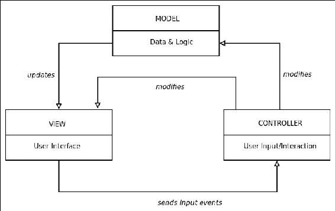

模型-视图-控制器（MVC）架构

这三个组件执行以下职责：

+   **模型**：模型包含应用程序的核心数据和逻辑。

+   **视图**：视图形成应用程序向用户的输出。它们向用户显示信息。可以有同一数据的多个视图。

+   **控制器**：控制器接收和处理用户输入，如键盘点击或鼠标点击/移动，并将它们转换为对模型或视图的更改请求。

使用这三个组件分离关注避免了应用程序的数据和其表示之间的紧密耦合。它允许同一数据（模型）的多个表示（视图），可以根据通过控制器接收的用户输入进行计算和呈现。

MVC 模式允许以下交互：

1.  模型可以根据从控制器接收的输入更改其数据。

1.  更改的数据反映在视图上，这些视图订阅了模型的更改。

1.  控制器可以发送命令来更新模型的状态，例如在对文档进行更改时。控制器还可以发送命令来修改视图的呈现，而不对模型进行任何更改，例如放大图表或图表。

1.  MVC 模式隐含地包括一个变更传播机制，以通知其他依赖组件的变更。

1.  Python 世界中的许多 Web 应用程序实现了 MVC 或其变体。我们将在接下来的部分中看一些，即 Django 和 Flask。

## 模板视图（MTV） - Django

Django 项目是 Python 世界中最受欢迎的 Web 应用程序框架之一。Django 实现了类似 MVC 模式的东西，但有一些细微的差异。

Django（核心）组件架构如下图所示：

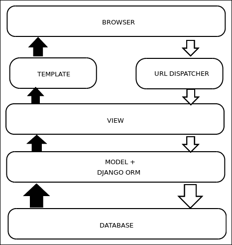

Django 核心组件架构

Django 框架的核心组件如下：

+   对象关系映射器（ORM），充当数据模型（Python）和数据库（关系数据库管理系统）之间的中介 - 这可以被认为是模型层。

+   Python 中的一组回调函数，将数据呈现给特定 URL 的用户界面 - 这可以被认为是 VIEW 层。视图侧重于构建和转换内容，而不是实际呈现。

+   一组 HTML 模板，用于以不同的方式呈现内容。视图委托给特定模板，该模板负责数据的呈现方式。

+   基于正则表达式的 URL DISPATCHER，将服务器上的相对路径连接到特定视图及其变量参数。这可以被认为是一个基本的控制器。

+   在 Django 中，由于呈现是由 TEMPLATE 层执行的，而只有 VIEW 层执行内容映射，因此 Django 经常被描述为实现 Model Template View（MTV）框架。

+   Django 中的控制器并没有很好地定义 - 它可以被认为是整个框架本身 - 或者限于 URL DISPATCHER 层。

## Django admin - 自动化的模型中心视图

Django 框架最强大的组件之一是其自动管理员系统，它从 Django 模型中读取元数据，并生成快速的、以模型为中心的管理员视图，系统管理员可以通过简单的 HTML 表单查看和编辑数据模型。

为了说明，以下是一个描述将术语添加到网站作为“词汇”术语的 Django 模型的示例（词汇是描述与特定主题、文本或方言相关的词汇含义的列表或索引）：

```py
from django.db import models

class GlossaryTerm(models.Model):
    """ Model for describing a glossary word (term) """

    term = models.CharField(max_length=1024)
    meaning = models.CharField(max_length=1024)
    meaning_html = models.CharField('Meaning with HTML markup',
                    max_length=4096, null=True, blank=True)
    example = models.CharField(max_length=4096, null=True, blank=True)

    # can be a ManyToManyField?
    domains = models.CharField(max_length=128, null=True, blank=True)

    notes = models.CharField(max_length=2048, null=True, blank=True)
    url = models.CharField('URL', max_length=2048, null=True, blank=True)
    name = models.ForeignKey('GlossarySource', verbose_name='Source', blank=True)

    def __unicode__(self):
        return self.term

    class Meta:
        unique_together = ('term', 'meaning', 'url')
```

这与一个注册模型以获得自动化管理员视图的管理员系统相结合：

```py
from django.contrib import admin

admin.site.register(GlossaryTerm)
admin.site.register(GlossarySource)
```

以下是通过 Django admin 界面添加术语词汇的自动化管理员视图（HTML 表单）的图像：

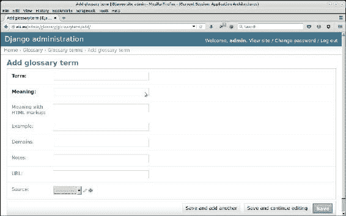

Django 自动管理员视图（HTML 表单）用于添加词汇术语

快速观察告诉您 Django 管理员如何为模型中的不同数据字段生成正确的字段类型，并生成添加数据的表单。这是 Django 中的一个强大模式，允许您以几乎零编码工作量生成自动化的管理员视图以添加/编辑模型。

现在让我们来看另一个流行的 Python Web 应用程序框架，即 Flask。

## 灵活的微框架 - Flask

Flask 是一个微型 Web 框架，它使用了一种最小主义的哲学来构建 Web 应用程序。Flask 仅依赖于两个库：Werkzeug（[`werkzeug.pocoo.org/`](http://werkzeug.pocoo.org/)）WSGI 工具包和 Jinja2 模板框架。

Flask 通过装饰器提供了简单的 URL 路由。Flask 中的“微”一词表明框架的核心很小。对数据库、表单和其他功能的支持是由 Python 社区围绕 Flask 构建的多个扩展提供的。

因此，Flask 的核心可以被认为是一个 MTV 框架减去 M（视图模板），因为核心不实现对模型的支持。

以下是 Flask 组件架构的近似示意图：

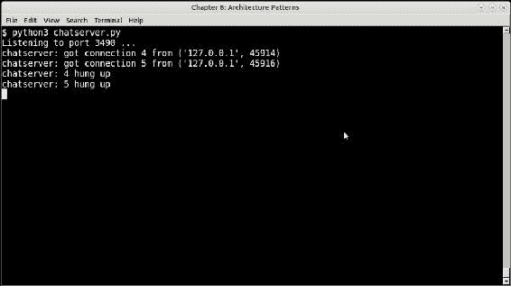

Flask 组件的示意图

使用模板的简单 Flask 应用程序看起来是这样的：

```py
from flask import Flask
app = Flask(__name__)

@app.route('/')
def index():
    data = 'some data'
    return render_template('index.html', **locals())
```

我们可以在这里找到 MVC 模式的一些组件：

+   `@app.route`装饰器将浏览器的请求路由到`index`函数。应用程序路由器可以被视为控制器。

+   `index`函数返回数据，并使用模板进行渲染。`index`函数可以被视为生成视图或视图组件。

+   Flask 使用类似 Django 的模板来将内容与呈现分开。这可以被视为模板组件。

+   在 Flask 核心中没有特定的模型组件。但是，可以借助附加插件来添加模型组件。

+   Flask 使用插件架构来支持附加功能。例如，可以使用 Flask-SQLAlchemy 添加模型，使用 Flask-RESTful 支持 RESTful API，使用 Flask-marshmallow 进行序列化等。

# 事件驱动编程

事件驱动编程是一种系统架构范式，其中程序内部的逻辑流由事件驱动，例如用户操作、来自其他程序的消息或硬件（传感器）输入。

在事件驱动架构中，通常有一个主事件循环，它监听事件，然后在检测到事件时触发具有特定参数的回调函数。

在像 Linux 这样的现代操作系统中，对输入文件描述符（如套接字或已打开的文件）的事件的支持是通过系统调用（如`select`、`poll`和`epoll`）来实现的。

Python 通过其`select`模块提供了对这些系统调用的包装。使用`select`模块在 Python 中编写简单的事件驱动程序并不是很困难。

以下一组程序一起使用 Python 实现了基本的聊天服务器和客户端，利用了 select 模块的强大功能。

## 使用 select 模块进行 I/O 多路复用的聊天服务器和客户端

我们的聊天服务器使用`select`模块通过`select`系统调用来创建频道，客户端可以连接到这些频道并相互交谈。它处理输入准备好的事件（套接字）-如果事件是客户端连接到服务器，则连接并进行握手；如果事件是要从标准输入读取数据，则服务器读取数据，否则将从一个客户端接收到的数据传递给其他客户端。

这是我们的聊天服务器：

### 注意

由于聊天服务器的代码很大，我们只包含了主函数，即`serve`函数，显示服务器如何使用基于 select 的 I/O 多路复用。`serve`函数中的大量代码也已经被修剪，以保持打印的代码较小。

完整的源代码可以从本书的代码存档中下载，也可以从本书的网站上下载。

```py
# chatserver.py

import socket
import select
import signal
import sys
from communication import send, receive

class ChatServer(object):
    """ Simple chat server using select """

    def serve(self):
        inputs = [self.server,sys.stdin]
        self.outputs = []

        while True:

                inputready,outputready,exceptready = select.select(inputs, self.outputs, [])

            for s in inputready:

                if s == self.server:
                    # handle the server socket
                    client, address = self.server.accept()

                    # Read the login name
                    cname = receive(client).split('NAME: ')[1]

                    # Compute client name and send back
                    self.clients += 1
                    send(client, 'CLIENT: ' + str(address[0]))
                    inputs.append(client)

                    self.clientmap[client] = (address, cname)
                    self.outputs.append(client)

                elif s == sys.stdin:
                    # handle standard input – the server exits 
                    junk = sys.stdin.readline()
		  break
                else:
                    # handle all other sockets
                    try:
                        data = receive(s)
                        if data:
                            # Send as new client's message...
                            msg = '\n#[' + self.get_name(s) + ']>> ' + data
                            # Send data to all except ourselves
                            for o in self.outputs:
                                if o != s:
                                    send(o, msg)
                        else:
                            print('chatserver: %d hung up' % s.fileno())
                            self.clients -= 1
                            s.close()
                            inputs.remove(s)
                            self.outputs.remove(s)

                    except socket.error as e:
                        # Remove
                        inputs.remove(s)
                        self.outputs.remove(s)

        self.server.close()

if __name__ == "__main__":
    ChatServer().serve()
```

### 注意

通过发送一行空输入可以停止聊天服务器。

聊天客户端也使用`select`系统调用。它使用套接字连接到服务器，然后在套接字和标准输入上等待事件。如果事件来自标准输入，则读取数据。否则，它通过套接字将数据发送到服务器：

```py
# chatclient.py
import socket
import select
import sys
from communication import send, receive

class ChatClient(object):
    """ A simple command line chat client using select """

    def __init__(self, name, host='127.0.0.1', port=3490):
        self.name = name
        # Quit flag
        self.flag = False
        self.port = int(port)
        self.host = host
        # Initial prompt
        self.prompt='[' + '@'.join((name, socket.gethostname().split('.')[0])) + ']> '
        # Connect to server at port
        try:
            self.sock = socket.socket(socket.AF_INET, socket.SOCK_STREAM)
            self.sock.connect((host, self.port))
            print('Connected to chat server@%d' % self.port)
            # Send my name...
            send(self.sock,'NAME: ' + self.name) 
            data = receive(self.sock)
            # Contains client address, set it
            addr = data.split('CLIENT: ')[1]
            self.prompt = '[' + '@'.join((self.name, addr)) + ']> '
        except socket.error as e:
            print('Could not connect to chat server @%d' % self.port)
            sys.exit(1)

    def chat(self):
        """ Main chat method """

        while not self.flag:
            try:
                sys.stdout.write(self.prompt)
                sys.stdout.flush()

                # Wait for input from stdin & socket
                inputready, outputready,exceptrdy = select.select([0, self.sock], [],[])

                for i in inputready:
                    if i == 0:
                        data = sys.stdin.readline().strip()
                        if data: send(self.sock, data)
                    elif i == self.sock:
                        data = receive(self.sock)
                        if not data:
                            print('Shutting down.')
                            self.flag = True
                            break
                        else:
                            sys.stdout.write(data + '\n')
                            sys.stdout.flush()

            except KeyboardInterrupt:
                print('Interrupted.')
                self.sock.close()
                break

if __name__ == "__main__":
    if len(sys.argv)<3:
        sys.exit('Usage: %s chatid host portno' % sys.argv[0])

    client = ChatClient(sys.argv[1],sys.argv[2], int(sys.argv[3]))
    client.chat()
```

### 注意

聊天客户端可以通过在终端上按下*Ctrl* + *C*来停止。

为了通过套接字发送和接收数据，这两个脚本都使用了一个名为`communication`的第三方模块，该模块具有`send`和`receive`函数。该模块分别在`send`和`receive`函数中使用 pickle 对数据进行序列化和反序列化：

```py
# communication.py
import pickle
import socket
import struct

def send(channel, *args):
    """ Send a message to a channel """

    buf = pickle.dumps(args)
    value = socket.htonl(len(buf))
    size = struct.pack("L",value)
    channel.send(size)
    channel.send(buf)

def receive(channel):
    """ Receive a message from a channel """

    size = struct.calcsize("L")
    size = channel.recv(size)
    try:
        size = socket.ntohl(struct.unpack("L", size)[0])
    except struct.error as e:
        return ''

    buf = ""

    while len(buf) < size:
        buf = channel.recv(size - len(buf))

    return pickle.loads(buf)[0]
```

以下是服务器运行的一些图像，以及通过聊天服务器相互连接的两个客户端：

这是连接到聊天服务器的名为`andy`的客户端#1 的图像：

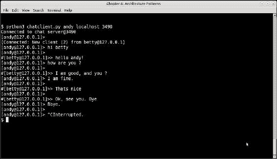

聊天客户端#1 的聊天会话（客户端名称：andy）

同样，这是一个名为`betty`的客户端，它连接到聊天服务器并与`andy`进行交谈：

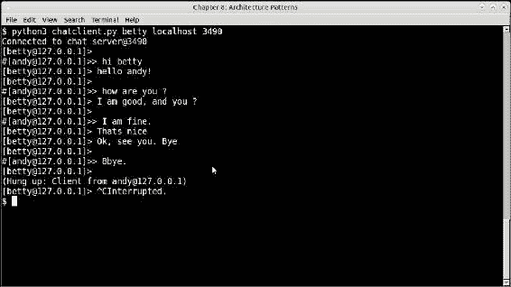

聊天客户端#2 的聊天会话（客户端名称：betty）

程序的一些有趣点列举如下：

+   看看客户端是如何看到彼此的消息的。这是因为服务器将一个客户端发送的数据发送给所有其他连接的客户端。我们的聊天服务器使用井号`#`作为前缀来指示这条消息来自另一个客户端。

+   看看服务器是如何将客户端的连接和断开信息发送给所有其他客户端的。这通知了客户端另一个客户端何时连接到或从会话中断开。

+   服务器在客户端断开连接时会回显消息，表示客户端已经“挂断”：

### 注意

前面的聊天服务器和客户端示例是作者在 ASPN Cookbook 中的 Python 配方的一个小变化，网址为[`code.activestate.com/recipes/531824`](https://code.activestate.com/recipes/531824)。

像 Twisted、Eventlet 和 Gevent 这样的库将简单的基于 select 的多路复用提升到了下一个级别，以构建提供高级基于事件的编程例程的系统，通常基于类似于我们聊天服务器示例的核心事件循环的核心事件循环。

我们将在接下来的章节中讨论这些框架的架构。

## 事件驱动编程与并发编程

在前一节中我们看到的例子使用了异步事件的技术，正如我们在并发章节中看到的那样。这与真正的并发或并行编程是不同的。

事件编程库也使用了异步事件的技术。在其中只有一个执行线程，任务根据接收到的事件依次交错执行。

在下面的例子中，考虑通过三个线程或进程并行执行三个任务：

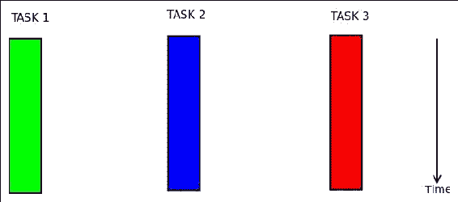

使用三个线程并行执行三个任务

与通过事件驱动编程执行任务时发生的情况形成对比，如下图所示：

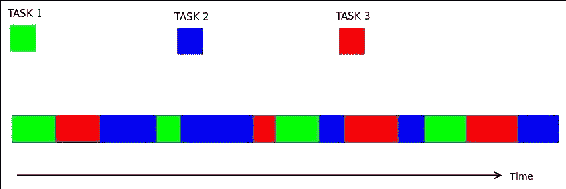

在单个线程中异步执行三个任务

在异步模型中，只有一个单一的执行线程，任务以交错的方式执行。每个任务在异步处理服务器的事件循环中有自己的处理时间段，但在任何给定时间只有一个任务在执行。任务将控制权交还给循环，以便它可以在下一个时间片中安排一个不同的任务来执行当前正在执行的任务。正如我们在第五章中所看到的，“编写可扩展的应用程序”，这是一种协作式多任务处理。

## Twisted

Twisted 是一个事件驱动的网络引擎，支持多种协议，如 DNS、SMTP、POP3、IMAP 等。它还支持编写 SSH 客户端和服务器，并构建消息和 IRC 客户端和服务器。

Twisted 还提供了一组模式（风格）来编写常见的服务器和客户端，例如 Web 服务器/客户端（HTTP）、发布/订阅模式、消息客户端和服务器（SOAP/XML-RPC）等。

它使用了反应器设计模式，将来自多个来源的事件多路复用并分派给它们的事件处理程序在一个单线程中。

它接收来自多个并发客户端的消息、请求和连接，并使用事件处理程序顺序处理这些帖子，而无需并发线程或进程。

反应器伪代码大致如下：

```py
while True:
    timeout = time_until_next_timed_event()
    events = wait_for_events(timeout)
    events += timed_events_until(now())
    for event in events:
        event.process()
```

Twisted 使用回调来在事件发生时调用事件处理程序。为了处理特定事件，为该事件注册一个回调。回调可以用于常规处理，也可以用于管理异常（错误回调）。

与`asyncio`模块一样，Twisted 使用类似于 futures 的对象来包装任务执行的结果，其实际结果仍然不可用。在 Twisted 中，这些对象称为**Deferreds**。

延迟对象有一对回调链：一个用于处理结果（回调），另一个用于管理错误（errbacks）。当获得执行结果时，将创建一个延迟对象，并按照添加的顺序调用其回调和/或 errbacks。

以下是 Twisted 的架构图，显示了高级组件：

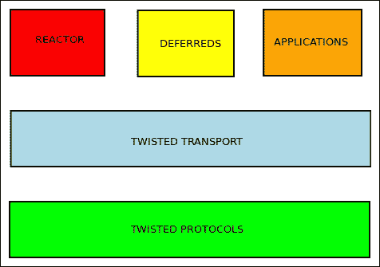

扭曲 - 核心组件

### Twisted - 一个简单的 Web 客户端

以下是使用 Twisted 的简单 Web HTTP 客户端的示例，获取给定 URL 并将其内容保存到特定文件名：

```py
# twisted_fetch_url.py
from twisted.internet import reactor
from twisted.web.client import getPage
import sys

def save_page(page, filename='content.html'):
    print type(page)
    open(filename,'w').write(page)
    print 'Length of data',len(page)
    print 'Data saved to',filename

def handle_error(error):
    print error

def finish_processing(value):
    print "Shutting down..."
    reactor.stop()

if __name__ == "__main__":
    url = sys.argv[1]
    deferred = getPage(url) 
    deferred.addCallbacks(save_page, handle_error)
    deferred.addBoth(finish_processing)

    reactor.run()
```

正如您在前面的代码中所看到的，`getPage`方法返回一个延迟对象，而不是 URL 的数据。对于延迟对象，我们添加了两个回调：一个用于处理数据（`save_page`函数），另一个用于处理错误（`handle_error`函数）。延迟的`addBoth`方法将一个函数添加为回调和 errback。

事件处理是通过运行反应器来启动的。在结束时调用`finish_processing`回调，停止反应器。由于事件处理程序是按添加顺序调用的，因此此函数只会在最后调用。

当反应器运行时，会发生以下事件：

+   页面被获取并创建了延迟。

+   回调按顺序在延迟上调用。首先调用`save_page`函数，将页面内容保存到`content.html`文件中。然后调用`handle_error`事件处理程序，打印任何错误字符串。

+   最后，调用`finish_processing`，停止反应器，事件处理结束，退出程序。

### 注意

在撰写本文时，Twisted 尚未适用于 Python3，因此前面的代码是针对 Python2 编写的。

+   当您运行代码时，您会看到产生以下输出：

```py
$ python2 twisted_fetch_url.py http://www.google.com
Length of data 13280
Data saved to content.html
Shutting down...
```

### 使用 Twisted 的聊天服务器

现在让我们看看如何在 Twisted 上编写一个简单的聊天服务器，类似于我们使用`select`模块的聊天服务器。

在 Twisted 中，服务器是通过实现协议和协议工厂来构建的。协议类通常继承自 Twisted 的`Protocol`类。

工厂只是作为协议对象的工厂模式的类。

使用这个，这是我们使用 Twisted 的聊天服务器：

```py
from twisted.internet import protocol, reactor

class Chat(protocol.Protocol):
    """ Chat protocol """

    transports = {}
    peers = {}

    def connectionMade(self):
        self._peer = self.transport.getPeer()
        print 'Connected',self._peer

    def connectionLost(self, reason):
        self._peer = self.transport.getPeer()
        # Find out and inform other clients
        user = self.peers.get((self._peer.host, self._peer.port))
        if user != None:
            self.broadcast('(User %s disconnected)\n' % user, user)
            print 'User %s disconnected from %s' % (user, self._peer)

    def broadcast(self, msg, user):
        """ Broadcast chat message to all connected users except 'user' """

        for key in self.transports.keys():
            if key != user:
                if msg != "<handshake>":
                    self.transports[key].write('#[' + user + "]>>> " + msg)
                else:
                    # Inform other clients of connection
                    self.transports[key].write('(User %s connected from %s)\n' % (user, self._peer))                

    def dataReceived(self, data):
        """ Callback when data is ready to be read from the socket """

        user, msg = data.split(":")
        print "Got data=>",msg,"from",user
        self.transports[user] = self.transport
        # Make an entry in the peers dictionary
        self.peers[(self._peer.host, self._peer.port)] = user
        self.broadcast(msg, user)

class ChatFactory(protocol.Factory):
    """ Chat protocol factory """

    def buildProtocol(self, addr):
        return Chat()

if __name__ == "__main__":
    reactor.listenTCP(3490, ChatFactory())
    reactor.run()
```

我们的聊天服务器比以前的更复杂，因为它执行以下附加步骤：

1.  它有一个单独的握手协议，使用特殊的`<handshake>`消息。

1.  当客户端连接时，会向其他客户端广播通知他们客户端的名称和连接详细信息。

1.  当客户端断开连接时，其他客户端会收到通知。

聊天客户端还使用 Twisted，并使用两个协议 - 分别是用于与服务器通信的`ChatClientProtocol`和用于从标准输入读取数据并将从服务器接收的数据回显到标准输出的`StdioClientProtocol`。

后一个协议还将前一个协议连接到其输入，以便将接收到的任何数据发送到服务器作为聊天消息。

看一下以下代码：

```py
import sys
import socket
from twisted.internet import stdio, reactor, protocol

class ChatProtocol(protocol.Protocol):
    """ Base protocol for chat """

    def __init__(self, client):
        self.output = None
        # Client name: E.g: andy
        self.client = client
        self.prompt='[' + '@'.join((self.client, socket.gethostname().split('.')[0])) + ']> '             

    def input_prompt(self):
        """ The input prefix for client """
        sys.stdout.write(self.prompt)
        sys.stdout.flush()

    def dataReceived(self, data):
        self.processData(data)

class ChatClientProtocol(ChatProtocol):
    """ Chat client protocol """

    def connectionMade(self):
        print 'Connection made'
        self.output.write(self.client + ":<handshake>")

    def processData(self, data):
        """ Process data received """

        if not len(data.strip()):
            return

        self.input_prompt()

        if self.output:
            # Send data in this form to server
            self.output.write(self.client + ":" + data)

class StdioClientProtocol(ChatProtocol):
    """ Protocol which reads data from input and echoes
    data to standard output """

    def connectionMade(self):
        # Create chat client protocol
        chat = ChatClientProtocol(client=sys.argv[1])
        chat.output = self.transport

        # Create stdio wrapper
        stdio_wrapper = stdio.StandardIO(chat)
        # Connect to output
        self.output = stdio_wrapper
        print "Connected to server"
        self.input_prompt()

    def input_prompt(self):
        # Since the output is directly connected
        # to stdout, use that to write.
        self.output.write(self.prompt)

    def processData(self, data):
        """ Process data received """

        if self.output:
            self.output.write('\n' + data)
            self.input_prompt()

class StdioClientFactory(protocol.ClientFactory):

    def buildProtocol(self, addr):
        return StdioClientProtocol(sys.argv[1])

def main():
    reactor.connectTCP("localhost", 3490, StdioClientFactory())
    reactor.run()

if __name__ == '__main__':
    main()

```

以下是两个客户端`andy`和`betty`使用这个聊天服务器和客户端进行通信的一些屏幕截图：

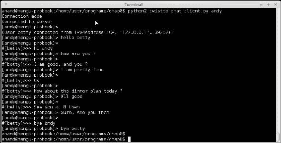

使用 Twisted 的聊天客户端 - 客户端＃1（andy）的会话

这是第二个会话，针对客户端 betty：

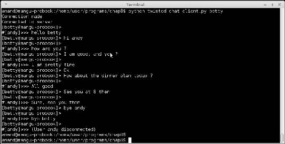

使用 Twisted 的聊天客户端 - 客户端＃2（betty）的会话

您可以通过交替查看屏幕截图来跟踪对话的流程。

请注意，服务器在用户 betty 连接和用户 andy 断开连接时发送的连接和断开连接消息。

## Eventlet

Eventlet 是 Python 世界中另一个知名的网络库，允许使用异步执行的概念编写事件驱动程序。

Eventlet 使用协程来执行这些任务，借助一组所谓的*绿色线程*，这些线程是轻量级的用户空间线程，执行协作式多任务。

Eventlet 使用一组绿色线程的抽象，`Greenpool`类，以执行其任务。

`Greenpool`类运行预定义的一组`Greenpool`线程（默认为`1000`），并提供不同方式将函数和可调用对象映射到线程的方法。

以下是使用 Eventlet 重写的多用户聊天服务器：

```py
# eventlet_chat.py

import eventlet
from eventlet.green import socket

participants = set()

def new_chat_channel(conn):
    """ New chat channel for a given connection """

    data = conn.recv(1024)
    user = ''

    while data:
        print("Chat:", data.strip())
        for p in participants:
            try:
                if p is not conn:
                    data = data.decode('utf-8')
                    user, msg = data.split(':')
                    if msg != '<handshake>':
                        data_s = '\n#[' + user + ']>>> says ' + msg
                    else:
                        data_s = '(User %s connected)\n' % user

                    p.send(bytearray(data_s, 'utf-8'))
            except socket.error as e:
                # ignore broken pipes, they just mean the participant
                # closed its connection already
                if e[0] != 32:
                    raise
        data = conn.recv(1024)

    participants.remove(conn)
    print("Participant %s left chat." % user)

if __name__ == "__main__":
    port = 3490
    try:
        print("ChatServer starting up on port", port)
        server = eventlet.listen(('0.0.0.0', port))

        while True:
            new_connection, address = server.accept()
            print("Participant joined chat.")
            participants.add(new_connection)
            print(eventlet.spawn(new_chat_channel,
                                 new_connection))

    except (KeyboardInterrupt, SystemExit):
        print("ChatServer exiting.")
```

### 注意

这个服务器可以与我们在之前示例中看到的 Twisted 聊天客户端一起使用，并且行为完全相同。因此，我们不会展示此服务器的运行示例。

Eventlet 库在内部使用`greenlets`，这是一个在 Python 运行时上提供绿色线程的包。我们将在下一节中看到 greenlet 和一个相关库 Gevent。

## Greenlets 和 Gevent

Greenlet 是一个在 Python 解释器之上提供绿色或微线程版本的包。它受 Stackless 的启发，Stackless 是支持称为 stacklets 的微线程的 CPython 的一个版本。然而，greenlets 能够在标准 CPython 运行时上运行。

Gevent 是一个 Python 网络库，提供在 C 语言编写的`libev`之上的高级同步 API。

Gevent 受到 gevent 的启发，但它具有更一致的 API 和更好的性能。

与 Eventlet 一样，gevent 对系统库进行了大量的猴子补丁，以提供协作式多任务支持。例如，gevent 自带自己的套接字，就像 Eventlet 一样。

与 Eventlet 不同，gevent 还需要程序员显式进行猴子补丁。它提供了在模块本身上执行此操作的方法。

话不多说，让我们看看使用 gevent 的多用户聊天服务器是什么样子的：

```py
# gevent_chat_server.py

import gevent
from gevent import monkey
from gevent import socket
from gevent.server import StreamServer

monkey.patch_all()

participants = set()

def new_chat_channel(conn, address):
    """ New chat channel for a given connection """

    participants.add(conn)
    data = conn.recv(1024)
    user = ''

    while data:
        print("Chat:", data.strip())
        for p in participants:
            try:
                if p is not conn:
                    data = data.decode('utf-8')
                    user, msg = data.split(':')
                    if msg != '<handshake>':
                        data_s = '\n#[' + user + ']>>> says ' + msg
                    else:
                        data_s = '(User %s connected)\n' % user

                    p.send(bytearray(data_s, 'utf-8'))                  
            except socket.error as e:
                # ignore broken pipes, they just mean the participant
                # closed its connection already
                if e[0] != 32:
                    raise
        data = conn.recv(1024)

    participants.remove(conn)
    print("Participant %s left chat." % user)

if __name__ == "__main__":
    port = 3490
    try:
        print("ChatServer starting up on port", port)
        server = StreamServer(('0.0.0.0', port), new_chat_channel)
        server.serve_forever()
    except (KeyboardInterrupt, SystemExit):
        print("ChatServer exiting.")
```

基于 gevent 的聊天服务器的代码几乎与使用 Eventlet 的代码相同。原因是它们都通过在建立新连接时将控制权交给回调函数的方式以非常相似的方式工作。在这两种情况下，回调函数的名称都是`new_chat_channel`，具有相同的功能，因此代码非常相似。

两者之间的区别如下：

+   gevent 提供了自己的 TCP 服务器类——`StreamingServer`，因此我们使用它来代替直接监听模块

+   在 gevent 服务器中，对于每个连接，都会调用`new_chat_channel`处理程序，因此参与者集合在那里进行管理

+   由于 gevent 服务器有自己的事件循环，因此无需创建用于监听传入连接的 while 循环，就像我们在 Eventlet 中所做的那样

这个示例与之前的示例完全相同，并且与 Twisted 聊天客户端一起使用。

# 微服务架构

微服务架构是开发单个应用程序的一种架构风格，将其作为一套小型独立服务运行，每个服务在自己的进程中运行，并通过轻量级机制进行通信，通常使用 HTTP 协议。

微服务是独立部署的组件，通常没有或者只有极少的中央管理或配置。

微服务可以被视为**面向服务的架构**（**SOA**）的特定实现风格，其中应用程序不是自上而下构建为单体应用程序，而是构建为相互交互的独立服务的动态组。

传统上，企业应用程序是以单块模式构建的，通常由这三个层组成：

1.  由 HTML 和 JavaScript 组成的客户端用户界面（UI）层。

1.  由业务逻辑组成的服务器端应用程序。

1.  数据库和数据访问层，保存业务数据。

另一方面，微服务架构将这一层拆分为多个服务。例如，业务逻辑不再在单个应用程序中，而是拆分为多个组件服务，它们的交互定义了应用程序内部的逻辑流程。这些服务可能查询单个数据库或独立的本地数据库，后者的配置更常见。

微服务架构中的数据通常以文档对象的形式进行处理和返回 - 通常以 JSON 编码。

以下示意图说明了单体架构与微服务架构的区别：

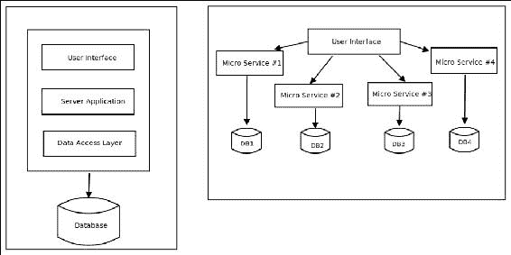

单体架构（左）与微服务架构（右）

## Python 中的微服务框架

由于微服务更多地是一种哲学或架构风格，没有明确的软件框架类别可以说是它们的最佳选择。然而，人们仍然可以对框架应该具有的属性做出一些合理的预测，以便为在 Python 中构建 Web 应用程序的微服务架构选择一个好的框架。这些属性包括以下内容：

+   组件架构应该是灵活的。框架不应该在规定使系统的不同部分工作的组件选择方面变得死板。

+   框架的核心应该是轻量级的。这是有道理的，因为如果我们从头开始，比如说，微服务框架本身有很多依赖，软件在一开始就会感觉很沉重。这可能会导致部署、测试等方面出现问题。

+   框架应该支持零或最小化配置。微服务架构通常是自动配置的（零配置）或具有一组最小配置输入，这些输入在一个地方可用。通常，配置本身作为微服务可供其他服务查询，并使配置共享变得简单、一致和可扩展。

+   它应该非常容易将现有的业务逻辑，比如编码为类或函数的业务逻辑，转换为 HTTP 或 RCP 服务。这允许代码的重用和智能重构。

如果您遵循这些原则并在 Python 软件生态系统中寻找，您会发现一些 Web 应用程序框架符合要求，而另一些则不符合。

例如，Flask 及其单文件对应物 Bottle 由于其最小的占用空间、小的核心和简单的配置，是微服务框架的良好选择。

Pyramid 等框架也可以用于微服务架构，因为它促进了组件选择的灵活性，并避免了紧密集成。

像 Django 这样更复杂的 Web 框架由于正好相反的原因 - 组件的紧密垂直集成、在选择组件方面缺乏灵活性、复杂的配置等等，因此不适合作为微服务框架的选择。

另一个专门用于在 Python 中实现微服务的框架是 Nameko。Nameko 旨在测试应用程序，并提供对不同通信协议的支持，如 HTTP、RPC（通过 AMQP）- 发布-订阅系统和定时器服务。

我们不会详细介绍这些框架。另一方面，我们将看一下如何使用微服务来设计和构建一个真实的 Web 应用程序示例。

## 微服务示例 - 餐厅预订

让我们以一个 Python Web 应用程序的真实例子为例，尝试将其设计为一组微服务。

我们的应用是一个餐厅预订应用程序，帮助用户在靠近他们当前位置的餐厅预订特定时间的一定人数。假设预订只能在同一天进行。

应用程序需要执行以下操作：

1.  返回在用户想要进行预订的时间营业的餐厅列表。

1.  对于给定的餐厅，返回足够的元信息，如菜肴选择、评分、定价等，并允许用户根据其标准筛选酒店。

1.  一旦用户做出选择，允许他们为选定的餐厅预订一定数量的座位，预订时间。

这些要求中的每一个都足够细粒度，可以拥有自己的微服务。

因此，我们的应用程序将设计为以下一组微服务：

+   使用用户的位置，并返回一份营业中的餐厅列表，并支持在线预订 API 的服务。

+   第二个服务根据餐厅 ID 检索给定酒店的元数据。应用程序可以使用此元数据与用户的标准进行比较，以查看是否匹配。

+   第三个服务，根据餐厅 ID、用户信息、所需座位数和预订时间，使用预订 API 进行座位预订，并返回状态。

应用程序逻辑的核心部分现在适合这三个微服务。一旦它们被实现，调用这些服务并执行预订的管道将直接发生在应用程序逻辑中。

我们不会展示此应用程序的任何代码，因为那是一个独立的项目，但我们将向读者展示微服务的 API 和返回数据是什么样子的。

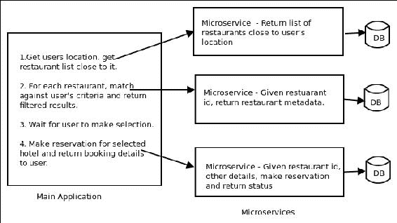

使用微服务的餐厅预订应用程序架构

微服务通常以 JSON 形式返回数据。例如，我们的第一个返回餐厅列表的服务将返回类似于以下内容的 JSON：

```py
GET /restaurants?geohash=tdr1y1g1zgzc

{
    "8f95e6ad-17a7-48a9-9f82-07972d2bc660": {
        "name": "Tandoor",
        "address": "Centenary building, #28, MG Road b-01"
        "hours": "12.00 – 23.30"
	},
  "4307a4b1-6f35-481b-915b-c57d2d625e93": {
        "name": "Karavalli",
        "address": "The Gateway Hotel, 66, Ground Floor"
        "hours": "12.30 – 01:00"
	},
   ...
} 
```

返回餐厅元数据的第二个服务，大多会返回类似于以下内容的 JSON：

```py
GET /restaurants/8f95e6ad-17a7-48a9-9f82-07972d2bc660

{

   "name": "Tandoor",
   "address": "Centenary building, #28, MG Road b-01"
   "hours": "12.00 – 23.30",
   "rating": 4.5,
   "cuisine": "north indian",
   "lunch buffet": "no",
   "dinner buffet": "no",
   "price": 800

} 
```

这是第三个互动，根据餐厅 ID 进行预订：

由于此服务需要用户提供预订信息，因此需要一个包含预订详细信息的 JSON 有效负载。因此，最好以 HTTP POST 调用进行。

```py
POST  /restaurants/reserve
```

在这种情况下，该服务将使用以下给定的有效负载作为 POST 数据：

```py
{
   "name": "Anand B Pillai",
   "phone": 9880078014,
   "time": "2017-04-14 20:40:00",
   "seats": 3,
   "id": "8f95e6ad-17a7-48a9-9f82-07972d2bc660"
} 

```

它将返回类似于以下内容的 JSON 作为响应：

```py
{
   "status": "confirmed",
   "code": "WJ7D2B",
   "time": "2017-04-14 20:40:00",
   "seats": 3
}
```

有了这样的设计，很容易在您选择的框架中实现应用程序，无论是 Flask、Bottle、Nameko 还是其他任何东西。

## 微服务-优势

那么使用微服务而不是单体应用程序有哪些优势呢？让我们看看其中一些重要的优势：

+   微服务通过将应用程序逻辑拆分为多个服务来增强关注点分离。这提高了内聚性，减少了耦合。由于业务逻辑不在一个地方，因此无需对系统进行自上而下的预先设计。相反，架构师可以专注于微服务和应用程序之间的相互作用和通信，让微服务的设计和架构通过重构逐步出现。

+   微服务改善了可测试性，因为现在逻辑的每个部分都可以作为独立的服务进行独立测试，因此很容易与其他部分隔离并进行测试。

+   团队可以围绕业务能力而不是应用程序或技术层的层次进行组织。由于每个微服务都包括逻辑、数据和部署，使用微服务的公司鼓励跨功能角色。这有助于构建更具敏捷性的组织。

+   微服务鼓励去中心化数据。通常，每个服务都将拥有自己的本地数据库或数据存储，而不是单体应用程序所偏爱的中央数据库。

+   微服务促进了持续交付和集成，以及快速部署。由于对业务逻辑的更改通常只需要对一个或几个服务进行小的更改，因此测试和重新部署通常可以在紧密的周期内完成，并且在大多数情况下可以完全自动化。

# 管道和过滤器架构

管道和过滤器是一种简单的架构风格，它连接了一些处理数据流的组件，每个组件通过**管道**连接到处理管道中的下一个组件。

管道和过滤器架构受到了 Unix 技术的启发，该技术通过 shell 上的管道将一个应用程序的输出连接到另一个应用程序的输入。

管道和过滤器架构由一个或多个数据源组成。数据源通过管道连接到数据过滤器。过滤器处理它们接收到的数据，并将它们传递给管道中的其他过滤器。最终的数据接收到一个**数据接收器**：

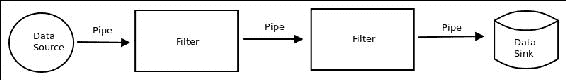

管道和过滤器架构

管道和过滤器通常用于执行大量数据处理的应用程序，如数据分析、数据转换、元数据提取等。

过滤器可以在同一台机器上运行，并且它们使用实际的 Unix 管道或共享内存进行通信。然而，在大型系统中，这些通常在单独的机器上运行，管道不需要是实际的管道，而可以是任何类型的数据通道，如套接字、共享内存、队列等。

可以连接多个过滤器管道以执行复杂的数据处理和数据分段。

一个很好的使用这种架构的 Linux 应用程序的例子是`gstreamer`——这是一个多媒体处理库，可以对多媒体视频和音频执行多项任务，包括播放、录制、编辑和流式传输。

## Python 中的管道和过滤器

在 Python 中，我们在多进程模块中以最纯粹的形式遇到管道。多进程模块提供了管道作为一种从一个进程到另一个进程进行通信的方式。

创建一个父子连接对的管道。在连接的一侧写入的内容可以在另一侧读取，反之亦然。

这使我们能够构建非常简单的数据处理管道。

例如，在 Linux 上，可以通过以下一系列命令计算文件中的单词数：

```py
$ cat filename | wc -w

```

我们将使用多进程模块编写一个简单的程序，模拟这个管道：

```py
# pipe_words.py
from multiprocessing import Process, Pipe
import sys

def read(filename, conn):
    """ Read data from a file and send it to a pipe """

    conn.send(open(filename).read())

def words(conn):
    """ Read data from a connection and print number of words """

    data = conn.recv()
    print('Words',len(data.split()))

if __name__ == "__main__":
    parent, child = Pipe()
    p1 = Process(target=read, args=(sys.argv[1], child))
    p1.start()
    p2 = Process(target=words, args=(parent,))
    p2.start()
    p1.join();p2.join()
```

以下是工作流程的分析：

1.  创建了一个管道，并获得了两个连接。

1.  `read`函数作为一个进程执行，传递管道的一端（子进程）和要读取的文件名。

1.  该进程读取文件，将数据写入连接。

1.  `words`函数作为第二个进程执行，将管道的另一端传递给它。

1.  当此函数作为一个进程执行时，它从连接中读取数据，并打印单词的数量。

以下屏幕截图显示了相同文件上的 shell 命令和前面程序的输出：

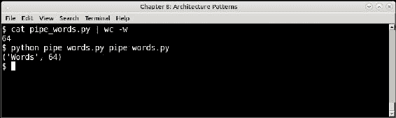

使用管道和其等效的 Python 程序的 shell 命令的输出

您不需要使用看起来像实际管道的对象来创建管道。另一方面，Python 中的生成器提供了一个很好的方式来创建一组可调用对象，它们相互调用，消耗和处理彼此的数据，产生数据处理的管道。

以下是与前一个示例相同的示例，重写为使用生成器，并且这次是处理文件夹中匹配特定模式的所有文件：

```py
# pipe_words_gen.py

# A simple data processing pipeline using generators
# to print count of words in files matching a pattern.
import os

def read(filenames):
    """ Generator that yields data from filenames as (filename, data) tuple """

    for filename in filenames:
        yield filename, open(filename).read()

def words(input):
    """ Generator that calculates words in its input """

    for filename, data in input:
        yield filename, len(data.split())

def filter(input, pattern):
    """ Filter input stream according to a pattern """

    for item in input:
        if item.endswith(pattern):
            yield item

if __name__ == "__main__":
    # Source
    stream1 = filter(os.listdir('.'), '.py')
    # Piped to next filter
    stream2 = read(stream1)
    # Piped to last filter (sink)
    stream3 = words(stream2)

    for item in stream3:
        print(item)
```

以下是输出的屏幕截图：

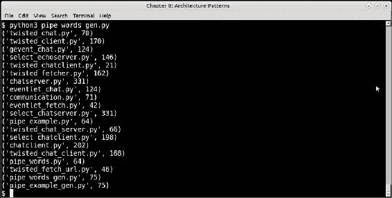

使用生成器输出管道的输出，打印 Python 程序的单词计数

### 注意

可以使用以下命令验证类似于前面程序的输出：

```py
$ wc -w *.py

```

这是另一个程序，它使用另外两个数据过滤生成器来构建一个程序，该程序监视与特定模式匹配的文件并打印有关最近文件的信息，类似于 Linux 上的 watch 程序所做的事情：

```py
# pipe_recent_gen.py
# Using generators, print details of the most recently modified file
# matching a pattern.

import glob
import os
from time import sleep

def watch(pattern):
    """ Watch a folder for modified files matching a pattern """

    while True:
        files = glob.glob(pattern)
        # sort by modified time
        files = sorted(files, key=os.path.getmtime)
        recent = files[-1]
        yield recent        
        # Sleep a bit
        sleep(1)

def get(input):
    """ For a given file input, print its meta data """
    for item in input:
        data = os.popen("ls -lh " + item).read()
        # Clear screen
        os.system("clear")
        yield data

if __name__ == "__main__":
    import sys

    # Source + Filter #1
    stream1 = watch('*.' + sys.argv[1])

    while True:
        # Filter #2 + sink
        stream2 = get(stream1)
        print(stream2.__next__())
        sleep(2)
```

这个最后一个程序的细节应该对读者是不言自明的。

这是我们在控制台上程序的输出，监视 Python 源文件：

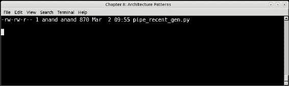

监视最近修改的 Python 源文件的程序输出

如果我们创建一个空的 Python 源文件，比如`example.py`，两秒后输出会发生变化：

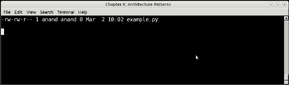

监视程序更改的输出，始终显示最近修改的文件

使用生成器（协程）构建这样的管道的基本技术是将一个生成器的输出连接到下一个生成器的输入。通过在系列中连接许多这样的生成器，可以构建从简单到复杂的数据处理管道。

当然，除了这些之外，我们还可以使用许多技术来构建管道。一些常见的选择是使用队列连接的生产者-消费者任务，可以使用线程或进程。我们在可扩展性章节中看到了这方面的例子。

微服务还可以通过将一个微服务的输入连接到另一个微服务的输出来构建简单的处理管道。

在 Python 第三方软件生态系统中，有许多模块和框架可以让您构建复杂的数据管道。Celery 虽然是一个任务队列，但可以用于构建具有有限管道支持的简单批处理工作流。管道不是 Celery 的强项，但它对于链接任务具有有限的支持，可以用于此目的。

Luigi 是另一个强大的框架，专为需要管道和过滤器架构的复杂、长时间运行的批处理作业而编写。Luigi 具有内置的支持 Hadoop 作业的功能，因此它是构建数据分析管道的良好选择。

# 总结

在本章中，我们看了一些构建软件的常见架构模式。我们从模型视图控制器架构开始，并在 Django 和 Flask 中看了一些例子。您了解了 MVC 架构的组件，并了解到 Django 使用模板实现了 MVC 的变体。

我们以 Flask 作为一个微框架的例子，它通过使用插件架构实现了 Web 应用程序的最小占地面积，并可以添加额外的服务。

我们继续讨论事件驱动的编程架构，这是一种使用协程和事件的异步编程。我们从一个在 Python 中使用`select`模块的多用户聊天示例开始。然后，我们继续讨论更大的框架和库。

我们讨论了 Twisted 的架构和其组件。我们还讨论了 Eventlet 及其近亲 gevent。对于这些框架，我们看到了多用户聊天服务器的实现。

接下来，我们以微服务作为架构，通过将核心业务逻辑分割到多个服务中来构建可扩展的服务和部署。我们设计了一个使用微服务的餐厅预订应用程序的示例，并简要介绍了可以用于构建微服务的 Python Web 框架的情况。

在本章的最后，我们看到了使用管道和过滤器进行串行和可扩展数据处理的架构。我们使用 Python 中的多进程模块构建了一个实际管道的简单示例，模仿了 Unix 的管道命令。然后，我们看了使用生成器构建管道的技术，并看了一些例子。我们总结了构建管道和 Python 第三方软件生态系统中可用框架的技术。

这就是应用架构章节的结束。在下一章中，我们将讨论可部署性-即将软件部署到生产系统等环境的方面。
