# 第九章：部署 Python 应用程序

将代码推送到生产环境通常是将应用程序从开发环境带给客户的最后一步。尽管这是一项重要的活动，但在软件架构师的检查表中往往被忽视。

假设如果系统在开发环境中运行良好，它也会在生产环境中忠实地运行是一个非常常见且致命的错误。首先，生产系统的配置通常与开发环境大不相同。在开发人员的环境中可以使用和理所当然的许多优化和调试，在生产设置中通常是不可用的。

部署到生产环境是一门艺术，而不是一门精确的科学。系统部署的复杂性取决于许多因素，例如系统开发的语言、运行时可移植性和性能、配置参数的数量、系统是在同质环境还是异质环境中部署、二进制依赖关系、部署的地理分布、部署自动化工具等等。

近年来，作为一种开源语言，Python 在为生产系统部署软件包提供的自动化和支持水平上已经成熟。凭借其丰富的内置和第三方支持工具，生产部署和保持部署系统最新的痛苦和麻烦已经减少。

在本章中，我们将简要讨论可部署系统和可部署性的概念。我们将花一些时间了解 Python 应用程序的部署，以及架构师可以添加到其工具库中的工具和流程，以便轻松部署和维护使用 Python 编写的生产系统运行的应用程序。我们还将探讨架构师可以采用的技术和最佳实践，以使其生产系统在没有频繁停机的情况下健康安全地运行。

本章我们将讨论的主题列表如下。

+   可部署性

+   影响可部署性的因素

+   软件部署架构的层次

+   Python 中的软件部署

+   打包 Python 代码

Pip

Virtualenv

Virtualenv 和 Pip

PyPI- Python 软件包索引

应用程序的打包和提交

PyPA

+   使用 Fabric 进行远程部署

+   使用 Ansible 进行远程部署

+   使用 Supervisor 管理远程守护程序

+   部署-模式和最佳实践

# 可部署性

软件系统的可部署性是指将其从开发环境部署到生产环境的便捷程度。它可以根据部署代码所需的工作量（以人时计）或部署代码所需的不同步骤的数量来衡量其复杂性。

常见的错误是假设在开发或暂存系统中运行良好的代码在生产系统中会以类似的方式运行。由于生产系统与开发系统相比具有截然不同的要求，这种情况并不经常发生。

## 影响可部署性的因素

以下是一些区分生产系统和开发系统的因素的简要介绍，这些因素通常会导致部署中出现意外问题，从而导致*生产陷阱*：

+   **优化和调试**：在开发系统中关闭代码优化是非常常见的。

如果您的代码在像 Python 这样的解释运行时中运行，通常会打开调试配置，这允许程序员在发生异常时生成大量的回溯。此外，通常会关闭任何 Python 解释器优化。

另一方面，在生产系统中，情况正好相反 - 优化被打开，调试被关闭。这通常需要额外的配置才能使代码以类似的方式工作。也有可能（虽然很少）在某些情况下，程序在优化后的行为与在未经优化时运行时的行为不同。

+   **依赖项和版本**：开发环境通常具有丰富的开发和支持库的安装，用于运行开发人员可能正在开发的多个应用程序。这些通常是开发人员经常使用的最新代码的依赖项。

生产系统，另一方面，需要使用预先编译的依赖项及其版本的列表进行精心准备。通常只指定成熟或稳定的版本用于在生产系统上部署是非常常见的。因此，如果开发人员依赖于下游依赖项的不稳定（alpha、beta 或发布候选）版本上可用的功能或错误修复，可能会发现 - 太迟了 - 该功能在生产中无法按预期工作。

另一个常见的问题是未记录的依赖项或需要从源代码编译的依赖项 - 这通常是首次部署时的问题。

+   **资源配置和访问权限**：开发系统和生产系统在本地和网络资源的级别、权限和访问细节上通常有所不同。开发系统可能有一个本地数据库，而生产系统往往会为应用程序和数据库系统使用单独的托管。开发系统可能使用标准配置文件，而在生产中，配置可能需要使用特定脚本专门为主机或环境生成。同样，在生产中，可能需要以较低的权限作为特定用户/组运行应用程序，而在开发中，通常会以 root 或超级用户身份运行程序。用户权限和配置上的差异可能影响资源访问，并可能导致软件在生产中失败，而在开发环境中正常运行。

+   **异构的生产环境**：代码通常是在通常是同质的开发环境中开发的。但通常需要在生产中部署到异构系统上。例如，软件可能在 Linux 上开发，但可能需要在 Windows 上进行客户部署。

部署的复杂性与环境的异质性成正比增加。在将此类代码带入生产之前，需要良好管理的分级和测试环境。此外，异构系统使依赖管理变得更加复杂，因为需要为每个目标系统架构维护一个单独的依赖项列表。

+   **安全性**：在开发和测试环境中，通常会对安全性方面给予宽容以节省时间并减少测试的配置复杂性。例如，在 Web 应用程序中，需要登录的路由可能会使用特殊的开发环境标志来禁用，以便快速编程和测试。

同样，在开发环境中使用的系统可能经常使用易于猜测的密码，例如数据库系统、Web 应用程序登录等，以便轻松进行常规回忆和使用。此外，可能会忽略基于角色的授权以便进行测试。

然而，在生产中安全性至关重要，因此这些方面需要相反的处理。需要强制执行需要登录的路由。应该使用强密码。需要强制执行基于角色的身份验证。这些通常会在生产中引起微妙的错误，即在开发环境中正常工作的功能在生产中失败。

由于这些以及其他类似的问题是在生产中部署代码的困扰，已经定义了标准的实践方法，以使运维从业者的生活变得稍微容易一些。大多数公司都遵循使用隔离环境来开发、测试和验证代码和应用程序，然后再将它们推送到生产的做法。让我们来看一下。

# 软件部署架构的层

为了避免在从开发到测试，再到生产的过程中出现复杂性，通常在应用程序部署到生产之前的每个阶段使用多层架构是很常见的。

让我们来看一下以下一些常见的部署层：

+   **开发/测试/阶段/生产**：这是传统的四层架构。

+   开发人员将他们的代码推送到开发环境，进行单元测试和开发人员测试。这个环境总是处于最新的代码状态。很多时候这个环境会被跳过，用开发人员的笔记本电脑上的本地设置替代。

+   然后，软件由测试工程师在测试环境中使用黑盒技术进行测试。他们也可能在这个环境上运行性能测试。这个环境在代码更新方面总是落后于开发环境。通常，内部发布、标签或**代码转储**用于将 QA 环境与开发环境同步。

+   阶段环境试图尽可能地模拟生产环境。这是*预生产*阶段，在这个环境中，软件在尽可能接近部署环境的环境中进行测试，以提前发现可能在生产中出现的问题。这个环境通常用于运行压力测试或负载测试。它还允许运维工程师测试他的部署自动化脚本、定时作业，并验证系统配置。

+   生产环境当然是最终的阶段，经过阶段测试的软件被推送和部署。许多部署通常使用相同的阶段/生产阶段，并且只是从一个切换到另一个。

+   **开发和测试/阶段/生产**：这是前一个层的变体，其中开发环境也兼具测试环境的双重职责。这种系统用于采用敏捷软件开发实践的公司，其中代码至少每周推送一次到生产环境，没有空间或时间来保留和管理一个单独的测试环境。当没有单独的开发环境时——即开发人员使用他们的笔记本电脑进行编程时——测试环境也是一个本地环境。

+   **开发和测试/阶段和生产**：在这种设置中，阶段和生产环境完全相同，使用多个服务器。一旦系统在阶段中经过测试和验证，它就会通过简单地切换主机被推送到生产环境——当前的生产系统切换到阶段，阶段切换到生产。

除此之外，还可以有更复杂的架构，其中使用一个单独的**集成**环境进行集成测试，一个**沙盒**环境用于测试实验性功能，等等。

使用分阶段系统对确保软件在类生产环境中经过充分测试和协调后再推送代码到生产环境是很重要的。

# Python 中的软件部署

正如前面提到的，Python 开发人员在 Python 提供的各种工具以及第三方生态系统中，可以轻松自动化地部署使用 Python 编写的应用程序和代码。

在这一部分，我们将简要地看一下其中一些工具。

## 打包 Python 代码

Python 内置支持为各种分发打包应用程序——源代码、二进制和特定的操作系统级打包。

在 Python 中打包源代码的主要方式是编写一个`setup.py`文件。然后可以借助内置的`distutils`库或更复杂、丰富的`setuptools`框架来打包源代码。

在我们开始了解 Python 打包的内部机制之前，让我们先熟悉一下几个相关的工具，即`pip`和`virtualenv`。

## Pip

Pip 是**Pip installs packages**的递归缩写。Pip 是 Python 中安装软件包的标准和建议工具。

在本书中我们一直看到 pip 在工作，但到目前为止，我们从未看到 pip 本身被安装过，对吧？

让我们在以下截图中看到这一点：

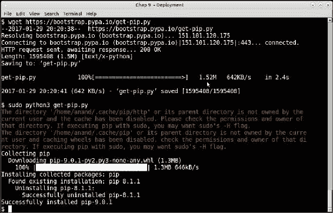

下载并安装 Python3 的 pip

pip 安装脚本可在[`bootstrap.pypa.io/get-pip.py`](https://bootstrap.pypa.io/get-pip.py)找到。

这些步骤应该是不言自明的。

### 注意

在上面的例子中，已经有一个 pip 版本，所以这个操作是升级现有版本，而不是进行全新安装。我们可以通过使用`–version`选项来尝试程序来查看版本详细信息，如下所示：

看一下以下截图：

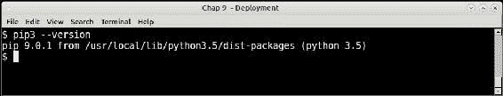

打印当前 pip 版本（pip3）

看到 pip 清楚地打印出其版本号以及安装的目录位置，以及其所安装的 Python 版本。

### 注意

要区分 Python2 和 Python3 版本的 pip，记住为 Python3 安装的版本始终命名为`pip3`。Python2 版本是`pip2`，或者只是`pip`。

使用 pip 安装软件包，只需通过`install`命令提供软件包名称即可。例如，以下截图显示了使用`pip`安装`numpy`软件包：

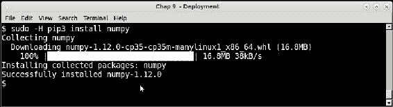

我们不会在这里进一步讨论使用 pip 的细节。相反，让我们来看看另一个与 pip 密切相关的工具，它用于安装 Python 软件。

## Virtualenv

Virtualenv 是一个允许开发人员为本地开发创建沙盒式 Python 环境的工具。假设您想要为同时开发的两个不同应用程序维护特定库或框架的两个不同版本。

如果要将所有内容安装到系统 Python 中，那么您一次只能保留一个版本。另一个选项是在不同的根文件夹中创建不同的系统 Python 安装——比如`/opt`而不是`/usr`。然而，这会带来额外的开销和路径管理方面的麻烦。而且，如果您希望在没有超级用户权限的共享主机上维护版本依赖关系，那么您将无法获得对这些文件夹的写入权限。

Virtualenv 解决了权限和版本问题。它创建一个带有自己的 Python 可执行标准库和安装程序（默认为 pip）的本地安装目录。

一旦开发人员激活了这样创建的虚拟环境，任何进一步的安装都会进入这个环境，而不是系统 Python 环境。

可以使用 pip 来安装 Virtualenv。

以下截图显示了使用`virtualenv`命令创建名为`appvenv`的虚拟环境，并激活该环境以及在环境中安装软件包。

### 注意

安装还会安装 pip、setuptools 和其他依赖项。

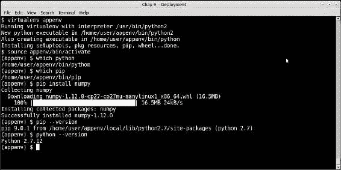

### 注意

看到`python`和`pip`命令指向虚拟环境内部的命令。`pip –version`命令清楚地显示了虚拟环境文件夹内`pip`的路径。

从 Python 3.3 开始，对虚拟环境的支持已经内置到 Python 安装中，通过新的`venv`库。

以下截图显示了在 Python 3.5 中使用该库安装虚拟环境，并在其中安装一些软件包。像往常一样，查看 Python 和 pip 可执行文件的路径：

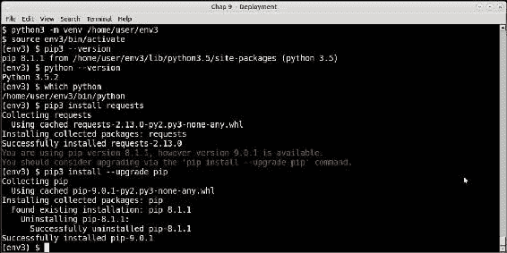

### 注意

上述屏幕截图还显示了如何通过`pip`命令升级 pip 本身。

## Virtualenv 和 pip

一旦为您的应用程序设置了虚拟环境并安装了所需的软件包，最好生成依赖项及其版本。可以通过以下命令轻松完成：

```py
$ pip freeze

```

此命令要求 pip 输出所有已安装的 Python 软件包及其版本的列表。这可以保存到一个 requirements 文件中，并在服务器上进行镜像部署时进行设置复制：

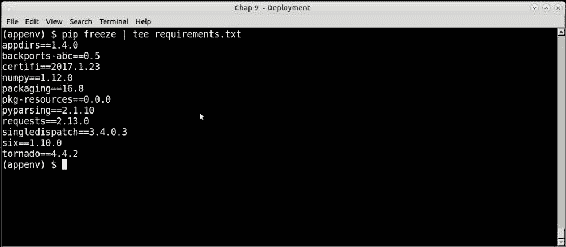

以下屏幕截图显示了通过 pip install 命令的`-r`选项在另一个虚拟环境中重新创建相同的设置，该选项接受此类文件作为输入：

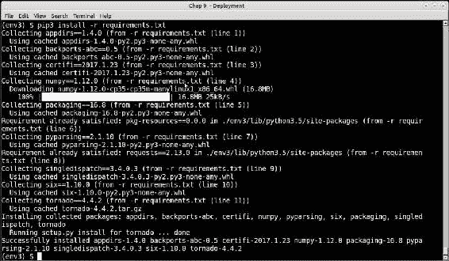

### 注意

我们的源虚拟环境是 Python2，目标是 Python3。但是，pip 能够无任何问题地从`requirements.txt`文件中安装依赖项。

## 可重定位的虚拟环境

从一个虚拟环境复制软件包依赖项到另一个虚拟环境的建议方法是执行冻结，并按照前一节中所示通过 pip 进行安装。例如，这是从开发环境中冻结 Python 软件包要求并成功地在生产服务器上重新创建的最常见方法。

还可以尝试使虚拟环境可重定位，以便可以将其存档并移动到兼容的系统。

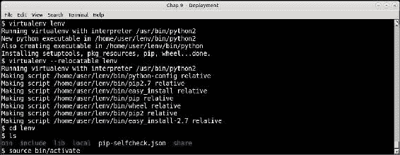

创建可重定位的虚拟环境

它是如何工作的：

1.  首先，通常创建虚拟环境。

1.  然后通过运行`virtualenv –relocatable lenv`来使其可重定位。

1.  这会将 setuptools 使用的一些路径更改为相对路径，并设置系统可重定位。

1.  这样的虚拟环境可以重定位到同一台机器上的另一个文件夹，或者重定位到*远程和相似的机器*上的文件夹。

### 注意

可重定位的虚拟环境并不保证在远程环境与机器环境不同时能正常工作。例如，如果您的远程机器是不同的架构，甚至使用另一种类型的 Linux 发行版进行打包，重定位将无法正常工作。这就是所谓的*相似的机器*。

## PyPI

我们了解到 Pip 是 Python 中进行软件包安装的标准化工具。只要存在，它就能够按名称选择任何软件包。正如我们在 requirements 文件的示例中看到的，它也能够按版本安装软件包。

但是 pip 从哪里获取软件包呢？

要回答这个问题，我们转向 Python 软件包索引，更常被称为 PyPI。

**Python 软件包索引（PyPI）**是官方的第三方 Python 软件包在 Web 上托管元数据的存储库。顾名思义，它是 Web 上 Python 软件包的索引，其元数据发布并在服务器上进行索引。PyPI 托管在 URL [`pypi.python.org`](http://pypi.python.org)。

PyPI 目前托管了接近一百万个软件包。这些软件包是使用 Python 的打包和分发工具 distutils 和 setuptools 提交到 PyPI 的，这些工具具有用于将软件包元数据发布到 PyPI 的钩子。许多软件包还在 PyPI 中托管实际软件包数据，尽管 PyPI 可以用于指向位于另一台服务器上 URL 的软件包数据。

当您使用 pip 安装软件包时，实际上是在 PyPI 上搜索软件包，并下载元数据。它使用元数据来查找软件包的下载 URL 和其他信息，例如进一步的下游依赖项，这些信息用于为您获取和安装软件包。

以下是 PyPI 的屏幕截图，显示了此时软件包的实际数量：

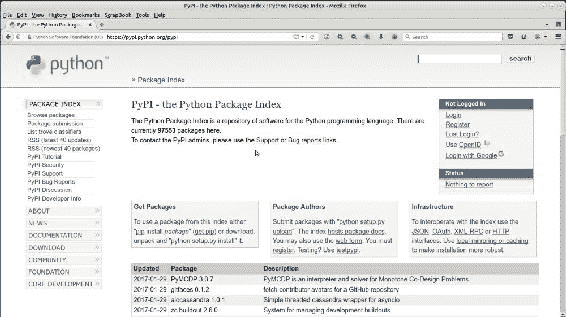

开发人员可以在 PyPI 网站上直接执行许多操作：

1.  使用电子邮件地址注册并登录网站。

1.  登录后，直接在网站上提交您的软件包。

1.  通过关键字搜索软件包。

1.  通过一些顶级*trove*分类器浏览软件包，例如主题、平台/操作系统、开发状态、许可证等。

现在我们已经熟悉了所有 Python 打包和安装工具及其关系，让我们尝试一个小例子，将一个简单的 Python 模块打包并提交到 PyPI。

## 软件包的打包和提交

请记住，我们曾经开发过一个 mandelbrot 程序，它使用 pymp 进行缩放，在第五章中，*编写可扩展的应用程序*。我们将以此作为一个开发软件包的示例程序，并使用`setup.py`文件将该应用程序提交到 PyPI。

我们将 mandelbrot 应用程序打包成一个主包，其中包含两个子包，如下所示：

+   `mandelbrot.simple`：包含 mandelbrot 基本实现的子包（子模块）

+   `mandelbrot`.mp：包含 mandelbrot 的 PyMP 实现的子包（子模块）

以下是我们软件包的文件夹结构：

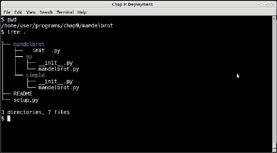

mandelbrot 软件包的文件夹布局

让我们快速分析一下我们将要打包的应用程序的文件夹结构：

+   顶级目录名为`mandelbrot`。它有一个`__init__.py`，一个`README`和一个`setup.py`文件。

+   该目录有两个子目录——`mp`和`simple`。

+   每个子文件夹都包括两个文件，即`__init__.py`和`mandelbrot.py`。这些子文件夹将形成我们的子模块，每个子模块包含 mandelbrot 集的相应实现。

### 注意

为了将 mandelbrot 模块安装为可执行脚本，代码已更改以向我们的每个`mandelbrot.py`模块添加`main`方法。

### `__init__.py`文件

`__init__.py`文件允许将 Python 应用程序中的文件夹转换为软件包。我们的文件夹结构有三个：第一个是顶级软件包`mandelbrot`，其余两个分别是每个子包`mandelbrot.simple`和`mandelbrot.mp`。

顶级`__init__.py`为空。其他两个有以下单行：

```py
from . import mandelbrot
```

### 注意

相对导入是为了确保子包导入本地的`mandelbrot.py`模块，而不是顶级`mandelbrot`软件包。

### `setup.py`文件

`setup.py`文件是整个软件包的中心点。让我们来看一下：

```py
from setuptools import setup, find_packages
setup(
    name = "mandelbrot",
    version = "0.1",
    author = "Anand B Pillai",
    author_email = "abpillai@gmail.com",
    description = ("A program for generating Mandelbrot fractal images"),
    license = "BSD",
    keywords = "fractal mandelbrot example chaos",
    url = "http://packages.python.org/mandelbrot",
    packages = find_packages(),
    long_description=open('README').read(),
    classifiers=[
        "Development Status :: 4 - Beta",
        "Topic :: Scientific/Engineering :: Visualization",
        "License :: OSI Approved :: BSD License",
    ],
    install_requires = [
        'Pillow>=3.1.2',
        'pymp-pypi>=0.3.1'
        ],
    entry_points = {
        'console_scripts': [
            'mandelbrot = mandelbrot.simple.mandelbrot:main',
            'mandelbrot_mp = mandelbrot.mp.mandelbrot:main'
            ]
        }
)
```

`setup.py`文件的全面讨论超出了本章的范围，但请注意以下几个关键点：

+   `setup.py`文件允许作者创建许多软件包元数据，例如名称、作者名称、电子邮件、软件包关键字等。这些对于创建软件包元信息非常有用，一旦提交到 PyPI，就可以帮助人们搜索软件包。

+   该文件中的一个主要字段是`packages`，它是由此`setup.py`文件创建的软件包（和子软件包）的列表。我们使用 setuptools 模块提供的`find_packages`辅助函数来实现这一点。

+   我们在`install-requires`键中提供了安装要求，以 PIP 格式逐个列出依赖项。

+   `entry_points`键用于配置此软件包安装的控制台脚本（可执行程序）。让我们看其中一个：

```py
mandelbrot = mandelbrot.simple.mandelbrot:main
```

这告诉包资源加载器加载名为`mandelbrot.simple.mandelbrot`的模块，并在调用脚本`mandelbrot`时执行其函数`main`。

### 安装软件包

现在可以使用以下命令安装软件包：

```py
$ python setup.py install

```

安装的以下截图显示了一些初始步骤：

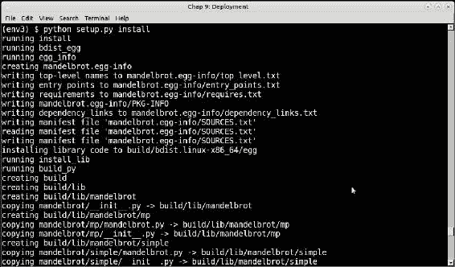

### 注意

我们已将此软件包安装到名为`env3`的虚拟环境中。

### 将软件包提交到 PyPI

Python 中的`setup.py`文件加上 setuptools/distutils 生态系统不仅可以用于安装和打包代码，还可以用于将代码提交到 Python 软件包索引。

将软件包注册到 PyPI 非常容易。只有以下两个要求：

+   具有适当`setup.py`文件的软件包。

+   PyPI 网站上的一个帐户。

现在，我们将通过以下步骤将我们的新 mandelbrot 软件包提交到 PyPI：

1.  首先，需要在家目录中创建一个名为`.pypirc`的文件，其中包含一些细节，主要是 PyPI 帐户的身份验证细节。

这是作者的`.pypirc`文件，其中密码被隐藏：

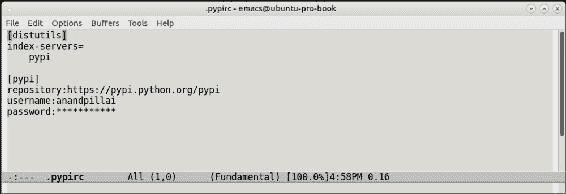

1.  完成此操作后，注册就像运行`setup.py`并使用`register`命令一样简单：

```py
$ python setup.py register

```

下一张截图显示了控制台上实际命令的执行情况：

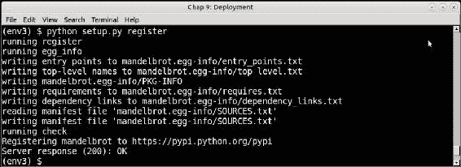

然而，这最后一步只是通过提交其元数据注册了软件包。在此步骤中并未提交软件包数据，如源代码数据。

1.  要将源代码提交到 PyPI，应运行以下命令：

```py
$ python setup.py sdist upload

```

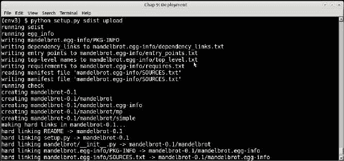

这是我们在 PyPI 服务器上的新软件包的视图：

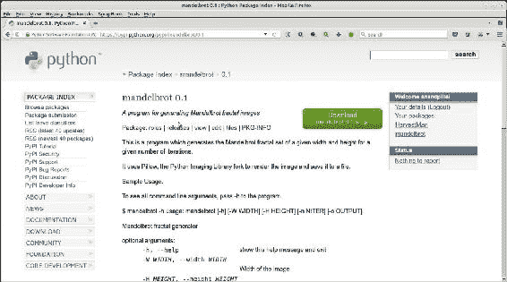

现在，通过 pip 安装软件包，完成了软件开发的循环：首先是打包、部署，然后是安装。

## PyPA

**Python Packaging Authority**（**PyPA**）是一群维护 Python 打包标准和相关应用程序的 Python 开发人员的工作组。PyPA 在[`www.pypa.io/`](https://www.pypa.io/)上有他们的网站，并在 GitHub 上维护应用程序[`github.com/pypa/`](https://github.com/pypa/)。

以下表格列出了由 PyPA 维护的项目。您已经看到了其中一些，比如 pip、virtualenv 和 setuptools；其他可能是新的：

| 项目 | 描述 |
| --- | --- |
| setuptools | 对 Python distutils 的增强集合 |
| virtualenv | 用于创建沙盒 Python 环境的工具 |
| pip | 用于安装 Python 软件包的工具 |
| packaging | pip 和 setuptools 使用的核心 Python 打包实用程序 |
| wheel | 用于创建 wheel 分发的 setuptools 扩展，它是 Python eggs（ZIP 文件）的替代方案，并在 PEP 427 中指定 |
| twine | 用于创建 wheel 分发的`setup.py`上传的安全替代品 |
| warehouse | 新的 PyPI 应用程序，可以在[`pypi.org`](https://pypi.org)上查看 |
| distlib | 一个实现与 Python 代码打包和分发相关功能的低级库 |
| bandersnatch | 用于镜像 PyPI 内容的 PyPI 镜像客户端 |

有兴趣的开发人员可以访问 PyPA 网站，并注册其中一个项目，并通过访问 PyPA 的 github 存储库，以进行测试、提交补丁等方面的贡献。

## 使用 Fabric 进行远程部署

Fabric 是一个用 Python 编写的命令行工具和库，它通过一组对 SSH 协议的良好定义的包装器来自动化服务器上的远程部署。它在幕后使用`ssh-wrapper`库`paramiko`。

Fabric 仅适用于 Python 2.x 版本。但是，有一个名为 Fabric3 的分支，可以同时适用于 Python 2.x 和 3.x 版本。

使用 fabric 时，devops 用户通常将远程系统管理员命令部署为名为`fabfile.py`的 Python 函数。

当远程系统已经配置了用户机器的 ssh 公钥时，Fabric 的工作效果最佳，因此无需提供用户名和密码。

以下是在服务器上进行远程部署的示例。在这种情况下，我们正在将我们的 mandelbrot 应用程序安装到远程服务器上。

fabfile 如下所示。请注意，它是为 Python3 编写的：

```py
from fabric.api import run

def remote_install(application):

    print ('Installing',application)
    run('sudo pip install ' + application)
```

以下是一个在远程服务器上安装并运行的示例：

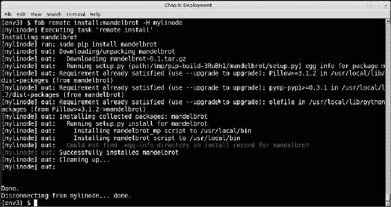

Devops 工程师和系统管理员可以使用预定义的 fabfiles 集合来自动化不同的系统和应用程序部署任务，跨多个服务器。

### 注意

虽然 Fabric 是用 Python 编写的，但可以用于自动化任何类型的远程服务器管理和配置任务。

## 使用 Ansible 进行远程部署

Ansible 是用 Python 编写的配置管理和部署工具。Ansible 可以被视为在 SSH 上使用脚本的包装器，支持通过易于管理的单元（称为*playbooks*）组装的任务进行编排，将一组主机映射到一组角色。

Ansible 使用“facts”，这是它在运行任务之前收集的系统和环境信息。它使用这些 facts 来检查是否有任何需要在运行任务之前改变任何状态的情况。

这使得 Ansible 任务可以安全地在服务器上以重复的方式运行。良好编写的 ansible 任务是*幂等*的，对远程系统几乎没有副作用。

Ansible 是用 Python 编写的，可以使用 pip 安装。

它使用自己的主机文件，即`/etc/ansible/hosts`，来保存其运行任务的主机信息。

典型的 ansible 主机文件可能如下所示，

```py
[local]
127.0.0.1

[webkaffe]
139.162.58.8
```

以下是一个名为`dependencies.yaml`的 Ansible playbook 的片段，它在名为*webkaffe*的远程主机上通过 pip 安装了一些 Python 包。

```py
---
- hosts: webkaffe
  tasks:
    - name: Pip - Install Python Dependencies
      pip:
          name="{{ python_packages_to_install | join(' ') }}"

      vars:
          python_packages_to_install:
          - Flask
          - Bottle
          - bokeh
```

这是在使用 ansible-playbook 命令行运行此 playbook 的图像。


Ansible 是管理远程依赖项的一种简单有效的方式，由于其幂等 playbooks，比 Fabric 更适合执行任务。

## 使用 Supervisor 管理远程守护进程

Supervisor 是一个客户端/服务器系统，对于控制 Unix 和类 Unix 系统上的进程非常有用。它主要由一个名为**supervisord**的服务器守护进程和一个与服务器交互的命令行客户端**supervisorctl**组成。

Supervisor 还带有一个基本的 Web 服务器，可以通过端口 9001 访问。可以通过此界面查看运行进程的状态，并通过此界面启动/停止它们。Supervisor 不在任何版本的 Windows 上运行。

Supervisor 是一个使用 Python 编写的应用程序，因此可以通过 pip 安装。它仅在 Python 2.x 版本上运行。

通过 supervisor 管理的应用程序应该通过 supervisor 守护程序的配置文件进行配置。默认情况下，这些文件位于`/etc/supervisor.d/conf`文件夹中。

然而，也可以通过将其安装到虚拟环境中并将配置保留在虚拟环境中来在本地运行 Supervisor。事实上，这是运行多个管理特定于虚拟环境的进程的常见方式。

我们不会详细介绍或举例使用 Supervisor，但以下是使用 Supervisor 与传统方法（如系统`rc.d`脚本）相比的一些好处：

+   通过使用客户端/服务器系统来解耦进程创建/管理和进程控制。`supervisor.d`文件通过子进程管理进程。用户可以通过客户端 supervisorctl 获取进程状态信息。此外，大多数传统的 rc.d 进程需要 root 或 sudo 访问权限，而 supervisor 进程可以通过系统的普通用户通过客户端或 Web UI 进行控制。

+   由于 supervisord 通过子进程启动进程，可以配置它们在崩溃时自动重新启动。相比依赖 PID 文件，更容易获得子进程的更准确状态。

+   监管者支持进程组，允许用户按优先级顺序定义进程。进程可以作为一组按特定顺序启动和停止。当应用程序中的进程之间存在时间依赖性时，这允许实现精细的进程控制。（进程 B 需要 A 正在运行，C 需要 B 正在运行，依此类推。）

我们将在本章中完成讨论，概述常见的部署模式，架构师可以选择以解决可部署性的常见问题。

# 部署-模式和最佳实践

有不同的部署方法或模式可用于解决停机时间、减少部署风险以及无缝开发和部署软件的问题。

+   持续部署：持续部署是一种部署模型，其中软件随时可以准备上线。只有在包括开发、测试和暂存在内的各个层次不断集成的情况下，才能实现持续交付。在持续部署模型中，一天内可以发生多次生产部署，并且可以通过部署管道自动完成。由于不断部署增量更改，持续部署模式最小化了部署风险。在敏捷软件开发公司，这也有助于客户通过几乎在开发和测试结束后立即在生产中看到实时代码来直接跟踪进展。还有一个额外的优势，即更快地获得用户反馈，从而允许更快地对代码和功能进行迭代。

+   蓝绿部署：我们已经在第五章中讨论过这个问题。蓝绿部署保持两个生产环境，彼此非常相似。在某个时刻，一个环境是活跃的（蓝色）。您将新的部署更改准备到另一个环境（绿色），一旦测试并准备好上线，切换系统——绿色变为活跃，蓝色变为备份。蓝绿部署大大降低了部署风险，因为对于新部署出现的任何问题，您只需要切换路由器或负载均衡器到新环境。通常，在典型的蓝绿系统中，一个系统是生产（活跃）的，另一个是暂存的，您可以在它们之间切换角色。

+   金丝雀发布：如果您想在将软件更改部署给所有客户的整个受众之前，先在用户的子集上测试这些更改，您可以使用这种方法。在金丝雀发布中，更改首先针对一小部分用户进行推出。一个简单的方法是狗食，首先将更改内部推出给员工。另一种方法是测试版，邀请一组特定的受众来测试您的早期功能。其他涉及的方法包括根据地理位置、人口统计和个人资料选择用户。金丝雀发布除了使公司免受对糟糕管理的功能的突然用户反应之外，还可以以递增方式管理负载和容量扩展。例如，如果某个特定功能变得受欢迎，并且开始将比以前多 100 倍的用户驱动到您的服务器，传统的部署可能会导致服务器故障和可用性问题，而不是使用金丝雀发布进行逐步部署。地理路由是一种技术，可以用来选择用户的子集，如果您不想进行复杂的用户分析和分析。这是将负载发送到部署在特定地理位置或数据中心的节点，而不是其他节点。金丝雀发布也与增量部署或分阶段部署的概念相关。

+   **桶测试（A/B 测试）**：这是一种在生产中部署两个不同版本的应用程序或网页来测试哪个版本更受欢迎和/或更具吸引力的技术。在生产中，你的一部分受众看到应用程序（或页面）的 A 版本——控制或基本版本——另一部分看到 B 版本或修改（变体）版本。通常，这是一个 50-50 的分割，尽管与金丝雀发布一样，用户配置文件、地理位置或其他复杂模型可以被使用。用户体验和参与度是通过分析仪表板收集的，然后确定更改是否有积极、消极或中性的响应。

+   **诱发混乱**：这是一种故意引入错误或禁用生产部署系统的一部分来测试其对故障的弹性和/或可用性的技术。

生产服务器存在漂移问题——除非你使用持续部署或类似的方法进行同步，否则，生产服务器通常会偏离标准配置。测试系统的一种方法是去故意禁用生产系统的一部分——例如，通过禁用负载均衡器配置中随机 50%的节点，然后观察系统的其余部分的表现。

寻找和清除未使用代码的类似方法是去注入随机的秘密部分配置，使用一个你怀疑是多余且不再需要的 API。然后观察应用在生产环境中的表现。如果一个随机的秘密会导致 API 失败，那么如果应用的某个部分仍然使用依赖的代码，它将在生产中失败。否则，这表明代码可以安全地移除。

Netflix 有一个名为**混沌猴**的工具，它会自动在生产系统中引入故障，然后衡量影响。

诱发混乱允许 DevOps 工程师和架构师了解系统的弱点，了解正在经历配置漂移的系统，并找到并清除应用程序中不必要或未使用的部分。

# 总结

这一章是关于将你的 Python 代码部署到生产环境。我们看了影响系统可部署性的不同因素。我们继续讨论了部署架构中的层次，比如传统的四层和三层、两层架构，包括开发、测试、暂存/QA 和生产层的组合。

然后我们讨论了打包 Python 代码的细节。我们详细讨论了 pip 和 virtualenv 这两个工具。我们看了 pip 和 virtualenv 如何一起工作，以及如何使用 pip 安装一组要求，并使用它设置类似的虚拟环境。我们还简要介绍了可重定位的虚拟环境。

然后我们讨论了 PyPI——Python 包索引，它在网络上托管 Python 第三方包。然后我们通过一个详细的例子讨论了如何使用 setuptools 和`setup.py`文件设置 Python 包。在这种情况下，我们使用 mandelbrot 应用程序作为例子。

我们通过展示如何使用元数据将包注册到 PyPI，并且如何上传包括代码在内的包数据来结束了这次讨论。我们还简要介绍了 PyPA，即 Python Packaging Authority 及其项目。

之后，我们讨论了两个工具——都是用 Python 开发的——Fabric 用于远程自动部署，Supervisor 用于 Unix 系统上的远程进程管理。我们以概述常见的部署模式结束了这一章，这些模式可以用来解决部署问题。

在本书的最后一章中，我们讨论了一系列调试代码的技术，以找出潜在的问题。
