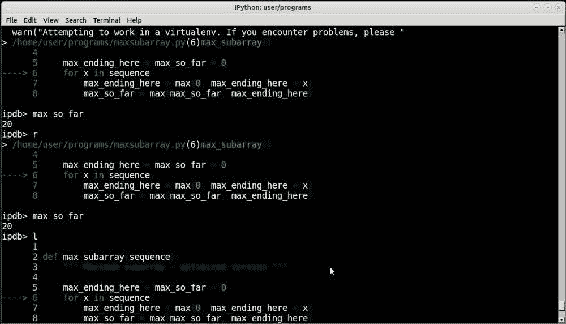
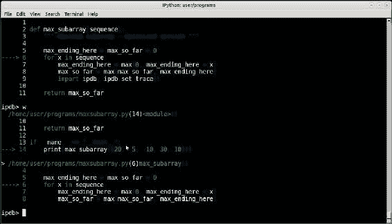
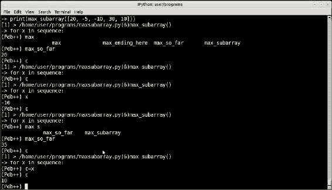
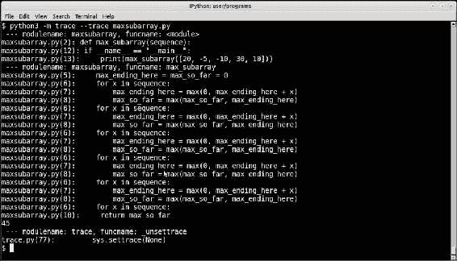
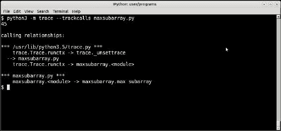
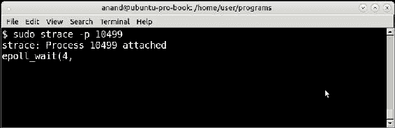
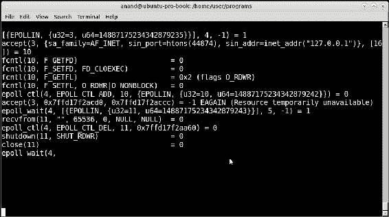

# 第十章：调试技术

调试程序通常会像编写程序一样困难，有时甚至更困难。很多时候，程序员似乎会花费大量的时间寻找那个难以捉摸的错误，其原因可能正盯着他们，却不显露出来。

许多开发人员，甚至是优秀的开发人员，发现故障排除是一门困难的艺术。大多数情况下，程序员在简单的方法，如适当放置的打印语句和策略性注释的代码等方法无法解决问题时，就会求助于复杂的调试技术。

Python 在调试代码时会带来自己的一套问题。作为一种动态类型的语言，由于程序员假设类型是某种类型（当它实际上是其他类型），类型相关的异常在 Python 中是非常常见的。名称错误和属性错误也属于类似的范畴。

在本章中，我们将专注于软件的这一少讨论的方面。

这是一个按主题分类的列表，我们将在本章中遇到的内容：

+   最大子数组问题：

+   “打印”的力量

+   分析和重写

+   计时和优化代码

+   简单的调试技巧和技术：

+   单词搜索程序

+   单词搜索程序-调试步骤 1

+   单词搜索程序-调试步骤 2

+   单词搜索程序-最终代码

+   跳过代码块

+   停止执行

+   外部依赖-使用包装器

+   用返回值/数据替换函数（模拟）

+   将数据保存到/从文件加载为缓存

+   将数据保存到/从内存加载为缓存

+   返回随机/模拟数据

生成随机患者数据

+   日志记录作为调试技术：

+   简单的应用程序日志记录

+   高级日志记录-记录器对象

高级日志记录-自定义格式和记录器

高级日志记录-写入 syslog

+   调试工具-使用调试器：

+   与 pdb 一起进行调试会话

+   Pdb-类似工具

iPdb

Pdb++

+   高级调试-跟踪：

+   跟踪模块

+   lptrace 程序

+   使用 strace 进行系统调用跟踪

好的，让我们调试一下！

# 最大子数组问题

首先，让我们看一个有趣的问题。在这个问题中，目标是找到一个混合负数和正数的整数数组（序列）的最大连续子数组。

例如，假设我们有以下数组：

```py
>>> a  = [-5, 20, -10, 30, 15]
```

通过快速扫描很明显，最大和的子数组是`[20, -10, 30, 15]`，得到和`55`。

让我们说，作为第一步，你写下了这段代码：

```py
import itertools

# max_subarray: v1
def max_subarray(sequence):
    """ Find sub-sequence in sequence having maximum sum """

    sums = []

    for i in range(len(sequence)):
        # Create all sub-sequences in given size
        for sub_seq in itertools.combinations(sequence, i):
            # Append sum
            sums.append(sum(sub_seq))

    return max(sums)
```

现在让我们试一下：

```py
>>>  max_subarray([-5, 20, -10, 30, 15])
65

```

这个输出看起来显然是错误的，因为在数组中手动添加任何子数组似乎都不会产生大于 55 的数字。我们需要调试代码。

## “打印”的力量

为了调试前面的例子，一个简单而策略性放置的**“打印”**语句就可以解决问题。让我们在内部的`for`循环中打印出子序列：

函数修改如下：

# max_subarray：v1

```py
def max_subarray(sequence):
    """ Find sub-sequence in sequence having maximum sum """

    sums = []
    for i in range(len(sequence)):
        for sub_seq in itertools.combinations(sequence, i):
            sub_seq_sum = sum(sub_seq)
            print(sub_seq,'=>',sub_seq_sum)
            sums.append(sub_seq_sum)

    return max(sums)
```

现在代码执行并打印出这个输出：

```py
>>> max_subarray([-5, 20, -10, 30, 15])
((), '=>', 0)
((-5,), '=>', -5)
((20,), '=>', 20)
((-10,), '=>', -10)
((30,), '=>', 30)
((15,), '=>', 15)
((-5, 20), '=>', 15)
((-5, -10), '=>', -15)
((-5, 30), '=>', 25)
((-5, 15), '=>', 10)
((20, -10), '=>', 10)
((20, 30), '=>', 50)
((20, 15), '=>', 35)
((-10, 30), '=>', 20)
((-10, 15), '=>', 5)
((30, 15), '=>', 45)
((-5, 20, -10), '=>', 5)
((-5, 20, 30), '=>', 45)
((-5, 20, 15), '=>', 30)
((-5, -10, 30), '=>', 15)
((-5, -10, 15), '=>', 0)
((-5, 30, 15), '=>', 40)
((20, -10, 30), '=>', 40)
((20, -10, 15), '=>', 25)
((20, 30, 15), '=>', 65)
((-10, 30, 15), '=>', 35)
((-5, 20, -10, 30), '=>', 35)
((-5, 20, -10, 15), '=>', 20)
((-5, 20, 30, 15), '=>', 60)
((-5, -10, 30, 15), '=>', 30)
((20, -10, 30, 15), '=>', 55)
65

```

通过查看打印语句的输出，问题现在变得清晰了。

有一个子数组`[20, 30, 15]`（在前面的输出中用粗体标出），产生和*65*。然而，这不是一个有效的子数组，因为元素在原始数组中不是连续的。

显然，程序是错误的，需要修复。

## 分析和重写

快速分析告诉我们，使用`itertools.combinations`在这里是罪魁祸首。我们使用它作为一种快速从数组中生成所有不同长度的子数组的方法，但是使用组合*不*尊重项目的顺序，并生成*所有*组合，产生不连续的子数组。

显然，我们需要重写这个。这是重写的第一次尝试：

# max_subarray：v2

```py
def max_subarray(sequence):
    """ Find sub-sequence in sequence having maximum sum """

    sums = []

    for i in range(len(sequence)):
        for j in range(i+1, len(sequence)):
            sub_seq = sequence[i:j]
            sub_seq_sum = sum(sub_seq)
            print(sub_seq,'=>',sub_seq_sum)
            sums.append(sum(sub_seq))

    return max(sums)
```

现在输出如下：

```py
>>> max_subarray([-5, 20, -10, 30, 15])
([-5], '=>', -5)
([-5, 20], '=>', 15)
([-5, 20, -10], '=>', 5)
([-5, 20, -10, 30], '=>', 35)
([20], '=>', 20)
([20, -10], '=>', 10)
([20, -10, 30], '=>', 40)
([-10], '=>', -10)
([-10, 30], '=>', 20)
([30], '=>', 30)
40
```

答案再次不正确，因为它给出了次优解*40*，而不是正确的解答*55*。再次，打印语句挺身而出，因为它清楚地告诉我们，主数组本身没有被考虑进去-我们有一个*偏移一个*的错误。

### 注意

在编程中，当用于迭代序列（数组）的数组索引比正确值要少一个或多一个时，就会出现一个偏差或一次性错误。这经常出现在序列的索引从零开始的语言中，比如 C/C++、Java 或 Python。

在这种情况下，*off-by-one*错误在这一行中：

```py
    "sub_seq = sequence[i:j]"
```

正确的代码应该是这样的：

```py
    "sub_seq = sequence[i:j+1]"
```

有了这个修复，我们的代码产生了预期的输出：

# max_subarray: v2

```py
def max_subarray(sequence):
    """ Find sub-sequence in sequence having maximum sum """

    sums = []

    for i in range(len(sequence)):
        for j in range(i+1, len(sequence)):
            sub_seq = sequence[i:j+1]
            sub_seq_sum = sum(sub_seq)
          print(sub_seq,'=>',sub_seq_sum)
            sums.append(sub_seq_sum)

    return max(sums)
```

以下是输出：

```py
>>> max_subarray([-5, 20, -10, 30, 15])
([-5, 20], '=>', 15)
([-5, 20, -10], '=>', 5)
([-5, 20, -10, 30], '=>', 35)
([-5, 20, -10, 30, 15], '=>', 50)
([20, -10], '=>', 10)
([20, -10, 30], '=>', 40)
([20, -10, 30, 15], '=>', 55)
([-10, 30], '=>', 20)
([-10, 30, 15], '=>', 35)
([30, 15], '=>', 45)
55
```

让我们在这一点上假设您认为代码已经完成。

您将代码传递给审阅人员，他们提到您的代码，尽管被称为`max_subarray`，但实际上忘记了返回子数组本身，而只返回了总和。还有反馈说您不需要维护一个总和数组。

您结合这些反馈，生成了修复了这两个问题的代码版本 3.0：

# max_subarray: v3

```py
def max_subarray(sequence):
    """ Find sub-sequence in sequence having maximum sum """

    # Trackers for max sum and max sub-array
    max_sum, max_sub = 0, []

    for i in range(len(sequence)):
        for j in range(i+1, len(sequence)):
            sub_seq = sequence[i:j+1]
            sum_s = sum(sub_seq)
            if sum_s > max_sum:
                # If current sum > max sum so far, replace the values
                max_sum, max_sub = sum_s, sub_seq

    return max_sum, max_sub

>>>  max_subarray([-5, 20, -10, 30, 15])
(55, [20, -10, 30, 15])
```

注意，我们在最后一个版本中删除了打印语句，因为逻辑已经正确，所以不需要调试。

一切正常。

## 计时和优化代码

如果您稍微分析一下代码，您会发现代码对整个序列进行了两次遍历，一次外部遍历，一次内部遍历。因此，如果序列包含*n*个项目，代码将执行*n*n*次遍历。

我们从第四章中知道，*良好的性能是值得的！*，关于性能，这样一段代码的性能是*O(n2)*。我们可以使用简单的`上下文管理器`和`with`运算符来测量代码的实际运行时间。

我们的上下文管理器如下：

```py
import time
from contextlib import contextmanager

@contextmanager
def timer():
    """ Measure real-time execution of a block of code """

    try:
        start = time.time()
        yield
    finally:
        end = (time.time() - start)*1000
        print 'time taken=> %.2f ms' % end
```

让我们修改代码，创建一个不同大小的随机数数组来测量所花费的时间。我们将为此编写一个函数：

```py
import random

def num_array(size):
    """ Return a list of numbers in a fixed random range
    of given size """

    nums = []
    for i in range(size):
        nums.append(random.randrange(-25, 30))
    return nums
```

让我们测试各种大小的数组的逻辑，从 100 开始：

```py
>>> with timer():
... max_subarray(num_array(100))
... (121, [7, 10, -17, 3, 21, 26, -2, 5, 14, 2, -19, -18, 23, 12, 8, -12, -23, 28, -16, -19, -3, 14, 16, -25, 26, -16, 4, 12, -23, 26, 22, 12, 23])
time taken=> 16.45 ms
```

对于一个大小为 1000 的数组，代码将如下：

```py
>>> with timer():
... max_subarray(num_array(100))
... (121, [7, 10, -17, 3, 21, 26, -2, 5, 14, 2, -19, -18, 23, 12, 8, -12, -23, 28, -16, -19, -3, 14, 16, -25, 26, -16, 4, 12, -23, 26, 22, 12, 23])
time taken=> 16.45 ms
```

所以大约需要 3.3 秒。

可以证明，对于输入大小为 10000，代码运行大约需要 2 到 3 小时。

有没有一种方法可以优化代码？是的，有一个*O(n)*版本的相同代码，看起来像这样：

```py
def max_subarray(sequence):
    """ Maximum subarray – optimized version """

    max_ending_here = max_so_far = 0

    for x in sequence:
        max_ending_here = max(0, max_ending_here + x)
        max_so_far = max(max_so_far, max_ending_here)

    return max_so_far
```

有了这个版本，所花费的时间要好得多：

```py
>>> with timer():
... max_subarray(num_array(100))
... 240
time taken=> 0.77 ms
```

对于一个大小为 1000 的数组，所花费的时间如下：

```py
>>> with timer():
... max_subarray(num_array(1000))
... 2272
time taken=> 6.05 ms
```

对于一个大小为 10000 的数组，时间大约为 44 毫秒：

```py
>>> with timer():
... max_subarray(num_array(10000))
... 19362
time taken=> 43.89 ms
```

# 简单的调试技巧和技术

我们在前面的示例中看到了简单的`print`语句的威力。类似的其他简单技术也可以用来调试程序，而无需使用调试器。

调试可以被认为是一个逐步排除的过程，直到程序员找到真相——错误的原因。它基本上涉及以下步骤：

+   分析代码，并得出一组可能的假设（原因），可能是错误的来源。

+   逐个测试每个假设，使用适当的调试技术。

+   在测试的每一步，您要么找到了错误的原因——因为测试成功告诉您问题出在您正在测试的特定原因；要么测试失败，您继续测试下一个假设。

+   重复上一步，直到找到原因或放弃当前一组可能的假设。然后重新开始整个循环，直到（希望）找到原因。

## 单词搜索程序

在本节中，我们将逐个使用示例来看一些简单的调试技巧。我们将从一个单词搜索程序的示例开始，该程序在文件列表中查找包含特定单词的行，并将这些行附加并返回到一个列表中。

以下是单词搜索程序的代码清单：

```py
import os
import glob

def grep_word(word, filenames):
    """ Open the given files and look for a specific word.
    Append lines containing word to a list and
    return it """

    lines, words = [], []

    for filename in filenames:
        print('Processing',filename)
        lines += open(filename).readlines()

    word = word.lower()
    for line in lines:
        if word in line.lower():
            lines.append(line.strip())

    # Now sort the list according to length of lines
    return sorted(words, key=len)
```

您可能已经注意到前面的代码中有一个细微的错误——它附加到了错误的列表上。它从列表“lines”中读取，并附加到同一个列表，这将导致列表无限增长；当遇到包含给定单词的一行时，程序将进入无限循环。

让我们在当前目录上运行程序：

```py
>>> parse_filename('lines', glob.glob('*.py'))
(hangs)
```

在任何一天，你可能会很容易地找到这个 bug。在糟糕的一天，你可能会卡在这里一段时间，没有注意到正在读取的列表是被追加的。

以下是你可以做的一些事情：

+   由于代码挂起并且有两个循环，找出导致问题的循环。为了做到这一点，可以在两个循环之间放置一个打印语句，或者放置一个`sys.exit`函数，这将导致解释器在那一点退出。

+   开发人员可能会忽略打印语句，特别是如果代码中有很多其他打印语句，但`sys.exit`当然不会被忽略。

## 单词搜索程序-调试步骤 1

代码重写如下，插入了一个特定的`sys.exit(…)`调用在两个循环之间：

```py
import os
import glob

def grep_word(word, filenames):
    """ Open the given files and look for a specific word.
    Append lines containing word to a list and
    return it """

    lines, words = [], []

    for filename in filenames:
        print('Processing',filename)
        lines += open(filename).readlines()

    sys.exit('Exiting after first loop')

    word = word.lower()
    for line in lines:
        if word in line.lower():
            lines.append(line.strip())

    # Now sort the list according to length of lines
    return sorted(words, key=len)
```

第二次尝试时，我们得到了这个输出：

```py
>>> grep_word('lines', glob.glob('*.py'))
Exiting after first loop
```

现在很明显问题不在第一个循环中。现在你可以继续调试第二个循环（我们假设你完全不知道错误的变量使用方式，所以你正在通过调试的方式艰难地找出问题）。

## 单词搜索程序-调试步骤 2

每当你怀疑循环内的一段代码可能导致 bug 时，有一些调试技巧可以帮助你确认这一点。这些包括以下内容：

+   在代码块之前放置一个策略性的`continue`。如果问题消失了，那么你已经确认了特定的代码块或下一个代码块是问题所在。你可以继续移动你的`continue`语句，直到找到引起问题的具体代码块。

+   让 Python 跳过代码块，通过在其前面加上`if 0:`。如果代码块是一行代码或几行代码，这将更有用。

+   如果循环内有大量的代码，并且循环执行多次，打印语句可能不会对你有太大帮助，因为会打印出大量的数据，很难筛选和扫描找出问题所在。

在这种情况下，我们将使用第一个技巧来找出问题。以下是修改后的代码：

```py
def grep_word(word, filenames):
    """ Open the given files and look for a specific word.
    Append lines containing word to a list and
    return it """

    lines, words = [], []

    for filename in filenames:
        print('Processing',filename)
        lines += open(filename).readlines()

    # Debugging steps
    # 1\. sys.exit
    # sys.exit('Exiting after first loop')

    word = word.lower()
    for line in lines:
        if word in line.lower():
            words.append(line.strip())
            continue

    # Now sort the list according to length of lines
    return sorted(words, key=len)

>>> grep_word('lines', glob.glob('*.py'))
[]
```

现在代码执行了，很明显问题出在处理步骤中。希望从那里只需一步就能找出 bug，因为程序员终于通过调试过程找到了引起问题的代码行。

## 单词搜索程序-最终代码

我们花了一些时间通过前几节中记录的一些调试步骤来解决程序中的问题。通过这些步骤，我们假设的程序员能够找到代码中的问题并解决它。

以下是修复了 bug 的最终代码：

```py
def grep_word(word, filenames):
    """ Open the given files and look for a specific word.
    Append lines containing word to a list and
    return it """

    lines, words = [], []

    for filename in filenames:
        print('Processing',filename)
        lines += open(filename).readlines()

    word = word.lower()
    for line in lines:
        if word in line.lower():
            words.append(line.strip())

    # Now sort the list according to length of lines
    return sorted(words, key=len)
```

输出如下：

```py
>>> grep_word('lines', glob.glob('*.py'))
['for line in lines:', 'lines, words = [], []', 
  '#lines.append(line.strip())', 
  'lines += open(filename).readlines()',
  'Append lines containing word to a list and', 
  'and return list of lines containing the word.', 
  '# Now sort the list according to length of lines', 
  "print('Lines => ', grep_word('lines', glob.glob('*.py')))"]
```

让我们总结一下我们在本节中学到的简单调试技巧，并看一些相关的技巧和方法。

## 跳过代码块

在调试期间，程序员可以跳过他们怀疑会导致 bug 的代码块。如果代码块在循环内，可以通过`continue`语句跳过执行。我们已经看到了一个例子。

如果代码块在循环之外，可以通过使用`if 0`，并将怀疑的代码移动到依赖块中来完成：

```py
if 0:# Suspected code block
     perform_suspect_operation1(args1, args2, ...)
     perform_suspect_operation2(…)
```

如果 bug 在此之后消失了，那么你可以确定问题出在怀疑的代码块中。

这个技巧有其自身的不足之处，因为它需要将大块的代码缩进到右侧，一旦调试完成，就应该将其重新缩进。因此，不建议用于超过 5-6 行代码的任何情况。

## 停止执行

如果你正在进行紧张的编程工作，并且正在尝试找出一个难以捉摸的 bug，已经尝试了打印语句、使用调试器和其他方法，一个相当激进但通常非常有用的方法是在怀疑的代码路径之前或之后停止执行，使用函数`sys.exit`表达式。

`sys.exit(<strategic message>)`会使程序立即停止，因此程序员*不会错过*它。在以下情况下，这通常非常有用：

+   一段复杂的代码存在一个难以捉摸的 bug，取决于特定的输入值或范围，导致一个被捕获并忽略的异常，但后来导致程序出现问题。

+   在这种情况下，检查特定值或范围，然后通过`sys.exit`在异常处理程序中使用正确的消息退出代码，将允许你找出问题的根源。程序员然后可以决定通过纠正输入或变量处理代码来解决问题。

在编写并发程序时，资源锁定的错误使用或其他问题可能会使跟踪死锁、竞争条件等 bug 变得困难。由于通过调试器调试多线程或多进程程序非常困难，一个简单的技巧是在怀疑的函数中放置`sys.exit`，在实现正确的异常处理代码后。

+   当你的代码存在严重的内存泄漏或无限循环时，随着时间的推移，调试变得困难，你无法找出问题的根源。将`sys.exit(<message>)`这一行代码从一行移到下一行，直到确定问题，可以作为最后的手段。

## 外部依赖-使用包装器

在你怀疑问题不在你的函数内部，而是在你从代码中调用的函数中时，可以使用这种方法。

由于该函数不在你的控制范围之内，你可以尝试用你可以控制的模块中的包装器函数替换它。

例如，以下是用于处理串行 JSON 数据的通用代码。假设程序员发现处理某些数据的 bug（可能具有某个键值对），并怀疑外部 API 是 bug 的来源。bug 可能是 API 超时、返回损坏的响应，或在最坏的情况下导致崩溃：

```py
import external_api
def process_data(data):
    """ Process data using external API """

    # Clean up data—local function
    data = clean_up(data)
    # Drop duplicates from data—local function
    data = drop_duplicates(data)

    # Process line by line JSON
    for json_elem in data:
        # Bug ?
        external_api.process(json_elem)
```

验证的一种方法是对特定范围或数据的 API 进行*虚拟*，在这种情况下，可以通过创建以下包装器函数来实现：

```py
def process(json_data, skey='suspect_key',svalue='suspect_value'):
    """ Fake the external API except for the suspect key & value """

    # Assume each JSON element maps to a Python dictionary

    for json_elem in json_data:
        skip = False

        for key in json_elem:
            if key == skey:
                if json_elem[key] == svalue:
                    # Suspect key,value combination - dont process
                    # this JSON element
                    skip = True
                    break

        # Pass on to the API
        if not skip:
            external_api.process(json_elem)

def process_data(data):
    """ Process data using external API """

    # Clean up data—local function
    data = clean_up(data)
    # Drop duplicates from data—local function
    data = drop_duplicates(data)

    # Process line by line JSON using local wrapper
    process(data)
```

如果你的怀疑是正确的，这将导致问题消失。然后你可以将其用作测试代码，并与外部 API 的利益相关者沟通，以解决问题，或编写代码确保在发送到 API 的数据中跳过问题的键值对。

## 用返回值/数据替换函数（模拟）

在现代 Web 应用程序编程中，你的程序中从来不会离开阻塞 I/O 调用太远。这可能是一个简单的 URL 请求，稍微复杂的外部 API 请求，或者可能是一个昂贵的数据库查询，这些调用可能是 bug 的来源。

你可能会遇到以下情况之一：

+   这样的调用返回数据可能是问题的原因

+   调用本身是问题的原因，比如 I/O 或网络错误、超时或资源争用

当你遇到昂贵 I/O 的问题时，复制它们通常会成为一个问题。这是因为以下原因：

+   I/O 调用需要时间，因此调试会浪费大量时间，无法专注于真正的问题。

+   后续调用可能无法重复出现问题，因为外部请求可能每次返回略有不同的数据

+   如果你使用的是外部付费 API，调用实际上可能会花费你的钱，因此你不能在调试和测试上花费大量这样的调用

在这些情况下非常有用的一种常见技术是保存这些 API/函数的返回数据，然后通过使用它们的返回数据来替换函数/API 本身来模拟函数。这是一种类似于模拟测试的方法，但是它是在调试的上下文中使用的。

让我们看一个 API 的示例，它根据企业地址返回网站上的*商家列表*，包括名称、街道地址、城市等详细信息。代码如下：

```py
import config

search_api = 'http://api.%(site)s/listings/search'

def get_api_key(site):
    """ Return API key for a site """

    # Assumes the configuration is available via a config module
    return config.get_key(site)

def api_search(address, site='yellowpages.com'):
    """ API to search for a given business address
    on a site and return results """

    req_params = {}
    req_params.update({
        'key': get_api_key(site),
        'term': address['name'],
        'searchloc': '{0}, {1}, {1}'.format(address['street'],
                                            address['city'],
                                            address['state'])})
    return requests.post(search_api % locals(),
                         params=req_params)

def parse_listings(addresses, sites):
    """ Given a list of addresses, fetch their listings
    for a given set of sites, process them """

    for site in sites:
        for address in addresses:
            listing = api_search(address, site)
            # Process the listing
            process_listing(listing, site)

def process_listings(listing, site):
    """ Process a listing and analzye it """

     # Some heavy computational code
     # whose details we are not interested.
```

### 注意

该代码做出了一些假设，其中之一是每个站点都具有相同的 API URL 和参数。请注意，这仅用于说明目的。实际上，每个站点的 API 格式都会有很大不同，包括其 URL 和接受的参数。

请注意，在这段代码的最后，实际工作是在`process_listings`函数中完成的，由于示例是说明性的，因此未显示代码。

假设您正在尝试调试此函数。但是，由于 API 调用的延迟或错误，您发现自己在获取列表本身方面浪费了大量宝贵的时间。您可以使用哪些技术来避免这种依赖？以下是一些您可以做的事情：

+   不要通过 API 获取列表，而是将它们保存到文件、数据库或内存存储中，并按需加载

+   通过缓存或记忆模式缓存`api_search`函数的返回值，以便在第一次调用后，进一步调用从内存返回数据

+   模拟数据，并返回具有与原始数据相同特征的随机数据

我们将依次查看这些内容。

### 将数据保存到/从文件中加载作为缓存

在这种技术中，您使用输入数据的唯一键构造文件名。如果磁盘上存在匹配的文件，则打开该文件并返回数据，否则进行调用并写入数据。可以通过使用*文件缓存*装饰器来实现，如下面的代码所示：

```py
import hashlib
import json
import os

def unique_key(address, site):
    """ Return a unique key for the given arguments """

    return hashlib.md5(''.join((address['name'],
                               address['street'],
                               address['city'],
                               site)).encode('utf-8')).hexdigest()

def filecache(func):
    """ A file caching decorator """

    def wrapper(*args, **kwargs):
        # Construct a unique cache filename
        filename = unique_key(args[0], args[1]) + '.data'

        if os.path.isfile(filename):
            print('=>from file<=')
            # Return cached data from file
            return json.load(open(filename))

        # Else compute and write into file
        result = func(*args, **kwargs)
        json.dump(result, open(filename,'w'))

        return result

    return wrapper

@filecache
def api_search(address, site='yellowpages.com'):
    """ API to search for a given business address
    on a site and return results """

    req_params = {}
    req_params.update({
        'key': get_api_key(site),
        'term': address['name'],
        'searchloc': '{0}, {1}, {1}'.format(address['street'],
                                            address['city'],
                                            address['state'])})
    return requests.post(search_api % locals(),
                         params=req_params)
```

以下是这段代码的工作原理：

1.  `api_search`函数被装饰为`filecache`。

1.  `filecache`使用`unique_key`作为计算存储 API 调用结果的唯一文件名的函数。在这种情况下，`unique_key`函数使用业务名称、街道和城市的组合的哈希值，以及查询的站点来构建唯一值。

1.  第一次调用函数时，数据通过 API 获取并存储在文件中。在进一步调用期间，数据直接从文件返回。

这在大多数情况下效果相当不错。大多数数据只加载一次，再次调用时从文件缓存返回。然而，这会遇到“陈旧数据”的问题，因为一旦文件创建，数据总是从中返回。与此同时，服务器上的数据可能已经发生了变化。

这可以通过使用内存键值存储解决，并将数据保存在内存中，而不是在磁盘上的文件中。可以使用著名的键值存储，如**Memcached**、**MongoDB**或**Redis**来实现这一目的。在下面的示例中，我们将向您展示如何使用 Redis 将`filecache`装饰器替换为*memorycache*装饰器。

### 将数据保存到/从内存中加载作为缓存

在这种技术中，使用输入参数的唯一值构造唯一的内存缓存键。如果通过使用键查询在缓存存储中找到缓存，则从存储中返回其值；否则进行调用并写入缓存。为了确保数据不会太陈旧，使用了固定的**生存时间**（**TTL**）。我们使用 Redis 作为缓存存储引擎：

```py
from redis import StrictRedis

def memoize(func, ttl=86400):
    """ A memory caching decorator """

    # Local redis as in-memory cache
    cache = StrictRedis(host='localhost', port=6379)

    def wrapper(*args, **kwargs):
        # Construct a unique key

        key = unique_key(args[0], args[1])
        # Check if its in redis
        cached_data = cache.get(key)
        if cached_data != None:
             print('=>from cache<=')
             return json.loads(cached_data)
         # Else calculate and store while putting a TTL
         result = func(*args, **kwargs)
         cache.set(key, json.dumps(result), ttl)

         return result

    return wrapper
```

### 注意

请注意，我们正在重用先前代码示例中的`unique_key`的定义。

在代码的其余部分中唯一变化的是我们用`memoize`替换了`filecache`装饰器：

```py
@memoize    
def api_search(address, site='yellowpages.com'):
    """ API to search for a given business address
    on a site and return results """

    req_params = {}
    req_params.update({
        'key': get_api_key(site),
        'term': address['name'],
        'searchloc': '{0}, {1}, {1}'.format(address['street'],
                                            address['city'],
                                            address['state'])})
    return requests.post(search_api % locals(),
                         params=req_params)
```

这个版本相对于之前的版本的优势如下：

+   缓存存储在内存中。不会创建额外的文件。

+   缓存是使用 TTL 创建的，超过 TTL 后会过期。因此，陈旧数据的问题被规避了。TTL 是可定制的，在这个例子中默认为一天（86400 秒）。

还有一些模拟外部 API 调用和类似依赖的技术。以下是其中一些：

+   在 Python 中使用`StringIO`对象读取/写入数据，而不是使用文件。例如，`filecache`或`memoize`装饰器可以很容易地修改为使用`StringIO`对象。

+   使用可变默认参数，如字典或列表，作为缓存并将结果写入其中。由于 Python 中的可变参数在重复调用后保持其状态，因此它实际上可以作为内存缓存。

+   通过编辑系统主机文件，为外部 API 替换为对本地机器上的服务的调用（`127.0.0.1` IP 地址）添加一个主机条目，并将其 IP 设置为`127.0.0.1`。对 localhost 的调用总是可以返回标准（预设）响应。

例如，在 Linux 和其他 POSIX 系统上，可以在`/etc/hosts`文件中添加以下行：

```py
# Only for testing—comment out after that!
127.0.0.1 api.website.com
```

### 注意

请注意，只要记得在测试后注释掉这些行，这种技术就是一种非常有用和巧妙的方法！

### 返回随机/模拟数据

另一种技术，主要用于性能测试和调试，是使用*相似但不同*于原始数据的数据来提供函数。

例如，假设您正在开发一个应用程序，该应用程序与特定保险计划（例如美国的 Medicare/Medicaid，印度的 ESI）下的患者/医生数据一起工作，以分析并找出常见疾病、政府支出前 10 位的健康问题等模式。

假设您的应用程序预计一次从数据库加载和分析成千上万行患者数据，并且在高峰负载下预计扩展到 100-200 万行。您想要调试应用程序，并找出在这种负载下的性能特征，但是您没有任何真实数据，因为数据还处于收集阶段。

在这种情况下，生成和返回模拟数据的库或函数非常有用。在本节中，我们将使用第三方 Python 库来实现这一点。

#### 生成随机患者数据

假设，对于一个患者，我们需要以下基本字段：

+   姓名

+   年龄

+   性别

+   健康问题

+   医生的姓名

+   血型

+   有无保险

+   最后一次就医日期

Python 中的`schematics`库提供了一种使用简单类型生成这些数据结构的方法，然后可以对其进行验证、转换和模拟。

`schematics`是一个可通过以下命令使用`pip`安装的库：

```py
$ pip install schematics

```

要生成只有姓名和年龄的人的模型，只需在`schematics`中编写一个类即可：

```py
from schematics import Model
from schematics.types import StringType, DecimalType

class Person(Model):
    name = StringType()
    age = DecimalType()
```

生成模拟数据时，返回一个模拟对象，并使用此对象创建一个*primitive*：

```py
>>> Person.get_mock_object().to_primitive()
{'age': u'12', 'name': u'Y7bnqRt'}
>>> Person.get_mock_object().to_primitive()
{'age': u'1', 'name': u'xyrh40EO3'}

```

可以使用 Schematics 创建自定义类型。例如，对于*Patient*模型，假设我们只对 18-80 岁的年龄组感兴趣，因此需要返回该范围内的年龄数据。

以下自定义类型为我们做到了这一点：

```py
from schematics.types import IntType

class AgeType(IntType):
    """ An age type for schematics """

    def __init__(self, **kwargs):
        kwargs['default'] = 18
        IntType.__init__(self, **kwargs)

    def to_primitive(self, value, context=None):
        return random.randrange(18, 80)
```

此外，由于 Schematics 库返回的姓名只是随机字符串，还有改进的空间。以下的`NameType`类通过返回包含元音和辅音巧妙混合的姓名来改进：

```py
import string
import random

class NameType(StringType):
    """ A schematics custom name type """

    vowels='aeiou'
    consonants = ''.join(set(string.ascii_lowercase) - set(vowels))

    def __init__(self, **kwargs):
        kwargs['default'] = ''
        StringType.__init__(self, **kwargs)

   def get_name(self):
        """ A random name generator which generates
        names by clever placing of vowels and consontants """

        items = ['']*4

        items[0] = random.choice(self.consonants)
        items[2] = random.choice(self.consonants)

        for i in (1, 3):
            items[i] = random.choice(self.vowels)            

        return ''.join(items).capitalize()

    def to_primitive(self, value, context=None):
        return self.get_name()
```

将这两种新类型结合起来后，我们的`Person`类在返回模拟数据时看起来更好：

```py
class Person(Model):
    name = NameType()
    age = AgeType()
```

```py
>>> Person.get_mock_object().to_primitive()
{'age': 36, 'name': 'Qixi'}
>>> Person.get_mock_object().to_primitive()
{'age': 58, 'name': 'Ziru'}
>>> Person.get_mock_object().to_primitive()
{'age': 32, 'name': 'Zanu'}

```

以类似的方式，很容易提出一组自定义类型和标准类型，以满足*Patient*模型所需的所有字段：

```py
class GenderType(BaseType):
    """A gender type for schematics """

    def __init__(self, **kwargs):
        kwargs['choices'] = ['male','female']
        kwargs['default'] = 'male'
        BaseType.__init__(self, **kwargs)

class ConditionType(StringType):
    """ A gender type for a health condition """

    def __init__(self, **kwargs):
        kwargs['default'] = 'cardiac'
        StringType.__init__(self, **kwargs)     

    def to_primitive(self, value, context=None):
        return random.choice(('cardiac',
                              'respiratory',
                              'nasal',
                              'gynec',
                              'urinal',
                              'lungs',
                              'thyroid',
                              'tumour'))

import itertools

class BloodGroupType(StringType):
    """ A blood group type for schematics  """

    def __init__(self, **kwargs):
        kwargs['default'] = 'AB+'
        StringType.__init__(self, **kwargs)

    def to_primitive(self, value, context=None):
        return ''.join(random.choice(list(itertools.product(['AB','A','O','B'],['+','-']))))    
```

现在，将所有这些与一些标准类型和默认值结合到一个*Patient*模型中，我们得到以下代码：

```py
class Patient(Model):
    """ A model class for patients """

    name = NameType()
    age = AgeType()
    gender = GenderType()
    condition = ConditionType()
    doctor = NameType()
    blood_group = BloodGroupType()
    insured = BooleanType(default=True)
    last_visit = DateTimeType(default='2000-01-01T13:30:30')
```

现在，创建任意大小的随机数据就像在*Patient*类上调用`get_mock_object`方法一样简单：

```py
patients = map(lambda x: Patient.get_mock_object().to_primitive(), range(n))

```

例如，要创建 10,000 个随机患者数据，我们可以使用以下方法：

```py
>>> patients = map(lambda x: Patient.get_mock_object().to_primitive(), range(1000))

```

这些数据可以作为模拟数据输入到处理函数中，直到真实数据可用为止。

### 注意

注意：Python 中的 Faker 库也可用于生成各种假数据，如姓名、地址、URI、随机文本等。

现在让我们从这些简单的技巧和技术转移到更复杂的内容，主要是配置应用程序中的日志记录。

# 作为调试技术的日志记录

Python 自带了对日志记录的标准库支持，通过名为`logging`的模块。虽然可以使用打印语句作为快速和简陋的调试工具，但现实生活中的调试大多需要系统或应用程序生成一些日志。日志记录是有用的，因为有以下原因：

+   日志通常保存在特定的日志文件中，通常带有时间戳，并在服务器上保留一段时间，直到它们被轮换出去。这使得即使程序员在发生问题一段时间后进行调试，调试也变得容易。

+   可以在不同级别进行日志记录，从基本的 INFO 到冗长的 DEBUG 级别，改变应用程序输出的信息量。这使程序员能够在不同级别的日志记录中进行调试，提取他们想要的信息，并找出问题所在。

+   可以编写自定义记录器，可以将日志记录到各种输出。在最基本的情况下，日志记录是写入日志文件的，但也可以编写将日志记录到套接字、HTTP 流、数据库等的记录器。

## 简单的应用程序日志记录

在 Python 中配置简单的日志记录相当容易，如下所示：

```py
>>> import logging
>>> logging.warning('I will be back!')
WARNING:root:I will be back!

>>> logging.info('Hello World')
>>>

```

执行前面的代码不会发生任何事情，因为默认情况下，`logging`被配置为**WARNING**级别。但是，很容易配置日志以更改其级别。

以下代码将日志记录更改为以`info`级别记录，并添加一个目标文件来保存日志：

```py
>>> logging.basicConfig(filename='application.log', level=logging.DEBUG)
>>> logging.info('Hello World')

```

如果我们检查`application.log`文件，我们会发现它包含以下行：

```py
INFO:root:Hello World

```

为了在日志行中添加时间戳，我们需要配置日志格式。可以按以下方式完成：

```py
>>> logging.basicConfig(format='%(asctime)s %(message)s')

```

结合起来，我们得到最终的日志配置如下：

```py
>>> logging.basicConfig(format='%(asctime)s %(message)s', filename='application.log', level=logging.DEBUG)
>>> logging.info('Hello World!')

```

现在，`application.log`的内容看起来像下面这样：

```py
INFO:root:Hello World
2016-12-26 19:10:37,236 Hello World!

```

日志支持变量参数，用于向作为第一个参数提供的模板字符串提供参数。

逗号分隔的参数的直接日志记录不起作用。例如：

```py
>>> import logging
>>> logging.basicConfig(level=logging.DEBUG)
>>> x,y=10,20
>>> logging.info('Addition of',x,'and',y,'produces',x+y)
--- Logging error ---
Traceback (most recent call last):
 **File "/usr/lib/python3.5/logging/__init__.py", line 980, in emit
 **msg = self.format(record)
 **File "/usr/lib/python3.5/logging/__init__.py", line 830, in format
 **return fmt.format(record)
 **File "/usr/lib/python3.5/logging/__init__.py", line 567, in format
 **record.message = record.getMessage()
 **File "/usr/lib/python3.5/logging/__init__.py", line 330, in getMessage
 **msg = msg % self.args
TypeError: not all arguments converted during string formatting
Call stack:
 **File "<stdin>", line 1, in <module>
Message: 'Addition of'
Arguments: (10, 'and', 20, 'produces', 30)

```

但是，我们可以使用以下方法：

```py
>>> logging.info('Addition of %s and %s produces %s',x,y,x+y)
INFO:root:Addition of 10 and 20 produces 30

```

之前的例子运行得很好。

## 高级日志记录-记录器对象

直接使用`logging`模块进行日志记录在大多数简单情况下都可以工作。但是，为了从`logging`模块中获得最大的价值，我们应该使用记录器对象。它还允许我们执行许多自定义操作，比如自定义格式化程序、自定义处理程序等。

让我们编写一个返回这样一个自定义记录器的函数。它接受应用程序名称、日志级别和另外两个选项-日志文件名和是否打开控制台日志记录：

```py
import logging
def create_logger(app_name, logfilename=None, 
                             level=logging.INFO, console=False):

    """ Build and return a custom logger. Accepts the application name,
    log filename, loglevel and console logging toggle """

    log=logging.getLogger(app_name)
    log.setLevel(logging.DEBUG)
    # Add file handler
    if logfilename != None:
        log.addHandler(logging.FileHandler(logfilename))

    if console:
        log.addHandler(logging.StreamHandler())

    # Add formatter
    for handle in log.handlers:
        formatter = logging.Formatter('%(asctime)s : %(levelname)-8s - %(message)s', datefmt='%Y-%m-%d %H:%M:%S')

        handle.setFormatter(formatter)

    return log
```

让我们检查一下这个函数：

1.  不直接使用`logging`，而是使用`logging.getLogger`工厂函数创建一个`logger`对象。

1.  默认情况下，`logger`对象是无用的，因为它没有配置任何处理程序。处理程序是流包装器，负责将日志记录到特定流，如控制台、文件、套接字等。

1.  在这个记录器对象上进行配置，比如设置级别（通过`setLevel`方法）和添加处理程序，比如用于记录到文件的`FileHandler`和用于记录到控制台的`StreamHandler`。

1.  日志消息的格式化是在处理程序上完成的，而不是在记录器对象本身上完成的。我们使用`YY-mm-dd HH:MM:SS`的日期格式作为时间戳的标准格式。

让我们看看它的运行情况：

```py
>>> log=create_logger('myapp',logfilename='app.log', console=True)
>>> log
<logging.Logger object at 0x7fc09afa55c0>
>>> log.info('Started application')
2016-12-26 19:38:12 : INFO     - Started application
>>> log.info('Initializing objects...')
2016-12-26 19:38:25 : INFO     - Initializing objects…

```

在同一目录中检查 app.log 文件会发现以下内容：

```py
2016-12-26 19:38:12 : INFO    —Started application
2016-12-26 19:38:25 : INFO    —Initializing objects…

```

### 高级日志记录-自定义格式和记录器

我们看了如何根据我们的要求创建和配置记录器对象。有时，需要超越并在日志行中打印额外的数据，这有助于调试。

在调试应用程序中经常出现的一个常见问题，特别是那些对性能至关重要的应用程序，就是找出每个函数或方法需要多少时间。尽管可以通过使用性能分析器对应用程序进行性能分析等方法来找出这一点，并且通过使用之前讨论过的一些技术，如计时器上下文管理器，很多时候，可以编写一个自定义记录器来实现这一点。

假设您的应用程序是一个业务列表 API 服务器，响应类似于我们在前一节中讨论的列表 API 请求。当它启动时，需要初始化一些对象并从数据库加载一些数据。

假设作为性能优化的一部分，您已经调整了这些例程，并希望记录这些例程需要多少时间。我们将看看是否可以编写一个自定义记录器来为我们完成这项工作：

```py
import logging
import time
from functools import partial

class LoggerWrapper(object):
    """ A wrapper class for logger objects with
    calculation of time spent in each step """

    def __init__(self, app_name, filename=None, 
                       level=logging.INFO, console=False):
        self.log = logging.getLogger(app_name)
        self.log.setLevel(level)

        # Add handlers
        if console:
            self.log.addHandler(logging.StreamHandler())

        if filename != None:
            self.log.addHandler(logging.FileHandler(filename))

        # Set formatting
        for handle in self.log.handlers:

          formatter = logging.Formatter('%(asctime)s [%(timespent)s]: %(levelname)-8s - %(message)s', datefmt='%Y-%m-%d %H:%M:%S')                                   
             handle.setFormatter(formatter)

        for name in ('debug','info','warning','error','critical'):
            # Creating convenient wrappers by using functools
            func = partial(self._dolog, name)
            # Set on this class as methods
            setattr(self, name, func)

        # Mark timestamp
        self._markt = time.time()

    def _calc_time(self):
        """ Calculate time spent so far """

        tnow = time.time()
        tdiff = int(round(tnow - self._markt))

        hr, rem = divmod(tdiff, 3600)
        mins, sec = divmod(rem, 60)
        # Reset mark
        self._markt = tnow
        return '%.2d:%.2d:%.2d' % (hr, mins, sec)

    def _dolog(self, levelname, msg, *args, **kwargs):
        """ Generic method for logging at different levels """

        logfunc = getattr(self.log, levelname)
        return logfunc(msg, *args, extra={'timespent': self._calc_time()})         
```

我们已经构建了一个名为`LoggerWrapper`的自定义类。让我们分析一下代码并看看它的作用：

1.  这个类的`__init__`方法与之前编写的`create_logger`函数非常相似。它接受相同的参数，构造处理程序对象，并配置`logger`。但是，这一次，`logger`对象是外部`LoggerWrapper`实例的一部分。

1.  格式化程序接受一个名为`timespent`的额外变量模板。

1.  似乎没有定义直接的日志记录方法。但是，使用部分函数技术，我们在不同级别的日志记录中包装`_dolog`方法，并将它们动态地设置为类的`logging`方法，使用`setattr`。

1.  `_dolog`方法通过使用标记时间戳来计算每个例程中花费的时间——第一次初始化，然后在每次调用时重置。花费的时间使用一个名为 extra 的字典参数发送到日志记录方法。

让我们看看应用程序如何使用这个记录器包装器来测量关键例程中花费的时间。以下是一个假设使用 Flask Web 应用程序的示例：

```py
    # Application code
    log=LoggerWrapper('myapp', filename='myapp.log',console=True)

    app = Flask(__name__)
    log.info("Starting application...")
    log.info("Initializing objects.")
    init()
    log.info("Initialization complete.")
    log.info("Loading configuration and data …")
    load_objects()
    log.info('Loading complete. Listening for connections …')
    mainloop()
```

请注意，花费的时间在时间戳之后的方括号内记录。

假设最后的代码产生了以下输出：

```py
2016-12-26 20:08:28 [00:00:00]: INFO    —Starting application...
2016-12-26 20:08:28 [00:00:00]: INFO     - Initializing objects.
2016-12-26 20:08:42 [00:00:14]: INFO     - Initialization complete.
2016-12-26 20:08:42 [00:00:00]: INFO     - Loading configuration and data ...
2016-12-26 20:10:37 [00:01:55]: INFO     - Loading complete. Listening for connections

```

从日志行可以明显看出，初始化花费了 14 秒，而配置和数据的加载花费了 1 分 55 秒。

通过添加类似的日志行，您可以快速而相当准确地估计应用程序关键部分的时间。保存在日志文件中，另一个额外的优势是您不需要特别计算和保存它在其他地方。

### 注意

使用这个自定义记录器，请注意，显示为给定日志行花费的时间是在前一行例程中花费的时间。

### 高级日志记录——写入 syslog

像 Linux 和 Mac OS X 这样的 POSIX 系统有一个系统日志文件，应用程序可以写入。通常，该文件存在为`/var/log/syslog`。让我们看看如何配置 Python 日志记录以写入系统日志文件。

您需要做的主要更改是向记录器对象添加系统日志处理程序，如下所示：

```py
log.addHandler(logging.handlers.SysLogHandler(address='/dev/log'))
```

让我们修改我们的`create_logger`函数，使其能够写入`syslog`，并查看完整的代码运行情况：

```py
import logging
import logging.handlers

def create_logger(app_name, logfilename=None, level=logging.INFO, 
                             console=False, syslog=False):
    """ Build and return a custom logger. Accepts the application name,
    log filename, loglevel and console logging toggle and syslog toggle """

    log=logging.getLogger(app_name)
    log.setLevel(logging.DEBUG)
    # Add file handler
    if logfilename != None:
        log.addHandler(logging.FileHandler(logfilename))

    if syslog:
        log.addHandler(logging.handlers.SysLogHandler(address='/dev/log'))

    if console:
        log.addHandler(logging.StreamHandler())

    # Add formatter
    for handle in log.handlers:
        formatter = logging.Formatter('%(asctime)s : %(levelname)-8s - %(message)s',  datefmt='%Y-%m-%d %H:%M:%S')
        handle.setFormatter(formatter)                             

    return log
```

现在让我们尝试创建一个记录器，同时记录到`syslog`：

```py
>>> create_logger('myapp',console=True, syslog=True)
>>> log.info('Myapp - starting up…')
```

让我们检查 syslog，看看它是否真的被记录了下来：

```py
$ tail -3 /var/log/syslog
Dec 26 20:39:54 ubuntu-pro-book kernel: [36696.308437] psmouse serio1: TouchPad at isa0060/serio1/input0 - driver resynced.
Dec 26 20:44:39 ubuntu-pro-book 2016-12-26 20:44:39 : INFO     - Myapp - starting up...
Dec 26 20:45:01 ubuntu-pro-book CRON[11522]: (root) CMD (command -v debian-sa1 > /dev/null && debian-sa1 1 1)

```

输出显示它确实做到了。

# 调试工具——使用调试器

大多数程序员倾向于将*调试*视为他们应该使用调试器进行的事情。在本章中，我们迄今为止已经看到，调试不仅仅是一门精确的科学，而且是一门艺术，可以使用许多技巧和技术来完成，而不是直接跳到调试器。然而，迟早，我们期望在本章中遇到调试器——现在就是时候了！

Python 调试器，或者称为 pdb，是 Python 运行时的一部分。

可以在从头开始运行脚本时调用 Pdb，如下所示：

```py
$ python3 -m pdb script.py

```

然而，程序员通常调用 pdb 的最常见方式是在代码中想要进入调试器的地方插入以下行：

```py
import pdb; pdb.set_trace()
```

让我们使用这个，并尝试调试本章第一个示例的一个实例，也就是最大子数组的和。我们将调试代码的`O(n)`版本作为示例：

```py
def max_subarray(sequence):
    """ Maximum subarray - optimized version """

    max_ending_here = max_so_far = 0
    for x in sequence:
        # Enter the debugger
        import pdb; pdb.set_trace()
        max_ending_here = max(0, max_ending_here + x)
        max_so_far = max(max_so_far, max_ending_here)

    return max_so_far
```

## 使用 pdb 进行调试会话

在程序运行后立即进入调试器的第一个循环中：

```py
>>> max_subarray([20, -5, -10, 30, 10])
> /home/user/programs/maxsubarray.py(8)max_subarray()
-> max_ending_here = max(0, max_ending_here + x)
-> for x in sequence:
(Pdb) max_so_far
20

```

您可以使用(*s*)来停止执行。Pdb 将执行当前行，并停止：

```py
> /home/user/programs/maxsubarray.py(7)max_subarray()
-> max_ending_here = max(0, max_ending_here + x)

```

您可以通过简单地输入变量名称并按[*Enter*]来检查变量：

```py
(Pdb) max_so_far
20

```

可以使用(*w*)或 where 打印当前堆栈跟踪。箭头(→)表示当前堆栈帧：

```py
(Pdb) w

<stdin>(1)<module>()
> /home/user/programs/maxsubarray.py(7)max_subarray()
-> max_ending_here = max(0, max_ending_here + x)

```

可以使用(*c*)或 continue 继续执行，直到下一个断点：

```py
> /home/user/programs/maxsubarray.py(6)max_subarray()
-> for x in sequence:
(Pdb) max_so_far
20
(Pdb) c
> /home/user/programs/maxsubarray.py(6)max_subarray()
-> for x in sequence:
(Pdb) max_so_far
20
(Pdb) c
> /home/user/programs/maxsubarray.py(6)max_subarray()
-> for x in sequence:
(Pdb) max_so_far
35
(Pdb) max_ending_here
35

```

在前面的代码中，我们继续了`for`循环的三次迭代，直到最大值从 20 变为 35。让我们检查一下我们在序列中的位置：

```py
(Pdb) x
30

```

我们还有一个项目要在列表中完成，即最后一个项目。让我们使用(*l*)或`list`命令来检查此时的源代码：

```py
(Pdb) l
  1     
  2     def max_subarray(sequence):
  3         """ Maximum subarray - optimized version """
  4     
  5         max_ending_here = max_so_far = 0
  6  ->     for x in sequence:
  7             max_ending_here = max(0, max_ending_here + x)
  8             max_so_far = max(max_so_far, max_ending_here)
  9             import pdb; pdb.set_trace()
 10     
 11         return max_so_far
```

可以使用(*u*)或`up`和(*d*)或*down*命令在堆栈帧上下移动：

```py
(Pdb) up
> <stdin>(1)<module>()
(Pdb) up
*** Oldest frame
(Pdb) list
[EOF]
(Pdb) d
> /home/user/programs/maxsubarray.py(6)max_subarray()
-> for x in sequence:

```

现在让我们从函数中返回：

```py
(Pdb) r
> /home/user/programs/maxsubarray.py(6)max_subarray()
-> for x in sequence:
(Pdb) r
--Return--
> /home/user/programs/maxsubarray.py(11)max_subarray()->45
-> return max_so_far

```

函数的返回值是*45*。

Pdb 有很多其他命令，不仅限于我们在这里介绍的内容。但是，我们不打算让本次会话成为一个完整的 pdb 教程。有兴趣的程序员可以参考网络上的文档以了解更多信息。

## Pdb-类似的工具

Python 社区已经构建了许多有用的工具，这些工具是在 pdb 的基础上构建的，但添加了更多有用的功能、开发者的易用性，或者两者兼而有之。

### iPdb

iPdb 是启用 iPython 的 pdb。它导出函数以访问 iPython 调试器。它还具有制表完成、语法高亮和更好的回溯和内省方法。

iPdb 可以通过 pip 安装。

以下屏幕截图显示了使用 iPdb 进行调试会话，与之前使用 pdb 相同的功能。注意**iPdb**提供的语法高亮：



iPdb 在操作中，显示语法高亮

还要注意，iPdb 提供了比 pdb 更完整的堆栈跟踪：



iPdb 在操作中，显示比 pdb 更完整的堆栈跟踪

请注意，iPdb 使用 iPython 作为默认运行时，而不是 Python。

### Pdb++

Pdb++是 pdb 的一个替代品，具有类似于 iPdb 的功能，但它适用于默认的 Python 运行时，而不需要 iPython。Pdb++也可以通过 pip 安装。

安装 pdb++后，它将接管所有导入 pdb 的地方，因此根本不需要更改代码。

Pdb++进行智能命令解析。例如，如果变量名与标准 Pdb 命令冲突，pdb 将优先显示变量内容而不是命令。Pdb++能够智能地解决这个问题。

以下是显示 Pdb++在操作中的屏幕截图，包括语法高亮、制表完成和智能命令解析：



Pdb++在操作中-请注意智能命令解析，其中变量 c 被正确解释

# 高级调试-跟踪

从一开始跟踪程序的执行通常可以作为一种高级调试技术。跟踪允许开发人员跟踪程序执行，找到调用者/被调用者关系，并找出程序运行期间执行的所有函数。

## 跟踪模块

Python 自带了一个默认的`trace`模块作为其标准库的一部分。

trace 模块接受`-trace`、`--count`或`-listfuncs`选项之一。第一个选项跟踪并打印所有源行的执行情况。第二个选项生成一个文件的注释列表，显示语句执行的次数。后者简单地显示程序运行期间执行的所有函数。

以下是使用`trace`模块的`-trace`选项调用子数组问题的屏幕截图：



通过使用其-trace 选项，可以使用 trace 模块跟踪程序执行。

正如您所看到的，*trace*模块跟踪了整个程序执行过程，逐行打印代码行。由于大部分代码都是`for`循环，您实际上会看到循环中的代码行被打印出循环执行的次数（五次）。

`-trackcalls`选项跟踪并打印调用者和被调用函数之间的关系。

trace 模块还有许多其他选项，例如跟踪调用、生成带注释的文件列表、报告等。我们不会对这些进行详尽的讨论，因为读者可以参考 Web 上有关此模块的文档以获取更多信息。

## lptrace 程序

在调试服务器并尝试在生产环境中查找性能或其他问题时，程序员需要的通常不是由*trace*模块提供的 Python 系统或堆栈跟踪，而是实时附加到进程并查看正在执行哪些函数。

### 注意

lptrace 可以使用 pip 安装。请注意，它不适用于**Python3**。

`lptrace`包允许您执行此操作。它不是提供要运行的脚本，而是通过其进程 ID 附加到正在运行 Python 程序的现有进程，例如运行服务器、应用程序等。

在下面的屏幕截图中，您可以看到* lptrace *调试我们在第八章中开发的 Twisted 聊天服务器，*架构模式- Pythonic 方法*实时。会话显示了客户端 andy 连接时的活动：



lptrace 命令调试 Twisted 中的聊天服务器

有很多日志行，但您可以观察到一些 Twisted 协议的众所周知的方法被记录，例如客户端连接时的**connectionMade**。还可以看到接受来自客户端的连接的 Socket 调用，例如*accept*。

## 使用 strace 进行系统调用跟踪

`Strace`是一个 Linux 命令，允许用户跟踪运行程序调用的系统调用和信号。它不仅适用于 Python，还可以用于调试任何程序。Strace 可以与 lptrace 结合使用，以便就其系统调用进行故障排除。

`Strace`与*lptrace*类似，可以附加到正在运行的进程。它也可以被调用以从命令行运行进程，但在附加到服务器等进程时更有用。

例如，此屏幕截图显示了附加到我们的聊天服务器时的 strace 输出：



附加到 Twisted 聊天服务器的 strace 命令

*strace*命令证实了服务器正在等待**epoll**句柄以接收连接的`lptrace`命令的结论。

这是客户端连接时发生的情况：



strace 命令显示客户端连接到 Twisted 聊天服务器的系统调用

Strace 是一个非常强大的工具，可以与特定于运行时的工具（例如 Python 的 lptrace）结合使用，以便在生产环境中进行高级调试。

# 总结

在本章中，我们学习了使用 Python 的不同调试技术。我们从简单的*print*语句开始，然后使用*continue*语句在循环中进行简单的调试技巧，以及在代码块之间 strategically placed `sys.exit` 调用等。

然后，我们详细讨论了一些调试技术，特别是模拟和随机化数据。讨论了文件缓存和 Redis 等内存数据库的技术，并提供了示例。

使用 Python schematics 库的示例显示了在医疗保健领域的假设应用程序中生成随机数据。

接下来的部分是关于日志记录及其作为调试技术的使用。我们讨论了使用*logging*模块进行简单日志记录，使用`logger`对象进行高级日志记录，并通过创建具有自定义格式的日志记录函数内部所花费时间的记录器包装器来结束讨论。我们还学习了一个写入 syslog 的示例。

本章的结尾专门讨论了调试工具。您学习了 pdb，Python 调试器的基本命令，并快速了解了提供更好体验的类似工具，即 iPdb 和 Pdb++。我们在本章结束时简要讨论了诸如 lptrace 和 Linux 上无处不在的*strace*程序之类的跟踪工具。

这就是本章和本书的结论。
