# 第二章：制作一个文本编辑器

我们在第一章，“认识 Tkinter”中，对 Tkinter 有一个相当高级的概述。现在，既然我们已经了解了一些关于 Tkinter 核心小部件、布局管理和将命令和事件绑定到回调函数的知识，让我们运用这些技能在这个项目中创建一个文本编辑器。

在创建文本编辑器的过程中，我们将更深入地了解一些小部件，并学习如何调整它们以满足我们的特定需求。

以下是这个项目的关键目标：

+   深入了解一些常用的小部件，例如菜单（Menu）、菜单按钮（Menubutton）、文本框（Text）、输入框（Entry）、复选框（Checkbutton）和按钮（Button）小部件

+   探索 Tkinter 的 `filedialog` 和 `messagebox` 模块

+   学习 Tkinter 中索引和标签的重要概念

+   识别不同类型的顶层窗口

# 项目概述

此处的目标是创建一个具有一些实用功能的文本编辑器。让我们称它为 Footprint Editor：

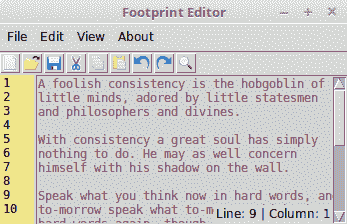

我们打算在文本编辑器中包含以下功能：

+   创建新文档、打开和编辑现有文档以及保存文档

+   实现常见的编辑选项，如剪切、复制、粘贴、撤销和重做

+   在文件中搜索给定的搜索词

+   实现行号显示和隐藏功能

+   实现主题选择功能，让用户可以为编辑器选择自定义颜色主题

+   实现关于和帮助窗口

# 开始使用 – 设置编辑器框架

我们的首要目标是实现文本编辑器的广泛视觉元素。作为程序员，我们所有人都使用过文本编辑器来编辑代码。我们对文本编辑器的常见 GUI 元素大多有所了解。因此，无需多言，让我们开始吧。

第一阶段实现了菜单（Menu）、菜单按钮（Menubutton）、标签（Label）、按钮（Button）、文本（Text）和滚动条（Scrollbar）小部件。尽管我们将在详细内容中涵盖所有这些，但你可能会发现查看 Tkinter 作者 Frederick Lundh 维护的文档中的小部件特定选项很有帮助，该文档位于[`effbot.org/tkinterbook/`](http://effbot.org/tkinterbook/)。你还可以使用如第一章*，遇见 Tkinter*中讨论的交互式 shell。

您可能还想将 Tcl/Tk 的官方文档页面收藏起来，网址为 [`www.tcl.tk/man/tcl8.6/TkCmd/contents.htm`](http://www.tcl.tk/man/tcl8.6/TkCmd/contents.htm)。该网站包含了原始的 Tcl/Tk 参考信息。虽然它与 Python 无关，但它提供了每个小部件的详细概述，是一个有用的参考资料。请记住，Tkinter 只是 Tk 的一个包装器。

在这次迭代中，我们将完成编辑器更广泛视觉元素的实现。

我们将使用`pack()`布局管理器来放置所有小部件。我们选择使用 pack 管理器，因为它非常适合放置小部件，无论是并排还是自上而下的位置。

幸运的是，在文本编辑器中，我们所有的组件都放置在左右两侧或上下位置。因此，使用打包管理器是有益的。我们也可以用网格管理器做同样的事情。

关于代码风格的说明

Python 社区的一个重要洞见是代码的阅读频率远高于其编写频率。遵循良好的命名规范和代码风格的统一是保持程序可读性和可扩展性的关键。我们将努力遵守官方的 Python 风格指南，该指南在 PEP8 文档中指定，网址为 [`www.python.org/dev/peps/pep-0008`](https://www.python.org/dev/peps/pep-0008)。

我们将坚持的一些重要格式规范包括以下内容：

+   每个缩进级别使用四个空格

+   变量和函数名称将采用小写，单词之间用下划线分隔

+   类名将使用`CapWords`约定

让我们从使用以下代码添加顶层窗口开始：

```py
from tkinter import Tk
root = Tk()
# all our code goes here
root.mainloop()
```

注意我们在这里导入 `tkinter` 的方式略有不同。在上一章中，我们使用以下代码导入 `tkinter`：

```py
import tkinter as tk
```

由于我们使用了`tk`作为别名，因此必须将别名名称添加到对 Tkinter 中定义的每个类的调用中，例如`tk.Tk()`、`tk.Frame`、`tk.Button`、`tk.END`等等。

从本章开始，我们将直接导入给定程序所需的单个类。因此，现在我们需要从 Tkinter 导入`Tk()`类，我们将其直接导入到我们的命名空间中，如下所示：

```py
from tkinter import Tk
```

这意味着我们现在可以直接在我们的程序中将它引用为`Tk`类，而不需要像在`root = Tk()`中那样给它添加任何别名。

第三种方法是使用以下命令将 Tkinter 中的所有（`*`）类导入到命名空间中：

```py
from tkinter import *
```

星号符号表示我们希望将`tkinter`库中的所有内容导入到命名空间中，无论我们是否使用它。然而，这种做法是糟糕的编程习惯，因为它会导致命名空间污染。此外，在更大的程序中，很难确定某个类是从哪个模块导入的，这使得调试变得困难。

# 添加菜单和菜单项

菜单提供了一种非常紧凑的方式来向用户展示大量选择，而不会使界面显得杂乱。Tkinter 提供了以下两个小部件来处理菜单：

+   **菜单小部件**：这出现在应用程序的顶部，始终对最终用户可见

+   **菜单项**：当用户点击菜单时显示出来

我们将使用以下代码来添加顶层菜单按钮：

```py
my_menu = Menu(parent, **options)
```

例如，要添加一个“文件”菜单，我们将使用以下代码：

```py
# Adding Menubar in the widget
menu_bar = Menu(root)
file_menu = Menu(menu_bar, tearoff=0)
# all file menu-items will be added here next
menu_bar.add_cascade(label='File', menu=file_menu)
root.config(menu=menu_bar)
```

以下截图是前面代码（`2.01.py`）的结果：

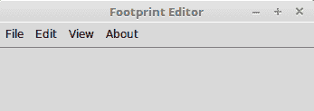

同样，我们将添加编辑、查看和关于菜单（`2.01.py`*）。

我们还将定义一个如下常量：

```py
PROGRAM_NAME = " Footprint Editor "
```

然后，我们将设置根窗口瓷砖，如下所示：

```py
root.title(PROGRAM_NAME)
```

大多数 Linux 平台支持**可撕离菜单**。当`tearoff`设置为`1`（启用）时，菜单选项上方会出现一条虚线。点击虚线允许用户实际上撕离或从顶部分离菜单。然而，由于这不是一个跨平台特性，我们已决定禁用撕离功能，将其标记为`tearoff = 0`。

# 添加菜单项

接下来，我们将在每个单独的菜单中添加菜单项。不出所料，菜单项的代码需要添加到相应的菜单实例中，如下面的截图所示：

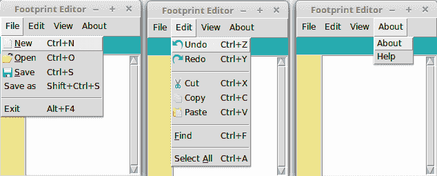

在我们的示例中，我们将向文件、编辑和关于菜单中添加菜单项 (`2.02.py`)。

视图菜单包含某些菜单项变体，这些将在下一节中讨论，因此在此处不予处理。

菜单项是通过使用`add_command()`方法添加的。添加菜单项所使用的格式如下：

```py
my_menu.add_command(label="Menu Item Label", accelerator='KeyBoard Shortcut', compound='left', image=my_image, underline=0, command=callback)
```

例如，您可以通过以下语法创建撤销菜单项：

```py
edit_menu.add_command(label="Undo", accelerator='Ctrl + Z', compound='left', image=undo_icon, command=undo_callback)
```

在前面代码中引入的一些特定菜单选项如下：

+   `加速器`: 此选项用于指定一个字符串，通常是键盘快捷键，可以用来调用菜单。作为`加速器`指定的字符串将出现在菜单项文本旁边。请注意，这并不会自动创建键盘快捷键的绑定。我们还需要手动设置它们。这将在稍后讨论。

+   `compound`: 为菜单项指定`compound`选项可以让您在菜单标签旁边添加图片。例如，`compound='left'`, `label= 'Cut'`, `image=cut_icon`这样的指定意味着剪切图标将出现在“剪切”菜单标签的左侧。我们将在这里使用的图标存储并引用在一个名为`icons`的单独文件夹中。

+   `下划线`: `下划线`选项允许您指定菜单文本中需要加下划线的字符索引。索引从`0`开始，这意味着指定`underline=1`将下划线添加到文本的第二个字符。除了下划线外，Tkinter 还使用它来定义菜单键盘遍历的默认绑定。这意味着我们可以用鼠标指针或使用*Alt* + *下划线索引处的字符*快捷键来选择菜单。

要在文件菜单中添加“新建”菜单项，请使用以下代码：

```py
file_menu.add_command(label="New", accelerator='Ctrl+N', compound='left', image=new_file_icon, underline=0, command=new_file)
```

菜单分隔符

有时，在菜单项中，你会遇到如下代码 `my_menu.add_separator()`。此小部件显示一个分隔条，仅用于将相似菜单项分组，通过水平条分隔各个组。

接下来，我们将添加一个框架小部件来容纳快捷图标。我们还将向左侧添加一个文本小部件来显示行号，如下面的屏幕截图所示 (`2.02.py`):

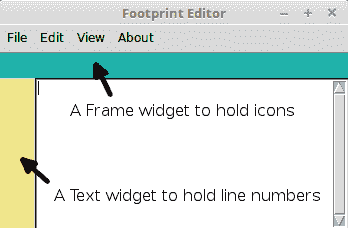

当使用包装布局管理器时，按照它们将出现的顺序添加小部件非常重要，因为`pack()`使用可用空间的概念来适应小部件。这就是为什么文本内容小部件在代码中相对于两个标签小部件会出现在更低的位置。

保留空间后，我们可以在以后添加快捷图标或行号，并将框架小部件作为父小部件。添加框架非常简单；我们以前已经这样做过了。代码如下（参考`2.02.py`）：

```py
shortcut_bar = Frame(root, height=25, background='light sea green')
shortcut_bar.pack(expand='no', fill='x')
line_number_bar = Text(root, width=4, padx=3, takefocus=0, border=0, background='khaki', state='disabled', wrap='none')
line_number_bar.pack(side='left', fill='y')
```

我们已经为这两个小部件应用了背景颜色，目前是为了将它们与 Toplevel 窗口的主体区分开来。

最后，让我们添加主文本小部件和滚动条小部件，如下所示 (`2.02.py`)*:*

```py
content_text = Text(root, wrap='word')
content_text.pack(expand='yes', fill='both')
scroll_bar = Scrollbar(content_text)
content_text.configure(yscrollcommand=scroll_bar.set)
scroll_bar.config(command=content_text.yview)
scroll_bar.pack(side='right', fill='y')
```

代码与我们迄今为止实例化所有其他小部件的方式相似。然而，请注意，滚动条被配置为与 Text 小部件的 `yview` 相关联，而 Text 小部件被配置为连接到滚动条小部件。这样，小部件之间就实现了交叉连接。

现在，当你向下滚动文本小部件时，滚动条会做出反应。或者，当你移动滚动条时，文本小部件会相应地做出反应。

# 实现视图菜单

Tkinter 提供以下三种菜单项类型：

+   **复选框菜单项**：这些选项允许您通过勾选/取消勾选菜单项来做出是/否的选择

+   **单选按钮菜单项**：这些选项允许您从许多不同的选项中选择一个

+   **级联菜单项**：这些菜单项仅展开以显示另一列表选项

以下视图菜单显示了这三种菜单项类型在实际操作中的效果：

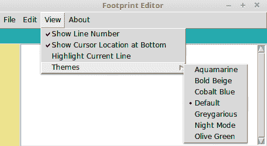

视图菜单中的前三个菜单项允许用户通过勾选或取消勾选它们来做出明确的肯定或否定选择。这些都是复选框菜单的例子。

前一截图中的“主题”菜单项是一个级联菜单的示例。将鼠标悬停在此级联菜单上会简单地打开另一个菜单项列表。然而，我们也可以通过使用`postcommand=callback`选项来绑定一个菜单项。这可以在显示级联菜单项的内容之前管理某些事情，通常用于动态列表创建。

在级联菜单中，您将看到为您的编辑器主题提供的选项列表。然而，您只能选择一个主题。选择一个主题将取消之前的选择。这是一个单选按钮菜单的示例。

我们在此处不会展示完整的代码（请参考代码包中的`2.03.py`代码）。然而，用于添加这三种菜单项的示例代码如下：

```py
view_menu.add_checkbutton(label="Show Line Number", variable=show_line_no)
view_menu.add_cascade(label="Themes", menu=themes_menu)
themes_menu.add_radiobutton(label="Default", variable=theme_name)
```

现在，我们需要通过添加一个变量来跟踪是否已做出选择，这个变量可以是`BooleanVar()`、`IntVar()`或`StringVar()`，正如在第一章*，认识 Tkinter*中讨论的那样。

这标志着我们第一次迭代的结束。在这个迭代中，我们奠定了文本编辑器的大部分视觉元素。现在，是时候给编辑器添加一些功能了。

# 添加内置功能

Tkinter 的 Text 小部件提供了一些方便的内置功能来处理常见的文本相关功能。让我们利用这些功能来实现文本编辑器中的常见特性。

让我们从实现`剪切`、`复制`和`粘贴`功能开始。现在我们已经准备好了编辑器 GUI。如果你打开程序并玩一下文本小部件，你会看到你可以通过使用*Ctrl* + *X*、*Ctrl* + *C*和*Ctrl* + *V*分别来在文本区域执行基本的`剪切`、`复制`和`粘贴`操作。所有这些功能都存在，我们不需要为这些功能添加任何一行代码。

文本小部件显然自带了这些内置事件。现在，我们只需要将这些事件连接到它们各自的菜单项。

Tcl/Tk 通用小部件方法的文档告诉我们，我们可以通过以下命令来触发事件，而不需要外部刺激：

```py
widget.event_generate(sequence, **kw)
```

要触发剪切事件，我们只需要在代码中添加以下这一行：

```py
content_text.event_generate("<<Cut>>")
```

让我们通过使用一个`cut`函数来称呼它，并通过回调命令将其与 Cut 菜单关联（`2.04.py`）：

```py
def cut():
  content_text.event_generate("<<Cut>>")
```

然后，从现有的剪切菜单中定义一个回调命令，如下所示：

```py
edit_menu.add_command(label='Cut', accelerator='Ctrl+X', compound='left', image=cut_icon, command=cut)
```

同样，从各自的菜单项中触发`复制`和`粘贴`功能。

接下来，我们将继续介绍`撤销`和`重做`功能的实现。Tcl/Tk 文本文档告诉我们，只要我们将文本小部件的撤销选项设置为`true`或`1`，文本小部件就具有无限撤销和重做机制。为了利用这个选项，让我们首先将文本小部件的撤销选项设置为`true`或`1`，如下面的代码所示：

```py
content_text = Text(root, wrap='word', undo=1)
```

现在，如果你打开文本编辑器并尝试使用 *Ctrl* + *Z* 来测试 `撤销` 功能，它应该可以正常工作。现在，我们只需要将事件关联到函数，并从撤销菜单中调用这些函数。这与我们为 `剪切`、`复制` 和 `粘贴` 所做的是类似的。请参考 `2.03.py` 中的代码。

然而，`redo` 有一个需要解决的问题的小特性。默认情况下，`redo` 并没有绑定到 *Ctrl* + *Y* 键。相反，*Ctrl* + *Y* 键绑定到了 `paste` 功能。这并不是我们预期的绑定行为，但由于与 Tcl/Tk 相关的一些历史原因，它存在。

幸运的是，通过添加事件绑定，可以轻松覆盖此功能，如下所示：

```py
content_text.bind('<Control-y>', redo) # handling Ctrl + small-case y
content_text.bind('<Control-Y>', redo) # handling Ctrl + upper-case y
```

由于像前面代码中那样的事件绑定会发送一个事件参数，因此 `undo` 函数必须能够处理这个传入的参数。因此，我们将为 `redo` 函数添加一个 `event=None` 可选参数，如下所示 (`2.04.py`):

```py
def redo(event=None):
  content_text.event_generate("<<Redo>>")
  return 'break'
```

事件从操作系统级别传播，并且可以被订阅该事件或希望利用该事件的窗口访问。前一个函数中的`return 'break'`表达式告诉系统它已经处理了该事件，并且不应该进一步传播。

这防止了相同的事件触发`粘贴`事件，即使在 Tkinter 中这是默认行为。现在，*Ctrl* + *Y* 触发的是`重做`事件，而不是触发`粘贴`事件。

事实上，一旦我们完成了一个事件，我们不想它进一步传播。因此，我们将向所有事件驱动函数添加返回`break`。

# 索引和标签

虽然我们设法利用了一些内置功能来获得快速优势，但我们仍需要更多对文本区域的控制，以便我们可以随心所欲地调整它。这需要我们能够精确地针对每个字符或文本位置进行操作。

我们需要知道每个字符、光标或所选区域的精确位置，以便对编辑器中的内容进行任何操作。

文本小部件为我们提供了使用 **索引**、**标签** 和 **标记** 来操作其内容的能力，这些功能使我们能够针对文本区域内的特定位置进行操作。

# 目录

索引可以帮助你在文本中定位特定的位置。例如，如果你想将某个特定的单词加粗、设置为红色或改变字体大小，只要你知道起始点和目标结束点的索引，就可以做到这一点。

索引必须指定为以下格式之一：

| **索引格式** | **描述** |
| --- | --- |
| `x.y` | 这指的是第 `x` 行和第 `y` 列的字符。 |
| `@x,y` | 这指的是覆盖文本窗口内 `x,y` 坐标的字符。 |
| `end` | 这指的是文本的结束。 |
| `mark` | 这指的是命名标记之后的字符。 |
| `tag.first` | 这指的是文本中被给定标签标记的第一个字符。 |
| `tag.last` | 这指的是文本中被给定标签标记的最后一个字符。 |
| `selection` (`SEL_` `FIRST`, `SEL_LAST`) | 这对应于当前的选择。`SEL_FIRST` 和 `SEL_LAST` 常量分别指选择中的起始位置和结束位置。如果没有任何选择，Tkinter 会引发一个 `TclError` 异常。 |
| `window_name` | 这指的是名为 `window_name` 的嵌入式窗口的位置。 |
| `image_name` | 这指的是嵌入图像`image_name`的位置。 |
| `INSERT` | 这指的是插入光标的位置。 |
| `CURRENT` | 这指的是离鼠标指针最近的字符位置。 |

注意这里的一个小细节。在文本小部件中行数的计数从 1 开始，而列数的计数从 0 开始。因此，文本小部件起始位置的索引是 1.0（即行号为 1，列号为 0）。

索引可以通过使用修饰符和子修饰符进行进一步操作。以下是一些修饰符和子修饰符的示例：

+   `end - 1 chars` 或 `end - 1 c`：这指的是位于末尾字符之前的字符索引

+   `插入+5 行`: 这指的是插入光标前方五行的索引

+   `insertwordstart - 1 c`: 这指的是包含插入光标的首个字符之前的一个字符

+   `end linestart`: 这指的是结束行的起始行索引

索引通常用作函数的参数。请参考以下列表以获取一些示例：

+   `my_text.delete`(`1.0`,`END`) : 这意味着你可以从第`1`行，第`0`列删除到文件末尾

+   `my_text.get`(`1.0,` `END`) : 这是从 1.0（开始）到末尾的内容获取

+   `my_text.delete`('`insert-1c`', `INSERT`) : 这将删除插入光标处的字符

# 标签

标签用于使用识别字符串注释文本，然后可以用来操作标记的文本。Tkinter 内置了一个名为 **SEL** 的标签，它会被自动应用到选中的文本上。除了 SEL，您还可以定义自己的标签。一个文本范围可以关联多个标签，同一个标签也可以用于许多不同的文本范围。

这里是一些标签示例：

```py
my_text.tag_add('sel', '1.0', 'end') # add SEL tag from start(1.0) to end
my_text.tag_add('danger', "insert linestart", "insert lineend+1c")
my_text.tag_remove('danger', 1.0, "end")
my_text.tag_config('danger', background=red)
my_text.tag_config('outdated', overstrike=1)
```

您可以使用 `tag_config` 来指定给定标签的视觉样式，使用选项如 `background`（颜色）、`bgstipple`（位图）、`borderwidth`（距离）、`fgstipple`（位图）、`font`（字体）、`foreground`（颜色）、`justify`（常量）、`lmargin1`（距离）、`lmargin2`（距离）、`offset`（距离）、`overstrike`。

(flag), `relief` (常数), `rmargin` (距离), `spacing1` (距离), `tabs` (字符串), `underline` (标志), 和 `wrap` (常数).

要获取关于文本索引和标记的完整参考信息，请在 Python 交互式壳中输入以下命令：

```py
>>> import Tkinter
>>> help(Tkinter.Text)
```

拥有基本的索引和标签理解，让我们在代码编辑器中实现一些更多功能。

# 实现全选功能

我们知道 Tkinter 有一个内置的`sel`标签，它可以应用于给定的文本范围。我们希望将这个标签应用到小部件中的整个文本上。

我们可以简单地定义一个函数来处理这个问题，如下所示 (`2.05.py`):

```py
def select_all(event=None):
  content_text.tag_add('sel', '1.0', 'end')
  return "break"
```

在完成这个操作后，给“全选”菜单项添加一个回调函数：

```py
edit_menu.add_command(label='Select All', underline=7, accelerator='Ctrl+A', command=select_all)
```

我们还需要将功能绑定到 *Ctrl* + *A* 键盘快捷键。我们通过以下键绑定（`2.05.py`）来实现：

```py
content_text.bind('<Control-A>', select_all)
content_text.bind('<Control-a>', select_all)
```

`全选`功能的编码已完成。要尝试使用它，请向文本小部件添加一些文本，然后点击菜单项，`全选`，或使用 *Ctrl* + *A* （快捷键）。

# 实现查找文本功能

接下来，让我们编写`查找文本`功能（`2.05.py`）。以下截图展示了`查找文本`功能的示例：

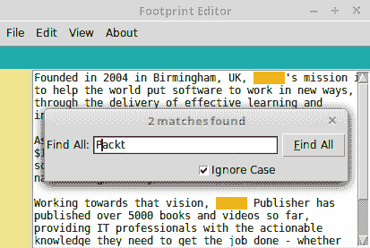

这里是对所需功能的一个简要总结。当用户点击“查找”菜单项时，会打开一个新的顶层窗口。用户输入搜索关键词并指定是否需要区分大小写。当用户点击“查找所有”按钮时，所有匹配项都会被突出显示。

为了在文档中进行搜索，我们依赖于`text_widget.search()`方法。搜索方法接受以下参数：

```py
search(pattern, startindex, stopindex=None, forwards=None, backwards=None, exact=None, regexp=None, nocase=None, count=None)
```

对于编辑器，定义一个名为 `find_text` 的函数，并将其作为回调函数附加到“查找”菜单（`2.05.py`）:

```py
edit_menu.add_command(label='Find',underline= 0, accelerator='Ctrl+F', command=find_text)
```

此外，将其绑定到 *Ctrl* + *F* 快捷键，如下所示：

```py
content_text.bind('<Control-f>', find_text)
content_text.bind('<Control-F>', find_text) 
```

然后，定义`find_text`函数，如下所示（`2.05.py`）：

```py
def find_text(event=None):
    search_toplevel = Toplevel(root)
    search_toplevel.title('Find Text')
    search_toplevel.transient(root)
    Label(search_toplevel, text="Find All:").grid(row=0, 
                                      column=0,sticky='e')
    search_entry_widget = Entry(search_toplevel, width=25)
    search_entry_widget.grid(row=0, column=1, padx=2, pady=2, 
    sticky='we')
    search_entry_widget.focus_set()
    ignore_case_value = IntVar()
    .... more code here to crate checkbox and button 
    def close_search_window():
       content_text.tag_remove('match', '1.0', END)
       search_toplevel.destroy()
       search_toplevel.protocol('WM_DELETE_WINDOW', 
       close_search_window)
       return "break"
```

以下是对前面代码（`2.05.py`）的描述：

+   当用户点击“查找”菜单项时，它会调用一个`find_text`回调函数。

+   `find_text()`函数的前四行创建了一个新的顶层窗口，添加了窗口标题，指定了其几何形状（大小、形状和位置），并将其设置为*临时窗口*。将其设置为临时窗口意味着它始终位于其父窗口或根窗口之上。如果你取消注释这一行并点击根编辑器窗口，查找窗口将会位于根窗口之后。

+   下面的八行代码相当直观；它们设置了查找窗口的控件。它们添加了标签（Label）、输入框（Entry）、按钮（Button）和复选框（Checkbutton）控件，并设置了`search_string`和`ignore_case_value`变量来跟踪用户输入到输入框控件中的值以及用户是否勾选了复选框。控件是通过使用网格几何管理器来排列，以适应查找窗口的。

+   “查找所有”按钮有一个命令选项，该选项调用一个`search_output`函数，将搜索字符串作为第一个参数传递，并将搜索是否需要区分大小写作为第二个参数传递。第三个、第四个和第五个参数将 Toplevel 窗口、Text 小部件和 Entry 小部件作为参数传递。

+   我们重写了查找窗口的关闭按钮，并将其重定向到名为 `close_search()` 的回调函数。`close_search` 函数是在 `find_text` 函数内部定义的。这个函数负责移除在搜索过程中添加的匹配标签。如果我们不重写关闭按钮并移除这些标签，即使搜索结束后，匹配的字符串仍然会继续用红色和黄色标记。

接下来，我们定义`search_output`函数，该函数执行实际的搜索并将匹配标签添加到匹配的文本中。该函数的代码如下：

```py
def search_output(needle, if_ignore_case, content_text,
 search_toplevel, search_box):
 content_text.tag_remove('match', '1.0', END)
 matches_found = 0
 if needle:
   start_pos = '1.0'
   while True:
      start_pos = content_text.search(needle, start_pos,
           nocase=if_ignore_case, stopindex=END)
      if not start_pos:
           break
      end_pos = '{}+{}c'.format(start_pos, len(needle))
      content_text.tag_add('match', start_pos, end_pos)
      matches_found += 1
      start_pos = end_pos
   content_text.tag_config('match', foreground='red', background='yellow')
 search_box.focus_set()
 search_toplevel.title('{} matches found'.format(matches_found))
```

以下是对前面代码的描述：

+   这段代码是`search`函数的核心。它通过使用`while True`循环遍历整个文档，只有当没有更多文本项需要搜索时才会退出循环。

+   代码首先会移除之前搜索相关的匹配标签（如果有），因为我们不希望将新搜索的结果附加到之前的搜索结果上。该函数使用`search()`方法，该方法由 Tkinter 中的 Text 小部件提供。`search()`方法接受以下参数：

```py
      search(pattern, index, stopindex=None, forwards=None,
      backwards=None, exact=None, regexp=None, nocase=None, count=None)
```

+   `search()` 方法返回第一个匹配项的起始位置。我们将其存储在一个名为 `start_pos` 的变量中，计算匹配单词中最后一个字符的位置，并将其存储在 `end_pos` 变量中。

+   对于它找到的每一个搜索匹配项，它都会将匹配标签添加到文本中，范围从第一个位置到最后一个位置。在每次匹配之后，我们将`start_pos`的值设置为等于`end_pos`。这确保了下一次搜索从`end_pos`之后开始。

+   循环还通过使用`count`变量来跟踪匹配的数量。

+   循环外部，标签匹配被配置为红色字体和黄色背景。此函数的最后一行更新了查找窗口的标题，显示找到的匹配数量。

在事件绑定的情况下，输入设备（键盘/鼠标）与您的应用程序之间发生交互。除了事件绑定之外，Tkinter 还支持协议处理。

协议一词指的是您的应用程序与窗口管理器之间的交互。一个协议的例子是 `WM_DELETE_WINDOW`，它处理窗口管理器的关闭窗口事件。

Tkinter 允许您通过指定自己的处理程序来覆盖这些协议处理程序，用于根或 Toplevel 小部件。要覆盖窗口退出协议，我们使用以下命令：

`root.protocol(WM_DELETE_WINDOW, callback)`

一旦添加此命令，Tkinter 将协议处理重定向到指定的回调/处理程序。

# 顶级窗口的类型

在本章之前，我们使用了以下这一行代码：

```py
search_toplevel.transient(root)
```

让我们来探讨这里的意思。Tkinter 支持以下四种类型的 Toplevel 窗口：

+   **主顶层窗口**：这是我们迄今为止一直在构建的类型。

+   **顶级窗口的子窗口**：此类型与根无关。Toplevel 子窗口独立于其根窗口运行，但如果其父窗口被销毁，它也会被销毁。

+   **瞬态顶层窗口**：此窗口始终出现在其父窗口的顶部，但它并不完全占据焦点。再次点击父窗口允许您与之交互。当父窗口最小化时，瞬态窗口将被隐藏，如果父窗口被销毁，瞬态窗口也将被销毁。这与所谓的**模态窗口**进行比较。模态窗口会从父窗口中夺取所有焦点，并要求用户首先关闭模态窗口，然后才能重新访问父窗口。

+   **未装饰的顶层窗口：** 如果一个顶层窗口周围没有窗口管理器的装饰，则称为未装饰的。它通过设置**overrideredirect**标志为`1`来创建。未装饰的窗口不能调整大小或移动。

请参考`2.06.py`代码以演示所有四种类型的 Toplevel 窗口。

这标志着我们的第二次迭代结束。恭喜！我们已经将`全选`和`查找文本`功能编码到我们的程序中。

更重要的是，你已经接触到了索引和标签——这两个与许多 Tkinter 小部件紧密相关的非常强大的概念。你会在你的项目中不断使用这两个概念。

我们还探讨了四种顶级窗口类型及其各自的用途。

# 与表单和对话框一起工作

本迭代的目标是实现文件菜单选项的功能：打开、保存和另存为。

我们可以通过使用标准的 Tkinter 小部件来实现这些对话框。然而，由于这些组件被广泛使用，一个名为 `filedialog` 的特定 Tkinter 模块已经被包含在标准的 Tkinter 发行版中。

这里是一个典型的 `filedialog` 示例：

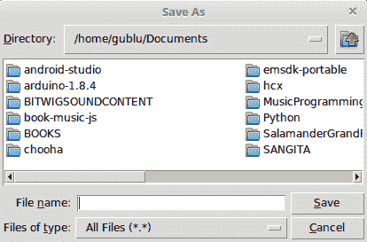

Tkinter 定义了以下关于 `filedialogs` 的常用用例：

| **函数** | **描述** |
| --- | --- |
| `askopenfile` | 这返回打开的文件对象 |
| `askopenfilename` | 这返回文件名字符串，而不是打开的文件对象 |
| `askopenfilenames` | 这将返回一个文件名列表 |
| `askopenfiles` | 这将返回一个打开的文件对象列表，或者如果选择取消则返回一个空列表 |
| `asksaveasfile` | 这个函数用于请求一个保存文件的文件名，并返回打开的文件对象 |
| `asksaveasfilename` | 这个函数用于请求保存文件的文件名，并返回该文件名 |
| `askdirectory` | 这将请求一个目录并返回目录名称 |

使用方法简单。导入`filedialog`模块并调用所需函数。以下是一个示例：

```py
import tkinter.filedialog
```

我们随后使用以下代码调用所需的函数：

```py
file_object = tkinter.filedialog.askopenfile(mode='r')
```

或者，我们使用以下代码：

```py
my_file_name = tkinter.filedialog.askopenfilename()
```

在前面的代码中指定的`mode='r'`选项是可用于对话框的许多可配置选项之一。

你可以为`filedialog`指定以下附加选项：

| **文件对话框** | **可配置选项** |
| --- | --- |
| `askopenfile` (`mode='r'`, `**options**) | `parent`, `title`, `message`, `defaultextension`, `filetypes`, `initialdir`, `initialfile`, and `multiple` |
| `askopenfilename` (`**options**) | `parent`, `title`, `message`, `defaultextension`, `filetypes`, `initialdir`, `initialfile`, 和 `multiple` |
| `asksaveasfile` (`mode='w'`, `**options**) | `parent`, `title`, `message`, `defaultextension`, `filetypes`, `initialdir`, `initialfile`, and `multiple` |
| `asksaveasfilename` (`**options**) | `parent`, `title`, `message`, `defaultextension`, `filetypes`, `initialdir`, `initialfile`, and `multiple` |
| `askdirectory` (`**options**) | `parent`、`title`和`initialdir`必须存在 |

配备了`filedialog`模块的基本理解后，我们现在来看看它的实际应用。我们将从实现文件|打开功能开始。

让我们从导入所需的模块开始，如下所示：

```py
import tkinter.filedialog
import os # for handling file operations
```

接下来，让我们创建一个全局变量，该变量将存储当前打开的文件名，具体如下：

```py
file_name = None
```

全局变量的使用通常被认为是不良的编程实践，因为它很难理解使用大量全局变量的程序。

全局变量可以在程序的许多不同地方进行修改或访问。因此，记住或确定变量的所有可能用途变得困难。

全局变量不受访问控制的限制，在某些情况下可能会带来安全风险，比如说当这个程序需要与第三方代码交互时。

然而，当你使用这种过程式风格的程序工作时，全局变量有时是不可避免的。

编程的另一种方法涉及在类结构（也称为面向对象编程）中编写代码，其中变量只能被预定义类的成员访问。在接下来的章节中，我们将看到许多面向对象编程的示例。

以下代码位于 `open_file` (`2.07.py`) 中：

```py
def open_file(event=None):
   input_file_name = 
     tkinter.filedialog.askopenfilename(defaultextension=".txt", 
       filetypes=[("All Files", "*.*"),("Text Documents", "*.txt")])
   if input_file_name:
     global file_name
     file_name = input_file_name
     root.title('{} - {}'.format(os.path.basename(file_name),PROGRAM_NAME))
     content_text.delete(1.0, END)
     with open(file_name) as _file:
       content_text.insert(1.0, _file.read())
     on_content_changed()
```

修改“打开”菜单，为此新定义的方法添加一个回调命令，具体如下：

```py
file_menu.add_command(label='Open', accelerator='Ctrl+O', compound='left', image=open_file_icon, underline =0, command=open_file)
```

以下是对前面代码的描述：

+   我们在`global`作用域中声明了一个`file_name`变量，用于跟踪打开文件的文件名。这是为了跟踪文件是否已被打开。我们需要在`global`作用域中设置这个变量，因为我们希望这个变量能够被其他方法，如`save()`和`save_as()`所访问。

+   没有将其指定为 `global`，意味着它仅在函数内部可用。因此，`save()` 和 `save_as()` 函数将无法检查编辑器中是否已经打开了文件。

+   我们使用 `askopenfilename` 来获取打开文件的文件名。如果用户取消打开文件或未选择任何文件，返回的 `file_name` 是 `None`。在这种情况下，我们不做任何操作。

+   然而，如果`filedialog`返回一个有效的文件名，我们将使用`os`模块来隔离文件名，并将其添加为根窗口的标题。

+   如果`文本`小部件已经包含了一些文本，我们将删除所有内容。

+   我们随后以读取模式打开给定的文件，并将其内容插入到内容小部件中。

+   我们使用上下文管理器（`with`命令），它会为我们正确关闭文件，即使在发生异常的情况下也是如此。

+   最后，我们将一个命令回调添加到文件 | 打开菜单项。

这完成了“文件 | 打开”的编码。如果你现在导航到“文件 | 打开”，选择一个文本文件，然后点击“打开”，内容区域将填充文本文件的内容。

接下来，我们将看看如何保存文件。保存文件有两个方面：

+   保存

+   另存为

如果内容文本小部件已经包含一个文件，我们不会提示用户输入文件名。我们直接覆盖现有文件的内容。如果文本区域当前的内容没有关联的文件名，我们将通过“另存为”对话框提示用户。此外，如果文本区域有一个打开的文件，并且用户点击“另存为”，我们仍然会提示他们使用“另存为”对话框，以便他们可以将内容写入不同的文件名。

`save` 和 `save_as` 的代码如下 (`2.07.py`):

```py
def save(event=None):
 global file_name
 if not file_name:
    save_as()
 else:
    write_to_file(file_name)
 return "break"

def save_as(event=None):
 input_file_name = tkinter.filedialog.asksaveasfilename
   (defaultextension=".txt", filetypes=[("All Files", "*.*"),
   ("Text Documents", "*.txt")])
 if input_file_name:
     global file_name
     file_name = input_file_name
     write_to_file(file_name)
    root.title('{} - {}'.format(os.path.basename(file_name),PROGRAM_NAME))
 return "break"

def write_to_file(file_name):
    try:
      content = content_text.get(1.0, 'end')
      with open(file_name, 'w') as the_file:
        the_file.write(content)
    except IOError:
      pass  
      # pass for now but we show some warning - we do this in next section
```

定义了`save`和`save_as`函数之后，让我们将它们连接到相应的菜单回调：

```py
file_menu.add_command(label='Save', accelerator='Ctrl+S',  compound='left', image=save_file_icon,underline=0, command= save)
file_menu.add_command(label='Save as',    accelerator='Shift+Ctrl+S', command= save_as)
```

以下是对前面代码的描述：

+   `save`函数首先尝试检查文件是否已打开。如果文件已打开，它将直接用文本区域当前的内容覆盖文件内容。如果没有文件打开，它将直接将工作传递给`save_as`函数。

+   `save_as` 函数通过使用 `asksaveasfilename` 打开一个对话框，并尝试获取用户为指定文件提供的文件名。如果成功，它将以写入模式打开新文件，并将文本内容写入此新文件名下。写入后，它关闭当前文件对象，并将窗口标题更改为反映新文件名。

+   如果用户没有指定文件名或者用户取消了`save_as`操作，它将简单地通过使用 pass 命令忽略该过程。

+   我们添加了一个`write_to_file(file_name)`辅助函数来执行实际的文件写入操作。

当我们着手进行时，让我们完成“文件 | 新建”的功能。代码很简单（`2.07.py`）：

```py
def new_file(event=None):
   root.title("Untitled")
   global file_name
   file_name = None
   content_text.delete(1.0,END) 
```

现在，将一个回调命令添加到这个新功能的文件 | 新菜单项中：

```py
file_menu.add_command(label='New', accelerator='Ctrl+N', compound='left', image=new_file_icon, underline=0, command=new_file)
```

以下是对前面代码的描述：

1.  `new_file` 函数首先将根窗口的标题属性更改为 `Untitled`。

1.  然后将全局`filename`变量的值设置为`None`。这很重要，因为`save`和`save_as`功能使用这个全局变量名来跟踪文件是否已存在或为新的。

1.  该函数随后删除了`Text`小部件的所有内容，并在其位置创建了一个新的文档。

让我们通过添加新创建功能的快捷键来结束这次迭代（`2.07.py`）：

```py
content_text.bind('<Control-N>', new_file)
content_text.bind('<Control-n>', new_file)
content_text.bind('<Control-O>', open_file)
content_text.bind('<Control-o>', open_file)
content_text.bind('<Control-S>', save)
content_text.bind('<Control-s>',save)
```

在这次迭代中，我们实现了“新建”、“打开”、“保存”和“另存为”菜单项的编码功能。更重要的是，我们学习了如何使用`filedialog`模块来实现程序中常用的某些文件功能。我们还探讨了如何使用索引来实现程序的各种任务。

# 与消息框一起工作

现在，让我们完成关于和帮助菜单的代码。功能很简单。当用户点击帮助或关于菜单时，一个消息窗口会弹出并等待用户通过点击按钮进行响应。虽然我们可以轻松地编写新的顶层窗口来显示关于和帮助信息，但我们将使用名为 `messagebox` 的模块来实现这一功能。

`messagebox`模块提供了现成的消息框，用于在应用程序中显示各种消息。通过此模块可用的功能包括`showinfo`、`showwarning`、`showerror`、`askquestion`、`askokcancel`、`askyesno`、`askyesnocancel`和`askretrycancel`，如下截图所示：

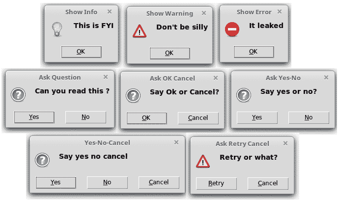

要使用此模块，我们只需使用以下命令将其导入当前命名空间：

```py
import tkinter.messagebox 
```

在代码包中的`2.08.py`文件提供了一个`messagebox`常用函数的演示。以下是一些常见的使用模式：

```py
 import tkinter.messagebox as tmb
 tmb.showinfo(title="Show Info", message="This is FYI")
 tmb.showwarning(title="Show Warning", message="Don't be silly")
 tmb.showerror(title="Show Error", message="It leaked")
 tmb.askquestion(title="Ask Question", message="Can you read this?")
 tmb.askokcancel(title="Ask OK Cancel", message="Say Ok or Cancel?")
 tmb.askyesno(title="Ask Yes-No", message="Say yes or no?")
 tmb.askyesnocancel(title="Yes-No-Cancel", message="Say yes no cancel")
 tmb.askretrycancel(title="Ask Retry Cancel", message="Retry or what?")
```

了解了`messagebox`模块后，让我们为代码编辑器编写`about`和`help`函数。功能很简单。当用户点击“关于”或“帮助”菜单项时，会弹出一个`showinfomessagebox`。

要实现这一点，请在编辑器中包含以下代码（`2.09.py`）：

```py
def display_about_messagebox(event=None):
     tkinter.messagebox.showinfo("About", "{}{}".format(PROGRAM_NAME,                     
       "\nTkinter GUI Application\n Development Blueprints"))

def display_help_messagebox(event=None):
     tkinter.messagebox.showinfo("Help", "Help Book: \nTkinter GUI                           
       Application\n Development Blueprints", icon='question')
```

然后，按照以下方式将这些功能附加到相应的菜单项上：

```py
about_menu.add_command(label='About', command=display_about_messagebox)
about_menu.add_command(label='Help', command=display_help_messagebox)
```

接下来，我们将添加退出确认功能。理想情况下，我们应该在文本内容被修改的情况下实现文件保存，但为了简化，我没有在这里加入那个逻辑，而是显示一个提示，让用户决定程序应该关闭还是保持打开。因此，当用户点击文件 | 退出时，它会弹出一个确定-取消对话框来确认退出操作：

```py
def exit_editor(event=None):
       if tkinter.messagebox.askokcancel("Quit?", "Really quit?"):
            root.destroy() 
```

然后，我们覆盖了关闭按钮，并将其重定向到我们之前定义的`exit_editor`函数，如下所示：

```py
root.protocol('WM_DELETE_WINDOW', exit_editor)
```

然后，我们为所有单个菜单项添加一个回调命令，如下所示：

```py
file_menu.add_command(label='Exit', accelerator='Alt+F4', command= exit_editor)
about_menu.add_command(label='About', command = display_about_messagebox)
about_menu.add_command(label='Help', command = display_help_messagebox)
```

最后，添加用于显示帮助的快捷键绑定：

```py
content_text.bind('<KeyPress-F1>', display_help_messagebox) 
```

这完成了迭代。

# 图标工具栏和查看菜单功能

在这次迭代中，我们将向文本编辑器添加以下功能：

+   在工具栏上显示快捷图标

+   显示行号

+   高亮当前行

+   更改编辑器的颜色主题

让我们先从一项简单的任务开始。在这个步骤中，我们将向工具栏添加快捷图标，如下面的截图所示：

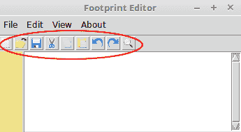

你可能还记得我们已经创建了一个框架来存放这些图标。现在让我们添加这些图标吧。

在添加这些图标时，我们遵循了一个约定。图标的命名与处理它们相应的功能完全一致。遵循这一约定使我们能够遍历一个列表，同时将图标图像应用到每个按钮上，并在循环内部添加命令回调。所有图标都已放置在图标文件夹中。

以下代码为工具栏添加图标（`2.10.py`）：

```py
icons = ('new_file', 'open_file', 'save', 'cut', 'copy', 'paste', 'undo', 'redo', 'find_text')
for i, icon in enumerate(icons):
   tool_bar_icon = PhotoImage(file='icons/{}.gif'.format(icon))
   cmd = eval(icon)
   tool_bar = Button(shortcut_bar, image=tool_bar_icon, command=cmd)
   tool_bar.image = tool_bar_icon
   tool_bar.pack(side='left')
```

以下是对前面代码的描述：

+   我们已经在第一次迭代中创建了一个快捷栏。现在，我们将在框架中简单地添加带有图像的按钮。

+   我们创建一个图标列表，并确保它们的名称与图标名称完全一致。

+   我们随后通过创建一个按钮小部件，将图片添加到按钮中，并添加相应的回调命令来遍历列表。

+   在添加回调命令之前，我们必须使用`eval`命令将字符串转换为等效的表达式。如果我们不使用`eval`，则不能将其作为表达式应用于回调命令。

因此，我们在快捷栏中添加了快捷图标。现在，如果您运行代码（参考代码包中的`2.10.py`），它应该会显示所有快捷图标。此外，因为我们已经将每个按钮链接到其回调函数，所以所有这些快捷图标都应该可以正常工作。

# 显示行号

让我们努力实现显示文本小部件左侧的行号。这需要我们在代码的多个地方进行微调。因此，在我们开始编码之前，让我们看看我们试图实现的目标。

“查看”菜单中有一个菜单项允许用户选择是否显示行号。我们只想在选中该选项时显示行号，如下面的截图所示：

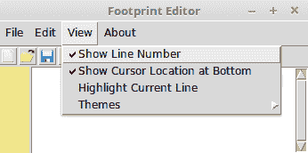

如果选择了该选项，我们需要在之前创建的左侧框架中显示行号。

行号应在用户每次输入新行、删除行、剪切或粘贴行文本、执行撤销或重做操作、打开现有文件或点击“新建”菜单项时更新。简而言之，每次活动导致内容发生变化后，行号都应该更新。因此，我们需要定义一个名为 `on_content_changed()` 的函数。这个函数应该在定义每个 `press`、`cut`、`paste`、`undo`、`redo`、`new` 和 `open` 键之后调用，以检查文本区域中是否添加或删除了行，并相应地更新行号。

我们通过以下两种策略实现这一点（参考代码包中的`2.10.py`）：

```py
def on_content_changed(event=None):
     update_line_numbers() 
```

将按键事件绑定到`update_line_number()`函数，如下所示：

```py
content_text.bind('<Any-KeyPress>', on_content_changed) 
```

接下来，在每个`cut`、`paste`、`undo`、`redo`、`new`和`open`的定义中添加对`on_content_changed()`函数的调用。

然后定义一个`get_line_numbers()`函数，该函数返回一个包含所有行号（直到最后一行）的字符串，行号之间用换行符分隔。

例如，如果内容小部件中的最后一行非空是`5`，这个函数就会返回一个`1 /n 2 /n 3 /n 4/n 5 /n`格式的字符串。

以下为函数定义：

```py
def get_line_numbers():
  output = ''
  if show_line_number.get():
    row, col = content_text.index("end").split('.')
    for i in range(1, int(row)):
      output += str(i)+ '\n'
  return output 
```

现在，让我们定义`update_line_numbers()`函数，该函数简单地使用前一个函数的字符串输出更新显示行的文本小部件：

```py
def update_line_numbers(event = None):
   line_numbers = get_line_numbers()
   line_number_bar.config(state='normal')
   line_number_bar.delete('1.0', 'end')
   line_number_bar.insert('1.0', line_numbers)
   line_number_bar.config(state='disabled')
```

以下是对前面代码的描述：

+   你可能记得我们之前将一个`show_line_number`变量分配给了菜单项：

    `show_line_number = IntVar()`

    `show_line_number.set(1)`

    `view_menu.add_checkbutton(label="显示行号", variable=show_line_number)`

+   如果将`show_line_number`选项设置为`1`（即，在菜单项中已勾选），我们将计算文本中的最后一行和最后一列。

+   我们随后创建一个由数字`1`至最后一行的行数组成的文本字符串，每个数字之间用换行符（`\n`）分隔。然后使用`line_number_bar.config()`方法将这个字符串添加到左侧标签中。

+   如果菜单中未勾选“显示行号”，变量文本将保持空白，因此不会显示行号。

+   最后，我们将之前定义的每个`cut`、`paste`、`undo`、`redo`、`new`和`open`函数更新为在其末尾调用`on_content_changed()`函数。

我们已经完成了在文本编辑器中添加行号功能的工作。然而，我想补充一点，尽管这个实现很简单，但在处理自动换行和字体大小变化方面存在一些局限性。一个万无一失的行号解决方案需要使用 Canvas 小部件——这是我们将在第四章“棋盘游戏”及其之后讨论的内容。同时，如果你对此感兴趣，可以查看一个基于 Canvas 的示例实现，链接为[`stackoverflow.com/a/16375233/2348704`](https://stackoverflow.com/a/16375233/2348704)。

最后，在这个迭代中，我们将实现一个功能，用户可以选择高亮显示当前行（`2.10.py`）。

这个想法很简单。我们需要定位光标所在的行，并给该行添加一个标签。我们还需要配置这个标签，使其以不同颜色的背景显示，以便突出显示。

你可能还记得，我们已经为用户提供了一个菜单选项来决定是否突出显示当前行。现在，我们将从这个菜单项添加一个回调命令到我们将定义的`toggle_highlight`函数：

```py
to_highlight_line = BooleanVar()
view_menu.add_checkbutton(label='Highlight Current Line', onvalue=1, offvalue=0,     variable=to_highlight_line, command=toggle_highlight)
```

现在，我们定义了三个函数来帮我们处理这个问题：

```py
def highlight_line(interval=100):
   content_text.tag_remove("active_line", 1.0, "end")
   content_text.tag_add("active_line", 
                     "insert linestart", "insert lineend+1c")                                                                               
   content_text.after(interval, toggle_highlight)

def undo_highlight():
   content_text.tag_remove("active_line", 1.0, "end")

def toggle_highlight(event=None):
   if to_highlight_line.get():
      highlight_line()
    else:
      undo_highlight()

```

以下是对前面代码的描述：

+   每次用户勾选/取消勾选“视图 | 高亮当前行”，都会调用`toggle_highlight`函数。此函数检查菜单项是否被勾选。如果被勾选，它将调用`highlight_line`函数。否则，如果菜单项未被勾选，它将调用`undo_highlight`函数。

+   `highlight_line` 函数简单地将一个名为 `active_line` 的标签添加到当前行，并且每隔 100 毫秒调用一次 `toggle_highlight` 函数来检查当前行是否仍然需要高亮显示。

+   当用户在视图菜单中取消勾选高亮时，会调用`undo_highlight`函数。一旦调用，它将简单地从整个文本区域中移除`active_line`标签。

最后，我们可以配置名为 `active_line` 的标签，使其以不同的背景色显示，如下所示：

```py
content_text.tag_configure('active_line', background='ivory2')
```

我们在代码中使用了`.widget.after(ms, callback)`处理器。

允许我们执行某些周期性操作的方法被称为闹钟处理器。以下是一些常用的 Tkinter 闹钟处理器：

• `after(delay_ms, callback, args...)`: 这将注册一个回调闹钟，可以在给定数量的毫秒数后调用。

• `after_cancel(id)`: 这将取消指定的回调闹钟。

# 添加光标信息栏

光标信息栏简单地说是位于文本组件右下角的一个小标签，用于显示光标当前的位置，如下面的截图所示：

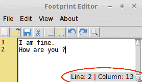

用户可以选择从查看菜单中显示/隐藏此信息栏（`2.11.py`）。

首先在文本小部件内创建一个标签小部件，并将其打包到右下角，具体操作如下：

```py
cursor_info_bar = Label(content_text, text='Line: 1 | Column: 1')
cursor_info_bar.pack(expand=NO, fill=None, side=RIGHT, anchor='se')
```

在许多方面，这类似于显示行号。在这里，同样需要在每次按键后、在诸如`剪切`、`粘贴`、`撤销`、`重做`、`新建`和`打开`等事件之后，或者导致光标位置改变的活动之后计算位置。因为这也需要更新所有更改的内容，对于每一次按键，我们将更新`on_content_changed`来更新这一点，如下所示：

```py
def on_content_changed(event=None):
 update_line_numbers()
 update_cursor_info_bar()

def show_cursor_info_bar():
 show_cursor_info_checked = show_cursor_info.get()
 if show_cursor_info_checked:
   cursor_info_bar.pack(expand='no', fill=None, side='right', anchor='se')
 else:
   cursor_info_bar.pack_forget()

def update_cursor_info_bar(event=None):
 row, col = content_text.index(INSERT).split('.')
 line_num, col_num = str(int(row)), str(int(col)+1) # col starts at 0
 infotext = "Line: {0} | Column: {1}".format(line_num, col_num)
 cursor_info_bar.config(text=infotext)
```

代码很简单。我们通过使用`index(INSERT)`方法获取当前光标位置的行和列，并用光标最新的行和列更新标签。

最后，通过使用回调命令将函数连接到现有的菜单项：

```py
view_menu.add_checkbutton(label='Show Cursor Location at Bottom',
                 variable=show_cursor_info, command=show_cursor_info_bar)
```

# 添加主题

你可能记得，在定义主题菜单时，我们定义了一个包含名称和十六进制颜色代码作为键值对的配色方案字典，如下所示：

```py
color_schemes = {
'Default': '#000000.#FFFFFF',
'Greygarious':'#83406A.#D1D4D1',
'Aquamarine': '#5B8340.#D1E7E0',
'Bold Beige': '#4B4620.#FFF0E1',
'Cobalt Blue':'#ffffBB.#3333aa',
'Olive Green': '#D1E7E0.#5B8340',
'Night Mode': '#FFFFFF.#000000',
}
```

主题选择菜单已经定义好了。让我们添加一个回调命令来处理选中的菜单（`2.12.py`）：

`themes_menu.add_radiobutton(label=k, variable=theme_choice, command=change_theme)`

最后，让我们定义一个`change_theme`函数来处理主题的切换，具体如下：

```py
def change_theme(event=None):
   selected_theme = theme_choice.get()
   fg_bg_colors = color_schemes.get(selected_theme)
   foreground_color, background_color = fg_bg_colors.split('.')
   content_text.config(background=background_color, fg=foreground_color)
```

函数很简单。它从定义的颜色方案字典中提取键值对。它将颜色分成其两个组成部分，并使用`widget.config()`将每种颜色分别应用于文本小部件的前景和背景。

现在，如果您从主题菜单中选择不同的颜色，背景和前景颜色将相应地改变。

这完成了迭代。我们在这个迭代中完成了快捷图标工具栏和视图菜单功能的编码。在这个过程中，我们学习了如何处理`Checkbutton`和`Radiobutton`菜单项。我们还查看了一下如何创建复合按钮，同时强化了之前章节中提到的几个 Tkinter 选项。

# 创建上下文/弹出式菜单

让我们在这次最后的迭代中通过添加到编辑器的上下文菜单来完善编辑器 (*`2.12.py`)*，如图下截图所示：

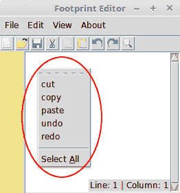

在光标位置右键点击弹出的菜单被称为**上下文菜单**或**弹出菜单**。

让我们在文本编辑器中编写这个功能。首先，定义上下文菜单，如下所示：

```py
popup_menu = Menu(content_text)
for i in ('cut', 'copy', 'paste', 'undo', 'redo'):
      cmd = eval(i)
     popup_menu.add_command(label=i, compound='left', command=cmd)
     popup_menu.add_separator()
popup_menu.add_command(label='Select All',underline=7, command=select_all)
```

然后，将鼠标的右键与名为`show_popup_menu`的回调函数绑定，具体操作如下：

```py
content_text.bind('<Button-3>', show_popup_menu)
```

最后，按照以下方式定义`show_popup_menu`函数：

```py
def show_popup_menu(event):
  popup_menu.tk_popup(event.x_root, event.y_root)
```

您现在可以在编辑器中的文本小部件的任何位置右键单击以打开上下文菜单。

这标志着迭代以及章节的结束。

# 摘要

在本章中，我们涵盖了以下要点：

+   我们在十二次迭代中完成了编辑器的编码。我们首先将所有小部件放置在顶层窗口中。

+   我们随后利用文本小部件的一些内置功能来编写一些功能。

+   我们学习了索引和标签的重要概念。

+   我们还学习了如何使用`filedialog`和`messagebox`模块来快速编写程序中的一些常见功能。

恭喜！你已经完成了文本编辑器的编码。在下一章中，我们将制作一个可编程的鼓机。

# QA 部分

这里有一些问题供您思考：

+   检查按钮菜单项和单选按钮菜单项之间有什么区别？

+   缪斯菜单按钮是用来做什么的？

+   识别不同类型的顶层窗口。

+   列出 Tkinter 中可用的不同类型的 `filedialogs` 和消息框。

+   我们使用了包装几何管理器来构建这个文本编辑器。我们能否使用网格几何管理器来构建？网格几何管理器与包装几何管理器相比会表现如何？

+   我们如何在 Tkinter 中触发事件而不需要外部刺激？

+   菜单项中的加速器选项是什么？

+   什么是瞬态窗口？

# 进一步阅读

`filedialog`模块的源代码可以在 Tkinter 源代码中找到一个名为`filedialog.py`的单独文件中。我们鼓励您查看其实现方式。

如果你喜欢冒险并且想要进一步探索文本编辑器程序，我鼓励你查看 Python 内置编辑器 IDLE 的源代码，它使用 Tkinter 编写。IDLE 的源代码可以在你的本地 Python 库目录中的`idlelib`文件夹中找到。在 Linux Mint 上，它位于`/usr/lib/python3.4/idlelib`。

阅读官方的 Python 风格指南，该指南在 PEP8 文档中指定，网址为 [`www.python.org/dev/peps/pep-0008`](https://www.python.org/dev/peps/pep-0008).

如果您喜欢，可以尝试在文本编辑器中实现 Python 代码的语法高亮。一个简单的实现首先需要定义一个关键字列表。然后我们可以将 `<KeyRelease>` 事件绑定到检查输入的单词是否是关键字之一。接着，我们可以使用 `tag_add` 为单词添加一个自定义标签。最后，我们可以通过使用如 `textarea.tag_config("the_keyword_tag", foreground="blue")` 这样的代码来改变其颜色。

一个稍微高级一些的想法，即**懒加载**，值得阅读并实施。这在你想在文本编辑器中打开一个非常大的文件时尤其有用。在当前实现中，打开一个非常大的文件可能需要非常长的时间。相比之下，懒加载只会读取文本编辑器中当前可见的文件部分，从而使程序响应更快。
