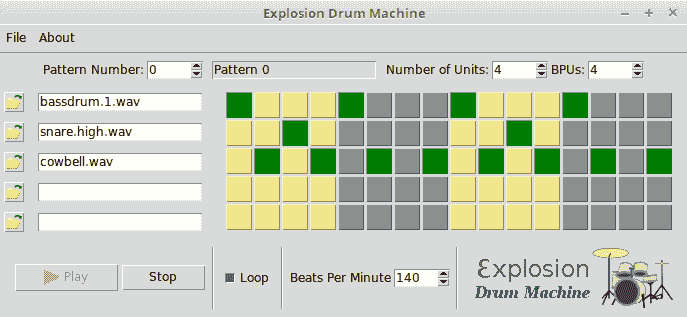
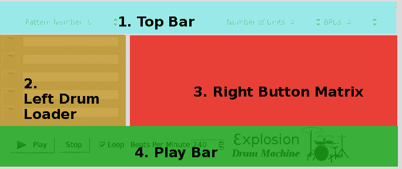
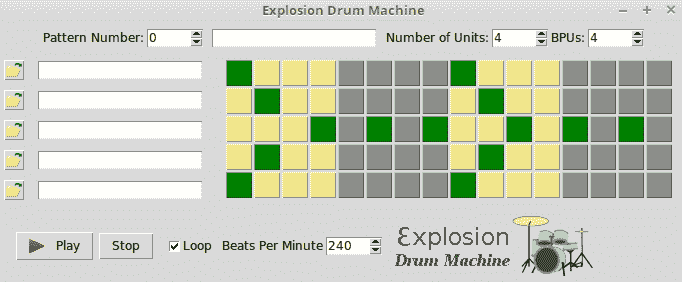
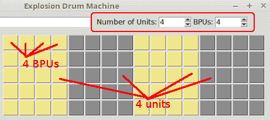
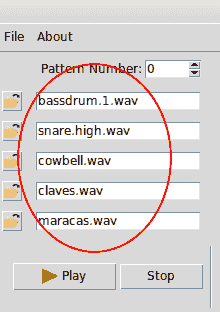
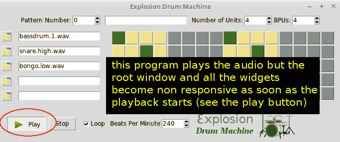
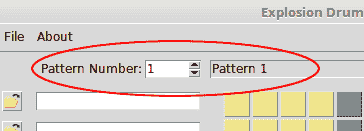
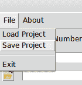
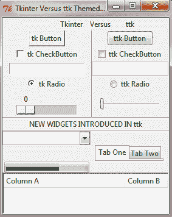
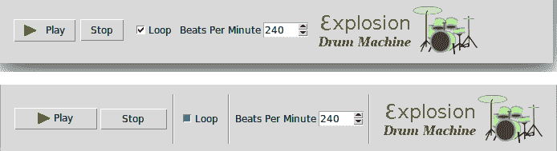

# 第三章：可编程鼓机

我们在第二章“制作文本编辑器”中探讨了几个常见的 Tkinter 小部件，例如菜单、按钮、标签和文本。现在，让我们扩展我们对 Tkinter 的经验，来制作一些音乐。让我们使用 Tkinter 和一些其他 Python 模块构建一个跨平台的鼓机。

本章的一些关键目标包括：

+   学习以**面向对象**的风格结构 Tkinter 程序

+   深入了解几个更多的 Tkinter 小部件，例如 Spinbox、Button、Entry 和 Checkbutton

+   在实际项目中应用网格几何管理器

+   理解选择合适的**数据结构**对我们程序的重要性

+   学习将**高阶回调函数**绑定到小部件

+   学习如何结合一些标准和第三方模块使用 Tkinter

+   理解**多线程**的必要性以及如何编写多线程应用程序

+   学习关于**对象序列化**或**pickle**

+   学习 **ttk 小部件**

# 入门

我们的目标是构建一个可编程的鼓机。让我们称它为`爆炸鼓机`。

鼓机允许用户使用无限数量的鼓样本创建无限数量的节奏模式。然后您可以在项目中存储多个 riff，并在稍后回放或编辑该项目。在最终形态下，鼓机将看起来像以下截图：



要创建自己的鼓点节奏模式，只需使用左侧的按钮加载一些鼓样本（可以是任何具有`.wav`或`.ogg`扩展名的音频文件）。您可以通过点击右侧的按钮来设计您的鼓点节奏。

您可以决定每个单位**节拍数**（**BPU**）。大多数西方节拍有 4 BPU，华尔兹有 3 BPU，而我在这台机器上创作的某些印度和阿拉伯节奏则有 3-16 BPU！您还可以更改**每分钟节拍数（BPM**），这反过来又决定了节奏的速度。

如前一张截图所示，单个模式构成一个单独的节拍模式。您可以通过更改顶部左侧的“模式编号”微调部件来设计多个节拍模式。

一旦你制作了一些节奏模式，你甚至可以保存这个模式，稍后重新播放或修改它。保存和重新加载文件的操作都通过顶部的文件菜单完成。

在`Loops`子目录中提供了一些鼓样本；然而，您可以加载任何其他鼓样本。您可以从互联网上免费下载大量样本。

# 技术要求

我们将在本章中使用一些来自标准 Python 分发的更多内置库。这包括`tkinter`、`os`、`math`、`threading`和`pickle`模块。

为了验证这些模块是否存在，只需在您的 Python3 IDLE 交互式提示符中运行以下语句：

```py
 >>> import tkinter, os, math, time, threading, pickle 
```

这不应该导致错误，因为 Python3 将这些模块内置到了发行版中。

除了这个，你还需要添加一个名为 `pygame` 的额外 Python 模块。我们将使用名为 1.9.3 的软件包版本，可以在 [`www.pygame.org/download.shtml`](http://www.pygame.org/download.shtml) 下载。

Linux 用户可能还需要查看以下页面以获取将`pygame`与 Python 3.x 一起工作的说明：[`www.pygame.org/wiki/CompileUbuntu?parent=Compilation`](http://www.pygame.org/wiki/CompileUbuntu?parent=Compilation).

`pygame` 是一个跨平台包，通常用于使用 Python 制作游戏。然而，我们只会使用该包中的一个名为 `pygame.mixer` 的小模块，该模块用于加载和播放声音。该模块的 API 文档可以在 [`www.pygame.org/docs/ref/mixer.html`](http://www.pygame.org/docs/ref/mixer.html) 找到。

在您安装了该模块之后，您可以通过导入它来验证它：

```py
>>> import pygame
>>> pygame.version.ver 
```

如果没有错误报告，并且版本输出为 1.9.3，你就可以开始编程鼓机了。让我们开始吧！

# 在面向对象编程（OOP）中设置 GUI

在上一章中我们开发的文本编辑器是使用过程式代码实现的。尽管它为快速编码提供了一些好处，但它也有一些典型的局限性：

+   我们开始遇到全局变量

+   需要在调用它们的代码上方定义所需的功能定义

+   最重要的是，代码不可重用

因此，我们需要某种方法来确保我们的代码是可重用的。这就是为什么程序员更倾向于使用**面向对象编程**（**OOP**）来组织他们的代码成类。

面向对象编程（OOP）是一种编程范式，它将焦点转移到我们想要操作的对象上，而不是操作它们的逻辑。这与过程式编程形成对比，后者将程序视为一个逻辑过程，它接受输入，处理它，并产生一些输出。

面向对象编程提供了多个好处，例如**数据抽象**、**封装**、**继承**和**多态**。此外，面向对象编程为程序提供了一个清晰的**模块结构**。代码修改和维护变得容易，因为可以创建新的对象而不需要修改现有的对象。

让我们使用面向对象编程（OOP）来构建我们的鼓程序，以此展示一些这些特性。我们的鼓程序的一个指示性 OOP 结构可能如下所示（代码`3.01.py`）：

```py
from tkinter import Tk

PROGRAM_NAME = ' Explosion Drum Machine '

class DrumMachine:

    def __init__(self, root):
        self.root = root
        self.root.title(PROGRAM_NAME)

if __name__ == '__main__':
    root = Tk()
    DrumMachine(root)
    root.mainloop()
```

代码的描述如下：

+   我们创建了一个名为 `DrumMachine` 的类结构，并将其作为参数传递给 Toplevel 窗口进行初始化

+   如果脚本作为独立程序运行，即`if __name__ == '__main__'`，则会创建一个新的`Tk()`根对象，并将根窗口作为参数传递给`DrumMachine`对象

+   我们随后从`DrumMachine`类中初始化一个对象以获取一个顶层窗口

现在我们已经准备好了顶层窗口，让我们停止添加任何更多的视觉元素，并思考一些对我们程序最终效果至关重要的因素。让我们花些时间确定我们程序的数据结构。

# 确定数据结构

如 Linux 的开发者林纳斯·托瓦兹（Linus Torvalds）曾说过：

"糟糕的程序员担心代码。优秀的程序员担心数据结构和它们之间的关系。"

他所说的意思是，设计良好的数据结构使得代码非常容易设计、维护和扩展。相比之下，如果你从一个糟糕的数据结构开始，即使代码再好也无法弥补这一点。

从一个良好的数据结构开始，你的代码自然会变得更加简单、优雅且易于维护。

有了这个想法，让我们尝试决定为我们程序选择一个合适的数据结构。回顾一下之前的截图（在*入门*部分）。你认为需要哪种数据结构来捕捉所有必要的信息字段？

好的，首先我们的鼓机需要保存有关节拍模式的资料。所以，让我们先创建一个名为 `all_patterns = []` 的列表。

现在，列表中的每个模式都需要捕获与该模式相关的鼓文件信息：模式中的单元数量、模式的 BPU、BPM 以及形成模式的按钮点击。

因此，我们需要设计一种数据结构，其中`all_patterns`是一个列表，其中每个项目代表一个单独的模式。每个模式随后由一个字典表示，如下所示：

```py
{
 'list_of_drum_files': a list of location of audio drum files,
 'number_of_units': an integer, 'bpu': an integer,
 'beats_per_minute' : an integer,'button_clicked_list' : a 2
 dimensional list of boolean values where True means button is
 clicked and false means button is not clicked in the pattern
 }

```

对于我们的鼓机，熟悉前面的数据结构定义非常重要。请注意，仅凭这些数据，我们就可以定义逻辑来显示最终鼓机中显示的所有内容。

还要注意，这个数据结构不包含任何 GUI 元素的信息，例如小部件信息或小部件状态。在尽可能的情况下，我们应该始终努力将后端（程序逻辑）的数据与前端（用户界面）相关的数据干净地分开。我们这里的数据结构仅仅代表后端，但足够让我们安排出确定我们前端逻辑的布局。

前面的数据结构是我认为对现有数据的一个良好表示。可能存在一个同样有效但完全不同的数据表示。关于数据表示的问题没有唯一的*正确答案*。然而，围绕语言内置集合构建表示使我们能够使用高度优化的代码，这通常是一个好主意。数据结构的选择直接影响到应用程序的性能——有时是微不足道的，但在其他时候则非常严重。

我们相应地修改了我们的代码（见代码`3.02.py`）以初始化此数据结构：

```py
    def init_all_patterns(self):
        self.all_patterns = [
            {
                'list_of_drum_files': [None] * MAX_NUMBER_OF_DRUM_SAMPLES,
                'number_of_units': INITIAL_NUMBER_OF_UNITS,
                'bpu': INITIAL_BPU,
                'is_button_clicked_list':
                self.init_is_button_clicked_list(
                    MAX_NUMBER_OF_DRUM_SAMPLES,
                    INITIAL_NUMBER_OF_UNITS * INITIAL_BPU
                )
            }
            for k in range(MAX_NUMBER_OF_PATTERNS)]
```

我们还将 `is_button_clicked_list` 初始化为所有值都设置为 `False`，如下所示：

```py
    def init_is_button_clicked_list(self, num_of_rows, num_of_columns):
        return [[False] * num_of_columns for x in range(num_of_rows)]
```

为了支持这个结构，我们定义了一些常量（参见代码`3.02.py`）：

```py
MAX_NUMBER_OF_PATTERNS = 10
MAX_NUMBER_OF_DRUM_SAMPLES = 5
INITIAL_NUMBER_OF_UNITS = 4
INITIAL_BPU = 4
INITIAL_BEATS_PER_MINUTE = 240
```

现在，如果你运行这个程序，你将只看到一个根窗口——与之前的代码没有任何不同。但我们的代码在内部正在为构建逻辑所需的所有数据保留内存。我们已经为程序的运行打下了坚实的基础。信不信由你，我们已经完成了一半的工作。

# 创建更广泛的视觉元素

接下来，让我们梳理我们程序更广泛的视觉元素。为了模块化，我们将程序划分为四个广泛的视觉部分，如下所示图解：



让我们定义一个名为 `init_gui()` 的方法，该方法在 `__init__` 方法内部被调用，如下所示（参见代码 `3.03.py`）：

```py
def init_gui(self):
   self.create_top_bar()
   self.create_left_drum_loader()
   self.create_right_button_matrix()
   self.create_play_bar()
```

我们接下来定义这四种方法（`3.03.py`）。由于我们在前面的章节中已经进行过类似的编码，所以这里不讨论代码。

我们从**顶部栏**部分开始。顶部栏很简单。它包含几个标签，三个旋转框（Spinboxes），以及一个输入框（Entry widget）。我们在这里不会展示完整的代码（见代码`3.03.py`），因为我们已经在之前的章节中多次看到了创建标签和输入框的示例。对于`Spinbox`，选项的指定如下：

```py
Spinbox(frame, from_=1, to=MAX_BPU, width=5,command=self.on_bpu_changed).grid(row=0, column=7)
```

我们相应地设置了类级别属性：

```py
 self.beats_per_minute = INITIAL_BEATS_PER_MINUTE
 self.current_pattern_index = 0
```

由于我们将允许设计多个模式，我们需要跟踪当前显示或激活的模式。`self.current_pattern_index` 属性用于跟踪当前激活的模式。

接下来，让我们编写`create_left_drum_loader()`方法。这同样非常直观。我们创建一个循环（参见`code 3.03.py`）：

```py
for i in range (MAX_NUMBER_OF_DRUM_SAMPLES):
    # create compound button here
    # create entry widgets here and keep reference to each entry widget in
    #a list for future update of values
```

在我们继续编写 `create_right_button_matrix()` 方法之前，让我们先完成 `create_play_bar()` 方法的编码，因为它比另一个简单。它只包含两个按钮、一个复选框、一个微调框和一个图像。我们在书中之前已经编码过类似的控件，所以我会留给你自己探索（参见代码 `3.03.py`）。

接下来，让我们编写`create_right_button_matrix()`方法。这是所有方法中最复杂的。

**正确按钮矩阵**由行和列组成的二维数组。矩阵中的行数等于常数`MAX_NUMBER_OF_DRUM_SAMPLES`，列数代表每个周期内的节拍单位数量，通过将单位数量和每个单位节拍数相乘得到。

创建按钮矩阵的代码看起来是这样的（参见代码`3.03.py`）：

```py
self.buttons = [[None for x in range(self.find_number_of_columns())] for x in range(MAX_NUMBER_OF_DRUM_SAMPLES)]
for row in range(MAX_NUMBER_OF_DRUM_SAMPLES):
    for col in range(self.find_number_of_columns()):
        self.buttons[row][col] = Button(right_frame,
                 command=self.on_button_clicked(row, col))
        self.buttons[row][col].grid(row=row, column=col)
        self.display_button_color(row, col)
```

`find_number_of_columns()` 方法的相关代码如下：

```py
    def find_number_of_columns(self):
        return int(self.number_of_units_widget.get()) * 
          int(self.bpu_widget.get())
```

我们已经创建了按钮矩阵，但希望按钮以两种交替的色调着色。因此，我们定义了两个常量：

```py
COLOR_1 = 'grey55'
COLOR_2 = 'khaki'
```

这可以是任何十六进制颜色代码，也可以是 Tkinter 预定义颜色列表中的任何颜色。我们还需要一个第三种颜色来表示按钮的按下状态。

常量 `BUTTON_CLICKED_COLOR = 'green'` 负责处理这一点。

我们随后定义两种方法：

```py
def display_button_color(self, row, col):
  original_color = COLOR_1 if ((col//self.bpu)%2) else COLOR_2
  button_color = BUTTON_CLICKED_COLOR if
         self.get_button_value(row, col) else original_color
  self.buttons[row][col].config(background=button_color)

def display_all_button_colors(self):
  number_of_columns = self.find_number_of_columns()
  for r in range(MAX_NUMBER_OF_DRUM_SAMPLES):
    for c in range(number_of_columns):
      self.display_button_color(r, c)
```

这个想法很简单。如果一个按钮在我们数据结构中被发现其值为`True`，那么这个按钮应该被涂成绿色；否则，每个交替的节拍单位应该用`COLOR_1`和`COLOR_2`的图案来着色。

这种交替颜色是通过使用这个数学公式获得的：

```py
original_color = COLOR_1 if (col//bpu)%2) else COLOR_2
```

记住我们在原始数据结构中创建了一个名为 `is_button_clicked_list` 的二维布尔列表，作为字典项来存储这个值。

如果发现该值是`True`，我们将按钮的颜色更改为`BUTTON_CLICKED_COLOR`。相应地，我们定义一个`getter`方法来获取按钮的值：

```py
def get_button_value(self, row, col):
  return 
    self.all_patterns[self.current_pattern.get()]  
      ['is_button_clicked_list'][row][col]
```

现在每一个按钮都连接到名为 `on_button_clicked` 的命令回调，其代码如下（参见代码 `3.03.py`）：

```py
def on_button_clicked(self, row, col):
  def event_handler():
    self.process_button_clicked(row, col)
  return event_handler
```

注意到这段代码的巧妙之处了吗？这种方法在函数内部定义了一个函数。它并不像典型的函数那样返回一个值。相反，它返回一个可以在稍后阶段执行的函数。这些被称为**高阶函数**，或者更精确地说，**函数闭包**。

我们为什么需要这样做呢？我们必须这样做是因为每个按钮都通过其独特的行和列索引来识别。行值和列值只有在创建按钮时循环运行时才可用。在那之后，`row`和`col`变量就会丢失。因此，如果我们需要稍后识别哪个按钮被点击，我们就需要某种方法来保持这些变量活跃。

这些回调函数在需要时伸出援手，因为它们在创建时将行和列的值封装在它们返回的函数中。

函数在 Python 中是一等对象。这意味着你可以将一个函数作为参数传递给另一个函数，你也可以从一个函数中返回一个函数。简而言之，你可以将函数当作任何其他对象来对待。

你可以通过在方法内部嵌套方法的方式将一个方法对象绑定到特定的上下文中，就像我们在之前的代码中所做的那样。这类高阶函数是 GUI 编程中将函数与控件关联的常见方式。

你可以在[`en.wikipedia.org/wiki/Closure_(computer_programming)`](https://en.wikipedia.org/wiki/Closure_(computer_programming))找到更多关于函数闭包的信息。

我们随后定义了一个名为 `process_button_clicked` 的方法：

```py
def process_button_clicked(self, row, col):
   self.set_button_value(row, col, not self.get_button_value(row, col))
   self.display_button_color(row, col)

def set_button_value(self, row, col, bool_value):
   self.all_patterns[self.current_pattern.get()][
           'is_button_clicked_list'][row][col] = bool_value
```

代码中的关键部分是使用`not`运算符将按钮值设置为与其当前值相反的行。一旦值被切换，该方法将调用`display_button_color`方法来重新着色按钮。

最后，让我们通过定义一些临时方法来完成这个迭代，并将它们作为命令回调附加到相应的部件上：

```py
on_pattern_changed()
on_number_of_units_changed()
on_bpu_changed()
on_open_file_button_clicked()
on_button_clicked()
on_play_button_clicked()
on_stop_button_clicked()
on_loop_button_toggled()
on_beats_per_minute_changed()
```

这就完成了迭代。现在如果你运行程序（见代码`3.03.py`），它应该会显示所有主要的视觉元素：



按钮矩阵应涂成两种交替的色调，并且按下按钮应在其绿色和之前颜色之间切换。

所有其他小部件在此阶段仍然无法使用，因为我们已经将它们附加到了非功能性的命令回调。我们很快将使它们变得可用，但在我们这样做之前，让我们做一些事情来使我们的未来编码变得简单、整洁和优雅。

# 定义获取器和设置器方法

在我们之前的章节中，我们需要知道在按钮矩阵中给定行和列的按钮值对于给定模式。如果该值为`True`，我们就将按钮涂成绿色。如果该值为`False`，我们就用另一种颜色涂色。

我们可以通过调用这一行代码来获取按钮的值：

```py
self.all_patterns[self.current_pattern.get()]['is_button_clicked_list'][row][col]
```

注意到这一行有四组方括号`[]`。由于这种嵌套上标功能很快就会变得难看，我们将这个逻辑封装在一个名为`get_button_value(row, col)`的方法中。现在，每当我们需要获取一个按钮的值时，我们只需用正确的参数调用这个方法即可。

现在我们的代码将不会充斥着那些难看的嵌套上标。每当我们需要获取按钮的值时，我们可以调用`get_button_value(row, col)`方法，这个方法有一个很好的指示性名称来描述其功能。这难道不是比其相对丑陋的对应物更易于阅读和理解吗？

一件事是肯定的：从现在开始，我们构建的所有逻辑都将严重依赖于我们从数据结构中获取或设置的数据。鉴于我们将在程序中一直需要所有这些数据，让我们提前编写它的`getter`和`setter`方法。这无疑会让我们的生活变得更加容易。

本迭代部分的目标很简单——为所有我们决定存储在我们数据结构中的数据定义`getter`和`setter`方法。

代码如下（见`code 3.04.py`）：

```py
def get_current_pattern_dict(self):
  return self.all_patterns[self.current_pattern_index]

def get_bpu(self):
  return self.get_current_pattern_dict()['bpu']

def set_bpu(self):
  self.get_current_pattern_dict()['bpu'] = int(self.bpu_widget.get())

def get_number_of_units(self):
  return self.get_current_pattern_dict()['number_of_units']

def set_number_of_units(self):
  self.get_current_pattern_dict()['number_of_units']
          = int(self.number_of_units_widget.get())

def get_list_of_drum_files(self):
  return self.get_current_pattern_dict()['list_of_drum_files']

def get_drum_file_path(self, drum_index):
  return self.get_list_of_drum_files()[drum_index]

def set_drum_file_path(self, drum_index, file_path):
  self.get_list_of_drum_files()[drum_index] = file_path 

def get_is_button_clicked_list(self):
  return self.get_current_pattern_dict()['is_button_clicked_list']

def set_is_button_clicked_list(self, num_of_rows, num_of_columns):
  self.get_current_pattern_dict()['is_button_clicked_list']
        = [[False] * num_of_columns for x in range(num_of_rows)]
```

这就是编写`getter`和`setter`方法的全部内容。如果你已经理解了底层的数据结构，代码应该是自解释的，因为我们在这里所做的只是获取或为数据结构中的各种项目设置值。

现在我们有了这些方法，让我们来完成之前未编码的小部件功能。

# 单位数量和每单位节拍数

我们之前编写了名为 `create_right_button_matrix` 的矩阵代码，该代码创建一个二维矩阵，其行数等于 `MAX_NUMBER_OF_DRUM_SAMPLES`。列数将由用户选择的每个单元的节拍数乘以单元数来决定。其公式可以表示如下：

*按钮列数 = 单元数 x BPU*



这意味着每次用户更改单位数量或每单位节拍数时，按钮矩阵应该重新绘制以更改列数。这种变化也应该反映在我们的底层数据结构中。让我们将这个功能添加到我们的鼓机中。

我们之前定义了两个虚拟方法——`on_number_of_units_changed()` 和 `on_bpu_changed()`。我们现在对它们进行如下修改（见 `code 3.04.py`）：

```py
def on_number_of_units_changed(self):
  self.set_number_of_units()
  self.set_is_button_clicked_list(MAX_NUMBER_OF_DRUM_SAMPLES,
                    self.find_number_of_columns())
  self.create_right_button_matrix()

def on_bpu_changed(self):
  self.set_bpu()
  self.set_is_button_clicked_list(MAX_NUMBER_OF_DRUM_SAMPLES,
                    self.find_number_of_columns())
  self.create_right_button_matrix()
```

前述方法做两件事：

+   修改数据结构以反映 BPU 或单元数量的变化

+   调用 `create_right_button_matrix()` 方法来重新创建按钮矩阵

现在，如果你去运行代码（见代码`3.04.py`）并更改单元数量或 BPU 的值，按钮矩阵应该会重新绘制自己以反映这些更改。

# 加载鼓样本

我们的主要目标是按照用户决定的节奏模式顺序播放声音文件。为了实现这一点，我们需要将声音文件添加到鼓机中。

我们的项目中没有预加载的鼓点文件。相反，我们希望让用户从众多鼓点文件中选择。

因此，除了普通的鼓，你还可以演奏日本太鼓、印度塔布拉鼓、拉丁美洲邦戈鼓，或者几乎任何你想添加到你的节奏中的其他声音。你只需要一个包含该声音样本的小型 `.wav` 或 `.ogg` 文件即可。

鼓样本需要加载到左侧栏中，如下截图所示：



让我们的程序具备添加鼓样本的能力。

我们已经在鼓垫的左侧创建了带有文件夹图标的按钮。现在我们需要使其具有功能。所需的功能很简单。当用户点击任何左侧按钮时，应该打开一个文件对话框，让用户选择`.wav`或`.ogg`文件。当用户选择文件并点击“打开”时，该按钮旁边的 Entry 小部件应该填充文件的名称。

此外，应该将鼓样本文件的位置添加到我们的数据结构中适当的位置。

首先，我们将导入所需的模块。

我们将使用`filedialog`模块来让用户选择鼓点文件。我们已经在第二章，*制作文本编辑器*中使用了文件对话框模块。这里的功能非常相似。我们还将需要使用`os`模块来提取给定声音样本的文件名。让我们先导入这两个模块（见`code 3.05.py`）：

```py
import os
from tkinter import filedialog
```

我们为上传鼓文件创建的按钮通过命令回调连接到`on_open_file_button_clicked`方法。我们之前已经通过那个名字创建了一个虚拟方法。现在我们修改那个方法以添加所需的功能（见`code 3.05.py`）：

```py
def on_open_file_button_clicked(self, drum_index):
   def event_handler():
     file_path = filedialog.askopenfilename
        (defaultextension=".wav", filetypes=[("Wave Files",
       "*.wav"), ("OGG Files", "*.ogg")])
     if not file_path:
        return
     self.set_drum_file_path(drum_index, file_path)
     self.display_all_drum_file_names()
     return event_handler
```

前述方法再次返回一个函数，因为我们需要追踪从所有鼓文件行中实际选择了哪个鼓文件。

上述代码做了三件事：

+   使用 Tkinter 的`filedialog`请求用户输入文件路径

+   修改底层数据结构以保存提供的文件路径

+   调用另一个方法以在相邻的 Entry 小部件中显示文件名

接下来的两种方法负责在前端显示所有鼓的名称（参见代码 `3.05.py`）：

```py
def display_all_drum_file_names(self):
   for i, drum_name in enumerate(self.get_list_of_drum_files()):
       self.display_drum_name(i, drum_name)

def display_drum_name(self, text_widget_num, file_path):
   if file_path is None: return
   drum_name = os.path.basename(file_path)
   self.drum_load_entry_widget [text_widget_num].delete(0, END)
   self.drum_load_entry_widget[text_widget_num].insert(0, drum_name)
```

上述方法使用`os.path.basename`函数，该函数位于`os`模块中，从文件路径中获取文件名。

这部分内容已经完成。我们的代码现在能够加载鼓样本，并将所有文件路径的记录存储在数据结构中。请继续尝试加载一些鼓样本（参见代码`3.05.py`），程序应该会在相邻的 Entry 小部件中显示鼓文件名。

# 演奏鼓机

现在我们已经有了加载鼓样本的机制和定义节拍模式的机制，接下来让我们添加播放这些节拍模式的能力。在许多方面，这构成了我们程序的核心。

让我们先了解我们在这里想要实现的功能。

一旦用户加载了一个或多个鼓样本，并使用切换按钮定义了一个节奏模式，我们需要扫描模式的每一列，以查看是否找到了绿色按钮（在我们数据结构中的`True`值）。

如果矩阵中某个位置的值为 `True`，我们的代码应该在继续前进之前播放相应的鼓样本。如果同一列中选择了两个或更多鼓样本，所有样本应该几乎同时播放。

此外，在播放每一连续列之间应该有一个固定的时间间隔，这将定义音乐的节奏。

要实现这一功能，我们需要导入`pygame`模块来播放声音，以及导入`time`模块来定义它们之间的时间间隔。

# 初始化 pygame

`pygame` 模块是一组高度可移植的模块，可以在大多数操作系统上运行。我们将使用 `pygame` 中的混音器模块来播放声音文件。

假设您已安装该包，让我们首先导入 `pygame`（参见代码 `3.06.py`）：

```py
import pygame
```

根据混合器模块的官方 API 文档[`www.pygame.org/docs/ref/mixer.html`](http://www.pygame.org/docs/ref/mixer.html)，在播放音频文件之前，我们需要初始化`pygame`。

我们在名为 `init_pygame` 的新方法中初始化 `pygame`（参见代码 `3.06.py`）：

```py
def init_pygame(self):
 pygame.mixer.pre_init(44100, -16, 1, 512)
 pygame.init()
```

`mixer.pre_init` 方法是我们鼓机的特殊要求，因为缺少它会导致很多声音滞后。我们在这里不会深入讨论音频编程的细节，但可以简单地说，`pre_init` 方法的参数如下：

```py
pre_init(frequency=22050, size=-16, channels=2, buffersize=512) 
```

在将 `pygame` 初始化为如下所示后，文档建议使用以下代码来播放声音。让我们也将这段代码添加到我们的代码中（参见代码 `3.06.py`）：

```py
 def play_sound(self, sound_filename):
   if sound_filename is not None:
      pygame.mixer.Sound(sound_filename).play()
```

# 演奏完整的模式

现在我们的程序具有播放任何声音的能力。但我们需要的不只是播放单个声音。我们需要播放一个模式。让我们定义一个名为 `play_pattern` 的方法，它读取我们的内部数据结构并相应地播放文件（参见代码 `3.06.py`）：

```py
import time
    def play_pattern(self):
        self.now_playing = True
        while self.now_playing:
            play_list = self.get_is_button_clicked_list()
            num_columns = len(play_list[0])
            for column_index in range(num_columns):
                column_to_play = self.get_column_from_matrix(
                      play_list, column_index)
                for i, item in enumerate(column_to_play):
                    if item:
                        sound_filename = self.get_drum_file_path(i)
                        self.play_sound(sound_filename)
                time.sleep(self.time_to_play_each_column())
                if not self.now_playing: break
            if not self.loop: break 
        self.now_playing = False
```

我们还添加了一个相关方法，该方法可以从矩阵中返回第 *i* 列：

```py
def get_column_from_matrix(self, matrix, i):
  return [row[i] for row in matrix]
```

前述代码的描述如下：

+   我们创建了一个名为 `self.keep_playing` 的类属性，用来决定模式是只播放一次还是连续循环播放。

+   我们创建了一个名为 `self.now_playing` 的另一个类属性，用于跟踪是否有节拍正在播放。这将帮助我们做出一些决策，比如如何处理程序突然关闭或用户更改模式的情况。

+   我们随后从我们的数据结构中获取二维布尔列表，并对列表的每一列进行扫描以查找`True`值。我们通过定义一个名为`get_column_from_matrix(self, matrix, i)`的独立方法来从矩阵中获取列数据。

+   对于每一列，如果遇到`True`值，我们就获取相应的鼓文件路径并调用`self.play_sound()`方法来播放文件。

+   代码在读取第二列之前会暂停固定的时间。这个暂停时间定义了鼓点的节奏。如果代码在每列之间不暂停一段时间，所有模式几乎会立即播放，甚至听起来都不像节奏。我们需要导入`time`模块来使用`time.sleep()`方法。

+   代码在扫描每一列之间的睡眠时间是由另一种名为 `self.time_to_play_each_column()` 的方法决定的，我们将在下文中定义该方法。

# 确定节奏的节奏速度

定义节奏速度的数学计算很简单。我们获取与`beats_per_minute`属性相关的值，并将其除以`60`以得到每秒的节拍数。然后，播放每个节拍（或给定列中同时播放的一组节拍）的时间是`beats_per_second`的倒数。

代码如下（见代码 `3.06.py`）：

```py
def time_to_play_each_column(self):
  beats_per_second = self.beats_per_minute/60
  time_to_play_each_column = 1/beats_per_second
  return time_to_play_each_column
```

当我们处理模式的节奏时，也让我们完成与每分钟节拍 Spinbox 小部件相关联的命令回调的编码（参见代码 `3.06.py`）：

```py
def on_beats_per_minute_changed(self):
   self.beats_per_minute = int(self.beats_per_minute_widget.get())
```

现在，让我们编写与循环复选框相关的功能代码。我们已经在`play_pattern`方法中通过使用`self.loop`变量解决了循环问题。我们只需通过读取 Spinbox 小部件的值来设置`self.loop`属性的值（参见代码`3.06.py`）：

```py
def on_loop_button_toggled(self):
  self.loop = self.loopbuttonvar.get()
```

解决了这些问题之后，让我们编写与我们的播放按钮和停止按钮关联的命令回调函数（参见代码 `3.06.py`）：

```py
def on_play_button_clicked(self):
  self.start_play()

def start_play(self):
  self.init_pygame()
  self.play_pattern()

def on_stop_button_clicked(self):
  self.stop_play()

def stop_play(self):
  self.now_playing = False
```

我们的音乐鼓机现在已投入使用（见代码 `3.06.py`）。您可以加载鼓样本并定义节拍模式，当您点击播放按钮时，鼓机就会播放该节拍模式！

然而，存在一个小问题。`play_sound`方法阻塞了我们 Tkinter 程序的主循环。它不会将控制权交还给主循环，直到完成声音样本的播放。

由于我们的`self.loop`变量被设置为`True`，这意味着`pygame`永远不会将控制权交还给 Tkinter 的主循环，我们的播放按钮和程序就卡住了！这可以在以下屏幕截图中看到：



这意味着如果你现在想要点击停止按钮或更改其他小部件，或者甚至关闭窗口，你将不得不等待播放循环完成，在我们这个情况下这种情况永远不会发生。

这显然是一个错误。在播放仍在进行时，我们需要某种方法将控制权交还给 Tkinter 主循环。

这就带我们来到了下一个迭代阶段，我们将在这个阶段讨论并实现我们应用中的**多线程**。

# Tkinter 和线程

我们可以使根窗口响应的最简单方法之一是，在`play_pattern`循环中使用`root.update()`方法。这将在每个声音样本播放后更新`root.mainloop()`方法。

然而，这是一个不够优雅的方法，因为控制权在 GUI 中传递时伴随着一些令人震惊的延迟。因此，你可能会在其他 Toplevel 窗口的小部件响应中体验到轻微的延迟。

此外，如果其他事件导致调用该方法，可能会导致嵌套事件循环。

一个更好的解决方案是从一个单独的**线程**运行`play_pattern`方法。

让我们使用 Python 的线程模块在单独的线程中播放模式。这样，`pygame` 就不会干扰 Tkinter 的主循环。

线程是一种编码结构，可以在运行程序（进程）的实例中同时推进两个或更多独立的逻辑工作流，**在各个工作流之间进行上下文切换**。运行程序中的每个线程都有自己的堆栈和自己的程序计数器，但进程中的所有线程共享相同的内存。

与线程不同，进程是程序的独立执行实例，每个进程都维护着自己的状态信息和地址空间。进程只能通过进程间通信机制与其他进程进行交互。

线程本身就是一个值得一本书来探讨的主题。然而，我们不会深入细节，而是将使用 Python 标准库中的线程模块。线程模块提供了一个高级的线程接口，以隐藏实现多线程程序的内层复杂性。要使用此模块，我们首先需要将线程模块导入到我们的命名空间中（参见代码 `3.07.py`）：

```py
import threading
```

现在，让我们创建一个方法，`play_in_thread()`，如下所示 (`3.07.py`):

```py
def play_in_thread(self):
  self.thread = threading.Thread(target = self.play_pattern)
  self.thread.start() 
```

最后，将`start_play`方法改为调用`play_in_thread`而不是直接调用`play_pattern`:

```py
def start_play(self):
  self.init_pygame()
  self.play_in_thread() # deleted direct call to self.play_pattern()
```

现在如果您加载一些鼓样本，定义节拍模式，然后点击播放按钮，声音将在单独的线程中播放，而不会导致其他小部件变得无响应（参见代码`3.07.py`）。

然而，这又带来了一个新的问题。如果用户多次点击播放按钮会发生什么？那将会产生多个同时播放的节奏模式线程。

我们可以通过在音频播放时禁用播放按钮来克服这个问题。这可以通过定义`toggle_play_button_state()`函数来实现（参见代码`3.07.py`）：

```py
def toggle_play_button_state(self):
  if self.now_playing:
    self.play_button.config(state="disabled")
  else:
   self.play_button.config(state="normal")
```

我们然后将这种状态切换方法附加到播放、停止和循环小部件的命令回调中，如下所示 (`3.07.py`):

```py
def on_play_button_clicked(self):
  self.start_play()
  self.toggle_play_button_state()

def on_stop_button_clicked(self):
  self.stop_play()
  self.toggle_play_button_state()

def on_loop_button_toggled(self):
  self.loop = self.to_loop.get()
  self.keep_playing = self.loop
  if self.now_playing:
    self.now_playing = self.loop
    self.toggle_play_button_state()
```

我们还修改了`play_pattern()`方法，在末尾添加了对`toggle_play_button_state()`的调用（参见代码`3.07.py`）。这将确保当模式播放结束后，播放按钮返回到其正常状态。

播放按钮现在在有音频播放时保持禁用状态。当没有音频播放时，它将恢复到正常状态。

# Tkinter 和线程安全性

Tkinter 不是线程安全的。Tkinter 解释器仅在运行主循环的线程中有效。任何对小部件的调用理想情况下都应该从创建主循环的线程中进行。从其他线程调用特定于小部件的命令是可能的，但不可靠。

当您从另一个线程调用小部件时，事件会被排队到解释器线程，该线程执行命令并将结果传回调用线程。如果主循环正在运行但未处理事件，有时会导致不可预测的异常。

事实上，如果你发现自己从主循环以外的线程调用小部件，那么很可能你没有将视觉元素与底层数据结构分离。你可能是做错了。

在我们完成这个迭代之前，让我们处理一个小细节。如果当前有节拍正在播放，用户点击窗口的关闭按钮会发生什么？主循环将会终止，而我们的音频播放线程将会处于孤儿状态。这可能会导致向用户抛出难看的错误信息。

因此，在我们退出窗口之前，让我们覆盖关闭按钮并停止音频播放。要覆盖关闭按钮，我们在类的 `__init__` 方法中添加一行代码，如下所示（参见代码 `3.07.py`）：

```py
 self.root.protocol('WM_DELETE_WINDOW', self.exit_app)
```

然后，我们定义了一个名为 `exit_app()` 的方法，具体如下（参见代码 `3.07.py`）：

```py
def exit_app(self):
  self.now_playing = False
  if messagebox.askokcancel("Quit", "Really quit?"):
    self.root.destroy()
```

这完成了项目迭代。

总结来说，我们改进了`start_play()`方法，使其在单独的线程上播放音频文件。我们还确保在音频播放时禁用播放按钮。最后，我们重写了关闭按钮，以便在播放某些音频时处理退出操作。

我们使用了 Python 内置的线程模块来在单独的线程中播放循环。我们还探讨了 Tkinter 中一些与线程相关的限制。然而，线程本身是一个庞大的主题，我们在这里只是略作触及。

你可以在[`docs.python.org/3/library/threading.html`](https://docs.python.org/3/library/threading.html)找到有关线程模块的更多详细信息。

# 支持多种节拍模式

我们的小鼓程序现在已可用。您可以加载鼓样本并定义一个节奏模式，我们的鼓机将会播放它。

现在我们将扩展我们的鼓机，使其能够在同一个程序中创建多个模式。这将使我们能够通过更改模式编号来简单地播放不同的模式。这使用户能够为歌曲的引子、副歌、桥段以及其他部分制作不同的节奏。以下截图中的模式更改用户界面以红色突出显示：



在一开始，我们就有一个 Entry 小部件紧邻 Pattern Number Spinbox 小部件。我们希望在 Entry 小部件中显示当前的图案编号。因此，我们创建了一个方法`display_pattern_name()`，用于完成这项任务（参见代码`3.08.py`）：

```py
 def display_pattern_name(self):
   self.current_pattern_name_widget.config(state='normal')
   self.current_pattern_name_widget.delete(0, 'end')
   self.current_pattern_name_widget.insert(0,
               'Pattern {}'.format(self.current_pattern_index))
   self.current_pattern_name_widget.config(state='readonly')
```

我们希望模式名称在程序首次启动时显示在文本小部件中。因此，我们修改了`create_top_bar()`方法，以包含对这个新定义方法的调用（参见代码`3.08.py`）。

改变模式需要几个变更。首先，让我们修改`on_pattern_changed()`命令回调函数，以调用一个新的方法`change_pattern()`，如下所示（参见代码`3.08.py`）：

```py
 def on_pattern_changed(self):
   self.change_pattern()
```

接下来，让我们定义`change_pattern()`方法：

```py
 def change_pattern(self):
   self.current_pattern_index = int(self.pattern_index_widget.get())
   self.display_pattern_name()
   self.create_left_drum_loader()
   self.display_all_drum_file_names()
   self.create_right_button_matrix()
   self.display_all_button_colors()
```

上述代码几乎应该像普通英语一样易读，并且模式变化中涉及的步骤应该是自解释的。

这完成了我们的鼓机编码，以支持多种节拍模式。现在运行代码`3.08.py`。加载一些鼓文件，定义第一个节拍模式，并播放它。使用左上角的 Spinbox 小部件更改节拍模式，

加载新的鼓点，并定义一个新的节奏模式。然后，演奏这个节奏模式。当它在播放时，尝试切换到你的第一个鼓点模式。变化应该无缝进行。

# 保存节拍模式

在前一个迭代中，我们增加了定义多个节拍模式的功能。

然而，节拍模式只能在单个脚本运行时播放。当程序关闭并重新启动时，所有之前的模式数据都会丢失。

我们需要一个方法来持久化或存储超过单个程序运行的节拍模式。我们需要在某种形式的文件存储中存储值，并能够重新加载、播放，甚至编辑这些模式。我们需要某种形式的**对象持久化**。

Python 提供了多个用于对象持久化的模块。我们将用于持久化的模块称为`pickle`模块。Pickle 是 Python 的标准库。

在 Python 中，将表示为字节串的对象称为 **pickle**。**Pickling**，也称为对象 **序列化**，允许我们将我们的对象转换成字节串。从字节串中重建对象的过程称为 **unpickling** 或 **反序列化**。

更多关于`pickle`模块的信息可在[`docs.python.org/3/library/pickle.html`](http://docs.python.org/3/library/pickle.html)找到。

让我们用一个简单的例子来说明：

```py
import pickle
party_menu= ['Bread', 'Salad', 'Bordelaise', 'Wine', 'Truffles']
pickle.dump(party_menu, open("my_menu", "wb"))
```

首先，我们使用 `pickle.dump` 将列表 `party_menu` 序列化或冻结，并将其保存在外部文件 `my_menu` 中。

我们稍后使用 `pickle.load` 来检索对象：

```py
import pickle
menu= pickle.load( open( "my_menu", "rb" ) )
print(menu) # prints ['Bread', 'Salad', 'Bordelaise', 'Wine', 'Truffles']
```

回到我们的鼓机——如果我们需要存储和重用节拍模式，我们只需要将名为 `self.all_patterns` 的数据结构列表进行序列化。保存了对象之后，我们稍后可以轻松地反序列化文件来重建我们的节拍模式。

我们首先需要向我们的程序中添加三个顶部菜单项，如图所示：



三个顶级菜单项包括：

+   **文件** | **加载项目**

+   文件 | 保存项目

+   文件 | 退出

当我们创建菜单项时，也让我们添加一个“关于”菜单项。

在这里，我们特别关注保存项目（序列化），以及将项目重新加载（反序列化）。菜单项的代码定义在一个单独的方法中，称为 `create_top_menu`，如下所示（参见代码 `3.09.py`）：

```py
def create_top_menu(self):
  self.menu_bar = Menu(self.root)
  self.file_menu = Menu(self.menu_bar, tearoff=0)
  self.file_menu.add_command( 
       label="Load Project", command=self.load_project)
  self.file_menu.add_command(
      label="Save Project", command=self.save_project)
  self.file_menu.add_separator()
  self.file_menu.add_command(label="Exit", command=self.exit_app)
  self.menu_bar.add_cascade(label="File", menu=self.file_menu)
  self.about_menu = Menu(self.menu_bar, tearoff=0)
  self.about_menu.add_command(label="About",command=self.show_about)
  self.menu_bar.add_cascade(label="About", menu=self.about_menu)
  self.root.config(menu=self.menu_bar)
```

代码是自我解释的。我们在前两个项目中创建了类似的菜单项。最后，为了显示这个菜单，我们从`init_gui()`方法中调用此方法。

要对我们的对象进行腌制，我们首先将 pickle 模块导入到当前命名空间中，如下所示 (`3.09.py`):

```py
import pickle 
```

“保存项目”菜单中有一个命令回调附加到`self.save_project`，这是我们定义序列化过程的地点：

```py
def save_project(self):
  saveas_file_name = filedialog.asksaveasfilename
               (filetypes = [('Explosion Beat File','*.ebt')],
              title="Save project as...")
  if saveas_file_name is None: return
  pickle.dump( self.all_patterns, open(saveas_file_name, "wb"))
  self.root.title(os.path.basename(saveas_file_name) +PROGRAM_NAME)
```

代码的描述如下：

+   当用户点击“保存项目”菜单时，会调用`save_project`方法；因此，我们需要为用户提供一个选项，以便将项目保存到文件中。

+   我们选择定义一个新的文件扩展名（`.ebt`）来跟踪我们的节奏模式。这是一个完全随意的扩展名命名选择。

+   当用户指定文件名时，文件将以 `.ebt` 扩展名保存。该文件包含序列化的列表 `self.all_patterns`，使用 `pickle.dump` 将其写入文件。

+   最后，Toplevel 窗口的标题被更改以反映文件名。

我们已经完成了对象的腌制。现在让我们编写反腌制过程。反腌制过程由一个名为`load_project`的方法处理，该方法从“加载项目”菜单中调用，如下所示：

```py
  def load_project(self):
     file_path = filedialog.askopenfilename(
     filetypes=[('Explosion Beat File', '*.ebt')], title='Load Project')
     if not file_path:
        return
     pickled_file_object = open(file_path, "rb")
     try:
        self.all_patterns = pickle.load(pickled_file_object)
     except EOFError:
        messagebox.showerror("Error", "Explosion Beat file seems corrupted or invalid !")
     pickled_file_object.close()
     try:
       self.change_pattern()
       self.root.title(os.path.basename(file_path) + PROGRAM_NAME)
     except:
       messagebox.showerror("Error",
        "An unexpected error occurred trying to process the beat file")
```

代码的描述如下：

+   当用户点击“加载项目”菜单时，它会触发与该`load_project`方法连接的命令回调。

+   该方法的第一行会弹出一个打开文件窗口。当用户指定一个具有`.ebt`扩展名的已保存文件时，文件名将被存储在一个名为`pickled_file_object`的变量中。

+   如果返回的文件名为 `None` 因为用户取消了打开文件对话框，则不执行任何操作。此时文件将以读取模式打开，并使用 `pickle.load` 将文件内容读取到 `self.all_patterns` 中。

+   `self.all_patterns` 现在包含在之前的 pickle 中定义的节拍模式列表。

+   文件已关闭，通过调用我们之前定义的`change_pattern()`方法，重新构建了`self.all_patterns`的第一个模式。

这应该会在我们的鼓机中加载第一个模式。尝试播放任何模式，你应该能够精确地回放模式，就像在保存时定义的那样。

注意，然而，经过腌制的 `.ebt` 文件无法从一个计算机转移到另一个计算机。这是因为我们只是腌了我们的鼓文件路径。我们没有腌制实际的音频文件。所以如果你尝试在另一台机器上运行 `.ebt` 文件，或者如果音频文件的路径自从腌制后已经改变，我们的代码将无法加载音频文件，并会报告错误。

将未压缩的音频文件（如`.wav`文件、`.ogg`文件或 PCM 数据）进行腌制的流程与前面的流程相同。毕竟，这些未压缩的音频文件不过是数字列表。

然而，在这里尝试腌制音频文件会使我们偏离当前的主题很远。因此，我们在这里没有实现它。

Pickling，虽然非常适合序列化，但容易受到恶意或错误数据的攻击。你可能只想在数据来自受信任的来源，或者有适当的验证机制的情况下进行 Pickling。

你也可能发现`json`模块对于将对象序列化为 JSON 格式很有用。此外，`ElementTree`和`xml.minidom`库对于解析 XML 数据也是相关的。

为了结束本节，让我们完成对点击“关于”菜单项的响应代码：

```py
def show_about(self):
  messagebox.showinfo(PROGRAM_NAME, 
                   "Tkinter GUI Application\n Development  Blueprints")
```

这一点不言而喻。我们在之前的项目中已经做过类似的编码工作。

总结这次迭代，我们使用了 Python 内置的 pickle 模块来序列化和反序列化用户定义的节奏模式。

现在我们可以保存我们的节奏模式了。我们可以在以后加载、回放和编辑在鼓机中保存的这些模式（参见代码`3.09.py`）。

# 使用 ttk 主题小部件

我们几乎完成了鼓机的编程。然而，我们希望通过介绍 ttk 主题小部件来结束这一章。

Tkinter 在许多平台上不绑定到本地平台小部件，例如 Microsoft Windows 和 X11。

Tk 工具包（以及 Tkinter）最初出现在**X-Window 系统**上；因此，它采用了当时 X-Window 系统上 GUI 开发的**事实标准**——motif 风格。

当 Tk 被移植到其他平台，例如 Windows 和 Mac OS 时，这种主题风格开始与这些平台的视觉风格显得格格不入。

由于这个原因，有些人甚至认为 Tkinter 小部件相当丑陋，并且与这样的桌面环境不太兼容。

Tkinter 的另一个批评基于这样一个事实：Tkinter 允许通过小部件选项来同时更改逻辑和样式，从而将它们混合在一起。

Tkinter 也受到了缺乏任何主题支持批评。尽管我们看到了通过选项数据库实现的集中式样式的例子，但这种方法要求在部件级别进行样式设置。例如，它不允许对两个按钮部件进行不同的选择性样式设置。这使得开发者难以在保持相似组部件视觉一致性同时，将它们与其他组部件区分开来。

由于这个原因，许多图形用户界面（GUI）开发者转向了 Tkinter 的替代品，例如 **wxPython**、**PySide** 和 **PyQT**。

在 Tkinter 8.5 版本中，Tkinter 的开发者通过引入**ttk 模块**来尝试解决所有这些担忧，该模块可以被视为对原始 Tkinter 模块的改进。

让我们来看看 ttk 主题小部件模块提供的一些功能。

ttk 首先要做的事情是提供一组内置主题，这使得 Tk 小部件看起来像应用程序正在运行的本地桌面环境。

此外，它还向小部件列表中引入了 6 个新的小部件——**Combobox**、**Notebook**、**Progressbar**、**Separator**、**Sizegrip**和**Treeview**，同时支持 11 个核心 Tkinter 小部件，包括 Button、Checkbutton、Entry、Frame、Label、LabelFrame、Menubutton、PanedWindow、Radiobutton、Scale 和 Scrollbar。

要使用 ttk 模块，我们首先将其导入到当前命名空间中：

```py
from tkinter import ttk
```

您可以按照以下方式显示 ttk 小部件（参见代码 `3.10.py`）：

```py
ttk.Button(root, text='ttk Button').grid(row=1, column=1)
ttk.Checkbutton(root, text='tkCheckButton').grid(row=2, column=1)
```

代码 `3.10.py` 提供了正常 Tkinter 小部件与其对应 ttk 小部件之间的显示比较，如下所示截图：



注意，前面的截图是在 Microsoft Windows 平台上拍摄的，因为在没有明确使用 X-Window 系统的系统中，差异更为明显。注意 Tkinter 小部件（在左侧）与 ttk 小部件（在右侧）相比，在 Microsoft Windows 上的外观显得格格不入，后者是 Microsoft Windows 的原生外观和感觉（参见代码 `3.10.py`）。

你甚至可以通过在 Tkinter 之后导入 ttk 来覆盖基本的 Tkinter 小部件，如下所示：

`从 tkinter 导入所有内容`

`从 tkinter.ttk 导入所有内容`

这将导致所有 Tk 和 ttk 共有的小部件都被 ttk 小部件所替换。

这直接的好处是使用新的小部件，这使得跨平台看起来和感觉都更好。

然而，这种导入方式的缺点是您无法区分导入小部件类的模块。这一点很重要，因为 Tkinter 和 ttk 小部件类并不是完全可互换的。在这种情况下，一个明确的解决方案是按照以下代码导入它们：

`import tkinter as tk`

`from tkinter import ttk`

尽管 Tkinter 和 ttk 小部件的大多数配置选项都是通用的，但 ttk 主题小部件不支持 fg、bg、relief 和 border 等样式选项。这是有意从 ttk 中移除的，目的是为了保持逻辑和样式的不同控制。

相反，所有与样式相关的选项都由相应的样式名称处理。在一个标准的 ttk 模块中，每个小部件都有一个关联的样式名称。您可以使用 `widget.winfo_class()` 方法检索小部件的默认样式名称。

例如，考虑一个 ttk 按钮：

```py
>>> my_button = ttk.Button()
>>> my_button.winfo_class()
```

这将打印 `Tbutton`，它是 `ttk.Button` 的默认样式名称。有关不同小部件的默认 ttk 样式名称列表，请参阅[`infohost.nmt.edu/tcc/help/pubs/tkinter/web/ttk-style-layer.html`](http://infohost.nmt.edu/tcc/help/pubs/tkinter/web/ttk-style-layer.html)。

除了默认样式外，您还可以为小部件或小部件组分配一个自定义样式类。要设置新样式，您可以使用以下方法：

```py
 style = ttk.Style()
```

要配置默认样式的样式选项，您可以使用以下命令：

```py
style.configure('style.Defaultstyle', **styling options)
```

要从内置样式创建一个新的样式，请定义一个形式为`newName.oldName`的样式名称。例如，要创建一个用于存储日期的 Entry 小部件，你可以将其命名为`Date.Tentry`。

要在部件上使用新样式，您需要使用以下命令：

```py
ttk.Widget(root, style='style.Defaultstyle') 
```

接下来，我们将讨论**ttk 主题**。

`样式`用于控制单个小部件的外观。另一方面，主题控制整个 GUI 的外观。更简单地说，主题是一组样式的集合。将样式分组为主题允许用户一次性切换整个 GUI 的设计。与样式一样，所有主题都通过它们的名称唯一标识。

可用主题列表的获取方法如下：

```py
 >> from tkinter.ttk import *
 >>> style = Style()
 >>> style.theme_names()
 ('winnative', 'clam', 'alt', 'default', 'classic', 'xpnative')
 To obtain the name of the currently active theme:
 >>> style.theme_use()
 'default'
```

您可以从`style.theme_names()`列表中切换到另一个主题；使用以下方法：

```py
style.theme_use('your_new_theme_name') 
```

要探索 ttk 的各种样式和主题相关选项，请参考示例（见 `code 3.11.py`）：

```py
 from tkinter import Tk
 from tkinter import ttk
 root = Tk()
 style = ttk.Style()
 # defining the global style - applied when no other style is defined
 style.configure('.', font='Arial 14', foreground='brown', 
   background='yellow')
 # this label inherits the global style as style option not specified for it
 ttk.Label(root, text='I have no style of my own').pack()
 # defining a new style named danger and configuring its style only for the
 # button widget
 style.configure('danger.TButton', font='Times 12', foreground='red', padding=1)
 ttk.Button(root, text='Styled Dangerously',  style='danger.TButton').pack()
 # Different styling for different widget states
 style.map("new_state_new_style.TButton", foreground=[('pressed', 'red'), ('active', 'blue')])
 ttk.Button(text="Different Style for different states",style="new_state_new_style.TButton").pack()
 # Overriding current theme styles for the Entry widget
 current_theme = style.theme_use()
 style.theme_settings( current_theme,
    {"TEntry":
        {"configure":
          {"padding": 10},
          "map": {"foreground": [("focus", "red")] }
        } 
    })
 print(style.theme_names())
 print(style.theme_use())
 # this is effected by change of themes even though no style specified
 ttk.Entry().pack()
 root.mainloop()
```

代码的描述如下：

+   前三行代码导入 Tkinter 和 ttk，并设置一个新的 root 窗口。

+   下一个代码行，`style = ttk.Style()`，定义了一个新的样式。

+   下一行配置了一个程序范围内的样式配置，使用`style.configure`。点号字符（`.`），作为`configure`的第一个参数，表示此样式将应用于`Toplevel`窗口及其所有子元素。这就是为什么我们所有的小部件都得到了黄色的背景。

+   下一行创建了一个扩展（`danger`）到默认样式（`TButton`）。这就是创建自定义样式的方法，这些样式是基于基础默认样式的变体。

+   下一行创建了一个 `ttk.Label` 小部件。由于我们没有为这个小部件指定任何样式，它继承了为 Toplevel 窗口指定的全局样式。

+   下一行创建了一个 `ttk.button` 小部件，并指定使用我们自定义的 `danger.TButton` 风格定义进行样式化。这就是为什么这个按钮的前景色变成了红色。注意它仍然继承了我们在之前定义的全局 Toplevel 风格中的背景色，黄色。

+   下面的两行代码展示了 ttk 如何允许对不同的小部件状态进行样式设置。在这个例子中，我们为 `ttk.Button` 小部件的不同状态设置了不同的样式，以显示不同的颜色。请点击这个第二个按钮，看看不同的样式是如何应用到按钮的不同状态上的。在这里，我们使用 `map(style, query_options, **kw)` 来指定小部件状态变化时的动态样式值。

+   下一行获取当前适用的主题。然后使用`style.theme_settings('themename', ***options)`覆盖主题的 Entry 小部件的一些选项。

+   下一行定义了一个条目小部件（Entry widget），但没有指定任何样式给它。因此，它继承了我们之前配置的主题属性。如果你现在在这个条目小部件中输入任何内容，你会注意到它获得了 10 像素的内边距，并且条目小部件内的前景文本颜色为红色。

现在我们知道了如何让我们的小部件看起来更像原生平台的小部件，让我们将鼓机的**播放**和**停止**按钮改为`ttk.button`。同时，也将`Loop`复选按钮从`Tkinter`复选按钮改为`ttk`复选按钮，并在播放栏部分添加几个分隔符。

以下截图显示了更改前后的播放栏：



我们首先将`ttk`导入到我们的命名空间中，并将`ttk`附加到播放和停止按钮上，如下所示（代码`3.12.py`）：

```py
from tkinter import ttk
```

我们随后简单地修改了`create_play_bar`中的按钮和 Checkbutton，将`button`替换为`ttk.Button`，将`loopbutton`替换为`ttk.Checkbutton`：

```py
 button = ttk.Button()
 loopbutton = ttk.Checkbutton(**options)
```

注意，这些更改使得按钮和复选框看起来更像是您工作平台的原生小部件。

最后，让我们将 `ttk.separators` 添加到我们的播放条（参见代码 `3.12.py`）。添加分隔符的格式如下：

```py
ttk.Separator(playbar_frame, orient='vertical').grid(row=start_row, column = 5, sticky="ns", padx=5)
```

注意，我们无法将右键矩阵中的按钮从`button`更改为`ttk.Button`。这是因为 ttk 按钮不支持指定选项，如背景颜色。

这标志着本项目的最后一个迭代结束。在这个迭代中，我们首先了解了如何以及为什么使用**ttk 主题**小部件来改善我们程序的外观和感觉。

我们在鼓程序中使用了 ttk 按钮（Buttons）和 ttk 复选按钮（Checkbuttons）来改善其外观。我们还了解了为什么我们程序中的某些 Tkinter 按钮不能被 ttk 按钮所替代的原因。

这就带我们结束了这一章。

# 摘要

这里是本章涵盖内容的简要总结。

我们首先学习了如何将 Tkinter 程序结构化为类和对象。

我们随后决定了我们程序的数据结构。这使得我们能够为编写程序逻辑的其余部分奠定基础，保持了数据、逻辑及其视觉表示之间的清晰分离。我们看到了提前决定数据结构的重要益处。

我们还使用了更多 Tkinter 小部件，例如 Spinbox、Button、Entry 和 Checkbutton。我们还在本章中看到了网格布局管理器的实际应用。

我们接着学习了如何使用命令回调将小部件绑定到高阶函数。这是一种在图形用户界面编程中非常常见的技巧。

我们随后在 Tkinter 的上下文中理解了多线程编程。我们将音频播放移到了一个单独的线程上。这使得我们能够在不任何方式妨碍 Tkinter 主循环的情况下保持音频播放。

我们随后了解了如何使用 pickle 模块持久化对象的状态，以及之后如何反序列化它以检索对象的状态。

最后，我们了解了如何使用 ttk 主题小部件来确保我们的 GUI 在运行平台上感觉是本地的。

恭喜！你现在已经完成了鼓机的编码。

# QA 部分

在你继续阅读下一章之前，请确保你能满意地回答这些问题：

+   你如何以面向对象的方式组织 Tkinter 程序？使用面向对象结构而不是编写纯过程性代码有哪些优点？又有哪些缺点？

+   在编程的哪个阶段你应该考虑为你的 GUI 程序设计数据结构？拥有一个数据结构或模型有什么好处？

+   什么是高阶函数？

+   为什么需要线程？它的优点和缺点是什么？

+   进程和线程之间的区别是什么？

+   什么是对象持久化？

+   你如何在 Python 中进行对象的序列化和反序列化？

+   除了腌制，还有哪些常见的对象持久化方式？

+   ttk 小部件是什么？为什么它们会被使用？

# 进一步阅读

了解面向对象编程术语，如类（class）、对象（objects）、构造函数（constructor）、继承（inheritance）、封装（encapsulation）、类方法（class methods）、静态方法（static methods）、获取器（getters）、设置器（setters）及其在 Python 中的具体实现。一个好的起点是查看类官方文档，链接为[`docs.python.org/3/tutorial/classes.html`](https://docs.python.org/3/tutorial/classes.html)。

阅读 Python 对象序列化的官方文档，请访问[`docs.python.org/3/library/pickle.html`](https://docs.python.org/3/library/pickle.html)。

了解更多关于线程、上下文切换以及一般基于线程的并行性的内容，以及 Python 中的具体实现。线程的官方文档位于[`docs.python.org/3/library/threading.html`](https://docs.python.org/3/library/threading.html)。
