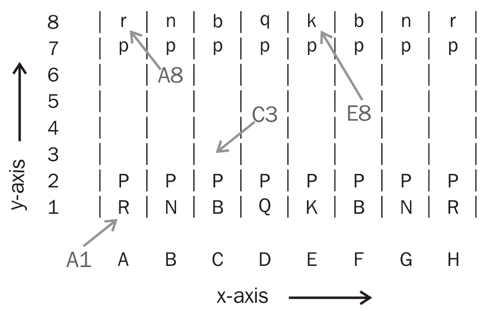

# 第四章：国际象棋

让我们在 Tkinter 中构建一个棋盘游戏。如果你已经了解棋盘游戏的基本规则，你就可以开始编写这个程序了。然而，如果你不知道规则，你应该在开始编程这个应用程序之前先阅读它们。

本章的一些关键目标如下：

+   学习如何在**模型-视图-控制器**（MVC）架构中构建程序

+   学习如何通过实现模块化结构来驯服复杂性

+   查看 Tkinter Canvas 小部件的多样性和强大功能

+   学习画布坐标、对象 ID 和标签的基本用法

+   学习推荐的错误处理实践

+   学习如何扩展 Python 的内置数据类型

+   使用对象继承来编写具有相似属性和行为的类

+   使用 Python 的内置 `configparser` 模块来存储程序首选项

+   熟悉你将在各种应用开发项目中经常使用的几个 Python 模块

# 章节概述

我们现在将实现一个**人机**对战的棋局。我们的棋局将执行所有适用于棋局的标准规则。一些高级规则，如王车易位和吃过路兵，将作为练习留给你。

在其最终形态下，我们的棋类程序将看起来是这样的：


# 本章节的模块要求

在本章中，我们将不使用任何外部第三方模块。然而，我们将使用几个内置的 Python 模块。

要检查是否所有必需的库确实由您的 Python 发行版提供，请在您的 Python 命令行中输入以下命令：

```py
>> import tkinter, copy, sys, configparser
```

这应该在没有错误消息的情况下执行。如果没有抛出错误，你就可以准备构建棋类应用程序了。让我们开始吧！

# 结构化我们的程序

在本节中，我们为我们的程序确定一个整体结构。

大型应用程序的开发通常从记录**软件需求规格说明书**（**SRS**）开始。这通常随后是使用几种建模工具对结构进行图形表示，例如类、组合、继承以及使用信息隐藏。这些工具可以是流程图、**统一建模语言**（**UML**）工具、数据流图、维恩图（用于数据库建模）等等。

当问题域不是很明确时，这些工具非常有用。然而，如果你曾经玩过国际象棋游戏，你应该非常熟悉问题域。此外，我们的国际象棋程序可以归类为中等规模程序，跨越了几百行代码。因此，让我们跳过这些视觉工具，直接进入实际程序设计。

我们之前的所有项目都结构化为单个文件。然而，随着程序的复杂性增加，我们需要将程序分解为模块和类结构。

本章的关键目标之一是学习编写**MVC**架构的程序。MVC 架构的一些核心方面如下：

+   模型处理后端数据和逻辑

+   视图处理前端展示

+   模型和视图从不直接交互

+   每当视图需要访问后端数据时，它请求控制器介入模型并获取所需数据

考虑到这些方面，让我们为我们的棋类程序创建三个文件：`model.py`、`view.py`和`controller.py`（参见`4.01.py`）。

现在，让我们在各自的文件中创建一个空的 `Model` 类，一个空的 `View` 类，以及一个 `Controller` 类，具体如下：

```py
class Model(): #in model.py
  def __init__(self):
    pass

class View(): #in view.py
  def __init__(self):
    pass

class Controller(): # in controller.py
  def __init__(self):
    self.init_model()

  def init_model(self):
    self.model = model.Model()
```

注意，由于`Controller`类需要从`Model`类获取数据，我们在`Controller`类内部实例化了一个新的`Model`类。这现在为我们提供了一种按需从`Model`类获取数据的方法。

让我们再添加一个名为 `exceptions.py` 的单独文件。这个文件将成为我们处理所有错误和异常的中心位置。在这个文件中，添加以下单行代码：

```py
class ChessError(Exception): pass
```

我们创建了一个自定义的 `ChessError` 类，它继承自标准 `Exception` 类。现在，这一行简单的代码允许 `ChessError` 类及其所有子类抛出错误，这些错误可以通过使用 `try…except` 块来处理。从现在开始，我们代码中定义的所有新错误类都将从这个 `ChessError` 基类派生。

将这个模板代码移除后，让我们创建另一个名为 `configurations.py (4.01)`的空白文件。我们将使用这个文件来存储所有常量和可配置值在一个地方。

让我们立即定义一些常量，如下所示（参见代码`4.01`—`configurations.py`):

```py
NUMBER_OF_ROWS = 8
NUMBER_OF_COLUMNS = 8
DIMENSION_OF_EACH_SQUARE = 64 # denoting 64 pixels
BOARD_COLOR_1 = "#DDB88C"
BOARD_COLOR_2 = "#A66D4F"
```

为了让这些常量值对所有文件可用，让我们将它们导入到`model.py`、`view.py`和`controller.py`文件夹中（参见`4.01`）：

```py
from configurations import *
```

根据 MVC 架构的原则，`View` 类永远不应该直接与 `Model` 类交互。它应该始终与 `Controller` 类交互，然后由 `Controller` 类负责从 `Model` 类获取数据。因此，让我们按照以下方式在 `View` 类中导入控制器，在 `Controller` 类中导入模型：

```py
import controller # in view.py
import model # in controller.py
```

让我们从编辑`view.py`文件开始，以显示棋盘（参见`4.01`—`view.py`）。本次迭代的目的是显示如下截图所示的空棋盘：


查看代码实现，请参阅`view.py`（见`4.01`）。

`View` 类的 `__init__` 方法调用了名为 `create_chess_base` 的方法，该方法定义如下：

```py
def create_chess_base(self):
  self.create_top_menu()
  self.create_canvas()
  self.draw_board()
  self.create_bottom_frame()
```

我们不会重现创建根窗口、顶部菜单或底部框架的代码。我们已在之前的章节中实现了类似的控件（参见`4.01`—`view.py`以获取完整参考）。

然而，我们将讨论创建棋盘的代码：

```py
def create_canvas(self):
  canvas_width = NUMBER_OF_COLUMNS * DIMENSION_OF_EACH_SQUARE
  canvas_height = NUMBER_OF_ROWS * DIMENSION_OF_EACH_SQUARE
  self.canvas = Canvas(self.parent, width=canvas_width, height=canvas_height)
  self.canvas.pack(padx=8, pady=8)
```

这里没有太多花哨的东西。创建一个 Canvas 小部件与在 Tkinter 中创建其他小部件类似。Canvas 小部件接受两个可配置选项的`width`和`height`。接下来，用交替的色调绘制 Canvas 小部件以形成棋盘（`view.py`）：

```py
def draw_board(self):
  current_color = BOARD_COLOR_2
  for row in range(NUMBER_OF_ROWS):
    current_color = self.get_alternate_color(current_color)
    for col in range(NUMBER_OF_COLUMNS):
       x1, y1 = self.get_x_y_coordinate(row, col)
       x2, y2 = x1 + DIMENSION_OF_EACH_SQUARE, y1 +DIMENSION_OF_EACH_SQUARE
       self.canvas.create_rectangle(x1, y1, x2, y2, fill=current_color)
       current_color = self.get_alternate_color(current_color)

def get_x_y_coordinate(self, row, col):
        x = (col * DIMENSION_OF_EACH_SQUARE)
        y = ((7 - row) * DIMENSION_OF_EACH_SQUARE)
       return (x, y)

def get_alternate_color(self, current_color):
     if current_color == self.board_color_2:
        next_color = self.board_color_1
     else:
        next_color = self.board_color_2
     return next_color
```

以下是对代码的描述：

+   我们使用了 Canvas 小部件的`create_rectangle()`方法来绘制交替阴影的方块，以模拟棋盘。

+   矩形是从点 `x1`, `y1` 绘制，并延伸到 `x2`, `y2`。这些值对应于矩形的两个对角相对的角（上左和下右边的坐标）。

+   `x`和`y`值是通过使用一种新定义的方法`get_x_y_coordinate()`计算得出的，该方法根据之前以像素单位定义的每个正方形的尺寸执行简单的数学运算。

    `y` 值是通过首先从（7 行）中减去一行来计算的，因为 Canvas 小部件是从左上角开始测量坐标的。画布的左上角坐标为 (`0`, `0`)。

+   `get_alternate_color` 方法是一个辅助方法，不出所料，它返回交替颜色。

Tkinter 画布小部件允许你在指定的坐标处绘制线条、椭圆形、矩形、圆弧和多边形等形状。你还可以为这些形状指定各种配置选项，例如填充、轮廓、宽度等。

画布小部件使用一个坐标系来指定小部件上对象的位置。坐标以像素为单位进行测量。画布的左上角坐标为 (`0`, `0`)。

在 Canvas 小部件上绘制的对象通常通过分配一个 ID 或标签来处理。我们将在本章后面看到一个例子。

如果画布小部件上的对象被标记为多个标签，则堆栈顶部标签定义的选项具有优先权。

然而，您可以通过使用`tag_raise(name)`或`tag_lower(name)`来改变标签的优先级。

要获取 Canvas 小部件相关选项的完整列表，请参考使用命令行中的`help(Tkinter.Canvas)`获取 Canvas 小部件的交互式帮助，如下所示：

`>>> import tkinter`

**`>>> help(tkinter.Canvas)`**

接下来，让我们在`View`类的`__init__`方法中将鼠标点击绑定到 Canvas 小部件（参见`4.01`—`view.py`），如下所示：

```py
self.canvas.bind("<Button-1>", self.on_square_clicked)
```

绑定方法调用另一个名为 `get_clicked_row_column()` 的方法，目前它将结果按如下方式打印到控制台：

```py
def on_square_clicked(self, event):
  clicked_row, clicked_column =  self.get_clicked_row_column(event)
  print("Hey you clicked on", clicked_row, clicked_column)
```

`get_clicked_row_column()` 方法定义如下：

```py
def get_clicked_row_column(self, event):
  col_size = row_size = DIMENSION_OF_EACH_SQUARE
  clicked_column = event.x // col_size
  clicked_row = 7 - (event.y // row_size)
  return (clicked_row, clicked_column)
```

现在，如果你运行代码（见`4.01`—`view.py`）并点击不同的方块，它应该会在控制台输出类似以下的消息：

```py
Hey you clicked on 0 7
Hey you clicked on 3 3
```

这完成了我们的第一次迭代。在这个迭代中，我们确定了棋类程序的更广泛文件结构。我们创建了`model`、`view`和`controller`类。我们还决定将所有常量和配置值保存在一个名为`configurations.py`的单独文件中。

我们现在已经初步体验了 Canvas 小部件。我们创建了一个空白画布，然后使用`canvas.create_rectangle`方法添加了方形区域，从而创建了一个棋盘。

现在，如果你运行 `4.01`—`view.py`，你会看到一个空白的棋盘。你还会发现 *文件* 菜单和 *编辑* 菜单的下拉菜单不可用。*关于* 菜单应该显示一个标准的 `messagebox` 小部件。

在你继续阅读下一节之前，我们鼓励你全面地探索`4.01`文件夹中的代码。

# 模拟数据结构

回到那句古老的谚语，数据结构，而非算法，是编写良好程序的核心。因此，花些时间定义数据结构是很重要的。

模型需要记录的关键数据是棋盘上棋子的位置。因此，我们首先需要一个方法来定义这些位置，以及一个独特的方式来识别棋子。让我们首先同意我们将遵守的程序中的命名约定。

# 国际象棋棋子命名公约

每个棋子都由一个单独的字母来标识（兵 = p，马 = n（是的，马用 n 表示！），象 = b，车 = r，后 = q，王 = k）。

白色棋子用大写字母（PNBRQK）表示，黑色棋子用小写字母（pnbrqk）表示。

# 国际象棋棋盘上地点命名的规则

为了给棋盘上的每一个方格分配唯一的标识符，我们将使用字母 A 到 H 来标记*x*轴上的方格。我们将使用数字 1 到 8 来标记*y*轴。

因此，棋盘上的方格将被标识如下：



因此，**A1** 表示棋盘最左下角的方块。目前，它被一个白方车占据。**C3** 位置目前是空的，**E8** 有一个黑方国王，而 **A8** 有一个黑方车。

让我们将这个添加到`configurations.py`文件中（参见`4.02`）：

```py
X_AXIS_LABELS = ('A', 'B', 'C', 'D', 'E', 'F', 'G', 'H')
Y_AXIS_LABELS = (1, 2, 3, 4, 5, 6, 7, 8)
```

现在，如果你想在某个时间点表示棋盘，你所需要的只是一个将位置映射到该位置棋子的映射。看起来这是一个存储为 Python 字典的完美候选者。

因此，棋盘上所有棋子的初始位置可以表示如下：

```py
START_PIECES_POSITION = {
"A8": "r", "B8": "n", "C8": "b", "b", "G8": "n", "H8": "r",
"A7": "p", "B7": "p", "C7": "p", "p", "G7": "p", "H7": "p",
"A2": "P", "B2": "P", "C2": "P", "P", "G2": "P", "H2": "P",
"A1": "R", "B1": "N", "C1": "B", "D8": "q", "E8": "k", "F8":
"D7": "p", "E7": "p", "F7": "D2": "P", "E2": "P", "F2":
"D1": "Q", "E1": "K", "F1":"B", "G1": "N", "H1": "R"
}
```

我们需要这些数据来开始工作。因此，让我们将此作为常量添加到`configurations.py`文件中（见`4.02`）。

现在，让我们继续为我们的程序编写`Model`类。我们已经决定将使用 Python 字典来存储棋盘上棋子的位置。我们可以继续为类添加一个字典属性。

然而，我们将采取一种略有不同的方法。

让我们将`Model`类设置为内置字典类的子类，如下所示：

```py
class Model(dict): 
```

因此，指向当前类对象实例的`self`变量也将拥有字典中可用的所有属性和方法。现在可以在`Model`对象（`self`）上调用标准字典类中可用的所有方法。

因此，现在我们可以定义一个方法，当给定棋盘上的位置时，它返回该位置棋子的简称，如下所示（参见 `4.02`—`model.py`）：

```py
def get_piece_at(self, position):
   return self.get(position) 
```

如果该位置没有棋子，则返回`None`而不是抛出`KeyError`异常。

接下来，让我们给`Model`类添加一些更重要的属性，如下所示（见`4.02`—`model.py`):

```py
captured_pieces = { 'white': [], 'black': [] }
player_turn = None
halfmove_clock = 0
fullmove_number = 1
history = []
```

`half-move_clock` 记录自上次兵的推进或上次捕获以来的回合数。这用于确定是否可以根据 `五十回合` 规则要求判和。

`全移动数`是指在每一步黑棋移动后增加`1`的计数。这用于跟踪整场比赛的总长度。

最后，让我们再添加一种方法，该方法根据正方形的行-列元组返回其字母数字位置（例如，输入（`1`，`2`）返回 `B3`）：

```py
def get_alphanumeric_position(self, rowcol):
  if self.is_on_board(rowcol):
     row, col = rowcol
     return "{}{}".format(X_AXIS_LABELS[col], Y_AXIS_LABELS[row])
```

接下来，让我们定义一个相关的辅助方法，以确保我们只处理发生在 Canvas 小部件上的鼠标点击，而不是根窗口的任何其他地方，具体如下：

```py
def is_on_board(self, rowcol):
     row, col = rowcol
    return 0 <= row <= 7 and 0 <= col <= 7 
```

目前为止，在`Model`类中添加的内容并不多，直到我们编写代码逻辑来处理棋子。

我们可以在`Model`类中定义所有棋子的规则，但这会使`Model`类变得过于庞大。

因此，让我们在一个名为 `piece.py` 的新文件中定义棋子相关的逻辑。由于这本质上是 `Model` 类的一部分，但它定义在一个新文件中，所以让我们在这个文件内添加对 `Model` 类的引用。

(参见 `4.02`—`piece.py`)

我们接下来做这个。

# 创建一个 Piece 类

想想看。我们需要为所有不同的棋子定义规则。一些属性和方法，例如颜色，将适用于所有棋子，而其他属性/方法，例如移动规则，将因每个棋子而异。

首先，我们将定义一个新的 `Piece` 类。这个类将包含所有棋子共有的属性和方法。然后，我们将为每个单独的棋子定义一个类，作为这个父 `Piece` 类的子类。我们可以在这些单独的类中重写所有的属性和方法。代码将看起来像这样（参见 `4.02`—`piece.py`）：

```py
from configurations import *

class Piece():
  def __init__(self, color):
    self.name = self.__class__.__name__.lower()
    if color == 'black':
      self.name = self.name.lower()
    elif color == 'white':
      self.name = self.name.upper()
      self.color = color

def keep_reference(self, model):
   self.model = model

class King(Piece):
  pass

class Queen(Piece):
  pass

class Rook(Piece):
  pass

class Bishop(Piece):
  pass

class Knight(Piece):
  pass

class Pawn(Piece):
  pass
```

注意，`Piece` 类在对象创建时需要 `color` 作为参数。我们在类中创建了两个属性，分别命名为 `self.name` 和 `self.color`。

还要注意`keep_reference(self, model)`方法的定义。由于`Piece`类不过是`Model`类的一个扩展，因此在这个方法中我们需要获取到`Model`类的引用以便与之通信。

同样，`Model` 类需要引用新的 `Piece` 类。因此，我们将此作为导入添加到 `Model` 类中，如下所示（见 `4.02`—`model.py`）：

```py
import piece
```

最后，我们需要一个方法，它接受一个与给定棋子对象名称相关的字符串，并创建一个新的棋子对象。例如，我们需要一个方法，给定参数（兵，黑色）或简单地（`"p"`），动态创建一个新的具有颜色属性定义为黑色的`Pawn`对象。

因此，让我们在`piece.py`文件中但不在`Piece`类外部定义一个辅助方法，如下所示（见`4.02`—`piece.py`）：

```py
def create_piece (piece, color='white'):
  if isinstance(piece, str):
    if piece.upper() in SHORT_NAME.keys():
      color = "white" if piece.isupper() else "black"
      piece = SHORT_NAME[piece.upper()]
    piece = piece.capitalize()
    if piece in SHORT_NAME.values():
      return eval("{classname} (color)".format(classname=piece))
 raise exceptions.ChessError("invalid piece name: '{}'".format(piece))
```

为了支持上述方法，请将以下常量添加到`configurations.py`文件中（参见`4.02`）：

```py
SHORT_NAME = {
 'R':'Rook', 'N':'Knight', 'B':'Bishop', 'Q':'Queen', 'K':'King', 'P':'Pawn'
 }
```

上述代码简单地接受单个字符作为输入。然后它获取对应棋子类的完整名称（例如，如果输入的是 `p`，它将获取完整的名称，即 `Pawn`）。接着它检查字符的大小写，如果输入字符是大写，则将颜色变量定义为 *白色*。否则，颜色设置为 *黑色*。然后它动态创建一个对应的棋子对象。

这就结束了迭代。我们已经创建了`Piece`类及其所有子类，并且能够从给定的输入字符动态创建`Piece`对象。这个类仅仅是`Model`类的一个扩展，两个类都可以通过保持对彼此的引用来访问对方的方法。

# 在棋盘上显示棋子

现在，让我们将注意力转向在棋盘上显示所有棋子。

首先，我们将定义一个名为 `draw_single_piece` 的方法，该方法在给定位置并传入棋子字符时，将在该位置绘制一个棋子，其字符表示如下（参见 `4.03`—`view.py`）：

```py
def draw_single_piece(self, position, piece):
  x, y = self.controller.get_numeric_notation(position)
  if piece:
    filename = "../pieces_image/{}_{}.png".format(piece.name.lower(), piece.color)
    if filename not in self.images:
      self.images[filename] = PhotoImage(file=filename)
    x0, y0 = self.calculate_piece_coordinate(x, y)
    self.canvas.create_image(x0, y0, image=self.images[filename], 
                          tags=("occupied"),  anchor="c")
```

以下是对前面代码的描述：

+   棋子的图片存储在一个名为 `pieces_image` 的文件夹中，并以 `lowercase + _ + color.png` 格式命名。例如，黑后棋子的图片保存为 `queen_black.png`。

+   通过使用`canvas.create_image()`方法将图像添加到棋盘上，该方法需要*x*、*y*坐标以及一个以图像文件位置为参数的`PhotoImage()`对象。

+   我们使用了 Tkinter 的`PhotoImage`类来引用`.png`文件。

+   除了在棋盘上创建和显示棋子外，我们还用自定义标签`occupied`对它们进行了标记。标记是 Canvas 小部件的一个重要功能，它使我们能够唯一地识别放置在 Canvas 小部件上的项目。

我们在前面代码中使用了以下辅助方法（见`4.03`—`view.py`）：

```py
def calculate_piece_coordinate(self, row, col):
  x0 = (col * DIMENSION_OF_EACH_SQUARE) + int(DIMENSION_OF_EACH_SQUARE / 2)
  y0 = ((7 - row) * DIMENSION_OF_EACH_SQUARE) + 
    int(DIMENSION_OF_EACH_SQUARE / 2)
  return (x0, y0)
```

我们还定义了另一个辅助方法，该方法返回棋子位置的数字表示（参见`4.03`—`controller.py`）：

```py
def get_numeric_notation(self, position):
  return piece.get_numeric_notation(position)
```

这只是对以下来自`4.03`—`piece.py`的代码的一个包装：

```py
def get_numeric_notation(rowcol):
  row, col = rowcol
  return int(col)-1, X_AXIS_LABELS.index(row) 
```

现在，只需在所有棋子（`4.03`—`view.py`）上调用前面的 `draw_single_piece` 方法：

```py
def draw_all_pieces(self):
 self.canvas.delete("occupied")
 for position, piece in  self.controller.get_all_pieces_on_chess_board():
   self.draw_single_piece(position, piece)
```

在这里需要你注意的一个关键方面是，当我们需要从`Model`类获取一些数据时，比如说，一个包含棋盘上所有棋子的字典，我们并没有直接调用`Model`类来获取数据。相反，我们请求控制器从模型中获取数据。`get_all_pieces_on_chess_board()`控制器方法只是`Model`类实际方法的包装（参见`4.03`—`controller.py`):

```py
def get_all_pieces_on_chess_board(self):
  return self.model.items()
```

太好了！我们现在已经有了在棋盘上绘制所有棋子的方法。但仅仅定义它们是不够的。这些方法需要从某个地方被调用。因此，让我们定义一个新的方法名为 `start_new_game()` 并在 `View` 类的 `__init__` 方法中调用它，如下所示（见 `4.03`—`view.py`）：

```py
 def start_new_game(self):
   self.controller.reset_game_data()
   self.controller.reset_to_initial_locations()
   self.draw_all_pieces()
```

除了调用`draw_all pieces()`方法外，此方法还通过调用两个包装控制器方法来重置`Model`（参见`4.03`—`controller.py`）：

```py
def reset_game_data(self):
  self.model.reset_game_data()

def reset_to_initial_locations(self):
  self.model.reset_to_initial_locations()
```

实际方法在`Model`类中定义，如下所示：

```py
def reset_game_data(self):
  captured_pieces = {'white': [], 'black': []}
  player_turn = None
  halfmove_clock = 0
  fullmove_number = 1
  history = []

def reset_to_initial_locations(self):
  self.clear()
  for position, value in START_PIECES_POSITION.items():
    self[position] = piece.create_piece(value)
    self[position].keep_reference(self)
    self.player_turn = 'white'
```

`reset_game_data()` 方法很简单。它只是将 `Model` 类的所有属性重置为其初始状态。

`reset_to_initial_locations()` 方法将所有棋子位置初始化为反映游戏起始位置。如果你了解我们之前讨论过的数据结构，这一点也应该不言而喻。

现在，当你运行代码（见`4.03`—`view.py`）时，棋盘应该显示所有棋子在游戏起始位置的状态，如下面的截图所示：


这完成了当前的迭代。下一个迭代将定义棋盘上棋子移动的规则。在我们考虑移动棋子之前，我们需要这部分完成。

# 定义棋子的规则

不同棋子的移动规则各不相同。让我们尝试将这些规则制成表格：

**允许移动** |

| 国王 | 是 | 是 | 1 |
| --- | --- | --- | --- |
| 王后 | 是 | 是 | 8 |
| 车卒 | 是 | 否 | 8 |
| 主教 | 否 | 是 | 8 |
| 骑士 | N/A | N/A | N/A |
| 兵 | 是的，但可以斜着吃子 | 否 | 1 或 2 |

如表格所示，除了**马**和**兵**之外，所有棋子的规则都非常简单明了。

骑士与其他棋子不同。它们必须在一个方向上移动两个方格，然后以 90 度角再移动一步，形成 L 形。骑士也是唯一能够跳过其他棋子的棋子。

兵棋向前移动，但它们可以斜向捕获。兵棋每次只能向前移动一个方格，除了它们的第一步移动，那时它们可以向前移动两个方格。兵棋只能斜向捕获它们前方的一个方格。

# 国王、王后、车和象的规则

让我们先看看正交和对角移动的简单棋子案例，这些是国王、王后、车和象。我们需要找到一种方法，通过数学规则来改变这些棋子的位置。

以下图表展示了将棋子从当前位置（比如说 *x*，*y*）沿正交和斜向移动所需的步骤：


如果您查看前面的图表，*x* 代表列号，而 *y* 代表行号。很明显，我们可以通过向当前位置添加元组（`-1`, `0`）、（`0`, `1`）、（`1`, `0`）、（`0`, `-1`）中的项来表示正交移动。

同样，对角线移动可以通过向元组（`-1`, `1`），（`1`, `1`），（`1`, `-1`），（`-1`, `-1`）中添加来表示。

让我们在`configurations.py`文件中添加这两个元组（见`4.04`），如下所示：

```py
ORTHOGONAL_POSITIONS = ((-1,0),(0,1),(1,0),(0, -1))
DIAGONAL_POSITIONS = ((-1,-1),(-1,1),(1,-1),(1,1)) 
```

如果一个棋子可以同时进行水平和斜向移动，例如*皇后*，那么其代表元组就是前两个元组的简单相加。

如果一个棋子可以移动超过一个方格，那么只需将代表元组乘以一个整数，就可以得到棋盘上所有允许的其他位置。

带着这些信息，让我们编写一个`moves_available`方法，该方法根据棋子的当前位置、与棋子相关的方向元组以及棋子可以移动的最大距离，返回所有允许的`allowed_moves`列表，如下所示（参见`4.04`—`piece.py`）：

```py
def moves_available(self, current_position, directions,distance):
  model = self.model
  allowed_moves = []
  piece = self
  start_row, start_column = get_numeric_notation(current_position)
  for x, y in directions:
    collision = False
    for step in range(1, distance + 1):
      if collision: break
      destination = start_row + step * x, start_column + step * y
      if self.possible_position(destination) not in 
        model.all_occupied_positions():
         allowed_moves.append(destination)
      elif self.possible_position(destination) in
                         model.all_positions_occupied_by_color 
                           (piece.color):
         collision = True
      else:
         allowed_moves.append(destination)
         collision = True
  allowed_moves = filter(model.is_on_board, allowed_moves)
  return map(model.get_alphanumeric_position, allowed_moves)

```

以下是对前面代码的描述：

+   根据参数，该方法将给定棋子的所有允许移动收集到一个名为 `allowed_moves` 的列表中。

+   代码遍历所有位置以检测可能的碰撞。如果检测到碰撞，它将跳出循环。否则，它将坐标添加到`allowed_moves`列表中。

+   倒数第二行过滤掉所有超出棋盘范围的走法，最后一行返回所有允许走法的等效位置，以字母数字符号表示。

我们还可以定义几个辅助方法来支持前面的方法，具体如下：

```py
def possible_position(self, destination): #4.04 piece.py
  return self.model.get_alphanumeric_position(destination)

def all_positions_occupied_by_color(self, color): #4.04 model.py
  result = []
  for position in self.keys():
    piece = self.get_piece_at(position)
    if piece.color == color:
      result.append(position)
  return result

def all_occupied_positions(self): #4.04 model.py
  return self.all_positions_occupied_by_color('white') +\
         self.all_positions_occupied_by_color('black')
```

接下来，让我们按照以下方式修改国王、王后、车和象的`Piece`子类（参见`4.04`—`piece.py`）：

```py
class King(Piece):
  directions = ORTHOGONAL_POSITIONS + DIAGONAL_POSITIONS
  max_distance = 1

  def moves_available(self,current_position):
     return super().moves_available(current_position, self.directions, self.max_distance)

class Queen(Piece):
  directions = ORTHOGONAL_POSITIONS + DIAGONAL_POSITIONS
  max_distance = 8

  def moves_available(self,current_position):
    return super(Queen, self).moves_available
               (current_position, self.directions, self.max_distance)

class Rook(Piece):
  directions = ORTHOGONAL_POSITIONS
  max_distance = 8

  def moves_available(self,current_position):
      return super(Rook, self).moves_available(current_position,
                                    self.directions, self.max_distance)

class Bishop(Piece):
  directions = DIAGONAL_POSITIONS
  max_distance = 8

  def moves_available(self,current_position):
     return super(Bishop, self).moves_available
              (current_position, self.directions, self.max_distance)
```

# 骑士规则

骑士是一种不同的棋子，因为它既不沿正交方向也不沿对角线移动。它还可以跳过其他棋子。

就像我们之前遵循的规则来达到`ORTHOGONAL_POSITIONS`和`DIAGONAL_POSITIONS`，我们同样可以得出确定`KNIGHT_POSITIONS`元组的所需规则。这定义在`4.04`—`configurations.py`中，如下所示：

```py
KNIGHT_POSITIONS = ((-2,-1),(-2,1),(-1,-2),(-1,2),(1,-2),(1,2),(2,-1),(2,1))
```

接下来，让我们重写`Knight`类中的`moves_available`方法（参见代码`4.04`—`piece.py`):

```py
class Knight(Piece):

 def moves_available(self, current_position):
   model = self.model
   allowed_moves = []
   start_position = get_numeric_notation(current_position.upper())
   piece = model.get(pos.upper())
   for x, y in KNIGHT_POSITIONS:
     destination = start_position[0] + x, start_position[1] + y
     if(model.get_alphanumeric_position(destination) not 
             in model.all_positions_occupied_by_color(piece.color)):
       allowed_moves.append(destination)
   allowed_moves = filter(model.is_on_board, allowed_moves)
   return map(model.get_alphanumeric_position, allowed_moves)
```

以下是对前面代码的描述：

+   该方法与之前的超类方法相当相似。然而，与超类方法不同，这些变化是通过使用`KNIGHT_POSITIONS`元组来表示的捕获移动。

+   与超类不同，我们不需要跟踪碰撞，因为骑士可以跳过其他棋子。

# 车的规则

车兵也有独特的移动方式，它向前移动，但可以斜着吃子。我们可以类似地从`Pawn`类内部覆盖`moves_available`类，如下所示（参见`4.04`—`piece.py`）：

```py
class Pawn(Piece):

  def moves_available(self, current_position):
    model = self.model
    piece = self
    if self.color == 'white':
      initial_position, direction, enemy = 1, 1, 'black'
    else:
      initial_position, direction, enemy = 6, -1, 'white'
    allowed_moves = []
    # Moving
    prohibited = model.all_occupied_positions()
    start_position = get_numeric_notation(current_position.upper())
    forward = start_position[0] + direction, start_position[1]
    if model.get_alphanumeric_position(forward) not in prohibited:
      allowed_moves.append(forward)
      if start_position[0] == initial_position:
        # If pawn is in starting position allow double  moves
        double_forward = (forward[0] + direction, forward[1])
        if model.get_alphanumeric_position(double_forward) not in 
          prohibited:
            allowed_moves.append(double_forward)
    # Attacking
    for a in range(-1, 2, 2):
      attack = start_position[0] + direction,
      start_position[1] + a
      if model.get_alphanumeric_position(attack) in
                 model.all_positions_occupied_by_color(enemy):
         allowed_moves.append(attack)
    allowed_moves = filter(model.is_on_board, allowed_moves)
    return map(model.get_alphanumeric_position, allowed_moves)
```

以下是对前面代码的描述：

+   我们首先根据兵是黑色还是白色，分配了`初始行位置`、方向和敌人变量。

+   与之前的 `moves_allowed` 方法类似，此方法将所有允许的移动收集到一个名为 `allowed_moves` 的空白列表中。

+   然后，我们通过连接所有黑白棋子占据的方格的两个列表，收集了一个所有禁止移动的列表。

+   我们定义了一个名为`forward`的变量，它保存了棋子当前位置前方正方形的坐标。

+   如果前方有棋子，则兵不能向前移动。如果前方位置没有被禁止，则该位置将被添加到`allowed_moves`列表中。兵可以从起始位置向前移动两格。我们检查当前位置是否是起始位置，如果是起始位置，则将双倍移动添加到`allowed_moves`列表中。

+   车棋只能捕获其前方斜线上的棋子。因此，我们分配了一个变量来追踪棋盘上斜线相邻的位置。如果斜线相邻的方格被敌方棋子占据，那么该位置符合添加到`allowed_moves`列表的条件。

+   然后，我们将列表过滤，移除所有可能超出棋盘边界的位置。最后一行返回所有允许的走法，以对应的双字符代数符号列表形式呈现，正如我们在所有之前的定义中所做的那样。

这完成了当前迭代。我们编写了执行棋盘上棋子移动相关规则的逻辑代码。

# 棋子的移动验证

在我们允许棋子移动之前，我们必须记录下棋盘上所有可能的移动选项。在每一步移动中，我们还需要检查是否是给定玩家的合法回合，并且提议的移动不应该对当前玩家的国王造成将军。

现在，检查可能不仅来自被移动的棋子，还可能来自棋盘上因这种移动而产生的任何其他棋子。因此，在每一步之后，我们需要计算对手所有棋子的可能走法。

因此，我们需要两种方法来完成以下任务：

+   跟踪记录一个玩家的所有可用移动

+   检查是否有对国王的检查

让我们在`Model`类中添加两种新的方法（参见`4.05`—`model.py`）。

# 跟踪所有可用的移动

用于跟踪玩家所有可用移动的代码如下：

```py
def get_all_available_moves(self, color):
  result = []
  for position in self.keys():
    piece = self.get_piece_at(position)
    if piece and piece.color == color:
       moves = piece.moves_available(position)
       if moves:
         result.extend(moves)
  return result
```

代码的描述如下：

+   我们已经在之前的迭代中编写了`moves_available`方法

+   上述方法简单地遍历字典中的每个项目，并将给定颜色的每个棋子的`moves_available`结果追加到名为`result`的列表中

# 查找国王当前的位置

在我们编写检查国王是否处于将军状态的代码之前，我们首先需要知道国王的确切位置。让我们定义一个方法来找出国王的当前位置，如下所示（见`4.05`—`model.py`）：

```py
 def get_alphanumeric_position_of_king(self, color):
   for position in self.keys():
     this_piece = self.get_piece_at(position)
     if isinstance(this_piece, piece.King) and this_piece.color == color:
        return position
```

上述代码简单地遍历字典中的所有项。如果给定位置是`King`类的实例，它就简单地返回其位置。

# 检查国王是否处于将军状态

让我们定义一种方法来检查国王是否受到对手的将军，具体如下：

```py
def is_king_under_check(self, color):
  position_of_king = self.get_alphanumeric_position_of_king(color)
  opponent = 'black' if color =='white' else 'white'
  return position_of_king in self.get_all_available_moves(opponent) 
```

以下是对前面代码的描述：

+   首先，我们获取了国王的当前位置和对手的颜色。

+   我们随后找出对手所有棋子的所有可能走法。如果国王的位置与所有可能走法中的任何一个位置重合，那么国王处于将军状态，我们返回`True`。否则，我们返回`False`。

这完成了迭代的目标。我们现在可以检查游戏在某个特定时刻所有可用的棋子移动。我们还可以检查是否对方正在将军。

# 使游戏功能化

现在我们已经设置了所有棋子和棋盘相关的验证规则，让我们给我们的棋程序注入生命力。在这个迭代中，我们将使我们的棋游戏完全功能化。

本迭代的目的是通过点击左鼠标按钮来移动棋子。当玩家点击一个棋子时，代码应首先检查该棋子是否处于合法的移动回合。

在第一次点击时，需要移动的棋子被选中，并且该棋子所有允许的走法在棋盘上都会被高亮显示。第二次点击应该执行在目标方格上。如果第二次点击是在一个有效的目标方格上，那么棋子应该从起始方格移动到目标方格。

我们还需要编码捕捉棋子和国王被将军的事件。需要跟踪的其他属性包括已捕获的棋子列表、半回合时钟计数、全回合数计数以及所有先前移动的历史记录。

你可能还记得我们创建了一个与左键点击事件绑定的虚拟方法。目前，该方法只是简单地将在控制台上打印行和列的值。

让我们修改这个方法，如下所示（见 `4.06`—`view.py`）：

```py
def on_square_clicked(self, event):
  clicked_row, clicked_column = self.get_clicked_row_column(event)
  position_of_click =  self.controller.get_alphanumeric_position 
                                   ((clicked_row, clicked_column))
  if self.selected_piece_position: # on second click
     self.shift(self.selected_piece_position, position_of_click)
     self.selected_piece_position = None
  self.update_highlight_list(position_of_click)
  self.draw_board()
  self.draw_all_pieces()
```

以下是对前面代码的描述：

+   代码的第一部分计算您点击的棋子的坐标。根据计算出的坐标，它将相应的字母标记存储在一个名为`position_of_click`的变量中。

+   然后它尝试将片段变量分配给相应的片段实例。如果点击的方格上没有片段实例，它就简单地忽略这次点击。

+   该方法的第二部分检查这是否是意图将棋子移动到目标格子的第二次点击。如果是第二次点击，它将调用`shift`方法，并将源坐标和目标坐标作为其两个参数传递。

+   如果`shift`方法成功执行，它将所有之前设置的属性重置为其原始的空值，并调用`draw_board`和`draw_pieces`方法来重新绘制棋盘和棋子。

在编写`on_square_clicked`方法所需的功能时，我们在其中调用了几个新的方法。我们需要定义这些新方法。

密切关注`on_square_clicked`方法。这是所有其他方法在尝试使棋盘游戏功能化的过程中演变的核心方法。

# 获取源位置和目标位置

我们从`on_square_clicked`方法中调用了`shift`方法。`shift`方法的代码负责收集`shift`操作所需的必要参数。

`shift` 方法的代码如下：

```py
def shift(self, start_pos, end_pos):
  selected_piece = self.controller.get_piece_at(start_pos)
  piece_at_destination =  self.controller.get_piece_at(end_pos)
  if not piece_at_destination or piece_at_destination.color
                      != selected_piece.color:
     try:
        self.controller.pre_move_validation(start_pos, end_pos)
     except exceptions.ChessError as error:
        self.info_label["text"] = error.__class__.__name__
  else:
     self.update_label(selected_piece, start_pos, end_pos)
```

代码首先检查目标位置是否存在棋子。如果目标方格上不存在棋子，它将调用来自*控制器*的方法，`shift`，这是一个围绕`Model`类实际`shift`方法的包装器。

# 收集需要突出显示的动作列表

我们也从`on_square_clicked`方法中调用了`update_highlight_list(position)`方法。这个方法的目的在于收集给定棋子在列表`all_squares_to_be_highlighted`中所有可能的走法。

实际上，可用的移动聚焦发生在 GUI 类的`draw_board`方法中。该方法的代码如下（见`4.06`—`view.py`）：

```py
def update_highlight_list(self, position):
  self.all_squares_to_be_highlighted = None
  try:
    piece = self.controller.get_piece_at(position)
  except:
    piece = None
  if piece and (piece.color == self.controller.player_turn()):
    self.selected_piece_position = position
  self.all_squares_to_be_highlighted = list(map(self.controller.get_numeric_notation,
                   self.controller.get_piece_at(position).moves_available(position)))
```

# 突出显示允许移动的选项

在`on_square_clicked`方法中，我们调用了`draw_board`方法来处理棋子坐标的重绘或更改。当前的`draw_board`方法尚未准备好处理这种情况，因为我们最初只设计它在一轮迭代中为我们提供一个空白的棋盘。

首先，让我们在`configurations.py`文件中添加一个`HIGHLIGHT_COLOR`常量，具体如下：

```py
HIGHLIGHT_COLOR = "#2EF70D"
```

然后，修改`draw_board`方法以处理这个问题，如下所示（见`4.06`—`view.py`）：

```py
def draw_board(self):
  current_color = BOARD_COLOR_2
  for row in range(NUMBER_OF_ROWS):
     current_color = self.get_alternate_color(current_color)
     for col in range(NUMBER_OF_COLUMNS):
        x1, y1 = self.get_x_y_coordinate(row, col)
        x2, y2 = x1 + DIMENSION_OF_EACH_SQUARE, y1 + 
          DIMENSION_OF_EACH_SQUARE
        if(self.all_squares_to_be_highlighted and (row, col) in 
                       self.all_squares_to_be_highlighted):
           self.canvas.create_rectangle(x1, y1, x2, y2, 
             fill=HIGHLIGHT_COLOR)
        else:
           self.canvas.create_rectangle(x1, y1, x2, y2, fill=current_color)
        current_color = self.get_alternate_color(current_color)
```

# 预迁移验证

国际象棋的棋子只有在不会违反游戏规则的情况下才能移动。例如，一个棋子只能移动到未被同色棋子占据的有效位置。同样，一个棋子只有在轮到该玩家移动时才能移动。另一条规定是，一个棋子只有在移动结果不会对该色国王构成将军的情况下才能移动。

这个 `pre_move_validation` 方法负责检查所有规则。如果所有验证都通过，它将调用 `move` 方法来更新移动，如下所示（见 `4.06`—`model.py`）：

```py
    def pre_move_validation(self, initial_pos, final_pos):
        initial_pos, final_pos = initial_pos.upper(), final_pos.upper()
        piece = self.get_piece_at(initial_pos)
        try:
            piece_at_destination = self.get_piece_at(final_pos)
        except:
            piece_at_destination = None
        if self.player_turn != piece.color:
            raise exceptions.NotYourTurn("Not " + piece.color + "'s turn!")
        enemy = ('white' if piece.color == 'black' else 'black')
        moves_available = piece.moves_available(initial_pos)
        if final_pos not in moves_available:
            raise exceptions.InvalidMove
        if self.get_all_available_moves(enemy):
            if self.will_move_cause_check(initial_pos, final_pos):
                raise exceptions.Check
        if not moves_available and self.is_king_under_check(piece.color):
            raise exceptions.CheckMate
        elif not moves_available:
            raise exceptions.Draw
        else:
            self.move(initial_pos, final_pos)
            self.update_game_statistics(
                piece, piece_at_destination, initial_pos, final_pos)
            self.change_player_turn(piece.color)
```

如果规则没有被遵循，此代码会引发几个异常，这些异常在异常类中如下定义（见`4.06`—`exceptions.py`）：

```py
 class Check(ChessError): pass
 class InvalidMove(ChessError): pass
 class CheckMate(ChessError): pass
 class Draw(ChessError): pass
 class NotYourTurn(ChessError): pass
```

我们本可以进一步对错误类别进行编码，但我们选择不这样做，因为我们只是将错误类别的名称更新为底部标签，这对我们当前的目的来说已经足够了。错误信息是从`View`类的位移方法中显示的，如下所示（见`4.06`—`view.py`）：

```py
self.info_label["text"] = error.__class__.__name__
```

# 检查一个移动是否会导致对国王的将军（即王后将受到攻击）

虽然前面几行中进行的验证检查的大部分是简单的，但其中一步验证需要检查一个移动是否会使得国王处于被将军的状态。这是一个棘手的情况。我们只能在实际移动之后才能找出这一点。然而，我们不允许这种移动在棋盘上发生。

要实现这一点，`pre_move_validation` 方法调用了一个名为 `will_move_cause_check` 的方法，该方法创建了一个 `Model` 类的副本。然后，它在新创建的临时副本上进行移动操作，以检查这会不会导致国王处于被将军的状态。相应的代码如下 (`4.06`—`model.py`):

```py
def will_move_cause_check(self, start_position, end_position):
  tmp = deepcopy(self)
  tmp.move(start_position, end_position)
  return tmp.is_king_under_check(self[start_position].color)
```

注意，当你通过简单赋值创建一个副本时，Python 会创建一个浅拷贝。在浅拷贝中，两个变量现在共享相同的数据。因此，对其中一个位置的修改也会影响另一个。

与此相反，深拷贝会创建一个包含所有内容的副本——包括结构和元素。我们需要创建棋盘的深拷贝，因为我们希望在国王实际移动之前检查其是否进行了一次有效的移动，并且我们希望在不以任何方式修改原始对象状态的情况下完成这项操作。

# 记录数据结构中的移动

在 `view.py` 中定义的 `shift` 方法负责在棋盘上实际移动棋子。然而，这会导致底层数据结构发生变化。因此，`Model` 类的 `move` 方法负责更新数据结构。只有当没有错误抛出时，这个 `move` 方法才会从之前定义的 `pre_move_validation()` 方法中被调用，如下所示（`4.06`—`model.py`）：

```py
def move(self, start_pos, final_pos):
 self[final_pos] = self.pop(start_pos, None)
```

注意，一旦这次更新完成，控制权就会返回到`view.py`中的`on_square_clicked()`方法*.* 然后，该方法会调用`draw_all_pieces()`方法，该方法会更新视图。

# 保持游戏统计数据

`pre_move_validation()` 方法在成功记录一个移动后，也会调用另一个名为 `update_game_statistics()` 的方法（参见 `4.06`—`model.py`）：

```py
    def update_game_statistics(self, piece, dest, start_pos, end_pos):
        if piece.color == 'black':
            self.fullmove_number += 1
        self.halfmove_clock += 1
        abbr = piece.name
        if abbr == 'pawn':
            abbr = ''
            self.halfmove_clock = 0
        if dest is None:
            move_text = abbr + end_pos.lower()
        else:
            move_text = abbr + 'x' + end_pos.lower()
            self.halfmove_clock = 0
        self.history.append(move_text)

```

恭喜，我们的棋局现在已启用！

让我们通过将文件 *|* 新游戏菜单项绑定到启动新游戏来完成迭代。之前，我们定义了 `start_new_game()` 方法。现在，只需从 `on_new_game_menu_clicked()` 方法中调用它即可，如下所示 (`4.06`—`view.py`):

```py
def on_new_game_menu_clicked(self):
  self.start_new_game()
```

# 管理用户偏好

在多个图形用户界面程序中，一个非常常见的主题是让用户设置程序的偏好设置。

例如，如果我们想让用户能够自定义棋盘颜色怎么办？如果我们想让用户选择颜色，一旦选择，它就被保存为用户偏好，并在下次程序运行时加载？让我们把这个作为一个功能来实现。

Python 提供了一个名为`configparser`的标准模块，允许我们保存用户偏好设置。让我们看看`configparser`模块的实际应用。

首先，从`configparser`模块中导入`ConfigParser`类到`configurations.py`文件中，如下所示（参见`4.07 preferenceswindow.py`）：

```py
from configparser import ConfigParser
```

`configparser`模块使用`.ini`文件来存储和读取配置值。该文件包含一个或多个命名部分。这些部分包含具有名称和值的单个选项。

为了说明这一点，让我们在项目的根目录下创建一个名为 `chess_options.ini` 的文件（参见 `4.07`）。该文件看起来是这样的：

```py
[chess_colors]
 board_color_1 = #DDB88C
 board_color_2 = #A66D4F
 highlight_color = #2EF70D
```

方括号内（在我们的示例中为 `[chess_colors]`）的第一行被称为**部分**。一个 `.ini` 文件可以有多个部分。此文件只有一个部分。每个部分可以有多个如示例中指定的 *键值* 选项。

我们可以通过使用`getter`方法在我们的程序中读取这些值，如下所示（参见`4.07`—`configurations.py`）：

```py
config = ConfigParser()
config.read('chess_options.ini')
BOARD_COLOR_1 = config.get('chess_colors', 'board_color_1', 
  fallback="#DDB88C")
BOARD_COLOR_2 = config.get('chess_colors', 'board_color_2', fallback = 
  "#A66D4F")
HIGHLIGHT_COLOR =config.get('chess_colors', 'highlight_color', fallback 
  = "#2EF70D")
```

上述代码替换了我们在代码中之前定义的三个颜色常量。

现在，如果你在 `.ini` 文件中更改选项，棋盘的颜色会相应地改变。然而，我们无法期望最终用户熟悉编辑 `.ini` 文件。因此，我们将让他们通过 Tkinter 的 **颜色选择器** 模块来选择颜色。用户选择的颜色会反映在 `.ini` 文件中，并相应地显示在棋盘上。

当用户点击编辑 *|* 预设菜单项时，我们希望打开一个 *短暂窗口*，其中包含三个不同的按钮，用于选择两种棋盘颜色和一种高亮颜色。点击单个按钮将打开一个颜色选择窗口，如下面的截图所示：


我们在名为 `preferenceswindow.py` 的新文件中创建了这个短暂的窗口（参见 `4.07.py`）。我们不会讨论创建此窗口的代码，因为这对你来说现在应该是一个简单的任务。

注意，此窗口通过以下代码转换为相对于顶级窗口的瞬态窗口：

```py
self.pref_window.transient(self.parent)
```

作为提醒，一个瞬态窗口是指始终位于其父窗口顶部的窗口。当其父窗口最小化时，它也会被最小化。若想快速回顾瞬态窗口的相关内容，请参阅第二章，*制作一个文本编辑器—*`2.06.py`。

正如我们在 `preferencewindow.py` 中创建了窗口，我们将将其导入到 `View` 类中，如下所示（参见 `2.07`—`view.py`）：

```py
import preferenceswindow
```

然后，通过以下两种方法使用命令绑定首选项菜单：

```py
def on_preference_menu_clicked(self):
  self.show_prefereces_window()

def show_prefereces_window(self):
  preferenceswindow.PreferencesWindow(self)
```

当用户点击取消按钮时，我们只想让设置窗口关闭。为此，请使用以下代码（参见`4.07`—`preferencewindow.py`）：

```py
def on_cancel_button_clicked(self):
  self.pref_window.destroy()
```

当用户更改颜色并点击保存按钮时，该方法会调用`set_new_values()`方法，该方法首先将新值写入`.ini`文件，然后将值返回给`View`类以立即更新棋盘：

```py
def set_new_values(self):
  color_1 = self.board_color_1.get()
  color_2 = self.board_color_2.get()
  highlight_color = self.highlight_color.get()
  config = ConfigParser()
  config.read('chess_options.ini')
  config.set('chess_colors', 'board_color_1',color_1)
  config.set('chess_colors', 'board_color_2',color_2)
  config.set('chess_colors', 'highlight_color', highlight_color)
  configurations.BOARD_COLOR_1 = self.board_color_1.get()
  configurations.BOARD_COLOR_2 = self.board_color_2.get()
  configurations.HIGHLIGHT_COLOR = self.highlight_color.get()
  with open('chess_options.ini', 'w') as config_file:
     config.write(config_file)
```

当前面的代码将新值写入`.ini`文件时，请从`View`类中调用`reload_colors()`方法来立即更新棋盘的颜色。如果不这样做，颜色变化将在下次运行棋程序时发生（参见`4.07`—`view.py`）：

```py
def reload_colors(self, color_1, color_2, highlight_color):
 self.board_color_1 = color_1
 self.board_color_2 = color_2
 self.highlight_color = highlight_color
 self.draw_board()
 self.draw_all_pieces()
```

修改了这些属性后，我们调用 `draw_board()` 和 `draw_all_pieces()` 函数来以新定义的颜色重新绘制棋盘。（见 `4.07`—`view.py`）。

这就完成了迭代。程序的用户可以根据自己的喜好更改颜色，程序将记住所选的值。

# 摘要

我们已经到达了这一章节的结尾。那么，我们在这里都取得了哪些成果呢？让我们来看看我们从这一章节中学到的所有关键要点。

我们学习了如何使用 MVC 架构来构建程序。

我们瞥了一眼 Tkinter Canvas 小部件的多样性和强大功能。这包括对画布坐标、对象 ID 和标签的基本用法进行了一次巡礼。

我们讨论了如何通过实现模块化结构来处理复杂性。我们通过将代码分解成几个较小的文件来实现这种模块化。我们从一个文件中处理整个配置，并在另一个文件中处理所有错误。

我们探讨了如何扩展 Python 的内置错误类来定义自定义错误和异常。我们还查看了一下如何扩展 Python 的内置数据类型，例如在 `Model` 类的情况下，它直接扩展了 `dict` 类。

我们研究了如何在构建`Piece`类及其所有子类时，利用对象继承来编写具有相似属性和行为的类。

最后，你学会了如何使用 Python 的内置 `configparser` 模块来存储用户偏好。

我们将在下一章创建一个音频播放器。除此之外，我们还将使用几个新的小部件。我们还将探讨如何创建我们自己的小部件！

# QA 部分

在你继续阅读下一章之前，请确保你能回答这些问题

满意度：

+   模型-视图-控制器框架的核心原则是什么？

+   什么是编程中的模块化？为什么模块化是好的？

+   使用类继承在程序中的优缺点是什么？

+   虽然继承为我们提供了一个重用代码的工具，但许多专家都不赞成使用多重继承。这其中的原因可能是什么呢？

+   Tkinter Canvas 小部件中`标签`用于什么？

+   为什么我们使用`configparser`模块？使用`configparser`模块有哪些替代方案？

# 进一步阅读

MVC 是一种流行的软件 **架构模式**，但还有许多其他适合不同用例的架构模式。了解更多不同的架构模式，请参阅 [`en.wikipedia.org/wiki/Architectural_pattern`](https://en.wikipedia.org/wiki/Architectural_pattern)。

如果你热衷于下棋，或者想要开始学习人工智能，你可能会尝试实现一个作为对手的棋引擎。这需要阅读一些关于最优搜索算法的资料。这里有一个教程，它将引导我们完成这个过程：[`medium.freecodecamp.org/simple-chess-ai-step-by-step-1d55a9266977`](https://medium.freecodecamp.org/simple-chess-ai-step-by-step-1d55a9266977)。教程中的引擎是用 JavaScript 实现的，但我们可以用它作为参考来构建我们自己的 Python 引擎。
