# 第二章.制作类似记事本的文本编辑器

在上一个项目中，我们得到了 Tkinter 的一个相当高级的概述。现在，我们了解了一些关于 Tkinter 核心小部件、几何管理和将命令和事件绑定到回调函数的知识，让我们将这些技能应用到本项目中的文本编辑器制作中。

在此过程中，我们还将更深入地研究各个小部件，并学习如何调整这些小部件以满足我们的定制需求。

# 任务简报

在这个项目中，我们的目标是构建一个功能齐全的文本编辑器，并包含一些酷炫的功能。在其最终形态下，所提出的编辑器应该看起来如下：

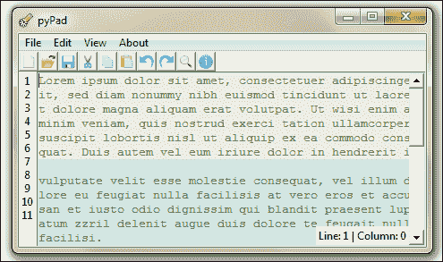

我们打算在记事本中包含以下功能：

+   创建新文档、打开和编辑现有文档以及保存文档

+   实现常见的编辑选项，如剪切、复制、粘贴、撤销和重做

+   在文件中搜索给定的搜索词

+   实现行号和显示/隐藏行号的能力

+   实现主题选择，让用户选择自定义颜色主题

+   实现关于和帮助窗口等更多功能

## 为什么它很棒？

在这个项目中，你将构建你的第一个真正有用的项目。这个项目将帮助你更深入地了解 Tkinter 的世界。它将深入探讨一些常用小部件的功能，例如菜单、菜单按钮、文本、输入框、复选框和按钮小部件。

尤其是我们将深入了解菜单、菜单栏和文本小部件的细节。我们还将学习如何轻松处理自定义对话框，如打开、保存、错误、警告和信息对话框。

## 你的热辣目标

该项目将分七个连续迭代进行开发。每个迭代的目的是如下：

+   使用`pack`几何布局和菜单、菜单栏、文本、输入框、按钮、复选框等小部件设置用户界面

+   使用 Tkinter 内置的小部件选项实现一些功能

+   使用`ttk`对话框和不同类型的 Toplevel 小部件实现对话框

+   应用一些文本小部件功能，如文本索引、标签和标记，以实现一些自定义功能

+   使用复选框和单选按钮小部件应用一些功能

+   应用一些自定义事件绑定和协议绑定，使应用程序更易于使用

+   添加一些杂项功能

# 设置小部件

我们的首要目标是实现文本编辑器的视觉元素。作为程序员，我们所有人都使用过记事本或某些代码编辑器来编辑我们的代码。我们对文本编辑器的常见 GUI 元素大多有所了解。因此，无需过多介绍，让我们开始吧。

## 准备发射

第一阶段实现了以下六个小部件：

+   菜单

+   菜单按钮

+   标签

+   按钮

+   文本

+   滚动条

虽然我们将详细涵盖所有这些内容，但你可能会发现查看 Tkinter 作者 Frederick Lundh 维护的文档中的小部件特定选项很有帮助。[`effbot.org/tkinterbook/`](http://effbot.org/tkinterbook/)

您可能还想将位于[`www.tcl.tk/man/tcl8.5/TkCmd/contents.htm`](http://www.tcl.tk/man/tcl8.5/TkCmd/contents.htm)的 Tck/Tk 官方文档页面添加到书签。

后者网站包括原始 Tcl/Tk 参考。虽然它与 Python 无关，但它提供了每个小部件的更详细概述，同样是一个有用的参考。（记住，Tkinter 只是 Tk 的包装器）

您也可以通过在交互式 Python shell 中输入以下两行来阅读 Tkinter 原始源代码提供的文档：

```py
>>> import Tkinter
>>>help(Tkinter)

```

## 启动推进器

在这个迭代中，我们将完成程序大多数视觉元素的实现。

### 注意

我们将使用`pack()`布局管理器来放置所有小部件。我们选择`pack`管理器，因为它非常适合放置小部件并排或自上而下排列。幸运的是，在文本编辑器中，所有小部件都放置在并排或自上而下的位置。因此，使用`pack`管理器是合适的。我们也可以使用`grid`管理器做到同样的事情。

1.  首先，我们将从添加 Toplevel 窗口开始，该窗口将包含所有其他小部件，使用以下代码：

    ```py
    from Tkinter import *
    root = Tk()
    # all our code is entered here
    root.mainloop()
    ```

1.  在这一步中，我们将向我们的代码中添加顶级菜单按钮。请参阅`2.01.py`中的代码。菜单提供了一种非常紧凑的方式来向用户展示大量选择，而不会使界面杂乱。Tkinter 提供了两个小部件来处理菜单。

    +   **菜单按钮**小部件——它是菜单的一部分，出现在应用程序的顶部，始终对最终用户可见

    +   **菜单**小部件——当用户点击任何菜单按钮时显示选择列表的小部件

    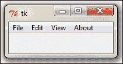

    要添加顶级菜单按钮，您可以使用以下命令：

    ```py
    mymenu = Menu(parent, **options)
    ```

    例如，要添加文件菜单，我们使用以下代码：

    ```py
    # Adding Menubar in the widget
    menubar = Menu(root)
    filemenu = Menu(menubar, tearoff=0 ) # File menu
    root.config(menu=menubar) # this line actually displays menu
    ```

    类似地，我们在顶部添加了编辑、视图和关于菜单。请参考`2.01.py`的第 2 步。

    大多数 Linux 平台支持**可撕菜单**。当`tearoff`设置为`1`（启用）时，菜单选项上方会出现一条虚线。点击虚线允许用户实际上撕下或分离菜单与顶部的连接。然而，由于这不是一个跨平台特性，我们决定禁用撕下功能，将其标记为`tearoff = 0`。

1.  现在，我们将向每个四个菜单按钮中添加菜单项。如前所述，所有下拉选项都应添加在菜单实例中。在我们的示例中，我们在文件菜单中添加了五个下拉菜单选择，即新建、打开、保存、另存为和退出菜单项。请参阅`2.02.py`的第 3 步。

    类似地，我们为其他菜单添加以下菜单选择：

    +   在**编辑**下，我们有**撤销**、**重做**、**剪切**、**复制**、**粘贴**、**查找全部**和**全选**

    +   在**视图**下，我们有**显示行号**、**在底部显示信息栏**、**高亮当前行**和**主题**

    +   在**关于**下，我们有**关于**和**帮助**

    添加菜单项的格式如下：

    ```py
    mymenu.add_command(label="Mylabel", accelerator='KeyBoard Shortcut', compound=LEFT, image=myimage, underline=0,  command=callback)
    ```

    例如，您可以使用以下语法创建**撤销**菜单项：

    ```py
    mymenu.add_command(label="Undo", accelerator='Ctrl + Z', compound=LEFT, image=undoimage, command=undocallback)
    ```

    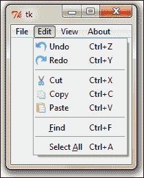

1.  接下来我们将添加一些标签。我们将添加顶部标签，它将后来包含快捷按钮。我们还将添加一个标签到左侧以显示行号：

    为了说明目的，顶部标签被标记为绿色背景，侧标签被标记为浅奶油色背景。

    ### 注意

    当使用`pack`布局管理器时，按小部件将出现的顺序添加小部件非常重要。这是因为`pack()`使用可用空间的概念来适应小部件。如果我们不保持顺序，小部件将按照它们被引入的顺序开始占用位置。这就是为什么我们不能在两个标签小部件之前引入文本小部件，因为它们在显示中位置更高。

    保留空间后，我们可以在保持标签作为父小部件的同时添加快捷图标或行号。添加标签很容易，我们以前已经这样做过了。请参阅`2.02.py`步骤 4 中的代码。代码如下：

    ```py
    shortcutbar = Frame(root,  height=25, bg='light sea green')
    shortcutbar.pack(expand=NO, fill=X)
    lnlabel = Label(root,  width=2,  bg = 'antique white')
    lnlabel.pack(side=LEFT, anchor='nw', fill=Y)
    ```

    目前，我们已为这两个标签应用了彩色背景，以区分 Toplevel 窗口的主体。

1.  最后，让我们将文本小部件和滚动条小部件添加到我们的代码中。请参考`2.02.py`代码的步骤 5。

    ```py
    textPad = Text(root)
    textPad.pack(expand=YES, fill=BOTH)
    scroll=Scrollbar(textPad)
    textPad.configure(yscrollcommand=scroll.set)
    scroll.config(command=textPad.yview)
    scroll.pack(side=RIGHT, fill=Y)
    ```

    代码与我们迄今为止使用过的所有其他代码类似，用于实例化小部件。请注意，然而，滚动条被配置为 Text 小部件的`yview`，而 Text 小部件被配置为连接到滚动条小部件。这样，我们就将两个小部件相互交叉连接。

    现在当你向下滚动文本小部件时，滚动条会做出反应。或者，当你拉动滚动条时，文本小部件也会做出相应的反应。

这里引入了一些新的菜单特定选项，如下所示：

+   `加速器`: 此选项用于指定一个字符串，通常是键盘快捷键，可以用来调用菜单。作为加速器指定的字符串将出现在菜单项文本旁边。请注意，这不会自动创建键盘快捷键的绑定。我们稍后将手动设置它们。

+   `compound`: 将`compound`选项指定给菜单项可以让您在菜单的常见文本标签旁边添加图像。例如，`Compound=LEFT, label= 'mytext', image=myimage`的指定意味着菜单项有一个复合标签，由文本标签和图像组成，其中图像将放置在文本的左侧。我们在这里使用的图像存储和引用自一个名为`icons`的单独文件夹。

+   `underline`：`underline`选项允许您指定菜单文本中字符的索引以进行下划线。索引从 0 开始，这意味着指定`underline=1`将下划线文本的第二个字符。除了下划线外，Tkinter 还使用它来定义菜单键盘遍历的默认绑定。这意味着我们可以用鼠标指针或使用*Alt* + `<下划线字符索引处的字符>`快捷键来选择菜单。

因此，要在**文件**菜单中添加**新**菜单项，我们使用以下代码：

```py
filemenu.add_command(label="New", accelerator='Ctrl+N', compound=LEFT, image=newicon, underline=0,  command=new_file)
```

同样，我们为**编辑**菜单添加菜单选择项。

### 注意

**菜单分隔符**

在您的菜单项中，您可能会遇到`mymenu.add_separator()`之类的代码。此小部件显示一个分隔条，仅用于将相似的菜单项分组，通过水平条分隔组。

除了我们为**新**和**编辑**菜单实现的常规菜单类型外，Tkinter 还提供了三种其他类型的菜单：

+   **复选框菜单**：此菜单允许您通过勾选/取消勾选菜单来做出是/否的选择

+   **单选按钮菜单**：此菜单允许您从许多不同的选项中选择一个

+   **级联菜单**：此菜单仅展开以显示另一组选择

我们的**查看**菜单展示了以下截图中的这三种类型的菜单：

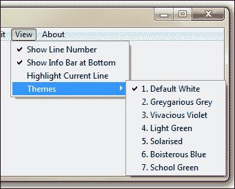

**查看**菜单下的前三个选项允许用户选择是否希望发生某些操作。用户可以检查/取消检查这些菜单中的选项，它们是复选框菜单的示例。

**查看**菜单下的第四个菜单项为**主题**。将鼠标悬停在此菜单上会打开另一组选择。这是一个级联菜单的示例，因为它仅用于打开另一组选择。

在**级联**菜单中，您将看到一组用于编辑主题的选择。然而，您只能选择其中一个主题。选择一个主题将取消任何之前的选中状态。这是一个单选按钮菜单的示例。

添加这三种类型菜单的示例格式如下：

```py
viewmenu.add_checkbutton(label="Show Line Number", variable=showln)
viewmenu.add_cascade(label="Themes", menu=themesmenu)
themesmenu.add_radiobutton(label="Default White", variable=theme)
```

现在我们需要跟踪是否已做出选择，我们通过添加一个变量来跟踪，该变量可以是`BooleanVar()`、`IntVar()`或`StringVar()`，正如我们在项目 1 中讨论的那样，*认识 Tkinter*。

对于 Menubutton 和 Menu 小部件的完整配置选项列表，请参阅附录 B 中的*基本小部件方法*部分，*快速参考表*。

## 目标完成 - 简短总结

这标志着我们的第一次迭代结束。在本迭代中，我们已经完成了文本编辑器大多数视觉元素的布局。

# 利用内置 Text 小部件选项的强大功能

Tkinter 的 Text 小部件自带一些方便的内置功能来处理常见的文本相关功能。让我们利用这些功能来实现我们文本编辑器中的常见功能。

## 启动推进器

1.  让我们首先实现剪切、复制和粘贴功能。我们现在已经准备好了编辑器 GUI。如果你打开程序并玩 Text 小部件，你会注意到你可以在文本区域使用键盘快捷键*Ctrl* + *X*、*Ctrl* + *C*和*Ctrl* + *V*执行基本功能，如剪切、复制和粘贴。所有这些功能都存在，我们不必为这些功能添加任何代码。

    显然，文本小部件内置了这些事件。我们不必自己编写这些函数，而是使用内置函数将这些功能添加到我们的文本编辑器中。

    Tcl/Tk "通用小部件方法"的文档告诉我们，我们可以使用以下命令来触发事件，而无需任何外部刺激：

    ```py
    widget.event_generate(sequence, **kw)

    ```

    要触发`textPad`小部件的剪切事件，我们只需要一行代码，如下所示：

    ```py
    textPad.event_generate("<<Cut>>")
    ```

    让我们称它为使用一个函数 cut，并将其与我们的 cut 菜单使用命令回调关联起来。参见包含以下代码的`2.03.py`代码：

    ```py
    def cut():
     textPad.event_generate("<<Cut>>")
    # then define a command callback from our existing cut menu like:
    editmenu.add_command(label="Cut", compound=LEFT, image=cuticon, accelerator='Ctrl+X', command=cut)
    ```

    同样，我们从各自的菜单项触发复制和粘贴功能。

1.  接下来，我们将继续实现撤销和重做功能。Tcl/Tk 文本文档告诉我们，Text 小部件具有无限撤销和重做机制，前提是我们将`-undo`选项设置为`true`。为了利用此选项，让我们首先将 Text 小部件的`undo`选项设置为`true`，如下面的截图所示：

    ```py
    textPad = Text(root, undo=True)
    ```

    现在如果你打开你的文本编辑器并尝试使用*Ctrl* + *Z*和*Ctrl* + *Y*来尝试撤销和重做功能，你会看到它们工作得很好。我们现在只需要将事件与函数关联起来，并分别从我们的**撤销**和**重做**菜单回调函数。这与我们对剪切、复制和粘贴所做的是类似的。请参阅`2.03.py`中的代码。

## 目标完成 - 简报

利用一些内置 Text 小部件选项，我们已成功地将剪切、复制、粘贴、撤销和重做功能实现到我们的文本编辑器中，而代码量最小化。

# 索引和标记

虽然我们成功地利用了一些内置功能来获得快速的优势，但我们需要对文本区域有更精确的控制，以便按照我们的意愿弯曲它。这将需要能够以精确的方式定位文本中的每个字符或位置。

## 准备起飞

Text 小部件为我们提供了使用**索引**、**标记**和**标记**来操作其内容的能力，这使得我们可以定位文本区域中的位置或位置进行操作。

### 索引

索引可以帮助你定位文本中的特定位置。例如，如果你想以粗体样式或红色或不同的字体大小标记一个特定的单词，如果你知道起始点和目标结束点的索引，你可以这样做。

索引必须指定在以下格式之一中：

| 索引格式 | 描述 |
| --- | --- |
| `x.y` | 第 *x* 行的第 *y* 个字符。 |
| `@x,y` | 在文本窗口内覆盖 `x`、`y` 坐标的字符。 |
| `end` | 文本的末尾。 |
| `mark` | 命名标记后的字符。 |
| `tag.first` | 文本中带有给定标签的第一个字符。 |
| `tag.last` | 文本中带有给定标签的最后一个字符。 |
| `selection (SEL_FIRST, SEL_LAST)` | 这对应于当前选择。常量 `SEL_FIRST` 和 `SEL_LAST` 分别指选择中的起始位置和结束位置。如果没有任何选择，Tkinter 会引发 TclError 异常。 |
| `windowname` | 嵌入窗口的名称为 `windowname` 的位置。 |
| `imagename` | 嵌入图像的名称为 `imageName` 的位置。 |
| `INSERT` | 插入光标的位置。 |
| `CURRENT` | 鼠标指针最近的位置的字符。 |

索引可以使用修饰符和子修饰符进一步操作。以下是一些修饰符和子修饰符的示例：

+   `end - 1 chars` 或 `end - 1 c` 指的是末尾前一个字符的索引

+   `insert +5lines` 指的是插入光标前方五行的索引

+   `insertwordstart - 1 c` 指的是包含插入光标的第一字的字符之前

+   `end linestart` 指的是末尾行起始的索引

索引通常用作函数的参数。例如，参考以下列表：

+   `text.delete(1.0,END)`: 这意味着您可以从第 1 行第 0 列删除到末尾

+   `text.get(0.0, END)`: 这将获取从 0.0 到末尾的内容

+   `text.delete(insert-1c, INSERT)`: 这将在插入光标处删除一个字符

### 标签

标签用于使用识别字符串注释文本，然后可以使用该字符串来操作标记的文本。Tkinter 有一个内置的标签称为 **SEL**，它自动应用于所选文本。除了 SEL 之外，您还可以定义自己的标签。文本范围可以与多个标签相关联，相同的标签可以用于许多不同的文本范围。

以下是一些标记的示例：

```py
mytext.tag_add('sel', '1.0', 'end') # add SEL tag from start(1.0) to end
mytext.tag_add("danger", "insert linestart", "insert lineend+1c")
mytext.tag_remove("danger", 1.0, "end")
mytext.tag_config('danger', background=red)
mytext.tag_config('outdated', overstrike=1)
```

### 注意

您可以使用 `tag_config` 选项指定给定标签的视觉样式，例如 `background(color)`、`bgstipple (bitmap)`、`borderwidth (distance)`、`fgstipple (bitmap)`、`font (font)`、`foreground (color)`、`justify (constant)`、`lmargin1 (distance)`、`lmargin2 (distance)`、`offset (distance)`、`overstrike (flag)`、`relief (constant)`、`rmargin (distance)`、`spacing1 (distance)`、`tabs (string)`、`underline (flag)` 和 `wrap (constant)`。

要获取文本索引和标记的完整参考，请在您的 Python 交互式外壳中输入以下命令：

```py
>>> import Tkinter
>>> help(Tkinter.Text)

```

## 启动推进器

在掌握了基本的索引和标记知识后，让我们在我们的代码编辑器中实现一些更多功能。

1.  我们将要实现的第一项功能是“全选”功能。我们知道 Tkinter 有一个内置的`SEL`标签，它将选择应用于给定的文本范围。我们希望将此`sel`标签应用于我们小部件中包含的完整文本。

    我们只需定义一个函数来处理这种情况。请参考以下代码片段中的`2.04.py`代码：

    ```py
    def select_all():
      textPad.tag_add('sel', '1.0', 'end')

    ```

    在此之后，我们向我们的全选菜单项添加了一个回调：

    ```py
    editmenu.add_command(label="Select All", underline=7, accelerator='Ctrl+A', command=select_all)
    ```

    现在，我们已经完成了向我们的代码编辑器添加全选功能。如果你现在向文本小部件中添加一些文本，然后点击菜单项**全选**，它应该选择编辑器中的全部文本。请注意，我们没有在菜单选项中绑定*Ctrl* + *A*快捷键。因此，键盘快捷键将不起作用。我们将在单独的步骤中实现`accelerator`函数。

1.  接下来，让我们完成**查找**菜单项的功能。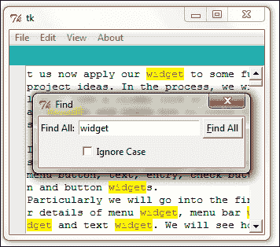

    这里是一个快速的功能总结。当用户点击**查找**菜单项时，会打开一个新的 Toplevel 窗口。用户输入一个搜索关键字，并指定搜索是否区分大小写。当用户点击**查找全部**按钮时，所有匹配项都会被突出显示。

    对于在文档中搜索，我们将依赖于`text.search()`方法。`search`方法接受以下参数：

    ```py
    search(pattern, startindex, stopindex=None, forwards=None, backwards=None, exact=None, regexp=None, nocase=None, count=None)
    ```

    对于我们的编辑器，我们定义了一个名为`on_find`的函数，并将其作为回调附加到我们的**查找**菜单项（请参考`2.04.py`中的代码）：

    ```py
    editmenu.add_command(label="Find", underline= 0, accelerator='Ctrl+F', command=on_find)
    ```

    然后，我们定义我们的函数`on_find`如下（请参考`2.04.py`中的代码）：

    ```py
    def on_find():
      t2 = Toplevel(root)
      t2.title('Find')
      t2.geometry('262x65+200+250')
      t2.transient(root)
      Label(t2, text="Find All:").grid(row=0, column=0, sticky='e')
          v=StringVar()
          e = Entry(t2, width=25, textvariable=v)
      e.grid(row=0, column=1, padx=2, pady=2, sticky='we')
      e.focus_set()
      c=IntVar()
      Checkbutton(t2, text='Ignore Case', variable=c).grid(row=1, column=1, sticky='e', padx=2, pady=2)
      Button(t2, text="Find All", underline=0,  command=lambda: search_for(v.get(), c.get(), textPad, t2, e)).grid(row=0, column=2, sticky='e'+'w', padx=2, pady=2)

    def close_search():
      textPad.tag_remove('match', '1.0', END)
      t2.destroy()

    t2.protocol('WM_DELETE_WINDOW', close_search)#override close 
    ```

    上一段代码的描述如下：

    +   当用户点击**查找**菜单项时，它调用一个回调`on_find`。

    +   `on_find()`函数的前四行创建了一个新的 Toplevel 窗口，添加了一个标题`查找`，指定了它的几何形状（大小、形状和位置），并将其设置为临时窗口。将其设置为临时窗口意味着它始终位于其父窗口或根窗口之上。如果你取消注释此行并点击根编辑窗口，**查找**窗口将位于根窗口之后。

    +   以下八行代码相当直观，它们设置了**查找**窗口的控件。它添加了 Label、Entry、Button 和 Checkbutton 控件，并为两个变量`e`和`c`提供了跟踪用户输入到 Entry 控件中的值以及用户是否检查了复选框的功能。这些控件使用`grid`几何管理器排列，以适应**查找**窗口。

    +   **查找全部**按钮有一个`command`选项，它调用一个函数`search_for()`，将搜索字符串作为第一个参数传递，并将搜索是否区分大小写作为第二个参数传递。第三个、第四个和第五个参数将 Toplevel 窗口、Text 小部件和 Entry 小部件作为参数传递。

    +   在`search_for()`方法之前，我们覆盖了查找窗口的关闭按钮，并将其重定向到名为`close_search()`的回调。`close_search()`方法定义在`on_find()`函数中。此函数负责删除在搜索过程中添加的`match`标签。如果我们不覆盖关闭按钮并删除这些标签，即使我们的搜索已经结束，匹配的字符串也会继续用红色和黄色标记。

1.  接下来，我们有一个`search_for()`函数，它执行实际的搜索。代码如下：

    ```py
    def search_for(needle, cssnstv, textPad, t2, e) :
      textPad.tag_remove('match', '1.0', END)
      count =0
      if needle:
        pos = '1.0'
        while True:
          pos = textPad.search(needle, pos, nocase=cssnstv,stopindex=END)
        if not pos: break
          lastpos = '%s+%dc' % (pos, len(needle))
          textPad.tag_add('match', pos, lastpos)
          count += 1
          pos = lastpos
      textPad.tag_config('match', foreground='red',background='yellow')
      e.focus_set()
      t2.title('%d matches found' %count)
    ```

    代码的描述如下：

    +   这段代码是搜索功能的核心。它使用`while True`循环遍历整个文档，只有当没有更多文本项需要搜索时才会退出循环。

    +   代码首先删除任何先前的搜索相关`match`标签，因为我们不希望将新搜索的结果附加到先前的搜索结果上。该函数使用 Tkinter 在 Text 小部件上提供的`search()`方法。`search()`函数接受以下参数：

        ```py
        search(pattern,  index,  stopindex=None,  forwards=None,  backwards=None, exact=None, regexp=None, nocase=None, count=None)
        ```

        该方法返回第一个匹配项的起始位置。我们将其存储在一个名为`pos`的变量中，并计算匹配单词中最后一个字符的位置，并将其存储在变量`lastpos`中。

    +   对于它找到的每个搜索匹配项，它都会在从第一个位置到最后一个位置的文本范围内添加一个名为`match`的标签。每次匹配后，我们将`pos`的值设置为等于`lastpos`。这确保了下一次搜索从`lastpos`之后开始。

    +   循环还使用`count`变量跟踪匹配的数量。

    +   在循环外部，`match`标签被配置为红色字体颜色，背景为黄色。此函数的最后一行更新**查找**窗口的标题，显示找到的匹配数量。

    ### 注意

    在事件绑定的情况下，您的输入设备（键盘/鼠标）与您的应用程序之间发生交互。除了事件绑定之外，Tkinter 还支持协议处理。

    “协议”一词指的是您的应用程序与窗口管理器之间的交互。一个协议的例子是`WM_DELETE_WINDOW`，它处理窗口管理器的`close`窗口事件。Tkinter 允许您通过指定根或 Toplevel 小部件的自己的处理程序来覆盖这些协议处理程序。要覆盖我们的窗口退出协议，我们使用以下命令：

    ```py
    root.protocol("WM_DELETE_WINDOW", callback)

    ```

    一旦添加此命令，Tkinter 就会绕过您指定的回调/处理程序进行协议处理。

## 目标完成 - 简报

恭喜！在这个迭代中，我们已经将全选和查找功能编码到我们的程序中。

更重要的是，我们介绍了索引和标签——这两个与许多 Tkinter 小部件相关的非常强大的概念。您将在您的项目中经常使用这两个概念。

## 分类智能

在之前的代码中，我们使用了一条读取为`t2.transient(root)`的行。让我们来理解这里的含义。

Tkinter 支持四种类型的 Toplevel 窗口：

+   **主 Toplevel 窗口**：这是我们迄今为止构建的窗口。

+   **子 Toplevel 窗口**：这些是独立于根的窗口。子 Toplevel 窗口独立于其根窗口，但如果其父窗口被销毁，它也会被销毁。

+   **瞬态 Toplevel 窗口**：这个窗口始终位于其父窗口之上。如果父窗口最小化，瞬态窗口将被隐藏；如果父窗口被销毁，瞬态窗口也将被销毁。

+   **未装饰的 Toplevel 窗口**：如果一个 Toplevel 窗口周围没有窗口管理器装饰，则称为未装饰的。它通过将`overrideredirect`标志设置为`1`来创建。未装饰的窗口不能调整大小或移动。

请查看`2.05.py`中的代码，以演示这四种类型的 Toplevel 窗口。

# 与表单和对话框一起工作

本次迭代的目的是完成**文件**菜单中的**打开**、**保存**和**另存为**选项的功能。

## 准备起飞

我们经常使用**打开**和**保存**对话框。它们在许多程序中都很常见。我们知道这些菜单项的行为。例如，当你点击**打开**菜单时，它会打开一个对话框，让你导航到你想要打开的文件的位置。当你选择一个特定的文件并点击**打开**时，它会在你的编辑器中打开。同样，我们还有**保存**对话框。

虽然我们可以使用标准的 Tkinter 小部件实现这些对话框，但它们被如此频繁地使用，以至于一个名为`tkFileDialog`的特定 Tkinter 模块已被包含在标准的 Python 发行版中。我们不会试图重新发明轮子，并且本着少编码的精神，我们将使用`tkFileDialog`模块来实现文本编辑器的打开和保存功能，如下面的截图所示：

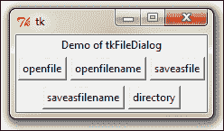

要使用该模块，我们只需将其导入当前命名空间，如`2.06.py`代码文件中所示：

```py
import tkFileDialog

```

您可以为`tkFileDialog`指定以下附加选项：

| 文件对话框 | 可配置选项 | 描述 |
| --- | --- | --- |
| `askopenfile(mode='r', **options)` | `parent`, `title`, `message`, `defaultextension`, `filetypes`, `initialdir`, `initialfile`, 和 `multiple` | 询问要打开的文件名，然后返回打开的文件 |
| `askopenfilename(**options)` | `parent`, `title`, `message`, `defaultextension`, `filetypes`, `initialdir`, `initialfile`, 和 `multiple` | 询问要打开的文件名，但不返回任何内容 |
| `asksaveasfile(mode='w', **options)` | `parent`, `title`, `message`, `defaultextension`, `filetypes`, `initialdir`, `initialfile`, 和 `multiple` | 询问要保存的文件名，并返回打开的文件 |
| `asksaveasfilename(**options**)` | `parent`, `title`, `message`, `defaultextension`, `filetypes`, `initialdir`, `initialfile`, 和 `multiple` | 询问要保存的文件名，但返回空值 |
| `askdirectory(**options**)` | `parent`, `title`, `initialdir`, `must exist` | 询问目录，并返回文件名 |

## 然后，我们启动推进器。

1.  让我们现在使用`tkDialogBox`（参考代码`2.07.py`）开发我们的打开函数：

    ```py
    import tkFileDialog
    import os

    def open_file():
      global filename
      filename =   tkFileDialog.askopenfilename(defaultextension=".txt",filetypes =[("All Files","*.*"),("Text Documents","*.txt")])
      if filename == "": # If no file chosen.
        filename = None # Absence of file.
      else:
        root.title(os.path.basename(filename) + " - pyPad") # 
        #Returning the basename of 'file'
        textPad.delete(1.0,END)         
        fh = open(filename,"r")        
        textPad.insert(1.0,fh.read()) 
        fh.close()
    ```

    然后，我们修改**打开**菜单，为此新定义的方法添加一个`command`回调。

    ```py
    filemenu.add_command(label="Open", accelerator='Ctrl+O', compound=LEFT, image=openicon, underline =0, command=open_file)
    ```

    代码的描述如下：

    +   我们将`tkfileDialog`和`os`模块导入当前命名空间。

    +   我们定义了我们的函数`open_file()`。

    +   我们在全局范围内声明一个变量来跟踪打开文件的文件名。这是为了跟踪文件是否已被打开。我们需要这个变量在全局范围内，因为我们希望这个变量对其他方法如`save()`和`save_as()`可用。如果不指定为全局，则意味着它仅在函数内部可用。所以我们的`save()`和`save_as()`函数将无法检查编辑器中是否已打开文件。

    +   我们使用`tkFileDialog.askopenfilename`获取打开文件的文件名。如果用户取消打开文件或没有选择文件，返回的文件名是`None`。在这种情况下，我们不做任何事情。

    +   然而，如果`tkFileDialog`返回一个有效的文件名，我们使用`os`模块隔离文件名，并将其添加为我们根窗口的标题。

    +   如果文本小部件已经包含一些之前的文本，我们将其全部删除。

    +   然后，我们以读取模式打开指定的文件，并将所有内容插入到文本区域中。

    +   然后，我们关闭文件句柄`fh`。

    +   最后，我们向我们的**文件** | **打开**菜单项添加一个`command`回调。

    这完成了**文件** | **打开**的编码。如果你现在去点击**文件** | **打开**，选择一个文本文件并点击**打开**，文本区域将填充文本文件的内容。

    ### 注意

    通常认为使用全局变量是一种不良的编程实践，因为它很难理解使用大量全局变量的程序。

    全局变量可以在程序中的许多不同地方修改或访问，因此很难记住或确定变量的所有可能用途。

    全局变量不受任何访问控制的约束，这可能在某些情况下造成安全风险，例如当此程序与第三方代码交互时。

    然而，当你像这样在程序中以过程式风格工作时，全局变量有时是不可避免的。

    编程的另一种方法是编写类结构中的代码（也称为**面向对象编程**），其中变量只能由预定义类的成员访问。在下一个项目中，我们将看到许多面向对象编程的例子。

1.  接下来，我们将看到如何保存文件。保存文件有两个组件：

    +   保存文件

    +   另存为

    如果文本区域已经包含文件，我们不会提示用户输入文件名。我们只是简单地覆盖现有文件的内容。如果文本区域的当前内容没有关联的文件名，我们将使用 **另存为** 对话框提示用户。此外，如果文本区域有一个打开的文件，并且用户点击 **另存为**，我们仍然会提示他们使用 **另存为** 对话框，以便他们可以将内容写入不同的文件名。

    保存和另存为的代码如下（请参阅 `2.07.py` 中的代码）：

    ```py
    #Defining save method
    def save():
      global filename
      try:
        f = open(filename, 'w')
        letter = textPad.get(1.0, 'end')
        f.write(letter)
        f.close()
      except:
        save_as()

    #Defining save_as method
    def save_as():
      try:
         # Getting a filename to save the file.
         f = tkFileDialog.asksaveasfilename(initialfile = 'Untitled.txt', defaultextension=".txt",filetypes=[("All Files","*.*"),("Text Documents","*.txt")])
         fh = open(f, 'w')           
         textoutput = textPad.get(1.0, END)
         fh.write(textoutput)              
         fh.close()
         root.title(os.path.basename(f) + " - pyPad")
      except:
         pass

    filemenu.add_command(label="Save", accelerator='Ctrl+S', compound=LEFT, image=saveicon, underline=0, command=save)
    filemenu.add_command(label="Save as", accelerator='Shift+Ctrl+S', command=save_as)
    ```

    代码描述如下：

    +   `save` 函数首先尝试使用 `try` 块定位文本区域是否已打开文件。如果文件已打开，它将简单地用文本区域的当前内容覆盖文件内容。

    +   如果文本区域没有关联的文件名，它将简单地将工作传递给我们的 `save_as` 函数。

    +   `save_as` 函数使用 `tkFileDialog.asksaveasfilename` 打开一个对话框，并尝试获取用户为给定文件提供的文件名。如果成功，它将以写入模式打开新文件，并将文本内容写入此新文件名。写入后，它关闭当前文件句柄，并将窗口标题更改为反映新文件名。

    +   为了获取新的文件名，我们的 `save_as` 函数使用了 `os` 模块。因此，在我们能够使用它来提取当前文件名之前，我们需要将 `os` 模块导入到我们的命名空间中。

    +   如果用户没有指定文件名或用户取消 `save_as` 操作，它将简单地使用 `pass` 命令忽略该过程。

    +   最后，我们向现有的 **保存** 和 **另存为** 菜单项添加了一个 `command` 回调，以调用这两个函数。

    现在我们已经完成了向代码编辑器添加保存和另存为功能。

1.  在此同时，让我们完成 **文件** | **新建** 的功能。代码很简单。为此，请参阅 `2.07.py` 中的代码：

    ```py
    def new_file():
      root.title("Untitled")
      global filename
      filename = None
      textPad.delete(1.0,END)

      filemenu.add_command(label="New", accelerator='Ctrl+N', compound=LEFT, image=newicon, underline=0, command=new_file  )
    ```

    此代码的描述如下：

    +   `new_file` 函数首先将根窗口的 `title` 属性更改为 `Untitled`。

    +   然后它将全局变量 `filename` 的值设置为 `None`。这很重要，因为我们的 `save` 和 `save_As` 功能使用这个全局变量名来跟踪文件是否存在或是否为新文件。

    +   然后我们的函数删除了 Text 小部件的所有内容，在其位置创建了一个新的文档。

    +   最后，我们向 **文件** | **新建** 菜单项添加了一个 `command` 回调函数。

    这完成了我们将代码编辑器中的 **文件** | **新建** 的编码。

## 目标完成 - 简报

在这次迭代中，我们完成了编辑器下 **文件** 菜单中 **新建**、**打开**、**保存** 和 **另存为** 子菜单的功能编码。

更重要的是，我们看到了如何使用`tkFileDialog`模块来实现程序中的某些常用功能。我们还看到了如何使用索引来实现我们程序的各种任务。

# 与消息框一起工作

在这个迭代中，让我们完成**关于**和**帮助**菜单的代码。功能很简单。当用户点击**帮助**或**关于**菜单时，它会弹出一个消息窗口并等待用户通过点击按钮进行响应。虽然我们可以轻松地编写新的 Toplevel 窗口来显示我们的**关于**和**帮助**弹出窗口，但我们将使用一个名为`tkMessageBox`的模块来实现此功能。这是因为该模块提供了一种以最小编码方式处理此类和类似功能的高效方法。

我们还将在这个迭代中完成**退出**按钮功能的编码。目前，当用户点击**关闭**按钮时，窗口只是简单地关闭。我们希望询问用户他们是否真的想要退出，或者他们是否意外地点击了**关闭**按钮。

## 准备起飞

`tkMessageBox`模块提供了现成的消息框，可以在您的应用程序中显示各种消息。其中一些函数是`showinfo`、`showwarning`、`showerror`、`askquestion`、`askyesno`、`askokcancel`和`askretryignore`。以下截图展示了它们在使用时的示例：

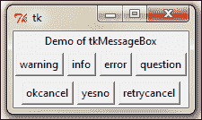

要使用该模块，我们只需将其导入到当前命名空间中，如下所示：

```py
import tkMessageBox

```

`tkMessageBox`的常用功能在`2.08.py`中进行了演示。以下是一些常见的使用模式：

```py
tkMessageBox.showwarning("Beware", "You are warned")
tkMessageBox.showinfo("FYI", "This is FYI")
tkMessageBox.showerror("Err..", "its leaking.")
tkMessageBox.askquestion("?", "Can you read this ?")
tkMessageBox.askokcancel("OK", "Quit Postponing ?")
tkMessageBox.askyesno("Yes or No", " What Say ?")    
tkMessageBox.askretrycancel("Retry", "Load Failed")
```

使用此模块显示消息有以下优点：

+   最小化编码即可实现功能特性

+   消息可以轻松配置

+   消息带有图标

+   它在每个平台上呈现了常见消息的标准化视图

## 启动推进器

1.  现在，让我们为我们的代码编辑器编写`about`和`help`函数。用例很简单。当用户点击**关于**菜单时，它会弹出一个带有**OK**按钮的消息。同样，当用户点击**帮助**按钮时，他们也会被提示一个带有**OK**按钮的消息。

    为了实现这些功能，我们在编辑器中包含了以下代码。（参见`2.09.py`中的代码）

    ```py
    import tkMessageBox
    def about(event=None):
      tkMessageBox.showinfo("About","Tkinter GUI Application\n Development Hotshot")

    def help_box(event=None):
      tkMessageBox.showinfo("Help","For help refer to book:\n
      Tkinter GUI Application\n Development Hotshot ", icon='question')

    aboutmenu.add_cascade(label="Help", command=help_box)
    ```

1.  接下来，我们将探讨添加**退出确认**功能。当用户点击**文件** | **退出**时，它将弹出一个`Ok-Cancel`对话框以确认退出操作。

    ```py
    def exit_editor(event=None):
      if tkMessageBox.askokcancel("Quit", "Do you really want to quit?"):
        root.destroy()
    root.protocol('WM_DELETE_WINDOW', exit_command) # override close 
    filemenu.add_command(label="Exit", accelerator='Alt+F4', command=exit_editor)
    ```

    代码描述如下：

    +   首先，我们将`tkMessageBox`导入到当前命名空间中。

    +   然后，我们定义我们的`about`函数来显示一个`showinfo`消息框。

    +   同样，我们定义了我们的`help_box`函数来显示一个`showinfo`消息框。

    +   然后，我们定义了一个带有`askokcancel`框的`exit`命令。如果用户点击**OK**，则`exit`命令销毁根窗口以关闭窗口。

    +   我们随后覆盖了关闭按钮的协议，并将其重定向到我们定义的`exit`命令处理。

    +   最后，我们向**关于**、**帮助**和**退出**菜单项添加`command`回调。

## 目标完成 - 简要说明

在这次迭代中，我们完成了代码编辑器中**文件**|**退出**、**关于**|**关于**和**关于**|**帮助**菜单项的功能编码。我们还看到了如何使用`tkMessageBox`模块来显示不同格式的常用消息框。

# 图标工具栏和视图菜单功能

在这次迭代中，我们将向我们的文本编辑器添加更多功能：

+   显示快捷图标工具栏

+   显示行号

+   高亮当前行

+   更改编辑器的颜色主题

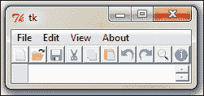

在这个过程中，我们将看到更多索引和标记的使用。

## 启动推进器

让我们首先从一项简单的任务开始。在这个步骤中，我们将快捷图标工具栏添加到我们的编辑器中。回想一下，我们已经创建了一个框架来容纳这些工具栏图标。现在让我们添加这些图标。

1.  让我们从添加快捷图标工具栏开始。在添加这些图标时，我们已经遵循了一个约定。所有图标都已放置在`icons`文件夹中。此外，图标的命名与处理它们的相应函数完全一致。遵循这个约定使我们能够同时在一个列表中循环，将图标图像应用于每个按钮，并在循环中添加`command`回调。

    代码已经被放置在我们之前创建的快捷框架中，用于放置这些图标。代码如下（参考`2.10.py`中的代码）：

    ```py
    shortcutbar = Frame(root,  height=25, bg='light sea green')
    #creating icon toolbar
    icons = ['new_file', 'open_file', 'save', 'cut', 'copy', 'paste', 'undo', 'redo', 'on_find', 'about']
    for i, icon in enumerate(icons):
      tbicon = PhotoImage(file='icons/'+icon+'.gif')
      cmd = eval(icon)
      toolbar = Button(shortcutbar, image=tbicon, command=cmd)
      toolbar.image = tbicon
      toolbar.pack(side=LEFT)
    shortcutbar.pack(expand=NO, fill=X)
    ```

    代码的描述如下：

    +   在我们的第一次迭代中，我们已经创建了一个快捷栏。现在我们将代码放置在我们创建框架和行的行之间，以及我们使用`pack`管理器显示它的地方。

    +   我们创建了一个图标列表，注意要将其命名为与图标名称完全一致。

    +   然后，我们通过一个长度等于图标列表中项目数量的循环进行迭代。在每次循环中，我们创建一个按钮小部件，获取相应的图像并添加相应的`command`回调。

    +   在添加`command`回调之前，我们必须使用`eval`命令将字符串转换为等效的表达式。如果我们不应用`eval`，它就不能作为表达式应用于我们的`command`回调。

    这完成了我们快捷图标工具栏的编码。现在，如果您运行代码（代码`2.10.py`），它应该会在顶部显示快捷图标工具栏。此外，由于我们已经将每个按钮链接到回调，所有这些快捷图标都应该按预期工作。

1.  让我们现在努力在文本小部件的左侧框架上显示行号。这需要我们在代码的多个地方进行一些调整。因此，在我们开始编码之前，让我们看看我们在这里试图实现什么：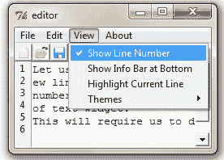

    +   **视图**菜单中有一个菜单项，允许用户选择是否显示行号。我们只想在选中选项时显示行号。

    +   如果选中了选项，我们需要在之前创建的左侧框架中显示行号。

    +   每当用户输入新行、删除行、从行剪切或粘贴文本、执行撤销或重做操作、打开现有文件或点击新菜单项时，行号都应该更新。简而言之，行号应该在可能影响行号的任何活动之后更新。

    因此，我们需要定义一个名为 `update_line_number()` 的函数。这个函数应该在每次按键、剪切、粘贴、撤销、重做、新建和打开定义之后被调用，以检查文本区域中是否有行被添加或删除，并相应地更新行号。我们通过以下两种策略实现这一点（请参阅 `2.10.py` 中的代码）：

    +   将任何按键事件绑定到我们的 `update_line_number()` 函数：

        ```py
        	textPad.bind("<Any-KeyPress>", update_line_number)
        ```

    +   在我们的剪切、粘贴、撤销、重做、新建和打开的定义中添加对 `update_line_number()` 函数的调用

    最后，我们按照以下方式定义我们的 `update_line_number()` 函数：

    ```py
    def update_line_number(event=None):
      txt = ''
      if showln.get(): 
         endline, endcolumn = textPad.index('end-1c').split('.')
         txt = '\n'.join(map(str, range(1, int(endline))))
      lnlabel.config(text=txt, anchor='nw')
    ```

    代码的描述如下：

    +   回想一下，我们之前已经将一个变量 `showln` 分配给了我们的菜单项：

        ```py
        	showln = IntVar()
        	showln.set(1)
        	viewmenu.add_checkbutton(label="Show Line Number", variable=showln)
        	update_line_number
        ```

    +   我们首先将标签的文本配置标记为空白。

    +   如果 `showline` 选项设置为 `1`（也就是说，在菜单项中勾选了），我们计算文本中的最后一行和最后一列。

    +   然后，我们创建一个由数字组成的文本字符串，从 1 到最后一行的数字，每个数字之间用换行符 `\n` 分隔。然后，我们使用 `textPad.config()` 方法将这个字符串添加到左侧标签。

    +   如果菜单中的 **显示行号** 未选中，变量文本保持空白，因此不显示行号。

    +   最后，我们将之前定义的剪切、粘贴、撤销、重做、新建和打开函数更新，在它们的末尾调用 `update_line_number()` 函数。

    我们现在已经完成了向我们的文本编辑器添加行号功能。

    ### 注意

    你可能已经注意到了我们之前给出的函数定义中的 `event=None` 参数。我们需要在这里指定它，因为这个函数可以从两个地方调用：

    +   从事件绑定（我们将其绑定到 `<Any-KeyPress>` 事件）

    +   来自其他函数，如剪切、复制、粘贴、撤销、重做等

    当函数从其他函数调用时，不传递任何参数。然而，当函数从事件绑定调用时，事件对象作为参数传递。如果我们不指定 `event=None` 参数，并且函数从事件绑定调用，它将给出以下错误：

    ```py
    TypeError: myfunction() takes no arguments (1 given)

    ```

1.  在这个迭代的最后，我们将实现一个功能，允许用户选择在当前行添加高亮。（请参阅 `2.10.py` 中的代码）

    这个想法很简单。我们需要定位光标所在的行并给该行添加一个标签。最后，我们需要配置这个标签以不同的颜色背景显示，以突出显示。

    回想一下，我们已经为用户提供了一个菜单选项来决定是否突出显示当前行。现在，我们将从这个菜单项添加一个`command`回调到一个我们定义的`toggle_highlight`函数：

    ```py
    hltln = IntVar()
    viewmenu.add_checkbutton(label="Highlight Current Line", onvalue=1, offvalue=0, variable=hltln, command=toggle_highlight)
    ```

    我们定义了三个函数来帮我们处理这个问题：

    ```py
    #line highlighting 
    def highlight_line(interval=100):
      textPad.tag_remove("active_line", 1.0, "end")
      textPad.tag_add("active_line", "insert linestart", "insert lineend+1c")
      textPad.after(interval, toggle_highlight)

    def undo_highlight():
      textPad.tag_remove("active_line", 1.0, "end")

    def toggle_highlight(event=None):
      val = hltln.get()
      undo_highlight() if not val else highlight_line()
    ```

    代码的描述如下：

    +   每次用户勾选/取消勾选**视图** | **突出显示当前行**时，都会调用我们的`toggle_highlight`函数。这个函数检查菜单项是否被勾选。如果被勾选，它调用`highlight_line`函数；否则，如果菜单项未被勾选，它调用撤销突出显示的函数。

    +   我们的`highlight_line`函数简单地将一个名为`active_line`的标签添加到当前行，并且每过一秒钟它调用切换突出显示的函数来检查当前行是否应该仍然被突出显示。

    +   当用户在**视图**菜单中取消勾选突出显示时，会调用我们的`undo_highlight`函数。一旦被调用，它简单地从整个文本区域中移除`active_line`标签。

    +   最后，我们配置我们的标签`active_line`以不同的背景颜色显示：

        ```py
        	textPad.tag_configure("active_line", background="ivory2")
        ```

    ### 注意

    在我们的代码中，我们使用了`.widget.after(ms, callback)`处理程序。这种让我们执行一些周期性操作的方法被称为**闹钟处理程序**。一些常用的 Tkinter 闹钟处理程序包括：

    +   `after(delay_ms, callback, args...)`: 在给定毫秒数后注册一个闹钟回调

    +   `after_cancel(id)`: 取消给定的闹钟回调

    +   `after_idle(callback, args...)`: 只有在主循环中没有更多事件要处理时才调用回调，即系统空闲后

1.  信息栏只是 Text 小部件右下角的一个小区域，显示光标位置的当前行号和列号，如下面的截图所示：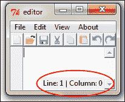

    用户可以选择从视图菜单中显示/隐藏这个信息栏；请参考`2.11.py`中的代码。我们首先在 Text 小部件内创建一个 Label 小部件，并将其打包在东南角。

    ```py
    infobar = Label(textPad, text='Line: 1 | Column: 0')
    infobar.pack(expand=NO, fill=None, side=RIGHT, anchor='se')
    ```

    在很多方面，这与显示行号类似。在这里，同样需要在每次按键或剪切、粘贴、撤销、重做、新建、打开或其他导致光标位置变化的操作之后计算位置。因为这与我们的行号代码非常相似，我们将使用现有的绑定和现有的`update_line_number()`函数来更新这个功能。为此，我们只需在我们的`update_line_number()`函数的定义中添加两行代码：

    ```py
    currline, curcolumn = textPad.index("insert").split('.')
    infobar.config(text= 'Line: %s | Column: %s' %(currline, curcolumn))
    ```

    这会持续更新标签，显示当前光标位置的行和列。

    最后，如果用户从 **View** 菜单中取消选中选项，我们需要隐藏这个小部件。我们通过定义一个名为 `show_info_bar` 的函数来实现这一点，该函数根据用户选择的选项，要么应用 `pack`，要么应用 `pack_forget` 到 `infobar` 标签。

    ```py
    def show_info_bar():
      val = showinbar.get()
      if val:
        infobar.pack(expand=NO, fill=None, side=RIGHT, anchor='se')
      elif not val:
        infobar.pack_forget()
    ```

    这个函数随后通过 `command` 回调连接到现有的菜单项：

    ```py
    viewmenu.add_checkbutton(label="Show Info Bar at Bottom", variable=showinbar ,command=show_info_bar)
    ```

1.  记住，在定义我们的 **Themes** 菜单时，我们定义了一个包含名称和十六进制颜色代码作为键值对的颜色方案字典。实际上，我们需要为每个主题指定两种颜色，一种用于背景，另一种用于前景颜色。让我们修改我们的颜色定义，以指定由点字符（`.`）分隔的两种颜色。请参考代码 `2.11.py`：

    ```py
    clrschms = {
    '1\. Default White': '000000.FFFFFF',
    '2\. Greygarious Grey': '83406A.D1D4D1',
    '3\. Lovely Lavender': '202B4B.E1E1FF' ,
    '4\. Aquamarine': '5B8340.D1E7E0',
    '5\. Bold Beige': '4B4620.FFF0E1',
    '6\. Cobalt Blue': 'ffffBB.3333aa',
    '7\. Olive Green': 'D1E7E0.5B8340',
    }
    ```

    我们的主题选择菜单已经定义在前面。现在让我们添加一个 `command` 回调来处理选定的菜单：

    ```py
    themechoice= StringVar()
    themechoice.set('1\. Default White')
    for k in sorted(clrschms):
      themesmenu.add_radiobutton(label=k, variable=themechoice, command=theme)
      menubar.add_cascade(label="View", menu=viewmenu)
    ```

    最后，让我们定义我们的 `theme` 函数来处理主题的更改：

    ```py
    def theme():
      global bgc,fgc
      val = themechoice.get()
      clrs = clrschms.get(val)
      fgc, bgc = clrs.split('.')
      fgc, bgc = '#'+fgc, '#'+bgc
      textPad.config(bg=bgc, fg=fgc)
    ```

    函数很简单。它从我们定义的颜色方案字典中获取键值对。它将颜色分成两个组成部分，并使用 `widget.config()` 将每种颜色分别应用于 Text 小部件的前景和背景。

    现在如果您从 **Themes** 菜单中选择不同的颜色，背景和前景颜色将相应地改变。

## 目标完成 – 简报

在这次迭代中，我们完成了快捷图标工具栏的编码，以及 **View** 菜单的所有功能。在这个过程中，我们学习了如何处理 Checkbutton 和 Radiobutton 菜单项，还看到了如何制作复合按钮，同时强化了之前章节中涵盖的几个 Tkinter 选项。

# 事件处理和上下文菜单

在这次最后的迭代中，我们将向我们的编辑器添加以下功能：

+   事件处理

+   上下文菜单

+   标题栏图标

## 启动推进器

让我们在这次最后的迭代中完成我们的编辑器。

1.  首先，我们将添加事件处理功能。我们已经将加速器键盘快捷键添加到我们大量菜单项中。然而，仅仅添加加速键并不能添加所需的功能。例如，按下 *Ctrl* + *N* 应该创建一个新文件，但仅仅将其添加为加速键并不能使其生效。让我们将这些事件处理功能添加到我们的代码中。

    ### 注意

    注意，我们所有的功能已经完成。现在我们只需要将事件映射到它们相关的回调函数上。（参考 `2.12.py` 中的代码。）

    ```py
    textPad.bind('<Control-N>', new_file)
    textPad.bind('<Control-n>', new_file)
    textPad.bind('<Control-O>', open_file)
    textPad.bind('<Control-o>', open_file)
    textPad.bind('<Control-S>', save)
    textPad.bind('<Control-s>', save)
    textPad.bind('<Control-A>', select_all)
    textPad.bind('<Control-a>', select_all)
    textPad.bind('<Control-f>', on_find)
    textPad.bind('<Control-F>', on_find)
    textPad.bind('<KeyPress-F1>', help_box)
    ```

    ### 注意

    简单地添加这些行就处理了我们的事件绑定。然而，这给我们带来了一个新的问题。我们已经讨论过，事件绑定将事件对象作为参数传递给绑定的回调函数。我们之前的所有函数都没有配备处理传入参数的能力。为了做到这一点，我们需要添加 `event=None` 参数。

    添加这个可选参数允许我们使用这些函数，无论是否有事件参数。

    或者，你也可以添加 `textPad.bind (event, lambda e: callback())` 来完全忽略 `event` 参数。

    现在，您可以通过键盘快捷键访问这些功能。

    注意，我们没有为剪切、复制和粘贴绑定键盘快捷键。这是因为文本小部件自带对这些事件的自动绑定。如果您为这些事件添加绑定，将会导致剪切、复制和粘贴事件发生两次；一次来自内置小部件，一次来自您自己定义的事件处理器。

1.  接下来，我们将添加上下文菜单。但在那之前，我们需要了解上下文菜单是什么。

    在鼠标光标位置右键单击弹出的菜单称为**上下文菜单**或**o**。这在上面的屏幕截图中显示：

    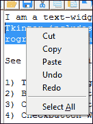

    让我们在文本编辑器中编码这个功能。我们首先定义我们的上下文菜单：

    ```py
    cmenu = Menu(textPad)
    for i in ('cut', 'copy', 'paste', 'undo', 'redo'):
      cmd = eval(i)
      cmenu.add_command(label=i, compound=LEFT, command=cmd)  
      cmenu.add_separator()
      cmenu.add_command(label='Select All', underline=7, command=select_all)
    ```

    我们然后将鼠标右键与名为`popup`的回调函数绑定：

    ```py
    textPad.bind("<Button-3>", popup)
    ```

    最后，我们定义了`popup`方法：

    ```py
    def popup(event):
      cmenu.tk_popup(event.x_root, event.y_root, 0)
    ```

1.  作为我们应用程序的最后一笔，我们使用以下代码为编辑器添加了一个标题栏图标：

    ```py
    root.iconbitmap('icons/pypad.ico') 
    ```

## 目标完成 - 简要说明

在这次迭代中，我们添加了对事件处理的支持，并为我们的编辑程序添加了上下文菜单和标题栏图标。

# 任务完成

我们已经完成了编辑器的七次迭代编码。我们首先将所有小部件放置在我们的 Toplevel 窗口中。然后我们利用文本小部件的一些内置功能来编码一些功能。我们学习了索引和标记的一些非常重要的概念，您将在 Tkinter 项目中经常使用到这些概念。

我们还看到了如何使用`tkfileDialog`和`tkMessageBox`模块来快速在我们的程序中编码一些常见功能。

恭喜！您现在已经完成了文本编辑器的编码。

# 热身挑战

这是您的热身挑战：

+   您的目标是将这个文本编辑器转变为一个 Python 代码编辑器。您的编辑器应该允许打开和保存`.py`文件扩展名。

+   如果文件具有`.py`扩展名，您的编辑器应该实现语法高亮和制表符缩进。

+   虽然这可以通过外部库轻松完成，但您应该尝试使用我们迄今为止看到的内置 Tkinter 选项来自己实现这些功能。如果您需要提示，可以查看 Python 内置编辑器 IDLE 的源代码，它是用 Tkinter 编写的。
