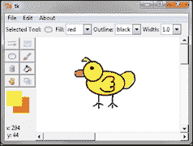
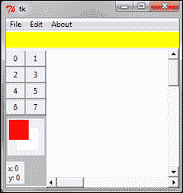
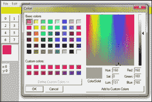
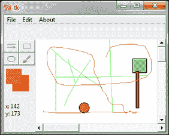
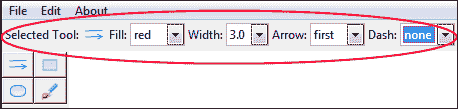
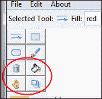

# 第六章。绘制应用程序

我们现在正在开发我们的最后一个主要 Tkinter 应用程序。在这个项目中，我们将开发一个绘图应用程序，广泛使用 Tkinter Canvas 小部件，并应用我们迄今为止所学的一切。

# 任务简报

我们的绘图程序将使用户能够绘制基本形状，如线条、圆圈、矩形和多边形。它还将允许用户使用画笔工具以不同的颜色绘制，这些颜色可以从调色板中选择。

在其最终形式中，我们的绘图程序将看起来像以下截图：



## 为什么它很棒？

尽管应用程序本身很简单，但它足以展示与 GUI 编程相关的一些重要方面。

本项目旨在强调两个重要的教训。首先，我们将体验 Canvas 小部件的力量。其次，我们将学习如何为我们的应用程序开发高级自定义 GUI 框架。

正如我们将看到的，自定义 GUI 框架使我们能够用最少的代码重复快速开发程序。

到这个项目结束时，你不仅应该能够扩展这个应用程序以添加更多功能，还应该能够承担并实现越来越复杂的 GUI 项目。

## 你的热手目标

本项目的关键学习目标可以概述如下：

+   学习构建用于快速应用程序开发的自定义 GUI 框架

+   为我们的代码编写小的单元测试

+   理解如何在我们的项目中使用继承

+   了解其他 Tkinter 模块，例如`tkColorChooser`

+   在 Canvas 小部件上创建和操作项目

+   使用 tk ComboBox 小部件

+   了解可用的`winfo`方法

+   在 Canvas 小部件上处理鼠标事件

+   巩固我们在以前项目中学习到的内容

## 任务清单

如果你已经开发了棋盘游戏，你可能已经安装了**Python Imaging Library**（**PIL**）来渲染 PNG 文件。这是我们程序的唯一外部依赖。如果你还没有这样做，请从以下链接下载并安装 PIL：

[`www.pythonware.com/products/pil/`](http://www.pythonware.com/products/pil/)

如果你正在使用 Windows x64（64 位）或 MacOSX 机器，你可能需要安装并使用 Pillow，它是 PIL 的替代品，可在以下链接找到：

[`www.lfd.uci.edu/~gohlke/pythonlibs/#pillow`](http://www.lfd.uci.edu/~gohlke/pythonlibs/#pillow)

安装完包后，转到你的 Python 交互式提示符并输入：

`>>from PIL import ImageTk`

如果这个程序没有错误信息执行，你就准备好制作我们的绘图应用程序了。

# 开发一个裸骨 GUI 框架

在这个项目中，最重要的教训之一是学习如何开发自定义 GUI 框架。Tkinter 本身就是一个 GUI 框架。然而，我们打算在这里构建的框架是一个更高级的框架，它建立在 Tkinter 之上，以满足我们的自定义编程需求。

我们不会开发一个完整的框架。相反，我们只会开发其中的一小部分，以便让你了解构建自定义框架的感觉。

## 准备起飞

那么为什么我们需要在 Tkinter 之上再构建一个框架呢？

考虑一个拥有 10 个不同菜单的大程序，每个菜单有 10 个菜单项。我们可能需要编写 100 行代码仅仅是为了显示这 100 个菜单项。

你不仅需要手动制作每个小部件，而且还需要将它们手动链接到其他命令，同时还需要为每个小部件设置大量的选项。

如果我们对所有的小部件都这样做，我们的 GUI 编程就变成了打字练习。你写的每一行额外的代码都会增加程序的复杂性，从某种意义上说，它变得对其他人来说更难阅读、维护、修改和/或调试代码。

这就是开发自定义框架如何帮助我们。让我们看看这意味着什么。

假设我们预计我们的绘图程序将有大量的菜单项。现在我们知道如何添加菜单和菜单项。每个新的菜单项至少需要一行代码来显示。

为了避免编写这么多行代码，让我们首先构建一个框架来解决这个问题。

为了简化菜单创建的过程，我们将编写一段代码，它接受作为元组的菜单项列表，并将其转换为等效的菜单代码。

所以给定以下元组：

```py
menuitems = ('File- &New/Ctrl+N/self.new_file, &Open/Ctrl+O/self.open_file','Edit- Undo/Ctrl+Z/self.undo, Sep','About- About//self.about')
```

应该生成相应的菜单项，其中字符串的第一个项目（在破折号`-`之前）代表菜单按钮，字符串的每个后续部分，由逗号分隔，代表一个菜单项、其加速键和附加的命令回调。符号`&`的位置代表要下划线的快捷键的位置。

我们还需要注意在菜单项之间添加分隔符。要添加分隔符，我们会在需要的位置添加字符串`Sep`。更精确地说，字符串`Sep`必须是大写的。

简而言之，通过我们的方法传递这个元组应该生成一个 GUI，如下面的截图所示：


为了扩展我们的菜单项，我们只需要扩展前面的元组，并同时添加相应的命令回调方法。

## 启动推进器

### 第 1 步 – 创建 GUI 框架类

我们在名为`framework.py`的文件中构建我们的框架，其中我们定义了一个名为`GUIFramework`的新类，如下所示：

```py
import Tkinter as tk
class GUIFramework(object):
	menuitems = None
	def __init__(self, root):
		self.root = root
		if self.menuitems is not None:
			self.build_menu()
```

### 第 2 步 – 创建菜单构建器

`GUIFramework`中用于创建菜单构建器的两种方法如下：

```py
def build_menu(self):
        self.menubar = tk.Menu(self.root)
        for v in self.menuitems:
            menu = tk.Menu(self.menubar, tearoff=0)
            label, items = v.split('-')
            items = map(str.strip, items.split(','))
            for item in items:
                self.__add_menu_command(menu, item)
            self.menubar.add_cascade(label=label, menu=menu)
        self.root.config(menu=self.menubar)

    def __add_menu_command(self, menu, item):
        if item == 'Sep':
            menu.add_separator()
        else:
            name, acc, cmd = item.split('/')
            try:
                underline = name.index('&')
                name = name.replace('&', '', 1)
            except ValueError:
                underline = None
            menu.add_command(label=name, underline=underline,
                           accelerator=acc, command=eval(cmd))
```

代码的描述如下所示：

+   `build_menu`方法通过名为`self.menubar`的元组进行操作，必须指定所有所需的菜单和菜单项，格式必须与之前讨论的完全一致。

+   它遍历元组中的每个项目，根据`-`分隔符拆分项目，为`-`分隔符左侧的每个项目构建顶级菜单按钮。

+   然后，它根据`,`（逗号）分隔符拆分字符串的第二部分。

+   然后，它遍历这个第二部分，为每个部分创建菜单项，使用另一个方法`__add_menu_command`添加加速键、命令回调和下划线键。

+   `__add_menu_command`方法遍历字符串，如果找到字符串`Sep`，则添加分隔符。如果没有找到，它将在字符串中搜索`&`符号。如果找到，它将计算其索引位置并将其分配给下划线变量。然后它将`&`值替换为空字符串，因为我们不希望在菜单项中显示`&`符号。

+   如果字符串中没有找到`&`符号，代码将`None`赋值给下划线变量。

+   最后，代码将命令回调、加速键和下划线值添加到菜单项中。

    ### 提示

    我们用来定义菜单构建器的逻辑是完全任意的表示。我们也可以使用字典或列表。我们也可以有完全不同的逻辑来表示我们的菜单项，只要它能够为我们生成菜单项。

### 第 3 步 – 测试我们的新框架

最后，我们在文件中添加一个`TestThisFramework`类来测试我们的框架是否按预期工作，特别是我们的`build_menu`方法。

`TestThisFramework`类的代码如下（*framework.py*）：

```py
class TestThisFramework(GUIFramework):
    menuitems = (
        'File- &New/Ctrl+N/self.new_file,&Open/Ctrl+O/self.openFile',
        'Edit- Undo/Ctrl+Z/self.undo, Sep',
        'About- About//self.about'
    )    
    def new_file(self):
        print 'newfile tested OK'
    def openFile(self):
        print 'openfile tested OK'
    def undo(self):
        print 'undo tested OK'
    def about(self):
        print 'about tested OK'

if __name__ == '__main__':
	root= tk.Tk()
	app = TestThisFramework(root)
	root.mainloop()
```

代码的描述如下：

+   我们的`TestThisFramework`类继承自`GUIFramework`类，因此可以调用父类中定义的`build_menu`方法。

+   然后，它添加一个菜单项列表`menuitems`并调用`build_menu()`方法。重要的是元组必须由名称`menuitems`定义，因为我们的`build_menu()`方法在父`GUIFramework`类中结构化，仅构建名为`menuitems`的元组上的菜单。

+   测试类还添加了虚拟命令来处理每个菜单项的命令回调。

+   运行此测试将根据元组中指定的内容构建菜单项。尝试扩展元组以添加更多菜单项，框架将成功将这些项包含在菜单中。

    ### 提示

    就像我们添加了生成菜单的代码一样，我们也可以为其他我们预见将在程序中重复使用的控件添加类似的代码。但我们将框架开发留在这里，并继续开发我们的绘图应用程序。

    为较小的程序开发框架可能是过度设计，但它们对于较长的程序是无价之宝。希望你现在应该能够欣赏为大型程序编写自定义框架的好处。

## 目标完成 – 简短总结

现在我们已经准备好了`build_menu`，我们可以扩展它以添加所需的任何菜单项，而无需为每个项编写重复且类似的代码。

这标志着我们的第一次迭代结束，我们为自定义 GUI 框架奠定了基础。我们不会进一步扩展框架，但希望您现在应该能够根据需要扩展它以用于其他小部件。

## 分类智能

在本节中，您也看到了我们的`TestThisFramework`类如何从我们的`GUIFramework`类继承特性。这是我们第一次在我们的程序中使用继承。

到目前为止，我们总是将作为类创建的对象传递给其他类作为参数，然后使用`.`（点）符号来使用它们。这被称为**组合**。

使用继承，我们不需要使用点符号来访问另一个类的成员方法。我们可以在子类中使用超类的方法，就像它们属于子类一样。

继承带来了动态绑定和多态的优势。

动态绑定意味着要调用的方法是在运行时决定的，从而为我们的代码设计提供了更大的灵活性。多态意味着超类变量持有从自身或其任何子类创建的对象的引用。

### 小贴士

继承适用于子类对象与超类对象类型相同的情况。在我们的例子中，无论您是从超类还是从子类定义菜单项，菜单项都将保持不变。因此，我们在超类中定义了它，并在子类中继承了它。

然而，如果对象需要根据对象的条件或状态以不同的方式出现或表现，则组合更可取。

# 构建我们的绘图程序

现在我们来设置绘图程序的基本结构。我们希望达到的结构，如下面的截图所示：



此处的结构主要包含一个顶部菜单，它继承自我们在上一次迭代中创建的 GUI 框架`build_menu`方法。

此外，我们在顶部创建了一个带有`create_top_bar()`方法的顶部栏框架（用黄色标记），以及一个带有`create_tool_bar()`的左侧工具栏框架（用深灰色背景标记）。我们还使用`create_drawing_canvas()`方法在右侧创建了一个 Canvas 小部件，它将作为我们的绘图区域。

我们将不会重新生成创建框架和画布区域的代码，因为我们已经在以前的项目中做过类似的事情，并且您现在应该能够轻松地完成它们。然而，您可以在文件*6.01.py*中查看实际的代码。

## 启动推进器

### 第一步 – 导入框架

这里要注意的第一点是，我们在这里导入之前创建的框架模块，并在主类中继承其属性，如下所示：

```py
import framework
class GUI(framework.GUIFramework):
```

这使我们能够像它属于子类一样使用我们在框架中定义的 `build_menu` 方法。

### 第 2 步：构建顶部菜单

接下来，我们定义实际的菜单项以在 `create_menu` 方法中构建顶部菜单，如下所示：

```py
def create_menu(self):
	self.menubar = Menu(self.root)
	self.menuitems = (
				'File- &New/Ctrl+N/self.new_file,									&Open/Ctrl+O/self.open_file, 
				Save/Ctrl+S/self.save, 
				SaveAs//self.save_as, 
				Sep, 
				Exit/Alt+F4/self.close', 
				'Edit- Undo/Ctrl+Z/self.undo, Sep',
				'About- About//self.about')
	self.build_menu()
	self.root.config(menu=self.menubar)
```

代码描述如下：

+   这实际上创建了三个菜单按钮：**文件**、**编辑**和**关于**，并将前一个提供的元组中的菜单项添加到每个按钮中。

+   创建菜单也需要再次创建它们相关的命令回调，如前一个元组中定义的那样。因此，我们创建了与这些命令回调相关的方法。

+   我们将不会重现 `new_file`、`open_file`、`close`、`undo` 和 `about` 等功能的代码，因为我们已经在之前的项目中进行了类似的编码。然而，让我们看看撤销和保存操作。

### 第 3 步 – 在 Canvas 小部件上执行撤销操作

回想一下，Tkinter 文本小部件具有内置的无限制撤销/重做功能。然而，Canvas 小部件没有这个内置功能。

在这里，我们实现了一个非常基本的撤销操作，允许我们删除画布上最后绘制的项目，如下所示：

```py
def undo(self, event=None):
	self.canvas.delete(self.currentobject)
```

代码描述如下：

+   Canvas 小部件提供了一个 `widget.delete(items)` 方法，可以从画布中删除指定的项目。

    ### 注意

    但是，一旦您删除了画布项目，它就永远消失了。除非您在删除之前实现了存储该项目所有可配置选项的方法，否则您无法恢复它。

    虽然可以通过存储要删除的项目所有配置来实施完整的撤销/重做操作，但我们不会在这里实施它，因为这会偏离我们的核心主题。

### 第 4 步 – 保存画布对象

Tkinter 允许您使用 `postscript()` 命令将画布对象保存为 postscript 文件，如下所示（参见 *代码 6.01.py*）：

```py
def actual_save(self):
	self.canvas.postscript(file=self.filename, colormode='color')
	self.root.title(self.filename)
```

然而，请注意，此命令不包括画布上的图像和嵌入的小部件。

### 第 5 步 – 在左侧工具栏中创建按钮

在为所有我们的菜单项编码了命令回调之后，我们现在将在左侧工具栏上创建按钮。根据我们的原始计划，我们需要在工具栏上放置八个按钮。目前，让我们将按钮文本显示为 `0` 到 `7`，如下所示：

```py
def create_tool_bar_buttons(self):
	for i in range(8):
		self.button = Button(self.toolbar, text=i, command=lambda i=i:self.selected_tool_bar_item(i))
		self.button.grid(row=i/2, column=1+i%2, sticky='nsew')
```

这创建了八个按钮，根据按钮编号是奇数还是偶数将它们排列成两列。

### 第 6 步 – 将命令回调添加到按钮

所有按钮都连接到同一个命令回调 `selected_tool_bar_item`，它将按钮编号作为其参数。回调方法将在下一次迭代中继续。然而，现在让我们简单地定义回调以打印被点击的按钮编号，如下所示：

```py
def selected_tool_bar_item(self, i):
	print'You selected button {}'.format(i)
```

### 第 7 步 – 创建调色板和颜色选择对话框

最后，让我们创建两个调色板来跟踪两个名为背景色和前景色的颜色。

### 注意

Tkinter 提供了一个`tkColorChooser`模块，该模块弹出颜色选择对话框。当用户选择一种颜色并点击**确定**按钮时，该模块返回一个元组，其形式如下：

```py
((r,g,b), 'hex color code')
```

返回元组的第一个元素本身是一个元组，指定了给定颜色的 RGB 坐标，而第二个元素是所选颜色的十六进制颜色代码。

这里的想法是点击调色板应该打开一个颜色选择器。当用户选择一个给定的颜色时，它应该更新对象的背景色和前景色属性，如下面的截图所示：



实现此功能所需的代码如下（见 *code 6.01.py*）：

```py
from tkColorChooser import askcolor
	def create_color_pallete(self):
		self.colorpallete= Canvas(self.toolbar, height=55, width =55)
		self.colorpallete.grid(row=10, column=1, columnspan=2, 							pady=5, padx=3)
		self.backgroundpallete = 									self.colorpallete.create_rectangle	(15, 						15,48,48,tags="backgroundpallete", 							outline=self.background, fill=self.background)
		self.foregroundpallete = 									self.colorpallete.create_rectangle(1,1,33,33,tags="foregroundpallete", outline=self.foreground, fill=self.foreground)
		self.colorpallete.tag_bind(self.backgroundpallete, 
				"<Button-1>", self.set_background_color)
		self.colorpallete.tag_bind(self.foregroundpallete, 					"<Button-1>", self.set_foreground_color)
```

代码的描述如下：

+   我们为每个正方形部分添加两个不同的标签，然后使用`tag_bind`命令将它们绑定到鼠标按钮的点击事件上。请注意 widget 级绑定（`widget.bind`）和使用`tag_bind`方法的项特定绑定的区别

+   要创建颜色调色板，我们首先在工具栏框架内创建一个 Canvas 小部件。在这个画布内，我们使用`canvas.create_rectangle`创建两个正方形区域，并将它们绑定到单个鼠标点击事件，分别调用`set_background_color`和`set_foreground_color`。

### 第 8 步 – 设置背景和前景调色板的颜色

背景和前景调色板的颜色可以设置如下：

```py
def set_background_color(self, event=None):
	self.background = askcolor()[-1]
	self.colorpallete.itemconfig(self.backgroundpallete, 					outline=self.background, fill=self.background) 

def set_foreground_color(self, event=None):
	self.foreground = askcolor()[-1]
	self.colorpallete.itemconfig(self.foregroundpallete,outline=self.foreground, fill=self.foreground)
```

### 第 9 步 – 显示鼠标移动的 x 和 y 坐标

最后，我们在工具栏框架中添加了一个静态标签来跟踪鼠标移动的 x 和 y 坐标。实际的跟踪功能将在以后创建，但现在让我们通过放置一个静态标签来预留空间，如下所示：

```py
self.curcoordlabel = Label(self.toolbar, text='x: 0\ny:0') self.curcoordlabel.grid(row=13, column=1, columnspan=2, pady=5, 						padx=1, sticky='w')
```

## 目标完成 – 简短总结

这完成了我们的第二次迭代。在这个迭代中，我们为我们的绘图程序设置了基本结构。

重要的是，我们看到了如何从先前创建的框架中继承功能，以最小化编码创建菜单项。

我们还添加了颜色选择对话框，使用`tkColorChooser`模块，该模块设置了两个属性`self.background`和`self.foreground`，以供应用程序范围使用。

# 处理鼠标事件

在我们让用户在画布上绘制之前，我们需要将画布事件绑定到鼠标移动和鼠标点击。

在画布小部件上绘制或添加任何项目之前，我们首先需要知道项目放置位置的坐标。

### 注意

Canvas 小部件使用两个坐标系来跟踪位置：

**窗口坐标系**：坐标表示为相对于根窗口的关系

**画布坐标系**：坐标表示为画布内项目的位置

您可以使用`canvasx`和`canvasy`方法将窗口坐标转换为画布坐标，如下所示：

```py
canx = canvas.canvasx(event.x)
cany = canvas.canvasy(event.y)
```

## 启动推进器

### 第 1 步 – 在画布上绑定鼠标按下、鼠标移动和鼠标释放

在画布上绘制任何项目都将从用户点击鼠标按钮开始。绘制需要一直持续到鼠标移动且按钮被按下，直到鼠标按钮被释放。

因此，我们需要跟踪初始鼠标按下事件的位置。这将随后跟踪鼠标在按钮按下时的移动，直到最终的按钮释放事件。

因此，我们在画布上添加了以下小部件绑定（见*代码 6.02.py*）：

```py
self.canvas.bind("<Button-1>", self.mouse_down)
self.canvas.bind("<Button1-Motion>", self.mouse_down_motion)
self.canvas.bind("<Button1-ButtonRelease>", self.mouse_up)
```

### 第 2 步 – 计算鼠标移动的坐标

绑定了鼠标点击、鼠标移动和鼠标释放事件后，现在需要定义它们对应的回调方法。

特别是，我们希望`mouse_down`方法给我们提供第一次鼠标点击事件的 x 和 y 坐标，如下所示：

```py
def mouse_down(self, event):
	self.currentobject = None
	self.lastx = self.startx = self.canvas.canvasx(event.x)
	self.lasty = self.starty = self.canvas.canvasy(event.y)
```

我们希望持续更新`lastx`和`lasty`坐标，直到鼠标停止移动，如下所示：

```py
def mouse_down_motion(self, event):
	self.lastx = self.canvas.canvasx(event.x)
	self.lasty = self.canvas.canvasy(event.y)
```

我们的`mouse_up`方法应该对`lastx`和`lasty`坐标进行最后的更新，如下所示：

```py
def mouse_up(self, event):
	self.lastx = self.canvas.canvasx(event.x)
	self.lasty = self.canvas.canvasy(event.y)
```

代码的描述如下：

+   `mouse_down`方法简单地将`startx`、`starty`、`lastx`和`lasty`的值初始化为鼠标点击位置的坐标。

+   `mouse_down_motion`方法在鼠标移动发生时改变`lastx`和`lasty`的值。

+   最后，`mouse_up`方法将`lastx`和`lasty`的值设置为鼠标按钮释放点的坐标。

+   因此，使用三个事件：`mouse_down`、`mouse_down_motion`和`mouse_up`，我们成功地得到了起点坐标、鼠标指针穿越的点的坐标以及终点坐标。

+   现在，我们可以使用这些值在给定的坐标上放置画布上的任何项目。

### 第 3 步 – 更新左侧工具栏中的当前鼠标位置标签

此外，我们还想跟踪鼠标在画布上的移动，即使鼠标按钮没有被按下。我们需要跟踪这一点以更新左侧工具栏中的当前鼠标位置。这很简单，如下面的代码片段所示：

```py
self.canvas.bind("<Motion>", self.show_current_coordinates)

def show_current_coordinates(self, event = None):
	lx = self.canvas.canvasx(event.x)
	ly = self.canvas.canvasy(event.y)
	cord = 'x: %d \ny: %d '%(lx, ly)
	self.curcoordlabel.config(text = cord)
```

此代码将确保任何在画布上移动的鼠标都会更新左侧工具栏中的当前鼠标位置标签。

## 目标完成 – 简短总结

现在我们的 Canvas 小部件已经对鼠标移动和鼠标点击做出了响应。每次我们在画布上点击鼠标按钮并拖动鼠标指针到新的位置时，`startx`、`starty`、`lastx`和`lasty`的值都会更新，以反映鼠标移动的坐标。

### 注意

这些坐标共同构成了一个项目的边界框。实际上，如果画布上有项目，你可以使用 API 检索任何给定项目的坐标：

```py
canvas.bbox(item=itemName)
```

这将返回一个包含四个元素的坐标元组。

如果未指定项目名称，此方法将返回画布上所有元素的边界框。

现在我们有了坐标，我们可以考虑在画布上绘制项目。我们将在下一次迭代中进行一些绘制。

# 在画布上绘制项目

让我们现在在画布上绘制一些项目。Canvas 小部件原生支持绘制以下项目：

| 项目 | 添加项目的代码 |
| --- | --- |
| 弧线 | `w.create_arc( bbox, **options)` |
| 位图 | `w.create_bitmap( bbox, **options)` |
| 图像 | `w.create_image( bbox, **options)` |
| 线 | `w.create_line( bbox, **options)` |
| 椭圆 | `w.create_oval( bbox, **options)` |
| 多边形 | `w.create_polygon( bbox, **options)` |
| 矩形 | `w.create_rectangle( bbox, **options)` |
| 文本 | `w.create_text( bbox, **options)` |
| 窗口 | `w.create_window( bbox, **options)` |

让我们添加绘制线条、矩形和椭圆的能力到我们的绘图程序中。我们还将添加一个画笔描边功能到我们的程序中，如下面的截图所示：



## 启动推进器

### 第 1 步 – 创建方法元组

我们首先创建一个方法元组，如下所示：

```py
all_toolbar_functions = ('draw_line', 'draw_rectangle', 'draw_oval', 'draw_brush')
```

这样做可以确保我们不需要从代码中显式调用每个方法。我们可以使用元组的索引来检索方法名称，并通过以下方式动态调用它：

```py
getattr(self, self.all_toolbar_functions[index])
```

这在这里是有意义的，因为我们最终将通过扩展我们的`all_toolbar_functions`来简单地添加更多功能到我们的绘图程序中。

### 第 2 步 – 为工具栏按钮添加图标

我们接下来的任务是给左侧工具栏添加绘制这些项目的图标。

我们将图标添加到`icons`文件夹中。我们还确保将每个图标文件重命名为它调用的方法的名称。这种命名再次有助于动态调用方法，这种编程风格可以称为**约定优于配置**的编程。

我们当前的`create_tool_bar_buttons()`方法使用 for 循环创建了八个按钮。然而，我们现在将修改我们的`create_tool_bar_buttons()`方法，使用`enumerate()`方法遍历`all_toolbar_functions`元组中的所有项，为每个方法添加图标，如下所示（见*code 6.03.py*）：

```py
def create_tool_bar_buttons(self):
	for i, item in enumerate(self.all_toolbar_functions):
		tbicon = PhotoImage(file='icons/'+item+'.gif')
		self.button = Button(self.toolbar, image=tbicon, 					command=lambda i=i:self.selected_tool_bar_item(i))
		self.button.grid(row=i/2, column=1+i%2, sticky='nsew')
		self.button.image = tbicon
```

### 第 3 步 – 跟踪当前选定的按钮

接下来，我们修改`selected_tool_bar_item(i)`方法；它的唯一目的是跟踪当前选定的按钮。有了这个信息，我们可以稍后通过使用此索引从`all_toolbar_functions`调用相关方法，如下所示（见*code 6.03.py*）：

```py
def selected_tool_bar_item(self, i):
	self.selected_toolbar_func_index = i
```

### 第 4 步 – 绘制线条、矩形和椭圆形状的代码

现在是时候编写绘制这些基本形状的方法了。请注意，这不会自动创建绘图。最终，这些方法必须从某处调用以实际进行绘图。我们将在第 6 步中这样做。

```py
def draw_line(self, x, y, x2, y2):
	self.currentobject = self.canvas.create_line(x, y, x2, y2, fill= 					self.foreground )

def draw_rectangle(self, x, y, x2, y2):
	self.currentobject = self.canvas.create_rectangle(x, y, x2, 						y2, fill= self.foreground)
def draw_oval(self, x, y, x2, y2):
	self.currentobject=  self.canvas.create_oval(x, y, x2, 						y2, fill= self.foreground)
```

### 第 5 步 – 连续绘制代码

连续绘制与绘制线条类似，但新线条会在坐标的每次小变化后重新绘制。在当前的状态下，`lastx` 和 `lasty` 的值仅在鼠标按钮释放时更新。但在这里，我们需要在鼠标移动时更新 `lastx` 和 `lasty` 的值。为了实现这一点，我们将鼠标移动绑定到一个新定义的方法 `draw_brush_update_xy`，该方法在每次后续循环迭代中更新 x 和 y 坐标。

之前，我们将鼠标按下移动绑定到了另一个名为 `mouse_down_motion` 的方法。为了绘制连续的笔触，我们现在将其绑定到名为 `draw_brush_update_xy` 的方法。

### 注意

将事件绑定添加到多个方法中会清除之前的绑定，新的绑定将替换任何现有的绑定。因此，当你退出 `draw_brush` 循环时，你需要重新绑定事件到 `mouse_down_motion` 方法。

或者，你可以使用 `add="+"` 作为额外的参数来保持对同一事件的多个绑定，如下所示：

```py
mywidget.bind("<SomeEvent>", method1, add="+")
mywidget.bind("<SameEvent>", method2, add="+")
```

因此，我们创建了一个循环，其中 `draw_brush` 方法在连续的鼠标移动中调用另一个方法 `draw_brush_update_xy` 来更新 x 和 y 坐标，如下所示（见 *代码 6.03.py*）：

```py
def draw_brush(self, x, y, x2, y2):
	if not self.all_toolbar_functions[ 							self.selected_toolbar_func_index] == 'draw_brush':
		self.canvas.bind("<Button1-Motion>",								self.mouse_down_motion)
		return# if condition to break out of draw_brush loop
	self.currentobject = 									self.canvas.create_line(x,y,x2,y2,fill=self.foreground)

self.canvas.bind("<B1-Motion>", self.draw_brush_update_xy)

def draw_brush_update_xy(self, event):
	self.startx, self.starty = self.lastx, self.lasty
	self.lastx, self.lasty = event.x, event.y
	self.draw_brush(self.startx, self.starty,self.lastx, self.lasty)
```

如果“绘制画笔”按钮未选中，我们将退出循环并将鼠标移动重新绑定到画布的 `mouse_down_motion`。

### 第 6 步 – 动态执行代码

我们计划根据名为 `all_toolbar_functions` 的元组中给出的方法名称的索引动态执行方法。然而，这些名称被存储为字符串，我们无法仅取字符串的一部分并期望 Python 评估它。为了做到这一点，我们将使用 Python 的内置 `getattr()` 方法。

现在，我们定义了一个方法，该方法接受一个字符串并将其转换为适合执行的方法，如下所示：

```py
def execute_method():
	fnc = getattr(self, self.all_toolbar_functions [self.selected_toolbar_func_index])
	fnc(self.startx, self.starty,self.lastx, self.lasty)
```

### 第 7 步 – 进行实际绘图

定义了绘制线条、矩形、椭圆和画笔笔触的方法后，我们需要从某处调用它们以进行绘图。直观上，绘图必须从第一次鼠标按下开始，并且绘图必须在鼠标按钮释放之前被删除并重新绘制。

因此，这些方法必须从我们的 `mouse_down_motion` 方法中调用。因此，我们修改了 `mouse_down_motion` 和 `mouse_up` 方法来完成这项工作，如下所示：

```py
def mouse_down_motion(self, event):
	self.lastx = self.canvas.canvasx(event.x)
	self.lasty = self.canvas.canvasy(event.y)
	if self.selected_toolbar_func_index:
		self.canvas.delete(self.currentobject)
		self.execute_method()

def mouse_up(self, event):
	self.lastx = self.canvas.canvasx(event.x)
	self.lasty = self.canvas.canvasy(event.y)
	self.canvas.delete(self.currentobject)
	self.currentobject = None
	self.execute_method()
```

## 目标完成 – 简要回顾

这完成了本次迭代的任务。

我们首先创建了一个方法名称的元组，以便能够通过指定元组中的索引动态调用方法。

然后，我们为工具栏按钮添加了图标。然后，我们将按钮点击与一个方法关联起来，该方法通过将索引分配给变量 `self.selected_toolbar_func_index` 来跟踪当前选定的按钮。然后我们定义了在画布上绘制线条、矩形和椭圆形状的方法。我们还展示了如何利用绘制线条的能力进行连续绘制。

最后，我们从 `mouse_down_motion` 和 `mouse_release` 方法中调用了所有绘图方法来进行实际的绘图。

用户现在可以在画布上绘制基本形状，例如线条、矩形、椭圆形和笔触。这些形状将以当前设置的背景色绘制。

# 设置顶部选项工具栏

虽然我们的程序可以绘制基本形状，但这些形状目前填充的是前景色，形状的轮廓是用黑色完成的。

Canvas 小部件允许您指定大多数形状的填充颜色、轮廓颜色和边框宽度作为其可配置选项。

此外，Canvas 小部件还有许多其他基本形状的可配置选项。例如，对于线条，您可以指定它是否在末端有箭头形状，或者是否为虚线。

让我们相应地修改我们的程序，以便用户可以为四种基本形状中的每一种选择可配置的选项，如下面的截图所示：



## 启动推进器

### 第 1 步 – 在顶部显示所选按钮图标

让我们先从简单的事情开始。当用户在左侧工具栏中点击按钮时，顶部框架应显示文本 **所选工具：** 然后是所选按钮的图标表示。

因为这个事件必须在任何按钮的点击时发生，所以我们修改了 `selected_tool_bar_item` 方法，包括对两个方法的调用，如下面的代码所示（见 *code 6.04.py*）：

```py
def selected_tool_bar_item(self, i):
	self.selected_toolbar_func_index = i
	self.remove_options_from_topbar()
	self.show_selected_tool_icon_in_topbar()

def remove_options_from_topbar(self):
	for child in self.topbar.winfo_children():
		child.destroy()

def show_selected_tool_icon_in_topbar(self):
	Label(self.topbar,text='Selected Tool:').pack(side=LEFT)
	photo = PhotoImage(file='icons/'+								'self.all_toolbar_functions[self.selected_toolbar_func_index]+'.gif')
	label = Label(self.topbar, image=photo)
	label.image = photo
	label.pack(side=LEFT)
```

代码的描述如下：

+   `remove_options_from_topbar` 方法确保当点击新的按钮时，删除之前按钮的选项。`show_selected_tool_icon_in_topbar` 方法实际上显示了当前所选按钮的图标。

    ### 注意

    `widget.winfo_children()` 返回给定小部件的所有子小部件列表，按照从下到上的堆叠顺序。

    您可以使用许多 `winfo` 方法中的任何一个来提取大量与窗口相关的信息。有关 `winfo` 方法的完整列表，请参阅附录 B 中的 *基本小部件方法* 部分，*快速参考表*。

    或者，每个小部件也有自己的子属性，它是一个字典，键是 ID，值是小部件。所以如果顺序不重要，这和 `widget.children.values()` 是一样的。

### 第 2 步 – 添加 Combobox 小部件以让用户选择不同的填充选项

接下来，我们需要定义一个选择组合框，让用户可以选择填充、轮廓、宽度、箭头和虚线的选项。我们将使用 ttk Combobox 允许用户进行选择，因此我们将其导入到当前文件中，如下所示：

```py
import ttk
```

我们在这里不会复制整个代码。然而，对于上述每个选项，我们定义了两个方法：一个用于显示组合框，另一个用于设置用户当前选择的值。

因此，我们为填充选项设置了以下两个定义，如下所示（见 *代码 6.04.py*）：

```py
def fill_options_combobox(self):
	Label(self.topbar,text='Fill:').pack(side=LEFT)
	self.fillcmbobx = ttk.Combobox(self.topbar, 							state='readonly', width=5)
	self.fillcmbobx.pack(side=LEFT)
	self.fillcmbobx['values'] = ('none', 'fg', 'bg', 'black', 'white' )
	self.fillcmbobx.bind('<<ComboboxSelected>>',	self.set_fill)
	self.fillcmbobx.set(self.fill)

def set_fill(self, event=None):
	fl = self.fillcmbobx.get()
	if fl == 'none': self.fill = '' #transparent
	elif fl == 'fg': self.fill = self.foreground
	elif fl == 'bg': self.fill = self.background
	else: self.fill = fl
```

我们以类似的方式为每个集合定义其他方法对，即（见 *代码 6.04.py*）：

+   `outline_options_combobox:set_outline`

+   `width_options_combobox:set_width`

+   `arrow_options_combobox:set_arrow`

+   `dash_options_combobox:set_dash`

### 第三步 – 修改绘图方法以添加可配置选项

现在我们有了设置填充、轮廓、箭头和虚线可配置选项不同值的方法，让我们修改我们的绘图代码，以包括实际的绘图，如下所示（见 *代码 6.04.py*）：

```py
def draw_line(self, x, y, x2, y2):
	self.currentobject = self.canvas.create_line(x, y, x2, y2,
		fill= self.fill, arrow=self.arrow, width=self.width, 				dash=self.dash )

def draw_rectangle(self, x, y, x2, y2):
	self.currentobject = self.canvas.create_rectangle(x, y,x2, 				y2, outline=self.outline, fill=self.fill, 						width=self.width)

def draw_oval(self, x, y, x2, y2):
	self.currentobject=  self.canvas.create_oval(x, y, x2, 				y2, outline=self.outline, fill=self.fill, 						width=self.width)

def draw_brush(self, x, y, x2, y2):
	if not self.all_toolbar_functions[self.selected_toolbar_func_index]=='draw_brush':
		self.canvas.bind("<Button1-Motion>", 						self.mouse_down_motion)
		return
	self.currentobject = self.canvas.create_line(x,y,x2,y2,				fill=self.fill, width=self.width)

self.canvas.bind("<B1-Motion>", self.draw_brush_update_xy)
```

定义了所有这些方法后，现在是时候从某处调用它们了。

虽然填充组合框适用于所有四个基本形状，但箭头选项仅适用于绘制线条。因为将会有不同选择的组合框集，我们定义以下方法（见 *代码 6.04.py*）：

```py
def draw_line_options(self):
	self.fill_options_combobox()
	self.width_options_combobox()
	self.arrow_options_combobox()
	self.dash_options_combobox()

def draw_rectangle_options(self):
	self.fill_options_combobox()
	self.outline_options_combobox()
	self.width_options_combobox()

def draw_oval_options(self):
	self.fill_options_combobox()
	self.outline_options_combobox()
	self.width_options_combobox()

def draw_brush_options(self):
	self.fill_options_combobox()
	self.width_options_combobox()
```

最后，这些方法必须从某处调用，这取决于所做的选择。因此，我们修改了 `selected_tool_bar_item` 方法，以动态调用一个方法，方法名是通过在所选方法名称后附加字符串 `_options` 来命名的，如下所示（见 *代码 6.04.py*）：

```py
def selected_tool_bar_item(self, i):
	self.selected_toolbar_func_index = i
	self.remove_options_from_topbar()
	self.show_selected_tool_icon_in_topbar()
	opt = self.all_toolbar_functions[ self.selected_toolbar_func_index] +'_options'
	fnc = getattr(self, opt)
	fnc()
```

## 目标完成 – 简短总结

程序用户现在可以从为每个工具栏按钮提供的各种选项中进行选择（见 *代码 6.04.py*）。

更重要的是，我们看到了在 Tkinter Canvas 小部件上绘制的项目可用的配置选项。我们还介绍了 `winfo` 方法。这些方法可以用来提取有关小部件的大量数据，当在 Tkinter 中编程 GUI 应用程序时，这是一个有用的工具。

# 添加更多功能

接下来，让我们向我们的绘图程序添加一些更多功能。特别是，我们将添加从画布中删除对象的能力，添加一个油漆桶，以及移动项目上下堆叠的能力，以及拖动画布上项目的能力，如下面的截图所示：



## 启动推进器

### 第一步 – 扩展我们的方法元组

首先，让我们扩展我们的 `all_toolbar_functions` 方法，为我们将在此定义的新方法提供便利，如下所示（见 *代码 6.05.py*）：

```py
all_toolbar_functions = ('draw_line', 'draw_rectangle', 'draw_oval', 'draw_brush', 'delete_object', 'fill_object', 'move_to_top', 'drag_item')
```

如往常一样，我们通过添加与处理该功能的方法同名的方法到 `icon` 文件夹中，为 `icon` 文件夹添加了图标。通过向这个元组添加新方法，并添加相应的图标到我们的 `icon` 文件夹，由于我们设计的 `create_tool_bar_buttons` 方法，按钮会自动显示在我们的左侧工具栏中。

### 第二步 – 定位画布上的特定项目

在定义处理新功能的方法之前，让我们暂停一下，思考一下这里需要做的工作。

我们现在想要执行的操作与其前辈略有不同。以前，我们在画布上创建项目。现在我们必须针对画布上已经存在的项目。

需要被针对的项目是用户用鼠标点击的项目。

因此，在我们对项目本身进行任何修改之前，我们需要先识别鼠标点击的项目。为此，我们修改了我们的 `mouse_down` 方法，如下所示（见 *code 6.05.py*）：

```py
def mouse_down(self, event):
	self.currentobject = None
	self.lastx = self.startx = self.canvas.canvasx(event.x)
	self.lasty = self.starty = self.canvas.canvasy(event.y)
	if self.all_toolbar_functions[										self.selected_toolbar_func_index] 
	in ['fill_object',	'delete_object', 'move_to_top', drag_item']:            		
		try:
			self.selected_object = 									self.canvas.find_closest(self.startx, self.starty)[0]
		except:
			self.selected_object = self.canvas
```

代码的描述如下：

+   这个对 `mouse_down` 方法的微小修改意味着，如果点击了最后四个按钮中的任何一个，代码会定位到点击位置最近的项目，并将其分配给我们的新定义属性 `selected_object`，代表当前选中的对象。

+   如果画布上没有项目，整个画布被设置为 `selected_obj``ect` 属性。

    ### 注意

    画布方法有一个名为：`find_closest(x, y, halo=None, start=None)` 的方法。

    它返回画布上给定位置最近项目的标识符。这意味着，如果画布上只有一个项目，无论你点击得有多近或多远，它都会被选中。

    如果另一方面，你只想选择一定距离内的对象，Canvas 小部件提供了一个名为 `find_overlapping` 的替代实现。

    然而，你必须放置一个位于该位置中心的小矩形才能使用这个功能。

现在我们已经掌握了要操作的项目，我们可以继续进行我们想要对项目做的任何操作。

### 第 3 步 – 从画布中删除项目

从画布中删除项目的第一个方法是 `delete_object`，它简单地删除所选项目。因此，我们的 `delete_object` 方法定义如下（见 *code 6.05.py*）：

```py
def delete_object(self, x0, y0, x1, y1):
	self.canvas.delete(self.selected_object)
```

此外，因为我们的早期代码需要为每个我们定义选项方法的函数，所以我们在这里定义了 `delete_object_options` 方法。然而，因为我们不想在顶部的选项栏中显示任何内容，所以我们简单地使用 pass 语句忽略它，如下所示：

```py
def delete_object_options(self):
	pass
```

### 第 4 步 – 画桶功能

接下来，我们编写 `fill_object` 方法，它在常规绘图程序中类似于画桶。

这同样很简单。你只需要在所选项目的背景上填充颜色。如果没有项目在画布上，它将简单地填充整个画布，如下所示：

```py
def fill_object(self,x0,y0,x1,y1):
	if self.selected_object == self.canvas:
		self.canvas.config(bg=self.fill)
	else:
		self.canvas.itemconfig(self.selected_object, fill=self.fill)
```

而在这里，我们希望让用户选择画桶的填充颜色。因此，我们在 `fill_object_options` 方法中调用我们之前定义的方法 `fill_options_combobox`。

```py
def fill_object_options(self):
	self.fill_options_combobox()
```

### 第 5 步 – 将项目移动到彼此之上

现在我们来定义下一个按钮的方法。带有小手图标标记的按钮可以用来将项目置于其他项目之上。

### 注意

当你在画布上绘制多个项目时，项目会被放置在一个堆栈中。默认情况下，新项目会被添加到之前绘制在画布上的项目之上。然而，你可以使用：`canvas.tag_raise(item)` 来改变堆叠顺序。

如果有多个项目匹配，它们都会移动，同时保持它们的相对顺序。

然而，此方法不会更改画布内绘制的任何新窗口项目的堆叠顺序。

然后还有`find_above`和`find_below`方法，你可以使用它们在画布堆叠顺序中查找位于项目上方或下方的项目。

此外，还有一个`find_all`方法，它返回一个包含画布上所有项目标识符的元组。

因此，将项目移动到堆叠顶部的代码如下（见*code 6.05.py*）：

```py
def move_to_top(self,x0,y0,x1,y1):
	self.canvas.tag_raise(self.selected_object)
def move_to_top_options(self):
	pass # no items to display on the top bar
```

### 第 6 步 – 在画布上拖动项目

最后，让我们为画布上的项目添加拖放功能。在画布上拖动一个项目的能力要求在选择了要拖动的对象之后，我们重新计算鼠标移动的 x 和 y 坐标，并在小间隔内将对象移动到鼠标移动提供的新坐标。

在许多方面，这里的理念与我们用来定义画笔的概念相似。

策略是在每次小鼠标移动后使用另一个方法`drag_item_update_xy`调用我们的`drag_items`方法，该方法在小鼠标移动后重新计算 x 和 y 坐标，每次移动项目到新计算的坐标。

然后，我们有一个条件检查，如果从工具栏中选择其他按钮，则跳出此循环，如下所示（见*code 6.05.py*）：

```py
def drag_item(self,x0,y0,x1,y1):
	if not self.all_toolbar_functions[ 							self.selected_toolbar_func_index] == 'drag_item':
		self.canvas.bind("<Button1-Motion>",									self.mouse_down_motion)
		return # break out of loop
	self.currentobject = self.canvas.move(									self.selected_object, x1-x0, y1-	y0)
	self.canvas.bind("<B1-Motion>", self.drag_item_update_xy)

def drag_item_update_xy(self, event):
	self.startx, self.starty = self.lastx, self.lasty
	self.lastx, self.lasty = event.x, event.y
	self.drag_item(self.startx, self.starty,self.lastx, 					self.lasty)

def drag_item_options(self):
	pass # we want no options to be displayed at the top
```

### 注意

Canvas 小部件提供了一个方法：`canvas.move(item, dx, dy)`。

前面的方法通过水平和垂直偏移（`dx`和`dy`）移动任何匹配的项目。

## 目标完成 – 简短总结

这就结束了这一迭代。现在我们已经成功地为我们的绘图程序添加了四个新功能，即：`delete_object`、`fill_object`、`move_to_top`和`drag_item`。

在此过程中，我们看到了 Canvas 小部件提供的用于项目操作的一些方法。我们还看到了在 Canvas 小部件上处理现有项目时可能采用的战略。

## 分类情报

在这个程序中，我们广泛使用了项目标识符 ID 来定位画布上的特定项目。回想一下，项目标识符是创建对象时由 Canvas 方法返回的唯一整数 ID。

例如，当你创建画布上的椭圆项目时，创建对象后会返回一个整数 ID。这被称为项目标识符或项目句柄，如下所示：

```py
my_item_identifier = self.canvas.create_oval(x, y, x2, y2)
```

现在，你可以使用句柄 my_item_identifier 对这个椭圆进行操作。

然而，这并不是唯一可以识别画布上项目的方法。此外，你可以给项目添加标签，然后使用这些标签来识别用于操作的对象。

### 处理项目标签

让我们现在看看在处理 Canvas 标签时涉及的一些常见操作。

### 添加标签

要给一个项目添加标签，你可以在创建对象时或之后使用`itemconfig`方法指定标签（这是一个字符串）作为其配置选项，或者使用`addtag_withtag`方法添加它们，如下所示：

```py
rectid = canvas.create_rectangle(10, 10, 50, 50, tags="myshiny")
canvas.itemconfig(rectid, tags="shiv")
canvas.addtag_withtag("shiv", "takeonemore")
```

同一个标签可以应用于画布上的多个项目。

你可以通过传递标签作为字符串元组来一起给一个项目添加多个标签，如下所示：

```py
canvas.itemconfig(rectid, tags=("tagA", "tagB"))
```

### 小贴士

使用标签来识别要操作的项目特别有用，当你需要同时操作多个项目，或者你想根据某些条件操作项目时。

### 获取标签

要获取与特定项目句柄相关联的所有标签，请使用以下`gettags`：

```py
printcanvas.gettags(rectid)
```

这将返回与该项目句柄相关联的所有标签的元组，如下所示：

```py
("myshiny", "shiv", "takeonemore", "tagA", "tagB")
```

### 获取具有特定标签的项目

要获取所有具有给定标签的项目句柄，请使用以下`find_withtag`：

```py
print canvas.find_withtag("shiv")
```

这将返回所有项目的项目句柄作为元组。

### 内置标签

画布小部件提供了两个内置标签：

+   ALL 或 all：匹配画布上的所有项目

+   CURRENT 或 current：如果有，则返回鼠标指针下的项目

# 任务完成

这样你就有了自己的绘图程序！你可以轻松扩展它以添加更多功能。

下面是本项目所见内容的快速总结：

+   构建用于快速应用开发的自定义 GUI 框架

+   理解如何在我们的项目中使用继承

+   了解`tkColoChooser`模块

+   学习在画布小部件上创建和操作项目

+   与 tk ComboBox 小部件一起工作

+   了解可用的`winfo`方法

+   在画布小部件上处理鼠标事件

+   巩固我们在以前项目中学习到的内容

# 热身挑战

将以下功能添加到你的绘图程序中：

+   加速键对我们的菜单项不起作用，因为我们尚未将它们绑定到键事件。将菜单项的加速键绑定到它们相关的命令回调。

+   创建一个橡皮擦按钮并添加其相关功能。

+   我们尚未实现绘制一些其他基本形状，例如弧和多边形，尽管画布小部件提供了绘制它们的方法。将绘制弧和多边形的能力添加到绘图程序中。

+   在右侧创建一个新的工具栏。利用画布项的堆叠顺序，将每个项目作为工具栏中的单独一层显示。

+   通过使用 Python 的交互式帮助功能遍历你 IDE 中所有可用的画布小部件选项。尝试通过利用一个或多个选项来添加更多功能到程序中。

+   我们已经通过导航到**文件** | **打开**来包含了将图像添加到程序中的能力。添加一些菜单项来操作这些图像。使用某些图像库，添加图像处理功能，例如颜色调整、亮度、对比度、灰度以及其他由你选择的图像库提供的图像处理功能。

+   画布小部件通常用于绘制自定义小部件。使用画布小部件制作一个进度条小部件。将其附加到某个函数上并运行，以查看随着函数的进行，椭圆形应该被某种颜色填充。你可以使用画布小部件的填充选项来显示进度增加。
