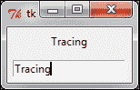
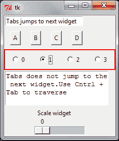
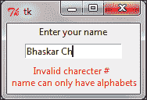
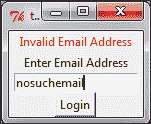
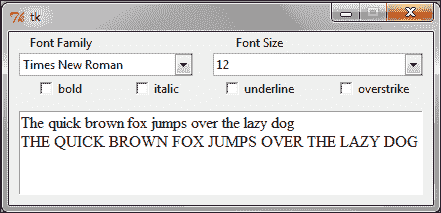
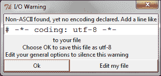
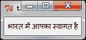
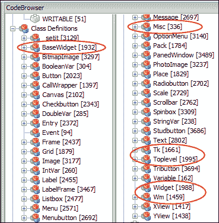
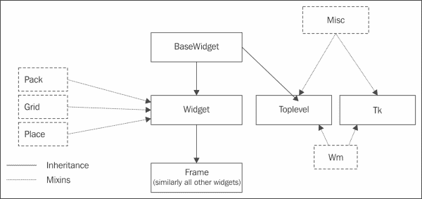
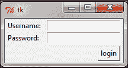

# 附录 A. 杂项技巧

我们现在进入了本书的最后一部分。让我们通过讨论在许多 GUI 应用程序中形成一个共同主题但未出现在我们的应用程序中的概念来结束。

# 任务简报

这里涵盖的主题包括：

+   跟踪 Tkinter 变量

+   小部件遍历

+   验证用户输入

+   格式化小部件数据

+   更多关于字体

+   与 Unicode 字符一起工作

+   Tkinter 类层次结构

+   定制的混入

+   代码清理和程序优化的技巧

+   分发 Tkinter 应用程序

+   Tkinter 的局限性

+   Tkinter 的替代方案

+   获取交互式帮助

+   Python 3.*x* 中的 Tkinter

# 跟踪 Tkinter 变量

当你指定一个 Tkinter 变量作为小部件的 `textvariable` （`textvariable = myvar`）时，小部件会自动更新，每当变量的值发生变化时。然而，有时除了更新小部件外，你还需要在读取或写入（或修改）变量时进行一些额外的处理。

Tkinter 提供了一种方法来附加一个回调方法，该方法会在每次访问变量的值时被触发。因此，回调充当 **变量观察者**。回调方法名为 `trace_variable(self, mode, callback)`，或简单地 `trace(self, mode, callback)`。

模式参数可以取 `'r'`, `'w'`, `'u'` 中的任何一个值，分别代表读取、写入或未定义。根据模式指定，如果变量被读取或写入，则触发回调方法。

回调方法默认接收三个参数。参数的顺序是：

+   Tkinter 变量的名称

+   如果 Tkinter 变量是一个数组，则变量的索引，否则为空字符串

+   访问模式 (`'w'`, '`r'`, 或 '`u'`)

注意，触发的回调函数也可能修改变量的值。然而，这种修改并不会触发任何额外的回调。

让我们看看 Tkinter 中变量跟踪的一个小例子，其中将 Tkinter 变量写入输入小部件会触发一个回调函数（请参阅代码包中可用的 `8.01 trace variable.py` Python 文件）：

```py
from Tkinter import *
root = Tk()
myvar = StringVar()
def trace_when_myvar_written(var,indx,mode):
 print"Traced variable %s"%myvar.get()

myvar.trace_variable("w", trace_when_myvar_written)
Label(root, textvariable=myvar).pack(padx=5, pady=5)
Entry(root, textvariable=myvar).pack(padx=5, pady=5)

root.mainloop()
```

下列代码的描述如下：

+   此代码在 Tkinter 变量 `myvar` 上创建了一个跟踪变量，模式为写入（`"w"`）

+   跟踪变量附加到名为 `trace_when_myvar_written` 的回调方法（这意味着每次 `myvar` 的值发生变化时，回调方法都会被触发）

现在，每次你向输入小部件写入内容时，它都会修改 `myvar` 的值。因为我们已经对 `myvar` 设置了跟踪，所以它触发了回调方法，在我们的例子中，这个方法只是简单地在新值中打印到控制台。

代码创建了一个类似于这里所示的 GUI 窗口：



它还在 IDLE 中产生控制台输出，一旦你在 GUI 窗口中开始输入，就会显示如下：

```py
Traced variable T
Traced variable Tr
Traced variable Tra
Traced variable Trac
Traced variable Traci
Traced variable Tracin
Traced variable Tracing
```

### 注意

变量的跟踪是活跃的，直到它被显式删除。你可以使用以下方式删除跟踪：

```py
trace_vdelete(self, mode, callbacktobedeleted)
The trace method returns the name of the callback method. This can be used to get the name of the callback method that is to be deleted.
```

# 小部件遍历

当 GUI 有多个小部件时，给定的小部件可以通过在 GUI 上显式鼠标单击来获得焦点。或者，可以通过在键盘上按*Tab*键，按照程序中小部件创建的顺序将焦点转移到另一个给定的小部件。

因此，按照我们希望用户遍历的顺序创建小部件至关重要，否则用户在使用键盘在各个小部件之间导航时将遇到困难。

不同的小部件被设计为对不同键盘按键有不同的行为。因此，让我们花些时间尝试理解使用键盘遍历小部件的规则。

让我们看看`8.02 widget traversal.py` Python 文件的代码，以了解不同小部件的键盘遍历行为。一旦运行提到的`.py`文件，它显示的窗口类似于以下内容：



代码很简单。它添加了一个输入小部件、几个按钮、几个单选按钮、一个文本小部件和一个缩放小部件。然而，它还演示了这些小部件的一些最重要的键盘遍历行为。

这里有一些重要的要点需要注意（参考`8.02 widget traversal.py`）：

+   *Tab*键可以用来向前遍历，而*Shift* + *Tab*可以用来向后遍历。

+   文本小部件不能使用*Tab*键遍历。这是因为文本小部件可以包含制表符作为其内容。相反，可以使用*Ctrl* + *Tab*遍历文本小部件。

+   可以使用空格键按下小部件上的按钮。同样，复选框和单选按钮也可以使用空格键切换。

+   你可以使用上下箭头在列表框小部件中的条目上下移动。

+   缩放小部件对左右键或上下键都做出响应。同样，滚动条小部件根据其方向对左右/上下键做出响应。

+   大多数小部件（除了框架、标签和菜单）在将焦点设置在其上时默认获得轮廓。这个轮廓通常显示为围绕小部件的细黑边框。你甚至可以将框架和标签小部件设置为显示这个轮廓，通过为这些小部件指定非零的`Integer`值作为`highlightthickness`选项。

+   我们在代码中使用`highlightcolor= 'red'`更改轮廓的颜色。

+   框架、标签和菜单不包括在标签导航路径中。然而，可以通过使用`takefocus = 1`选项将它们包含在导航路径中。你可以通过设置`takefocus= 0`选项显式排除小部件从标签导航路径。

+   *Tab*键按照小部件创建的顺序遍历小部件。它首先访问父小部件（除非使用`takefocus = 0`排除），然后是所有其子小部件。

+   你可以使用`widget.focus_force()`强制输入焦点到小部件。

# 验证用户输入

现在我们来讨论输入数据验证。

我们在书中开发的大部分应用程序都是基于点击的（鼓机、棋类游戏、绘图应用程序），在这些应用中不需要验证用户输入。

然而，在像我们的电话簿应用程序这样的程序中，数据验证是必须的，因为用户输入一些数据，我们将它们存储在数据库中。

在此类应用程序中忽略用户输入验证可能是危险的，因为输入数据可能被误用于 SQL 注入。一般来说，任何用户可以输入文本数据的应用程序都是验证用户输入的良好候选者。事实上，几乎可以认为不信任用户输入是一条准则。

错误的用户输入可能是故意的或偶然的。在任何情况下，如果您未能验证或清理数据，您可能会在程序中引起意外的错误。在最坏的情况下，用户输入可能被用来注入有害代码，这些代码可能足以使程序崩溃或删除整个数据库。

列表框、组合框和单选按钮等控件允许有限的输入选项，因此通常不能被误用来输入错误的数据。另一方面，输入框控件、微调框控件和文本控件允许用户输入的可能性很大，因此需要验证其正确性。

要在控件上启用验证，您需要向控件指定一个额外的选项，形式为 `validate = 'validationmode'`。

例如，如果您想在一个输入框控件上启用验证，您首先指定验证选项如下：

```py
Entry( root, validate="all", validatecommand=vcmd)
```

验证可以在以下 **验证模式** 之一中发生：

| 验证模式 | 说明 |
| --- | --- |
| `none` | 这是默认模式。如果将 `validate` 设置为 `"none"`，则不会发生验证 |
| `focus` | 当 `validate` 设置为 `"focus"` 时，`validate` 命令被调用两次；一次当控件获得 `focus` 时，一次当 `focus` 失去时 |
| `focusin` | 当控件获得 `focus` 时调用 `validate` 命令 |
| `focusout` | 当控件失去 `focus` 时调用 `validate` 命令 |
| `key` | 当输入被 `edited` 时调用 `validate` 命令 |
| `all` | 在所有上述情况下调用 `validate` 命令 |

`8.03 validation mode demo.py` 文件的代码通过将它们附加到单个验证方法上来演示所有这些验证模式。注意不同输入框控件对不同事件的响应方式。一些输入框控件在焦点事件上调用验证方法，而其他输入框控件在将按键输入到控件中时调用验证方法，还有一些输入框控件使用焦点和按键事件的组合。

尽管我们确实设置了验证模式以触发`validate`方法，但我们仍需要某种数据来与我们的规则进行验证。这是通过**百分比替换**传递给`validate`方法的。例如，我们通过在`validate`命令上执行百分比替换，将模式作为参数传递给我们的`validate`方法，如下所示：

```py
vcmd = (self.root.register(self.validate), '%V')
```

我们随后将`v`的值作为参数传递给我们的验证方法：

```py
def validate(self, v)
```

除了`%V`之外，Tkinter 还识别以下百分比替换：

| 百分比替换 | 说明 |
| --- | --- |
| `%d` | 在小部件上发生的行为类型——`1`为插入，`0`为删除，`-1`为焦点、强制或 textvariable 验证。 |
| `%i` | 如果有，则插入或删除的`char`字符串的索引，否则为`-1`。 |
| `%P` | 如果允许编辑，则输入的值。如果你正在配置 Entry 小部件以具有新的 textvariable，这将是该 textvariable 的值。 |
| `%s` | 编辑前的当前输入值。 |
| `%S` | 如果有，则插入或删除的文本字符串，否则为`{}`。 |
| `%v` | 当前设置的验证类型。 |
| `%V` | 触发回调方法的验证类型（键、focusin、focusout 和强制）。 |
| `%W` | Entry 小部件的名称。 |

这些验证为我们提供了我们可以用来验证输入的必要数据。

现在我们将这些数据全部传递，并通过一个虚拟的`validate`方法打印出来，以便查看我们可以期望得到哪些数据来进行我们的验证（参考`8.04 percent substitutions demo.py`的代码）：

### 提示

特别注意由`%P`和`%s`返回的数据，因为它们与用户在 Entry 小部件中实际输入的数据有关。

在大多数情况下，你将检查以下两种数据之一以符合你的验证规则。

现在我们已经了解了数据验证的规则背景，让我们看看两个实际示例，这些示例展示了输入验证。

## 关键验证

假设我们有一个要求用户输入姓名的表单。我们希望用户只输入字母或空格字符。因此，不允许数字或特殊字符，如下面的小部件截图所示：



这显然是一个`'key'`验证模式的案例，因为我们希望在每次按键后检查输入是否有效。我们需要检查的百分比替换是`%S`，因为它会返回在 Entry 小部件中插入或删除的文本字符串。因此，验证 Entry 小部件的代码如下（参考`8.05 key validation.py`）：

```py
import Tkinter as tk
class KeyValidationDemo():
    def __init__(self):
        root = tk.Tk()
        tk.Label(root, text='Enter your name').pack()
 vcmd = (root.register(self.validate_data), '%S')
 invcmd = (root.register(self.invalid_name), '%S')
 tk.Entry(root, validate="key", validatecommand=vcmd,invalidcommand=invcmd).pack(pady=5, padx=5)
        self.errmsg = tk.Label(root, text= '', fg='red')
        self.errmsg.pack()
        root.mainloop()

def validate_data(self, S):
    self.errmsg.config(text='')
    return (S.isalpha() or S =='') # always return True or False

def invalid_name(self, S):
    self.errmsg.config(text='Invalid characters \n name canonly have alphabets'%S)

app= KeyValidationDemo()
```

以下是对前面代码的描述：

+   我们首先注册了两个选项`validatecommand`（`vcmd`）和`invalidcommand`（`invcmd`）。

+   在我们的例子中，`validatecommand`被注册为调用`validate_data`方法，而`invalidcommand`选项被注册为调用另一个名为`invalid_name`的方法。

+   `validatecommand` 选项指定了一个用于验证输入的方法。验证方法必须返回一个布尔值，其中 `True` 表示输入的数据有效，而 `False` 返回值表示数据无效。

+   如果验证方法返回 `False`（无效数据），则不会将数据添加到 Entry 小部件中，并且会评估为 `invalidcommand` 注册的脚本。在我们的例子中，一个 `False` 的验证会调用 `invalid_name` 方法。`invalidcommand` 方法通常负责显示错误消息或将焦点设置回 Entry 小部件。

### 注意

让我们看看代码 `register(self, func, subst=None, needcleanup=1)`。

`register` 方法返回一个新创建的 `Tcl` 函数。如果调用此函数，则执行 Python 函数 `func`。如果提供了可选函数 `subst`，则它会在 `func` 执行之前执行。

## Focus Out Validation

之前的示例演示了 `'key'` 模式下的验证。这意味着验证方法在每次按键后都会被调用，以检查输入是否有效。

然而，在某些情况下，你可能希望检查小部件中输入的整个字符串，而不是检查单个按键输入。

例如，如果 Entry 小部件接受有效的电子邮件地址，我们希望在用户输入整个电子邮件地址后检查其有效性，而不是在每次按键输入后检查。这可以视为 `'focusout'` 模式下的验证。



查看 `8.06 focus out validation.py` 的代码，以了解在 `'focusout'` 模式下的电子邮件验证示例：

```py
import Tkinter as tk
import re
class FocusOutValidationDemo():
    def __init__(self):
        self.master = tk.Tk()
        self.errormsg = tk.Label(text='', fg='red')
        self.errormsg.pack()
        tk.Label(text='Enter Email Address').pack()
        vcmd = (self.master.register(self.validate_email), '%P')
        invcmd = (self.master.register(self.invalid_email), '%P')
        self.emailentry = tk.Entry(self.master, validate ="focusout",    validatecommand=vcmd, invalidcommand=invcmd)
        self.emailentry.pack()
        tk.Button(self.master, text="Login").pack()
        tk.mainloop()

    def validate_email(self, P):
        self.errormsg.config(text='')
 x = re.match(r"[^@]+@[^@]+\.[^@]+", P)
 return (x != None)# True(valid email)/False(invalid email)

    def invalid_email(self, P):
        self.errormsg.config(text='Invalid Email Address')
        self.emailentry.focus_set()

app = FocusOutValidationDemo()
```

之前代码的描述如下：

代码与之前的验证示例有很多相似之处。然而，请注意以下差异：

+   验证模式设置为 `'focusout'`，与之前示例中的 `'key'` 模式不同。这意味着只有在 Entry 小部件失去焦点时才会进行验证。

+   该程序使用 `%P` 百分比替换提供的数据，而不是之前示例中使用的 `%S`。这是可以理解的，因为 `%P` 提供了 Entry 小部件中输入的值，而 `%S` 提供了最后按键的值。

+   该程序使用正则表达式检查输入的值是否对应有效的电子邮件格式。验证通常依赖于正则表达式和大量的解释来涵盖这个主题，但这超出了本项目和本书的范围。有关正则表达式模块的更多信息，请访问以下链接：

    [Python 2 库参考](http://docs.python.org/2/library/re.html)

这就结束了我们对 Tkinter 中输入验证的讨论。希望你现在能够实现满足你自定义需求的输入验证。

# 格式化小部件数据

日期、时间、电话号码、信用卡号码、网站 URL、IP 地址等多种输入数据都有相关的显示格式。例如，日期最好以 MM/DD/YYYY 格式表示。

幸运的是，当用户在组件中输入数据时，格式化所需格式的数据很容易（参考`8.07 formatting entry widget to display date.py`）。提到的 Python 文件会自动格式化用户输入，在需要的位置插入正斜杠，以便以 MM/DD/YYYY 格式显示用户输入的日期。


```py
from Tkinter import *
class FormatEntryWidgetDemo:
    def __init__(self, root):
        Label(root, text='Date(MM/DD/YYYY)').pack()
        self.entereddata = StringVar()
        self.dateentrywidget =Entry(textvariable=self.entereddata)
        self.dateentrywidget.pack(padx=5, pady=5)
        self.dateentrywidget.focus_set()
        self.slashpositions = [2, 5]
        root.bind('<Key>', self.format_date_entry_widget)

    def format_date_entry_widget(self, event):
        entrylist = [c for c in self.entereddata.get() if c != '/']
        for pos in self.slashpositions:
            if len(entrylist) > pos:
                entrylist.insert(pos, '/')
        self.entereddata.set(''.join(entrylist))
        # Controlling cursor
        cursorpos = self.dateentrywidget.index(INSERT)
        for pos in self.slashpositions:
            if cursorpos == (pos + 1): # if cursor is on slash
                cursorpos += 1
          if event.keysym not in ['BackSpace', 'Right', 'Left','Up', 'Down']:
                self.dateentrywidget.icursor(cursorpos)
root = Tk()
FormatEntryWidgetDemo(root)
root.mainloop()
```

上述代码的描述如下：

+   Entry 组件绑定到按键事件，每次新的按键都会调用相关的回调`format_date_entry_widget`方法。

+   首先，`format_date_entry_widget`方法将输入文本分解为名为`entrylist`的等效列表，同时忽略用户输入的任何斜杠`'/'`符号。

+   然后，它遍历`self.slashpositions`列表，并在`entrylist`参数的所有必需位置插入斜杠符号。最终结果是，在所有正确位置都插入了斜杠的列表。

+   下一行使用`join()`将此列表转换为等效的字符串，然后将 Entry 组件的值设置为该字符串。这确保了 Entry 组件的文本格式化为上述日期格式。

+   剩余的代码仅控制光标，确保光标在遇到斜杠符号时前进一个位置。它还确保正确处理按键，如`'BackSpace'`、`'Right'`、`'Left'`、`'Up'`和`'Down'`。

注意，此方法不验证日期值，用户可以添加任何无效日期。这里定义的方法将简单地通过在第三位和第六位添加正斜杠来格式化它。将日期验证添加到此示例作为你的练习任务。

这就结束了我们对在组件内格式化数据的简要讨论。希望你现在能够创建用于广泛输入数据的格式化组件，这些数据可以在给定的格式中更好地显示。

# 更多关于字体

许多 Tkinter 组件允许你在组件创建时或稍后使用`configure()`选项指定自定义字体规范。在大多数情况下，默认字体提供了标准的视觉和感觉。然而，如果你想更改字体规范，Tkinter 允许你这样做。但有一个注意事项。

当你指定自己的字体时，你需要确保它在程序打算部署的所有平台上看起来都很好。这是因为字体可能在某个特定平台上看起来很好，匹配得很好，但在另一个平台上可能看起来很糟糕。除非你了解自己在做什么，否则始终建议坚持使用 Tkinter 的默认字体。

大多数平台都有自己的标准字体集，这些字体由平台的本地小部件使用。因此，而不是试图在特定平台上重新发明轮子，或者为特定平台提供什么字体可用，Tkinter 将这些标准平台特定字体分配给其小部件，从而在所有平台上提供本地外观和感觉。

### 注意

Tkinter 将九种字体分配给九个不同的名称，因此您可以在程序中使用这些名称。字体名称如下：

+   `TkDefaultFont`

+   `TkTextFont`

+   `TkFixedFont`

+   `TkMenuFont`

+   `TkHeadingFont`

+   `TkCaptionFont`

+   `TkSmallCaptionFont`

+   `TkIconFont`

+   `TkTooltipFont`

因此，您可以在程序中以以下方式使用它们：

```py
Label(text="Sale Up to 50% Off !", font="TkHeadingFont 20")

Label(text="**Conditions Apply", font="TkSmallCaptionFont 8")
```

使用这些类型的字体标记，您可以确保您的字体在所有平台上看起来都是本地的。

## 更精细的字体控制

除了上述处理字体的方法外，Tkinter 还提供了一个单独的`Font`类实现。该类的源代码位于以下链接：`<Python27_installtion_dir>\Lib\lib-tk\tkfont.py`。

要使用此模块，您需要将`tkFont`导入到您的命名空间中。（参考`8.08 tkfont demo.py`）：

```py
from Tkinter import Tk, Label, Pack
import tkFont
root=Tk()
label = Label(root, text="Humpty Dumpty was pushed")
label.pack()
currentfont = tkFont.Font(font=label['font'])
print'Actual :' + str(currentfont.actual())
print'Family :' + currentfont.cget("family")
print'Weight :' + currentfont.cget("weight")
print'Text width of Dumpty : %d' %currentfont.measure("Dumpty")
print'Metrics:' + str(currentfont.metrics())
currentfont.config(size=14)
label.config (font=currentfont)
print'New Actual :' + str(currentfont.actual())
root.mainloop()
```

该程序的控制台输出如下：

```py
Actual :{'family': 'Segoe UI', 'weight': 'normal', 'slant': 'roman', 'overstrike': 0, 'underline': 0, 'size': 9}
Family : Segoe UI
Weight : normal
Text width of Dumpty : 43
Metrics:{'fixed': 0, 'ascent': 12, 'descent': 3, 'linespace': 15}

```

如您所见，`tkfont`模块提供了对字体各个方面的更精细控制，这些方面在其他情况下是无法访问的。

## 字体选择器

现在我们已经看到了`tkfont`模块中可用的基本功能，让我们用它来实现一个字体选择器。字体选择器看起来就像这里展示的那样：



字体选择器的代码如下（参考`8.09 font selector.py`）：

```py
from Tkinter import *
import ttk
import tkFont
class FontSelectorDemo():
    def __init__(self):
      self.currentfont    = tkFont.Font(font=('Times New Roman',12))
      self.family         = StringVar(value='Times New Roman')
      self.fontsize       = StringVar(value='12')
      self.fontweight     =StringVar(value=tkFont.NORMAL)
      self.slant          =  StringVar(value=tkFont.ROMAN)
      self.underlinevalue = BooleanVar(value=False)
      self.overstrikevalue= BooleanVar(value=False)
      self.gui_creator()
```

上述代码的描述如下：

+   我们导入`Tkinter`（用于所有小部件）、`ttk`（用于组合框小部件）和`tkfont`来处理程序中与字体相关的方面。

+   我们创建了一个名为`FontSelectorDemo`的类，并使用其`__init__`方法初始化我们打算在程序中跟踪的所有属性。

+   最后，`__init__`方法调用另一个名为`gui_creator()`的方法，该方法负责创建程序的所有 GUI 元素。

## 创建 GUI

这里展示的代码是实际代码的高度精简版（参考`8.09 font selector.py`）。在这里，我们移除了所有创建基本小部件（如标签和复选框）的代码，以便只展示与字体相关的代码：

```py
def gui_creator(self):
    # create the top labels – code removed
    fontList = ttk.Combobox(textvariable=self.family)
    fontList.bind('<<ComboboxSelected>>', self.on_value_change)
 allfonts = list(tkFont.families())
 allfonts.sort()
 fontList['values'] =  allfonts
      # Font Sizes
    sizeList = ttk.Combobox(textvariable=self.fontsize)
    sizeList.bind('<<ComboboxSelected>>', self.on_value_change)
 allfontsizes = range(6,70)
 sizeList['values'] =  allfontsizes
 # add four checkbuttons to provide choice for font style
    # all checkbuttons command attached to self.on_value_change
 #create text widget
    sampletext ='The quick brown fox jumps over the lazy dog'
    self.text.insert(INSERT,'%s\n%s'% (sampletext,sampletext.upper()),'fontspecs')
    self.text.config(state=DISABLED)
```

上述代码的描述如下：

+   我们突出显示了创建两个组合框小部件的代码；一个用于**字体家族**选择，另一个用于**字体大小**选择。

+   我们使用`tkfont.families()`获取计算机上安装的所有字体的列表。该列表被转换为列表格式并排序后，插入到`fontList`组合框小部件中。

+   类似地，我们在**字体大小**组合框中添加了从`6`到`70`的字体大小范围。

+   我们还添加了四个 Checkbutton 小部件来跟踪字体样式 **粗体**、**斜体**、**下划线** 和 **删除线**。这个代码之前没有展示过，因为我们已经在之前的程序中创建了一些类似的复选按钮。

+   然后，我们添加一个 Text 小部件并将样本文本插入其中。更重要的是，我们在文本中添加了一个名为 `fontspec` 的标签。

+   最后，我们所有的小部件都有一个命令回调方法，该方法连接回一个名为 `on_value_change` 的公共方法。这个方法将负责在任何一个小部件的值发生变化时更新样本文本的显示。

## 更新样本文本

```py
def on_value_change(self, event=None):
    try:
        self.currentfont.config(family=self.family.get(), size=self.fontsize.get(), weight=self.fontweight.get(), slant=self.slant.get(), underline=self.underlinevalue.get(), overstrike=self.overstrikevalue.get())
 self.text.tag_config('fontspecs', font=self.currentfont)
    except ValueError:
        pass ### invalid entry - ignored for now. You can use a  tkMessageBox dialog to show an error
```

上述代码的描述如下：

+   当任何小部件的状态发生变化时，将调用此方法

+   此方法只是获取所有字体数据，并使用更新的字体值配置我们的 `currentfont` 属性

+   最后，它更新了标记为 `fontspec` 的文本内容，并使用当前字体的值

# 处理 Unicode 字符

计算机只理解二进制数字。因此，你在电脑上看到的所有内容，例如文本、图像、音频、视频等，都需要用二进制数字来表示。

这就是编码发挥作用的地方。**编码** 是一组标准规则，为每个文本字符分配唯一的数值。

Python 2.*x* 的默认编码是 ASCII（美国信息交换标准代码）。ASCII 字符编码是一种 7 位编码，可以编码 2 ⁷（128）个字符。

由于 ASCII 编码是在美国开发的，它编码了英语字母表中的字符，即数字 0-9、字母 a-z 和 A-Z、一些常见的标点符号、一些电传打字机控制代码以及一个空格。

正是在这里，Unicode 编码来拯救我们。以下是 Unicode 编码的关键特性：

+   这是一种表示文本而不使用字节数的方式

+   它为每种语言的每个字符提供唯一的代码点

+   它定义了超过一百万个代码点，代表地球上所有主要文字的字符

+   在 Unicode 中，有几个 **Unicode 转换格式**（**UTF**）

+   UTF-8 是最常用的编码之一，其中 **8** 表示在编码中使用 8 位数字。

+   Python 也支持 UTF-16 编码，但使用频率较低，Python 2.*x* 不支持 UTF-32

假设你想在 Tkinter 标签小部件上显示一个印地文字符。你会直观地尝试运行以下代码：

```py
from Tkinter import *
root = Tk()
Label(root, text = "
भारतमेंआपकास्वागतहै
").pack()
root.mainloop()
```

如果你尝试运行前面的代码，你会得到以下错误消息：

```py
SyntaxError: Non-ASCII character '\xe0' in file 8.07.py on line 4, but no encoding declared; see http://www.Python.org/peps/pep-0263.html for details.

```

这意味着 Python 2.*x* 默认不能处理非 ASCII 字符。Python 标准库支持超过 100 种编码，但如果你尝试使用除 ASCII 编码以外的任何编码，你必须明确声明编码。

幸运的是，在 Python 中处理其他编码非常简单。您可以通过以下两种方式处理非 ASCII 字符。它们将在以下章节中描述：

## 声明行编码

第一种方法是在包含 Unicode 字符的字符串前显式标记前缀 `u`，如下面的代码片段所示（参考 `8.10 行编码.py`）：

```py
from Tkinter import *
root = Tk()
Label(root, text = u"भारतमेंआपकास्वागतहै").pack()
root.mainloop()
```

当您尝试从 IDLE 运行此程序时，您会收到类似于以下警告消息：



简单地点击**确定**以将此文件保存为 UTF-8 编码，并运行此程序以显示 Unicode 标签。

## 声明文件编码

或者，您可以通过在源文件中包含以下格式的头声明来显式声明整个文件具有 UTF-8 编码：

```py
# -*- coding: <encoding-name> -*-
```

更精确地说，头声明必须匹配以下正则表达式：

```py
coding[:=]\s*([-\w.]+)
```

### 注意

此声明必须包含在程序的第一行或第二行。如果您在第一行或第二行添加其他声明或注释，Python 不会将其识别为头声明。

因此，如果您正在处理 UTF-8 字符，您将在 Python 程序的第一行或第二行添加以下头声明：

```py
# -*- coding: utf-8 -*-
```

通过添加此头声明，您的 Python 程序现在可以识别 Unicode 字符。因此，我们的代码可以重写为（参考 `8.11 文件编码.py`）：

```py
# -*- coding: utf-8 -*- 
from Tkinter import *
root = Tk()
Label(root, text = "भारतमेंआपकास्वागतहै").pack()
root.mainloop()
```

上述两个代码示例生成的界面与下面所示类似：



### 注意

Python 3.*x* 的默认编码是 Unicode（UTF-8）。这意味着在 Python 3.*x* 中，您不需要显式 Unicode 声明来显示非 ASCII 字符。

# Tkinter 类的层次结构

作为程序员，我们几乎不需要理解 Tkinter 的类层次结构。毕竟，我们到目前为止已经能够编写所有应用程序，而不必担心整体类层次结构。

然而，了解类层次结构使我们能够追踪源代码或方法源文档中方法的起源。对类层次结构进行简要回顾也有助于我们防止在程序中意外覆盖方法。

为了理解 Tkinter 的类层次结构，让我们看看 Tkinter 的源代码。在 Windows 安装中，Tkinter 的源代码位于 `C:\Python27\Lib\lib-tk\Tkinter.py`。

当我们在代码编辑器中打开此文件并查看其类定义列表时，我们可以看到以下结构：



那么，我们在这里注意到什么？我们为每个核心 Tkinter 小部件定义了类。此外，我们还为 Tkinter 内部定义的不同几何管理器和不同变量类型定义了类。这些类定义正是您通常期望存在的。

然而，除了这些之外，我们注意到一些看起来很奇怪的类名，例如 `BaseWidget, Misc, Tk,` `Toplevel, Widget`, 和 `Wm`。所有这些类在上面的截图中都圈出来了。那么这些类提供了什么服务，它们在更大的体系结构中处于什么位置？

让我们使用 `inspect` 模块来查看 Tkinter 的类层次结构。我们将首先检查 Frame 小部件的类层次结构，以代表所有其他小部件的类层次结构。我们还将查看 `Tk` 和 `Toplevel` 类的类层次结构，以估计它们在 Tkinter 整体类层次结构中的角色（参考 `8.12 tkinter class hierarchy.py`）：

```py
import Tkinter
import inspect
print 'Class Hierarchy for Frame Widget'
for i, classname in enumerate(inspect.getmro(Tkinter.Frame)):
 print'%s: %s'%(i, classname)

print 'Class Hierarchy for Toplevel'
for i, classname in enumerate(inspect.getmro(Tkinter.Toplevel)):
    print '%s: %s'%(i, classname)

print 'Class Hierarchy for Tk'
for i, classname in enumerate(inspect.getmro(Tkinter.Tk)):
    print'%s: %s'%(i, classname)
```

上述程序输出如下：

```py
Class Hierarchy for Frame Widget
0: Tkinter.Frame
1: Tkinter.Widget
2: Tkinter.BaseWidget
3: Tkinter.Misc
4: Tkinter.Pack
5: Tkinter.Place
6: Tkinter.Grid
Class Hierarchy for Toplevel
0: Tkinter.Toplevel
1: Tkinter.BaseWidget
2: Tkinter.Misc
3: Tkinter.Wm
Class Hierarchy for Tk
0: Tkinter.Tk
1: Tkinter.Misc
2: Tkinter.Wm
```

以下是对前面代码的描述：

+   `inspect` 模块中的 `getmro(classname)` 函数返回一个元组，包含 `classname` 的所有祖先，按照 **方法解析顺序**（**MRO**）指定的顺序。方法解析顺序指的是在查找给定方法时搜索基类的顺序。

+   通过检查 MRO 和源代码，我们得知 `Frame` 类继承自 `Widget` 类，而 `Widget` 类又继承自 `BaseWidget` 类。

+   此外，`Frame` 类还继承自 `Misc` 类，这是一个通用的 **混合类**，为我们提供了在应用程序中使用的大量功能。

+   要获取 `Misc` 类提供的功能列表，请在您的 Python 交互式 shell 中运行以下命令：

    ```py
    >>> import Tkinter
    >>> help(Tkinter.Misc)

    ```

+   最后，我们所有的部件都从几何混合类（Pack、Grid 和 Place）获取属性。

+   接下来，让我们看一下 `Tk` 和 `Toplevel` 类。

+   `Tk` 类代表 Tkinter 的 Toplevel 小部件，它表示应用程序的主窗口。`Toplevel` 类提供了一些方法来构建和管理具有给定父级的小部件。

+   要获取 `Toplevel` 和 `Tk` 类提供的方法列表，请在您的 Python 交互式 shell 中运行以下命令：

    ```py
    >>>help(Tkinter.Toplevel)
    >>>help(Tkinter.Tk)

    ```

+   除了继承自 `Misc` 混合类之外，`Toplevel` 和 `Tk` 类还继承自 `Wm` 混合类。

+   `Wm`（窗口管理器）混合类提供了许多与窗口管理器通信的功能。要获取 `Wm` 类提供的功能列表，请在您的 Python 交互式 shell 中运行以下命令：

    ```py
    >>>help(Tkinter.Wm)

    ```

将从上一个程序中获得类层次结构转换为图像后，我们得到一个类似于以下图像的层次结构图像：



除了正常继承关系（如前图所示的无标记线条所示），Tkinter 还提供了一系列混合类（或辅助类）。**混合类**是一种设计用来不直接使用，而是通过多重继承与其他类结合使用的类。

Tkinter 混合类可以大致分为两类：

+   几何混合类，包括 Grid、Pack 和 Place 类

+   实现混合类，包括：

    +   `Misc` 类，该类被根窗口和窗口小部件类使用，提供了几个 Tk 和窗口相关服务

    +   `Wm` 类，该类被根窗口和 Toplevel 窗口小部件使用，提供了几个窗口管理服务。

# 自定义混合类

我们创建了一个“裸骨”GUI 框架，以避免重复创建小部件的代码。类似于这个概念，还有一种方法可以通过使用所谓的**自定义 GUI 混合**来避免编写样板代码。以`8.13 创建自定义混合.py`的代码为例。这个程序创建了一个类似于下面展示的界面：



让我们看看`8.13 创建自定义混合.py`的代码：

```py
from Tkinter import *

def frame(parent,  row, col):
    widget = Frame(parent)
    widget.grid(row= row, column=col)
    return widget

def label(parent,  row, col, text):
    widget = Label(parent, text=text)
    widget.grid(row=row, column=col,  sticky='w', padx=2)
    return widget

def button(parent, row, col, text, command):
    widget = Button(parent, text=text, command=command)
    widget.grid(row= row, column=col, sticky='e', padx=5, pady=3)
    return widget

def entry(parent,  row, col, var):
    widget = Entry(parent,textvariable= var)
    widget.grid(row= row, column=col, sticky='w', padx=5)
    return widget

def button_pressed(uname, pwd):
    print'Username: %s' %uname
    print'Password: %s'%pwd

if __name__ == '__main__':
    root = Tk()
    frm = frame(root, 0, 0) 
    label(frm, 1, 0, 'Username:')
    uname= StringVar()
    entry(frm, 1, 1, uname)
    label(frm, 2, 0, 'Password:')
    pwd= StringVar()
    entry(frm, 2, 1, pwd)
    button(frm, 3, 1, 'login', lambda: button_pressed(uname.get(), pwd.get()) )
    root.mainloop()
```

上述代码的描述如下：

+   这个程序首先为不同的窗口小部件创建函数，例如 Frame、Label、Button 和 Entry。每个方法都可以命名为混合类，因为它使用网格方法同时处理窗口小部件的创建和几何形状管理。这些本质上是为了帮助我们避免为类似的一组窗口小部件编写相似代码的便利函数。

+   现在，在程序的主要部分，我们可以通过一行代码创建一个窗口小部件，而无需为处理其几何形状添加单独的一行。这样做的结果是，我们的实际程序中的代码行数更少。如果程序中有大量窗口小部件，这种策略可以减少程序的大小。

    ### 注意

    然而，混合类非常特定于案例。为特定案例场景或应用程序定义的混合类可能不适用于另一个应用程序。例如，在定义前面提到的混合类时，我们做了一些假设，比如我们所有的窗口小部件都将使用网格几何形状管理器，同样，按钮会粘附在东部，而输入框会粘附在西部。这些假设可能不适用于不同的应用程序。

# 代码清理和程序优化的技巧

现在，让我们花些时间讨论一些技巧和窍门，这些技巧和窍门将有助于提高我们 Python 程序的性能。在正常的 GUI 编程案例中，这通常涉及加快对提高整体用户体验有贡献的程序部分。

程序优化通常被狂热地视为减少代码执行时间的练习。对于时间是一个关键因素的程序，这种狂热是真实的。然而，如果你正在开发一个简单的 GUI 应用程序，正确和一致的用户体验通常比仅仅快速的用户体验更重要。

在代码尚未功能化之前就尝试优化代码是过早优化，应该避免。然而，一个响应时间正确但相当长的 GUI 程序可能需要优化，这是下文讨论的主题。

## 选择合适的数据结构

选择合适的数据结构可以对程序的性能产生深远的影响。如果你的程序在查找上要花费大量时间，如果可能的话，使用字典。当你只需要遍历集合时，更倾向于选择列表而不是字典，因为字典占用更多空间。

当你的数据是不可变的，更倾向于选择元组而不是列表，因为元组比列表更快地遍历。

## 变量操作

你在程序中选择变量的方式可以显著影响程序执行的效率。例如，如果你在实例化小部件后不需要更改其内容或属性，那么不要创建小部件的全局实例。

例如，如果 Label 小部件要保持静态，使用`Label(root, text='Name').pack(side=LEFT)`，而不是使用以下代码片段：

```py
self.mylabel = Label(root, text='Name')
self.mylabel.pack(side=LEFT)
```

同样，如果你不打算多次使用局部变量，那么不要创建局部变量。例如，使用`mylabel.config(text= event.keysym)`而不是首先创建一个局部变量`key`然后只使用一次：

```py
key = event.keysym
mylabel.config (text=key)
```

如果局部变量要被多次使用，可能有必要创建一个局部变量。

## 使用异常

现在有一个小的注意事项。为了集中说明 Tkinter 的核心概念，我们故意在本书的所有示例中忽略了干净的异常处理。

在我们的大部分项目中，我们使用了简单的 try-except 块来实现一个“捕获所有错误”的异常。然而，当你在编写应用程序时，你最好尽可能具体地说明你想要处理的异常。

Python 遵循 EAFP（请求原谅比请求许可更容易）的编码风格，这与大多数其他编程语言遵循的 LBYL（跳之前先看）风格相反。

因此，在 Python 中使用类似于以下示例的异常处理通常比使用 if-then 块检查条件要干净：

```py
try:
    doSomethingNormal()
except SomethingWrong:
    doSomethingElse()
```

以下代码片段展示了 if-then 块的一个示例：

```py
if SomethingWrong:
    doSomethingElse()
else:
    doSomethingNormal()
```

## 过滤和映射

Python 提供了两个内置函数`filter`和`map`，可以直接操作列表，而不是必须直接遍历列表中的每个项目。`filter`、`map`和`reduce`函数比使用循环更快，因为很多工作都是由底层用 C 语言编写的代码完成的。

+   过滤：`filter(function, list)`函数返回一个列表（Python 3.*x*中的迭代器），其中包含所有函数返回 true 值的项。例如：

    ```py
    print filter(lambda num: num>6, range(1,10))# prints [7, 8, 9]
    ```

    这比在列表上运行条件 if-then 检查要快。

+   映射：`map(func, list)`函数将`func`应用于列表中的每个项目，并返回一个新列表（Python 3.*x*中返回迭代器而不是列表）。例如：

    ```py
    print map(lambda num: num+5, range(1,5)) #prints [6, 7, 8, 9]
    ```

    这比通过循环遍历列表并给每个元素加 5 要快。

## 性能分析

**性能分析**涉及生成详细统计信息，以显示程序中各种例程执行的频率和持续时间。这有助于隔离程序中的问题部分，这些部分可能需要重新设计。

Python 2.7.*x*提供了一个名为`cProfile`的内置模块，该模块可以生成有关程序的详细统计信息。该模块提供了诸如总程序运行时间、每个函数的运行时间和每个函数被调用的次数等详细信息。这些统计信息使得确定需要优化的代码部分变得容易。

### 注意

特别是，**cProfile**为函数或脚本提供了以下数据：

+   **ncalls**：一个函数被调用的次数

+   **tottime**：一个函数上花费的时间，不包括调用其他函数所花费的时间

+   **percall**：`tottime`除以`ncalls`

+   **cumtime**：一个函数上花费的时间，包括调用其他函数

+   **percall**：`cumtime`除以`tottime`

你可以用这个来分析一个单独的函数：

```py
import cProfile
cProfile.run('spam()','spam.profile')
```

然后，你可以使用另一个名为`pstats`的模块查看性能分析的结果：

```py
import pstats
stats = pstats.Stats('spam.profile')
stats.strip_dirs().sort_stats('time').print_stats()
```

更重要的是，你可以分析整个脚本。比如说，你想分析一个名为`myscript.py`的脚本。你只需使用命令行工具导航到脚本的目录，然后输入并运行：

```py
Python -m cProfilemyscript.py

```

这会产生类似于以下输出的结果：

```py
1014 function calls in 0.093 CPU seconds
Ordered by: standard name
ncallstottimepercallcumtimepercallfilename:lineno(function)
1    0.000    0.000    0.000    0.000 Tkinter.py:3686(Studbutton)
1    0.000    0.000    0.000    0.000 Tkinter.py:3694(Tributton)
416  0.001    0.000    0.002    0.000 Tkinter.py:74(_cnfmerge)
1    0.011    0.011    0.028    0.028 myscript.py:19(<module>)
2    0.058    0.029    0.086    0.043 myscript.py:20(setAge)
7520.105   0.0000.257    0.129 myscript.py:23(findAudio)
10.001    0.001    0.013    0.013 myscript.py:25(createGUI)
1    40.004   0.000    0.005    0.005 myscript.py:4(saveAudio)
1    0.000    0.000    0.000    0.000 myscript.py:49(<module>)

```

然后，你可以分析代码，以查看执行时间较长的函数。在我们的假设示例中，我们注意到`findAudio`和`saveAudio`函数执行时间最长。然后我们可以分析这两个函数，看看它们是否可以优化。

除了 cProfile 模块之外，还有其他模块，例如**PyCallGraph**和**objgraph**，它们为性能分析数据提供可视化的图表。

## 其他优化技巧

优化是一个广泛的话题，你可以做很多事情。如果你对代码优化感兴趣，你可能可以从以下链接的官方 Python 优化技巧开始：

[`wiki.python.org/moin/PythonSpeed/PerformanceTips`](http://wiki.python.org/moin/PythonSpeed/PerformanceTips)

# 分发 Tkinter 应用程序

因此，你的新应用程序已经准备好了，现在你想与世界上其他人分享它。你该如何做呢？

当然，你需要 Python 安装来运行你的程序。Windows 没有预装 Python。大多数现代 Linux 发行版和 Mac OS X 都预装了 Python，但你需要的不仅仅是任何版本的 Python。你需要一个与程序最初编写的版本兼容的 Python 版本。

然后，如果你的程序使用第三方模块，你需要安装适当的模块以适应所需的 Python 版本。当然，这需要处理太多的多样性。

幸运的是，我们有工具，例如**Freeze**工具，这使我们能够将 Python 程序作为独立应用程序分发。

由于需要处理的平台多样性，有大量的 Freeze 工具选项可供选择。因此，对任何一种工具的详细讨论超出了本书的范围。

在接下来的几节中，我们将列出一些最先进的冻结工具。如果你找到一个符合你分发要求的工具，你可以查看其文档以获取更多信息。

## py2exe

如果你只需要在 Windows 上分发你的 Python 应用程序，**py2exe** 可能是最坚固的工具。它将 Python 程序转换为可执行 Windows 程序，可以在不要求安装 Python 的情况下运行。更多信息、下载链接和教程可在 [`www.py2exe.org/`](http://www.py2exe.org/) 查找。

## py2app

**py2app** 在 Mac OS X 上执行的任务与 py2exe 在 Windows 上执行的任务相同。如果你只需要在 Mac OS X 上分发你的 Python 应用程序，py2app 是一个经过时间考验的工具。更多信息请参阅 [`svn.pythonmac.org/py2app/py2app/trunk/doc/index.html`](http://svn.pythonmac.org/py2app/py2app/trunk/doc/index.html)。

## PyInstaller

**PyInstaller** 在过去几年中作为冻结工具获得了人气，部分原因在于它支持广泛的平台，例如 Windows、Linux、Mac OS X、Solaris 和 AIX。

此外，使用 PyInstaller 创建的可执行文件据称比其他冻结工具占用的空间更少，因为它使用了透明压缩。PyInstaller 的另一个重要特性是它与大量第三方软件包的即插即用兼容性。

功能列表、下载和文档的完整信息可以在 [`www.pyinstaller.org/`](http://www.pyinstaller.org/) 查阅。

## 其他冻结工具

其他冻结工具包括：

+   冻结：此工具随标准 Python 发行版提供。冻结工具只能在 Unix 系统上编译可执行文件。然而，该程序过于简单，甚至无法处理常见的第三方库。更多信息请参阅此链接：

    [`wiki.python.org/moin/Freeze`](http://wiki.python.org/moin/Freeze)

+   cx_Freeze：这个工具与 py2exe 和 py2app 类似，但声称可以在 Python 本身工作的所有平台上进行移植。更多信息请参阅此链接：

    [`cx-freeze.sourceforge.net/index.html`](http://cx-freeze.sourceforge.net/index.html)

    ### 小贴士

    如果你正在分发一个小程序，冻结工具可能正是你所需要的。然而，如果你有一个大型程序，比如有很多外部第三方库依赖项或现有冻结工具不支持依赖项，那么你的应用程序可能是将 Python 解释器与你的应用程序捆绑的正确候选。

# Tkinter 的局限性

我们已经探讨了 Tkinter 的强大功能。也许 Tkinter 最大的优势在于其易用性和轻量级特性。

然而，Tkinter 的易用性和轻量级特性也导致了一些限制。

## 核心小部件数量有限

Tkinter 仅提供少量基本控件，并且缺乏现代控件的集合。它需要`ttk`、`Pmw`、`Tix`和其他扩展来提供一些真正有用的控件。即使有了这些扩展，Tkinter 也无法与其他 GUI 工具提供的控件范围相匹配，例如**wxPython**的高级控件集和**PyQt**。

例如，wxPython 的 HtmlWindow 控件可以轻松显示 HTML 内容。在 Tkinter 中也有尝试提供类似扩展，但它们远未令人满意。同样，wxPython 中还有来自高级用户界面库和混入的其他控件，例如浮动/停靠框架、视角加载和保存等，Tkinter 用户只能希望它们能在未来的版本中包含。

Tkinter 的支持者经常倾向于通过引用如何轻松地从一组基本控件中构建新控件来反驳这种批评。

## 无打印支持

Tkinter 因不提供打印功能而受到应有的批评。与之相比，wxPython 提供了一个完整的打印解决方案，即打印框架。

## 无新图像格式支持

Tkinter 原生不支持 JPEG 和 PNG 等图像格式。Tkinter 的`PhotoImage`类只能读取 GIF 和 PGM/PPM 格式的图像。

虽然有解决方案，例如使用 PIL 模块中的 ImageTk 和 Image 子模块，但如果 Tkinter 原生支持流行的图像格式会更好。

## 不活跃的开发社区

Tkinter 常被批评为拥有相对不活跃的开发社区。这在很大程度上是正确的。Tkinter 的文档多年来一直处于不断完善中。

年复一年，Tkinter 出现了大量的扩展，但其中大多数已经很长时间没有活跃开发了。

Tkinter 的支持者用逻辑来反驳这一点，即 Tkinter 是一种稳定且成熟的技术，不需要像一些新开发的 GUI 模块那样频繁修订。

# Tkinter 的替代品

除了 Tkinter，还有其他几个流行的 Python GUI 工具包。最受欢迎的包括 wxPython、PyQt、**PySide**和**PyGTK**。以下是关于这些工具包的简要讨论。

## wxPython

wxPython 是**wxWidgets**的 Python 接口，wxWidgets 是一个流行的开源 GUI 库。用 wxPython 编写的代码可以在大多数主要平台（如 Windows、Linux 和 Mac OS X）上移植。

wxPython 界面通常被认为比 Tkinter 更适合构建更复杂的 GUI，主要是因为它拥有大量原生支持的控件。然而，Tkinter 的支持者对此观点提出异议。

wxWidgets 接口最初是用 C++编程语言编写的，因此 wxPython 继承了 C++程序典型的很大一部分复杂性。wxPython 提供了一个非常大的类库，通常需要更多的代码来生成与 Tkinter 相同的界面。然而，作为这种复杂性的交换，wxPython 提供了比 Tkinter 更大的内置控件库。此外，有些人更喜欢 wxPython 小部件的外观，而不是 Tkinter 渲染的外观。

由于其固有的复杂性，wxPython 已经出现了几个 GUI 构建器工具包，例如**wxGlade**、**wxFormBuilder**、**wxDesigner**等。

wxPython 安装程序包含演示程序，可以帮助您快速开始使用此工具包。要下载工具包或获取有关 wxPython 的更多信息，请访问以下链接：

[`wxpython.org/`](http://wxpython.org/)

## PyQt

PyQt 是跨平台 GUI 工具包 Qt 的 Python 接口，Qt 是由英国公司 Riverbank Computing 开发和维护的项目。

PyQt，拥有数百个类和数千个函数，可能是目前用于 Python GUI 编程功能最全面的 GUI 库。然而，这种功能负载带来了很多复杂性，学习曲线陡峭。

Qt（因此 PyQt）支持非常丰富的控件集。此外，它还包括对网络编程、SQL 数据库、线程、多媒体框架、正则表达式、XML、SVG 等内置支持。Qt 的设计器功能可以从 WYSIWYG（所见即所得）界面生成 GUI 代码。

PyQt 可在多种许可下使用，包括**GNU**、**通用公共许可证**（**GPL**）和商业许可。然而，它的最大缺点是，与 Qt 不同，它不可在 LGPL 下使用。

## PySide

如果您正在寻找 Python 的 LGPL 版本 Qt 绑定，您可能想探索 PySide。PySide 最初于 2009 年 8 月由诺基亚（Qt 工具包的前所有者）以 LGPL 的形式发布。现在它由 Digia 拥有。有关 PySide 的更多信息，请从以下链接获取：

[`qt-project.org/wiki/PySide`](http://qt-project.org/wiki/PySide)

## PyGTK

**PyGTK**是一组针对 GTK + GUI 库的 Python 绑定。PyGTK 应用程序是跨平台的，可以在 Windows、Linux、MacOS X 和其他操作系统上运行。PyGTK 是免费软件，并受 LGPL 许可。因此，您可以非常少地限制地使用、修改和分发它。

您可以通过以下链接获取有关 PyGTK 的更多信息：

[`www.pygtk.org/`](http://www.pygtk.org/)

## 其他选项

除了这些最受欢迎的工具包之外，还有一系列适用于 Python GUI 编程的工具包可供选择。

对于熟悉 Java GUI 库（如 Swing 和 AWT）的 Java 程序员，他们可以通过使用 **Jython** 无缝访问这些库。同样，C# 程序员可以使用 **IronPython** 从 .NET 框架中访问 GUI 构建功能。

要查看 Python 开发者可用的其他 GUI 工具的完整列表，请访问此链接：

[`wiki.python.org/moin/GuiProgramming`](http://wiki.python.org/moin/GuiProgramming)

# 获取交互式帮助

这一部分不仅适用于 Tkinter，也适用于任何你需要帮助的 Python 对象。

假设你需要关于 Tkinter Pack 布局管理器的参考资料，你可以在 Python 交互式 shell 中使用 help 命令获取交互式帮助，如下面的命令行所示：

```py
>>> import Tkinter
>>> help(Tkinter.Pack)

```

这提供了关于 Tkinter 中 `Pack` 类下定义的所有方法的详细帮助文档。

你可以类似地查看所有其他单独小部件的帮助。例如，你可以在交互式 shell 中输入以下内容来检查 Label 小部件的全面和权威帮助文档：

```py
>>>help(Tkinter.Label)

```

这提供了一份列表：

+   在类 `Label` 中定义的所有方法

+   Label 小部件的所有标准和特定于小部件的选项

+   从其他类继承的所有方法

最后，如果你对某个方法有疑问，可以查看位于 `<location-of-python-installation>\lib\lib-tk\Tkinter.py>` 的源文件。

### 小贴士

`lib-tk` 目录是许多优秀的 Tkinter 代码的家园。特别是，你可能还想查看以下源代码：

+   turtle.py：一种流行的向孩子介绍编程的方式。它包括一些酷炫的动画效果

+   Tkdnd.py：一个实验性代码，允许你在 Tkinter 窗口中拖放项目。

你还可能发现查看其他模块（如颜色选择器、文件对话框、ttk 模块等）的源代码实现很有用。

# Tkinter 在 Python 3.*x* 中

在 2008 年，Python 的作者 Guido van Rossum 将语言分成了两个分支——2.*x* 和 3.*x*。这样做是为了清理和使语言更加一致。

Python 3.*x* 与 Python 2.*x* 不再兼容。例如，Python 2.*x* 中的 print 语句已被 `print()` 函数取代，该函数现在将参数作为参数接收。

我们使用 Python 版本 2.7 编写了所有的 Tkinter 程序，因为它比 Python 3.*x* 拥有更丰富的第三方库，而 Python 3.*x* 仍然被视为一个开发中的版本。

Tkinter 在 2.*x* 和 3.*x* 之间的核心功能保持不变。从 Python 2.*x* 迁移到 Python 3.*x* 时，Tkinter 的唯一重大变化是改变导入 Tkinter 模块的方式。

**Tkinter** 在 Python 3.*x* 中已被重命名为 **tkinter**（已移除大小写）。请注意，在 3.*x* 中，目录 `lib-tk` 已被重命名为 `tkinter`。在目录内部，文件 `Tkinter.py` 已被重命名为 `__init__.py`，从而使 tkinter 成为一个可导入的模块。

因此，最大的主要区别在于您将 Tkinter 模块导入当前命名空间的方式：

```py
from Tkinter import *    # for Python2
from tkinter import *    # for Python3
```

此外，请注意以下变更：

| Python 2.x | Python 3.x |
| --- | --- |
| `import ttk` | `import tkinter.ttk OR` `from tkinter import ttk` |
| `import tkMessageBox` | `import tkinter.messagebox` |
| `import tkColorChooser` | `import tkinter.colorchooser` |
| `import tkFileDialog` | `import tkinter.filedialog` |
| `import tkSimpleDialog` | `import tkinter.simpledialog` |
| `import tkCommonDialog` | `import tkinter.commondialog` |
| `import tkFont` | `import tkinter.font` |
| `import ScrolledText` | `import tkinter.scrolledtext` |
| `import Tix` | `import tkinter.tix` |

# 结论

最后，让我们总结一下设计应用程序涉及的一些关键步骤：

+   根据您想要设计的内容，选择一个合适的数据结构来逻辑地表示您的需求。

+   如果需要，将原始数据结构组合成复杂结构，例如，一个字典列表或一个字典元组。

+   为构成您应用程序的对象创建类。添加需要操作的属性以及操作这些属性的方法。

+   使用丰富的 Python 标准库和外部库提供的不同 API 来操作属性。

我们在这本书中尝试构建了几个部分功能的应用程序。然后我们为代码提供了说明。然而，当您试图在顺序文本中解释软件开发过程时，您有时会误导读者，暗示软件开发程序是一个线性过程。这几乎是不正确的。

实际的编程通常不会这样进行。事实上，中小型程序通常是在增量试错过程中编写的，在这个过程中假设会改变，结构会修改，贯穿整个应用程序开发过程。

这就是您如何开发一个从小型到中型应用程序的方法：

1.  从一个简单的脚本开始。

1.  设定一个小的可实现目标，实现它，然后以增量方式考虑添加下一个功能到您的程序中。

1.  您可能一开始不需要引入类结构。如果您对问题域有清晰的认识，您可能从一开始就引入类结构。

1.  如果您一开始不确定类结构，从简单的过程式代码开始。随着您的程序开始增长，您可能会开始遇到很多全局变量。正是在这里，您将开始了解您程序的结构维度。现在是时候重构和重新结构化您的程序，引入类结构。

### 小贴士

如果您正在编写一个小程序，进化的**试错**策略效果很好。

然而，如果您开始开发中型到大型应用程序，在您坐下来编写代码之前进行一些严肃的前期规划会更好，因为大型程序失败的成本远远高于我们通常能承受的。

一个类比可以更好地解释这一点。你可以通过试错的方式搭建一个小棚屋，但如果没有一些严肃的规划，你不会尝试去建造一座摩天大楼。

也很重要的是不要被技术世界中不断演变的术语无谓地困扰。编程与其说是了解特定的 API 或特定的编程语言，不如说是找到一个解决你当前问题的工具。你实际上可以在短时间内了解编程语言的基本结构。编程更多的是一个寻找解决方案的工具。

这就带我们来到了本书的结尾。我希望这本书已经教会了你关于使用 Python 和 Tkinter 进行 GUI 编程的一些知识。

除了阅读书籍之外，真正替代原创 GUI 编程的方法几乎没有。所以，接受一个原创的编程挑战，并为了乐趣去执行它。

你如何实施它取决于个人的经验和品味。做让你感到舒适的事情，但保持自己在开发每个阶段都进行持续重构的想法开放。
