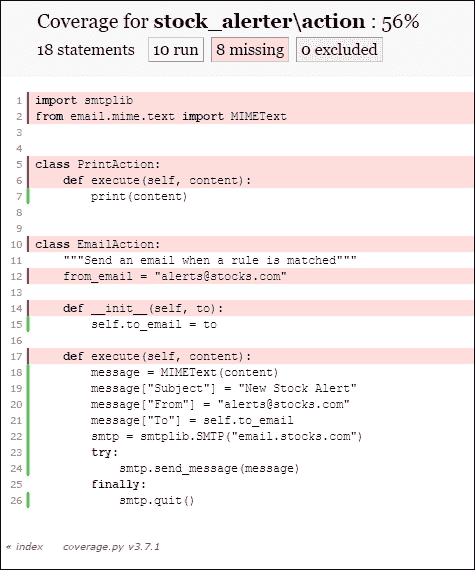

# 第八章：使用 nose2 扩展 unittest

到目前为止，我们一直在使用`unittest`测试运行器来运行我们的测试。Python 社区已经创建了许多其他第三方测试运行器。其中最受欢迎的一个是 nose2。nose2 提供了额外的功能，这些功能在默认测试运行器的基础上进行了改进。

# 开始使用 nose2

安装 nose2 非常简单。最简单的方法是使用 pip 通过以下命令安装它：

```py
pip install nose2

```

现在我们使用 nose2 来运行我们的测试。从 stock alerter 项目目录中，运行`nose2`命令（我们可能需要先将其添加到路径中）。nose2 默认具有测试自动发现功能，因此只需运行命令就应该会得到以下输出：

```py
...............................................................
----------------------------------------------------------------------
Ran 63 tests in 0.109s

OK

```

如我们所见，`nose2`命令给出了与`unittest`相同的输出。nose2 也发现了相同的测试并运行了它们。默认情况下，nose2 的自动发现模式与`unittest`兼容，因此我们可以直接将 nose2 作为替换运行器使用，而无需更改任何代码。

# 为 nose2 编写测试

除了拾取使用`unittest`模块编写的现有测试并运行它们之外，nose2 还支持编写测试的新方法。

首先，nose2 允许测试是常规函数。我们不需要创建一个类并从任何基类继承。只要函数以单词`test`开头，它就被认为是测试并执行。

我们可以采用以下测试：

```py
class StockTest(unittest.TestCase):
    def setUp(self):
        self.goog = Stock("GOOG")

    def test_price_of_a_new_stock_class_should_be_None(self):
        self.assertIsNone(self.goog.price)
```

并将上述测试按以下方式编写：

```py
def test_price_of_a_new_stock_class_should_be_None():
    goog = Stock("GOOG")
    assert goog.price is None
```

如我们所见，以这种方式编写测试减少了我们之前必须做的某些样板代码：

+   我们不再需要创建一个类来存放测试

+   我们不再需要从任何基类继承

+   我们甚至不需要导入`unittest`模块

我们只需将测试编写为常规函数，nose2 就会自动发现并运行测试。

除了将测试移动到常规函数之外，我们还做了一项其他更改，那就是我们断言预期结果的方式。

之前，我们做了以下操作：

```py
self.assertIsNone(self.goog.price)
```

当测试是一个函数时，我们执行以下操作：

```py
assert goog.price is None
```

为什么做这个更改？`unittest.TestCase`类提供了许多内置的断言方法。当我们从这个类继承时，我们可以在测试中使用这些方法。当我们以函数的形式编写测试时，我们就不再能够访问这些方法。幸运的是，nose2 支持 Python 的内置`assert`语句，因此我们可以在测试中使用它。

`assert`语句也支持像以下这样的消息参数：

```py
assert goog.price is None, "Price of a new stock should be None"
```

如果测试失败，消息将按以下方式打印到输出：

```py
======================================================================
FAIL: stock_alerter.tests.test_stock.FunctionTestCase (test_price_of_a_new_stock_class_should_be_None)
----------------------------------------------------------------------
Traceback (most recent call last):
 ...
 assert goog.price is None, "Price of a new stock should be None"
AssertionError: Price of a new stock should be None

----------------------------------------------------------------------

```

## 设置和清理

nose2 还支持为函数式测试用例提供设置和清理。这是通过在*函数对象*上设置`setup`和`teardown`属性来实现的。它的工作方式如下：

```py
def setup_test():
    global goog
    goog = Stock("GOOG")

def teardown_test():
    global goog
    goog = None

def test_price_of_a_new_stock_class_should_be_None():
    assert goog.price is None, "Price of a new stock should be None"

test_price_of_a_new_stock_class_should_be_None.setup = setup_test
test_price_of_a_new_stock_class_should_be_None.teardown = \ teardown_test
```

在函数式测试中，设置和清理是有限的，因为在 `setup` 函数和测试用例以及清理函数之间无法传递状态。这就是为什么我们必须在设置中声明 `goog` 变量为全局变量的原因。这是我们在测试用例和清理函数中访问它的唯一方法。

## 参数化测试

nose2 也支持参数化测试。也称为数据驱动测试，这些测试不过是运行相同的测试，但使用不同的数据组合。

看看我们之前写的以下三个测试：

```py
class StockTrendTest(unittest.TestCase):
    def setUp(self):
        self.goog = Stock("GOOG")

    def given_a_series_of_prices(self, prices):
        timestamps = [datetime(2014, 2, 10), datetime(2014, 2, 11),
                      datetime(2014, 2, 12), datetime(2014, 2, 13)]
        for timestamp, price in zip(timestamps, prices):
            self.goog.update(timestamp, price)

    def test_increasing_trend_true_if_price_increase_for_3_updates(self):
        self.given_a_series_of_prices([8, 10, 12])
        self.assertTrue(self.goog.is_increasing_trend())

    def test_increasing_trend_is_false_if_price_decreases(self):
        self.given_a_series_of_prices([8, 12, 10])
        self.assertFalse(self.goog.is_increasing_trend())

    def test_increasing_trend_is_false_if_price_equal(self):
        self.given_a_series_of_prices([8, 10, 10])
        self.assertFalse(self.goog.is_increasing_trend())
```

通过参数化测试，我们可以写成如下形式：

```py
from nose2.tools.params import params

def given_a_series_of_prices(stock, prices):
    timestamps = [datetime(2014, 2, 10), datetime(2014, 2, 11),
                  datetime(2014, 2, 12), datetime(2014, 2, 13)]
    for timestamp, price in zip(timestamps, prices):
        stock.update(timestamp, price)

@params(
    ([8, 10, 12], True),
    ([8, 12, 10], False),
    ([8, 10, 10], False)
)
def test_stock_trends(prices, expected_output):
    goog = Stock("GOOG")
    given_a_series_of_prices(goog, prices)
    assert goog.is_increasing_trend() == expected_output
```

`params` 装饰器允许我们指定一系列不同的输入。测试会针对每个输入运行一次。一个输入是一个元组，其中元组的每个元素都作为参数传递给测试函数。在上面的例子中，测试将首先使用 `prices=[8, 10, 12], expected_output=True` 运行，然后再次使用 `prices=[8, 12, 10], expected_output=False` 运行，依此类推。

当一个测试失败时，输出看起来如下：

```py
======================================================================
FAIL: stock_alerter.tests.test_stock.test_stock_trends:2
[8, 12, 10], True
----------------------------------------------------------------------
Traceback (most recent call last):
 ...
 assert goog.is_increasing_trend() == expected_output
AssertionError

======================================================================

```

nose2 会将失败的参数编号显示为 `:2`，并在其下方显示传递给测试的确切数据。

参数化测试是一种很好的减少重复测试的方法，其中我们每次都执行相同的步骤序列，但数据各不相同。

## 生成测试

除了参数化测试之外，nose2 还支持生成测试。这与参数化测试类似。区别在于，参数化测试在编写测试时所有输入都是硬编码的，而生成测试可以在运行时创建。

以下是一个示例，以澄清：

```py
def test_trend_with_all_consecutive_values_upto_100():
    for i in range(100):
        yield stock_trends_with_consecutive_prices, [i, i+1, i+2]

def stock_trends_with_consecutive_prices(prices):
    goog = Stock("GOOG")
    given_a_series_of_prices(goog, prices)
    assert goog.is_increasing_trend()
```

当我们运行上述测试时，我们看到已经运行了一百个测试。这里发生了什么？让我们更详细地看看。

与常规测试函数不同，这个函数会返回一个值，使其成为一个生成器函数。`yield` 语句返回要执行的功能以及传递给函数的数据。每次循环通过时，测试函数都会 `yield`，并且生成的函数会使用相应的参数执行。由于循环运行了一百次，因此生成了并执行了一百个测试。

当一个测试失败时，显示以下输出：

```py
======================================================================
FAIL: stock_alerter.tests.test_stock.test_trend_with_all_consecutive_values_upto_100:100
[99, 100, 100]
----------------------------------------------------------------------
Traceback (most recent call last):
 ...
 assert goog.is_increasing_trend()
AssertionError

----------------------------------------------------------------------

```

就像参数化测试一样，输出显示了失败的测试编号以及执行测试时使用的确切输入。

## 层

如果我们查看我们的 `Stock` 类的测试，我们会看到我们创建了三个测试类：`StockTest`、`StockTrendTest` 和 `StockCrossOverSignalTest`。所有这三个类在 `setUp` 代码中都有一些重复，如下所示：

```py
class StockTest(unittest.TestCase):
    def setUp(self):
        self.goog = Stock("GOOG")

class StockCrossOverSignalTest(unittest.TestCase):
    def setUp(self):
        self.goog = Stock("GOOG")
```

如果我们能在它们之间共享部分设置会怎样呢？

nose2 有另一种编写测试的方法，称为 **层**。层允许我们以分层的方式组织我们的测试。以下是一些使用层重写的 `Stock` 测试的示例：

```py
from nose2.tools import such

with such.A("Stock class") as it:

    @it.has_setup
    def setup():
        it.goog = Stock("GOOG")

    with it.having("a price method"):
        @it.has_setup
        def setup():
            it.goog.update(datetime(2014, 2, 12), price=10)

        @it.should("return the price")
        def test(case):
            assert it.goog.price == 10

        @it.should("return the latest price")
        def test(case):
            it.goog.update(datetime(2014, 2, 11), price=15)
            assert it.goog.price == 10

    with it.having("a trend method"):
        @it.should("return True if last three updates were increasing")
        def test(case):
            it.goog.update(datetime(2014, 2, 11), price=12)
            it.goog.update(datetime(2014, 2, 12), price=13)
            it.goog.update(datetime(2014, 2, 13), price=14)
            assert it.goog.is_increasing_trend()

    it.createTests(globals())
```

整个语法都是新的，所以让我们仔细看看。

首先，我们需要导入`such`。**Such**是一个特定领域的语言名称，它使得使用 nose2 层编写测试变得容易。以下行为我们导入了它：

```py
from nose2.tools import such
```

接下来，我们按照以下方式设置顶层：

```py
with such.A("Stock class") as it:
```

一层可以包含设置和拆卸函数、测试用例和子层。这种用法使用了 Python 的上下文管理器语法来定义一层。我们使用`such.A`方法定义最顶层。这个方法的名字可能听起来很奇怪，但这个名字被选择是为了让英语使用者读起来自然。`such.A`接受一个字符串作为参数。这只是一个描述字符串，用于描述后续的测试。

`such.A`的输出被分配给一个变量。按照惯例，它被称为`it`，再次，这个名字被选择是为了让后续的使用看起来像英语句子。

创建了最顶层之后，我们接着为层创建设置函数，如下所示：

```py
    @it.has_setup
    def setup():
        it.goog = Stock("GOOG")
```

函数的名称可以是任何东西，我们只需要通过使用`has_setup`装饰器来标记它为设置函数。这个装饰器是`it`对象的一个方法，因此我们写成`@it.has_setup`。同样，我们可以使用`has_teardown`装饰器来标记一个用于拆卸的函数。

在`setup`函数中，我们可以将任何有状态的信息作为`it`对象的属性存储。这些可以在子层或测试用例中引用。

接下来，我们通过调用拥有方法创建一个子层，如下所示：

```py
with it.having("a price method"):
```

再次，这是一个上下文管理器，所以我们使用`with`语句。与顶层层不同，我们不需要将其分配给任何变量。

子层随后定义自己的设置函数，如下所示：

```py
        @it.has_setup
        def setup():
            it.goog.update(datetime(2014, 2, 12), price=10)
```

除了父层的设置函数外，还会调用这个`setup`函数。

接下来，我们创建一个测试用例，如下所示：

```py
        @it.should("return the price")
        def test(case):
            assert it.goog.price == 10
```

测试用例使用`should`装饰器进行标记。该装饰器接受一个描述字符串，用于解释测试内容。

我们继续使用相同的语法创建另一个测试，如下所示：

```py
        @it.should("return the latest price")
        def test(case):
            it.goog.update(datetime(2014, 2, 11), price=15)
            assert it.goog.price == 10
```

这样就结束了子层。回到顶层，我们创建第二个子层来包含`is_increasing_trend`函数的测试，如下所示：

```py
    with it.having("a trend method"):
        @it.should("return True if last three updates were increasing")
        def test(case):
            it.goog.update(datetime(2014, 2, 11), price=12)
            it.goog.update(datetime(2014, 2, 12), price=13)
            it.goog.update(datetime(2014, 2, 13), price=14)
            assert it.goog.is_increasing_trend()
```

最后，我们调用`createTests`方法将所有这些代码转换为测试用例，如下所示：

```py
    it.createTests(globals())
```

应该在顶层层的末尾调用`createTests`方法。它接受当前`globals`的单个参数。

如果没有调用`createTests`方法，则不会执行任何测试。

现在我们来运行测试。层实际上是一个 nose2 插件，因此我们需要使用以下命令来启用插件并运行测试：

```py
nose2 --plugin nose2.plugins.layers

```

当我们这样做时，使用 Layers 编写的三个测试将与其他所有测试一起执行。

我们可以通过启用 Layer Reporter 插件来获得更友好的输出，以下命令：

```py
nose2 --plugin nose2.plugins.layers --layer-reporter -v

```

现在我们得到以下输出：

```py
A Stock class
 having a price method
 should return the price ... ok
 should return the latest price ... ok
 having a trend method
 should return True if last three updates were increasing ... ok

```

我们为层和测试提供的描述性字符串在这里输出。当写得好的时候，文本应该可以像常规英语句子一样阅读。

如我们所见，Layers 允许我们逻辑地组织测试，在父层和子层之间共享固定值。一个层可以有任意数量的子层，而这些子层反过来又可以包含更多的层。

让我们快速总结一下我们刚刚学到的内容：

+   `such.A`: 这被用作上下文管理器来创建最顶层。

+   `it.has_setup`: 这是一个装饰器，用于标记层的设置函数。

+   `it.has_teardown`: 这是一个装饰器，用于标记层的清理函数。

+   `it.having`: 这被用作上下文管理器来创建一个子层。

+   `it.should`: 这是一个装饰器，用于标记测试用例。

+   `it.createTests`: 这是一个方法，它将所有 Layers 代码转换为测试用例。在顶层代码的最后调用它，传入`globals()`。

# nose2 插件

在上一节中，我们看到了在运行层测试之前我们需要启用 Layers 插件。nose2 附带了一组插件，这些插件增强了或扩展了其行为。实际上，我们之前看到的参数化测试和生成测试的支持实际上都是作为 nose2 插件实现的。区别在于参数化和生成测试默认加载，所以我们不需要明确启用它们。

在本节中，我们将查看一些流行的插件。记住，还有许多其他插件我们没有在这里讨论。

## Doctest 支持

如果我们没有像上一章中描述的那样将 doctests 集成到 unittest 框架中，那么我们可以配置 nose2 来自动发现并运行 doctests。

使用以下命令激活插件：

```py
nose2 --plugin nose2.plugins.doctests --with-doctest

```

这将自动发现并运行 doctests，以及其他所有类型的测试。

## 将测试结果写入 XML 文件

nose2 支持将测试结果写入 XML 文件。许多工具可以读取此文件格式以了解测试运行的结果。例如，持续集成工具可以找出所有测试是否通过，如果没有通过，哪些测试失败了。

使用以下命令激活插件：

```py
nose2 --plugin nose2.plugins.junitxml --junit-xml

```

这将在当前目录中创建一个名为`nose2-junit.xml`的文件。该文件将包含类似以下内容：

```py
<testsuite errors="0" failures="1" name="nose2-junit" skips="0" tests="166" time="0.172">

  <testcase classname="stock_alerter.tests.test_action.EmailActionTest" name="test_connection_closed_after_sending_mail" time="0.000000" />

  ...

  <testcase classname="stock_alerter.tests.test_stock.having a trend method" name="test 0000: should return True if the last three updates were increasing" time="0.000000">

    <failure message="test failure">Traceback (most recent call last):
  File "...\src\stock_alerter\tests\test_stock.py", line 78, in test
    assert it.goog.is_increasing_trend()
AssertionError
    </failure>

  </testcase>
</testsuite>
```

根元素提供了整个测试运行的摘要，包括错误、失败和跳过的数量，测试数量以及运行所有测试的总时间。每个子元素随后总结了一个单独的测试。如果测试失败，还包括跟踪信息。

## 测量测试覆盖率

nose2 还支持测量测试覆盖率。我们可以使用它来识别是否有没有测试的代码行或分支，或者哪些模块的测试覆盖率较差。

在我们能够使用此插件之前，我们需要使用以下命令安装一些依赖包：

```py
pip install nose2[coverage-plugin]

```

这将安装两个包——`cov-core`和`coverage`——这些包被此插件使用。

一旦安装，我们可以使用以下命令启用插件：

```py
nose2 --with-coverage

```

由于此插件默认加载，我们不需要提供`--plugin`参数。运行上述命令将给出以下输出：

```py
----------- coverage: platform win32, python 3.4.0-final-0 -----------
Name                                  Stmts   Miss  Cover
---------------------------------------------------------
stock_alerter\__init__                    3      3     0%
stock_alerter\action                     18      8    56%
stock_alerter\alert                      13      4    69%
stock_alerter\event                       8      4    50%
stock_alerter\legacy                     36     12    67%
stock_alerter\processor                   8      0   100%
stock_alerter\reader                     15      5    67%
stock_alerter\rule                       33     12    64%
stock_alerter\stock                      52     19    63%

```

上面的输出显示了每个模块中有多少条语句，有多少条没有被测试覆盖，以及覆盖率百分比。

该插件还会创建一个名为`.coverage`的文件，以二进制形式存储覆盖率结果。此文件可用于获取不同类型的报告。例如，我们可以使用以下命令获取 HTML 输出：

```py
nose2 --with-coverage --coverage-report html

```

该命令将创建一个名为`htmlcov`的目录，其中包含一组文件。如果我们用浏览器打开`index.html`，那么我们会得到一个完全交互式的覆盖率报告。我们可以点击任何模块，并获取关于哪些行被覆盖以及哪些行没有被覆盖的详细信息，如下面的截图所示：



报告类型的其他选项有`term`用于终端输出，`term-missing`用于在终端上输出未覆盖的行，以及`annotate`，它为每个源文件创建一个带有注释的副本，说明该行是否被覆盖。

可以像以下这样组合多个选项：

```py
nose2 --with-coverage --coverage-report html --coverage-report term

```

## 调试测试失败

另一个有用的 nose2 插件是调试器插件。此插件会在测试失败时激活 Python 调试器（pdb），允许我们调查失败的确切原因。

使用以下命令激活插件：

```py
nose2 --plugin nose2.plugins.debugger --debugger

```

当测试失败时，我们会进入 pdb，可以使用所有的 pdb 命令来调查失败原因，如下所示：

```py
F
> c:\python34\lib\unittest\case.py(787)_baseAssertEqual()
-> raise self.failureException(msg)
(Pdb) u
> c:\python34\lib\unittest\case.py(794)assertEqual()
-> assertion_func(first, second, msg=msg)
(Pdb) u
> c:\projects\tdd_with_python\src\stock_alerter\tests\test_stock.py(60)test_stock_update()
-> self.assertEqual(100, self.goog.price)
(Pdb) self.goog.price
10

```

### nose2 配置

运行各种插件需要使用许多命令行开关。例如，如果我们想运行覆盖率、doctest 以及 XML 输出，命令如下：

```py
nose2 --with-coverage --coverage-report html --plugin nose2.plugins.junitxml --junit-xml --plugin nose2.plugins.doctests --with-doctest

```

这很麻烦，如果我们想默认运行这个组合，那么反复重复参数是非常痛苦的。

为了解决这个问题，nose2 支持将所有配置放入配置文件中。然后 nose2 将从文件中读取设置，我们就不需要在命令行上传递任何内容了。

在`src`目录中创建一个名为`nose2.cfg`的文件，内容如下：

```py
[unittest]
test-file-pattern=test_*.py
test-method-prefix=test
plugins = nose2.plugins.coverage
          nose2.plugins.junitxml
          nose2.plugins.layers
exclude-plugins = nose2.plugins.doctest

[layer-reporter]
always-on = False
colors = True

[junit-xml]
always-on = True
path = nose2.xml

[coverage]
always-on = False
coverage-report = ["html", "xml"]
```

让我们检查这些内容。

nose2 使用正常的 INI 文件语法进行配置。通用配置放在`[unittest]`部分，而插件特定选项放在各自的章节下。在每个章节下，使用键值对配置选项。

我们在上面已经配置了以下内容：

+   **test-file-pattern**：这是在自动发现中识别测试文件时在文件名中搜索的模式。

+   **test-method-prefix**：这是用于识别测试用例函数和方法名称的搜索前缀。

+   **插件**：这些是默认加载的插件。将每个插件放在单独的一行上，在此处引用插件模块。这相当于`--plugin`命令行开关。请注意，这仅加载插件，某些插件需要显式开启（例如，`coverage`插件）。

+   **排除插件**：这些是需要关闭的任何插件。通常，这应用于默认开启的插件（例如，参数化或生成测试支持）。

然后我们配置插件。每个插件都有自己的选项集。一个共同的选项如下：

+   **始终开启**：如果此插件默认开启，则设置为`True`。例如，当`JUnit`插件始终开启时，每次测试运行都会创建 XML 文件输出。否则，我们必须在命令行上使用`--junit-xml`开关来激活它。

nose2 还支持多个配置文件。可以使用`--config`开关来指定要使用的配置文件，如下所示：

```py
nose2 --config <filename>

```

这样你可以使用开发选项的默认配置，并为持续集成或其他用途创建特定的配置文件。例如，你可能希望在自动化工具运行时始终开启 junitxml 和覆盖率，但在开发人员运行测试时关闭它们。

nose2 的配置文件也可以被提交到源代码控制中，这样所有开发人员都会使用相同的选项集。

# 摘要

在本章中，你了解了 nose2，一个强大的测试运行器和插件套件，它扩展了`unittest`框架。nose2 可以用作`unittest`测试运行器的直接替代品。它还可以用来通过有用的插件扩展`unittest`的功能。最后，它可以用来编写新的测试类型，如函数测试、参数化测试、生成测试和基于层的测试。nose2 还支持配置文件，因此它可以在开发人员之间保持一致性运行，并且与自动化工具很好地集成。

在下一章中，你将了解一些更高级的测试模式。
