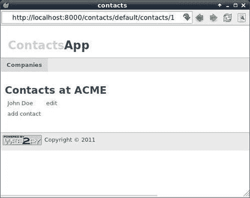
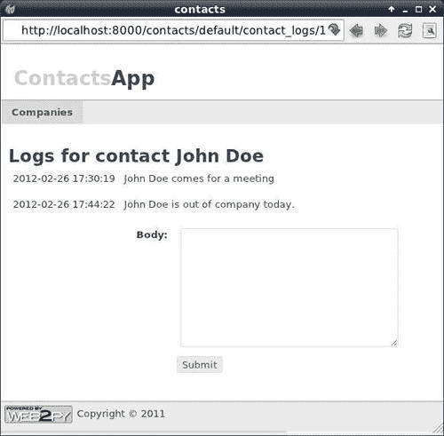
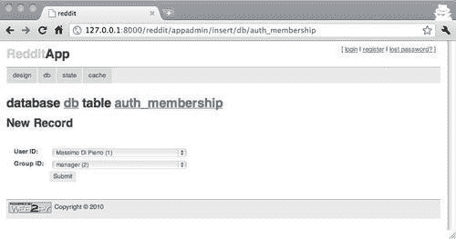
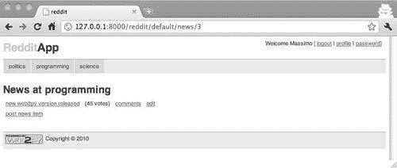
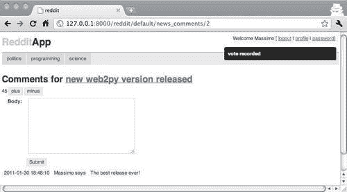
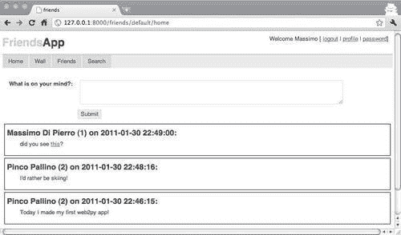
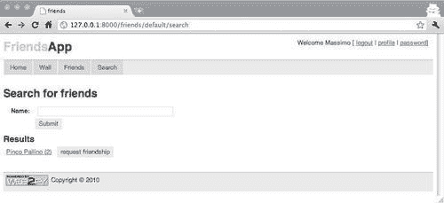
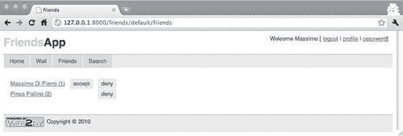
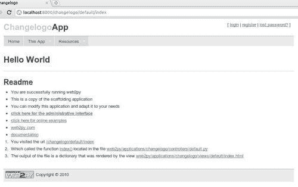
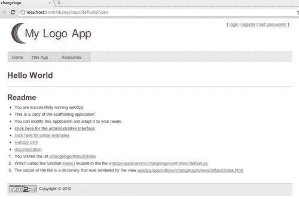

# 第二章. 构建你的第一个应用程序

在本章中，我们将涵盖以下食谱：

+   改进脚手架应用程序

+   构建一个简单的联系人应用程序

+   构建 Reddit 克隆

+   构建 Facebook 克隆

+   使用`crud.archive`

+   将现有静态网站转换为 web2py 应用程序

+   创建半静态页面（flatpages）

+   添加你的自定义标志

+   创建菜单和子菜单

+   使用图标自定义菜单

+   创建导航栏

+   使用 cookies 设置语言

+   设计模块化应用程序

+   加快下载速度

# 简介

现在你已经安装并运行了 web2py，你就可以开始构建你的第一个应用程序了。本章中的食谱将提供完整应用程序的示例，包括模型、视图和控制器。它们从简单的**联系人**应用程序到更复杂的**Facebook**克隆不等。本章中的其他食谱将向你展示如何解决新用户通常遇到的一些常见问题，从添加标志到创建导航栏。

# 改进脚手架应用程序

在这个食谱中，我们讨论如何创建自己的脚手架应用程序并添加自己的配置文件。**脚手架应用程序**是任何新 web2py 应用程序附带文件的集合。

## 如何做这件事...

脚手架应用程序包括几个文件。其中之一是`models/db.py`，它从`gluon.tools`（Mail、`Auth`、`Crud`和`Service`）导入四个类，并定义了以下全局对象：`db`、`mail`、`auth`、`crud`和`service`。

脚手架应用程序还定义了`auth`对象所需的表，例如`db.auth_user`。

默认脚手架应用程序旨在最小化文件数量，而不是模块化。特别是，模型文件`db.py`包含配置，在生产环境中，最好将其保存在单独的文件中。

在这里，我们建议创建一个配置文件`models/0.py`，其中包含以下内容：

```py
from gluon.storage import Storage
settings = Storage()

settings.production = False

if settings.production:
	settings.db_uri = 'sqlite://production.sqlite'
	settings.migrate = False
else:
	settings.db_uri = 'sqlite://development.sqlite'
	settings.migrate = True

settings.title = request.application
settings.subtitle = 'write something here'
settings.author = 'you'
settings.author_email = 'you@example.come'
settings.keywords = ''
settings.description = ''
settings.layout_theme = 'Default'
settings.security_key = 'a098c897-724b-4e05-b2d8-8ee993385ae6'
settings.email_server = 'localhost'
settings.email_sender = 'you@example.com'
settings.email_login = ''
settings.login_method = 'local'
settings.login_config = ''

```

我们还修改了`models/db.py`，使其使用配置文件中的信息，并显式定义`auth_user`表（这使得添加自定义字段更容易）：

```py
from gluon.tools import *

db = DAL(settings.db_uri)
if settings.db_uri.startswith('gae'):
	session.connect(request, response, db = db)

mail = Mail() 			# mailer
auth = Auth(db) 		# authentication/authorization
crud = Crud(db) 		# for CRUD helpers using auth
service = Service() 	# for json, xml, jsonrpc, xmlrpc, amfrpc
plugins = PluginManager()

# enable generic views for all actions for testing purpose
response.generic_patterns = ['*']

mail.settings.server = settings.email_server
mail.settings.sender = settings.email_sender
mail.settings.login = settings.email_login
auth.settings.hmac_key = settings.security_key

# add any extra fields you may want to add to auth_user
auth.settings.extra_fields['auth_user'] = []

# user username as well as email
auth.define_tables(migrate=settings.migrate,username=True)
auth.settings.mailer = mail
auth.settings.registration_requires_verification = False
auth.settings.registration_requires_approval = False

auth.messages.verify_email = 'Click on the link http://' \
	+ request.env.http_host + URL('default','user',
	args=['verify_email']) \
	+ '/%(key)s to verify your email'

auth.settings.reset_password_requires_verification = True

auth.messages.reset_password = 'Click on the link http://' \
	+ request.env.http_host + URL('default','user',
	args=['reset_password']) \
	+ '/%(key)s to reset your password'

if settings.login_method=='janrain':
	from gluon.contrib.login_methods.rpx_account import RPXAccount
	auth.settings.actions_disabled=['register', 'change_password',
		'request_reset_password']
	auth.settings.login_form = RPXAccount(request,
		api_key = settings.login_config.split(':')[-1],
		domain = settings.login_config.split(':')[0],
		url = "http://%s/%s/default/user/login" % \
		(request.env.http_host, request.application))

```

通常，在 web2py 安装或升级后，欢迎应用程序会被 tar-gzipped 成`welcome.w2p`，并用作脚手架应用程序。你可以使用以下命令从现有应用程序创建自己的脚手架应用程序，这些命令来自`bash` shell：

```py
cd applications/app
tar zcvf ../../welcome.w2p *

```

## 更多...

web2py 向导使用类似的方法，并创建类似的`0.py`配置文件。根据需要，你可以向`0.py`文件添加更多设置。

`0.py`文件可能包含敏感信息，例如用于加密密码的`security_key`、包含 smtp 账户密码的`email_login`以及包含 Janrain 密码的`login_config`（[`www.janrain.com/`](http://www.janrain.com/)）。你可能希望将这些敏感信息写入 web2py 树之外的只读文件中，并从你的`0.py`中读取它们，而不是硬编码。这样，如果你选择将应用程序提交到版本控制系统，你将不会提交敏感信息。

框架应用程序包括其他你可能想要定制的文件，包括`views/layout.html`和`views/default/users.html`。其中一些是即将到来的菜谱的主题。

# 构建一个简单的联系人应用程序

当你开始设计一个新的 web2py 应用程序时，你会经历三个阶段，这些阶段的特点是寻找以下三个问题的答案：

+   应用程序应该存储哪些数据？

+   应该向访客展示哪些页面？

+   对于每个页面，页面内容应该如何呈现？

这三个问题的答案分别体现在**模型**、**控制器**和**视图**中。

对于良好的应用程序设计来说，按照这个顺序，尽可能准确地回答这些问题是很重要的。这些答案可以稍后进行修改，并以迭代的方式添加更多表格、更多页面和更多功能。一个优秀的 web2py 应用程序就是这样设计的，你可以更改表定义（添加和删除字段）、添加页面和更改页面视图，而不会破坏应用程序。

web2py 的一个显著特点是所有东西都有一个默认值。这意味着你可以工作在第一步，而无需编写第二步和第三步的代码。同样，你也可以工作在第二步，而无需编写第三步的代码。在每一步，你将能够立即看到你工作的结果；这要归功于`appadmin`（默认数据库管理界面）和通用视图（每个动作都有一个默认视图，直到你编写一个自定义视图）。

在这里，我们考虑的第一个示例是一个用于管理我们的商业联系人的应用程序，一个 CRM。我们将称之为`Contacts`。该应用程序需要维护公司列表以及在这些公司工作的个人列表。

## 如何操作...

1.  首先，我们创建模型。

    在这一步中，我们确定需要哪些表以及它们的字段。对于每个字段，我们确定它们：

    +   必须包含唯一值（`unique=True`）

    +   包含空值（`notnull=True`）

    +   是否是引用（包含另一个表中记录的列表）

    +   用于表示记录（格式属性）

        从现在开始，我们将假设我们正在使用默认框架应用程序的副本，我们只描述需要添加或替换的代码。特别是，我们将假设默认的`views/layout.html`和`models/db.py`。

        这里是一个可能的模型，表示我们需要在`models/db_contacts.py`中存储的数据：

    ```py
    # in file: models/db_custom.py

    db.define_table('company',
    	Field('name', notnull=True, unique=True),
    	format='%(name)s')

    db.define_table('contact',
    	Field('name', notnull=True),
    	Field('company', 'reference company'),
    	Field('picture', 'upload'),
    	Field('email', requires=IS_EMAIL()),
    	Field('phone_number', requires=IS_MATCH('[\d\-\(\) ]+')),
    	Field('address'),
    	format='%(name)s')

    db.define_table('log',
    	Field('body', 'text',notnull=True),
    	Field('posted_on', 'datetime'),
    	Field('contact', 'reference contact'))

    ```

    当然，更复杂的数据表示是可能的。您可能希望允许，例如，多个用户使用系统，允许同一个人为多个公司工作，并跟踪时间的变化。在这里，我们将保持简单。

    这个文件名很重要。特别是，模型按字母顺序执行，并且这个必须跟在`db.py`之后。

1.  在创建此文件后，您可以通过访问以下 URL 进行测试：[`127.0.0.1:8000/contacts/appadmin`](http://127.0.0.1:8000/contacts/appadmin)，以访问 web2py 数据库管理界面`appadmin`。在没有控制器或视图的情况下，它提供了一种插入、选择、更新和删除记录的方法。

1.  现在，我们准备构建控制器。我们需要确定应用程序需要哪些页面。这取决于所需的流程。至少我们需要以下页面：

    +   一个索引页面（主页）

    +   一个列出所有公司的页面

    +   一个列出所选公司所有联系人的页面

    +   一个创建公司的页面

    +   一个编辑/删除公司的页面

    +   一个创建联系人的页面

    +   一个编辑/删除联系人的页面

    +   一个页面，可以阅读一个联系人的信息和通信日志，以及添加新的通信日志

1.  这些页面可以按以下方式实现：

    ```py
    # in file: controllers/default.py

    def index():
    	return locals()

    def companies():
    	companies = db(db.company).select(orderby=db.company.name)
    	return locals()

    def contacts():
    	company = db.company(request.args(0)) or
    		redirect(URL('companies'))
    	contacts = db(db.contact.company==company.id).select(
    		orderby=db.contact.name)
    	return locals()

    @auth.requires_login()
    def company_create():
    	form = crud.create(db.company, next='companies')
    	return locals()

    @auth.requires_login()
    def company_edit():
    	company = db.company(request.args(0)) or
    		redirect(URL('companies'))
    	form = crud.update(db.company, company, next='companies')
    	return locals()

    @auth.requires_login()
    def contact_create():
    	db.contact.company.default = request.args(0)
    	form = crud.create(db.contact, next='companies')
    	return locals()

    @auth.requires_login()
    def contact_edit():
    	contact = db.contact(request.args(0)) or
    		redirect(URL('companies'))
    	form = crud.update(db.contact, contact, next='companies')
    	return locals()

    @auth.requires_login()
    def contact_logs():
    	contact = db.contact(request.args(0)) or
    		redirect(URL('companies'))
    	db.log.contact.default = contact.id
    	db.log.contact.readable = False
    	db.log.contact.writable = False
    	db.log.posted_on.default = request.now
    	db.log.posted_on.readable = False
    	db.log.posted_on.writable = False
    	form = crud.create(db.log)
    	logs = db(
    		db.log.contact==contact.id).select(orderby=db.log.posted_on)
    	return locals()

    def download(): return response.download(request, db)

    def user(): return dict(form=auth())

    ```

1.  确保您不要删除 scaffolding 中的现有`user`、`download`和`service`函数。

1.  注意所有页面都是使用相同的成分构建的：**选择查询**和**CRUD 表单**。您很少需要其他任何东西。

1.  还请注意以下内容：

    +   一些页面需要`request.args(0)`参数（联系人及`company_edit`的联系人 ID，`contact_edit`的联系人 ID，以及`contact_logs`）。

    +   所有选择都有`orderby`参数。

    +   所有 CRUD 表单都有一个 next 参数，用于确定表单提交后的重定向。

    +   所有操作都返回`locals()`，这是一个包含在函数中定义的局部变量的 Python 字典。这是一个快捷方式。当然，也可以返回包含`locals()`任何子集的字典。

    +   `contact_create`为新的联系人公司设置默认值，该值作为`args(0)`传递。

    +   `contacts_logs`在为新日志条目处理`crud.create`后检索过去的日志。这避免了在插入新日志时无必要地重新加载页面。

1.  到目前为止，我们的应用程序已经完全功能化，尽管外观和导航可以改进：

    +   您可以在以下位置创建一个新的公司：`http://127.0.0.1:8000/contacts/default/company_create`

    +   您可以在以下位置列出所有公司：`http://127.0.0.1:8000/contacts/default/companies`

    +   您可以在以下位置编辑公司`#1`：`http://127.0.0.1:8000/contacts/default/company_edit/1`

    +   您可以在以下位置创建一个新的联系人：`http://127.0.0.1:8000/contacts/default/contact_create`

    +   您可以在以下位置列出公司`#1`的所有联系人：`http://127.0.0.1:8000/contacts/default/contacts/1`

    +   你可以在以下位置编辑联系人 `#1`：`http://127.0.0.1:8000/contacts/default/contact_edit/1`

    +   你可以通过以下链接访问联系人 `#1` 的通信日志：`http://127.0.0.1:8000/contacts/default/contact_logs/1`

1.  你还应该编辑 `models/menu.py` 文件，并将其内容替换为以下内容：

    ```py
    response.menu = [['Companies', False, URL('default',
    	'companies')]]

    ```

    应用程序现在可以正常工作，但我们可以通过为操作设计更好的外观和感觉来改进它。这是在视图中完成的。

1.  创建并编辑文件 `views/default/companies.html:`

    ```py
    {{extend 'layout.html'}}
    <h2>Companies</h2>
    <table>
    	{{for company in companies:}}
    	<tr>
    		<td>{{=A(company.name, _href=URL('contacts',
    			args=company.id))}}</td>
    		<td>{{=A('edit', _href=URL('company_edit',
    			args=company.id))}}</td>
    	</tr>
    	{{pass}}
    	<tr>
    		<td>{{=A('add company', _href=URL('company_create'))}}</td>
    	</tr>
    </table>

    ```

    这是这个页面的样子：

    

1.  创建并编辑文件 `views/default/contacts.html:`

    ```py
    {{extend 'layout.html'}}
    <h2>Contacts at {{=company.name}}</h2>
    <table>
    	{{for contact in contacts:}}
    	<tr>
    		<td>{{=A(contact.name, _href=URL('contact_logs',
    			args=contact.id))}}</td>
    		<td>{{=A('edit', _href=URL('contact_edit',
    			args=contact.id))}}</td>
    	</tr>
    	{{pass}}
    	<tr>
    		<td>{{=A('add contact', _href=URL('contact_create',
    			args=company.id))}}</td>
    	</tr>
    </table>

    ```

    这是这个页面的样子：

    

1.  创建并编辑文件 `views/default/company_create.html:`

    ```py
    {{extend 'layout.html'}}
    <h2>New company</h2>
    {{=form}}

    ```

1.  创建并编辑文件 `views/default/contact_create.html:`

    ```py
    {{extend 'layout.html'}}
    <h2>New contact</h2>
    {{=form}}

    ```

1.  创建并编辑文件：`views/default/company_edit.html:`

    ```py
    {{extend 'layout.html'}}
    <h2>Edit company</h2>
    {{=form}}

    ```

1.  创建并编辑文件 `views/default/contact_edit.html:`

    ```py
    {{extend 'layout.html'}}
    <h2>Edit contact</h2>
    {{=form}}

    ```

1.  创建并编辑文件 `views/default/contact_logs.html:`

    ```py
    {{extend 'layout.html'}}
    <h2>Logs for contact {{=contact.name}}</h2>
    <table>
    	{{for log in logs:}}
    	<tr>
    		<td>{{=log.posted_on}}</td>
    		<td>{{=MARKMIN(log.body)}}</td>
    	</tr>
    	{{pass}}
    	<tr>
    		<td></td>
    		<td>{{=form}}</td>
    	</tr>
    </table>

    ```

    这是这个页面的样子：



注意，在最后一个视图中，我们使用了 `MARKMIN` 函数来渲染 `db.log.body` 的内容，使用的是 `MARKMIN` 标记。这允许在日志中嵌入链接、图片、锚点、字体格式化信息以及表格。有关 `MARKMIN` 语法的详细信息，请参阅：[`web2py.com/examples/static/markmin.html`](http://web2py.com/examples/static/markmin.html)。

# 构建 Reddit 克隆

这里我们展示如何构建一个发布和排名在线新闻链接的应用程序，类似于[`www.reddit.com/`](http://www.reddit.com/)网站。链接被组织到类别中，用户可以发布、投票和评论它们。与先前的菜谱一样，代码只显示了默认脚手架应用程序的添加或更改。我们将我们的应用程序称为 `reddit`。

在这个菜谱中，我们不会支持带线程的评论（如实际[`www.reddit.com/`](http://www.reddit.com/)网站上的那样），因为这会是一个不必要的复杂性。我们将在后续的菜谱中讨论带线程的评论。

我们将遵循先前的菜谱中讨论的相同步骤。

## 如何操作...

这个应用程序与先前的 `contacts` 菜谱非常相似。事实上，数据模型几乎是相同的，前提是我们将表 `company` 映射到表 `category`，将表 `contact` 映射到表 `news`。主要区别在于新闻条目没有 `name`，但它们有 `title` 和 `link`。此外，新闻条目必须按用户投票排序，而不是按字母顺序。我们还需要添加一个机制来允许用户投票、记录投票并防止重复计数。为此我们需要一个额外的表。我们也不会处理分页，因为这在单独的菜谱中讨论过。

这是完整的模型：

```py
# in file: models/db_reddit.py
db.define_table('category',
	Field('name' ,notnull=True, unique=True),
	format='%(name)s')

db.define_table('news',
	Field('title', notnull=True),
	Field('link', requires=IS_URL()),
	Field('category', 'reference category', readable=False,
		writable=False),
	Field('votes', 'integer', readable=False, writable=False),
	Field('posted_on', 'datetime', readable=False, writable=False),
	Field('posted_by', 'reference auth_user', readable=False, writable=False),
	format='%(title)s')

db.define_table('comment',
	Field('news', 'reference news', readable=False, writable=False),
	Field('body', 'text', notnull=True),
	Field('posted_on', 'datetime', readable=False, writable=False),
	Field('posted_by', 'reference auth_user', readable=False,
		writable=False))

db.define_table('vote',
	Field('news', 'reference news'),
	Field('value', 'integer'),
	Field('posted_on', 'datetime', readable=False, writable=False),
	Field('posted_by', 'reference auth_user', readable=False,
		writable=False))

```

1.  如前所述，许多所需操作与之前菜谱中的 `contacts` 应用程序等效。特别是，我们需要列出类别、列出给定类别的新闻、创建和编辑类别、创建和编辑新闻、列出评论以及为 `news` 项目投票的操作。

    ```py
    def index():
    	return locals()

    def categories():
    	categories = db(db.category).select(orderby=db.category.name)
    	return locals()

    def news():
    	category = db.category(request.args(0)) or
    		redirect(URL('categories'))
    	news = db(db.news.category==category.id).select(
    		orderby=~db.news.votes, limitby=(0, 25))
    	return locals()

    @auth.requires_membership('manager')
    def category_create():
    	form = crud.create(db.category, next='categories')
    	return locals()

    @auth.requires_membership('manager')
    def category_edit():
    	category = db.category(request.args(0)) or
    		redirect(URL('categories'))
    	form = crud.update(db.category, category, next='categories')
    	return locals()

    @auth.requires_login()
    def news_create():
    	db.news.category.default = request.args(0)
    	db.news.votes.default = 0
    	form = crud.create(db.news, next='news_comments/[id]')
    	return locals()

    @auth.requires_login()
    def news_edit():
    	news = db.news(request.args(0)) or redirect(URL('categories'))
    	if not news.posted_by==auth.user.id:
    		redirect(URL('not_authorized'))
    	form = crud.update(db.news, category, next='news_comments/[id]')
    	return locals()

    def news_comments():
    	news = db.news(request.args(0)) or redirect(URL('categories'))
    	if auth.user:
    		db.comment.news.default = news.id
    		db.comment.posted_on.default = request.now
    		db.comment.posted_by.default = auth.user.id
    		form = crud.create(db.comment)
    	comments = db(db.comment.news==news.id).select(
    		orderby=db.comment.posted_on)
    	return locals()

    @auth.requires_login()
    def vote():
    	if not request.env.request_method=='POST': raise HTTP(400)
    	news_id, mode = request.args(0), request.args(1)
    	news = db.news(id=news_id)
    	vote = db.vote(posted_by=auth.user.id, news=news_id)
    	votes = news.votes
    	value = (mode=='plus') and +1 or -1
    	if vote and value*vote.value==1:
    		message = 'you voted already'
    	else:
    		if vote:
    			votes += value - vote.value
    			vote.update_record(value=value)
    		else:
    			votes += value
    			db.vote.insert(value=value, posted_by=auth.user.id,
    				posted_on=request.now, news=news_id)
    			news.update_record(votes=votes)
    			message = 'vote recorded'
    		return "jQuery('#votes').html('%s');jQuery('.flash').\
    			html('%s').slideDown();" % (votes, message)

    ```

    大多数这些操作都非常标准，由常用的 `select` 和 `crud` 表单组成。

1.  我们使用了两种类型的装饰器来确保只有登录用户可以编辑内容，只有管理员可以创建和编辑类别。您可以使用 `appadmin` 创建一个 `manager` 组并将用户添加为成员：

    

    +   唯一的特殊操作是最后的 `vote`。投票操作被设计为 Ajax 回调。为了避免间接引用攻击，第一行确保操作通过 `POST` 请求调用。然后我们解析请求参数：它期望一个新闻 ID 作为 `args(0)`，以及正负号作为 `args(0)`，取决于我们是要对新闻项进行点赞还是踩。如果我们点赞（`plus`），它将创建一个值为 `+1` 的新 `db.vote` 条目。如果我们踩（`minus`），它将创建一个值为 `-1` 的新 `db.vote` 条目。操作还检查我们是否已经投票。我们允许更改我们的投票，但不能重复投票。

        此操作返回一个 JavaScript 字符串，用于更新投票 HTML 元素的最新投票数，并显示一条新消息。操作的最后一行与将要执行 Ajax 调用的视图紧密耦合（views/default/news_comments.html）。

1.  我们还希望在菜单中列出所有可能的类别：

    ```py
    # in file: models/menu.py"
    categories = db(db.category).select(orderby=db.category.name,
    	cache=(cache.ram, 60))
    response.menu = [(c.name, False, URL('default', 'news',
    	args=c.id)) for c in categories]

    ```

1.  最后，我们需要创建以下视图：

    +   `views/default/categories.html:`

    ```py
    {{extend 'layout.html'}}
    <h2>Categories</h2>
    <table>
    	{{for category in categories:}}
    	<tr>
    		<td>{{=A(category.name, _href=URL('news',
    			args=category.id))}}</td>
    		<td>{{=A('edit', _href=URL('category_edit',
    			args=category.id))}}
    		</td>
    	</tr>
    	{{pass}}
    	<tr>
    		<td>{{=A('add category', _href=URL('category_create'))}}</td>
    	</tr>
    </table>

    ```

    +   `views/default/news.html:`

    ```py
    {{extend 'layout.html'}}
    <h2>News at {{=category.name}}</h2>
    <table>
    	{{for news in news:}}
    	<tr>
    		<td>{{=A(news.title, _href=news.link)}}</td>
    		<td>{{=A('comments', _href=URL('news_comments',
    			args=news.id))}}
    		</td>
    		<td>{{=A('edit', _href=URL('news_edit', args=news.id))}}</td>
    	</tr>
    	{{pass}}
    	<tr>
    		<td>{{=A('post news item', _href=URL('news_create',
    			args=category.id))}}
    		</td>
    		<td></td>
    	</tr>
    </table>

    ```

    下面是这个页面的样子：

    

    +   `views/default/category_create.html:`

        ```py
        {{extend 'layout.html'}}
        <h2>New category</h2>
        {{=form}}

        ```

    +   `views/default/news_create.html:`

        ```py
        {{extend 'layout.html'}}
        <h2>Post news item</h2>
        {{=form}}

        ```

    +   `views/default/category_edit.html:`

        ```py
        {{extend 'layout.html'}}
        <h2>Edit category</h2>
        {{=form}}

        ```

    +   `views/default/categories.html:`

        ```py
        {{extend 'layout.html'}}
        <h2>Edit news item</h2>
        {{=form}}

        ```

    +   `views/default/news_comments.html:`

        ```py
        {{extend 'layout.html'}}
        <h2>Comments for {{=A(news.title, _href=news.link)}}</h2>
        {{if auth.user:}}
        	<span id="votes">{{=news.votes}}</span>
        	<button id="plus"
        		onclick="ajax('{{=URL('vote', args=(news.id, 'plus'))}}', [], ':eval')">
        		plus
        	</button>

        	<button id="minus"
        		onclick="ajax('{{=URL('vote', args=(news.id, 'minus'))}}', [],
        		':eval')">
        		minus
        	</button>
        	{{=form}}
        {{pass}}
        <table>
        	{{for comment in comments:}}
        	<tr>
        		<td>{{=comment.posted_on}}</td>
        		<td>{{=comment.posted_by.first_name}} says </td>
        		<td>{{=MARKMIN(comment.body)}}</td>
        	</tr>
        {{pass}}
        </table>

        ```

        注意代码：

        ```py
        <button id="plus"
        	onclick="ajax('{{=URL('vote', args=(news.id, 'plus'))}}', [],
        	':eval')">
        	plus
        </button>

        ```

        点击时，它执行一个 Ajax 请求来记录我们的投票。Ajax 请求的返回值将被评估（`:eval`）。URL（`vote`）返回将被评估的 JavaScript 代码：

        ```py
        def vote():
        	...
        	return
        		"jQuery('#votes').html('%s');jQuery('.flash').
        		html('%s').slideDown();" % (votes, message)

        ```

1.  特别是，它将更改以下代码的内容，并显示一条新消息（滑动下降）：

    ```py
    <span id="votes">{{=news.votes}}</span>

    ```

    下面是这个页面的样子：

    

# 构建 Facebook 克隆

在其基本层面，Facebook 处理用户之间的友谊关系，并允许朋友看到彼此的帖子。用户可以注册、登录、搜索其他用户、请求友谊和接受友谊。当用户发布一条消息时，该消息将显示在所有朋友的朋友墙上（网页）。

当然，真正的 Facebook 应用程序相当复杂，而我们版本大大简化了，但它捕捉了最重要的功能。特别是，我们将省略在帖子后附加评论的能力，以及省略电子邮件通知功能。我们还将省略处理照片、视频和聊天的代码。我们只对基于好友关系的友谊关系和显示墙帖子感兴趣。我们将我们的应用程序称为 `friends`。

## 如何操作...

我们设计的核心是一个连接两个人的表：友谊关系的 `source` 和 `target`。友谊关系由 `source` 请求，必须由 `target` 批准。批准后，`source` 用户可以看到 `target` 的帖子和个人资料信息。虽然真实的 Facebook 友谊关系是双向的（尽管朋友可以被隐藏/阻止），但在我们的情况下，我们假设单向友谊（两个用户必须互相给予友谊才能看到对方的帖子）。

1.  因此，模型非常简单，我们只需要两个表：

    ```py
    # in file: models:

    # a table to store posted messages
    db.define_table('post',
    	Field('body', 'text', requires=IS_NOT_EMPTY(), label='What is on
    		your mind?'),
    	Field('posted_on', 'datetime', readable=False, writable=False),
    	Field('posted_by', 'reference auth_user', readable=False,
    		writable=False))

    # a table to link two people
    db.define_table('link',
    	Field('source', 'reference auth_user'),
    	Field('target', 'reference auth_user'),
    	Field('accepted', 'boolean', default=False))

    # and define some global variables that will make code more
    compact

    User, Link, Post = db.auth_user, db.link, db.post
    me, a0, a1 = auth.user_id, request.args(0), request.args(1)
    myfriends = db(Link.source==me)(Link.accepted==True)
    alphabetical = User.first_name|User.last_name
    def name_of(user): return '%(first_name)s %(last_name)s' % user

    ```

    最后五行定义了各种快捷方式，这将使我们的控制器和视图更加紧凑。例如，它们允许用户使用 `User` 而不是 `db.user`，以及使用 `orderby=alphabetical` 而不是更冗长的等效选项。

    `myfriends` 是接受我们友谊的人的集合，这意味着我们可以看到他们的帖子。

    下面的列表行允许我们打印用户对象或用户引用的姓名和姓氏：

    ```py
    {{=name_of(user)}}

    ```

1.  我们将需要以下页面：

    +   一个**索引**页面，如果登录，则重定向到我们的主页

    +   一个**私人**主页，显示我们的消息、朋友的帖子，并允许我们发布新的帖子

    +   一个页面用于按名称搜索新朋友

    +   一个页面用于查看我们的当前好友，检查待处理的好友请求，并批准或拒绝好友关系

    +   一个墙页面用于查看特定朋友的状况（或我们自己的）

1.  我们还需要实现一个回调操作，允许用户**请求**好友关系，**接受**好友关系，**拒绝**好友请求，以及**取消**之前的好友请求。我们通过一个名为 `friendship:` 的单个 Ajax 回调函数来实现这些功能。

    ```py
    # in file: controllers/default.py
    def index():
    	if auth.user: redirect(URL('home'))
    	return locals()

    def user():
    	return dict(form=auth())

    def download():
    	return response.download(request, db)

    def call():
    	session.forget()
    	return service()

    # our home page, will show our posts and posts by friends
    @auth.requires_login()
    def home():
    	Post.posted_by.default = me
    	Post.posted_on.default = request.now
    	crud.settings.formstyle = 'table2cols'
    	form = crud.create(Post)
    	friends = [me]+[row.target for row in
    		myfriends.select(Link.target)]
    	posts = db(Post.posted_by.belongs(friends))\
    		.select(orderby=~Post.posted_on, limitby=(0, 100))
    	return locals()

    # our wall will show our profile and our own posts
    @auth.requires_login()
    def wall():
    	user = User(a0 or me)
    	if not user or not (user.id==me or \
    		myfriends(Link.target==user.id).count()):
    		redirect(URL('home'))
    	posts = db(Post.posted_by==user.id)\
    		.select(orderby=~Post.posted_on, limitby=(0, 100))
    	return locals()

    # a page for searching friends and requesting friendship
    @auth.requires_login()
    def search():
    	form = SQLFORM.factory(Field('name', requires=IS_NOT_EMPTY()))
    	if form.accepts(request):
    		tokens = form.vars.name.split()
    		query = reduce(lambda a,b:a&b,
    		[User.first_name.contains(k)|User.last_name.contains(k) \
    		for k in tokens])
    			people = db(query).select(orderby=alphabetical)
    		else:
    			people = []
    	return locals()

    # a page for accepting and denying friendship requests
    @auth.requires_login()
    def friends():
    	friends = db(User.id==Link.source)(Link.target==me)\
    		.select(orderby=alphabetical)
    	requests = db(User.id==Link.target)(Link.source==me)\
    		.select(orderby=alphabetical)
    	return locals()

    # this is the Ajax callback
    @auth.requires_login()
    def friendship():
    	"""Ajax callback!"""
    	if request.env.request_method != 'POST': raise HTTP(400)
    	if a0=='request' and not Link(source=a1, target=me):
    		# insert a new friendship request
    		Link.insert(source=me, target=a1)
    	elif a0=='accept':
    		# accept an existing friendship request
    		db(Link.target==me)(Link.source==a1).update(accepted=True)
    	if not db(Link.source==me)(Link.target==a1).count():
    		Link.insert(source=me, target=a1)
    	elif a0=='deny':
    		# deny an existing friendship request
    		db(Link.target==me)(Link.source==a1).delete()
    	elif a0=='remove':
    		# delete a previous friendship request
    		db(Link.source==me)(Link.target==a1).delete()

    ```

1.  我们还在菜单中包括了**主页、墙、好友**和**搜索**页面：

    ```py
    # in file: models/menu.py
    response.menu = [
    	(T('Home'), False, URL('default', 'home')),
    	(T('Wall'), False, URL('default', 'wall')),
    	(T('Friends'), False, URL('default', 'friends')),
    	(T('Search'), False, URL('default', 'search')),
    ]

    ```

    大多数视图都很直接。

    +   这里是 `views/default/home.html`: 

    ```py
    {{extend 'layout.html'}}
    {{=form}}
    <script>jQuery('textarea').css('width','600px').
    	css('height','50px');</script>
    {{for post in posts:}}
    <div style="background: #f0f0f0; margin-bottom: 5px; padding:
    	8px;">
    	<h3>{{=name_of(post.posted_by)}} on {{=post.posted_on}}:</h3>
    	{{=MARKMIN(post.body)}}
    </div>
    {{pass}}

    ```

    注意到调整输入消息框大小的 jQuery 脚本，以及使用 MARKMIN 进行消息标记渲染。

    +   这里是 `views/default/wall.html`，它与前面的视图非常相似（区别在于没有表单，帖子与单个用户相关，由 `request.args(0)` 指定）：

    ```py
    {{extend 'layout.html'}}
    <h2>Profile</h2>
    {{=crud.read(db.auth_user, user)}}
    <h2>Messages</h2>
    {{for post in posts:}}
    <div style="background: #f0f0f0; margin-bottom: 5px; padding:
    	8px;">
    	<h3>{{=name_of(post.posted_by)}} on {{=post.posted_on}}:</h3>
    	{{=MARKMIN(post.body)}}
    </div>
    {{pass}}

    ```

    这个页面的样子如下：



+   这里是 `views/default/search.html`: 

    ```py
    {{extend 'layout.html'}}
    <h2>Search for friends</h2>
    {{=form}}
    {{if people:}}
    <h3>Results</h3>
    <table>
    	{{for user in people:}}
    	<td>
    		{{=A(name_of(user), _href=URL('wall', args=user.id))}}
    	</td>
    	<td>
    		<button onclick="ajax(
    			'{{=URL('friendship', args=('request', user.id))}}',
    			[], null);
    			jQuery(this).parent().html('pending')">
    			request friendship
    		</button>
    	</td>
    	{{pass}}
    </table>
    {{pass}}

    ```

+   这里是这个页面的样子：



+   注意按钮是如何执行 Ajax 调用到`request`以`user.id`为对象的友谊的。点击后，按钮会被一个显示“待处理”的消息所替换。

    +   下面是`views/default/friends.html`。它列出了当前的朋友和待处理的友谊请求：

    ```py
    {{extend 'layout.html'}}
    <h2>Friendship Offered</h2>
    <table>
    	{{for friend in friends:}}
    	<tr>
    		<td>
    			{{=A(name_of(friend.auth_user), _href=URL('wall', args=friend.auth_user.id))}}
    		</td>
    		<td>
    			{{if friend.link.accepted:}}accepted{{else:}}
    				<button onclick="ajax(
    					'{{=URL('friendship', args=('accept',
    					friend.auth_user.id))}}',
    					[], null);
    					jQuery(this).parent().html('accepted')">
    					accept
    				</button>
    			{{pass}}
    		</td>
    		<td>
    			<button onclick="ajax(
    				'{{=URL('friendship', args=('deny',
    				friend.auth_user.id))}}',
    				[], null);
    				jQuery(this).parent().html('denied')">
    				deny
    			</button>
    		</td>
    	</tr>
    	{{pass}}
    </table>
    <h2>Friendship Requested</h2>
    <table>
    	{{for friend in requests:}}
    	<tr>
    		<td>
    			{{=A(name_of(friend.auth_user), _href=URL('wall',
    				args=friend.auth_user.id))}}
    		</td>
    		<td>
    			{{if friend.link.accepted:}}accepted{{else:}}
    pending{{pass}}
    		</td>
    		<td>
    			<button onclick="ajax(
    				'{{=URL('friendship', args=('deny',
    				friend.auth_user.id))}}',
    				[], null);
    				jQuery(this).parent().html('removed')">
    				remove
    			</button>
    		</td>
    	</tr>
    	{{pass}}
    </table>

    ```

+   下面是这个页面的样子：



+   这个视图显示了两个表：一个是向我们**提供**的友谊列表（通过接受，我们赋予他们查看我们个人资料和帖子的权限），以及我们发送的友谊**请求**（我们希望查看其个人资料和帖子的人）。在第一个表中的每个用户都有一个按钮。一个按钮执行 Ajax 调用以**接受**待处理的友谊请求，另一个按钮用于**拒绝**友谊。在第二个表中的每个用户都有一个列，告诉我们我们的请求是否被接受，以及一个带有按钮的列，用于取消友谊关系（无论是否待处理或已建立）。

    注意`{{=name_of(user)}}`和`{{=name_of(message.posted_by)}}`需要数据库查找。我们的应用程序可以通过缓存此函数的输出来加速。

# 使用`crud.archive`

在这个菜谱中，我们讨论了如何在任何应用程序中为记录创建完整的版本控制。

## 如何操作...

如果你有一个需要版本控制的表，例如`db.mytable`，并且你使用`crud.update`，你可以通过将`onaccept=crud.archive`传递给`crud.update`来为你的记录存储完整的修订历史。下面是一个例子：

```py
form = crud.update(db.mytable, myrecord,
	onaccept=crud.archive,
	deletable=False)

```

`crud.archive`将创建一个隐藏的表`db.mytable_archive`，并在更新之前将旧记录存储在新创建的表中，包括对当前记录的引用。

通常，这个新表是隐藏的，并且只对 web2py 内部可见，但你可以通过在模型中明确定义它来访问它。如果原始表被命名为`db.mytable`，归档表必须命名为`db.mytable_archive`（在原始表名后加上`_archive`），并且它必须通过一个名为`current_record`的引用字段扩展原始表。下面是一个具体的例子：

```py
db.define_table('mytable_archive',
	Field('current_record', db.mytable),
	db.mytable)

```

对于不同的表，只需将`mytable`替换为实际的表名。其他所有内容保持不变。

注意这样的表包含了`db.mytable`的所有字段加上一个`current_record`。

## 还有更多...

让我们看看`crud.archive`的其他功能。

### 存储记录的时间戳

`crud.archive`不会为存储的记录添加时间戳，除非你的原始表有时间和签名。例如：

```py
db.define_table('mytable',
	...
	auth.signature)

```

通过向表中添加`auth.signature`，我们添加了以下字段：

```py
Field('is_active', 'boolean', default=True),
Field('created_on', 'datetime', default=request.now,
	writable=False, readable=False),
Field('created_by', db.auth_user, default=auth.user_id, writable=False, readable=False),
Field('modified_on', 'datetime',
	update=default.now, default=request.now,
	writable=False, readable=False),
Field('modified_by', db.table_user,
	default=auth.user_id, update=auth.user_id,
	writable=False, readable=False)

```

你也可以手动进行（不使用`auth.signature`），并为签名和时间戳字段命名。`crud.archive`会透明地处理它们。它们由`SQLFORM.accepts`函数填充。

### 存储每个记录的历史

`crud.archive` 的主要思想是存储每个被编辑的记录的历史，并将以前的版本存储在单独的表中。这允许你在不破坏对它的引用的情况下编辑记录。此外，如果你修改（迁移）原始表，存档表也会迁移。唯一的缺点是，在原始表中删除记录将在存档表中引起级联删除，并且整个记录的先前历史都将被删除。因此，你可能永远不想删除记录，而是通过取消选中 `is_active` 字段来将它们设置为**禁用**。

你还必须在某些 `select` 语句中更改查询，以隐藏已禁用的记录，通过以下方式过滤记录：

```py
db.mytable.is_active==True

```

# 将现有静态网站转换为 web2py 应用程序

我们将假设你有一个静态 HTML 文件、CSS 文件、JavaScript 文件和图像的集合在一个文件夹中，并且你希望将它们转换为一个 web2py 应用程序。有两种方法可以实现：一种简单的方法，其中现有的 HTML 文件继续被视为静态，另一种更复杂的方法，其中 HTML 文件与控制器操作相关联，以便以后可以添加一些动态内容。

## 如何操作...

1.  一种简单的方法是创建一个新的 web2py 应用程序（或使用现有的一个），并使用一个静态文件夹。例如，创建一个名为 `app` 的新应用程序，并将现有站点的整个目录结构复制到 `applications/app/static/` 之下。

    这样，一个静态文件，`applications/app/static/example.html`，可以通过以下 URL 访问：`http://127.0.0.1:8000/app/static/example.html。`

    虽然这个过程不会破坏相对 URL（不以正斜杠开头的 URL），例如：`<a href="../path/to/example2.html">点击我</a>`，但它可能会破坏绝对 URL（以正斜杠开头），例如：`<a href="/path/to/example2.html">点击我</a>。`

    这不是一个 web2py 特定的问题，而是一个表明那些 HTML 文件设计不佳的迹象，因为绝对链接会在文件夹结构移动到另一个文件夹时被破坏。

1.  如果出现这种情况，解决这个问题的正确方法是将所有绝对 URL 替换为相对 URL。这里有一个例子。

    如果一个文件，`static/path1/example1.html`，包含一个像 `<a href="/path/to/example2.html">点击我</a>` 这样的链接，并且文件 `example2.html` 出现在 `static/path2/example2.html` 之下，那么链接应该替换为 `<a href="../path2/example2.html">点击我</a>。`

    这里，`../` 从 `static/path`1 文件夹移动到静态文件夹，其余路径（`path2/example2.html`）正确地标识了所需的文件。

1.  通过简单搜索 `href, src` 和 `url`，你应该可以定位到 HTML、CSS 和 JavaScript 文件中的所有 URL。所有以 `/` 开头的 URL 都需要修复。

1.  一种更复杂的方法是将所有图像、电影、CSS 和 JavaScript 文件移动到静态文件夹中，并将 HTML 文件转换为视图。

    我们按照以下五个步骤进行：

    +   我们将所有静态文件（除了以`html`结尾的文件）移动到应用程序的`static/`文件夹。

    +   我们创建一个新的控制器（例如，名为`controllers/legacy.py`），以及一个新的`views`文件夹（例如`views/legacy`）。

    +   我们将所有 HTML 文件（例如，`page.html`）移动到新的视图文件夹下。

    +   对于每个`view`文件，我们创建一个同名的控制器动作，返回`dict()`。

    +   我们将所有内部链接和引用替换为`URL(...)`。

1.  让我们考虑一个具体的例子，它包括以下文件：

    ```py
    page.html
    image.png

    ```

    在这里，page.html 包含。在我们的 web2py 应用程序文件夹中，我们最终得到以下文件结构：

    ```py
    controllers/legacy.py
    views/legacy/page.html
    static/image.png

    ```

    在这里，legacy.py 包含

    ```py
    def page(): return dict()

    ```

    并且在 page.html 中的被替换为

    ```py
    

    ```

页面现在可以通过以下 URL 访问：

`http://127.0.0.1:8000/app/legacy/page.html`。

# 创建半静态页面（平面页面）

任何网络应用程序都包含静态页面，其内容不经常更改。它们被称为**平面页面**。可以通过将 CMS 嵌入到应用程序中（例如`plugin_wiki`）或使用本菜谱中描述的显式机制来处理它们。

平面页面的例子包括：

+   基本主页和索引

+   关于我们

+   许可证和免责声明

使用 web2py，对于这些页面，我们可以设置简单的控制器，例如：

```py
def about(): return dict()

```

然后，您可以直接在视图中编写页面代码，或者将页面内容存储在数据库中。第二种方法更好，因为它将允许用户轻松就地编辑，支持多语言国际化，记录更改历史以供审计，等等。

这个菜谱的思路是将平面页面存储在数据库中，并根据用户请求（控制器、函数、参数、首选语言等）显示它们。

## 如何做到这一点...

1.  首先，定义一个平面页面表以存储页面内容，在模型中创建一个名为`flatpages.py`的文件，并添加以下定义：

    ```py
    LANGUAGES = ('en', 'es', 'pt', 'fr', 'hi', 'hu', 'it', 'pl', 'ru')
    FLATPAGES_ADMIN = 'you@example.com'
    DEFAULT_FLATPAGE_VIEW = "flatpage.html"
    db.define_table('flatpage',
    	Field('title', notnull=True),
    	Field('subtitle', notnull=True),
    	Field('c', label='controller'),
    	Field('f', label='function'),
    	Field('args', label='arguments'),
    	Field('view', default=DEFAULT_FLATPAGE_VIEW),
    	Field('lang', requires=IS_IN_SET(LANGUAGES), default='en'),
    	Field('body', 'text', default=''),
    	auth.signature,
    )

    ```

    字段包括：

    +   `title:` 这是主标题

    +   `subtitle:` 这是可选的副标题

    +   `c:` 这是属于此页面的控制器（参见 URL 辅助工具）

    +   `f:` 这是属于此页面的函数（参见 URL 辅助工具）

    +   `args:` 这是添加多个页面到函数的字符串参数（参见 URL 辅助工具）

    +   `lang:` 这是匹配用户偏好的语言

    +   `body:` 这是页面的 HTML 主体

        注意，`FLATPAGES_ADMIN`将用于限制对平面页面的编辑访问。此变量包含允许编辑的用户电子邮件。

1.  到目前为止，您应该能够使用`appadmin`管理界面填充此表，或者您可以编程实现，即在控制器中创建一个`setup_flatpage`函数，如下所示：

    ```py
    if not db(db.flatpage).count():
    	db.flatpage.insert(title="Home", subtitle="Main Index",
    		c="default", f='index', body="<h3>Hello world!</h3>")
    	db.flatpage.insert(title="About us", subtitle="The company",
    		c="company", f='about_us', body="<h3>My company!</h3>")
    	db.flatpage.insert(title="Mision & Vision", subtitle="The company",
    		c="company", f='mision_vision', body="<h3> Our vision is...</h3>")
    	db.flatpage.insert(title="Our Team", subtitle="Who we are",
    		c="company", f='our_team', body="<h1>We are...</h3>") db.flatpage.insert(title="Contact Us", subtitle="Where we are", c="company", f='contact_us', body="<h3>Contact form:...</h3>")

    ```

    此示例页面将如下所示：

    ```py
    Home: Hello world
    About Us
    	The Company : My company!
    Mission & Vision: Our vision is...
    Our Team: We are...
    Contact Us: Contact Form:...

    ```

1.  为了能够渲染一个页面，将以下函数`flatpage`添加到之前创建的文件`models/flatpage.py`中：

    ```py
    def flatpage():
    	# define languages that don't need translation:
    	T.current_languages = ['en', 'en-en']

    	# select user specified language (via session or browser config)
    	if session.lang:
    		lang = session.lang
    	elif T.accepted_language is not None:
    		lang = T.accepted_language[:2]
    	else:
    		lang = "en"
    		T.force(lang)

    title = subtitle = body = ""
    flatpage_id = None
    form = ''
    view = DEFAULT_FLATPAGE_VIEW

    if request.vars and auth.user and
    	auth.user.email==FLATPAGES_ADMIN:
    	# create a form to edit the page:
    	record = db.flatpage(request.get_vars.id)
    	form = SQLFORM(db.flatpage, record)
    if form.accepts(request, session):
    	response.flash = T("Page saved")
    elif form.errors:
    	response.flash = T("Errors!")
    else:
    	response.flash = T("Edit Page")

    if not form:
    	# search flatpage according to the current request
    	query = db.flatpage.c==request.controller
    	query &= db.flatpage.f==request.function
    if request.args:
    	query &= db.flatpage.args==request.args(0)
    else:
    	query &= (db.flatpage.args==None)|(db.flatpage.args=='')
    	query &= db.flatpage.lang==lang
    	# execute the query, fetch one record (if any)
    	flatpage =
    		db(query).select(orderby=~db.flatpage.created_on,
    	limitby=(0, 1), cache=(cache.ram, 60)).first()
    if flatpage:
    	flatpage_id = flatpage.id
    	title = flatpage.title
    	subtitle = flatpage.subtitle
    	body = flatpage.body
    	view = flatpage.view
    else:
    	response.flash = T("Page Not Found!")
    if auth.user and auth.user.email==FLATPAGES_ADMIN:
    	# if user is authenticated, show edit button:
    	form = A(T('edit'),
    		_href=URL(vars=dict(id=flatpage_id)))

    # render the page:
    response.title = title
    response.subtitle = subtitle
    response.view = view
    body = XML(body)
    return dict(body=body, form=form)

    ```

    这个功能：

    +   检查用户语言偏好（或会话设置）

    +   检查操作 URL（根据请求控制器、函数和参数）

    +   获取存储的扁平页面

    +   渲染页面 HTML

        如果用户`FLATPAGES_ADMIN`已登录，函数`flatpage()`：

    +   在编辑页面时准备/处理`SQLFORM`

    +   或者显示一个**编辑**按钮来编辑页面

1.  最后，你应该创建一个`flatpage.html`视图，以便 web2py 可以渲染页面，例如：

    ```py
    {{extend 'layout.html'}}
    <h1>{{=response.title}}</h1>
    <h2>{{=response.subtitle}}</h2>
    {{=form}}
    {{=body}}

    ```

    占位符是：

    +   `form:` 这是编辑`FORM`（或编辑链接）

    +   `body:` 这些是实际的页面内容（作为 HTML 存储在数据库中）

1.  要告诉 web2py 在期望的控制器（即在`default.py`中的`index`）中显示扁平页面，请编写以下内容：

    ```py
    def index(): return flatpage()

    ```

    这将渲染主页的扁平页面。

    `company.py`示例控制器将如下所示：

    ```py
    def about_us(): return flatpage()
    def mision_vision(): return flatpage()
    def our_team(): return flatpage()

    ```

    当你访问`default/index.php`或`company/about_us`时，如果你已经登录，你应该会看到一个带有`EDIT`按钮的扁平页面。

请记住，出于性能原因，扁平页面是缓存的。因此，更改可能不会立即显示（你可以通过清除缓存或从数据库查询中删除缓存参数来更改这一点）。

## 它是如何工作的...

使用 web2py，你可以完全选择要显示的内容、要使用的视图等。

在这种情况下，当 web2py 执行你的控制器时，函数`flatpage()`将尝试根据请求变量从数据库中获取存储的页面。

如果按下**编辑**按钮，将渲染一个`SQLFORM`，允许普通认证用户编辑页面。页面更新将被插入，因此你会得到页面更改的历史记录。它显示页面的最新记录，尝试匹配首选语言（例如，使用`session.lang = 'es'`来更改语言）。

你可以向扁平页面表添加一个`view`字段，这样你就可以有多个视图来显示这种内容。你甚至可以添加一个`format`字段，这样你可以在 HTML 之外的其他标记语言中渲染页面主体（wiki、ReST 等）。

# 添加您的自定义标志

我们将更改随 web2py 一起提供的默认标志，并添加我们的标志。我们需要一个图像编辑器；使用你喜欢的，或者使用操作系统提供的，如 Paint、GIMP 或 Photoshop 都是合适的。



这是默认应用程序的外观：



这是自定义标志的结果。

## 如何操作...

1.  首先，我们需要创建一个新的应用程序。您可以通过`admin`应用程序来完成此操作。选择**创建一个新的应用程序**，并为其命名。我的应用程序名称是`changelogo`。默认情况下，新应用程序是`welcome`脚手架应用程序的副本。现在，如果您运行应用程序，您将在应用程序顶部看到您的应用程序标题后跟单词`App`，在我的情况下是`changelogoApp`。

1.  启动您的图像编辑器，如果您要开始一个新的标志。根据您使用的布局选择像素尺寸。我选择了`300x90`像素的新标志尺寸。编辑完成后，将其保存为 PNG 或 JPEG 格式。将其命名为（例如，`mylogoapp.png`），并将其复制到您应用程序内部的`static/images`目录中。

1.  下一步是编辑您应用程序的`views/layout.html`。您可以使用管理员或您自己的编辑器。向下滚动到标题部分，寻找以下内容：

    ```py
    <div id="header"> <!-- header and login nav -->
    	{{block header}} <!-- this is default header -->
    	{{try:}}{{=auth.navbar(action=URL('default',
    		'user'))}}{{except:pass}}
    	<h1>
    		<span id="appname">
    			{{=request.application.capitalize()}}
    		</span>
    		App
    	</h1>
    	<div style="clear: both;"></div><!-- Clear the divs -->
    	{{end}}
    </div><!-- header -->

    ```

1.  让我稍微解释一下这段代码。

    以下代码打印用户操作，例如登录、注册和找回密码：

    ```py
    {{try:}}{{=auth.navbar(action=URL('default',
    	'user'))}}{{except:pass}}

    ```

    以下代码打印应用程序名称后跟`App:`。

    ```py
    <h1>
    	<span id="appname">
    		{{=request.application.capitalize()}}
    	</span>
    	App
    </h1>

    ```

    我们需要将其更改为显示新的标志。我们将用以下内容替换 `<h1>...</h1>`：

    ```py
    {{=IMG(_src=URL('static', 'images/mylogoapp.png'), _style="width:
    	100%;")}}

    ```

    这将打印标志图像而不是标题。

    标题部分现在看起来如下：

    ```py
    <div id="header"> <!-- header and login nav -->
    	{{block header}} <!-- this is default header -->
    	{{try:}}{{=auth.navbar(action=URL('default',
    		'user'))}}{{except:pass}}
    	{{=IMG(_src=URL('static', 'images/mylogoapp.png'))}}
    	<div style="clear: both;"></div><!-- Clear the divs -->
    	{{end}}
    </div><!-- header -->

    ```

1.  最后，将标志链接到主页是一种良好的做法，因此我们将创建一个链接到`default/index:`。

    ```py
    {{=A(IMG(_src=URL('static', 'images/mylogoapp.png')),
    	_href=URL('default', 'index'))}}

    ```

# 创建菜单和子菜单

web2py 以透明的方式处理菜单，如下所示：

+   按惯例，菜单项列表存储在`response.menu`中。

+   菜单嵌入在带有`{{=MENU(response.menu)}}`的视图中。

您可以在同一视图的不同位置或不同视图中拥有多个菜单。`response.menu`的值是菜单项的列表。通常，每个菜单项都是一个包含以下元素的元组的列表：**标题，状态，链接**，和**子菜单**。

其中标题是菜单的标题，状态是一个布尔值，可以用来确定菜单链接是否是当前页面，链接是在选择菜单项时要重定向到的链接，子菜单是菜单项的列表。

以下是一个通常放在文件`models/menu.py`中的代码示例：

```py
response.menu = [
	('Home', URL()==URL('default', 'home'), URL('default', 'home'),
		[]),
	('Search', URL()==URL('default', 'search'), URL('default',
		'search'), []),
]

```

我们用作第二个参数的条件检查当前页面的`URL()`是否是链接的页面。

## 如何做到这一点...

1.  子菜单可以很容易地显式构建，如下所示：

    ```py
    response.menu = [
    	('Home', URL()==URL('default', 'home'), URL('default', 'home'),
    		[]),
    	('Search', False, None,
    		[
    			('Local', URL()==URL('default', 'search'), URL('default',
    				'search')),
    			('Google', False, 'http://google.com'),
    			('Bing', False, 'http://bing.com'),
    		]
    	),
    ]

    ```

1.  子菜单的父菜单可能包含或不包含链接。在这个例子中，我们将链接从`搜索`移动到其`本地`子菜单项。将菜单标题国际化是一种良好的做法。

    ```py
    response.menu = [
    	(T('Home'), URL()==URL('default', 'home'), URL('default',
    		'home'), []),
    ]

    ```

1.  对于每个链接指定控制器名称（例如示例中的`default`）也很重要；否则，当有多个控制器时（这几乎是必然的情况；想想`appadmin`），菜单会出错。

# 使用图标自定义菜单

有时，你可能想要比通常的语法允许的更多自定义菜单项，例如，通过向菜单项添加图标。这个菜谱展示了如何做到这一点。

## 如何做...

1.  首先要意识到的是以下内容：

    ```py
    response.menu = [
    	('Home', False, URL('default', 'home'), []),
    		...]

    ```

    等价于以下内容：

    ```py
    response.menu = [
    	(A('Home', _href=URL('default', 'home')), False, None, []),
    		...]

    ```

    在这里，A 是锚点（链接）助手。你可以使用后面的语法，并且你可以用任何其他组合的助手替换 A 助手。例如：

    ```py
    response.menu = [
    	(A(IMG(_src=URL('static', 'home.png'), _href=URL('default',
    		'home'))), False, None, []),
    			...
    ]

    ```

    或者：

    ```py
    response.menu = [
    	(SPAN(IMG(_src=URL('static', 'home.png')),	
    		A('home', _href=URL('default', 'home'))), False, None, []),
    			...
    ]

    ```

1.  你可以创建构建你的菜单项的函数：

    ```py
    def item(name):
    	return SPAN(IMG(_src=URL('static', name+'.png')), A(name,
    	_href=URL('default', name)))

    response.menu = [
    	(item(home), False, None, []),
    	...

    ```

# 创建导航栏

web2py 包括对菜单的内置支持，使用基本的 Python 结构进行渲染。在大多数情况下，这已经足够了，但对于更复杂的菜单，仅使用 Python 代码来维护它们是困难的。这个菜谱展示了如何创建一个更动态的菜单，将菜单条目存储在数据库中，并自动构建菜单树。

## 如何做...

1.  首先，让我们定义一个导航栏表来存储菜单条目。在`models`中创建一个名为`navbar.py`的文件，并添加以下定义：

    ```py
    db.define_table('navbar',
    	Field("title", "string"),
    	Field("url", "string", requires=IS_EMPTY_OR(IS_URL())),
    	Field("c", label="Controller"),
    	Field("f", label="Function"),
    	Field("args", label="Arguments"),
    	Field("sortable", "integer"),
    	Field("parent_id", "reference navbar"),
    	format="%(title)s",
    )

    ```

    字段包括：

    +   `title:` 这是在用户界面中显示的文本

    +   `url:` 这是可选的链接 URL

    +   `c:` 这是构建链接的控制器（参见 URL 助手）

    +   `f:` 这是构建链接的函数（参见 URL 助手）

    +   `args:` 这是构建链接的字符串参数

    +   `sortable:` 这是一个用于排序条目的数值

    +   `parent_id:` 这是高级别菜单祖先（其条目是子菜单）的引用（`navbar.id`）

1.  到目前为止，你应该能够使用`appadmin`管理界面填充此表，或者你可以通过在控制器中创建一个名为`setup_navbar`的函数来程序化地完成它，如下所示：

    ```py
    if not db(db.navbar).count():
    	# create default index entry:
    	home_id = db.navbar.insert(title="Home", c="default")

    	# create a "Company" leaf with typical options:
    	company_id = db.navbar.insert(title="Company", c="company")
    	db.navbar.insert(title="About Us", f='about_us',
    		parent_id=company_id)
    	db.navbar.insert(title="Mision & Vision", f='mision_vision',
    		parent_id=company_id)
    	db.navbar.insert(title="Our Team", f='our_team',
    		parent_id=company_id)

    	products_id = db.navbar.insert(title="Products", c="products")
    	# Add some "Computers models" to products entry:
    	computers_id = db.navbar.insert(title="Computers",
    		f='computers', parent_id=products_id)
    	for model in 'basic', 'pro', 'gamer':
    		db.navbar.insert(title="Model %s" % model, args=model,
    			parent_id=computers_id)

    ```

    这个示例菜单看起来如下所示：

    ```py
    Home
    Company
    	About Us
    	Mission & Vision
    	Our Team
    Products
    	Computers
    		Model basic
    		Model pro
    		Model gamer

    ```

    每个顶级菜单链接到一个特定的控制器，二级子菜单链接到该控制器上的函数，三级条目为这些函数提供参数（注意，你可以为 URL 参数 c 和 f 使用相同的默认值，这些值将按层次结构使用继承的值）。

1.  现在，为了显示菜单，将以下`get_sub_menus`函数添加到之前创建的`models`中的`navbar.py`文件：

    ```py
    def get_sub_menus(parent_id, default_c=None, default_f=None):
    	children = db(db.navbar.parent_id==parent_id)
    	for menu_entry in children.select(orderby=db.navbar.sortable):
    		# get action or use defaults:
    		c = menu_entry.c or default_c
    		f = menu_entry.f or default_f
    	# is this entry selected? (current page)
    	sel = (request.controller==c and request.function==f and
    		(request.args and request.args==menu_entry.args or True))
    	# return each menu item
    	yield (T(menu_entry.title),
    	sel, menu_entry.url or URL(c, f, args=menu_entry.args),
    	get_sub_menus(menu_entry.id, c, f)
    )

    ```

    此函数递归地构建在 HTML 页面上渲染菜单所需的 Python 结构，并执行以下操作：

    +   获取请求级别的`navbar`菜单条目

    +   检查操作目标或使用默认值（对于`URL`助手）

    +   计算此条目是否为当前选中的条目

    +   创建并返回用于`MENU`助手的条目

1.  要告诉 web2py 构建菜单，请在相同的`navbar`模型中使用以下内容：

    ```py
    response.menu = get_sub_menus(parent_id=None)

    ```

    这将在每次查看页面时构建菜单。

1.  如果你有一个不经常改变的复杂菜单，你可以多次重用它，使用缓存将其保存在内存中：

    ```py
    response.menu = cache.ram('navbar_menu', lambda:
    	get_sub_menus(parent_id=None), time_expire=60)

    ```

菜单通常在包含`MENU`助手的页面上渲染，该助手解释这个结构（参见`views, layout.html`）：

```py
{{=MENU(response.menu, _class='sf-menu')}}

```

# 使用 cookies 设置语言

默认情况下，web2py 从**HTTP Accept-Language 头**中确定首选用户语言。

这里是一个正常工作流程的示例：

+   用户将浏览器首选项设置为`en`（英语）、`en-us`（美国英语）和`fr-fr`（法国法语）

+   访问我们的网站时，浏览器在 HTTP 头`Accept-Language`中发送接受的语言列表。

+   web2py 解析 HTTP 头，验证`Accept-Language`列表，并遍历其语言。

+   当一个语言出现在`T.current_languages`中，或者当在请求应用程序的语言子文件夹中找到相应的语言文件（例如`fr-fr.py`）时，web2py 停止循环。

如果 web2py 因为一个语言，例如`en-en`，出现在`T.current_languages`中而停止循环，这意味着该语言不需要翻译。如果相反，web2py 因为找到一个语言文件而停止循环，那么将使用该语言文件进行翻译。如果对于`Accept-Language`中的所有语言都没有满足这两个条件，则没有翻译。

通常，这个选择是在调用应用程序代码之前由 web2py 执行的。

在应用程序代码中（例如，在模型中），你可以覆盖默认设置。你可以更改当前语言列表：

```py
T.set_current_languages('en', 'en-en')

```

你也可以强制 web2py 从一个不同于 HTTP 头中提供的列表中选择语言：

```py
T.force('it-it')

```

通常情况下，你不想让网络应用程序依赖于浏览器来确定语言偏好，而是希望通过按钮、链接或下拉框明确询问访客。当这种情况发生时，应用程序需要记住用户在浏览应用程序页面时的选择。

如果应用程序需要登录，这个偏好可以存储在用户配置文件中，例如，在`auth_user`表的自定义字段中。

但并非所有应用程序都需要登录，而且通常语言偏好是在注册之前表达的。一种方便且透明地设置和记住语言的方法是不需要数据库，而是在 cookie 中存储偏好设置。这可以通过以下方式实现。

## 如何操作...

1.  创建一个`model`文件，例如`0_select_language.py`，其中包含以下代码：

    ```py
    if 'all_lang' in request.cookies and not
    	(request.cookies['all_lang'] is None):
    	T.force(request.cookies['all_lang'].value)

    ```

1.  在`views/layout.html`中的某个位置插入以下内容：

    ```py
    <span>
    	<script>
    		function set_lang(lang) {
    			var date = new Date();
    			cookieDate=date.setTime(date.getTime()+(100*24*60*60*1000));
    			document.cookie='all_lang='+lang+';expires='+cookieDate+';
    				path=/{{=request.application}}';
    			window.location.reload();
    		};
    	</script>
    	<select name="adminlanguage"
    		onchange="set_lang(jQuery(this).val())">
    		{{for language in T.get_possible_languages():}}
    		<option {{=T.accepted_language==language and 'selected' or
    			''}}>
    			{{=T(language)}}
    		</option>
    		{{pass}}
    	</select>
    </span>

    ```

    上述代码生成一个选择语言的下拉框，列出 web2py 可以找到翻译文件的所有语言。当下拉框的值改变时，它会强制页面重新加载。在重新加载后，代码设置一个名为`all_lang`的 cookie，其中包含所选语言。当加载另一个页面时，如果上述代码找到 cookie，它将使用 cookie 中的信息来选择并强制语言选择。

1.  使用链接而不是下拉框可以更明确地实现相同的效果：

    ```py
    <span>
    	<script>
    		function set_lang(lang) {
    			var date = new Date();
    			cookieDate=date.setTime(date.getTime()+(100*24*60*60*1000));
    			document.cookie='all_lang='+lang+';expires='+cookieDate+';
    				path=/{{=request.application}}';
    			window.location.reload();
    			return false;
    		};
    	</script>
    		{{for language in T.get_possible_languages():}} {{if not T.accepted_language==language:}}
    			<a href="#" onclick="set_lang('{{=language}}')">
    				{{=T(language)}}
    			</a>
    			{{else:}}{{=T(language)}}{{pass}}{{pass}}
    	</select>
    </span>

    ```

    即使应用程序不使用会话，这种解决方案也是有效的。

注意，语言名称本身也需要翻译，即`{{=T(language)}}`，因为它应该列在当前选定的语言中。

也要注意以下字符串位于 cookie 中，确保偏好设置仅适用于当前应用程序。此行由客户端解释，如果通过路由启用了自定义 URL，可能需要更改：

```py
path=/{{=request.application}}

```

在这种情况下，一个简单的解决方案是将它替换为以下内容，并且偏好设置将适用于同一 web2py 安装下的所有应用程序，无论 URL 如何：

```py
path=/

```

# 设计模块化应用程序

在这个菜谱中，我们将向您展示如何使用 web2py 组件创建一个模块化应用程序。

特别是，我们将考虑一个示例应用程序，该应用程序将允许您创建项目、列出项目，并在创建/更新新项目时动态更新列表。

## 准备就绪

我们将考虑以下附加模型`scaffolding application`的`models/db_items.py`：

```py
db.define_table('mytable',
	Field('name'),
	Field('quantity','integer'))

```

注意，此表及其字段结构没有特定之处，但以下示例中我们将使用`db.mytable`。

## 如何操作...

1.  在`controllers/default.py`中，创建一个基本动作来加载视图和控制器中的组件，以实际列出和编辑项目：

    ```py
    def index():
    	"index will load the list and the create/edit forms as
    	components"
    	return dict()

    def list_items():
    	""" shows a list of items that were created
    	each items is clickable and can be edited """
       rows = db(db.mytable.id>0).select()
    	return dict(rows=rows)

    def edit_item():
    	""" return a creation form if no item is specified,
    	return an edit form if the item is known """
    	def display_changed(data):
    		response.ajax = \
    		'web2py_component("%s","show_itemlist")' % URL('showitems')
    	form = crud.update(db.mytable,
    		request.args(0),onaccept=display_changed)
    	return form

    ```

1.  在视图`views/default/index.html`中，只需加载组件以列出项目并链接编辑功能（使用占位符，该占位符将用于插入创建或编辑项目的表单）：

    ```py
    {{=LOAD('default', 'list_items', ajax = True, target =
    'showitems')}}
    {{=A('create',component=URL('edit_item'),target='placeholder')}}
    <div id="placeholder"></div>

    ```

1.  在视图`views/default/list_items.html`中，项目列表中的每个项目都会将指定的 URL 加载到 ID 为`placeholder`的`div`中。

    ```py
    <ul>
    	{{for item in rows:}}
    		{{=LI(A('edit %s' % item.name,
    			component=URL('edit_item',args=item.id),
    			target='placeholder'))}}
    	{{pass}}
    </ul>

    ```

对于`edit_item`动作的视图不是必需的，因为它返回一个辅助器，而不是字典。

## 它是如何工作的...

索引视图通过 Ajax 将项目列表加载到`div#showitems`中。它还显示一个链接和一个`div#placeholder`。点击链接会导致对`edit_item`的 Ajax 请求，没有`args`返回一个在`div#placeholder`内渲染的`create form`。列表还包含一个到`edit_item`的链接，该链接也会在`div#placeholder`中显示一个`update form`。表单不仅通过 Ajax 显示。组件始终通过点击`A(...,component=URL(...),target="placeholder")`来加载。

这确保了组件通过 Ajax 加载，组件中的表单将通过 Ajax 提交，从而仅刷新组件。任何表单提交都将返回一个`response.ajax`，该响应刷新其他组件`div@list_items`。

注意所有逻辑都在服务器端生成，在嵌入页面的 JS 代码中幕后翻译，并在客户端执行。点击链接会显示一个表单。提交表单会导致处理表单，如果被接受，项目列表将被刷新。

# 加快下载速度

默认情况下，scaffolding 控制器中的下载函数设置以下 HTTP 响应头，防止客户端缓存：

```py
Expires: Thu, 27 May 2010 05:06:44 GMT
Pragma: no-cache
Cache-Control: no-store, no-cache, must-revalidate, post-check=0,
pre-check=0

```

这可能对某些动态内容有益，但例如，一个客户端在浏览包含多个非静态图像的网站时，会看到每次页面显示时每个图像的加载情况，这会减慢导航速度。

使用 `@cache` 装饰器缓存下载没有帮助，因为缓存将在服务器端完成，而我们希望客户端缓存。

此外，下载函数还执行一些授权检查，在某些情况下，这些检查是不必要的，因此会导致不必要的延迟。

一个更好的方法是使用自定义的下载函数，它允许客户端缓存，并跳过授权。

## 如何做到这一点...

我们需要编写一个自定义的下载函数。我们可以编辑现有的脚手架，但最好是简单地添加另一个名为 `fast_download` 的函数，这样我们就可以在不同的应用部分选择使用其中一个。

1.  首先，我们希望我们的应用程序返回以下 HTTP 头部信息：

    ```py
    Last-Modified: Tue, 04 May 2010 19:41:16 GMT

    ```

1.  但省略这些：

    ```py
    Expires removed
    Pragma removed
    Cache-control removed

    ```

    这可以通过在流回文件之前显式删除不需要的头部信息来完成：

    ```py
    def fast_download():
    	filename = request.args(0)
    	if not qualify_for_fast_download(filename)
    		return download()
    	else:
    		del response.headers['Cache-Control']
    		del response.headers['Pragma']
    		del response.headers['Expires']
    		filepath = os.path.join(request.folder, 'uploads', filename)
    		response.headers['Last-Modified'] = \
    			time.strftime("%a, %d %b %Y %H:%M:%S +0000",
    			time.localtime(os.path.getmtime(filename)))
    		return response.stream(open(filepath, 'rb'))

    ```

1.  注意，`response.stream` 会为你处理 `Range 请求` 和 `If-Modified-Since`。同时请注意，这样的操作可能会下载比预期更多的文件，因此我们插入了一个检查，如下所示：

    ```py
    qualify_for_fast_download(filename)

    ```

    我们把这个留给你来实现。

    它将检查这个函数是否可以使用，或者应该使用正常的下载函数。

1.  在你的视图中，记得使用 `fast_download` 而不是下载来构造 URL：

    ```py
    URL('fast_download', args='filename')

    ```

### 还有更多...

如果你想要确保 `fast-download` 保存的文件名在一个 **上传** 类型的字段中，例如，`mytable.myfield`，那么你可以配置你的 web 服务器直接提供它，并绕过 web2py。例如，如果你正在使用 Apache：

```py
AliasMatch ^/([^/]+)/static/(mytable\.myfield.*) \
	/home/www-data/web2py/applications/$1/static/$2
<Directory /home/www-data/web2py/applications/*/static/>
	Options -Indexes
	Order Allow,Deny
	Allow from all
</Directory>

```

这之所以有效，是因为存储在 `mytable.myfield` 中的所有文件名在上传时都会被 web2py 重命名，并且它们的名称以 `mytable.myfield` 开头。
