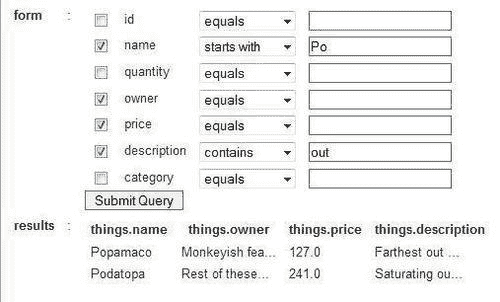
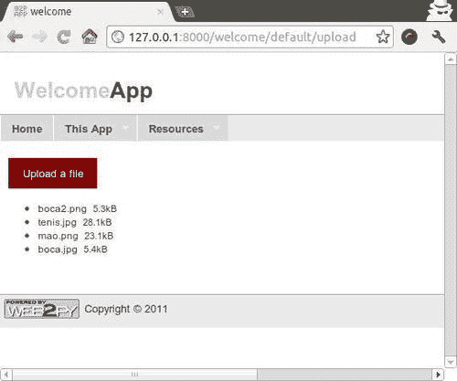

# 第四章. 高级表单

在本章中，我们将介绍以下配方：

+   在表单中添加取消按钮

+   在表单提交时添加确认

+   动态搜索数据

+   在一页中嵌入多个表单

+   检测和阻止并发更新

+   创建表单向导

+   临时去规范化数据

+   移除表单标签

+   使用 `fileuploader.js`

+   使用 `LOADed` 组件上传文件

+   从上传的图像创建图像缩略图

+   监控上传进度

+   表单中的自动提示

+   颜色选择器小部件

+   缩短文本字段

+   创建多表单

+   创建具有引用的多表单

+   创建多表更新表单

+   星级评分小部件

# 简介

Web2py 提供了强大的表单生成功能。在本章中，我们提供了从添加按钮到创建自定义表单小部件的表单定制的示例。我们还提供了复杂表单的示例，例如向导和多表单。

## 在表单中添加取消按钮

这个配方解释了一种向表单添加取消按钮的方法，即不提交表单、忽略任何更改并返回到上一页（或根据设置继续到下一页）的按钮。取消按钮实际上是此处描述的更一般机制的特殊情况，用于向你的表单添加按钮。

## 准备工作

我们的配方假设了一个通用模型。

## 如何操作...

1.  控制器使用以下语句构建表单和按钮：

    ```py
    form=SQLFORM(db.mytable,
    	record=mytable_index,
    	deletable=True,
    	submit_button=T('Update'))

    ```

1.  你可以使用以下语句添加按钮：

    ```py
    form[0][-1][1].append(TAG.BUTTON('Cancel',
    	_onclick="document.location='%s';"%URL('index')))

    ```

    最后一行显示了如何将“取消”按钮添加到表单中，这就像将按钮附加到表单一样简单。`SQLFORM` 的索引，你在其中选择附加（或插入）你的取消按钮，决定了你的按钮将在你的页面上出现的位置。

    这里，表单`[0]`是表单内的 TABLE。`form[0]`[-1]是最后一个 TR。`form[0][-1][1]`是第一列（最后一个 TR 中的第二个 TD）。`_onclick` 参数将用户带到 `window.location=` 语句右侧指定的 URL。

1.  将“取消”按钮放在“提交”按钮之后的等效表示法将是：

    ```py
    form.element('input[type=submit]').parent.append(TAG.BUTTON(...))

    ```

    这里，元素方法部分接受 CSS3 语法。

1.  通常，可以使用相同的机制将任何类型的按钮添加到表单中。

    如果你更喜欢对创建你的“取消”按钮或其他按钮有更多控制和透明度，那么自定义视图可能是有序的。然而，你不得将此方法与已附加到表单中混合使用。以下示例显示了一个自定义表单，表单是通过以下方式创建的：

    ```py
    form=SQLFORM.factory(db.mytable)

    ```

示例假设了一个具有编号为 `1` 到 `N` 的字段的通用表。

```py
{{=form.custom.begin}}
{{=form.custom.widget.field1}}
{{=form.custom.widget.field2}}
{{=form.custom.widget.field3}}
{{=form.custom.submit}}
{{=TAG.BUTTON(T('Cancel'), _onclick='...')}}
{{=form.custom.end}}

```

在这里，`field1...field3` 必须是实际的字段名称。再次强调，`_onclick` 动作可以是任何类型和风味。

# 在表单提交时添加确认

经常，你需要再次确认用户不是意外提交了错误表单。你可以通过在用户点击提交按钮时提示用户确认来实现这一点。这可以通过两种方式完成。

## 如何操作...

1.  一种方法是通过使用`jQuery`仅编辑渲染表单的视图。在视图中添加以下代码：

    ```py
    <script>
    	jQuery(function(){
    		jQuery('input[type=submit]').click(
    			function(){return confirm('Are you sure?');
    		});
    	});
    </script>

    ```

    这里，`confirm`是一个 JavaScript 函数，它指示浏览器创建一个确认对话框。如果你按下[**是**]，`onclick`函数返回 true，表单将被提交。如果你按下[**否**]，`onclick`函数返回 false，表单将不会被提交。

1.  同样，你可以在创建表单时将字符串添加到按钮的`onclick`属性中来实现这一点。

    ```py
    return confirm('Are you sure?')

    ```

1.  在 web2py 中，有一个简单的方法来做这件事：

    ```py
    def my_action():
    	form = SQLFORM.factory(...)
    	form.element('input[type=submit]')['_onclick'] = "return
    		confirm('Are you sure?');"
    	return dict(form=form)

    ```

注意我们如何在服务器端（在表单实际在 HTML 中渲染之前）使用`jQuery`语法获取`form.element(...)`，并修改其`onclick`属性（使用带有前导下划线的 web2py 表示法）。

# 动态搜索数据

Web2py 自带了一个`crud.search`机制，允许你执行以下操作：

```py
def index():
	form, results = crud.search(db.things)
	return dict(form=form, results=results)

```

在这里，`form`是一个搜索表单，`records`是搜索的结果。为了理解它是如何工作的，我们在这个菜谱中提供了一个简化版的函数实现，你可以根据你的需求进一步自定义。在这里，`db.things`是一个包含我们的东西的表。实际的表名或其结构在这里并不重要。

## 如何做...

1.  首先，创建一个新的模型，例如`dynamic_search.py`，并将以下代码添加到其中：

    ```py
    def build_query(field, op, value):
    	if op == 'equals':
    		return field == value
    	elif op == 'not equal':
    		return field != value
    	elif op == 'greater than':
    		return field > value
    	elif op == 'less than':
    		return field < value
    	elif op == 'starts with':
    		return field.startswith(value)
    	elif op == 'ends with':
    		return field.endswith(value)
    	elif op == 'contains':
    		return field.contains(value)
    def dynamic_search(table):
    	tbl = TABLE()
    	selected = []
    	ops = ['equals','not equal','greater than','less than',
    		  'starts with','ends with','contains']
    	query = table.id > 0
    	for field in table.fields:
    		chkval = request.vars.get('chk'+field,None)
    		txtval = request.vars.get('txt'+field,None)
    		opval = request.vars.get('op'+field,None)
    		row = TR(TD(INPUT(_type="checkbox",_name="chk"+field,
    							value=chkval=='on')),
    				TD(field),TD(SELECT(ops,_name="op"+field,
    							value=opval)),
    				TD(INPUT(_type="text",_name="txt"+field,
    							_value=txtval)))
    		tbl.append(row)
    		if chkval:
    			if txtval:
    				query &= build_query(table[field], opval,txtval)
    				selected.append(table[field])
    	form = FORM(tbl,INPUT(_type="submit"))
    	results = db(query).select(*selected)
    	return form, results

    ```

1.  现在，你可以使用`dynamic_search`作为`crud.search`的替代品。

    ```py
    def index():
    	form,results = dynamic_search(db.things)
    	return dict(form=form,results=results)

    ```

    我们可以用以下视图来渲染它：

    ```py
    {{extend 'layout.html'}}
    {{=form}}
    {{=results}}

    ```

    它看起来是这样的：



# 在一个页面上嵌入多个表单

这个菜谱解释了如何在页面上嵌入多个表单。这样做可以通过减少 HTTP 调用来提高用户的生产力，但可能会增加页面布局的杂乱。

## 如何做...

1.  为了说明具有多个表单的页面，我们创建了一个用于存储个人教育**简历（CV）**的简化系统。我们首先定义了学校、学生和他们所获得的学位的表。

    ```py
    YEARS = range(1910, 2011)
    DEGREES = ('BA', 'BS', 'MA', 'MS', 'MBA', 'JD', 'PhD')

    db.define_table('school',
    	Field('name', 'string', unique=True),
    	Field('address', 'string'),
    	Field('established', 'integer', requires=IS_IN_SET(YEARS)),
    	format='%(name)s')

    db.define_table('student',
    	Field('name', 'string', unique=True),
    	Field('birthday', 'date'),
    	format='%(name)s')

    db.define_table('education',
    	Field('student', db.student),
    	Field('school', db.school),
    	Field('degree', 'string', requires=IS_IN_SET(DEGREES)),
    	Field('graduated', 'integer', requires=IS_IN_SET(YEARS)))

    ```

1.  `index()`控制器为每个表创建一个表单：

    ```py
    def index():

    	student_form = SQLFORM(db.student)
    	if student_form.accepts(request, session):
    		response.flash = 'Student Form Accepted'
    	elif student_form.errors:
    		response.flash = 'Form has errors'

    	school_form=SQLFORM(db.school)
    	if school_form.accepts(request, session):
    		redirect(URL('index'))
    		response.flash = 'School Form Accepted'
    	elif school_form.errors:
    		response.flash = 'Form has errors'

    	education_form=SQLFORM(db.education)
    	if education_form.accepts(request, session):
    		response.flash = 'Education Form Accepted'
    	elif education_form.errors:
    		response.flash = 'Form has errors'

    return locals()

    ```

1.  在典型的 web2py 控制器中，你只会看到一个`form=SQLFORM(...)`语句和一个`if form.accepts(...)`子句。由于我们需要渲染和处理三个表单，我们需要三个`SQLFORM(...)`语句和三个`if specific_form.accepts(...)`子句。每个表单都必须有一个唯一的名称，以便当一个表单被 POST 时，其相应的`form.accepts`子句将被触发。

    注意，关于包含其他表引用的表格的表单必须按照依赖关系的顺序定义和处理。因此，如果添加了新的`school`或新的`student`，它将显示`education`表单的下拉菜单。

    在单个页面上显示所有三个表单的最简单视图如下所示：

    ```py
    {{extend 'layout.html'}}
    <h2>Education CV</h2>
    <div id='form1'>{{=education_form}}</div>

    <h2>Student</h2>
    <div id='form1'>{{=student_form}}</div>

    <h2>School</h2>
    <div id='form1'>{{=school_form}}</div>

    ```

如果两个或多个表单与同一表相关，必须将`formname`参数传递给`accepts`，并且对于两个表单必须不同。

## 更多...

另一个选项是使用 `LOAD` 命令实现主（索引）页面中加载的不同表单和组件。请注意，提交 `education` 表单不会影响其他两个，而其他两个会影响 `education` 表单中的下拉列表。这允许我们为每个表单创建不同的操作：

```py
def index():
	return dict()

def create_student():
	return crud.create(db.student, message='Student Form Accepted')

def create_school():
	return crud.create(db.school, message='School Form Accepted')

def create_education():
	return crud.create(db.education, message='Education Form Accepted')

```

视图 `views/default/index.html` 包含了三个表单，并捕获了 `education` 表单，因此当提交此表单时，其他两个表单不会被处理和重新加载：

```py
{{extend 'layout.html'}}
<h2>Education CV</h2>
<div id='form1'>
	{{=LOAD('default','create_eduction',ajax_trap=True)}}
</div>

<h2>Student</h2>
<div id='form1'>{{=LOAD('default', 'create_student')}}</div>

<h2>School</h2>
<div id='form1'>{{=LOAD('default', 'create_school')}}</div>

```

可以使用 `FORM`、`SQLFORM.factory` 和 `crud` 语句，或者所有表单生成语句的组合来创建多表单页面。可以将自定义表单与自动生成的表单混合使用。使用 web2py 生成美观的表单输入页面具有无限的灵活性。

# 检测和阻止并发更新

例如，考虑一个维基页面。你打开页面，编辑它，并保存它。在你编辑页面的同时，可能有人访问了同一页面，并在你之前保存了页面的新版本。你的保存操作将导致之前的编辑丢失。

当然，你可以通过实现锁定机制来防止并发编辑，但正确实现这样的机制是困难的。如果用户打开一个页面进行编辑，然后关闭浏览器并忘记它，会发生什么？其他人将无法编辑同一页面。实现超时机制会重新引入原始问题。

有一个简单的解决方案。每次你保存一个页面（或任何相关的记录）时，请让 web2py 检查自记录最初检索以来，原始记录是否在服务器上被修改。

在 web2py 中，这很容易，我们将在本菜谱中解释。

## 准备工作

我们将以以下模型为例来考虑一个应用：

```py
db.define_table('page', Field('title', notnull=True), Field('body'))

```

以及以下编辑表单：

```py
def edit():
	page = db.page(request.args(0))
	form = SQLFORM(db.page,page)
	if form.accepts(request,session):
		response.flash = "page saved"
	return dict(form=form)

```

## 如何做到这一点...

1.  你需要做的只是向 `form.accepts` 传递一个额外的属性 `detect_record_change`，并检查记录是否已更改：

    ```py
    def edit():
    	page = db.page(request.args(0))
    	form = SQLFORM(db.page,page)
    	if form.accepts(request,session, detect_record_change=True):
    		response.flash = "page saved"
    	elif form.record_changed:
    		response.flash = "page not saved because changed on server"
    	return dict(form=form)

    ```

1.  在 `record-changed` 事件中，你可以编写自己的逻辑来处理冲突。服务器上的数据始终在页面中（`page.title` 和 `page.body`）；提交的值在 `request.vars.title` 和 `request.vars.body` 中。

## 更多内容...

那么 `crud` 表单怎么办？实际上，`crud.create` 和 `crud.update` 表单默认具有 `detect_record_change=True`（而正常的 SQLFORMs 默认为 `False`）。因此，如果服务器上的记录被修改，新提交的值不会被保存。然而，crud 表单不提供任何处理这种情况的逻辑，而是将其留给开发者。例如，你可以使用 `crud` 重写前面的示例，如下所示：

```py
def edit():
	page = db.page(request.args(0))
	form = crud.update(db.page,page)
	if form.record_changed:
		response.flash = "page not saved; try resubmit"
	return dict(form=form)

```

注意，当提交被拒绝，因为服务器上的记录已更改时，第二次提交将成功。

# 创建表单向导

我们经常需要从用户那里收集信息（例如，为了填充数据库或执行某些其他操作），但我们不希望用一个非常大的表单让用户感到不知所措。一个更好的方法是把表单分成多个页面，用户可以通过一个 `[下一步]` 按钮来导航。这种做法被称为 **向导**。

## 如何做...

1.  在这里，我们假设我们想要使用向导来填充 `mytable:` 表中的多个字段

    ```py
    db.define_table('mytable',
    	Field('field1'),
    	Field('field2'),
    	...
    	Field('fieldN'))

    ```

    你有多少字段并不重要。

1.  我们可以用一个单独的操作来处理向导。这个操作需要知道有多少步骤，每个步骤要查询哪些字段，以及最后一步之后要去哪里。以下是一个可能的实现：

    ```py
    def wizard():
    	STEPS = {0: ('field1','field2'), # fields for 1st page
    		1: ('field3','field4'), # fields for 2nd page
    		2: ('field5,''field6'), # fields for 3rd page
    		3: URL('done')} # url when wizard completed

    	step = int(request.args(0) or 0)
    	if not step in STEPS: redirect(URL(args=0))
    	fields = STEPS[step]
    	if step==0:
    		session.wizard = {}
    	if isinstance(fields,tuple):
    		form = SQLFORM.factory(*[f for f in db.mytable if f.name in
    			fields])
    	if form.accepts(request,session):
    		session.wizard.update(form.vars)
    		redirect(URL(args=step+1))
    	else:
    		db.mytable.insert(**session.wizard)
    		session.flash = T('wizard completed')
    		redirect(fields)
    	return dict(form=form,step=step)

    ```

1.  你可以用以下方式渲染向导：

    ```py
    {{extend 'layout.html'}}
    <h1>Wizard Step {{=step}}</h1>
    {{=form}}

    ```

### 它是如何工作的...

实际上，这很简单。向导操作从 `request.args(0)` 获取其页面编号，并在 `STEPS` 中查找要显示的字段。它使用 `SQLFORM.factory` 来构建部分表单。完成的数据存储在 `session.wizard` 中。最后一页不是字段列表的元组，而是一个 `URL('done')` 字符串。当向导遇到这个条件时，它知道是时候在新的表中插入 `session.wizard` 变量并将它们重定向到该 URL。注意，每个步骤都会对显示的字段进行验证。

# 临时去规范化数据

在这个菜谱中，我们考虑菜谱中描述的模型 *通过标签高效搜索*，我们想要创建插入、更新表单，或者一个允许用户在同一个表单中输入标签的 `data` 表格。换句话说，我们想要创建一个表单，它可以自动从 `data` 中填充，并且所有引用此 `data` 记录的 `tag` 记录。提交时，表单应更新 `data` 和 `tag` 表。

## 准备工作

我们假设我们的常规应用程序，以及以下模型：

```py
db.define_table('data',Field('value'))
db.define_table('tag',Field('record_id',db.data),Field('name'))

```

我们还将假设在 `controllers/default.py` 中的以下函数：

```py
def edit():
	record = db.data(request.args(0))
	form = crud.update(db.data,record)
	return dict(form=form)

```

## 如何做...

我们需要分两步来做这件事，每一步都由一个函数表示。一个函数将假设我们有新的标签，删除旧的标签，并存储新的标签。另一个函数将修改 crud 表单并添加一个包含当前标签的输入字段。这两个函数然后可以用来修改我们的原始表单。

```py
def update_tags(form):
	db(db.tag.record_id==form.record.id).delete()
	new_tags = [tag.strip() for tag in request.vars.tags.split(',')]
	for tag in new_tags:
		if tag:
			db.tag.insert(record_id=form.record.id,name=tag)

def make_taggable(form):
	tags = [tag.name for tag in db(db.tag.record_id==form.record.id).
select()]
	value = ', '.join(tags)
		form.element('table').insert(-2, TR(LABEL('Tags:'),
			INPUT(_name='tags', value=value)))
	return form

def edit():
record = db.data(request.args(1))
form = make_taggable(crud.update(db.data, record,
	onaccept=update_tags))
return dict(form=form)

```

## 它是如何工作的...

`make_taggable` 函数接受一个表单对象（表单总是 `FORM` 类的派生），并向表单表注入一个包含标签（`Tags:`）和 `INPUT` 元素的新行。`INPUT` 的值默认为包含当前标签的字符串。

当表单提交并被接受时，`crud.update` 会忽略 `request.vars.tags`，因为它不是 `db.data` 表的字段。如果表单被接受，会调用 `onaccept` 函数，该函数指向 `update_tags`。这个函数会删除当前的标签并更新它们。

注意，这个机制非常通用，并没有针对`db.data`表的具体内容。实际上，`update_tags`和`make_taggable`这两个函数可以与任何表一起使用，只要它通过一个`db.tags`表引用，并且通过`crud.update`和`crud.create`表单。

## 还有更多...

如果需要验证标签字段，我们需要进行一些小的调整。我们将假设每个标签名称都需要验证，验证器如下所示：

```py
db.tag.name.requires=IS_MATCH('\w[\w\-\./]+')

```

即，每个标签至少包含两个字符。第一个必须是字母数字（`\w`），而后续的可以是字母数字（`\w`）、破折号（`\-`）、点（`\.`）或正斜杠（`/`）。

为了执行验证，我们需要一个智能验证函数：

```py
def validate_tags(form):
	new_tags = [tag.strip() for tag in request.vars.tags.split(',')]
	if tag in new_tags:
		(value, error) = db.tag.name.validate(tag)
	if error:
		form.errors['tags'] = error + '(%s)' % value

```

然后，我们需要在验证时强制调用它：

```py
def edit():
	record = db.data(request.args(0))
	form = make_taggable(crud.update(db.data,record,
	onvalidation=validate_tags,
	onaccept=update_tags))
return dict(form=form)

```

如果所有其他字段都已验证，则调用`onvalidation`函数。此函数遍历所有标签，并使用`db.tag.name`验证器进行验证。如果其中之一未通过，错误将存储在`form.errors`中，它是一个`Storage`对象。表单错误的存在阻止了表单的接受。当表单渲染时，`INPUT(...,_name='tags')`对象将从表单中获取错误，并适当地显示它。

# 移除表单标签

当你使用`SQLFORM`或 crud 时，生成的表单有标签。你可以使用表单的`formstyle`属性来决定标签应该如何显示：

+   `table3cols`（位于输入小部件的左侧）

+   `table2cols`（位于输入小部件的顶部）

+   `divs`（在单独的`divs`中，没有表格，这样你可以通过坐标定位它们）

+   `ul`（位于输入小部件的左侧，但使用无序列表而不是表格）

有时你只是想隐藏标签。

## 如何做到这一点...

有两种方法可以做到这一点：

1.  一种方法包括生成表单并从表单中移除它们：

    ```py
    db.define_table('mytable',Field('myfield'))
    def index():
    	form = SQLFORM(db.mytable)
    	for row in form.element('table'): del row[0]
    	return dict(form=form)

    ```

1.  另一种方法是在视图中使用自定义表单：

    ```py
    {{=form.custom.begin}}
    <table>
    	<tr>
    		<td>{{=form.custom.widget.myfield}}</td>
    		<td>{{=db.mytable.myfield.comment}}</td>
    	</tr>
    	<tr>
    		<td>{{=form.custom.submit}}</td>
    	</tr>
    </table>
    {{=form.custom.end}}

    ```

最终效果是相同的。

# 使用 fileuploader.js

在这个菜谱中，我们将假设你有一个数据库表来存储上传的文件，并且你想要创建一个允许用户使用 Ajax 上传多个文件的接口。`fileuploader.js`是一个 jQuery 插件，它使用 XHR 上传多个文件，并显示进度条。它在 Firefox 3.6+、Safari 4+和 Chrome 中工作，在其他浏览器中回退到基于隐藏 iframe 的上传。

## 准备工作

首先，你需要从[`github.com/valums/file-uploader`](http://https://github.com/valums/file-uploader)下载插件，并将文件`fileuploader.js`放入应用的`static/js/`目录中。同时，将`fileuploader.css`放入应用的`static/css`目录中。

第二种方法是假设你有一个模型，例如以下示例，你将在这里存储上传的文件：

```py
db.define_table('document',
	Field('filename', 'upload'),
	Field('uploaded_by', db.auth_user))

```

## 如何做到这一点...

我们需要在`controllers/default.py:`中创建以下上传操作：

```py
@auth.requires_login()
def upload_callback():
	if 'qqfile' in request.vars:
		filename = request.vars.qqfile
		newfilename = db.document.filename.store(request.body, filename)
		db.document.insert(filename=newfilename,
			uploaded_by=auth.user.id)
	return response.json({'success': 'true'})

@auth.requires_login()
def upload():
	return dict()

```

`upload_callback` 动作将在 `request.body` 中接收一个文件，其名称在 `request.vars.qqfile` 中。它将重命名该文件，存储它，将新名称插入数据库，并返回成功。而 `upload` 动作则不做任何事情，但其视图将显示 jQuery 插件：

```py
{{response.files.append(URL(request.application,'static','js/
fileuploader.js'))}}
{{response.files.append(URL(request.application,'static','css/
fileuploader.css'))}}
{{extend 'layout.html'}}

<script>
jQuery(document).ready(function() {
	var uploader = new qq.FileUploader({
		// pass the dom node (ex. jQuery(selector)[0] for jQuery users)
		element: document.getElementById('file-uploader'),
		// path to server-side upload script
		action: '{{=URL("upload_callback")}}',
		sizeLimit: 15000000,
		minSizeLimit: 0,
		allowedExtensions: ['xls','jpg', 'jpeg', 'pdf',
			'txt','doc','htm','html','xml','xmls', 'txt','ppt','png',
			'gif'],
		// set to true to output server response to console
		debug: true,

		// events
		// you can return false to abort submit
		onSubmit: function(id, fileName){},
		onProgress: function(id, fileName, loaded, total){},
		onComplete: function(id, fileName, responseJSON){},
		onCancel: function(id, fileName){},

		messages: {
			// error messages, see qq.FileUploaderBasic for content
			typeError: "{file} {{=T('has invalid extension.')}}
				{{=T('Only')}} {extensions} {{=T('are allowed.')}}",
				sizeError: "{file} {{=T('is too large, maximum file size
				is')}} {sizeLimit}.",
			minSizeError: "{file} {{=T('is too small, minimum file size
				is')}} {minSizeLimit}.",
			emptyError: "{file} {{=T('is empty, please select files again
				without it.')}}",
			onLeave: "{{=T('The files are being uploaded, if you leave now
				the upload will be cancelled.')}}"
			},
			showMessage: function(message){ alert(message); }
		});
	});
</script>

<div id="file-uploader">
	<noscript>
		<p>Please enable JavaScript to use file uploader.</p>
		<!-- or put a simple form for upload here -->
	</noscript>
</div>

```

此插件功能非常强大，并且具有许多配置选项。要了解更多信息，请参考其网站：[`valums.com/ajax-upload/`](http://valums.com/ajax-upload/)。

结果的截图可以在这里看到：



# 使用加载的组件上传文件

web2py 允许您以模块化方式设计页面，并使用 Ajax 在页面中加载组件。组件是其自身动作所服务的页面的一部分。例如，组件可以渲染一个表单。组件会捕获表单提交，并在提交时才刷新自身。这种魔法之所以可能，归功于 `static/js/web2py_ajax.js` 工具和 LOAD 辅助函数。问题是，这种机制在多部分表单中会失效，并且当加载的组件中的表单包含文件 `upload` 字段时，它将不起作用。

为了解决这个问题，我们需要一个名为 `jquery.form.js` 的 jQuery 插件。

## 准备工作

首先，您需要从 [`github.com/malsup/form/raw/master/jquery.form.js?v2.43`](http://github.com/malsup/form/raw/master/jquery.form.js?v2.43) 下载所需的 jQuery 插件，并将其放置在 `static/js` 文件夹中，命名为 `jquery.form.js`。

我们还将假设以下模型（与前面的食谱相同），但我们将忽略身份验证：

```py
db.define_table('document',
	Field('filename','upload',requires=IS_NOT_EMPTY()),
	Field('uploaded_by',db.auth_user))

```

以下控制器：

```py
def index():
	return dict()

@auth.requires_signature()
def component_list():
	db.document.filename.represent = lambda f,r: f and A('file',_href\
		=URL('download',args=f))
	return db(db.document).select()

@auth.requires_signature()
def component_form():
	db.document.uploaded_by.default = auth.user_id
	db.document.uploaded_by.writable = False
	form = SQLFORM(db.document)
	if form.accepts(request):
		response.flash = 'Thanks for filling the form'
		response.js = "web2py_component('%s','doc_list');" % \
		URL('component_list.load',user_signature=True)
	elif form.errors:
		response.flash = 'Fill the form correctly'
	else:
		response.flash = 'Please fill the form'
	return dict(form=form)

```

并且 `views/default/index.html:` 

```py
{{extend 'layout.html'}}

<h1>{{=T("Change the user's image!")}}</h1>

{{=LOAD('default', 'component_list.load', ajax=True,
	target='doc_list', user_signature=True)}}

{{=LOAD('default', 'component_form.load', ajax=True,
	user_signature=True)}}

```

对于除我们创建的表单之外的所有表单，这将正常工作。它不会与我们的表单一起工作，因为它包含一个 `upload` 字段。注意，在这个食谱中，我们使用了 `user_signature=True` 和 `auth.requires_signature()` 装饰器。这将确保所有 URL 都被签名，并且我们应用于父页面 `index` 的任何身份验证/授权都将传播到组件。

## 如何实现...

1.  为了解决这个问题，我们需要两个步骤。首先，我们需要通过在 `views/web2py_ajax.html` 中添加以下行来包含插件：

    ```py
    response.files.insert(2,URL('static','js/jquery.form.js'))

    ```

1.  然后，我们需要修改 `static/js/web2py_ajax.js`，通过添加捕获表单并使用 `ajaxForm` 函数处理上传的逻辑，该函数在 `jqeury.form.js` 中定义。为了实现这一点，编辑 `web2py_ajax.js` 并将函数 `web2py_trap_form` 替换为以下内容：

    ```py
    function web2py_trap_form(action,target) {
    	jQuery('#'+target+' form').each(function(i){
    		var form=jQuery(this);
    		if(!form.hasClass('no_trap'))
    			if(form.find('.upload').length>0) {
    				form.ajaxForm({
    					url: action,
    					success: function(data, statusText, xhr) {
    						jQuery('#'+target).html(xhr.responseText);
    						web2py_trap_form(action,target);
    						web2py_ajax_init();
    						}
    					});
    				} else {
    					form.submit(function(e){
    						jQuery('.flash').hide().html('');
    						web2py_ajax_page('post',action,form.serialize(),target);
    						e.preventDefault();
    					});
    				}
    		});
    }

    ```

    它将处理表单上传，仅当表单包含一个上传类输入元素时使用 ajaxForm。

1.  然后，我们需要为名为 `component_form` 的动作创建一个视图，称为 `views/default/component_form.load`，它包含以下内容：

    ```py
    {{=form}}

    <script>
    /* hack because jquery.form.js does not properly passes headers */
    	jQuery('.flash').hide().html("{{=response.flash}}").slideDown();
    	eval("{{=XML(response.js or '')}}");
    </script>

    ```

脚本可能不是必需的，但 `ajaxForm` 函数没有正确地在服务器之间传递头信息。因此，我们需要在视图中显式包含显示 `response.flash` 的逻辑，并执行 `response.js`。

# 从上传的图片制作图像缩略图

标题已经说明了一切。我们想要上传图片，并从它们中动态创建缩略图。我们将把缩略图的引用存储在相同的记录中，与上传的图片一样。

## 准备工作

要使用这个食谱，你必须安装**Python Imaging Library** (PIL)。你可以在以下链接找到它：

[`www.pythonware.com/products/pil/`](http://www.pythonware.com/products/pil/)

这需要从源代码运行 web2py。像 Python 一样，你可以使用`easy_install:`。

```py
easy_install PIL

```

或者从与 Debian 兼容的发行版中，以下为：

```py
sudo apt-get install python-imaging

```

## 如何做...

为了这个目的，我们将修改在两个先前食谱中使用的模型，添加一个名为`thumbnail`的字段，并且我们将忽略身份验证，因为它是一个正交问题。

```py
db.define_table('document',
	Field('filename','upload'),
	Field('thumbnail','upload', readable=False, writable=False))

```

这里是控制器：

```py
def make_thumbnail(table, image_id, size=(150, 150)):
	import os
	from PIL import Image
	this_image = table(image_id)
	im = Image.open(os.path.join(request.folder, 'uploads',
		this_image.filename))
	im.thumbnail(size, Image.ANTIALIAS)
	thumbnail = 'document.thumbnail.%s.jpg' %
		this_image.filename.split('.')[2]
	im.save(os.path.join(request.folder, 'uploads', thumbnail), 'jpeg')
	this_image.update_record(thumbnail=thumbnail)

def uploadimage():
	form = SQLFORM(db.document)
	if form.accepts(request, session):
		response.flash = 'form accepted'
		make_thumbnail(db.document,form.vars.id,(175,175))
	elif form.errors:
		response.flash = 'form has errors'
	docs = db(db.document).select()
	return dict(form=form,docs=docs)

```

# 监控上传进度

在这个食谱中，我们将展示如何创建一个显示进度条并显示上传进度的 JavaScript 小部件。我们的解决方案是基于服务器的，比纯 JavaScript 解决方案更可靠。请注意，没有浏览器可以处理超过 2GB 的文件。

这个食谱基于以下食谱，经过修改以适应 web2py：

[`www.motobit.com/help/scptutl/pa98.htm`](http://www.motobit.com/help/scptutl/pa98.htm)

[`www.djangosnippets.org/snippets/679/`](http://www.djangosnippets.org/snippets/679/)

## 如何做...

1.  主要思想是使用`cache.ram`在服务器端存储进度，并公开一个查询此变量值的操作。

    这是通过两个步骤完成的。在第一步中，我们选择一个 X-Progress-ID 键，这样我们就可以稍后检索缓存值：

    ```py
    <form action="http://127.0.0.1:8000/example/upload/post?X-
    Progress-ID=myuuid">

    ```

1.  然后我们从`cache.ram:`检索上传的总长度：

    ```py
    cache.ram("X-Progress-ID:myuuid:length",lambda:0,None)

    ```

    以及当前上传的长度：

    ```py
    cache.ram('X-Progress-ID:myuuid:uploaded',
    	lambda: 0, None)

    ```

    在这里，`myuuid`必须被服务器生成的 UUID 替换到所有地方。

1.  让我们用一个具体的例子更详细地来做。考虑以下控制器操作在`controllers/default.py:`中：

    ```py
    def post():
    	if request.extension=='json' and 'X-Progress-ID' in
    		request.get_vars:
    		cache_key = 'X-Progress-ID:'+request.get_vars['X-Progress-ID']
    		length=cache.ram(cache_key+':length', lambda: 0, None)
    		uploaded=cache.ram(cache_key+':uploaded', lambda: 0, None)
    		from gluon.serializers import json
    		return json(dict(length=length, uploaded=uploaded))
    	form = FORM(INPUT(_type='file',
    		_name='file',requires=IS_NOT_EMPTY()),
    		INPUT(_type='submit', _value='SUBMIT'))
    	return dict(form=form, myuuid = "[server generated uuid]")

    ```

    注意，这个操作有两个目的：

    +   它创建并处理表单

    +   如果使用`.json`调用，并传递一个`X-Progress-ID`，它将返回 json 中的长度和上传变量。

1.  现在我们需要在`views/default/post.html:`中自定义表单：

    ```py
    {{extend 'layout.html'}}
    <script type="text/javascript">
    	// Add upload progress for multipart forms.
    	jQuery(function() { jQuery('form[enctype="multipart/form-
    		data"]').submit(function(){
    	// Prevent multiple submits
    	if (jQuery.data(this, 'submitted')) return false;
    	// freqency of update in ms
    	var freq = 1000;
    	// id for this upload so we can fetch progress info.
    	var uuid = ''+Math.floor(Math.random() * 1000000);
    	// ajax view serving progress info
    	var progress_url = '{{ =URL( extension= "json" )}}';
    	// Append X-Progress-ID uuid form action
    	this.action += ((this.action.indexOf('?') == -1)?'?':'&') +
    		'X-Progress-ID=' + uuid;
    	var progress = jQuery('<div id="upload-progress"
    		class="upload-progress"></div>').insertAfter(
    		jQuery('input[type="submit"]')).append('<div
    		class="progress-container">
    		<span class="progress-info">uploading 0%</span>
    		<div class="progress-bar"></div></div>');
    	jQuery('input[type="submit"]').remove();
    	// style the progress bar
    	progress.find('.progress-bar').height('1em').width(0);
    	progress.css("background-color", "red");

    	// Update progress bar
    	function update_progress_info() {
    		progress.show();
    		jQuery.getJSON(progress_url,
    		{'X-Progress-ID': uuid, 'random': Math.random()},
    		function(data, status){ if (data) {
    			var progress_coefficient=
    				parseInt(data.uploaded)/parseInt(data.length);
    			var width=progress.find('.progress-container').width();
    			var progress_width = width * progress_coefficient;
    			progress.find('.progress-bar').width(progress_width);
    			progress.find('.progress-info').text('uploading '
    				+ progress_coefficient*100 + '%');
    		}
    		window.setTimeout(update_progress_info, freq);
    		});
    	};
    	window.setTimeout(update_progress_info, freq);
    	// mark form as submitted.
    	jQuery.data(this, 'submitted', true);
    	});
    });
    </script>

    {{=form}}

    ```

### 它是如何工作的...

这里的关键部分如下：

```py
this.action += (this.action.indexOf('?') == -1 ? '?' : '&')
	+ 'X-Progress-ID=' + uuid;

```

它将`uuid`变量作为`GET`变量传递。其余的魔法由 web2py 自动完成，它读取这些变量，计算上传程序，并将其存储在`cache.ram`中。

这些行也很重要：

```py
var progress_url = '{{=URL(extension='json')}}';
jQuery.getJSON(progress_url,
	{'X-Progress-ID': uuid, 'random': Math.random()},
	...)

```

它们告诉 web2py 使用相同的 URL，但带有`.json`扩展名来获取更新进度条所需的长度和上传值。

# 表单中的自动提示

这个食谱展示了如何通过使用字段的`comment`属性在通过 Crud 或 SQLFORM 创建的表单中显示提示。

## 准备工作

首先，你必须填写你想要提示出现的`field`定义中的`comment`属性。例如：

```py
db.define_table('board',
	Field('message', comment='Let your message here.'))

```

如果你只做这些，提示将在通过 Crud 或 SQLFORM 生成的表单字段右侧出现。

记住，您可以使用辅助工具在评论中放置 HTML 代码：

```py
db.define_table('recados',
	Field('message', comment=SPAN('Let here your ',B('message'))))

```

## 如何操作...

您需要使用 jQuery 插件来显示提示，因此您可以 Google 搜索并选择一个。或者您可以使用此链接：[`jquery.bassistance.de/tooltip/jquery.tooltip.zip`](http://jquery.bassistance.de/tooltip/jquery.tooltip.zip)。在此处查看其外观：[`jquery.bassistance.de/tooltip/demo/`](http://jquery.bassistance.de/tooltip/demo/).

1.  从`static/js`中提取`jquery.tooltip.min.js`，并将`jquery.tooltip.css`放到`static/css`中分别。

1.  编辑您的布局文件，并在`{{include 'web2py_ajax.html'}}`之前在 head 中添加以下内容：

    ```py
    {{
    	response.files.append(URL('static','js/jquery.tooltip.min.js'))
    	response.files.append(URL('static','css/jquery.tooltip.css'))
    }}

    ```

1.  现在您可以在您想要工具提示的每个页面上使用此脚本：

    ```py
    <script type="text/javascript">
    	jQuery(function() {
    	// iterates over all form widgets
    	jQuery(".w2p_fw").each(function (){
    		// set title for the widget taken from the comment column
    		jQuery(this).attr('title',jQuery(this).next().html());
    		// clear the comment (optional)
    		jQuery(this).next().html('');
    		// create the tooltip with title attribute set
    		jQuery(this).tooltip();
    	});
    });
    </script>

    ```

    您的评论列将被转换为漂亮的工具提示。

您也可以将此脚本包含在`web2py_ajax.html`或`layout.html`中，以重用代码。或者您可以将此代码放在另一个文件中，并在需要时包含它；也许这是一种更好的方法。

# 颜色选择器小部件

如果您有一个应该包含颜色（红色、绿色、#ff24dc 等）的表字段，您可能希望有一个小部件来表示该字段，允许您通过从颜色画布中选择颜色来更改/选择颜色。这里我们向您展示如何构建这样一个小部件。

## 准备工作

您需要从[`www.bertera.it/software/web2py/mColorPicker-w2p.tgz`](http://www.bertera.it/software/web2py/mColorPicker-w2p.tgz)下载`mColorPicker`，并在您应用程序的`static/`文件夹中解压缩。

## 如何操作...

1.  在文件`models/plugin_colorpicker.py`中定义小部件：

    ```py
    class ColorPickerWidget(object):
    	"""
    	Colorpicker widget based on
    	http://code.google.com/p/mcolorpicker/
    	"""
    	def __init__ (self, js = colorpicker_js, button=True, style="",
    			transparency=False):
    		import uuid
    		uid = str(uuid.uuid4())[:8]
    		self._class = "_%s" % uid
    		self.style = style
    		if transparency == False:
    			self.transparency = 'false'
    		else:
    			self.transparency = 'true'
    		if button == True:
    			self.data = 'hidden'
    		if self.style == "":
    			self.style = "height:20px;width:20px;"
    		else:
    			self.data = 'display'
    		if not js in response.files:
    			response.files.append(js)
    		def widget(self, f, v):
    			wrapper = DIV()
    			inp = SQLFORM.widgets.string.widget(f,v, _value=v,\
    			_type='color',\
    			_data_text='hidden', _style=self.style, _hex='true',\
    			_class=self._class)
    			scr = SCRIPT("jQuery.fn.mColorPicker.init.replace = false; \
    			jQuery.fn.mColorPicker.init.allowTransparency=%s; \
    			jQuery('input.%s').mColorPicker(\
    				{'imageFolder': '/%s/static/mColorPicker/'});"\
    			% (self.transparency, self._class, request.application))
    			wrapper.components.append(inp)
    			wrapper.components.append(scr)
    			return wrapper
    color_widget = ColorPickerWidget()

    ```

1.  为了测试它，创建一个表，并将小部件设置为我们的新`colorpicker`小部件：

    ```py
    db.define_table('house',
    	Field('color', widget = color_widget.widget))

    ```

1.  最后，在您的控制器中创建表单：

    ```py
    def index():
    	form = SQLFORM(db.house)
    	if form.accepts(request, session):
    		response.flash = T('New house inserted')
    	return dict(form=form)

    ```

# 缩短文本字段

在这个菜谱中，我们假设我们有一个如下所示的表，我们想要显示所选帖子正文列表，但缩短。

```py
db.define_table('post', Field('body', 'text'))

```

## 如何操作...

如何做这取决于帖子是否包含 HTML 或 wiki 语法。

1.  我们首先考虑 HTML。

    这分为三个步骤。在控制器中我们选择行：

    ```py
    def index():
    	posts = db(db.post).select()
    	return dict(posts=posts)

    ```

1.  然后通过序列化和截断 HTML 来缩短：

    ```py
    def index():
    	posts = db(db.post).select()
    	for post in posts:
    		post.short = TAG(post.body).flatten()[:100]+'...'
    	return dict(posts=posts)

    ```

1.  然后在相关的视图中显示：

    ```py
    {{for post in posts:}}<div
    	class="post">{{=post.short}}</div>{{pass}}

    ```

    注意，TAG(`post.body`)解析 HTML，然后`flatten()`将解析的 HTML 序列化为文本，省略标签。然后我们提取前 100 个字符并添加'...'.

1.  如果正文包含 wiki 语法而不是 HTML，那么事情会更简单，因为我们不需要解析，可以直接渲染缩短后的文本。这里我们假设使用`MARKMIN` wiki 语法：

    ```py
    def index():
    	posts = db(db.post).select()
    	for post in posts:
    		post.short = post.body[:100]+'...'
    	return dict(posts=posts)

    ```

1.  在视图中：

    ```py
    {{for post in posts:}}<div
    	class="post">{{=MARKMIN(post.short)}}</div>{{pass}}

    ```

### 更多内容...

在后一种情况下，如果您使用的是关系型数据库，截断可以在数据库服务器上完成，从而减少从`db`服务器到`db`客户端传输的数据量。

```py
def index():
	posts = db(db.post).select(db.post.body[:100]+'...')
	for post in posts:
		post.short = post(db.post.body[:100]+'...')
	return dict(posts=posts)

```

更好的方法是存储缩短后的文本在不同的数据库字段中，而不是每次需要时都缩短。这将导致应用程序运行更快。

# 创建多表单

让我们考虑一个数据库表`bottles`的例子，其中字段表示携带一瓶酒参加品酒会的客人。每个瓶子可以有一个或两个品酒者。请放心，品尝也存在一对一的关系，但这里我们假设只有两个品酒者。我们的目标是创建一个自定义表单，允许插入瓶子的描述，并填写两个品酒者的名字，即使一对一的关系是通过一个单独的表实现的。

## 准备中

我们将假设以下最小化模型，其中后一个表实现了一对一关系：

```py
db.define_table('bottle', Field('name'), Field('year', 'integer'))
db.define_table('taster', Field('name'), Field('bottle', db.bottle))

```

## 如何操作...

1.  首先，我们要求`工厂`为我们制作一个包含瓶子描述和品酒者列表字段的表单：

    ```py
    form=SQLFORM.factory(
    	db.bottle,
    	Field('tasters', type='list:string', label=T('Tasters')))

    ```

1.  现在，我们可以按照以下两个步骤来处理`accept`：

    +   我们将`bottle`插入到`db.bottle`表中

    +   我们将每个`tasters`插入到`db.taster`表中

    ```py
    def register_bottle():
    	form=SQLFORM.factory(
    		db.bottle, Field('tasters', type='list:string',
    		label=T('Tasters')))
    	if form.accepts(request,session):
    		bottle_id =
    			db.bottle.insert(**db.bottle._filter_fields(form.vars))
    	if isinstance(form.vars.tasters, basestring):
    		db.taster.insert(name=form.vars.tasters, bottle=bottle_id)
    	else:
    		for taster in form.vars.tasters:
    			db.taster.insert(name=taster, bottle=bottle_id)
    		response.flash = 'Wine and guest data are now registered'
    		return dict(form=form, bottles = db(db.bottle).select(), \
    		tasters = db(db.taster).select())

    ```

注意，在我们执行`db.bottle.insert`之前，我们必须从`form.vars`中过滤字段，因为表单包含不属于该表的字段。

# 创建带有引用的多表表单

现在我们想要修改前面的例子，使得品酒者必须是系统中的注册用户，并且我们想要使用下拉框来选择他们。一种简单的方法是设置品酒者的最大数量（这里我们选择`10`）。

## 如何操作...

1.  首先，我们需要修改模型，使得品酒者现在是一个多对多链接表（一个瓶子可以有多个品酒者，一个品酒者可以品尝多个瓶子）：

    ```py
    db.define_table('bottle', Field('name'), Field('year', 'integer'))
    db.define_table('taster', Field('auth_user', db.auth_user),
    	Field('bottle', db.bottle))

    ```

1.  现在我们相应地更改操作：

    ```py
    def register_bottle():
    	tasters = range(10)
    	form=SQLFORM.factory(
    		db.bottle,
    			*[Field('taster%i'%i, db.auth_user,label=T('Taster #%i'%i))
    			for i in tasters])
    	if form.accepts(request,session):
    		bottle_id = \
    			db.bottle.insert(**db.bottle._filter_fields(form.vars))
    	for i in tasters:
    		if 'taster%i'%i in form.vars:
    			db.taster.insert(auth_user=
    				form.vars['taster%i'%i],bottle=bottle_id)
    		response.flash='Wine and guest data are now registered'
    return dict(form=form)

    ```

### 还有更多...

渲染此表单的一种天真方法是以下：

```py
{{extend 'layout.html'}}
{{=form}}

```

但是，使用 JavaScript 可以使它更智能。这个想法是隐藏与品酒者相关的表单的所有行，只显示第一行，然后根据需要显示后续行。jQuery 是进行此类操作的优秀工具：

```py
{{extend 'layout.html'}}
{{=form}}
<script>
	var taster_rows = new Array();
	for(var i=0; i<10; i++){
	taster_rows[i] = new Array();
	taster_rows[i][0] = '#no_table_taster'+i;
	taster_rows[i][1] = '#no_table_taster'+(i+1)+'__row';
}
	jQuery(function(){
		for(var i=1; i<10; i++){
			jQuery('#no_table_taster'+i+'__row').hide();
	}
	for(var i=0; i<9; i++){
		jQuery('#no_table_taster'+i).change(
			function(){
				for(var i=0; i<10; i++){
					if(taster_rows[i][0] == ("#" + $(this).attr("id"))){
						jQuery(taster_rows[i][1]).slideDown();
					}
				}
			});
		}
	}
	);
</script>

```

### 它是如何工作的...

首先，我们隐藏所有行，除了`taster0`。然后我们注册`js`操作到事件。例如，当字段值改变时，比如`taster2`，我们使下一个字段`taster3`出现`(i+1)`。注意，如果`taster3`是一个字段名，那么`#no_table_taster3`是`input/select`标签的 ID，而`#no_table_taster3__row`是表格中行的 ID。这是一个 web2py 约定。"no_table"来自事实，即表单是由`SQLFORM.factory`生成的，并且不唯一地与数据库表相关联。

# 创建多表更新表单

我们现在想要在一个单独的表单中更新`db.bottle`表及其关联的`db.tasters`记录。这可以通过与之前食谱中解释的类似机制来完成。我们需要做更多的工作。

## 如何操作...

首先，我们将保留与前面例子相同的模型结构，但我们更改控制器操作：

```py
def edit_bottle():
	bottle_id = request.args(0)
	bottle = db.bottle(bottle_id) or redirect(URL('error'))
	bottle_tasters = db(db.taster.bottle==bottle_id).select()
	tasters, actual_testers = range(10), len(bottle_tasters)
	form=SQLFORM.factory(
		Field('name', default=bottle.name),
		Field('year', 'integer', default=bottle.year),
		*[Field('taster%i'%i,db.auth_user, default=bottle_tasters[i].auth_user \ if i<actual_testers else '', label=T('Taster #%i'%i)) for
i in tasters])
	if form.accepts(request,session):
		bottle.update_record(**db.bottle._filter_fields(form.vars))
		db(db.taster.bottle==bottle_id).delete()
	for i in tasters:
		if 'taster%i'%i in form.vars:
			db.taster.insert(auth_user=
				form.vars['taster%i'%i],bottle=bottle_id)
	response.flash = 'Wine and guest data are now updated'
	return dict(form=form)

```

## 它是如何工作的...

与之前的形式非常相似，但瓶体字段被显式传递给`SQLFORM.factory`，以便它们可以预先填充。`tasters%i`字段也预先填充了现有的品酒师。当表单提交时，相应的瓶体记录将被更新，过去的品酒师将被删除，并且插入新的瓶体和新的品酒师之间的关系。

## 还有更多...

总是还有更多。问题是现在隐藏空行的 JS 代码变得更加复杂。这是因为，在编辑自定义表单时，我们不希望隐藏有选中值的行。以下是一个可能的解决方案：

```py
{{extend 'layout.html'}}
{{=form}}
<script>
	var taster_rows = new Array();
	for(var i=0; i<10; i++){
		taster_rows[i] = new Array();
		taster_rows[i][0] = '#no_table_taster'+i;
		taster_rows[i][1] = '#no_table_taster'+(i+1)+'__row';
	}
	jQuery(function(){
		for(var i=1; i<10; i++){
			if(!jQuery('#no_table_taster'+i).val()){
				jQuery('#no_table_taster'+i+'__row').hide();
		}
	}
	for(var i=0; i<9; i++){
		jQuery('#no_table_taster'+i).change(
			function(){
				for(var i=0; i<10; i++){
					if(taster_rows[i][0] == ("#" + $(this).attr("id"))){
						jQuery(taster_rows[i][1]).slideDown();
					}
				}
			});
		}
	}
);
</script>

```

你能弄清楚它是做什么的吗？

# 星级评分小部件

在这个菜谱中，我们向您展示如何使用`jquery`星级评分插件，并将其与 web2py 集成。

## 准备工作

您需要从以下链接下载 jQuery 星级评分小部件：

[`orkans-tmp.22web.net/star_rating/index.html`](http://orkans-tmp.22web.net/star_rating/index.html)

将文件提取到新的`static/stars`文件夹下，以便`stars/ui.stars.js`、`stars/ui.stars.css`以及插件提供的必要图像都包含在内。

## 如何做到这一点...

1.  创建一个名为`models/plugin_rating.py`的模型文件，并在文件中编写以下内容：

    ```py
    DEPENDENCIES = [
    	'http://ajax.googleapis.com/ajax/libs/jqueryui/1.8.9/jquery-
    		ui.js',
    	'http://ajax.googleapis.com/ajax/libs/jqueryui/1.8.9/themes/ui-
    		darkness/jquery-ui.css',
    	URL(c='static/stars',f='jquery.ui.stars.js'),
    	URL(c='static/stars',f='jquery.ui.stars.css')]

    def rating_widget(f,v):
    	from gluon.sqlhtml import OptionsWidget
    	import uuid
    	id = str(uuid.uuid4())
    	for path in DEPENDENCIES:
    		response.files.append(path)
    	return DIV(SPAN(_id="stars-cap"),
    		DIV(OptionsWidget.widget(f,v),_id=id),
    		SCRIPT("jQuery(function(){jQuery('#%s').stars({inputType:
    			'select'});});" % id))

    ```

1.  然后，创建一个模型。例如：

    ```py
    db.define_table('song',
    	Field('title'),
    	Field('rating', 'integer'))

    ```

1.  将小部件设置为`rating_widget`，如下所示：

    ```py
    db.song.rating.requires = IS_IN_SET(range(0, 6))
    db.song.rating.widget = rating_widget

    ```

1.  在上述两行或`rating_widget`函数未定义之前，必须执行插件模型。

1.  在这里重要的是，由星级评分表示的字段是一个具有`IS_IN_SET(range(0,6))`的整数。

注意`rating_plugin`如何使用`UUID`来定义渲染小部件的`DIV`的`id`属性。这样，您可以使用`rating`插件拥有多个字段
