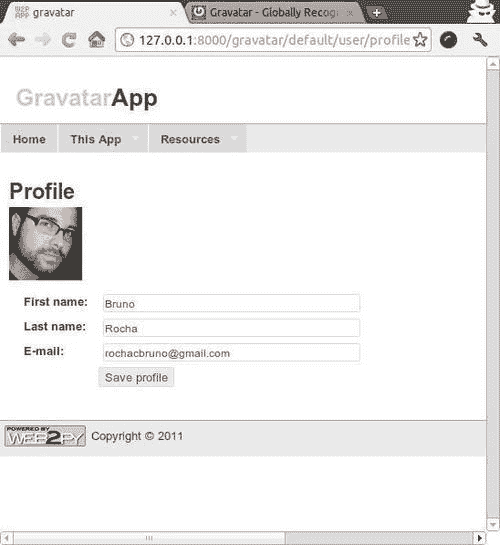
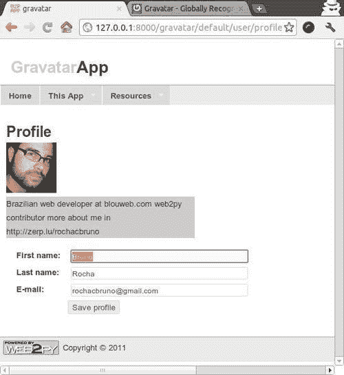
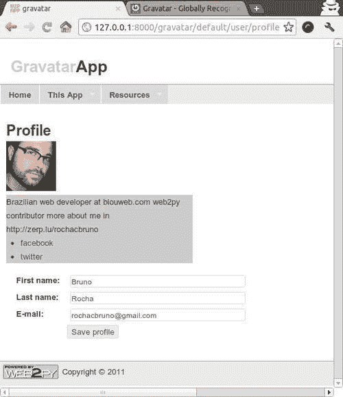
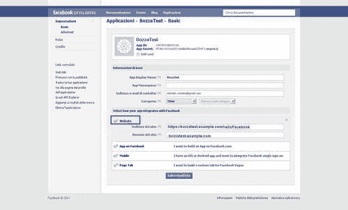

# 第八章. 认证和授权

在本章中，我们将介绍以下菜谱：

+   自定义认证

+   在登录失败时使用 CAPTCHA

+   使用 pyGravatar 为用户个人资料页面获取头像

+   多用户和教师模式

+   使用 OAuth 2.0 通过 Facebook 进行认证

# 简介

几乎每个应用程序都需要能够认证用户并设置权限。web2py 提供了一个广泛且可定制的基于角色的访问控制机制。在本章中，我们向您展示如何通过向用户表添加字段、在多次登录失败后添加 **CAPTCHA** 安全性以及如何创建 **全球认可的头像**（Gravatars——代表用户的图标）。我们还讨论了 web2py 的 `teacher` 模式，允许学生共享一个 web2py 实例来开发和部署他们的应用程序。最后，我们提供了一个与 **OAuth 2.0** 集成的示例，这是最新联邦认证协议之一。Web2py 还支持 `ofthe` 协议，如 CAS、OpenID、OAuth 1.0、LDAP、PAM、X509 以及更多。但是，一旦你学会了其中一个，使用官方文档学习其他协议应该很容易。

# 自定义认证

有两种方式可以自定义认证。旧的方式是从头开始定义自定义的 `db.auth_user` 表。新的方式是让 web2py 定义 `auth` 表，但列出 web2py 应该包含在表中的额外字段。在这里，我们将回顾后一种方法。

具体来说，我们将假设每个用户还必须有一个用户名、电话号码和地址。

## 如何做到这一点...

在 `db.py` 模型中，替换以下行：

```py
auth.define_tables()

```

用以下代码替换它：

```py
auth.settings.extra_fields['auth_user'] = [
	Field('phone_number',requires=IS_MATCH('\d{3}\-\d{3}\-\d{4}')),
	Field('address','text')]
auth.define_tables(username=True)

```

## 它是如何工作的...

`auth.settings.extra_fields` 是一个额外字段的字典。`key` 是要添加额外字段的 `auth` 表的名称。`value` 是额外字段列表。请注意，我们为 `auth_user` 添加了两个额外字段（电话号码和 `address`），但没有添加 `username`。

`username` 必须以特殊方式处理，因为它涉及到认证过程，该过程通常基于 `email` 字段。通过将用户名参数传递到下一行，我们告诉 web2py 我们想要 `username` 字段，并希望用它来登录而不是 `email` 字段。

```py
auth.define_tables(username=True)

```

用户名也将被设置为唯一。

## 还有更多...

在某些情况下，注册可能发生在正常的注册表单之外（例如，当使用 `Janrain` 或管理员注册用户时）。然而，你可能需要在用户首次登录后强制他们完成注册。这可以通过设置默认为 `False` 的虚拟隐藏额外字段 `complete_registration` 来完成，并在他们更新个人资料时将其设置为 `True`：

```py
auth.settings.extra_fields['auth_user'] = [
	Field('phone_number',requires=IS_MATCH('\d{3}\-\d{3}\-\d{4}'),
	comment = "i.e. 123-123-1234"),
	Field('address','text'),
	Field('complete_registration',default=False,update=True,
		writable=False, readable=False)]
uth.define_tables(username=True)

```

然后，我们可能希望强制新用户在登录时完成他们的注册。在 `db.py` 中，我们可以添加以下代码：

```py
if auth.user and not auth.user.complete_registration:
	if not (request.controller,request.function) == ('default','user'):
		redirect(URL('default','user/profile'))

```

这将强制新用户编辑他们的个人资料。

# 在登录失败时使用 CAPTCHA

web2py 内置了**ReCaptcha**支持([`www.google.com/recaptcha`](http://www.google.com/recaptcha))，但它通常是`开启`或`关闭`。开启它是有用的，因为它可以防止对应用程序表单的暴力攻击，但对于普通用户来说可能会很烦人。在这里，我们提出了一种解决方案，一个插件，在固定数量的登录失败后条件性地开启 ReCaptcha。

## 如何操作...

你需要做的只是创建一个新的`models/plugin_conditionalrecaptcha.py`文件，其中包含以下代码，你的工作就完成了：

```py
MAX_LOGIN_FAILURES = 3
# You must request the ReCaptcha keys
# in order to use this feature
RECAPTCHA_PUBLIC_KEY = ''
RECAPTCHA_PRIVATE_KEY = ''

def _():
	from gluon.tools import Recaptcha
	key = 'login_from:%s' % request.env.remote_addr
	num_login_attempts = cache.ram(key,lambda:0,None)

	if num_login_attempts >= MAX_LOGIN_FAILURES:
		auth.settings.login_captcha = Recaptcha(
			request,RECAPTCHA_PUBLIC_KEY,RECAPTCHA_PRIVATE_KEY)

		def login_attempt(form,key=key,n=num_login_attempts+1):
			cache.ram(key,lambda n=n:n,0)

		def login_success(form,key=key):
			cache.ram(key,lambda:0,0)

		auth.settings.login_onvalidation.append(login_attempt)
		auth.settings.login_onaccept.append(login_success)
_()

```

## 还有更多...

你可以通过传递参数到 JavaScript 中来自定义 ReCaptcha 的外观。如果你使用的是默认用户控制器来公开`auth`登录表单，你可以简单地编辑`user.html`视图，并添加以下代码：

```py
<script>
var RecaptchaOptions = {
	theme : 'clean',
	tabindex : 2
};
</script>

```

在以下行之前添加它：

```py
{{=form}}

```

完整的 ReCaptcha 客户端 API 可以在以下 URL 查看：

[`recaptcha.net/apidocs/captcha/client.html`](http://recaptcha.net/apidocs/captcha/client.html)

# 使用 pyGravatar 为用户个人资料页面获取头像

首先，从以下 URL 下载**pyGravatar**：

[`bitbucket.org/gridaphobe/pygravatar/src`](http://https://bitbucket.org/gridaphobe/pygravatar/src)

将`gravatar.py`放入`applications/yourapp/modules`。如果你愿意，可以使用以下命令：

```py
pip install pyGravatar

```

在你的任何模型源文件中，你必须导入 Gravatar 库才能使用它，如下所示示例：

```py
from gravatar import Gravatar

```

如果你使用的是 scaffold 应用程序，编辑`default/user.html`视图，如下所示：

```py
{{extend 'layout.html'}}
<h3>{{=T( request.args(0).replace('_',' ').capitalize() )}}</h3>
<div id="web2py_user_form">
{{if 'profile' in request.args:}}
	
{{pass}}

```

现在，你的个人资料页面将看起来像以下截图：



现在，在任何页面中，如果你想显示用户头像，你只需使用以下代码：

```py


```

你可以更进一步，从[`en.gravatar.com/`](http://en.gravatar.com/)获取用户个人资料简介。将以下代码添加到`default/user.html`。

```py
{extend 'layout.html'}}
<h2>{{=T( request.args(0).replace('_',' ').capitalize() )}}</h2>
<div id="web2py_user_form">
{{if 'profile' in request.args:}}
	{{user = Gravatar(auth.user.email)}}
	
	<blockquote style='width:300px;'>

		{{try:}}
			{{=user.profile['aboutMe']}}

		{{except Exception:}}
			No profile information
		{{pass}}

	</blockquote>
{{pass}}

```

然后，你会得到以下内容：



你也可以在`default/user.html`视图中获取用户在 Gravatar 上注册的额外服务：

```py
{extend 'layout.html'}}
<div id="web2py_user_form">
{{if 'profile' in request.args:}}
	{{user = Gravatar(auth.user.email)}}
	
	<blockquote style='width:300px;'>

		{{try:}}
			{{=user.profile['aboutMe']}}
			{{services = user.profile.get('accounts', {})}}
			{{=UL(*[LI(A(service['shortname'], _href=service['url'])) for
				service in services])}}

		{{except Exception:}}
			No profile information

			{{pass}}
	</blockquote>
{{pass}}

```

然后，你将在你的网页中看到额外的信息（关于我和注册服务的 URL）：



告诉你的用户使用与你的应用程序中相同的电子邮件地址在[`en.gravatar.com/`](http://en.gravatar.com/)注册。

# 多用户和教师模式

自 1.92 版本以来，您可以将 web2py 设置为 `mult-iuser` 或 `teaching` 模式。系统上安装了一个 web2py 实例，一个账户是 `admin`（或 `teacher`），其他账户是 `students`。学生只能看到他们自己的应用程序。它的工作原理如下：管理员页面已更改，现在包含登录和注册标题。在此模式下，第一个登录的用户将获得 `teacher` 角色。后续注册将成为 `students`，在 `teacher` 批准后。在以下配方中，我假设在 `127.0.0.1` 的 `8000` 端口上本地运行 web2py。`teacher` 和 `students` 需要一个**SSL 加密**的 web2py 实例。有关更多详细信息，请参阅第十一章，*其他技巧和窍门*。

注意，在 `multi-user` 模式下，没有安全机制来防止管理员之间的干扰。

## 如何操作...

1.  在文件夹中安装 web2py；比如说 `web2py_mu`。

1.  在 `admin/appadmin/0.py` 中设置 `MULTI_USER_MODE = True`。

1.  以通常的方式启动 web2py，并点击管理界面的链接。现在您可以看到修改后的管理登录界面。

    点击 `register` 创建教师账户。现在您进入管理应用程序。

1.  点击 `logout`，然后点击 `register` 创建第一个 `student` 账户（您可以让学生们这样做；提供给他们链接）。

    学生注册后，其状态为**待批准**。批准学生。

1.  使用以下网址进入 web2py 的 `appadmin`，即管理应用程序：`http://127.0.0.1:8000/admin/appadmin`。

1.  点击 `auth_user` 表。

    您现在可以看到教师和学生的账户。对于每个已批准的学生：

    +   点击其 ID（最左侧列）

    +   在 `registration_key` 字段中删除单词**待批准**。

如果可用，您还可以通过使用 CSV 文件（将进行扩展）导入学生名单。

## 还有更多...

对于刚开始学习 Python 和 webapp 的学生来说，从一个最小应用程序开始可能有所帮助。这个简单的设置将不包括 Ajax，并且仅涵盖最小模板功能。

### 备注

在右侧，我们需要一个额外的选项来加载一个基于文件 `minimal.w2p` 的最小应用程序。

`appadmin` 的组件对于初学者来说并不相关，且令人望而生畏，默认情况下，配置选项 `BASIC_STUDENT` 为 `False` 可以有所帮助。教师可以将其打开，并在稍后关闭。当 `False` 时，这些文件可以隐藏起来，包括管理屏幕、向导和其他高级选项。

# 使用 OAuth 2.0 通过 Facebook 进行认证

以下配方将展示如何构建一个简单的应用程序，该应用程序使用 Facebook 的 OAuth 2.0 认证服务进行用户认证。

OAuth 2.0 是 OAuth 1.0a 协议的演进。您可以在以下网址找到该协议的详细描述：

[`oauth.net/2`](http://oauth.net/2)

不深入细节，协议的主要对象是允许网站（提供者）向其他网站（消费者）提供受信任的身份验证凭据。这在范围上与已经由 web2py 实现的 CAS 身份验证系统非常相似。

目前，web2py 仅作为消费者实现 OAuth 2.0。但这已经足够允许任何 web2py 应用程序对 OAuth 2.0 服务提供者进行身份验证。

我们将展示如何实现一个小型应用程序，该程序使用 Facebook 作为 OAuth 2.0 提供者，因为它是最深入测试过的提供者。

## 准备工作

在开始之前，你需要在 Facebook 上注册一个应用程序：

[`developers.facebook.com`](http://developers.facebook.com)



你必须小心使用与应用程序相同的精确 URL（包括 TCP 端口）。

现在，建议你使用 Facebook Graph API Python 库，以编程方式访问`REST`接口。这个配方使用了这个库。你可以从这里下载它：https://github.com/facebook/python-sdk。将其复制到你应用程序的`*modules*`目录中。

如果你想要使用 web2py 附带的 JSON 引擎，将文件开头的`import`代码更改为以下样子（其他语句不需要）：

```py
# for web2py
from gluon.contrib import simplejson
_parse_json = lambda s: simplejson.loads(s)

```

## 如何操作...

1.  创建一个包含注册页面中显示的**App Id**和**App Secret**的文件。将其保存在你应用程序的`modules`目录中，文件名为`fbappauth.py`：

    ```py
    CLIENT_ID="xxxxxxxxxxxxxxxx"
    CLIENT_SECRET="xxxxxxxxxxxxxxxxxxxxxxxxxxxxxxxx"

    ```

1.  现在，你只需要更改模型中的`auth`代码。你可以将它放在与脚手架应用程序一起提供的常规`db.py`模型中。

    ```py
    #########################################
    ## use fb auth
    ## for facebook "graphbook" application
    #########################################

    import sys, os
    from fbappauth import CLIENT_ID,CLIENT_SECRET
    from facebook import GraphAPI, GraphAPIError
    from gluon.contrib.login_methods.oauth20_account import
    OAuthAccount

    class FaceBookAccount(OAuthAccount):
    	"""OAuth impl for FaceBook"""
    	AUTH_URL="https://graph.facebook.com/oauth/authorize"
    	TOKEN_URL="https://graph.facebook.com/oauth/access_token"

    def __init__(self, g):
    	OAuthAccount.__init__(self, g, CLIENT_ID, CLIENT_SECRET,
    		self.AUTH_URL, self.TOKEN_URL,
    		scope='user_photos,friends_photos')
    	self.graph = None

    def get_user(self):
    	'''Returns the user using the Graph API.'''
    	if not self.accessToken():
    		return None

    	if not self.graph:
    		self.graph = GraphAPI((self.accessToken()))
    		user = None

    	try:
    		user = self.graph.get_object("me")
    		except GraphAPIError, e:
    			self.session.token = None
    			self.graph = None

    		if user:
    			return dict(first_name = user['first_name'],
    				last_name = user['last_name'],
    				username = user['id'])

    auth.settings.actions_disabled = ['register','change_password',
    	'request_reset_password','profile']
    auth.settings.login_form=FaceBookAccount(globals())
    auth.settings.login_next=URL(f='index')

    ```

    正如你所见，这个类将`gluon.contrib.login_methods.oauth20_account.py`中的通用`OAuthAccount`类进行了特殊化，以便它可以与 Facebook 身份验证服务器一起工作。

以下行定义了在身份验证服务器确认用户身份后用户将到达的位置。将其更改为你需要的内容。

```py
auth.settings.login_next=URL(f='index')

```

## 还有更多...

通常，你无法在最终部署应用程序的公共服务器上测试你的应用程序。通常你可以使用`localhost`或`127.0.0.1`作为主机进行测试。

在常见情况下，使用`localhost`作为主机名与你的应用程序不兼容。在`/etc/hosts`（在先前注册的示例应用程序中）中添加适当的条目。

```py
# fb app testing setup
127.0.0.1 bozzatest.example.com

```

但是，请注意，在两种情况下，你都需要使用端口`80`以避免问题。

```py
# python web2py.py -p 80 -a <secret>

```

这通常在启动 web2py 或使用系统支持的功能时需要管理员权限。
