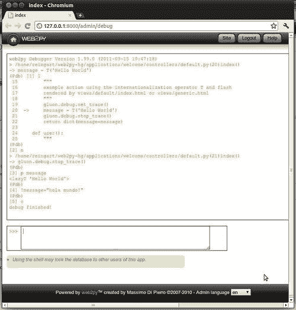
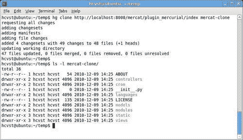
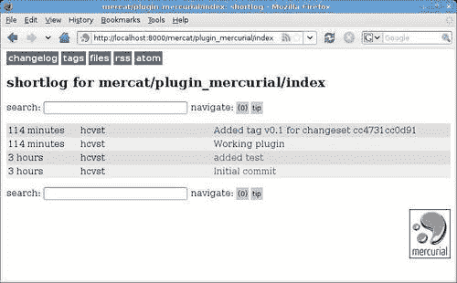

# 第十一章。其他技巧和窍门

在本章中，我们将介绍以下食谱：

+   使用 PDB 和嵌入的 web2py 调试器

+   使用 Eclipse 和 PyDev 进行调试

+   使用 shell 脚本更新 web2py

+   创建一个简单的页面统计插件

+   无需图像或 JavaScript 来圆角

+   设置 `cache.disk` 配额

+   使用 `cron` 检查 web2py 是否正在运行

+   构建 Mercurial 插件

+   构建 pingback 插件

+   为移动浏览器更改视图

+   使用数据库队列进行后台处理

+   如何有效地使用模板块

+   使用 web2py 和 wxPython 创建独立应用程序

# 简介

本章包含不适合任何其他章节的食谱，但典型 web2py 用户认为它们很重要。一个例子是使用 Eclipse 与 web2py 一起使用。后者是一个非常流行的 Java 集成开发环境，与 Python 工作得很好，但与 web2py 一起使用时存在一些怪癖，在这里，我们向您展示如何通过适当的配置克服这些怪癖。其他例子包括如何开发适合移动设备的应用程序，以及如何开发使用 **wxPython GUI** 的独立应用程序。

# 使用 PDB 和嵌入的 web2py 调试器

web2py 在 **admin** 应用程序中内置了交互式（网页浏览器）调试功能，类似于 shell，但直接向 **PDB**（Python 调试器）发出命令。

虽然这不是一个功能齐全的视觉调试器，但可以用于程序性地设置断点，然后进入并执行变量和堆栈检查，程序上下文中的任意代码执行，指令跳转和其他操作。

使用此调试器是可选的，它旨在供高级用户使用（应谨慎使用，或者你可以阻止 web2py 服务器）。默认情况下，它不会被导入，并且不会修改 web2py 的正常操作。

实现可以增强和扩展以进行其他类型的 COMET-like 通信（使用 AJAX 从服务器向客户端推送数据），以及通用长运行进程。

## 如何做到这一点...

PDB 是 Python 调试器，包含在标准库中。

1.  你可以通过编写以下内容来启动调试器：

    ```py
    import pdb; pdb.set_trace()

    ```

    例如，让我们调试欢迎默认索引控制器：

    ```py
    def index():
    	import pdb; pdb.set_trace()
    	message = T('Hello World')
    	return dict(message=message)

    ```

1.  然后，当你打开索引页面：`http://127.0.0.1:8000/welcome/default/index`，(PDB) 提示将在你启动 web2py 的控制台中出现：

    ```py
     $ python web2py.py -a a
    web2py Web Framework
    Created by Massimo Di Pierro, Copyright 2007-2011
    Version 1.99.0 (2011-09-15 19:47:18)
    Database drivers available: SQLite3, pymysql, PostgreSQL
    Starting hardcron...
    please visit:
    	http://127.0.0.1:8000
    use "kill -SIGTERM 16614" to shutdown the web2py server
    > /home/reingart/web2py/applications/welcome/controllers/default.
    py(20)index()
    -> message = T('Hello World')
    (Pdb)

    ```

1.  调试器指出，我们在 `welcome/controllers/default.py` 的 *第 20 行* 处停止。在此点，可以发出任何 `Pdb` 命令。最有用的命令如下：

    +   `help:` 此命令打印可用命令的列表

    +   `where:` 此命令打印当前的堆栈跟踪

    +   `list [first[, last]]:` 此命令列出源代码（在第一行和最后一行之间）

    +   `p expression:` 此命令评估表达式并打印结果

    +   `! statement:` 此命令执行一个 Python 语句

    +   `step: step in:` 此命令执行当前行，进入函数

    +   `next: step next:` 这个命令执行当前行，不进入函数

    +   `return: step return:` 这个命令继续执行直到函数退出

    +   `continue:` 这个命令继续执行，并且仅在断点处停止

    +   `jump lineno:` 这个命令改变将要执行的下一行

    +   `break filename:lineno:` 这个命令设置一个断点

    +   `quit:` 这个命令从调试器退出（终止当前程序）

        命令可以通过只输入第一个字母来发出；例如，看看以下示例会话：

    ```py
    (Pdb) n
    > /home/reingart/web2py/applications/welcome/controllers/default.py(21)index()
    -> return dict(message=message)
    (Pdb) p message
    <lazyT 'Hello World'>
    (Pdb) !message="hello web2py recipe!"
    (Pdb) w
    > /home/reingart/web2py/applications/welcome/controllers/default.py(21)index()
    -> return dict(message=message)
    (Pdb) c

    ```

1.  命令是 `n`（next，执行行），`p`（打印消息变量），`!message=`（将其值更改为 `hello web2py recipe!`），`w`（查看当前的堆栈跟踪），以及 `continue`（退出调试器）。

    问题在于，如果你没有直接访问控制台（例如，如果 web2py 在 apache 内运行，pdb 将无法工作），则无法使用这种技术。

    如果没有控制台可用，可以使用嵌入的 web2py 调试器。唯一的区别是，不是调用 pdb，而是使用 gluon.debug，它运行一个定制的 PDB 版本，通过浏览器中的 web2py 交互式 shell 来运行。

1.  在前面的示例中，将 `pdb.set_trace()` 替换为 `gluon.debug.stop_trace`，并在 `return` 函数之前添加 `gluon.debug.stop_trace()` 以将控制权交还给 web2py：

    ```py
    def index():
    	gluon.debug.set_trace()
    	message = T('Hello World')
    	gluon.debug.stop_trace()
    	return dict(message=message)

    ```

1.  然后，当你打开索引页面 `http://127.0.0.1:8000/welcome/default/index` 时，浏览器将阻塞，直到你进入调试页面（包含在管理界面中）：`http://127.0.0.1:8000/admin/debug`。

1.  在调试页面上，你可以发出之前列出的任何 PDB 命令，并像在本地控制台一样与你的程序交互。

    以下图像显示了最后一个会话，但这次是在 web2py 调试器内部：



## 它是如何工作的...

web2py 调试器定义了一个从 `Queue.Queue` 继承的 `Pipe` 类，用于线程间通信，用作 PDB 的标准输入和输出，以与用户交互。

在线类似壳的界面使用 `ajax` 回调来接收用户命令，将它们发送到调试器，并打印结果，就像用户直接在控制台中使用 PDB 一样。

当调用 `gluon.debug.set_trace()`（即在调试应用的控制器中）时，自定义的 web2py PDB 实例会被运行，然后输入和输出会被重定向并排队，直到其他线程打开队列并与它通信（通常，管理员调试应用是从另一个浏览器窗口调用的）。

同时，在调试过程中，PDB 执行所有工作，而 web2py 只负责重定向输入和输出消息。

当调用 `gluon.debug.stop_trace()` 时，线程发送 `void` 数据（`None` 值）到监视线程，以表示调试已完成。

如介绍中所述，此功能旨在为中级和高级用户设计，因为如果未调用`stop_trace`，或者调试控制器未刷新，那么内部通信队列可能会阻塞 web2py 服务器（应实现超时以避免死锁）。

被调试的页面将在调试结束前被阻塞，这与通过控制台使用`pdb`相同。调试控制器将在达到第一个断点（`set_trace`）前被阻塞。

更多详细信息，请参阅 web2py 源文件中的`gluon/debug.py`和`applications/admin/controllers/debug.py`。

## 还有更多...

PDB 是一个功能齐全的调试器，支持条件断点和高级命令。完整的文档可以在以下 URL 找到：

[`docs.python.org/library/pdb.html`](http://docs.python.org/library/pdb.html)

PDB 源自 BDB 模块（Python 调试框架），可用于扩展此技术以添加更多功能，实现轻量级远程调试器（它是一个不需要控制台交互的基本调试器，因此可以使用其他用户界面）。

此外，`Pipe`类是与长时间运行进程交互的示例，在类似 COMET 的场景中可能很有用，可以将数据从服务器推送到浏览器，而不需要保持连接打开（使用标准 Web 服务器和 AJAX）。

结合这两种技术，开发了一个新的调试器（QDB），使得能够远程调试 web2py 应用程序（即使在生产环境中）。在接下来的段落中，将展示一个示例用例。更多信息请参阅以下内容：

[`code.google.com/p/rad2py/wiki/QdbRemotePythonDebugger`](http://code.google.com/p/rad2py/wiki/QdbRemotePythonDebugger)

要使用 qdb，你必须下载`qdb.py`（见前一个链接），并将其放置在`gluon.contrib`目录中（它将被包含在 web2py 的后续版本中）。

然后，在你的控制器中导入它并调用`set_trace`以开始调试，如下例所示：

```py
def index():
	response.flash = T('Welcome to web2py')
	import gluon.contrib.qdb as qdb
	qdb.set_trace()
	return dict(message='Hello World')

```

当你打开你的控制器并且达到`set_trace`时，qdb 将监听远程连接以附加并开始调试器交互。你可以通过以下方式执行 qdb 模块（python `qdb.py`）来启动调试会话：

```py
C:\rad2py\ide2py>python qdb.py
qdb debugger fronted: waiting for connection to ('localhost', 6000)
> C:\web2py\applications\welcome\controllers/default.py(19)
-> 	return dict(message=T('Hello World'))
(Cmd) p response.flash
Welcome to web2py!
> C:\web2py\applications\welcome\controllers/default.py(19)
-> 	return dict(message=T('Hello World'))
(Cmd) c

```

你可以与 PDB 相同的命令进行交互，即单步执行、打印值、继续等。

注意，web2py（后端调试器）和 qdb 前端调试器是不同的进程，因此你可以调试甚至是一个守护进程 Web 服务器，例如 Apache。此外，在`qdb.py`源文件中，你可以更改地址/端口和密码以连接到互联网上的远程服务器。

web2py 将在 2.0 版本中包含 qdb 和基于 Web 的用户界面调试器（用于开发环境）。

对于一个功能齐全的 web2py IDE（适用于开发或生产环境），包括基于此方法的视觉调试器，请参阅以下内容：

[`code.google.com/p/rad2py`](http://code.google.com/p/rad2py)

# 使用 Eclipse 和 PyDev 进行调试

**Eclipse**是一个开源的可扩展开发平台和应用框架，旨在构建、部署和管理整个软件生命周期的软件。它在 Java 世界中非常受欢迎。**PyDev**是 Eclipse 的 Python 扩展，允许将 Eclipse 用作 Python（以及 web2py）的 IDE，因此，在这里，我们向您展示如何设置 web2py 以与这些工具良好地协同工作。

## 准备工作

1.  下载最新的 Eclipse IDE ([`www.eclipse.org/downloads/`](http://www.eclipse.org/downloads/))，并将其解压到您选择的文件夹中。

1.  通过在文件夹中运行 `eclipse.exe` 来启动 Eclipse。注意，Eclipse 没有安装，但你必须安装 Java 运行时（http://java.com/en）。

1.  通过点击[帮助 **| 安装新软件**](https://example.org)，并输入以下网址，然后点击**添加**按钮来安装 PyDev：

    [`pydev.org/updates`](http://pydev.org/updates)

1.  选择所有选项并点击**[下一步**](https://example.org)。

1.  应该会提示你接受许可协议。继续通过向导，当它询问你是否想要重启时，点击**[否**](https://example.org)。

1.  为你的操作系统安装正确的 mercurial 版本：

    [`mercurial.selenic.com`](http://mercurial.selenic.com%20)

1.  返回到**帮助 | 安装新软件**，并输入以下网址：

    [`cbes.javaforge.com/update`](http://cbes.javaforge.com/update)

1.  继续通过向导，当它要求你重启时，点击**[是**](https://example.org)。

1.  通过转到**文件 | 新建 | 项目 | Mercurial | 使用 Mercurial 克隆 Mercurial 仓库**来在 Eclipse 中创建一个新项目，并输入以下网址：

    [`code.google.com/p/web2py`](http://code.google.com/p/web2py%20)

1.  在**克隆目录名称**字段中输入`web2py`。

1.  通过转到**窗口 | 首选项 | PyDev | 解释器**来设置解释器，并选择你的 Python 二进制文件的路径：


就这些了！你可以通过在项目树中找到 `web2py.py` 并右键单击选择**调试作为 | Python 运行**来开始调试。你也可以通过从相同菜单中选择**调试配置**来传递参数给 `web2py.py`。

## 还有更多...

而不是从 mercurial 存储库安装 web2py，你可以让 PyDev 指向现有的 web2py 安装（它必须是一个源安装，而不是 web2py 二进制文件）。在这种情况下，只需转到**文件 | 新建 | PyDev**，并指定你的 web2py 安装目录：


# 使用 shell 脚本更新 web2py

web2py 管理员界面提供了一个**升级**按钮，它会下载最新的 web2py，并将其解压到旧版本之上（除了欢迎、管理员和示例之外，它不会覆盖应用程序）。这是可以的，但它会带来一些潜在的问题：

+   管理员可能已被禁用

+   你可能希望一次性更新多个安装，并且更愿意通过编程方式来做。

+   你可能想要存档之前的版本，以防需要回滚

我们在这个菜谱中提供的脚本仅适用于解决 Linux 和 Mac 上的这些问题。

## 如何操作...

1.  将文件移动到 `web2py` 文件夹下：

    ```py
    cd /path/to/web2py

    ```

1.  确保你是拥有 web2py 文件夹的用户，或者你至少有 `write` 权限。将以下脚本保存到文件中（例如：`update_web2py.sh`），并使其可执行：

    ```py
    chmod +x update_web2py.sh

    ```

1.  然后，运行它：

```py
# update-web2py.sh
# 2009-12-16
#
# install in web2py/.. or web2py/ or web2py/scripts as update-
# web2py.sh
# make executable: chmod +x web2py.sh
#
# save a snapshot of current web2py/ as web2py/../web2py-version.
# zip
# download the current stable version of web2py
# unzip downloaded version over web2py/

TARGET=web2py
if [ ! -d $TARGET ]; then
	# in case we're in web2py/
	if [ -f ../$TARGET/VERSION ]; then
		cd ..
	# in case we're in web2py/scripts
	elif [ -f ../../$TARGET/VERSION ]; then
		cd ../..
	fi
fi
read a VERSION c < $TARGET/VERSION
SAVE=$TARGET-$VERSION
URL=http://www.web2py.com/examples/static/web2py_src.zip

ZIP=`basename $URL`
SAVED=""

#### Save a zip archive of the current version,
#### but don't overwrite a previous save of the same version.
###
if [ -f $SAVE.zip ]; then
	echo "Remove or rename $SAVE.zip first" >&2
	exit 1
fi
if [ -d $TARGET ]; then
	echo -n ">>Save old version: " >&2
	cat $TARGET/VERSION >&2
	zip -q -r $SAVE.zip $TARGET
	SAVED=$SAVE.zip
fi
###
#### Download the new version.
###
echo ">>Download latest web2py release:" >&2
curl -O $URL
###
#### Unzip into web2py/
###
unzip -q -o $ZIP
rm $ZIP
echo -n ">>New version: " >&2
cat $TARGET/VERSION >&2
if [ "$SAVED" != "" ]; then
	echo ">>Old version saved as $SAVED"
fi

```

## 还有更多...

是的，还有更多。当升级 web2py 时，欢迎应用程序也会升级，它可能包含新的 appadmin、新的布局和新的 JavaScript 库。你可能还想升级你的应用程序。你可以手动进行，但必须小心，因为根据你的应用程序如何工作，这可能会破坏它们。对于名为 `app` 的应用程序，你可以使用以下命令升级 appadmin：

```py
cp applications/welcome/controllers/appadmin.py applications/app/\
controllers
cp applications/welcome/views/appadmin.py applications/app/views

```

你可以使用以下命令升级通用视图：

```py
cp applications/welcome/views/generic.* applications/app/views

```

你可以使用以下命令升级 web2py_ajax：

```py
cp applications/welcome/views/web2py_ajax.html applications/app/views
cp applications/welcome/static/js/web2py_ajax.js applications/app/
static/\js

```

最后，你可以使用以下命令升级所有静态文件：

```py
cp -r applications/welcome/static/* applications/app/static/

```

你可能需要更加选择性地操作。首先备份，并小心行事。

# 创建一个简单的页面统计插件

在这个菜谱中，我们将向您展示如何创建一个插件，以分层格式显示页面统计信息。

## 如何操作...

首先，创建一个名为 `models/plugin_stats.py` 的文件，其中包含以下代码：

```py
#!/usr/bin/env python
# -*- coding: utf-8 -*-

def _(db, 							# reference to DAL obj. page_key, # string to id page
	page_subkey='', 			# string to is subpages
	initial_hits=0, 			# hits initial value
	tablename="plugin_stats"	# table where to store data
	):	
	from gluon.storage import Storage
	table = db.define_table(tablename,
	Field('page_key'),
		Field('page_subkey'),
		Field('hits', 'integer'))
	record = table(page_key=page_key,page_subkey=page_subkey)

	if record:
		new_hits = record.hits + 1
		record.update_record(hits=new_hits)
		hits = new_hits

	else:
		table.insert(page_key=page_key,
			page_subkey=page_subkey,
			hits=initial_hits)
		hits = initial_hits

	hs = table.hits.sum()
	total = db(table.page_key==page_key).select(hs).first()(hs)
	widget = SPAN('Hits:',hits,'/',total)
	return Storage(dict(hits=hits,total=total,widget=widget))

plugin_stats = _(db,
	page_key=request.env.path_info,
	page_subkey=request.query_string)

```

如果你想要将结果显示给访客，请将以下内容添加到 `views/layout.html`：

```py
{{=plugin_stats.widget}}

```

## 它是如何工作的...

`plugin` 文件是一个模型文件，在每次请求时都会执行。它调用以下查询，定义一个存储点击次数的表，每条记录由 `page_key (request.env.path_info)` 和 `page_subkey (request.query_string)` 标识。

```py
plugin_stats = _(db,
	page_key=request.env.path_info,
	page_subkey=request.query_string)

```

如果不存在具有此键和子键的记录，则创建它。如果存在，则检索它，并将字段 `hits` 的值增加一。函数 `_` 有一个奇怪的名字，但并没有什么特别之处。你可以选择不同的名字；我们只是不希望污染命名空间，因为这个函数只需要使用一次。该函数返回一个分配给 `plugin_stats` 的 `Storage` 对象，其中包含以下内容：

+   `hits:` 这是与当前 `page_key` 和 `page_subkey` 对应的点击次数

+   `total:` 这是与当前页面相同的 `page_key` 但不同子键的点击次数总和

+   `widget:` 这是一个显示点击次数的 span，以及 `total`，它可以嵌入到视图中

## 还有更多...

注意，你可以选择将以下行更改为其他内容，并使用不同的变量来对页面进行分组以进行计数：

```py
page_key=request.env.path_info
page_subkey=request.query_string

```

# 无需图像或 JavaScript 的圆角

现代浏览器支持 CSS 指令来圆角。它们包括以下内容：

+   WebKit（Safari，Chrome）

+   Gecko（Firefox）

+   欧珀（需要重大修改）

## 准备工作

我们假设你有一个包含以下 HTML 代码的视图，并且你想要圆角 `box` 类：

```py
<div class="box">
	test
</div>

```

## 如何操作...

为了看到效果，我们还需要更改背景颜色。例如，在`style`文件中，为默认布局在`static/styles/base.css`中添加以下代码：

```py
.box {
	-moz-border-radius: 5px; 	/* for Firefox */
	-webkit-border-radius: 5px; /* for Safari and Chrome */
	background-color: yellow;
}

```

第一行`-moz-border-radius: 5px`仅被 Firefox 解释，其他浏览器忽略。第二行仅被 Safari 和 Chrome 解释。

## 还有更多...

那么，关于 Opera 呢？Opera 没有 CSS 指令来设置圆角，但你可以按照以下方式修改之前的 CSS，让 web2py 生成一个动态图像，用作背景，并具有所需的颜色和圆角：

```py
.box {
	-moz-border-radius: 5px; 	/* for Firefox */
	-webkit-border-radius: 5px; /* for Safari and Chrome */
	background-color: yellow;
	background-image: url("../images/border_radius?r=4&fg=249,249,249&
bg=235,232,230"); /*
	for opera */
}

```

为了达到这个目的，创建一个`controllers/images.py`文件，并将以下代码添加到其中：

```py
def border_radius():
	import re
	radius = int(request.vars.r or 5)
	color = request.vars.fg or 'rbg(249,249,249)'
	if re.match('\d{3},\d{3},\d{3}',color):
		color = 'rgb(%s)' % color
		bg = request.vars.bg or 'rgb(235,232,230)'
	if re.match('\d{3},\d{3},\d{3}',bg):
		bg = 'rgb(%s)'%bg
	import gluon.contenttype
	response.headers['Content-Type']= 'image/svg+xml;charset=utf-8'
	return '''<?xml version="1.0" ?><svg
		><rect fill="%s" x="0" y="0"
		width="100%%" height="100%%" /><rect ill="%s" x="0" y="0"
		width="100%%" height="100%%" rx="%spx"
		/></svg>'''%(bg,color,radius)

```

此代码将动态生成一个 SVG 图像。

参考：[`home.e-tjenesten.org/~ato/2009/08/border-radius-opera`](http://home.e-tjenesten.org/~ato/2009/08/border-radius-opera)。

# 设置 cache.disk 配额

这个配方是关于 web2py 在 Linux 上使用 RAM 内存进行**磁盘缓存**（使用`tmpfs`）。

`cache.disk`是一种流行的缓存机制，允许多个共享文件系统的 web2py 安装共享缓存。它不如`memcache`高效，因为在对共享文件系统进行写入时可能会成为瓶颈；尽管如此，这仍然是某些用户的一个选项。如果你使用`cache.disk`，你可能想通过设置**配额**来限制写入缓存的数据量。这可以通过创建一个临时内存映射文件系统来实现，同时还能提高性能。

## 如何操作...

主要思想是使用`cache.disk`与`tmpfs`。

1.  首先，你需要以`root`身份登录并执行以下命令：

    ```py
    mount -t tmpfs tmpfs $folder_path -o rw,size=$size

    ```

    +   这里：

        `$folder_path`是你挂载 RAM 片段的文件夹路径

        `$size`是你想要分配的内存量（`M` - 兆字节）

        例如：

    ```py
    mkdir /var/tmp/myquery
    mount -t tmpfs tmpfs /var/tmp/myquery -o rw,size=200M

    ```

1.  你刚刚分配了 200 MB 的 RAM。现在我们得在 web2py 应用程序中将其映射。只需在你的模型中写下以下内容：

    ```py
    from gluon.cache import CacheOnDisk
    cache.disk = CacheOnDisk(request,
    	folder='/the/memory/mapped/folder')

    ```

    因此，在我们的情况下：

    ```py
    cache.disk = CacheOnDisk(request, folder='/var/tmp/myquery')

    ```

1.  现在，当你使用：

    ```py
    db(...).select(cache=(cache.disk,3600)....)

    ```

    或者以下内容：

    ```py
    @cache(request.env.path_info, time_expire=5, cache_model=cache.
    disk)
    def cache_controller_on_disk():
    	import time
    	t = time.ctime()
    	return dict(time=t, link=A('click to reload',
    		_href=request.url))

    ```

    你可以为每个查询/控制器等缓存的 ram 空间设置配额，并且每个都可以有不同的尺寸设置。

# 使用 cron 检查 web2py 是否正在运行

如果你在一台 UNIX 机器上，你可能想监控 web2py 是否正在运行。针对此问题的生产级解决方案是使用**Monit**：[`mmonit.com/monit/documentation/`](http://mmonit.com/monit/documentation/)。

它可以监控你的进程，记录问题，还可以自动为你重启它们。在这里，我们提供一个简单的 DIY 解决方案，遵循 web2py 的极简精神。

## 如何操作...

1.  我们将创建文件`/root/bin/web2pytest.sh`，以检查 web2py 是否正在运行，如果未运行则启动 web2py。

    ```py
    #! /bin/bash
    # written by Ivo Maintz
    export myusername=mdipierro
    export port=8000
    export web2py_path=/home/mdipierro/web2py
    if ! ` netcat -z localhost $port `
    	then pgrep -flu $myusername web2py | cut -d -f1 | xargs kill >
    /\
    dev/null 2>&1
    	chown $myusername: /var/log/web2py.log
    	su $myusername -c 'cd $web2py_path && ./web2py.py -p $port -a
    \
    password 2>&1 >> /var/log/web2py.log'
    	sleep 3
    	if ` netcat -z localhost $port `
    		then echo "web2py was restarted"
    		else echo "web2py could not be started!"
    	fi
    fi

    ```

1.  现在使用`shell`命令编辑`crontab`：

    ```py
    crontab -e

    ```

1.  添加一条`crontab`行，指示`crontab`守护进程每三分钟运行我们的脚本：

```py
*/3 * * * * /root/bin/web2pytest.sh > /dev/null

```

+   注意，你可能需要编辑脚本的前几行来设置正确的用户名、端口和想要监控/重启的 web2py 路径。

# 构建 Mercurial 插件

web2py 的 admin 支持**Mercurial**进行版本控制，但能否通过 HTTP 进行拉取和推送更改？

在这个菜谱中，我们介绍了一个由单个文件组成的 web2py 插件。它包装了 Mercurial 的`hgwebdir wsgi`应用，并允许用户从网页浏览器或`hg`客户端与 web2py 应用程序的 mercurial 仓库进行交互。

这对于以下两个原因来说很有趣：

1.  一方面，如果您使用 mercurial 对您的应用程序进行版本控制，此插件允许您将仓库在线共享给其他人。

1.  在另一方面，这是一个如何从 web2py 调用第三方 WSGI 应用的绝佳例子。

## 准备工作

这要求您从源运行 web2py，并且您已安装 mercurial。您可以使用以下命令安装 mercurial：

```py
easy_install mercurial

```

此插件仅在已安装 mercurial 的 Python 发行版上才能工作。您可以将 mercurial 打包到 web2py 应用程序本身中，但我们不建议这样做。如果您不是 mercurial 的常规用户，使用此插件几乎没有意义。

## 如何做到这一点...

创建此插件所需的所有操作只是创建一个新的控制器，"plugin_mercurial.py"：

```py
""" plugin_mercurial.py
	Author: 	Hans Christian v. Stockhausen <hc at vst.io>
	Date: 		2010-12-09
"""

from mercurial import hgweb

def index():
	""" Controller to wrap hgweb
		You can access this endpoint either from a browser in which case
			the hgweb interface is displayed or from the mercurial client.

		hg clone http://localhost:8000/app/plugin_mercurial/index app
	"""

	# HACK - hgweb expects the wsgi version to be reported in a tuple
	wsgi_version = request.wsgi.environ['wsgi.version']
	request.wsgi.environ['wsgi.version'] = (wsgi_version, 0)

	# map this controller's URL to the repository location and #instantiate app
	config = {URL():'applications/'+request.application}
	wsgi_app = hgweb.hgwebdir(config)

	# invoke wsgi app and return results via web2py API
	# http://web2py.com/book/default/chapter/04#WSGI
	items = wsgi_app(request.wsgi.environ, request.wsgi.start_response)
	for item in items:
		response.write(item, escape=False)
	return response.body.getvalue()

```

这里是来自 shell 的示例报告视图：



这里是`plugin_above:`的视图：



您还可以将代码推送到仓库。要能够推送代码到仓库，您需要编辑/创建文件`application/<app>/.hg/hgrc`，并添加以下条目，例如：

```py
[web]
allow_push = *
push_ssl = False

```

显然，这仅推荐在受信任的环境中使用。另外，请参阅[`www.selenic.com/mercurial/hgrc.5.html#web`](http://www.selenic.com/mercurial/hgrc.5.html#web)中的`hgrc`文档。

`hgwebdir` WSGI 应用可以公开多个仓库，尽管对于特定于 web2py 应用程序的插件来说，这可能不是您想要的。如果您确实想要这样，尝试调整传递给`hgwebdir`构造函数的`config`变量。例如，您可以通过`request.args[0]`传递要访问的仓库名称。URL 会更长，因此您可能需要在`routes.py`中设置一些规则。

```py
config = {
	'app/plugin_mercurial/index/repo1':'path/to/repo1',
	'app/plugin_mercurial/index/repo2':'path/to/repo2',
	'app/plugin_mercurial/index/repo3':'path/to/repo3'
}

```

# 构建 pingback 插件

Pingbacks 允许博客文章和其他资源，如照片，自动通知彼此的回链。此插件公开了一个装饰器来启用 pingback 的控制器函数，以及一个 pingback 客户端来通知例如**Wordpress**博客，我们链接到了它。

**Pingback**是一个标准协议，其 1.0 版本在以下 URL 中描述：

[`www.hixie.ch/specs/pingback/pingback`](http://www.hixie.ch/specs/pingback/pingback)

`plugin_pingback` 由一个单独的模块文件组成。

## 如何做到这一点...

首先，创建一个`module/plugin_pingback.py`文件，包含以下代码：

```py
#!/usr/bin/env python
# coding: utf8
#
# Author: 	Hans Christian v. Stockhausen <hc at vst.io>
# Date: 	2010-12-19
# License: 	MIT
#
# TODO
# - Check entity expansion requirements (e.g. &lt;) as per Pingback # spec page 7
# - make try-except-finally in PingbackClient.ping robust

import httplib
import logging
import urllib2
import xmlrpclib
from gluon.html import URL

__author__ = 'H.C. v. Stockhausen <hc at vst.io>'
__version__ = '0.1.1'

from gluon import *

# we2py specific constants
TABLE_PINGBACKS = 'plugin_pingback_pingbacks'

# Pingback protocol faults
FAULT_GENERIC = 0
FAULT_UNKNOWN_SOURCE = 16
FAULT_NO_BACKLINK = 17
FAULT_UNKNOWN_TARGET = 32
FAULT_INVALID_TARGET = 33
FAULT_ALREADY_REGISTERED = 48
FAULT_ACCESS_DENIED = 49
FAULT_UPSTREAM_ERROR = 50

def define_table_if_not_done(db):
	if not TABLE_PINGBACKS in db.tables:
		db.define_table(TABLE_PINGBACKS,
			Field('source', notnull=True),
			Field('target', notnull=True),
			Field('direction', notnull=True,
				requires=IS_IN_SET(('inbound', 'outbound'))),
			Field('status'), # only relevant for outbound pingbacks
		  Field('datetime', 'datetime', default=current.request.now))
class PingbackServerError(Exception):
	pass

class PingbackClientError(Exception):
	pass

class PingbackServer(object):
	" Handles incomming pingbacks from other sites. "

def __init__(self, db, request, callback=None):
	self.db = db
	self.request = request
	self.callback = callback
	define_table_if_not_done(db)

def __call__(self):
	"""
		Invoked instead of the decorated function if the request is a
			pingback request from some external site.
	"""

	try:
		self._process_request()
	except PingbackServerError, e:
		resp = str(e.message)
	else:
		resp = 'Pingback registered'
	return xmlrpclib.dumps((resp,))

def _process_request(self):
	" Decode xmlrpc pingback request and process it "

	(self.source, self.target), method = xmlrpclib.loads(
		self.request.body.read())

	if method != 'pingback.ping':
		raise PingbackServerError(FAULT_GENERIC)
		self._check_duplicates()
		self._check_target()
		self._check_source()

	if self.callback:
		self.callback(self.source, self.target, self.html)
		self._store_pingback()

def _check_duplicates(self):
	" Check db whether the pingback request was previously processed "
	db = self.db
	table = db[TABLE_PINGBACKS]
	query = (table.source==self.source) & (table.target==self.target)
	if db(query).select():
		raise PingbackServerError(FAULT_ALREADY_REGISTERED)

def _check_target(self):
	" Check that the target URI exists and supports pingbacks "

	try:
		page = urllib2.urlopen(self.target)
	except:
		raise PingbackServerError(FAULT_UNKNOWN_TARGET)
	if not page.info().has_key('X-Pingback'):
		raise PingbackServerError(FAULT_INVALID_TARGET)

def _check_source(self):
	" Check that the source URI exists and contains the target link "

	try:
		page = urllib2.urlopen(self.source)

	except:
		raise PingbackServerError(FAULT_UNKNOWN_SOURCE)
		html = self.html = page.read()
		target = self.target

	try:
		import BeautifulSoup2
		soup = BeautifulSoup.BeautifulSoup(html)
		exists = any([a.get('href')==target for a in soup.findAll('a')])

	except ImportError:
		import re
		logging.warn('plugin_pingback: Could not import BeautifulSoup,' \
			' using re instead (higher risk of pingback spam).')
		pattern = r'<a.+href=[\'"]?%s[\'"]?.*>' % target
		exists = re.search(pattern, html) != None

	if not exists:
		raise PingbackServerError(FAULT_NO_BACKLINK)

def _store_pingback(self):
	" Companion method for _check_duplicates to suppress duplicates. "

	self.db[TABLE_PINGBACKS].insert(
		source=self.source,
		target=self.target,
		direction='inbound')

class PingbackClient(object):
	" Notifies other sites about backlinks. "

	def __init__(self, db, source, targets, commit):
		self.db = db
		self.source = source
		self.targets = targets
		self.commit = commit
		define_table_if_not_done(db)

	def ping(self):
		status = 'FIXME'
		db = self.db
		session = current.session
		response = current.response
		table = db[TABLE_PINGBACKS]
		targets = self.targets

		if isinstance(targets, str):
			targets = [targets]

		for target in targets:
			query = (table.source==self.source) & (table.target==target)

		if not db(query).select(): # check for duplicates
			id_ = table.insert(
			source=self.source,
			target=target,
			direction='outbound')

		if self.commit:
			db.commit()

		try:
			server_url = self._get_pingback_server(target)

		except PingbackClientError, e:
			status = e.message

	else:
		try:
			session.forget()
			session._unlock(response)
			server = xmlrpclib.ServerProxy(server_url)
			status = server.pingback.ping(self.source, target)

		except xmlrpclib.Fault, e:
			status = e

		finally:
			db(table.id==id_).update(status=status)

def _get_pingback_server(self, target):
	" Try to find the target's pingback xmlrpc server address "

	# first try to find the pingback server in the HTTP header
	try:
		host, path = urllib2.splithost(urllib2.splittype(target)[1])
		conn = httplib.HTTPConnection(host)
		conn.request('HEAD', path)
		res = conn.getresponse()
		server = dict(res.getheaders()).get('x-pingback')

	except Exception, e:
		raise PingbackClientError(e.message)
		# next try the header with urllib in case of redirects

	if not server:
		page = urllib2.urlopen(target)
		server = page.info().get('X-Pingback')

	# next search page body for link element

	if not server:
		import re
		html = page.read()
		# pattern as per Pingback 1.0 specification, page 7
		pattern = r'<link rel="pingback" href=(P<url>[^"])" ?/?>'
		match = re.search(pattern, html)

		if match:
			server = match.groupdict()['url']

		if not server:
			raise PingbackClientError('No pingback server found.')
		return server

def listen(db, callback=None):
	"""
		Decorator for page controller functions that want to support
			pingbacks.
		The optional callback parameter is a function with the following
			signature.
		callback(source_uri, target_uri, source_html)
	"""

	request = current.request
	response = current.response

def pingback_request_decorator(_):
	return PingbackServer(db, request, callback)

def standard_request_decorator(controller):
	def wrapper():
		" Add X-Pingback HTTP Header to decorated function's response "

		url_base = '%(wsgi_url_scheme)s://%(http_host)s' % request.env
		url_path = URL(args=['x-pingback'])
		response.headers['X-Pingback'] = url_base + url_path
		return controller()
	return wrapper

	if request.args(0) in ('x-pingback', 'x_pingback'):
		return pingback_request_decorator

	else:
		return standard_request_decorator

def ping(db, source, targets, commit=True):
	" Notify other sites of backlink "

	client = PingbackClient(db, source, targets, commit)
	client.ping()

```

下面是如何使用它的方法：

+   导入模块

+   使用`listen`装饰应该接收 pingback 的动作

+   使用`ping`修改应该发送 pingback 的动作

这里有一个具体的例子，我们假设有一个简单的`博客`系统：

```py
import plugin_pingback as pingback

def on_pingback(source_url, target_url, source_html):
	import logging
	logging.info('Got a pingback')
	# ...

@pingback.listen(db,on_pingback)
def viewpost():
	" Show post and comments "
	# ...
	return locals()

def addpost():
	" Admin function to add new post "
	pingback.ping(globals(),
	source=new_post_url,
	targets=[linked_to_post_url_A, linked_to_post_url_B]
)
# ...
return locals()

```

## 它是如何工作的...

`plugin_pingback.py`模块提供了`plugin_pingback`插件的核心理念。

`PingbackServer`类处理传入的 pingback。`PingbackClient`类用于通知外部网站关于反向链接。在你的代码中，你不需要直接使用这些类。相反，使用模块函数`listen`和`ping`。

`listen`是一个用于你想要 pingback 启用控制器函数的装饰器。在底层，它使用`PingbackServer`。这个装饰器接受`db`作为其第一个参数，并可选地接受第二个`callback`参数。`callback`签名是函数名（source、`target`或`html`），其中`source`是 pingback 源 URI，`target`是目标 URI，`html`是源页面内容。

`ping`用于使用`PingbackClient`通知外部网站关于反向链接。

第一个参数是，对于`listen`，`db`对象，第二个是源页面 URI，第三个是字符串或目标 URI 的列表，最后是`commit`参数（默认为`True`）。在这个点上，可能需要进行`DB commit`，因为包含 ping 的控制函数可能正在生成源页面。如果源页面没有提交，目标页面的 pingback 系统将无法找到它，因此拒绝 pingback 请求。

# 为移动浏览器更改视图

如果你的 Web 应用程序是从移动设备（如手机）访问的，那么很可能是访问者正在使用小屏幕和有限的带宽来访问你的网站。你可能想检测这一点，并为这些访问者提供页面的轻量级版本。**轻量级**的含义取决于上下文，但在这里我们假设你只是想为这些访问者更改默认布局。

web2py 提供了两个 API，允许你完成这项操作。

+   你可以检测客户端是否正在使用移动设备：

    ```py
    if request.user_agent().is_mobile: ...

    ```

+   你可以要求 web2py 将默认视图`*.html`替换为`*.mobile.html`，对于任何使用`@mobilize`装饰器的操作。

    ```py
    from gluon.contrib.user_agent_parser import mobilize
    @mobilize
    def index():
    	return dict()

    ```

在这个菜谱中，我们将向你展示如何手动完成这项操作，使用第三方库：`mobile.sniffer`和`mywurlf`，而不是使用内置的 web2py API。

## 准备工作

这个片段使用库`mobile.sniffer`和`pywurfl`来解析 HTTP 请求中的`USER_AGENT`头。我们将创建一个返回`True/False`的单个函数。

你可以使用以下命令安装它们：

```py
easy_install mobile.sniffer
easy_install pywurfl

```

## 如何操作...

我们将创建我们的函数，例如，如果我们有这个请求[`example.com/app/controller/function`](http://example.com/app/controller/function)，常规视图将在`views/controller/function.html`中，而移动视图将在`views/controller/function.mobile.html`中。如果它不存在，它将回退到常规视图。

这可以通过以下函数实现，您可以将它放在任何模型文件中，例如`models/plugin_detect_mobile.py`。

```py
# coding: utf8
import os

def plugin_detect_mobile(switch_view=True):
	from mobile.sniffer.detect import detect_mobile_browser
	if detect_mobile_browser(request.env.http_user_agent):
		if switch_view:
			view = '%(controller)s/%(function)s.mobile.%(extension)s' %
				request
		if os.path.exists(os.path.join(request.folder, 'views',view)):
			response.view = view
		return True
	return False
plugin_detect_mobile()

```

# 使用数据库队列进行后台处理

让我们考虑一个非常典型的需要用户注册的应用程序。在用户提交注册表单后，应用程序会发送一封确认电子邮件，要求用户验证注册过程。然而，问题在于用户不会立即收到下一页的响应，因为他们必须等待应用程序连接到 SMTP 邮件服务器，发送消息，保存一些数据库结果，然后最终返回下一视图。另一个可能的病理情况可以是；假设这个相同的应用程序提供了一个仪表板，允许用户下载 PDF 报告或 OpenOffice `Calc`格式的数据。为了辩论，这个过程通常需要五到十分钟来生成 PDF 或电子表格。显然，让用户等待服务器处理这些数据是没有意义的，因为他们将无法执行任何其他操作。

而不是实际执行这些可能需要较长时间运行的操作，应用程序只需在数据库中注册一个请求来执行所述操作。由`cron`执行的后台进程可以读取这些请求，然后继续处理它们。

对于用户注册，只需提供一个名为`emails_to_send`的数据库表；这将导致一个每分钟运行一次的后台进程，并发送单次会话中的所有电子邮件。进行注册的用户将受益于更快的注册速度，而我们的应用程序则受益于只需要为多封电子邮件进行一次 SMTP 连接。

对于报告生成，用户可以提交请求以获取相关文件。他们可能会访问应用程序上的下载页面，该页面显示了已请求的文件的处理情况。同样，一个后台进程可以加载所有报告请求，将它们处理成输出文件，并将结果保存到数据库中。用户可以重新访问下载页面，并能够下载处理后的文件。用户可以在等待报告完成的同时继续执行其他任务。

## 如何做到这一点...

对于这个示例，我们将使用用户报告请求。这将是一个牙科网站，其中存储着客户信息。办公室职员希望了解客户按邮编的人口分布情况，以帮助确定在哪里发送他们的新广告活动最为合适。让我们假设这是一个非常大的牙科诊所，拥有超过 10 万客户。这份报告可能需要一些时间。

为了做到这一点，我们需要以下表：

```py
db.define_table('clients',
	Field('name'),
	Field('zipcode'),
	Field('address'))

db.define_table('reports',
	Field('report_type'),
	Field('report_file_loc'),
	Field('status'),
	Field('submitted_on', 'datetime', default=request.now),
	Field('completed_on', 'datetime', default=None))

```

当用户导航到`reports`页面时，他们会看到可以下载的可能报告的选项。以下是一个报告请求的控制器函数示例：

```py
def request_report():
	report_type = request.vars.report_type

# make sure its a valid report
if report_type not in ['zipcode_breakdown', 'name_breakdown']:
	raise HTTP(404)

# add the request to the database to process
report_id = db.reports.insert(report_type=report_type,
	status='pending')

# return something to uniquely identify this report in case
# this request was made from Ajax.
return dict(report_id=report_id)

```

现在是处理所有报告请求的脚本。

```py
def process_reports():
	from collections import defaultdict
	reports_to_process = db(db.reports.status == 'pending').select()

	# set selected reports to processing so they do not get picked up
	# a second time if the cron process happens to execute again while
	# this one is still executing.
	for report in reports_to_process:
		report.update_record(status='processing')

	db.commit()

	for report in reports_to_process:
		if report.report_type == 'zipcode_breakdown':
			# get all zipcodes
			zipcodes = db(db.clients.zipcode != None).select()

		# if the key does not exist, create it with a value of 0
		zipcode_counts = defaultdict(int)

	for zip in zipcodes:
		zipcode_counts[zip] += 1

		# black box function left up to the developer to implement
		# just assume it returns the filename of the report it created.
		filename = make_pdf_report(zipcode_counts)

		report.update_record(status='done',
			completed_on=datetime.datetime.now(),
			report_file_loc=filename)
		# commit record so it reflects into the database immediately.
	db.commit()
process_reports()

```

现在我们有了生成报告的代码，它需要一个执行的方式。让我们将此函数的调用添加到`web2py cron/crontab`文件中。

```py
* * * * * root *applications/dentist_app/cron/process_reports.py

```

现在，当用户请求页面时，他们要么会看到报告正在处理，要么会看到一个下载生成报告的链接。

## 还有更多...

在这个菜谱中，我们使用了`Poor-Man's Queue`的例子来将任务调度到后台进程。然而，这种方法可以扩展到一定数量的用户，但在某个时候，可以使用外部消息队列来进一步加快速度。

自从版本 1.99.1 以来，web2py 包括其自己的内置调度器和调度 API。它在最新版的官方 web2py 手册中有记录，但您也可以在以下链接中了解更多：

[`www.web2py.com/examples/static/epydoc/web2py.gluon.scheduler-module.html`](http://www.web2py.com/examples/static/epydoc/web2py.gluon.scheduler-module.html)

有一个插件将 celery 集成到 web2py 中：

[`code.google.com/p/web2py-celery/`](http://code.google.com/p/web2py-celery/)

前者使用数据库访问来分配任务，而后者通过 celery 使用**RabbitMQ**来实现企业消息队列服务器。

# 如何有效地使用模板块

如您可能已经知道，web2py 模板系统非常灵活，提供了模板继承、包含以及一个最近新出现（且文档不足）的功能，称为块。

**块**是子模板可以覆盖其父模板的某些部分，并用它们自己的内容替换或扩展内容的一种方式。

例如，一个典型的布局模板包括几个可以根据用户当前所在页面进行覆盖的位置。例如，标题栏、导航的部分、可能是一个页面标题或关键词。

在这个例子中，我们将考虑一个典型的企业应用，该应用在每个页面上都有自定义 JavaScript 来处理仅限于该页面的元素；解决这个问题的方法将为块的使用生成一个基本模式。

## 如何操作...

首先，让我们处理使用块的基本模式，因为这也解决了我们示例应用中需要在 HTML 页面`<head>`元素中放置额外 JavaScript 块的问题。

考虑以下`layout.html`文件：

```py
<!doctype html>

<head>
	<title>{{block title}}My Web2py App{{end}}</title>

	<script type="text/javascript" src={{=URL(c="static/js",
		f="jquery.js")}}></script>

	{{block head}}{{end}}
</head>

<body>
	<h1>{{block body_title}}My Web2py App{{end}}</h1>

	<div id="main_content">
		{{block main_content}}
			<p>Page has not been defined</p>
		{{end}}
	</div>
</body>

```

以及以下`detail.html`文件：

```py
{{extend "layout.html"}}

{{block title}}Analysis Drilldown - {{super}}{{end}}

{{block head}}
	<script>
		$(document).ready(function() {
			$('#drill_table').sort();
	 });
	</script>
{{end}}

{{block main_content}}
	<table id="drill_table">
		<tr>
			<td>ABC</td>
			<td>123</td>
		</tr>
		<tr>
			<td>EFG</td>
			<td>456</td>
		</tr>
	</table>
{{end}}

```

这将渲染以下输出文件：

```py
<!doctype html>

<head>
	<title>Analysis Drilldown - My Web2py App</title>

	<script type="text/javascript" src="img/jquery.js"></script>

	<script>
		$(document).ready(function() {
			$('#drill_table').sort();
		});
	</script>
</head>

<body>
	<h1>My Web2py App</h1>

	<div id="main_content">
		<table id="drill_table">
			<tr>
				<td>ABC</td>
				<td>123</td>
			</tr>
			<tr>
				<td>EFG</td>
				<td>456</td>
			</tr>
		</table>
	</div>
</body>

```

## 还有更多...

注意在覆盖标题块时使用`{{super}}`。`{{super}}`将覆盖其父块的 HTML 输出，并将其插入到该位置。因此，在这个例子中，页面标题可以保留全局站点标题，但将这个独特的页面名称插入到标题中。

另一点需要注意的是，当一个块在子模板中没有定义时，它仍然会渲染。由于没有为`body_title`块定义，它仍然渲染了`My web2py App`。

此外，块弃用了旧 web2py `{{include}}` 助手的需求，因为子模板可以定义一个表示页面主要内容位置的块。这是在其他流行的模板语言中广泛使用的设计模式。

# 使用 web2py 和 wxPython 创建独立应用程序

web2py 可以用来创建不需要浏览器或网络服务器的桌面可视化应用程序。这在需要独立应用程序（即不需要网络服务器安装）时非常有用，而且这种方法还可以简化用户界面编程，无需高级 JavaScript 或 CSS 要求，直接访问用户的机器操作系统和库。

此配方展示了如何使用 **模型** 和 **助手** 创建一个示例表单，使用 **wxPython** GUI 工具包将基本人员信息存储到数据库中，代码行数少于 100 行，遵循 web2py 的最佳实践。

## 准备工作

首先，你需要一个有效的 Python 和 web2py 安装，然后从（ [`www.wxpython.org/download.php`](http://www.wxpython.org/download.php)）下载并安装 wxPython。

其次，你需要 **gui2py**，这是一个小型库，用于管理表单，连接 web2py 和 wx（http://code.google.com/p/gui2py/downloads/list）。

你也可以使用 Mercurial 从项目仓库中提取源代码：

```py
hg clone https://codegoogle.com/p/gui2py/.

```

## 如何做...

在此基本配方中，我们将介绍以下步骤：

1.  导入 wxPython、gui2py 和 web2py。

1.  创建一个包含多个字段和验证器的示例 `Person` 表。

1.  创建 wxPython GUI 对象（应用程序、主框架窗口和 HTML 浏览器）。

1.  为 `Person` 表创建一个 web2py SQL 表单。

1.  定义事件处理器以处理用户输入（验证和插入行）。

1.  连接事件处理器，显示窗口，并开始与用户交互。

以下是一个完整的示例，源代码具有自解释性。将其输入并保存为常规 Python 脚本，例如，在你的主目录中作为 `my_gui2py_app.py`：

```py
#!/usr/bin/python
# -*- coding: latin-1 -*-

import sys

# import wxPython:
import wx

# import gui2py support -wxHTML FORM handling- (change the path!)
sys.path.append(r"/home/reingart/gui2py")
from gui2py.form import EVT_FORM_SUBMIT

# import web2py (change the path!)
sys.path.append(r"/home/reingart/web2py")
from gluon.dal import DAL, Field
from gluon.sqlhtml import SQLFORM
from gluon.html import INPUT, FORM, TABLE, TR, TD
from gluon.validators import IS_NOT_EMPTY, IS_EXPR, IS_NOT_IN_DB,
IS_IN_SET
from gluon.storage import Storage

# create DAL connection (and create DB if not exists)
db=DAL('sqlite://guitest.sqlite',folder=None)

# define a table 'person' (create/aster as necessary)
person = db.define_table('person',
	Field('name','string', length=100),
	Field('sex','string', length=1),
	Field('active','boolean', comment="check!"),
	Field('bio','text', comment="resume (CV)"),
)

# set sample validator (do not allow empty nor duplicate names)
db.person.name.requires = [IS_NOT_EMPTY(),
	IS_NOT_IN_DB(db, 'person.name')]

db.person.sex.requires = IS_IN_SET({'M': 'Male', 'F': 'Female'})

# create the wxPython GUI application instance:
app = wx.App(False)

# create a testing frame (wx "window"):
f = wx.Frame(None, title="web2py/gui2py sample app")

# create the web2py FORM based on person table
form = SQLFORM(db.person)

# create the HTML "browser" window:
html = wx.html.HtmlWindow(f, style= wx.html.HW_DEFAULT_STYLE |
	wx.TAB_TRAVERSAL)
# convert the web2py FORM to XML and display it
html.SetPage(form.xml())

def on_form_submit(evt):
	"Handle submit button user action"
	global form
	print "Submitting to %s via %s with args %s"% (evt.form.action,
		evt.form.method, evt.args)
	if form.accepts(evt.args, formname=None, keepvalues=False, dbio=False):
		print "accepted!"
	# insert the record in the table (if dbio=True this is done by web2py):
	db.person.insert(name=form.vars.name,
		sex=form.vars.sex,
		active=form.vars.active,
		bio=form.vars.bio,
		)
	# don't forget to commit, we aren't inside a web2py controller!
	db.commit()
	elif form.errors:
		print "errors", form.errors
	# refresh the form (show web2py errors)
	html.SetPage(form.xml())

# connect the FORM event with the HTML browser
html.Bind(EVT_FORM_SUBMIT, on_form_submit)

# show the main window
f.Show()
# start the wx main-loop to interact with the user
app.MainLoop()

```

记得将 `/home/reingart/web2py /home/reingart/gui2py` 更改为你的 web2py 和 gui2py 安装路径。

保存文件后，运行它：

```py
python my_gui2py_app.py

```

你应该看到一个准备接收数据的程序窗口，并对其进行测试！它应该像常规 web2py 应用程序一样工作：


## 它是如何工作的...

此配方使用基本的 wxPython 对象，在这种情况下，是 `wx.HTML` 控制器（你可以看到原始的 `form_example.zip`，它是 gui2py 的基础）：

[`wiki.wxpython.org/wxHTML`](http://wiki.wxpython.org/wxHTML)

`wx.HTML` 基本上是 **wxPython** 浏览器，它可以显示简单的 HTML 标记（主要用于显示帮助页面、报告和进行简单的打印）。它可以扩展以渲染自定义 HTML 标签（表单、`INPUT`、`TEXTAREA` 等），模拟正常浏览器。

首先，程序应导入所需的库，定义模型，并创建一个`wx`应用程序和一个基本窗口（在`wx`世界中是一个`Frame`）。一旦在主窗口中创建了`wx.HTML`控件，事件处理程序应连接到`wx`，以告知如何响应用户操作。事件处理程序接收已解析的表单数据，执行标准表单验证并使用 DAL（类似于 web2py 控制器）插入行数据。最后，这是一个 GUI 应用程序，因此必须调用`MainLoop`。它将永远运行，等待用户事件，并调用适当的事件处理程序。

主要优势在于`wx.HTML`消除了对 JavaScript 引擎的需求，因此事件可以直接在 Python 中编程，并且确保了在`wxPython`运行的不同平台上获得相同的结果，无需处理 HTML 兼容性问题。

由于代码是一个标准的 Python 程序，您可以直接在用户机器上访问高级功能，例如打开文件或套接字连接，或使用库与摄像头、USB 设备或旧式硬件交互。

此外，这种方法允许您重用您的 web2py 知识（数据访问层 DAL、模型、辅助工具、内置验证等），从而加快独立可视化 GUI 应用程序的开发速度，遵循 Web 开发的最佳实践。

## 还有更多...

此配方可以通过添加更多高级 wxPython 控件进一步扩展，例如`wx.ListCtrl`或`wx.Grid`，从而能够制作具有电子表格功能的响应式完整功能应用程序，自定义单元格编辑器，虚拟行以浏览大量记录等。

此外，`wx.AUI`（高级用户界面）允许构建具有停靠工具栏和面板、视觉样式等的现代外观的应用程序。

您可以查看更多
