# 第六章：6. 表单

概述

本章介绍了 Web 表单，这是一种从浏览器向 Web 服务器发送信息的方法。它从对表单的一般介绍开始，并讨论了如何将数据编码以发送到服务器。你将了解在`GET` HTTP 请求中发送表单数据与在`POST` HTTP 请求中发送数据的区别，以及如何选择使用哪一个。到本章结束时，你将了解 Django 表单库是如何自动构建和验证表单的，以及它是如何减少你需要编写的手动 HTML 数量的。

# 简介

到目前为止，我们为 Django 构建的视图都是单向的。我们的浏览器正在从我们编写的视图中检索数据，但没有向它们发送任何数据。在*第四章*，*Django Admin 简介*中，我们使用 Django admin 创建模型实例并提交表单，但那些是使用 Django 内置的视图，而不是我们创建的。在本章中，我们将使用 Django 表单库开始接受用户提交的数据。数据将通过 URL 参数中的`GET`请求提供，以及/或请求体中的`POST`请求。但在我们深入了解细节之前，首先让我们了解 Django 中的表单是什么。

# 什么是表单？

当与交互式 Web 应用程序一起工作时，我们不仅希望向用户提供数据，还希望从他们那里接收数据，以便自定义我们正在生成的响应或让他们提交数据到网站。在浏览网页时，你肯定已经使用过表单。无论你是登录互联网银行账户、使用浏览器上网、在社交媒体上发帖，还是在在线电子邮件客户端中写电子邮件，在这些所有情况下，你都是在表单中输入数据。表单由定义要提交给服务器的键值对数据的输入组成。例如，当登录到网站时，发送的数据将包含*用户名*和*密码*键，分别对应你的用户名和密码的值。我们将在*输入类型*部分更详细地介绍不同类型的输入。表单中的每个输入都有一个*名称*，这是在服务器端（在 Django 视图中）识别其数据的方式。可以有多个具有相同*名称*的输入，其数据在包含所有具有此名称的已发布值的列表中可用——例如，具有应用于用户的权限的复选框列表。每个复选框将具有相同的名称但不同的值。表单具有指定浏览器应提交数据到哪个 URL 以及应使用什么方法提交数据的属性（浏览器仅支持`GET`或`POST`）。

下一个图中显示的 GitHub 登录表单是一个表单的例子：


图 6.1：GitHub 登录页面是一个表单的例子

它有三个可见的输入：一个文本字段（`用户名`），一个`密码`字段，以及一个`提交`按钮（`登录`）。它还有一个不可见的字段——其类型是`hidden`，它包含一个用于安全的特殊令牌，称为`登录`按钮，表单数据通过`POST`请求提交。如果你输入了有效的用户名和密码，你将登录；否则，表单将显示以下错误：

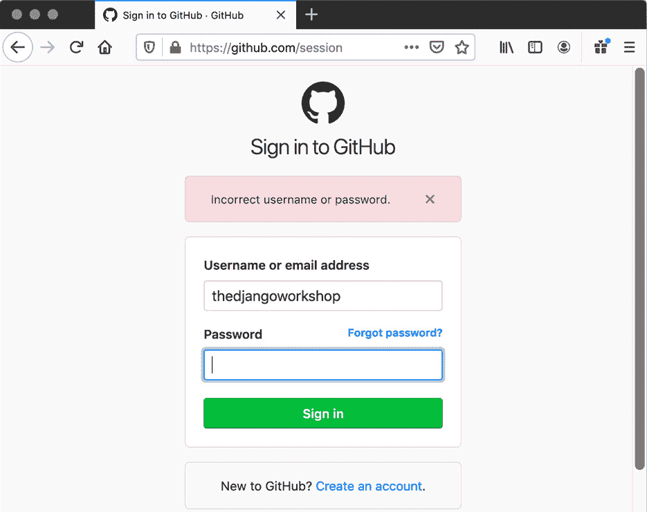

图 6.2：提交了错误的用户名或密码的表单

表单可以有两种状态：**提交前**和**提交后**。第一种是页面首次加载时的初始状态。所有字段都将有一个默认值（通常是空的）且不会显示任何错误。如果已输入到表单中的所有信息都是有效的，那么通常在提交时，你将被带到显示表单提交结果的页面。这可能是一个搜索结果页面，或者显示你创建的新对象的页面。在这种情况下，你将不会看到表单的提交后状态。

如果你没有在表单中输入有效信息，那么它将再次以提交后的状态呈现。在这个状态下，你会看到你输入的信息以及任何错误，以帮助你解决表单中的问题。错误可能是**字段错误**或**非字段错误**。字段错误适用于特定字段。例如，遗漏必填字段或输入过大、过小、过长或过短的价值。如果表单要求你输入你的名字而你留空了，这将在该字段旁边显示为字段错误。

非字段错误可能不适用于字段，或者适用于多个字段，并在表单顶部显示。在*图 6.2*中，我们看到一条消息，表明在登录时用户名或密码可能不正确。出于安全考虑，GitHub 不会透露用户名是否有效，因此这被显示为非字段错误，而不是用户名或密码的字段错误（Django 也遵循这个约定）。非字段错误也适用于相互依赖的字段。例如，在信用卡表单中，如果支付被拒绝，我们可能不知道是信用卡号码还是安全码不正确；因此，我们无法在特定字段上显示该错误。它适用于整个表单。

## `<form>`元素

在表单提交过程中使用的所有输入都必须包含在`<form>`元素内。你将使用以下三个 HTML 属性来修改表单的行为：

+   `method`

    这是提交表单时使用的 HTTP 方法，可以是`GET`或`POST`。如果省略，则默认为`GET`（因为这是在浏览器中键入 URL 并按*Enter*时的默认方法）。

+   `action`

    这指的是发送表单数据到的 URL（或路径）。如果省略，数据将返回到当前页面。

+   `enctype`

    这设置了表单的编码类型。只有在你使用表单上传文件时才需要更改此设置。最常用的值是 `application/x-www-form-urlencoded`（如果省略此值则为默认值）或 `multipart/form-data`（如果上传文件则设置此值）。请注意，你不需要担心视图中的编码类型；Django 会自动处理不同类型。

下面是一个没有设置任何属性的表单示例：

```py
<form>
    <!-- Input elements go here -->
</form>
```

它将使用 `GET` 请求提交数据，到当前表单显示的当前 URL，使用 `application/x-www-form-urlencoded` 编码类型。

在下一个示例中，我们将在一个表单上设置所有三个属性：

```py
<form method="post" action="/form-submit" enctype="multipart/form-data">
    <!-- Input elements go here -->
</form>
```

此表单将使用 `POST` 请求将数据提交到 `/form-submit` 路径，并将数据编码为 `multipart/form-data`。

`GET` 和 `POST` 请求在数据发送方式上有什么不同？回想一下 *第一章*，*Django 简介*，我们讨论了浏览器发送的底层 HTTP 请求和响应数据的样子。在接下来的两个示例中，我们将两次提交相同的表单，第一次使用 `GET`，第二次使用 `POST`。表单将有两个输入，一个姓和一个名。

使用 `GET` 提交的表单将数据放在 URL 中，如下所示：

```py
GET /form-submit?first_name=Joe&last_name=Bloggs HTTP/1.1
Host: www.example.com
```

使用 `POST` 提交的表单将数据放在请求体中，如下所示：

```py
POST /form-submit HTTP/1.1
Host: www.example.com
Content-Length: 31
Content-Type: application/x-www-form-urlencoded
first_name=Joe&last_name=Bloggs
```

你会注意到，在两种情况下表单数据都是用相同的方式进行编码；只是 `GET` 和 `POST` 请求放置的位置不同。在接下来的一个部分中，我们将讨论如何在这两种请求类型之间进行选择。

## 输入类型

我们已经看到了四个输入示例（*文本*、*密码*、*提交*和*隐藏*）。大多数输入都是通过 `<input>` 标签创建的，并且它们的类型通过其 `type` 属性指定。每个输入都有一个 `name` 属性，它定义了发送到服务器的 HTTP 请求中的键值对的键。

在下一个练习中，让我们看看我们如何使用 HTML 构建表单。这将使你能够熟悉许多不同的表单字段。

注意

本章中使用的所有练习和活动的代码可以在书的 GitHub 仓库中找到，网址为 [`packt.live/2KGjlaM`](http://packt.live/2KGjlaM)。

## 练习 6.01：在 HTML 中构建表单

在本章的前几个练习中，我们需要一个 HTML 表单来进行测试。我们将在这个练习中手动编写一个。这还将允许你实验不同字段如何进行验证和提交。这将在一个新的 Django 项目中完成，这样我们就不干扰 Bookr。你可以参考 *第一章*，*Django 简介*，来刷新你对创建 Django 项目的记忆：

1.  我们将首先创建新的 Django 项目。你可以重用已经安装了 Django 的 `bookr` 虚拟环境。打开一个新的终端并激活虚拟环境。然后，使用 `django-admin` 启动一个名为 `form_project` 的 Django 项目。为此，请运行以下命令：

    ```py
    django-admin startproject form_project
    ```

    这将在名为`form_example`的目录中构建 Django 项目。

1.  通过使用`startapp`管理命令在此项目中创建一个新的 Django 应用。该应用应命名为`form_example`。为此，请`cd`到`form_project`目录，然后运行以下命令：

    ```py
    python3 manage.py startapp form_example
    ```

    这将在`form_project`目录内创建`form_example`应用目录。

1.  启动 PyCharm，然后打开`form_project`目录。如果您已经有一个项目打开，可以通过选择`文件` -> `打开`来完成此操作；否则，只需在`欢迎使用 PyCharm`窗口中点击`打开`。导航到`form_project`目录，选择它，然后点击`打开`。`form_project`项目窗口应类似于以下所示：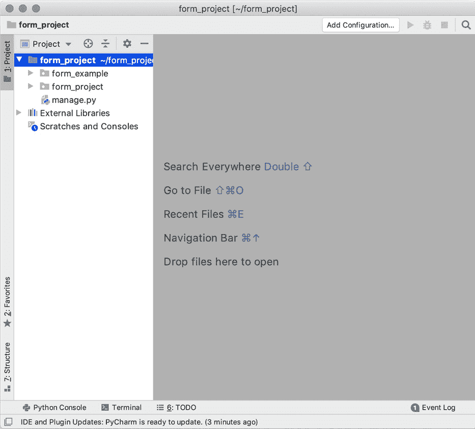

    图 6.3：form_project 项目已打开

1.  创建一个新的运行配置来执行项目的`manage.py runserver`。您可以再次使用`bookr`虚拟环境。完成设置后，`运行/调试配置`窗口应类似于以下图示：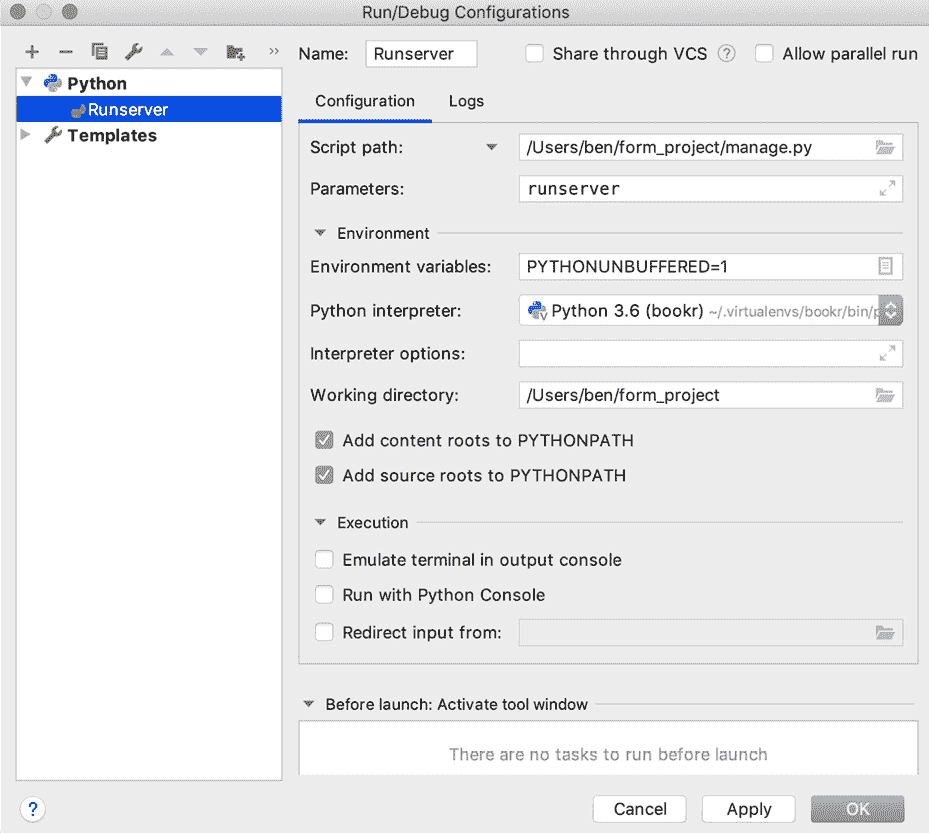

    图 6.4：运行/调试配置为 Runserver

    您可以通过点击`运行`按钮来测试配置是否设置正确，然后在浏览器中访问`http://127.0.0.1:8000/`。您应该看到 Django 欢迎屏幕。如果调试服务器无法启动或您看到 Bookr 主页面，那么您可能仍然有 Bookr 项目在运行。尝试停止 Bookr 的`runserver`进程，然后启动您刚刚设置的新进程。

1.  在`form_project`目录中打开`settings.py`文件，并将`'form_example'`添加到`INSTALLED_APPS`设置中。

1.  设置此新项目的最后一步是为`form_example`应用创建一个`templates`目录。在`form_example`目录上右键单击，然后选择`新建` -> `目录`。将其命名为`templates`。

1.  我们需要一个 HTML 模板来显示我们的表单。通过右键单击您刚刚创建的`templates`目录并选择`新建` -> `HTML 文件`来创建一个。在出现的对话框中，输入名称`form-example.html`并按*Enter*键创建它。

1.  `form-example.html`文件现在应在 PyCharm 的编辑器窗格中打开。首先创建`form`元素。我们将将其`method`属性设置为`post`。`action`属性将被省略，这意味着表单将提交回加载它的同一 URL。

    在`<body>`和`</body>`标签之间插入此代码：

    ```py
    <form method="post">
    </form>
    ```

1.  现在，让我们添加一些输入。为了在各个输入之间添加一些间距，我们将它们包裹在`<p>`标签内。我们将从一个文本字段和一个密码字段开始。此代码应插入到您刚刚创建的`<form>`标签之间：

    ```py
    <p>
        <label for="id_text_input">Text Input</label><br>
        <input id="id_text_input" type="text" name=      "text_input" value="" placeholder="Enter some text">
    </p>
    <p>
        <label for="id_password_input">Password Input</label><br>
        <input id="id_password_input" type="password" name="password_input"       value="" placeholder="Your password">
    </p>
    ```

1.  接下来，我们将添加两个复选框和三个单选按钮。在您在上一步中添加的 HTML 代码之后插入此代码；它应该在`</form>`标签之前：

    ```py
    <p>
        <input id="id_checkbox_input" type="checkbox"      name="checkbox_on" value="Checkbox Checked" checked>
        <label for="id_checkbox_input">Checkbox</label>
    </p>
    <p>
        <input id="id_radio_one_input" type="radio"      name="radio_input" value="Value One">
        <label for="id_radio_one_input">Value One</label>
        <input id="id_radio_two_input" type="radio"      name="radio_input" value="Value Two" checked>
        <label for="id_radio_two_input">Value Two</label>
        <input id="id_radio_three_input" type="radio"      name="radio_input" value="Value Three">
        <label for="id_radio_three_input">Value Three</label>
    </p>
    ```

1.  接下来是一个下拉选择菜单，允许用户选择喜欢的书籍。在上一步骤的代码之后但`</form>`标签之前添加以下代码：

    ```py
    <p>
        <label for="id_favorite_book">Favorite Book</label><br>
        <select id="id_favorite_book" name="favorite_book">
            <optgroup label="Non-Fiction">
                <option value="1">Deep Learning with Keras</option>
                <option value="2">Web Development with Django</option>
            </optgroup>
            <optgroup label="Fiction">
                <option value="3">Brave New World</option>
                <option value="4">The Great Gatsby</option>
            </optgroup>
        </select>
    </p>
    ```

    它将显示四个选项，分为两组。用户只能选择一个选项。

1.  下一个是多选（通过使用`multiple`属性实现）。在上一步骤的代码之后但`</form>`标签之前添加以下代码：

    ```py
    <p>
        <label for="id_books_you_own">Books You Own</label><br>
        <select id="id_books_you_own" name="books_you_own" multiple>
            <optgroup label="Non-Fiction">
                <option value="1">Deep Learning with Keras</option>
                <option value="2">Web Development with Django</option>
            </optgroup>
            <optgroup label="Fiction">
                <option value="3">Brave New World</option>
                <option value="4">The Great Gatsby</option>
            </optgroup>
        </select>
    </p>
    ```

    用户可以从四个选项中选择零个或多个。它们分为两组显示。

1.  接下来是`textarea`。它就像一个文本字段，但有多行。这段代码应该像在之前的步骤中一样添加，在关闭`</form>`标签之前：

    ```py
    <p>
        <label for="id_text_area">Text Area</label><br>
        <textarea name="text_area" id="id_text_area"      placeholder="Enter multiple lines of text"></textarea>
    </p>
    ```

1.  接下来，添加一些特定数据类型的字段：在`</form>`标签之前添加`number`、`email`和`date`输入。添加以下所有内容：

    ```py
    <p>
        <label for="id_number_input">Number Input</label><br>
        <input id="id_number_input" type="number"      name="number_input" value="" step="any" placeholder="A number">
    </p>
    <p>
        <label for="id_email_input">Email Input</label><br>
        <input id="id_email_input" type="email"      name="email_input" value="" placeholder="Your email address">
    </p>
    <p>
        <label for="id_date_input">Date Input</label><br>
        <input id="id_date_input" type="date" name=      "date_input" value="2019-11-23">
    </p>
    ```

1.  现在添加一些按钮来提交表单。再次，在关闭`</form>`标签之前插入以下内容：

    ```py
    <p>
        <input type="submit" name="submit_input" value="Submit Input">
    </p>
    <p>
        <button type="submit" name="button_element" value="Button Element">
            Button With <strong>Styled</strong> Text
        </button>
    </p>
    ```

    这展示了两种创建提交按钮的方式，要么作为`<input>`，要么作为`<button>`。

1.  最后，添加一个隐藏字段。在关闭`</form>`标签之前插入以下内容：

    ```py
    <input type="hidden" name="hidden_input" value="Hidden Value">
    ```

    这个字段既看不见也编辑不了，因此它有一个固定的值。你可以保存并关闭`form-example.html`。

1.  就像任何模板一样，除非我们有视图来渲染它，否则我们看不到它。打开`form_example`应用的`views.py`文件，并添加一个名为`form_example`的新视图。它应该渲染并返回你刚刚创建的模板，如下所示：

    ```py
    def form_example(request):
        return render(request, "form-example.html")
    ```

    你现在可以保存并关闭`views.py`。

1.  你现在应该熟悉下一步，即添加一个 URL 映射到视图。打开`form_project`包目录中的`urls.py`文件。将`form-example`路径映射到`form_example`视图的`urlpatterns`变量。它应该看起来像这样：

    ```py
    path('form-example/', form_example.views.form_example)
    ```

    确保你还要添加对`form_example.views`的导入。保存并关闭`urls.py`。

1.  启动 Django 开发服务器（如果尚未运行），然后在你的网页浏览器中加载你的新视图；地址是`http://127.0.0.1:8000/form-example/`。你的页面应该看起来像这样：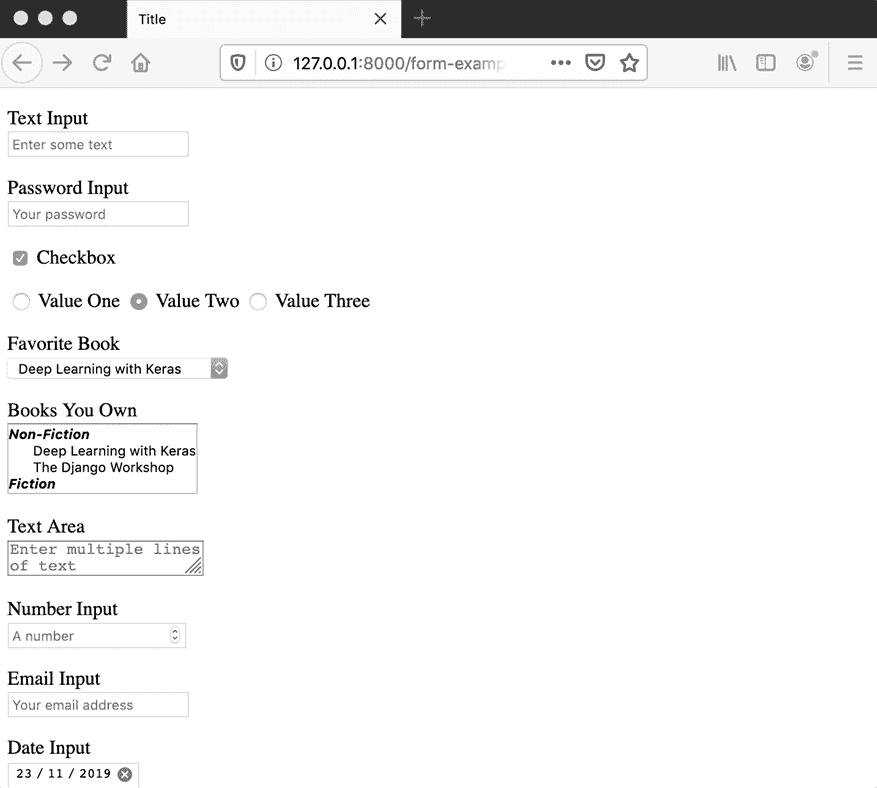

    图 6.5：示例输入页面

    你现在可以熟悉网页表单的行为，并查看它们是如何从你指定的 HTML 生成的。一个可以尝试的活动是将无效数据输入到数字、日期或电子邮件输入框中，然后点击提交按钮——内置的 HTML 验证应该阻止表单提交：

    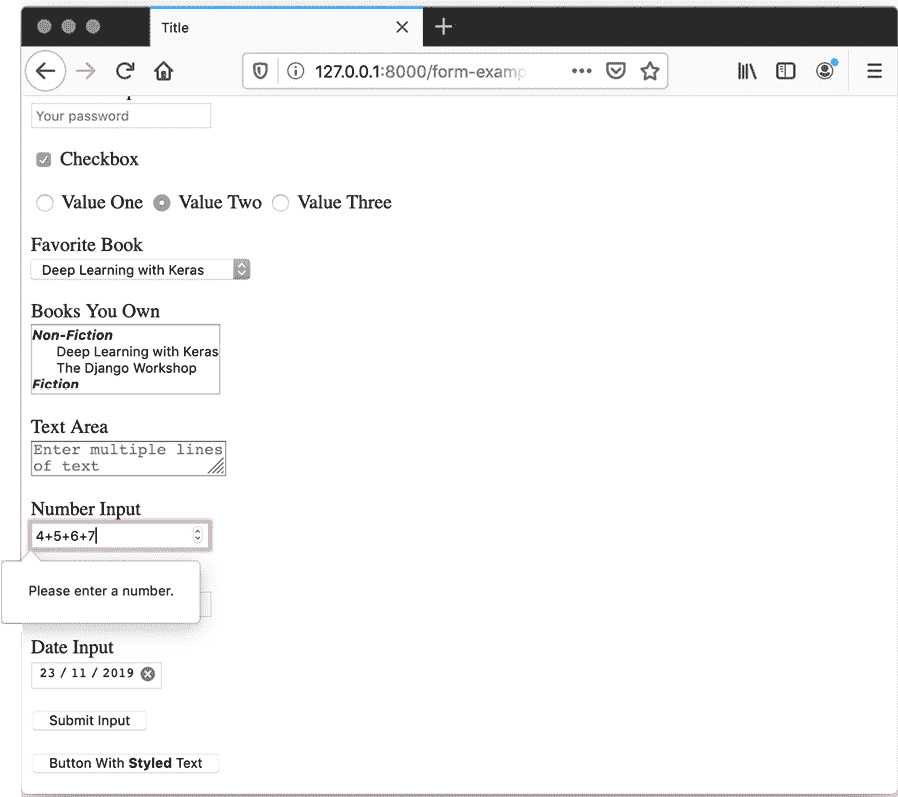

    图 6.6：由于无效数字导致的浏览器错误

    我们还没有为表单提交设置好一切，所以如果你纠正表单中的所有错误并尝试提交（通过点击任一提交按钮），你将收到一个错误，指出`CSRF 验证失败。请求已中止。`，正如我们可以在下一张图中看到的那样。我们将在本章后面讨论这意味着什么，以及如何修复它：

    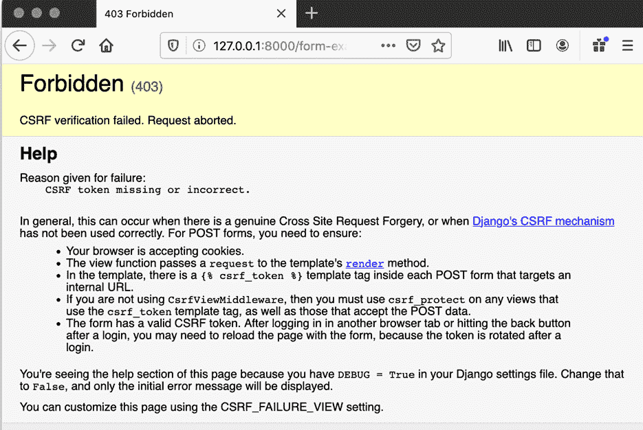

    图 6.7：CSRF 验证错误

1.  如果你确实收到了错误，只需在浏览器中返回到输入示例页面。

在这个练习中，你创建了一个展示许多 HTML 输入的示例页面，然后创建了一个视图来渲染它，并创建了一个 URL 来映射它。你在浏览器中加载了这个页面，并尝试更改数据，当表单包含错误时尝试提交它。

## 带有跨站请求伪造保护的表单安全

在整本书中，我们提到了 Django 包含的一些功能，以防止某些类型的安全漏洞。其中之一就是防止 CSRF 的功能。

CSRF 攻击利用了网站上的表单可以被提交到任何其他网站的事实。"form"的"action"属性只需设置得当。以 Bookr 为例。我们还没有设置这个，但我们将添加一个视图和 URL，允许我们为书籍发表评论。为此，我们将有一个用于发布评论内容和选择评分的表单。它的 HTML 如下所示：

```py
<form method="post" action="http://127.0.0.1:8000/books/4/reviews/">
    <p>
        <label for="id_review_text">Your Review</label><br/>
        <textarea id="id_review_text" name="review_text"          placeholder="Enter your review"></textarea>
    </p>
    <p>
        <label for="id_rating">Rating</label><br/>
        <input id="id_rating" type="number" name="rating"          placeholder="Rating 1-5">
    </p>
    <p>
        <button type="submit">Create Review</button>
    </p
</form>
```

在网页上，它看起来会是这样：


图 6.8：示例评论创建表单

某人可以拿走这个表单，做一些修改，然后在自己的网站上托管它。例如，他们可以隐藏输入并硬编码一个好评和评分，然后让它看起来像其他类型的表单，如下所示：

```py
<form method="post" action="http://127.0.0.1:8000/books/4/reviews/">
    <input type="hidden" name="review_text" value="This book is great!">
    <input type="hidden" name="rating" value="5">
    <p>
        <button type="submit">Enter My Website</button>
    </p>
</form>
```

当然，隐藏字段不会显示，所以在恶意网站上表单看起来是这样的。


图 6.9：隐藏输入不可见

用户会以为他们点击的是一个按钮以进入一个网站，但在点击的过程中，他们会向 Bookr 上的原始视图提交隐藏的值。当然，用户可以检查他们所在页面的源代码来查看正在发送什么数据以及发送到何处，但大多数用户不太可能检查他们遇到的每一个表单。攻击者甚至可以有一个没有提交按钮的表单，只用 JavaScript 来提交它，这意味着用户在甚至没有意识到的情况下就提交了表单。

你可能会认为要求用户登录到 Bookr 可以防止这种攻击，这确实在一定程度上限制了其有效性，因为攻击将仅对已登录用户有效。但由于认证的方式，一旦用户登录，他们的浏览器中就会设置一个 cookie 来识别他们到 Django 应用程序。这个 cookie 在每次请求时都会发送，这样用户就不必在每一页上提供他们的登录凭证。由于网络浏览器的工作方式，它们会在发送到特定服务器的所有请求中包含服务器的认证 cookie。即使我们的表单托管在恶意网站上，最终它还是会发送一个请求到我们的应用程序，所以它会通过我们的服务器 cookie 发送。

我们如何防止 CSRF 攻击？Django 使用一种称为 CSRF 令牌的东西，这是一个对每个网站访客唯一的随机字符串——一般来说，你可以认为一个访客是一个浏览器会话。同一台电脑上的不同浏览器会是不同的访客，而且同一个 Django 用户在两个不同的浏览器上登录也会是不同的访客。当表单被读取时，Django 会将令牌作为隐藏输入放入表单中。CSRF 令牌必须包含在所有发送到 Django 的 `POST` 请求中，并且它必须与 Django 在服务器端为访客存储的令牌匹配，否则将返回 403 状态 HTTP 响应。这种保护可以禁用——要么是整个站点，要么是单个视图——但除非你真的需要这样做，否则不建议这样做。CSRF 令牌必须添加到每个要发送的表单的 HTML 中，并且使用 `` 模板标签完成。我们现在将把它添加到我们的示例评论表单中，模板中的代码将看起来像这样：

```py
<form method="post" action="http://127.0.0.1:8000/books/4/reviews/">
    
    <p>
        <label for="id_review_text">Your Review</label><br/>
        <textarea id="id_review_text" name="review_text"          placeholder="Enter your review"></textarea>
    </p>
    <p>
        <label for="id_rating">Rating</label><br/>
        <input id="id_rating" type="number" name="rating"          placeholder="Rating 1-5">
    </p>
    <p>
        <button type="submit">Enter My Website</button>
    </p>
</form>
```

当模板被渲染时，模板标签会被插值，所以输出的 HTML 最终会像这样（注意，输入仍然在输出中；这里只是为了简洁而移除了它们）：

```py
<form method="post" action="http://127.0.0.1:8000/books/4/reviews/">
    <input type="hidden" name="csrfmiddlewaretoken"      value="tETZjLDUXev1tiYqGCSbMQkhWiesHCnutxpt6mutHI6YH64F0nin5k2JW3B68IeJ">
    …
</form>
```

由于这是一个隐藏字段，页面上的表单看起来与之前没有区别。

CSRF 令牌对网站上的每个访客都是唯一的，并且会定期更改。如果攻击者从我们的网站上复制 HTML，他们会得到一个自己的 CSRF 令牌，这个令牌不会与任何其他用户的令牌匹配，所以当其他人提交表单时，Django 会拒绝该表单。

CSRF 令牌也会定期更改。这限制了攻击者利用特定用户和令牌组合的时间。即使他们能够获取他们试图利用的用户的 CSRF 令牌，他们也只有很短的时间窗口可以使用它。

## 在视图中访问数据

正如我们在 *第一章*，*Django 简介* 中所讨论的，Django 在传递给视图函数的 `HTTPRequest` 实例上提供了两个 `QueryDict` 对象。这些是 `request.GET`，它包含通过 URL 传递的参数，以及 `request.POST`，它包含 HTTP 请求体中的参数。尽管 `request.GET` 的名字中有 `GET`，但这个变量即使在非 `GET` HTTP 请求中也会被填充。这是因为它包含的数据是从 URL 解析出来的。由于所有 HTTP 请求都有一个 URL，所以所有 HTTP 请求都可能包含 `GET` 数据，即使它们是 `POST` 或 `PUT` 等等。在下一个练习中，我们将向我们的视图添加代码来读取和显示 `POST` 数据。

## 练习 6.02：在视图中处理 POST 数据

现在我们将向我们的示例视图添加一些代码，将接收到的 `POST` 数据打印到控制台。我们还将把生成页面的 HTTP 方法插入到 HTML 输出中。这将使我们能够确定用于生成页面的方法（`GET` 或 `POST`）并查看每种类型的表单如何不同：

1.  首先，在 PyCharm 中，打开 `form_example` 应用程序的 `views.py` 文件。修改 `form_example` 视图，通过在函数内部添加以下代码，将 `POST` 请求中的每个值打印到控制台：

    ```py
        for name in request.POST:
            print("{}: {}".format(name, request.POST.getlist(name)))
    ```

    此代码遍历请求 `POST` 数据 `QueryDict` 中的每个键，并将键和值列表打印到控制台。我们已经知道每个 `QueryDict` 可以为一个键有多个值，因此我们使用 `getlist` 函数来获取所有值。

1.  将 `request.method` 通过名为 `method` 的上下文变量传递到模板中。通过更新视图中的 `render` 调用来完成此操作，使其如下所示：

    ```py
    return render(request, "form-example.html", \
                  {"method": request.method})
    ```

1.  现在，我们将显示模板中的 `method` 变量。打开 `form-example.html` 模板，并使用 `<h4>` 标签显示 `method` 变量。将其放在 `<body>` 标签之后，如下所示：

    ```py
    <body>
        <h4>Method: {{ method }}</h4>
    ```

    注意，我们可以通过使用 `request` 方法变量和属性正确地直接在模板中访问方法，而无需将其传递到上下文字典中。我们从 *第三章*，*URL 映射、视图和模板* 中知道，通过使用 `render` 快捷函数，请求始终在模板中可用。我们在这里展示了如何访问视图中的方法，因为稍后我们将根据方法更改页面的行为。

1.  我们还需要将 CSRF 令牌添加到表单 HTML 中。我们通过在 `<form>` 标签之后放置 `` 模板标签来完成此操作。表单的开始应如下所示：

    ```py
    <form method="post">
         
    ```

    现在，保存文件。

1.  如果 Django 开发服务器尚未运行，请启动它。在浏览器中加载示例页面（`http://127.0.0.1:8000/form-example/`），你应该会看到它现在在页面顶部显示了方法（`GET`）：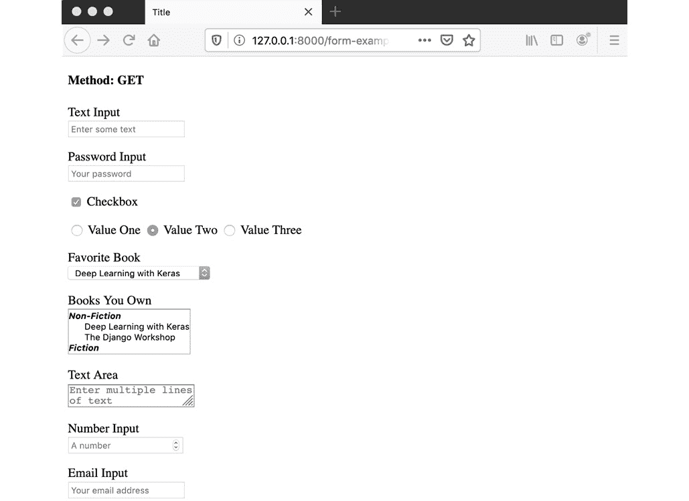

    图 6.10：页面顶部的请求方法

1.  在每个输入框中输入一些文本或数据，然后通过点击 `Submit Input` 按钮提交表单：

    图 6.11：点击提交输入按钮提交表单

    你应该会看到页面重新加载，并且显示的方法更改为 `POST`：

    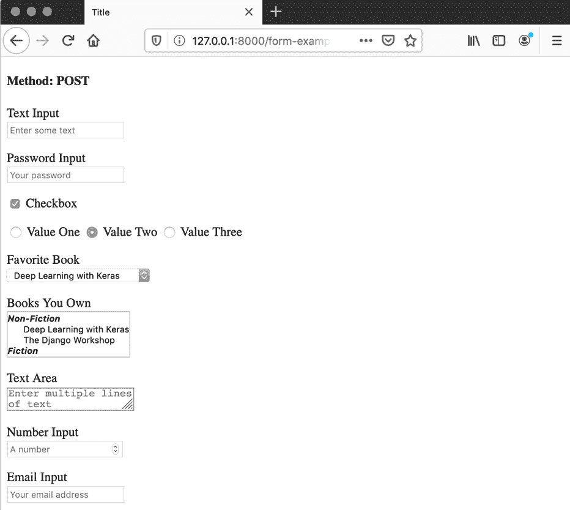

    图 6.12：表单提交后方法更新为 POST

1.  切换回 PyCharm，查看窗口底部的 `Run` 控制台。如果它不可见，请点击窗口底部的 `Run` 按钮以显示它：

    图 6.13：点击窗口底部的运行按钮以显示控制台

    在 `Run` 控制台中，应显示已发送到服务器的值列表：

    

    图 6.14：运行控制台显示的输入值

    你应该注意以下事项：

    +   所有值都作为文本发送，即使是 `number` 和 `date` 输入。

    +   对于 `select` 输入，发送的是选中选项的 `value` 属性，而不是 `option` 标签的文本内容。

    +   如果你为 `books_you_own` 选择多个选项，那么你将在请求中看到多个值。这就是为什么我们使用 `getlist` 方法，因为为相同的输入名称发送了多个值。

    +   如果复选框被选中，你将在调试输出中看到一个 `checkbox_on` 输入。如果没有被选中，则该键将根本不存在（即，没有键，而不是键存在一个空字符串或 `None` 值）。

    +   我们有一个名为 `submit_input` 的值，其文本为 `Submit Input`。你通过点击 `Submit Input` 按钮提交了表单，因此我们收到了它的值。注意，由于该按钮没有被点击，所以 `button_element` 输入没有设置任何值。

1.  我们将尝试两种其他提交表单的方式，首先是在你的光标位于类似文本的输入中（如 *text*、*password*、*date* 和 *email*，但不是 *text area*，因为在其中按 *Enter* 将添加新行）时按 *Enter* 键。

    如果你以这种方式提交表单，表单将表现得好像你点击了表单上的第一个提交按钮一样，因此 `submit_input` 输入值将被包含。你看到的输出应该与之前的图相同。

    提交表单的另一种方式是通过点击 `Button Element` 提交输入，我们将尝试点击此按钮来提交表单。你应该会看到 `submit_button` 已不再列表中，而 `button_element` 现在已经存在：

    ![图 6.15：submit_button 已从输入中移除，并添加了 button_element

    ![img/B15509_06_15.jpg]

图 6.15：submit_button 已从输入中移除，并添加了 button_element

你可以使用这种多提交技术来改变你的视图行为，取决于哪个按钮被点击。你甚至可以有多个具有相同 *name* 属性的提交按钮，以使逻辑更容易编写。

在这个练习中，你通过使用 `` 模板标签将 CSRF 令牌添加到你的 `form` 元素中。这意味着你的表单可以成功提交到 Django，而不会生成 HTTP 权限拒绝响应。然后我们添加了一些代码来输出表单提交时的值。我们尝试用各种值提交表单，以查看它们是如何被解析成 `request.POST` `QueryDict` 中的 Python 变量的。现在我们将讨论一些关于 `GET` 和 `POST` 请求之间差异的理论，然后转向 Django 表单库，它使得设计和验证表单变得更加容易。

## 选择 GET 和 POST

选择何时使用 `GET` 或 `POST` 请求需要考虑许多因素。最重要的是决定请求是否应该是幂等的。如果请求可以被重复执行并且每次都产生相同的结果，则可以说该请求是幂等的。让我们看看一些例子。

如果你将任何网址输入到你的浏览器中（例如我们迄今为止构建的任何 Bookr 页面），它将执行一个`GET`请求来获取信息。你可以刷新页面，无论你点击刷新多少次，你都会得到相同的数据。你发出的请求不会影响服务器上的内容。你会说这些请求是幂等的。

现在，记得你通过 Django 管理界面（在*第四章*，*Django 管理界面简介*）添加数据时吗？你在表单中输入了新书的详细信息，然后点击了`保存`。你的浏览器向服务器发送了一个`POST`请求来创建新书。如果你重复那个`POST`请求，服务器将创建*另一本*书，并且每次你重复请求时都会这样做。由于请求正在更新信息，它不是幂等的。你的浏览器会警告你这一点。如果你曾经尝试刷新在提交表单后发送到你的页面，你可能收到一条消息询问你是否想要重新发送表单数据？（或更详细的，如以下图所示）。这是警告你正在再次发送表单数据，这可能会使你刚刚执行的操作被重复：


图 6.16：Firefox 确认是否应该重新发送信息

这并不是说所有`GET`请求都是幂等的，而所有`POST`请求都不是——你的后端应用可以按照你想要的方式设计。尽管这不是最佳实践，开发者可能已经决定在他们的 Web 应用中，在`GET`请求期间更新数据。当你构建你的应用时，你应该尽量确保`GET`请求是幂等的，并将数据更改仅留给`POST`请求。除非你有充分的理由不这样做，否则请坚持这些原则。

另一点需要考虑的是，Django 只对`POST`请求应用 CSRF 保护。任何`GET`请求，包括更改数据的请求，都可以在没有 CSRF 令牌的情况下访问。

有时候，判断一个请求是否幂等可能很难；例如，登录表单。在你提交用户名和密码之前，你并未登录，之后服务器认为你已经登录，那么我们是否可以认为非幂等，因为它改变了你与服务器之间的认证状态？另一方面，一旦登录，如果你再次发送凭证，你将保持登录状态。这表明请求是幂等的且可重复的。那么，这个请求应该是`GET`还是`POST`？

这引出了选择使用哪种方法时需要考虑的第二个问题。如果我们使用 `GET` 请求发送表单数据，表单参数将可见于 URL 中。例如，如果我们使登录表单使用 `GET` 请求，登录 URL 可能是 `https://www.example.com/login?username=user&password=password1`。用户名，更糟糕的是密码，将可见于网络浏览器的地址栏中。它也会存储在浏览器历史记录中，这意味着任何在真实用户之后使用浏览器的用户都可以登录到该网站。URL 通常还会存储在 Web 服务器日志文件中，这意味着凭证也会在那里可见。简而言之，无论请求的幂等性如何，都不要通过 URL 参数传递敏感数据。

有时，知道参数将可见于 URL 中可能正是您所希望的。例如，当使用搜索引擎进行搜索时，通常搜索参数将可见于 URL 中。要查看这一功能如何工作，请尝试访问 [`www.google.com`](https://www.google.com) 并进行搜索。您会注意到包含结果的页面将您的搜索词作为 `q` 参数。例如，搜索 `Django` 将带您到 URL [`www.google.com/search?q=Django`](https://www.google.com/search?q=Django)。这允许您通过发送此 URL 与他人共享搜索结果。在 *活动 6.01，图书搜索* 中，您将添加一个类似的搜索表单，该表单会传递一个参数。

另一个考虑因素是，浏览器允许的 URL 最大长度可能比 `POST` 体的尺寸短得多——有时只有大约 2,000 个字符（或大约 2 KB），而 `POST` 体的尺寸可以是许多兆字节或千兆字节（假设您的服务器已设置允许这些大小的请求）。

如我们之前提到的，无论正在进行的请求类型是什么（`GET`、`POST`、`PUT` 等），URL 参数都可在 `request.GET` 中找到。您可能会发现将一些数据通过 URL 参数发送，而将其他数据放在请求体（在 `request.POST` 中可用）中很有用。例如，您可以在 URL 中指定一个 `format` 参数，该参数设置某些输出数据将被转换成的格式，但输入数据提供在 `POST` 体内。

## 当我们可以在 URL 中放置参数时，为什么还要使用 GET？

Django 允许我们轻松定义包含变量的 URL 映射。例如，我们可以设置一个搜索视图的 URL 映射如下：

```py
path('/search/<str:search>/', reviews.views.search)
```

这种方法可能一开始看起来很好，但当我们开始想要使用参数自定义结果视图时，它可能会迅速变得复杂。例如，我们可能希望能够从一个结果页面跳转到下一个结果页面，因此我们添加了一个页面参数：

```py
path('/search/<str:search>/<int:page>', reviews.views.search)
```

然后我们可能还希望按特定类别对搜索结果进行排序，例如作者姓名或发布日期，因此我们为这个目的添加了另一个参数：

```py
path('/search/<str:search>/<int:page>/<str:order >', \
     reviews.views.search)
```

你可能已经看到了这种方法的缺点——如果我们不提供页面，就无法对结果进行排序。如果我们还想添加`results_per_page`参数，我们就不能不设置`page`和`order`键来使用它。

与使用查询参数的方法相比：所有这些参数都是可选的，因此你可以这样搜索：

```py
?search=search+term:
```

或者你可以设置一个像这样的页面：

```py
?search=search+term&page=2
```

或者你可以只设置结果排序如下：

```py
?search=search+term&order=author
```

或者你可以将它们全部组合：

```py
?search=search+term&page=2&order=author
```

使用 URL 查询参数的另一个原因是，在提交表单时，浏览器总是以这种方式发送输入值；无法更改，以便将参数作为 URL 中的路径组件提交。因此，当使用`GET`提交表单时，必须使用 URL 查询参数作为输入数据。

# Django 表单库

我们已经探讨了如何手动在 HTML 中编写表单以及如何使用`QueryDict`访问请求对象中的数据。我们了解到浏览器为我们提供了一些针对特定字段类型的验证，例如电子邮件或数字，但我们还没有尝试在 Python 视图中验证数据。我们应该在 Python 视图中验证表单，原因有两个：

+   仅仅依赖基于浏览器的输入数据验证是不安全的。浏览器可能没有实现某些验证功能，这意味着用户可以提交任何类型的数据。例如，旧版浏览器不验证数字字段，因此用户可以输入超出我们预期范围的数字。此外，恶意用户甚至可能尝试发送有害数据而不使用浏览器。浏览器验证应被视为对用户的一种便利，仅此而已。

+   浏览器不允许我们进行跨字段验证。例如，我们可以使用`required`属性来指定必须填写的输入字段。然而，通常我们希望根据另一个输入字段的值来设置`required`属性。例如，如果用户已经勾选了`注册我的邮箱`复选框，那么电子邮件地址输入字段才应该被设置为`required`。

Django 表单库允许你使用 Python 类快速定义表单。这是通过创建 Django 基础`Form`类的子类来实现的。然后你可以使用这个类的实例在模板中渲染表单并验证输入数据。我们将我们的类称为表单，类似于我们通过子类化 Django 模型来创建自己的`Model`类。表单包含一个或多个特定类型的字段（如文本字段、数字字段或电子邮件字段）。你会注意到这听起来像 Django 模型，而且表单确实与模型类似，但使用不同的字段类。你甚至可以自动从模型创建表单——我们将在*第七章*，*高级表单验证和模型表单*中介绍这一点。

## 定义表单

创建 Django 表单类似于创建 Django 模型。你定义一个继承自 `django.forms.Form` 类的类。该类有属性，这些属性是不同 `django.forms.Field` 子类的实例。当渲染时，类中的属性名称对应于其在 HTML 中的输入 `name`。为了给你一个关于有哪些字段的快速概念，以下是一些示例：`CharField`、`IntegerField`、`BooleanField`、`ChoiceField` 和 `DateField`。每个字段在渲染为 HTML 时通常对应一个输入，但表单字段类和输入类型之间并不总是存在一对一的映射。表单字段更多地与它们收集的数据类型相关联，而不是它们的显示方式。

为了说明这一点，考虑一个 `text` 输入和一个 `password` 输入。它们都接受一些输入的文本数据，但它们之间的主要区别在于，文本在 `text` 输入中是可见的，而 `password` 输入中的文本则是隐藏的。在 Django 表单中，这两个字段都是使用 `CharField` 来表示的。它们显示方式的不同是通过改变字段所使用的 `*widget*` 来设置的。

注意

如果你不太熟悉单词 *widget*，它是一个用来描述实际交互的输入及其显示方式的术语。文本输入、密码输入、选择菜单、复选框和按钮都是不同小部件的例子。我们在 HTML 中看到的输入与这些小部件一一对应。在 Django 中，情况并非如此，同一个类型的 `Field` 类可以根据指定的 `widget` 以多种方式渲染。

Django 定义了一系列 `Widget` 类，它们定义了 `Field` 应如何作为 HTML 渲染。它们继承自 `django.forms.widgets.Widget`。可以将小部件传递给 `Field` 构造函数以更改其渲染方式。例如，默认情况下，`CharField` 实例渲染为 `text` `<input>`。如果我们使用 `PasswordInput` 小部件，它将渲染为 `password` `<input>`。我们将使用的其他小部件如下：

+   `RadioSelect`，它将 `ChoiceField` 实例渲染为单选按钮而不是 `<select>` 菜单

+   `Textarea`，它将 `CharField` 实例渲染为 `<textarea>`

+   `HiddenInput`，它将字段渲染为隐藏的 `<input>`

我们将查看一个示例表单，并逐个添加字段和功能。首先，让我们先创建一个包含文本输入和密码输入的表单：

```py
from django import forms
class ExampleForm(forms.Form):
    text_input = forms.CharField()
    password_input = forms.CharField(widget=forms.PasswordInput)
```

`widget` 参数可以只是一个小部件子类，这在很多情况下都是可以接受的。如果你想进一步自定义输入及其属性的显示，你可以将 `widget` 参数设置为 `widget` 类的实例。我们很快将探讨如何进一步自定义小部件的显示。在这种情况下，我们只是使用了 `PasswordInput` 类，因为我们没有对其进行自定义，只是改变了显示的输入类型。

当表单在模板中渲染时，它看起来是这样的：


图 6.17：在浏览器中渲染的 Django 表单

注意，当页面加载时，输入不包含任何内容；文本已被输入以说明不同的输入类型。

如果我们检查页面源代码，我们可以看到 Django 生成的 HTML。对于前两个字段，它看起来像这样（添加了一些间距以提高可读性）：

```py
<p>
    <label for="id_text_input">Text input:</label>
    <input type="text" name="text_input" required id="id_text_input">
</p>
<p>
    <label for="id_password_input">Password input:</label>
    <input type="password" name="password_input" required id="id_password_input">
</p>
```

注意到 Django 已经自动生成一个`label`实例，其文本来自字段名称。`name`和`id`属性已自动设置。Django 还自动将`required`属性添加到输入中。与模型字段类似，表单字段构造函数也接受一个`required`参数——默认为`True`。将其设置为`False`将从生成的 HTML 中移除`required`属性。

接下来，我们将看看如何将复选框添加到表单中：

+   复选框用`BooleanField`表示，因为它只有两个值，选中或未选中。它以与其他字段相同的方式添加到表单中：

    ```py
    class ExampleForm(forms.Form):
        …
        checkbox_on = forms.BooleanField()
    ```

    Django 为这个新字段生成的 HTML 与前面两个字段类似：

    ```py
    <label for="id_checkbox_on">Checkbox on:</label> 
    <input type="checkbox" name="checkbox_on" required id="id_checkbox_on">
    ```

接下来是选择输入：

+   我们需要提供一个要显示在`<select>`下拉列表中的选择项列表。

+   字段类构造函数接受一个`choices`参数。选择项以两个元素的元组的形式提供。每个子元组中的第一个元素是选择项的值，第二个元素是选择项的文本或描述。例如，选择项可以定义如下：

    ```py
    BOOK_CHOICES = (('1', 'Deep Learning with Keras'),\
                    ('2', 'Web Development with Django'),\
                    ('3', 'Brave New World'),\
                    ('4', 'The Great Gatsby'))
    ```

    注意，如果你想使用列表而不是元组（或两者的组合），这是可以的。如果你想使你的选择项可变，这可能会很有用：

    ```py
    BOOK_CHOICES = (['1', 'Deep Learning with Keras'],\
                    ['2', 'Web Development with Django'],\
                    ['3', 'Brave New World'],\
                    ['4', 'The Great Gatsby']]
    ```

+   要实现`optgroup`，我们可以嵌套选择项。为了以与我们的前例相同的方式实现选择项，我们使用如下结构：

    ```py
    BOOK_CHOICES = (('Non-Fiction', \
                     (('1', 'Deep Learning with Keras'),\
                     ('2', 'Web Development with Django'))),\
                    ('Fiction', \
                     (('3', 'Brave New World'),\
                      ('4', 'The Great Gatsby'))))
    ```

    通过使用`ChoiceField`实例将`select`功能添加到表单中。小部件默认为`select`输入，因此除了设置`choices`之外不需要任何配置：

    ```py
    class ExampleForm(forms.Form):
        …
        favorite_book = forms.ChoiceField(choices=BOOK_CHOICES)
    ```

这是生成的 HTML：

```py
<label for="id_favorite_book">Favorite book:</label>
<select name="favorite_book" id="id_favorite_book">
    <optgroup label="Non-Fiction">
        <option value="1">Deep Learning with Keras</option>
        <option value="2">Web Development with Django</option>
    </optgroup>
    <optgroup label="Fiction">
        <option value="3">Brave New World</option>
        <option value="4">The Great Gatsby</option>
    </optgroup>
</select>
```

创建多选需要使用`MultipleChoiceField`。它接受一个`choices`参数，其格式与单选的常规`ChoiceField`相同：

```py
class ExampleForm(forms.Form):
    …
    books_you_own = forms.MultipleChoiceField(choices=BOOK_CHOICES)
```

它的 HTML 与单选类似，但增加了`multiple`属性：

```py
<label for="id_books_you_own">Books you own:</label>
<select name="books_you_own" required id="id_books_you_own" multiple>
    <optgroup label="Non-Fiction">
        <option value="1">Deep Learning with Keras</option>
        <option value="2">Web Development with Django</option>
    </optgroup>
    <optgroup label="Fiction">
        <option value="3">Brave New World</option>
        <option value="4">The Great Gatsby</option>
    </optgroup>
</select>
```

选择项也可以在表单实例化后设置。你可能想在视图中动态生成`list`/`tuple`，然后将其分配给字段的`choices`属性。例如，参见以下内容：

```py
form = ExampleForm()
form.fields["books_you_own"].choices = \
[("1", "Deep Learning with Keras"), …]
```

接下来是单选输入，它们与选择类似：

+   与选择类似，单选输入使用`ChoiceField`，因为它们在多个选项之间提供单一选择。

+   选项通过`choices`参数传递给字段构造函数。

+   选择项以两个元素的元组的形式提供，就像选择一样：

```py
choices = (('1', 'Option One'),\
           ('2', 'Option Two'),\
           ('3', 'Option Three'))
```

`ChoiceField` 默认以 `select` 输入的形式显示，因此必须将小部件设置为 `RadioSelect` 以使其以单选按钮的形式渲染。将选择设置与此结合，我们可以在表单中添加单选按钮，如下所示：

```py
RADIO_CHOICES = (('Value One', 'Value One'),\
                 ('Value Two', 'Value Two'),\
                 ('Value Three', 'Value Three'))
class ExampleForm(forms.Form):
    …
    radio_input = forms.ChoiceField(choices=RADIO_CHOICES,\
                                    widget=forms.RadioSelect)
```

生成的 HTML 如下所示：

```py
<label for="id_radio_input_0">Radio input:</label> 
<ul id="id_radio_input">
<li>
    <label for="id_radio_input_0">
        <input type="radio" name="radio_input"          value="Value One" required id="id_radio_input_0">
        Value One
    </label>
</li>
<li>
    <label for="id_radio_input_1">
        <input type="radio" name="radio_input"          value="Value Two" required id="id_radio_input_1">
        Value Two
    </label>
</li>
<li>
    <label for="id_radio_input_2">
        <input type="radio" name="radio_input"          value="Value Three" required id="id_radio_input_2">
        Value Three
    </label>
</li>
</ul>
```

Django 自动为三个单选按钮中的每一个生成唯一的标签和 ID：

+   要创建一个 `textarea` 实例，请使用带有 `Textarea` 小部件的 `CharField`：

    ```py
    class ExampleForm(forms.Form):
        …
        text_area = forms.CharField(widget=forms.Textarea)
    ```

    你可能会注意到 `textarea` 比我们之前看到的要大得多（参见以下图示）：

    

图 6.18：普通文本框（顶部）与 Django 默认文本框（底部）的比较

这是因为 Django 自动添加 `cols` 和 `rows` 属性。这些属性分别设置文本字段显示的列数和行数：

```py
<label for="id_text_area">Text area:</label>
<textarea name="text_area" cols="40"  rows="10" required id="id_text_area"></textarea>
```

+   注意，`cols` 和 `rows` 设置不会影响可以输入到字段中的文本量，只会影响一次显示的文本量。另外，`textarea` 的大小可以使用 CSS 设置（例如，`height` 和 `width` 属性）。这将覆盖 `cols` 和 `rows` 设置。

    要创建 `number` 输入，你可能期望 Django 有一个 `NumberField` 类型，但实际上并没有。

    记住，Django 表单字段是数据驱动的，而不是显示驱动的，因此，Django 根据你想要存储的数值类型提供不同的 `Field` 类：

+   对于整数，请使用 `IntegerField`。

+   对于浮点数，请使用 `FloatField` 或 `DecimalField`。后两者在将数据转换为 Python 值的方式上有所不同。

+   `FloatField` 将转换为浮点数，而 `DecimalField` 是十进制数。

+   相比于浮点数，十进制值在表示数字时具有更高的精度，但可能无法很好地集成到现有的 Python 代码中。

我们将一次性将所有三个字段添加到表单中：

```py
class ExampleForm(forms.Form):
    …
    integer_input = forms.IntegerField()
    float_input = forms.FloatField()
    decimal_input = forms.DecimalField()
```

下面是三个文本框的 HTML 代码：

```py
<p>
    <label for="id_integer_input">Integer input:</label>
    <input type="number" name="integer_input"      required id="id_integer_input">
</p>
<p>
    <label for="id_float_input">Float input:</label>
    <input type="number" name="float_input"      step="any" required id="id_float_input">
</p>
<p>
    <label for="id_decimal_input">Decimal       input:</label>
    <input type="number" name="decimal_input"      step="any" required id="id_decimal_input">
</p>
```

生成的 `IntegerField` HTML 缺少其他两个字段（`FloatField` 和 `DecimalField`）所具有的 `step` 属性，这意味着小部件将只接受整数值。其他两个字段生成的 HTML 非常相似。它们在浏览器中的行为相同；它们仅在 Django 代码中使用其值时有所不同。

如你所猜，可以使用 `EmailField` 创建一个 `email` 输入：

```py
class ExampleForm(forms.Form):
    …
    email_input = forms.EmailField()
```

它的 HTML 与我们手动创建的 `email` 输入类似：

```py
<label for="id_email_input">Email input:</label>
<input type="email" name="email_input" required id="id_email_input">
```

在我们手动创建的表单之后，我们将查看下一个字段 `DateField`：

+   默认情况下，Django 将 `DateField` 渲染为 `text` 输入，并且当字段被点击时，浏览器不会显示日历弹出窗口。

我们可以不带参数地将 `DateField` 添加到表单中，如下所示：

```py
class ExampleForm(forms.Form):
    …
    date_input = forms.DateField()
```

当渲染时，它看起来就像一个普通的 `text` 输入：


图 6.19：表单中默认的 `DateField` 显示

默认生成的 HTML 如下所示：

```py
<label for="id_date_input">Date input:</label>
<input type="text" name="date_input" required id="id_date_input">
```

使用`text`输入的原因是它允许用户以多种不同的格式输入日期。例如，默认情况下，用户可以以*Year-Month-Day*（用连字符分隔）或*Month/Day/Year*（用斜杠分隔）的格式输入日期。可以通过将格式列表传递给`DateField`构造函数的`input_formats`参数来指定接受的格式。例如，我们可以接受*Day/Month/Year*或*Day/Month/Year-with-century*格式的日期，如下所示：

```py
DateField(input_formats = ['%d/m/%y', '%d/%m/%Y'])
```

我们可以通过将`attrs`参数传递给小部件构造函数来覆盖字段小部件上的任何属性。这接受一个字典，包含将被渲染到输入 HTML 中的属性键/值。

我们还没有使用这个功能，但在下一章我们将进一步自定义字段渲染时，我们还会再次看到它。现在，我们只需设置一个属性，`type`，它将覆盖默认的输入类型：

```py
class ExampleForm(forms.Form):
    …
    date_input = forms.DateField\
                 (widget=forms.DateInput(attrs={'type': 'date'}))
```

当渲染时，它现在看起来就像我们之前拥有的日期字段，点击它将弹出日历日期选择器：

![图 6.20：带有日期输入的 DateField]


图 6.20：带有日期输入的 DateField

现在检查生成的 HTML，我们可以看到它使用的是`date`类型：

```py
<label for="id_date_input">Date input:</label>
<input type="date" name="date_input" required id="id_date_input">
```

我们还缺少的最终输入是隐藏输入。

由于 Django 表单的数据中心性质，没有`HiddenField`。相反，我们选择需要隐藏的字段类型，并将其`widget`设置为`HiddenInput`。然后我们可以使用字段构造函数的`initial`参数设置字段的值：

```py
class ExampleForm(forms.Form):
    …
    hidden_input = forms.CharField\
                   (widget=forms.HiddenInput, \
                    initial='Hidden Value')
```

下面是生成的 HTML：

```py
<input type="hidden" name="hidden_input"  value="Hidden Value" id="id_hidden_input">
```

注意，由于这是一个`隐藏`输入，Django 不会生成`label`实例或任何周围的`p`元素。Django 还提供了其他一些以类似方式工作的表单字段。这些包括`DateTimeField`（用于捕获日期和时间）、`GenericIPAddressField`（用于 IPv4 或 IPv6 地址）和`URLField`（用于 URL）。完整的字段列表可在[`docs.djangoproject.com/en/3.0/ref/forms/fields/`](https://docs.djangoproject.com/en/3.0/ref/forms/fields/)找到。

## 在模板中渲染表单

我们现在已经看到了如何创建表单并添加字段，我们也看到了表单的样式以及生成的 HTML。但是表单实际上是如何在模板中渲染的呢？我们只需实例化`Form`类，并将其传递给视图中的`render`函数，使用上下文，就像任何其他变量一样。

例如，以下是传递我们的`ExampleForm`到模板的方法：

```py
def view_function(request):
    form = ExampleForm()
    return render(request, "template.html", {"form": form})
```

Django 在渲染模板时不会为你添加`<form>`元素或提交按钮；你应该在模板中表单放置的位置周围添加这些元素。表单可以像任何其他变量一样进行渲染。

我们之前简要提到过，表单是通过使用`as_p`方法在模板中渲染的。这个布局方法被选择，因为它与我们手动构建的示例表单最接近。Django 提供了三种可以使用的布局方法：

+   `as_table`

    表单被渲染为表格行，每个输入都在自己的行中。Django 不会生成周围的`table`元素，所以你应该自己包裹表单。请参考以下示例：

    ```py
    <form method="post">
        <table>
            {{ form.as_table }}
        </table>
    </form>
    ```

    `as_table`是默认的渲染方法，所以`{{ form.as_table }}`和`{{ form }}`是等价的。渲染后的表单看起来如下：

    

    

Figure 6.21：以表格形式渲染的表单

下面是生成的 HTML 的小样本：

```py
<tr>
    <th>
        <label for="id_text_input">Text input:</label>
    </th>
    <td>
        <input type="text" name="text_input" required id="id_text_input">
    </td>
</tr>
<tr>
    <th>
        <label for="id_password_input">Password input:</label>
    </th>
    <td>
        <input type="password" name="password_input" required id="id_password_input">
    </td>
</tr>
```

+   `as_ul`

    这将表单字段渲染为`ul`或`ol`元素内的列表项（`li`）。与`as_table`类似，包含元素（`<ul>`或`<ol>`）不是由 Django 创建的，必须由你添加：

    ```py
    <form method="post">
        <ul>
            {{ form.as_ul }}
        </ul>
    </form>
    ```

    下面是使用`as_ul`渲染表单的方式：

    

    

Figure 6.22：使用 as_ul 渲染的表单

下面是生成的 HTML 样本：

```py
<li>
    <label for="id_text_input">Text input:</label>
    <input type="text" name="text_input" required id="id_text_input">
</li>
<li>
    <label for="id_password_input">Password input:</label>
    <input type="password" name="password_input" required id="id_password_input">
</li>
```

+   `as_p`

    最后，是我们在之前的示例中使用过的`as_p`方法。每个输入都被包裹在`p`标签内，这意味着你不需要像之前的方法那样手动包裹表单（在`<table>`或`<ul>`中）：

    ```py
    <form method="post">
        {{ form.as_p }}
    </form>
    ```

    下面是渲染后的表单的样子：

    

    

Figure 6.23：使用 as_p 渲染的表单

你之前已经见过这个了，但再次提醒，这里是一个生成的 HTML 样本：

```py
<p>
    <label for="id_text_input">Text input:</label>
    <input type="text" name="text_input" required id="id_text_input">
</p>
<p>
    <label for="id_password_input">Password input:</label>
    <input type="password" name="password_input" required       id="id_password_input">
</p>
```

你需要决定使用哪种方法来渲染你的表单，这取决于哪种最适合你的应用程序。在行为和与你的视图一起使用方面，所有的方法都是相同的。在*第十五章*，*Django 第三方库*中，我们还将介绍一种使用 Bootstrap CSS 类渲染表单的方法。

现在我们已经介绍了 Django 表单，我们可以更新我们的示例表单页面，使用 Django 表单而不是手动编写所有的 HTML。

## 练习 6.03：构建和渲染 Django 表单

在这个练习中，你将使用我们看到的全部字段构建一个 Django 表单。表单和视图的行为将类似于我们手动构建的表单；然而，你将能够看到使用 Django 编写表单时所需的代码量要少得多。你的表单还将自动获得字段验证，如果我们对表单进行更改，我们不需要对 HTML 进行更改，因为它将根据表单定义动态更新：

1.  在 PyCharm 中，在`form_example`应用目录下创建一个名为`forms.py`的新文件。

1.  在你的`forms.py`文件顶部导入 Django 的`forms`库：

    ```py
    from django import forms
    ```

1.  通过创建一个`RADIO_CHOICES`变量来定义单选按钮的选择。按照以下方式填充它：

    ```py
    RADIO_CHOICES = (("Value One", "Value One Display"),\
                     ("Value Two", "Text For Value Two"),\
                     ("Value Three", "Value Three's Display Text"))
    ```

    当你创建一个名为`radio_input`的`ChoiceField`实例时，你将很快使用这个方法。

1.  通过创建一个`BOOK_CHOICES`变量来定义书籍选择输入的嵌套选择。按照以下方式填充它：

    ```py
    BOOK_CHOICES = (("Non-Fiction", \
                     (("1", "Deep Learning with Keras"),\
                      ("2", "Web Development with Django"))),\
                     ("Fiction", \
                      (("3", "Brave New World"),\
                       ("4", "The Great Gatsby"))))
    ```

1.  创建一个名为`ExampleForm`的类，它继承自`forms.Form`类：

    ```py
    class ExampleForm(forms.Form):
    ```

    将以下所有字段作为属性添加到类中：

    ```py
        text_input = forms.CharField()
        password_input = forms.CharField\
                         (widget=forms.PasswordInput)
        checkbox_on = forms.BooleanField()
        radio_input = forms.ChoiceField\
                      (choices=RADIO_CHOICES, \
                       widget=forms.RadioSelect)
        favorite_book = forms.ChoiceField(choices=BOOK_CHOICES)
        books_you_own = forms.MultipleChoiceField\
                        (choices=BOOK_CHOICES)
        text_area = forms.CharField(widget=forms.Textarea)
        integer_input = forms.IntegerField()
        float_input = forms.FloatField()
        decimal_input = forms.DecimalField()
        email_input = forms.EmailField()
        date_input = forms.DateField\
                     (widget=forms.DateInput\
                             (attrs={"type": "date"}))
        hidden_input = forms.CharField\
                       (widget=forms.HiddenInput, initial="Hidden Value")
    ```

    保存文件。

1.  打开你的 `form_example` 应用程序的 `views.py` 文件。在文件顶部，添加一行以从 `forms.py` 文件导入 `ExampleForm`：

    ```py
    from .forms import ExampleForm
    ```

1.  在 `form_example` 视图中，实例化 `ExampleForm` 类并将其分配给 `form` 变量：

    ```py
        form = ExampleForm()
    ```

1.  使用 `form` 键将 `form` 变量添加到上下文字典中。`return` 行应该看起来像这样：

    ```py
        return render(request, "form-example.html",\
                      {"method": request.method, "form": form})
    ```

    保存文件。确保你没有删除打印出表单已发送数据的代码，因为我们将在本练习的稍后部分再次使用它。

1.  打开 `form-example.html` 文件，位于 `form_example` 应用程序的 `templates` 目录中。你可以几乎删除 `form` 元素的全部内容，除了 `` 模板标签和提交按钮。完成之后，它应该看起来像这样：

    ```py
    <form method="post">
        
        <p>
            <input type="submit" name="submit_input" value="Submit Input">
        </p>
        <p>
            <button type="submit" name="button_element" value="Button Element">
                Button With <strong>Styled</strong> Text
            </button>
        </p>
    </form>
    ```

1.  使用 `as_p` 方法渲染 `form` 变量。将此放在 `` 模板标签之后的行上。现在整个 `form` 元素应该看起来像这样：

    ```py
    <form method="post">
        
        {{ form.as_p }}
        <p>
            <input type="submit" name="submit_input" value="Submit Input">
        </p>
        <p>
            <button type="submit" name="button_element"           value="Button Element">
                Button With <strong>Styled</strong> Text
            </button>
        </p>
    </form>
    ```

1.  如果 Django 开发服务器尚未运行，请启动它，然后在浏览器中访问表单示例页面，地址为 `http://127.0.0.1:8000/form-example/`。它应该看起来如下所示：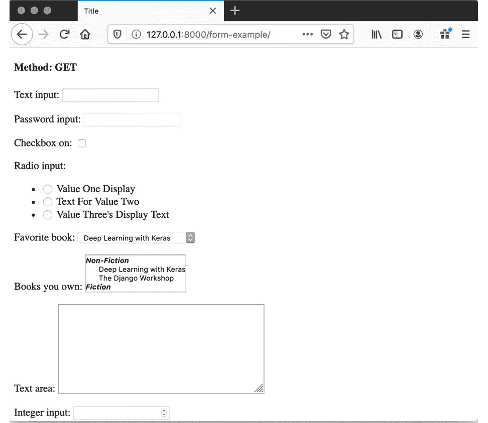

    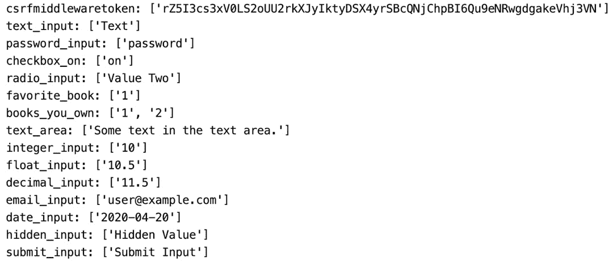

![图 6.25：Django 表单提交的值

你可以看到，值仍然是字符串，名称与 `ExampleForm` 类的属性名称匹配。请注意，你点击的提交按钮也包括在内，以及 CSRF 令牌。你提交的表单可以是 Django 表单字段和任意字段混合；两者都将包含在 `request.POST` `QueryDict` 对象中。

在这个练习中，你创建了一个 Django 表单，包含许多不同类型的表单字段。你将其实例化到视图中的一个变量中，然后传递给 `form-example.html`，在那里它被渲染为 HTML。最后，你提交了表单并查看它提交的值。请注意，我们编写以生成相同表单的代码量大大减少了。我们不必手动编写任何 HTML，现在我们有一个地方既定义了表单的显示方式，也定义了它的验证方式。在下一节中，我们将探讨 Django 表单如何自动验证提交的数据，以及数据如何从字符串转换为 Python 对象。

# 验证表单和检索 Python 值

到目前为止，我们已经看到了 Django 表单如何通过 Python 代码自动渲染来简化定义表单的过程。现在，我们将探讨使 Django 表单有用的另一部分：它们能够自动验证表单，并从中检索原生 Python 对象和值。

在 Django 中，表单可以是*未绑定*或*绑定*的。这些术语描述了表单是否已经接收到用于验证的提交`POST`数据。到目前为止，我们只看到了未绑定的表单——它们是无参数实例化的，如下所示：

```py
form = ExampleForm()
```

如果表单使用一些数据调用以用于验证，例如`POST`数据，则该表单是绑定的。绑定的表单可以创建如下所示：

```py
form = ExampleForm(request.POST)
```

使用绑定形式后，我们可以开始使用内置的验证相关工具：首先，使用`is_valid`方法来检查表单的有效性，然后是表单上的`cleaned_data`属性，它包含从字符串转换为 Python 对象的值。`cleaned_data`属性仅在表单被*清理*后可用，这意味着“清理”数据并将其从字符串转换为 Python 对象的过程。清理过程在`is_valid`调用期间运行。如果你在调用`is_valid`之前尝试访问`cleaned_data`，将会引发`AttributeError`。

下面是一个如何访问`ExampleForm`清理数据的简短示例：

```py
form = ExampleForm(request.POST)
if form.is_valid():
    # cleaned_data is only populated if the form is valid
    if form.cleaned_data["integer_input"] > 5:
        do_something()
```

在这个例子中，`form.cleaned_data["integer_input"]`是整数值`10`，因此它可以与数字*5*进行比较。将此与已发布的值进行比较，该值是字符串`"10"`。清理过程为我们执行此转换。其他字段，如日期或布尔值，也会相应转换。

清理过程还会设置表单和字段上的任何错误，这些错误将在表单再次渲染时显示。让我们看看这一切是如何发生的。现代浏览器提供了大量的客户端验证，因此它们会阻止表单提交，除非其基本验证规则得到满足。如果你在之前的练习中尝试提交带有空字段的表单，你可能已经看到了这一点：

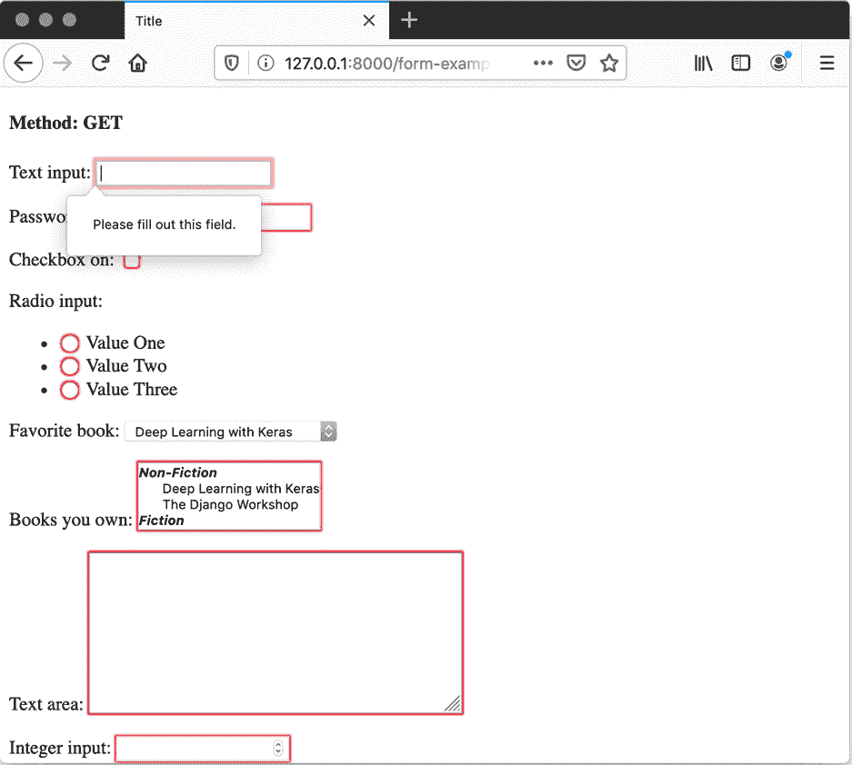

图 6.26：浏览器阻止表单提交

*图 6.26*显示了浏览器阻止表单提交。由于浏览器阻止了提交，Django 从未有机会验证表单本身。为了允许表单提交，我们需要添加一些更高级的验证，浏览器无法自行验证。

我们将在下一节讨论可以应用于表单字段的不同类型的验证，但到目前为止，我们只是将`max_digits`设置为`3`添加到`ExampleForm`的`decimal_input`中。这意味着用户不应在表单中输入超过三个数字。

注意

为什么 Django 需要在浏览器已经进行验证并阻止提交的情况下验证表单？服务器端应用程序永远不应该信任用户的输入：用户可能正在使用较旧的浏览器或另一个 HTTP 客户端来发送请求，因此不会从他们的“浏览器”收到任何错误。此外，正如我们刚才提到的，浏览器不理解某些类型的验证，因此 Django 必须在它的端进行验证。

`ExampleForm`的更新如下：

```py
class ExampleForm(forms.Form):
    …
    decimal_input = forms.DecimalField(max_digits=3)
    …
```

现在视图应该更新为在方法为`POST`时将`request.POST`传递给`Form`类，例如，如下所示：

```py
if request.method == "POST":
    form = ExampleForm(request.POST)
else:
    form = ExampleForm()
```

如果在方法不是`POST`时将`request.POST`传递给表单构造函数，那么表单在首次渲染时将始终包含错误，因为`request.POST`将是空的。现在浏览器将允许我们提交表单，但如果`decimal_input`包含超过三个数字，将会显示错误。


图 6.27：当字段无效时显示的错误

当模板中有错误时，Django 会自动以不同的方式渲染表单。但我们如何使视图根据表单的有效性以不同的方式行为？正如我们之前提到的，我们应该使用表单的`is_valid`方法。使用此检查的视图可能有如下代码：

```py
form = ExampleForm(request.POST)
if form.is_valid():
    # perform operations with data from form.cleaned_data
    return redirect("/success-page")  # redirect to a success page
```

在这个例子中，如果表单有效，我们将重定向到成功页面。否则，假设执行流程继续如前所述，并将无效表单返回给`render`函数以显示给用户带有错误的信息。

注意

为什么我们在成功时返回重定向？有两个原因：首先，提前返回防止执行视图的其余部分（即失败分支）；其次，防止用户在重新加载页面时收到重新发送表单数据的消息。

在下一个练习中，我们将看到表单验证的实际操作，并根据表单的有效性更改视图执行流程。

## 练习 6.04：在视图中验证表单

在这个练习中，我们将更新示例视图，根据 HTTP 方法的不同实例化表单。我们还将更改表单以打印出清理后的数据而不是原始的`POST`数据，但仅当表单有效时：

1.  在 PyCharm 中，打开`form_example`应用目录内的`forms.py`文件。将`max_digits=3`参数添加到`ExampleForm`的`decimal_input`中：

    ```py
    class ExampleForm(forms.Form):
        …
        decimal_input = forms.DecimalField(max_digits=3)
    ```

    一旦添加了这个参数，我们就可以提交表单，因为浏览器不知道如何验证这个规则，但 Django 知道。

1.  打开`reviews`应用的`views.py`文件。我们需要更新`form_example`视图，以便如果请求的方法是`POST`，则使用`POST`数据实例化`ExampleForm`；否则，不带参数实例化。用以下代码替换当前表单初始化：

    ```py
    def form_example(request):
        if request.method == "POST":
            form = ExampleForm(request.POST)
        else:
            form = ExampleForm()
    ```

1.  接下来，对于`POST`请求方法，我们将使用`is_valid`方法检查表单是否有效。如果表单有效，我们将打印出所有清理后的数据。在`ExampleForm`实例化后添加一个条件来检查`form.is_valid()`，然后将调试打印循环移到这个条件内部。您的`POST`分支应如下所示：

    ```py
        if request.method == "POST":
            form = ExampleForm(request.POST)
            if form.is_valid():
                for name in request.POST:
                    print("{}: {}".format\
                                   (name, request.POST.getlist(name)))
    ```

1.  我们不会遍历原始`request.POST` `QueryDict`（其中所有数据都是`string`实例），而是遍历`form`的`cleaned_data`。这是一个正常的字典，包含转换为 Python 对象的值。用以下两个替换`for`行和`print`行：

    ```py
                for name, value in form.cleaned_data.items():
                    print("{}: ({}) {}".format\
                                        (name, type(value), value))
    ```

    我们不再需要使用`getlist()`，因为`cleaned_data`已经将多值字段转换为`list`实例。

1.  启动 Django 开发服务器，如果它尚未运行。切换到您的浏览器，浏览到`http://127.0.0.1:8000/form-example/`的示例表单页面。表单应与之前一样。填写所有字段，但请确保在`Decimal 输入`字段中输入四个或更多数字以使表单无效。提交表单，当页面刷新时，您应该看到`Decimal 输入`的错误消息：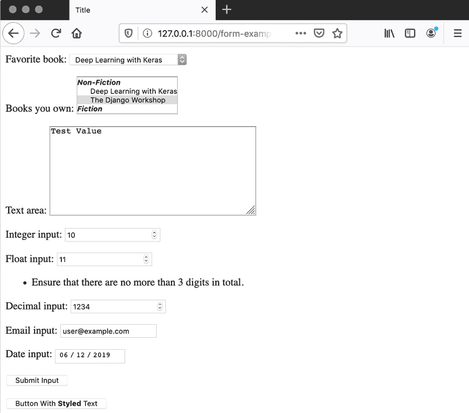

    图 6.28：表单提交后显示的十进制输入错误

1.  通过确保`Decimal 输入`字段中只有三位数字来修复表单错误，然后再次提交表单。切换回 PyCharm 并检查调试控制台。您应该看到所有清理后的数据都已打印出来：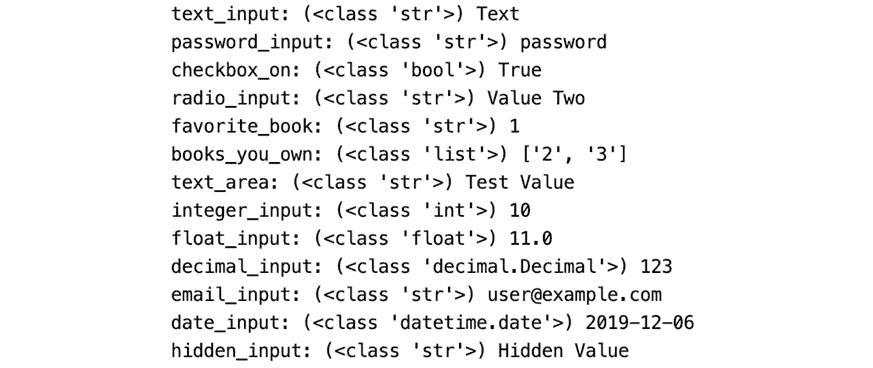

图 6.29：表单的清理数据打印输出

注意已经发生的转换。`CharField`实例已转换为`str`，`BooleanField`转换为`bool`，`IntegerField`、`FloatField`和`DecimalField`分别转换为`int`、`float`和`Decimal`。`DateField`变为`datetime.date`，而选择字段保留其初始选择值的字符串值。注意`books_you_own`已自动转换为`str`实例的列表。

此外，请注意，与我们在遍历所有`POST`数据不同，`cleaned_data`只包含表单字段。其他数据（如 CSRF 令牌和点击的提交按钮）存在于`POST` `QueryDict`中，但因为它不包含表单字段，所以不包括在内。

在这个练习中，你更新了 `ExampleForm`，使得浏览器允许提交，尽管 Django 会认为它是无效的。这允许 Django 对表单进行验证。然后你更新了 `form_example` 视图，根据 HTTP 方法实例化 `ExampleForm` 类；对于 `POST` 请求，传递请求的 `POST` 数据。视图还更新了其调试输出代码，以 `print` 出 `cleaned_data` 字典。最后，你测试了提交有效和无效的表单数据，以查看不同的执行路径和表单生成的数据类型。我们看到 Django 会自动将 `POST` 数据从字符串转换为基于字段类的 Python 类型。

接下来，我们将探讨如何向字段添加更多验证选项，这将使我们能够更严格地控制可以输入的值。

## 内置字段验证

我们尚未讨论可用于字段的常规验证参数。尽管我们已经提到了 `required` 参数（默认为 `True`），但还可以使用许多其他参数来更严格地控制输入字段的数值。以下是一些有用的参数：

+   `max_length`

    设置可以输入到字段中的最大字符数；在 `CharField`（以及 `FileField`，我们将在 *第八章*，*媒体服务和文件上传* 中介绍）中可用。

+   `min_length`

    设置必须输入到字段中的最小字符数；在 `CharField`（以及 `FileField`；关于这一点，我们将在 *第八章*，*媒体服务和文件上传* 中详细说明）中可用。

+   `max_value`

    设置可以输入到数值字段的最高值；在 `IntegerField`、`FloatField` 和 `DecimalField` 中可用。

+   `min_value`

    设置可以输入到数值字段的最小值；在 `IntegerField`、`FloatField` 和 `DecimalField` 中可用。

+   `max_digits`

    这设置了可以输入的最大数字位数；这包括小数点前后的数字（如果有的话）。例如，数字 *12.34* 有四个数字，而数字 *56.7* 有三个。在 `DecimalField` 中使用。

+   `decimal_places`

    这设置了小数点后可以输入的最大数字位数。这通常与 `max_digits` 一起使用，并且小数位数始终计入数字总数，即使小数位数没有输入到小数点之后。例如，假设使用 `max_digits` 为四和 `decimal_places` 为三：如果输入的数字是 *12.34*，它实际上会被解释为值 *12.340*；也就是说，会添加零，直到小数点后的数字位数等于 `decimal_places` 设置。由于我们将 `decimal_places` 设置为三，所以总数字位数最终是五，超过了 `max_digits` 设置的四。数字 *1.2* 是有效的，因为即使扩展到 *1.200*，总数字位数也只有四。

您可以混合和匹配验证规则（前提是字段支持它们）。`CharField` 可以有 `max_length` 和 `min_length`，数值字段可以同时有 `min_value` 和 `max_value`，等等。

如果您需要更多的验证选项，您可以编写自定义验证器，我们将在下一节中介绍。现在，我们将向我们的 `ExampleForm` 添加一些验证器，以便看到它们的作用。

## 练习 6.05：添加额外字段验证

在这个练习中，我们将添加和修改 `ExampleForm` 字段的验证规则。然后我们将看到这些更改如何影响表单的行为，无论是在浏览器中还是在 Django 验证表单时：

1.  在 PyCharm 中，打开 `form_example` 应用程序目录内的 `forms.py` 文件。

1.  我们将使 `text_input` 至多需要三个字符。将 `max_length=3` 参数添加到 `CharField` 构造函数中：

    ```py
    text_input = forms.CharField(max_length=3)
    ```

1.  通过要求至少八个字符来提高 `password_input` 的安全性。将 `min_length=8` 参数添加到 `CharField` 构造函数中：

    ```py
    password_input = forms.CharField(min_length=8, \
                                     widget=forms.PasswordInput)
    ```

1.  用户可能没有任何书籍，因此 `books_you_own` 字段不应是必需的。将 `required=False` 参数添加到 `MultipleChoiceField` 构造函数中：

    ```py
    books_you_own = forms.MultipleChoiceField\
                    (required=False, choices=BOOK_CHOICES)
    ```

1.  用户应在 `integer_input` 中只能输入介于 1 和 10 之间的值。将 `min_value=1` 和 `max_value=10` 参数添加到 `IntegerField` 构造函数中：

    ```py
    integer_input = forms.IntegerField\
                    (min_value=1, max_value=10)
    ```

1.  最后，将 `max_digits=5` 和 `decimal_places=3` 添加到 `DecimalField` 构造函数中：

    ```py
    decimal_input = forms.DecimalField\
                    (max_digits=5, decimal_places=3)
    ```

    保存文件。

1.  如果 Django 开发服务器尚未运行，请启动它。为了获取这些新的验证规则，我们不需要对其他任何文件进行任何更改，因为 Django 会自动更新 HTML 生成和验证逻辑。这是使用 Django 表单获得的一个巨大好处。只需在您的浏览器中访问或刷新 `http://127.0.0.1:8000/form-example/`，新的验证规则将自动添加。除非您尝试使用错误的值提交表单，否则表单看起来不会有任何不同。以下是一些可以尝试的事情：

    在 `Text 输入` 字段中输入超过三个字符；您将无法做到。

    在 `Password` 字段中输入少于八个字符，然后点击离开它。浏览器应该显示一个错误，表明这不是有效的。

    不要为 `Books you own` 字段选择任何值。这不会阻止您提交表单。

    在 `Integer 输入` 上使用步进按钮。您只能输入介于 `1` 和 `10` 之间的值。如果您输入这个范围之外的值，您的浏览器应该会显示一个错误。

    `Decimal 输入` 是唯一一个在浏览器中不验证 Django 规则的字段。您需要输入一个无效的值（例如 `123.456`）并提交表单，然后才会显示错误（由 Django 生成）。

    下图显示了浏览器可以自行验证的一些字段：

    

图 6.30：浏览器使用新规则进行验证

*图 6.31* 展示了一个只能由 Django 生成错误的错误，因为浏览器不理解 `DecimalField` 验证规则：

![图 6.31：浏览器认为表单有效，但 Django 不认为有效]

](img/B15509_06_31.jpg)

图 6.31：浏览器认为表单有效，但 Django 不认为有效

在这个练习中，我们在表单字段上实现了一些基本的验证规则。然后我们在浏览器中加载了表单示例页面，而无需对我们的模板或视图进行任何更改。我们尝试用不同的值提交表单，以查看浏览器如何与 Django 验证表单。

在本章的活动里，我们将使用 Django 表单来实现图书搜索视图。

## 活动 6.01：图书搜索

在这个活动中，你将完成在 *第一章*，*Django 简介* 中开始的图书搜索视图。你将构建一个 `SearchForm` 实例，该实例从 `request.GET` 中提交并接受一个搜索字符串。它将有一个 `select` 字段来选择搜索 `title` 或 `contributor`。然后它将在 `Book` 实例中搜索包含给定文本的 `title` 或 `Contributor` 的 `first_names` 或 `last_names`。然后你将在 `search-results.html` 模板中渲染这本书的列表。搜索词不应该为必填项，但如果存在，它的长度应为三个或更短字符。由于视图将在使用 `GET` 方法时进行搜索，因此表单将始终进行验证检查。如果我们使字段为必填项，那么每次页面加载时都会显示错误。

将有两种执行搜索的方法。第一种是通过提交位于 `base.html` 模板中（因此位于每个页面的右上角）的搜索表单。这将仅通过 `Book` 标题进行搜索。另一种方法是通过提交在 `search-results.html` 页面上渲染的 `SearchForm` 实例。这个表单将显示用于在 `title` 或 `contributor` 之间进行选择的 `ChoiceField` 实例。

这些步骤将帮助你完成这个活动：

1.  在你的 `forms.py` 文件中创建一个 `SearchForm` 实例。

1.  `SearchForm` 应该有两个字段。第一个是一个名为 `search` 的 `CharField` 实例。这个字段不应该为必填项，但应该有最小长度为 `3`。

1.  `SearchForm` 的第二个字段是一个名为 `search_in` 的 `ChoiceField` 实例。这将允许在 `title` 和 `contributor`（分别带有 `Title` 和 `Contributor` 标签）之间进行选择。它不应该为必填项。

1.  更新 `book_search` 视图，使用 `request.GET` 中的数据实例化一个 `SearchForm`。

1.  添加代码以使用`title__icontains`（用于不区分大小写的搜索）搜索`Book`模型。如果按`title`搜索，则应执行此操作。只有在表单有效且包含一些搜索文本时才应执行搜索。`search_in`值应使用`get`方法从`cleaned_data`中检索，因为它可能不存在，因为它不是必需的。将其默认值设置为`title`。

1.  在搜索贡献者时，使用`first_names__icontains`或`last_names__icontains`，然后遍历贡献者并检索每个贡献者的书籍。如果按`contributor`搜索，则应执行此操作。只有在表单有效且包含一些搜索文本时才应执行搜索。有许多方法可以组合一个或最后一个名字的搜索结果。最简单的方法是使用你迄今为止介绍的技术执行两个查询，一个用于匹配第一个名字，然后是最后一个名字，并分别迭代它们。

1.  更新`render`调用以包含`form`变量和上下文中检索到的书籍（以及已传递的`search_text`）。模板的位置在*第三章*，*URL 映射、视图和模板*中已更改，因此相应地更新`render`的第二个参数。

1.  我们在*第一章*，*Django 简介*中创建的`search-results.html`模板现在基本上是多余的，因此您可以清除其内容。更新`search-results.html`文件以从`base.html`扩展，而不是作为一个独立的模板文件。

1.  添加一个`title`块，如果表单有效并且设置了`search_text`，则显示`Search Results for <search_text>`，否则仅显示`Book Search`。此块将在本活动的后续部分添加到`base.html`中。

1.  添加一个`content`块，该块应显示一个带有文本`Search for Books`的`<h2>`标题。在`<h2>`标题下渲染表单。`<form>`元素可以没有属性，并且默认将其设置为向同一 URL 发出`GET`请求。添加一个我们之前活动中使用的带有`btn btn-primary`类的提交按钮。

1.  在表单下方，如果表单有效并且输入了搜索文本，则显示`Search results for <search_text>`消息，否则不显示消息。这应在`<h3>`标题中显示，并且搜索文本应被包裹在`<em>`标签中。

1.  遍历搜索结果并渲染每个结果。显示书籍标题和贡献者的第一个和最后一个名字。书籍标题应链接到`book_detail`页面。如果书籍列表为空，则显示文本`No results found`。你应该将结果包裹在具有`class` `list-group`的`<ul>`中，并且每个结果应是一个具有`class` `list-group-item`的`<li>`实例。这将与`book_list`页面类似；然而，我们不会显示太多信息（只是标题和贡献者）。

1.  将`base.html`更新以包含一个动作属性在搜索`<form>`标签中。使用`url`模板标签来生成此属性的 URL。

1.  将搜索字段的`name`属性设置为`search`，并将`value`属性设置为输入的搜索文本。同时，确保字段的最小长度为`3`。

1.  在`base.html`中，向被其他模板覆盖的`title`标签添加一个`title`块（如*步骤 9*所示）。在`<title>` HTML 元素内添加一个`block`模板标签。它应该包含内容`Bookr`。

完成此活动后，你应该能够打开`http://127.0.0.1:8000/book-search/`上的图书搜索页面，它将看起来像*图 6.32*：

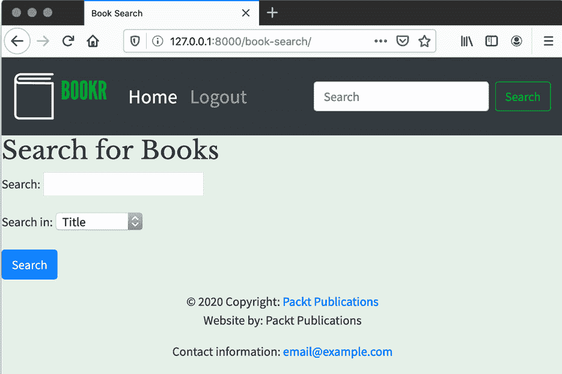

图 6.32：无搜索的图书搜索页面

当仅使用两个字符进行搜索时，你的浏览器应该阻止你提交任一搜索字段。如果你搜索的内容没有结果，你将看到一个消息，表明没有找到结果。通过标题（这可以通过任一字段完成）搜索将显示匹配的结果。

类似地，当通过贡献者进行搜索（尽管这只能在下表单中完成）时，你应该看到以下类似的内容：


图 6.33：贡献者搜索

注意

此活动的解决方案可以在[`packt.live/2Nh1NTJ`](http://packt.live/2Nh1NTJ)找到。

# 摘要

本章是 Django 表单的介绍。我们介绍了一些 HTML 输入，用于在网页上输入数据。我们讨论了数据如何提交到 Web 应用程序，以及在何时使用`GET`和`POST`请求。然后我们探讨了 Django 表单类如何简化生成表单 HTML 的过程，以及如何使用模型自动构建表单。我们还通过构建图书搜索功能增强了 Bookr。

在下一章中，我们将更深入地探讨表单，学习如何自定义表单字段的显示，如何添加更高级的验证到你的表单，以及如何使用`ModelForm`类自动保存模型实例。
