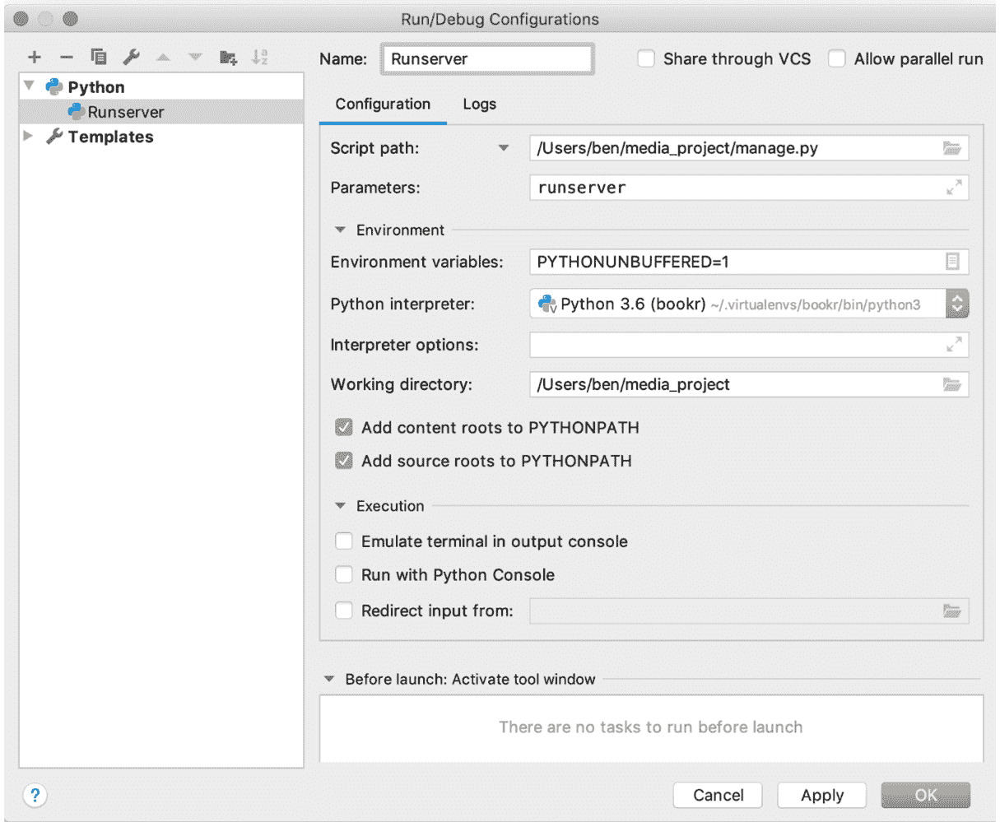

# 第八章：8. 媒体服务和文件上传

概述

本章首先向您介绍媒体文件，然后教您如何设置 Django 以服务它们。一旦您理解了这一点，您将学习如何使用 HTML 构建一个表单，该表单可以将文件上传到一个视图以存储到磁盘。为了增强这个过程并减少代码量，您将使用 Django 表单来生成和验证表单，并学习如何通过它处理文件上传。然后，您将查看 Django 为处理图像文件提供的特定增强功能，并使用`FileField`和`ImageField`分别存储文件和图像，并通过 Django 表单上传它们。在此之后，您将自动从模型构建一个`ModelForm`实例，并仅用一行代码保存模型和文件。在本章结束时，您将通过向`Book`模型添加封面图像和书籍摘录来增强 Bookr 应用。

# 简介

媒体文件是指在部署后可以添加的额外文件，用于丰富您的 Django 应用。通常，它们是您在网站上使用的额外图像，但任何类型的文件（包括视频、音频、PDF、文本、文档，甚至是 HTML）都可以作为媒体提供服务。

您可以将它们视为介于动态数据和静态资产之间。它们不是 Django 在动态生成时产生的动态数据，例如在渲染模板时。它们也不是网站开发者在网站部署时包含的静态文件。相反，它们是可以由用户上传或由您的应用程序生成以供以后检索的额外文件。

媒体文件的常见示例（您将在本章后面的*活动 8.01*、*书籍图像和 PDF 上传*中看到）包括书籍封面和可以附加到`Book`对象的预览 PDF。您还可以使用媒体文件允许用户上传博客文章的图像或社交媒体网站的头像。如果您想使用 Django 构建自己的视频分享平台，您将存储上传的视频作为媒体。如果所有这些文件都是静态文件，您的网站将无法很好地运行，因为用户将无法上传自己的书籍封面、视频等，并将陷入您部署的状态。

# 媒体上传和服务的设置

在*第五章*，*服务静态文件*中，我们探讨了如何使用 Django 来服务静态文件。服务媒体文件相当类似。必须在`settings.py`中配置两个设置：`MEDIA_ROOT`和`MEDIA_URL`。这些与用于服务静态文件的`STATIC_ROOT`和`STATIC_URL`类似。

+   `MEDIA_ROOT`

    这是磁盘上存储媒体（如上传的文件）的路径。与静态文件一样，您的 Web 服务器应该配置为直接从这个目录提供服务，以减轻 Django 的负担。

+   `MEDIA_URL`

    这与`STATIC_URL`类似，但正如您可能猜到的，这是应该用于服务媒体的 URL。它必须以`/`结尾。通常，您将使用类似`/media/`的东西。

    注意

    由于安全原因，`MEDIA_ROOT` 的路径必须与 `STATIC_ROOT` 的路径不同，并且 `MEDIA_URL` 必须与 `STATIC_URL` 不同。如果它们相同，用户可能会用恶意代码替换你的静态文件（如 JavaScript 或 CSS 文件），并利用你的用户。

`MEDIA_URL` 设计用于在模板中使用，这样你就不需要硬编码 URL，并且可以轻松更改。例如，你可能希望将其设置为特定主机或在下文中的模板中的 `MEDIA_URL`。

## 开发中服务媒体文件

就像静态文件一样，在生产环境中服务媒体时，你的 Web 服务器应该配置为直接从 `MEDIA_ROOT` 目录服务，以防止 Django 被绑定在服务请求上。Django 开发服务器可以在开发中服务媒体文件。然而，与静态文件不同，媒体文件的 URL 映射和视图不是自动设置的。

Django 提供了 `static` URL 映射，可以添加到现有的 URL 映射中，以服务媒体文件。它像这样添加到你的 `urls.py` 文件中：

```py
from django.conf import settings
from django.conf.urls.static import static
urlpatterns = [
    # your existing URL maps
] 
if settings.DEBUG:
    urlpatterns += static(settings.MEDIA_URL,\
                          document_root=settings.MEDIA_ROOT)
```

这会将 `settings.py` 中定义的 `MEDIA_ROOT` 设置服务到那里也定义的 `MEDIA_URL` 设置。我们在添加映射之前检查 `settings.DEBUG` 的原因是为了确保在生产环境中不添加此映射。

例如，如果你的 `MEDIA_ROOT` 设置为 `/var/www/bookr/media`，而你的 `MEDIA_URL` 设置为 `/media/`，那么 `/var/www/bookr/media/image.jpg` 文件将在 `http://127.0.0.1:8000/media/image.jpg` 处可用。

当 Django 的 `DEBUG` 设置为 `False` 时，`static` URL 映射不起作用，因此不能在生产环境中使用。然而，如前所述，在生产环境中，你的 Web 服务器应该服务这些请求，因此 Django 不需要处理它们。

在第一个练习中，你将在 `settings.py` 文件中创建并添加一个新的 `MEDIA_ROOT` 和 `MEDIA_URL`。然后，你将添加 `static` 媒体服务 URL 映射，并添加一个测试文件以确保媒体服务配置正确。

## 练习 8.01：配置媒体存储和服务媒体文件

在这个练习中，你将设置一个新的 Django 项目作为本章中使用的示例项目。然后，你将配置它以能够服务媒体文件。你将通过创建一个 `media` 目录并添加 `MEDIA_ROOT` 和 `MEDIA_URL` 设置来实现这一点。然后，你将为 `MEDIA_URL` 设置 URL 映射。

为了检查一切配置正确并且正确服务，你将在 `media` 目录中放置一个测试文件：

1.  就像之前你设置的 Django 项目一样，你可以重用现有的 `bookr` 虚拟环境。在终端中激活 `bookr` 虚拟环境。然后，使用 `django-admin.py` 启动一个名为 `media_project` 的新项目：

    ```py
    django-admin.py startproject media_project
    ```

    切换（或 `cd`）到创建的 `media_project` 目录，然后使用 `startapp` 管理命令启动一个名为 `media_example` 的应用：

    ```py
    python3 manage.py startapp media_example
    ```

1.  在 PyCharm 中打开`media_project`目录。以与其他你打开的 Django 项目相同的方式设置`runserver`命令的运行配置：

    图 8.1：Runserver 配置

    *图 8.1*显示了 PyCharm 中项目的`runserver`配置。

1.  在`media_project`项目目录内创建一个名为`media`的新目录。然后，在这个目录中创建一个名为`test.txt`的新文件。这个目录结构将看起来像*图 8.2*：

    图 8.2：媒体目录和 test.txt 布局

1.  `test.txt`也会自动打开。将文本`Hello, world!`输入其中，然后你可以保存并关闭文件。

1.  在`media_project`包目录内打开`settings.py`。在文件末尾添加一个`MEDIA_ROOT`的设置，使用你刚刚创建的媒体目录的路径。确保在文件顶部导入`os`模块：

    ```py
    import os
    ```

    然后使用`os.path.join`函数将其与`BASE_DIR`连接：

    ```py
    MEDIA_ROOT = os.path.join(BASE_DIR, 'media')
    ```

1.  在*步骤 5*中添加的行下面，为`MEDIA_URL`添加另一个设置。这应该只是`'/media/'`：

    ```py
    MEDIA_URL = '/media/'
    ```

    然后，保存`settings.py`。它应该看起来像这样：

    ```py
    STATIC_URL = '/static/'
    MEDIA_ROOT = os.path.join(BASE_DIR, 'media')
    settings.py should look like this: http://packt.live/34RdhU1.
    ```

1.  打开`media_project`包的`urls.py`文件。在`urlpatterns`定义之后，添加以下代码以在`DEBUG`模式下运行时添加媒体服务 URL。首先，您需要通过在`urlpatterns`定义上方添加突出显示的导入行来导入 Django 设置和静态服务视图：

    ```py
    from django.contrib import admin
    from django.urls import path
    from django.conf import settings
    from django.conf.urls.static import static
    urlpatterns = [path('admin/', admin.site.urls),]
    ```

1.  然后，在你的`urlpatterns`定义之后（参考上一步中的代码块）添加以下代码，以有条件地添加从`MEDIA_URL`到`static`视图的映射，它将从`MEDIA_ROOT`提供服务：

    ```py
    if settings.DEBUG:
        urlpatterns += static(settings.MEDIA_URL,\
                              document_root=settings.MEDIA_ROOT)
    ```

    你现在可以保存这个文件了。它应该看起来像这样：[`packt.live/3nVUiPn`](http://packt.live/3nVUiPn)。

1.  如果 Django 开发服务器尚未运行，请启动它，然后访问`http://127.0.0.1:8000/media/test.txt`。如果你一切都做对了，那么你应该在你的浏览器中看到文本`Hello, world!`：

图 8.3：服务媒体文件

如果你的浏览器看起来像*图 8.3*，这意味着媒体文件正在从`MEDIA_ROOT`目录提供服务。我们创建的`test.txt`文件只是为了测试，但我们将它在*练习 8.02*，*模板设置和使用 MEDIA_URL 在模板中*中使用，所以现在不要删除它。

在这个练习中，我们配置了 Django 来服务媒体文件。我们只服务了一个测试文件以确保一切按预期工作，并且确实如此。我们现在将看看我们如何在模板中自动生成媒体 URL。

# 上下文处理器和在模板中使用 MEDIA_URL

要在模板中使用`MEDIA_URL`，我们可以在视图中通过渲染上下文字典传递它。例如：

```py
from django.conf import settings
def my_view(request):
    return render(request, "template.html",\
                  {"MEDIA_URL": settings.MEDIA_URL,\
                   "username": "admin"})
```

这将有效，但问题是`MEDIA_URL`是一个我们可能在许多地方想要使用的通用变量，因此我们几乎必须在每个视图中传递它。

相反，我们可以使用`render`调用。

上下文处理器是一个接受一个参数的函数，即当前请求。它返回一个包含上下文信息的字典，该字典将与传递给`render`调用的字典合并。

我们可以查看`media`上下文处理器的源代码，它说明了它们是如何工作的：

```py
def media(request):
    """
    Add media-related context variables to the context.
    """
    return {'MEDIA_URL': settings.MEDIA_URL}
```

启用媒体上下文处理器后，`MEDIA_URL`将被添加到我们的上下文字典中。我们可以将之前看到的`render`调用更改为以下内容：

```py
return render(request, "template.html", {"username": "admin"})
```

同样的数据将被发送到模板，因为上下文处理器会添加`MEDIA_URL`。

`media`上下文处理器的完整模块路径是`django.template.context_processors.media`。Django 提供的其他上下文处理器的示例包括：

+   `django.template.context_processors.debug`

    这返回字典 `{"DEBUG": settings.DEBUG}`。

+   `django.template.context_processors.request`

    这将返回字典 `{"request": request}`，也就是说，它只是将当前的 HTTP 请求添加到上下文中。

要启用上下文处理器，必须将其模块路径添加到`TEMPLATES`设置的`context_processors`选项中。例如，要启用媒体上下文处理器，请添加`django.template.context_processors.media`。我们将在*练习 8.02*，*模板设置和使用 MEDIA_URL 在模板中*中详细说明如何做到这一点。

一旦启用`media`上下文处理器，`MEDIA_URL`变量就可以像普通变量一样在模板中访问：

```py
{{ MEDIA_URL }}
```

例如，您可以使用它来获取图像：

```py

```

注意，与静态文件不同，没有用于加载媒体文件的模板标签（也就是说，没有``模板标签的等效物）。

也可以编写自定义上下文处理器。例如，回顾我们一直在构建的 Bookr 应用，我们可能希望在每一页的侧边栏中显示最新的五条评论列表。这样的上下文处理器将执行以下操作：

```py
from reviews.models import Review
def latest_reviews(request):
    return {"latest_reviews": \
             Review.objects.order_by('-date_created')[:5]}.
```

这将在 Bookr 项目目录下的名为`context_processors.py`的文件中保存，然后在`context_processors`设置中通过其模块路径`context_processors.latest_reviews`进行引用。或者我们也可以将其保存在`reviews`应用中，并作为`reviews.context_processors.latest_reviews`进行引用。是否将上下文处理器视为项目级或应用级取决于您。然而，请注意，无论其存储位置如何，一旦激活，它将应用于所有应用的`render`调用。

上下文处理器可以返回包含多个项的字典，甚至可以是零项。如果它有条件，只有当满足某些标准时才添加项，例如，只有当用户登录时才显示最新的评论。让我们在下一项练习中详细探讨这一点。

## 练习 8.02：模板设置和使用模板中的 MEDIA_URL

在这个练习中，你将继续使用`media_project`并配置 Django 以自动将`MEDIA_URL`设置添加到每个模板中。你通过将`django.template.context_processors.media`添加到`TEMPLATES`的`context_processors`设置来实现这一点。然后，你将添加一个使用这个新变量的模板和一个示例视图来渲染它。你将在本章的练习中修改视图和模板：

1.  在 PyCharm 中打开`settings.py`。首先，你需要将`media_example`添加到`INSTALLED_APPS`设置中，因为项目设置时没有完成：

    ```py
    INSTALLED_APPS = [# other apps truncated for brevity\
        'media_example']
    ```

1.  在文件大约一半的位置，你会找到`TEMPLATES`设置，它是一个字典。在这个字典中是`OPTIONS`项（另一个字典）。在`OPTIONS`中是`context_processors`设置。

    将以下内容添加到列表末尾：

    ```py
    'django.template.context_processors.media'
    ```

    完整的列表应该看起来像这样：

    ```py
    TEMPLATES = \
    [{'BACKEND': 'django.template.backends.django.DjangoTemplates',
      'DIRS': [],
      'APP_DIRS': True,
      'OPTIONS': {'context_processors': \
                  ['django.template.context_processors.debug',\
                   'django.template.context_processors.request',\
                   'django.contrib.auth.context_processors.auth',\
                   'django.contrib.messages.context_processors.messages',\
                   'django.template.context_processors.media'\
                ],\
            },\
        },\
    ]
    ```

    完整的文件应该看起来像这样：[`packt.live/3nVOpSx`](http://packt.live/3nVOpSx)。

1.  打开`media_example`应用的`views.py`并创建一个名为`media_example`的新视图。目前，它只需渲染一个名为`media-example.html`的模板（你将在*步骤 5*中创建它）。视图函数的整个代码如下：

    ```py
    def media_example(request):
        return render(request, "media-example.html")
    ```

    保存`views.py`。它应该看起来像这样：[`packt.live/3pvEGCB`](http://packt.live/3pvEGCB)。

1.  你需要一个指向`media_example`视图的 URL 映射。打开`media_project`包的`urls.py`文件。

    首先，使用文件中的其他导入导入`media_example.views`：

    ```py
    import media_example.views
    ```

    然后在`urlpatterns`中添加一个`path`，将`media-example/`映射到`media_example`视图：

    ```py
    path('media-example/', media_example.views.media_example)
    ```

    你的完整`urlpatterns`应该像以下代码块所示：

    ```py
    from django.conf.urls.static import static
    import media_example.views
    urlpatterns = [path('admin/', admin.site.urls),\
                   path('media-example/', \
                        media_example.views.media_example)]
    if settings.DEBUG:
        urlpatterns += static(settings.MEDIA_URL,\
                              document_root=settings.MEDIA_ROOT)
    ```

    你可以保存并关闭文件。

1.  在`media_example`应用目录内创建一个`templates`目录。然后，在`media_project`项目的`templates`目录内创建一个新的 HTML 文件。选择`HTML 5 file`并将文件命名为`media-example.html`：

    图 8.4：创建 media-example.html

1.  `media-example.html`文件应该会自动打开。你只需要在文件内添加一个指向你在*练习 8.01*，*配置媒体存储和提供媒体文件*中创建的`test.txt`文件的链接。在`<body>`元素中添加高亮代码：

    ```py
    <body>
        / between MEDIA_URL and the filename – this is because we already added a trailing slash when we defined it in settings.py. You can save the file. The complete file will look like this: http://packt.live/3nYTvgF. 
    ```

1.  如果 Django 开发服务器尚未运行，请启动它，然后访问`http://127.0.0.1:8000/media-example/`。你应该会看到一个简单的页面，就像*图 8.5*所示：

图 8.5：基本的媒体链接页面

如果你点击链接，你将被带到`test.txt`显示页面，并看到你在*练习 8.01*，*配置媒体存储和提供媒体文件*中创建的`Hello, world!`文本（*图 8.3*）。这意味着你已经正确配置了 Django 的`context_processors`设置。

我们已经完成了 `test.txt`，所以你现在可以删除该文件了。我们将在其他练习中使用 `media_example` 视图和模板，所以请保留它们。在下一节中，我们将讨论如何使用网络浏览器上传文件，以及 Django 如何在视图中访问它们。

# 使用 HTML 表单进行文件上传

在 *第六章*，*表单* 中，我们学习了关于 HTML 表单的内容。我们讨论了如何使用 `<form>` 的 `method` 属性进行 `GET` 或 `POST` 请求。尽管我们迄今为止只使用表单提交了文本数据，但也可以使用表单提交一个或多个文件。

在提交文件时，我们必须确保表单上至少有两个属性：`method` 和 `enctype`。你可能还需要其他属性，例如 `action`。支持文件上传的表单可能看起来像这样：

```py
<form method="post" enctype="multipart/form-data">
```

文件上传仅适用于 `POST` 请求。使用 `GET` 请求是不可能的，因为无法通过 URL 发送文件的全部数据。必须设置 `enctype` 属性，以便浏览器知道它应该将表单数据作为多个部分发送，一部分用于表单的文本数据，另一部分用于附加到表单的每个文件。这种编码对用户来说是无缝的；他们不知道浏览器是如何编码表单的，也不需要做任何不同的事情。

要将文件附加到表单，你需要创建一个类型为 `file` 的输入。你可以手动编写 HTML 代码，如下所示：

```py
<input type="file" name="file-upload-name">
```

当输入在浏览器中渲染时，它看起来如下（为空时）：

![图 8.6：空文件输入

![图片 B15509_08_06.jpg]

![图 8.6：空文件输入

按钮的标题可能因你的浏览器而异。

点击 `浏览…` 按钮将显示一个 *文件打开* 对话框：

![图 8.7：macOS 上的文件浏览器

![图片 B15509_08_07.jpg]

![图 8.7：macOS 上的文件浏览器

选择文件后，文件名将显示在字段中：

![图 8.8：已选择 cover.jpg 的文件输入

![图片 B15509_08_08.jpg]

![图 8.8：已选择 cover.jpg 的文件输入

*图 8.8* 显示了一个已选择名为 `cover.jpg` 的文件输入。

## 在视图中处理上传的文件

除了文本数据外，如果表单还包含文件上传，Django 将使用这些文件填充 `request.FILES` 属性。`request.FILES` 是一个类似于字典的对象，它以 `file` 输入的 `name` 属性为键。

在上一节中的表单示例中，文件输入的名称是 `file-upload-name`。因此，文件可以通过 `request.FILES["file-upload-name"]` 在视图中访问。

`request.FILES` 包含的对象是文件类对象（具体来说，是一个 `django.core.files.uploadedfile.UploadedFile` 实例），因此要使用它们，你必须读取它们的数据。例如，要在你的视图中获取上传文件的文件内容，你可以编写：

```py
content = request.FILES["file-upload-name"].read()
```

更常见的操作是将文件内容写入磁盘。当文件上传时，它们被存储在临时位置（如果文件大小小于 2.5 MB，则在内存中，否则在磁盘上的临时文件中）。要将文件数据存储在已知位置，必须读取内容并将其写入磁盘的期望位置。`UploadedFile`实例有一个`chunks`方法，它将一次读取文件数据的一个块，以防止一次性读取整个文件而占用太多内存。

因此，而不是简单地使用`read`和`write`函数，使用`chunks`方法一次只读取文件的小块到内存中：

```py
with open("/path/to/output.jpg", "wb+") as output_file:
    uploaded_file = request.FILES["file-upload-name"]
    for chunk in uploaded_file.chunks():
        output_file.write(chunk)
```

注意，在即将到来的某些示例中，我们将把这个代码称为`save_file_upload`函数。假设函数定义如下：

```py
def save_file_upload(upload, save_path):
    with open(save_path, "wb+") as output_file:
        for chunk in upload.chunks():
            output_file.write(chunk)
```

前面的示例代码可以重构为调用以下函数：

```py
uploaded_file = request.FILES["file-upload-name"]
save_file_upload(uploaded_file, "/path/to/output.jpg")
```

每个`UploadedFile`对象（前一个示例代码片段中的`uploaded_file`变量）还包含有关上传文件的额外元数据，例如文件名、大小和内容类型。你将发现最有用的属性是：

+   `size`：正如其名所示，这是上传文件的字节数。

+   `name`：这指的是上传文件的名称，例如，`image.jpg`、`file.txt`、`document.pdf`等等。这个值是由浏览器发送的。

+   `content_type`：这是上传文件的内容类型（MIME 类型）。例如，`image/jpeg`、`text/plain`、`application/pdf`等等。像`name`一样，这个值是由浏览器发送的。

+   `charset`：这指的是上传文件的字符集或文本编码，对于文本文件。这将是类似`utf8`或`ascii`的东西。同样，这个值也是由浏览器确定并发送的。

这里是一个快速示例，展示如何访问这些属性（例如在视图中）：

```py
upload = request.FILES["file-upload-name"]
size = upload.size
name = upload.name
content_type = upload.content_type
charset = upload.charset
```

### 浏览器发送值的 安全性和信任

正如我们刚才描述的，`UploadedFile`的`name`、`content_type`和`charset`值是由浏览器确定的。这一点很重要，因为恶意用户可能会发送虚假值来代替真实值，以伪装实际上传的文件。Django 不会自动尝试确定上传文件的类型或字符集，因此它依赖于客户端在发送此信息时准确无误。

如果我们手动处理文件上传的保存而没有适当的检查，那么可能会发生如下场景：

1.  网站的用户上传了一个恶意可执行文件`malware.exe`，但发送的内容类型为`image/jpeg`。

1.  我们的代码检查内容类型，并认为它是安全的，因此将`malware.exe`保存到`MEDIA_ROOT`文件。

1.  网站的另一用户下载了他们认为是一本封面图片的文件，但实际上是`malware.exe`可执行文件。他们打开了文件，然后他们的电脑被恶意软件感染。

这种场景已经被简化了——恶意文件可能有一个不那么明显的名字（比如 `cover.jpg.exe`），但总体过程已经被说明了。

你如何选择处理上传的安全性将取决于特定的用例，但对于大多数情况，这些提示将有所帮助：

+   当你将文件保存到磁盘时，生成一个名称而不是使用上传者提供的名称。你应该将文件扩展名替换为你期望的。例如，如果一个文件被命名为 `cover.exe` 但内容类型是 `image/jpeg`，则将文件保存为 `cover.jpg`。你也可以为额外的安全性生成一个完全随机的文件名。

+   检查文件扩展名是否与内容类型匹配。这种方法并不是万无一失的，因为存在如此多的 MIME 类型，如果你处理不常见的文件，你可能不会得到匹配。内置的 `mimetypes` Python 模块可以在这里帮助你。它的 `guess_type` 函数接受一个文件名，并返回一个包含 `mimetype`（内容类型）和 `encoding` 的元组。以下是一个展示其使用的简短片段，在 Python 控制台中：

    ```py
    >>> import mimetypes
    >>> mimetypes.guess_type('file.jpg')
    ('image/jpeg', None)
    >>> mimetypes.guess_type('text.html')
    ('text/html', None)
    >>> mimetypes.guess_type('unknownfile.abc')
    (None, None)
    >>> mimetypes.guess_type('archive.tar.gz')
    ('application/x-tar', 'gzip')
    ```

    如果类型或编码无法猜测，元组的任一元素都可能为 `None`。一旦通过 `import mimetypes` 将其导入到你的文件中，你可以在你的视图函数中使用它：

    ```py
    upload = request.FILES["file-upload-name"]
    mimetype, encoding = mimetypes.guess_type(upload.name)
    if mimetype != upload.content_type:
        raise TypeError("Mimetype doesn't match file extension.")
    ```

    这种方法适用于常见的文件类型，如图像，但如前所述，许多不常见的类型可能会返回 `mimetype` 为 `None`。

+   如果你预计会有图像上传，请使用 `Pillow` 库尝试以图像的形式打开上传的文件。如果它不是一个有效的图像，那么 `Pillow` 将无法打开它。这就是 Django 在使用其 `ImageField` 上传图像时所做的。我们将在 *练习 8.05*，*使用 Django 表单的图像上传* 中展示如何使用这种技术打开和操作图像。

+   你还可以考虑使用 `python-magic` Python 包，该包检查文件的实际内容以尝试确定其类型。它可以通过 `pip` 安装，其 GitHub 项目是 [`github.com/ahupp/python-magic`](https://github.com/ahupp/python-magic)。一旦安装，并通过 `import magic` 导入到你的文件中，你可以在你的视图函数中使用它：

    ```py
    upload = request.FILES["field_name"]
    mimetype = magic.from_buffer(upload.read(2048), mime=True)
    ```

然后，你可以验证 `mimetype` 是否在允许的类型列表中。

这不是一个保护恶意文件上传的所有方法的完整列表。最佳方法将取决于你正在构建的应用程序类型。你可能正在构建一个用于托管任意文件的网站，在这种情况下，你根本不需要进行任何内容检查。

让我们看看我们如何构建一个 HTML 表单和视图，允许上传文件。然后我们将它们存储在 `media` 目录中，并在我们的浏览器中检索下载的文件。

## 练习 8.03：文件上传和下载

在这个练习中，您将向 `media-example.html` 模板添加一个带有文件字段的表单。这将允许您使用浏览器将文件上传到 `media_example` 视图。您还将更新 `media_example` 视图，以便将文件保存到 `MEDIA_ROOT` 目录，以便可供下载。然后，您将通过再次下载文件来测试这一切是否正常工作：

1.  在 PyCharm 中，打开位于 `templates` 文件夹内的 `media-example.html` 模板。在 `<body>` 元素内部，移除在 *练习 8.02* 的 *步骤 6* 中添加的 `<a>` 链接，用 `<form>` 元素（如图所示）替换它。确保打开标签具有 `method="post"` 和 `enctype="multipart/form-data"`：

    ```py
    </head>
    <body>
        <form method="post" enctype="multipart/form-data">
    </form>
    </body>
    ```

1.  在 `<form>` 主体内部插入 `` 模板标签。

1.  在 `` 之后，添加一个 `type="file"` 和 `name="file_upload"` 的 `<input>` 元素：

    ```py
    <input type="file" name="file_upload">
    ```

1.  最后，在关闭 `</form>` 标签之前，添加一个 `type="submit"` 并具有文本内容 `提交` 的 `<button>` 元素：

    ```py
    <button type="submit">Submit</button>
    ```

    您的 HTML 主体现在应该看起来像这样：

    ```py
    <body>
        <form method="post" enctype="multipart/form-data">
            
            <input type="file" name="file_upload">
            <button type="submit">Submit</button>
        </form>
    </body>
    ```

    现在，保存并关闭文件。它应该看起来像这样：[`packt.live/37XJPh3`](http://packt.live/37XJPh3)。

1.  打开 `media_example` 应用程序的 `views.py` 文件。在 `media_example` 视图中，添加代码以将上传的文件保存到 `MEDIA_ROOT` 目录。为此，您需要从设置中访问 `MEDIA_ROOT`，因此请在文件顶部导入 Django 设置：

    ```py
    from django.conf import settings
    ```

    您还需要使用 `os` 模块来构建保存路径，因此也要导入它（同样在文件顶部）：

    ```py
    import os
    ```

1.  只有当请求方法是 `POST` 时，上传的文件才应该被保存。在 `media_example` 视图中，添加一个 `if` 语句来验证 `request.method` 是否为 `POST`：

    ```py
    def media_example(request):
        if request.method == 'POST':
            …
    ```

1.  在之前步骤中添加的 `if` 语句内部，通过将上传的文件名与 `MEDIA_ROOT` 连接来生成输出路径。然后，以 `wb` 模式打开此路径，并使用 `chunks` 方法遍历上传的文件。最后，将每个块写入保存的文件：

    ```py
    def media_example(request):
        if request.method == 'POST':
    request.FILES dictionary, using the key that matches the name given to the file input (in our case, this is file_upload). You can save and close views.py. It should now look like this: [`packt.live/37TwxSr`](http://packt.live/37TwxSr). 
    ```

1.  如果尚未运行，请启动 Django 开发服务器，然后导航到 `http://127.0.0.1:8000/media-example/`。您应该看到文件上传字段和 `提交` 按钮，如图所示：

    


图 8.11：媒体目录中的 cover.jpg

*图 8.11* 展示了 PyCharm 中 `media` 目录内的 `cover.jpg`。

在这个练习中，你添加了一个 `enctype` 设置为 `multipart/form-data` 的 HTML 表单，以便允许文件上传。它包含一个 `file` 输入来选择要上传的文件。然后你添加了保存功能到 `media_example` 视图中，以便将上传的文件保存到磁盘上。

在下一节中，我们将探讨如何使用 Django 表单简化表单生成并添加验证。

## 使用 Django 表单进行文件上传

在 *第六章*，*表单* 中，我们看到了 Django 如何使定义表单并自动将其渲染为 HTML 变得容易。在上一个示例中，我们手动定义了表单并编写了 HTML。我们可以用 Django 表单来替换它，并使用 `FileField` 构造函数实现文件输入。

下面是如何在表单上定义 `FileField`：

```py
from django import forms
class ExampleForm(forms.Form):
    file_upload = forms.FileField()
```

`FileField` 构造函数可以接受以下关键字参数：

+   `required`：对于必填字段，应为 `True`；如果字段是可选的，则为 `False`。

+   `max_length`：这指的是上传文件文件名的最大长度。

+   `allow_empty_file`：具有此参数的字段即使上传的文件为空（大小为 `0`）也是有效的。

除了这三个关键字参数之外，构造函数还可以接受标准的 `Field` 参数，例如 `widget`。`FileField` 的默认小部件类是 `ClearableFileInput`。这是一个可以显示复选框的文件输入，可以选中以发送空值并清除模型字段上保存的文件。

在视图中使用带有 `FileField` 的表单与其他表单类似，但当表单已提交（即 `request.METHOD` 是 `POST`）时，则应将 `request.FILES` 也传递给表单构造函数。这是因为 Django 需要访问 `request.FILES` 来在验证表单时查找有关上传文件的信息。

因此，在 `view` 函数中的基本流程如下：

```py
def view(request):
    if request.method == "POST":
        # instantiate the form with POST data and files
        form = ExampleForm(request.POST, request.FILES)
        if form.is_valid():
            # process the form and save files
            return redirect("success-url")
    else:
        # instantiate an empty form as we've seen before
        form = ExampleForm()
    # render a template, the same as for other forms
    return render(request, "template.html", {"form": form})
```

当处理上传文件和表单时，你可以通过通过 `request.FILES` 或通过 `form.cleaned_data` 访问它们来与上传文件进行交互：返回的值将指向同一个对象。在我们的上述示例中，我们可以这样处理上传的文件：

```py
if form.is_valid():
    save_file_upload("/path/to/save.jpg", \
                     request.FILES["file_upload"])
    return redirect("/success-url/")
```

或者，由于它们包含相同的对象，你可以使用 `form.cleaned_data`：

```py
if form.is_valid():
    save_file_upload("/path/to/save.jpg", \
                     form.cleaned_data["file_upload"])
    return redirect("/success-url/")
```

保存的数据将保持不变。

注意

在 *第六章*，*表单* 中，你尝试了表单和提交无效值。当页面刷新以显示表单错误时，你之前输入的数据会在页面重新加载时被填充。对于文件字段来说，这种情况不会发生；相反，如果表单无效，用户将不得不再次导航并选择文件。

在下一个练习中，我们将通过构建一个示例表单，然后修改我们的视图，仅在表单有效时保存文件，来将我们之前看到的 `FileFields` 应用到实践中。

## 练习 8.04：使用 Django 表单上传文件

在之前的练习中，你创建了一个 HTML 表单，并使用它将文件上传到 Django 视图。如果你尝试提交没有选择文件的表单，你会得到一个 Django 异常屏幕。你没有对表单进行任何验证，所以这种方法相当脆弱。

在这个练习中，你将创建一个带有 `FileField` 的 Django 表单，这将允许你使用表单验证函数使视图更加健壮，同时减少代码量：

1.  在 PyCharm 中，在 `media_example` 应用程序内部，创建一个名为 `forms.py` 的新文件。它将自动打开。在文件开头，导入 Django 的 `forms` 库：

    ```py
    from django import forms
    ```

    然后，创建一个 `forms.Form` 子类，并将其命名为 `UploadForm`。向其中添加一个字段，一个名为 `file_upload` 的 `FileField`。你的类应该有如下代码：

    ```py
    class UploadForm(forms.Form):
        file_upload = forms.FileField()
    ```

    你可以保存并关闭此文件。完整的文件应如下所示：[`packt.live/34S5hBV`](http://packt.live/34S5hBV)。

1.  打开 `form_example` 应用的 `views.py` 文件。在文件的开头，现有 `import` 语句的下方，你需要导入你的新类，如下所示：

    ```py
    from .forms import UploadForm
    ```

1.  如果你处于视图的 `POST` 分支，`UploadForm` 需要使用 `request.POST` 和 `request.FILES` 两个参数进行实例化。如果你没有传入 `request.FILES`，那么 `form` 实例将无法访问上传的文件。在 `if request.method == "POST"` 检查下，使用这两个参数实例化 `UploadForm`：

    ```py
    form = UploadForm(request.POST, request.FILES)
    ```

1.  定义 `save_path` 和存储文件内容的现有行可以保留，但它们应该缩进一个块，并放在表单有效性检查内部，这样它们只有在表单有效时才会执行。添加 `if form.is_valid():` 行，然后缩进其他行，使代码看起来像这样：

    ```py
    if form.is_valid():
        save_path = os.path.join\
                    (settings.MEDIA_ROOT, \
                     request.FILES["file_upload"].name)
        with open(save_path, "wb") as output_file:
            for chunk in request.FILES["file_upload"].chunks():
                output_file.write(chunk)
    ```

1.  由于你现在正在使用表单，你可以通过表单访问文件上传。将 `request.FILES["file_upload"]` 的使用替换为 `form.cleaned_data["file_upload"]`：

    ```py
    if form.is_valid():
        save_path = os.path.join\
                    (settings.MEDIA_ROOT,\
                     form.cleaned_data["file_upload"].name)
        with open(save_path, "wb") as output_file:
            for chunk in form.cleaned_data["file_upload"].chunks():
                output_file.write(chunk)
    ```

1.  最后，添加一个 `else` 分支来处理非 `POST` 请求，它只是实例化一个不带任何参数的表单：

    ```py
    if request.method == 'POST':
        …
    else:
        form = UploadForm()
    ```

1.  将上下文字典参数添加到 `render` 调用中，并将 `form` 变量设置在 `form` 键中：

    ```py
    return render(request, "media-example.html", \
                  {"form": form})
    ```

    你现在可以保存并关闭此文件。它应该如下所示：[`packt.live/3psXxyc`](http://packt.live/3psXxyc)。

1.  最后，打开 `media-example.html` 模板，删除你手动定义的文件 `<input>`。用使用 `as_p` 方法渲染的 `form` 替换它（高亮显示）：

    ```py
    <body>
        <form method="post" enctype="multipart/form-data">
            
            {{ form.as_p }}
            <button type="submit">Submit</button>
        </form>
    </body>
    ```

    你不应该更改文件的任何其他部分。你可以保存并关闭此文件。它应该看起来像这样：[`packt.live/3qHHSMi`](http://packt.live/3qHHSMi)。

1.  如果 Django 开发服务器尚未运行，请启动它，然后导航到 `http://127.0.0.1:8000/media-example/`。你应该会看到 `文件上传` 字段和 `提交` 按钮，如下所示：

    图 8.12：在浏览器中渲染的文件上传 Django 表单

1.  由于我们使用的是 Django 表单，我们自动获得其内置验证。如果你尝试不选择文件就提交表单，你的浏览器应该阻止你并显示错误，如下所示：

    图 8.13：浏览器阻止表单提交

1.  最后，重复你在 *练习 8.03*，*文件上传和下载* 中进行的上传测试，通过选择一个文件并提交表单。然后你应该能够使用 `MEDIA_URL` 检索文件。在这种情况下，正在再次上传一个名为 `cover.jpg` 的文件（见下图）：

图 8.14：上传名为 cover.jpg 的文件

你可以随后在 `http://127.0.0.1:8000/media/cover.jpg` 上检索文件，你可以在浏览器中看到如下所示：


图 8.15：使用 Django 表单上传的文件在浏览器中也是可见的

在这个练习中，我们用一个包含 `FileField` 的 Django 表单替换了手动构建的表单。我们在视图中通过传递 `request.POST` 和 `request.FILES` 来实例化表单。然后我们使用标准的 `is_valid` 方法来检查表单的有效性，并且只有在表单有效的情况下才保存文件上传。我们测试了文件上传，并看到我们能够使用 `MEDIA_URL` 检索上传的文件。

在下一节中，我们将查看 `ImageField`，它类似于 `FileField`，但专门用于图像。

## 使用 Django 表单进行图像上传

如果你想在 Python 中处理图像，你将最常使用的库叫做 `Image`，它从 PIL 导入：

```py
from PIL import Image
```

注意

Python Imaging Library、PIL 和 Pillow 这些术语经常可以互换使用。你可以假设如果有人提到 PIL，他们指的是最新的 Pillow 库。

Pillow 提供了各种检索图像数据或操作图像的方法。你可以找出图像的宽度和高度，或者缩放、裁剪并对它们应用变换。由于本章中可用的操作太多，我们只介绍一个简单的例子（缩放图像），你将在下一个练习中使用它。

由于图片是用户可能想要上传的最常见的文件类型之一，Django 也包含了一个`ImageField`实例。这个实例的行为与`FileField`实例类似，但也会自动验证数据是否为图片文件。这有助于减轻我们期望是图片但用户上传了恶意文件时的安全问题。

来自`ImageField`的`UploadedFile`具有与`FileField`相同的所有属性和方法（`size`、`content_type`、`name`、`chunks()`等），但增加了一个额外的属性：`image`。这是一个 PIL `Image`对象的实例，用于验证上传的文件是否为有效的图片。

在检查表单有效后，底层的 PIL `Image`对象被关闭。这是为了释放内存并防止 Python 进程打开太多文件，这可能会引起性能问题。对于开发者来说，这意味着你可以访问一些关于图片的元数据（如其`width`、`height`和`format`），但如果不重新打开图片，你无法访问实际的图片数据。

为了说明，我们将有一个包含`ImageField`的表单，命名为`picture`：

```py
class ExampleForm(forms.Form):
    picture = ImageField()
```

在视图函数内部，可以在表单的`cleaned_data`中访问`picture`字段：

```py
if form.is_valid():
    picture_field = form.cleaned_data["picture"]
```

然后，可以检索`picture`字段的`Image`对象：

```py
image = picture_field.image
```

现在我们已经在视图中有了图片的引用，我们可以获取一些元数据：

```py
w = image.width  # an integer, e.g. 600
h = image.height  # also an integer, e.g. 420
# the format of the image as a string, e.g. "PNG"
f = image.format
```

Django 还会自动更新`UploadedFile`的`content_type`属性，使其适用于`picture`字段。这将覆盖浏览器上传文件时发送的值。

尝试使用访问实际图片数据的方法（而不是仅访问元数据）将引发异常。这是因为 Django 已经关闭了底层的图片文件。

例如，以下代码片段将引发`AttributeError`：

```py
image.getdata()
```

相反，我们需要重新打开图片。在导入`Image`类后，可以使用`ImageField`引用打开图片数据：

```py
from PIL import Image
image = Image.open(picture_field)
```

现在图片已经打开，你可以对它进行操作。在下一节中，我们将查看一个简单的示例——调整上传的图片大小。

## 使用 Pillow 调整图片大小

Pillow 支持许多在保存图片之前你可能想要执行的操作。我们无法在这本书中解释所有这些操作，所以我们只使用一个常见的操作：在保存之前将图片调整到特定大小。这将帮助我们节省存储空间并提高下载速度。例如，用户可能在 Bookr 上传了比我们所需更大的封面图片。当保存文件（将其写回磁盘）时，我们必须指定要使用的格式。我们可以通过多种方法确定上传的图片类型（例如检查上传文件的`content_type`或`Image`对象的`format`），但在我们的示例中，我们总是将图片保存为`JPEG`文件。

PIL 的`Image`类有一个`thumbnail`方法，可以将图像调整到最大尺寸同时保持宽高比。例如，我们可以将最大尺寸设置为 50px x 50px。一个 200px x 100px 的图像将被调整到 50px x 25px：通过将最大尺寸设置为 50px 来保持宽高比。每个维度都按 0.25 的因子缩放：

```py
from PIL import Image
size = 50, 50  # a tuple of width, height to resize to
image = Image.open(image_field)  # open the image as before
image.thumbnail(size)  # perform the resize
```

到目前为止，调整仅在内存中完成。直到调用`save`方法，更改才不会保存到磁盘，如下所示：

```py
image.save("path/to/file.jpg")
```

输出格式会自动根据使用的文件扩展名确定，在本例中为 JPEG。`save`方法也可以接受一个格式参数来覆盖它。例如：

```py
image.save("path/to/file.png", "JPEG")
```

尽管扩展名为`png`，格式指定为`JPEG`，因此输出将是 JPEG 格式。正如你可能想象的那样，这可能会非常令人困惑，因此你可能决定只坚持指定扩展名。

在下一个练习中，我们将更改我们一直在使用的`UploadForm`，使用`ImageField`而不是`FileField`，然后实现在上传的图像保存到媒体目录之前对其进行调整。

## 练习 8.05：使用 Django 表单上传图片

在这个练习中，你将更新你在*练习 8.04*中创建的`UploadForm`类，使用`ImageField`而不是`FileField`（这将涉及简单地更改字段的类）。然后你将看到表单在浏览器中渲染。接下来，你将尝试上传一些非图像文件，看看 Django 如何验证表单以禁止它们。最后，你将更新你的视图，在保存到媒体目录之前使用 PIL 调整图像大小，并在实际操作中测试它：

1.  打开`media_example`应用的`forms.py`文件。在`UploadForm`类中，将`file_upload`更改为`ImageField`的实例而不是`FileField`。更新后，你的`UploadForm`应该看起来像这样：

    ```py
    class UploadForm(forms.Form):
        file_upload = forms.forms.py file should look like this: http://packt.live/2KAootD. 
    ```

1.  如果 Django 开发服务器尚未运行，请启动它，然后导航到`http://127.0.0.1:8000/media-example/`。你应该能看到渲染的表单，并且它的外观与我们使用`FileField`时相同（见下图）：

    图 8.16：ImageField 与 FileField 外观相同

1.  当你尝试上传非图像文件时，你会注意到差异。点击`浏览…`按钮并尝试选择一个非图像文件。根据你的浏览器或操作系统，你可能无法选择除图像文件以外的任何内容，就像*图 8.17*所示：

    图 8.17：只能选择图像文件

    你的浏览器可能允许选择图像，但在选择后显示错误。或者你的浏览器可能允许你选择文件并提交表单，Django 将引发`ValidationError`。无论如何，你可以确信在你的视图中，表单的`is_valid`视图只有在上传了图像时才会返回`True`。

    注意

    你现在不需要测试上传文件，因为结果将与*练习 8.04*中的相同，即使用 Django 表单上传文件。

1.  你首先需要确保 Pillow 库已安装。在终端（确保你的虚拟环境已激活）中运行：

    ```py
    pip3 install pillow
    ```

    （在 Windows 中，这是`pip install pillow`。）你将得到类似于*图 8.18*的输出：

    

    图 8.18：pip3 安装 Pillow

    或者，如果 Pillow 已经安装，你将看到输出消息`Requirement already satisfied`。

1.  现在，我们可以更新`media_example`视图，在保存图像之前调整其大小。切换回 PyCharm 并打开`media_example`应用的`views.py`文件，然后导入 PIL 的`Image`类。所以，在文件顶部靠近`import os`语句下方添加此导入行：

    ```py
    from PIL import Image
    ```

1.  前往`media_example`视图。在生成`save_path`的行下面，移除打开输出文件的三个行，遍历上传的文件，并写出其块。用以下代码替换这些代码，该代码使用 PIL 打开上传的文件，调整其大小，然后保存：

    ```py
    image = Image.open(form.cleaned_data["file_upload"])
    image.thumbnail((50, 50))
    image.save(save_path)
    ```

    第一行通过打开上传的文件创建一个`Image`实例，下一行执行缩略图转换（最大尺寸为 50px x 50px），第三行将文件保存到我们在之前练习中生成的相同保存路径。你可以保存文件。它应该看起来像这样：[`packt.live/34PWvof`](http://packt.live/34PWvof)。

1.  Django 开发服务器应该仍然在*步骤 2*中运行，但如果它没有运行，你应该启动它。然后，导航到`http://127.0.0.1:8000/media-example/`。你会看到熟悉的`UploadForm`。选择一个图像并提交表单。如果上传和调整大小成功，表单将刷新并再次为空。

1.  使用`MEDIA_URL`查看上传的图像。例如，一个名为`cover.jpg`的文件将从`http://127.0.0.1:8000/media/cover.jpg`处可下载。你应该看到图像已被调整大小，最大尺寸仅为 50px：

图 8.19：调整大小的标志

尽管这个尺寸的缩略图可能不是非常有用，但它至少让我们确信图像调整大小已经正确完成。

在这个练习中，我们将`UploadForm`上的`FileField`更改为`ImageField`。我们注意到浏览器不允许我们上传除图像之外的内容。然后我们在`media_example`视图中添加了代码，使用 PIL 调整上传的图像大小。

我们鼓励使用单独的 Web 服务器来提供静态和媒体文件，出于性能考虑。然而，在某些情况下，你可能想使用 Django 来提供文件，例如，在允许访问之前提供身份验证。在下一节中，我们将讨论如何使用 Django 来提供媒体文件。

## 使用 Django 提供上传的（和其他）文件

在本章和*第五章* *静态文件服务*中，我们不建议使用 Django 来提供文件服务。这是因为这会无谓地占用一个 Python 进程来仅提供文件服务——这是 Web 服务器能够处理的事情。不幸的是，Web 服务器通常不提供动态访问控制，即仅允许认证用户下载文件。根据你在生产中使用的 Web 服务器，你可能能够让它对 Django 进行身份验证，然后自己提供文件；然而，特定 Web 服务器的具体配置超出了本书的范围。

你可以采取的一种方法是指定`MEDIA_ROOT`目录的子目录，并让你的 Web 服务器仅阻止对这个特定文件夹的访问。任何受保护的媒体都应该存储在其中。如果你这样做，只有 Django 能够读取其中的文件。例如，你的 Web 服务器可以提供`MEDIA_ROOT`目录中的所有内容，除了`MEDIA_ROOT/protected`目录。

另一种方法是将 Django 视图配置为从磁盘提供特定文件。视图将确定要发送的文件在磁盘上的路径，然后使用`FileResponse`类发送它。`FileResponse`类接受一个打开的文件句柄作为参数，并尝试从文件的内容中确定正确的 MIME 类型。Django 将在请求完成后关闭文件句柄。

视图函数将接受请求和一个指向要下载文件的相对路径作为参数。这个相对路径是`MEDIA_ROOT/protected`文件夹内的路径。

在我们的例子中，我们只需检查用户是否匿名（未登录）。我们将通过检查`request.user.is_anonymous`属性来完成此操作。如果他们未登录，我们将引发一个`django.core.exceptions.PermissionDenied`异常，该异常会向浏览器返回一个 HTTP `403 Forbidden`响应。这将停止视图的执行，并且不会返回任何文件：

```py
import os.path
from django.conf import settings
from django.http import FileResponse
from django.core.exceptions import PermissionDenied
def download_view(request, relative_path):
    if request.user.is_anonymous:
        raise PermissionDenied
    full_path = os.path.join(settings.MEDIA_ROOT, \
                             "protected", relative_path)
    file_handle = open(full_path, "rb")
    return FileResponse(file_handle)
# Django sends the file then closes the handle
```

到这个视图的 URL 映射可以是这样的，使用`<path>`路径转换器。在你的`urls.py`文件中：

```py
urlpatterns = [
    …
    path("downloads/<path:relative_path>", views.download_view)]
```

你可以选择多种方式来实现发送文件的视图。重要的是要使用`FileResponse`类，它被设计为以块的形式将文件流式传输到客户端，而不是将其全部加载到内存中。这将减少服务器的负载，并减少在必须使用 Django 发送文件时的资源使用影响。

# 在模型实例上存储文件

到目前为止，我们手动管理了文件的上传和保存。您还可以通过将保存路径分配给`CharField`来将文件与模型实例关联。然而，正如 Django 的许多功能一样，这种能力（以及更多）已经通过`models.FileField`类提供。`FileField`实例实际上并不存储文件数据；相反，它们存储文件存储的路径（就像`CharField`一样），但它们还提供了辅助方法。这些方法帮助您加载文件（因此您不必手动打开它们）并根据实例的 ID（或其他属性）为您生成磁盘路径。

`FileField`在其构造函数中可以接受两个特定的可选参数（以及基本的`Field`参数，如`required`、`unique`、`help_text`等）：

+   `max_length`：与表单中的`ImageField`的`max_length`类似，这是允许的文件名最大长度。

+   `upload_to`：`upload_to`参数的行为取决于传递给它的变量类型。其最简单的用法是与字符串或`pathlib.Path`对象一起使用。路径简单地附加到`MEDIA_ROOT`。

在这个例子中，`upload_to`只是定义为一个字符串：

```py
class ExampleModel(models.Model):
    file_field = models.FileField(upload_to="files/")
```

保存到这个`FileField`的文件将存储在`MEDIA_ROOT/files`目录中。

您也可以使用`pathlib.Path`实例来实现相同的结果：

```py
import pathlib
class ExampleModel(models.Model):
    file_field = models.FileField(upload_to=pathlib.Path("files/"))
```

使用`upload_to`的另一种方式是使用包含`strftime`格式化指令的字符串（例如，`%Y`用于替换当前年份，`%m`用于当前月份，`%d`用于当前月份的日期）。这些指令的完整列表非常广泛，可以在[`docs.python.org/3/library/time.html#time.strftime`](https://docs.python.org/3/library/time.html#time.strftime)中找到。Django 会在保存文件时自动插入这些值。

例如，假设您这样定义了模型和`FileField`：

```py
class ExampleModel(models.Model):
    file_field = models.FileField(upload_to="files/%Y/%m/%d/")
```

对于特定一天上传的第一个文件，Django 会为该天创建目录结构。例如，对于 2020 年 1 月 1 日上传的第一个文件，Django 会创建`MEDIA_ROOT/2020/01/01`目录，并将上传的文件存储在那里。同一天上传的下一个文件（以及所有后续文件）也会存储在该目录中。同样，在 2020 年 1 月 2 日，Django 会创建`MEDIA_ROOT/2020/01/02`目录，并将文件存储在那里。

如果您每天上传成千上万的文件，您甚至可以通过在`upload_to`参数中包含小时和分钟来进一步拆分文件（`upload_to="files/%Y/%m/%d/%H/%M/"`）。但如果上传量很小，这可能不是必要的。

通过利用`upload_to`参数的这种方法，您可以让 Django 自动隔离上传，防止太多文件存储在单个目录中（这可能很难管理）。

使用`upload_to`的最终方法是传递一个函数来生成存储路径。请注意，这与`upload_to`的其他用法不同，因为它应该生成包括文件名在内的完整路径，而不仅仅是目录。该函数接受两个参数：`instance`和`filename`。`instance`是与`FileField`相关联的模型实例，`filename`是上传文件的名称。

这里有一个示例函数，它取文件名的前两个字符来生成保存的目录。这意味着每个上传的文件都将被分组到父目录中，这有助于组织文件并防止一个目录中文件过多：

```py
def user_grouped_file_path(instance, filename):
    return "{}/{}/{}/{}".format(instance.username, \
                                filename[0].lower(), \
                                filename[1].lower(), filename)
```

如果这个函数用文件名`Test.jpg`调用，它将返回`<username>/t/e/Test.jpg`。如果用`example.txt`调用，它将返回`<username>e/x/example.txt`，依此类推。`username`是从正在保存的实例中检索的。为了说明，这里有一个使用此函数的`FileField`的模型示例。它还有一个用户名，这是一个`CharField`：

```py
class ExampleModel(models.Model):
    file_field = models.FileField\
                 (upload_to=user_grouped_file_path)
    username = models.CharField(unique=True)
```

你可以在`upload_to`函数中使用实例的任何属性，但请注意，如果这个实例正在创建过程中，那么文件保存函数将在它保存到数据库之前被调用。因此，实例上的一些自动生成的属性（如`id`/`pk`）可能尚未填充，不应用于生成路径。

从`upload_to`函数返回的任何路径都会附加到`MEDIA_ROOT`，因此上传的文件将被保存在`MEDIA_ROOT/<username>/t/e/Test.jpg`和`MEDIA_ROOT/<username>/e/x/example.txt`分别。

注意，`user_grouped_file_path`只是一个说明性函数，故意保持简短，所以它不能正确处理单字符文件名或用户名包含无效字符的情况。例如，如果用户名中包含`/`，那么这将在生成的路径中充当目录分隔符。

现在我们已经深入探讨了在模型上设置`FileField`的过程，但我们是如何实际将上传的文件保存到它的呢？这就像将上传的文件分配给模型的属性一样简单，就像分配任何类型的值一样。这里有一个使用视图和我们在本节前面作为示例使用的简单`ExampleModel`类的快速示例：

```py
class ExampleModel(models.Model):
    file_field = models.FileField(upload_to="files/")
def view(request):
    if request.method == "POST":
        m = ExampleModel()  # Create a new ExampleModel instance
        m.file_field = request.FILES["uploaded_file"]
        m.save()
    return render(request, "template.html")
```

在这个例子中，我们创建了一个新的`ExampleModel`类，并将上传的文件（在表单中名为`uploaded_file`）分配给其`file_field`属性。当我们保存模型实例时，Django 会自动将文件及其名称写入`upload_to`目录路径。如果上传的文件名为`image.jpg`，保存路径将是`MEDIA_ROOT/upload_to/image.jpg`。

我们同样可以更新现有模型上的文件字段或使用表单（在保存之前进行验证）。这里还有一个演示这一点的简单示例：

```py
class ExampleForm(forms.Form):
    uploaded_file = forms.FileField()
def view(request, model_pk):
    form = ExampleForm(request.POST, request.FILES)
    if form.is_valid():    
        # Get an existing model instance
        m = ExampleModel.object.get(pk=model_pk)
        # store the uploaded file on the instance
        m.file_field = form.cleaned_data["uploaded_file"]
        m.save()
    return render(request, "template.html")
```

你可以看到，更新现有模型实例上的 `FileField` 与在新的实例上设置它的过程相同；如果你选择使用 Django 表单，或者直接访问 `request.FILES`，过程同样简单。

## 在模型实例上存储图像

虽然 `FileField` 可以存储任何类型的文件，包括图像，但还有一个 `ImageField`。正如你所期望的，这只是为了存储图像。模型 `forms.FileField` 和 `forms.ImageField` 之间的关系类似于 `models.FileField` 和 `models.ImageField` 之间的关系，即 `ImageField` 扩展了 `FileField` 并为处理图像添加了额外的方法。

`ImageField` 构造函数接受与 `FileField` 相同的参数，并添加了两个额外的可选参数：

+   `height_field`：这是模型中将被更新为图像高度的字段名称，每次保存模型实例时都会更新。

+   `width_field`：与 `height_field` 相对应的宽度字段，该字段存储每次保存模型实例时更新的图像宽度。

这两个参数都是可选的，但如果使用，它们命名的字段必须存在。也就是说，可以不设置 `height_field` 或 `width_field`，但如果它们被设置为不存在字段的名称，则将发生错误。这样做的目的是帮助搜索特定尺寸的文件。

这里有一个使用 `ImageField` 的示例模型，它更新图像尺寸字段：

```py
class ExampleModel(models.Model):
    image = models.ImageField(upload_to="images/%Y/%m/%d/", \
                              height_field="image_height",\
                              width_field="image_width")
    image_height = models.IntegerField()
    image_width = models.IntegerField()
```

注意，`ImageField` 使用了 `upload_to` 参数，该参数包含在保存时更新的日期格式化指令。`upload_to` 的行为与 `FileField` 相同。

当保存 `ExampleModel` 实例时，其 `image_height` 字段会更新为图像的高度，而 `image_width` 会更新为图像的宽度。

我们不会展示在视图中设置 `ImageField` 值的示例，因为这个过程与普通的 `FileField` 相同。

## 处理 FieldFile

当你访问模型实例的 `FileField` 或 `ImageField` 属性时，你不会得到一个原生的 Python `file` 对象。相反，你将使用一个 `FieldFile` 对象。`FieldFile` 类是一个围绕 `file` 的包装器，它添加了额外的方法。是的，有 `FileField` 和 `FieldFile` 这样的类名可能会让人困惑。

Django 使用 `FieldFile` 而不是仅仅一个 `file` 对象的原因有两个。首先，它为打开、读取、删除和生成文件 URL 添加了额外的方法。其次，它提供了一个抽象，允许使用替代存储引擎。

### 自定义存储引擎

我们在*第五章*，*服务静态文件*中讨论了自定义存储引擎，关于存储静态文件。我们不会详细检查媒体文件的自定义存储引擎，因为*第五章*，*服务静态文件*中概述的代码也适用于媒体文件。需要注意的是，您所使用的存储引擎可以在不更新其他代码的情况下更改。这意味着您可以在开发期间将媒体文件存储在本地驱动器上，然后在应用程序部署到生产环境时将其保存到 CDN。

默认存储引擎类可以通过在`settings.py`中使用`DEFAULT_FILE_STORAGE`来设置。存储引擎也可以通过`storage`参数按字段设置（对于`FileField`或`ImageField`）。例如：

```py
storage_engine = CustomStorageEngine()
class ExampleModel(models.Model):
    image_field = ImageField(storage=storage_engine)
```

这演示了当你上传或检索文件时实际发生的情况。Django 委托给存储引擎来分别写入或读取它。即使在保存到磁盘时也是如此；然而，这是基本的，对用户来说是不可见的。

### 读取存储的字段文件

现在我们已经了解了自定义存储引擎，让我们看看如何从`FieldFile`中读取。在前面的章节中，我们看到了如何在模型实例上设置文件。再次读取数据同样简单——我们有几种不同的方法可以帮助我们，具体取决于我们的用例。

在以下几个代码片段中，假设我们处于一个视图中，并且以某种方式检索了我们的模型实例，并将其存储在变量`m`中。例如：

```py
m = ExampleModel.object.get(pk=model_pk)
```

我们可以使用`read`方法从文件中读取所有数据：

```py
data = m.file_field.read()
```

或者，我们可以使用`open`方法手动打开文件。如果我们想将我们自己生成的数据写入文件，这可能很有用：

```py
with m.file_field.open("wb") as f:
    chunk = f.write(b"test")  # write bytes to the file
```

如果我们想分块读取文件，可以使用`chunks`方法。这与我们之前看到的从上传的文件中读取块的方式相同：

```py
for chunk in m.file_field.chunks():
    # assume this method is defined somewhere
    write_chunk(open_file, chunk)
```

我们也可以通过使用其`path`属性手动打开文件：

```py
open(m.file_field.path)
```

如果我们想为下载流式传输`FileField`，最好的方法是我们之前看到的`FileResponse`类。结合`FileField`上的`open`方法。请注意，如果我们只是尝试提供媒体文件，我们应该只实现一个视图来执行此操作，如果我们试图限制对文件的访问。否则，我们应该使用`MEDIA_URL`提供文件，并允许 Web 服务器处理请求。以下是我们的`download_view`如何使用`FileField`而不是手动指定的路径来编写的示例：

```py
def download_view(request, model_pk):
    if request.user.is_anonymous:
        raise PermissionDenied
    m = ExampleModel.objects.get(pk=model_pk)
    # Django sends the file then closes the handle
    return FileResponse(m.file_field.open())  
```

Django 打开正确的路径，在响应后关闭它。Django 还将尝试确定文件的正确 MIME 类型。我们假设这个`FileField`的`upload_to`属性设置为一个受保护的目录，该目录被 Web 服务器阻止直接访问。

### 在 FileField 中存储现有文件或内容

我们已经看到了如何将上传的文件存储在图像字段中——只需将其分配给字段即可：

```py
m.file_field = request.FILES["file_upload"]
```

但我们如何将 `field` 值设置为可能已经在磁盘上存在的现有文件的值？你可能认为你可以使用标准的 Python `file` 对象，但这不会起作用：

```py
# Don't do this
m.file_field = open("/path/to/file.txt", "rb")  
```

你也可以尝试使用一些内容来设置文件：

```py
m.file_field = "new file content"  # Don't do this
```

这也不会起作用。

你需要使用 `FileField` 的 `save` 方法，它接受 Django `File` 或 `ContentFile` 对象的实例（这些类的完整路径分别是 `django.core.files.File` 和 `django.core.files.base.ContentFile`）。然后我们将简要讨论 `save` 方法及其参数，然后返回到这些类。

`FileField` 的 `save` 方法接受三个参数：

+   `name`：你要保存的文件名。这是文件在存储引擎（在我们的例子中，是磁盘，在 `MEDIA_ROOT` 内部）保存时的名称。

+   `Content`：这是一个 `File` 或 `ContentFile` 的实例，我们刚刚提到；再次，我们很快就会讨论这些。

+   `Save`：此参数是可选的，默认为 `True`。这表示在保存文件后是否将模型实例保存到数据库。如果设置为 `False`（即模型未保存），则文件仍将被写入存储引擎（到磁盘），但关联不会存储在模型中。之前的文件路径（或如果没有设置则没有文件）将仍然存储在数据库中，直到手动调用模型实例的 `save` 方法。你应该只在打算对模型实例进行其他更改然后手动保存时设置此参数。

回到 `File` 和 `ContentFile`：使用哪一个取决于你想要在 `FileField` 中存储什么。

`File` 被用作 Python `file` 对象的包装器，如果你有一个现有的 `file` 或类似文件的对象需要保存，你应该使用它。类似文件的对象包括 `io.BytesIO` 或 `io.StringIO` 实例。要实例化一个 `File` 对象，只需将原生 `file` 对象传递给构造函数，例如：

```py
f = open("/path/to/file.txt", "rb")
file_wrapper = File(f)
```

当你已经有了一些数据加载，无论是 `str` 或 `bytes` 对象时，使用 `ContentFile`。将数据传递给 `ContentFile` 构造函数：

```py
string_content = ContentFile("A string value")
bytes_content = ContentField(b"A bytes value")
```

现在你已经有一个 `File` 或 `ContentFile` 实例，使用 `save` 方法将数据保存到 `FileField` 是很容易的：

```py
m = ExampleModel.objects.first()
with open("/path/to/file.txt") as f:
    file_wrapper = File(f)
    m.file_field.save("file.txt", f)
```

由于我们没有向 `save` 方法传递 `save` 的值，它将默认为 `True`，因此模型实例将自动持久化到数据库。

接下来，我们将探讨如何将使用 PIL 处理过的图片存储回图像字段。

### 将 PIL 图片写入 ImageField

在*练习 8.05*，*使用 Django 表单上传图片*中，你使用了 PIL 来调整图片大小并将其保存到磁盘。当与模型一起工作时，你可能想要执行类似的操作，但让 Django 使用 `ImageField` 来处理文件存储，这样你就不必手动操作。就像练习中那样，你可以将图片保存到磁盘，然后使用 `File` 类来包装存储的路径——类似于以下内容：

```py
image = Image.open(request.FILES["image_field"])
image.thumbnail((150, 150))
# save thumbnail to temp location
image.save("/tmp/thumbnail.jpg")
with open("/tmp/thumbnail.jpg", "rb") as f:
    image_wrapper = File(f)
    m.image_field.save("thumbnail.jpg", image_wrapper)
os.unlink("/tmp/thumbnail.jpg")  # clean up temp file
```

在这个例子中，我们使用`Image.save()`方法将 PIL 存储到一个临时位置，然后重新打开文件。

这种方法虽然可行，但不是最佳选择，因为它涉及到将文件写入磁盘然后再读出来，这有时可能会很慢。相反，我们可以在内存中完成整个流程。

注意

`io.BytesIO`和`io.StringIO`是非常有用的对象。它们的行为类似于文件，但仅存在于内存中。`BytesIO`用于存储原始字节，而`StringIO`接受 Python 3 的本地 Unicode 字符串。你可以像操作普通文件一样`read`、`write`和`seek`它们。不过，与普通文件不同的是，它们不会写入磁盘，而是在程序终止或超出作用域并被垃圾回收时消失。如果函数想要写入类似文件的东西，但又想立即访问数据，它们非常有用。

首先，我们将图像数据保存到一个`io.BytesIO`对象中。然后，我们将`BytesIO`对象包装在一个`django.core.files.images.ImageFile`实例中（这是一个专门用于图像的`File`子类，提供了`width`和`height`属性）。一旦我们有了这个`ImageFile`实例，我们就可以在`ImageField`的`save`方法中使用它。

注意

`ImageFile`是一个文件或类似文件的包装器，就像`File`一样。它提供了两个额外的属性：`width`和`height`。如果你使用它来包装非图像文件，`ImageFile`不会生成任何错误。例如，你可以打开一个文本文件，并将文件句柄传递给`ImageFile`构造函数而不会出现任何问题。你可以通过尝试访问`width`或`height`属性来检查你传递的图像文件是否有效：如果这些是`None`，那么 PIL 无法解码图像数据。你可以自己检查这些值的有效性，并在它们是`None`时抛出异常。

让我们在实践中看看这个例子，在一个视图中：

```py
from io import BytesIO
from PIL import Image
from django.core.files.images import ImageFile
def index(request, pk):
    # trim out logic for checking if method is POST
    # get a model instance, or create a new one
    m = ExampleModel.objects.get(pk=pk)  

    # store the uploaded image in a variable for shorter code
    uploaded_image = request.FILES["image_field"]
    # load a PIL image instance from the uploaded file
    image = Image.open(uploaded)
    # perform the image resize
    image.thumbnail((150, 150))
    # Create a BytesIO file-like object to store
    image_data = BytesIO()
    # Write the Image data back out to the BytesIO object
    # Retain the existing format from the uploaded image
    image.save(fp=image_data, uploaded_image.format)
    # Wrap the BytesIO containing the image data
    image_file = ImageFile(image_data)
    # Save the wrapped image file data with the original name
    m.image_field.save(uploaded_image.name, image_file)
    # this also saves the model instance
    return redirect("/success-url/")
```

你可以看到这需要一点更多的代码，但它可以节省将数据写入磁盘。你可以根据自己的需要选择使用任何一种方法（或你想到的另一种方法）。

## 在模板中引用媒体

一旦我们上传了一个文件，我们希望能够在模板中引用它。对于一个上传的图像，比如书的封面，我们希望能够在页面上显示这个图像。我们在*练习 8.02*，*模板设置和使用模板中的 MEDIA_URL*中看到了如何使用模板中的`MEDIA_URL`构建一个 URL。当在模型实例上使用`FileField`或`ImageField`时，没有必要这样做，因为 Django 为你提供了这个功能。

`FileField`的`url`属性将自动根据你的设置中的`MEDIA_URL`生成媒体文件的完整 URL。

注意

注意，本节中我们对`FileField`的引用也适用于`ImageField`，因为它是`FileField`的子类。

这可以在任何你可以访问实例和字段的地方使用，例如在视图中。例如，在视图中：

```py
instance = ExampleModel.objects.first()
url = instance.file_field.url  # Get the URL
```

或者在一个模板中（假设 `instance` 已经传递到模板上下文中）：

```py

```

在下一个练习中，我们将创建一个新的具有 `FileField` 和 `ImageField` 的模型，然后展示 Django 如何自动保存这些字段。我们还将演示如何检索上传文件的 URL。

## 练习 8.06：在模型中使用 `FileField` 和 `ImageField`

在这个练习中，我们将创建一个具有 `FileField` 和 `ImageField` 的模型。完成此操作后，我们将必须生成迁移并应用它。然后，我们将更改我们一直在使用的 `UploadForm`，使其具有 `FileField` 和 `ImageField`。`media_example` 视图将被更新以将上传的文件存储在模型实例中。最后，我们将在示例模板中添加一个 `` 标签以显示之前上传的图像：

1.  在 PyCharm 中，打开 `media_example` 应用程序的 `models.py` 文件。创建一个名为 `ExampleModel` 的新模型，包含两个字段：一个名为 `image_field` 的 `ImageField`，一个名为 `file_field` 的 `FileField`。`ImageField` 应将其 `upload_to` 设置为 `images/`，而 `FileField` 应将其 `upload_to` 设置为 `files/`。完成后的模型应如下所示：

    ```py
    class ExampleModel(models.Model):
        image_field = models.ImageField(upload_to="images/")
        file_field = models.FileField(upload_to="files/")
    ```

    你的 `models.py` 应该现在看起来像这样：[`packt.live/3p4bfrr`](http://packt.live/3p4bfrr)。

1.  打开终端并导航到 `media_project` 项目目录。确保你的 `bookr` 虚拟环境是激活的。运行 `makemigrations` 管理命令以生成此新模型的迁移（对于 Windows，你可以在以下代码中使用 `python` 而不是 `python3`）：

    ```py
    python3 manage.py makemigrations
    (bookr)$ python3 manage.py makemigrations
    Migrations for 'media_example':
      media_example/migrations/0001_initial.py
        - Create model ExampleModel
    ```

1.  通过运行 `migrate` 管理命令来应用迁移：

    ```py
    python3 manage.py migrate
    ```

    输出如下所示：

    ```py
    (bookr)$ python3 manage.py migrate
    Operations to perform:
      Apply all migrations: admin, auth, contenttypes, reviews, sessions
    Running migrations:
      # output trimmed for brevity
       Applying media_example.0001_initial... OK
    ```

    注意，由于我们在创建项目后没有应用这些初始 Django 迁移，所以所有这些初始迁移也将被应用。

1.  切换回 PyCharm 并打开 `reviews` 应用程序的 `forms.py` 文件。将现有的 `ImageField` 从 `file_upload` 重命名为 `image_upload`。然后，添加一个新的 `FileField`，命名为 `file_upload`。在做出这些更改后，你的 `UploadForm` 代码应该看起来像这样：

    ```py
    class UploadForm(forms.Form):
        image_upload = forms.ImageField()
        file_upload = forms.FileField()
    ```

    你可以保存并关闭文件。它应该看起来像这样：[`packt.live/37RZcaG`](http://packt.live/37RZcaG)。

1.  打开 `media_example` 应用程序的 `views.py` 文件。首先，将 `ExampleModel` 导入到文件中。为此，在文件顶部现有 `import` 语句之后添加此行：

    ```py
    from .models import ExampleModel
    ```

    一些导入将不再需要，因此你可以删除这些行：

    ```py
    import os
    from PIL import Image
    from django.conf import settings
    ```

1.  在 `media_example` 视图中，为将要渲染的实例设置一个默认值，以防没有创建实例。在函数定义之后，定义一个名为 `instance` 的变量，并将其设置为 `None`：

    ```py
    def media_example(request):
        instance = None
    ```

1.  你可以完全删除 `form.is_valid()` 分支的内容，因为你不再需要手动保存文件。相反，当 `ExampleModel` 实例被保存时，它将自动保存。你将实例化一个 `ExampleModel` 实例，并从上传的表单中设置 `file` 和 `image` 字段。

    在 `if form.is_valid():` 行下添加此代码：

    ```py
    instance = ExampleModel()
    instance.image_field = form.cleaned_data["image_upload"]
    instance.file_field = form.cleaned_data["file_upload"]
    instance.save()
    ```

1.  将实例通过上下文字典传递给`render`。使用键`instance`：

    ```py
    return render(request, "media-example.html", \
                  {"form": form, "instance": instance})
    ```

    现在，您的完成后的`media_example`视图应该看起来像这样：[`packt.live/3hqyYz7`](http://packt.live/3hqyYz7)。

    您现在可以保存并关闭此文件。

1.  打开`media-example.html`模板。添加一个``元素来显示最后上传的图像。在`</form>`标签下方，添加一个`if`模板标签来检查是否提供了`instance`。如果是，显示一个具有`src`属性为`instance.image_field.url`的``：

    ```py
    
        
    
    ```

    您可以保存并关闭此文件。现在它应该看起来像这样：[`packt.live/2X5d5w9`](http://packt.live/2X5d5w9)。

1.  如果 Django 开发服务器尚未运行，请启动它，然后导航到`http://127.0.0.1:8000/media-example/`。您应该看到带有两个字段的表单被渲染：

    图 8.20：带有两个字段的 UploadForm

1.  为每个字段选择一个文件——对于`ImageField`，您必须选择一个图像，但`FileField`允许任何类型的文件。参见*图 8.21*，它显示了已选择文件的字段：

    图 8.21：已选择文件的 ImageField 和 FileField

    然后，提交表单。如果提交成功，页面将重新加载，并显示您最后上传的图像（*图 8.22*）：

    

    图 8.22：显示最后上传的图像

1.  您可以通过查看`MEDIA_ROOT`目录来了解 Django 如何存储文件。*图 8.23*显示了 PyCharm 中的目录布局：

图 8.23：Django 创建的上传文件

您可以看到 Django 已经创建了`files`和`images`目录。这些目录就是您在模型的`ImageField`和`FileField`的`upload_to`参数中设置的。您也可以通过尝试下载它们来验证这些上传，例如，在`http://127.0.0.1:8000/media/files/sample.txt`或`http://127.0.0.1:8000/media/images/cover.jpg`。

在这个练习中，我们创建了带有`FileField`和`ImageField`的`ExampleModel`，并看到了如何在其中存储上传的文件。我们看到了如何生成一个上传文件的 URL，以便在模板中使用。我们尝试上传了一些文件，并看到 Django 自动创建了`upload_to`目录（`media/files`和`media/images`），然后在这些目录中存储了文件。

在下一节中，我们将探讨如何通过使用`ModelForm`来生成表单并保存模型，从而进一步简化这个过程，而无需在视图中手动设置文件。

## 模型表单和文件上传

我们已经看到如何在表单上使用 `form.ImageField` 可以防止上传非图像。我们还看到 `models.ImageField` 如何使为模型存储图像变得容易。但我们需要意识到 Django 不会阻止你将非图像文件设置为 `ImageField`。例如，考虑一个既有 `FileField` 又有 `ImageField` 的表单：

```py
class ExampleForm(forms.Form):
    uploaded_file = forms.FileField()
    uploaded_image = forms.ImageField()
```

在以下视图中，如果表单上的 `uploaded_image` 字段不是图像，则表单将无法验证，因此确保上传数据的数据有效性。例如：

```py
def view(request):
    form = ExampleForm(request.POST, request.FILES)
    if form.is_valid():
        m = ExampleModel()
        m.file_field = form.cleaned_data["uploaded_file"]
        m.image_field = forms.cleaned_data["uploaded_image"]
        m.save()
    return render(request, "template.html")  
```

由于我们确信表单是有效的，我们知道 `forms.cleaned_data["uploaded_image"]` 必须包含一个图像。因此，我们永远不会将非图像分配给模型实例的 `image_field`。

然而，如果我们代码中出了错，写成了这样：

```py
m.image_field = forms.cleaned_data["uploaded_file"]
```

也就是说，如果我们不小心错误地引用了 `FileField`，Django 不会验证是否将（潜在的）非图像分配给了 `ImageField`，因此它不会抛出异常或生成任何类型的错误。我们可以通过使用 `ModelForm` 来减轻这种问题的可能性。

我们在 *第七章*，*高级表单验证和模型表单* 中介绍了 `ModelForm` —— 这些表单的字段会自动从模型中定义。我们了解到 `ModelForm` 有一个 `save` 方法，它会自动在数据库中创建或更新模型数据。当与具有 `FileFIeld` 或 `ImageField` 的模型一起使用时，`ModelForm` 的 `save` 方法也会保存上传的文件。

这里是一个使用 `ModelForm` 在视图中保存新模型实例的示例。在这里，我们只是确保将 `request.FILES` 传递给 `ModelForm` 构造函数：

```py
class ExampleModelForm(forms.Model):
    class Meta:
        model = ExampleModel
        # The same ExampleModel class we've seen previously
        fields = "__all__"
def view(request):
    if request.method == "POST":
        form = ExampleModelForm(request.POST, request.FILES)
        form.save()
        return redirect("/success-page")
    else:
        form = ExampleModelForm()
    return (request, "template.html", {"form": form})
```

与任何 `ModelForm` 一样，可以通过将 `commit` 参数设置为 `False` 来调用 `save` 方法。然后模型实例将不会保存到数据库中，`FileField`/`ImageField` 文件也不会保存到磁盘。应该在模型实例本身上调用 `save` 方法——这将提交更改到数据库并保存文件。在接下来的简短示例中，我们在保存模型实例之前给它设置了一个值：

```py
def view(request):
    if request.method == "POST":
        form = ExampleModelForm(request.POST, request.FILES)
        m = form.save(False)
        # Set arbitrary value on the model instance before save
        m.attribute = "value"
        # save the model instance, also write the files to disk
        m.save()
        return redirect("/success-page/")
    else:
        form = ExampleModelForm()
    return (request, "template.html", {"form": form})
```

在模型实例上调用 `save` 方法既将模型数据保存到数据库，也将上传的文件保存到磁盘。在下一个练习中，我们将从我们在 *练习 8.06* 中创建的 `ExampleModel` 构建一个 `ModelForm`，然后使用它测试上传文件。

## 练习 8.07：使用 ModelForm 进行文件和图像上传

在这个练习中，你将更新 `UploadForm` 使其成为 `ModelForm` 的子类，并自动从 `ExampleModel` 中构建它。然后你将更改 `media_example` 视图以自动从表单保存实例，这样你就可以看到代码量可以减少多少：

1.  在 PyCharm 中，打开 `media_example` 应用程序的 `forms.py` 文件。在本章中，你需要使用 `ExampleModel`，因此请在 `from django import forms` 语句之后在文件顶部 `import` 它。插入以下行：

    ```py
    from .models import ExampleModel
    ```

1.  将`UploadForm`改为`forms.ModelForm`的子类。移除`class`体，并用`class Meta`定义替换它；其`model`应该是`ExampleModel`。将`fields`属性设置为`__all__`。完成此步骤后，您的`UploadForm`应如下所示：

    ```py
    class UploadForm(forms.ModelForm):
        class Meta:
            model = ExampleModel
            fields = "__all__"
    ```

    保存并关闭文件。现在它应该如下所示：[`packt.live/37X49ig`](http://packt.live/37X49ig)。

1.  打开`media_example`应用的`views.py`文件。由于您不再需要直接引用`ExampleModel`，您可以从文件顶部移除它的`import`。移除以下行：

    ```py
    from .models import ExampleModel
    ```

1.  在`media_example`视图中，移除整个`form.is_valid()`分支，并用一行代码替换它：

    ```py
    instance = form.save()
    ```

    表单的`save`方法将处理将实例持久化到数据库并保存文件。它将返回一个`ExampleModel`的实例，这与我们在*第七章*、*高级表单验证和模型表单*中使用的其他`ModelForm`实例相同。

    完成此步骤后，您的`media_example`函数应如下所示：[`packt.live/37V0ly2`](http://packt.live/37V0ly2)。保存并关闭`views.py`。

1.  如果 Django 开发服务器尚未运行，请启动它，然后导航到`http://127.0.0.1:8000/media-example/`。您应该看到带有两个字段`Image field`和`File field`的表单渲染（*图 8.24*）：

    图 8.24：在浏览器中渲染的 UploadForm 作为 ModelForm

    注意，这些字段的名称现在与模型而不是表单匹配，因为表单只是使用模型的字段。

1.  浏览并选择一个图像和文件（*图 8.25*），然后提交表单：

    图 8.25：选择图像和文件

1.  页面将重新加载，并且与*练习 8.06*、*模型上的 FileField 和 ImageField*一样，您将看到之前上传的图像（*图 8.26*）：

    图 8.26：上传后显示的图像

1.  最后，检查`media`目录的内容。您应该看到目录布局与*练习 8.06*、*模型上的 FileField 和 ImageField*相匹配，图像位于`images`目录中，文件位于`files`目录中：

图 8.27：上传文件目录与练习 8.06 匹配

在这个练习中，我们将`UploadForm`改为`ModelForm`的子类，这使得我们能够自动生成上传字段。我们可以用对表单的`save`方法的调用替换存储上传文件到模型中的代码。

我们现在已经涵盖了您需要开始通过文件上传来增强 Bookr 的所有内容。在本章的活动里，我们将添加支持上传封面图片和样本文档（PDF、文本文件等）的功能。在保存之前，书的封面将使用 PIL 进行缩放。

## 活动 8.01：书籍的图像和 PDF 上传

在这个活动中，你将首先清理（删除）我们在本章练习中使用的示例视图、模板、表单、模型和 URL 映射。然后你需要生成并应用一个迁移来从数据库中删除 `ExampleModel`。

然后，你可以开始添加 Bookr 增强，首先向 `Book` 模型添加 `ImageField` 和 `FileField` 以存储书籍的 `cover` 和 `sample`。然后你将创建一个迁移并将其应用到数据库中添加这些字段。然后你可以构建一个表单，它将仅显示这些新字段。你将添加一个视图，使用此表单保存带有上传文件的模型实例，在首先将图像缩放到缩略图大小之后。你可以重用 *第七章*、*高级表单验证和模型表单* 中的 `instance-form.html` 模板，并进行一些小的修改以允许文件上传。

这些步骤将帮助你完成活动：

1.  更新 Django 设置以添加设置 `MEDIA_ROOT` 和 `MEDIA_URL`。

1.  应将 `/media/` URL 映射添加到 `urls.py`。使用 `static` 视图并利用 Django 设置中的 `MEDIA_ROOT` 和 `MEDIA_URL`。记住，只有当 `DEBUG` 为真时，才应该添加此映射。

1.  向 `Book` 模型添加一个 `ImageField`（命名为 `cover`）和一个 `FileField`（命名为 `sample`）。这些字段应分别上传到 `book_covers/` 和 `book_samples/`。它们都应该允许 `null` 和 `blank` 值。

1.  再次运行 `makemigrations` 和 `migrate` 以将 `Book` 模型更改应用到数据库。

1.  创建一个 `BookMediaForm` 作为 `ModelForm` 的子类。它的模型应该是 `Book`，字段应该只包含你在 *步骤 3* 中添加的字段。

1.  添加一个 `book_media` 视图。这个视图将不允许你创建 `Book`，而是只允许你向现有的 `Book` 添加媒体（因此它必须接受 `pk` 作为必选参数）。

1.  `book_media` 视图应该验证表单，并保存它，但不提交实例。上传的封面首先应该使用 *写入 PIL 图像到 ImageField* 部分中演示的 `thumbnail` 方法进行缩放。最大尺寸应为 300 x 300 像素。然后应该将其存储在实例中，并保存实例。记住，`cover` 字段不是必需的，所以在尝试操作图像之前你应该检查这一点。在成功的 `POST` 请求后，注册一条成功消息，说明 `Book` 已更新，然后重定向到 `book_detail` 视图。

1.  渲染 `instance-form.html`，传递一个包含 `form`、`model_type` 和 `instance` 的上下文字典，就像你在 *第六章*、*表单* 中做的那样。还要传递另一个项目，`is_file_upload` 设置为 `True`。这个变量将在下一步中使用。

1.  在 `instance-form.html` 模板中，使用 `is_file_upload` 变量向表单添加正确的 `enctype` 属性。这将允许你在需要时切换表单模式以启用文件上传。

1.  最后，添加一个 URL 映射，将`/books/<pk>/media/`映射到`book_media`视图。

当你完成时，你应该能够启动 Django 开发服务器并加载`book_media`视图，例如，在`http://127.0.0.1:8000/books/<pk>/media/`，例如，`http://127.0.0.1:8000/books/2/media/`。你应该在浏览器中看到`BookMediaForm`被渲染，就像在*图 8.28*中所示：


图 8.28：浏览器中的 BookMediaForm

选择一本书的封面图像和样本文件。你可以使用[`packt.live/2KyIapl`](http://packt.live/2KyIapl)上的图像和[`packt.live/37VycHn`](http://packt.live/37VycHn)上的 PDF（或者你可以使用你选择的任何其他图像/PDF）。


图 8.29：选定的图书封面图像和样本

提交表单后，你将被重定向到`Book Details`视图并看到成功消息（*图 8.30*）：


图 8.30：图书详情页上的成功消息

如果你回到同一本书的媒体页面，你应该看到字段现在已填写，并有一个选项来清除它们中的数据：


图 8.31：带有现有值的 BookMediaForm

在*活动 8.02*，*显示封面和样本链接*中，你将添加这些上传的文件到`Book Details`视图，但现在，如果你想检查上传是否成功，你可以查看 Bookr 项目中的`media`目录：


图 8.32：图书媒体

你应该看到创建的目录和上传的文件，如*图 8.32*所示。打开一个上传的图像，你应该看到它的最大尺寸是 300 像素。

注意

这个活动的解决方案可以在[`packt.live/2Nh1NTJ`](http://packt.live/2Nh1NTJ)找到。

## 活动八.02：显示封面和样本链接

在这个活动中，你将更新`book_detail.html`模板以显示`Book`的封面（如果已设置）。你还将添加一个下载样本的链接，同样，只有当设置了链接时。你将使用`FileField`和`ImageField`的`url`属性来生成媒体文件的 URL。

这些步骤将帮助你完成这个活动：

1.  在`book_detail.html`视图中的`Book Details`显示中，如果书有一个`cover`图像，添加一个``元素。然后，在它里面显示书的封面。在``标签后使用`<br>`，以便图像单独一行。

1.  在`出版日期`显示之后，添加一个指向样本文件的链接。只有当上传了`sample`文件时，它才应该被显示。确保你添加另一个`<br>`标签，以便正确显示。

1.  在有一个添加评论链接的章节中，添加另一个链接，链接到书的媒体页面。遵循与`添加评论`链接相同的样式。

当你完成这些步骤后，你应该能够加载一个书籍详情页。如果书籍没有`封面`或`样本`，那么页面应该看起来与之前非常相似，除了你应该在底部看到新的`媒体`页面链接（*图 8.33*）：


图 8.33：在书籍详情页上可见的新媒体按钮

一旦你为`Book`上传了`封面`和/或`样本`，封面图像和样本链接应该会显示出来（*图 8.34*）：


图 8.34：显示的书籍封面和示例链接

注意

这个活动的解决方案可以在[`packt.live/2Nh1NTJ`](http://packt.live/2Nh1NTJ)找到。

# 摘要

在本章中，我们添加了`MEDIA_ROOT`和`MEDIA_URL`设置以及一个特殊的 URL 映射来服务媒体文件。然后我们创建了一个表单和一个视图来上传文件并将它们保存到`media`目录中。我们看到了如何添加媒体上下文处理器以自动在所有模板中访问`MEDIA_URL`设置。然后，我们通过使用带有`FileField`或`ImageField`的 Django 表单来增强和简化我们的表单代码，而不是在 HTML 中手动定义一个。

我们探讨了 Django 为`ImageField`提供的图像增强功能，以及如何使用 Pillow 与图像交互。我们展示了一个示例视图，该视图能够使用`FileResponse`类提供需要认证的文件。然后，我们看到了如何使用`FileField`和`ImageField`在模型上存储文件，并在模板中使用`FileField.url`属性引用它们。我们通过自动从`model`实例构建`ModelForm`来减少必须编写的代码量。最后，在最后的两个活动中，我们通过向`Book`模型添加封面图像和示例文件来增强 Bookr。在*第九章*，*会话和认证*中，我们将学习如何向 Django 应用程序添加认证以保护它免受未经授权的用户。
