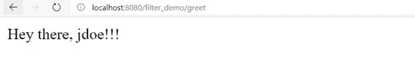
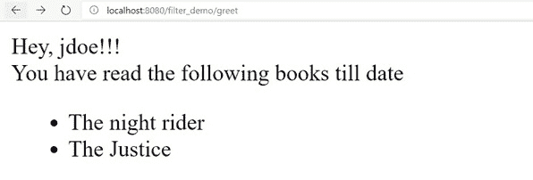
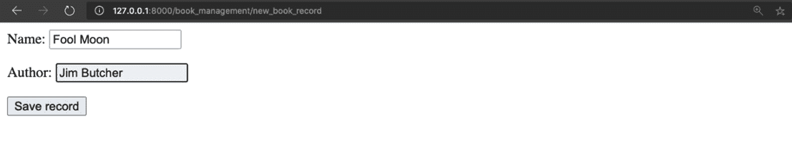
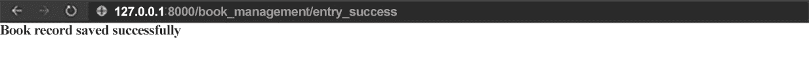
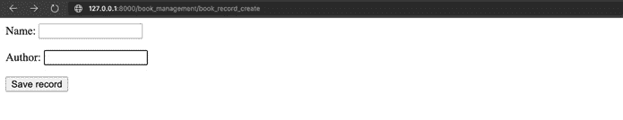
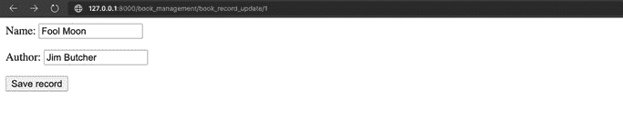
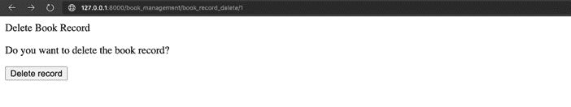
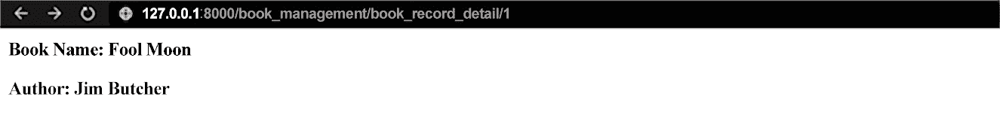
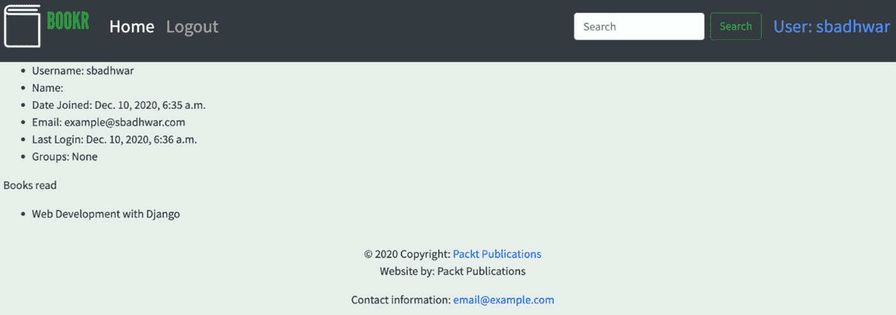

# 第十一章：11. 高级模板和基于类的视图

概述

在本章中，你将学习如何使用 Django 的模板 API 创建自定义模板标签和过滤器。你还将编写 **基于类的视图**，这将帮助你执行 CRUD 操作。到本章结束时，你将清楚地了解 Django 如何处理高级模板，以及你如何构建支持 CRUD 操作的自定义视图。你将能够使用类在 Django 中定义视图，并能够构建自定义标签和过滤器来补充 Django 提供的强大模板引擎。

# 简介

在 *第三章*，*URL 映射、视图和模板* 中，我们学习了如何在 Django 中构建视图和创建模板。然后，我们学习了如何使用这些视图来渲染我们构建的模板。在本章中，我们将通过使用 `if-else` 条件来构建视图的知识，成功处理不同类型的 HTTP 请求方法。相比之下，基于类的视图允许我们为每个我们想要处理的 HTTP 请求方法定义单独的方法。然后，根据接收到的请求类型，Django 会负责调用基于类的视图中的正确方法。

不仅仅能够根据不同的开发技术构建视图，Django 还内置了一个强大的模板引擎。这个引擎允许开发者为他们的网络应用程序构建可重用的模板。通过使用 **模板标签** 和 **过滤器**，这种模板引擎的可重用性得到了进一步增强，它们有助于在模板中轻松实现常用功能，例如遍历数据列表、以特定样式格式化数据、从变量中提取文本以显示，以及覆盖模板特定块的内容。所有这些功能也扩展了 Django 模板的可重用性。

在我们学习本章内容的过程中，我们将探讨如何通过利用 Django 定义自定义模板标签和过滤器的能力来扩展 Django 提供的默认模板过滤器和模板标签集。这些自定义模板标签和过滤器可以以可重用的方式在我们的网络应用程序中实现一些常见功能。例如，在构建可以在网络应用程序的多个位置显示的用户个人资料徽章时，利用编写自定义模板包含标签的能力，只需将徽章模板插入我们想要的任何视图中，而不是重写整个徽章模板的代码或引入模板的额外复杂性，这会更好。

# 模板过滤器

在开发模板时，开发者通常只想在将模板变量渲染给用户之前更改其值。例如，考虑我们正在为 Bookr 用户构建一个个人资料页面。在那里，我们想显示用户已阅读的书籍数量。下面，我们还想显示一个列出他们已阅读的书籍的表格。

要实现这一点，我们可以从我们的视图传递两个独立的变量到 HTML 模板中。一个可以命名为`books_read`，表示用户阅读的书籍数量。另一个可以是`book_list`，包含用户阅读的书籍名称列表，例如：

```py
<span class="books_read">You have read {{ books_read }} books</span>
<ul>

<li>{{ book }} </li>

</ul>
```

或者，我们可以使用**模板过滤器**。Django 中的模板过滤器是简单的基于 Python 的函数，它接受一个变量作为参数（以及变量上下文中的任何附加数据），根据我们的要求更改其值，然后渲染更改后的值。

现在，通过使用 Django 中的模板过滤器，我们可以不使用两个独立的变量就获得前面代码片段的相同结果，如下所示：

```py
<span class="books_read">You have read {{ book_list|length }}</span>
<ul>

<li>{{ book }}</li>

</ul>
```

在这里，我们使用了 Django 提供的内置`length`过滤器。使用此过滤器会导致`book_list`变量的长度被评估并返回，然后在渲染过程中将其插入到我们的 HTML 模板中。

与`length`一样，Django 还预包装了许多其他模板过滤器，可以直接使用。例如，`lowercase`过滤器将文本转换为全部小写格式，`last`过滤器可以用来返回列表中的最后一个项目，而`json_script`过滤器可以用来输出作为 JSON 值包裹在`<script>`标签中的传递给模板的 Python 对象。

注意

您可以参考 Django 的官方文档以获取 Django 提供的完整模板过滤器列表：[`docs.djangoproject.com/en/3.1/ref/templates/builtins/`](https://docs.djangoproject.com/en/3.1/ref/templates/builtins/)。

# 自定义模板过滤器

Django 为我们提供了许多有用的过滤器，我们可以在项目开发过程中使用。但如果有人想要格式化一段特定的文本并使用不同的字体渲染它？或者如果有人想要根据后端中错误代码的映射将错误代码翻译成用户友好的错误消息。在这些情况下，预定义的过滤器不足以满足需求，我们希望编写自己的过滤器，以便在整个项目中重用。

幸运的是，Django 提供了一个易于使用的 API，我们可以用它来编写自定义过滤器。这个 API 为开发者提供了一些有用的装饰器函数，可以用来快速将 Python 函数注册为自定义模板过滤器。一旦 Python 函数被注册为自定义过滤器，开发者就可以开始在模板中使用该函数。

访问这些过滤器需要一个`template`库方法的实例。这个实例可以通过从 Django 的`template`模块中实例化`Library()`类来创建，如下所示：

```py
from django import template
register = template.Library()
```

一旦创建了实例，我们现在可以使用模板库实例中的过滤器装饰器来注册我们的过滤器。

## 模板过滤器

要创建自定义模板过滤器，我们需要采取几个步骤。让我们尝试理解这些步骤以及它们如何帮助我们创建自定义模板过滤器。

## 设置存储模板过滤器的目录

需要注意的是，在创建自定义模板过滤器或模板标签时，我们需要将它们放在应用程序目录下的名为`templatetags`的目录中。这个要求是因为 Django 内部配置为在加载 Web 应用程序时寻找自定义模板标签和过滤器。如果目录名称不是`templatetags`，将导致 Django 无法加载我们创建的自定义模板过滤器和标签。

要创建此目录，首先，导航到您想要创建自定义模板过滤器的应用程序文件夹内，然后在终端中运行以下命令：

```py
mkdir templatetags
```

一旦创建了目录，下一步是在`templatetags`目录内创建一个新的文件来存储我们的自定义过滤器的代码。这可以通过在`templatetags`目录内执行以下命令来完成：

```py
touch custom_filter.py
```

注意

上述命令在 Windows 上无法工作。然而，您可以使用 Windows Explorer 导航到所需的目录并创建一个新文件。

或者，您可以使用 PyCharm 提供的 GUI 界面来完成此操作。

## 设置模板库

一旦创建了存储自定义过滤器代码的文件，我们现在可以开始实现我们的自定义过滤器代码。为了在 Django 中使用自定义过滤器，它们需要在模板中使用之前注册到 Django 的模板库中。为此，在上一节中创建的`custom_filters.py`文件中，我们首先需要从 Django 项目中导入模板模块：

```py
from django import template
```

一旦导入被解决，下一步是创建模板库的实例，通过添加以下代码行：

```py
register = template.Library()
```

Django 模板模块中的`Library`类实现为一个**单例**类，它在应用程序开始时只初始化一次并返回相同的对象。

一旦设置了模板库实例，我们现在可以继续实现我们的自定义过滤器。

## 实现自定义过滤器函数

Django 中的自定义过滤器实际上只是简单的 Python 函数，本质上需要以下参数：

1.  过滤器应用的价值（必需）

1.  需要传递给过滤器的任何附加参数（零个或多个）（可选）

为了作为模板过滤器工作，这些函数需要使用 Django 模板库实例的`filter`属性进行装饰。例如，自定义过滤器的通用实现将如下所示：

```py
@register.filter
def my_filter(value, arg):
    # Implementation logic of the filter
```

通过这些，我们已经学习了如何实现自定义过滤器的基础知识。在我们开始第一个练习之前，让我们快速学习如何使用它们。

## 在模板中使用自定义过滤器

一旦创建了过滤器，就可以简单地在我们的模板中使用它。为此，过滤器首先需要被导入到模板中。这可以通过在模板文件顶部添加以下行轻松完成：

```py

```

当 Django 的模板引擎解析模板文件时，前一行会自动由 Django 解析以找到在 `templatetags` 目录下指定的正确模块。因此，`custom_filter` 模块中提到的所有过滤器都会自动在模板中可用。

在模板中使用我们的自定义过滤器就像添加以下行一样简单：

```py
{{ some_value|generic_filter:"arg" }}
```

拥有了这些知识，现在让我们创建我们的第一个自定义过滤器。

## 练习 11.01：创建自定义模板过滤器

在这个练习中，你将编写一个名为 `explode` 的自定义过滤器，当提供一个字符串和一个用户提供的分隔符时，它会返回一个字符串列表。例如，考虑以下字符串：

```py
names = "john,doe,mark,swain"
```

你将应用以下过滤器到这个字符串上：

```py
{{ names|explode:"," }}
```

应用此过滤器后的输出应如下所示：

```py
["john", "doe", "mark", "swain"]
```

1.  在 `bookr` 项目内创建一个新的应用程序，你可以用它来进行演示：

    ```py
    python manage.py startapp filter_demo
    ```

    上述命令将在你的 Django 项目中设置一个新的应用程序。

1.  现在，在 `filter_demo` 应用程序目录内创建一个名为 `templatetags` 的新目录来存储你的自定义模板过滤器的代码。为了创建目录，从终端应用或命令提示符中在 `filter_demo` 目录内运行以下命令：

    ```py
    mkdir templatetags
    ```

1.  一旦创建了目录，就在 `templatetags` 目录内创建一个名为 `explode_filter.py` 的新文件。

1.  打开文件并添加以下行：

    ```py
    from django import template
    register = template.Library()
    ```

    上述代码创建了一个 Django 库的实例，可以用来将我们的自定义过滤器注册到 Django 中。

1.  添加以下代码以实现 `explode` 过滤器：

    ```py
    @register.filter
    def explode(value, separator):
        return value.split(separator)
    ```

    `explode` 过滤器接受两个参数；一个是 `value`，即过滤器所使用的值，另一个是从模板传递给过滤器的 `separator`。过滤器将使用此分隔符将字符串转换为列表。

1.  自定义过滤器准备就绪后，创建一个模板，以便应用此过滤器。为此，首先在 `filter_demo` 目录下创建一个名为 `templates` 的新文件夹，然后在其中创建一个名为 `index.html` 的新文件，内容如下：

    ```py
    <html>
    <head>
      <title>Custom Filter Example</title>
    <body>
    explode_filter module so that it can be used inside the templates. To achieve this, Django will look for the explode_filter module under the templatetags directory and if, found, will load it for use.In the next line, you pass the `names` variable passed to the template and apply the `explode` filter to it, while also passing in the comma "`,`" as a separator value to the filter.
    ```

1.  现在，模板创建完成后，接下来需要创建一个 Django 视图来渲染这个模板并将 `name` 变量传递给模板。为此，打开 `views.py` 文件并添加以下高亮代码：

    ```py
    from django.shortcuts import render
    render helper from the django.shortcuts module, which helps render the templates. Once the import is complete, it defines a new view function named index(), which renders index.html.
    ```

1.  现在，将视图映射到一个 URL，然后可以使用该 URL 在浏览器中渲染结果。为此，在 `filter_demo` 目录内创建一个名为 `urls.py` 的新文件，并将以下代码添加到其中：

    ```py
    from django.urls import path
    from . import views
    urlpatterns = [path('', views.index, name='index')]
    ```

1.  将 `filter_demo` 应用程序添加到项目的 URL 映射中。为此，打开 `bookr` 项目目录下的 `urls.py`，并在 `urlpatterns` 中添加以下高亮行：

    ```py
    urlpatterns = [path('filter_demo/', include('filter_demo.urls')),\
                   ….] 
    ```

1.  最后，在 `bookr` 项目的 `settings.py` 中的 `INSTALLED_APPS` 部分下添加应用程序：

    ```py
    INSTALLED_APPS = ….,\
                      INSTALLED_APPS section.
    ```

1.  要查看自定义过滤器是否工作，请运行以下命令：

    ```py
    python manage.py runserver localhost:8000
    ```

    现在，在您的浏览器中导航到以下页面：`http://localhost:8000/filter_demo`（或使用 `localhost` 而不是 `127.0.0.1`）。

    此页面应显示为 *图 11.1* 所示：

    ![图 11.1：使用爆炸过滤器显示的索引页面图 11.1：使用爆炸过滤器显示的索引页面通过这种方式，我们看到了如何在 Django 中快速创建一个自定义过滤器，然后将其用于我们的模板中。现在，让我们看看另一种类型的过滤器，即字符串过滤器，它仅对字符串类型的值起作用。## 字符串过滤器在 *练习 11.01*，*创建自定义模板过滤器* 中，我们构建了一个自定义过滤器，它允许我们使用分隔符分割提供的字符串并从中生成一个列表。这个过滤器可以接受任何类型的变量，并根据提供的分隔符将其分割成值的列表。但如果我们想限制我们的过滤器只处理字符串，而不是任何其他类型的值，比如整数呢？要开发仅对 *字符串* 有效的过滤器，我们可以使用 Django 模板库提供的 `stringfilter` 装饰器。当使用 `stringfilter` 装饰器将 Python 方法注册为 Django 中的过滤器时，框架确保在过滤器执行之前将传递给过滤器的值转换为字符串。这减少了当传递非字符串值给我们的过滤器时可能出现的任何潜在问题。在 *设置存储模板过滤器目录* 部分中我们创建的 `custom_filter.py` 文件中实现步骤？我们可以在其中添加一个新的 Python 函数，该函数将作为我们的字符串过滤器。在我们能够实现字符串过滤器之前，我们首先需要导入 `stringfilter` 装饰器，该装饰器将自定义过滤器函数标记为字符串过滤器。我们可以在 `custom_filters.py` 文件中添加以下 `import` 语句来实现这一点：```pyfrom django.template.defaultfilters import stringfilter```现在，要实现我们的自定义字符串过滤器，可以使用以下语法：```py@register.filter@stringfilterdef generic_string_filter(value, arg):    # Logic for string filter implementation```使用这种方法，我们可以构建尽可能多的字符串过滤器，并像使用任何其他过滤器一样使用它们。# 模板标签模板标签是 Django 模板引擎的一个强大功能。它们允许开发者通过评估某些条件来生成 HTML，从而构建强大的模板，并有助于避免重复编写常见代码。我们可能使用模板标签的一个例子是网站导航栏中的注册/登录选项。在这种情况下，我们可以使用模板标签来评估当前页面的访问者是否已登录。基于这一点，我们可以渲染一个个人横幅或注册/登录横幅。在开发模板时，标签也是一个常见的现象。例如，考虑以下代码行，我们在 *练习 11.01*，*创建自定义模板过滤器* 中使用它来在我们的模板中导入自定义过滤器：```py```这使用了一个名为 `load` 的模板标签，它负责将 `explode` 过滤器加载到模板中。与过滤器相比，模板标签功能更强大。虽然过滤器只能访问它们正在操作的价值，但模板标签可以访问整个模板的上下文，因此它们可以用来在模板内构建很多复杂的功能。让我们看看 Django 支持的模板标签的不同类型，以及我们如何构建我们自己的自定义模板标签。## 模板标签类型 Django 主要支持两种类型的模板标签：+   **简单标签**：这些标签在提供的变量数据（以及任何附加的变量）上操作，并在它们被调用的同一模板中渲染。例如，一个这样的用例可能包括根据用户的用户名渲染自定义欢迎消息，或者根据用户名显示用户的最后登录时间。+   **包含标签**：这些标签接收提供的数据变量，并通过渲染另一个模板来生成输出。例如，标签可以接收一个对象列表，并遍历它们以生成一个 HTML 列表。在接下来的章节中，我们将探讨如何创建这些不同类型的标签，并在我们的应用程序中使用它们。## 简单标签简单标签为开发者提供了一种构建模板标签的方法，这些标签可以从模板中接收一个或多个变量，处理它们，并返回一个响应。从模板标签返回的响应用于替换 HTML 模板内提供的模板标签定义。这类标签可以用来构建多种有用的功能，例如，解析日期，或者显示任何我们想要向用户展示的活跃警报（如果有的话）。简单标签可以通过模板库提供的 `simple_tag` 装饰器轻松创建，通过装饰应该作为模板标签起作用的 Python 方法。现在，让我们看看如何使用 Django 的模板库实现一个自定义简单标签。## 如何创建一个简单模板标签创建简单的模板标签遵循我们在 *自定义模板过滤器* 部分讨论的相同约定，有一些细微的差别。让我们回顾一下理解如何为在 Django 模板中使用而创建模板标签的过程。### 设置目录就像自定义过滤器一样，自定义模板标签也需要在同一个 `templatetags` 目录内创建，以便让 Django 的模板引擎能够发现它们。这个目录可以直接使用 PyCharm 图形界面创建，或者通过在我们要创建自定义标签的应用程序目录内运行以下命令来创建：```pymkdir templatetags```完成此操作后，我们现在可以创建一个新的文件来存储我们的自定义模板标签的代码，使用以下命令：```pytouch custom_tags.py```注意上述命令在 Windows 上将无法工作。然而，您可以使用 Windows 资源管理器创建一个新文件。### 设置模板库一旦设置好目录结构并且我们已经有一个文件用于存放自定义模板标签的代码，我们现在可以继续创建我们的模板标签。但在那之前，我们需要设置 Django 模板库的一个实例，就像我们之前做的那样。这可以通过向我们的 `custom_tag.py` 文件中添加以下几行代码来完成：```pyfrom django import templateregister = template.Library()```与自定义过滤器一样，模板库实例在这里用于注册自定义模板标签以供 Django 模板使用。### 实现简单模板标签 Django 中的简单模板标签是我们想要的任何数量的参数的 Python 函数。这些 Python 函数需要使用模板库中的 `simple_tag` 装饰器进行装饰，以便这些函数被注册为简单模板标签。以下代码片段展示了如何实现一个简单模板标签：```py@register.simple_tagdef generic_simple_tag(arg1, arg2):    # Logic to implement a generic simple tag```### 在模板中使用简单标签在 Django 模板中使用简单标签相当简单。在模板文件中，我们需要首先确保我们已将标签导入到模板中，方法是在模板文件顶部添加以下内容：```py```上述语句将加载我们之前定义的 `custom_tag.py` 文件中的所有标签，并在我们的模板中使它们可用。然后我们可以通过添加以下命令来使用我们的自定义简单标签：```py```现在，让我们将这个知识应用到实践中，创建我们的第一个自定义简单标签。## 练习 11.02：创建自定义简单标签在这个练习中，您将创建一个简单标签，它将接受两个参数：第一个将是问候消息，第二个将是用户的姓名。此标签将打印一个格式化的问候消息：1.  根据 *练习 11.01* 中所示的示例，*创建自定义模板过滤器*，让我们重用相同的目录结构来存储简单标签的代码。因此，首先，在 `filter_demo/template_tags` 目录下创建一个名为 `simple_tag.py` 的新文件。在这个文件中，添加以下代码：    ```py    from django import template    register = template.Library()    @register.simple_tag    def greet_user(message, username):        return\        "{greeting_message},\         {user}!!!".format(greeting_message=message, user=username)    ```    在这种情况下，您创建一个新的 Python 方法 `greet_user()`，它接受两个参数，`message` 是用于问候的消息，`username` 是要问候的用户的姓名。然后，该方法使用 `@register.simple_tag` 装饰器进行装饰，这表示该方法是一个简单标签，可以在模板中使用。1.  现在，创建一个新的模板，该模板将使用您的简单标签。为此，在 `filter_demo/templates` 目录下创建一个名为 `simple_tag_template.html` 的新文件，并将以下代码添加到其中：    ```py    <html>    <head>    <title>Simple Tag Template Example</title>    </head>    <body>            </body>    </html>    ```    在前面的代码片段中，你只是创建了一个使用你的自定义简单标签的裸骨 HTML 页面。加载自定义模板标签的语义与加载自定义模板过滤器类似，需要在模板中使用``标签。这个过程将在`templatetags`目录下寻找`simple_tag.py`模块，如果找到，将加载在该模块下定义的标签。    以下行显示了如何使用自定义模板标签：    ```py        ```    在这里，你首先使用了 Django 的标签指定符``，在其中，你传递的第一个参数是需要使用的标签的名称，后面跟着第一个参数`Hey there`，这是问候信息，以及第二个参数`username`，它将从视图函数传递到模板中。1.  创建模板后，下一步是创建一个视图来渲染你的模板。为此，在`filter_demo`目录下的`views.py`文件中添加以下代码：    ```py    def greeting_view(request):        return render(request),\                     ('simple_tag_template.html', {'username': 'jdoe'})    ```    在前面的代码片段中，你创建了一个基于简单函数的视图，它将渲染你在*步骤 2*中定义的`simple_tag_template`，并将值`'jdoe'`传递给名为`username`的变量。1.  创建视图后，下一步是将它映射到应用中的 URL 端点。为此，打开`filter_demo`目录下的`urls.py`文件，并在`urlpatterns`列表中添加以下内容：    ```py    path('greet', views.greeting_view, name='greeting')    ```    通过这种方式，`greeting_view`现在被映射到你的`filter_demo`应用的 URL 端点`/greet`。1.  要看到自定义标签的实际效果，通过运行以下命令启动你的 web 服务器：    ```py    python manage.py runserver localhost:8000    ```    在浏览器中访问`http://localhost:8000/filter_demo/greet`（或使用`localhost`代替`127.0.0.1`），你应该看到以下页面：    

图 11.2：使用自定义简单标签生成的问候信息

通过这种方式，我们已经创建了我们的第一个自定义模板标签，并成功将其用于渲染模板，如*图 11.2*所示。现在，让我们看看简单标签的另一个重要方面，即与将模板中可用的上下文变量传递给模板标签相关。

### 在自定义模板标签中传递模板上下文

在上一个练习中，我们创建了一个简单标签，我们向其中传递了两个参数，即问候信息和用户名。但如果我们想向标签传递大量变量呢？或者简单地说，如果我们不想明确将用户的用户名传递给标签呢？

有时候，开发者希望访问模板中所有存在的变量和数据，以便在自定义标签内部可用。幸运的是，这很容易实现。

以我们之前的`greet_user`标签为例，让我们创建一个新的标签名为`contextual_greet_user`，并看看我们如何可以直接将模板中可用的数据传递给标签，而不是手动作为参数传递。

我们需要做的第一个修改是修改我们的装饰器，使其看起来如下：

```py
@register.simple_tag(takes_context=True)
```

通过这种方式，我们告诉 Django，当我们的`contextual_greet_user`标签被使用时，Django 也应该传递它模板上下文，其中包含从视图传递到模板的所有数据。完成这个添加后，接下来我们需要做的是将我们的`contextual_greet_user`实现修改为接受添加的上下文作为参数。以下代码显示了修改后的`contextual_greet_user`标签形式，它使用我们的模板上下文来渲染问候消息：

```py
@register.simple_tag(takes_context=True)
def contextual_greet_user(context, message):
    username = context['username']
    return "{greeting_message},\
            {user}".format(greeting_message=message, user=username)
```

在前面的代码示例中，我们可以看到`contextual_greet_user()`方法是如何修改的，以接受传递的上下文作为第一个参数，然后是用户传递的问候消息。

要利用这个修改后的模板标签，我们只需要将`filter_demo`下的`simple_tag_template.html`中的`contextual_greet_user`标签的调用更改如下：

```py

```

然后，当我们重新加载我们的 Django Web 应用程序时，`http://localhost:8000/filter_demo/greet`的输出应该类似于*练习 11.02*的第*5 步*中显示的输出，*创建自定义简单标签*。

通过这种方式，我们了解了如何构建一个简单的标签并处理将模板上下文传递给标签。现在，让我们看看如何构建一个包含标签，它可以用来以另一个模板描述的格式渲染数据。

## 包含标签

简单标签允许我们构建接受一个或多个输入变量的标签，对它们进行一些处理，并返回一个输出。然后，这个输出被插入到简单标签被使用的地方。

但如果我们想构建标签，这些标签不是返回文本输出，而是返回一个 HTML 模板，然后可以用来渲染页面的部分。例如，许多 Web 应用程序允许用户向他们的个人资料添加自定义小部件。这些单独的小部件可以作为包含标签构建并独立渲染。这种方法将基础页面模板和单独的模板的代码分开，因此允许易于重用以及重构。

开发自定义包含标签的过程与我们开发简单标签的过程类似。这涉及到使用模板库提供的`inclusion_tag`装饰器。因此，让我们看看我们如何做到这一点。

### 实现包含标签

包含标签是那些在模板内部使用时作为响应渲染模板的标签。这些标签可以以与其他自定义模板标签类似的方式实现，只需进行一些小的修改。

包含标签也是简单的 Python 函数，可以接受多个参数，其中每个参数映射到从调用标签的模板传递的参数。这些标签使用 Django 模板库中的 `inclusion_tag` 装饰器进行装饰。`inclusion_tag` 装饰器接受一个参数，即模板的名称，该名称应在包含标签的处理过程中作为响应进行渲染。

包含标签的通用实现将类似于以下代码片段所示：

```py
@register.inclusion_tag('template_file.html')
def my_inclusion_tag(arg):
    # logic for processing
    return {'key1': 'value1'}
```

注意这个例子中的返回值。包含标签应该返回一个字典，该字典将用于渲染 `template_file.html` 文件，该文件作为 `inclusion_tag` 装饰器中的参数指定。

### 在模板中使用包含标签

包含标签可以轻松地用于模板文件中。为此，首先按照以下方式导入标签：

```py

```

然后通过像使用其他标签一样使用该标签：

```py

```

此标签的渲染响应将是一个子模板，它将在包含标签被使用的我们的主模板内进行渲染。

## 练习 11.03：构建自定义包含标签

在这个练习中，我们将构建一个自定义的 `inclusion` 标签，该标签将渲染用户阅读的书籍列表：

1.  对于这个练习，你将继续使用之前练习中相同的演示文件夹。首先，在 `filter_demo/templatetags` 目录下创建一个名为 `inclusion_tag.py` 的新文件，并在其中编写以下代码：

    ```py
    from django import template
    register = template.Library()
    @register.inclusion_tag('book_list.html')
    def book_list(books):
        book_list = [book_name for book_name, \
                     book_author in books.items()]
        return {'book_list': book_list}
    ```

    使用 `@register.inclusion_tag` 装饰器来标记方法作为自定义包含标签。此装饰器接受模板名称作为参数，该参数应用于渲染标签函数返回的数据。

    在装饰器之后，您定义一个函数来实现自定义包含标签的逻辑。此函数接受一个名为 `books` 的单个参数。此参数将从模板文件传递，并包含读者已阅读的书籍列表（以 `Python` 字典的形式）。在定义内部，您将字典转换为 Pythonic 的书籍名称列表。字典中的键映射到书籍名称，值映射到作者：

    ```py
    books_list = [book_name for book_name, \
                  book_author in books.items()]
    ```

    一旦列表形成，以下代码将列表作为上下文返回，传递给包含标签的模板（在本例中为 `book_list.html`）：

    ```py
    return {'book_list': books_list}
    ```

    此方法返回的值将被 Django 传递给 `book_list.html` 模板，然后内容将被渲染。

1.  接下来，创建实际的模板，它将包含模板标签的渲染结构。为此，在 `filter_demo/templates` 目录下创建一个名为 `book_list.html` 的新模板文件，并向其中添加以下内容：

    ```py
    <ul>
      
    <li>{{ book }}</li>
      
    </ul>
    ```

    在这里，在您创建的新模板文件中，您创建了一个无序列表，该列表将包含用户已阅读的书籍列表。接下来，使用 `for` 模板标签，您遍历 `book_list` 中的值，这些值将由自定义模板函数提供：

    ```py
    
    ```

    此迭代会产生几个列表项，如下定义：

    ```py
    <li>{{ book }}</li>
    ```

    列表项是通过从`book_list`传递的内容生成的，该内容被传递到模板中。`for`标签会根据`book_list`中项目数量执行多次。

1.  为`book_list`标签定义了模板后，修改现有的问候模板，使其内部可用此标签，并使用它来显示用户已阅读的书籍列表。为此，修改`filter_demo/templates`目录下的`simple_tag_template.html`文件，并将代码修改如下：

    ```py
    <html>
    <head>
      <title>Simple Tag Template Example</title>
    </head>
    <body>
    
    
      <br />
      <span class="message">You have read the following books     till date</span>
    
    </body>
    </html>
    ```

    在这个片段中，您首先通过编写以下代码加载了`inclusion_tag`模块：

    ```py
    
    ```

    标签加载后，您现在可以在模板的任何位置使用它。要使用它，您以以下格式添加了`book_list`标签：

    ```py
    
    ```

    此标签接受一个参数，即包含书籍的字典，其中键是书籍标题，键的值是书籍的作者。在此阶段，您甚至可以自定义问候信息；在这个步骤中，我们选择了简单的"`Hey`"而不是"`Hey there`"。

1.  模板现在已修改，最后一步是将所需数据传递给模板。为了实现这一点，修改`filter_demo`目录下的`views.py`文件，并将问候视图函数修改如下：

    ```py
    def greeting_view(request):
        books = {"The night rider": "Ben Author",\
                 "The Justice": "Don Abeman"}
        return render(request),\
                     ('simple_tag_template.html'),\
                     ({'username': 'jdoe', 'books': books})
    ```

    在这里，您修改了`greeting_view`函数，添加了书籍及其作者的字典，并将其传递给`simple_tag_template`上下文。

1.  在实施上述更改后，现在是时候渲染修改后的模板了。为此，通过运行以下命令重新启动您的 Django 应用程序服务器：

    ```py
    python manage.py runserver localhost:8080
    ```

    导航到`http://localhost:8080/filter_demo/greet`，现在应该会渲染一个类似于以下截图的页面：

    

图 11.3：用户访问问候端点时阅读的书籍列表

页面显示了用户访问问候端点时阅读的书籍列表。您在页面上看到的列表是使用内联标签渲染的。首先单独创建列出这些书籍的模板，然后使用内联标签将其添加到页面上。

注意

我们对`filter_demo`应用程序的工作已经完成。如果您想进一步定制此应用程序以练习您学到的概念，您可以继续这样做。由于该应用程序仅用于解释自定义模板过滤器和模板标签的概念，并且与我们要构建的`bookr`应用程序无关，因此您不会在 GitHub 存储库的`final/bookr`应用程序文件夹中找到它。

有了这个，我们现在有了构建高度复杂的模板过滤器或自定义标签的基础，这些标签可以帮助我们开发想要工作的项目。

现在，让我们重新审视 Django 视图，并深入到一个新的视图领域，称为**基于类的视图**。由 Django 提供，这些视图帮助我们利用面向对象编程的力量，并允许代码的重用以渲染视图。

# Django 视图

回想一下，Django 中的视图是一段 Python 代码，它允许接收请求，根据请求执行操作，然后向用户返回响应，因此构成了我们 Django 应用程序的重要部分。

在 Django 内部，我们有两种不同的方法来构建我们的视图，其中一种我们在前面的示例中已经看到，被称为基于函数的视图，而另一种我们很快就会介绍，被称为基于类的视图：

+   `HTTPRequest`类型对象作为它们的第一位置参数，并返回一个`HTTPResponse`类型对象，这对应于视图在处理请求后想要执行的操作。在前面的练习中，`index()`和`greeting_view()`是 FBV 的例子。

+   **基于类的视图**（**CBV**）：CBV 是紧密遵循 Python 面向对象原则的视图，并允许在基于类的表示中映射视图调用。这些视图在本质上具有专业性，并且给定的 CBV 执行特定的操作。CBV 提供的优势包括视图的易于扩展性和代码的重用，这在 FBV 中可能是一个复杂的任务。

现在，基本定义已经明确，并且我们已经掌握了 FBV 的知识，让我们来看看 CBV（基于类的视图）并看看它们为我们准备了什么。

# 基于类的视图

Django 提供了不同的方式，让开发者可以为他们的应用程序编写视图。一种方式是将 Python 函数映射为视图函数以创建 FBV。另一种创建视图的方式是使用基于 Python 类的 Python 对象实例。这些被称为 CBV。一个重要的问题是，当我们已经可以使用 FBV 方法创建视图时，为什么还需要 CBV？

在创建 FBV（基于函数的视图）时，我们的想法是，有时我们可能需要反复复制相同的逻辑，例如处理某些字段或处理某些请求类型的逻辑。尽管创建逻辑上分离的函数来处理特定的逻辑是完全可能的，但随着应用程序复杂性的增加，这项任务变得难以管理。

这就是 CBV（基于类的视图）派上用场的地方，它们抽象出了我们需要编写的常见重复代码的实现，例如模板的渲染。同时，它们也通过使用继承和混入使代码的重用变得容易。例如，以下代码片段显示了 CBV 的实现：

```py
from django.http import HttpResponse
from django.views import View
class IndexView(View):
    def get(self, request):
        return HttpResponse("Hey there!")
```

在前面的示例中，我们通过继承 Django 提供的内置视图类构建了一个简单的 CBV。

使用这些 CBV（基于类的视图）也很简单。例如，假设我们想在应用程序中将`IndexView`映射到一个 URL 端点。在这种情况下，我们只需要在应用程序的`urls.py`文件中的`urlpatterns`列表中添加以下行：

```py
urlpatterns = [path('my_path', IndexView.as_view(), \
                    name='index_view')]
```

在这里，正如我们可以观察到的，我们使用了 CBV 的`as_view()`方法。每个 CBV 都实现了`as_view()`方法，这使得视图类可以通过返回视图控制器实例来映射到 URL 端点。

Django 提供了一些内置的 CBV，它们提供了许多常见任务的实现，例如如何渲染模板，或者如何处理特定的请求。内置的 CBV 有助于在处理基本功能时避免从头开始重写代码，从而实现代码的可重用性。以下是一些内置视图的示例：

+   `请求`方法，例如`GET`、`POST`、`PUT`和`DELETE`，视图将自动根据接收到的请求类型委托给负责处理该请求的方法。

+   **TemplateView**：一个视图，可以根据调用 URL 中提供的模板数据参数来渲染模板。这允许开发者轻松渲染模板，而无需编写任何与渲染处理相关的逻辑。

+   **RedirectView**：一个视图，可以根据用户请求自动将用户重定向到正确的资源。

+   **DetailView**：一个映射到 Django 模型并可以使用选择的模板渲染从模型获取的数据的视图。

前面的视图只是 Django 默认提供的内置视图的一部分，随着我们进入本章，我们将介绍更多。

现在，为了更好地理解 CBV 在 Django 中的工作方式，让我们尝试构建我们的第一个 CBV。

## 练习 11.04：使用 CBV 创建图书目录

在这个练习中，你将创建一个基于类的表单视图，这将帮助你构建一个图书目录。这个目录将包括书的名称和书的作者名称。

注意

为了理解类视图的概念，我们将在 Bookr 中创建一个单独的应用程序，它有自己的模型和表单，这样我们的现有代码就不会受到影响。就像`filter_demo`一样，我们不会将此应用程序包含在我们的 GitHub 仓库的`final/bookr`文件夹中。

1.  要开始，在我们的`bookr`项目中创建一个新的应用程序，并将其命名为`book_management`。这可以通过简单地运行以下命令来完成：

    ```py
    python manage.py startapp book_management
    ```

1.  现在，在构建图书目录之前，你首先需要定义一个 Django 模型，这将帮助你将记录存储在数据库中。为此，打开你刚刚创建的`book_management`应用下的`models.py`文件，并定义一个新的名为`Book`的模型，如下所示：

    ```py
    from django.db import models
    class Book(models.Model):
        name = models.CharField(max_length=255)
        author = models.CharField(max_length=50)
    ```

    模型包含两个字段，即书名和作者名。有了模型，你需要将其迁移到数据库中，这样你就可以开始在数据库中存储你的数据。

1.  一旦完成所有前面的步骤，将你的`book_management`应用程序添加到`INSTALLED_APPS`列表中，这样 Django 就可以发现它，你就可以正确使用你的模型。为此，打开`bookr`目录下的`settings.py`文件，并在`INSTALLED_APPS`部分的最后位置添加以下代码：

    ```py
    INSTALLED_APPS = [….,\
                      'book_management']
    ```

1.  通过运行以下两个命令将你的模型迁移到数据库中。这些命令首先创建一个 Django 迁移文件，然后在你的数据库中创建一个表：

    ```py
    python manage.py makemigrations
    python manage.py migrate
    ```

1.  现在，数据库模型已经就绪，让我们创建一个新的表单，我们将使用它来捕捉有关书籍的信息，例如书名、作者和 ISBN。为此，在`book_management`目录下创建一个名为`forms.py`的新文件，并在其中添加以下代码：

    ```py
    from django import forms
    from .models import Book
    class BookForm(forms.ModelForm):
        class Meta:
            model = Book
            fields = ['name', 'author']
    ```

    在前面的代码片段中，你首先导入了 Django 的表单模块，这将允许你轻松创建表单，并也将提供表单的渲染能力。下一行导入了将存储表单数据的模型：

    ```py
    from django import forms
    from .models import Book
    ```

    在下一行中，你创建了一个名为`BookForm`的新类，它继承自`ModelForm`。这只是一个将模型的字段映射到表单的类。为了成功实现模型和表单之间的这种映射，你在`BookForm`类下定义了一个新的子类`Meta`，并将属性 model 指向`Book`模型，将属性 fields 设置为要在表单中显示的字段列表：

    ```py
    class Meta:
        model = Book
        fields = ['name', 'author']
    ```

    这允许`ModelForm`在需要时渲染正确的表单 HTML。`ModelForm`类提供了一个内置的`Form.save()`方法，当使用时，将表单中的数据写入数据库，从而帮助避免编写冗余代码。

1.  现在你已经准备好了模型和表单，继续实现一个视图，该视图将渲染表单并接受用户的输入。为此，打开`book_management`目录下的`views.py`文件，并向文件中添加以下代码行：

    ```py
    from django.http import HttpResponse
    from django.views.generic.edit import FormView
    from django.views import View
    from .forms import BookForm
    class BookRecordFormView(FormView):
        template_name = 'book_form.html'
        form_class = BookForm
        success_url = '/book_management/entry_success'
        def form_valid(self, form):
            form.save()
            return super().form_valid(form)
    class FormSuccessView(View):
        def get(self, request, *args, **kwargs):
            return HttpResponse("Book record saved successfully")
    ```

    在前面的代码片段中，你创建了两个主要视图，一个是`BookRecordFormView`，它还负责渲染书籍目录表单，另一个是`FormSuccessView`，你将使用它来渲染如果表单数据成功保存的成功消息。现在让我们分别查看这两个视图，并了解我们在做什么。

    首先，你创建了一个名为`BookRecordFormView`的新视图 CBV，它继承自`FormView`：

    ```py
    class BookRecordFormView(FormView)
    ```

    `FormView`类允许你轻松创建处理表单的视图。为此类，你需要提供某些参数，例如它将渲染以显示表单的模板名称、它应该用于渲染表单的表单类，以及当表单处理成功时重定向到的成功 URL：

    ```py
    template_name = 'book_form.html'
    form_class = BookForm
    success_url = '/book_management/entry_success'
    ```

    `FormView`类还提供了一个`form_valid()`方法，当表单成功完成验证时被调用。在`form_valid()`方法中，我们可以决定要做什么。对于我们的用例，当表单验证成功完成时，我们首先调用`form.save()`方法，将表单数据持久化到数据库中，然后调用基类的`form_valid()`方法，如果表单验证成功，这将导致表单视图重定向到成功 URL：

    ```py
    def form_valid(self, form):
        form.save()
        return super().form_valid(form)
    class FormSuccessView(View)
    ```

    在这个类中，我们重写了`get()`方法，当表单成功保存时将调用此方法。在`get()`方法中，通过返回一个新的`HttpResponse`来渲染一个简单的成功消息：

    ```py
        def get(self, request, *args, **kwargs):
            return HttpResponse("Book record saved successfully")
    ```

1.  现在，创建一个将用于渲染表单的模板。为此，在`book_management`目录下创建一个新的`templates`文件夹，并创建一个名为`book_form.html`的新文件。在文件内添加以下代码行：

    ```py
    <html>
      <head>
        <title>Book Record Insertion</title>
      </head>
      <body>
        <form method="POST">
          
          {{ form.as_p }}
          <input type="submit" value="Save record" />
        </form>
      </body>
    </html>
    ```

    在这个代码片段中，需要讨论两个重要的事情。

    第一点是使用``标签。此标签被插入以防止表单遇到`csrf_token`问题。这是 Django 提供的一个内置模板标签，用于避免此类攻击。它通过为每个渲染的表单实例生成一个唯一的令牌来实现。

    第二点是使用`{{ form.as_p }}`模板变量。此变量的数据由基于`FormView`的视图自动提供。`as_p`调用使得表单字段被渲染在`<p></p>`标签内。

1.  现在已经构建了 CBVs（类视图），接下来将它们映射到 URL 上，这样你就可以开始使用它们来添加新的图书记录。为此，在`book_management`目录下创建一个新的名为`urls.py`的文件，并将以下代码添加到其中：

    ```py
    from django.urls import path
    from .views import BookRecordFormView, FormSuccessView
    urlpatterns = [path('new_book_record',\
                   BookRecordFormView.as_view(),\
                   name='book_record_form'),\
                   path('entry_success', FormSuccessView.as_view()),\
                       (name='form_success')]
    ```

    前面的代码片段的大部分与之前你编写的类似，但在将 CBVs 映射到 URL 模式的方式上有一点不同。当使用 CBVs 时，我们不是直接添加函数名，而是使用类名并使用它的`as_view`方法，该方法将类对象映射到视图。例如，要将`BookRecordFormView`映射为一个视图，我们将使用`BookRecordFormView.as_view()`。

1.  在我们的`urls.py`文件中添加了 URL 后，接下来要添加我们的应用程序 URL 映射到`bookr`项目中。为此，打开`bookr`应用下的`urls.py`文件，并将以下行添加到`urlpatterns`中：

    ```py
    urlpatterns = [path('book_management/',\
                   include('book_management.urls')),\
                   ….]
    ```

1.  现在，通过运行以下命令启动你的开发服务器：

    ```py
    python manage.py runserver localhost:8080
    ```

    然后，访问`http://localhost:8080/book_management/new_book_record`（或者使用`127.0.0.1`代替`localhost`。）

    如果一切顺利，你将看到如下所示的页面：

    

图 11.4：添加新书籍到数据库的视图

点击“保存记录”后，您的记录将被写入数据库，并显示以下页面：



图 11.5：记录成功插入时渲染的模板

通过这种方式，我们创建了自己的 CBV（类视图），这使得我们能够为新书籍保存记录。带着我们对 CBV 的知识，现在让我们看看如何借助 CBV 执行创建、读取、更新、删除（CRUD）操作。

## 使用 CBV 进行 CRUD 操作

在与 Django 模型一起工作时，我们遇到的最常见的模式之一涉及在数据库中存储的对象的创建、读取、更新和删除。Django 管理界面使我们能够轻松地实现这些 CRUD 操作，但如果我们想构建自定义视图以获得相同的功能呢？

事实上，Django 的 CBV 允许我们非常容易地实现这一点。我们只需要编写我们的自定义 CBV，并从 Django 提供的内置基类中继承。基于我们现有的书籍记录管理示例，让我们看看如何在 Django 中构建基于 CRUD 的视图。

### 创建视图

要构建一个帮助进行对象创建的视图，我们需要打开位于`book_management`目录下的`view.py`文件，并向其中添加以下代码行：

```py
from django.views.generic.edit import CreateView
from .models import Book
class BookCreateView(CreateView):
model = Book
    fields = ['name', 'author']
    template_name = 'book_form.html'
    success_url = '/book_management/entry_success'
```

通过这种方式，我们已经为书籍资源创建了`CreateView`。在我们能够使用它之前，我们需要将其映射到一个 URL。为此，我们可以打开位于`book_management`目录下的`urls.py`文件，并在`urlpatterns`列表下添加以下条目：

```py
urlpatterns = [….,\
               path('book_record_create'),\
                    (BookCreateView.as_view(), name='book_create')]
```

现在，当我们访问`http://127.0.0.1:8000/book_management/book_record_create`时，我们将看到以下页面：



图 11.6：基于创建视图插入新书籍记录的视图

这看起来与使用表单视图时得到的结果相似。在填写数据并点击“保存记录”后，Django 会将数据保存到数据库中。

## 更新视图

在此视图中，我们想要更新特定记录的数据。为此，我们需要打开位于`book_management`目录下的`view.py`文件，并向其中添加以下代码行：

```py
from django.views.generic.edit import UpdateView
from .models import Book
class BookUpdateView(UpdateView):
    model = Book
    fields = ['name', 'author']
    template_name = 'book_form.html'
    success_url = '/book_management/entry_success'
```

在前面的代码片段中，我们使用了内置的`UpdateView`模板，它允许我们更新存储的记录。这里的字段属性应该接受我们希望允许用户更新的字段名称。

视图创建完成后，下一步是添加 URL 映射。为此，我们可以打开位于`book_management`目录下的`urls.py`文件，并向其中添加以下代码行：

```py
urlpatterns = [path('book_record_update/<int:pk>'),\
                   (BookUpdateView.as_view(), name='book_update')]
```

在此示例中，我们将`<int:pk>`附加到 URL 字段。这表示我们将要输入的字段以检索记录。在 Django 模型中，Django 插入一个整型主键，用于唯一标识记录。在 URL 映射中，这是我们要求插入的字段。

现在，当我们尝试打开`http://127.0.0.1:8000/book_management/book_record_update/1`时，它应该显示我们插入到数据库中的第一条记录，并允许我们编辑它：



图 11.7：基于更新视图显示书籍记录更新模板的视图

### 删除视图

删除视图，正如其名所示，是一个从我们的数据库中删除记录的视图。为了为我们的`Book`模型实现此类视图，您需要打开`book_management`目录下的`views.py`文件，并将其中的以下代码片段添加到该文件中：

```py
from django.views.generic.edit import DeleteView
from .models import Book
class BookDeleteView(DeleteView):
    model = Book
    template_name = 'book_delete_form.html'
    success_url = '/book_management/delete_success
```

通过这种方式，我们刚刚为我们的书籍记录创建了一个删除视图。正如我们所见，此视图使用了一个不同的模板，我们希望从用户那里确认的是，他们是否真的想要删除记录？为了实现这一点，你可以创建一个新的模板文件`book_delete_form.html`，并将其中的以下代码添加到该文件中：

```py
<html>
  <head>
    <title>Delete Book Record</title>
  </head>
  <body>
    <p>Delete Book Record</p>
    <form method="POST">
      
      Do you want to delete the book record?
      <input type="submit" value="Delete record" />
    </form>
  </body>
</html>
```

然后，我们可以通过修改`book_management`目录下的`urls.py`文件中的`urlpatterns`列表来为我们的删除视图添加映射，如下所示：

```py
urlpatterns = [….,\
               path('book_record_delete/<int:pk>'),\
               (BookDeleteView.as_view(), name='book_delete')]
```

现在，当访问`http://127.0.0.1:8000/book_management/book_record_delete/1`时，我们应该看到以下页面：



图 11.8：基于删除视图类的删除书籍记录视图

点击“删除记录”按钮后，记录将从数据库中删除，并渲染删除成功页面。

## 读取视图

在此视图中，我们希望看到数据库中存储的书籍记录列表。为了实现这一点，我们将在`book_management`目录下的`views.py`文件中添加以下代码行来构建一个名为`DetailView`的视图，该视图将渲染我们请求的书籍的详细信息。构建此视图，我们可以在`book_management`目录下的`views.py`文件中添加以下代码行：

```py
from django.views.generic import DetailView
class BookRecordDetailView(DetailView):
    model = Book
    template_name = 'book_detail.html'
```

在前面的代码片段中，我们创建了一个`DetailView`，它将帮助我们渲染我们请求的书籍 ID 的详细信息。详细视图内部使用我们提供的书籍 ID 查询我们的数据库模型，如果找到记录，则通过将存储在记录中的数据作为对象变量传递到模板上下文中来渲染模板。

完成此操作后，下一步是创建我们的书籍详细信息的模板。为此，我们需要在`book_management`应用程序的`templates`目录下创建一个名为`book_detail.html`的新模板文件，其内容如下：

```py
<html>
  <head>
    <title>Book List</title>
  </head>
  <body>
    <span>Book Name: {{ object.name }}</span><br />
    <span>Author: {{ object.author }}</span>
  </body>
</html>
```

现在，有了模板，我们最后需要做的是为 Detail 视图添加 URL 映射。这可以通过将以下内容追加到 `book_management` 应用程序的 `urls.py` 文件中的 `urlpatterns` 列表来完成：

```py
path('book_record_detail/<int:pk>'),\
     (BookRecordDetail.as_view(), name='book_detail')
```

现在，所有这些配置完成后，如果我们现在打开 `http://127.0.0.1:8000/book_management/book_record_detail/1`，我们将看到有关我们书籍的详细信息，如图所示：



图 11.9：尝试访问先前存储的书籍记录时渲染的视图

通过前面的示例，我们只是为我们的 `Book` 模型启用了 CRUD 操作，而且这一切都是在使用 CBVs（类视图）的同时完成的。

## 活动 11.01：使用包含标签在用户个人资料页面渲染详细信息

在此活动中，您将创建一个自定义包含标签，该标签有助于开发一个渲染用户详细信息以及他们阅读的书籍列表的用户个人资料页面。

以下步骤应有助于您成功完成此活动：

1.  在 `bookr` 项目的 `reviews` 应用程序下创建一个新的 `templatetags` 目录，以提供一个可以创建自定义模板标签的地方。

1.  创建一个名为 `profile_tags.py` 的新文件，该文件将存储包含标签的代码。

1.  在 `profile_tags.py` 文件中，导入 Django 的模板库并使用它来初始化模板库类的实例。

1.  从 `reviews` 应用程序导入 `Review` 模型以获取用户的评论。这将用于过滤当前用户的评论以在用户个人资料页面渲染。

1.  接下来，创建一个名为 `book_list` 的新 Python 函数，该函数将包含包含标签的逻辑。此函数应仅接受一个参数，即当前登录用户的用户名。

1.  在 `book_list` 函数的主体中，添加获取此用户评论的逻辑并提取此用户阅读的书籍名称。假设用户已经阅读了他们提供评论的所有书籍。

1.  使用 `inclusion_tag` 装饰器装饰此 `book_list` 函数，并为其提供一个模板名称 `book_list.html`。

1.  创建一个名为 `book_list.html` 的新模板文件，该文件在 *步骤 7* 中被指定为包含标签装饰器。在这个文件中，添加代码以渲染书籍列表。这可以通过使用 `for` 循环结构和为列表中的每个项目渲染 HTML 列表标签来实现。

1.  修改 `templates` 目录下现有的 `profile.html` 文件，该文件将用于渲染用户个人资料。在这个模板文件中，包含自定义模板标签并使用它来渲染用户阅读的书籍列表。

    一旦实现了上述所有步骤，启动应用程序服务器并访问用户个人资料页面应该会渲染一个类似于 *图 11.10* 中所示的页面：

    

图 11.10：用户个人资料页面，列出了用户阅读过的书籍

注意

该活动的解决方案可以在[`packt.live/2Nh1NTJ`](http://packt.live/2Nh1NTJ)找到。

# 摘要

在本章中，我们学习了 Django 的高级模板概念，并了解了我们如何创建自定义模板标签和过滤器来适应各种用例，并支持应用程序中组件的可重用性。然后我们探讨了 Django 如何提供灵活性，使我们能够实现 FBVs（函数视图）和 CBVs 来渲染我们的响应。

在探索 CBVs（类视图）的过程中，我们学习了它们如何帮助我们避免代码重复，以及我们如何利用内置的 CBVs 来渲染保存数据的表单，帮助我们更新现有记录，并在我们的数据库资源上实现 CRUD 操作。

随着我们进入下一章，我们现在将利用我们构建 CBVs 的知识来实施 Django 中的 REST APIs。这将使我们能够在 Bookr 应用程序内部对数据进行定义良好的 HTTP 操作，而不需要在应用程序内部维护任何状态。
