# 第十六章：16. 使用前端 JavaScript 库与 Django 结合

概述

本章介绍了 JavaScript 的基础知识，并以使用 React JavaScript 框架为 Bookr 构建交互式网页前端结束。你将学习如何在 Django 模板中包含 React JavaScript 框架，以及如何构建 React 组件。本章还包括了 `fetch` JavaScript 函数的介绍，该函数用于从 REST API 获取信息。在章节的末尾，你将了解到 Django `` 模板标签，它用于在 Django 模板中包含未解析的数据。

# 简介

Django 是构建应用程序后端的一个优秀工具。你已经看到了设置数据库、路由 URL 和渲染模板是多么容易。然而，如果不使用 JavaScript，当这些页面渲染到浏览器时，它们是静态的，并且不提供任何形式的交互。通过使用 JavaScript，你的页面可以变成在浏览器中完全交互的应用程序。

本章将简要介绍 JavaScript 框架及其与 Django 的使用方法。虽然它不会深入探讨如何从头开始构建一个完整的 JavaScript 应用程序（那将是一本自己的书），但我们将提供足够的介绍，以便你可以在自己的 Django 应用程序中添加交互式组件。在本章中，我们将主要使用 React 框架。即使你没有 JavaScript 经验，我们也会介绍足够的内容，以便在本章结束时，你将能够舒适地编写自己的 React 组件。在 *第十二章*，*构建 REST API* 中，你为 Bookr 构建了一个 REST API。我们将使用 JavaScript 与该 API 交互以检索数据。我们将通过在主页上显示一些动态加载并可分页的评论预览来增强 Bookr。

注意

本章练习和活动的代码可以在本书的 GitHub 仓库中找到，网址为 [`packt.live/3iasIMl`](http://packt.live/3iasIMl)。

# JavaScript 框架

现在，实时交互是网络应用程序的基本组成部分。虽然可以不使用框架添加简单的交互（不使用框架的开发通常被称为 *Vanilla JS*），但随着你的网络应用程序的增长，使用框架进行管理会容易得多。没有框架，你需要自己完成所有这些事情：

+   手动定义数据库模式。

+   将 HTTP 请求中的数据转换为原生对象。

+   编写表单验证。

+   编写 SQL 查询以保存数据。

+   构建 HTML 来显示响应。

将此与 Django 提供的功能进行比较。它的**ORM**（**对象关系映射**）、自动表单解析和验证以及模板化大大减少了你需要编写的代码量。JavaScript 框架为 JavaScript 开发带来了类似的时间节省增强。没有它们，你将不得不手动更新浏览器中的 HTML 元素，以适应数据的变化。让我们用一个简单的例子来说明：显示按钮被点击的次数。没有框架，你必须做以下事情：

1.  为按钮点击事件分配处理程序。

1.  增加存储计数的变量。

1.  定位包含点击计数显示的元素。

1.  将元素的文本替换为新的点击计数。

当使用框架时，按钮计数变量绑定到显示（HTML），因此你需要编写的代码过程如下：

1.  处理按钮点击。

1.  增加变量。

框架负责自动重新渲染数字显示。这只是一个简单的例子；随着你的应用程序的增长，两种方法之间的复杂性差异会扩大。有几个 JavaScript 框架可供选择，每个框架都有不同的功能，其中一些被大公司支持和使用。其中一些最受欢迎的是 React ([`reactjs.org`](https://reactjs.org))、Vue ([`vuejs.org`](http://vuejs.org))、Angular ([`angularjs.org`](https://angularjs.org))、Ember ([`emberjs.com`](https://emberjs.com)) 和 Backbone.js ([`backbonejs.org`](https://backbonejs.org))。

在本章中，我们将使用 React，因为它很容易集成到现有的网络应用中，并允许*渐进增强*。这意味着你不必从头开始构建你的应用程序，针对 React，你只需将其应用于 Django 生成的 HTML 的某些部分；例如，一个自动解释 Markdown 并显示结果的文本字段，而无需重新加载页面。我们还将介绍 Django 提供的一些功能，这些功能可以帮助集成多个 JavaScript 框架。

JavaScript 可以在多个不同的层级被整合到网络应用中。*图 16.1* 展示了我们的当前堆栈，其中不包含 JavaScript（注意以下图表没有显示对服务器的请求）：

![图 16.1：当前堆栈

![img/B15509_16_01.jpg]

图 16.1：当前堆栈

你可以使用**Node.js**（一个服务器端 JavaScript 解释器）将整个应用程序基于 JavaScript 构建，这将取代堆栈中的 Python 和 Django。*图 16.2* 展示了这可能看起来是什么样子：

![图 16.2：使用 Node.js 生成 HTML

![img/B15509_16_02.jpg]

图 16.2：使用 Node.js 生成 HTML

或者，你可以将你的前端和模板完全用 JavaScript 编写，只需使用 Django 作为 REST API 来提供渲染所需的数据。*图 16.3* 展示了这个堆栈：

![图 16.3：从 Django 发送 JSON 并在浏览器中渲染

![img/B15509_16_03.jpg]

图 16.3：从 Django 发送 JSON 并在浏览器中渲染它

最后一种方法是渐进增强，正如之前提到的，这是我们将会使用的方法。这样，Django 仍然生成 HTML 模板，React 则位于其上以添加交互性：

![图 16.4：使用 Django 生成的 HTML，React 提供渐进增强

![img/B15509_16_04.jpg]

图 16.4：使用 Django 生成的 HTML，React 提供渐进增强

注意，通常会将多种技术结合使用。例如，Django 可能会生成初始 HTML，React 在浏览器中应用。然后浏览器可以查询 Django 以获取要渲染的 JSON 数据，使用 React。

# JavaScript 简介

在本节中，我们将简要介绍一些基本的 JavaScript 概念，例如变量和函数。在介绍它们时，我们将涵盖不同的运算符。

**加载 JavaScript**

JavaScript 可以是 HTML 页面内的内联代码，也可以是从单独的 JavaScript 文件中包含的。两种方法都使用 `<script>` 标签。对于内联 JavaScript，JavaScript 代码直接写在 HTML 文件中的 `<script>` 标签内；例如，像这样：

```py
<script>
    // comments in JavaScript can start with //
    /* Block comments are also supported. This comment is multiple
      lines and doesn't end until we use a star then slash:
    */
    let a = 5; // declare the variable a, and set its value to 5
    console.log(a); // print a (5) to the browser console
</script>
```

注意，`console.log` 函数将数据打印到浏览器控制台，这在浏览器的开发者工具中是可见的：

![图 16.5：console.log(a) 调用的结果——5 被打印到浏览器控制台

![img/B15509_16_05.jpg]

图 16.5：console.log(a) 调用的结果——5 被打印到浏览器控制台

我们也可以将代码放入自己的文件中（在独立文件中我们不会包含 `<script>` 标签）。然后我们使用 `<script>` 标签的 `src` 属性将其加载到页面中，就像我们在 *第五章*，*服务静态文件* 中看到的那样：

```py
<script src="img/{% static 'file.js' }"></script>
```

不论是内联还是包含，源代码都会在浏览器加载 `<script>` 标签时立即执行。

**变量和常量**

与 Python 不同，JavaScript 中的变量必须使用 `var`、`let` 或 `const` 关键字进行声明：

```py
var a = 1; // variable a has the numeric value 1
let b = 'a'; // variable b has the string value 'a'
const pi = 3.14; // assigned as a constant and can't be redefined
```

尽管如此，与 Python 一样，变量的类型不需要声明。你会注意到代码行以分号结尾。JavaScript 不需要以分号结束行——这是可选的。然而，一些样式指南强制使用它们。你应该尝试为任何项目坚持使用单一约定。

你应该使用 `let` 关键字来声明变量。变量声明是有范围的。例如，在 `for` 循环内部使用 `let` 声明的变量在循环外部不会被定义。在这个例子中，我们将遍历并计算 10 到 90 的倍数之和，然后将结果打印到 `console.log`。你会注意到我们可以在 `for` 循环内部访问在函数级别声明的变量，但反之则不行：

```py
let total = 0;
for (let i = 0; i< 10; i++){  // variable i is scoped to the loop
    let toAdd = i * 10;  // variable toAdd is also scoped
    total += toAdd;  // we can access total since it's in the outer scope
}
console.log(total);  // prints 450
console.log(toAdd);  /* throws an exception as the variable is not   declared in the outer scope */
console.log(i);  /* this code is not executed since an exception was   thrown the line before, but it would also generate the same     exception */
```

`const` 用于常量数据且不能被重新定义。但这并不意味着它指向的对象不能被改变。例如，你不能这样做：

```py
const pi = 3.1416;
pi = 3.1;  /* raises exception since const values can't be   reassigned */
```

`var` 关键字是旧版浏览器所必需的，这些浏览器不支持 `let` 或 `const`。如今只有 1% 的浏览器不支持这些关键字，所以在本章的其余部分，我们只会使用 `let` 或 `const`。与 `let` 一样，使用 `var` 声明的变量可以被重新分配；然而，它们仅在函数级别有作用域。

JavaScript 支持多种不同类型的变量，包括字符串、数组、对象（类似于字典）和数字。现在我们将单独介绍数组和对象。

**数组**

数组定义的方式与 Python 中的定义类似，使用方括号。它们可以包含不同类型的数据，就像 Python 一样：

```py
const myThings = [1, 'foo', 4.5];
```

使用 `const` 需要记住的另一件事是，它防止重新分配常量，但不会阻止更改所指向的变量或对象。例如，我们不允许这样做：

```py
myThings = [1, 'foo', 4.5, 'another value'];
```

然而，你可以通过使用 `push` 方法（类似于 Python 的 `list.append`）来更新 `myThings` 数组的内容，添加一个新项目：

```py
myThings.push('another value');
```

**对象**

JavaScript 对象类似于 Python 字典，提供键值存储。声明它们的语法也类似：

```py
const o = {foo: 'bar', baz: 4};
```

注意，与 Python 不同，JavaScript 对象/字典的键在创建时不需要引号 – 除非它们包含特殊字符（空格、破折号、点等）。

从 `o` 中获取值可以使用项目访问或属性访问：

```py
o.foo; // 'bar'
o['baz']; // 4
```

还要注意，由于 `o` 被声明为常量，我们无法重新分配它，但我们可以更改对象的属性：

```py
o.anotherKey = 'another value'  // this is allowed
```

**函数**

在 JavaScript 中定义函数有几种不同的方法。我们将探讨三种。你可以使用 `function` 关键字来定义它们：

```py
function myFunc(a, b, c) {
  if (a == b)
    return c;
  else if (a > b)
    return 0;
  return 1;
}
```

在 JavaScript 中，所有函数的参数都是可选的；也就是说，你可以像这样调用前面的函数：`myFunc()`，而不会引发错误（至少在调用时不会）。变量 `a`、`b` 和 `c` 都将是特殊类型 `undefined`。这可能会在函数的逻辑中引起问题。`undefined` 在 Python 中类似于 `None` – 尽管 JavaScript 也有 `null`，它更类似于 `None`。函数也可以通过将它们分配给变量（或常量）来定义：

```py
const myFunc = function(a, b, c) {
    // function body is implemented the same as above
}
```

我们还可以使用箭头语法来定义函数。例如，我们也可以这样定义 `myFunc`：

```py
const myFunc = (a, b, c) => {
    // function body as above
}
```

当将函数作为对象的一部分定义时，这种情况更为常见，例如：

```py
const o = {
myFunc: (a, b, c) => {
    // function body
    }
}
```

在这种情况下，它将这样调用：

```py
o.myFunc(3, 4, 5);
```

在介绍类之后，我们将回到使用箭头函数的原因。

**类和方法**

类使用 `class` 关键字定义。在类定义内部，方法定义时不使用 `function` 关键字。JavaScript 解释器可以识别这种语法，并知道它是一个方法。以下是一个示例类，它通过 `toAdd` 参数接收一个数字，当实例化时。这个数字将被添加到传递给 `add` 方法的任何内容上，并返回结果：

```py
class Adder {
    // A class to add a certain value to any number
    // this is like Python's __init__ method
    constructor (toAdd) {
        //"this" is like "self" in Python
        //it's implicit and not manually passed into every method
        this.toAdd = toAdd;
    }
    add (n) {
        // add our instance's value to the passed in number
        return this.toAdd + n;
    }
}
```

类使用 `new` 关键字实例化。除此之外，它们的用法与 Python 中的类非常相似：

```py
const a = new Adder(5);
console.log(a.add(3)); // prints "8"
```

**箭头函数**

现在我们已经介绍了 `this` 关键字，我们可以回到箭头函数的目的。它们不仅更易于编写，而且还能保留 `this` 的上下文。与 Python 中的 `self` 不同，`self` 总是指向特定的对象，因为它被传递到方法中，而 `this` 指向的对象可以根据上下文而变化。通常，这是由于函数的嵌套，这在 JavaScript 中很常见。

让我们看看两个例子。首先，一个名为 `outer` 的函数对象。这个 `outer` 函数包含一个 `inner` 函数。我们在 `inner` 和 `outer` 函数中都引用了 `this`：

备注

下一个代码示例涉及 `window` 对象。在 JavaScript 中，`window` 是一个特殊的全局变量，存在于每个浏览器标签中，并代表该标签的信息。它是 `window` 类的一个实例。`window` 具有的属性示例包括 `document`（存储当前的 HTML 文档）、`location`（在标签的地址栏中显示的当前位置）以及 `outerWidth` 和 `outerHeight`（分别代表浏览器窗口的宽度和高度）。例如，要将当前标签的位置打印到浏览器控制台，你会写 `console.log(window.location)`。

```py
const o1 = {
    outer: function() {
        console.log(this);  // "this" refers to o1
        const inner = function() {
            console.log(this);  // "this" refers to the "window"               object
        }
        inner();
    }
}
```

在 `outer` 函数内部，`this` 指的是 `o1` 本身，而在 `inner` 函数内部，`this` 指的是窗口（一个包含有关浏览器窗口信息的对象）。

将此与使用箭头语法定义内部函数进行比较：

```py
const o2 = {
    outer: function() {
        console.log(this);  // refers to o2
        const inner = () => {
            console.log(this);  // also refers to o2
        }
        inner();
    }
}
```

当我们使用箭头语法时，`this` 在两种情况下都是一致的，并指向 `o2`。现在我们已经对 JavaScript 有了一个非常简要的介绍，让我们来介绍 React。

进一步阅读

覆盖 JavaScript 的所有概念超出了本书的范围。对于一门完整的、动手实践的 JavaScript 课程，你总是可以参考 *The JavaScript Workshop*：[`courses.packtpub.com/courses/javascript`](https://courses.packtpub.com/courses/javascript)。

## React

React 允许你使用组件来构建应用程序。每个组件都可以通过生成要插入页面的 HTML 来*渲染*自己。

一个组件也可能跟踪其自身的*状态*。如果它跟踪自己的状态，当状态发生变化时，组件将自动重新渲染自己。这意味着如果你有一个更新组件状态变量的操作方法，你不需要再确定组件是否需要重绘；React 会为你完成这项工作。一个 Web 应用应该跟踪其自身的状态，这样它就不需要查询服务器以了解如何更新以显示数据。

数据通过属性或简称为 *props* 的属性在组件之间传递。传递属性的方法看起来有点像 HTML 属性，但有一些区别，我们将在本章后面讨论。属性通过一个单独的 `props` 对象被组件接收。

以一个例子来说明，你可能使用 React 来构建一个购物清单应用。你将会有一个用于列表容器的组件（`ListContainer`），以及一个用于列表项的组件（`ListItem`）。`ListItem` 将会被实例化多次，每次对应购物清单上的一个项目。容器将包含一个状态，其中包含项目名称的列表。每个项目名称都会作为 *prop* 传递给 `ListItem` 实例。每个 `ListItem` 将在其自己的状态中存储项目名称和一个 `isBought` 标志。当你点击一个项目来标记它从列表中移除时，`isBought` 将被设置为 `true`。然后 React 会自动调用该 `ListItem` 的 `render` 方法来更新显示。

使用 React 与你的应用程序结合使用有几种不同的方法。如果你想构建一个深度和复杂的 React 应用程序，你应该使用 `npm` (`<script>` 标签：

```py
<script crossorigin src="img/react.development.js"></script>
<script crossorigin src="img/react-dom.development.js"></script>
```

注意

`crossorigin` 属性是为了安全考虑，意味着不能将 cookie 或其他数据发送到远程服务器。当使用公共 CDN，如 [`unpkg.com/`](https://unpkg.com/) 时，这是必要的，以防有人在那里托管了恶意脚本。

这些应该放置在你想要添加 React 的页面上，在关闭 `</body>` 标签之前。将标签放在这里而不是页面的 `<head>` 中，原因可能是脚本可能需要引用页面上的 HTML 元素。如果我们把脚本标签放在 `<head>` 中，它将在页面元素可用之前执行（因为它们在后面）。

注意

可以在 [`reactjs.org/docs/cdn-links.html`](https://reactjs.org/docs/cdn-links.html) 找到指向最新 React 版本的链接。

## 组件

在 React 中构建组件有两种方式：使用函数或使用类。无论采用哪种方法，要显示在页面上，组件必须返回一些 HTML 元素来显示。一个函数式组件是一个返回元素的单一函数，而基于类的组件将从其 `render` 方法返回元素。函数式组件无法跟踪自己的状态。

React 与 Django 类似，它会自动转义从 `render` 返回的字符串中的 HTML。要生成 HTML 元素，你必须使用它们的标签、它们应该有的属性/属性以及它们的内容来构建它们。这是通过 `React.createElement` 函数完成的。一个组件将返回一个 React 元素，该元素可能包含子元素。

让我们看看同一组件的两个实现，首先是作为函数，然后是作为类。函数式组件接受 `props` 作为参数。这是一个包含传递给它的属性的对象。以下函数返回一个 `h1` 元素：

```py
function HelloWorld(props) {
return React.createElement('h1', null, 'Hello, ' +   props.name + '!');
}
```

注意，函数的名称通常以大写字母开头。

虽然函数式组件是一个生成 HTML 的单个函数，但基于类的组件必须实现一个`render`方法来完成这个任务。`render`方法中的代码与函数式组件中的代码相同，只有一个区别：基于类的组件在其构造函数中接受`props`对象，然后`render`（或其他）方法可以使用`this.props`来引用`props`。以下是将相同的`HelloWorld`组件实现为类的示例：

```py
class HelloWorld extends React.Component {
render() {
return React.createElement('h1', null, 'Hello, ' +   this.props.name + '!');
  }
}
```

当使用类时，所有组件都扩展自`React.Component`类。基于类的组件比函数式组件有优势，即它们封装了处理动作/事件和它们自己的状态。对于简单的组件，使用函数式风格意味着更少的代码。有关组件和属性的更多信息，请参阅[`reactjs.org/docs/components-and-props.html`](https://reactjs.org/docs/components-and-props.html)。

无论你选择哪种方法来定义组件，它们的使用方式都是相同的。在本章中，我们只将使用基于类的组件。

要将此组件放入 HTML 页面，我们首先需要为 React 添加一个渲染位置。通常，这是使用具有`id`属性的`<div>`来完成的。例如：

```py
<div id="react_container"></div>
```

注意，`id`不必是`react_container`，它只需要在页面上是唯一的。然后，在 JavaScript 代码中，在定义了所有组件之后，它们使用`ReactDOM.render`函数在页面上进行渲染。这个函数接受两个参数：根 React 元素（不是组件）和它应该渲染的 HTML 元素。

我们将像这样使用它：

```py
const container = document.getElementById('react_container');
const componentElement = React.createElement(HelloWorld, {name:   'Ben'});
ReactDOM.render(componentElement, container);
```

注意，`HelloWorld`组件（类/函数）本身并没有传递给`render`函数，它是被`React.createElement`调用封装的，以实例化它并将其转换为元素。

从其名称中你可能已经猜到了，`document.getElementById`函数在文档中定位一个 HTML 元素，并返回对其的引用。

当组件被渲染时，在浏览器中的最终输出如下所示：

```py
<h1>Hello, Ben!</h1>
```

让我们看看一个更高级的示例组件。请注意，由于`React.createElement`是一个非常常用的函数，通常将其别名到更短的名字，例如`e`：这就是这个示例的第一行所做的事情。

此组件显示一个按钮，并有一个内部状态来跟踪按钮被点击的次数。首先，让我们看一下组件类的整体结构：

```py
const e = React.createElement;
class ClickCounter extends React.Component {
  constructor(props) {
    super(props);
    this.state = { clickCount: 0 };
  }
  render() {
    return e(
      'button',  // the element name
      {onClick: () => this.setState({ 
       clickCount: this.state.clickCount + 1 }) },//element props
       this.state.clickCount  // element content
    );
  }
}
```

关于`ClickCounter`类的几点注意事项：

+   `props`参数是一个对象（字典），它包含在组件在 HTML 中使用时传递给它的属性值。例如：

    ```py
    <ClickCounter foo="bar" rex="baz"/>
    ```

    `props`字典将包含键`foo`，其值为`bar`，以及键`rex`，其值为`baz`。

+   `super(props)`调用超类的`constructor`方法，并传递`props`变量。这类似于 Python 中的`super()`方法。

+   每个 React 类都有一个`state`变量，它是一个对象。`constructor`可以初始化它。应该使用`setState`方法来更改状态，而不是直接操作。当状态改变时，`render`方法将自动被调用以重新绘制组件。

`render`方法返回一个新的 HTML 元素，使用`React.createElement`函数（记住，`e`变量被重命名为这个函数）。在这种情况下，`React.createElement`的参数将返回一个带有点击处理程序和文本内容`this.state.clickCount`的`<button>`元素。本质上，它将返回如下元素（当`clickCount`为`0`时）：

```py
<button onClick="this.setState(…)">
  0
</button>
```

`onClick`函数被设置为箭头语法匿名函数。这类似于以下函数（尽管并不完全相同，因为它处于不同的上下文中）：

```py
const onClick = () => {
this.setState({clickCount: this.state.clickCount + 1})
}
```

由于函数只有一行，我们也可以去掉一组括号，最终得到如下：

```py
{ onClick: () => this.setState({clickCount:   this.state.clickCount + 1}) }
```

我们在本节前面介绍了如何将`ClickCounter`放置到页面上，大致如下：

```py
ReactDOM.render(e(ClickCounter), document.getElementById   ('react_container'));
```

下图截图显示了页面加载时按钮中的计数器：

注意

在以下图中，`DjDt`指的是我们在第十五章的“Django 调试工具栏”部分中学习的调试工具栏。

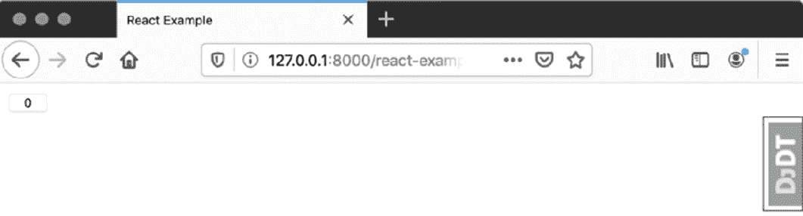

图 16.6：计数为 0 的按钮

点击按钮几次后，按钮看起来如图 16.7 所示：

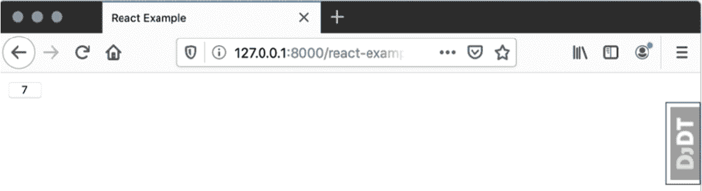

图 16.7：点击七次后的按钮

现在，为了演示如何**不**编写`render`函数，我们将看看如果我们只是像这样返回 HTML 字符串会发生什么：

```py
render() {
    return '<button>' + this.state.clickCount + '</button>'
}
```

现在渲染的页面看起来如图 16.8 所示：

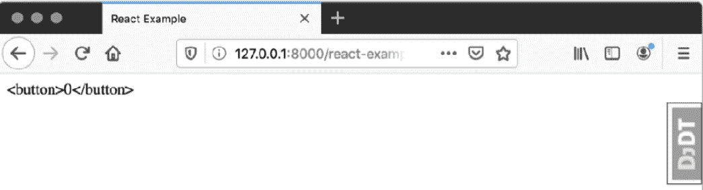

图 16.8：作为字符串返回的 HTML

这展示了 React 自动转义 HTML 的功能。现在我们已经对 JavaScript 和 React 有了简要的介绍，让我们在 Bookr 中添加一个示例页面，以便您可以看到它的实际应用。

## 练习 16.01：设置 React 示例

在这个练习中，我们将创建一个示例视图和模板，用于与 React 一起使用。然后我们将实现`ClickCounter`组件。在练习结束时，您将能够通过`ClickCounter`按钮与之交互：

1.  在 PyCharm 中，进入项目`static`目录下的`New` -> `File`。将新文件命名为`react-example.js`。

1.  在其中，放入以下代码，这将定义 React 组件，然后将其渲染到我们将要创建的`react_container` `<div>`中：

    ```py
    const e = React.createElement;
    class ClickCounter extends React.Component {
      constructor(props) {
        super(props);
        this.state = { clickCount: 0 };
      }
      render() {
        return e(
          'button',
          { onClick: () => this.setState({ 
               clickCount: this.state.clickCount + 1 
               }) 
    },
          this.state.clickCount
        );
      }
    }
    ReactDOM.render(e(ClickCounter), document.getElementById   ('react_container'))
    ```

    您现在可以保存`react-example.js`。

1.  进入项目`templates`目录下的`New` -> `HTML File`：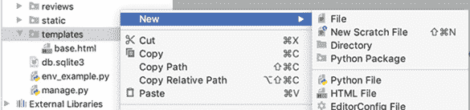

    图 16.9：创建一个新的 HTML 文件

    将新文件命名为`react-example.html`：

    

    图 16.10：将文件命名为 react-example.html

    你可以在 `<title>` 元素内部更改标题为 *React Example*，但这对于这个练习不是必需的。

1.  `react-example.html` 是使用一些之前看到的 HTML 模板创建的。在关闭 `</body>` 标签之前添加以下 `<script>` 标签来包含 React：

    ```py
    <script crossorigin src="img/react.development.js"></script>
    <script crossorigin src="img/react-dom.development.js"></script>
    ```

1.  `react-example.js` 文件将通过 `<script>` 标签被包含，我们需要使用 `static` 模板标签生成脚本路径。首先，在文件的开始处通过在第二行添加以下内容来 `load` 静态模板库：

    ```py
    
    ```

    你文件的前几行看起来像 *图 16.11*：

    

    ```py
    <script src="img/"></script>
    ```

1.  我们现在需要添加 React 将要渲染的包含 `<div>`。在打开 `<body>` 标签之后添加此元素：

    ```py
    <div id="react_container"></div>
    ```

    你可以保存 `react-example.html`。

1.  现在我们将添加一个视图来渲染模板。打开 `reviews` 应用程序的 `views.py` 文件，并在文件末尾添加一个 `react_example` 视图：

    ```py
    def react_example(request):
        return render(request, "react-example.html")
    ```

    在这个简单的视图中，我们只是渲染了 `react-example.html` 模板，没有上下文数据。

1.  最后，我们需要将一个 URL 映射到新的视图。打开 `bookr` 包的 `urls.py` 文件。将此映射添加到 `urlpatterns` 变量中：

    ```py
    path('react-example/', reviews.views.react_example)
    ```

    你可以保存并关闭 `urls.py`。

1.  如果它还没有运行，请启动 Django 开发服务器，然后转到 `http://127.0.0.1:8000/react-example/`。你应该会看到像 *图 16.12* 中所示的 `ClickCount` 按钮被渲染：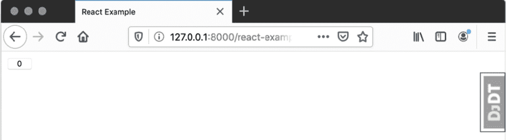

图 16.12：ClickCount 按钮

尝试点击按钮几次，并观察计数器的增加。

在这个例子中，我们创建了我们的第一个 React 组件，然后添加了一个模板和视图来渲染它。我们从 CDN 中包含了 React 框架源。在下一节中，我们将介绍 **JSX**，这是一种将模板和代码合并到单个文件中的方法，可以简化我们的代码。

## JSX

使用 `React.createElement` 函数定义每个元素可能会相当冗长——即使我们将其别名到更短变量名。当我们开始构建更大的组件时，冗长性会加剧。

当使用 React 时，我们可以使用 JSX 来构建 HTML 元素。JSX 代表 JavaScript XML——因为 JavaScript 和 XML 都写在同一文件中。例如，考虑以下代码，我们使用 `render` 方法创建了一个按钮：

```py
return React.createElement('button', { onClick: … },   'Button Text')
```

而不是这样做，我们可以直接返回其 HTML，如下所示：

```py
return <button onClick={…}>Button Text</button>;
```

注意，HTML 没有被引号括起来并作为字符串返回。也就是说，我们不是这样做：

```py
return '<button onClick={…}>Button Text</button>';
```

由于 JSX 是一种不寻常的语法（HTML 和 JavaScript 在单个文件中的组合），在使用它之前，我们需要包含另一个 JavaScript 库：Babel ([`babeljs.io`](https://babeljs.io))。这是一个可以在不同版本的 JavaScript 之间 *转换* 代码的库。您可以使用最新的语法编写代码，并将其 *转换*（翻译和编译）为旧浏览器可以理解的代码版本。

Babel 可以通过以下 `<script>` 标签包含：

```py
<script crossorigin src="img/  babel.min.js"></script>
```

这应该在您的其他与 React 相关的脚本标签之后，但在包含任何包含 JSX 的文件之前。

任何包含 JSX 的 JavaScript 源代码都必须添加 `type="text/babel"` 属性：

```py
<script src="img/file.js" type="text/babel"></script>
```

这样做是为了让 Babel 知道解析文件而不是仅仅将其视为纯 JavaScript。

注意

注意，以这种方式使用 Babel 对于大型项目来说可能会很慢。它被设计为作为 `npm` 项目构建过程的一部分使用，并且要在编译前将 JSX 文件转换为代码（而不是像我们现在这样实时转换）。`npm` 项目的设置超出了本书的范围。就我们的目的而言，以及我们使用的少量 JSX，使用 Babel 将是合适的。

JSX 使用大括号在 HTML 中包含 JavaScript 数据，类似于 Django 模板中的双大括号。大括号内的 JavaScript 将被执行。我们现在将看看如何将我们的按钮创建示例转换为 JSX。我们的 `render` 方法可以更改为以下内容：

```py
render() {
    return <button onClick={() =>this.setState({ 
            clickCount: this.state.clickCount + 1 
          })
    }>
    {this.state.clickCount}
</button>;
  }
```

注意，`onClick` 属性的值周围没有引号；相反，它被括号包围。这是将定义在行内的 JavaScript 函数传递给组件。它将在传递给 `constructor` 方法的组件的 `props` 字典中可用。例如，假设我们像这样传递它：

```py
onClick="() =>this.setState…"
```

在这种情况下，它将以字符串值的形式传递给组件，因此不会工作。

我们还在 `button` 的内容中渲染了 `clickCount` 的当前值。JavaScript 也可以在这些大括号内执行。要显示点击次数加一，我们可以这样做：

```py
{this.state.clickCount + 1}
```

在下一个练习中，我们将 Babel 包含到我们的模板中，然后转换我们的组件以使用 JSX。

## 练习 16.02：JSX 和 Babel

在这个练习中，我们想在组件中实现 JSX 以简化我们的代码。为此，我们需要对 `react-example.js` 文件和 `react-example.html` 文件进行一些更改，以切换到 JSX 来渲染 `ClickCounter`：

1.  在 PyCharm 中，打开 `react-example.js` 并将 `render` 方法更改为使用 JSX，通过替换以下代码。您可以参考 *练习 16.01* 中的 *步骤 2*，*设置 React 示例*，其中我们定义了此方法：

    ```py
    render() {
    return <button onClick={() => this.setState({ 
           clickCount: this.state.clickCount + 1 
           })
        }>
        {this.state.clickCount}
    </button>;  }
    ```

1.  现在，我们可以将 `ClickCounter` 视为一个元素本身。在文件末尾的 `ReactDOM.render` 调用中，您可以替换第一个参数，`e(ClickCounter)`，为 `<ClickCounter/>` 元素，如下所示：

    ```py
    ReactDOM.render(<ClickCounter/>, document.getElementById   ('react_container'));
    ```

1.  由于我们不再使用在*练习 16.01*的*步骤 2*中创建的`React.create`函数，我们可以删除我们创建的别名；删除第一行：

    ```py
    const e = React.createElement;
    ```

    你可以保存并关闭文件。

1.  打开`react-example.html`模板。你需要包含 Babel 库 JavaScript。在 React `script`元素和`react-example.js`元素之间添加以下代码：

    ```py
    <script crossorigin src="img/babel.min.js"></script>
    ```

1.  在`react-example.html`的`<script>`标签中添加一个`type="text/babel"`属性：

    ```py
    <script src="img/" type="text/babel"></script>
    ```

    保存`react-example.html`。

1.  如果 Django 开发服务器尚未运行，请启动它并转到`http://127.0.0.1:8000/react-example/`。你应该看到我们之前有的相同按钮（*图 16.12*）。当你点击按钮时，你应该看到计数增加。

在这个练习中，我们没有改变`ClickCounter` React 组件的行为。相反，我们重构了它以使用 JSX。这使得直接将组件的输出作为 HTML 编写变得更容易，并且减少了我们需要编写的代码量。在下一节中，我们将探讨如何向 JSX React 组件传递属性。

## JSX 属性

基于 JSX 的 React 组件上的属性设置方式与标准 HTML 元素上的属性设置方式相同。重要的是要记住，你是将它们作为字符串还是 JavaScript 值来设置的。

让我们通过使用`ClickCounter`组件来查看一些示例。假设我们想要扩展`ClickCounter`，以便可以指定一个`target`数字。当达到目标时，按钮应该被替换为文本`Well done, <name>!`。这些值应该作为属性传递给`ClickCounter`。

当使用变量时，我们必须将它们作为 JSX 值传递：

```py
let name = 'Ben'
let target = 5;
ReactDOM.render(<ClickCounter name={name} target={target}/>,   document.getElementById('react_container'));
```

我们也可以混合匹配传递值的方法。这也是有效的：

```py
ReactDOM.render(<ClickCounter name="Ben" target={5}/>,   document.getElementById('react_container'));
```

在下一个练习中，我们将更新`ClickCounter`以从属性中读取这些值并更改其在达到目标时的行为。我们将从 Django 模板中传递这些值。

## 练习 16.03：React 组件属性

在这个练习中，你将修改`ClickCounter`以从其`props`中读取`target`和`name`的值。你将从 Django 视图传递这些值，并使用`escapejs`过滤器使`name`值在 JavaScript 字符串中使用时安全。完成之后，你将能够点击按钮直到它达到目标，然后看到`Well done`消息：

1.  在 PyCharm 中，打开`reviews`应用的`views.py`。我们将修改`react_example`视图的`render`调用，传递一个包含`name`和`target`的上下文，如下所示：

    ```py
    return render(request, "react-example.html", {"name": "Ben", \
                                                  "target": 5})
    ```

    如果你喜欢，你可以使用自己的名字并选择不同的目标值。保存`views.py`。

1.  打开`react-example.js`文件。我们将更新`constructor`方法中的`state`设置，从`props`中设置名称和目标，如下所示：

    ```py
    constructor(props) {
        super(props);
        this.state = { clickCount: 0, name: props.name, target:       props.target
        };
    }
    ```

1.  将`render`方法的行为更改为在达到`target`后返回`Well done, <name>!`。在`render`方法中添加此`if`语句：

    ```py
    if (this.state.clickCount === this.state.target) {
        return <span>Well done, {this.state.name}!</span>;
    }
    ```

1.  要传递值，请将 `ReactDOM.render` 调用移动到模板中，以便 Django 可以渲染这段代码。从 `react-example.js` 的末尾剪切此 `ReactDOM.render` 行：

    ```py
    ReactDOM.render(<ClickCounter/>, document.getElementById   ('react_container'));
    ```

    我们将在 *第 6 步* 中将其粘贴到模板文件中。现在 `react-example.js` 应该只包含 `ClickCounter` 类。保存并关闭文件。

1.  打开 `react-example.html`。在所有现有的 `<script>` 标签之后（但在关闭的 `</body>` 标签之前），添加带有 `type="text/babel"` 属性的打开和关闭 `<script>` 标签。在里面，我们需要将传递给模板的 Django 上下文值分配给 JavaScript 变量。总共，你应该添加以下代码：

    ```py
    <script type="text/babel">
    let name = "{{ name|escapejs }}";
    let target = {{ target }};
    </script>
    ```

    第一个将 `name` 变量与 `name` 上下文变量赋值。我们使用 `escapejs` 模板过滤器；否则，如果我们的名字中包含双引号，我们可能会生成无效的 JavaScript 代码。第二个值 `target` 从 `target` 赋值。这是一个数字，所以它不需要转义。

    注意

    由于 Django 对 JavaScript 的值进行了转义，`name` 不能直接像这样传递到组件属性中：

    `<ClickCounter name="{{ name|escapejs }}"/>`

    JSX 不会正确地取消转义值，你最终会得到转义序列。

    然而，你可以像这样传递数值 `target`：

    `<ClickCounter target="{ {{ target }} }"/>`

    此外，请注意 Django 大括号和 JSX 大括号之间的间距。在这本书中，我们将坚持首先将所有属性分配给变量，然后传递给组件，以保持一致性。

1.  在这些变量声明下面，粘贴从 `react-example.js` 复制的 `ReactDOM.render` 调用。然后，向 `ClickCounter` 添加 `target={ target }` 和 `name={ name }` 属性。记住，这些是正在传递的 JavaScript 变量，而不是 Django 上下文变量——它们只是碰巧有相同的名字。现在的 `<script>` 块应该看起来像这样：

    ```py
    <script type="text/babel">
        let name = "{{ name|escapejs }}";
        let target = {{ target }};
        ReactDOM.render(<ClickCounter name={ name }       target={ target }/>, document.getElementById         ('react_container'));
    </script>
    ```

    你可以保存 `react-example.html`。

1.  如果 Django 开发服务器尚未运行，请先启动它，然后转到 `http://127.0.0.1:8000/react-example/`。尝试点击按钮几次——它应该增加，直到你点击它 `target` 次数。然后，它将被替换为 `Well done, <name>!` 文本。见 *图 16.13* 了解点击足够次数后的样子：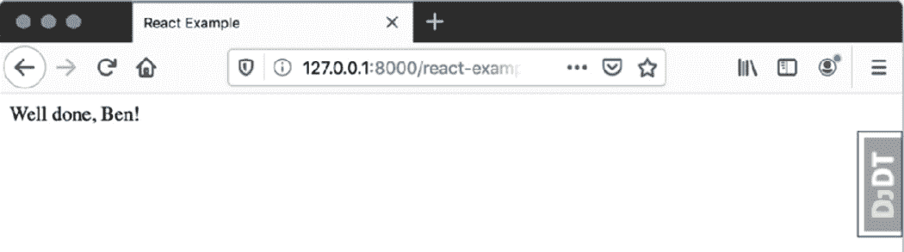

图 16.13：完成信息

在这个练习中，我们使用 `props` 将数据传递给 React 组件。我们在将数据分配给 JavaScript 变量时使用了 `escapejs` 模板过滤器进行了转义。在下一节中，我们将介绍如何使用 JavaScript 通过 HTTP 获取数据。

进一步阅读

对于一个更详细、更实用的 React 课程，你可以随时参考 *The React Workshop*：[`courses.packtpub.com/courses/react`](https://courses.packtpub.com/courses/react)。

## JavaScript Promises

为了防止在长运行操作上阻塞，许多 JavaScript 函数都是异步实现的。它们的工作方式是立即返回，然后在结果可用时调用回调函数。这些类型函数返回的对象是`Promise`。通过调用其`then`方法，向`Promise`对象提供回调函数。当函数运行完成后，它将要么解析`Promise`（调用`success`函数）要么拒绝它（调用`failure`函数）。

我们将通过一个假设的长运行函数来展示错误和正确使用 Promise 的方式，该函数执行一个大的计算，称为`getResult`。它不是返回结果，而是返回一个`Promise`。你不会像这样使用它：

```py
const result = getResult();
console.log(result);  // incorrect, this is a Promise
```

而应该像这样调用，将回调函数传递给返回的`Promise`上的`then`。我们将假设`getResult`永远不会失败，所以我们只为解析情况提供一个`success`函数：

```py
const promise = getResult();
promise.then((result) => {
    console.log(result);  /* this is called when the Promise       resolves*/
});
```

通常，你不会将返回的`Promise`赋值给变量。相反，你会将`then`调用链接到函数调用上。我们将在下一个示例中展示这一点，包括一个失败回调（假设`getResult`现在可能失败）。我们还将添加一些注释来说明代码执行的顺序：

```py
getResult().then( 
(result) => {
        // success function
        console.log(result);  
// this is called 2nd, but only on success
}, 
    () => {
        // failure function
        console.log("getResult failed");
        // this is called 2nd, but only on failure
})
// this will be called 1st, before either of the callbacks
console.log("Waiting for callback");
```

现在我们已经介绍了 Promise，我们可以看看`fetch`函数，它用于发起 HTTP 请求。它是异步的，通过返回 Promise 来工作。

## fetch

大多数浏览器（95%）支持一个名为`fetch`的函数，允许你发起 HTTP 请求。它使用带有 Promise 的异步回调接口。

`fetch`函数接受两个参数。第一个是要发起请求的 URL，第二个是一个包含请求设置的（字典）对象。例如，考虑以下内容：

```py
const promise = fetch("http://www.google.com", {…settings});
```

设置包括以下内容：

+   `method`：请求的 HTTP 方法（`GET`、`POST`等）。

+   `headers`：另一个要发送的 HTTP 头部的（字典）对象。

+   `body`：要发送的 HTTP 正文（用于`POST`/`PUT`请求）。

+   `credentials`：默认情况下，`fetch`不会发送任何 cookie。这意味着你的请求将表现得像你没有认证。为了使其在请求中设置 cookie，这应该设置为`same-origin`或`include`的值。

让我们用一个简单的请求来实际看看：

```py
fetch('/api/books/', {
    method: 'GET',
    headers: {
        Accept: 'application/json'
    }
}).then((resp) => {
    console.log(resp)
})
```

这段代码将从`/api/book-list/`获取数据，然后调用一个函数，使用`console.log`将请求记录到浏览器的控制台。

*图 16.14*显示了 Firefox 中前一个响应的控制台输出：

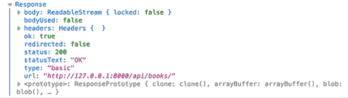

图 16.14：控制台中的响应输出

如您所见，输出的信息并不多。在我们能够处理它之前，我们需要解码响应。我们可以使用响应对象的`json`方法来解码响应体到一个 JSON 对象。这也返回一个`Promise`，所以我们将请求获取 JSON，然后在回调中处理数据。完成这个操作的完整代码块如下所示：

```py
fetch('/api/books/', {
    method: 'GET',
    headers: {
        Accept: 'application/json'
    }
}).then((resp) => {
    return resp.json(); // doesn't return JSON, returns a Promise
}).then((data) => {
    console.log(data);
});
```

这将在浏览器控制台中记录解码后的 JSON 格式的对象。在 Firefox 中，输出看起来像*图 16.15*：

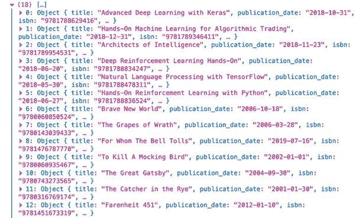

图 16.15：解码后的书单输出到控制台

在*练习 16.04*，*获取和渲染书籍*中，我们将编写一个新的 React 组件，该组件将获取书籍列表并将其渲染为列表项（`<li>`）。在此之前，我们需要了解 JavaScript 的`map`方法以及如何使用它来构建 React 中的 HTML。

### JavaScript 的 map 方法

有时候我们想要对同一块代码（JavaScript 或 JSX）进行多次执行，针对不同的输入数据。在本章中，这将最有用，用于生成具有相同 HTML 标签但不同内容的 JSX 元素。在 JavaScript 中，`map`方法遍历目标数组，然后对数组中的每个元素执行一个回调函数。然后，这些元素被添加到一个新数组中，该数组随后被返回。例如，这个简短片段使用`map`将`numbers`数组中的每个数字翻倍：

```py
const numbers = [1, 2, 3];
const doubled = numbers.map((n) => {
    return n * 2;
});
```

`doubled`数组现在包含值`[2, 4, 6]`。

我们也可以使用这种方法创建一个 JSX 值的列表。需要注意的是，列表中的每个项目都必须设置一个唯一的`key`属性。在接下来的这个简短示例中，我们将一个数字数组转换成`<li>`元素。然后我们可以将它们放在`<ul>`内部。以下是一个示例`render`函数来完成这个操作：

```py
render() {
    const numbers = [1, 2, 3];
    const listItems = numbers.map((n) => {
      return <li key={n}>{n}</li>;
      });
    return <ul>{listItems}</ul>
}
```

当渲染时，这将生成以下 HTML：

```py
<ul>
<li>1</li>
<li>2</li>
<li>3</li>
</ul>
```

在下一个练习中，我们将构建一个 React 组件，其中包含一个按钮，当点击时将从 API 获取书籍列表。然后显示书籍列表。

## 练习 16.04：获取和渲染书籍

在这个练习中，你将创建一个名为`BookDisplay`的新组件，该组件在`<ul>`内部渲染一个书籍数组。这些书籍将通过`fetch`获取。为此，我们将 React 组件添加到`react-example.js`文件中。然后，我们将书籍列表的 URL 传递到 Django 模板中的组件内部：

1.  在 PyCharm 中，打开`react-example.js`，这是你在*练习 16.03*的*React 组件属性*步骤 9 中使用的。你可以删除整个`ClickCounter`类。

1.  创建一个名为`BookDisplay`的新类，该类从`React.Component`扩展。

1.  然后，添加一个`constructor`方法，它接受`props`作为参数。它应该调用`super(props)`，然后设置其状态如下：

    ```py
    this.state = { books: [], url: props.url, fetchInProgress:   false };
    ```

    这将初始化`books`为一个空数组，从传入的属性`url`中读取 API URL，并将`fetchInProgress`标志设置为`false`。你的`constructor`方法的代码应该如下所示：

    ```py
    constructor(props) {
      super(props);
      this.state = { books: [], url: props.url, fetchInProgress:   false };
    }
    ```

1.  接下来，添加一个`doFetch`方法。你可以复制并粘贴以下代码来创建它：

    ```py
    doFetch() {
      if (this.state.fetchInProgress)
          return;
    this.setState({ fetchInProgress: true })
      fetch(this.state.url, {
          method: 'GET',
          headers: {
              Accept: 'application/json'
          }
      }
      ).then((response) => {
          return response.json();
      }).then((data) => {
    this.setState({ fetchInProgress: false, books: data })
      })
    }
    ```

    首先，使用`if`语句检查是否已经启动了获取操作。如果是，我们从函数中返回。然后，我们使用`setState`来更新状态，将`fetchInProgress`设置为`true`。这将同时更新我们的按钮显示文本并阻止同时运行多个请求。然后，我们`fetch``this.state.url`（我们将在练习的稍后通过模板传递）。使用`GET`方法检索响应，我们只想`Accept` JSON 响应。在获取响应后，我们使用`json`方法返回其 JSON。这返回一个`Promise`，因此我们使用另一个`then`来处理当 JSON 被解析时的回调。在那个最后的回调中，我们设置组件的状态，将`fetchInProgress`恢复为`false`，并将`books`数组设置为解码后的 JSON 数据。

1.  接下来，创建`render`方法。你也可以复制并粘贴以下代码：

    ```py
    render() {
      const bookListItems = this.state.books.map((book) => {
          return <li key={ book.pk }>{ book.title }</li>;
      })
      const buttonText = this.state.fetchInProgress  ? 
      'Fetch in Progress' : 'Fetch';
      return <div>
    <ul>{ bookListItems }</ul>
    <button onClick={ () =>this.doFetch() } 
            disabled={ this.state.fetchInProgress }>
              {buttonText}
    </button>
    </div>;
    }
    ```

    这使用`map`方法遍历`state`中的书籍数组。我们为每本书生成一个`<li>`，使用书的`pk`作为列表项的`key`实例。`<li>`的内容是书的标题。我们定义一个`buttonText`变量来存储（并更新）按钮将显示的文本。如果我们当前有一个正在运行的`fetch`操作，那么这将显示为*获取中*。否则，它将是*获取*。最后，我们返回一个包含我们想要的所有数据的`<div>`。`<ul>`的内容是`bookListItems`变量（`<li>`实例的数组）。它还包含一个以类似方式添加的`<button>`实例。`onClick`方法调用类的`doFetch`方法。如果有一个获取操作正在进行，我们可以使按钮`disabled`（即用户不能点击按钮）。我们将按钮文本设置为之前创建的`buttonText`变量。现在你可以保存并关闭`react-example.js`。

1.  打开`react-example.html`。我们需要用`BookDisplay`渲染（来自*练习 16.03*，*React 组件属性*）替换`ClickCounter`渲染。删除`name`和`target`变量定义。我们将渲染`<BookDisplay>`。将`url`属性设置为字符串，并传入书籍列表 API 的 URL，使用``模板标签生成它。`ReactDOM.render`调用应该如下所示：

    ```py
    ReactDOM.render(<BookDisplay url="" />,  document.getElementById('react_container'));
    ```

    现在，你可以保存并关闭`react-example.html`。

1.  如果 Django 开发服务器尚未运行，请启动它，然后访问`http://127.0.0.1:8000/react-example/`。你应该在页面上看到一个单独的`Fetch`按钮（*图 16.16*）：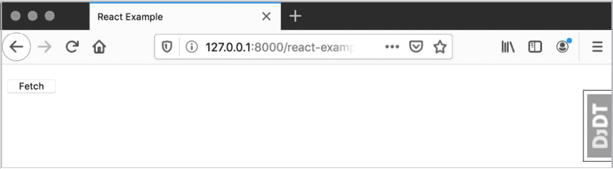

图 16.16：获取书籍按钮

点击“获取”按钮后，它应该变为禁用状态，并更改其文本为“获取中”，正如我们在这里看到的：

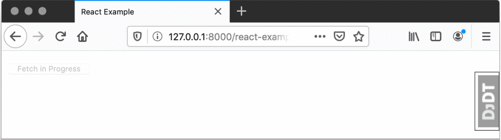

图 16.17：获取中

获取完成后，你应该看到以下渲染的书籍列表：

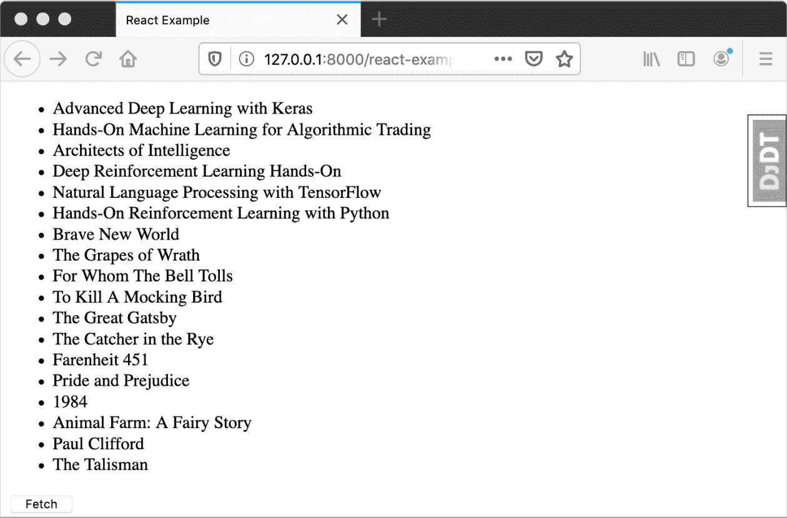

图 16.18：书籍获取完成

这个练习是整合 React 与你在第十二章“构建 REST API”中构建的 Django REST API 的机会。我们创建了一个新的组件（`BookDisplay`），通过调用`fetch`来获取书籍列表。我们使用 JavaScript 的`map`方法将书籍数组转换为一些`<li>`元素。正如我们之前看到的，我们使用`button`在点击时触发`fetch`。然后，我们将书籍列表 API URL 提供给 Django 模板中的 React 组件。后来，我们在 Bookr 中看到了使用 REST API 动态加载的书籍列表。

在我们进入本章的活动之前，我们将讨论与其他 JavaScript 框架一起使用 Django 时的注意事项。

## 原文模板标签

我们已经看到，当使用 React 时，我们可以在 Django 模板中使用 JSX 插值值。这是因为 JSX 使用单大括号进行插值，而 Django 使用双大括号。只要 JSX 和 Django 大括号之间有空格，它应该可以正常工作。

其他框架，如 Vue，也使用双大括号进行变量插值。这意味着如果你在模板中有 Vue 组件的 HTML，你可能尝试像这样进行插值：

```py
<h1>Hello, {{ name }}!</h1>
```

当然，当 Django 渲染模板时，它会在 Vue 框架有机会渲染之前先插值`name`值。

我们可以使用`verbatim`模板标签让 Django 按模板中显示的原始数据输出，而不进行任何渲染或变量插值。与前面的示例一起使用它很简单：

```py

<h1>Hello, {{ name }}!</h1>

```

现在当 Django 渲染模板时，模板标签之间的 HTML 将按原样输出，允许 Vue（或另一个框架）接管并自行插值变量。许多其他框架将它们的模板分离到自己的文件中，这不应与 Django 的模板冲突。

有许多 JavaScript 框架可供选择，你最终决定使用哪个将取决于你自己的意见或你公司/团队使用的框架。如果你遇到冲突，解决方案将取决于你的特定框架。本节中的示例应该能帮助你找到正确的方向。

我们现在已经涵盖了你需要将 React（或其他 JavaScript 框架）与 Django 集成的多数内容。在下一个活动中，你将应用这些知识来获取 Bookr 上最新的评论。

## 活动十六点零一：预览评论

在这个活动中，我们将更新 Bookr 主页面以获取最近的六条评论并显示它们。用户将能够点击按钮前进到下一条六条评论，然后返回到之前的评论。

这些步骤将帮助你完成活动：

1.  首先，我们可以清理一些之前练习中的代码。如果你喜欢，可以备份这些文件以备将来参考。或者，你也可以使用 GitHub 版本，以备将来参考。删除`react_example`视图、`react-example` URL、`react-example.html`模板和`react-example.js`文件。

1.  创建一个`recent-reviews.js`静态文件。

1.  创建两个组件，一个用于显示单个评论数据的`ReviewDisplay`组件，另一个用于获取评论数据并显示`ReviewDisplay`组件列表的`RecentReviews`组件。

    首先，创建`ReviewDisplay`类。在其构造函数中，你应该读取通过`props`传递的`review`并将其分配给状态。

1.  `ReviewDisplay`的`render`方法应返回类似以下的 JSX HTML：

    ```py
    <div className="col mb-4">
    <div className="card">
    <div className="card-body">
    <h5 className="card-title">{ BOOK_TITLE }
    <strong>({ REVIEW_RATING })</strong>
    </h5>
    <h6 className="card-subtitle mb-2 text-muted">CREATOR_EMAIL</h6>
    <p className="card-text">REVIEW_CONTENT</p>
    </div>
    <div className="card-footer">
    <a href={'/books/' + BOOK_ID` + '/' } className="card-link">  View Book</a>
    </div>
    </div>
    </div>
    ```

    然而，你应该用组件获取的`review`中的适当值替换`BOOK_TITLE`、`REVIEW_RATING`、`CREATOR_EMAIL`、`REVIEW_CONTENT`和`BOOK_ID`占位符。

    注意

    注意，当使用 JSX 和 React 时，元素的`class`是通过`className`属性设置的，而不是`class`。当它被渲染为 HTML 时，它变为`class`。

1.  创建另一个名为`RecentReviews`的 React 组件。它的`constructor`方法应使用以下键/值设置`state`：

    `reviews`: `[]`（空列表）

    `currentUrl`: `props.url`

    `nextUrl`: `null`

    `previousUrl`: `null`

    `loading`: `false`

1.  实现一个从 REST API 下载评论的方法。命名为`fetchReviews`。如果`state.loading`为`true`，则应立即返回。然后，应将`state`的`loading`属性设置为`true`。

1.  以与*练习 16.04*中相同的方式实现`fetch`。它应遵循请求`state.currentUrl`并从响应中获取 JSON 数据的相同模式。然后，在`state`中设置以下值：

    `loading`: `false`

    `reviews`: `data.results`

    `nextUrl`: `data.next`

    `previousUrl`: `data.previous`

1.  实现一个`componentDidMount`方法。这是一个当 React 将组件加载到页面上时被调用的方法。它应该调用`fetchReviews`方法。

1.  创建一个`loadNext`方法。如果`state`中的`nextUrl`为 null，则应立即返回。否则，应将`state.currentUrl`设置为`state.nextUrl`，然后调用`fetchReviews`。

1.  类似地，创建一个`loadPrevious`方法；然而，这个方法应将`state.currentUrl`设置为`state.previousUrl`。

1.  实现渲染方法。如果状态为加载中，则应在`<h5>`元素内返回文本`Loading…`。

1.  创建两个变量来存储`previousButton`和`nextButton`的 HTML。它们都应该有`btn btn-secondary`类，并且下一个按钮也应该有`float-right`类。如果相应的`previousUrl`或`nextUrl`属性是`null`，则它们的`disabled`属性应设置为`true`。它们的`onClick`属性应设置为调用`loadPrevious`或`loadNext`方法。按钮文本应为“上一页”或“下一页”。

1.  使用`map`方法遍历评论并将结果存储到一个变量中。每个`review`应该由一个具有`key`属性设置为评论的`pk`和`review`设置为`Review`类的`ReviewDisplay`组件表示。如果没有评论（`reviews.length === 0`），则该变量应是一个包含内容*没有评论可显示*的`<h5>`元素。

1.  最后，将所有内容包裹在`<div>`元素中，如下所示：

    ```py
    <div>
    <div className="row row-cols-1 row-cols-sm-2 row-cols-md-3">
          { reviewItems }
    </div>
    <div>
          {previousButton}
          {nextButton}
    </div>
    </div>
    ```

    我们在这里使用的`className`将根据屏幕大小显示每个评论预览为一列、两列或三列。

1.  接下来，编辑`base.html`。你将在`content`块内添加所有新内容，这样它就不会在覆盖此块的非主页面上显示。添加一个包含内容`Recent Reviews`的`<h4>`元素。

1.  为 React 渲染添加一个`<div>`元素。确保你给它一个唯一的`id`。

1.  包含`<script>`标签以包含 React、React DOM、Babel 和`recent-reviews.js`文件。这四个标签应该与你在*练习 16.04*、*获取和渲染书籍*中使用的类似。

1.  需要添加的最后一件事是另一个包含`ReactDOM.render`调用代码的`<script>`标签。正在渲染的根组件是`RecentReviews`。它应该有一个`url`属性设置为`url="?limit=6"`的值。这会对`ReviewViewSet`进行 URL 查找，然后追加一个页面大小参数`6`，将检索到的评论数量限制在最多`6`条。

完成这些步骤后，你应该能够导航到`http://127.0.0.1:8000/`（主 Bookr 页面）并看到如下页面：

![图 16.19：完成的评论预览]

![图片 B15509_16_19.jpg]

图 16.19：完成的评论预览

在截图上，页面已经滚动以显示“上一页”/“下一页”按钮。注意“上一页”按钮已被禁用，因为我们处于第一页。

如果你点击“下一页”，你应该看到下一页的评论。如果你多次点击“下一页”（取决于你有多少评论），你最终会到达最后一页，然后“下一页”按钮将被禁用：

![图 16.20：下一页按钮禁用]

![图片 B15509_16_20.jpg]

图 16.20：下一页按钮禁用

如果你没有评论，你应该看到消息“没有评论可显示”：

![图 16.21：没有评论可显示。文本]

![图片 B15509_16_21.jpg]

图 16.21：没有评论可显示。文本

当页面正在加载评论时，你应该看到文本 `正在加载...`；然而，由于数据是从你的电脑上加载的，它可能只会显示一秒钟：

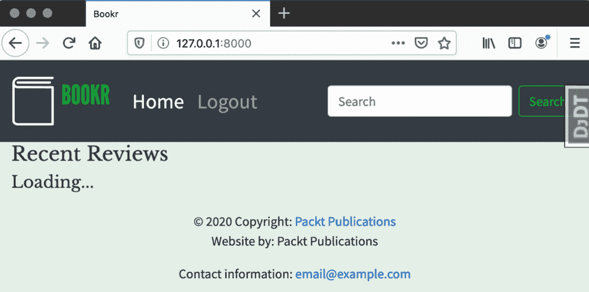

图 16.22：加载文本

注意

该活动的解决方案可以在 [`packt.live/2Nh1NTJ`](http://packt.live/2Nh1NTJ) 找到。

# 摘要

在本章中，我们介绍了 JavaScript 框架，并描述了它们如何与 Django 一起工作以增强模板并添加交互性。我们介绍了 JavaScript 语言及其主要特性、变量类型和类。然后，我们介绍了 React 背后的概念以及它是如何通过使用组件来构建 HTML 的。我们仅使用 JavaScript 和 `React.createElement` 函数构建了一个 React 组件。之后，我们介绍了 JSX 以及它如何通过允许你在 React 组件中直接编写 HTML 来简化组件的开发。我们介绍了 `promises` 和 `fetch` 函数的概念，并展示了如何使用 `fetch` 从 REST API 获取数据。本章以一个练习结束，该练习使用 REST API 从 Bookr 获取评论，并将它们渲染到页面的交互式组件中。

在下一章中，我们将探讨如何将我们的 Django 项目部署到生产型网络服务器。你可以从本书的 GitHub 仓库下载该章节，网址为 [`packt.live/2Kx6FmR`](http://packt.live/2Kx6FmR)。
