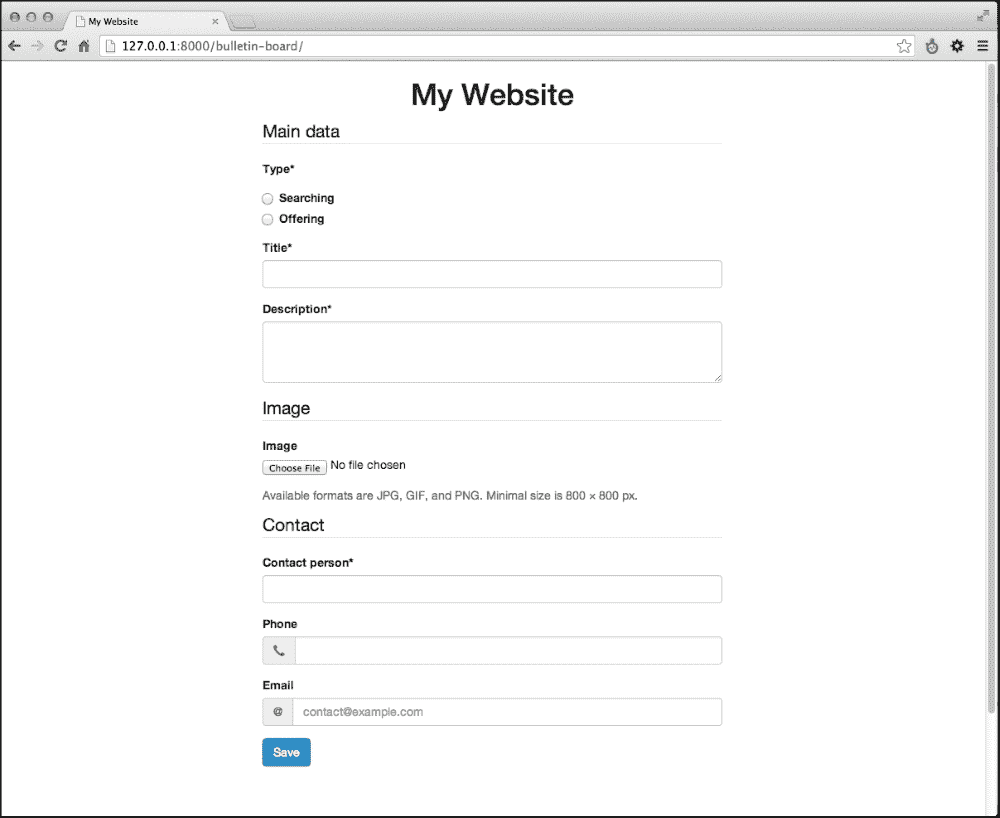
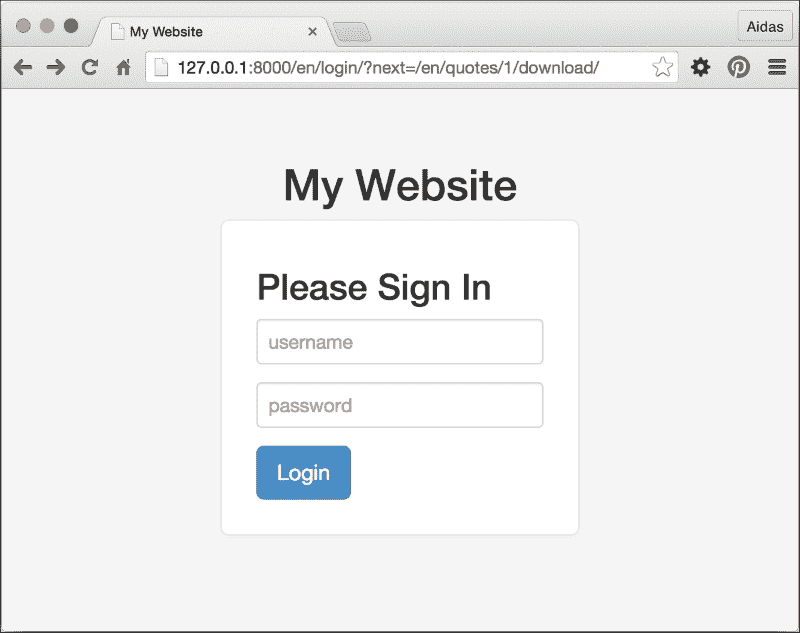
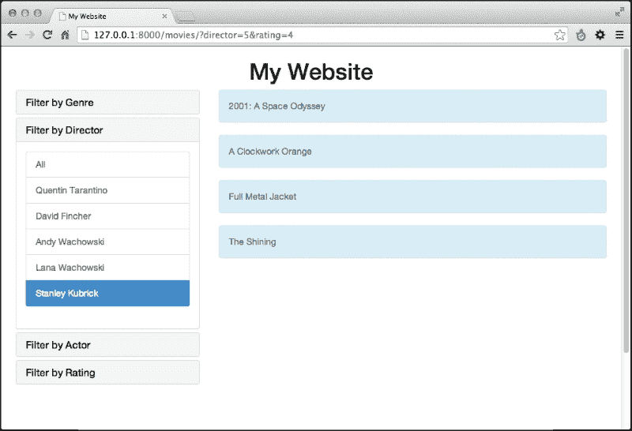
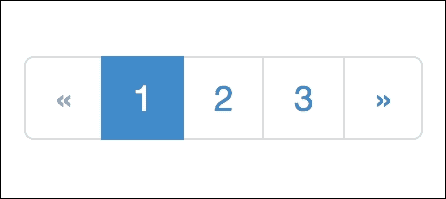
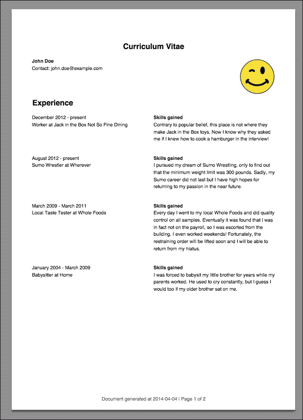
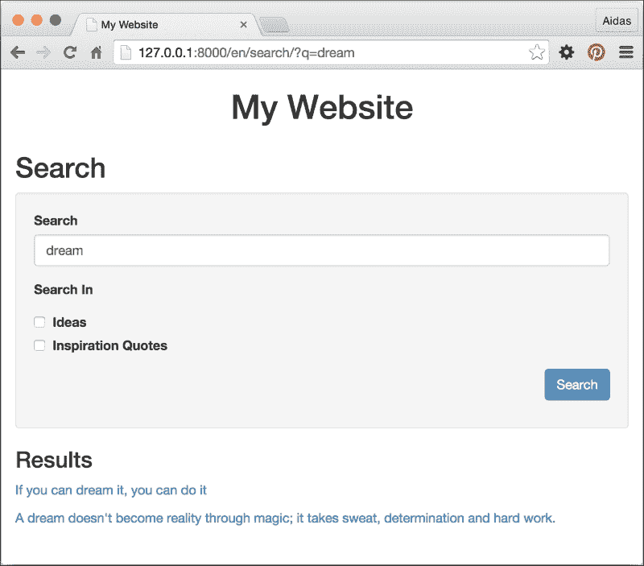

# 第三章。表单和视图

在本章中，我们将涵盖以下主题：

+   将 HttpRequest 传递给表单

+   利用表单的 save 方法

+   上传图片

+   使用 django-crispy-forms 创建表单布局

+   下载授权文件

+   过滤对象列表

+   管理分页列表

+   编写基于类的视图

+   生成 PDF 文档

+   使用 Haystack 实现多语言搜索

# 简介

当在模型中定义数据库结构时，我们需要一些视图让用户输入数据或向他人展示数据。在本章中，我们将重点关注管理表单、列表视图以及生成 HTML 之外输出的视图。对于最简单的示例，我们将把 URL 规则和模板的创建留给你。

# 将 HttpRequest 传递给表单

每个 Django 视图的第一个参数是`HttpRequest`对象，通常命名为`request`。它包含有关请求的元数据。例如，当前语言代码、当前用户、当前 cookie 和当前会话。默认情况下，在视图中使用的表单接受`GET`或`POST`参数、文件、初始数据和其他参数；然而，不接受`HttpRequest`对象。在某些情况下，将`HttpRequest`传递给表单很有用，特别是当你想使用请求数据过滤表单字段的选项或处理保存某些内容，如当前用户或 IP 在表单中时。

在这个菜谱中，我们将看到一个示例表单，人们可以选择一个用户并向他们发送消息。我们将把`HttpRequest`对象传递给表单，以便排除当前用户从收件人选项中；我们不希望任何人给自己发消息。

## 准备工作

让我们创建一个名为`email_messages`的新应用，并将其放入设置中的`INSTALLED_APPS`。此应用将没有模型，只有表单和视图。

## 如何做到这一点...

要完成这个菜谱，执行以下步骤：

1.  在`forms.py`文件中添加一个新的包含两个字段的表单：收件人选择和消息文本。此外，此表单将有一个初始化方法，该方法将接受请求对象，然后修改收件人选择字段的`QuerySet`：

    ```py
    # email_messages/forms.py
    # -*- coding: UTF-8 -*-
    from __future__ import unicode_literals
    from django import forms
    from django.utils.translation import ugettext_lazy as _
    from django.contrib.auth.models import User

    class MessageForm(forms.Form):
        recipient = forms.ModelChoiceField(
            label=_("Recipient"),
            queryset=User.objects.all(),
            required=True,
        )
        message = forms.CharField(
            label=_("Message"),
            widget=forms.Textarea,
            required=True,
        )

        def __init__(self, request, *args, **kwargs):
            super(MessageForm, self).__init__(*args, **kwargs)
     self.request = request
            self.fields["recipient"].queryset = \
                self.fields["recipient"].queryset.\
                exclude(pk=request.user.pk)
    ```

1.  然后，创建包含`message_to_user()`视图的`views.py`文件以处理表单。正如你所看到的，请求对象作为第一个参数传递给表单，如下所示：

    ```py
    # email_messages/views.py
    # -*- coding: UTF-8 -*-
    from __future__ import unicode_literals
    from django.contrib.auth.decorators import login_required
    from django.shortcuts import render, redirect

    from .forms import MessageForm

    @login_required
    def message_to_user(request):
        if request.method == "POST":
            form = MessageForm(request, data=request.POST)
            if form.is_valid():
                # do something with the form
                return redirect("message_to_user_done")
        else:
            form = MessageForm(request)

        return render(request,
            "email_messages/message_to_user.html",
            {"form": form}
        )
    ```

## 它是如何工作的...

在初始化方法中，我们有`self`变量，它代表表单本身的实例，我们还有新添加的`request`变量，然后我们有剩余的位置参数（`*args`）和命名参数（`**kwargs`）。我们调用`super()`初始化方法，将所有位置和命名参数传递给它，以便正确初始化表单。然后，我们将`request`变量分配给表单的新`request`属性，以便在表单的其他方法中稍后访问。然后，我们修改收件人选择字段的`queryset`属性，排除请求中的当前用户。

在视图中，我们将在这两种情况下将`HttpRequest`对象作为第一个参数传递：当表单提交时，以及当它第一次加载时。

## 参见

+   使用表单的保存方法

# 使用表单的保存方法

为了使视图简洁明了，在可能且合理的情况下，将表单数据的处理移动到表单本身是一个好的做法。常见的做法是有一个`save()`方法，它将保存数据，执行搜索或执行其他智能操作。我们将扩展之前菜谱中定义的表单，添加`save()`方法，这将向选定的收件人发送电子邮件。

## 准备工作

我们将基于*将 HttpRequest 传递给表单*菜谱中定义的示例进行构建。

## 如何操作…

要完成这个菜谱，执行以下两个步骤：

1.  从 Django 导入函数以发送电子邮件。然后，将`save()`方法添加到`MessageForm`中。它将尝试向选定的收件人发送电子邮件，如果发生任何错误，它将静默失败：

    ```py
    # email_messages/forms.py
    # -*- coding: UTF-8 -*-
    from __future__ import unicode_literals
    from django import forms
    from django.utils.translation import ugettext,\
        ugettext_lazy as _
    from django.core.mail import send_mail
    from django.contrib.auth.models import User

    class MessageForm(forms.Form):
        recipient = forms.ModelChoiceField(
            label=_("Recipient"),
            queryset=User.objects.all(),
            required=True,
        )
        message = forms.CharField(
            label=_("Message"),
            widget=forms.Textarea,
            required=True,
        )

        def __init__(self, request, *args, **kwargs):
            super(MessageForm, self).__init__(*args, **kwargs)
            self.request = request
            self.fields["recipient"].queryset = \
                self.fields["recipient"].queryset.\
                exclude(pk=request.user.pk)

     def save(self):
     cleaned_data = self.cleaned_data
     send_mail(
     subject=ugettext("A message from %s") % \
     self.request.user,
     message=cleaned_data["message"],
     from_email=self.request.user.email,
     recipient_list=[
     cleaned_data["recipient"].email
     ],
     fail_silently=True,
     )

    ```

1.  然后，如果提交的数据有效，从视图中调用表单的`save()`方法：

    ```py
    # email_messages/views.py
    # -*- coding: UTF-8 -*-
    from __future__ import unicode_literals
    from django.contrib.auth.decorators import login_required
    from django.shortcuts import render, redirect

    from .forms import MessageForm

    @login_required
    def message_to_user(request):
        if request.method == "POST":
            form = MessageForm(request, data=request.POST)
            if form.is_valid():
     form.save()
                return redirect("message_to_user_done")
        else:
            form = MessageForm(request)

        return render(request,
            "email_messages/message_to_user.html",
            {"form": form}
        )
    ```

## 它是如何工作的…

让我们来看看表单。`save()`方法使用表单的清理数据来读取收件人的电子邮件地址和消息。电子邮件的发送者是请求中的当前用户。如果由于邮件服务器配置错误或其他原因无法发送电子邮件，它将静默失败；也就是说，不会引发错误。

现在，让我们看看视图。当提交的表单有效时，表单的`save()`方法将被调用，用户将被重定向到成功页面。

## 参见

+   将 HttpRequest 传递给表单

+   下载授权文件菜谱

# 上传图片

在这个菜谱中，我们将查看处理图像上传的最简单方法。您将看到一个示例应用，访客可以上传带有励志名言的图片。

## 准备工作

确保在您的虚拟环境或全局范围内安装了 Pillow 或 PIL。

然后，让我们创建一个`quotes`应用，并将其放入设置中的`INSTALLED_APPS`。然后，我们将添加一个具有三个字段（`author`、`quote`文本和`picture`）的`InspirationalQuote`模型，如下所示：

```py
# quotes/models.py
# -*- coding: UTF-8 -*-
from __future__ import unicode_literals
import os
from django.db import models
from django.utils.timezone import now as timezone_now
from django.utils.translation import ugettext_lazy as _
from django.utils.encoding import python_2_unicode_compatible

def upload_to(instance, filename):
 now = timezone_now()
 filename_base, filename_ext = os.path.splitext(filename)
 return "quotes/%s%s" % (
 now.strftime("%Y/%m/%Y%m%d%H%M%S"),
 filename_ext.lower(),
 )

@python_2_unicode_compatible
class InspirationalQuote(models.Model):
    author = models.CharField(_("Author"), max_length=200)
    quote = models.TextField(_("Quote"))
    picture = models.ImageField(_("Picture"),
 upload_to=upload_to,
        blank=True,
        null=True,
    )

    class Meta:
        verbose_name = _("Inspirational Quote")
        verbose_name_plural = _("Inspirational Quotes")

    def __str__(self):
        return self.quote
```

此外，我们创建了一个 `upload_to()` 函数，它将上传图片的路径设置为类似于 `quotes/2015/04/20150424140000.png` 的东西。如您所见，我们使用日期时间戳作为文件名以确保其唯一性。我们将此函数传递给 `picture` 图像字段。

## 如何做到这一点...

执行以下步骤以完成配方：

1.  创建 `forms.py` 文件并将一个简单的模型表单放在那里：

    ```py
    # quotes/forms.py
    # -*- coding: UTF-8 -*-
    from __future__ import unicode_literals
    from django import forms
    from .models import InspirationalQuote

    class InspirationalQuoteForm(forms.ModelForm):
        class Meta:
            model = InspirationalQuote
            fields = ["author", "quote", "picture", "language"]
    ```

1.  在 `views.py` 文件中，放置一个处理表单的视图。别忘了将 `FILES` 字典对象传递给表单。当表单有效时，按照以下方式触发保存方法：

    ```py
    # quotes/views.py
    # -*- coding: UTF-8 -*-
    from __future__ import unicode_literals
    from django.shortcuts import redirect
    from django.shortcuts import render
    from .forms import InspirationalQuoteForm

    def add_quote(request):
        if request.method == "POST":
            form = InspirationalQuoteForm(
                data=request.POST,
                files=request.FILES,
            )
            if form.is_valid():
                quote = form.save()
                return redirect("add_quote_done")
        else:
            form = InspirationalQuoteForm()
        return render(request,
            "quotes/change_quote.html",
            {"form": form}
        )
    ```

1.  最后，在 `templates/quotes/change_quote.html` 中创建视图的模板。对于 HTML 表单，设置 `enctype` 属性为 `multipart/form-data` 非常重要，否则文件上传将不会工作：

    ```py
    {# templates/quotes/change_quote.html #}
    
    

    
        <form method="post" action="" enctype="multipart/form-data">
            
            {{ form.as_p }}
            <button type="submit"></button>
        </form>
    
    ```

## 它是如何工作的...

Django 模型表单是从模型创建的表单。它们提供了模型中的所有字段，因此您不需要再次定义它们。在前面的例子中，我们为 `InspirationalQuote` 模型创建了一个模型表单。当我们保存表单时，表单知道如何将每个字段保存到数据库中，以及如何上传文件并将它们保存到媒体目录中。

## 还有更多

作为额外奖励，我们将看到一个如何从上传的图像生成缩略图的例子。使用这种技术，您还可以生成图像的几个其他特定版本，例如列表版本、移动版本和桌面计算机版本。

我们将向 `InspirationalQuote` 模型（`quotes/models.py`）添加三个方法。它们是 `save()`、`create_thumbnail()` 和 `get_thumbnail_picture_url()`。当模型正在保存时，我们将触发缩略图的创建。当我们需要在模板中显示缩略图时，我们可以使用 `{{ quote.get_thumbnail_picture_url }}` 获取其 URL。方法定义如下：

```py
# quotes/models.py
# …
from PIL import Image
from django.conf import settings
from django.core.files.storage import default_storage as storage
THUMBNAIL_SIZE = getattr(
    settings,
    "QUOTES_THUMBNAIL_SIZE",
    (50, 50)
)

class InspirationalQuote(models.Model):
    # …
    def save(self, *args, **kwargs):
        super(InspirationalQuote, self).save(*args, **kwargs)
        # generate thumbnail picture version
        self.create_thumbnail()

    def create_thumbnail(self):
        if not self.picture:
            return ""
        file_path = self.picture.name
        filename_base, filename_ext = os.path.splitext(file_path)
        thumbnail_file_path = "%s_thumbnail.jpg" % filename_base
        if storage.exists(thumbnail_file_path):
            # if thumbnail version exists, return its url path
            return "exists"
        try:
            # resize the original image and
            # return URL path of the thumbnail version
            f = storage.open(file_path, 'r')
            image = Image.open(f)
            width, height = image.size

            if width > height:
                delta = width - height
                left = int(delta/2)
                upper = 0
                right = height + left
                lower = height
            else:
                delta = height - width
                left = 0
                upper = int(delta/2)
                right = width
                lower = width + upper

            image = image.crop((left, upper, right, lower))
            image = image.resize(THUMBNAIL_SIZE, Image.ANTIALIAS)

            f_mob = storage.open(thumbnail_file_path, "w")
            image.save(f_mob, "JPEG")
            f_mob.close()
            return "success"
        except:
            return "error"

    def get_thumbnail_picture_url(self):
        if not self.picture:
            return ""
        file_path = self.picture.name
        filename_base, filename_ext = os.path.splitext(file_path)
        thumbnail_file_path = "%s_thumbnail.jpg" % filename_base
        if storage.exists(thumbnail_file_path):
            # if thumbnail version exists, return its URL path
            return storage.url(thumbnail_file_path)
        # return original as a fallback
        return self.picture.url
```

在前面的方法中，我们使用文件存储 API 而不是直接操作文件系统，这样我们就可以用 Amazon S3 存储桶或其他存储服务替换默认存储，而方法仍然有效。

缩略图的创建是如何工作的？如果我们把原始文件保存为 `quotes/2014/04/20140424140000.png`，我们将检查 `quotes/2014/04/20140424140000_thumbnail.jpg` 文件是否存在，如果不存在，我们将打开原始图像，从中裁剪出中心部分，将其调整到 50 x 50 像素，并将其保存到存储中。

`get_thumbnail_picture_url()` 方法检查缩略图版本是否存储中存在，并返回其 URL。如果缩略图版本不存在，则返回原始图像的 URL 作为后备。

## 参见

+   *使用 django-crispy-forms 创建表单布局* 的配方

# 使用 django-crispy-forms 创建表单布局

`django-crispy-forms` Django 应用允许你使用以下 CSS 框架之一：Uni-Form、Bootstrap 或 Foundation 来构建、自定义和重用表单。`django-crispy-forms`的使用与 Django 贡献的行政中的字段集类似；然而，它更高级且可自定义。你在 Python 代码中定义表单布局，你不需要担心每个字段在 HTML 中的呈现方式。然而，如果你需要添加特定的 HTML 属性或包装，你也可以轻松做到。此外，`django-crispy-forms`使用的所有标记都位于模板中，可以根据特定需求进行覆盖。

在这个配方中，我们将看到一个如何使用 Bootstrap 3 与`django-crispy-forms`结合的示例，Bootstrap 3 是最受欢迎的前端框架，用于开发响应式、以移动端优先的 Web 项目。

## 准备工作

首先，依次执行以下任务：

从[`getbootstrap.com/`](http://getbootstrap.com/)下载 Bootstrap 前端框架，并在模板中集成 CSS 和 JavaScript。更多关于这方面的内容，请参考第四章中的*安排 base.html 模板*配方，*模板和 JavaScript*。

使用以下命令在你的虚拟环境中安装`django-crispy-forms`：

```py
(myproject_env)$ pip install django-crispy-forms

```

确保将`crispy_forms`添加到`INSTALLED_APPS`，然后设置`bootstrap3`为在此项目中使用的模板包：

```py
# conf/base.py or settings.py
INSTALLED_APPS = (
    # …
    "crispy_forms",
)
# …
CRISPY_TEMPLATE_PACK = "bootstrap3"
```

让我们创建一个`bulletin_board`应用来展示`django-crispy-forms`的使用，并将其放入设置中的`INSTALLED_APPS`。我们将有一个`Bulletin`模型，包含以下字段：`bulletin_type`、`title`、`description`、`contact_person`、`phone`、`email`和`image`，如下所示：

```py
# bulletin_board/models.py
# -*- coding: UTF-8 -*-
from __future__ import unicode_literals
from django.db import models
from django.utils.translation import ugettext_lazy as _
from django.utils.encoding import python_2_unicode_compatible

TYPE_CHOICES = (
    ('searching', _("Searching")),
    ('offering', _("Offering")),
)

@python_2_unicode_compatible
class Bulletin(models.Model):
    bulletin_type = models.CharField(_("Type"), max_length=20, choices=TYPE_CHOICES)

    title = models.CharField(_("Title"), max_length=255)
    description = models.TextField(_("Description"),
        max_length=300)

    contact_person = models.CharField(_("Contact person"),
        max_length=255)
    phone = models.CharField(_("Phone"), max_length=200,
blank=True)
    email = models.EmailField(_("Email"), blank=True)

    image = models.ImageField(_("Image"), max_length=255,
        upload_to="bulletin_board/", blank=True)

    class Meta:
        verbose_name = _("Bulletin")
        verbose_name_plural = _("Bulletins")
        ordering = ("title",)

    def __str__(self):
        return self.title
```

## 如何做…

按照以下步骤进行：

1.  让我们在新创建的应用中添加一个公告的模型表单。我们将在初始化方法本身中附加一个表单助手。表单助手将具有布局属性，这将定义表单的布局，如下所示：

    ```py
    # bulletin_board/forms.py
    # -*- coding: UTF-8 -*-
    from django import forms
    from django.utils.translation import ugettext_lazy as _,\
        ugettext
    from crispy_forms.helper import FormHelper
    from crispy_forms import layout, bootstrap
    from .models import Bulletin

    class BulletinForm(forms.ModelForm):
      class Meta:
        model = Bulletin
        fields = ["bulletin_type", "title", "description", 
        "contact_person", "phone", "email", "image"]

        def __init__(self, *args, **kwargs):
          super(BulletinForm, self).__init__(*args, **kwargs)

          self.helper = FormHelper()
          self.helper.form_action = ""
          self.helper.form_method = "POST"

          self.fields["bulletin_type"].widget = \
            forms.RadioSelect()
          # delete empty choice for the type
          del self.fields["bulletin_type"].choices[0]

          self.helper.layout = layout.Layout(
            layout.Fieldset(
              _("Main data"),
              layout.Field("bulletin_type"),
              layout.Field("title", 
                css_class="input-block-level"),
                layout.Field("description", 
                css_class="input-blocklevel",
                rows="3"),
              ),
              layout.Fieldset(
                _("Image"),
                layout.Field("image", 
                  css_class="input-block-level"),
                layout.HTML(u"""
                  <p class="help-block"></p>
                """),
                title=_("Image upload"),
                css_id="image_fieldset",
              ),
              layout.Fieldset(
                _("Contact"),
                layout.Field("contact_person",
                  css_class="input-blocklevel"),
                layout.Div(
                  bootstrap.PrependedText("phone",
                  """<span class="glyphicon glyphicon-earphone">
                  </span>""", 
                    css_class="inputblock-level"),
                  bootstrap.PrependedText("email", "@",
                    css_class="input-block-level",
                    placeholder="contact@example.com"),
                  css_id="contact_info",
                ),
              ),
              bootstrap.FormActions(
                layout.Submit("submit", _("Save")),
              )
            )
    ```

1.  要在模板中渲染表单，我们只需要加载`crispy_forms_tags`模板标签库，并使用如下所示的``模板标签：

    ```py
    {# templates/bulletin_board/change_form.html #}
    
    

    
        
    
    ```

1.  创建`base.html`模板。你可以根据第四章中的*安排 base.html 模板*配方中的示例来做这件事，*模板和 JavaScript*。

## 如何工作…

包含公告表单的页面将类似于以下所示：



如你所见，字段是按字段集分组的。`Fieldset`对象的第一个参数定义了图例，其他位置参数定义了字段。你也可以传递命名参数来定义字段集的 HTML 属性；例如，对于第二个字段集，我们传递了`title`和`css_id`来设置`title`和`id`HTML 属性。

字段也可以通过命名参数传递额外的属性；例如，对于`description`字段，我们正在传递`css_class`和`rows`来设置 HTML 的`class`和`rows`属性。

除了正常字段外，你还可以传递 HTML 片段，因为这是通过图像字段的帮助块完成的。你还可以在布局中添加前置文本字段。例如，我们在**电话**字段中添加了一个电话图标，在**电子邮件**字段中添加了一个`@`符号。正如你从联系字段的示例中看到的，我们可以很容易地使用`Div`对象将字段包裹在 HTML `<div>`元素中。当需要将特定的 JavaScript 应用于某些表单字段时，这很有用。

HTML 表单的`action`属性由表单辅助器的`form_action`属性定义。如果你使用空字符串作为 action，表单将被提交到包含表单的同一视图。HTML 表单的`method`属性由表单辅助器的`form_method`属性定义。正如你所知，HTML 表单允许 GET 和 POST 方法。最后，有一个`Submit`对象用于渲染提交按钮，它将按钮的名称作为第一个位置参数，将按钮的值作为第二个参数。

## 还有更多…

对于基本用法，给定的示例已经足够了。然而，如果你需要为你的项目中的表单指定特定的标记，你仍然可以覆盖和修改`django-crispy-forms`应用的模板，因为这些标记不是硬编码在 Python 文件中的，而是通过模板渲染生成的。只需将`django-crispy-forms`应用的模板复制到你的项目模板目录，并按需更改它们。

## 参见

+   *过滤对象列表*菜谱

+   *管理分页列表*菜谱

+   *下载授权文件*菜谱

# 下载授权文件

有时，你可能需要只允许特定的人从你的网站上下载知识产权。例如，音乐、视频、文学或其他艺术作品应该只对付费会员开放。在这个菜谱中，你将学习如何仅通过贡献的 Django 认证应用限制认证用户下载图片。

## 准备工作

首先，创建`quotes`应用，就像在*上传图片*菜谱中做的那样。

## 如何做到这一点…

依次执行以下步骤：

1.  创建一个需要认证才能下载文件的视图，如下所示：

    ```py
    # quotes/views.py
    # -*- coding: UTF-8 -*-
    from __future__ import unicode_literals
    import os
    from django.shortcuts import get_object_or_404
    from django.http import FileResponse
    from django.utils.text import slugify
    from django.contrib.auth.decorators import login_required
    from .models import InspirationalQuote

    @login_required(login_url="my_login_page")
    def download_quote_picture(request, quote_id):
        quote = get_object_or_404(InspirationalQuote,
            pk=quote_id)
        file_name, file_extension = os.path.splitext(
            quote.picture.file.name)
        file_extension = file_extension[1:]  # remove the dot
        response = FileResponse(
            quote.picture.file,
            content_type="image/%s" % file_extension
        )
        response["Content-Disposition"] = "attachment;" \
            " filename=%s---%s.%s" % (
            slugify(quote.author)[:100],
            slugify(quote.quote)[:100],
            file_extension
        )
        return response
    ```

1.  将视图添加到 URL 配置中：

    ```py
    # quotes/urls.py
    # -*- coding: UTF-8 -*-
    from __future__ import unicode_literals
    from django.conf.urls import patterns, url

    urlpatterns = patterns("",
        # …
        url(r'^(?P<quote_id>\d+)/download/$',
            "quotes.views.download_quote_picture",
            name="download_quote_picture"
        ),
    )
    ```

1.  然后，我们需要在项目 URL 配置中设置登录视图。注意我们是如何也为`django-crispy-forms`添加`login_helper`的：

    ```py
    # myproject/urls.py
    # -*- coding: UTF-8 -*-
    from django.conf.urls import patterns, include, url
    from django.conf import settings
    from django.contrib import admin
    from django.core.urlresolvers import reverse_lazy
    from django.utils.translation import string_concat
    from django.utils.translation import ugettext_lazy as _
    from django.conf.urls.i18n import i18n_patterns
    from crispy_forms.helper import FormHelper
    from crispy_forms import layout, bootstrap

    login_helper = FormHelper()
    login_helper.form_action = reverse_lazy("my_login_page")
    login_helper.form_method = "POST"
    login_helper.form_class = "form-signin"
    login_helper.html5_required = True
    login_helper.layout = layout.Layout(
     layout.HTML(string_concat("""<h2 class="form-signin-heading">""", _("Please Sign In"), """</h2>""")),
     layout.Field("username", placeholder=_("username")),
     layout.Field("password", placeholder=_("password")),
     layout.HTML("""<input type="hidden" name="next" value="{{ next }}" />"""),
     layout.Submit("submit", _("Login"), css_class="btn-lg"),
    )

    urlpatterns = i18n_patterns("",
        # …
        url(r'login/$', "django.contrib.auth.views.login",
            {"extra_context": {"login_helper": login_helper}},
            name="my_login_page"
        ),
        url(r'^quotes/', include("quotes.urls")),
    )
    ```

1.  让我们为登录表单创建一个模板，如下所示：

    ```py
    {# templates/registration/login.html #}
    
    

    
        {{ block.super }}<link rel="stylesheet" href="{{ STATIC_URL }}site/css/login.css">
    

    
        <div class="container">
            
        </div>
    
    ```

1.  创建 `login.css` 文件以给登录表单添加一些样式。最后，你应该限制用户绕过 Django 直接下载受限制的文件。如果你使用的是 Apache 网络服务器，可以在使用 Apache 2.2 时，将 `.htaccess` 文件放在 `media/quotes` 目录中，并包含以下内容：

    ```py
    # media/quotes/.htaccess
    Order deny,allow
    Deny from all
    ```

    如果你使用的是 Apache 2.4，可以放置以下内容：

    ```py
    # media/quotes/.htaccess
    Require all denied
    ```

## 它是如何工作的…

`download_quote_picture()` 视图从特定的励志引语中流式传输图片。将 `Content-Disposition` 标头设置为 `attachment` 使得文件可下载而不是立即在浏览器中显示。文件的名称将类似于 `walt-disney---if-you-can-dream-it-you-can-do-it.png`。如果访客未登录而尝试访问可下载文件，`@login_required` 装饰器将重定向访客到登录页面。

由于我们想要有一个漂亮的 Bootstrap 风格的登录表单，我们再次使用 `django-crispy-forms` 并为 `login_helper` 表单定义一个辅助器。辅助器作为额外的上下文变量传递给授权表单，然后作为 `` 模板标签的第二个参数使用。

根据应用的 CSS，登录表单可能看起来类似于以下内容：



## 相关内容

+   *上传图片* 配方

+   *使用 django-crispy-forms 创建表单布局* 配方

# 过滤对象列表

在网络开发中，除了带有表单的视图外，通常还会有对象列表视图和详细视图。列表视图可以简单地列出按顺序排列的对象，例如按字母顺序或创建日期排序；然而，对于大量数据来说，这并不非常用户友好。为了最佳的可访问性和便利性，你应该能够通过所有可能的类别过滤内容。在这个配方中，我们将看到用于通过任意数量的类别过滤列表视图的模式。

我们将要创建的是一个可以按类型、导演、演员或评分过滤的电影列表视图。应用 Bootstrap 3 后，它看起来将类似于以下内容：



## 准备工作

对于过滤示例，我们将使用与类型、导演和演员有关系的 `Movie` 模型来过滤。也可以按评分过滤，这是一个带有选项的 `PositiveIntegerField`。让我们创建 `movies` 应用程序，将其放入设置中的 `INSTALLED_APPS`，并在新应用中定义所提到的模型，如下所示：

```py
# movies/models.py
# -*- coding: UTF-8 -*-
from __future__ import unicode_literals
from django.db import models
from django.utils.translation import ugettext_lazy as _
from django.utils.encoding import python_2_unicode_compatible

RATING_CHOICES = (
    (1, ""),
    (2, ""),
    (3, ""),
    (4, ""),
    (5, ""),
)

@python_2_unicode_compatible
class Genre(models.Model):
    title = models.CharField(_("Title"), max_length=100)

    def __str__(self):
        return self.title

@python_2_unicode_compatible
class Director(models.Model):
    first_name = models.CharField(_("First name"), max_length=40)
    last_name = models.CharField(_("Last name"), max_length=40)

    def __str__(self):
        return self.first_name + " " + self.last_name

@python_2_unicode_compatible
class Actor(models.Model):
    first_name = models.CharField(_("First name"), max_length=40)
    last_name = models.CharField(_("Last name"), max_length=40)

    def __str__(self):
        return self.first_name + " " + self.last_name

@python_2_unicode_compatible
class Movie(models.Model):
    title = models.CharField(_("Title"), max_length=255)
    genres = models.ManyToManyField(Genre, blank=True)
    directors = models.ManyToManyField(Director, blank=True)
    actors = models.ManyToManyField(Actor, blank=True)
    rating = models.PositiveIntegerField(choices=RATING_CHOICES)

    def __str__(self):
        return self.title
```

## 如何做到这一点…

要完成这个配方，请按照以下步骤操作：

1.  首先，我们创建包含所有可能的过滤类别的 `MovieFilterForm`：

    ```py
    # movies/forms.py
    # -*- coding: UTF-8 -*-
    from __future__ import unicode_literals
    from django import forms
    from django.utils.translation import ugettext_lazy as _

    from .models import Genre, Director, Actor, RATING_CHOICES

    class MovieFilterForm(forms.Form):
        genre = forms.ModelChoiceField(
            label=_("Genre"),
            required=False,
            queryset=Genre.objects.all(),
        )
        director = forms.ModelChoiceField(
            label=_("Director"),
            required=False,
            queryset=Director.objects.all(),
        )
        actor = forms.ModelChoiceField(
            label=_("Actor"),
            required=False,
            queryset=Actor.objects.all(),
        )
        rating = forms.ChoiceField(
            label=_("Rating"),
            required=False,
            choices=RATING_CHOICES,
        )
    ```

1.  然后，我们创建一个 `movie_list` 视图，它将使用 `MovieFilterForm` 验证请求查询参数并执行所选类别的过滤。注意这里使用的 `facets` 字典，它用于列出类别和当前选定的选项：

    ```py
    # movies/views.py
    # -*- coding: UTF-8 -*-
    from __future__ import unicode_literals
    from django.shortcuts import render
    from .models import Genre, Director, Actor
    from .models import Movie, RATING_CHOICES
    from .forms import MovieFilterForm

    def movie_list(request):
        qs = Movie.objects.order_by("title")

        form = MovieFilterForm(data=request.GET)

     facets = {
     "selected": {},
     "categories": {
     "genres": Genre.objects.all(),
     "directors": Director.objects.all(),
     "actors": Actor.objects.all(),
     "ratings": RATING_CHOICES,
     },
     }

        if form.is_valid():
            genre = form.cleaned_data["genre"]
            if genre:
                facets["selected"]["genre"] = genre
                qs = qs.filter(genres=genre).distinct()

            director = form.cleaned_data["director"]
            if director:
                facets["selected"]["director"] = director
                qs = qs.filter(directors=director).distinct()

            actor = form.cleaned_data["actor"]
            if actor:
                facets["selected"]["actor"] = actor
                qs = qs.filter(actors=actor).distinct()

            rating = form.cleaned_data["rating"]
            if rating:
                rating = int(rating)
                facets["selected"]["rating"] = (rating, dict(RATING_CHOICES)[rating])
                qs = qs.filter(rating=rating).distinct()

        # Let's inspect the facets in the console
        if settings.DEBUG:
            from pprint import pprint
            pprint(facets)

        context = {
            "form": form,
            "facets": facets,
            "object_list": qs,
        }
        return render(request, "movies/movie_list.html",
            context)
    ```

1.  最后，我们创建列表视图的模板。在这里，我们将使用`facets`字典来列出分类并知道哪个分类当前被选中。为了生成过滤器的 URL，我们将使用``模板标签，该标签将在第五章的*创建一个用于修改请求查询参数的模板标签*食谱中进行描述，*自定义模板过滤器和标签*。请在`templates/movies/movie_list.html`目录中复制以下代码：

    ```py
    {# templates/movies/movie_list.html #}
    
    

    
    <div class="filters panel-group" id="accordion">
        <div class="panel panel-default">
            <div class="panel-heading">
                <h6 class="panel-title">
                    <a data-toggle="collapse" data-parent="#accordion" href="#collapseGenres">
                        
                    </a>
                </h6>
            </div>
            <div id="collapseGenres" class="panel-collapse collapse in">
                <div class="panel-body">
                    <div class="list-group">
                        <a class="list-group-item active" href=""></a>
                        
                            <a class="list-group-item active" href="">{{ cat }}</a>
                        
                    </div>
                </div>
            </div>
        </div>

        <div class="panel panel-default">
            <div class="panel-heading">
                <h6 class="panel-title">
                    <a data-toggle="collapse" data-parent="#accordion" href="#collapseDirectors">
                        
                    </a>
                </h6>
            </div>
            <div id="collapseDirectors" class="panel-collapse collapse">
                <div class="panel-body">
                    <div class="list-group">
                        <a class="list-group-item active" href=""></a>
                        
                            <a class="list-group-item active" href="">{{ cat }}</a>
                        
                    </div>
                </div>
            </div>
        </div>

        {# Analogously by the examples of genres and directors above, add a filter for actors here… #}

        <div class="panel panel-default">
            <div class="panel-heading">
                <h6 class="panel-title">
                    <a data-toggle="collapse" data-parent="#accordion" href="#collapseRatings">
                        
                    </a>
                </h6>
            </div>
            <div id="collapseRatings" class="panel-collapse collapse">
                <div class="panel-body">
                    <div class="list-group">
                        <a class="list-group-item active" href=""></a>
                        
                            <a class="list-group-item active" href="">{{ r_display }}</a>
                        
                    </div>
                </div>
            </div>
        </div>
    </div>
    

    
    <div class="movie_list">
        
            <div class="movie alert alert-info">
                <p>{{ movie.title }}</p>
            </div>
        
    </div>
    
    ```

1.  添加一个简单的两列布局的基本模板，如下所示：

    ```py
    {# base_two_columns.html #}
    

    
        <div class="container">
            <div class="row">
                <div id="sidebar" class="col-md-4">
                    
                    
                </div>
                <div id="content" class="col-md-8">
                    
                    
                </div>
            </div>
        </div>
    
    ```

1.  创建`base.html`模板。你可以根据第四章中提供的*安排 base.html 模板*食谱进行操作，*模板和 JavaScript*。

## 它是如何工作的…

我们正在使用传递给模板上下文的`facets`字典来了解我们有哪些过滤器以及哪些过滤器被选中。为了深入了解，`facets`字典由两部分组成：`categories`字典和`selected`字典。`categories`字典包含所有可过滤分类的`QuerySets`或选择。`selected`字典包含每个分类当前选中的值。

在视图中，我们检查查询参数是否以表单的形式有效，然后从选定的分类中钻取对象的`QuerySet`。此外，我们将选定的值设置到`facets`字典中，该字典将被传递到模板。

在模板中，对于`facets`字典中的每个分类，我们列出所有分类并将当前选中的分类标记为活动状态。

如此简单。

## 参见

+   *管理分页列表*食谱

+   *组合基于类的视图*食谱

+   第五章中的*创建一个用于修改请求查询参数的模板标签*食谱，*自定义模板过滤器和标签*

# 管理分页列表

如果你有一个动态变化的对象列表或者它们的数量超过 30，你肯定需要分页列表。有了分页，你提供的数据集的一部分而不是完整的`QuerySet`，限制每页的数量，你还会显示链接以访问列表的其他页面。Django 有管理分页数据的类，我们将在本食谱中看到如何做到这一点，该食谱提供了上一个食谱中的示例。

## 准备工作

让我们从*过滤对象列表*食谱中的`movies`应用的表单和视图开始。

## 如何做到这一点…

要将分页添加到电影的列表视图，请按照以下步骤操作：

1.  首先，从 Django 导入必要的分页类。我们将在过滤后立即将分页管理添加到`movie_list`视图。此外，我们将稍微修改上下文字典，将`page`对象而不是电影`QuerySet`分配给`object_list`键：

    ```py
    # movies/views.py
    # -*- coding: UTF-8 -*-
    from __future__ import unicode_literals
    from django.shortcuts import render
    from django.core.paginator import Paginator, EmptyPage,\
        PageNotAnInteger

    from .models import Movie
    from .forms import MovieFilterForm

    def movie_list(request):
     paginate_by = 15
        qs = Movie.objects.order_by("title")
        # … filtering goes here…

     paginator = Paginator(qs, paginate_by)

     page_number = request.GET.get("page")
     try:
     page = paginator.page(page_number)
     except PageNotAnInteger:
     # If page is not an integer, show first page.
     page = paginator.page(1)
     except EmptyPage:
     # If page is out of range, show last existing page.
     page = paginator.page(paginator.num_pages)

        context = {
            # …
            "object_list": page,
        }
        return render(request, "movies/movie_list.html", context)
    ```

1.  在模板中，我们将在电影列表之后添加分页控件，如下所示：

    ```py
    {# templates/movies/movie_list.html #}
    
    

    
        {# … filters go here… #}
    

    
    <div class="movie_list">
        
            <div class="movie alert alert-info">
                <p>{{ movie.title }}</p>
            </div>
        
    </div>

    
        <ul class="pagination">
            
                <li><a href="">&laquo;</a></li>
            
                <li class="disabled"><span>&laquo;</span></li>
            
            
                
                    <li class="active">
                        <span>{{ page_number }} <span class="sr-only">(current)</span></span>
                    </li>
                
                    <li>
                        <a href="">{{ page_number }}</a>
                    </li>
                
            
            
                <li><a href="">&raquo;</a></li>
            
                <li class="disabled"><span>&raquo;</span></li>
            
        </ul>
    
    
    ```

## 它是如何工作的…

当你在浏览器中查看结果时，你会看到类似以下分页控件，添加在电影列表之后：



我们是如何实现这一点的？当`QuerySet`被过滤时，我们将创建一个`paginator`对象，传递`QuerySet`和每页显示的最大项目数，这里为 15。然后，我们将从查询参数`page`中读取当前页码。下一步是从`paginator`中检索当前页对象。如果页码不是整数，我们获取第一页。如果数字超过可能的页数，则检索最后一页。页对象具有显示在前面截图中的分页小部件所需的方法和属性。此外，页对象像`QuerySet`一样工作，这样我们就可以遍历它并从页面的部分中获取项目。

模板中标记的片段使用 Bootstrap 3 前端框架的标记创建分页小部件。我们仅在存在多于当前页面的页面时显示分页控件。小部件中包含上一页和下一页的链接，以及所有页码的列表。当前页码被标记为活动状态。为了生成链接的 URL，我们使用``模板标签，这将在第五章的*创建用于修改请求查询参数的模板标签*配方中稍后描述，*自定义模板过滤器和标签*。

## 相关内容

+   *过滤对象列表*配方

+   *编写基于类的视图*配方

+   第五章中的*创建用于修改请求查询参数的模板标签*配方，*自定义模板过滤器和标签*

# 编写基于类的视图

Django 视图是可调用的，它接受请求并返回响应。除了基于函数的视图外，Django 还提供了一种将视图定义为类的方法。当您想要创建可重用的模块化视图或组合通用混合视图时，这种方法很有用。在这个配方中，我们将之前显示的基于函数的`movie_list`视图转换为基于类的`MovieListView`视图。

## 准备工作

创建模型、表单和模板，类似于之前的配方，*过滤对象列表*和*管理分页列表*。

## 如何做…

1.  我们需要在 URL 配置中创建一个 URL 规则并添加一个基于类的视图。要将基于类的视图包含在 URL 规则中，使用`as_view()`方法，如下所示：

    ```py
    # movies/urls.py
    # -*- coding: UTF-8 -*-
    from __future__ import unicode_literals
    from django.conf.urls import patterns, url
    from .views import MovieListView
    urlpatterns = patterns("",
        url(r'^$', MovieListView.as_view(), name="movie_list"),
    )
    ```

1.  我们的基于类的视图`MovieListView`将继承 Django 的`View`类并重写`get()`和`post()`方法，这些方法用于区分 GET 和 POST 请求。我们还将添加`get_queryset_and_facets()`和`get_page()`方法，使类更加模块化：

    ```py
    # movies/views.py
    # -*- coding: UTF-8 -*-
    from django.shortcuts import render
    from django.core.paginator import Paginator, EmptyPage,\
        PageNotAnInteger
    from django.views.generic import View

    from .models import Genre
    from .models import Director
    from .models import Actor
    from .models import Movie, RATING_CHOICES
    from .forms import MovieFilterForm

    class MovieListView(View):
        form_class = MovieFilterForm
        template_name = "movies/movie_list.html"
        paginate_by = 15

        def get(self, request, *args, **kwargs):
            form = self.form_class(data=request.GET)
            qs, facets = self.get_queryset_and_facets(form)
            page = self.get_page(request, qs)
            context = {
                "form": form,
                "facets": facets,
                "object_list": page,
            }
            return render(request, self.template_name, context)

        def post(self, request, *args, **kwargs):
            return self.get(request, *args, **kwargs)

        def get_queryset_and_facets(self, form):
            qs = Movie.objects.order_by("title")

            facets = {
                "selected": {},
                "categories": {
                    "genres": Genre.objects.all(),
                    "directors": Director.objects.all(),
                    "actors": Actor.objects.all(),
                    "ratings": RATING_CHOICES,
                },
            }
            if form.is_valid():
                genre = form.cleaned_data["genre"]
                if genre:
                    facets["selected"]["genre"] = genre
                    qs = qs.filter(genres=genre).distinct()

                director = form.cleaned_data["director"]
                if director:
                    facets["selected"]["director"] = director
                    qs = qs.filter(
                        directors=director,
                    ).distinct()

                actor = form.cleaned_data["actor"]
                if actor:
                    facets["selected"]["actor"] = actor
                    qs = qs.filter(actors=actor).distinct()

                rating = form.cleaned_data["rating"]
                if rating:
                    facets["selected"]["rating"] = (
                        int(rating),
                        dict(RATING_CHOICES)[int(rating)]
                    )
                    qs = qs.filter(rating=rating).distinct()
            return qs, facets

        def get_page(self, request, qs):
            paginator = Paginator(qs, self.paginate_by)

            page_number = request.GET.get("page")
            try:
                page = paginator.page(page_number)
            except PageNotAnInteger:
                # If page is not an integer, show first page.
                page = paginator.page(1)
            except EmptyPage:
                # If page is out of range,
                # show last existing page.
                page = paginator.page(paginator.num_pages)
            return page
    ```

## 它是如何工作的…

以下是在 `get()` 方法中发生的事情：

首先，我们创建 `form` 对象，将其传递给 `GET` 字典样式的对象。`GET` 对象包含所有使用 `GET` 方法传递的查询变量。

然后，将 `form` 传递给 `get_queryset_and_facets()` 方法，该方法返回一个包含以下两个元素的元组：`QuerySet` 和 `facets` 字典。

然后，当前 `request` 对象和 `QuerySet` 被传递给 `get_page()` 方法，该方法返回当前页面对象。

最后，我们创建一个上下文字典并渲染响应。

## 还有更多…

如您所见，`get()`、`post()` 和 `get_page()` 方法是通用的，因此我们可以在 `utils` 应用程序中创建一个具有这些方法的通用 `FilterableListView` 类。然后，在需要可过滤列表的任何应用程序中，我们可以创建一个基于类的视图，该视图扩展 `FilterableListView` 并仅定义 `form_class` 和 `template_name` 属性以及 `get_queryset_and_facets()` 方法。这就是基于类的视图是如何工作的。

## 参见

+   *过滤对象列表* 菜谱

+   *管理分页列表* 菜谱

# 生成 PDF 文档

Django 视图允许您创建不仅仅是 HTML 页面。您可以生成任何类型的文件。例如，您可以创建用于发票、票务、预订确认等的 PDF 文档。在这个菜谱中，我们将向您展示如何从数据库中的数据生成简历（履历）的 PDF 格式。我们将使用 Pisa xhtml2pdf 库，它非常实用，因为它允许您使用 HTML 模板来制作 PDF 文档。

## 准备工作

首先，我们需要在您的虚拟环境中安装 xhtml2pdf Python 库：

```py
(myproject_env)$ pip install xhtml2pdf

```

然后，让我们创建一个包含一个简单的 `CV` 模型以及通过外键附加的 `Experience` 模型的 `cv` 应用程序。`CV` 模型将包含以下字段：名字、姓氏和电子邮件。`Experience` 模型将包含以下字段：工作的开始日期、工作的结束日期、公司、在该公司的职位以及获得的技能：

```py
# cv/models.py
# -*- coding: UTF-8 -*-
from __future__ import unicode_literals
from django.db import models
from django.utils.translation import ugettext_lazy as _
from django.utils.encoding import python_2_unicode_compatible

@python_2_unicode_compatible
class CV(models.Model):
    first_name = models.CharField(_("First name"), max_length=40)
    last_name = models.CharField(_("Last name"), max_length=40)
    email = models.EmailField(_("Email"))

    def __str__(self):
        return self.first_name + " " + self.last_name

@python_2_unicode_compatible
class Experience(models.Model):
    cv = models.ForeignKey(CV)
    from_date = models.DateField(_("From"))
    till_date = models.DateField(_("Till"), null=True, blank=True)
    company = models.CharField(_("Company"), max_length=100)
    position = models.CharField(_("Position"), max_length=100)
    skills = models.TextField(_("Skills gained"), blank=True)

    def __str__(self):
        till = _("present")
        if self.till_date:
            till = self.till_date.strftime("%m/%Y")
        return _("%(from)s-%(till)s %(pos)s at %(company)s") % {
            "from": self.from_date.strftime("%m/%Y"),
            "till": till,
            "pos": self.position,
            "company": self.company,
        }
    class Meta:
        ordering = ("-from_date",)
```

## 如何操作…

执行以下步骤以完成菜谱：

1.  在 URL 规则中，让我们为以下视图创建一个规则，该规则将根据 `CV` 模型的 ID 下载简历的 PDF 文档：

    ```py
    # cv/urls.py
    # -*- coding: UTF-8 -*-
    from __future__ import unicode_literals
    from django.conf.urls import patterns, url

    urlpatterns = patterns('cv.views',
        url(r'^(?P<cv_id>\d+)/pdf/$', "download_cv_pdf", name="download_cv_pdf"),
    )
    ```

1.  现在，让我们创建 `download_cv_pdf()` 视图。这个视图渲染一个 HTML 模板，然后将渲染后的字符串传递给 `pisaDocument` PDF 创建器：

    ```py
    # cv/views.py
    # -*- coding: UTF-8 -*-
    from __future__ import unicode_literals
    try:
        from cStringIO import StringIO
    except ImportError:
        from StringIO import StringIO
    from xhtml2pdf import pisa

    from django.conf import settings
    from django.shortcuts import get_object_or_404
    from django.template.loader import render_to_string
    from django.http import HttpResponse

    from .models import CV

    def download_cv_pdf(request, cv_id):
        cv = get_object_or_404(CV, pk=cv_id)

        response = HttpResponse(content_type="application/pdf")
        response["Content-Disposition"] = "attachment; "\
            "filename=%s_%s.pdf" % (
                cv.first_name,
                cv.last_name
            )

        html = render_to_string("cv/cv_pdf.html", {
            "cv": cv,
            "MEDIA_ROOT": settings.MEDIA_ROOT,
            "STATIC_ROOT": settings.STATIC_ROOT,
        })
        pdf = pisa.pisaDocument(
            StringIO(html.encode("UTF-8")),
            response,
            encoding="UTF-8",
        )
        return response
    ```

1.  最后，我们将创建用于渲染文档的模板，如下所示：

    ```py
    {# templates/cv/cv_pdf.html #}
    <!DOCTYPE HTML>
    <html>
      <head>
        <meta charset="utf-8" />
        <title>My Title</title>
        <style type="text/css">
          @page {
            size: "A4";
            margin: 2.5cm 1.5cm 2.5cm 1.5cm;
            @frame footer {
              -pdf-frame-content: footerContent;
              bottom: 0cm;
              margin-left: 0cm;
              margin-right: 0cm;
              height: 1cm;
            }
          }
          #footerContent {
            color: #666;
            font-size: 10pt;
            text-align: center;
          }
          /* … Other CSS Rules go here … */

        </style>
      </head>
      <body>
        <div>
          <h1>Curriculum Vitae</h1>
          <table>
            <tr>
              <td><p><b>{{ cv.first_name }} {{ cv.last_name }}</b><br />
                Contact: {{ cv.email }}</p>
              </td>
              <td align="right">
                
              </td>
            </tr>
          </table>

          <h2>Experience</h2>
            <table>
              
                <tr>
                  <td valign="top"><p>{{ experience.from_date|date:"F Y" }} -
                    
                    {{ experience.till_date|date:"F Y" }}
                    
                    present
                    <br />
                    {{ experience.position }} at {{ experience.company }}</p>
                  </td>
                  <td valign="top"><p><b>Skills gained</b><br>
                    {{ experience.skills|linebreaksbr }}
                    <br>
                    <br>
                  </p>
                  </td>
                </tr>
              
            </table>
        </div>
        <pdf:nextpage>
          <div>
            This is an empty page to make a paper plane.
          </div>
          <div id="footerContent">
            Document generated at  |
            Page <pdf:pagenumber> of <pdf:pagecount>
          </div>
      </body>
    </html>
    ```

## 它是如何工作的…

前往模型管理并输入一份 CV 文档。然后，如果您访问文档的 URL `http://127.0.0.1:8000/en/cv/1/pdf/`，您将被要求下载一个看起来类似于以下内容的 PDF 文档：



视图是如何工作的呢？首先，我们通过 ID 加载一份简历，如果存在，否则抛出页面未找到错误。然后，我们创建响应对象，并设置 PDF 文档的内容类型。我们将`Content-Disposition`头设置为`attachment`，并指定文件名。这将强制浏览器打开一个对话框，提示我们保存 PDF 文档，并建议指定文件名。然后，我们将 HTML 模板作为字符串渲染，传递简历对象和`MEDIA_ROOT`以及`STATIC_ROOT`路径。

### 注意

注意，用于 PDF 创建的``标签的`src`属性需要指向文件系统中的文件或在线图像的完整 URL。Pisa xhtml2pdf 将下载图像并将其包含在 PDF 文档中。

然后，我们创建一个`pisaDocument`文件，以 UTF-8 编码的 HTML 作为源文件，以文件对象作为目标。响应对象是一个类似文件的对象，`pisaDocument`将文档内容写入其中。响应对象按预期由视图返回。

让我们看看用于创建此文档的 HTML 模板。该模板包含一些不寻常的标记标签和 CSS 规则。如果我们想在文档的每一页上放置一些元素，我们可以为这些元素创建 CSS 框架。在前面的示例中，带有`footerContent` ID 的`<div>`标签被标记为框架，它将在每一页的底部重复。以类似的方式，我们还可以为每一页设置页眉或背景图像。

以下是在此文档中使用的特定标记标签：

+   `<pdf:nextpage>`标签设置手动分页符

+   `<pdf:pagenumber>`标签返回当前页码

+   `<pdf:pagecount>`标签返回总页数

Pisa xhtml2pdf 库的当前版本 0.0.6 并不完全支持所有 HTML 标签和 CSS 规则。没有公开可访问的基准来查看具体支持哪些标签和规则以及支持的水平。因此，您需要通过实验来使 PDF 文档看起来符合设计要求。然而，这个库仍然足够强大，可以用于自定义布局，这基本上只需要 HTML 和 CSS 的知识就可以创建。

## 参见

+   *管理分页列表*配方

+   *下载授权文件*配方

# 使用 Haystack 实现多语言搜索

内容驱动网站的主要功能之一是全文搜索。Haystack 是一个模块化搜索 API，支持 Solr、Elasticsearch、Whoosh 和 Xapian 搜索引擎。对于您项目中需要可搜索的每个模型，您需要定义一个索引，该索引将从模型中读取文本信息并将其放置到后端。在此配方中，您将学习如何使用基于 Python 的 Whoosh 搜索引擎和 Haystack 设置一个多语言网站的搜索。

## 准备工作

在开始时，让我们创建一些包含将被索引的模型的几个应用。让我们创建一个包含 `Category` 和 `Idea` 模型的 `ideas` 应用，如下所示：

```py
# ideas/models.py
# -*- coding: UTF-8 -*-
from __future__ import unicode_literals
from django.db import models
from django.utils.translation import ugettext_lazy as _
from django.core.urlresolvers import reverse
from django.core.urlresolvers import NoReverseMatch
from django.utils.encoding import python_2_unicode_compatible
from utils.models import UrlMixin
from utils.fields import MultilingualCharField, MultilingualTextField

@python_2_unicode_compatible
class Category(models.Model):
    title = MultilingualCharField(_("Title"), max_length=200)

    class Meta:
        verbose_name = _("Idea Category")
        verbose_name_plural = _("Idea Categories")

    def __str__(self):
        return self.title

@python_2_unicode_compatible
class Idea(UrlMixin):
    title = MultilingualCharField(_("Title"), max_length=200)
    subtitle = MultilingualCharField(_("Subtitle"), max_length=200, blank=True)
    description = MultilingualTextField(_("Description"),
        blank=True)
    is_original = models.BooleanField(_("Original"))
    categories = models.ManyToManyField(Category,
        verbose_name=_("Categories"), blank=True,
        related_name="ideas")

    class Meta:
        verbose_name = _("Idea")
        verbose_name_plural = _("Ideas")

    def __str__(self):
        return self.title

    def get_url_path(self):
        try:
            return reverse("idea_detail", kwargs={"id": self.pk})
        except NoReverseMatch:
            return ""
```

`Idea` 模型具有多语言字段，这意味着应该为每种语言的内容提供翻译。

另一个应用将是来自 *上传图片* 菜单的 `quotes`，其中包含 `InspirationalQuote` 模型，每个引言可以只使用在 `settings.LANGUAGES` 中定义的任何一种语言，并且每个引言不一定有翻译：

```py
# quotes/models.py
# -*- coding: UTF-8 -*-
from __future__ import unicode_literals
import os
from django.db import models
from django.utils.timezone import now as timezone_now
from django.utils.translation import ugettext_lazy as _
from django.utils.encoding import python_2_unicode_compatible
from django.conf import settings
from django.core.urlresolvers import reverse
from django.core.urlresolvers import NoReverseMatch

from utils.models import UrlMixin

def upload_to(instance, filename):
    now = timezone_now()
    filename_base, filename_ext = os.path.splitext(filename)
    return 'quotes/%s%s' % (
        now.strftime("%Y/%m/%Y%m%d%H%M%S"),
        filename_ext.lower(),
    )

@python_2_unicode_compatible
class InspirationalQuote(UrlMixin):
    author = models.CharField(_("Author"), max_length=200)
    quote = models.TextField(_("Quote"))
    picture = models.ImageField(_("Picture"), upload_to=upload_to,
        blank=True, null=True)
    language = models.CharField(_("Language"), max_length=2,
        blank=True, choices=settings.LANGUAGES)

    class Meta:
        verbose_name = _("Inspirational Quote")
        verbose_name_plural = _("Inspirational Quotes")

    def __str__(self):
        return self.quote

    def get_url_path(self):
        try:
            return reverse("quote_detail", kwargs={"id": self.pk})
        except NoReverseMatch:
            return ""
    # …
    def title(self):
        return self.quote
```

将这两个应用放入设置中的 `INSTALLED_APPS`，创建并应用数据库迁移，并为这些模型创建模型管理以添加一些数据。此外，为这些模型创建列表和详情视图，并将它们连接到 URL 规则。如果你在这些任务中遇到任何困难，请再次熟悉官方 Django 教程中的概念：[`docs.djangoproject.com/en/1.8/intro/tutorial01/`](https://docs.djangoproject.com/en/1.8/intro/tutorial01/)。

确保你在虚拟环境中安装了 django-haystack、whoosh 和 django-crispy-forms：

```py
(myproject_env)$ pip install django-crispy-forms
(myproject_env)$ pip install django-haystack
(myproject_env)$ pip install whoosh

```

## 如何做到这一点...

让我们通过以下步骤使用 Haystack 和 Whoosh 设置多语言搜索：

1.  创建一个包含 `MultilingualWhooshEngine` 和我们想法和引言的搜索索引的 `search` 应用。搜索引擎将位于 `multilingual_whoosh_backend.py` 文件中：

    ```py
    # search/multilingual_whoosh_backend.py
    # -*- coding: UTF-8 -*-
    from __future__ import unicode_literals
    from django.conf import settings
    from django.utils import translation
    from haystack.backends.whoosh_backend import \
        WhooshSearchBackend, WhooshSearchQuery, WhooshEngine
    from haystack import connections
    from haystack.constants import DEFAULT_ALIAS

    class MultilingualWhooshSearchBackend(WhooshSearchBackend):
        def update(self, index, iterable, commit=True,
            language_specific=False):
            if not language_specific and \
            self.connection_alias == "default":
                current_language = (translation.get_language()
                    or settings.LANGUAGE_CODE)[:2]
                for lang_code, lang_name in settings.LANGUAGES:
                    using = "default_%s" % lang_code
                    translation.activate(lang_code)
                    backend = connections[using].get_backend()
                    backend.update(index, iterable, commit,
                        language_specific=True)
                translation.activate(current_language)
            elif language_specific:
                super(MultilingualWhooshSearchBackend, self).\
                    update(index, iterable, commit)

    class MultilingualWhooshSearchQuery(WhooshSearchQuery):
        def __init__(self, using=DEFAULT_ALIAS):
            lang_code = translation.get_language()[:2]
            using = "default_%s" % lang_code
            super(MultilingualWhooshSearchQuery, self).\
                __init__(using)

    class MultilingualWhooshEngine(WhooshEngine):
        backend = MultilingualWhooshSearchBackend
        query = MultilingualWhooshSearchQuery
    ```

1.  然后，让我们按照以下步骤创建搜索索引：

    ```py
    # search/search_indexes.py
    # -*- coding: UTF-8 -*-
    from __future__ import unicode_literals
    from django.conf import settings
    from django.utils.translation import get_language
    from haystack import indexes
    from ideas.models import Idea
    from quotes.models import InspirationalQuote

    class IdeaIndex(indexes.SearchIndex, indexes.Indexable):
        text = indexes.CharField(document=True)

        def get_model(self):
            return Idea

        def index_queryset(self, using=None):
            """Used when the entire index for model
                is updated."""
            return self.get_model().objects.all()

        def prepare_text(self, obj):
            # this will be called for each language / backend
            return "\n".join((
                obj.title,
                obj.subtitle,
                obj.description,
                "\n".join([cat.title
                    for cat in obj.categories.all()
                ]),
            ))

    class InspirationalQuoteIndex(indexes.SearchIndex,
        indexes.Indexable):
        text = indexes.CharField(document=True)

        def get_model(self):
            return InspirationalQuote

        def index_queryset(self, using=None):
            """Used when the entire index for model
                is updated."""
            if using and using != "default":
                lang_code = using.replace("default_", "")
            else:
                lang_code = settings.LANGUAGE_CODE[:2]
            return self.get_model().objects.filter(language=lang_code)

        def prepare_text(self, obj):
            # this will be called for each language / backend
            return "\n".join((
                obj.author,
                obj.quote,
            ))
    ```

1.  之后，配置设置以使用我们的 `MultilingualWhooshEngine`：

    ```py
    INSTALLED_APPS = (
        # …
        # third party
        "crispy_forms",
        "haystack",
        # project-specific
        "quotes",
        "utils",
        "ideas",
        "search",
    )
    LANGUAGE_CODE = "en"
    LANGUAGES = (
        ("en", "English"),
        ("de", "Deutsch"),
        ("fr", "Français"),
        ("lt", "Lietuvių kalba"),
    )
    CRISPY_TEMPLATE_PACK = "bootstrap3"
    HAYSTACK_CONNECTIONS = {
        "default": {
            "ENGINE": "search.multilingual_whoosh_backend."\
                "MultilingualWhooshEngine",
            "PATH": os.path.join(PROJECT_PATH, "myproject",
                "tmp", "whoosh_index_en"),
        },
        "default_en": {
            "ENGINE": "search.multilingual_whoosh_backend."\
                "MultilingualWhooshEngine",
            "PATH": os.path.join(PROJECT_PATH, "myproject",
                "tmp", "whoosh_index_en"),
        },
        "default_de": {
            "ENGINE": "search.multilingual_whoosh_backend."\
                "MultilingualWhooshEngine",
            "PATH": os.path.join(PROJECT_PATH, "myproject",
                "tmp", "whoosh_index_de"),
        },
        "default_fr": {
            "ENGINE": "search.multilingual_whoosh_backend."\
                "MultilingualWhooshEngine",
            "PATH": os.path.join(PROJECT_PATH, "myproject",
                "tmp", "whoosh_index_fr"),
        },
        "default_lt": {
            "ENGINE": "search.multilingual_whoosh_backend."\
                "MultilingualWhooshEngine",
            "PATH": os.path.join(PROJECT_PATH, "myproject",
                "tmp", "whoosh_index_lt"),
        },
    }
    ```

1.  现在，我们需要定义搜索视图的 URL 规则：

    ```py
    # myproject/urls.py
    # -*- coding: UTF-8 -*-
    from django.conf.urls import patterns, include, url
    from django.core.urlresolvers import reverse_lazy
    from django.utils.translation import string_concat
    from django.utils.translation import ugettext_lazy as _
    from django.conf.urls.i18n import i18n_patterns

    from crispy_forms.helper import FormHelper
    from crispy_forms import layout, bootstrap
    from haystack.views import SearchView

    class CrispySearchView(SearchView):
        def extra_context(self):
            helper = FormHelper()
            helper.form_tag = False
            helper.disable_csrf = True
            return {"search_helper": helper}

    urlpatterns = i18n_patterns('',
        # …
        url(r'^search/$', CrispySearchView(),
            name='haystack_search'),
        # …
    )
    ```

1.  然后，以下是搜索表单和搜索结果的模板，如下所示：

    ```py
    {# templates/search/search.html #}
    
    

    
        <h2></h2>
        <form method="get" action="{{ request.path }}">
            <div class="well clearfix">
                
                <p class="pull-right">
                    <input class="btn btn-primary" type="submit" value="Search">
                </p>
            </div>
        </form>

        
            <h3></h3>

            
                <p>
                    <a href="{{ result.object.get_url_path }}">
                        {{ result.object.title }}
                    </a>
                </p>
            
                <p></p>
            

            
                <nav>
                    <ul class="pager">
                        <li class="previous">
                            <a href="">
                                <span aria-hidden="true">&laquo;</span>
                            </a>
                        </li>
                        <li class="next">
                            <a href="">
                                <span aria-hidden="true">&raquo;</span>
                            </a>
                        </li>
                    </ul>
                </nav>
            
        
    
    ```

1.  调用 `rebuild_index` 管理命令以索引数据库数据并准备全文搜索：

    ```py
    (myproject_env)$ python manage.py rebuild_index --noinput

    ```

## 如何工作…

`MultilingualWhooshEngine` 指定了两个自定义属性：后端和查询。自定义的 `MultilingualWhooshSearchBackend` 后端确保对于每种语言，项目将只在该语言中索引，并放置在 `HAYSTACK_CONNECTIONS` 设置中定义的特定 `Haystack` 索引位置下。自定义的 `MultilingualWhooshSearchQuery` 查询确保在搜索关键字时，将使用当前语言的特定 Haystack 连接。

每个索引都有一个 `text` 字段，其中将存储模型特定语言的全文。索引的模型由 `get_model()` 方法定义，要索引的 `QuerySet` 由 `index_queryset()` 方法定义，要搜索的文本在 `prepare_text()` 方法中收集。

由于我们想要一个漂亮的 Bootstrap 3 表单，我们将通过覆盖 `SearchView` 的 `extra_context()` 方法将 `FormHelper` 从 `django-crispy-forms` 传递给搜索视图。我们可以这样做，如下所示：



定期更新搜索索引的最简单方法是通过 cron 作业每晚调用 `rebuild_index` 管理命令。要了解相关信息，请查看第十一章中的 *设置 cron 作业以执行常规任务* 菜谱，*测试和部署*。

## 参见

+   *使用 django-crispy-forms 创建表单布局* 菜谱

+   *下载授权文件* 菜谱

+   第十一章中的 *设置 cron 作业以执行常规任务* 菜谱，*测试和部署*
