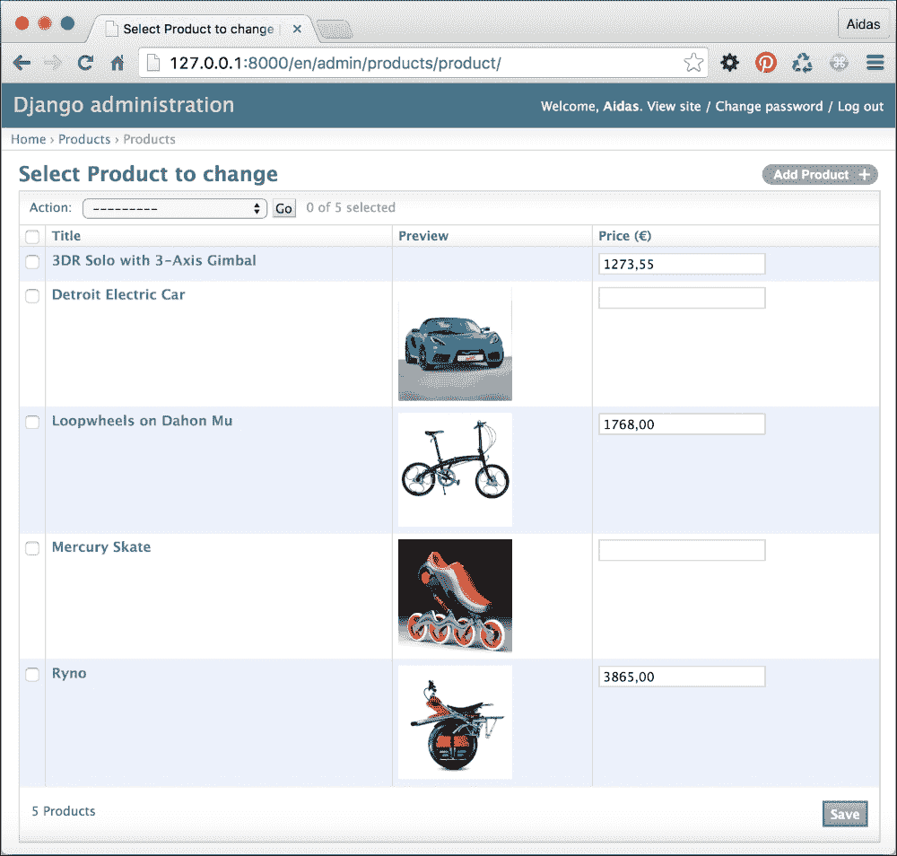
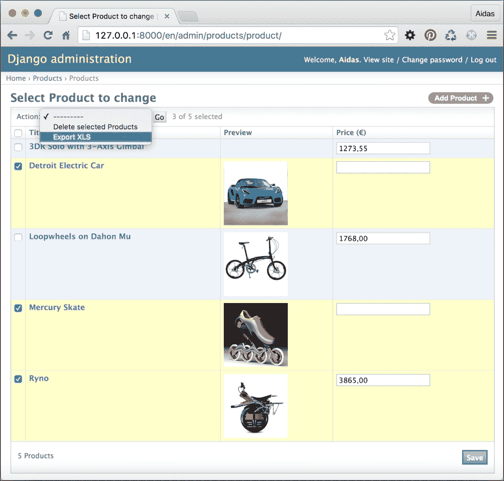
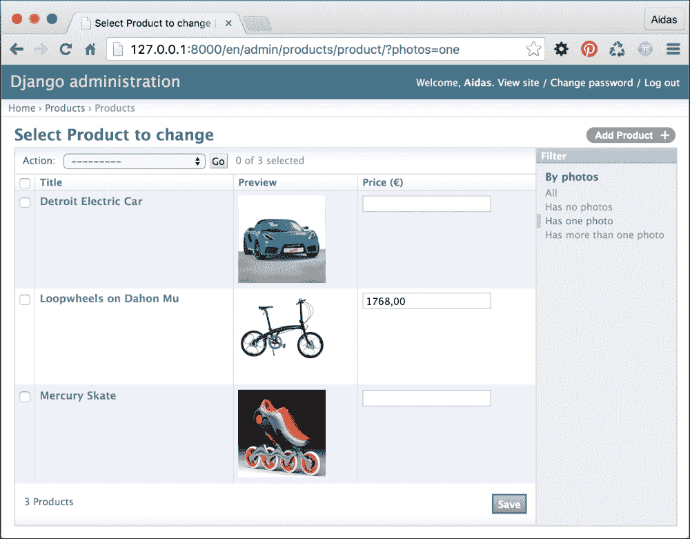
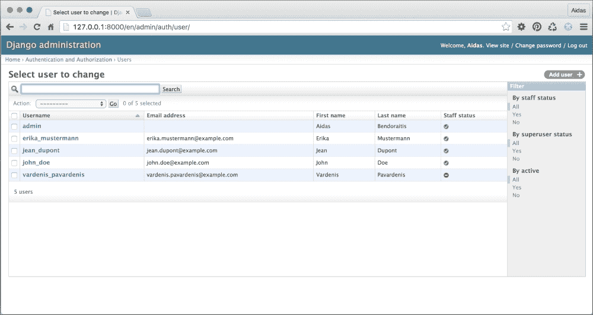
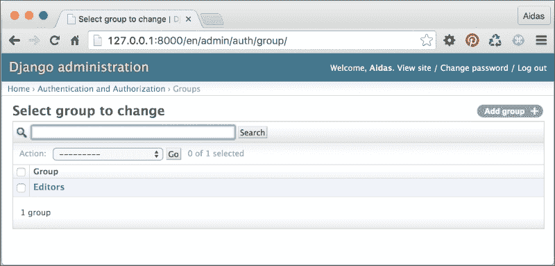
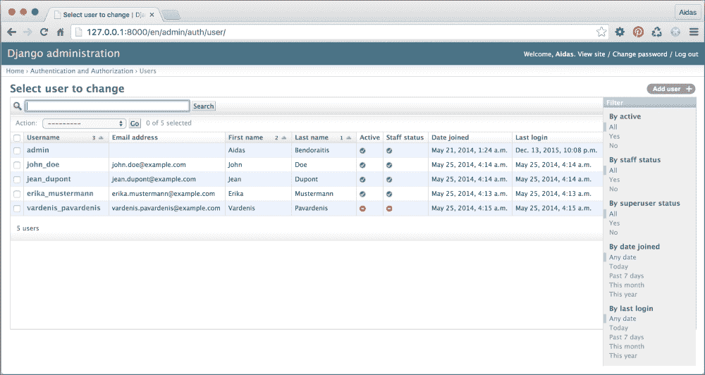
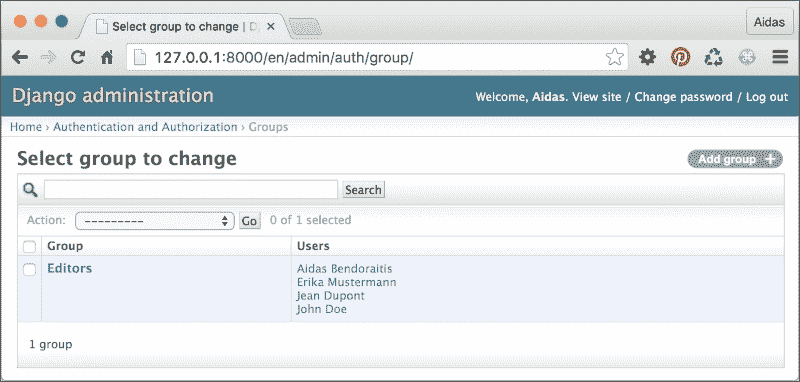
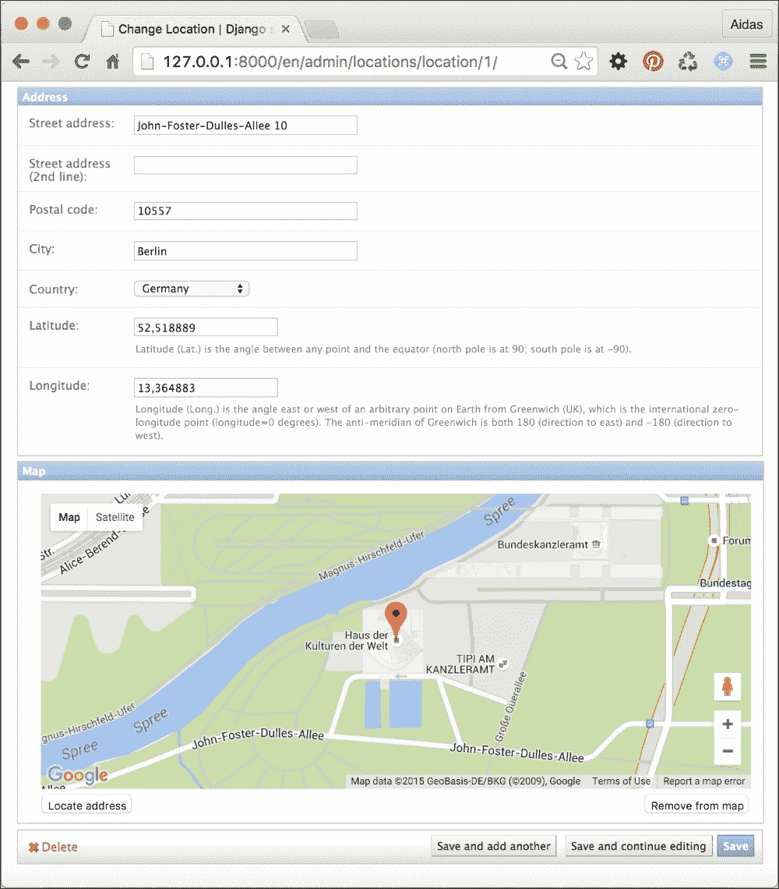
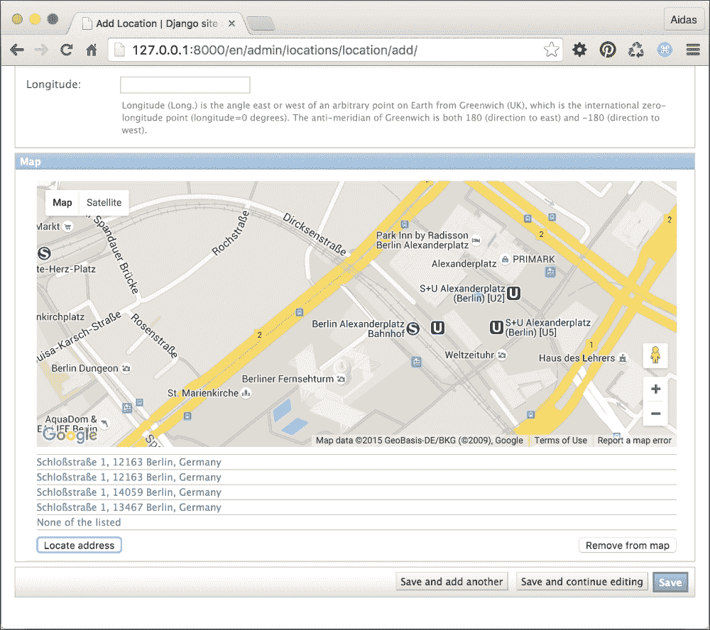

# 第六章。模型管理

在本章中，我们将涵盖以下主题：

+   自定义更改列表页面上的列

+   创建管理操作

+   开发更改列表过滤器

+   自定义默认管理设置

+   在更改表单中插入地图

# 简介

Django 框架自带了一个用于模型的内置管理系统。只需付出很少的努力，你就可以为浏览模型设置可筛选、可搜索和可排序的列表，并配置表单以添加和编辑数据。在本章中，我们将通过开发一些实际案例来介绍自定义管理的先进技术。

# 自定义更改列表页面上的列

修改默认 Django 管理系统的列表视图让你可以查看特定模型的所有实例的概览。默认情况下，`list_display` 模型管理属性控制着显示在不同列中的字段。此外，你还可以在那里设置自定义函数，这些函数返回关系中的数据或显示自定义 HTML。在本配方中，我们将为 `list_display` 属性创建一个特殊函数，该函数在列表视图的一列中显示一个图像。作为额外奖励，我们将通过添加 `list_editable` 设置，使一个字段在列表视图中直接可编辑。

## 准备工作

首先，请确保在设置中的 `INSTALLED_APPS` 中包含了 `django.contrib.admin`，并且 `AdminSite` 已在 URL 配置中连接。然后，创建一个新的 `products` 应用程序并将其添加到 `INSTALLED_APPS` 中。这个应用程序将包含 `Product` 和 `ProductPhoto` 模型，其中一种产品可能有多个照片。在这个例子中，我们还将使用 `UrlMixin`，它是在 第二章 中定义的，与 URL 相关的方法的配方中定义的。*创建一个具有 URL 相关方法的模型混入*。

让我们在 `models.py` 文件中创建 `Product` 和 `ProductPhoto` 模型，如下所示：

```py
# products/models.py
# -*- coding: UTF-8 -*-
from __future__ import unicode_literals
import os
from django.db import models
from django.utils.timezone import now as timezone_now
from django.utils.translation import ugettext_lazy as _
from django.core.urlresolvers import reverse
from django.core.urlresolvers import NoReverseMatch
from django.utils.encoding import python_2_unicode_compatible
from utils.models import UrlMixin

def upload_to(instance, filename):
    now = timezone_now()
    filename_base, filename_ext = os.path.splitext(filename)
    return "products/%s/%s%s" % (
        instance.product.slug,
        now.strftime("%Y%m%d%H%M%S"),
        filename_ext.lower(),
    )

@python_2_unicode_compatible
class Product(UrlMixin):
    title = models.CharField(_("title"), max_length=200)
    slug = models.SlugField(_("slug"), max_length=200)
    description = models.TextField(_("description"), blank=True)
    price = models.DecimalField(_("price (€)"), max_digits=8,
        decimal_places=2, blank=True, null=True)

    class Meta:
        verbose_name = _("Product")
        verbose_name_plural = _("Products")

    def __str__(self):
        return self.title

    def get_url_path(self):
        try:
            return reverse("product_detail", kwargs={
                "slug": self.slug
            })
        except NoReverseMatch:
            return ""

@python_2_unicode_compatible
class ProductPhoto(models.Model):
    product = models.ForeignKey(Product)
    photo = models.ImageField(_("photo"), upload_to=upload_to)

    class Meta:
        verbose_name = _("Photo")
        verbose_name_plural = _("Photos")

    def __str__(self):
        return self.photo.name
```

## 如何操作...

我们将为 `Product` 模型创建一个简单的管理，该模型将具有附加到产品上的 `ProductPhoto` 模型的实例，作为内联。

在 `list_display` 属性中，我们将列出模型管理中使用的 `get_photo()` 方法，该方法将用于显示多对一关系中的第一张照片。

让我们创建一个包含以下内容的 `admin.py` 文件：

```py
# products/admin.py
# -*- coding: UTF-8 -*-
from __future__ import unicode_literals
from django.db import models
from django.contrib import admin
from django.utils.translation import ugettext_lazy as _
from django.http import HttpResponse

from .models import Product, ProductPhoto

class ProductPhotoInline(admin.StackedInline):
    model = ProductPhoto
    extra = 0

class ProductAdmin(admin.ModelAdmin):
    list_display = ["title", "get_photo", "price"]
    list_editable = ["price"]

    fieldsets = (
        (_("Product"), {
            "fields": ("title", "slug", "description", "price"),
        }),
    )
    prepopulated_fields = {"slug": ("title",)}
    inlines = [ProductPhotoInline]

    def get_photo(self, obj):
        project_photos = obj.productphoto_set.all()[:1]
        if project_photos.count() > 0:
            return """<a href="%(product_url)s" target="_blank">
                
            </a>""" % {
                "product_url": obj.get_url_path(),
                "photo_url":  project_photos[0].photo.url,
            }
        return ""
    get_photo.short_description = _("Preview")
    get_photo.allow_tags = True

admin.site.register(Product, ProductAdmin)
```

## 工作原理...

如果你查看浏览器中的产品管理列表，它将类似于以下截图：



通常，`list_display` 属性定义了在管理列表视图中要列出的字段；例如，`title` 和 `price` 是 `Product` 模型的字段。

除了正常的字段名称外，`list_display` 属性还接受一个函数或另一个可调用对象，管理模型的属性名称，或模型的属性名称。

### 小贴士

在 Python 中，可调用对象是一个函数、方法或实现了 `__call__()` 方法的类。你可以使用 `callable()` 函数检查一个变量是否可调用。

在`list_display`中使用的每个可调用函数都会接收到一个作为第一个参数传递的模型实例。因此，在我们的例子中，我们有模型管理器的`get_photo()`方法，它检索`Product`实例作为`obj`。该方法尝试从多对一关系中获得第一个`ProductPhoto`，如果存在，则返回带有链接到`Product`详情页的``标签的 HTML。

您可以为在`list_display`中使用的可调用函数设置多个属性。可调用函数的`short_description`属性定义了列显示的标题。`allow_tags`属性通知管理器不要转义 HTML 值。

此外，通过`list_editable`设置使**价格**字段可编辑，底部有一个**保存**按钮来保存整个产品列表。

## 还有更多...

理想情况下，`get_photo()`方法中不应包含任何硬编码的 HTML；然而，它应该从文件中加载并渲染一个模板。为此，您可以使用`django.template.loader`中的`render_to_string()`函数。然后，您的展示逻辑将与业务逻辑分离。我将这留作您的练习。

## 相关内容

+   在第二章的*使用与 URL 相关的方法创建模型混入*配方中，*数据库结构*

+   *创建管理操作*配方

+   *开发变更列表过滤器*配方

# 创建管理操作

Django 管理系统为我们提供了可以执行列表中选定项目的操作。默认情况下有一个操作，用于删除选定的实例。在本配方中，我们将为`Product`模型的列表创建一个额外的操作，允许管理员将选定的产品导出到 Excel 电子表格。

## 准备工作

我们将从上一个配方中创建的`products`应用开始。

确保您的虚拟环境中已安装`xlwt`模块以创建 Excel 电子表格：

```py
(myproject_env)$ pip install xlwt
```

## 如何操作...

管理操作是接受三个参数的函数：当前的`ModelAdmin`值、当前的`HttpRequest`值以及包含所选项目的`QuerySet`值。按照以下步骤创建自定义管理操作：

1.  让我们在产品应用的`admin.py`文件中创建一个`export_xls()`函数，如下所示：

    ```py
    # products/admin.py
    # -*- coding: UTF-8 -*-
    from __future__ import unicode_literals
    import xlwt
    # ... other imports ...

    def export_xls(modeladmin, request, queryset):
        response = HttpResponse(
            content_type="application/ms-excel"
        )
        response["Content-Disposition"] = "attachment; "\
            "filename=products.xls"
        wb = xlwt.Workbook(encoding="utf-8")
        ws = wb.add_sheet("Products")

        row_num = 0

        ### Print Title Row ###
        columns = [
            # column name, column width
            ("ID", 2000),
            ("Title", 6000),
            ("Description", 8000),
            ("Price (€)", 3000),
        ]

        header_style = xlwt.XFStyle()
        header_style.font.bold = True

        for col_num, (item, width) in enumerate(columns):
            ws.write(row_num, col_num, item, header_style)
            # set column width
            ws.col(col_num).width = width

        text_style = xlwt.XFStyle()
        text_style.alignment.wrap = 1

        price_style = xlwt.XFStyle()
        price_style.num_format_str = "0.00"

        styles = [
            text_style, text_style, text_style,
            price_style, text_style
        ]

        for obj in queryset.order_by("pk"):
            row_num += 1
            project_photos = obj.productphoto_set.all()[:1]
            url = ""
            if project_photos:
                url = "http://{0}{1}".format(
                    request.META['HTTP_HOST'],
                    project_photos[0].photo.url,
                )
            row = [
                obj.pk,
                obj.title,
                obj.description,
                obj.price,
                url,
            ]
            for col_num, item in enumerate(row):
                ws.write(
                    row_num, col_num, item, styles[col_num]
                )

        wb.save(response)
        return response

    export_xls.short_description = _("Export XLS")
    ```

1.  然后，将`actions`设置添加到`ProductAdmin`中，如下所示：

    ```py
    class ProductAdmin(admin.ModelAdmin):
        # ...
        actions = [export_xls]
    ```

## 它是如何工作的...

如果您在浏览器中查看产品管理列表页面，您将看到一个名为**导出 XLS**的新操作，以及默认的**删除选定的产品**操作，如下面的截图所示：



默认情况下，管理员操作会对 `QuerySet` 执行某些操作，并将管理员重定向回更改列表页面。然而，对于这些更复杂的行为，可以返回 `HttpResponse`。`export_xls()` 函数返回具有 Excel 电子表格内容类型的 `HttpResponse`。使用 Content-Disposition 标头，我们将响应设置为可下载的 `products.xls` 文件。

然后，我们使用 xlwt Python 模块创建 Excel 文件。

首先，创建一个使用 UTF-8 编码的工作簿。然后，我们向其中添加一个名为 `Products` 的工作表。我们将使用工作表的 `write()` 方法来设置每个单元格的内容和样式，以及使用 `col()` 方法来获取列并设置其宽度。

要查看工作表中所有列的概览，我们将创建一个包含列名和宽度的元组列表。Excel 使用一些神奇的单位来表示列宽。它们是默认字体中零字符宽度的 1/256。接下来，我们将定义标题样式为粗体。因为我们已经定义了列，我们将遍历它们并在第一行中填充列名，同时将粗体样式分配给它们。

然后，我们将创建一个用于普通单元格和价格的样式。普通单元格中的文本将换行。价格将具有特殊的数字样式，小数点后有两位数字。

最后，我们将遍历按 ID 排序的选定产品的 `QuerySet`，并在相应的单元格中打印指定的字段，同时应用特定的样式。

工作簿被保存到类似文件的 `HttpResponse` 对象中，生成的 Excel 表格看起来类似于以下内容：

| ID | 标题 | 描述 | 价格 (€) | 预览 |
| --- | --- | --- | --- | --- |
| 1 | Ryno | 使用 Ryno 微型循环，你不仅限于街道或自行车道。它是一种过渡性车辆——它可以去任何一个人可以步行或骑自行车的地方。 | 3865.00 | `http://127.0.0.1:8000/media/products/ryno/20140523044813.jpg` |
| 2 | Mercury Skate | 设计这款 Mercury Skate 的主要目的是减少滑板者的疲劳，并为他们提供在人行道上更容易、更顺畅的骑行体验。 | `http://127.0.0.1:8000/media/products/mercury-skate/20140521030128.png` |
| 4 | Detroit Electric Car | Detroit Electric SP:01 是一款限量版、两座、纯电动跑车，为电动汽车的性能和操控设定了新的标准。 | `http://127.0.0.1:8000/media/products/detroit-electric-car/20140521033122.jpg` |

## 参见

+   第九章，*数据导入和导出*

+   *定制更改列表页面上的列* 菜单

+   *开发更改列表过滤器* 菜单

# 开发更改列表过滤器

如果你想让管理员能够通过日期、关系或字段选择来过滤更改列表，你需要使用管理模型的`list_filter`属性。此外，还有可能使用定制过滤器。在这个菜谱中，我们将添加一个允许你通过附加照片数量选择产品的过滤器。

## 准备工作

让我们从上一个菜谱中创建的`products`应用开始。

## 如何操作...

执行以下两个步骤：

1.  在`admin.py`文件中，创建一个继承自`SimpleListFilter`的`PhotoFilter`类，如下所示：

    ```py
    # products/admin.py
    # -*- coding: UTF-8 -*-
    # ... all previous imports go here ...
    from django.db import models

    class PhotoFilter(admin.SimpleListFilter):
        # Human-readable title which will be displayed in the
        # right admin sidebar just above the filter options.
        title = _("photos")

        # Parameter for the filter that will be used in the
        # URL query.
        parameter_name = "photos"

        def lookups(self, request, model_admin):
            """
            Returns a list of tuples. The first element in each
            tuple is the coded value for the option that will
            appear in the URL query. The second element is the
            human-readable name for the option that will appear
            in the right sidebar.
            """
            return (
                ("zero", _("Has no photos")),
                ("one", _("Has one photo")),
                ("many", _("Has more than one photo")),
            )

        def queryset(self, request, queryset):
            """
            Returns the filtered queryset based on the value
            provided in the query string and retrievable via
            `self.value()`.
            """
            qs = queryset.annotate(
                num_photos=models.Count("productphoto")
            )
            if self.value() == "zero":
                qs = qs.filter(num_photos=0)
            elif self.value() == "one":
                qs = qs.filter(num_photos=1)
            elif self.value() == "many":
                qs = qs.filter(num_photos__gte=2)
            return qs
    ```

1.  然后，将列表过滤器添加到`ProductAdmin`中，如下所示：

    ```py
    class ProductAdmin(admin.ModelAdmin):
        # ...
        list_filter = [PhotoFilter]
    ```

## 如何工作...

我们刚刚创建的列表过滤器将显示在产品列表的侧边栏中，如下所示：



`PhotoFilter`类具有可翻译的标题和查询参数名称作为属性。它还有两个方法：定义过滤器选项的`lookups()`方法和定义在选中特定值时如何过滤`QuerySet`对象的`queryset()`方法。

在`lookups()`方法中，我们定义了三个选项：没有照片、有一张照片和有多张照片附加。在`queryset()`方法中，我们使用`QuerySet`的`annotate()`方法来选择每个产品的照片数量。然后根据所选选项过滤这些照片的数量。

要了解更多关于聚合函数，如`annotate()`的信息，请参考官方 Django 文档，链接为[`docs.djangoproject.com/en/1.8/topics/db/aggregation/`](https://docs.djangoproject.com/en/1.8/topics/db/aggregation/).

## 参见

+   *自定义更改列表页面上的列*菜谱

+   *创建管理操作*菜谱

+   *自定义默认管理设置*菜谱

# 自定义默认管理设置

Django 应用以及第三方应用都带有自己的管理设置；然而，有一个机制可以关闭这些设置并使用你自己的更好的管理设置。在这个菜谱中，你将学习如何用自定义管理设置替换`django.contrib.auth`应用的管理设置。

## 准备工作

创建一个`custom_admin`应用，并将此应用放在设置中的`INSTALLED_APPS`下。

## 如何操作...

在`custom_admin`应用中的新`admin.py`文件中插入以下内容：

```py
# custom_admin/admin.py
# -*- coding: UTF-8 -*-
from __future__ import unicode_literals
from django.contrib import admin
from django.contrib.auth.admin import UserAdmin, GroupAdmin
from django.contrib.auth.admin import User, Group
from django.utils.translation import ugettext_lazy as _
from django.core.urlresolvers import reverse
from django.contrib.contenttypes.models import ContentType

class UserAdminExtended(UserAdmin):
    list_display = ("username", "email", "first_name",
        "last_name", "is_active", "is_staff", "date_joined",
        "last_login")
    list_filter = ("is_active", "is_staff", "is_superuser",
        "date_joined", "last_login")
    ordering = ("last_name", "first_name", "username")
    save_on_top = True

class GroupAdminExtended(GroupAdmin):
    list_display = ("__unicode__", "display_users")
    save_on_top = True

    def display_users(self, obj):
        links = []
        for user in obj.user_set.all():
            ct = ContentType.objects.get_for_model(user)
            url = reverse(
                "admin:{}_{}_change".format(
                    ct.app_label, ct.model
                ),
                args=(user.id,)
            )
            links.append(
                """<a href="{}" target="_blank">{}</a>""".format(
                    url,
                    "{} {}".format(
                        user.first_name, user.last_name
                    ).strip() or user.username,
                )
            )
        return u"<br />".join(links)
    display_users.allow_tags = True
    display_users.short_description = _("Users")

admin.site.unregister(User)
admin.site.unregister(Group)
admin.site.register(User, UserAdminExtended)
admin.site.register(Group, GroupAdminExtended)
```

## 如何工作...

默认用户管理列表看起来类似于以下截图：



默认的用户管理列表看起来类似于以下截图：



在这个菜谱中，我们创建了两个模型管理类，`UserAdminExtended`和`GroupAdminExtended`，分别扩展了贡献的`UserAdmin`和`GroupAdmin`类，并覆盖了一些属性。然后，我们注销了现有的`User`和`Group`模型的管理类，并注册了新的修改后的类。

以下截图显示了用户管理现在的样子：



修改后的用户管理设置在列表视图中显示的字段比默认设置更多，添加了额外的过滤和排序选项，并在编辑表单的顶部显示**提交**按钮。

在新的组管理设置更改列表中，我们将显示分配给特定组的用户。这看起来与浏览器中的以下截图类似：



## 更多...

在我们的 Python 代码中，我们使用了一种新的字符串格式化方法。要了解更多关于字符串的`format()`方法与旧风格用法的信息，请参考以下 URL：[`pyformat.info/`](https://pyformat.info/)。

## 参见

+   *定制更改列表页面上的列*菜谱

+   *在更改表单中插入地图*菜谱

# 在更改表单中插入地图

Google Maps 提供了一个 JavaScript API，可以将地图插入到您的网站中。在这个菜谱中，我们将创建一个带有`Location`模型的`locations`应用，并扩展更改表单的模板，以便添加一个地图，管理员可以在其中找到并标记位置的地理坐标。

## 准备工作

我们将从`locations`应用开始，这个应用应该在设置中的`INSTALLED_APPS`下。在那里创建一个`Location`模型，包含标题、描述、地址和地理坐标，如下所示：

```py
# locations/models.py
# -*- coding: UTF-8 -*-
from __future__ import unicode_literals
from django.db import models
from django.utils.translation import ugettext_lazy as _
from django.utils.encoding import python_2_unicode_compatible

COUNTRY_CHOICES = (
    ("UK", _("United Kingdom")),
    ("DE", _("Germany")),
    ("FR", _("France")),
    ("LT", _("Lithuania")),
)

@python_2_unicode_compatible
class Location(models.Model):
    title = models.CharField(_("title"), max_length=255,
        unique=True)
    description = models.TextField(_("description"), blank=True)
    street_address = models.CharField(_("street address"),
        max_length=255, blank=True)
    street_address2 = models.CharField(
        _("street address (2nd line)"), max_length=255,
        blank=True)
    postal_code = models.CharField(_("postal code"),
        max_length=10, blank=True)
    city = models.CharField(_("city"), max_length=255, blank=True)
    country = models.CharField(_("country"), max_length=2,
        blank=True, choices=COUNTRY_CHOICES)
    latitude = models.FloatField(_("latitude"), blank=True,
        null=True,
        help_text=_("Latitude (Lat.) is the angle between "
            "any point and the equator "
            "(north pole is at 90; south pole is at -90)."))
    longitude = models.FloatField(_("longitude"), blank=True,
        null=True,
        help_text=_("Longitude (Long.) is the angle "
            "east or west of "
            "an arbitrary point on Earth from Greenwich (UK), "
            "which is the international zero-longitude point "
            "(longitude=0 degrees). "
            "The anti-meridian of Greenwich is both 180 "
            "(direction to east) and -180 (direction to west)."))
    class Meta:
        verbose_name = _("Location")
        verbose_name_plural = _("Locations")

    def __str__(self):
        return self.title
```

## 如何操作...

`Location`模型的管理就像它可能的那样简单。执行以下步骤：

1.  让我们为`Location`模型创建管理设置。请注意，我们正在使用`get_fieldsets()`方法来定义字段集，并从模板中渲染描述，如下所示：

    ```py
    # locations/admin.py
    # -*- coding: UTF-8 -*-
    from __future__ import unicode_literals
    from django.utils.translation import ugettext_lazy as _
    from django.contrib import admin
    from django.template.loader import render_to_string
    from .models import Location

    class LocationAdmin(admin.ModelAdmin):
        save_on_top = True
        list_display = ("title", "street_address",
            "description")
        search_fields = ("title", "street_address",
            "description")

        def get_fieldsets(self, request, obj=None):
            map_html = render_to_string(
                "admin/includes/map.html"
            )
            fieldsets = [
                (_("Main Data"), {"fields": ("title",
                    "description")}),
                (_("Address"), {"fields": ("street_address",
                    "street_address2", "postal_code", "city",
                    "country", "latitude", "longitude")}),
                (_("Map"), {"description": map_html,
                    "fields": []}),
            ]
            return fieldsets

    admin.site.register(Location, LocationAdmin)
    ```

1.  要创建自定义更改表单模板，在您的`templates`目录下`admin/locations/location/`中添加一个新的`change_form.html`文件。此模板将从默认的`admin/change_form.html`模板扩展，并覆盖`extrastyle`和`field_sets`块，如下所示：

    ```py
    {# myproject/templates/admin/locations/location/change_form.html #}
    
    
    
    

    
        {{ block.super }}
        <link rel="stylesheet" type="text/css" href="{{ STATIC_URL }}site/css/locating.css" />
    

    
        
            
        
        <script type="text/javascript" src="img/js?language=en"></script>
        <script type="text/javascript" src="img/locating.js"></script>
    
    ```

1.  然后，我们需要为将插入到`Map`字段集中的地图创建模板：

    ```py
    {# myproject/templates/admin/includes/map.html #}
    
    <div class="form-row">
        <div id="map_canvas">
            <!-- THE GMAPS WILL BE INSERTED HERE
            DYNAMICALLY -->
        </div>
        <ul id="map_locations"></ul>
        <div class="buttonHolder">
            <button id="locate_address" type="button"
            class="secondaryAction">
                
            </button>
            <button id="remove_geo" type="button"
            class="secondaryAction">
                
            </button>
        </div>
    </div>
    ```

1.  当然，地图默认情况下不会被样式化。因此，我们必须添加一些 CSS，如下面的代码所示：

    ```py
    /* site_static/site/css/locating.css */
    #map_canvas {
        width:722px;
        height:300px;
        margin-bottom: 8px;
    }
    #map_locations {
        width:722px;
        margin: 0;
        padding: 0;
        margin-bottom: 8px;
    }
    #map_locations li {
        border-bottom: 1px solid #ccc;
        list-style: none;
    }
    #map_locations li:first-child {
        border-top: 1px solid #ccc;
    }
    .buttonHolder {
        width:722px;
    }
    #remove_geo {
        float: right;
    }
    ```

1.  然后，让我们创建一个 `locating.js` JavaScript 文件。在这个文件中，我们将使用 jQuery，因为 jQuery 附带了贡献的行政系统，这使得工作变得简单且跨浏览器。我们不希望污染环境中的全局变量，因此，我们将从一个闭包开始，为变量和函数创建一个私有作用域（闭包是函数返回后仍保持活跃的局部变量），如下所示：

    ```py
    // site_static/site/js/locating.js
    (function ($, undefined) {
        var gMap;
        var gettext = window.gettext || function (val) {
            return val;
        };
        var gMarker;

        // ... this is where all the further JavaScript
        // functions go ...

    }(django.jQuery));
    ```

1.  我们将逐个创建 JavaScript 函数。`getAddress4search()` 函数将从地址字段收集 `address` 字符串，稍后可用于地理编码，如下所示：

    ```py
    function getAddress4search() {
        var address = [];
        var sStreetAddress2 = $('#id_street_address2').val();
        if (sStreetAddress2) {
            sStreetAddress2 = ' ' + sStreetAddress2;
        }
        address.push($('#id_street_address').val() + sStreetAddress2);
        address.push($('#id_city').val());
        address.push($('#id_country').val());
        address.push($('#id_postal_code').val());
        return address.join(', ');
    }
    ```

1.  `updateMarker()` 函数将接受纬度和经度参数，并在地图上绘制或移动标记。它还使标记可拖动：

    ```py
    function updateMarker(lat, lng) {
        var point = new google.maps.LatLng(lat, lng);
        if (gMarker) {
            gMarker.setPosition(point);
        } else {
            gMarker = new google.maps.Marker({
                position: point,
                map: gMap
            });
        }
        gMap.panTo(point, 15);
        gMarker.setDraggable(true);
        google.maps.event.addListener(gMarker, 'dragend', function() {
            var point = gMarker.getPosition();
            updateLatitudeAndLongitude(point.lat(), point.lng());
        });
    }
    ```

1.  `updateLatitudeAndLongitude()` 函数接受纬度和经度参数，并更新具有 `id_latitude` 和 `id_longitude` ID 的字段的值，如下所示：

    ```py
    function updateLatitudeAndLongitude(lat, lng) {
        lat = Math.round(lat * 1000000) / 1000000;
        lng = Math.round(lng * 1000000) / 1000000;
        $('#id_latitude').val(lat);
        $('#id_longitude').val(lng);
    }
    ```

1.  `autocompleteAddress()` 函数从 Google Maps 地理编码获取结果，并在地图下方列出以供选择正确的选项，或者如果只有一个结果，它将更新地理位置和地址字段，如下所示：

    ```py
    function autocompleteAddress(results) {
        var $foundLocations = $('#map_locations').html('');
        var i, len = results.length;

        // console.log(JSON.stringify(results, null, 4));

        if (results) {
            if (len > 1) {
                for (i=0; i<len; i++) {
                    $('<a href="">' + results[i].formatted_address + '</a>').data('gmap_index', i).click(function (e) {
                        e.preventDefault();
                        var result = results[$(this).data('gmap_index')];
                        updateAddressFields(result.address_components);
                        var point = result.geometry.location;
                        updateLatitudeAndLongitude(point.lat(), point.lng());
                        updateMarker(point.lat(), point.lng());
                        $foundLocations.hide();
                    }).appendTo($('<li>').appendTo($foundLocations));
                }
                $('<a href="">' + gettext('None of the listed') + '</a>').click(function (e) {
                    e.preventDefault();
                    $foundLocations.hide();
                }).appendTo($('<li>').appendTo($foundLocations));
                $foundLocations.show();
            } else {
                $foundLocations.hide();
                var result = results[0];
                updateAddressFields(result.address_components);
                var point = result.geometry.location;
                updateLatitudeAndLongitude(point.lat(), point.lng());
                updateMarker(point.lat(), point.lng());
            }
        }
    }
    ```

1.  `updateAddressFields()` 函数接受一个嵌套字典作为参数，其中包含地址组件，并填写所有地址字段：

    ```py
    function updateAddressFields(addressComponents) {
        var i, len=addressComponents.length;
        var streetName, streetNumber;
        for (i=0; i<len; i++) {
            var obj = addressComponents[i];
            var obj_type = obj.types[0];
            if (obj_type == 'locality') {
                $('#id_city').val(obj.long_name);
            }
            if (obj_type == 'street_number') {
                streetNumber = obj.long_name;
            }
            if (obj_type == 'route') {
                streetName = obj.long_name;
            }
            if (obj_type == 'postal_code') {
                $('#id_postal_code').val(obj.long_name);
            }
            if (obj_type == 'country') {
                $('#id_country').val(obj.short_name);
            }
        }
        if (streetName) {
            var streetAddress = streetName;
            if (streetNumber) {
                streetAddress += ' ' + streetNumber;
            }
            $('#id_street_address').val(streetAddress);
        }
    }
    ```

1.  最后，我们有在页面加载时调用的初始化函数。它将 `onclick` 事件处理程序附加到按钮上，创建一个 Google Map，并在 `latitude` 和 `longitude` 字段中定义的初始地理位置上标记，如下所示：

    ```py
    $(function (){
        $('#locate_address').click(function() {
            var oGeocoder = new google.maps.Geocoder();
            oGeocoder.geocode(
                {address: getAddress4search()},
                function (results, status) {
                    if (status === google.maps.GeocoderStatus.OK) {
                        autocompleteAddress(results);
                    } else {
                        autocompleteAddress(false);
                    }
                }
            );
        });

        $('#remove_geo').click(function() {
            $('#id_latitude').val('');
            $('#id_longitude').val('');
            gMarker.setMap(null);
            gMarker = null;
        });

        gMap = new google.maps.Map($('#map_canvas').get(0), {
            scrollwheel: false,
            zoom: 16,
            center: new google.maps.LatLng(51.511214, -0.119824),
            disableDoubleClickZoom: true
        });
        google.maps.event.addListener(gMap, 'dblclick', function(event) {
            var lat = event.latLng.lat();
            var lng = event.latLng.lng();
            updateLatitudeAndLongitude(lat, lng);
            updateMarker(lat, lng);
        });
        $('#map_locations').hide();

        var $lat = $('#id_latitude');
        var $lng = $('#id_longitude');
        if ($lat.val() && $lng.val()) {
            updateMarker($lat.val(), $lng.val());
        }
    });
    ```

## 它是如何工作的...

如果你查看浏览器中的位置更改表单，你将看到一个在字段集中显示的地图，后面跟着包含地址字段的字段集，如下面的截图所示：



在地图下方有两个按钮：**定位地址**和**从地图中移除**。

当你点击**定位地址**按钮时，将调用地理编码以搜索输入地址的地理坐标。地理编码的结果是一个或多个地址，它们以嵌套字典格式包含纬度和经度。要在开发者工具的控制台中查看嵌套字典的结构，请在 `autocompleteAddress()` 函数的开始处放置以下行：

```py
console.log(JSON.stringify(results, null, 4));
```

如果只有一个结果，缺失的邮政编码或其他缺失的地址字段将被填充，纬度和经度将被填写，并在地图上的一个特定位置放置一个标记。如果有更多结果，整个列表将在地图下方显示，并提供选择正确结果的选项，如下面的截图所示：



然后，管理员可以通过拖放在地图上移动标记。此外，在地图上的任何地方双击都将更新地理坐标和标记位置。

最后，如果点击了**从地图中移除**按钮，地理坐标将被清除，并移除标记。

## 参见

+   参见第四章中的*使用 HTML5 数据属性*配方，*模板和 JavaScript*
