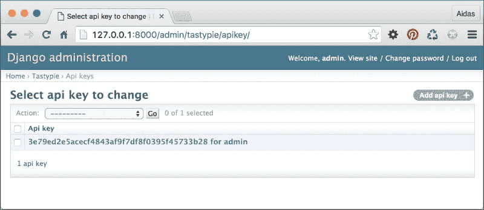
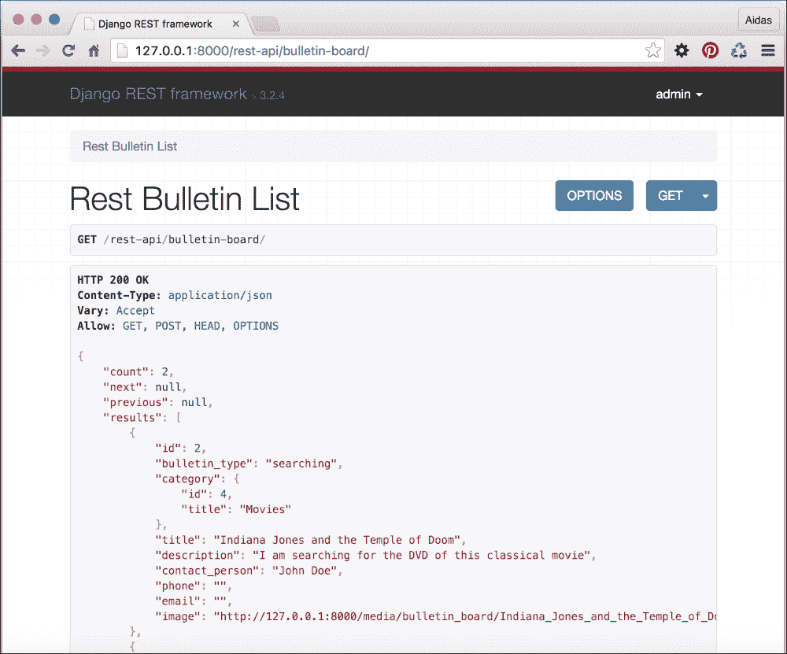

# 第九章：数据导入和导出

在这一章中，我们将介绍以下菜谱：

+   从本地 CSV 文件导入数据

+   从本地 Excel 文件导入数据

+   从外部 JSON 文件导入数据

+   从外部 XML 文件导入数据

+   创建可筛选的 RSS 源

+   使用 Tastypie 创建 API

+   使用 Django REST 框架创建 API

# 简介

有时候，您的数据需要从本地格式传输到数据库，从外部资源导入，或提供给第三方。在这一章中，我们将探讨一些编写管理命令和 API 的实际示例，以实现这些操作。

# 从本地 CSV 文件导入数据

**逗号分隔值**（**CSV**）格式可能是将表格数据存储在文本文件中最简单的方式。在这个菜谱中，我们将创建一个管理命令，用于从 CSV 导入数据到 Django 数据库。我们需要一个包含电影标题、URL 和发行年份的 CSV 电影列表。你可以使用 Excel、Calc 或其他电子表格应用程序轻松创建此类文件。

## 准备工作

创建一个包含以下字段的 `Movie` 模型的 `movies` 应用：`title`、`url` 和 `release_year`。将应用放置在设置中的 `INSTALLED_APPS` 下。

## 如何操作...

按照以下步骤创建和使用一个管理命令，用于从本地 CSV 文件导入电影：

1.  在 `movies` 应用中，创建一个 `management` 目录，然后在新的 `management` 目录中创建一个 `commands` 目录。在这两个新目录中放置空的 `__init__.py` 文件，以使它们成为 Python 包。

1.  在那里添加一个 `import_movies_from_csv.py` 文件，内容如下：

    ```py
    # movies/management/commands/import_movies_from_csv.py
    # -*- coding: UTF-8 -*-
    from __future__ import unicode_literals
    import csv
    from django.core.management.base import BaseCommand
    from movies.models import Movie

    SILENT, NORMAL, VERBOSE, VERY_VERBOSE = 0, 1, 2, 3

    class Command(BaseCommand):
        help = (
            "Imports movies from a local CSV file. "
            "Expects title, URL, and release year."
        )

        def add_arguments(self, parser):
            # Positional arguments
            parser.add_argument(
                "file_path",
                nargs=1,
                type=unicode,
            )

        def handle(self, *args, **options):
            verbosity = options.get("verbosity", NORMAL)
            file_path = options["file_path"][0]

            if verbosity >= NORMAL:
                self.stdout.write("=== Movies imported ===")

            with open(file_path) as f:
                reader = csv.reader(f)
                for rownum, (title, url, release_year) in \
                enumerate(reader):
                    if rownum == 0:
                        # let's skip the column captions
                        continue
                    movie, created = \
                    Movie.objects.get_or_create(
                        title=title,
                        url=url,
                        release_year=release_year,
                    )
                    if verbosity >= NORMAL:
                        self.stdout.write("{}. {}".format(
                            rownum, movie.title
                        ))
    ```

1.  要运行导入，请在命令行中调用以下内容：

    ```py
    (myproject_env)$ python manage.py import_movies_from_csv \
    data/movies.csv

    ```

## 它是如何工作的...

对于一个管理命令，我们需要创建一个从 `BaseCommand` 继承并重写 `add_arguments()` 和 `handle()` 方法的 `Command` 类。`help` 属性定义了管理命令的帮助文本。当你输入以下内容到命令行时，可以看到它：

```py
(myproject_env)$ python manage.py help import_movies_from_csv

```

Django 管理命令使用内置的 argparse 模块来解析传递的参数。`add_arguments()` 方法定义了应该传递给管理命令的位置参数或命名参数。在我们的情况下，我们将添加一个 Unicode 类型的位置参数 `file_path`。通过将 `nargs` 设置为 `1` 属性，我们允许只有一个值。要了解您可以定义的其他参数以及如何进行此操作，请参阅官方 argparse 文档：[`docs.python.org/2/library/argparse.html#the-add-argument-method`](https://docs.python.org/2/library/argparse.html#the-add-argument-method)。

在 `handle()` 方法的开始处，检查 `verbosity` 参数。详细程度定义了命令的详细程度，从 `0` 不向命令行工具输出任何内容到 `3` 非常详细。你可以按如下方式将此参数传递给命令：

```py
(myproject_env)$ python manage.py import_movies_from_csv \
data/movies.csv --verbosity=0

```

然后，我们还期望文件名作为第一个位置参数。`options["file_path"]`返回 nargs 中定义的值的列表，因此在这种情况下它是一个值。

我们打开给定的文件，并将其指针传递给`csv.reader`。然后，对于文件中的每一行，如果不存在匹配的电影，我们将创建一个新的`Movie`对象。管理命令将打印出导入的电影标题到控制台，除非你将详细程度设置为`0`。

### 小贴士

如果你想在开发过程中调试管理命令的错误，为它传递`--traceback`参数。如果发生错误，你将看到问题的完整堆栈跟踪。

## 还有更多...

你可以从官方文档[`docs.python.org/2/library/csv.html`](https://docs.python.org/2/library/csv.html)了解更多关于 CSV 库的信息。

## 相关链接

+   *从本地 Excel 文件导入数据*的菜谱

# 从本地 Excel 文件导入数据

另一个流行的存储表格数据的格式是 Excel 电子表格。在这个菜谱中，我们将从这种格式的文件中导入电影。

## 准备工作

让我们从之前菜谱中创建的`movies`应用开始。按照以下步骤安装`xlrd`包以读取 Excel 文件：

```py
(project_env)$ pip install xlrd

```

## 如何操作...

按照以下步骤创建和使用一个导入本地 XLS 文件的管理命令：

1.  如果你还没有这样做，在`movies`应用中，创建一个`management`目录，然后在新的`management`目录中创建一个`commands`目录。在这两个新目录中放入空的`__init__.py`文件，使它们成为 Python 包。

1.  将以下内容的`import_movies_from_xls.py`文件添加到你的项目中：

    ```py
    # movies/management/commands/import_movies_from_xls.py
    # -*- coding: UTF-8 -*-
    from __future__ import unicode_literals
    import xlrd
    from django.utils.six.moves import range
    from django.core.management.base import BaseCommand
    from movies.models import Movie

    SILENT, NORMAL, VERBOSE, VERY_VERBOSE = 0, 1, 2, 3

    class Command(BaseCommand):
        help = (
            "Imports movies from a local XLS file. "
            "Expects title, URL, and release year."
        )

        def add_arguments(self, parser):
            # Positional arguments
            parser.add_argument(
                "file_path",
                nargs=1,
                type=unicode,
            )

        def handle(self, *args, **options):
            verbosity = options.get("verbosity", NORMAL)
            file_path = options["file_path"][0]

            wb = xlrd.open_workbook(file_path)
            sh = wb.sheet_by_index(0)

            if verbosity >= NORMAL:
                self.stdout.write("=== Movies imported ===")
            for rownum in range(sh.nrows):
                if rownum == 0:
                    # let's skip the column captions
                    continue
                (title, url, release_year) = \
                    sh.row_values(rownum)
                movie, created = Movie.objects.get_or_create(
                    title=title,
                    url=url,
                    release_year=release_year,
                )
                if verbosity >= NORMAL:
                    self.stdout.write("{}. {}".format(
                        rownum, movie.title
                    ))
    ```

1.  要运行导入，请在命令行中调用以下命令：

    ```py
    (myproject_env)$ python manage.py import_movies_from_xls \
    data/movies.xls

    ```

## 工作原理...

从 XLS 文件导入的原则与 CSV 相同。我们打开文件，逐行读取，并从提供的数据中创建`Movie`对象。详细解释如下。

+   Excel 文件是包含不同标签页的工作簿。

+   我们使用`xlrd`库打开命令中传递的文件。然后，我们将从工作簿中读取第一张工作表。

+   之后，我们将逐行读取（除了带有列标题的第一行）并从这些行中创建`Movie`对象。再次提醒，管理命令将打印出导入的电影标题到控制台，除非你将详细程度设置为`0`。

## 还有更多...

你可以在[`www.python-excel.org/`](http://www.python-excel.org/)了解更多关于如何处理 Excel 文件的信息。

## 相关链接

+   *从本地 CSV 文件导入数据*的菜谱

# 从外部 JSON 文件导入数据

`Last.fm`音乐网站在[`ws.audioscrobbler.com/`](http://ws.audioscrobbler.com/)域名下有一个 API，你可以使用它来读取专辑、艺术家、曲目、事件等。该 API 允许你使用 JSON 或 XML 格式。在这个菜谱中，我们将使用 JSON 格式导入被标记为 disco 的顶级曲目。

## 准备工作

按照以下步骤从 `Last.fm` 导入 JSON 格式的数据：

1.  要使用 `Last.fm`，你需要注册并获取一个 API 密钥。API 密钥可以在 [`www.last.fm/api/account/create`](http://www.last.fm/api/account/create) 创建。

1.  API 密钥必须在设置中设置为 `LAST_FM_API_KEY`。

1.  此外，使用以下命令在你的虚拟环境中安装 `requests` 库：

    ```py
    (myproject_env)$ pip install requests

    ```

1.  让我们检查 JSON 端点的结构 ([`ws.audioscrobbler.com/2.0/?method=tag.gettoptracks&tag=disco&api_key=xxx&format=json`](http://ws.audioscrobbler.com/2.0/?method=tag.gettoptracks&tag=disco&api_key=xxx&format=json))：

    ```py
    {
      "tracks":{
     "track":[
          {
     "name":"Billie Jean",
            "duration":"293",
            "mbid":"f980fc14-e29b-481d-ad3a-5ed9b4ab6340",
            "url":"http://www.last.fm/music/Michael+Jackson/_/Billie+Jean",
            "streamable":{
              "#text":"0",
              "fulltrack":"0"
            },
     "artist":{
     "name":"Michael Jackson",
              "mbid":"f27ec8db-af05-4f36-916e-3d57f91ecf5e",
              "url":"http://www.last.fm/music/Michael+Jackson"
            },
            "image":[
              {
                "#text":"http://img2-ak.lst.fm/i/u/34s/114a4599f3bd451ca915f482345bc70f.png",
                "size":"small"
              },
     {
     "#text":"http://img2-ak.lst.fm/i/u/64s/114a4599f3bd451ca915f482345bc70f.png",
     "size":"medium"
     },
              {
                "#text":"http://img2-ak.lst.fm/i/u/174s/114a4599f3bd451ca915f482345bc70f.png",
                "size":"large"
              },
              {
                "#text":"http://img2-ak.lst.fm/i/u/300x300/114a4599f3bd451ca915f482345bc70f.png",
                "size":"extralarge"
              }
            ],
            "@attr":{
              "rank":"1"
            }
          },
          ...
        ],
        "@attr":{
          "tag":"disco",
          "page":"1",
          "perPage":"50",
     "totalPages":"26205",
          "total":"1310249"
        }
      }
    }
    ```

我们想读取曲目名称、艺术家、URL 和中等大小的图片。

## 如何操作...

按照以下步骤创建 `Track` 模型和管理命令，该命令从 `Last.fm` 导入顶级曲目到数据库：

1.  让我们创建一个具有简单 `Track` 模型的 `music` 应用程序，如下所示：

    ```py
    # music/models.py
    # -*- coding: UTF-8 -*-
    from __future__ import unicode_literals
    import os
    from django.utils.translation import ugettext_lazy as _
    from django.db import models
    from django.utils.text import slugify
    from django.utils.encoding import \
        python_2_unicode_compatible

    def upload_to(instance, filename):
        filename_base, filename_ext = \
            os.path.splitext(filename)
        return "tracks/%s--%s%s" % (
            slugify(instance.artist),
            slugify(instance.name),
            filename_ext.lower(),
        )

    @python_2_unicode_compatible
    class Track(models.Model):
        name = models.CharField(_("Name"), max_length=250)
        artist = models.CharField(_("Artist"), max_length=250)
        url = models.URLField(_("URL"))
        image = models.ImageField(_("Image"),
            upload_to=upload_to, blank=True, null=True)

        class Meta:
            verbose_name = _("Track")
            verbose_name_plural = _("Tracks")

        def __str__(self):
            return "%s - %s" % (self.artist, self.name)
    ```

1.  然后，创建如下所示的管理命令：

    ```py
    # music/management/commands/import_music_from_lastfm_as_json.py
    # -*- coding: UTF-8 -*-
    from __future__ import unicode_literals
    import os
    import requests
    from StringIO import StringIO
    from django.utils.six.moves import range
    from django.core.management.base import BaseCommand
    from django.utils.encoding import force_text
    from django.conf import settings
    from django.core.files import File
    from music.models import Track

    SILENT, NORMAL, VERBOSE, VERY_VERBOSE = 0, 1, 2, 3

    class Command(BaseCommand):
        help = "Imports top tracks from last.fm as XML."

        def add_arguments(self, parser):
            # Named (optional) arguments
            parser.add_argument(
                "--max_pages",
                type=int,
                default=0,
            )

        def handle(self, *args, **options):
            self.verbosity = options.get("verbosity", NORMAL)
            max_pages = options["max_pages"]

            params = {
                "method": "tag.gettoptracks",
                "tag": "disco",
                "api_key": settings.LAST_FM_API_KEY,
                "format": "json",
            }

            r = requests.get(
                "http://ws.audioscrobbler.com/2.0/",
                params=params
            )

            response_dict = r.json()
            total_pages = int(
                response_dict["tracks"]["@attr"]["totalPages"]
            )
            if max_pages > 0:
                total_pages = max_pages

            if self.verbosity >= NORMAL:
                self.stdout.write("=== Tracks imported ===")

            self.save_page(response_dict)
            for page_number in range(2, total_pages + 1):
                params["page"] = page_number
                r = requests.get(
                    "http://ws.audioscrobbler.com/2.0/",
                    params=params
                )
                response_dict = r.json()
                self.save_page(response_dict)
    ```

1.  由于列表是分页的，我们将向 `Command` 类添加 `save_page()` 方法以保存单个页面的曲目。此方法接受一个参数，即包含单个页面顶级曲目的字典，如下所示：

    ```py
        def save_page(self, d):
            for track_dict in d["tracks"]["track"]:
                track, created = Track.objects.get_or_create(
                    name=force_text(track_dict["name"]),
                    artist=force_text(
                        track_dict["artist"]["name"]
                    ),
                    url=force_text(track_dict["url"]),
                )
                image_dict = track_dict.get("image", None)
                if created and image_dict:
                    image_url = image_dict[1]["#text"]
                    image_response = requests.get(image_url)
                    track.image.save(
                        os.path.basename(image_url),
                        File(StringIO(image_response.content))
                    )
                if self.verbosity >= NORMAL:
                    self.stdout.write(" - {} - {}".format(
                        track.artist, track.name
                    ))
    ```

1.  要运行导入，请在命令行中调用以下命令：

    ```py
    (myproject_env)$ python manage.py \
    import_music_from_lastfm_as_json --max_pages=3

    ```

## 它是如何工作的...

可选的命名参数 `max_pages` 限制导入的数据为三页。如果你想下载所有可用的顶级曲目，请跳过它；然而，请注意，有超过 26,000 页，如 `totalPages` 值中详细说明，这将花费一些时间。

使用 `requests.get()` 方法，我们从 `Last.fm` 读取数据，传递 `params` 查询参数。响应对象有一个内置方法称为 `json()`，它将 JSON 字符串转换为解析后的字典。

我们从这个字典中读取总页数值，然后保存第一页的结果。然后，我们逐页获取第二页及以后的页面并保存它们。导入过程中一个有趣的部分是下载和保存图片。在这里，我们也使用 `request.get()` 来检索图片数据，然后通过 `StringIO` 将其传递给 `File`，这相应地用于 `image.save()` 方法。`image.save()` 的第一个参数是一个文件名，它将被 `upload_to` 函数的值覆盖，仅用于文件扩展名。

## 参见

+   *从外部 XML 文件导入数据* 的配方

# 从外部 XML 文件导入数据

`Last.fm` 文件还允许你从他们的服务中以 XML 格式获取数据。在这个配方中，我将向你展示如何做到这一点。

## 准备就绪

要准备从 `Last.fm` 以 XML 格式导入顶级曲目，请按照以下步骤操作：

1.  从 *准备就绪* 部分的第一个三个步骤开始，在 *从外部 JSON 文件导入数据* 配方中。

1.  然后，让我们检查 XML 端点的结构（[`ws.audioscrobbler.com/2.0/?method=tag.gettoptracks&tag=disco&api_key=xxx&format=xml`](http://ws.audioscrobbler.com/2.0/?method=tag.gettoptracks&tag=disco&api_key=xxx&format=xml)），如下所示：

    ```py
    <?xml version="1.0" encoding="UTF-8"?>
    <lfm status="ok">
      <tracks tag="disco" page="1" perPage="50" totalPages="26205" total="1310249">
     <track rank="1">
     <name>Billie Jean</name>
          <duration>293</duration>
          <mbid>f980fc14-e29b-481d-ad3a-5ed9b4ab6340</mbid>
          <url>http://www.last.fm/music/Michael+Jackson/_/Billie+Jean</url>
          <streamable fulltrack="0">0</streamable>
     <artist>
     <name>Michael Jackson</name>
            <mbid>f27ec8db-af05-4f36-916e-3d57f91ecf5e</mbid>
            <url>http://www.last.fm/music/Michael+Jackson</url>
          </artist>
          <image size="small">http://img2-ak.lst.fm/i/u/34s/114a4599f3bd451ca915f482345bc70f.png</image>
     <image size="medium">http://img2-ak.lst.fm/i/u/64s/114a4599f3bd451ca915f482345bc70f.png</image>
          <image size="large">http://img2-ak.lst.fm/i/u/174s/114a4599f3bd451ca915f482345bc70f.png</image>
          <image size="extralarge">http://img2-ak.lst.fm/i/u/300x300/114a4599f3bd451ca915f482345bc70f.png</image>
        </track>
        ...
      </tracks>
    </lfm>
    ```

## 如何做到这一点...

按顺序执行以下步骤以导入`Last.fm`的 XML 格式的顶级曲目：

1.  如果您还没有这样做，创建一个具有类似之前食谱的`Track`模型的`music`应用。

1.  然后，创建一个`import_music_from_lastfm_as_xml.py`管理命令。我们将使用 Python 附带的`ElementTree` XML API 来解析 XML 节点，如下所示：

    ```py
    # music/management/commands/import_music_from_lastfm_as_xml.py
    # -*- coding: UTF-8 -*-
    from __future__ import unicode_literals
    import os
    import requests
    from xml.etree import ElementTree
    from StringIO import StringIO
    from django.utils.six.moves import range
    from django.core.management.base import BaseCommand
    from django.utils.encoding import force_text
    from django.conf import settings
    from django.core.files import File
    from music.models import Track

    SILENT, NORMAL, VERBOSE, VERY_VERBOSE = 0, 1, 2, 3

    class Command(BaseCommand):
        help = "Imports top tracks from last.fm as XML."

        def add_arguments(self, parser):
            # Named (optional) arguments
            parser.add_argument(
                "--max_pages",
                type=int,
                default=0,
            )

        def handle(self, *args, **options):
            self.verbosity = options.get("verbosity", NORMAL)
            max_pages = options["max_pages"]

            params = {
                "method": "tag.gettoptracks",
                "tag": "disco",
                "api_key": settings.LAST_FM_API_KEY,
                "format": "xml",
            }

            r = requests.get(
                "http://ws.audioscrobbler.com/2.0/",
                params=params
            )

            root = ElementTree.fromstring(r.content)
            total_pages = int(
                root.find("tracks").attrib["totalPages"]
            )
            if max_pages > 0:
                total_pages = max_pages

            if self.verbosity >= NORMAL:
                self.stdout.write("=== Tracks imported ===")

            self.save_page(root)
            for page_number in range(2, total_pages + 1):
                params["page"] = page_number
                r = requests.get(
                    "http://ws.audioscrobbler.com/2.0/",
                    params=params
                )
                root = ElementTree.fromstring(r.content)
                self.save_page(root)
    ```

1.  由于列表是分页的，我们将在`Command`类中添加一个`save_page()`方法来保存单个页面的曲目。此方法以 XML 的根节点作为参数，如下所示：

    ```py
        def save_page(self, root):
            for track_node in root.findall("tracks/track"):
                track, created = Track.objects.get_or_create(
                    name=force_text(
                        track_node.find("name").text
                    ),
                    artist=force_text(
                        track_node.find("artist/name").text
                    ),
                    url=force_text(
                        track_node.find("url").text
                    ),
                )
                image_node = track_node.find(
                    "image[@size='medium']"
                )
                if created and image_node is not None:
                    image_response = \
                        requests.get(image_node.text)
                    track.image.save(
                        os.path.basename(image_node.text),
                        File(StringIO(image_response.content))
                    )
                if self.verbosity >= NORMAL:
                    self.stdout.write(" - {} - {}".format(
                        track.artist, track.name
                    ))
    ```

1.  要运行导入，请在命令行中调用以下命令：

    ```py
    (myproject_env)$ python manage.py \
    import_music_from_lastfm_as_xml --max_pages=3

    ```

## 它是如何工作的...

该过程类似于 JSON 方法。使用`requests.get()`方法，我们从`Last.fm`读取数据，将查询参数作为`params`传递。响应的 XML 内容传递给`ElementTree`解析器，并返回根节点。

`ElementTree`节点有`find()`和`findall()`方法，您可以通过传递 XPath 查询来过滤出特定的子节点。

以下是一个表格，列出了`ElementTree`支持的可用 XPath 语法：

| XPath 语法组件 | 含义 |
| --- | --- |
| `tag` | 这选择具有给定标签的所有子元素。 |
| `*` | 这选择所有子元素。 |
| `.` | 这选择当前节点。 |
| `//` | 这选择当前元素所有级别下的所有子元素。 |
| `..` | 这选择父元素。 |
| `[@attrib]` | 这选择具有给定属性的所有元素。 |
| `[@attrib='value']` | 这选择具有给定属性值的所有元素。 |
| `[tag]` | 这选择所有具有名为 tag 的子元素的元素。仅支持直接子元素。 |
| `[position]` | 这选择位于给定位置的元素。位置可以是整数（`1`是第一个位置），`last()`表达式（对于最后一个位置），或者相对于最后一个位置的位置（例如，`last()-1`）。 |

因此，使用`root.find("tracks").attrib["totalPages"]`，我们读取总页数。我们将保存第一页，然后逐页保存其他页面。

在`save_page()`方法中，`root.findall("tracks/track")`返回一个通过`<tracks>`节点下的`<track>`节点进行迭代的迭代器。使用`track_node.find("image[@size='medium']")`，我们获取中等大小的图像。

## 还有更多...

您可以在[`en.wikipedia.org/wiki/XPath`](https://en.wikipedia.org/wiki/XPath)上了解更多关于 XPath 的信息。

`ElementTree`的完整文档可以在[`docs.python.org/2/library/xml.etree.elementtree.html`](https://docs.python.org/2/library/xml.etree.elementtree.html)找到。

## 参见

+   *从外部 JSON 文件导入数据*的配方

# 创建可过滤的 RSS 订阅源

Django 自带了一个内容聚合框架，允许你轻松创建 RSS 和 Atom 订阅源。RSS 和 Atom 订阅源是具有特定语义的 XML 文档。它们可以在 RSS 阅读器如 Feedly 中订阅，也可以在其他网站、移动应用程序或桌面应用程序中聚合。在这个配方中，我们将创建`BulletinFeed`，它提供了一个带有图像的公告板。此外，结果可以通过 URL 查询参数进行过滤。

## 准备工作

创建一个新的`bulletin_board`应用，并将其放在设置中的`INSTALLED_APPS`下。

## 如何操作...

我们将创建一个`Bulletin`模型和相应的 RSS 订阅源。我们将能够通过类型或类别过滤 RSS 订阅源，以便只订阅例如提供二手书的公告：

1.  在此应用的`models.py`文件中，添加`Category`和`Bulletin`模型，并在这两者之间建立外键关系，如下所示：

    ```py
    # bulletin_board/models.py
    # -*- coding: UTF-8 -*-
    from __future__ import unicode_literals
    from django.db import models
    from django.utils.translation import ugettext_lazy as _
    from django.core.urlresolvers import reverse
    from django.utils.encoding import \
        python_2_unicode_compatible
    from utils.models import CreationModificationDateMixin
    from utils.models import UrlMixin

    TYPE_CHOICES = (
        ("searching", _("Searching")),
        ("offering", _("Offering")),
    )

    @python_2_unicode_compatible
    class Category(models.Model):
        title = models.CharField(_("Title"), max_length=200)

        def __str__(self):
            return self.title

        class Meta:
            verbose_name = _("Category")
            verbose_name_plural = _("Categories")

    @python_2_unicode_compatible
    class Bulletin(CreationModificationDateMixin, UrlMixin):
        bulletin_type = models.CharField(_("Type"),
            max_length=20, choices=TYPE_CHOICES)
        category = models.ForeignKey(Category,
            verbose_name=_("Category"))

        title = models.CharField(_("Title"), max_length=255)
        description = models.TextField(_("Description"),
            max_length=300)

        contact_person = models.CharField(_("Contact person"),
            max_length=255)
        phone = models.CharField(_("Phone"), max_length=50,
            blank=True)
        email = models.CharField(_("Email"), max_length=254,
            blank=True)

        image = models.ImageField(_("Image"), max_length=255,
            upload_to="bulletin_board/", blank=True)

        class Meta:
            verbose_name = _("Bulletin")
            verbose_name_plural = _("Bulletins")
            ordering = ("-created",)

        def __str__(self):
            return self.title

        def get_url_path(self):
            try:
                path = reverse(
                    "bulletin_detail",
                    kwargs={"pk": self.pk}
                )
            except:
                # the apphook is not attached yet
                return ""
            else:
                return path
    ```

1.  然后，创建`BulletinFilterForm`，允许访客通过类型和类别过滤公告，如下所示：

    ```py
    # bulletin_board/forms.py
    # -*- coding: UTF-8 -*-
    from django import forms
    from django.utils.translation import ugettext_lazy as _
    from models import Category, TYPE_CHOICES

    class BulletinFilterForm(forms.Form):
        bulletin_type = forms.ChoiceField(
            label=_("Bulletin Type"),
            required=False,
            choices=(("", "---------"),) + TYPE_CHOICES,
        )
        category = forms.ModelChoiceField(
            label=_("Category"),
            required=False,
            queryset=Category.objects.all(),
        )
    ```

1.  添加一个包含`BulletinFeed`类的`feeds.py`文件，如下所示：

    ```py
    # bulletin_board/feeds.py
    # -*- coding: UTF-8 -*-
    from __future__ import unicode_literals
    from django.contrib.syndication.views import Feed
    from django.core.urlresolvers import reverse
    from .models import Bulletin, TYPE_CHOICES
    from .forms import BulletinFilterForm

    class BulletinFeed(Feed):
        description_template = \
            "bulletin_board/feeds/bulletin_description.html"

        def get_object(self, request, *args, **kwargs):
            form = BulletinFilterForm(data=request.REQUEST)
            obj = {}
            if form.is_valid():
                obj = {
                    "bulletin_type": \
                        form.cleaned_data["bulletin_type"],
                    "category": form.cleaned_data["category"],
                    "query_string": \
                        request.META["QUERY_STRING"],
                }
            return obj

        def title(self, obj):
            t = "My Website - Bulletin Board"
            # add type "Searching" or "Offering"
            if obj.get("bulletin_type", False):
                tp = obj["bulletin_type"]
                t += " - %s" % dict(TYPE_CHOICES)[tp]
            # add category
            if obj.get("category", False):
                t += " - %s" % obj["category"].title
            return t

        def link(self, obj):
            if obj.get("query_string", False):
                return reverse("bulletin_list") + "?" + \
                    obj["query_string"]
            return reverse("bulletin_list")

        def feed_url(self, obj):
            if obj.get("query_string", False):
                return reverse("bulletin_rss") + "?" + \
                    obj["query_string"]
            return reverse("bulletin_rss")

        def item_pubdate(self, item):
            return item.created

        def items(self, obj):
            qs = Bulletin.objects.order_by("-created")
            if obj.get("bulletin_type", False):
                qs = qs.filter(
                    bulletin_type=obj["bulletin_type"],
                ).distinct()
            if obj.get("category", False):
                qs = qs.filter(
                    category=obj["category"],
                ).distinct()
            return qs[:30]
    ```

1.  为将在订阅源中提供的公告描述创建一个模板，如下所示：

    ```py
    {# templates/bulletin_board/feeds/bulletin_description.html #}
    
        <p><a href="{{ obj.get_url }}"></a></p>
    
    <p>{{ obj.description }}</p>
    ```

1.  为公告板应用创建一个 URL 配置，并将其包含在根 URL 配置中，如下所示：

    ```py
    # templates/bulletin_board/urls.py
    # -*- coding: UTF-8 -*-
    from __future__ import unicode_literals
    from django.conf.urls import *
    from .feeds import BulletinFeed

    urlpatterns = patterns("bulletin_board.views",
        url(r"^$", "bulletin_list", name="bulletin_list"),
        url(r"^(?P<bulletin_id>[0-9]+)/$", "bulletin_detail",
             name="bulletin_detail"),
        url(r"^rss/$", BulletinFeed(), name="bulletin_rss"),
    )
    ```

1.  你还需要为可过滤的公告列表和详情提供视图和模板。在`Bulletin`列表页面模板中，添加以下链接：

    ```py
    <a href="?{{ request.META.QUERY_STRING }}">RSS Feed</a>
    ```

## 工作原理...

因此，如果你在数据库中有一些数据，并在浏览器中打开`http://127.0.0.1:8000/bulletin-board/rss/?bulletin_type=offering&category=4`，你将获得具有`Offering`类型和`4`类别 ID 的公告 RSS 订阅源。

`BulletinFeed`类有一个`get_objects()`方法，它接受当前的`HttpRequest`并定义了该类其他方法中使用的`obj`字典。`obj`字典包含公告类型、类别和当前查询字符串。

`title()`方法返回订阅源的标题。它可以是通用的，也可以与所选的公告类型或类别相关。`link()`方法返回经过过滤的原始公告列表的链接。`feed_url()`方法返回当前订阅源的 URL。`items()`方法执行过滤并返回过滤后的公告`QuerySet`。最后，`item_pubdate()`方法返回公告的创建日期。

要查看我们正在扩展的`Feed`类的所有可用方法和属性，请参阅以下文档：[`docs.djangoproject.com/en/1.8/ref/contrib/syndication/#feed-class-reference`](https://docs.djangoproject.com/en/1.8/ref/contrib/syndication/#feed-class-reference)。

代码的其他部分是自解释的。

## 参见

+   *在第二章*（ch02.html "第二章. 数据库结构"）中，*数据库结构*的*创建具有与 URL 相关方法的模型混入器*食谱

+   *在第二章*（ch02.html "第二章. 数据库结构"）中，*数据库结构*的*创建用于处理创建和修改日期的模型混入器*食谱

+   *使用 Tastypie 创建 API* 食谱

# 使用 Tastypie 创建 API

**Tastypie** 是一个用于 Django 创建网络服务 **应用程序编程接口**（**API**）的框架。它支持完整的 `GET`/`POST`/`PUT`/`DELETE`/`PATCH HTTP` 方法来处理在线资源。它还支持不同类型的身份验证和授权、序列化、缓存、节流等功能。在本教程中，你将学习如何为第三方提供公告以供阅读，也就是说，我们只实现 `GET HTTP` 方法。

## 准备工作

首先，使用以下命令在你的虚拟环境中安装 `Tastypie`：

```py
(myproject_env)$ pip install django-tastypie

```

在设置中将 Tastypie 添加到 `INSTALLED_APPS`。然后，增强我们在 *创建可过滤的 RSS 源* 食谱中定义的 `bulletin_board` 应用。

## 如何操作...

我们将为公告创建一个 API 并将其注入到 URL 配置中，如下所示：

1.  在 `bulletin_board` 应用中，创建一个 `api.py` 文件，包含两个资源，`CategoryResource` 和 `BulletinResource`，如下所示：

    ```py
    # bulletin_board/api.py
    # -*- coding: UTF-8 -*-
    from __future__ import unicode_literals
    from tastypie.resources import ModelResource
    from tastypie.resources import ALL, ALL_WITH_RELATIONS
    from tastypie.authentication import ApiKeyAuthentication
    from tastypie.authorization import DjangoAuthorization
    from tastypie import fields
    from .models import Category, Bulletin

    class CategoryResource(ModelResource):
        class Meta:
            queryset = Category.objects.all()
            resource_name = "categories"
            fields = ["title"]
            allowed_methods = ["get"]
            authentication = ApiKeyAuthentication()
            authorization = DjangoAuthorization()
            filtering = {
                "title": ALL,
            }

    class BulletinResource(ModelResource):
        category = fields.ForeignKey(CategoryResource,
            "category", full=True)

        class Meta:
            queryset = Bulletin.objects.all()
            resource_name = "bulletins"
            fields = [
                "bulletin_type", "category", "title",
                "description", "contact_person", "phone",
                "email", "image"
            ]
            allowed_methods = ["get"]
            authentication = ApiKeyAuthentication()
            authorization = DjangoAuthorization()
            filtering = {
                "bulletin_type": ALL,
                "title": ALL,
                "category": ALL_WITH_RELATIONS,
            }
    ```

1.  在主 URL 配置中，包含 API URL，如下所示：

    ```py
    # myproject/urls.py
    # -*- coding: UTF-8 -*-
    from __future__ import unicode_literals
    from django.conf.urls import patterns, include, url
    from django.conf import settings
    from django.conf.urls.static import static
    from django.contrib.staticfiles.urls import \
        staticfiles_urlpatterns

    from django.contrib import admin
    admin.autodiscover()

    from tastypie.api import Api
    from bulletin_board.api import CategoryResource
    from bulletin_board.api import BulletinResource

    v1_api = Api(api_name="v1")
    v1_api.register(CategoryResource())
    v1_api.register(BulletinResource())

    urlpatterns = patterns('',
        url(r"^admin/", include(admin.site.urls)),
     url(r"^api/", include(v1_api.urls)),
    )

    urlpatterns += staticfiles_urlpatterns()
    urlpatterns += static(settings.MEDIA_URL,
        document_root=settings.MEDIA_ROOT)
    ```

1.  在模型管理中为管理员用户创建一个 Tastypie API 密钥。为此，导航到 **Tastypie** | **Api key** | **添加 Api key**，选择管理员用户，并保存条目。这将生成一个随机 API 密钥，如下面的截图所示：

1.  然后，你可以打开此 URL 来查看 JSON 响应在操作中的效果（只需将 xxx 替换为你的 API 密钥）：`http://127.0.0.1:8000/api/v1/bulletins/?format=json&username=admin&api_key=xxx`。

## 它是如何工作的...

`Tastypie` 的每个端点都应该有一个扩展 `ModelResource` 的类定义。类似于 Django 模型，资源的配置设置在 `Meta` 类中：

+   `queryset` 参数定义了要列出的对象的 `QuerySet`。

+   `resource_name` 参数定义了 URL 端点的名称。

+   `fields` 参数列出了在 API 中应显示的模型字段。

+   `allowed_methods` 参数列出了请求方法，例如 `get`、`post`、`put`、`delete` 和 `patch`。

+   `authentication`参数定义了第三方在连接到 API 时如何进行身份验证。可用的选项有`Authentication`、`BasicAuthentication`、`ApiKeyAuthentication`、`SessionAuthentication`、`DigestAuthentication`、`OAuthAuthentication`、`MultiAuthentication`或你自己的自定义身份验证。在我们的案例中，我们使用`ApiKeyAuthentication`，因为我们希望每个用户使用`username`和`api_key`。

+   `authorization`参数回答了授权问题：是否允许此用户执行所声明的操作？可能的选项有`Authorization`、`ReadOnlyAuthorization`、`DjangoAuthorization`或你自己的自定义授权。在我们的案例中，我们使用`ReadOnlyAuthorization`，因为我们只想允许用户进行读取访问。

+   `filtering`参数定义了可以通过哪些字段在 URL 查询参数中过滤列表。例如，根据当前配置，你可以通过包含单词"`movie`"的标题来过滤项目：`http://127.0.0.1:8000/api/v1/bulletins/?format=json&username=admin&api_key=xxx&title__contains=movie`。

此外，还有一个在`BulletinResource`中定义的`category`外键，使用`full=True`参数，这意味着在公告资源中会显示完整的类别字段列表，而不是一个端点链接。

除了 JSON 之外，`Tastypie`还允许你使用其他格式，如 XML、YAML 和 bplist。

使用 Tastypie 可以与 API 做更多的事情。要了解更多详细信息，请查看官方文档[`django-tastypie.readthedocs.org/en/latest/`](http://django-tastypie.readthedocs.org/en/latest/)。

## 参见

+   *创建可过滤的 RSS 源* 配方

+   *使用 Django REST 框架创建 API* 的配方

# 使用 Django REST 框架创建 API

除了 Tastypie 之外，还有一个更新、更鲜活的框架可以用来为你的数据传输到第三方创建 API。那就是 Django REST Framework。这个框架有更广泛的文档和类似 Django 的实现，它也更容易维护。因此，如果你必须在 Tastypie 和 Django REST Framework 之间选择，我会推荐后者。在这个配方中，你将学习如何使用 Django REST Framework 来允许你的项目合作伙伴、移动客户端或基于 Ajax 的网站访问你网站上的数据，以创建、读取、更新和删除。

## 准备工作

首先，使用以下命令在你的虚拟环境中安装 Django REST Framework 及其可选依赖项：

```py
(myproject_env)$ pip install djangorestframework
(myproject_env)$ pip install markdown
(myproject_env)$ pip install django-filter

```

将`rest_framework`添加到设置中的`INSTALLED_APPS`。然后，增强我们在*创建可过滤的 RSS 源*配方中定义的`bulletin_board`应用。

## 如何操作...

要在我们的`bulletin_board`应用中集成一个新的 REST API，请执行以下步骤：

1.  将特定的配置添加到设置中：

    ```py
    # conf/base.py or settings.py
    REST_FRAMEWORK = {
        "DEFAULT_PERMISSION_CLASSES": [
            "rest_framework.permissions."
                "DjangoModelPermissionsOrAnonReadOnly"
        ],
        "DEFAULT_PAGINATION_CLASS": \
            "rest_framework.pagination.LimitOffsetPagination",
        "PAGE_SIZE": 100,
    }
    ```

1.  在`bulletin_board`应用中，创建一个名为`serializers.py`的文件，内容如下：

    ```py
    # bulletin_board/serializers.py
    # -*- coding: UTF-8 -*-
    from __future__ import unicode_literals
    from rest_framework import serializers
    from .models import Category, Bulletin

    class CategorySerializer(serializers.ModelSerializer):
        class Meta:
            model = Category
            fields = ["id", "title"]

    class BulletinSerializer(serializers.ModelSerializer):
        category = CategorySerializer()

        class Meta:
            model = Bulletin
            fields = [
                "id", "bulletin_type", "category", "title",
                "description", "contact_person", "phone",
                "email", "image"
            ]

        def create(self, validated_data):
            category_data = validated_data.pop('category')
            category, created = Category.objects.\
                get_or_create(title=category_data['title'])
            bulletin = Bulletin.objects.create(
                category=category, **validated_data
            )
            return bulletin

        def update(self, instance, validated_data):
            category_data = validated_data.pop('category')
            category, created = Category.objects.get_or_create(
                title=category_data['title'],
            )
            for fname, fvalue in validated_data.items():
                setattr(instance, fname, fvalue)
            instance.category = category
            instance.save()
            return instance
    ```

1.  在`bulletin_board`应用中的`views.py`文件中添加两个新的基于类的视图：

    ```py
    # bulletin_board/views.py
    # -*- coding: UTF-8 -*-
    from __future__ import unicode_literals
    from rest_framework import generics

    from .models import Bulletin
    from .serializers import BulletinSerializer

    class RESTBulletinList(generics.ListCreateAPIView):
        queryset = Bulletin.objects.all()
        serializer_class = BulletinSerializer

    class RESTBulletinDetail(
        generics.RetrieveUpdateDestroyAPIView
    ):
        queryset = Bulletin.objects.all()
        serializer_class = BulletinSerializer
    ```

1.  最后，将新视图连接到 URL 配置：

    ```py
    # myproject/urls.py
    # -*- coding: UTF-8 -*-
    from __future__ import unicode_literals
    from django.conf.urls import patterns, include, url
    from bulletin_board.views import RESTBulletinList
    from bulletin_board.views import RESTBulletinDetail

    urlpatterns = [
        # ...
        url(
            r"^api-auth/",
            include("rest_framework.urls",
            namespace="rest_framework")
        ),
        url(
            r"^rest-api/bulletin-board/$",
            RESTBulletinList.as_view(),
            name="rest_bulletin_list"
        ),
        url(
            r"^rest-api/bulletin-board/(?P<pk>[0-9]+)/$",
            RESTBulletinDetail.as_view(),
            name="rest_bulletin_detail"
        ),
    ]
    ```

## 如何工作...

我们在这里创建的是一个公告板的 API，用户可以读取分页的公告列表；创建一个新的公告；通过 ID 读取、更改或删除单个公告。读取不需要认证；而添加、更改或删除公告则需要拥有具有适当权限的用户账户。

这是你可以如何接近创建的 API：

| URL | HTTP 方法 | 描述 |
| --- | --- | --- |
| `http://127.0.0.1:8000/rest-api/bulletin-board/` | `GET` | 以分页方式列出 100 条公告 |
| `http://127.0.0.1:8000/rest-api/bulletin-board/` | `POST` | 如果请求用户已认证并有权创建公告，则创建一个新的公告 |
| `http://127.0.0.1:8000/rest-api/bulletin-board/1/` | `GET` | 获取 ID 为`1`的公告 |
| `http://127.0.0.1:8000/rest-api/bulletin-board/1/` | `PUT` | 如果用户已认证并有权更改公告，则更新 ID 为`1`的公告 |
| `http://127.0.0.1:8000/rest-api/bulletin-board/1/` | `DELETE` | 如果用户已认证并有权删除公告，则删除 ID 为`1`的公告 |

如何实际使用 API？例如，如果你已经安装了`requests`库，你可以在 Django shell 中按照以下方式创建一个新的公告：

```py
(myproject_env)$ python manage.py shell
>>> import requests
>>> response = requests.post("http://127.0.0.1:8000/rest-api/bulletin-board/", auth=("admin", "admin"), data={"title": "TEST", "category.title": "TEST", "contact_person": "TEST", "bulletin_type": "searching", "description": "TEST"})
>>> response.status_code
201
>>> response.json()
{u'category': {u'id': 6, u'title': u'TEST'}, u'description': u'TEST', u'title': u'TEST', u'image': None, u'email': u'', u'phone': u'', u'bulletin_type': u'searching', u'contact_person': u'TEST', u'id': 3}

```

此外，Django REST Framework 为你提供了一个基于 Web 的 API 文档，当你通过浏览器访问 API 端点时，它会显示出来。在那里，你也可以通过集成表单尝试 API，如下面的截图所示：



让我们快速看一下我们编写的代码是如何工作的。在设置中，我们已将访问设置为依赖于 Django 系统的权限。对于匿名请求，只允许读取。其他访问选项包括允许任何权限给所有人，允许任何权限仅给认证用户，允许任何权限给工作人员用户，等等。完整的列表可以在[`www.django-rest-framework.org/api-guide/permissions/`](http://www.django-rest-framework.org/api-guide/permissions/)找到。

然后，在设置中，分页被设置为。当前选项是使用类似于 SQL 查询的`limit`和`offset`参数。其他选项包括使用页码分页来处理相对静态的内容，或者使用游标分页来处理实时数据。我们将默认分页设置为每页 100 项。

之后，我们为类别和公告定义了序列化器。它们处理将在输出中显示或由输入验证的数据。为了处理类别检索或保存，我们必须重写`BulletinSerializer`的`create()`和`update()`方法。在 Django REST Framework 中处理关系有多种方式，我们在示例中选择了最详细的一种。要了解更多关于如何序列化关系的信息，请参阅[`www.django-rest-framework.org/api-guide/relations/`](http://www.django-rest-framework.org/api-guide/relations/)的文档。

在定义序列化器之后，我们创建了两个基于类的视图来处理 API 端点，并将它们插入到 URL 配置中。在 URL 配置中，我们有一个规则（`/api-auth/`）用于可浏览的 API 页面、登录和注销。

## 参见

+   *创建可过滤的 RSS 源*菜谱

+   *使用 Tastypie 创建 API*菜谱

+   在第十一章测试和部署中，*使用 Django REST framework 创建的 API 测试*菜谱
