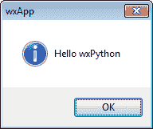
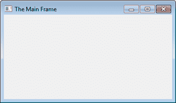
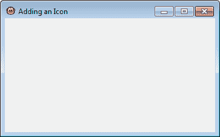
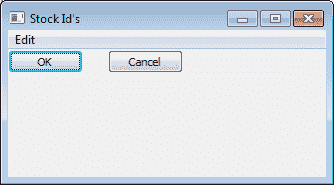
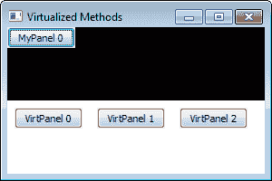

# 第一章. 开始使用 wxPython

在本章中，我们将介绍几乎所有 wxPython 应用程序的基础组件，例如：

+   应用对象

+   主框架

+   理解窗口层次结构

+   引用控件

+   使用位图

+   向窗口添加图标

+   利用库存编号

+   访问剪贴板

+   支持拖放

+   两阶段小部件创建

+   理解继承限制

# 简介

在当今的桌面应用程序世界中，能够开发能在多个操作系统和桌面平台上运行的应用程序具有极大的吸引力。目前，有少数几个跨平台的 Python 框架可以用来开发桌面应用程序。wxPython 库是一组针对 wxWidgets 库的 Python 绑定，wxWidgets 是一个功能强大的跨平台 C++应用程序框架，可用于创建用户界面。wxPython 与众不同的地方在于，与其他绘制自己控制器的 UI 工具包不同，wxPython 使用平台自身的原生 UI 工具包来创建和显示 UI 组件。这意味着 wxPython 应用程序将具有与系统上其他应用程序相同的视觉和感觉，因为它使用的是与系统其他部分相同的控件和主题。

在 wxPython 中开发应用程序为编写可在 Windows、Macintosh OS X、Linux 和其他类似 UNIX 环境中运行的应用程序提供了极大的灵活性。应用程序可以在一个平台上快速开发，并且通常只需进行很少或不需要任何修改就可以部署到另一个平台。

# 应用对象

`App` 对象启动库并初始化底层工具包。所有 wxPython 应用程序都必须创建一个 `App` 对象。这应该在尝试创建任何其他 GUI 对象之前完成，以确保库的所有依赖部分都已正确初始化。`App` 对象还维护 `MainLoop`，它用于驱动 wxPython 应用程序。

本食谱将演示所有 wxPython 应用程序都可以构建的基本模式。

## 如何做到这一点...

在这里，我们将创建一个类似于 "Hello World" 的应用程序，以展示 wxPython 应用程序的基本结构：

```py
import wx

class MyApp(wx.App):
    def OnInit(self):
        wx.MessageBox("Hello wxPython", "wxApp") 
        return True

if __name__ == "__main__":
    app = MyApp(False)
    app.MainLoop()

```

运行上一个脚本将在屏幕上显示以下弹出对话框。点击**确定**以关闭它并退出应用程序。



## 它是如何工作的...

应用对象在创建时会调用其`OnInit`方法。此方法被重写并用作初始化此应用程序的主要入口点。通过返回`True`，该方法通知框架可以继续进行。`OnInit`是大多数应用程序进行初始化和创建主窗口（s）的地方。

在这个例子中，我们通过将`False`作为第一个参数传递来创建`App`对象。这个参数用于告诉 wxPython 是否要重定向输出。在开发应用程序时，建议始终将此设置为`False`，并从命令行运行脚本，这样你就可以看到在通过双击脚本运行时可能被遗漏的任何错误输出。

在创建应用程序对象并且所有初始化完成之后，你需要做的最后一件事就是调用`App`对象的`MainLoop`方法来启动事件循环。此方法将不会返回，直到最后一个顶级窗口被销毁或者直到`App`对象被告知退出。wxPython 是一个事件驱动系统，而`MainLoop`是这个系统的核心。在循环的每次迭代中，事件被分发以执行 GUI 中的所有任务，例如处理鼠标点击、移动窗口和重绘屏幕。

## 还有更多...

`wx.App` 类构造函数有四个可选的关键字参数：

```py
wWx.App((redirect=True, filename=None, 
       useBestVisual=False,clearSigInt=True))

```

四个可选的关键字参数如下：

+   `redirect:` 重定向 `stdout`。

+   `filename:` 如果重定向为 `True`，则可以用来指定要重定向到的输出文件。

+   `useBestVisual:` 指定应用程序是否应尝试使用底层工具包提供的最佳视觉效果。（它对大多数系统没有影响。）

+   `clearSigInt:` 是否应该清除`SIGINT`？将此设置为`True`将允许通过按下*Ctrl* + *C*来终止应用程序，就像大多数其他应用程序一样。

# 主框架

对于大多数应用，您可能希望显示一个窗口供用户与之交互。在 wxPython 中，最典型的窗口对象被称为`Frame`。本食谱将向您展示如何派生一个`Frame`并在应用程序中显示它。

## 如何做到这一点...

此示例在先前的配方基础上扩展，添加了一个最小的空应用程序窗口：

```py
import wx

class MyApp(wx.App):
    def OnInit(self):
        self.frame = MyFrame(None, title="The Main Frame")
        self.SetTopWindow(self.frame)
        self.frame.Show()

        return True

class MyFrame(wx.Frame):
    def __init__(self, parent, id=wx.ID_ANY, title="", 
                 pos=wx.DefaultPosition, size=wx.DefaultSize,
                 style=wx.DEFAULT_FRAME_STYLE,
                 name="MyFrame"):
        super(MyFrame, self).__init__(parent, id, title,
                                      pos, size, style, name)

        # Attributes
        self.panel = wx.Panel(self)

if __name__ == "__main__":
    app = MyApp(False)
    app.MainLoop()

```

运行前面的代码将会显示如下窗口：



## 它是如何工作的...

`Frame` 是大多数应用程序的主要顶级窗口和容器。让我们首先检查我们的 `MyFrame` 类。在这个类中，有一件重要的事情需要注意。我们创建了一个 `Panel` 对象，作为 `Frame` 的子窗口。你可以把 `Panel` 看作是包含其他控件的一个盒子。此外，为了使 `Frame` 在所有平台上都能正确运行和显示，它必须有一个 `Panel` 作为其主要子窗口。

首先，在我们的 `App` 的 `OnInit` 方法中，我们创建了一个 `MyFrame` 实例，并将 `None` 作为其第一个参数传递。这个参数用于指定 `Frame` 的父窗口。因为这是我们主窗口，所以我们传递 `None` 来表示它没有父窗口。其次，我们调用我们的 `App` 的 `SetTopWindow` 方法，以便将新创建的 `MyFrame` 实例设置为应用程序的顶级窗口。最后，我们调用 `Frame` 的 `Show` 方法；这仅仅做了它名字所暗示的事情，即显示 `Frame`，以便用户可以看到它，尽管 `Frame` 不会在屏幕上实际可见，直到 `MainLoop` 开始运行。

## 还有更多...

`Frame` 类在其构造函数中具有多个样式标志，可以设置这些标志以修改窗口的行为和外观。这些样式标志可以组合成一个位掩码，并作为构造函数的样式参数的值提供。下表概述了一些常见的样式标志。所有可用样式的完整列表可以在 wxPython 在线文档中找到，网址为 [`wxpython.org/onlinedocs.php`](http://wxpython.org/onlinedocs.php)。

| 样式标志 | 描述 |
| --- | --- |

| `wx.DEFAULT_FRAME_STYLE` | 这是以下标志的按位或运算：

+   `wx.MINIMIZE_BOX`

+   `wx.MAXIMIZE_BOX`

+   `wx.RESIZE_BORDER`

+   `wx.SYSTEM_MENU`

+   `wx.CAPTION`

+   `wx.CLOSE_BOX`

+   `wx.CLIP_CHILDREN`

|

| `wx.MINIMIZE_BOX` | 显示一个最小化窗口的标题栏按钮 |
| --- | --- |
| `wx.MAXIMIZE_BOX` | 显示一个最大化窗口的标题栏按钮 |
| `wx.CLOSE_BOX` | 显示一个标题栏按钮，允许关闭框架。（即“X”按钮） |
| `wx.RESIZE_BORDER` | 允许用户通过拖动边框来调整框架的大小 |
| `wx.CAPTION` | 显示在框架上的标题 |
| `wx.SYSTEM_MENU` | 显示系统菜单（即在 Windows 上单击框架图标时显示的菜单） |
| `wx.CLIP_CHILDREN` | 消除因背景重绘引起的闪烁（仅限 Windows） |

# 理解窗口层次结构

wxPython 中的所有不同窗口和控制都有包含的层次结构。一些控制可以作为其他控制的容器，而另一些则不能。本食谱旨在帮助理解这一层次结构。

## 准备就绪

我们将对之前食谱中的`Frame`进行微小的修改，所以让我们打开那个食谱的代码，为新的更改做好准备。

## 如何做到这一点...

这里是即将替换我们现有 Frame 类的新的代码。

```py
class MyFrame(wx.Frame):
    def __init__(self, parent, id=wx.ID_ANY, title="", 
                 pos=wx.DefaultPosition, size=wx.DefaultSize,
                 style=wx.DEFAULT_FRAME_STYLE,
                 name="MyFrame"):
        super(MyFrame, self).__init__(parent, id, title,
                                      pos, size, style, name)

        # Attributes
        self.panel = wx.Panel(self)
        self.panel.SetBackgroundColour(wx.BLACK)
        self.button = wx.Button(self.panel,
                                label="Push Me",
                                pos=(50, 50))

```

## 它是如何工作的...

基本上，存在三种按以下包含顺序分层的窗口对象类别：

+   顶级窗口（框架和对话框）

+   通用容器（面板和笔记本，...）

+   控件（按钮、复选框、组合框等）

顶级窗口位于层次结构的顶部，它可以包含任何类型的窗口，除了另一个顶级窗口。接下来是通用容器，它们可以任意地包含任何其他通用容器或控件。最后，在层次结构的底部是控件。这些是用户将与之交互的 UI 的功能部分。在某些情况下，它们可以用来包含其他控件，但通常不会这样做。包含层次结构与控件的父母层次结构相连接。父控件将是其子控件的容器。

当运行前面的示例时，这个层次结构变得明显。正如我们之前看到的，`Frame` 是最外层的容器对象；接下来你可以看到 `Panel`，我们将它变成了黑色以便更明显；最后你可以看到 `Button`，它是作为 `Panel` 的子对象被添加的。

## 参见

+   本章中关于*引用控制*的配方提供了进一步解释，说明了窗口层次结构是如何相互连接的。

# 引用控制

应用程序中的所有 `Window` 对象以各种方式相互连接。通常情况下，获取一个控件实例的引用非常有用，这样你就可以对控件执行某些操作或从中检索一些数据。本食谱将展示一些用于查找和获取控件引用的可用功能。

## 如何做到这一点...

在这里，我们将之前菜谱中的`MyFrame`类扩展，使其在按钮被点击时具有事件处理器。在事件处理器中，我们可以看到一些在运行时访问我们 UI 中不同控件的方法：

```py
class MyFrame(wx.Frame):
    def __init__(self, parent, id=wx.ID_ANY, title="", 
                 pos=wx.DefaultPosition, size=wx.DefaultSize,
                 style=wx.DEFAULT_FRAME_STYLE,
                 name="MyFrame"):
        super(MyFrame, self).__init__(parent, id, title,
                                      pos, size, style, name)

        # Attributes
        self.panel = wx.Panel(self)
        self.panel.SetBackgroundColour(wx.BLACK)
        button = wx.Button(self.panel,
                           label="Get Children",
                           pos=(50, 50))
        self.btnId = button.GetId()

        # Event Handlers
        self.Bind(wx.EVT_BUTTON, self.OnButton, button)

    def OnButton(self, event):
        """Called when the Button is clicked"""
        print "\nFrame GetChildren:"
        for child in self.GetChildren():
            print "%s" % repr(child)

        print "\nPanel FindWindowById:"
        button = self.panel.FindWindowById(self.btnId)
        print "%s" % repr(button)
        # Change the Button's label
        button.SetLabel("Changed Label")

        print "\nButton GetParent:"
        panel = button.GetParent()
        print "%s" % repr(panel)

        print "\nGet the Application Object:"
        app = wx.GetApp()
        print "%s" % repr(app)

        print "\nGet the Frame from the App:"
        frame = app.GetTopWindow()
        print "%s" % repr(frame)

```

## 它是如何工作的...

框架中的每个窗口都保存对其父窗口和子窗口的引用。现在运行我们的程序将打印出使用所有窗口都有的访问器函数来查找和检索对其子窗口和其他相关控件引用的结果。

+   `GetChildren:` 此方法将返回给定控件的所有子控件的列表

+   `FindWindowById:` 这可以通过使用其 ID 来查找特定的子窗口

+   `GetParent:` 此方法将检索窗口的父窗口

+   `wx.GetApp:` 这是一个全局函数，用于获取唯一的应用对象访问权限

+   `App.GetTopWindow:` 这将获取应用程序中的主顶层窗口

点击`按钮`将会调用`OnButton`方法。在`OnButton`中，有一些示例展示了如何使用上述每种方法。每个方法都会返回一个 GUI 对象的引用。在我们的例子中，对`Panel`调用`GetChildren`将返回其子控件列表。遍历这个列表，我们将打印出每个子控件，在这个情况下，就是按钮。`FindWindowById`可以用来查找特定的子控件；同样，我们也在我们的`Panel`上调用这个方法来查找`按钮`控件。为了展示我们已经找到了`按钮`，我们使用了它的`SetLabel`方法来更改其标签。接下来，对`按钮`调用`GetParent`将返回`按钮`的父对象，即`Panel`。最后，通过使用全局的`GetApp`函数，我们可以获取到应用程序对象的引用。`App`对象的`GetTopWindow`将返回对我们 Frame 的引用。

## 还有更多...

这里有一些更多有用的方法来获取控件引用。

| 函数名称 | 描述 |
| --- | --- |
| `wx.FindWindowByLabel(label)` | 通过标签查找子窗口 |
| `wx.FindWindowByName(name)` | 通过名称查找子窗口 |
| `wx.GetTopLevelParent()` 获取顶层窗口，该窗口位于给定控件父级层次结构的顶部 |

## 参见

+   本章中关于*理解窗口层次结构*的配方概述了窗口如何在其中包含以及它们之间如何相互关联的结构。

# 使用位图

很可能，在某个时刻，你将希望能够在你的应用程序中显示一张图片。`Bitmap` 是用于在应用程序中显示图片的基本数据类型。本食谱将展示如何将图片文件加载到 `Bitmap` 中，并在 `Frame` 中显示它。

## 如何做到这一点...

要了解如何使用位图，我们将创建一个小应用程序，从硬盘加载一张图片并在一个框架中显示它：

```py
import os
import wx

class MyApp(wx.App):
    def OnInit(self):
        self.frame = MyFrame(None, title="Bitmaps")
        self.SetTopWindow(self.frame)
        self.frame.Show()

        return True

class MyFrame(wx.Frame):
    def __init__(self, parent, id=wx.ID_ANY, title="", 
                 pos=wx.DefaultPosition, size=wx.DefaultSize,
                 style=wx.DEFAULT_FRAME_STYLE,  
                 name="MyFrame"):
        super(MyFrame, self).__init__(parent, id, title,
                                      pos, size, style, name)

        # Attributes
        self.panel = wx.Panel(self)

        img_path = os.path.abspath("./face-grin.png")
        bitmap = wx.Bitmap(img_path, type=wx.BITMAP_TYPE_PNG)
        self.bitmap = wx.StaticBitmap(self.panel, 
                                      bitmap=bitmap)

if __name__ == "__main__":
    app = MyApp(False)
    app.MainLoop()

```

## 它是如何工作的...

`StaticBitmap` 控件是在应用程序中显示位图的简单方法。在随本食谱附带的示例代码中，我们有一个与我们的脚本在同一目录下的图像，名为 `face-grin.png`，我们希望显示该图像。为了显示图像，我们首先使用 `Bitmap` 构造函数将图像加载到内存中，然后将其传递给 `StaticBitmap` 控件以在屏幕上显示图像。构造函数接受文件路径和一个指定图像格式的类型参数。

## 还有更多...

内置了对最常见图像格式的支持。以下列表显示了支持的图像文件格式：

+   `wx.BITMAP_TYPE_ANY`

+   `wx.BITMAP_TYPE_BMP`

+   `wx.BITMAP_TYPE_ICO`

+   `wx.BITMAP_TYPE_CUR`

+   `wx.BITMAP_TYPE_XBM`

+   `wx.BITMAP_TYPE_XPM`

+   `wx.BITMAP_TYPE_TIF`

+   `wx.BITMAP_TYPE_GIF`

+   `wx.BITMAP_TYPE_PNG`

+   `wx.BITMAP_TYPE_JPEG`

+   `wx.BITMAP_TYPE_PNM`

+   `wx.BITMAP_TYPE_PCX`

+   `wx.BITMAP_TYPE_PICT`

+   `wx.BITMAP_TYPE_ICON`

+   `wx.BITMAP_TYPE_ANI`

+   `wx.BITMAP_TYPE_IFF`

## 参见

+   第三章中的*使用工具栏*配方，*用户界面基本构建块*包含了一些更多的位图使用示例。

+   在第十章的*自定义 ArtProvider 配方*中，*创建组件和扩展功能*提供了更多关于如何创建位图的详细信息。

# 添加图标到 Windows

将图标添加到应用程序的标题栏中，作为品牌化应用程序的一种方式，这有助于将其与其他在桌面上运行的应用程序区分开来。本食谱将展示如何轻松地将图标添加到框架中。

### 注意

在 OS X 系统上，wxPython 2.8 目前不支持在标题栏添加图标。

## 如何做到这一点...

在这里，我们将创建一个`Frame`子类，该子类从硬盘加载一个图像文件并在其标题栏上显示它：

```py
class MyFrame(wx.Frame):
    def __init__(self, parent, id=wx.ID_ANY, title="", 
                 pos=wx.DefaultPosition, size=wx.DefaultSize,
                 style=wx.DEFAULT_FRAME_STYLE,
                 name="MyFrame"):
        super(MyFrame, self).__init__(parent, id, title, pos,
                                      size, style, name)

        # Attributes
        self.panel = wx.Panel(self)

        # Setup
        path = os.path.abspath("./face-monkey.png")
        icon = wx.Icon(path, wx.BITMAP_TYPE_PNG)
        self.SetIcon(icon)

```

显示这个 Frame 子类将导致出现如下窗口。与主 Frame 配方中的窗口相比，您可以看到标题左侧的新图标：



## 它是如何工作的...

在这个示例中，我们有一个小（16x16）的猴子图像，我们希望将其显示在`Frame`的标题栏中。为了简单起见，此图像位于我们的脚本相同的目录中，我们使用相对路径来加载它。`Frame`需要一个图标而不是`Bitmap`，因此我们必须使用`Icon`将我们的图像加载到内存中。在加载图像后，剩下的只是调用`Frame`的`SetIcon`方法来设置`Frame`的图标。

## 参见

+   本章中的*使用位图*配方讨论了更常用的位图图像类型。

# 利用库存编号

所有控件以及许多其他用户界面元素，例如菜单，在其构造函数中接受一个 ID 作为参数，该参数可用于在事件处理程序中识别控件或对象。通常，使用`wx.ID_ANY`的值让系统自动为项目生成一个 ID，或者使用`wx.NewId`函数创建一个新的 ID。然而，`wx`模块中也有许多预定义的 ID，这些 ID 对于许多应用程序中常见的某些项目具有特殊含义，例如复制/粘贴菜单项或确定/取消按钮。这些项目的一些预期行为和外观可能会因平台而异。通过使用标准 ID，wxPython 将为您处理这些差异。本食谱将展示这些 ID 可以在哪些地方派上用场。

## 如何做到这一点...

这段代码片段展示了如何利用一些预定义的 ID 来简化创建一些常见 UI 元素的过程：

```py
class MyFrame(wx.Frame):
    def __init__(self, parent, id=wx.ID_ANY, title="", 
                 pos=wx.DefaultPosition, size=wx.DefaultSize,
                 style=wx.DEFAULT_FRAME_STYLE,
                 name="MyFrame"):
        super(MyFrame, self).__init__(parent, id, title, 
                                      pos, size, style, name)

        # Attributes
        self.panel = wx.Panel(self)

        # Setup
        ok_btn = wx.Button(self.panel, wx.ID_OK)
        cancel_btn = wx.Button(self.panel, wx.ID_CANCEL,
                               pos=(100, 0))

        menu_bar = wx.MenuBar()
        edit_menu = wx.Menu()
        edit_menu.Append(wx.NewId(), "Test")
        edit_menu.Append(wx.ID_PREFERENCES)
        menu_bar.Append(edit_menu, "Edit")
        self.SetMenuBar(menu_bar)

```

上一节课将创建以下窗口：



## 它是如何工作的...

在这个菜谱中首先要注意的是，我们创建的两个按钮没有指定标签。通过使用“确定”和“取消”的库存 ID 作为它们的 ID，框架将自动为控件添加正确的标签。

这同样适用于菜单项，如在我们编辑菜单中查看的“偏好设置”项所示。另一个需要注意的重要事项是，如果在这个示例中运行在 Macintosh OS X 上，框架也会自动将“偏好设置”菜单项移动到应用程序菜单中预期的位置。

## 还有更多...

在模态对话框中使用具有库存 ID 的按钮也将允许对话框被关闭，并返回适当的值，例如`wx.OK`或`wx.CANCEL`，无需将事件处理程序连接到按钮以执行此标准操作。通过使用`StdDialogButtonSizer`与库存 ID，也可以自动获取对话框的正确按钮布局。

## 参见

+   第三章中的 *创建股票按钮* 菜单，*用户界面基本构建块* 展示了如何使用股票 ID 来构建标准按钮。

+   第七章中的*标准对话框按钮布局*配方，*窗口布局和设计*展示了如何通过使用库存 ID 轻松地将常用按钮添加到对话框中。

+   第十二章中的*针对 OS X 优化*配方展示了 Stock IDs 的更多用途。

# 访问剪贴板

剪贴板是一种跨应用、可访问的方式，用于在不同应用程序之间传输数据。本食谱将展示如何从剪贴板获取文本，以及如何将文本放入剪贴板以便其他应用程序访问。

## 如何做到这一点...

以下两个函数可以用来从剪贴板获取文本和将文本放置到剪贴板：

```py
def SetClipboardText(text):
    """Put text in the clipboard
    @param text: string
    """
    data_o = wx.TextDataObject()
    data_o.SetText(text)
    if wx.TheClipboard.IsOpened() or wx.TheClipboard.Open():
        wx.TheClipboard.SetData(data_o)
        wx.TheClipboard.Close()

def GetClipboardText():
    """Get text from the clipboard
    @return: string
    """
    text_obj = wx.TextDataObject()
    rtext = ""
    if wx.TheClipboard.IsOpened() or wx.TheClipboard.Open():
        if wx.TheClipboard.GetData(text_obj):
            rtext = text_obj.GetText()
        wx.TheClipboard.Close()
    return rtext

```

## 它是如何工作的...

wxPython 提供了一个单例剪贴板对象，可以用来与系统剪贴板进行交互。这个类与用于表示底层系统数据类型的对象一起工作。使用剪贴板是一个三步过程：

+   打开剪贴板

+   设置/获取数据对象

+   关闭剪贴板

## 还有更多...

剪贴板支持许多其他数据类型，而不仅仅是文本。wxPython 提供了对一些附加类型的内置支持，以及用于定义您自己的自定义类型的类。这些不同数据类型的用法遵循与 `TextDataObject` 相同的一般模式。

| 数据类型 | 描述 |
| --- | --- |
| `wx.BitmapDataObject` | 用于从剪贴板获取位图并将其放置在剪贴板上 |
| `wx.CustomDataObject` | 可以存储任何可 Python 可序列化的数据类型 |
| `wx.DataObjectComposite` | 可以包含任意数量的简单数据类型，并使它们一次性全部可用 |
| `wx.FileDataObject` | 用于存储文件名 |
| `wx.URLDataObject` | 用于存储 URL |

## 参见

+   本章中关于*支持拖放*的配方与剪贴板相关，因为它允许在应用程序之间传输数据。

# 支持拖放

为了提高可用性，在应用程序中支持拖放操作是很好的，这样用户就可以简单地拖放文件或其他对象到您的应用程序中。本食谱将展示如何支持接受一个同时支持文件和文本的`CompositeDataObject`。

## 如何做到这一点...

首先，我们将定义一个自定义的拖放目标类：

```py
class FileAndTextDropTarget(wx.PyDropTarget):
    """Drop target capable of accepting dropped 
    files and text
    """
    def __init__(self, file_callback, text_callback):
        assert callable(file_callback)
        assert callable(text_callback)
        super(FileAndTextDropTarget, self).__init__()wx.PyDropTarget.__init__(self)

        # Attributes
        self.fcallback = file_callback # Drop File Callback
        self.tcallback = text_callback # Drop Text Callback
        self._data = None
        self.txtdo = None
        self.filedo = None

        # Setup
        self.InitObjects()

    def InitObjects(self):
        """Initializes the text and file data objects"""
        self._data = wx.DataObjectComposite()
        self.txtdo = wx.TextDataObject()
        self.filedo = wx.FileDataObject()
        self._data.Add(self.txtdo, False)
        self._data.Add(self.filedo, True)
        self.SetDataObject(self._data)

    def OnData(self, x_cord, y_cord, drag_result):
        """Called by the framework when data is dropped 
        on the target
        """
        if self.GetData():
            data_format = self._data.GetReceivedFormat()
            if data_format.GetType() == wx.DF_FILENAME:
                self.fcallback(self.filedo.GetFilenames())
            else:
                self.tcallback(self.txtdo.GetText())

        return drag_result

```

然后为了使用`FileAndTextDropTarget`，我们使用窗口对象的`SetDropTarget`方法将其分配给一个窗口。

```py
class DropTargetFrame(wx.Frame):
    def __init__(self, parent, id=wx.ID_ANY, title="", 
                 pos=wx.DefaultPosition, size=wx.DefaultSize,
                 style=wx.DEFAULT_FRAME_STYLE,
                 name="DropTargetFrame"):
        super(DropTargetFrame, self).__init__(parent, id,
                                              title, pos,
                                              size, style,
                                              name)

        # Attributes
        choices = ["Drag and Drop Text or Files here",]
        self.list = wx.ListBox(self, 
                               choices=choices)
        self.dt = FileAndTextDropTarget(self.OnFileDrop,
                                        self.OnTextDrop)
        self.list.SetDropTarget(self.dt)

        # Setup
        self.CreateStatusBar()

    def OnFileDrop(self, files):
        self.PushStatusText("Files Dropped")
        for f in files:
            self.list.Append(f)

    def OnTextDrop(self, text):
        self.PushStatusText("Text Dropped")
        self.list.Append(text)

```

## 它是如何工作的...

当窗口接收到拖放数据时，框架将调用我们的`DropTarget`的`OnData`方法。当`OnData`被调用时，我们只需从我们的`DataObject`中获取数据，并将其传递给适当的回调函数，以便我们的窗口决定如何处理这些数据。

所有窗口对象都有一个`SetDropTarget`方法，可以用来分配一个`DropTarget`，因此这个类可以用于几乎任何类型的控件。在先前的示例中，我们将它分配给了一个`ListBox`，然后在我们每个回调函数中将拖放的数据添加到列表中。

## 还有更多...

`PyDropTarget` 类提供了一些可以在拖动操作的不同时间点调用的方法。这些方法也可以被重写，以便执行诸如更改鼠标光标、显示自定义拖动图像或拒绝拖动对象等操作。

| 方法 | 当方法被调用时 |
| --- | --- |
| `OnEnter(x, y, drag_result)` | 当拖动对象进入窗口时被调用。返回一个拖动结果值（即，`wx.DragNone, wx.DragCopy`, ...） |
| `OnDragOver(x, y, drag_result)` | 在鼠标拖动对象到目标上时调用 |
| `OnLeave()` | 当鼠标离开拖放目标时调用 |
| `OnDrop(x, y)` | 当用户放下对象时被调用。返回 `True` 以接受对象或返回 `False` 以拒绝它 |
| `OnData(x, y, drag_result)` | 在 `OnDrop` 被调用后，当数据对象被接受时调用 |

## 参见

+   本章中的*访问剪贴板*配方展示了另一种在应用程序之间进行数据传输的方法。

# 两阶段小部件创建

两阶段小部件创建是一种通过两步初始化小部件及其 UI 部分的方法。这种对象创建方法被类工厂如 XRC（XML 资源）所使用，以及用于设置不能通过构造函数的常规样式参数设置的其他样式标志。本食谱将展示如何使用两阶段创建来创建一个具有特殊按钮的框架，该按钮可用于将其置于上下文相关帮助模式。

### 注意事项

这是一个特定于 Windows 的示例；其他平台不支持在它们的标题栏中拥有`ContextButton`。

## 如何做到这一点...

在这里，我们将创建一个`Frame`子类，它使用两阶段创建来设置一个额外的样式标志：

```py
class MyFrame(wx.Frame):
    def __init__(self, parent, *args, **kwargs):
        pre = wx.PreFrame()
        pre.SetExtraStyle(wx.FRAME_EX_CONTEXTHELP)
        pre.Create(parent, *args, **kwargs)
        self.PostCreate(pre)

```

## 它是如何工作的...

在 wxPython 中，两阶段小部件创建实际上是一个三步过程。首先，每个支持它的类都有自己的`PreClass`，它用作一个工厂构造函数，预先创建对象。在这个阶段，预对象可以用来设置额外的样式标志。下一步是调用`Create`，`Create`的行为类似于常规构造函数，创建控制器的 UI 部分。最后一步是调用`PostCreate`，`PostCreate`将`pre`对象转换为`self`，使得对象看起来就像类的`__init__`方法已经被正常调用一样。

## 参见

+   第七章中的*使用 XRC*配方，*窗口布局与设计*讨论了 XRC。

# 理解继承限制

wxPython 是围绕 wxWidgets C++ 框架的包装器。这种关系意味着在大多数 wxPython 对象内部存在一个 C++ 对象。因此，属于 wxPython 类的方法并不能总是像在普通 Python 对象中那样被覆盖。

为了展示这种行为，这个菜谱将展示如何创建一个类，该类会自动将其子窗口添加到其`Sizer`布局中。这将与一个不向 Python 层公开其虚方法的类进行对比。

## 如何做到这一点...

为了展示重写方法之间的差异，我们首先将创建两个相似的类，从一个继承自标准`Panel`类的类开始：

```py
import wx

class MyPanel(wx.Panel):
    def __init__(self, parent):
        super(MyPanel, self).__init__(parent)

        sizer = wx.BoxSizer()
        self.SetSizer(sizer)

    def AddChild(self, child):
        sizer = self.GetSizer()
        sizer.Add(child, 0, wx.ALIGN_LEFT|wx.ALL, 8)
        return super(MyPanel, self).AddChild(child)

```

现在我们将创建一个与`Py`版本完全相同的类，只是它派生自该类：

```py
class MyVirtualPanel(wx.PyPanel):
    """Class that automatically adds children
    controls to sizer layout.
    """
    def __init__(self, parent):
        super(MyVirtualPanel, self).__init__(parent)

        sizer = wx.BoxSizer()
        self.SetSizer(sizer)

    def AddChild(self, child):
        sizer = self.GetSizer()
        sizer.Add(child, 0, wx.ALIGN_LEFT|wx.ALL, 8)
        return super(MyVirtualPanel, self).AddChild(child)

```

现在下面我们有一个使用上述两个类的小型示例应用：

```py
class MyFrame(wx.Frame):
    def __init__(self, parent, *args, **kwargs):
        super(MyFrame, self).__init__(parent,
                                      *args, **kwargs)

        # Attributes
        self.mypanel = MyPanel(self)
        self.mypanel.SetBackgroundColour(wx.BLACK)
        self.virtpanel = MyVirtualPanel(self)
        self.virtpanel.SetBackgroundColour(wx.WHITE)

        # Setup
        self.__DoLayout()

    def __DoLayout(self):
        """Layout the window"""
        # Layout the controls using a sizer
        sizer = wx.BoxSizer(wx.VERTICAL)
        sizer.Add(self.mypanel, 1, wx.EXPAND)
        sizer.Add(self.virtpanel, 1, wx.EXPAND)
        self.SetSizer(sizer)

        # Create 3 children for the top panel
        for x in range(3):
            wx.Button(self.mypanel,
                      label="MyPanel %d" % x)
        # Create 3 children for the bottom panel
        for x in range(3):
            wx.Button(self.virtpanel,
                      label="VirtPanel %d" % x)

        self.SetInitialSize(size=(300, 200))

class MyApp(wx.App):
    def OnInit(self):
        self.frame = MyFrame(None,
                             title="Virtualized Methods")
        self.SetTopWindow(self.frame)
        self.frame.Show()

        return True

if __name__ == "__main__":
    app = MyApp(False)
    app.MainLoop()

```

运行此代码将显示如下窗口：



## 它是如何工作的...

在我们`Panel`类的每个版本中，我们都重写了`AddChild`方法，该方法在每次创建新的子窗口时被调用。当这种情况发生时，`AddChild`方法在类的 C++部分中被调用，因此为了能够在我们的 Python 类版本中重写该方法，我们需要使用提供访问从 C++类中虚拟化方法重写的特殊版本。

在 wxPython 中，那些带有以`Py`为前缀的类版本，暴露了许多方法的虚拟化版本，因此当它们在 Python 子类中被覆盖时，它们会被绑定到对象 C++层的相应方法，并且将由框架调用而不是基类的实现。

这可以在上面展示的我们的食谱应用截图中看到。那个不继承自`PyPanel`的类的顶部版本，其三个`按钮`都堆叠在窗口的左上角，因为它的重写`AddChild`方法从未被调用。另一方面，那个继承自`PyPanel`的类的版本调用了其`AddChild`方法，并且能够在其`Sizer`中布局`按钮`。

## 还有更多...

关于哪些方法是作为虚方法暴露的，哪些不是，并没有很好地记录。这里有一个小技巧可以帮助你识别给定类中可用的虚方法。只需在 Python 解释器中运行以下代码：

```py
import wx
for method in dir(wx.PyPanel):
    if method.startswith('base_'):
        print method

```

`dir()` 调用中的参数可以更改为您想要检查的任何类。运行此命令将打印出该类中所有虚拟化的方法列表。`base_` 方法是由 SWIG 在 wxPython 绑定到 wxWidgets 的过程中生成的，不应直接在您的代码中使用。相反，应使用没有 `base_` 前缀的方法。

## 参见

+   在第十章 创建自定义控件 的“创建组件和扩展功能”中，*创建自定义控件*的配方展示了更多重写虚拟方法的用法示例。

+   第七章中的*使用 BoxSizer*配方，*窗口设计和布局*，解释了如何使用 BoxSizer 类在窗口中执行控件布局。
