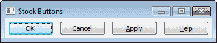
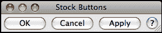
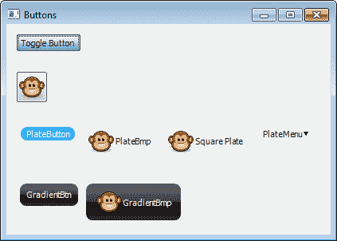
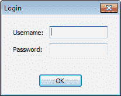

# 第三章：用户界面的基本构建块

在本章中，我们将涵盖：

+   创建股票按钮

+   按钮，按钮，还有更多的按钮

+   提供带有`复选框`的选项

+   使用 `TextCtrl`

+   使用 `Choice` 控件提供选择

+   添加 `菜单` 和 `菜单栏`

+   与 `ToolBars` 一起工作

+   如何使用 `PopupMenus`

+   使用`StaticBox`分组控件

# 简介

即使是最复杂的对象通常也是由许多较小的、更简单的对象或部分组成的。应用开发者的任务是利用这些较小的部分并将它们以有意义的方式连接起来，以达到应用所需的功能。为了能够构建应用，有必要知道有哪些部分可供使用。

wxPython 提供了大量类和实用工具。实际上，基本集合非常丰富，以至于完全有可能在不发明任何自定义部分的情况下构建一个功能齐全的应用程序。所以让我们开始，看看几乎在任何桌面应用程序中都能找到的一些最常见和基本的部分。

# 创建股票按钮

几乎所有应用程序都包含按钮，在这些按钮中有很多常见的按钮，例如“确定”和“取消”，它们反复出现。在 wxPython 中，这些常见的按钮被称为库存按钮（Stock Buttons），因为它们是通过传递一个库存 ID 给`Button`构造函数来构建的。

## 如何做到这一点...

让我们创建一个简单的`面板`，在其上放置四个`按钮`，以查看如何创建股票按钮：

```py
class MyPanel(wx.Panel):
    def __init__(self, parent):
        super(MyPanel, self).__init__(parent)

        # Make some buttons
        sizer = wx.BoxSizer(wx.HORIZONTAL)
        for bid in (wx.ID_OK, wx.ID_CANCEL,
                    wx.ID_APPLY, wx.ID_HELP):
            button = wx.Button(self, bid)
            sizer.Add(button, 0, wx.ALL, 5)
        self.SetSizer(sizer)

```

## 它是如何工作的...

常见按钮是通过使用带有库存 ID 但没有标签的标准`Button`创建的。框架随后将为当前平台创建正确类型的按钮并带有适当的标签。每个平台对于这些常见按钮都有略微不同的标准。通过使用库存按钮，这些跨平台差异可以由框架处理。例如，查看以下两个屏幕截图，展示了之前示例代码在 Windows 7 和 OS X 上分别运行的情况。

Windows 7 的屏幕截图：



OS X 的屏幕截图：



### 注意

平台通知：在 Linux 上，根据 GTK 的版本，标准按钮也将显示适当的主题图标。

## 还有更多...

可以从几乎所有的股票 ID 创建股票按钮。如果你的文本编辑器不提供自动完成提示，这里有一个快速查看所有可用股票 ID 的方法：只需在你的 Python 解释器中运行以下代码，以检查`wx`命名空间中的所有 ID 常量。

```py
import wx
for x in dir(wx):
    if x.startswith(‘ID_’):
        print x

```

## 参见

+   第一章中的*使用股票 ID*配方，*使用 wxPython 入门*详细讨论了用于构建股票按钮的 ID。

+   本章中的 *按钮、按钮，还有更多按钮* 菜单展示了如何使用 wxPython 中可用的其他按钮类。

+   第七章“窗口布局与设计”中的*标准对话框按钮布局*配方展示了如何使用 Stock Buttons 在对话框中实现易于控制的布局。

# 按钮，按钮，还有更多的按钮

普通的 `Button` 类仅允许在按钮上显示标签。如果这对你应用的某些需求来说略显单调，那么你很幸运。wxPython 还提供了多种不同外观和感觉的按钮类型，以及扩展的功能。本食谱将介绍 wxPython 中可用的其他一些按钮控件。

### 注意

版本说明：以下代码中使用的`agw`包和`GradientButton`类仅在 wxPython 2.8.9.2 及以后的版本中可用。

## 如何做到这一点...

要查看这些不同的`按钮`的外观以及它们能做什么，我们将创建一个简单的`面板`，其中包含这些额外按钮类的不同示例：

```py
import wx
import wx.lib.platebtn as platebtn
import wx.lib.agw.gradientbutton as gradbtn

class ButtonTestPanel(wx.Panel):
    def __init__(self, parent):
        super(ButtonTestPanel, self).__init__(parent)

        # Attributes
        # Make a ToggleButton
        self.toggle = wx.ToggleButton(self,
                                      label="Toggle Button")

        # Make a BitmapButton
        bmp = wx.Bitmap("./face-monkey.png",
                        wx.BITMAP_TYPE_PNG)
        self.bmpbtn = wx.BitmapButton(self, bitmap=bmp)

        # Make a few PlateButton variants
        self.pbtn1 = pbtn.PlateButton(self,
                                      label="PlateButton")
        self.pbtn2 = pbtn.PlateButton(self, 
                                      label="PlateBmp",
                                      bmp=bmp)
        style = pbtn.PB_STYLE_SQUARE
        self.pbtn3 = pbtn.PlateButton(self,
                                      label="Square Plate",
                                      bmp=bmp,
                                      style=style)
        self.pbtn4 = pbtn.PlateButton(self,
                                      label="PlateMenu")
        menu = wx.Menu()
        menu.Append(wx.NewId(), text="Hello World")
        self.pbtn4.SetMenu(menu)

        # Gradient Buttons
        self.gbtn1 = gbtn.GradientButton(self,
                                         label="GradientBtn")
        self.gbtn2 = gbtn.GradientButton(self,
                                         label="GradientBmp",
                                         bitmap=bmp)

        # Layout
        vsizer = wx.BoxSizer(wx.VERTICAL)
        vsizer.Add(self.toggle, 0, wx.ALL, 12)
        vsizer.Add(self.bmpbtn, 0, wx.ALL, 12)
        hsizer1 = wx.BoxSizer(wx.HORIZONTAL)
        hsizer1.AddMany([(self.pbtn1, 0, wx.ALL, 5),
                        (self.pbtn2, 0, wx.ALL, 5),
                        (self.pbtn3, 0, wx.ALL, 5),
                        (self.pbtn4, 0, wx.ALL, 5)])
        vsizer.Add(hsizer1, 0, wx.ALL, 12)
        hsizer2 = wx.BoxSizer(wx.HORIZONTAL)
        hsizer2.AddMany([(self.gbtn1, 0, wx.ALL, 5),
                         (self.gbtn2, 0, wx.ALL, 5)])
        vsizer.Add(hsizer2, 0, wx.ALL, 12)
        self.SetSizer(vsizer)

```

此代码生成以下窗口：



## 它是如何工作的...

这个菜谱展示了四个不同按钮类的基本用法，所以让我们逐一查看每个按钮类，看看它们能做什么。

### 切换按钮

`ToggleButton` 是 wxPython 提供的另一个原生按钮。它就像标准的 `Button` 一样，但提供了两种状态。当点击按钮时，按钮将从其常规状态切换到按下状态。第二次点击将再次将其切换回常规状态。

### 位图按钮

`BitmapButton` 是一个原生平台按钮，用于显示图像而不是标签文本。此按钮的使用方式与标准 `Button` 类似，只是它接受一个 `Bitmap` 作为参数，而不是标签字符串。当按钮被按下或通过鼠标与之交互时，每个状态的 `Bitmap` 也可以通过以下方法进行自定义：

| 方法 | 描述 |
| --- | --- |
| `SetBitmapDisabled` | 设置按钮禁用时显示的位图。 |
| `SetBitmapFocus` | 设置按钮获得键盘焦点时显示的位图。 |
| `SetBitmapHover` | 设置鼠标光标悬停在按钮上时显示的位图。 |
| `SetBitmapLabel` | 设置默认按钮（与提供给构造函数的相同）。在没有其他位图的情况下，此位图将用于所有状态。 |
| `SetBitmapSelected` | 设置按钮按下时使用的位图。 |

### 面板按钮

`PlateButton` 是由 `wx.lib.platebtn` 模块提供的一个由所有者绘制的按钮类。`PlateButtons` 是一种平面按钮控件，当鼠标悬停在其上或点击时，会改变其背景颜色。`PlateButton` 可以仅显示标签，仅显示 `Bitmap`，同时显示标签和 `Bitmap`，或者任何上述组合加上一个下拉 `Menu`。

按钮的外观和感觉也可以自定义，以控制高亮颜色、文本标签颜色、按钮形状以及高亮显示的绘制方式。`PB_STYLE_SQUARE`样式标志将使按钮呈现正方形形状，而不是使用其默认的圆角，而`PB_STYLE_GRADIENT`样式标志将导致背景根据高亮颜色绘制为渐变色。除了这种可定制性之外，`PlateButton`还完全实现了`BitmapButton` API，因此它可以作为现有应用程序中`BitmapButton`的即插即用替代品。

### GradientButton

`GradientButton`与`PlateButton`非常相似。唯一的区别在于它不是一个平面按钮，不支持下拉菜单，并且在配置渐变颜色方面更加灵活。

## 还有更多...

仍然有相当多的按钮实现可供选择，你可能会在你的应用程序中找到它们很有用。

### 通用按钮

`GenericButtons` 是 `wx.lib.buttons` 中的一组类，它提供了一些基本的自定义按钮，以及一些自定义的本地按钮实现。这些自定义的本地按钮保持了本地按钮的外观，但解决了某些限制。例如，有 `GenBitmapTextButton`，它提供了一个同时支持显示标签的位图按钮，以及 `GenBitmapToggleButton`，它允许创建一个显示 `Bitmap` 的切换按钮。

### AquaButton

`AquaButtons` 是一个由所有者绘制的按钮类，具有类似玻璃外观，近似于原生 Macintosh Aqua 按钮的外观和感觉。由于该类由所有者绘制，它将在所有平台上提供相同的外观和感觉。此类可以在 `wx.lib.agw.aquabutton` 中找到。

## 参见

+   本章中的 *创建股票按钮* 菜单展示了如何创建标准按钮。

# 提供带有复选框的选项

`CheckBox` 是一种常见的基本控件，允许用户根据 `CheckBox` 的样式选择两种或三种状态之一，尽管它通常只与 `True` 或 `False` 状态相关联。在本教程中，我们将探讨如何使用 `CheckBox` 控件。

## 如何做到这一点...

要了解`CheckBoxes`如何工作，我们将创建一个包含两种不同类型`CheckBoxes`的小窗口：

```py
class CheckBoxFrame(wx.Frame):
    def __init__(self, *args, **kwargs):
        super(CheckBoxFrame, self).__init__(*args, **kwargs)

        # Attributes
        self.panel = wx.Panel(self)
        self.checkbox1 = wx.CheckBox(self.panel,
                                     label="2 State CheckBox")
        style = wx.CHK_3STATE|wx.CHK_ALLOW_3RD_STATE_FOR_USER
        self.checkbox2 = wx.CheckBox(self.panel,
                                     label="3 State CheckBox",
                                     style=style)

        # Layout
        sizer = wx.BoxSizer(wx.VERTICAL)
        sizer.Add(self.checkbox1, 0, wx.ALL, 15)
        sizer.Add(self.checkbox2, 0, wx.ALL, 15)
        self.panel.SetSizer(sizer)
        self.CreateStatusBar()

        # Event Handlers
        self.Bind(wx.EVT_CHECKBOX, self.OnCheck)

    def OnCheck(self, event):
        e_obj = event.GetEventObject()
        if e_obj == self.checkbox1:
            checked = self.checkbox1.GetValue()
            msg = "Two State Clicked: %s" % checked
            self.PushStatusText(msg)
        elif e_obj == self.checkbox2:
            state = self.checkbox2.Get3StateValue()
            msg = "Three State Clicked: %d" % state
            self.PushStatusText(msg)
        else:
            event.Skip()

```

## 它是如何工作的...

我们创建了两个 `CheckBoxes`；第一个是标准的双态 `CheckBox`，第二个是一个三态 `CheckBox`。双态 `CheckBox` 的状态可以通过其 `GetValue` 和 `SetValue` 方法进行程序控制。

三状态复选框是通过指定两个样式标志 `CHK_3STATE` 和 `CHK_ALLOW_3RD_STATE_FOR_USER` 来创建的。如果您想限制用户无法设置不确定状态，从而只能通过程序来设置，则可以省略第二个样式标志。三状态复选框使用 `Get3StateValue` 和 `Set3StateValue` 方法，以下列值来程序化控制 `CheckBox` 的状态：

+   `wx.CHK_CHECKED`

+   `wx.CHK_UNCHECKED`

+   `wx.CHK_UNDETERMINED`

## 参见

+   第七章中的*使用 BoxSizer 布局*配方，*窗口布局与设计*展示了如何使用`BoxSizer`类来控制布局。

# 使用 TextCtrl

`TextCtrl` 是允许用户将文本数据输入到应用程序中的基本手段。这个控件有许多可能的用途和操作模式。本食谱将展示如何创建一个简单的登录对话框，该对话框使用两个 `TextCtrls` 来提供登录名和密码的输入字段。

## 如何做到这一点...

首先，让我们创建一个`Dialog`类，它将包含其他控件：

```py
class LoginDialog(wx.Dialog):LoginDialog(wx.Dialog):
    def __init__(self, *args, **kwargs):
        super(LoginDialog, self).__init__(*args, **kwargs)wx.Dialog.__init__(self, *args, **kwargs)

        # Attributes
        self.panel = LoginPanel(self)

        # Layout
        sizer = wx.BoxSizer(wx.VERTICAL)
        sizer.Add(self.panel, 1, wx.EXPAND)
        self.SetSizer(sizer)
        self.SetInitialSize()

    def GetUsername(self):
        return self.panel.GetUsername()

    def GetPassword(self):
        return self.panel.GetPassword()

```

接下来让我们创建一个`Panel`，它将包含用于用户输入登录信息的`TextCtlr`控件：

```py
class LoginPanel(wx.Panel):
    def __init__(self, parent):
        super(LoginPanel, self).__init__(parent)

        # Attributes
        self._username = wx.TextCtrl(self)
        self._passwd = wx.TextCtrl(self, style=wx.TE_PASSWORD)

        # Layout
        sizer = wx.FlexGridSizer(2, 2, 8, 8)
        sizer.Add(wx.StaticText(self, label="Username:"),
                  0, wx.ALIGN_CENTER_VERTICAL)
        sizer.Add(self._username, 0, wx.EXPAND)
        sizer.Add(wx.StaticText(self, label="Password:"),
                  0, wx.ALIGN_CENTER_VERTICAL)
        sizer.Add(self._passwd, 0, wx.EXPAND)
        msizer = wx.BoxSizer(wx.VERTICAL)
        msizer.Add(sizer, 1, wx.EXPAND|wx.ALL, 20)
        btnszr = wx.StdDialogButtonSizer()
        button = wx.Button(self, wx.ID_OK)
        button.SetDefault()
        btnszr.AddButton(button)
        msizer.Add(btnszr, 0, wx.ALIGN_CENTER|wx.ALL, 12)
        btnszr.Realize()

        self.SetSizer(msizer)

    def GetUsername(self):
        return self._username.GetValue()

    def GetPassword(self):
        return self._passwd.GetValue()

```



## 它是如何工作的...

在之前的代码中，我们做了很多事情，但由于本菜谱的重点在于`TextCtrl`对象，让我们先来看看我们创建的两个`TextCtrl`对象。

用户名的第一个文本控件只是一个使用所有默认参数创建的默认`TextCtrl`。默认情况下，一个`TextCtrl`对象被创建为一个单行控件。这仅仅创建了一个简单的文本框，用户可以输入任意数量的字符。

第二种文本控制使用特殊的 `TE_PASSWORD` 样式标志。这会创建一个 `TextCtrl`，它会用星号字符隐藏其输入，就像你在大多数应用程序或网站中的任何密码输入字段中看到的那样。当用户在此控件中输入时，每个输入的字符都会显示为星号，但实际的字符值由控件内部存储，可以通过 `GetValue` 方法访问。

此对话框应以`ShowModal`方式显示，当`ShowModal`返回时，您可以通过使用访问器方法`GetUsername`和`GetPassword`来检索值，以便执行登录验证。

## 还有更多...

`TextCtrl` 类提供了一系列样式标志，可以在其构造函数中提供以修改其在不同用例中的行为。以下列出了最常用的样式标志及其功能的描述。其余的可以在 wxPython 的在线 API 文档中找到（[`wxpython.org/docs/api/`](http://wxpython.org/docs/api/)）。

| 样式标志 | 描述 |
| --- | --- |
| `wx.TE_PROCESS_ENTER` | 将在按下 *Enter* 键时使控件生成一个 `wx.EVT_COMMAND_TEXT_ENTER` 事件。 |
| `wx.TE_PROCESS_TAB` | 允许在按下 *Tab* 键时发出一个 `wx.EVT_CHAR` 事件。如果没有设置此样式，*Tab* 键将允许用户切换到窗口中的下一个控件。 |
| `wx.TE_MULTILINE` | 允许 `TextCtrl` 有多行。 |
| `wx.TE_READONLY` | 使控件为只读，用户无法向其中输入文本。 |
| `wx.TE_RICH2` | 使用控件的`RichText`版本。（仅适用于 Windows）。 |
| `wx.TE_LEFT` | 将所有文本对齐到控件左侧。 |
| `wx.TE_CENTER` | 将所有文本对齐到控件中心 |
| `wx.TE_RIGHT` | 将所有文本对齐到控件右侧。 |

## 参见

+   第二章中的*使用验证器验证输入*配方展示了如何使用验证器来验证用户输入。

+   使用 BoxSizer 布局中的*使用 BoxSizer*配方展示了如何使用 BoxSizer 类来控制布局

# 使用选择控件提供选项

`选择`控件是一种允许用户从可能的选项列表中做出单一选择的手段。它通过显示当前选中的选项，并在用户点击控件时弹出一个包含其他可能选项的列表来实现这一点。这使得它在屏幕空间的使用上非常高效。

## 如何做到这一点...

要了解`Choice`控件的工作原理，我们将创建一个简单的`Panel`，其中包含一个具有三个选项的`Choice`控件：

```py
class ChoicePanel(wx.Panel):
    def __init__(self, parent):
        super(ChoicePanel, self).__init__(parent)

        # Attributes
        items = ["item 1", "item 2", "item 3"]
        self.choice = wx.Choice(self, choices=items)
        self.choice.SetSelection(0)

        # Layout
        sizer = wx.BoxSizer()
        sizer.Add(self.choice, 1,
                  wx.EXPAND|wx.ALL, 20)
        self.SetSizer(sizer)

        # Event Handlers
        self.Bind(wx.EVT_CHOICE, self.OnChoice)

    def OnChoice(self, event):
        selection = self.choice.GetStringSelection()
        index = self.choice.GetSelection()
        print "Selected Item: %d '%s'" % (index, selection)

```

## 它是如何工作的...

`Choice` 控件管理一个字符串列表。该控件包含的字符串列表可以通过构造函数指定，或者通过调用带有要放入控件的字符串列表的 `SetItems` 方法来指定。当点击时，控件将显示一个包含所有字符串的弹出列表。用户做出选择后，将触发一个 `EVT_CHOICE` 事件。

### 注意事项

平台通知：在 Windows 中，`Choice` 控件在创建时不会自动选择其第一个项目。由于这种不一致性，有时在创建控件后显式设置选择是可取的，正如我们在本例中所做的那样，以确保跨平台行为的一致性。

## 还有更多...

控制项创建后，可以使用以下方法进行操作或更改：

| 方法 | 描述 |
| --- | --- |
| `Append` | 将字符串添加到由控制器管理的列表末尾 |
| `AppendItems` | 将字符串列表追加到由控件管理的列表中 |
| `插入` | 将字符串插入由控件管理的列表中 |
| `SetItems` | 设置控制显示的字符串列表 |

# 添加菜单和菜单栏

大多数应用程序都有菜单。菜单是提供给应用程序用户执行操作的一种方式，可以通过点击它们或使用与每个菜单项关联的键盘快捷键来实现。应用程序的菜单由三个组件组成：`MenuBar`（菜单栏）、`Menus`（菜单）和`MenuItems`（菜单项）。`MenuBar`包含`Menus`，而`Menus`包含`MenuItems`。本教程将展示如何向`Frame`添加一个包含一些菜单的`MenuBar`。

## 如何做到这一点...

在这里，我们将创建一个具有一些`菜单`选项的`Frame`，用于控制`TextCtrl:`中的操作：

```py
ID_READ_ONLY = wx.NewId()

class MenuFrame(wx.Frame):
    def __init__(self, *args, **kwargs):
        super(MenuFrame, self).__init__(*args, **kwargs)

        # Attributes
        self.panel = wx.Panel(self)
        self.txtctrl = wx.TextCtrl(self.panel,
                                   style=wx.TE_MULTILINE)

        # Layout
        sizer = wx.BoxSizer(wx.HORIZONTAL)
        sizer.Add(self.txtctrl, 1, wx.EXPAND)
        self.panel.SetSizer(sizer)
        self.CreateStatusBar() # For output display

        # Setup the Menu
        menub = wx.MenuBar()

        # File Menu
        filem = wx.Menu()
        filem.Append(wx.ID_OPEN, "Open\tCtrl+O")
        menub.Append(filem, "&File")

        # Edit Menu
        editm = wx.Menu()
        editm.Append(wx.ID_COPY, "Copy\tCtrl+C")
        editm.Append(wx.ID_CUT, "Cut\tCtrl+X")
        editm.Append(wx.ID_PASTE, "Paste\tCtrl+V")
        editm.AppendSeparator()
        editm.Append(ID_READ_ONLY, "Read Only",
                     kind=wx.ITEM_CHECK)
        menub.Append(editm, "E&dit")
        self.SetMenuBar(menub)

        # Event Handlers
        self.Bind(wx.EVT_MENU, self.OnMenu)

    def OnMenu(self, event):
        """Handle menu clicks"""
        evt_id = event.GetId()
        actions = { wx.ID_COPY  : self.txtctrl.Copy,
                    wx.ID_CUT   : self.txtctrl.Cut,
                    wx.ID_PASTE : self.txtctrl.Paste }
        action = actions.get(evt_id, None)
        if action:
            action()
        elif evt_id == ID_READ_ONLY:
            # Toggle enabled state
            self.txtctrl.Enable(not self.txtctrl.Enabled)
        elif evt_id == wx.ID_OPEN:
            dlg = wx.FileDialog(self, "Open File", 
                                style=wx.FD_OPEN)
            if dlg.ShowModal() == wx.ID_OK:
                fname = dlg.GetPath()
                handle = open(fname, 'r')
                self.txtctrl.SetValue(handle.read())
                handle.close()
        else:
            event.Skip()

```

## 它是如何工作的...

首先需要查看的是我们创建了哪个 `MenuBar` 对象。`MenuBar` 是我们将所有 `Menus` 附着的对象，它最终将负责管理它们。接下来，我们开始创建我们的 `Menus`，这是一个相当直接的过程。需要做的只是为每个我们希望添加到 `Menu` 中的新项目调用 `Append` 方法。

`Append` 函数接受几个参数，但需要注意的重要参数是标签参数。我们传递的字符串中可以包含一些特殊的格式化选项，用于为 `MenuItem` 设置键盘快捷键。在标签中放置一个字母前的 '&' 将设置一个键盘助记符，允许通过键盘导航到该项目。然而，更重要的是，放置一个 *Tab* 字符 (`\t`) 后跟一个快捷键选项 *Ctrl + C* 将设置一个键盘快捷键来选择菜单选项，并导致生成一个 `EVT_MENU` 事件。

### 注意事项

平台通知：在 OS X 操作系统中，*Ctrl* 键字将自动转换为 Apple/Command 键。

最后，我们只需在我们的`MenuBar`上调用`Append`方法，以便将我们创建的每个`Menus`添加到其中，然后最终在`Frame`上调用`SetMenuBar`方法，将`MenuBar`添加到我们的`Frame`中。

## 还有更多...

菜单还有一些我们上面没有提到的附加功能。以下是一些关于你可以使用`菜单`做更多事情的参考。

### 子菜单

`菜单`可以通过`AppendMenu`函数添加子菜单。

### 自定义菜单项

当在`Menu`上调用`Append`方法时，会创建`MenuItems`。`Append`方法接受一个名为"kind"的关键字参数，它可以接受以下任何值：

| 值 | 描述 |
| --- | --- |
| `wx.ITEM_NORMAL` | 默认值 |
| `wx.ITEM_SEPARATOR` | 创建一个分隔符项。直接调用 `AppendSeparator` 比这样做更简单。 |
| `wx.ITEM_CHECK` | 向 `Menu` 添加一个 `CheckBox`。 |
| `wx.ITEM_RADIO` | 向 `Menu` 添加一个 `RadioButton`。 |

`MenuItems`也可以通过在`Menu`对象的`Append`方法返回的`MenuItem`对象上调用`SetBitmap`方法来添加`Bitmaps`。

### 注意事项

平台通知：在 Linux/GTK 上，使用库存 ID 的 `MenuItems` 将自动获得与它们关联的系统主题提供的位图。

## 参见

+   第一章中的*使用库存 ID*配方，在*使用 wxPython 入门*一书中讨论了内置标准控件 ID 的使用。

+   第二章中的*使用 UpdateUI 事件*配方，在*响应事件*一节中讨论了如何使用`UpdateUI`事件来管理 UI 的状态。

# 使用工具栏

`工具栏`与`菜单`有很多相似之处，它们都提供了一种将界面中的操作与应用程序中的操作相连接的方式。它们的不同之处在于`工具栏`使用图像来表示操作，并且必须直接点击以启动操作。它们为用户提供了一个简单直观的点选界面。本食谱将展示一个自定义的`工具栏`类，该类会自动从系统的`ArtProvider`获取位图。

## 如何做到这一点...

让我们先定义我们的自定义`ToolBar`类，然后映射一些股票 ID 到艺术资源 ID：

```py
ART_MAP = { wx.ID_CUT : wx.ART_CUT,
            wx.ID_COPY : wx.ART_COPY,
            wx.ID_PASTE : wx.ART_PASTE }

class EasyToolBar(wx.ToolBar):
    def AddEasyTool(self, id, shortHelp=u"", longHelp=u""):
        """Simplifies adding a tool to the toolbar
        @param id: Stock ID

        """
        assert id in ART_MAP, "Unknown Stock ID"
        art_id = ART_MAP.get(id)
        bmp = wx.ArtProvider.GetBitmap(art_id, wx.ART_TOOLBAR)
        self.AddSimpleTool(id, bmp, shortHelp, longHelp)

```

现在我们可以将这个自定义的 `ToolBar` 类用于任何我们需要 `ToolBar` 的地方。以下是一个创建包含三个项目的 `EasyToolBar` 的最小示例代码片段：

```py
class ToolBarFrame(wx.Frame):
    def __init__(self, *args, **kwargs):
        super(ToolBarFrame, self).__init__(*args, **kwargs)

        # Setup the ToolBar
        toolb = EasyToolBar(self)
        toolb.AddEasyTool(wx.ID_CUT)
        toolb.AddEasyTool(wx.ID_COPY)
        toolb.AddEasyTool(wx.ID_PASTE)
        toolb.Realize()
        self.SetToolBar(toolb)

        # Event Handlers
        self.Bind(wx.EVT_TOOL, self.OnToolBar)

    def OnToolBar(self, event):
        print "ToolBarItem Clicked", event.GetId()

```

## 它是如何工作的...

`EasyToolBar` 类利用了一个股票 ID 到艺术资源 ID 的映射。当调用 `AddEasyTool` 方法时，它将在系统的艺术提供者中查找该艺术资源。这大大简化了 `ToolBar` 的使用，因为我们不需要每次添加工具时都重复编写获取适当位图的代码。

`ToolBarFrame` 类展示了如何使用 `EasyToolBar` 的一个示例。使用 `ToolBar` 可以概括为四个步骤。首先，创建 `ToolBar`，其次添加工具，然后调用 `Realize` 方法来告知 `ToolBar` 所有工具已经添加完毕，最后，调用 `Frame` 的 `SetToolBar` 方法以将 `ToolBar` 添加到 `Frame` 中。

## 更多内容...

### 工具栏样式

有许多样式标志可以传递给`ToolBars`构造函数以修改其外观和行为。以下是其中一些更有用的列表：

| 样式标志 | 描述 |
| --- | --- |
| `wx.TB_DOCKABLE` | 允许 `ToolBar` 从 `Frame` 中解耦（仅限 GTK） |
| `wx.TB_FLAT` | 使 `ToolBar` 看起来更扁平（仅限 MSW 和 GTK） |
| `wx.TB_HORIZONTAL` | 水平工具布局 |
| `wx.TB_VERTICAL` | 垂直工具布局 |
| `wx.TB_TEXT` | 在工具图标下方显示标签 |
| `wx.TB_NO_TOOLTIPS` | 当工具被悬停时不要显示 `ToolTips` |
| `wx.TB_BOTTOM` | 将 `ToolBar` 放置在父窗口的底部 |
| `wx.TB_RIGHT` | 将 `ToolBar` 放置在父窗口的右侧 |

### 其他类型的工具

除了标准的图标工具外，还可以向`ToolBar`添加不同类型的工具或控件。以下是一些其他`ToolBar`方法的快速参考。

| 工具栏方法 | 描述 |
| --- | --- |
| `AddControl` | 允许将如 `Button` 这样的控件添加到 `ToolBar` 中。 |
| `AddCheckLabelTool` | 添加一个可切换的工具。 |
| `AddRadioLabelTool` | 添加一个将像 `RadioButton` 一样工作的工具。 |
| `AddSeparator` | 在 `ToolBar` 中添加一条垂直线以分隔项目。 |

### 事件

`ToolBar` 工具在点击时会触发一个 `EVT_TOOL` 事件。如果你已经有一个与相同 ID 绑定到 `EVT_MENU` 事件处理器的 `MenuItem`，那么就不需要为工具事件创建单独的事件处理器。系统会自动将工具事件路由到你的菜单处理器。

## 参见

+   本章中关于*添加菜单和菜单栏*的配方讨论了菜单和菜单事件的使用，这些与工具栏密切相关。

+   在第十章的*自定义 ArtProvider*配方中，*创建组件和扩展功能*包括更多关于检索位图资源的示例和信息。

# 如何使用弹出菜单

弹出菜单（也称为上下文菜单）是在用户右击控件或窗口的一部分时提供上下文相关操作访问的有用方式。弹出菜单的工作方式与常规菜单相同，但需要一些特殊处理，因为没有`MenuBar`来管理它们。本食谱将创建一个混合类来帮助管理弹出菜单。

## 如何做到这一点...

在这里，我们将定义一个混合类来管理上下文菜单的创建和生命周期：

```py
class PopupMenuMixin(object):
    def __init__(self):
        super(PopupMenuMixin, self).__init__()

        # Attributes
        self._menu = None

        # Event Handlers
        self.Bind(wx.EVT_CONTEXT_MENU, self.OnContextMenu)

    def OnContextMenu(self, event):
        """Creates and shows the Menu"""
        if self._menu is not None:
            self._menu.Destroy()

        self._menu = wx.Menu()
        self.CreateContextMenu(self._menu)
        self.PopupMenu(self._menu)

    def CreateContextMenu(self, menu):
        """Override in subclass to create the menu"""
        raise NotImplementedError

```

## 它是如何工作的...

这个小巧的混合类非常通用，可以与任何类型的窗口子类一起使用，以添加自定义上下文菜单支持。使用此混合类的子类必须重写`CreateContextMenu`方法来创建自己的`Menu`，然后混合类将处理其余部分。以下是一个使用`PopupMenuMixin`类的最小示例。它将创建一个带有三个项目的上下文菜单的`Panel`；更完整的示例包含在伴随此主题的示例代码中。

```py
class PanelWithMenu(wx.Panel, PopupMenuMixin):
    def __init__(self, parent):
        wx.Panel.__init__(self, parent)
        PopupMenuMixin.__init__(self)

    def CreateContextMenu(self, menu):
        """PopupMenuMixin Implementation"""
        menu.Append(wx.ID_CUT)
        menu.Append(wx.ID_COPY)
        menu.Append(wx.ID_PASTE)

```

当用户右键点击或从键盘发起上下文菜单时，会触发 `EVT_CONTEXT_MENU` 事件。因为上下文菜单可以通过多种方式显示，所以使用 `EVT_CONTEXT_MENU` 而不是使用鼠标右键事件是很重要的。我们的混合类将捕获此事件，并首先清理任何现有的 `Menu`。由于弹出菜单没有 `MenuBar` 来管理它们，因此我们需要自己清理它们，否则，如果它们没有被销毁，可能会导致内存泄漏。接下来，将调用子类的 `CreateContextMenu` 方法来向 `Menu` 添加项目。最后，我们通过调用 `PopupMenu` 方法来显示 `Menu`。

当用户点击菜单中的项目时，将向属于弹出菜单的窗口发送一个`EVT_MENU`事件。因此，有必要`绑定`你自己的菜单处理程序来处理`MenuEvents`。

## 参见

+   本章中的 *添加菜单和菜单栏* 菜单展示了如何创建菜单对象。

+   第九章中的*使用混合类*配方，*设计方法和技巧*讨论了如何使用混合类。

# 使用 StaticBox 对控件进行分组

`StaticBox` 是一个相对简单的控件，用于将其他相关控件组合在一起，通过围绕它们绘制一个可选包含标签的边框来实现。然而，由于它与包含的控件之间的关系，`StaticBox` 控件的用法与其他控件略有不同。因此，这个菜谱将展示如何使用 `StaticBox`，并解释一些它的特性。

## 如何做到这一点...

要了解如何向一个`StaticBox`添加控件，让我们创建一个包含`StaticBox`的`Panel`类，并向其添加一些控件：

```py
class MyPanel(wx.Panel):
    def __init__(self, parent):
        super(MyPanel, self).__init__(parent)

        # Layout
        sbox = wx.StaticBox(self, label="Box Label")
        sboxsz = wx.StaticBoxSizer(sbox, wx.VERTICAL)

        # Add some controls to the box
        cb = wx.CheckBox(self, label="Enable")
        sboxsz.Add(cb, 0, wx.ALL, 8)
        sizer = wx.BoxSizer(wx.HORIZONTAL)
        sizer.Add(wx.StaticText(self, label="Value:"))
        sizer.Add((5, 5))
        sizer.Add(wx.TextCtrl(self))
        sboxsz.Add(sizer, 0, wx.ALL, 8)8)

        msizer = wx.BoxSizer(wx.VERTICAL)
        msizer.Add(sboxsz, 0, wx.EXPAND|wx.ALL, 20)
        self.SetSizer(msizer)

```

## 它是如何工作的...

即使`StaticBox`是其他控件的容器，但实际上它是它所包含的控件的兄弟，而不是父窗口。在使用`StaticBox`时需要记住的最重要的一点是，它必须在它将包含的任何控件之前创建。如果它在其兄弟控件之前没有创建，那么它们在处理鼠标事件时将会有问题。

`StaticBox` 使用 `StaticBoxSizer` 来将控件添加到框中，同时管理其大小并在其中定位控件。`StaticBoxSizer` 的使用方法与常规的 `BoxSizer` 在所有方面都相同，只是其构造函数接受一个 `StaticBox` 作为第一个参数。调用 `StaticBoxSizer` 的 `Add` 方法用于将控件添加到 `StaticBox` 中。与 `BoxSizer` 类似，`StaticBoxSizer` 的 `Add` 方法将待添加的对象作为第一个参数，然后可选地包括比例、布局标志和边框关键字参数。

## 参见

+   在第七章的*使用*一个*BoxSizer*的食谱中，*窗口布局与设计*包含了更多基于 sizer 的控件布局示例。
