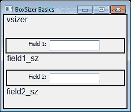
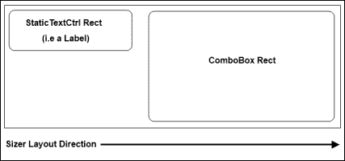
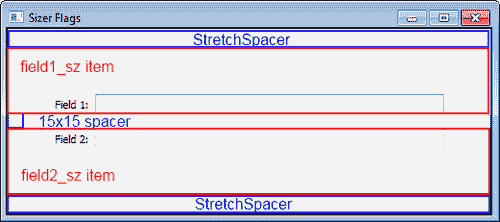
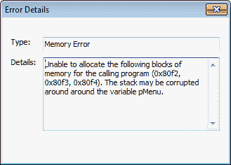
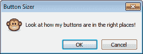
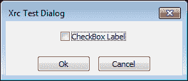

# 第七章：窗口布局与设计

在本章中，我们将涵盖：

+   使用 `BoxSizer`

+   理解比例、旗帜和边框

+   使用 `GridBagSizer` 布置控件

+   标准对话框按钮布局

+   使用 XML 资源

+   创建自定义资源处理器

+   使用 `AuiFrameManager`

# 简介

一旦你对应用程序界面的外观有了想法，就是时候将所有元素整合在一起了。能够将你的愿景转化为代码可能是一项棘手且常常繁琐的任务。窗口布局是在一个二维平面上定义的，其原点位于窗口的左上角。任何小部件的位置和尺寸，无论其在屏幕上的外观如何，都是基于矩形的。清楚地理解这两个基本概念对于理解和高效地使用工具包大有裨益。

在传统的旧应用中，窗口布局通常是通过为窗口内包含的所有控件设置显式的静态大小和位置来完成的。然而，这种方法可能相当受限，因为窗口将无法调整大小，它们可能在不同分辨率下无法适应屏幕，尝试支持本地化变得更加困难，因为标签和其他文本在不同语言中的长度会有所不同，原生控件在不同平台上通常会有不同的大小，这使得编写平台无关的代码变得困难，问题还有很多。

因此，你可能想知道这个问题的解决方案是什么。在 wxPython 中，首选的方法是使用`Sizer`类来定义和管理控件布局。`Sizer`类通过查询已添加到`Sizer`中的所有控件的建议最佳最小尺寸以及它们在可用空间增加时是否能够拉伸或不能拉伸的能力，来管理控件的大小和位置。例如，如果用户将对话框放大，Sizer 也会处理这种情况。Sizer 还处理跨平台小部件的差异，例如，GTK 上的按钮通常带有图标，并且通常比 Windows 或 OS X 上的按钮要大。使用`Sizer`来管理按钮布局将允许对话框的其余部分按比例正确地调整大小，以处理这种情况，而无需任何特定于平台的代码。

因此，让我们通过查看 wxPython 提供的用于简化此任务的众多工具，开始我们的窗口布局与设计之旅。

# 使用 BoxSizer

`BoxSizer` 是 `Sizer` 类中最基本的类。它支持单方向的布局——要么是垂直的列，要么是水平的行。尽管它是使用起来最基础的，但 `BoxSizer` 是最有用的 `Sizer` 类之一，并且与其他一些 `Sizer` 类型相比，它往往能产生更一致的跨平台行为。这个示例创建了一个简单的窗口，我们希望在窗口中堆叠两个文本控件，每个控件旁边都有一个标签。这将用来展示如何最简单地使用 `BoxSizer` 来管理窗口控件布局。

## 如何做到这一点...

在这里，我们定义我们的顶级框架，它将使用 BoxSizer 来管理其面板的大小：

```py
class BoxSizerFrame(wx.Frame):
    def __init__(self, parent, *args, **kwargs):
        super(BoxSizerFrame, self).__init__(*args, **kwargs)

        # Attributes
        self.panel = BoxSizerPanel(self)

        # Layout
        sizer = wx.BoxSizer(wx.VERTICAL)
        sizer.Add(self.panel, 1, wx.EXPAND)
        self.SetSizer(sizer)
        self.SetInitialSize()

```

`BoxSizerPanel` 类是窗口层次结构的下一层，也是我们将执行控件主要布局的地方：

```py
class BoxSizerPanel(wx.Panel):
    def __init__(self, parent, *args, **kwargs):
        super(BoxSizerPanel, self).__init__(*args, **kwargs)

        # Attributes
        self._field1 = wx.TextCtrl(self)
        self._field2 = wx.TextCtrl(self)

        # Layout
        self._DoLayout()

```

仅仅为了帮助减少`__init__`方法中的杂乱，我们将所有布局操作放在一个单独的`_DoLayout`方法中：

```py
    def _DoLayout(self):
        """Layout the controls"""
        vsizer = wx.BoxSizer(wx.VERTICAL)
        field1_sz = wx.BoxSizer(wx.HORIZONTAL)
        field2_sz = wx.BoxSizer(wx.HORIZONTAL)

        # Make the labels
        field1_lbl = wx.StaticText(self, label="Field 1:")
        field2_lbl = wx.StaticText(self, label="Field 2:")

        # Make the first row by adding the label and field
        # to the first horizontal sizer
        field1_sz.AddSpacer(50)
        field1_sz.Add(field1_lbl)
        field1_sz.AddSpacer(5) # put 5px of space between
        field1_sz.Add(self._field1)
        field1_sz.AddSpacer(50)

        # Do the same for the second row
        field2_sz.AddSpacer(50)
        field2_sz.Add(field2_lbl)
        field2_sz.AddSpacer(5)
        field2_sz.Add(self._field2)
        field2_sz.AddSpacer(50)

        # Now finish the layout by adding the two sizers
        # to the main vertical sizer.
        vsizer.AddSpacer(50)
        vsizer.Add(field1_sz)
        vsizer.AddSpacer(15)
        vsizer.Add(field2_sz)
        vsizer.AddSpacer(50)

        # Finally assign the main outer sizer to the panel
        self.SetSizer(vsizer)

```

## 它是如何工作的...

之前的代码展示了如何通过程序创建一个简单的窗口布局的基本模式，使用 sizers 来管理控件。首先，让我们先看看`BoxSizerPanel`类的`_DoLayout`方法，因为在这个示例中，大部分的布局都发生在这里。

首先，我们创建了三个`BoxSizer`类：一个具有垂直方向，另外两个具有水平方向。我们希望这个窗口的布局需要我们使用三个`BoxSizer`类，原因如下。如果你将我们想要做的事情分解成简单的矩形，你会看到：

1.  我们想要两个`TextCtrl`对象，每个对象旁边都有一个标签，这可以简单地理解为两个水平的矩形。

1.  我们希望`TextCtrl`对象在窗口中垂直堆叠，这个窗口仅仅是一个包含其他两个矩形的垂直矩形。

这可以通过以下截图来说明（图中已绘制边界并添加标签以显示每个`Panel`的三个`BoxSizers`管理的区域）：



在填充第一个水平布局器（`field1_sz`）的部分，我们使用了两个`BoxSizer`方法来添加项目到布局中。第一个是`AddSpacer`，正如其名，它简单地添加一定量的空空间到布局器的左侧。然后我们使用`Add`方法将我们的`StaticText`控件添加到空格器的右侧，并从这里继续添加其他项目以完成这一行。正如你所见，这些方法在布局器中从左到右添加项目。之后，我们再次在第二个水平布局器中对其他标签和`TextCtrl`执行同样的操作。

面板布局的最后部分是通过向垂直尺寸器添加两个水平尺寸器来完成的。这次，由于尺寸器是以`VERTICAL`方向创建的，因此项目是从上到下添加的。最后，我们使用`Panel`的`SetSizer`方法将主外部的`BoxSizer`分配为`Panel`的尺寸器。

`BoxSizerFrame` 也使用 `BoxSizer` 来管理其 `Panel` 的布局。这里唯一的区别在于，我们使用了 `Add` 方法的 `proportion` 和 `flags` 参数来告诉它让 Panel 扩展以使用整个可用空间。在设置 Frame 的布局管理器后，我们使用了它的 `SetInitialSize` 方法，该方法查询窗口的布局管理器及其子代，以获取和设置最佳最小尺寸来设置窗口。我们将在下一个菜谱中详细介绍这些其他参数及其影响。

## 还有更多...

以下包含关于向 sizer 布局中添加间隔和项目的一些额外信息。

### 间隔件

`AddSpacer` 方法将添加一个正方形形状的间隔，其宽度和高度均为 X 像素，并将其添加到 `BoxSizer` 中，其中 X 是传递给 `AddSpacer` 方法的值。通过将一个 `tuple` 作为 `BoxSizer` 的 `Add` 方法的第一个参数传递，可以添加其他尺寸的间隔。

```py
someBoxSizer.Add((20,5))

```

这将为 sizer 添加一个 20x5 像素的间隔。这在您不想垂直空间增加得像水平空间那么多，或者相反的情况下很有用。

### AddMany

`AddMany` 方法可以在一次调用中向 sizer 添加任意数量的项目。`AddMany` 接收一个包含值的 `tuple` 列表，这些值与 `Add` 方法期望的顺序相同。

```py
someBoxSizer.AddMany([(staticText,),
                      ((10, 10),),
                      (txtCtrl, 0, wx.EXPAND)]))

```

这将在 sizer 中添加三个项目：前两个项目仅指定一个必需的参数，第三个项目指定了`比例`和`标志`参数。

## 参见

+   本章中关于*理解比例、旗帜和边框*的配方进一步详细介绍了`SizerItems`的行为属性。

# 理解比例、旗帜和边框

通过使用 sizer 的各种`Add`方法中的可选参数，可以控制由 sizer 管理的每个项目的相对比例、对齐方式和周围填充。如果不使用这些额外设置，sizer 中的所有项目将仅使用它们的“最佳”最小尺寸，并将对齐到 sizer 提供的矩形空间顶部左侧。这意味着当窗口大小调整时，控件不会拉伸或收缩。例如，在一个`BoxSizer`的水平行项目列表中，如果其中某个项目的宽度大于同一行中的其他项目，它们可能不会按照期望对齐（参见以下图表）。



此图展示了当某些控件与相邻的矩形大小不同时可能出现的对齐问题。这是 GTK（Linux）上可能发生的一个实际问题的例子，因为其`ComboBoxes`通常比`StaticTextCtrl`高得多。所以，在其他平台上这两个控件可能看起来是正确居中对齐的，但在 Linux 上它们会看起来像这样。

本食谱将重新实现之前的食谱中的`BoxSizerPanel`，使用这些额外的`Add`参数来改进其布局，以便展示这些参数如何被用来影响调整器如何管理添加到其中的每个控件。

## 入门指南

在开始这个菜谱之前，请确保你已经复习了之前的菜谱，*使用 BoxSizer*，因为在这个菜谱中，我们将修改其`_DoLayout`方法以定义一些 sizers 应该应用到其布局中的额外行为。

## 如何做到这一点...

在这里，我们将对`SizerItems`的比例、标志和边框进行一些修改，以改变布局的行为：

```py
    def _DoLayout(self):
        """Layout the controls"""
        vsizer = wx.BoxSizer(wx.VERTICAL)
        field1_sz = wx.BoxSizer(wx.HORIZONTAL)
        field2_sz = wx.BoxSizer(wx.HORIZONTAL)

        # Make the labels
        field1_lbl = wx.StaticText(self, label="Field 1:")
        field2_lbl = wx.StaticText(self, label="Field 2:")

        # 1) HORIZONTAL BOXSIZERS
        field1_sz.Add(field1_lbl, 0,
                      wx.ALIGN_CENTER_VERTICAL|wx.RIGHT, 5)
        field1_sz.Add(self._field1, 1, wx.EXPAND)

        field2_sz.Add(field2_lbl, 0,
                      wx.ALIGN_CENTER_VERTICAL|wx.RIGHT, 5)
        field2_sz.Add(self._field2, 1, wx.EXPAND)

        # 2) VERTICAL BOXSIZER
        vsizer.AddStretchSpacer()
        BOTH_SIDES = wx.EXPAND|wx.LEFT|wx.RIGHT
        vsizer.Add(field1_sz, 0, BOTH_SIDES|wx.TOP, 50)
        vsizer.AddSpacer(15)
        vsizer.Add(field2_sz, 0, BOTH_SIDES|wx.BOTTOM, 50)
        vsizer.AddStretchSpacer()

        # Finally assign the main outer sizer to the panel
        self.SetSizer(vsizer)

```

## 它是如何工作的...

这个菜谱仅展示了我们在上一个菜谱的 `__DoLayout` 方法中做了哪些改动以利用这些额外的选项。在添加控件到水平尺寸器的部分，首先要注意的是我们不再有 `AddSpacer` 调用。这些调用已经被在 `Add` 调用中指定边框所取代。当我们添加每个标签时，我们添加了两个尺寸器标志，`ALIGN_CENTER_VERTICAL` 和 `RIGHT`。第一个标志是一个对齐标志，它指定了对齐的期望行为，第二个是一个边框标志，它指定了我们要将边框参数应用到哪个位置。在这种情况下，尺寸器将把 `StaticText` 对象对齐到垂直空间中央，并在其右侧添加 5px 的内边距。

接下来，在我们将 `TextCtrl` 对象添加到布局管理器时，我们指定了 `1` 作为比例值，并将布局管理器的标志设置为 `EXPAND`。将比例值设置为大于默认的 `0`，将告诉布局管理器为该控件在布局管理器管理区域中分配更多空间。当比例值大于 `0` 并与 `EXPAND` 标志结合时，该标志指示控件在空间可用时增大，这将允许控件在对话框大小调整到更大时进行拉伸。通常，您只需要为比例参数指定 `0` 或 `1`，但在某些复杂的布局中，可能需要为不同的控件分配相对不同数量的总可用空间。例如，在一个有两个控件的布局中，如果两个控件都被分配了比例值 `1`，那么它们各自将获得 50% 的空间。将其中一个控件的比例值更改为 `2` 将改变空间分配为 66/33 的比例平衡。

我们还使用垂直尺寸调整器对最终布局做了一些修改。首先，我们不再使用常规的`AddSpacer`函数来向布局中添加一些静态间隔，而是改为使用`AddStretchSpacer`。`AddStretchSpacer`基本上等同于执行`Add((-1,-1), 1, wx.EXPAND)`，这仅仅添加了一个不确定大小的间隔，当窗口大小改变时它会进行拉伸。这使得我们能够在对话框的垂直尺寸变化时保持控件位于中心。

最后，当将两个水平尺寸调整器添加到垂直尺寸调整器时，我们使用了一些标志来在尺寸调整器的`LEFT, RIGHT`和`TOP`或`BOTTOM`周围应用静态的 50px 间距。同样重要的是要注意，我们再次传递了`EXPAND`标志。如果我们没有这样做，垂直尺寸调整器将不允许这两个项目扩展，这反过来又会导致我们为`TextCtrl`对象添加的`EXPAND`标志失效。尝试将这个示例和上一个示例并排运行，并调整每个窗口的大小以查看行为差异。



之前的截图上已经画了一些线条来展示由主顶级 `VERTICAL` 大小调整器 `vsizer` 管理的五个项目。

## 还有更多...

有许多标志可以用来以各种方式影响布局。以下三个表格列出了这些标志的不同类别，这些类别可以在标志的位掩码中组合：

### 对齐标志

此表显示了所有对齐标志的列表以及每个标志的作用描述：

| 对齐标志 | 描述 |
| --- | --- |
| `wx.ALIGN_TOP` | 将项目对齐到可用空间顶部 |
| `wx.ALIGN_BOTTOM` | 将项目对齐到可用空间的底部 |
| `wx.ALIGN_LEFT` | 将项目对齐到可用空间的左侧 |
| `wx.ALIGN_RIGHT` | 将项目对齐到可用空间的右侧 |
| `wx.ALIGN_CENTER_VERTICAL` | `wx.ALIGN_CENTRE_VERTICAL` | 将项目在垂直空间中居中对齐 |
| `wx.ALIGN_CENTER_HORIZONTAL` | `wx.ALIGN_CENTRE_HORIZONTAL` | 在水平空间中居中对齐项目 |

### 边界旗帜

以下标志可用于控制 Sizer 的 `Add` 方法的 `border` 参数应用于哪个（些）控制边：

| 边界旗帜 | 描述 |
| --- | --- |
| `wx.TOP` | 将边框应用于项目的顶部 |
| `wx.BOTTOM` | 将边框应用于项目底部 |
| `wx.LEFT` | 应用到项目左侧的边框 |
| `wx.RIGHT` | 将边框应用于项目的右侧 |
| `wx.ALL` | 将边框应用于项目的所有边 |

### 行为标志

此表中的尺寸标志可用于控制控件在尺寸调整器内的缩放方式：

| 行为标志 | 描述 |
| --- | --- |
| `wx.EXPAND` | 项目将扩展以填充分配给它的空间 (`wx.GROW` 与之相同) |
| `wx.SHAPED` | 与 `EXPAND` 类似，但保持项目的宽高比 |
| `wx.FIXED_MINSIZE` | 不要让项目的大小小于其初始最小尺寸 |
| `wx.RESERVE_SPACE_EVEN_IF_HIDDEN` | 不允许调整器在项目隐藏时回收项目空间 |

## 参见

+   请参阅本章中的*使用 BoxSizer*配方，了解如何使用`BoxSizer`的基本方法。

+   本章中关于“使用 GridBagSizer 布局控件”的配方展示了如何使用较为复杂的布局类之一。

# 使用 GridBagSizer 布局控件

在 wxPython 中，除了`BoxSizer`之外，还有许多其他类型的`sizers`，它们被设计用来简化不同类型的布局。`GridSizer`、`FlexGridSizer`和`GridBagSizer`可以用来以网格状方式排列项目。`GridSizer`提供了一种固定网格布局，其中项目被添加到网格中的不同“单元格”中。`FlexGridSizer`与`GridSizer`类似，但网格中的列可以有不同宽度。最后，`GridBagSizer`与`FlexGridSizer`类似，但还允许项目跨越网格中的多个“单元格”，这使得实现通常只能通过嵌套多个`BoxSizers`才能实现的布局成为可能。本食谱将讨论`GridBagSizer`的使用，并使用它来创建一个对话框，该对话框可以用来查看日志事件的详细信息。

## 如何做到这一点...

在这里，我们将创建一个自定义的 `DetailsDialog`，它可以用于查看日志消息或系统事件。它包含两个字段，用于显示消息类型和详细的文本信息：

```py
class DetailsDialog(wx.Dialog):
    def __init__(self, parent, type, details, title=""):
        """Create the dialog
        @param type: event type string
        @param details: long details string
        """
        super(DetailsDialog, self).__init__(parent, title=title)

        # Attributes
        self.type = wx.TextCtrl(self, value=type,
                                style=wx.TE_READONLY)
        self.details = wx.TextCtrl(self, value=details,
                                   style=wx.TE_READONLY|
                                         wx.TE_MULTILINE)

        # Layout
        self.__DoLayout()
        self.SetInitialSize()

    def __DoLayout(self):
        sizer = wx.GridBagSizer(vgap=8, hgap=8)

        type_lbl = wx.StaticText(self, label="Type:")
        detail_lbl = wx.StaticText(self, label="Details:")

        # Add the event type fields
        sizer.Add(type_lbl, (1, 1))
        sizer.Add(self.type, (1, 2), (1, 15), wx.EXPAND)

        # Add the details field
        sizer.Add(detail_lbl, (2, 1))
        sizer.Add(self.details, (2, 2), (5, 15), wx.EXPAND)

        # Add a spacer to pad out the right side
        sizer.Add((5, 5), (2, 17))
        # And another to the pad out the bottom
        sizer.Add((5, 5), (7, 0))

        self.SetSizer(sizer)

```

## 它是如何工作的...

`GridBagSizer` 的 `Add` 方法与其他类型的 `sizer` 相比，需要一些额外的参数。必须指定网格位置，并且可选地指定跨越的列数和行数。我们在详情对话框中使用了这个方法，以便在详情字段的情况下允许 `TextCtrl` 字段跨越多列和多行。这种布局的工作方式可能会有些复杂，所以让我们逐行查看我们的 `__DoLayout` 方法，看看它们是如何影响对话框布局的。

首先，我们创建了一个 `GridBagSizer`，并在其构造函数中指定了行与列之间想要的多余空间。接下来，我们开始向这个布局管理器中添加项目。我们添加的第一个项目是一个类型为 `StaticText` 的标签，它位于第 1 行第 1 列。这样做是为了在边缘周围留出一些空间。然后，我们在第 1 行第 2 列的标签右侧添加了一个 `TextCtrl`。对于这个项目，我们还指定了跨度参数，告诉项目跨越 1 行和 15 列。列宽是按网格中第一列的大小成比例的。

接下来我们添加详细字段，从详细标签开始，该标签添加在第 2 行第 1 列，以便与类型`StaticText`标签对齐。由于详细文本可能很长，我们希望它跨越多行。因此，对于其跨度参数，我们指定它跨越 5 行和 15 列。

最后，为了使底部和右侧的控制周围的填充与顶部和左侧相匹配，我们需要在右侧和底部添加一个填充空间来创建额外的列和行。请注意，对于这一步，我们需要考虑之前添加的项目所占用的跨度参数，以确保我们的项目不会重叠。项目不能占用与 sizer 中任何其他项目相同的列或行。因此，我们首先在行 2、列 17 处添加一个填充空间，以在`TextCtrl`对象的右侧创建一个新的列。我们指定列 17 是因为`TextCtrl`对象从列 2 开始，跨越 15 列。同样，我们在底部添加一个时也做了同样的事情，以考虑详细文本字段的范围。请注意，与先偏移网格中的第一个项目然后添加填充空间相比，将`GridBagSizer`嵌套在`BoxSizer`内部并指定边框会更简单。这个食谱中的方法只是为了说明在向网格添加额外项目时需要考虑项目跨度：



请参阅本章附带示例代码，了解使用此对话框的小型应用程序。

## 参见

+   本章中关于*理解比例、旗帜和边框*的配方详细描述了使用尺寸标志的方法。

# 标准对话框按钮布局

每个平台对于如何在对话框中放置不同的对话框按钮都有自己的标准。这就是`StdDialogButtonSizer`发挥作用的地方。它可以用来向对话框添加标准按钮，并自动处理按钮具体位置的平台标准。本食谱展示了如何使用`StdDialogButtonSizer`快速轻松地向`Dialog`添加标准按钮。

## 如何做到这一点...

这里是我们自定义消息框类的代码，该类可以用作标准`MessageBox`的替代品，在应用程序需要在其弹出对话框中显示自定义图标的情况下使用：

```py
class CustomMessageBox(wx.Dialog):
    def __init__(self, parent, message, title="",
                 bmp=wx.NullBitmap, style=wx.OK):
        super(CustomMessageBox, self).__init__(parent, title=title)

        # Attributes
        self._flags = style
        self._bitmap = wx.StaticBitmap(self, bitmap=bmp)
        self._msg = wx.StaticText(self, label=message)

        # Layout
        self.__DoLayout()
        self.SetInitialSize()
        self.CenterOnParent()

    def __DoLayout(self):
        vsizer = wx.BoxSizer(wx.VERTICAL)
        hsizer = wx.BoxSizer(wx.HORIZONTAL)

        # Layout the bitmap and caption
        hsizer.AddSpacer(10)
        hsizer.Add(self._bitmap, 0, wx.ALIGN_CENTER_VERTICAL)
        hsizer.AddSpacer(8)
        hsizer.Add(self._msg, 0, wx.ALIGN_CENTER_VERTICAL)
        hsizer.AddSpacer(10)

        # Create the buttons specified by the style flags
        # and the StdDialogButtonSizer to manage them
        btnsizer = self.CreateButtonSizer(self._flags)

        # Finish the layout
        vsizer.AddSpacer(10)
        vsizer.Add(hsizer, 0, wx.ALIGN_CENTER_HORIZONTAL)
        vsizer.AddSpacer(8)
        vsizer.Add(btnsizer, 0, wx.EXPAND|wx.ALL, 5)

        self.SetSizer(vsizer)

```

## 它是如何工作的...

在这里，我们创建了一个自定义的 `MessageBox` 克隆，它可以接受一个自定义的 `Bitmap` 来显示，而不是仅仅使用常规 `MessageBox` 实现中可用的标准图标。这个类相当简单，所以让我们跳转到 `__DoLayout` 方法，看看我们是如何利用 `StdDialogButtonSizer` 的。

在 `__DoLayout` 函数中，我们首先创建了一些常规的 `BoxSizers` 来完成布局的主要部分，然后在一行代码中就创建了所有按钮的整个布局。为了实现这一点，我们使用了基类 `wx.Dialog` 的 `CreateButtonSizer` 方法。此方法接受一个标志掩码，用于指定要创建的按钮，然后创建它们，并将它们添加到它返回的 `StdDialogButtonSizer` 中。完成这些操作后，我们只需将该布局器添加到对话框的主布局器中，任务就完成了！

以下截图展示了`StdDialogButtonSizer`如何处理平台标准之间的差异。

例如，对话框中的**确定**和**取消**按钮在 Windows 上的顺序是**确定/取消**：



在 Macintosh OS X 上，按钮的标准布局是**取消/确定**：


## 还有更多...

这里是一个快速参考，列出了可以作为掩码传递给`CreateButtonSizer`方法的标志，以便创建按钮管理器将管理的按钮：

| 标志 | 描述 |
| --- | --- |
| `wx.OK` | 创建一个确定按钮 |
| `wx.CANCEL` | 创建一个取消按钮 |
| `wx.YES` | 创建一个“是”按钮 |
| `wx.NO` | 创建一个“否”按钮 |
| `wx.HELP` | 创建一个帮助按钮 |
| `wx.NO_DEFAULT` | 设置“否”按钮为默认选项 |

## 参见

+   第三章中的 *创建股票按钮* 菜单，*用户界面基本构建块* 讨论了如何从内置 ID 创建常用按钮。

+   本章中关于*使用 BoxSizer*的配方讨论了使用`BoxSizers`进行窗口布局的基础知识。

# 使用 XML 资源

XRC 是一种使用 XML 资源文件创建和设计窗口布局的方法。XML 的层次结构性质与应用程序窗口层次结构相平行，这使得它成为序列化窗口布局的非常合理的数据格式。本食谱展示了如何从一个 XML 资源文件中创建和加载一个简单的对话框，该对话框上有两个 `CheckBoxe` 对象和两个 `Button` 对象。

## 如何做到这一点...

这里是我们存储在名为 `xrcdlg.xrc:` 的文件中的对话框的 XML 代码：

```py
<?xml version="1.0" ?>
<resource>
  <object class="wxDialog" name="xrctestdlg">
    <object class="wxBoxSizer">
      <orient>wxVERTICAL</orient>
      <object class="spacer">
        <option>1</option>
        <flag>wxEXPAND</flag>
      </object>
      <object class="sizeritem">
        <object class="wxCheckBox">
          <label>CheckBox Label</label>
        </object>
        <flag>wxALL|wxALIGN_CENTRE_HORIZONTAL</flag>
        <border>5</border>
      </object>
      <object class="spacer">
        <option>1</option>
        <flag>wxEXPAND</flag>
      </object>
      <object class="sizeritem">
        <object class="wxBoxSizer">
          <object class="sizeritem">
            <object class="wxButton" name="wxID_OK">
              <label>Ok</label>
            </object>
            <flag>wxALL</flag>
            <border>5</border>
          </object>
          <object class="sizeritem">
            <object class="wxButton" name="wxID_CANCEL">
              <label>Cancel</label>
            </object>
            <flag>wxALL</flag>
            <border>5</border>
          </object>
          <orient>wxHORIZONTAL</orient>
        </object>
        <flag>wxALIGN_BOTTOM|wxALIGN_CENTRE_HORIZONTAL</flag>
        <border>5</border>
      </object>
    </object>
    <title>Xrc Test Dialog</title>
    <style>wxDEFAULT_DIALOG_STYLE|wxRESIZE_BORDER</style>
  </object>
</resource>

```

当加载上述 XML 时，将生成以下对话框：



这是一个最小的程序，用于加载此 XML 资源以创建并显示它所代表的对话框：

```py
import wx
import wx.xrc as xrc
app = wx.App()
frame = wx.Frame(None)
resource = xrc.XmlResource("xrcdlg.xrc")
dlg = resource.LoadDialog(frame, "xrctestdlg")
dlg.ShowModal()
app.MainLoop()

```

## 它是如何工作的...

本食谱中的 XML 是在`xrced`的帮助下创建的，`xrced`是一个 XML 资源编辑工具，它是 wxPython 工具包的一部分。`object`标签用于表示类对象。通过在内部嵌套其他对象来表示 XML 中的父子关系。`object`标签的`class`属性用于指定要创建的类的类型。值应该是类名，在 wxPython 提供的类的情况下，它们使用`wxWidgets`的名称，这些名称以“wx”为前缀。为了与`XmlResource`类一起工作，强烈建议使用像`xrced`这样的工具来生成 XML。

为了将 XML 加载以创建用于表示的对象，您需要导入 `wx.xrc` 包，它提供了 `XmlResource` 类。有几种方法可以使用 `XmlResource` 对 XML 进行转换。在这个例子中，我们通过将 `xrc` 文件的路径传递给其构造函数来创建我们的 `XmlResource` 对象。此对象具有多种加载方法，用于实例化不同类型的对象。我们想要加载一个对话框，因此我们调用了它的 `LoadDialog` 方法，将父窗口作为第一个参数传递，然后是我们要从 XML 中加载的对话框的名称。然后它将实例化该对话框的一个实例并返回，这样我们就可以显示它了。

## 还有更多...

以下包含了一些在使用 XRC 库时可用功能的附加参考。

### 加载其他类型的资源

`XmlResource` 对象提供了从 XML 加载多种不同类型资源的方法。以下是其中一些附加方法的快速参考：

| 方法 | 描述 |
| --- | --- |
| `LoadBitmap(name)` | 加载并返回由名称标识的位图 |
| `LoadDialog(parent, name)` | 加载并返回名为 name 的对话框 |
| `LoadFrame(parent, name)` | 加载并返回由名称标识的 Frame |
| `LoadIcon(name)` | 加载并返回由名称标识的图标 |
| `LoadMenu(name)` | 加载并返回由名称标识的菜单 |
| `LoadMenuBar(parent, name)` | 加载并返回由名称标识的菜单栏 |
| `LoadPanel(parent, name)` | 加载并返回由名称标识的 Panel |
| `LoadToolBar(parent, name)` | 加载并返回由名称标识的工具栏 |

### 指定标准 ID

为了在 XRC 中给一个对象赋予一个标准的 ID，应在`object`标签的`name`属性中指定，使用`wxWidgets`的命名方式为 ID（即，`wxID_OK`，不带`.`）。

## 参见

+   本章中的 *制作自定义资源处理器* 菜谱包含了一些关于使用 XRC 的额外信息。

# 创建自定义资源处理器

尽管 XRC 内置了对大量标准控件的支持，但任何非平凡的应用程序都将使用自己的子类和/或自定义小部件。创建一个自定义的`XmlResource`类将允许这些自定义类从 XML 资源文件中加载。本菜谱展示了如何创建一个用于自定义`Panel`类的 XML 资源处理器，然后使用该处理器来加载资源。

## 入门指南

本食谱讨论了如何自定义和扩展对 XML 资源的处理。请查阅本章中的*使用 XML 资源*食谱，以了解 XRC 工作的基础知识。

## 如何做到这一点...

在以下代码中，我们将展示如何为 Panel 创建一个自定义的 XML 资源处理器，然后如何使用 XRC 将该资源加载到 Frame 中：

```py
import wx
import wx.xrc as xrc

# Xml to load our object
RESOURCE = r"""<?xml version="1.0"?>
<resource>
<object class="TextEditPanel" name="TextEdit">
</object>
</resource>
"""

```

在这里，在我们的 Frame 子类中，我们简单地创建了一个自定义资源处理器的实例，并使用它来加载我们的自定义 Panel：

```py
class XrcTestFrame(wx.Frame):
    def __init__(self, parent, *args, **kwargs):
        super(XrcTestFrame, self).__init__(*args, **kwargs)

        # Attributes
        resource = xrc.EmptyXmlResource()
        handler = TextEditPanelXmlHandler()
        resource.InsertHandler(handler)
        resource.LoadFromString(RESOURCE)
        self.panel = resource.LoadObject(self,
                                         "TextEdit",
                                         "TextEditPanel")

        # Layout
        sizer = wx.BoxSizer(wx.VERTICAL)
        sizer.Add(self.panel, 1, wx.EXPAND)
        self.SetSizer(sizer)

```

这里是我们自定义资源处理器将要使用的 Panel 类。它只是一个简单的 Panel，上面有一个`TextCtrl`和两个`Buttons`：

```py
class TextEditPanel(wx.Panel):
    """Custom Panel containing a TextCtrl and Buttons
    for Copy and Paste actions.
    """
    def __init__(self, parent, *args, **kwargs):
        super(TextEditPanel, self).__init__(*args, **kwargs)

        # Attributes
        self.txt = wx.TextCtrl(self, style=wx.TE_MULTILINE)
        self.copy = wx.Button(self, wx.ID_COPY)
        self.paste = wx.Button(self, wx.ID_PASTE)

        # Layout
        self._DoLayout()

        # Event Handlers
        self.Bind(wx.EVT_BUTTON, self.OnCopy, self.copy)
        self.Bind(wx.EVT_BUTTON, self.OnPaste, self.paste)

    def _DoLayout(self):
        """Layout the controls"""
        vsizer = wx.BoxSizer(wx.VERTICAL)
        hsizer = wx.BoxSizer(wx.HORIZONTAL)

        vsizer.Add(self.txt, 1, wx.EXPAND)
        hsizer.AddStretchSpacer()
        hsizer.Add(self.copy, 0, wx.RIGHT, 5)
        hsizer.Add(self.paste)
        hsizer.AddStretchSpacer()
        vsizer.Add(hsizer, 0, wx.EXPAND|wx.ALL, 10)

        # Finally assign the main outer sizer to the panel
        self.SetSizer(vsizer)

    def OnCopy(self, event):
        self.txt.Copy()

    def OnPaste(self, event):
        self.txt.Paste()

```

最后，这是我们的自定义 XML 资源处理类，我们只需重写两个方法来实现对 `TextEditPanel` 类的处理：

```py
class TextEditPanelXmlHandler(xrc.XmlResourceHandler):
    """Resource handler for our TextEditPanel"""
    def CanHandle(self, node):
        """Required override. Returns a bool to say
        whether or not this handler can handle the given class
        """
        return self.IsOfClass(node, "TextEditPanel")

    def DoCreateResource(self):
        """Required override to create the object"""
        panel = TextEditPanel(self.GetParentAsWindow(),
                              self.GetID(),
                              self.GetPosition(),
                              self.GetSize(),
                              self.GetStyle("style",
                                            wx.TAB_TRAVERSAL),
                              self.GetName())
        self.SetupWindow(panel)
        self.CreateChildren(panel)
        return panel

```

## 它是如何工作的...

`TextEditPanel` 是我们想要为其创建自定义资源处理器的自定义类。`TextEditPanelXmlHandler` 类是一个最小化的资源处理器，我们创建它以便能够从 XML 加载我们的类。这个类有两个必须实现的重写方法，以便它能正常工作。第一个是 `CanHandle`，它被框架调用以检查处理器是否可以处理给定的节点类型。我们使用了 `IsOfClass` 方法来检查节点是否与我们的 `TextEditPanel` 类型相同。第二个是 `DoCreateResource`，它是用来创建我们的类的。为了创建这个类，所有它的参数都可以从资源处理器中检索到。

`XrcTestFrame` 类是我们使用自定义资源处理器的位置。首先，我们创建了一个 `EmptyXmlResource` 对象，并使用它的 `InsertHandler` 方法将其自定义处理器添加到其中。然后，我们使用处理器的 `LoadFromString` 方法从我们定义的 `RESOURCE` 字符串中加载 XML。之后，我们只需使用资源的 `LoadObject` 方法加载对象即可，该方法需要三个参数：要加载的对象的 `parent` 窗口、XML 资源中对象的 `name` 以及 `classname`。

## 参见

+   请参阅第一章中的*理解继承限制*配方，在*wxPython 入门*中获取有关 wxPython 类中重写虚拟方法的一些额外信息。

+   请参阅本章中的*使用 XML 资源*配方，以获取更多使用 XML 创建屏幕布局的示例。

# 使用 AuiFrameManager

`AuiFrameManager` 是 wxPython 2.8 版本中添加的先进用户界面（wx.aui）库的一部分。它允许框架拥有一个非常用户可定制的界面。它自动管理可以在窗格中解绑并转换为独立浮动窗口的子窗口。此外，还有一些内置功能，有助于在应用程序运行期间持久化和恢复窗口布局。本菜谱将创建一个具有 AUI 支持的框架基类，并在应用程序下次启动时自动保存其视角并重新加载。

## 如何做到这一点...

以下代码将定义一个基类，该类封装了`AuiManager`的一些用法：

```py
import wx
import wx.aui as aui

class AuiBaseFrame(wx.Frame):
    """Frame base class with builtin AUI support"""
    def __init__(self, parent, *args, **kwargs):
        super(AuiBaseFrame, self).__init__(*args, **kwargs)
wx.Frame.__init__(self, parent, *args, **kwargs)

        # Attributes
        auiFlags = aui.AUI_MGR_DEFAULT
        if wx.Platform == '__WXGTK__' and \
           aui.AUI_MGR_DEFAUL & aui.AUI_MGR_TRANSPARENT_HINT:
            # Use venetian blinds style as transparent can 
            # cause crashes on Linux when desktop compositing
            # is used. (wxAUI bug in 2.8)
            auiFlags -= aui.AUI_MGR_TRANSPARENT_HINT
            auiFlags |= aui.AUI_MGR_VENETIAN_BLINDS_HINT
        self._mgr = aui.AuiManager(self, flags=auiFlags)

        # Event Handlers
        self.Bind(wx.EVT_CLOSE, self.OnAuiBaseClose)

```

当框架关闭时将调用 `OnAuiBaseClose`。我们利用这个点来获取当前窗口布局视角并将其保存，以便下次应用程序启动时使用：

```py
def OnAuiBaseClose(self, event):
        """Save perspective on exit"""
        appName = wx.GetApp().GetAppName()
        assert appName, “No App Name Set!”
        config = wx.Config(appName)
        perspective = self._mgr.SavePerspective()
        config.Write("perspective", perspective)
        event.Skip() # Allow event to propagate

```

`AddPane` 简单地封装了对 Frame 的 `AuiManager` 的访问，并将给定的面板和 `auiInfo` 添加到其中：

```py
    def AddPane(self, pane, auiInfo):
        """Add a panel to be managed by this Frame's
        AUI Manager.
        @param pane: wx.Window instance
        @param auiInfo: AuiInfo Object
        """
        # Delegate to AuiManager
        self._mgr.AddPane(pane, auiInfo)
        self._mgr.Update() # Refresh the layout

```

下一种方法是一个简单的便利方法，用于创建并添加主中心面板到管理窗口：

```py
    def SetCenterPane(self, pane):
        """Set the main center pane of the frame.
        Convenience method for AddPane.
        @param pane: wx.Window instance
        """
        info = aui.AuiPaneInfo()
        info = info.Center().Name("CenterPane")
        info = info.Dockable(False).CaptionVisible(False)
        self._mgr.AddPane(pane, info)

```

这种最终方法用于从上次打开窗口时加载最后保存的窗口布局：

```py
    def LoadDefaultPerspective(self):
        appName = wx.GetApp().GetAppName()
        assert appName, "Must set an AppName!"
        config = wx.Config(appName)
        perspective = config.Read("perspective")
        if perspective:
            self._mgr.LoadPerspective(perspective)

```

## 它是如何工作的...

在这个菜谱中，我们创建了一个类来帮助封装一些`AuiManager`的功能。所以，让我们来看看这个类提供的一些功能以及它是如何工作的。

`__init__` 方法是我们创建将要添加到 Frame 中的 `AuiManager` 对象的地方。`AuiManager` 接受一系列可能的标志来指定其行为。我们针对使用桌面合成的 Linux 平台上的一个错误采用了一个小的解决方案。使用透明停靠提示可能导致在此场景下 AUI 应用程序崩溃，因此我们将其替换为百叶窗样式。

`OnAuiBaseClose` 被用作处理 `Frame` 关闭时的事件处理器。我们使用这个钩子来自动存储 `AuiManager` 的当前布局，这被称为视角，以便于下一次应用程序启动。为了实现这个功能，我们创建了一个要求，即调用 App 对象的 `SetName` 方法来设置应用程序名称，因为我们需要这个来使用 `wx.Config`。`wx.Config` 对象是一个简单的接口，用于访问 Windows 上的注册表或在其他平台上的应用程序配置文件。`SavePerspective` 返回一个字符串，其中包含了 `AuiManager` 需要的所有信息，以便恢复当前窗口布局。然后，应用程序可以在启动时简单地调用我们的 `LoadDefaultPerspective` 方法，以恢复用户的最后窗口布局。

本类中的另外两种方法相当简单，主要是为了方便将任务委托给`Frame`的`AuiManager`。`AuiManager`的`AddPane`方法是用来添加由它管理的面板。`pane`参数需要是一个`Frame`的子窗口对象。在实践中，这通常是一些`Panel`子类的实例。`auiInfo`参数是一个`AuiPaneInfo`对象。这是`AuiManager`用来确定如何管理面板的依据。请参阅随本食谱附带的示例代码，以了解此类在实际中的应用。

## 还有更多...

这里是关于可用于`AuiManager`标志掩码中的标志的快速参考，以便自定义其行为以及某些组件的样式：

| 标志 | 描述 |
| --- | --- |
| `AUI_MGR_DEFAULT` | 等同于 `AUI_MGR_ALLOW_FLOATING&#124; AUI_MGR_TRANSPARENT_HINT&#124; AUI_MGR_HINT_FADE&#124; AUI_MGR_NO_VENETIAN_BLINDS_FADE` |
| `AUI_MGR_ALLOW_FLOATING` | 允许浮动窗格 |
| `AUI_MGR_ALLOW_ACTIVE_PANE` | 高亮显示当前活动窗格的标题栏 |
| `AUI_MGR_HINT_FADE` | 淡出视图中的停靠提示 |
| `AUI_MGR_LIVE_RESIZE` | 在拖动它们之间的分割条时调整窗格大小 |
| `AUI_MGR_NO_VENETIAN_BLINDS_FADE` | 禁用百叶窗淡入/淡出功能 |
| `AUI_MGR_RECTANGLE_HINT` | 显示拖动浮动窗格时的简单矩形停靠提示 |
| `AUI_MGR_TRANSPARENT_DRAG` | 在拖动时使浮动面板部分透明 |
| `AUI_MGR_TRANSPARENT_HINT` | 显示在拖动浮动面板时部分透明的浅蓝色停靠提示 |
| `AUI_MGR_VENETIAN_BLINDS_HINT` | 使用威尼斯百叶风格停靠提示为浮动面板 |
