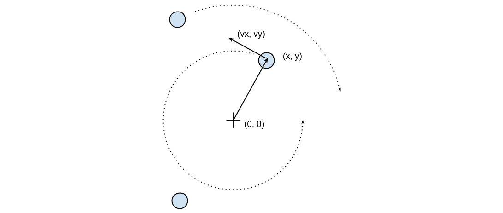
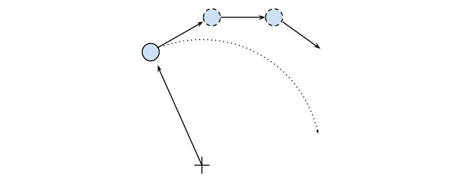
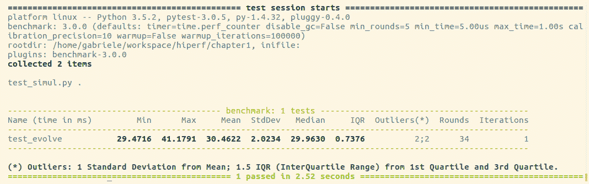
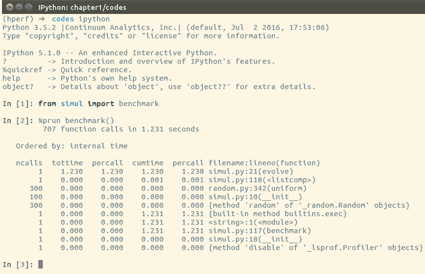
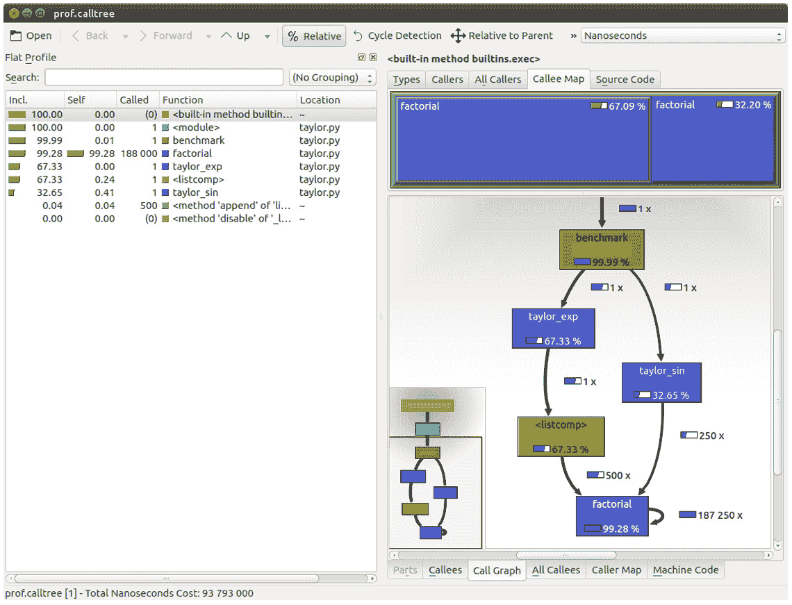
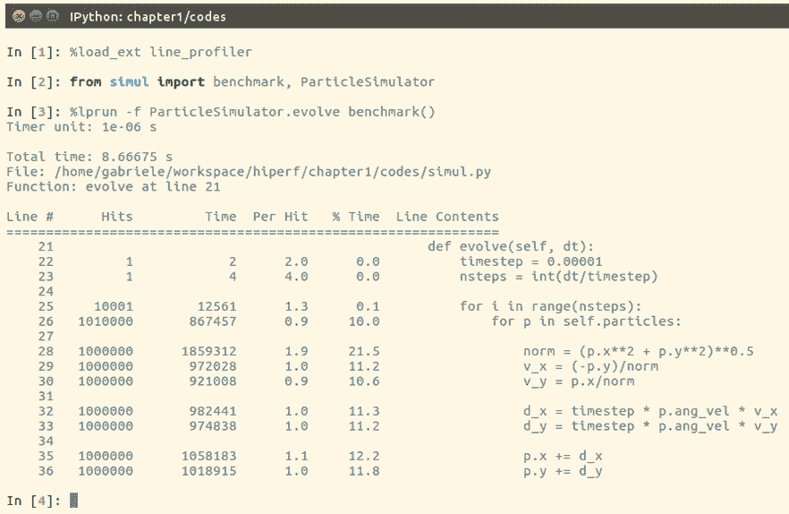
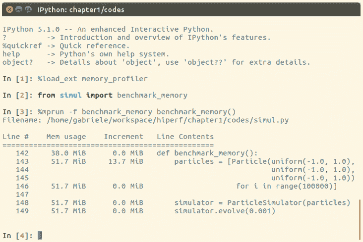

# *第一章*：基准测试和性能分析

当谈到加速代码时，识别程序中的慢速部分是最重要的任务。在大多数情况下，导致应用程序变慢的代码只是程序的一小部分。通过识别这些关键部分，你可以专注于需要最多改进的部分，而无需在微优化上浪费时间。

**性能分析**是一种技术，它允许我们定位应用程序中最资源密集的部分。**分析器**是一个程序，它运行应用程序并监控每个函数的执行时间，从而检测到应用程序花费最多时间的函数。

Python 提供了多个工具来帮助我们找到这些瓶颈并测量重要的性能指标。在本章中，我们将学习如何使用标准的 `cProfile` 模块和 `line_profiler` 第三方包。我们还将学习如何通过 `memory_profiler` 工具来分析应用程序的内存消耗。我们还将介绍另一个有用的工具 **KCachegrind**，它可以用来图形化显示各种分析器产生的数据。

最后，**基准测试**是用于评估应用程序总执行时间的小脚本。我们将学习如何编写基准测试并使用它们来准确计时程序。

本章我们将涉及的主题如下：

+   设计你的应用程序

+   编写测试和基准测试

+   使用 `pytest-benchmark` 编写更好的测试和基准测试

+   使用 `cProfile` 寻找瓶颈

+   优化我们的代码

+   使用 `dis` 模块

+   使用 `memory_profiler` 分析内存使用情况

到本章结束时，你将获得如何优化 Python 程序的坚实基础，并将拥有便于优化过程的实用工具。

# 技术要求

为了跟随本章的内容，你应该对 Python 编程有基本的了解，并熟悉诸如变量、类和函数等核心概念。你应该也熟悉使用命令行来运行 Python 程序。最后，本章的代码可以在以下 GitHub 仓库中找到：[`github.com/PacktPublishing/Advanced-Python-Programming-Second-Edition/tree/main/Chapter01`](https://github.com/PacktPublishing/Advanced-Python-Programming-Second-Edition/tree/main/Chapter01)。

# 设计你的应用程序

在早期开发阶段，程序的设计可能会快速变化，可能需要大量重写和组织代码库。通过在无需优化的负担下测试不同的原型，你可以自由地投入时间和精力来确保程序产生正确的结果，并且设计是灵活的。毕竟，谁需要运行速度快但给出错误答案的应用程序？

在优化代码时应记住的咒语如下：

+   **使其运行**：我们必须使软件处于工作状态，并确保它产生正确的结果。这个探索阶段有助于更好地理解应用程序，并在早期阶段发现主要的设计问题。

+   **使其正确**：我们希望确保程序的设计是稳固的。在进行任何性能优化之前，应该先进行重构。这实际上有助于将应用程序分解成独立且易于维护的单元。

+   **使其快速**：一旦我们的程序运行良好且结构合理，我们就可以专注于性能优化。如果内存使用成为问题，我们可能还想优化内存使用。

在本节中，我们将编写并分析一个 *粒子模拟器* 测试应用程序。**模拟器** 是一个程序，它考虑一些粒子，并根据我们施加的一组定律模拟它们随时间的变化。这些粒子可以是抽象实体，也可以对应于物理对象——例如，在桌面上移动的台球、气体中的分子、在空间中移动的恒星、烟雾粒子、室内的流体等等。

## 构建粒子模拟器

计算机模拟在物理学、化学、天文学以及许多其他学科中非常有用。用于模拟系统的应用程序特别注重性能，科学家和工程师花费大量时间优化他们的代码。为了研究现实系统，通常需要模拟大量的物体，任何小的性能提升都至关重要。

在我们的第一个示例中，我们将模拟一个包含粒子围绕中心点以不同速度不断旋转的系统，就像时钟的指针一样。

运行我们的模拟所需的信息将是粒子的起始位置、速度和旋转方向。从这些元素中，我们必须计算出粒子在下一个时间点的位置。以下图示了一个示例系统。系统的原点是 `(0, 0)` 点，位置由 *x*、*y* 向量表示，速度由 *vx*、*vy* 向量表示：



图 1.1 – 粒子系统的示例

圆周运动的基本特征是粒子始终沿着连接粒子与中心的连线垂直运动。要移动粒子，我们只需通过一系列非常小的步骤（这相当于在运动方向上推进系统一小段时间间隔）来改变其位置，如下面的图所示：


图 1.2 – 粒子的运动

我们将首先通过以下代码片段设计一个 `Particle` 类，该类存储粒子的位置 `x` 和 `y` 以及它们的角速度 `ang_vel`，如下所示：

```py
    class Particle: 
        def __init__(self, x, y, ang_vel): 
            self.x = x 
            self.y = y 
            self.ang_vel = ang_vel
```

注意，我们接受所有参数的正负数（`ang_vel`的符号将简单地确定旋转方向）。

另一个类，称为`ParticleSimulator`，将封装运动定律，并负责随时间改变粒子的位置。`__init__`方法将存储一个`Particle`实例的列表，而`evolve`方法将根据我们的定律改变粒子位置。以下代码片段展示了代码：

```py
class ParticleSimulator:
    def __init__(self, particles):
        self.particles = particles
```

我们希望粒子围绕对应于`x=0`和`y=0`坐标的位置以恒定速度旋转。粒子的方向将始终垂直于从中心的方向（参见图 1.1）。为了找到沿*x*轴和*y*轴的运动方向（对应于 Python 中的`v_x`和`v_y`变量），只需使用以下公式：

```py
    v_x = -y / (x**2 + y**2)**0.5
    v_y = x / (x**2 + y**2)**0.5
```

如果我们让我们的一个粒子移动，经过一定的时间*t*，它将沿着圆形路径到达另一个位置。我们可以通过将时间间隔*t*分成极小的时间步长*dt*来近似圆形轨迹，其中粒子沿圆的切线直线移动。（注意，可以使用更高阶的曲线而不是直线以提高精度，但我们将坚持使用直线作为最简单的近似。）最终结果只是圆形运动的近似。

为了避免如以下图所示的大时间步长引起的强烈发散，有必要采取非常小的时间步长：



图 1.3 – 由于大时间步长导致的粒子运动中的不期望发散

以更简图的方式，我们必须执行以下步骤来计算时间*t*时的粒子位置：

1.  计算运动方向（`v_x`和`v_y`）。

1.  计算位移（`d_x`和`d_y`），它是时间步长、角速度和运动方向的乘积。

1.  重复*步骤 1*和*步骤 2*足够多次，以覆盖总时间*t*。

以下代码片段展示了完整的`ParticleSimulator`实现：

```py
    class ParticleSimulator: 
        def __init__(self, particles): 
            self.particles = particles 
        def evolve(self, dt): 
            timestep = 0.00001 
            nsteps = int(dt/timestep) 

            for i in range(nsteps):
                for p in self.particles:
                    # 1\. calculate the direction 
                    norm = (p.x**2 + p.y**2)**0.5 
                    v_x = -p.y/norm 
                    v_y = p.x/norm 
                    # 2\. calculate the displacement 
                    d_x = timestep * p.ang_vel * v_x 
                    d_y = timestep * p.ang_vel * v_y 
                    p.x += d_x 
                    p.y += d_y 
                    # 3\. repeat for all the time steps
```

有了这些，我们就完成了粒子模拟器的基础构建。接下来，我们将通过可视化模拟的粒子来看到它的实际应用。

## 可视化模拟

我们可以使用`matplotlib`库在这里可视化我们的粒子。这个库不包括在 Python 标准库中，但可以使用`pip install matplotlib`命令轻松安装。

或者，您可以使用 Anaconda Python 发行版([`store.continuum.io/cshop/anaconda/`](https://store.continuum.io/cshop/anaconda/))，它包括`matplotlib`以及本书中使用的其他大多数第三方包。Anaconda 是免费的，并且适用于 Linux、Windows 和 Mac。

为了创建一个交互式可视化，我们将使用`matplotlib.pyplot.plot`函数显示粒子作为点，并使用`matplotlib.animation.FuncAnimation`类来动画化粒子随时间的演化。

`visualize`函数接受一个`ParticleSimulator`粒子实例作为参数，并在动画图中显示轨迹。使用`matplotlib`工具显示粒子轨迹所需的步骤在此概述：

1.  设置坐标轴并使用`plot`函数显示粒子。`plot`函数接受一个包含*x*和*y*坐标的列表。

1.  编写一个初始化函数`init`和一个函数`animate`，使用`line.set_data`方法更新*x*和*y*坐标。注意，由于语法原因，在`init`中我们需要以`line`的形式返回线数据。

1.  通过传递`init`和`animate`函数以及指定更新间隔的`interval`参数，以及`blit`参数来提高图像更新率，创建一个`FuncAnimation`实例。

1.  使用`plt.show()`运行动画，如下面的代码片段所示：

    ```py
        from matplotlib import pyplot as plt 
        from matplotlib import animation 
        def visualize(simulator): 
            X = [p.x for p in simulator.particles] 
            Y = [p.y for p in simulator.particles] 
            fig = plt.figure() 
            ax = plt.subplot(111, aspect='equal') 
            line, = ax.plot(X, Y, 'ro') 

            # Axis limits 
            plt.xlim(-1, 1) 
            plt.ylim(-1, 1) 
            # It will be run when the animation starts 
            def init(): 
                line.set_data([], []) 
                return line, # The comma is important!
            def animate(i): 
                # We let the particle evolve for 0.01 time 
                  units 
                simulator.evolve(0.01) 
                X = [p.x for p in simulator.particles] 
                Y = [p.y for p in simulator.particles] 
                line.set_data(X, Y) 
                return line, 
            # Call the animate function each 10 ms 
            anim = animation.FuncAnimation(fig,
              animate,init_func=init,blit=True,
                interval=10) 
            plt.show()
    ```

为了测试这段代码，我们定义了一个小的函数`test_visualize`，它动画化了一个由三个粒子组成的系统，这些粒子以不同的方向旋转。注意在下面的代码片段中，第三个粒子比其他粒子快三倍完成一圈：

```py
    def test_visualize(): 
        particles = [
                     Particle(0.3, 0.5, 1), 
                     Particle(0.0, -0.5, -1), 
                     Particle(-0.1, -0.4, 3)
        ] 
        simulator = ParticleSimulator(particles) 
        visualize(simulator) 
    if __name__ == '__main__': 
        test_visualize()
```

`test_visualize`函数有助于图形化地理解系统的演化时间。当你想终止程序时，只需简单地关闭动画窗口。有了这个程序，在接下来的部分，我们将编写更多的测试函数，以正确验证程序的正确性和测量性能。

# 编写测试和基准测试

现在我们有一个工作的模拟器，我们可以开始测量我们的性能并调整我们的代码，以便模拟器可以处理尽可能多的粒子。作为第一步，我们将编写一个测试和一个基准测试。

我们需要一个测试来检查模拟产生的结果是否正确。优化程序通常需要采用多种策略；随着我们多次重写代码，错误可能会轻易引入。一个稳固的测试套件确保在每次迭代中实现都是正确的，这样我们就可以自由地尝试不同的事情，并充满信心地认为，如果测试套件通过，代码仍然会按预期工作。更具体地说，我们在这里实现的是单元测试，其目的是验证程序意图的逻辑，而不考虑实现细节，这些细节在优化过程中可能会发生变化。

我们的测试将使用三个粒子，模拟它们`0.1`时间单位，并将结果与参考实现的结果进行比较。组织测试的一个好方法是使用一个单独的函数来处理应用程序的每个不同方面（或单元）。由于我们当前的功能包含在`evolve`方法中，我们的函数将被命名为`test_evolve`。下面的代码片段显示了`test_evolve`的实现。请注意，在这种情况下，我们通过`fequal`函数比较浮点数，直到一定的精度：

```py
    def test_evolve(): 
        particles = [Particle( 0.3,  0.5, +1), 
                     Particle( 0.0, -0.5, -1), 
                     Particle(-0.1, -0.4, +3)
            ] 
        simulator = ParticleSimulator(particles) 
        simulator.evolve(0.1) 
        p0, p1, p2 = particles 
        def fequal(a, b, eps=1e-5): 
            return abs(a - b) < eps 
        assert fequal(p0.x, 0.210269) 
        assert fequal(p0.y, 0.543863) 
        assert fequal(p1.x, -0.099334) 
        assert fequal(p1.y, -0.490034) 
        assert fequal(p2.x,  0.191358) 
        assert fequal(p2.y, -0.365227) 
    if __name__ == '__main__': 
        test_evolve()
```

如果`assert`语句中的条件不满足，将会引发错误。运行`test_evolve`函数后，如果你没有注意到任何错误或输出打印出来，这意味着所有条件都已满足。

测试确保我们的功能正确，但关于其运行时间提供的信息很少。**基准测试**是一个简单且具有代表性的用例，可以运行以评估应用程序的运行时间。基准测试对于跟踪我们实现的新版本中程序的速度非常有用。

我们可以通过实例化带有随机坐标和角速度的千个`Particle`对象，并将它们提供给`ParticleSimulator`类来编写一个代表性的基准测试。然后我们让系统演化`0.1`时间单位。代码在下面的片段中展示：

```py
    from random import uniform 
    def benchmark(): 
        particles = [
          Particle(uniform(-1.0, 1.0), uniform(-1.0, 1.0), 
            uniform(-1.0, 1.0)) 
          for i in range(1000)] 
        simulator = ParticleSimulator(particles) 
        simulator.evolve(0.1) 
    if __name__ == '__main__': 
        benchmark()
```

通过实现基准程序，我们现在需要运行它并跟踪基准完成执行所需的时间，我们将在下一部分看到。请注意，当你在自己的系统上运行这些测试和基准时，你可能会看到文本中列出的不同数字，这是完全正常的，并且取决于你的系统配置和 Python 版本。

## 计时你的基准测试

通过 Unix 的`time`命令来计时基准测试是一种非常简单的方法。使用`time`命令，如下所示，你可以轻松地测量任意过程的执行时间：

```py
    $ time python simul.py
real    0m1.051s
user    0m1.022s
sys     0m0.028s
```

`time`命令在 Windows 上不可用。要在 Windows 上安装如`time`之类的 Unix 工具，你可以使用从官方网站下载的`cygwin` shell（[`www.cygwin.com/`](http://www.cygwin.com/)）。或者，你可以使用类似的 PowerShell 命令，如`Measure-Command`（[`msdn.microsoft.com/en-us/powershell/reference/5.1/microsoft.powershell.utility/measure-command`](https://msdn.microsoft.com/en-us/powershell/reference/5.1/microsoft.powershell.utility/measure-command)），来测量执行时间。

默认情况下，`time`显示三个指标，如下所述：

+   `real`：从开始到结束运行过程的实际时间，就像它被一个使用秒表的人测量一样。

+   `user`：所有**中央处理器**（**CPUs**）在计算过程中花费的累积时间。

+   `sys`：所有 CPUs 在系统相关任务（如内存分配）中花费的累积时间。

    注意

    有时，`user` 和 `sys` 可能大于 `real`，因为多个处理器可能并行工作。

`time` 还提供了更丰富的格式化选项。要了解概述，您可以查看其手册（使用 `man time` 命令）。如果您想查看所有可用的指标摘要，可以使用 `-v` 选项。

Unix 的 `time` 命令是衡量程序性能最简单和最直接的方法之一。为了获得准确的测量结果，基准测试应该设计得足够长，以便执行时间（以秒为单位）远大于进程的设置和拆除时间。`user` 指标适合作为监控 CPU 性能的指标，而 `real` 指标还包括在等待 **输入/输出**（**I/O**）操作时花费的时间。

另一种方便计时 Python 脚本的方法是 `timeit` 模块。此模块将代码片段在循环中运行 *n* 次，并测量总执行时间。然后，它重复相同的操作 *r* 次（默认情况下，*r* 的值为 `3`）并记录最佳运行时间。由于这种计时方案，`timeit` 是准确计时独立小语句的合适工具。

`timeit` 模块可以用作 Python 包，从命令行或从 *IPython* 使用。

IPython 是一种改进 Python 解释器交互性的 Python shell 设计。它增强了自动补全和许多用于计时、分析和调试代码的实用工具。我们将使用此 shell 在整本书中尝试代码片段。IPython shell 接受 `%` 符号——这增强了 shell 的特殊行为。以 `%%` 开头的命令称为 **cell magics**，可以应用于多行片段（称为 **cells**）。

IPython 大多数 Linux 发行版中都通过 `pip` 提供，并包含在 Anaconda 中。您可以将 IPython 用作常规 Python shell (`ipython`)，但它也提供基于 Qt 的版本 (`ipython qtconsole`) 和强大的基于浏览器的界面 (`jupyter notebook`)。

在 IPython 和 `-n` 和 `-r` 选项中。如果没有指定，它们将由 `timeit` 自动推断。从命令行调用 `timeit` 时，您还可以通过 `-s` 选项传递一些设置代码，这将执行基准测试之前。在以下代码片段中，演示了 `IPython` 命令行和 Python 模块版本的 `timeit`：

```py
# IPython Interface 
$ ipython 
In [1]: from simul import benchmark 
In [2]: %timeit benchmark() 
1 loops, best of 3: 782 ms per loop 
# Command Line Interface 
$ python -m timeit -s 'from simul import benchmark' 
'benchmark()'
10 loops, best of 3: 826 msec per loop 
# Python Interface 
# put this function into the simul.py script 
import timeit
result = timeit.timeit('benchmark()',
 setup='from __main__ import benchmark', number=10)
# result is the time (in seconds) to run the whole loop 
result = timeit.repeat('benchmark()',
  setup='from __main__ import benchmark', number=10, \
    repeat=3) 
# result is a list containing the time of each repetition 
(repeat=3 in this case)
```

注意，虽然命令行和 IPython 接口会自动推断一个合理的循环次数 `n`，但 Python 接口需要您通过 `number` 参数显式指定一个值。

# 使用 pytest-benchmark 编写更好的测试和基准

Unix 的 `time` 命令是一种多功能的工具，可以用于评估各种平台上小型程序的运行时间。对于更大的 Python 应用程序和库，一个更全面的解决方案，同时处理测试和基准测试的是 `pytest`，结合其 `pytest-benchmark` 插件。

在本节中，我们将使用 `pytest` 测试框架为我们的应用程序编写一个简单的基准测试。对于那些想要了解更多关于框架及其用途的人，`pytest` 文档是最佳资源，可以在 [`doc.pytest.org/en/latest/`](http://doc.pytest.org/en/latest/) 找到。

您可以使用 `pip install pytest` 命令从控制台安装 `pytest`。同样，可以通过发出 `pip install pytest-benchmark` 命令来安装基准测试插件。

测试框架是一组工具，它简化了编写、执行和调试测试，并提供了丰富的测试结果报告和摘要。当使用 `pytest` 框架时，建议将测试与应用程序代码分开。在下面的例子中，我们创建了一个 `test_simul.py` 文件，其中包含 `test_evolve` 函数：

```py
    from simul import Particle, ParticleSimulator
    def test_evolve():
        particles = [
                     Particle( 0.3,  0.5, +1),
                     Particle( 0.0, -0.5, -1),
                     Particle(-0.1, -0.4, +3)
          ]
        simulator = ParticleSimulator(particles)
        simulator.evolve(0.1)

        p0, p1, p2 = particles
        def fequal(a, b, eps=1e-5):
            return abs(a - b) < eps
        assert fequal(p0.x, 0.210269)
        assert fequal(p0.y, 0.543863)
        assert fequal(p1.x, -0.099334)
        assert fequal(p1.y, -0.490034)
        assert fequal(p2.x,  0.191358)
        assert fequal(p2.y, -0.365227)
```

可以从命令行使用 `pytest` 可执行文件来发现和运行包含在 Python 模块中的测试。要执行特定的测试，我们可以使用 `pytest path/to/module.py::function_name` 语法。要执行 `test_evolve`，我们可以在控制台中输入以下命令以获得简单但信息丰富的输出：

```py
$ pytest test_simul.py::test_evolve
platform linux -- Python 3.5.2, pytest-3.0.5, py-1.4.32, 
pluggy-0.4.0
rootdir: /home/gabriele/workspace/hiperf/chapter1, inifile: 
plugins:
collected 2 items 
test_simul.py .
=========================== 1 passed in 0.43 seconds ===========================
```

一旦我们有了测试，您就可以使用 `pytest-benchmark` 插件将测试作为基准来执行。如果我们更改 `test` 函数，使其接受一个名为 `benchmark` 的参数，`pytest` 框架将自动将 `benchmark` 资源作为参数传递（在 `pytest` 术语中，这些资源被称为 `benchmark` 资源可以通过传递我们打算基准测试的函数作为第一个参数，然后是额外的参数。在下面的代码片段中，我们说明了基准测试 `ParticleSimulator.evolve` 函数所需的编辑：

```py
    from simul import Particle, ParticleSimulator
    def test_evolve(benchmark):
        # ... previous code
        benchmark(simulator.evolve, 0.1)
```

要运行基准测试，只需重新运行 `pytest test_simul.py::test_evolve` 命令即可。生成的输出将包含有关 `test_evolve` 函数的详细时间信息，如下所示：



图 1.4 – pytest 的输出

对于收集到的每个测试，`pytest-benchmark` 将多次执行 `benchmark` 函数，并提供其运行时间的统计摘要。前面显示的输出非常有趣，因为它显示了运行时间之间的变化。

在这个例子中，`test_evolve` 中的基准测试运行了 `34` 次（`Rounds` 列），其时间在 `29` 到 `41` 分钟之间（`Min` 和 `Max`），平均时间和中位数时间大约在 `30` 毫秒，实际上非常接近获得的最佳时间。这个例子展示了运行之间可能会有很大的性能变化，并且与使用 `time` 这样的单次工具获取时间相比，多次运行程序并记录一个代表性值（如最小值或中位数）是一个好主意。

`pytest-benchmark` 有更多功能和选项，可用于进行精确计时和分析结果。有关更多信息，请参阅[`pytest-benchmark.readthedocs.io/en/stable/usage.html`](http://pytest-benchmark.readthedocs.io/en/stable/usage.html)上的文档。

# 使用 cProfile 查找瓶颈

在评估程序执行的正确性和时间后，我们准备识别需要调整性能的代码部分。我们通常旨在识别与程序大小相比较小的部分。

Python 标准库中提供了两个分析模块，如下概述：

+   **分析模块**：此模块是用纯 Python 编写的，给程序执行增加了显著的开销。它在标准库中的存在归功于其广泛的支持平台和易于扩展。

+   `profile`。它是用 C 编写的，开销小，适合作为通用分析器。

`cProfile` 模块可以以三种不同的方式使用，如下所示：

+   从命令行

+   作为 Python 模块

+   使用 IPython

`cProfile` 不需要更改源代码，可以直接在现有的 Python 脚本或函数上执行。您可以通过以下方式从命令行使用 `cProfile`：

```py
$ python -m cProfile simul.py
```

这将打印出包含应用程序中所有调用函数的多个分析指标的长时间输出。您可以使用 `-s` 选项按特定指标排序输出。在以下代码片段中，输出按 `tottime` 指标排序，该指标将在下面进行描述：

```py
$ python -m cProfile -s tottime simul.py
```

`cProfile` 生成数据可以通过传递 `-o` 选项保存到输出文件。`cProfile` 使用的格式可由 `stats` 模块和其他工具读取。`-o` 选项的使用示例如下：

```py
$ python -m cProfile -o prof.out simul.py
```

将 `cProfile` 作为 Python 模块使用需要以以下方式调用 `cProfile.run` 函数：

```py
    from simul import benchmark
    import cProfile
    cProfile.run("benchmark()")
```

您还可以将代码段包裹在 `cProfile.Profile` 对象的方法调用之间，如下所示：

```py
    from simul import benchmark
    import cProfile
    pr = cProfile.Profile()
    pr.enable()
    benchmark()
    pr.disable()
    pr.print_stats()
```

`cProfile` 还可以与 IPython 交互式使用。`%prun` 魔法命令允许您分析单个函数调用，如下面的屏幕截图所示：



图 1.5 – 在 IPython 中使用 cProfile

`cProfile` 输出分为五列，如下所示：

+   `ncalls`：函数被调用的次数。

+   `tottime`：在函数中花费的总时间，不考虑对其他函数的调用。

+   `cumtime`：包括其他函数调用在内的函数耗时。

+   `percall`：函数单次调用的耗时——这可以通过将总时间或累积时间除以调用次数获得。

+   `filename:lineno`：文件名和相应的行号。当调用 C 扩展模块时，此信息不可用。

最重要的指标是 `tottime`，即不包括子调用的函数体实际花费的时间，这告诉我们瓶颈的确切位置。

毫不奇怪，大部分时间都花在了 `evolve` 函数上。我们可以想象，循环是代码中需要性能调优的部分。`cProfile` 只提供函数级别的信息，并不告诉我们哪些具体的语句导致了瓶颈。幸运的是，正如我们将在下一节中看到的，`line_profiler` 工具能够提供函数中每一行花费的时间信息。

分析 `cProfile` 文本输出对于具有大量调用和子调用的程序来说可能令人望而生畏。一些可视化工具通过改进交互式图形界面来辅助任务。

## 图形化分析性能分析结果

KCachegrind 是一个 `cProfile`。

KCachegrind 可在 Ubuntu 16.04 的官方仓库中找到。Qt 版本的 QCacheGrind 可以从 [`sourceforge.net/projects/qcachegrindwin/`](http://sourceforge.net/projects/qcachegrindwin/) 下载用于 Windows。Mac 用户可以通过遵循博客文章 [`blogs.perl.org/users/rurban/2013/04/install-kachegrind-on-macosx-with-ports.html`](http://blogs.perl.org/users/rurban/2013/04/install-kachegrind-on-macosx-with-ports.html) 中的说明来使用 MacPorts 编译 QCacheGrind。

KCachegrind 不能直接读取 `cProfile` 生成的输出文件。幸运的是，`pyprof2calltree` 这个第三方 Python 模块能够将 `cProfile` 输出文件转换为 KCachegrind 可读的格式。

您可以从 `pip install pyprof2calltree` 命令中安装 `pyprof2calltree`。

为了最好地展示 KCachegrind 的功能，我们将使用一个具有更复杂结构的另一个示例。我们定义了一个递归函数 `factorial` 和两个其他使用 `factorial` 的函数，分别命名为 `taylor_exp` 和 `taylor_sin`。它们代表了 `exp(x)` 和 `sin(x)` 的泰勒近似的多项式系数，并在以下代码片段中展示：

```py
    def factorial(n): 
        if n == 0: 
            return 1.0 
        else: 
            return n * factorial(n-1) 
    def taylor_exp(n): 
        return [1.0/factorial(i) for i in range(n)] 
    def taylor_sin(n): 
        res = [] 
        for i in range(n): 
            if i % 2 == 1: 
               res.append((-1)**((i-1)/2)/
                   float(factorial(i))) 
            else: 
               res.append(0.0) 
        return res 
    def benchmark(): 
        taylor_exp(500) 
        taylor_sin(500) 
    if __name__ == '__main__': 
        benchmark()
```

要访问性能分析信息，我们首先需要生成一个 `cProfile` 输出文件，如下所示：

```py
$ python -m cProfile -o prof.out taylor.py
```

然后，我们可以使用 `pyprof2calltree` 转换输出文件，并通过运行以下代码启动 KCachegrind：

```py
$ pyprof2calltree -i prof.out -o prof.calltree
$ kcachegrind prof.calltree # or qcachegrind prof.calltree
```

输出显示在以下屏幕截图中：



图 1.6 – 由 pyprof2calltree 生成的性能分析输出并由 KCachegrind 显示

截图显示了 KCachegrind 的用户界面。在左侧，我们有一个与 `cProfile` 相当接近的输出。实际的列名略有不同：`cProfile` 模块的 `cumtime` 值和 `tottime`。通过在菜单栏上点击 **Relative** 按钮来以百分比的形式显示这些值。通过点击列标题，可以按相应的属性进行排序。

在右上角点击`factorial`函数。左侧的对应于`taylor_exp`的调用，右侧的对应于`taylor_sin`的调用。

在右下角，你可以显示另一个图表，`taylor_exp`调用`factorial`，`taylor_sin`调用`factorial`，`factorial`自身调用**187250**次。

你可以导航到`taylor_exp`，这将导致图表改变，只显示`taylor_exp`对总成本的贡献。

`.dot`图表示调用图。

## 使用 line_profiler 逐行分析

现在我们知道了哪个函数需要优化，我们可以使用`line_profiler`模块，该模块以逐行方式提供时间花费的信息。这在难以确定哪些语句代价高昂的情况下非常有用。`line_profiler`模块是一个第三方模块，可在 PyPI 上找到，可以通过遵循[`github.com/rkern/line_profiler`](https://github.com/rkern/line_profiler)上的说明进行安装。

为了使用`line_profiler`，我们需要在打算监控的函数上应用`@profile`装饰器。注意，你不需要从其他模块导入`profile`函数，因为它在运行`kernprof.py`分析脚本时会被注入到全局命名空间中。为了生成我们程序的配置文件输出，我们需要将`@profile`装饰器添加到`evolve`函数中，如下所示：

```py
    @profile 
    def evolve(self, dt): 
        # code
```

`kernprof.py`脚本将生成一个输出文件，并在标准输出上打印配置文件的结果。我们应该使用以下两个选项运行脚本：

+   使用`-l`参数来使用`line_profiler`函数

+   使用`-v`参数立即在屏幕上打印结果

`kernprof.py`的使用在以下代码行中说明：

```py
$ kernprof.py -l -v simul.py
```

也可以在 IPython 壳中运行分析器以进行交互式编辑。你应该首先加载`line_profiler`扩展，这将提供`lprun`魔法命令。使用该命令，你可以避免添加`@profile`装饰器，如下面的截图所示：



图 1.7 – 在 IPython 中使用 line_profiler

输出非常直观，分为六个列，如下所示：

+   `行号`: 被运行的行的编号

+   `调用次数`: 该行被运行的次数

+   `时间`: 该行的执行时间，以微秒为单位（`时间`）

+   `每次调用时间`: 时间/调用次数

+   `% 时间`: 执行该行所花费的总时间的比例

+   `行内容`: 该行的内容

通过查看`for`循环体，每次大约消耗 10-20%的代价。

# 优化我们的代码

现在我们已经确定了我们的应用程序大部分时间都花在了哪里，我们可以做一些更改，并评估性能的改进。

有多种方法可以调整我们的纯 Python 代码。通常产生最显著结果的方法是改进所使用的**算法**。在这种情况下，我们不是计算速度并添加小步骤，而是更有效（并且正确，因为它不是近似）用半径`r`和角度`alpha`（而不是`x`和`y`）来表示运动方程，然后使用以下方程计算圆上的点：

```py
    x = r * cos(alpha) 
    y = r * sin(alpha)
```

另一种优化方法在于最小化指令的数量。例如，我们可以预先计算`timestep * p.ang_vel`这个因子，它不会随时间变化。我们可以交换循环顺序（首先，我们对粒子进行迭代，然后对时间步进行迭代）并将因子的计算放在粒子循环之外。

行程分析还显示，即使是简单的赋值操作也可能花费相当多的时间。例如，以下语句占用了总时间的超过 10%：

```py
    v_x = (-p.y)/norm
```

我们可以通过减少执行赋值操作的数量来提高循环的性能。要做到这一点，我们可以通过将表达式重写为一个稍微复杂一点的单一语句来避免中间变量，如下所示（注意，右侧在赋值给变量之前会被完全评估）：

```py
    p.x, p.y = p.x - t_x_ang*p.y/norm, p.y + t_x_ang * 
    p.x/norm
```

这导致了以下代码：

```py
        def evolve_fast(self, dt): 
            timestep = 0.00001 
            nsteps = int(dt/timestep) 
            # Loop order is changed 
            for p in self.particles: 
                t_x_ang = timestep * p.ang_vel 
                for i in range(nsteps): 
                    norm = (p.x**2 + p.y**2)**0.5 
                    p.x, p.y = (p.x - t_x_ang * p.y/norm,
                        p.y + t_x_ang * p.x/norm)
```

应用更改后，我们应该通过运行我们的测试来验证结果是否仍然相同。然后我们可以使用我们的基准来比较执行时间，如下所示：

```py
$ time python simul.py # Performance Tuned
real    0m0.756s
user    0m0.714s
sys    0m0.036s
$ time python simul.py # Original
real    0m0.863s
user    0m0.831s
sys    0m0.028s
```

如您所见，我们通过进行纯 Python 微优化只获得了微小的速度提升。

# 使用`dis`模块

在本节中，我们将深入研究 Python 内部机制，以估计单个语句的性能。在 CPython 解释器中，Python 代码首先被转换为中间表示形式，即**字节码**，然后由 Python 解释器执行。

要检查代码如何转换为字节码，我们可以使用`dis` Python 模块（`dis`代表`ParticleSimulator.evolve`方法上的`dis.dis`函数，如下所示：

```py
    import dis 
    from simul import ParticleSimulator 
    dis.dis(ParticleSimulator.evolve)
```

这将为函数中的每一行打印出字节码指令的列表。例如，`v_x = (-p.y)/norm`语句在以下指令集中展开：

```py
    29           85 LOAD_FAST                5 (p) 
                 88 LOAD_ATTR                4 (y) 
                 91 UNARY_NEGATIVE        
                 92 LOAD_FAST                6 (norm) 
                 95 BINARY_TRUE_DIVIDE    
                 96 STORE_FAST               7 (v_x)
```

`LOAD_FAST`将`p`变量的引用加载到栈上，`LOAD_ATTR`将栈顶元素的`y`属性加载到栈上。其他指令，如`UNARY_NEGATIVE`和`BINARY_TRUE_DIVIDE`，只是对栈顶元素进行算术运算。最后，结果存储在`v_x`中（`STORE_FAST`）。

通过分析`dis`输出，我们可以看到循环的第一个版本产生了`51`条字节码指令，而第二个版本被转换成了`35`条指令。

`dis`模块有助于发现语句是如何转换的，主要用作 Python 字节码表示的探索和学习工具。有关 Python 字节码的更全面介绍和讨论，请参阅本章末尾的*进一步阅读*部分。

为了进一步提高我们的性能，我们可以继续尝试找出其他方法来减少指令的数量。然而，很明显，这种方法最终受限于 Python 解释器的速度，可能不是这项工作的正确工具。在接下来的章节中，我们将看到如何通过执行用更低级语言（如 C 或 Fortran）编写的快速专用版本来加速受解释器限制的计算。

# 使用`memory_profiler`进行内存使用分析

在某些情况下，高内存使用构成一个问题。例如，如果我们想处理大量的粒子，由于创建了大量的`Particle`实例，我们将产生内存开销。

`memory_profiler`模块以一种类似于`line_profiler`的方式总结了进程的内存使用情况。

`memory_profiler`包也可在 PyPI 上找到。您还应该安装`psutil`模块（[`github.com/giampaolo/psutil`](https://github.com/giampaolo/psutil)），作为可选依赖项，这将使`memory_profiler`的速度大大提高。

正如与`line_profiler`一样，`memory_profiler`也要求通过在我们要监控的函数上放置`@profile`装饰器来对源代码进行仪器化。在我们的例子中，我们想要分析`benchmark`函数。

我们可以稍微改变`benchmark`来实例化大量的`Particle`实例（`100000`），并减少模拟时间，如下所示：

```py
    def benchmark_memory(): 
        particles = [
                     Particle(uniform(-1.0, 1.0), 
                              uniform(-1.0, 1.0), 
                              uniform(-1.0, 1.0)) 
                      for i in range(100000)
            ] 
        simulator = ParticleSimulator(particles) 
        simulator.evolve(0.001)
```

我们可以通过在 IPython shell 中使用`%mprun`魔法命令来使用`memory_profiler`，如下面的截图所示：


图 1.8 – `memory_profiler`的输出

在添加了`@profile`装饰器后，可以使用`mprof run`命令从 shell 中运行`memory_profiler`。

从`增量`列中，我们可以看到 100,000 个`粒子`对象占用`23.7 MiB`的内存。

1 **兆字节**（**MiB**）相当于 1,048,576 字节。它与 1 **兆字节**（**MB**）不同，后者相当于 1,000,000 字节。

我们可以在`Particle`类上使用`__slots__`来减少其内存占用。这个特性通过避免在内部字典中存储实例变量来节省一些内存。然而，这种策略有一个小的限制——它阻止添加`__slots__`中未指定的属性。您可以在以下代码片段中看到这个特性的使用：

```py
    class Particle:
        __slots__ = ('x', 'y', 'ang_vel') 
        def __init__(self, x, y, ang_vel): 
            self.x = x 
            self.y = y 
            self.ang_vel = ang_vel
```

我们现在可以重新运行我们的基准测试来评估内存消耗的变化。结果如下面的截图所示：



图 1.9 – 内存消耗的改进

通过使用`__slots__`重写`Particle`类，我们可以节省大约 10 MiB 的内存。

# 摘要

在本章中，我们介绍了优化的基本原理，并将这些原理应用于一个测试应用。在优化一个应用时，首先要做的是测试并识别应用中的瓶颈。我们看到了如何使用`time` Unix 命令、Python 的`timeit`模块以及完整的`pytest-benchmark`包来编写和计时基准测试。我们学习了如何使用`cProfile`、`line_profiler`和`memory_profiler`来分析我们的应用，以及如何使用 KCachegrind 图形化地分析和导航分析数据。

速度无疑是任何现代软件的重要组件。在本章中我们学到的技术将使您能够系统地从不同角度解决使 Python 程序更高效的问题。此外，我们看到了这些任务可以利用 Python 内置/本地包，而不需要任何特殊的外部工具。

在下一章中，我们将探讨如何使用 Python 标准库中可用的算法和数据结构来提高性能。我们将涵盖几个数据结构的扩展和示例用法，并学习诸如缓存和记忆等技术。我们还将介绍大 O 符号，这是计算机科学中常用的工具，用于分析算法和数据结构的运行时间。

# 问题

1.  在构建软件应用时，按照重要性顺序排列以下三项：正确性（程序执行了它应该执行的操作）、效率（程序在速度和内存管理方面进行了优化）和功能（程序运行）。

1.  如何在 Python 中使用`assert`语句来检查程序的正确性？

1.  在优化软件程序的情况下，基准测试是什么？

1.  如何在 Python 中使用`timeit`魔术命令来估计代码的速度？

1.  列出在程序分析上下文中，`cProfile`（包括输出列）记录并返回的三种不同类型的信息。

1.  在优化的高层次上，`dis`模块在优化中扮演什么角色？

1.  在`exercise.py`文件中，我们编写了一个简单的函数`close()`，该函数检查一对粒子是否彼此靠近（具有 1e-5 的容差）。在`benchmark()`中，我们随机初始化两个粒子，并在运行模拟后调用`close()`。猜测`close()`中占执行时间最多的是什么，并通过`benchmark()`使用`cProfile`对函数进行剖析；结果是否证实了你的猜测？

# 进一步阅读

+   Python 中的分析器：[`docs.python.org/3/library/profile.html`](https://docs.python.org/3/library/profile.html)

+   使用 PyCharm 的分析器：[`www.jetbrains.com/help/pycharm/profiler.html`](https://www.jetbrains.com/help/pycharm/profiler.html)

+   Python 字节码的入门介绍：[`opensource.com/article/18/4/introduction-python-bytecode`](https://opensource.com/article/18/4/introduction-python-bytecode)
