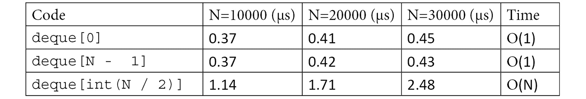

# *第二章*: 纯 Python 优化

如前一章所述，提高应用程序性能的最有效方法之一是通过使用更好的算法和数据结构。Python 标准库提供了一系列现成的算法和数据结构，可以直接集成到您的应用程序中。通过本章学到的工具，您将能够为任务选择合适的算法，并实现巨大的速度提升。

尽管许多算法已经存在了很长时间，但它们在当今世界尤其相关，因为我们不断地生产、消费和分析越来越多的数据。购买更大的服务器或进行微优化可能暂时有效，但通过算法改进实现更好的扩展性可以一劳永逸地解决问题。

在本章中，我们将学习如何通过标准算法和数据结构实现更好的扩展性。同时，我们还将涵盖利用第三方库的更高级用法。我们还将了解用于实现缓存的工具，这是一种通过牺牲一些内存或磁盘空间来换取更快响应时间的技巧。

本章将涵盖以下主题列表：

+   使用合适的算法和数据结构

+   通过缓存和记忆化提高效率

+   使用列表推导和生成器进行高效迭代

# 技术要求

您可以在此处找到本章的代码文件：[`github.com/PacktPublishing/Advanced-Python-Programming-Second-Edition/tree/main/Chapter02`](https://github.com/PacktPublishing/Advanced-Python-Programming-Second-Edition/tree/main/Chapter02)。

# 使用合适的算法和数据结构

算法改进在提高性能方面特别有效，因为它们通常允许应用程序在输入越来越大时更好地扩展。

算法运行时间可以根据其计算复杂度进行分类，这是对执行任务所需资源的一种描述。

这种分类通过 *大 O 表示法* 来表达，它是执行任务所需操作的上限，通常取决于输入大小。具体来说，大 O 表示法描述了算法的运行时间或内存需求如何随着输入大小的增长而增长。因此，较低的 Big O 表示一个更有效的算法，这是我们追求的目标。

例如，可以使用 `for` 循环实现列表中每个元素的递增，如下所示：

```py
    input = list(range(10))
    for i, _ in enumerate(input):
        input[i] += 1 
```

如果操作不依赖于输入的大小（例如，访问列表的第一个元素），则该算法被称为常数时间，或 *O*(1) 时间。这意味着，无论我们有多少数据，算法的运行时间都将保持不变。

在这个简单的算法中，`input[i] += 1` 操作将会重复执行 `10` 次，这是输入的大小。如果我们加倍输入数组的大小，操作的数量将成比例增加。由于操作的数量与输入大小成正比，因此这个算法被称为 *O*(*N*) 时间复杂度，其中 *N* 是输入数组的大小。

在某些情况下，运行时间可能取决于输入的结构（例如，如果集合是有序的或包含许多重复项）。在这些情况下，一个算法可能具有不同的最佳情况、平均情况和最坏情况运行时间。除非另有说明，本章中展示的运行时间被认为是平均运行时间。

在本节中，我们将检查 Python 标准库中实现算法和数据结构的运行时间，并了解提高运行时间如何带来巨大的收益，并使我们能够以优雅的方式解决大规模问题。

你可以在本章节的 `Algorithms.ipynb` 笔记本中找到用于运行基准测试的代码，该笔记本可以使用 *Jupyter* 打开。

首先，我们将检查 **列表** 和 **双端队列**。

## 列表和双端队列

Python 列表是有序元素集合，在 Python 中实现为可调整大小的数组。**数组**是一种基本数据结构，由一系列连续的内存位置组成，每个位置包含对 Python 对象的引用。

列表在访问、修改和追加元素方面表现突出。访问或修改一个元素涉及到从底层数组的适当位置获取对象引用，具有 *O*(1) 的复杂度。追加一个元素也非常快。当创建一个空列表时，会分配一个固定大小的数组，并且随着我们插入元素，数组中的槽位逐渐被填满。一旦所有槽位都被占用，列表需要增加其底层数组的大小，从而触发可能需要 *O*(*N*) 时间的内存重新分配。尽管如此，这些内存分配并不频繁，追加操作的复杂度被称为摊销的 *O*(1) 时间。

可能存在效率问题的列表操作是那些在列表开头（或中间某处）添加或删除元素的操作。当从列表开头插入或删除一个项目时，数组中所有后续元素都需要移动一个位置，因此需要 *O*(*N*) 的时间。

在下表中，展示了大小为 10,000 的列表上不同操作的计时；你可以看到，如果是在列表开头或结尾执行插入和删除操作，性能会有相当大的差异：


表 1.1 – 不同列表操作的速率

在某些情况下，需要在集合的开始和末尾有效地执行元素的插入或删除。Python 在 `collections.deque` 类中提供了一个具有这些属性的数据结构。单词 *deque* 代表 **双端队列**，因为这种数据结构被设计成在集合的开始和末尾有效地放置和删除元素，就像队列一样。在 Python 中，双端队列被实现为双链表。

除了 `pop` 和 `append`，双端队列还公开了具有 *O*(1) 运行时间的 `popleft` 和 `appendleft` 方法：


表 1.2 – 不同双端队列操作的速度

尽管有这些优点，但在大多数情况下不应使用双端队列来替换常规列表。`appendleft` 和 `popleft` 操作获得的效率是以代价为代价的——在双端队列的中间访问一个元素是一个 *O*(N) 操作，如下表所示：



表 1.3 – 双端队列在访问中间元素时的低效性

在列表中搜索一个项目通常是一个 *O*(*N*) 操作，并使用 `list.index` 方法执行。加快列表中搜索的一种简单方法是将数组排序，并使用 `bisect` 模块执行二分搜索。

`bisect` 模块允许在排序数组上进行快速搜索。`bisect.bisect` 函数可以用于排序列表，以找到放置元素的位置，同时保持数组排序。在下面的示例中，如果我们想在保持 `collection` 排序顺序的情况下将 `3` 元素插入数组，我们应该将 `3` 放在第三个位置（对应索引 `2`）：

```py
    insert bisect
    collection = [1, 2, 4, 5, 6]
    bisect.bisect(collection, 3)
    # Result: 2
```

此函数使用具有 *O*(*log*(*N*)) 运行时间的二分搜索算法。这样的运行时间非常快，基本上意味着每次你 *加倍* 输入大小时，你的运行时间将增加一个常数。这意味着，例如，如果你的程序在 `1000` 大小的输入上运行需要 `1` 秒，那么处理 `2000` 大小的输入将需要 `2` 秒，处理 `4000` 大小的输入将需要 `3` 秒，依此类推。如果你有 `100` 秒，理论上可以处理 `10³³` 大小的输入，这比你体内的原子数量还要多！

如果我们试图插入的值已经在列表中存在，`bisect.bisect` 函数将返回已存在值之后的定位。因此，我们可以使用 `bisect.bisect_left` 变体，它以以下方式返回正确的索引（摘自模块文档[`docs.python.org/3.5/library/bisect.html`](https://docs.python.org/3.5/library/bisect.html)）：

```py
    def index_bisect(a, x):
      'Locate the leftmost value exactly equal to x'
      i = bisect.bisect_left(a, x)
      if i != len(a) and a[i] == x:
      return i
      raise ValueError
```

在以下表格中，您可以看到`bisect`解决方案的运行时间几乎不受这些输入大小的影响，这使得它在搜索非常大的集合时成为一个合适的解决方案：


表 1.4 – bisect 函数的效率

## 字典

**字典**在 Python 语言中极其灵活且广泛使用，例如在包、模块和类级别的命名空间中，以及对象和类注解中。字典作为哈希表实现，非常擅长元素插入、删除和访问；所有这些操作的平均时间复杂度都是*O*(1)。

重要提示

在 Python 3.5 之前的版本中，字典是*无序集合*。从 Python 3.6 开始，字典能够根据插入顺序维护其元素。

### 哈希表

一个`hash`函数；Python 为几种数据类型实现了`hash`函数。作为一个演示，获取哈希码的通用函数是`hash`。在以下示例中，我们将向您展示如何获取给定`"hello"`字符串时的哈希码：

```py
    hash("hello")
    # Result: -1182655621190490452
    # To restrict the number to be a certain range you can
      use
    # the modulo (%) operator
      hash("hello") % 10
    # Result: 8
```

哈希表实现起来可能有些棘手，因为它们需要处理当两个不同的对象具有相同的哈希码时发生的冲突。然而，所有这些复杂性都被巧妙地隐藏在实现和默认的冲突解决策略之后，在大多数实际场景中默认的冲突解决策略都运行良好。

在字典中访问、插入和删除一个项的操作与字典的大小成*O*(1)的比例。然而，请注意，`hash`函数的计算仍然需要发生，对于字符串，计算与字符串的长度成比例。由于字符串键通常相对较小，这在实践中并不构成问题。

字典可以用来高效地计算列表中的唯一元素的数量。在这个例子中，我们定义了`counter_dict`函数，它接受一个列表并返回一个包含列表中每个值出现次数的字典：

```py
    def counter_dict(items): 
        counter = {} 
        for item in items: 
            if item not in counter: 
                counter[item] = 1 
            else: 
                counter[item] += 1 
        return counter
```

可以使用`collections.defaultdict`来简化代码，它可以用来生成每个新键自动分配默认值的字典。在以下代码中，`defaultdict(int)`调用生成一个每个新元素自动分配零值的字典，并可用于简化计数：

```py
    from collections import defaultdict
    def counter_defaultdict(items):
        counter = defaultdict(int)
        for item in items:
            counter[item] += 1
        return counter
```

`collections`模块还包括一个`Counter`类，它可以使用一行代码达到相同的目的：

```py
    from collections import Counter
    counter = Counter(items)
```

在速度方面，所有这些计数方式都具有相同的时间复杂度，但`Counter`实现是最有效的，如下表所示：


表 1.5 – 计算计数器的不同方法

#### 使用哈希表构建内存搜索索引

字典可以用来快速在文档列表中搜索单词，类似于搜索引擎。在本小节中，我们将学习如何基于列表字典构建倒排索引。假设我们有一个包含四个文档的集合：

```py
    docs = ["the cat is under the table",
            "the dog is under the table",
            "cats and dogs smell roses",
            "Carla eats an apple"]
```

获取与查询匹配的所有文档的一个简单方法是扫描每个文档并测试单词的存在。例如，如果我们想查找包含单词`table`的文档，我们可以采用以下过滤操作：

```py
    matches = [doc for doc in docs if "table" in doc]
```

这种方法简单且在处理一次性查询时效果良好；然而，如果我们需要经常查询集合，优化查询时间可能是有益的。由于线性扫描的每次查询成本为*O*(*N*)，你可以想象更好的扩展性将使我们能够处理更大的文档集合。

一个更好的策略是花些时间预处理文档，以便在查询时更容易找到。我们可以构建一个结构，称为`"table"`，将与`"the cat is under the table"`和`"the dog is under the table"`文档相关联；它们对应于`0`和`1`索引。

这种映射可以通过遍历我们的文档集合，并在字典中存储该术语出现的文档索引来实现。实现方式与`counter_dict`函数类似，只不过，我们不是增加计数器，而是在匹配当前术语的文档列表中增长：

```py
    # Building an index
    index = {}
    for i, doc in enumerate(docs):
        # We iterate over each term in the document
        for word in doc.split():
            # We build a list containing the indices 
            # where the term appears
            if word not in index:
                index[word] = [i]
            else:
                index[word].append(i)
```

一旦我们构建了索引，进行查询就涉及简单的字典查找。例如，如果我们想返回包含`table`这个术语的所有文档，我们只需查询索引并检索相应的文档：

```py
    results = index["table"]
    result_documents = [docs[i] for i in results]
```

由于查询我们的集合只需要字典访问，索引可以处理具有*O*(1)时间复杂度的查询！多亏了倒排索引，我们现在能够在常数时间内查询任意数量的文档（只要它们适合内存）。不用说，索引是一种广泛用于快速检索数据的技术，不仅用于搜索引擎，也用于数据库和任何需要快速搜索的系统。

重要提示

构建倒排索引是一个昂贵的操作，需要你编码每个可能的查询。这是一个重大的缺点，但好处很大，可能值得为了降低灵活性而付出代价。

## 集合

**集合**是无序的元素集合，额外的限制是元素必须是唯一的。集合是一个很好的选择的主要用例包括成员资格测试（测试元素是否存在于集合中）以及，不出所料，集合操作，如并集、差集和交集。

在 Python 中，集合是通过哈希算法实现的，就像字典一样；因此，添加、删除和测试成员资格的时间复杂度随着集合大小的增长而以*O*(1)的比例缩放。

集合只包含*唯一元素*。集合的一个直接用途是从集合中删除重复项，这可以通过简单地通过`set`构造函数传递集合来完成，如下所示：

```py
    # create a list that contains duplicates
    x = list(range(1000)) + list(range(500))
    # the set *x_unique* will contain only 
    # the unique elements in x
    x_unique = set(x)
```

删除重复项的时间复杂度是*O*(N)，因为它需要读取输入并将每个元素放入集合中。

集合提供了一些操作，如并集、交集和差集。两个集合的并集是一个包含两个集合所有元素的新集合；交集是一个只包含两个集合共有元素的新集合，差集是一个包含第一个集合中不包含在第二个集合中的元素的新集合。这些操作的时间复杂度如下表所示。请注意，由于我们有两个不同的输入大小，我们将使用字母`S`来表示第一个集合的大小（称为`s`），使用`T`来表示第二个集合的大小（称为`t`）：


表 1.6 – 集合操作运行时间

集合操作的示例应用是布尔查询。回到前一小节中提到的倒排索引示例，我们可能希望支持包含多个术语的查询。例如，我们可能想要搜索包含单词`cat`和`table`的所有文档。这种查询可以通过取包含`cat`的文档集合和包含`table`的文档集合的交集来有效地计算。

为了有效地支持这些操作，我们可以修改我们的索引代码，使得每个术语都与一组文档（而不是列表）相关联。应用这个更改后，计算更高级的查询就变成了应用正确的集合操作。在下面的代码中，我们展示了基于集合的倒排索引和基于集合操作的查询：

```py
    # Building an index using sets
    index = {}
    for i, doc in enumerate(docs):
        # We iterate over each term in the document
        for word in doc.split():
            # We build a set containing the indices 
            # where the term appears
            if word not in index:
                index[word] = {i}
            else:
                index[word].add(i)

    # Querying the documents containing both "cat" and
        "table"
    index['cat'].intersection(index['table'])
```

## 堆

**堆**是一种设计用来快速查找和提取集合中最大（或最小）值的数据结构。堆的一个典型用途是按照最大优先级顺序处理一系列传入的任务。

理论上，你可以使用`bisect`模块中的工具来使用排序列表；然而，虽然提取最大值将花费*O*(1)时间（使用`list.pop`），插入仍然需要*O*(N)时间（记住，即使找到插入点需要*O*(*log*(*N*))时间，在列表中间插入一个元素仍然是一个*O*(*N*)操作）。堆是一个更有效的数据结构，它允许以*O*(*log*(*N*))时间复杂度插入和提取最大值。

在 Python 中，堆是通过`heapq`模块中的过程在底层列表上构建的。例如，如果我们有一个包含 10 个元素的列表，我们可以使用`heapq.heapify`函数将其重新组织成一个堆：

```py
    import heapq
    collection = [10, 3, 3, 4, 5, 6]
    heapq.heapify(collection)
```

要在堆上执行插入和提取操作，我们可以使用 `heapq.heappush` 和 `heapq.heappop` 函数。`heapq.heappop` 函数将以 *O*(*log*(*N*)) 的时间复杂度从集合中提取最小值，并且可以按以下方式使用：

```py
    heapq.heappop(collection)
    # Returns: 3
```

同样，你可以使用 `heapq.heappush` 函数将 `1` 整数推入堆中，如下所示：

```py
    heapq.heappush(collection, 1)
```

另一个易于使用的选项是 `queue.PriorityQueue` 类，它还有一个额外的好处，即线程和进程安全。可以使用 `PriorityQueue.put` 方法向 `PriorityQueue` 类中填充元素，而 `PriorityQueue.get` 可以用来提取集合中的最小值：

```py
    from queue import PriorityQueue
    queue = PriorityQueue()
    for element in collection:
        queue.put(element)
    queue.get()
    # Returns: 3
```

如果需要最大元素，一个简单的技巧是将列表中的每个元素乘以 `-1`。这样，元素的顺序将会反转。此外，如果你想将一个对象（例如，要运行的任务）与每个数字（它可以表示优先级）关联起来，你可以插入 `(number, object)` 形式的元组；元组的比较操作将根据其第一个元素进行排序，如下面的示例所示：

```py
    queue = PriorityQueue()
    queue.put((3, "priority 3"))
    queue.put((2, "priority 2"))
    queue.put((1, "priority 1"))
    queue.get()
    # Returns: (1, "priority 1")
```

## Tries

一种可能不太受欢迎但非常实用的数据结构是 **trie**（有时称为 **前缀树**）。Trie 在匹配字符串列表与前缀方面非常快速。这在实现如 *搜索即输入* 和 *自动完成* 等功能时特别有用，在这些功能中，可用的完成列表非常大，并且需要短响应时间。

不幸的是，Python 并没有在其标准库中包含 trie 实现；然而，通过 *PyPI* 可以轻松获得许多高效的实现。在本小节中，我们将使用 `patricia-trie`，这是一个单文件、纯 Python 实现的 trie。作为一个例子，我们将使用 `patricia-trie` 来执行在字符串集合中查找最长前缀的任务（就像自动完成一样）。

在这里，我们可以展示 trie 如何快速搜索字符串列表。为了生成大量唯一的随机字符串，我们可以定义一个函数，`random_string`。`random_string` 函数将返回由随机大写字母组成的字符串，虽然有可能得到重复的字符串，但如果我们使字符串足够长，我们可以将重复的概率大大降低到可以忽略不计的程度。`random_string` 函数的实现如下所示：

```py
    from random import choice
    from string import ascii_uppercase
    def random_string(length):
     """Produce a random string made of *length* uppercase \
        ascii characters"""
     return ''.join(choice(ascii_uppercase) for i in \
       range(length))
```

我们可以构建一个随机字符串列表，并使用 `str.startswith` 函数来测量它搜索前缀（在我们的例子中，是 `"AA"` 字符串）的速度：

```py
    strings = [random_string(32) for i in range(10000)]
    matches = [s for s in strings if s.startswith('AA')]
```

列表推导和 `str.startswith` 已经是非常优化的操作，在这个小数据集中，搜索只需要一毫秒左右：

```py
    %timeit [s for s in strings if s.startswith('AA')]
    1000 loops, best of 3: 1.76 ms per loop
```

现在，让我们尝试使用 trie 进行相同的操作。在这个例子中，我们将使用可以通过`pip`安装的`patricia-trie`库。`patricia.trie`类实现了一种类似字典的接口的 trie 数据结构变体。我们可以通过从我们的字符串列表创建一个字典来初始化我们的 trie，如下所示：

```py
    from patricia import trie
    strings_dict = {s:0 for s in strings} 
    # A dictionary where all values are 0
    strings_trie = trie(**strings_dict)
```

要查询`patricia-trie`以匹配前缀，我们可以使用`trie.iter`方法，它返回一个匹配字符串的迭代器：

```py
    matches = list(strings_trie.iter('AA'))
```

现在我们知道了如何初始化和查询 trie，我们可以计时操作：

```py
    %timeit list(strings_trie.iter('AA'))
    10000 loops, best of 3: 60.1 µs per loop
```

对于这个输入大小的计时为**60.1 µs**，这比线性搜索快约 30 倍（1.76 ms = 1760 µs）！这种令人印象深刻的加速是由于 trie 前缀搜索更好的计算复杂度。查询 trie 的时间复杂度为*O*(*S*)，其中*S*是集合中最长字符串的长度，而简单线性扫描的时间复杂度为*O*(*N*)，其中*N*是集合的大小。

注意，如果我们想返回所有匹配的前缀，运行时间将与匹配前缀的结果数量成比例。因此，在设计计时基准时，我们必须确保我们总是返回相同数量的结果。

下表显示了包含 10 个前缀匹配的不同大小数据集的 trie 与线性扫描的缩放特性：


表 1.7 – trie 与线性扫描的运行时间

一个有趣的事实是，`patricia-trie`的实现实际上是一个单一的 Python 文件；这清楚地展示了巧妙算法的简单和强大。为了额外的功能和性能，还有其他 C 优化的 trie 库可供选择，例如`datrie`和`marisa-trie`。

到目前为止，我们已经考虑了 Python 中大多数重要的原生数据结构。适当使用这些数据结构将显著加快您的应用程序。除了数据结构之外，还有其他计算技术和概念我们可以利用，以使我们的程序运行得更快。在下一节中，我们将探讨缓存和记忆化，这是在预期相同的计算会被多次重复时常见的做法。

# 缓存和记忆化带来的效率提升

**缓存**是一种用于提高各种应用程序性能的出色技术。缓存背后的理念是将昂贵的计算结果存储在一个临时位置，称为**缓存**，它可以位于内存中、磁盘上或远程位置。

网络应用程序广泛使用缓存。在 Web 应用程序中，通常会有多个用户同时请求同一页面。在这种情况下，而不是为每个用户重新计算页面，Web 应用程序可以计算一次，然后为用户提供已经渲染的页面。理想情况下，缓存还需要一个失效机制，以便如果页面需要更新，我们可以在再次提供服务之前重新计算它。智能缓存允许 Web 应用程序以更少的资源处理越来越多的用户。缓存也可以预先执行，例如在在线观看视频时，视频的后续部分被缓冲。

缓存也被用来提高某些算法的性能。一个很好的例子是计算斐波那契数列。由于计算斐波那契数列中的下一个数字需要序列中的前一个数字，您可以存储并重用之前的结果，从而显著提高运行时间。在应用程序中存储和重用之前函数调用的结果通常被称为 **记忆化**，它是缓存的一种形式。其他几种算法可以利用记忆化来获得令人印象深刻的性能提升，这种编程技术通常被称为 **动态规划**，其目的是通过将大问题分解为更小的问题来解决。

然而，缓存的益处并非免费得来。我们实际上是在牺牲一些空间来提高应用程序的速度。此外，如果缓存存储在网络上的某个位置，我们可能会产生传输成本和通信所需的一般时间。您应该评估何时使用缓存方便，以及您愿意为速度的提升牺牲多少空间。

考虑到这种技术的有用性，Python 标准库在 `functools` 模块中提供了一个简单的内存缓存。`functools.lru_cache` 装饰器可以用来轻松缓存函数的结果。

在下面的示例中，我们创建了一个函数 `sum2`，该函数打印一条语句并返回两个数字的和。通过运行该函数两次，您可以看到，第一次执行 `sum2` 函数时，会输出 `"Calculating ..."` 字符串，而第二次，结果会被返回，而无需再次运行函数：

```py
    from functools import lru_cache
    @lru_cache()
    def sum2(a, b):
        print("Calculating {} + {}".format(a, b))
        return a + b
    print(sum2(1, 2))
    # Output: 
    # Calculating 1 + 2
    # 3
    print(sum2(1, 2))
    # Output: 
    # 3
```

`lru_cache` 装饰器还提供了其他基本功能。为了限制缓存的大小，您可以通过 `max_size` 参数设置我们打算维护的元素数量。如果我们希望缓存大小无限制，我们可以指定一个 `None` 值。下面是一个 `max_size` 用法的示例：

```py
    @lru_cache(max_size=16)
    def sum2(a, b):
        ...
```

这样，当我们用不同的参数执行 `sum2` 时，缓存将达到最大大小 `16`，并且随着我们不断请求更多计算，新的值将替换缓存中的旧值。`lru` 前缀来源于这种策略，意味着 *最近最少使用*。

`lru_cache` 装饰器还为装饰的函数添加了额外的功能。例如，可以使用 `cache_info` 方法检查缓存性能，并使用 `cache_clear` 方法重置缓存，如下所示：

```py
    sum2.cache_info()
    # Output: CacheInfo(hits=0, misses=1, maxsize=128,
      currsize=1)
    sum2.cache_clear()
```

例如，我们可以看到缓存如何使计算斐波那契数列等问题受益。我们可以定义一个 `fibonacci` 函数并测量其执行时间：

```py
    def fibonacci(n):
        if n < 1:
            return 1
        else:
            return fibonacci(n - 1) + fibonacci(n - 2)
    # Non-memoized version
    %timeit fibonacci(20)
    100 loops, best of 3: 5.57 ms per loop
```

执行时间需要 5.57 毫秒，这非常长。以这种方式编写的函数的扩展性能很差；之前计算的斐波那契序列没有被重用，导致这个算法具有大约 *O*(2N) 的指数级扩展。

通过存储和重用已经计算过的斐波那契数，缓存可以提高这个算法的性能。要实现缓存的版本，只需将 `lru_cache` 装饰器应用到原始的 `fibonacci` 函数上即可。此外，为了设计一个合适的基准测试，我们需要确保每次运行都实例化一个新的缓存；为此，我们可以使用 `timeit.repeat` 函数，如下例所示：

```py
    import timeit
    setup_code = '''
    from functools import lru_cache
    from __main__ import fibonacci
    fibonacci_memoized = lru_cache(maxsize=None)(fibonacci)'''
    results = timeit.repeat('fibonacci_memoized(20)',
                            setup=setup_code,
                            repeat=1000,
                            number=1)
    print("Fibonacci took {:.2f} us".format(min(results)))
    # Output: Fibonacci took 0.01 us
```

尽管我们通过添加简单的装饰器改变了算法，但现在的运行时间现在比微秒还少。原因是，多亏了缓存，我们现在有一个线性时间算法，而不是指数级算法。

`lru_cache` 装饰器可用于在您的应用程序中实现简单的内存缓存。对于更高级的使用场景，可以使用第三方模块来实现更强大的实现和磁盘缓存。

## Joblib

一个简单的库，除了其他功能外，还提供了一个简单的磁盘缓存，是 `joblib`。该包可以像 `lru_cache` 一样使用，但结果将存储在磁盘上，并在运行之间持续存在。

可以使用 `pip install joblib` 命令从 PyPI 安装 `joblib` 模块。

`joblib` 模块提供了 `Memory` 类，可以使用 `Memory.cache` 装饰器来缓存函数：

```py
    from joblib import Memory
    memory = Memory(cachedir='/path/to/cachedir')
    @memory.cache
    def sum2(a, b):
        return a + b
```

该函数的行为将与 `lru_cache` 类似，但结果将存储在 `Memory` 初始化时由 `cachedir` 参数指定的目录中。此外，缓存的成果将在后续运行中持续存在！

`Memory.cache` 方法还允许限制重新计算仅在某些参数改变时发生，并且结果装饰的函数支持基本的清除和分析缓存的功能。

也许 `joblib` 最好的特性是，由于智能哈希算法，它能够高效地缓存操作 `numpy` 数组的函数，这在科学和工程应用中尤其有用。

到目前为止，我们已经看到，通过使用缓存和记忆化，我们的程序可以以高效的方式重用计算。另一种常见的提高运行时间的策略是利用适当设计的特定技术。在下一节中，我们将看到如何利用推导和生成器在处理 Python 循环时获得优势。

# 使用推导和生成器进行高效迭代

在本节中，我们将探讨一些简单的策略，使用`for`循环来加快 Python 循环的速度，因为它们在设计时旨在避免在构建过程中产生许多不必要的计算开销。使用这种结构的另一个原因是可读性；即使与标准循环相比，速度提升不大，推导和生成器语法更紧凑，并且（大多数时候）更直观。

在以下示例中，我们可以看到，当与`sum`函数结合使用时，列表推导和生成器表达式都比显式循环更快：

```py
    def loop(): 
        res = [] 
        for i in range(100000): 
            res.append(i * i) 
        return sum(res) 
    def comprehension(): 
        return sum([i * i for i in range(100000)]) 
    def generator(): 
        return sum(i * i for i in range(100000)) 
    %timeit loop() 
    100 loops, best of 3: 16.1 ms per loop 
    %timeit comprehension() 
    100 loops, best of 3: 10.1 ms per loop 
    %timeit generator() 
    100 loops, best of 3: 12.4 ms per loop 
```

就像列表一样，我们可以使用`dict`推导来更高效、更紧凑地构建字典，如下面的代码所示：

```py
    def loop(): 
        res = {} 
        for i in range(100000): 
            res[i] = i
        return res
    def comprehension(): 
        return {i: i for i in range(100000)}
    %timeit loop() 
    100 loops, best of 3: 13.2 ms per loop 
    %timeit comprehension() 
    100 loops, best of 3: 12.8 ms per loop
```

使用迭代器和如`filter`和`map`之类的函数可以实现高效的循环（特别是在内存方面）。例如，考虑使用列表推导对列表应用一系列操作，然后取最大值的问题：

```py
    def map_comprehension(numbers):
        a = [n * 2 for n in numbers]
        b = [n ** 2 for n in a]
        c = [n ** 0.33 for n in b]
        return max(c)
```

这种方法的缺点是，对于每个列表推导，我们都在分配一个新的列表，这增加了内存使用。而不是使用列表推导，我们可以使用生成器。生成器是当迭代时，即时计算值并返回结果的对象。

例如，`map`函数接受两个参数——一个函数和一个迭代器——并返回一个生成器，该生成器将函数应用于集合中的每个元素。重要的是，操作仅在*我们迭代时发生*，而不是在调用`map`时发生！

我们可以使用`map`和创建中间生成器（而不是列表）来重写前面的函数，从而通过即时计算值来节省内存：

```py
    def map_normal(numbers):
        a = map(lambda n: n * 2, numbers)
        b = map(lambda n: n ** 2, a)
        c = map(lambda n: n ** 0.33, b)
        return max(c)
```

我们可以使用来自 IPython 会话的`memory_profiler`扩展来分析这两个解决方案的内存。该扩展提供了一个小的实用工具`%memit`，它将帮助我们以类似于`%timeit`的方式评估 Python 语句的内存使用情况，如下面的详细说明所示：

```py
    %load_ext memory_profiler
    numbers = range(1000000)
    %memit map_comprehension(numbers)
    peak memory: 166.33 MiB, increment: 102.54 MiB
    %memit map_normal(numbers)
    peak memory: 71.04 MiB, increment: 0.00 MiB
```

如您所见，第一个版本使用的内存为`102.54 MiB`，而第二个版本消耗的内存为`0.00 MiB`！对于那些感兴趣的人来说，可以在`itertools`模块中找到更多返回生成器的函数，该模块提供了一套旨在处理常见迭代模式的实用工具。

# 摘要

算法优化可以提高我们处理越来越大的数据时应用程序的扩展性。在本章中，我们展示了 Python 中最常见的数据结构（如列表、双端队列、字典、堆和 trie）的使用案例和运行时间。我们还介绍了缓存技术，这是一种可以在内存或磁盘上交换一些空间以换取应用程序响应性提高的技术。我们还演示了如何通过用快速结构（如列表解析和生成器表达式）替换 `for` 循环来获得适度的速度提升。

总体来说，我们已经看到，通过利用特定情况下合适的数据结构或技术，我们可以大大提高程序的效率。本章涵盖的主题为我们提供了在广泛用例中做到这一点的能力。

在随后的章节中，我们将学习如何使用数值库（如 `numpy`）进一步提高性能，以及如何在 *Cython* 的帮助下用低级语言编写扩展模块。

# 问题

1.  根据以下用例，从本章介绍的数据结构中识别最佳/最合适的数据结构：

    1.  将项目映射到另一个 *集合* 中的项目（*集合* 在最一般的意义上使用）

    1.  访问、修改和添加元素

    1.  维护一组唯一元素

    1.  跟踪一个 *集合*（在最一般的意义上）的最小/最大值

    1.  在 *序列*（在最一般的意义上）的端点添加和删除元素。

    1.  根据某些相似性标准进行快速搜索（例如，被自动完成引擎使用）。

1.  缓存和记忆化之间的区别是什么？

1.  为什么在大多数情况下，列表解析和生成器（相对于显式的 `for` 循环）更受欢迎？

1.  考虑这样一个问题：表示一组字母和一组数字之间的成对关联（例如，a  2，b  1，c  3，等等），在我们应用中需要查看给定字母关联的数字是什么。

    1.  列表是否是完成这个任务的合适数据结构，如果不是，那又是什么？

    1.  如果每个数字代表一个文本文档中给定字母的实例数量呢？这个任务的最佳数据结构会是什么？

# 进一步阅读

+   Python 中的延迟评估：[`towardsdatascience.com/what-is-lazy-evaluation-in-python-9efb1d3bfed0`](https://towardsdatascience.com/what-is-lazy-evaluation-in-python-9efb1d3bfed0)

+   Python 中的 `yield` 语句：[`realpython.com/introduction-to-python-generators/`](https://realpython.com/introduction-to-python-generators/)
