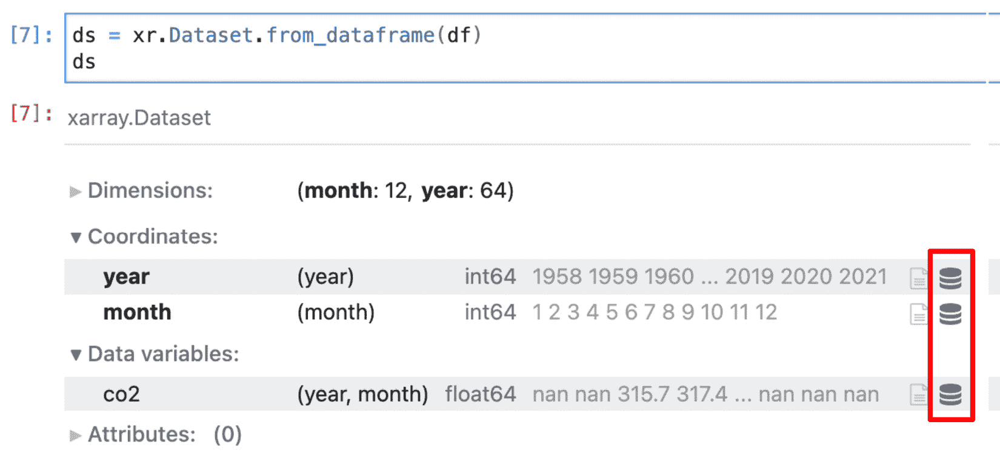

# *第三章*: 使用 NumPy、Pandas 和 Xarray 进行快速数组操作

NumPy 是 Python 中科学计算的*事实上的*标准。它提供了灵活的多维数组，允许您进行快速简洁的数学计算。

NumPy 提供了通用的数据结构和算法，旨在使用简洁的语法表达复杂的数学运算。多维数组`numpy.ndarray`在内部基于 C 数组。除了性能优势外，这种选择还允许 NumPy 代码轻松地与现有的 C 和 FORTRAN 例程接口；NumPy 帮助弥合了 Python 与使用这些语言编写的旧代码之间的差距。

在本章中，我们将学习如何创建和操作 NumPy 数组。我们还将探索 NumPy 的广播功能，该功能用于高效简洁地重写复杂的数学表达式。

**pandas**是一个高度依赖 NumPy 的工具，提供了针对数据分析的额外数据结构和算法。我们将介绍 pandas 的主要特性和用法。我们还将学习如何使用 pandas 数据结构和向量化操作达到高性能。

在涉及标签化、多维数据的许多用例中，NumPy 和 pandas 都显得不足。xarray 库结合了其他两个工具的最佳特性，并提供了进一步优化的数据处理功能。我们将讨论这个工具的动机，并通过具体的例子研究它提供的性能改进。

在本章中，我们将涵盖以下主题：

+   开始使用 NumPy

+   使用 NumPy 重写粒子模拟器

+   使用 numexpr 达到最佳性能

+   使用 pandas 处理数据库风格的数据

+   使用 xarray 进行高性能标签化数据

# 技术要求

您可以通过访问本书的 GitHub 仓库[`github.com/PacktPublishing/Advanced-Python-Programming-Second-Edition/Chapter03`](https://github.com/PacktPublishing/Advanced-Python-Programming-Second-Edition/Chapter03)来获取本章的代码文件。

# 开始使用 NumPy

NumPy 库围绕其多维数组对象`numpy.ndarray`展开。NumPy 数组是相同数据类型元素的集合；这种基本限制使得 NumPy 能够以允许高性能数学运算的方式打包数据。

## 创建数组

让我们按照以下步骤探索 NumPy 的功能：

1.  您可以使用`numpy.array`函数创建 NumPy 数组。它接受一个类似列表的对象（或另一个数组）作为输入，并且可选地接受一个表示其数据类型的字符串。您可以使用 IPython shell 交互式测试数组创建，如下所示：

    ```py
        import numpy as np 
        a = np.array([0, 1, 2]) 
    ```

1.  每个 NumPy 数组都有一个关联的数据类型，可以使用`dtype`属性访问。如果我们检查`a`数组，我们会发现它的`dtype`是`int64`，代表 64 位整数：

    ```py
        a.dtype 
        # Result: 
        # dtype('int64') 
    ```

1.  我们可能决定将这些整数数字转换为`float`类型。为此，我们可以在数组初始化时传递`dtype`参数，或者使用`astype`方法将数组转换为另一种数据类型。以下代码展示了这两种选择数据类型的方法：

    ```py
        a = np.array([1, 2, 3], dtype='float32') 
        a.astype('float32') 
        # Result:
        # array([ 0.,  1.,  2.], dtype=float32) 
    ```

1.  要创建一个二维数组（一个数组数组），我们可以使用嵌套序列执行所需的初始化，如下所示：

    ```py
        a = np.array([[0, 1, 2], [3, 4, 5]]) 
        print(a) 
        # Output:
        # [[0 1 2]
        #  [3 4 5]] 
    ```

1.  以这种方式创建的数组有两个维度，称为`ndarray.shape`属性：

    ```py
        a.shape 
        # Result:
        # (2, 3) 
    ```

1.  数组也可以重塑，只要形状维度的乘积等于数组中的总元素数（即，总元素数保持不变）。例如，我们可以以下列方式重塑包含 16 个元素的数组：`(2, 8)`、`(4, 4)`或`(2, 2, 4)`。要重塑数组，我们可以使用`ndarray.reshape`方法或将新值赋给`ndarray.shape`元组。以下代码说明了`ndarray.reshape`方法的使用：

    ```py
        a = np.array([0, 1, 2, 3, 4, 5, 6, 7, 8, 
                      9, 10, 11, 12, 13, 14, 15]) 
        a.shape 
        # Output:
        # (16,)
        a.reshape(4, 4) # Equivalent: a.shape = (4, 4) 
        # Output: 
        # array([[ 0,  1,  2,  3],
        #        [ 4,  5,  6,  7],
        #        [ 8,  9, 10, 11],
        #        [12, 13, 14, 15]]) 
    ```

由于这个特性，您可以自由地添加大小为`1`的维度。您可以将包含 16 个元素的数组重塑为`(16, 1)`、`(1, 16)`、`(16, 1, 1)`等。在下一节中，我们将广泛使用这个特性通过*广播*来实现复杂操作。

1.  NumPy 提供了如以下代码所示的便利函数，用于创建填充零、一或无初始值（在这种情况下，它们的实际值没有意义，取决于内存状态）的数组。这些函数接受数组形状作为元组，并可选地接受其`dtype`：

    ```py
        np.zeros((3, 3)) 
        np.empty((3, 3)) 
        np.ones((3, 3), dtype='float32') 
    ```

在我们的示例中，我们将使用`numpy.random`模块在`(0, 1)`区间内生成随机浮点数。`numpy.random.rand`将接受一个形状并返回具有该形状的随机数数组：

```py
    np.random.rand(3, 3) 
```

1.  有时，初始化与某个其他数组具有相同形状的数组是方便的。为此目的，NumPy 提供了一些实用的函数，例如`zeros_like`、`empty_like`和`ones_like`。以下是如何使用这些函数的示例：

    ```py
        np.zeros_like(a) 
        np.empty_like(a) 
        np.ones_like(a) 
    ```

这些函数将返回具有指定值的数组，其形状与数组`a`的形状完全匹配。

## 访问数组

NumPy 数组接口在浅层上与 Python 列表类似。NumPy 数组可以使用整数索引，并使用`for`循环迭代：

```py
    A = np.array([0, 1, 2, 3, 4, 5, 6, 7, 8]) 
    A[0] 
    # Result:
    # 0 
    [a for a in A] 
    # Result:
    # [0, 1, 2, 3, 4, 5, 6, 7, 8] 
```

然而，大多数情况下，显式地遍历数组并不是访问其元素最高效的方法。在本节中，我们将学习如何利用 NumPy 的 API 充分利用其效率。

### 索引和切片

索引和切片指的是访问数组中位于特定位置或满足某些我们感兴趣条件的元素的行为。在 NumPy 中，可以通过在索引运算符`[]`中使用逗号分隔的多个值方便地访问数组元素和子数组。让我们开始吧：

1.  如果我们取一个`(3,3)`的数组（包含三个三元组的数组）并使用索引`0`访问元素，我们可以获得第一行，如下所示：

    ```py
        A = np.array([[0, 1, 2], [3, 4, 5], [6, 7, 8]]) 
        A[0] 
        # Result:
        # array([0, 1, 2]) 
    ```

1.  我们可以通过添加另一个以逗号分隔的索引来再次通过行索引。要获取第一行的第二个元素，我们可以使用`(0, 1)`索引。一个重要的观察是，`A[0, 1]`表示法是`A[(0, 1)]`的简写；也就是说，我们正在使用*元组*进行索引！以下代码片段展示了这两种版本：

    ```py
        A[0, 1] 
        # Result:
        # 1
        # Equivalent version using tuple
        A[(0, 1)]
    ```

1.  NumPy 允许你将数组切片到多个维度。如果我们对第一个维度进行切片，我们可以获得一组三元组，如下所示：

    ```py
        A[0:2] 
        # Result:
        # array([[0, 1, 2], 
        #        [3, 4, 5]]) 
    ```

1.  如果我们再次对第二个维度使用`0:2`进行切片，我们正在从之前显示的三元组集合中提取前两个元素。这结果是一个形状为`(2, 2)`的数组，如下面的代码所示：

    ```py
        A[0:2, 0:2] 
        # Result:
        # array([[0, 1], 
        #        [3, 4]]) 
    ```

1.  直观地讲，你可以使用*数值索引*和*切片*来更新数组中的值。以下代码片段展示了这一点的示例：

    ```py
        A[0, 1] = 8 
        A[0:2, 0:2] = [[1, 1], [1, 1]]
    ```

1.  使用切片语法进行索引非常快，因为与列表不同，它不会生成数组的副本。在 NumPy 术语中，它返回相同内存区域的*视图*。如果我们从原始数组中取一个切片，然后改变其值之一，原始数组也会被更新。以下代码演示了这一功能的示例：

    ```py
        a= np.array([1, 1, 1, 1]) 
        a_view = a[0:2] 
        a_view[0] = 2 
        print(a) 
        # Output:
        # [2 1 1 1] 
    ```

在修改 NumPy 数组时，需要格外小心。由于视图共享数据，改变视图的值可能会导致难以发现的错误。为了防止副作用，你可以设置`a.flags.writeable = False`标志，这将防止数组或其任何视图被意外修改。

1.  让我们看看另一个示例，说明切片语法如何在现实世界的设置中使用。让我们定义一个`r_i`数组，如下面的代码行所示，它包含一组 10 个坐标（*x*，*y*）。它的形状将是`(10, 2)`：

    ```py
        r_i = np.random.rand(10, 2)
    ```

如果你难以区分轴顺序不同的数组，例如，形状为`(10, 2)`和形状为`(2, 10)`的数组，那么每次你说到“of”这个词时，应该引入一个新的维度。一个包含 10 个大小为 2 的元素的数组将是`(10, 2)`。相反，一个包含 2 个大小为 10 的元素的数组将是`(2, 10)`。

我们可能感兴趣的一个典型操作是从每个坐标中提取*x*分量。换句话说，你想要提取`(0, 0)`、`(1, 0)`和`(2, 0)`项，结果是一个形状为`(10,)`的数组。有助于思考的是，第一个索引是*移动的*，而第二个索引是*固定的*（在`0`）。有了这个想法，我们将切片第一个轴（移动的轴）上的每个索引，并在第二个轴（固定的轴）上取第一个元素，如下面的代码行所示：

```py
    x_i = r_i[:, 0] 
```

另一方面，以下表达式将保持第一个索引固定，第二个索引移动，返回第一个(*x*，*y*)坐标：

```py
    r_0 = r_i[0, :] 
```

在最后一个轴上对所有索引进行切片是可选的；使用`r_i[0]`与使用`r_i[0, :]`具有相同的效果。

### 花式索引

NumPy 允许你使用由整数或布尔值组成的另一个 NumPy 数组来索引一个数组。这是一个称为**花式索引**的功能：

1.  如果你用一个整数数组（例如，`idx`）索引一个数组（例如，`a`），NumPy 将解释这些整数为索引，并返回一个包含它们对应值的数组。如果我们用`np.array([0, 2, 3])`索引包含 10 个元素的数组，我们得到一个形状为`(3,)`的数组，包含位置`0`、`2`和`3`的元素。以下代码说明了这个概念：

    ```py
        a = np.array([9, 8, 7, 6, 5, 4, 3, 2, 1, 0]) 
        idx = np.array([0, 2, 3]) 
        a[idx] 
        # Result:
        # array([9, 7, 6]) 
    ```

1.  你可以通过为每个维度传递一个数组来在多个维度上使用花式索引。如果我们想提取`(0, 2)`和`(1, 2)`的元素，我们必须将作用于第一个轴的所有索引打包在一个数组中，将作用于第二个轴的索引打包在另一个数组中。这可以在以下代码中看到：

    ```py
        a = np.array([[0, 1, 2], [3, 4, 5], \
                      [6, 7, 8], [9, 10, 11]]) 
        idx1 = np.array([0, 1]) 
        idx2 = np.array([2, 2]) 
        a[idx1, idx2]
    ```

1.  你也可以使用普通的列表作为索引数组，但不能使用元组。例如，以下两个语句是等价的：

    ```py
        a[np.array([0, 1])] # is equivalent to
        a[[0, 1]]
    ```

然而，如果你使用一个元组，NumPy 将解释以下语句为对多个维度的索引：

```py
    a[(0, 1)] # is equivalent to
    a[0, 1] 
```

1.  索引数组不一定要是一维的；我们可以以任何形状从原始数组中提取元素。例如，我们可以从原始数组中选择元素以形成一个`(2,2)`的数组，如下所示：

    ```py
        idx1 = [[0, 1], [3, 2]] 
        idx2 = [[0, 2], [1, 1]] 
        a[idx1, idx2] 
        # Output: 
        # array([[ 0,  5],
        #        [10,  7]]) 
    ```

1.  数组的切片和花式索引功能可以结合使用。这在需要交换坐标数组中的*x*和*y*列时非常有用。在下面的代码中，第一个索引将遍历所有元素（一个切片），然后对于每一个元素，我们首先提取位置`1`（即*y*）的元素，然后是位置`0`（即*x*）的元素：

    ```py
        r_i = np.random.rand(10, 2) 
        r_i[:, [0, 1]] = r_i[:, [1, 0]] 
    ```

1.  当索引数组是`bool`类型时，规则略有不同。`bool`数组将作为*掩码*；每个对应于`True`的元素将被提取并放入输出数组中。以下代码展示了这一点：

    ```py
        a = np.array([0, 1, 2, 3, 4, 5]) 
        mask = np.array([True, False, True, False, \
          False, False]) 
        a[mask] 
        # Output:
        # array([0, 2]) 
    ```

当处理多个维度时，同样适用这些规则。此外，如果索引数组与原始数组具有相同的形状，则对应于`True`的元素将被选中并放入结果数组中。

1.  NumPy 中的索引是一个相对快速的运算。当速度至关重要时，你可以使用稍微快一点的`numpy.take`和`numpy.compress`函数来挤出更多性能。`numpy.take`的第一个参数是我们想要操作的数组，第二个参数是我们想要提取的索引列表。最后一个参数是`axis`；如果没有提供，索引将作用于展平后的数组；否则，它们将沿着指定的轴操作：

    ```py
        r_i = np.random.rand(100, 2) 
        idx = np.arange(50) # integers 0 to 50 
        %timeit np.take(r_i, idx, axis=0) 
        1000000 loops, best of 3: 962 ns per loop 
        %timeit r_i[idx] 
        100000 loops, best of 3: 3.09 us per loop 
    ```

1.  对于布尔数组，有一个类似但更快的版本是`numpy.compress`，它以相同的方式工作。`numpy.compress`的使用如下所示：

    ```py
        In [51]: idx = np.ones(100, dtype='bool') # all 
          True values 
        In [52]: %timeit np.compress(idx, r_i, axis=0) 
        1000000 loops, best of 3: 1.65 us per loop 
        In [53]: %timeit r_i[idx] 
        100000 loops, best of 3: 5.47 us per loop 
    ```

如我们所见，`compress` 给我们带来了一点点速度提升，这在处理大型数组时将非常有用。

## 广播

NumPy 的真正力量在于其快速的数学运算。NumPy 使用的策略是通过使用优化的 C 代码进行逐元素计算来避免进入 Python 解释器。**广播** 是一组巧妙的规则，它使得相似（但不完全相同！）形状的数组能够进行快速的数组计算。让我们看看这是如何实现的。

当你对两个数组（如乘法）执行算术运算时，如果两个操作数具有相同的形状，操作将以逐元素的方式进行。例如，在乘以两个 `(2, 2)` 的数组时，操作将在对应元素对之间进行，产生另一个 `(2, 2)` 的数组，如下面的代码所示：

```py
    A = np.array([[1, 2], [3, 4]]) 
    B = np.array([[5, 6], [7, 8]]) 
    A * B 
    # Output:
    # array([[ 5, 12],           
    #        [21, 32]]) 
```

如果操作数的形状不匹配，NumPy 将尝试使用广播规则来匹配它们。如果一个操作数是 *标量*（例如，一个数字），它将被应用到数组的每一个元素上，如下面的代码所示：

```py
    A * 2 
    # Output: 
    # array([[2, 4], 
    #        [6, 8]]) 
```

如果操作数是另一个数组，NumPy 将尝试从最后一个轴开始匹配形状。例如，如果我们想要将一个形状为 `(3, 2)` 的数组与一个形状为 `(2,)` 的数组组合，第二个数组将被重复三次以生成一个 `(3, 2)` 的数组。换句话说，数组在某个维度上被 *广播* 以匹配另一个操作数的形状，如下面的图所示：


图 3.1 – 数组广播的说明

如果形状不匹配——例如，当将一个 `(3, 2)` 的数组与一个 `(2, 2)` 的数组组合时——NumPy 将会抛出一个异常。

如果轴的大小为 1，数组将在这个轴上重复，直到形状匹配。为了说明这一点，让我们考虑我们有一个以下形状的数组：

```py
    5, 10, 2 
```

现在，让我们考虑我们想要与形状为 `(5, 1, 2)` 的数组进行广播；数组将在第二个轴上重复 10 次，如下所示：

```py
    5, 10, 2 
    5,  1, 2 → repeated 
    - - - - 
    5, 10, 2 
```

之前，我们看到了可以自由地重塑数组以添加大小为 1 的轴。在索引时使用 `numpy.newaxis` 常量将引入一个额外的维度。例如，如果我们有一个 `(5, 2)` 的数组，并且我们想要与一个形状为 `(5, 10, 2)` 的数组组合，我们可以在中间添加一个额外的轴，如下面的代码所示，以获得兼容的 `(5, 1, 2)` 数组：

```py
    A = np.random.rand(5, 10, 2) 
    B = np.random.rand(5, 2) 
    A * B[:, np.newaxis, :] 
```

这个特性可以用来操作两个数组的所有可能的组合。其中一个应用就是外积。让我们考虑以下两个数组：

```py
    a = [a1, a2, a3] 
    b = [b1, b2, b3] 
```

外积是一个矩阵，包含两个数组元素所有可能的组合 *(i, j)* 的乘积，如下面的代码片段所示：

```py
    a x b = a1*b1, a1*b2, a1*b3 
            a2*b1, a2*b2, a2*b3 
            a3*b1, a3*b2, a3*b3 
```

要使用 NumPy 计算这个，我们将 `[a1, a2, a3]` 元素在一个维度上重复，将 `[b1, b2, b3]` 元素在另一个维度上重复，然后取它们的逐元素乘积，如下面的图所示：


图 3.2 – 外积的示意图

使用代码，我们的策略是将 `a` 数组从形状 `(3,)` 转换为形状 `(3, 1)`，将 `b` 数组从形状 `(3,)` 转换为形状 `(1, 3)`。这两个数组在两个维度上广播，并使用以下代码相乘：

```py
    AB = a[:, np.newaxis] * b[np.newaxis, :] 
```

这种操作非常快且非常有效，因为它避免了 Python 循环，并且可以以与纯 C 或 FORTRAN 代码相当的速度处理大量元素。

## 数学运算

NumPy 默认包含用于广播的最常见的数学运算，范围从简单的代数到三角学、舍入和逻辑。

例如，要计算数组中每个元素的平方根，我们可以使用 `numpy.sqrt`，如下面的代码所示：

```py
    np.sqrt(np.array([4, 9, 16])) 
    # Result:
    # array([2., 3., 4.]) 
```

比较运算符在尝试根据条件过滤某些元素时非常有用。想象一下，我们有一个从 `0` 到 `1` 的随机数字数组，我们想要提取所有大于 `0.5` 的数字。我们可以在数组上使用 `>` 运算符来获得一个 `bool` 数组，如下所示：

```py
    a = np.random.rand(5, 3) 
    a > 0.3 
    # Result:
    # array([[ True, False,  True],
    #        [ True,  True,  True],
    #        [False,  True,  True],
    #        [ True,  True, False],
    #        [ True,  True, False]], dtype=bool) 
```

生成的 `bool` 数组然后可以被用作索引来检索大于 `0.5` 的元素：

```py
    a[a > 0.5] 
    print(a[a>0.5]) 
    # Output:
    # [ 0.9755  0.5977  0.8287  0.6214  0.5669  0.9553  
        0.5894  0.7196  0.9200  0.5781  0.8281 ] 
```

NumPy 还实现了 `ndarray.sum` 等方法，该方法对轴上的所有元素求和。如果我们有一个形状为 `(5, 3)` 的数组，我们可以使用 `ndarray.sum` 方法对第一轴、第二轴或数组的所有元素求和，如下面的代码片段所示：

```py
    a = np.random.rand(5, 3) 
    a.sum(axis=0) 
    # Result:
    # array([ 2.7454,  2.5517,  2.0303]) 
    a.sum(axis=1) 
    # Result:
    # array([ 1.7498,  1.2491,  1.8151,  1.9320,  0.5814]) 
    a.sum() # With no argument operates on flattened array 
    # Result:
    # 7.3275 
```

注意，通过在一个轴上求和元素，我们消除了该轴。从前面的例子中，轴 `0` 上的求和产生了一个形状为 `(3,)` 的数组，而轴 `1` 上的求和产生了一个形状为 `(5,)` 的数组。

## 计算范数

我们可以通过计算一组坐标的 *范数* 来回顾本节中展示的基本概念。一对坐标的范数是线性代数中的一个重要概念，通常被解释为对应线段的长度。对于二维向量，范数定义为如下：

```py
    norm = sqrt(x**2 + y**2) 
```

给定一个包含 10 个坐标 (*x*, *y*) 的数组，我们想要找到每个坐标的范数。我们可以通过以下步骤来计算范数：

1.  对坐标进行平方，得到一个包含 `(x**2, y**2)` 元素的数组。

1.  使用 `numpy.sum` 对最后一个轴上的元素求和。

1.  使用 `numpy.sqrt` 对元素逐个开平方。

最终的表达式可以压缩成一行：

```py
    r_i = np.random.rand(10, 2) 
    norm = np.sqrt((r_i ** 2).sum(axis=1)) 
    print(norm)
    # Output:
    # [ 0.7314  0.9050  0.5063  0.2553  0.0778   0.9143   
        1.3245  0.9486  1.010   1.0212] 
```

我们可以验证这种方法计算 `范数` 给出了正确的答案，同时代码紧凑。

# 使用 NumPy 重写粒子模拟器

在本节中，我们将通过用 NumPy 重写其部分来优化我们的粒子模拟器。从我们在*第一章*中进行的配置文件分析，*基准测试和性能分析*，我们发现我们程序中最慢的部分是以下循环，它包含在`ParticleSimulator.evolve`方法中：

```py
    for i in range(nsteps): 
      for p in self.particles: 
        norm = (p.x**2 + p.y**2)**0.5 
        v_x = (-p.y)/norm 
        v_y = p.x/norm 
        d_x = timestep * p.ang_vel * v_x 
        d_y = timestep * p.ang_vel * v_y 
        p.x += d_x 
        p.y += d_y 
```

你可能已经注意到循环的主体仅对当前粒子起作用。如果我们有一个包含粒子位置和角速度的数组，我们可以使用广播操作重写循环。相比之下，循环的步骤依赖于前一步，不能以这种方式并行化。

因此，将所有数组坐标存储在形状为`(nparticles, 2)`的数组中，并将角速度存储在形状为`(nparticles,)`的数组中是很自然的，其中`nparticles`是粒子数。我们将这些数组称为`r_i`和`ang_vel_i`：

```py
    r_i = np.array([[p.x, p.y] for p in self.particles]) 
    ang_vel_i = np.array([p.ang_vel for p in \
      self.particles]) 
```

速度方向，垂直于向量(*x*, *y*)，被定义为以下：

```py
    v_x = -y / norm 
    v_y = x / norm 
```

可以使用在“*NumPy 入门*”标题下的“*计算范数*”部分中说明的策略来计算范数：

```py
    norm_i = ((r_i ** 2).sum(axis=1))**0.5 
```

对于(*-y*, *x*)分量，我们需要在`r_i`中交换*x*和*y*列，然后将第一列乘以`-1`，如下面的代码所示：

```py
    v_i = r_i[:, [1, 0]] / norm_i 
    v_i[:, 0] *= -1 
```

为了计算位移，我们需要计算`v_i`、`ang_vel_i`和`timestep`的乘积。由于`ang_vel_i`的形状为`(nparticles,)`，它需要一个新轴来与形状为`(nparticles, 2)`的`v_i`操作。我们将使用`numpy.newaxis`来完成这项工作，如下所示：

```py
    d_i = timestep * ang_vel_i[:, np.newaxis] * v_i 
    r_i += d_i 
```

在循环外部，我们必须按照以下方式更新粒子实例的新坐标，*x*和*y*：

```py
    for i, p in enumerate(self.particles): 
      p.x, p.y = r_i[i] 
```

总结来说，我们将实现一个名为`ParticleSimulator.evolve_numpy`的方法，并将其与重命名为`ParticleSimulator.evolve_python`的纯 Python 版本进行基准测试：

```py
    def evolve_numpy(self, dt): 
      timestep = 0.00001 
      nsteps = int(dt/timestep) 
      r_i = np.array([[p.x, p.y] for p in self.particles]) 
      ang_vel_i = np.array([p.ang_vel for p in \
        self.particles]) 
      for i in range(nsteps): 
        norm_i = np.sqrt((r_i ** 2).sum(axis=1)) 
        v_i = r_i[:, [1, 0]] 
        v_i[:, 0] *= -1 
        v_i /= norm_i[:, np.newaxis] 
        d_i = timestep * ang_vel_i[:, np.newaxis] * v_i 
        r_i += d_i 
        for i, p in enumerate(self.particles): 
          p.x, p.y = r_i[i] 
```

我们还将更新基准测试，以便方便地更改粒子数量和模拟方法，如下所示：

```py
    def benchmark(npart=100, method='python'): 
      particles = [Particle(uniform(-1.0, 1.0),     
                            uniform(-1.0, 1.0),
                            uniform(-1.0, 1.0))  
                            for i in range(npart)] 
      simulator = ParticleSimulator(particles) 
      if method=='python': 
        simulator.evolve_python(0.1) 
      elif method == 'numpy': 
        simulator.evolve_numpy(0.1) 
```

让我们在 IPython 会话中运行基准测试：

```py
    from simul import benchmark 
    %timeit benchmark(100, 'python') 
    1 loops, best of 3: 614 ms per loop 
    %timeit benchmark(100, 'numpy') 
    1 loops, best of 3: 415 ms per loop 
```

我们做了一些改进，但看起来并没有大幅提升速度。NumPy 的强大之处在于处理大型数组。如果我们增加粒子数量，我们将注意到更明显的性能提升：

```py
    %timeit benchmark(1000, 'python') 
    1 loops, best of 3: 6.13 s per loop 
    %timeit benchmark(1000, 'numpy') 
    1 loops, best of 3: 852 ms per loop 
```

下图中所示的曲线是通过运行不同粒子数的基准测试产生的：


图 3.3 – 纯 Python 与 NumPy 的运行时间增长

曲线显示，两种实现都与粒子大小成线性关系，但纯 Python 版本的运行时间增长速度远快于 NumPy 版本；在更大的尺寸上，我们有一个更大的 NumPy 优势。一般来说，当使用 NumPy 时，你应该尝试将事物打包到大型数组中，并使用广播功能分组计算。

# 使用 numexpr 达到最佳性能

当处理复杂表达式时，NumPy 会将中间结果存储在内存中。David M. Cooke 编写了一个名为 `numexpr` 的包，该包在运行时优化和编译数组表达式。它是通过优化 CPU 缓存的使用并利用多个处理器来工作的。

它的使用通常很简单，基于一个单一的功能：`numexpr.evaluate`。该函数将包含数组表达式的字符串作为其第一个参数。语法基本上与 NumPy 相同。例如，我们可以以下这种方式计算一个简单的 `a + b * c` 表达式：

```py
    a = np.random.rand(10000) 
    b = np.random.rand(10000) 
    c = np.random.rand(10000) 
    d = ne.evaluate('a + b * c') 
```

`numexpr` 包在几乎所有情况下都能提高性能，但要获得实质性的优势，你应该使用它来处理大型数组。一个涉及大型数组的应用是计算 *距离矩阵*。在一个粒子系统中，距离矩阵包含粒子之间所有可能距离。为了计算它，我们应该计算连接任何两个粒子 `(i,j)` 的所有向量，如下所示：

```py
    x_ij = x_j - x_i 
    y_ij = y_j - y_i. 
```

然后，我们必须通过取其范数来计算这个向量的长度，如下面的代码所示：

```py
    d_ij = sqrt(x_ij**2 + y_ij**2) 
```

我们可以通过使用通常的广播规则（操作类似于外积）在 NumPy 中编写这个表达式：

```py
    r = np.random.rand(10000, 2) 
    r_i = r[:, np.newaxis] 
    r_j = r[np.newaxis, :] 
    d_ij = r_j - r_i 
```

最后，我们必须使用以下代码行来计算最后一个轴上的范数：

```py
    d_ij = np.sqrt((d_ij ** 2).sum(axis=2)) 
```

使用 `numexpr` 语法重写相同的表达式非常简单。`numexpr` 包（在我们的代码中别名为 `ne`）不支持在数组表达式中进行切片；因此，我们首先需要通过添加一个额外的维度来准备广播的操作数，如下所示：

```py
    r = np.random.rand(10000, 2) 
    r_i = r[:, np.newaxis] 
    r_j = r[np.newaxis, :] 
```

在这一点上，我们应该尝试将尽可能多的操作打包到一个表达式中，以允许进行显著的优化。

大多数 NumPy 数学函数也都在 `numexpr` 中可用。然而，有一个限制——减少操作（比如 `sum`）必须在最后发生。因此，我们必须先计算总和，然后退出 `numexpr`，最后在另一个表达式中计算平方根：

```py
    import numexpr as ne
    d_ij = ne.evaluate('sum((r_j - r_i)**2, 2)') 
    d_ij = ne.evaluate('sqrt(d_ij)') 
```

`numexpr` 编译器将通过不存储中间结果来避免冗余内存分配。在可能的情况下，它还会将操作分布到多个处理器上。在 `distance_matrix.py` 文件中，你会找到两个实现这两个版本——`distance_matrix_numpy` 和 `distance_matrix_numexpr`——的函数：

```py
    from distance_matrix import (distance_matrix_numpy, \
       distance_matrix_numexpr) 
    %timeit distance_matrix_numpy(10000) 
    1 loops, best of 3: 3.56 s per loop 
    %timeit distance_matrix_numexpr(10000) 
    1 loops, best of 3: 858 ms per loop 
```

通过简单地将表达式转换为使用 `numexpr`，我们能够获得比标准 NumPy 高出 4.5 倍的性能提升。`numexpr` 包可以在你需要优化涉及大型数组和复杂操作的 NumPy 表达式时使用，并且你可以在对代码进行最小更改的情况下做到这一点。

总体来说，我们已经看到，NumPy 与 numexpr 结合使用时，在处理多维数据时提供了强大的 API。然而，在许多用例中，数据只有二维，但在某种意义上是*标记的*，即数据轴包含有关它们包含的数据类型的显式信息。这是从数据库表中提取的数据的情况。在这种情况下，pandas 是 Python 中最受欢迎的，也是最好的库之一，我们将在下面看到。

# 使用 pandas 处理数据库风格的数据

pandas 是一个由 Wes McKinney 最初开发的库。它被设计用来以无缝和高效的方式分析数据集。近年来，这个强大的库经历了令人难以置信的增长，并且被 Python 社区广泛采用。在本节中，我们将介绍这个库中提供的主要概念和工具，并将使用它们来提高无法使用 NumPy 的矢量化操作和广播解决的问题的性能。

## pandas 基础知识

虽然 NumPy 主要处理数组，但 pandas 的主要数据结构是`pandas.Series`、`pandas.DataFrame`和`pandas.Panel`。在本章的其余部分，我们将把`pandas`简写为`pd`。

`pd.Series`对象与`np.array`的主要区别在于，`pd.Series`对象将特定的`*key*`与数组中的每个元素关联起来。让我们通过一个例子来看看这在实践中是如何工作的。

假设我们正在尝试测试一种新的降压药物，并且我们希望为每位患者存储，在服用药物后患者的血压是否有所改善。我们可以通过将每个受试者 ID（用一个整数表示）与`True`关联来表示药物有效，否则与`False`关联来编码此信息：

1.  我们可以通过将代表药物有效性的值数组和代表患者的键数组关联起来来创建一个`pd.Series`对象。这个键数组可以通过`index`参数传递给`Series`构造函数，如下面的代码片段所示：

    ```py
        import pandas as pd
        patients = [0, 1, 2, 3]
        effective = [True, True, False, False]
        effective_series = pd.Series(effective, \
          index=patients)
    ```

1.  将一组从`0`到`N`的整数与一组值关联，在技术上可以使用`np.array`实现，因为在这种情况下，键将简单地是数组中元素的索引位置。在 pandas 中，键不仅限于整数；它们也可以是字符串、浮点数和通用的（可哈希的）Python 对象。例如，我们可以轻松地将我们的 ID 转换为字符串，如下面的代码所示：

    ```py
        patients = ["a", "b", "c", "d"]
        effective = [True, True, False, False]
        effective_series = pd.Series(effective, \
          index=patients)
    ```

一个有趣的观察是，虽然 NumPy 数组可以被看作是类似于 Python 列表的连续值集合，但 pandas 的`pd.Series`对象可以被看作是一个将键映射到值的结构，类似于 Python 字典。

1.  如果你想存储每位患者的初始和最终血压呢？在 pandas 中，你可以使用一个`pd.DataFrame`对象来将多个数据与每个键关联。

`pd.DataFrame` 可以通过传递一个包含列和索引的字典来初始化，类似于 `pd.Series` 对象。在下面的示例中，我们将看到如何创建包含四个列的 `pd.DataFrame`，这些列代表我们患者的收缩压和舒张压的初始和最终测量值：

```py
    patients = ["a", "b", "c", "d"]
    columns = {
      "sys_initial": [120, 126, 130, 115],
      "dia_initial": [75, 85, 90, 87],
      "sys_final": [115, 123, 130, 118],
      "dia_final": [70, 82, 92, 87]
    }

    df = pd.DataFrame(columns, index=patients)
```

1.  同样地，你可以将 `pd.DataFrame` 视为一个 `pd.Series` 的集合。直接使用 `pd.Series` 实例的字典初始化 `pd.DataFrame` 是可能的：

    ```py
        columns = {
          "sys_initial": pd.Series([120, 126, 130, 115], \
            index=patients),
          "dia_initial": pd.Series([75, 85, 90, 87], \
            index=patients),
          "sys_final": pd.Series([115, 123, 130, 118], \
            index=patients),
          "dia_final": pd.Series([70, 82, 92, 87], \
            index=patients)
        }
        df = pd.DataFrame(columns)
    ```

1.  要检查 `pd.DataFrame` 或 `pd.Series` 对象的内容，你可以使用 `pd.Series.head` 和 `pd.DataFrame.head` 方法，这些方法将打印数据集的前几行：

    ```py
        effective_series.head()
        # Output:
        # a True
        # b True
        # c False
        # d False
        # dtype: bool
        df.head()
        # Output:
        #    dia_final  dia_initial  sys_final sys_initial
        # a         70           75        115          
        120
        # b         82           85        123          
        126
        # c         92           90        130          
        130
        # d         87           87        118          
        115
    ```

就像 `pd.DataFrame` 可以用来存储 `pd.Series` 的集合一样，你可以使用 `pd.Panel` 来存储 `pd.DataFrame` 的集合。我们不会介绍 `pd.Panel` 的用法，因为它不像 `pd.Series` 和 `pd.DataFrame` 那样常用。要了解更多关于 `pd.Panel` 的信息，请确保参考优秀的文档[`pandas.pydata.org/pandas-docs/stable/dsintro.html#panel`](http://pandas.pydata.org/pandas-docs/stable/dsintro.html#panel)。

### 索引 Series 和 DataFrame 对象

在许多情况下，我们可能想要访问存储在 `pd.Series` 或 `pd.DataFrame` 对象内部的一些元素。在以下步骤中，我们将看到我们如何索引这些对象：

1.  根据其 *键* 从 `pd.Series` 中检索数据可以通过索引 `pd.Series.loc` 属性直观地完成：

    ```py
        effective_series.loc["a"]
        # Result:
        # True
    ```

1.  也可以使用 `pd.Series.iloc` 属性，根据它们在底层数组中的 *位置* 访问元素：

    ```py
        effective_series.iloc[0]
        # Result:
        # True
    ```

1.  `pd.DataFrame` 的索引工作方式类似。例如，你可以使用 `pd.DataFrame.loc` 通过键提取一行，你也可以使用 `pd.DataFrame.iloc` 通过位置提取一行：

    ```py
        df.loc["a"]
        df.iloc[0]
        # Result:
        # dia_final 70
        # dia_initial 75
        # sys_final 115
        # sys_initial 120
        # Name: a, dtype: int64
    ```

1.  重要的一个方面是，在这种情况下返回的类型是 `pd.Series`，其中每一列都是一个新键。要检索特定的行和列，你可以使用以下代码。`loc` 属性将根据键索引行和列，而 `iloc` 版本将根据整数索引行和列：

    ```py
        df.loc["a", "sys_initial"] # is equivalent to
        df.loc["a"].loc["sys_initial"]
        df.iloc[0, 1] # is equivalent to
        df.iloc[0].iloc[1]
    ```

1.  通过名称从 `pd.DataFrame` 中检索列可以通过常规索引或属性访问来实现。要按位置检索列，你可以使用 `iloc` 或使用 `pd.DataFrame.column` 属性来检索列名：

    ```py
        # Retrieve column by name
        df["sys_initial"] # Equivalent to
        df.sys_initial
        # Retrieve column by position
        df[df.columns[2]] # Equivalent to
        df.iloc[:, 2]
    ```

这些方法还支持类似于 NumPy 的更高级的索引，例如 `bool`、列表和 `int` 数组。

现在，是时候考虑一些性能问题了。在 pandas 中，索引和字典之间有一些区别。例如，虽然字典的键不能包含重复项，但 pandas 的索引可以包含重复元素。然而，这种灵活性是有代价的——如果我们尝试访问非唯一索引中的元素，我们可能会遭受巨大的性能损失——访问将是 *O*(*N*)，类似于线性搜索，而不是 *O*(1)，类似于字典。

减缓这种效果的一种方法是排序索引；这将允许 pandas 使用具有 *O*(*log*(*N*)) 计算复杂度的二分搜索算法，这要好得多。这可以通过使用 `pd.Series.sort_index` 函数实现，如下面的代码所示（同样适用于 `pd.DataFrame`）：

```py
    # Create a series with duplicate index
    index = list(range(1000)) + list(range(1000))
    # Accessing a normal series is a O(N) operation
    series = pd.Series(range(2000), index=index)
    # Sorting the will improve look-up scaling to O(log(N))
    series.sort_index(inplace=True)
```

不同版本的计时总结在以下表格中。如果您想自己重新运行此基准测试，请参阅 `Chapter03/Pandas.ipynb`：


表 3.1 – pandas 索引性能分析

## 使用 pandas 进行数据库式操作

您可能已经注意到，*表格*数据类似于通常存储在数据库中的数据。数据库通常使用主键进行索引，而不同的列可以有不同的数据类型，就像在 `pd.DataFrame` 中一样。

pandas 的索引操作效率使其适合进行数据库式操作，如计数、连接、分组和聚合。

### 映射

pandas 支持元素级操作，就像 NumPy 一样（毕竟，`pd.Series` 使用 `np.array` 存储其数据）。

例如，可以非常容易地将转换应用于 `pd.Series` 和 `pd.DataFrame`：

```py
    np.log(df.sys_initial) # Logarithm of a series
    df.sys_initial ** 2    # Square a series
    np.log(df)             # Logarithm of a dataframe
    df ** 2                # Square of a dataframe
```

您还可以以类似于 NumPy 的方式在两个 `pd.Series` 对象之间执行元素级操作。一个重要的区别是操作数将通过键匹配，而不是通过位置；如果索引不匹配，则结果值将被设置为 `NaN`。以下示例展示了这两种情况：

```py
    # Matching index
    a = pd.Series([1, 2, 3], index=["a", "b", "c"])
    b = pd.Series([4, 5, 6], index=["a", "b", "c"])
    a + b
    # Result: 
    # a 5
    # b 7
    # c 9
    # dtype: int64
    # Mismatching index
    b = pd.Series([4, 5, 6], index=["a", "b", "d"])
    a + b
    # Result:
    # a 5.0
    # b 7.0
    # c NaN
    # d NaN
    # dtype: float64
```

为了增加灵活性，pandas 提供了 `map`、`apply` 和 `applymap` 方法，可用于应用特定的转换。

`pd.Series.map` 方法可以用于对每个值执行函数，并返回包含每个结果的 `pd.Series`。在以下示例中，我们可以看到如何将 `superstar` 函数应用于 `pd.Series` 的每个元素：

```py
    a = pd.Series([1, 2, 3], index=["a", "b", "c"])
    def superstar(x):
        return '*' + str(x) + '*'
    a.map(superstar)
    # Result:
    # a *1*
    # b *2*
    # c *3*
    # dtype: object
```

`pd.DataFrame.applymap` 函数是 `pd.Series.map` 的等价函数，但用于 `DataFrames`：

```py
    df.applymap(superstar)
    # Result:
    #    dia_final  dia_initial  sys_final  sys_initial
    # a       *70*         *75*      *115*        *120*
    # b       *82*         *85*      *123*        *126*
    # c       *92*         *90*      *130*        *130*
    # d       *87*         *87*      *118*        *115*
```

最后，`pd.DataFrame.apply` 函数可以将传递的函数应用于每一列或每一行，而不是逐元素。此选择可以通过 `axis` 参数执行，其中 `0`（默认值）对应于列，`1` 对应于行。此外，请注意 `apply` 的返回值是一个 `pd.Series`：

```py
    df.apply(superstar, axis=0)
    # Result:
    # dia_final *a 70nb 82nc 92nd 87nName: dia...
    # dia_initial *a 75nb 85nc 90nd 87nName: dia...
    # sys_final *a 115nb 123nc 130nd 118nName:...
    # sys_initial *a 120nb 126nc 130nd 115nName:...
    # dtype: object
    df.apply(superstar, axis=1)
    # Result:
    # a *dia_final 70ndia_initial 75nsys_f...
    # b *dia_final 82ndia_initial 85nsys_f...
    # c *dia_final 92ndia_initial 90nsys_f...
    # d *dia_final 87ndia_initial 87nsys_f...
    # dtype: object
```

pandas 还支持使用方便的 `eval` 方法进行高效的 `numexpr`-style 表达式。例如，如果我们想计算最终和初始血压之间的差异，我们可以将表达式作为字符串编写，如下面的代码所示：

```py
    df.eval("sys_final - sys_initial")
    # Result:
    # a -5
    # b -3
    # c 0
    # d 3
    # dtype: int64
```

还可以使用 `pd.DataFrame.eval` 表达式中的赋值运算符创建新列。请注意，如果使用 `inplace=True` 参数，操作将直接应用于原始的 `pd.DataFrame`；否则，函数将返回一个新的 DataFrame。在下面的例子中，我们正在计算 `sys_final` 和 `sys_initial` 之间的差异，并将其存储在 `sys_delta` 列中：

```py
df.eval("sys_delta = sys_final - sys_initial", \
  inplace=False)
# Result:
#     dia_final   dia_initial   sys_final   sys_initial   
   sys_delta
# a          70            75         115           120     
-5
# b          82            85         123           126     
  -3
# c          92            90         130           130     
  0
# d          87            87         118           115     
  3
```

### 分组、聚合和转换

pandas 最受赞赏的特性之一是其简单且简洁的分组、转换和聚合数据的方法。为了演示这个概念，让我们通过添加两个我们没有给予治疗的新的病人来扩展我们的数据集（这通常被称为 *对照组*）。我们还将包括一个列，`drug_admst`，该列记录了病人是否接受了治疗：

```py
    patients = ["a", "b", "c", "d", "e", "f"]
    columns = {
      "sys_initial": [120, 126, 130, 115, 150, 117],
      "dia_initial": [75, 85, 90, 87, 90, 74],
      "sys_final": [115, 123, 130, 118, 130, 121],
      "dia_final": [70, 82, 92, 87, 85, 74],
      "drug_admst": [True, True, True, True, False, False]
    }
    df = pd.DataFrame(columns, index=patients)
```

在这一点上，我们可能对知道两组之间的血压变化感兴趣。你可以使用 `pd.DataFrame.groupby` 函数根据 `drug_amst` 对病人进行分组。返回值将是 `DataFrameGroupBy` 对象，可以迭代以获得每个 `drug_admst` 列值的新的 `pd.DataFrame`：

```py
    df.groupby('drug_admst')
    for value, group in df.groupby('drug_admst'):
        print("Value: {}".format(value))
        print("Group DataFrame:")
        print(group)
# Output:
# Value: False
# Group DataFrame:
#    dia_final   dia_initial   drug_admst   sys_final   
   sys_initial
# e         85            90        False         130       
  150
# f         74            74        False         121       
  117
# Value: True
# Group DataFrame:
#    dia_final   dia_initial   drug_admst   sys_final   
   sys_initial
# a         70            75         True         115       
  120
# b         82            85         True         123       
  126
# c         92            90         True         130       
  130
# d         87            87         True         118       
  115
```

迭代 `DataFrameGroupBy` 对象通常是不必要的，因为得益于方法链式调用，可以直接计算与分组相关的属性。例如，我们可能想要计算每个分组的平均值、最大值或标准差。所有以某种方式总结数据的操作都称为聚合，可以使用 `agg` 方法执行。`agg` 的结果是一个新的 `pd.DataFrame`，它关联了分组变量和聚合结果，如下面的代码所示：

```py
df.groupby('drug_admst').agg(np.mean)
#              dia_final   dia_initial   sys_final   sys_in
  itial
# drug_admst 
# False            79.50         82.00       125.5        
  133.50
# True             82.75         84.25       121.5        
  122.75
```

注意

还可以对不表示汇总的 DataFrame 组进行处理。这类操作的一个常见例子是填充缺失值。这些中间步骤被称为 **转换**。

我们可以用一个例子来说明这个概念。假设我们的数据集中有一些缺失值，我们想要用同一组中其他值的平均值来替换这些值。这可以通过以下方式使用转换来完成：

```py
df.loc['a','sys_initial'] = None
df.groupby('drug_admst').transform(lambda df: \
  df.fillna(df.mean())) 
#     dia_final    dia_initial   sys_final   sys_initial
# a          70             75         115    123.666667
# b          82             85         123    126.000000
# c          92             90         130    130.000000
# d          87             87         118    115.000000
# e          85             90         130    150.000000
# f          74             74         121    117.000000
```

### 连接

`H1`、`H2` 和 `H3` 标签，并且我们可以将医院的地址和标识符存储在 `hospital` 表中：

```py
    hospitals = pd.DataFrame(
      { "name" : ["City 1", "City 2", "City 3"],
        "address" : ["Address 1", "Address 2", "Address \
          3"],
        "city": ["City 1", "City 2", "City 3"] },
      index=["H1", "H2", "H3"])
    hospital_id = ["H1", "H2", "H2", "H3", "H3", "H3"]
    df['hospital_id'] = hospital_id
```

现在，我们想要找到每个病人所采取的测量值的所在城市。我们需要将 `hospital_id` 列中的键映射到 `hospitals` 表中存储的城市。

这可以用 Python 中的字典来实现：

```py
    hospital_dict = {
     "H1": ("City 1", "Name 1", "Address 1"),
     "H2": ("City 2", "Name 2", "Address 2"),
     "H3": ("City 3", "Name 3", "Address 3")
    }
    cities = [hospital_dict[key][0] 
             for key in hospital_id]
```

此算法以 *O*(*N*) 的时间复杂度高效运行，其中 *N* 是 `hospital_id` 的大小。pandas 允许你使用简单的索引来编码相同的操作；优点是连接将在高度优化的 Cython 和高效的哈希算法下执行。前面的简单 Python 表达式可以很容易地转换为 pandas 的这种方式：

```py
    cities = hospitals.loc[hospital_id, "city"]
```

更高级的连接也可以使用`pd.DataFrame.join`方法执行，这将生成一个新的`pd.DataFrame`，为每个患者附加医院信息：

```py
    result = df.join(hospitals, on='hospital_id')
    result.columns
    # Result:
    # Index(['dia_final', 'dia_initial', 'drug_admst', 
    # 'sys_final', 'sys_initial',
    # 'hospital_id', 'address', 'city', 'name'],
    # dtype='object')
```

这就结束了我们对 pandas 的讨论。在下一节中，我们将讨论 xarray，这是在 Python 中处理多维标记数据的顶尖工具。

# 使用 xarray 进行高性能标记数据

使用 NumPy，我们可以操作多维数值数据并执行由底层 C 和 FORTRAN 代码高度优化的数学计算。另一方面，我们看到了 pandas 允许我们使用类似数据库的操作处理标记的分类数据，这些数据类似于数据表。

这两个工具相互补充：NumPy 不允许将分类数据与数值值混合，而 pandas 主要限于二维、类似数据库的数据集。结合这些工具可以帮助解决许多数据处理需求，但当我们面对大型的、多维的、标记的数据时，许多性能相关的问题就会出现。

在本章的最后部分，我们将讨论 xarray，这是一个结合了 NumPy 和 pandas 最佳特性的库，并为处理标记的多维数据提供了最佳工具之一。我们将探索其最突出的特性，同时注意我们在 xarray 与其他 Python 库相比所取得的改进。

## 分析浓度

为了引导我们的讨论，我们将使用收集有关夏威夷莫纳罗亚火山二氧化碳浓度数据，该数据集是从 1958 年开始的月度测量值的时间序列，一直持续到今天。我们为您准备了一个清洗后的数据集版本，它包含在这本书的代码库中的`monthly_co2.csv`文件中。

数据有三个简单的列：

+   测量年份

+   测量月份

+   测量本身

我们的目标是分析这个数据集并可视化任何时间相关的趋势。由于我们已经熟悉使用 pandas 处理`.csv`文件，让我们继续使用这个库开始：

```py
import pandas as pd
df = pd.read_csv('monthly_co2.csv', index_col=[0, 1])
df.head()
```

确保数据文件与该代码在同一目录下。你可能记得这将读取文件并将数据存储在`DataFrame`对象中。在这里，我们使用前两列（通过使用`index_col=[0, 1]`参数）作为这个`DataFrame`对象的索引。最后，我们打印出这个数据集的前五行，如下所示：

```py
          co2
year    month    
1958    3    315.70
     4     317.45
     5     317.51
     6     317.24
     7     315.86
```

在这里，我们可以看到在 1958 年 3 月，的浓度是`315.70`，而下一个月的测量值是`317.45`。

我们首先想看的是与`co2`列相对应的简单折线图，这个图简单地表示了水平随时间（按`月份`）的变化。借助 Matplotlib，Python 中常用的绘图工具，我们可以非常容易地做到这一点：

```py
import matplotlib.pyplot as plt
plt.plot(df.co2.values);
```

上述代码将产生以下输出：


图 3.4 – 每月水平

我们可以注意到两个非常明显的变化趋势：

+   第一项是*全球*上升趋势，在大约 320 到 420 之间。

+   第二个看起来像一种*季节性*的锯齿状趋势，它在局部存在，并且每年都会重复。

为了验证这种直觉，我们可以检查跨年度的平均数据，这将告诉我们水平作为一个全球趋势正在上升。我们还可以计算每个月的平均测量值，并考虑数据从一月到十二月的变动。为了完成这项任务，我们将利用`groupby`函数通过计算年度平均值并绘制它们：

```py
by_year = df.groupby('year').mean().co2
plt.plot(by_year);
```

这给我们以下输出：


图 3.5 – 按月平均的年度水平

正如我们所预期的，我们可以看到水平的全球上升趋势：

```py
by_month = df.groupby('month').mean().co2
plt.plot(by_month);
```

同样，上述代码生成了以下按月平均数据：


图 3.6 – 每月水平，按年平均

我们怀疑的季节性趋势现在变得清晰：水平倾向于在夏季上升，并在秋季和冬季之间下降。

到目前为止，我们一直在使用 pandas 来处理我们的数据。即使在这个最小示例中，我们也能注意到一些事情：

+   将数据，特别是`co2`列，作为 NumPy 数组加载是不合适的，因为我们将会失去关于每年和每月测量信息。在这里，pandas 是更好的选择。

+   另一方面，`groupby`函数可能不太直观，且成本较高。在这里，我们只想计算*按月和按年测量*的平均值，但这需要我们按`月份`列分组，然后按`年份`分组。尽管 pandas 在幕后为我们处理了这种分组，但这是一种昂贵的操作，尤其是如果我们处理的数据集非常大时。

+   为了绕过这种低效性，我们可以考虑将 `co2` 列表示为一个二维 NumPy 数组，其中行代表年份，列代表月份，数组中的每个单元格都包含一个测量值。现在，为了计算我们想要的平均值，我们可以简单地沿着两个轴中的每一个计算平均值，我们知道 NumPy 可以高效地做到这一点。然而，我们又失去了在 pandas 中拥有的标记 `month` 和 `year` 数据的表达能力。

我们目前面临的这个困境与推动 xarray 发展的困境类似，xarray 是 Python 中处理标记多维数据的顶级工具。其想法是扩展 NumPy 对快速多维数组计算的支持，并允许维度（或轴）有标签，这是 pandas 的主要卖点之一。

## xarray 库

xarray 是由 PyData 开发并积极维护的，它是 NumFOCUS 项目的一部分。要使用这个库，你必须前往 [`xarray.pydata.org/en/stable/installing.html`](http://xarray.pydata.org/en/stable/installing.html) 获取更多关于如何安装的详细信息。为了继续我们关于  浓度级别的例子，我们将使用以下代码将我们拥有的数据输入到 xarray 的 `Dataset` 对象中：

```py
import xarray as xr
ds = xr.Dataset.from_dataframe(df)
```

如果我们在 Jupyter 笔记本中打印出这个对象，输出将会格式化得很好：



图 3.7 – xarray 的 Dataset 实例，在 Jupyter 中打印

xarray 能够推断出 `month` 和 `year`（`DataFrame` 中的索引列）应该是维度，正如我们关心的 `co2` 数据所指示的，它现在是一个由 `year` 和 `month` 索引的两维数组。

xarray 使得与其对象交互和检查变得容易且交互式；你可以通过点击前一个截图中的突出显示的图标来进一步检查坐标和数据变量的值。

我们之前提到，xarray 结合了 NumPy 和 pandas 的最佳特性；这最好通过它提供的切片/索引接口来展示。例如，假设我们想提取数据集中前 10 年的测量值。对于前 5 个月，我们可以对 `ds` 对象的 `'co2'` 变量应用 NumPy 风格的切片：

```py
ds['co2'][:10, :5]
```

这给我们提供了一个包含所需值的 `DataArray` 对象：


图 3.8 – xarray 的 DataArray 实例，在 Jupyter 中打印

虽然 NumPy 切片可以很灵活，但它对标记数据的表达能力有限：我们必须知道隐含的多维数组的第一个轴是 `year`，第二个轴是 `month`，并且 `ds['co2'][:10, :5]` 并没有明确说明我们选择了哪些年份。

因此，我们可以使用`sel`函数，它大致提供了与 pandas 过滤相同的功能。为了选择`1960`示例年份内的值，我们可以简单地使用以下代码：

```py
ds['co2'].sel(year=1960)
```

这明确地告诉我们，我们正在选择`1960`沿着`year`轴。要查看库提供的不同 API 的更多示例，您可以查看[`xarray.pydata.org/en/stable/api.html`](http://xarray.pydata.org/en/stable/api.html)上的文档。

## 改进的性能

现在，我们将考虑 xarray 提供的性能提升。回想一下，我们的目标是计算平均测量值，首先对每年进行计算以可视化全球趋势，然后对每月进行计算以观察季节性趋势。为此，我们只需调用`mean`函数并指定适当的（标记的！）维度。

首先，为了获得按年的平均值，我们必须在`month`维度上计算均值：

```py
ds.mean(dim='month')
```

这返回另一个包含计算值的`Dataset`对象：


图 3.9 – 在 xarray 中跨维度取平均值

从这里，我们可以简单地访问`co2`变量并将数组传递给 Matplotlib 的`plot`函数来复制*图 3.5*。对于*图 3.6*，我们可以使用`ds.mean(dim='year')`遵循相同的程序。

我们在这里获得的优势是代码的表达性。如果我们使用 NumPy，我们需要指定`'month'`和`'year'`。这可能会导致难以发现的错误，如果您在 NumPy 中混淆了哪个轴是哪种类型的数据。

此外，代码更简单，可以利用 xarray 底层管理的优化均值操作，与 pandas 中昂贵的`groupby`函数相比。为了看到这一点，我们可以对两种计算按年平均的方法进行基准测试。首先，我们有 pandas 的方式：

```py
%timeit df.groupby('year').mean().co2
# Result:
# 534 µs ± 10.8 µs per loop (mean ± std. dev. of 7 runs, 
  1000 loops each)
```

然后，我们有 xarray 的方式：

```py
%timeit ds.mean(dim='month').co2.values
# Result:
# 150 µs ± 1.27 µs per loop (mean ± std. dev. of 7 runs, 
  10000 loops each)
```

在这里，我们可以看到明显的性能提升，几乎不花任何代价就通过将我们的数据传递给 xarray 实现的！

## 使用 xarray 进行绘图

标记的多维数组在时间序列（其中一个维度是时间）、地理空间数据（其中一些维度表示地图上的坐标）或既是地理空间又是时间依赖的数据中普遍存在。在这些数据分析任务中，数据可视化至关重要；因此，xarray 使得在其数据上实现和调用复杂的绘图函数变得容易。

让我们通过一个快速示例来看看这一点。首先，我们将读取我们为您准备的一个示例数据集，该数据集以`2d_measurement.npy`文件名保存，可以使用 NumPy 将其读入 Python 程序：

```py
measures = np.load('2d_measure.npy')
measures.shape
# Result:
# (100, 100, 3)
```

如您所见，它是一个 100x100x3 的数组。假设这个数据集包含一种特定的测量类型，在二维空间（对应于前两个轴）的 100x100 网格上（对应于第三个轴）的三个特定时间戳处进行测量。

我们希望将这些测量值可视化成三个正方形，其中每个正方形代表一个特定的时间戳，每个正方形中的每个像素代表相应测量值的强度。

在 Matplotlib 中实现这一点，我们可以使用`imshow`函数，它接受一个二维数组并将其作为图像绘制。因此，我们会遍历三个时间戳，并逐个绘制相应的网格，如下所示：

```py
fig, ax = plt.subplots(1, 3, figsize=(10, 3))
for i in range(3):
    c = ax[i].imshow(measures[:, :, i], origin='lower')
    plt.colorbar(c, ax=ax[i])

plt.show()
```

注意

索引`i`遍历`measures`数组中第三轴的三个索引。再次，我们可以看到这种索引方案不太具有表达性和可读性。在这里，我们还在每个图表上使用`colorbar`函数添加颜色条。

上述代码生成了以下输出：


图 3.10 – Matplotlib 的常规 imshow

尽管测量值中存在噪声，但我们仍能观察到一些全局趋势；具体来说，在第一张图中，似乎在左下角有低强度的测量值，在第二张图中在中心，在第三张图中在右上角。作为最后的注意事项，我们可能想要改变的是使三个颜色条具有相同的范围，这可能使用 Matplotlib 很难实现。

现在，让我们看看如何使用 xarray 生成此图表。首先，我们必须将 NumPy 数组转换为`DataArray`对象：

```py
da = xr.DataArray(measures, dims=['x', 'y', 'time'])
```

在这里，我们还在指定三个维度的名称：`'x'`、`'y'`和`'time'`。这将允许我们以更具有表达性的方式操作数据，就像我们之前看到的那样。为了绘制二维网格，我们可以使用同名的`imshow`方法：

```py
da.plot.imshow(x='x', y='y', col='time', robust=True);
```

这导致了以下输出：


图 3.11 – xarray 的专用 imshow

绘图函数比我们之前使用的 for 循环要简单得多。此外，xarray 通过最少的代码处理了此图表的许多与美学相关的方面：

+   首先，图表会自动创建标题以及 x 轴和 y 轴的标签。

+   其次，通过使用共同的色彩范围，现在更明显地看出在第二个时间戳的测量值低于其他两个。这表明 xarray 中的函数和方法经过优化，以便更有效地处理带标签的多维数据。

在绘图的话题上，许多数据科学家处理地图数据。xarray 很好地与流行的 Cartopy 库集成，用于地理空间数据处理，并提供了许多包含世界和地图的绘图功能。更多详细信息可以在他们的文档中找到：[`xarray.pydata.org/en/stable/plotting.html`](http://xarray.pydata.org/en/stable/plotting.html)。

# 摘要

在本章中，我们学习了如何操作 NumPy 数组，以及如何使用数组广播编写快速数学表达式。这些知识将帮助您编写更简洁、更具表现力的代码，同时获得实质性的性能提升。我们还介绍了`numexpr`库，以最小的努力进一步加快 NumPy 的计算速度。

pandas 实现了高效的数据结构，这在分析大型数据集时非常有用。特别是，当数据以非整数键索引时，pandas 表现得尤为出色，并提供了非常快速的哈希算法。

当处理大型、同质输入时，NumPy 和 pandas 表现良好，但当表达式变得复杂且无法使用这些库提供的工具表达操作时，它们就不太适合了。xarray 作为一个备选方案，在需要处理标记的多维数据时非常有用。

结合使用这三个库，为 Python 用户提供强大的 API 和灵活的功能，以处理各种数据。将它们保留在您的工具箱中，您将能够使用 Python 处理大多数数据处理和工程任务。

在其他情况下，我们还可以通过使用 Cython 包与 C 接口，利用 Python 作为粘合语言的能力，正如我们将在下一章中看到的。

# 问题

1.  当处理多维数据时，NumPy 与 Python 原生列表相比有哪些优势？

1.  pandas 在其 API 中提供了哪些数据库式操作？

1.  xarray 解决了哪些问题，为什么这些问题不能由 NumPy 或 pandas 解决？

# 进一步阅读

+   NumPy 和 pandas 概述教程：[`cloudxlab.com/blog/numpy-pandas-introduction/`](https://cloudxlab.com/blog/numpy-pandas-introduction/)

+   xarray 中的数据结构：[`towardsdatascience.com/basic-data-structures-of-xarray-80bab8094efa`](https://towardsdatascience.com/basic-data-structures-of-xarray-80bab8094efa)
