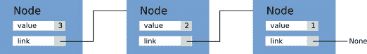

# *第五章*：探索编译器

Python 是一种成熟且广泛使用的语言，人们对其性能的改进非常感兴趣，这可以通过直接将函数和方法编译成机器代码来实现，而不是在解释器中执行指令。我们已经在*第四章*中看到了一个编译器示例，即使用 Cython 进行 C 性能，其中 Python 代码通过类型增强，编译成高效的 C 代码，并且解释器调用被绕过。

在本章中，我们将探讨两个项目，Numba 和 PyPy，它们以略微不同的方式处理编译。**Numba** 是一个设计用于即时编译小函数的库。Numba 不是将 Python 代码转换为 C 代码，而是直接分析和编译 Python 函数到机器代码。**PyPy** 是一个替换解释器，它通过在运行时分析代码并自动优化慢速循环来工作。

这些工具被称为**即时编译器**（**JIT**），因为编译是在运行时而不是在运行代码之前进行的（在其他情况下，编译器被称为**编译时**或**AOT**）。

本章将涵盖的主题列表如下：

+   使用 Numba 入门

+   PyPy 项目

+   其他有趣的项目

总体而言，Numba 和 PyPy 为我们提供了利用 JIT 编译来加速程序的灵活性。本章为我们提供了另一个工具，用于提高 Python 应用程序的速度。

# 技术要求

本章的代码文件可以通过以下链接访问：[`github.com/PacktPublishing/Advanced-Python-Programming-Second-Edition/tree/main/Chapter05`](https://github.com/PacktPublishing/Advanced-Python-Programming-Second-Edition/tree/main/Chapter05).

# 使用 Numba 入门

Numba 是由 NumPy 的原始作者 Travis Oliphant 在 2012 年启动的，作为一个在运行时使用 **低级虚拟机**（**LLVM**）工具链编译单个 Python 函数的库。

LLVM 是一套用于编写编译器的工具。LLVM 是语言无关的，用于编写广泛语言的编译器（一个重要例子是 Clang 编译器）。LLVM 的一个核心方面是中间表示（LLVM IR），这是一种非常低级、平台无关的类似汇编的语言，可以编译为特定目标平台的机器代码。

Numba 通过检查 Python 函数并将它们编译为使用 LLVM 的 IR 来工作。正如我们在上一章中看到的，当我们为变量和函数引入类型时，可以获得速度提升。Numba 实现了聪明的算法来猜测类型（这被称为**类型推断**），并为快速执行编译了类型感知版本的函数。

注意，Numba 是为了提高数值代码的性能而开发的。开发工作通常优先考虑优化那些大量使用 NumPy 数组的应用程序。

重要提示

Numba 正在快速发展，版本之间可能会有实质性的改进，有时甚至会出现向后不兼容的更改。为了跟上进度，请确保您参考每个版本的发布说明。在本章的其余部分，我们将使用 Numba 版本 0.53.1；请确保您安装正确的版本，以避免使用 `pip install numba==0.53.1` 时出现任何错误。本章中的完整代码示例可以在 `Numba.ipynb` 笔记本中找到。

在本节的其余部分，我们将探讨 Numba 的不同方面，例如类型特化和 JIT 类，以及其局限性。首先，我们将讨论如何通过装饰器将 Numba 集成到 Python 程序中。

## 使用 Numba 装饰器

在大多数情况下，我们通过装饰器将 Numba 指向特定的 Python 函数。让我们看看如何做到这一点：

1.  作为第一个示例，我们将实现一个计算数组平方和的函数。函数定义如下：

    ```py
        def sum_sq(a):
            result = 0
            N = len(a)
            for i in range(N):
                result += a[i]
            return result
    ```

1.  要使用 Numba 设置此函数，只需应用 `nb.jit` 装饰器即可：

    ```py
        from numba import nb
        @nb.jit
        def sum_sq(a):
            ...
    ```

当应用 `nb.jit` 装饰器时，它不会做太多。然而，当函数第一次被调用时，Numba 将检测输入参数 `a` 的类型，并编译原始函数的专用、高效版本。

1.  要衡量 Numba 编译器带来的性能提升，我们可以比较原始函数和专用函数的计时。原始的未装饰函数可以通过 `py_func` 属性轻松访问。两个函数的计时如下：

    ```py
        import numpy as np
        x = np.random.rand(10000)
        # Original
        %timeit sum_sq.py_func(x)
        4.3 ms ± 81.6 µs per loop
        # Numba
        %timeit sum_sq(x)
        12.8 µs ± 5.41 µs per loop
    ```

从前面的代码中，你可以看到 Numba 版本（12.8 µs）比 Python 版本（4.3 ms）快一个数量级。

1.  我们还可以比较这种实现与 NumPy 标准运算符的对比：

    ```py
        %timeit (x**2).sum()
        9.44 µs ± 93.7 ns per loop
    ```

在这种情况下，Numba 编译的函数在速度上略慢于 NumPy 向量化操作，尽管这种差异可能会在不同的运行中发生变化。

考虑到我们只需要应用一个简单的装饰器就能在不同数据类型上获得惊人的速度提升，Numba 所做的看起来就像是魔法也就不足为奇了。在接下来的几节中，我们将深入了解 Numba 的工作原理，并评估 Numba 编译器的优缺点。

## 类型特化

如前所述，`nb.jit` 装饰器通过在遇到新的参数类型时编译函数的专用版本来工作。为了更好地理解其工作原理，我们可以检查 `sum_sq` 示例中的装饰函数：

1.  Numba 使用 `signatures` 属性公开专用类型。在 `sum_sq` 定义之后，我们可以通过访问 `sum_sq.signatures` 来检查可用的特化，如下所示：

    ```py
        sum_sq.signatures
        # Output:
        # []
    ```

1.  如果我们用特定的参数调用此函数，例如一个 `float64` 数字数组，我们可以看到 Numba 如何即时编译一个专用版本。如果我们也在 `float32` 数组上应用此函数，我们可以看到如何向 `sum_sq.signatures` 列表中添加一个新条目：

    ```py
        x = np.random.rand(1000).astype('float64')
        sum_sq(x)
        sum_sq.signatures
        # Result:
        # [(array(float64, 1d, C),)]
        x = np.random.rand(1000).astype('float32')
        sum_sq(x)
        sum_sq.signatures
        # Result:
        # [(array(float64, 1d, C),), (array(float32, 1d, 
            C),)]
    ```

可以通过向 `nb.jit` 函数传递签名来显式为某些类型编译函数。

1.  可以将单个签名作为包含我们希望接受的类型的元组传递。Numba 提供了 `nb.types` 模块中可以找到的多种类型，它们也存在于顶级 `nb` 命名空间中。如果我们想指定特定类型的数组，我们可以在类型本身上使用切片运算符 `[:]`。以下示例中，我们演示了如何声明一个只接受 `float64` 数组作为其唯一参数的函数：

    ```py
        @nb.jit((nb.float64[:],))
        def sum_sq(a):
    ```

1.  注意，当我们显式声明签名时，我们将无法使用其他类型，以下示例中已演示。如果我们尝试将数组 `x` 作为 `float32` 传递，Numba 将引发 `TypeError` 异常：

    ```py
        sum_sq(x.astype('float32'))
        # TypeError: No matching definition for argument 
          type(s) 
        array(float32, 1d, C)
    ```

1.  声明签名的另一种方式是通过类型字符串。例如，一个输入为 `float64` 并返回 `float64` 的函数可以使用 `float64(float64)` 字符串声明。可以使用 `[:]` 后缀声明数组类型。将它们组合起来，我们可以为我们的 `sum_sq` 函数声明一个签名，如下所示：

    ```py
        @nb.jit("float64(float64[:])")
        def sum_sq(a):
    ```

1.  您也可以通过传递一个列表来传递多个签名：

    ```py
        @nb.jit(["float64(float64[:])",
                 "float64(float32[:])"])
        def sum_sq(a):
    ```

这些 API 确保了 Numba 有关于函数处理的数据类型的正确信息。

## 对象模式与原生模式

到目前为止，我们已经展示了 Numba 在处理简单函数时的行为。在这种情况下，Numba 工作得非常好，我们在数组和列表上获得了出色的性能。

从 Numba 获得的优化程度取决于 Numba 可以推断变量类型的好坏以及它可以将这些标准 Python 操作转换为快速类型特定版本的好坏。如果发生这种情况，解释器就会被绕过，我们可以获得类似于 Cython 的性能提升。

当 Numba 无法推断变量类型时，它仍然会尝试编译代码，当类型无法确定或某些操作不受支持时，会回退到解释器。在 Numba 中，这被称为 **对象模式**，与称为 **原生模式** 的无解释器场景形成对比。

Numba 提供了一个名为 `inspect_types` 的函数，它有助于了解类型推断的有效性以及哪些操作被优化了。让我们看看如何使用以下函数：

1.  例如，我们可以查看我们的 `sum_sq` 函数推断出的类型：

    ```py
        sum_sq.inspect_types()
    ```

1.  当此函数被调用时，Numba 将打印出为函数的每个专用版本推断出的类型。输出由包含与变量及其类型相关的信息的块组成。例如，我们可以检查 `N = len(a)` 这一行：

    ```py
        # --- LINE 4 --- 
        #  label  0
        #   a = arg(0, name=a)  :: array(float64, 1d, A)
        #   $2load_global.0 = global(len: <built-in  \
              function len>) :: Function (<built-in  \
                function len>)
        #   N = call $2load_global.0(a, func= \
              $2load_global.0, args=[Var(a, \
                <ipython-in put-19-4687c4bff0ac>:4)], \
                  kws=(), vararg=None)  :: (array( \
                    float64, 1d, A),) -> int64
        N = len(a)
    ```

对于每一行，Numba 都会打印变量、函数和中间结果的详细描述。在前面的例子中，你可以在第二行看到`a`参数被正确地识别为`float64`数字的数组。在`LINE 4`，`len`函数的输入和返回类型也被正确地识别（并且可能已优化），它接受一个`float64`数字的数组并返回`int64`。

如果你浏览输出，可以看到所有变量都有一个明确定义的类型。因此，我们可以确信 Numba 能够相当高效地编译代码。这种编译形式被称为**原生模式**。

作为反例，我们可以看到如果我们编写一个包含不支持的操作的函数会发生什么。例如，截至版本 0.53.1，Numba 对字符串操作的支持有限。

1.  我们可以实现一个将一系列字符串连接起来的函数，并按如下方式编译：

    ```py
        @nb.jit
        def concatenate(strings):
            result = ''
            for s in strings:
                result += s
            return result
    ```

1.  现在，我们可以使用字符串列表调用此函数并检查其类型：

    ```py
        concatenate(['hello', 'world'])
        concatenate.signatures
        # Output: concatenate (reflected 
          list(unicode_type)<iv=None>,)
        concatenate.inspect_types()
    ```

1.  Numba 将为`reflected list (unicode type)`类型的函数返回输出。例如，我们可以检查第三行是如何推断出来的。`concatenate.inspect_types()`的输出在此重现：

    ```py

        # --- LINE 3 --- 
        # label 0
        #   strings = arg(0, name=strings)  :: reflected \
         list(unicode_type)<iv=None>
        #   result = const(str, )  :: Literal[str]()
        result = ''
    ```

你可以看到，这次，每个变量或函数都是`unicode`或`str`类型。再次通过计时原始函数和编译函数，我们可以注意到性能有显著提升：

```py
    x = ['hello'] * 1000
    %timeit concatenate.py_func(x)
    81.9 µs ± 1.25 µs per loop
    %timeit concatenate(x)
    1.27 ms ± 23.3 µs per loop
```

这是因为 Numba 编译器无法优化代码，并在函数调用中添加一些额外的开销。

等效装饰器

注意，从版本 0.12 开始，可以使用更简洁的`@nb.njit`装饰器来代替。

## Numba 和 NumPy

Numba 最初是为了轻松提高使用 NumPy 数组的代码的性能而开发的。目前，许多 NumPy 功能都由编译器高效实现。在这里，我们将看到如何结合这两个工具，以实现通用函数的更好性能。

### 使用 Numba 的通用函数

通用函数是 NumPy 中定义的特殊函数，可以根据广播规则在大小和形状不同的数组上操作。Numba 的最佳特性之一是实现快速的`ufunc`实例。

我们已经在*第三章*中看到了一些`ufunc`示例，即使用 NumPy、Pandas 和 Xarray 进行快速数组操作。例如，`np.log`函数是一个`ufunc`实例，因为它可以接受标量和不同大小和形状的数组。此外，接受多个参数的通用函数仍然根据广播规则工作。接受多个参数的通用函数示例包括`np.sum`和`np.difference`。

在标准的 NumPy 中，可以通过实现标量版本并使用`np.vectorize`函数来增强广播功能，从而定义通用函数。例如，让我们看看如何编写**康托尔配对函数**：

1.  配对函数是一个将两个自然数编码到单个自然数中的函数，这样你就可以轻松地在两种表示之间进行转换。康托尔配对函数可以写成以下形式：

    ```py
        import numpy as np
        def cantor(a, b):
            return  int(0.5 * (a + b)*(a + b + 1) + b)
    ```

1.  如前所述，可以使用 `np.vectorized` 装饰器在纯 Python 中创建 `ufunc` 实例：

    ```py
        @np.vectorize
        def cantor(a, b):
            return  int(0.5 * (a + b)*(a + b + 1) + b)
        cantor(np.array([1, 2]), 2)
        # Result:
        # array([ 8, 12])
    ```

除了方便之外，在纯 Python 中定义通用函数并不很有用，因为它需要大量的函数调用，这些调用会受到解释器开销的影响。因此，`ufunc` 的实现通常是在 C 或 Cython 中完成的，但 Numba 以其便利性超越了所有这些方法。

要执行转换，只需要使用等效的装饰器，即 `nb.vectorize`。

1.  我们可以将标准 `np.vectorized` 版本的速度与以下代码中称为 `cantor_py` 的相同函数进行比较，该函数使用标准 NumPy 操作实现：

    ```py
        # Pure Python
        %timeit cantor_py(x1, x2)
        2.4 ms ± 23.7 µs per loop
        # Numba
        %timeit cantor(x1, x2)
        9.1 µs ± 204 ns per loop
        # NumPy
        %timeit (0.5 * (x1 + x2)*(x1 + x2 + 1) + \
          x2).astype(int)
        33.2 µs ± 1.12 µs per loop
    ```

你可以看到 Numba 版本如何以很大的优势击败所有其他选项！Numba 工作得非常好，因为函数简单，且可以进行类型推断。

重要提示

通用函数的另一个优点是，由于它们依赖于单个值，它们的评估也可以并行执行。Numba 提供了一种简单的方法，通过将 `target="cpu"` 或 `target="gpu"` 关键字参数传递给 `nb.vectorize` 装饰器来并行化此类函数。

### 广义通用函数

通用函数的主要局限性之一是它们必须在标量值上定义。`gufunc` 是通用函数的扩展，它将数组作为过程。让我们看看如何将 Numba 应用于这些函数：

1.  一个经典的例子是矩阵乘法。在 NumPy 中，可以使用 `np.matmul` 函数进行矩阵乘法，该函数接受两个二维数组并返回另一个二维数组。`np.matmul` 的用法示例如下：

    ```py
        a = np.random.rand(3, 3)
        b = np.random.rand(3, 3)
        c = np.matmul(a, b)
        c.shape
        # Result:
        # (3, 3)
    ```

如前所述，`ufunc` 实例将操作广播到标量数组上；其自然推广将是广播到数组数组上。例如，如果我们取两个 3x3 矩阵的数组，我们将期望 `np.matmul` 匹配矩阵并取它们的乘积。

1.  在以下示例中，我们取包含 10 个 `(3, 3)` 形状矩阵的两个数组。如果我们应用 `np.matmul`，乘法将按矩阵方式应用，以获得包含 10 个结果的新数组（这些结果再次是 `(3, 3)` 矩阵）：

    ```py
        a = np.random.rand(10, 3, 3)
        b = np.random.rand(10, 3, 3)
        c = np.matmul(a, b)
        c.shape
        # Output
        # (10, 3, 3)
    ```

1.  常规的广播规则将以类似的方式工作。例如，如果我们有一个 `(3, 3)` 矩阵的数组，它将具有 `(10, 3, 3)` 的形状，我们可以使用 `np.matmul` 来计算每个元素与单个 `(3, 3)` 矩阵的矩阵乘法。根据广播规则，我们发现单个矩阵将被重复以获得 `(10, 3, 3)` 的大小：

    ```py
        a = np.random.rand(10, 3, 3)
        b = np.random.rand(3, 3) # Broadcasted to shape  
         (10, 3, 3)
        c = np.matmul(a, b)
        c.shape
        # Result:
        # (10, 3, 3)
    ```

Numba 支持通过 `nb.guvectorize` 装饰器实现高效的通用函数。例如，我们将实现一个计算两个数组之间欧几里得距离的函数，作为一个 `gufunc` 实例。要创建一个 `gufunc` 实例，我们必须定义一个函数，该函数接受输入数组，以及一个输出数组，我们将在这里存储计算结果。

`nb.guvectorize` 装饰器需要两个参数：

+   输入和输出的类型——两个 1D 数组作为输入，一个标量作为输出。

+   所说的布局字符串，它是输入和输出大小的表示；在我们的例子中，我们取两个大小相同的数组（任意表示为 `n`）并输出一个标量。

1.  在下面的示例中，我们可以看到使用 `nb.guvectorize` 装饰器实现 `euclidean` 函数的代码：

    ```py
        @nb.guvectorize(['float64[:], float64[:], \
          float64[:]'], '(n), (n) -> ()')
        def euclidean(a, b, out):
            N = a.shape[0]
            out[0] = 0.0
            for i in range(N):
                out[0] += (a[i] - b[i])**2
    ```

有几个非常重要的要点需要说明。可以预见的是，我们将输入类型 `a` 和 `b` 声明为 `float64[:]`，因为它们是 1D 数组。然而，输出参数呢？它不是应该是一个标量吗？是的，但 *Numba 将标量参数视为大小为 1 的数组*。这就是为什么它被声明为 `float64[:]`。

类似地，布局字符串表示我们有两个大小为 `(n)` 的数组，输出是一个标量，用空括号表示 – `()`。然而，输出数组将被作为大小为 1 的数组传递。此外，请注意，我们从这个函数中不返回任何内容；所有输出都必须写入 `out` 数组。

重要提示

布局字符串中的字母 `n` 完全任意；你可以选择使用 `k` 或其他你喜欢的字母。此外，如果你想组合大小不等的数组，你可以使用布局字符串，例如 `(n, m)`。

1.  我们全新的 `euclidean` 函数可以方便地用于不同形状的数组，如下面的示例所示：

    ```py
        a = np.random.rand(2)
        b = np.random.rand(2)
        c = euclidean(a, b) # Shape: (1,)
        a = np.random.rand(10, 2)
        b = np.random.rand(10, 2)
        c = euclidean(a, b) # Shape: (10,)
        a = np.random.rand(10, 2)
        b = np.random.rand(2)
        c = euclidean(a, b) # Shape: (10,)
    ```

1.  欧几里得距离函数的速度与标准 NumPy 相比如何？在下面的代码中，我们将使用之前定义的 `euclidean` 函数与 NumPy 向量化版本进行基准测试：

    ```py
        a = np.random.rand(10000, 2)
        b = np.random.rand(10000, 2)
        %timeit ((a - b)**2).sum(axis=1)
        153 µs ± 13.2 µs per loop
        %timeit euclidean(a, b)
        47.1 µs ± 3.19 µs per loop
    ```

再次，Numba 版本以很大的优势击败了 NumPy 版本！

## JIT 类

到目前为止，Numba 不支持通用 Python 对象的优化。然而，这种限制对数值代码的影响并不大，因为它们通常只涉及数组和数学运算。

尽管如此，某些数据结构更自然地使用对象来实现；因此，Numba 提供了对定义类以用于和编译为快速原生代码的支持。请记住，这是最新（几乎是实验性）的功能之一，它非常有用，因为它允许我们将 Numba 扩展到支持快速数据结构，这些数据结构不容易用数组实现。

作为示例，我们将展示如何使用*JIT 类*实现一个简单的链表。链表可以通过定义一个包含两个字段（值和列表中的下一个项）的`Node`类来实现。正如您在下面的图中可以看到的，每个**Node**连接到下一个，并持有值，最后一个**Node**包含一个断开的链接，我们将其赋值为**None**：



图 5.1 – 链表的示意图

我们将在以下步骤中探索各种 JIT 相关功能：

1.  在 Python 中，我们可以如下定义`Node`类：

    ```py
        class Node:
            def __init__(self, value):
                self.next = None
                self.value = value
    ```

1.  我们可以通过创建另一个名为`LinkedList`的类来管理`Node`实例的集合。这个类将跟踪列表的头部（在先前的图中，这对应于`Node`实例，并将其链接到当前头部。

在以下代码中，我们开发了`LinkedList`的初始化函数和`LinkedList.push_back`方法，该方法使用前面概述的策略在列表前面插入一个元素：

```py
    class LinkedList:

        def __init__(self):
            self.head = None

        def push_front(self, value):
            if self.head == None:
                self.head = Node(value)
            else:
                # We replace the head
                new_head = Node(value)
                new_head.next = self.head
                self.head = new_head
```

1.  为了调试目的，我们还可以实现一个`LinkedList.show`方法，该方法遍历并打印列表中的每个元素。该方法在下面的代码片段中显示：

    ```py
            def show(self):
                node = self.head
                while node is not None:
                    print(node.value)
                    node = node.next
    ```

1.  在这一点上，我们可以测试我们的`LinkedList`，看看它是否表现正确。我们可以创建一个空列表，添加一些元素，并打印其内容。请注意，由于我们正在将元素推送到列表的前面，最后插入的元素将是第一个被打印的：

    ```py
        lst = LinkedList()
        lst.push_front(1)
        lst.push_front(2)
        lst.push_front(3)
        lst.show()
        # Output:
        # 3
        # 2
        # 1
    ```

1.  最后，我们可以实现一个函数，`sum_list`，它返回链表中元素的总和。我们将使用此方法来测量 Numba 和纯 Python 版本之间的差异：

    ```py
        @nb.jit
        def sum_list(lst):
            result = 0
            node = lst.head
            while node is not None: 
                result += node.value
                node = node.next
            return result
    ```

1.  如果我们测量原始`sum_list`版本和`nb.jit`版本的执行时间，我们会看到没有太大的差异。原因是 Numba 无法推断类的类型：

    ```py
        lst = LinkedList()
        [lst.push_front(i) for i in range(10000)]

        %timeit sum_list(lst)
        1.73 ms ± 159 µs per loop
        %timeit sum_list.py_func(lst)
        1.01 ms ± 175 µs per loop
    ```

1.  我们可以通过使用`nb.jitclass`装饰器编译`Node`和`LinkedList`类来提高`sum_list`的性能。

`nb.jitclass`装饰器接受一个包含属性类型的单个参数。在`Node`类中，属性类型为`int64`的`value`和`Node`的`next`。`nb.jitclass`装饰器还将编译为该类定义的所有方法。在深入代码之前，我们需要注意两点。

首先，必须在定义类之前完成属性声明，但我们如何声明一个尚未定义的类型呢？Numba 提供了`nb.deferred_type()`函数，可用于此目的。

第二，`next`属性可以是`None`或`Node`实例。这被称为可选类型，Numba 提供了一个名为`nb.optional`的实用工具，允许您声明可以（可选地）为`None`的变量。

以下代码示例展示了 `Node` 类。正如你所见，`node_type` 是使用 `nb.deferred_type()` 预声明的。属性被声明为一个包含属性名和类型的对列表（也请注意 `nb.optional` 的使用）。在类声明之后，我们需要声明延迟类型：

```py
    node_type = nb.deferred_type()
    node_spec = [
        ('next', nb.optional(node_type)),
        ('value', nb.int64)
    ]
    @nb.jitclass(node_spec)
    class Node:
        # Body of Node is unchanged
    node_type.define(Node.class_type.instance_type)
```

1.  `LinkedList` 类可以很容易地编译，如下所示。所需做的只是定义 `head` 属性并应用 `nb.jitclass` 装饰器：

    ```py
        ll_spec = [
            ('head', nb.optional(Node.class_type. \
              instance_type))
        ]
        @jitclass(ll_spec)
        class LinkedList:
            # Body of LinkedList is unchanged
    ```

1.  我们现在可以测量在传递一个 JIT `LinkedList` 给 `sum_list` 函数时的执行时间：

    ```py
        lst = LinkedList()
        [lst.push_front(i) for i in range(10000)]
        %timeit sum_list(lst)
        106 µs ± 2.64 µs per loop
        %timeit sum_list.py_func(lst)
        2.42 ms ± 51.8 µs per loop
    ```

有趣的是，当使用编译函数中的 JIT 类时，我们获得了与纯 Python 版本相比的显著性能提升。然而，使用来自原始 `sum_list.py_func` 的 JIT 类实际上会导致性能更差。确保你只在编译函数内部使用 JIT 类！

## Numba 的局限性

有一些情况下，Numba 无法正确推断变量类型。在以下示例中，我们定义了一个函数，它接受一个整数嵌套列表并返回每个子列表中元素的总和。在这种情况下，Numba 将引发警告：

```py
    a = [[0, 1, 2], 
         [3, 4], 
         [5, 6, 7, 8]]
    @nb.jit
    def sum_sublists(a):
        result = []
        for sublist in a:
            result.append(sum(sublist))
        return result
    sum_sublists(a)
    # NumbaWarning: Compilation is falling back to object 
      mode WITH looplifting enabled because Function 
        "sum_sublists" failed type inference...
```

这段代码的问题在于 Numba 无法确定列表类型并失败。解决这个问题的一种方法是通过使用一个样本元素初始化列表，并在最后移除它来帮助编译器确定正确的类型：

```py
    @nb.jit
    def sum_sublists(a):
        result = [0]
        for sublist in a:
            result.append(sum(sublist))
        return result[1:]
```

在 Numba 编译器中尚未实现的其他功能包括函数和类定义、`list`、`set` 和 `dict` 推导式、生成器、`with` 语句以及 `try` 和 `except` 块。然而，请注意，许多这些功能可能会在未来得到支持。

总体来说，我们已经看到了多种使用 Numba 加速我们应用程序的方法，例如类型专业化、NumPy 的通用函数和 JIT 类。我们现在将进入本章的第二个主要主题——PyPy。

# PyPy 项目

PyPy 是一个旨在提高 Python 解释器性能的非常雄心勃勃的项目。PyPy 提高性能的方式是在运行时自动编译代码中的慢速部分。

PyPy 是用一种称为 **RPython** 的特殊语言编写的（而不是 C 语言），它允许开发者快速且可靠地实现高级功能和改进。RPython 意味着 **受限 Python**，因为它实现了一个针对编译器开发的 Python 语言子集。

截至今天，PyPy 版本 7.3.5 支持许多 Python 功能，并且是众多应用（如游戏和网页开发）的一个可能选择。PyPy 使用一种非常聪明的策略来编译代码，称为 **跟踪 JIT 编译**。最初，代码通过解释器调用正常执行。然后 PyPy 开始分析代码并识别最密集的循环。在识别完成后，编译器随后观察（跟踪）操作并可以编译其优化、无解释器版本的代码。

一旦存在代码的优化版本，PyPy 可以比解释器版本更快地运行慢速循环。

这种策略可以与 Numba 所做的进行对比。在 Numba 中，编译的单位是方法和函数，而 PyPy 的重点是慢速循环。总体而言，项目的重点也非常不同，因为 Numba 对数值代码的适用范围有限，并且需要大量的仪器，而 PyPy 的目标是替换 CPython 解释器。

在本节中，我们将演示和基准测试 PyPy 在我们的粒子模拟器应用程序上的使用。我们将首先设置 Python，然后查看在 PyPy 中运行粒子模拟器。

## 设置 PyPy

PyPy 以预编译的二进制形式分发，可以从 [`pypy.org/download.html`](http://pypy.org/download.html) 下载，并且目前支持 Python 2.7 和 3.7 版本。在本章中，我们将演示 3.7 版本的使用。

下载并解压 PyPy 后，您可以在相对于解压存档的 `bin/pypy` 目录中找到解释器。您可以使用以下命令初始化一个新的虚拟环境，其中我们可以使用以下命令安装额外的包：

```py
$ /path/to/bin/pypy -m ensurepip
$ /path/to/bin/pypy -m pip install virtualenv
$ /path/to/bin/virtualenv my-pypy-env
```

要激活环境，我们将使用以下命令：

```py
$ source my-pypy-env/bin/activate
```

在这个阶段，您可以通过输入 `python -V` 来验证二进制 Python 是否链接到 PyPy 可执行文件。在这个阶段，我们可以继续安装我们可能需要的包。请注意，PyPy 对使用 Python C API 的软件（特别是 `numpy` 和 `matplotlib` 等包）的支持可能有限。我们可以按照常规方式安装它们：

```py
(my-pypy-env) $ pip install numpy matplotlib
```

在某些平台上，`numpy` 和 `matplotlib` 的安装可能很棘手。您可以跳过安装步骤，并从我们将运行的脚本中删除这两个包的任何导入。

## 在 PyPy 中运行粒子模拟器

现在我们已经成功设置了 PyPy 安装，我们可以继续运行我们的粒子模拟器。作为第一步，我们将对来自 *第一章* 的粒子模拟器进行计时，即 *基准测试和性能分析*，在标准 Python 解释器上。如果虚拟环境仍然处于活动状态，您可以发出 `deactivate` 命令来退出环境：

```py
(my-pypy-env) $ deactivate
```

在这个阶段，我们可以使用 `timeit` 命令行界面来计时我们的代码：

```py
$ python -m timeit --setup "from simul import benchmark" 
  "benchmark()"
10 loops, best of 3: 886 msec per loop
```

我们可以重新激活环境并运行 PyPy 中的完全相同的代码。在 Ubuntu 上，你可能会有导入 `matplotlib.pyplot` 模块的问题。你可以尝试发出以下 `export` 命令来修复问题，或者从 `simul.py` 中移除 `matplotlib` 的导入：

```py
$ export MPLBACKEND='agg'
```

现在，我们可以使用 PyPy 来计时代码：

```py
$ source my-pypy-env/bin/activate
(my-pypy-env) $ python -m timeit --setup "from simul import 
  benchmark" "benchmark()"
WARNING: timeit is a very unreliable tool. use perf or 
something else for real measurements
10 loops, average of 7: 106 +- 0.383 msec per loop (using 
standard deviation)
```

注意，我们获得了巨大的（超过八倍）速度提升！然而，PyPy 警告我们 `timeit` 模块可能不可靠。我们可以使用 PyPy 建议的 `perf` 模块来确认我们的计时：

```py
(my-pypy-env) $ pip install perf
(my-pypy-env) $ python -m perf timeit --setup 'from simul 
  import benchmark' 'benchmark()'
.......
Median +- std dev: 97.8 ms +- 2.3 ms
```

这为我们提供了更可靠的保证，我们的加速是一致的。总体来看，我们可以看到，通过简单的重新安装 Python，我们能够通过 PyPy 实现显著的加速。

高级 PyPy

虽然这不在本章的范围内，但对于 PyPy 的更高级使用，可以将它与 Pyglet 集成用于游戏开发，以及与 PyLongs 和 Django 集成用于 Web 开发。

总体而言，Numba 和 PyPy 一起为我们提供了许多关于如何利用 JIT 编译器来增强我们的 Python 程序的选项。在下一节中，我们将探讨一些可能感兴趣的其他选项。

# 其他有趣的项目

多年来，许多项目试图通过几种策略来提高 Python 的性能，遗憾的是，许多项目失败了。截至今天，有一些项目幸存下来，并承诺带来更快的 Python。

Numba 和 PyPy 是成熟的项目，多年来一直在稳步改进。功能不断被添加，它们对未来 Python 的前景充满希望：

+   **Nuitka** 是由 Kay Hayen 开发的一个程序，它将 Python 代码编译成 C 语言。在撰写本文时（版本 0.6.15），它提供了与 Python 语言的极端兼容性，并生成高效的代码，与 CPython 相比，性能有所提升。

Nuitka 与 Cython 很不同，因为它专注于与 Python 语言的极端兼容性，并且它不会通过额外的结构扩展语言。

+   **Pyston** 是 Dropbox 开发的一个新的解释器，它为 JIT 编译器提供动力。它与 PyPy 有很大不同，因为它不使用追踪 JIT，而是使用逐方法 JIT（类似于 Numba 所做的）。Pyston，就像 Numba 一样，也是建立在 LLVM 编译器基础设施之上的。

Pyston 正在积极开发中，支持 **Python 2.7** 和 **3.8**。基准测试显示，它的速度比 CPython 快，但比 PyPy 慢；尽管如此，随着新功能的添加和兼容性的提高，它仍然是一个值得关注的有趣项目。

到目前为止，我们已经介绍了四种不同的 JIT 编译器。你可能会在自己的经验中发现，在开发应用程序时，不同的情境和用例可能需要不同的编译器。因此，在考虑使用 JIT 编译器来加速我们的 Python 代码时，探索我们的选项是很重要的。

# 摘要

Numba 是一个在运行时编译 Python 函数快速、专用版本的工具。在本章中，我们学习了如何编译、检查和分析由 Numba 编译的函数。我们还学习了如何实现快速 NumPy 通用函数，这些函数在广泛的数值应用中非常有用。最后，我们使用 `nb.jitclass` 装饰器实现了更复杂的数据结构。总的来说，Numba 是为了加速在科学计算中常见的数值循环而构建的。正如我们所见，Numba 与流行的 NumPy 库无缝协作。

工具如 PyPy 允许我们在不改变 Python 程序的情况下运行，从而获得显著的速度提升。我们展示了如何设置 PyPy，并评估了我们在粒子模拟器应用程序上的性能改进。我们还看到，与 Numba 不同，PyPy 不是在函数级别上操作，而是试图为整个 Python 程序实现一个更高效的解释器。

我们还简要地描述了当前 Python 编译器的生态系统，并将它们相互比较。这些讨论将使你更有信心去探索和使用不同的即时编译器，并选择最适合你应用的编译器。在下一章中，我们将看到一个针对机器学习操作和任务进行优化的即时编译器的专用版本。

# 问题

1.  什么是即时编译器以及为什么它们很有用？

1.  Numba 如何确定 Python 程序中变量的类型？当这些变量不是 Numba 工作得很好的类型时会发生什么？

1.  PyPy 的即时编译跟踪的高级思想是什么？

# 进一步阅读

+   更多关于即时编译器：[`www.freecodecamp.org/news/just-in-time-compilation-explained/`](https://www.freecodecamp.org/news/just-in-time-compilation-explained/)
