# 第六章：*第六章*：机器学习的自动微分和加速线性代数

随着最近数据和数据生成系统的爆炸式增长，机器学习在研究和工业领域都成为一个令人兴奋的领域。然而，实现机器学习模型可能是一项艰巨的任务。具体来说，机器学习中的常见任务，如推导损失函数及其导数、使用梯度下降找到模型参数的最佳组合，或使用核方法处理非线性数据，都需要巧妙的实现来使预测模型高效。

在本章中，我们将讨论 JAX 库，这是 Python 中首屈一指的高性能机器学习工具。我们将探索其一些最强大的功能，例如自动微分、即时编译和自动向量化。这些功能简化了之前提到的机器学习核心任务，使得训练预测模型尽可能简单和易于访问。所有这些讨论都将围绕一个二元分类问题的实际案例展开。

到本章结束时，你将能够使用 JAX 为你的机器学习应用提供动力，并探索它提供的更高级功能。

本章涵盖的主题列表如下：

+   机器学习速成课程

+   启动 JAX

+   用于损失最小化的自动微分

+   即时编译以提高效率

+   用于高效核的自动向量化

# 机器学习速成课程

要充分欣赏 JAX 提供的功能，让我们首先谈谈训练机器学习模型的典型工作流程的主要组成部分。如果你已经熟悉基础知识，请随意跳到下一节，我们将开始讨论 JAX。

在机器学习中，我们旨在通过考虑数据点的可观察特征来解决预测未知目标值的问题。目标是设计一个预测模型，该模型处理可观察特征并输出目标值可能是什么的估计。例如，图像识别模型分析图像的像素值以预测图像描绘的对象，而处理天气数据的模型可以通过考虑温度、风速和湿度来预测明天下雨的概率。

通常，机器学习模型可以被视为一个通用数学函数，它接受可观察特征（通常称为 *X*）并产生关于目标值 *Y* 的预测。模型隐含地假设特征（输入）和目标值（输出）之间存在某种数学关系。机器学习模型反过来通过研究大量示例来学习这种关系。因此，数据在任何机器学习工作流程中都是至关重要的。

**数据集**是一组**标记**的示例——数据点，其可观察的特征，*X*，和目标值，*Y*，都是可用的。模型将通过这些标记点来尝试揭示*X*和*Y*之间的关系；这被称为**训练**模型。训练完成后，学习到的模型可以接受**未标记**数据点的特征，这些数据点的目标值对我们来说是未知的，并输出其预测。这些预测是模型认为未标记数据点的目标值，基于它们具有的可观察特征。

在本节中，我们将讨论如何为许多常见的机器学习模型提供训练。具体来说，它包括三个核心组件——模型的参数、模型的损失函数以及该损失函数的最小化——我们将逐一考虑。

我们将通过一个具体的示例问题来具体化我们的讨论。假设我们在二维空间（这仅仅是 *xy* 平面）中有一些点，每个点属于正类或负类。以下是一个示例，其中黄色点是正类，紫色点是负类：

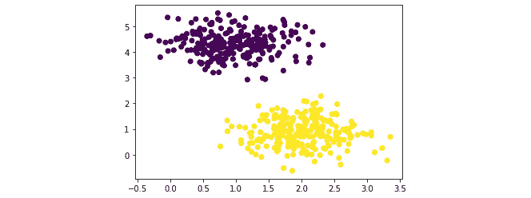

图 6.1 – 一个二元分类问题的示例

在这种情况下，可观察的特征是点的 *x* 和 *y* 坐标，因此 *X* 由两个特征组成，而目标值 *y* 是它们的类别成员，是正类还是负类。我们的目标是使用一组标记数据训练机器学习模型，并对未标记的点进行预测。例如，经过训练后，我们的模型应该能够预测点 (2, 1) 是正类还是负类。

对于我们来说，正类和负类之间的分离是非常清晰的，其中右下角对应正类，左上角对应负类。具体来说，点 (2, 1) 很可能是一个正类（一个黄色点）。但是，机器学习模型是如何自动做到这一点，而不需要人类硬编码这样的分类规则呢？我们将在下一节中看到这一点。

## 模型参数

一个预测模型从试图解释可观察特征和目标值之间关系的公式开始。我们将考虑线性模型类（机器学习中最常见和最简单类型之一），它假设目标值是特征的线性组合（因此得名模型）

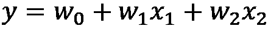

其中  和 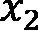 是点的 *x* 和 *y* 坐标，而数字 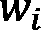 是模型的**参数**。

我们不知道这些参数的值，这些参数的每个值组合定义了 *x* 和 *y* 之间独特的关系，一个独特的假设。在训练阶段，我们需要识别这些参数的值，以便上述关系适合我们能够访问的标记数据。

在我们的分类模型中，我们将目标值 *y* 限制为正数（+1）或负数（-1），但根据前面讨论的线性关系定义的 *y* 可以取任何实数值。因此，通常通过简单地取值的符号来将实数值的 *y* 转换为 +1 或 -1。换句话说，我们实际使用的模型是：

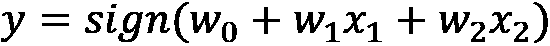

进行预测是常见机器学习任务的核心。给定特征 *X* 和目标值 *y* 之间的线性关系，预测具有特征 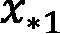 和 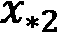 的新数据点的目标值 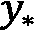 简单地涉及应用我们已有的数学模型：

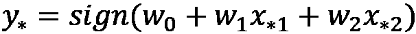

我们谜题中唯一缺失的部分是如何确定参数 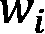 的正确值。同样，我们需要确定模型参数的值以适应我们的训练数据。但我们如何精确量化特定参数值组合如何解释给定的标记数据集？这个问题引出了机器学习工作流程的下一个组件：模型的损失函数。

## 损失函数

模型的损失函数量化了关于模型的一个我们希望最小化的属性。在一般情况下，这可能是以某种方式训练模型时产生的成本。在我们的上下文中，损失函数是模型在训练数据集上造成的预测误差量。这个量近似于在未来的未见数据上犯的错误，这是我们真正关心的。（在不同的设置中，你可能会遇到**效用函数**，这通常只是相应损失函数的负值，这些函数是要最大化的。）损失越低，我们的模型可能表现越好（排除技术问题，如过拟合）。

在我们的分类问题中，有许多方法可以设计合适的损失函数。例如，0-1 损失简单地计算模型做出错误预测的实例数量，而二元交叉熵损失是一个更受欢迎的选择，因为该函数比 0-1 更平滑，因此更容易优化（我们稍后会回到这一点）。

对于我们的例子，我们将使用支持向量损失函数的一个版本，其形式化如下：


其中 *i* 表示训练集中独特示例的索引，范围从 1 到 *n*，即训练集的大小。![img/Formula_6.12_B17499.png] 是第 *i* 个示例的真实标签，而 ![img/Formula_6.13_B17499.png] 是学习模型预测的相应标签。

这个非负函数计算所有训练示例中 ![img/Formula_6.14_B17499.png] 项的平均值。很容易看出，对于每个示例 *i*，如果 ![img/Formula_6.15_B17499.png] 和 ![img/Formula_6.16_B17499.png] 相似，最大项将评估为小值。另一方面，如果 ![img/Formula_6.17_B17499.png] 和 ![img/Formula_6.18_B17499.png] 具有相反的符号（换句话说，如果模型错误地分类了示例），最大项将增加。因此，这个函数适合量化我们的预测模型对于给定的参数组合所犯的错误。

给定这个损失函数，训练我们的线性模型的问题就转化为寻找最优参数 ![img/Formula_6.19_B17499.png]，使其最小化损失（最好是 0）。当然，![img/Formula_6.20_B17499.png] 的搜索空间非常大——每个参数可以是任何实数值——因此尝试所有可能的![img/Formula_6.21_B17499.png] 值组合是不现实的。这导致我们进入最后一个小节：智能地最小化损失函数。

## 损失最小化

不深入技术细节，你可以通过利用其 *导数* 信息在数学上找到给定函数的最小值。函数的导数表示函数值相对于其输入变化率的改变率。通过分析导数的值，或者更常见地，在机器学习中称为 *梯度*，我们可以算法性地识别出目标函数可能具有低值的输入位置。

然而，只有当函数本身是 *平滑的* 时，导数才有助于我们找到函数的极小值。平滑性是一个数学属性，它表明如果函数的输入值只发生微小变化，函数值（输出）不应该变化太多。非平滑函数的显著例子包括阶梯函数和绝对值函数，但你所遇到的函数很可能是平滑的。平滑性属性解释了我们为什么偏好二元交叉熵损失而不是 0-1 损失，后者是一个非平滑函数。我们将使用的支持向量式损失函数也是平滑的。

总体而言，如果我们能够访问一个光滑函数的导数，找到它的最小值将会很容易。但我们是如何做到这一点的呢？已经研究了许多基于梯度的优化程序，但我们将考虑最常见的方法：*梯度下降*。高级思想是在给定位置检查损失函数的梯度，并朝着与该梯度相反的方向移动（换句话说，沿着梯度下降，因此得名），如下所示：


图 6.2 – 梯度下降的示意图

由于梯度的定义，相对于给定点 *x*，在梯度方向相反的点 *x'* 上评估的函数值 *f(x')* 低于 *f(x)*。因此，通过使用损失函数的梯度作为指南，并逐步朝相反方向移动，我们可以理论上到达函数的最小值。一个重要的考虑因素是，如果我们以很大的幅度移动评估，即使在正确的方向上，我们可能会错过真正的最小值。为了解决这个问题，我们通常将步长调整为损失梯度的分数之一。

具体来说，将 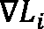 表示为损失函数 *L* 对第 *i*-个参数  的梯度，因此梯度下降的 *更新规则* 是调整 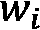 的值，如下所示：

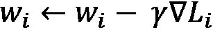

其中 *γ* 是一个小数（远小于 1），充当步长。通过反复应用此更新规则，我们可以逐步调整模型参数的值，以降低模型的损失，从而提高其预测性能。

有了这些，我们已经概述了典型机器学习工作流程的主要组件。总结一下，我们与一个预测模型（在我们的例子中，是一个线性模型）一起工作，该模型具有一定数量的调整参数，旨在解释我们所拥有的数据。每个参数组合导致一个不同的假设，其有效性由损失函数量化。最后，通过对损失函数求导和使用梯度下降，我们有一种方法可以逐步更新模型的参数，以实现更好的性能。

现在，我们将开始本章的主要内容：JAX 库。

# 启动 JAX

如前所述，JAX 是不同工具的组合，用于开发加速、高性能计算，重点在于机器学习应用。记得从上一章中，NumPy 库为数值运算提供了优化计算，例如寻找最小/最大值或沿轴求和的平均值。我们可以将 JAX 视为机器学习的 NumPy 等价物，其中机器学习的常见任务可以在高度优化的代码中完成。这些，正如我们将看到的，包括自动微分、使用即时编译器的加速线性代数以及代码的有效向量化和平行化，等等。

JAX 通过所谓的**函数转换**提供这些功能。在最简单的意义上，JAX 中的函数转换将一个函数（通常是自行构建的）转换为优化版本，其中提供了不同的功能。这通过一个简单的 API 实现，我们将在后面看到。

但首先，我们将讨论在本地系统上安装库。

## 安装 JAX

可以简单地使用常规 Python 包管理器`pip`安装 JAX 的基础版本：

```py
pip install --upgrade pip
pip install --upgrade jax jaxlib
```

这些命令将安装一个仅 CPU 版本的 JAX，如果你计划在本地系统（如笔记本电脑）上尝试它，这是推荐的。JAX 的完整版本，支持 NVIDIA GPU（深度学习模型常用），也可以通过更复杂的流程安装，具体流程可在其文档中找到：[`jax.readthedocs.io/en/latest/developer.html`](https://jax.readthedocs.io/en/latest/developer.html)。

此外，请注意，JAX 只能在 Linux（Ubuntu 16.04 或更高版本）或 macOS（10.12 或更高版本）上安装。要在 Windows 机器上运行 JAX，你需要 Windows Subsystem for Linux，它允许你在 Windows 上运行 GNU/Linux 环境。如果你通常在集群上运行机器学习作业，你应该与系统管理员联系，了解安装 JAX 的正确方法。

如果你是一名独立的机器学习从业者，你可能觉得安装 JAX 完整版本的技术要求令人畏惧。幸运的是，有一个免费的平台我们可以使用来查看 JAX 的实际应用：*Google Colab*。

## 使用 Google Colab

通常，Google Colab 是一个免费的 Jupyter 笔记本平台，它集成了高性能后端和机器学习工具，你可以轻松地在这个平台上构建机器学习模型的原型。

使用 Google Colab 有两个主要优势。首先，该平台预装了大多数机器学习相关的库（例如，TensorFlow、PyTorch 和 scikit-learn）和工具，包括免费的**GPU**（**图形处理单元**）和**TPU**（**张量处理单元**）。这使得独立的机器学习研究人员和学生可以在不花钱的情况下尝试昂贵硬件的机器学习流程。其次，Google Colab 允许不同用户之间的协作编辑，在构建模型时可以简化团队工作。

要利用这个平台，你只需要在[`colab.research.google.com/`](https://colab.research.google.com/)登录时有一个 Google/Gmail 账户。使用这个平台通常简单直观，但你也可以参考本章末尾包含的几篇阅读材料，以获取更多有关 Google Colab 的内容。请注意，本章余下的代码是在 Google Colab 上运行的，这意味着你可以访问**[INSERT LINK]**并直接运行代码，以跟随我们后面的讨论。

有了这些，我们就准备好开始讨论 JAX 提供的功能了。

# 损失最小化的自动微分

回顾我们之前的讨论，为了将预测模型拟合到训练数据集，我们首先分析一个合适的损失函数，推导出这个损失函数的梯度，然后调整模型参数以与梯度的反方向一致，以达到更低的损失。这个步骤只有在我们可以访问损失函数的导数时才可行。

早期的机器学习模型能够做到这一点，是因为研究人员通过微积分手动推导出常见损失函数的导数，然后将这些导数硬编码到训练算法中，以便最小化损失函数。不幸的是，有时求函数的导数可能很困难，特别是如果使用的损失函数表现不佳。在过去，你可能不得不选择一个不同、更数学上方便的损失函数，即使新函数不太合适，也要让模型运行，这可能会牺牲一些原始函数的表达能力。

计算代数领域的近期进展导致了一种称为**自动微分**的技术。正如其名所示，这项技术允许自动过程对给定函数（以计算机代码表示）进行数值求导，而不依赖于人类提供该导数的封闭形式解。在最高层次上，自动微分追踪考虑的函数的计算顺序以及涉及的算术运算（例如，加法、乘法和指数运算），然后以自动方式应用链式法则来获得导数的数值。通过智能地利用函数自身计算中的信息，自动微分可以高效且准确地计算其导数。

回想一下，在我们的运行玩具问题中，我们希望最小化损失函数：


其中 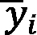 是我们对第*i*个数据点的线性预测模型的预测。当然，在实现梯度下降时，我们可以推导出这个损失函数的梯度（这需要我们复习微积分！），但有了自动微分，我们就不必这样做。

这种技术在深度学习工具如 TensorFlow 和 PyTorch 中得到广泛应用，在这些工具中，计算损失函数的梯度是一个核心任务。我们可以使用这些库的自动微分 API 来计算损失梯度，但通过使用 JAX 的 API，我们将能够利用我们稍后将会得到的其他强大功能。现在，让我们使用 JAX 的自动微分工具构建我们的模型和梯度下降算法。

## 制作数据集

首先，我们需要生成*图 6.1*中所示的小型数据集。为此，我们将利用 scikit-learn 模块中的`make_blobs`函数。如果你在本地运行代码，你需要使用`pip`命令安装 scikit-learn：

```py
pip install sklearn
```

否则，如果你使用 Google Colab，scikit-learn 以及本章代码中使用的所有其他外部库已经预先安装，所以你只需要将其导入到你的程序中。

`make_blobs`函数，正如其名所示，生成数据点的云团（换句话说，聚类）。其 API 简单易读：

```py
X, y = make_blobs(
    n_samples=500, n_features=2, centers=2, \
      cluster_std=0.5, random_state=0
)
```

在这里，我们创建了一个二维（由 `n_features` 指定）的包含 500 个点的数据集（由 `n_samples` 指定）。这些数据点应该属于两个类别中的一个（由 `centers` 指定）。`cluster_std` 参数控制属于同一类别的点如何紧密地聚集在一起；在这种情况下，我们将它设置为 `0.5`。到这一点，我们有一个包含 500 个点的数据集，每个点都有两个特征，属于正类或负类。变量 `X` 是一个包含特征的 NumPy 数组，形状为 `(500, 2)`，而 `y` 是一个长度为 500 的一维二进制数组，包含标签。

默认情况下，负类在 `y` 中的标签为 `0`。作为一个数据预处理步骤，我们将使用 NumPy 方便的条件索引语法将 `y` 中所有的 `0` 实例转换为 `-1`：

```py
y[y == 0] = -1
```

我们还在 `X` 中添加了一个第三特征列，该列只包含 `1` 的实例。这个列是一个常数，对应于我们模型中的自由系数 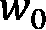：

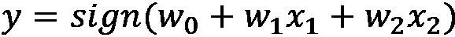

另一方面，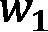 和 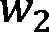 是 `X` 中第一和第二个特征的系数。

我们现在已经生成了我们的玩具示例。如果你现在调用 Matplotlib 在 `X` 上生成散点图，例如，通过以下代码：

```py
plt.scatter(X[:, 0], X[:, 1], c=y);
```

你将获得与 *图 6.1* 中相同的图表。有了这个，我们就准备好开始构建我们的预测模型了。

## 构建线性模型

记住机器学习管道的两个核心组件：模型和损失函数。要构建我们的模型，我们首先需要编写与这些组件相对应的函数。首先，模型以 `predict` 函数的形式出现：

```py
import jax.numpy as jnp
def predict(w, X):
    return jnp.dot(X, w)
```

这个函数接收模型的参数 `w`，隐式地假设它是以 NumPy 数组的格式存在的，以及训练数据点的特征 `X`，一个 NumPy 二维矩阵。在这里，我们使用 JAX 的 NumPy 模块中的 `dot` 函数，在代码中别名为 `jnp`，来计算 `w` 和 `X` 的点积。如果你不熟悉点积，它是一种代数运算，是线性组合的简写，对应于我们的模型。总的来说，这个函数为我们的模型编码了这样的预测：关于数据点标签的预测是参数和数据特征的点积（符号）。

虽然这不是我们讨论的重点，但在此处需要注意的是，JAX 的`numpy`模块提供了与 NumPy 几乎相同的数学运算 API。`dot`函数只是一个例子；其他可以在他们的文档网站上找到：[`jax.readthedocs.io/en/latest/jax.numpy.html`](https://jax.readthedocs.io/en/latest/jax.numpy.html)。这意味着如果你在 NumPy 中积累了大量的代码，但想将其转换为 JAX，在大多数情况下，只需将`import numpy as np`替换为`import jax.numpy as np`即可；不需要复杂的、费力的转换。

因此，我们已经实现了我们模型的预测函数。我们的下一个任务是编写损失函数

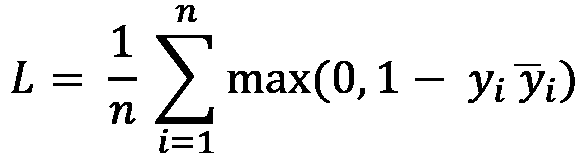

损失函数可以用以下代码编写：

```py
def loss(w):
    preds = predict(w, X)
    return jnp.mean(jnp.clip(1 - jnp.multiply(y, preds), \
      a_min=0))
```

让我们花一点时间来分解这段代码。这个`loss`函数是`w`的函数，因为，如果`w`发生变化，损失也会相应地变化。

现在，让我们关注上一公式中求和符号内的项：它是 0 和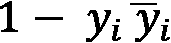之间的最大值，其中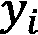是数据点的真实标签，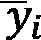是模型做出的相应预测。因此，我们通过`jnp.clip(1 - jnp.multiply(y, preds), a_min=0)`计算这个量，在此之前我们调用`predict`函数以获得存储在`preds`变量中的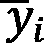的值。

如果你熟悉 NumPy 的等效函数，你可能会注意到我们正在使用的这些函数，`clip`和`multiply`，在 NumPy 中具有相同的接口；再次强调，JAX 试图使 NumPy 用户的使用尽可能无缝。最后，我们使用`mean`函数计算所有训练示例中这个最大项的平均值。

信不信由你，我们已经成功实现了我们的线性模型！给定一个`w`的具体值，我们将能够使用`predict`函数预测数据点的标签，并使用`loss`函数计算我们的损失。在这个阶段，我们可以尝试不同的`w`值；作为一个常见的做法，我们将`w`初始化为随机数：

```py
np.random.seed(0)
w = np.random.randn(3)
```

我们训练过程的最后一步是找到使损失最小化的`w`的最佳值，我们将在下一部分实现它。

## 带有自动微分的梯度下降

记住，在梯度下降算法中，我们计算当前`w`值的损失函数的梯度，然后通过减去梯度的一部分（实际上是在梯度的反方向移动）来调整`w`。

在过去，我们需要以闭式形式推导梯度并在我们的代码中实现它。有了自动微分，我们只需要以下内容：

```py
from jax import grad
loss_grad = grad(loss)
```

`loss`是我们在上一个子节中实现的函数。这里我们使用 JAX 的`grad`函数来获取`loss`的*梯度函数*。这意味着如果我们调用`loss_grad`，即梯度函数，在给定的`w`值上使用`loss_grad(w)`，我们将获得在`w`处的`loss`函数的梯度，就像`loss(w)`给我们提供了在`w`处的损失本身一样。

这是一个所谓的*函数转换*，它接受一个 Python 中的函数（在我们的例子中是`loss`）并返回一个相关的函数（`loss_grad`），然后可以对该函数的实际输入进行调用以计算我们感兴趣的数量。函数转换是一个强大的接口，使得处理函数逻辑变得容易，并且是使用 JAX 的主要方式。我们将看到本章中讨论的 JAX 提供的所有其他功能都是函数转换。

在手头有了我们的梯度函数后，我们现在使用简单的`for`循环实现梯度下降：

```py
n_iters = 200
lr = 0.01
loss_grad = grad(loss)
for i in range(n_iters):
    grads = loss_grad(w)
    w = w - lr * grads
    tmp_loss = loss(w)
    if tmp_loss == 0:
        break
```

如果你正在查看 Google Colab 笔记本，你可能会看到一些其他用于显示实时进度条的记账代码，但前面的代码是梯度下降的主要逻辑。

在`for`循环的每次迭代中，我们计算在当前`w`值处的损失函数的梯度，然后使用该梯度来调整`w`的值：`w = w - lr * grads`。我们将朝着梯度的反方向迈出多大的步子由`lr`变量控制，设置为`0.01`。这个变量在机器学习的语言中通常被称为**学习率**。

调整后，我们将检查这个新的`w`值是否实际上在 0 处最小化了我们的损失，如果是这样，我们就简单地使用`break`语句退出`for`循环。如果不是，我们将重复此过程，直到满足某个终止条件；在我们的例子中，我们只是说我们最多只做 200 次（由`n_iters`变量指定）。

当我们运行代码时，我们会观察到随着`for`循环的进行，每次调整后损失的值都会减少。循环结束时，我们的损失减少到一个很小的数字：大约 0.013。使用 Matplotlib，我们可以快速绘制出这种减少的进程，使用`plt.plot(losses)`，可以得到以下图表：

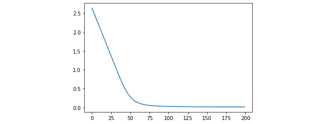

图 6.3 – 线性模型损失减少

我们看到，在开始时对`w`的值进行随机猜测，我们得到了大约 2.5 的损失，但使用梯度下降，我们已经将其减少到几乎为零。在这个时候，我们可以有信心，经过梯度下降后我们目前拥有的`w`的值很好地拟合了我们的数据。

这标志着我们的线性预测模型训练的结束。在训练模型之后的一个常规任务是检查模型在整个特征空间中做出的预测。这个过程有助于确保我们的模型正在适当地学习。在我们这样的低维空间中工作，我们甚至可以可视化这个空间。

具体来说，我们的决策边界是一条直线，(希望)将我们想要进行分类的两个类别分开：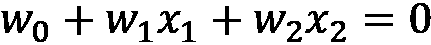，其中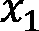和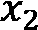是我们二维空间内点的坐标。因此，我们可以通过首先为*x*坐标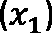生成一个精细网格数组来绘制这条线：

```py
xs = np.linspace(X[:, 0].min(), X[:, 0].max(), 100)
```

我们可以使用之前得到的直线方程推导出*y*坐标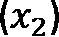：

```py
plt.plot(xs, (xs * w[0] + w[2]) / - w[1])
```

将这条线与对应于我们训练数据的散点一起绘制，我们得到以下图形：

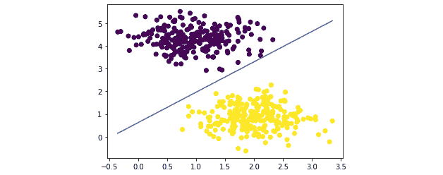

图 6.4 – 学习到的模型的决策边界

我们可以看到，我们的决策边界很好地将我们拥有的两个类别分开。现在，当我们想要预测一个未见过的点属于哪个类别时，我们只需将其特征通过我们的`predict`函数，并查看输出的符号。

就这么简单！当然，当我们处理更复杂的模型时，需要考虑更多更专业的问题。然而，高级过程保持不变：设计模型及其损失函数，然后使用梯度下降（或某些其他损失最小化策略）来找到参数的最优组合。我们已经看到，通过使用 JAX 的自动微分模块，我们能够以最少的代码轻松完成这项工作，同时避免了通常与推导损失函数梯度相关的复杂数学。

话虽如此，JAX 提供的优势并不止于此。在我们下一节中，我们将看到如何通过使用 JAX 的内部**即时编译器**（**JIT**）来使我们的当前代码更加高效。

# 实时编译以提高效率

正如我们在上一章中学到的，即时编译允许预期运行多次的代码以更高效的方式执行。这个过程在机器学习中特别有用，因为在损失最小化阶段，模型的损失或损失梯度需要被多次计算。因此，我们期望通过利用 JIT 编译器，我们可以使我们的机器学习模型训练更快。

你可能会想，为了做到这一点，我们需要将我们在上一章中考虑的 JIT 编译器之一钩入 JAX。然而，JAX 自带了自己的 JIT 编译器，它需要最少的代码就可以集成到现有的程序中。我们将通过修改我们在上一节中制作的训练循环来展示如何使用它。

首先，我们重置我们模型的参数：

```py
np.random.seed(0)
w = np.random.randn(3)
```

现在，我们将 JIT 编译器集成到我们的程序中的方法是将它指向损失函数的梯度。记住，我们可以通过将 JIT 编译应用于我们预期会多次执行的一段代码来获得 JIT 编译的好处，这正是我们提到的损失梯度的情形。回想一下，我们是在上一节中通过使用`grad`函数转换来推导出这个梯度的：

```py
loss_grad = grad(loss)
```

要获得此函数的 JIT 编译版本，我们可以遵循一个非常类似的过程，在这个过程中，我们使用`jit`转换这个损失梯度函数：

```py
from jax import jit
loss_grad = jit(grad(loss))
```

惊人的是，我们只需要做这么多。现在，如果我们运行目前相同的训练循环，只更改这一行，我们将获得相同的结果，包括我们之前绘制的学习曲线和决策边界。

然而，当我们检查训练循环的运行时间时，我们会注意到训练循环现在要高效得多：在我们的 Google Colab 笔记本中，速度从大约 77 次迭代每秒提高到 175 次迭代每秒！请注意，尽管这些数字可能在不同代码运行之间有所不同，但改进应该是明显的。虽然这种加速对我们和我们的简单线性模型可能没有意义，但它将证明对于更重的模型，如具有数百万到数十亿参数的神经网络，非常有用，这些模型需要数周甚至数月的时间来训练。

此外，这种加速是通过更改单行代码并使用函数转换`jit`实现的。这意味着无论你正在使用的函数有多复杂，如果它们与 JAX 兼容，你只需通过`jit`传递它们，就可以享受 JIT 编译的好处。

到目前为止，我们已经探索了两种强大的技术来加速我们的机器学习流程：自动微分和 JIT 编译。在下一节中，我们将探讨 JAX 的最后一个有价值的特性——自动向量化。

# 自动向量化以高效内核

你可能还记得，在我们的 NumPy 讨论中，这个库在将数值运算应用于数组中的所有元素或特定轴上的元素方面非常高效。通过利用相同的操作要应用于多个元素的事实，该库优化了执行该操作的底层代码，使得计算比通过迭代循环做同样的事情要高效得多。这个过程被称为**向量化**。

当与机器学习模型一起工作时，我们希望通过将特定函数向量化来通过一个过程，而不是通过循环数组或矩阵来提高性能。向量化通常不容易实现，可能需要巧妙的方法来重写我们想要向量化函数的形式，使其易于向量化。

JAX 通过提供一种函数转换来解决这个担忧，该转换可以自动向量化给定的函数，即使该函数仅设计为接受单值变量（这意味着传统上，需要一个迭代循环）。在本节中，我们将通过核化我们的预测模型的过程来了解如何使用这个特性。首先，我们需要简要讨论什么是核以及它们在机器学习中的位置。

## 非线性不可分的数据

记住，我们目前拥有的预测模型假设我们想要预测的目标可以表示为数据特征的线性组合；因此，该模型是线性的。在实践中，这个假设相当限制性，因为数据可以呈现高度非线性且仍然有意义的模式。

例如，在这里我们使用来自 scikit-learn 相同`datasets`模块的`make_moons`函数来生成另一个玩具数据集并可视化它，再次使用散点图：

```py
from sklearn.datasets import make_moons
X, y = make_moons(n_samples=200, noise=0.1, random_state=0)
X = np.hstack((X, np.ones_like(y).reshape(-1, 1)))
y[y == 0] = -1
plt.scatter(X[:, 0], X[:, 1], c=y);
```

这将生成以下图表：

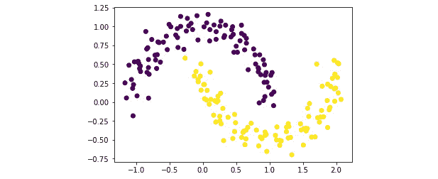

图 6.5 – 一个线性不可分的数据集

这又是一个二元分类问题，我们需要区分黄色和深蓝色的点。正如你所见，这些数据点不是线性可分的，因为与我们的前一个数据集不同，这里不存在完美分离两个类别的直线。实际上，如果我们尝试将线性模型拟合到这些数据上，我们会得到一个相对较高的损失（大约 0.7）和一个显然不合适的决策边界，如图所示：

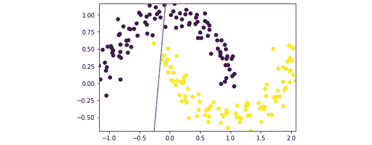

图 6.6 – 在非线性数据上拟合线性模型

那么，我们如何修改我们当前的模型，使其能够处理非线性数据呢？在这些情况下，一个典型的解决方案是机器学习中的核方法，我们将在下一节中简要讨论。

## 机器学习中的核方法

不深入技术细节，核方法（有时被称为**核技巧**）指的是将低维数据集（如我们的数据集）转换到更高维度的过程，希望在高维中，存在能够分离数据的线性超平面。

要将数据点提升到更高维度，需要从原始数据中包含的特征创建额外的特征。在我们的运行示例中，我们给出了数据点的 *x* 和 *y* 坐标；因此，我们的数据是二维的。在这种情况下，一种常见的创建更多特征的方法是计算这些坐标的多项式，直到一个度数 *d*。例如，对于特征 *x* 和 *y*，直到二次的多项式包括 *xy* 和 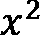。*d* 越大，我们从这些新创建的特征中获得的表现力就越高，但我们也需要承担更高的计算成本。

注意到这些多项式特征是非线性的，这促使我们使用它们来帮助我们找到一个可以分离非线性数据的模型。有了这些新的非线性特征，我们将在这个我们刚刚构建的更大、更具表达力的数据集上拟合我们的预测模型。请注意，虽然预测模型的形式与线性参数 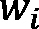 相同，但模型学习的数据特征是非线性的，因此得到的决策边界也将是非线性的。

我之前提到，我们希望合成的特征越有表现力，我们将承担的计算成本就越高。在这里，核是操纵数据点的一种方法，这样我们就可以在不显式计算高维特征的情况下以更高维度与之交互。本质上，核只是一个函数，它接受一对数据点并返回特征向量变换的内积。这只是为了说明它返回一个矩阵，该矩阵表示更高维度的两个数据点。

在本章中，我们将使用机器学习中最受欢迎的核之一：径向基函数（RBF）核，其定义如下：

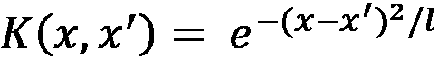

其中 *x* 和 *x'* 是两个数据点的低维特征向量，*l* 通常被称为长度尺度，是核的可调参数。使用 RBF 核有许多好处，我们在这里不会详细讨论，但总的来说，RBF 可以被视为一个无限维核，这意味着它将为我们计算的特征提供高水平的表达能力。

使用此核方法的新模型，经过对我们先前线性模型的修改，现在对每个特征向量 *x* 和标签 *y* 的每一对都做出以下假设：

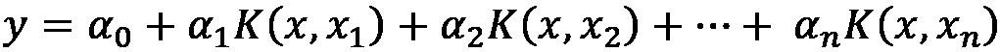

其中 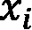 是训练集中的第 *i* 个数据点，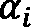 是要优化的模型参数。虽然这个假设是为了与之前我们提到的线性假设进行对比：

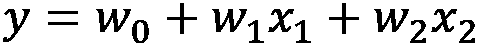

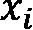现在指的是数据点的整个特征向量，而不是数据点的*i*-th 特征。此外，我们现在有*n*个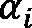项，而不是之前的 2（或*d*）个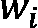项。

我们看到核在这里的作用是通过计算其特征与训练集中每个数据点的特征的点积来转换*x*的特征。核的输出随后被用作新的特征，乘以模型参数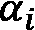，其值将在训练过程中作为一部分进行优化。

现在我们来实现代码中的这个核函数：

```py
lengthscale = 0.3
def rbf_kernel(x, z):
    return jnp.exp(- jnp.linalg.norm(x - z) ** 2  \
      / lengthscale)
```

在这里，我们将长度尺度设置为 0.3，但你可以随意调整这个值，并观察其对学习模型的影响。`rbf_kernel`函数接受`x`和`z`两个给定的数据点。函数内部的代码是自我解释的：我们计算`x`和`z`之间差异的平方范数（JAX 中的`linalg.norm`遵循与 NumPy 相同的 API），然后除以`lengthscale`，并使用其负值作为自然指数函数`exp`的输入。

现在，我们需要为我们的核化模型实现新的`predict`函数版本，我们将在下一小节中看到如何实现。

## 核化模型的自动向量化

你可能还记得，`prediction`函数的职责是实现模型所做出的假设，在这个例子中是：


这里的挑战在于求和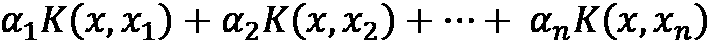，其中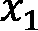，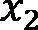，…，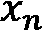是我们训练集中的各个数据点。在一种天真实现中，我们会遍历每个数据点，计算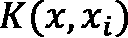，乘以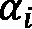，最后将这些项相加。计算两个向量的内积通常是一个计算成本高昂的操作，因此重复这个计算*n*次将会非常昂贵。

为了使这个核化模型更加实用，我们希望对这个过程进行*向量化*。通常，这需要使用各种技巧重新实现我们的核函数以实现向量化。然而，使用 JAX，我们可以轻松地使用`vmap`转换获得`rbf_kernel`函数的向量化版本：

```py
from jax import vmap
kernel = rbf_kernel
vec_kernel = jit(vmap(vmap(kernel, (0, None)), (None, 0)))
```

不要让最后一行代码吓到你。这里我们只是简单地通过`vmap(kernel, (0, None))`获取我们的核函数在第一个轴上的向量化形式（记住核函数有两个输入），然后通过`vmap(vmap(kernel, (0, None)), (None, 0))`将这个沿着第一个轴向量化了的向量再次沿着第二个轴进行向量化。最后，我们使用`jit`推导出函数的即时编译版本。

除了是一个简洁的一行代码之外，这段代码完美地说明了为什么函数转换（JAX 的设计选择）如此有用：我们可以以嵌套的方式组合不同的函数转换，反复调用一个转换的输出；在这种情况下，我们有两次向量化函数的 JIT 编译函数。

组合了这个向量化核函数后，我们现在可以实施相应的`predict`和`loss`函数：

```py
def predict(alphas, X_test):
    return jnp.dot(vec_kernel(X, X_test), alphas)
def loss(alphas):
    preds = predict(alphas, X)
    return jnp.mean(jnp.clip(1 - jnp.multiply(y, preds), \
      a_min=0))
```

这里值得注意的是`predict`函数，我们在这里调用`vec_kernel(X, X_test)`来通过向量化计算的向量。记住，如果没有`vmap`，我们可能需要遍历单个数据点（例如，使用`for`循环），这特别低效，或者重新编写我们的`rbf_kernel`函数，以便函数本身促进向量化。最终，我们只是计算返回的输出与我们要优化的参数向量`alphas`之间的点积。

我们的损失函数保持不变。我们现在可以应用之前相同的训练过程，这次是在`alphas`变量上：

```py
np.random.seed(0)
alphas = np.random.randn(y.size)
for i in range(n_iters):
    grads = loss_grad(alphas)
    alphas = alphas - lr * grads
    tmp_loss = loss(alphas)
    if tmp_loss == 0:
        break
```

我们还可以绘制出整个训练过程中的损失变化：

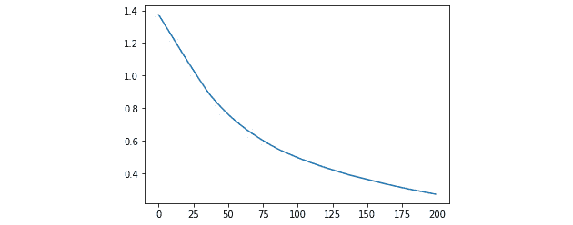

图 6.7 – 核化模型的损失下降

我们看到损失持续下降，这表明模型正在将其参数拟合到数据上。最终，我们的损失远低于`0.7`，这是我们之前纯线性模型的损失。

最后，我们想可视化我们的模型学到了什么。这有点复杂，因为我们不再有一个漂亮的线性方程可以像以前那样转换成一条线。相反，我们可视化模型本身做出的预测。在下面的图中，我们展示了在细网格上做出的这些预测，该网格跨越我们的训练数据点，其中颜色表示预测的类别，色调表示预测的置信度：


图 6.8 – 由学习到的核化模型做出的预测

我们看到模型能够识别出我们数据中的非线性模式，这由月亮中心的黄色和深蓝色块表示。因此，我们已经成功修改了我们的预测模型，使其能够从非线性数据中学习，这是通过使用核来创建非线性特征和 JAX 的自动向量化转换来加速这一计算实现的。

这里，我们达到的速度大约是每秒 160 次迭代。为了再次看到 JIT 编译器为我们程序提供的速度提升有多大，我们从我们模型的实现中移除`jit()`函数调用，并使用以下更改重新运行代码：

```py
kernel = rbf_kernel
vec_kernel = vmap(vmap(kernel, (0, None)), (None, 0))
loss_grad = grad(loss)
```

这次，速度提升更加令人印象深刻：没有 JIT，速度下降到每秒 47 次迭代。

这标志着我们对 JAX 及其主要特性的讨论结束。然而，JAX 中还包括其他一些更高级的工具，我们没有涉及，但它们可能在你的机器学习应用中非常有用，例如异步调度、并行化或计算卷积。有关这些功能的信息可以在文档页面上找到：[`jax.readthedocs.io/en/latest/`](https://jax.readthedocs.io/en/latest/)。

# 摘要

JAX 是一个 Python 和 NumPy 友好的库，它提供针对机器学习任务的高性能工具。JAX 将它的 API 集中在函数转换上，使用户能够在一行代码中传入通用的 Python 函数，并接收这些函数的转换版本，否则这些函数可能计算成本高昂或需要更高级的实现。函数转换的语法还使得灵活和复杂的函数组合成为可能，这在机器学习中很常见。

在本章中，我们看到了如何利用 JAX 通过自动微分计算机器学习损失函数的梯度，通过 JIT 编译我们的代码以进行进一步优化，并通过二分类示例将核函数向量化。然而，这些任务在大多数用例中都是存在的，你将能够无缝地将我们在这里讨论的内容应用到你的机器学习需求中。

到目前为止，我们已经到达了本书第一部分的结尾，在这一部分中，我们讨论了 Python 原生和多种其他技术来加速我们的 Python 应用程序。在书的第二部分，我们将探讨并行和并发编程，这些技术允许我们将计算负载分配到多个线程和进程中，使我们的应用程序在线性尺度上更加高效。

# 问题

1.  机器学习管道的主要组成部分是什么？

1.  机器学习模型的损失函数通常是如何最小化的，以及 JAX 是如何帮助这一过程的？

1.  本章中使用的预测模型如何处理非线性数据，以及 JAX 是如何帮助这一过程的？

# 进一步阅读

+   机器学习中的线性模型：[`blog.dataiku.com/top-machine-learning-algorithms-how-they-work-in-plain-english-1`](https://blog.dataiku.com/top-machine-learning-algorithms-how-they-work-in-plain-english-1)

+   JAX 生态系统：[`moocaholic.medium.com/jax-a13e83f49897`](https://moocaholic.medium.com/jax-a13e83f49897)

+   一个进一步探索 JAX 的简要教程：[`colinraffel.com/blog/you-don-t-know-jax.html`](https://colinraffel.com/blog/you-don-t-know-jax.html)
