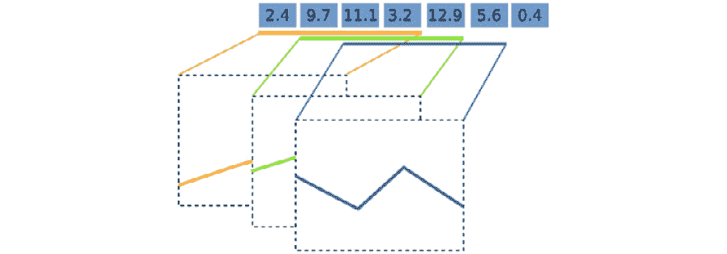
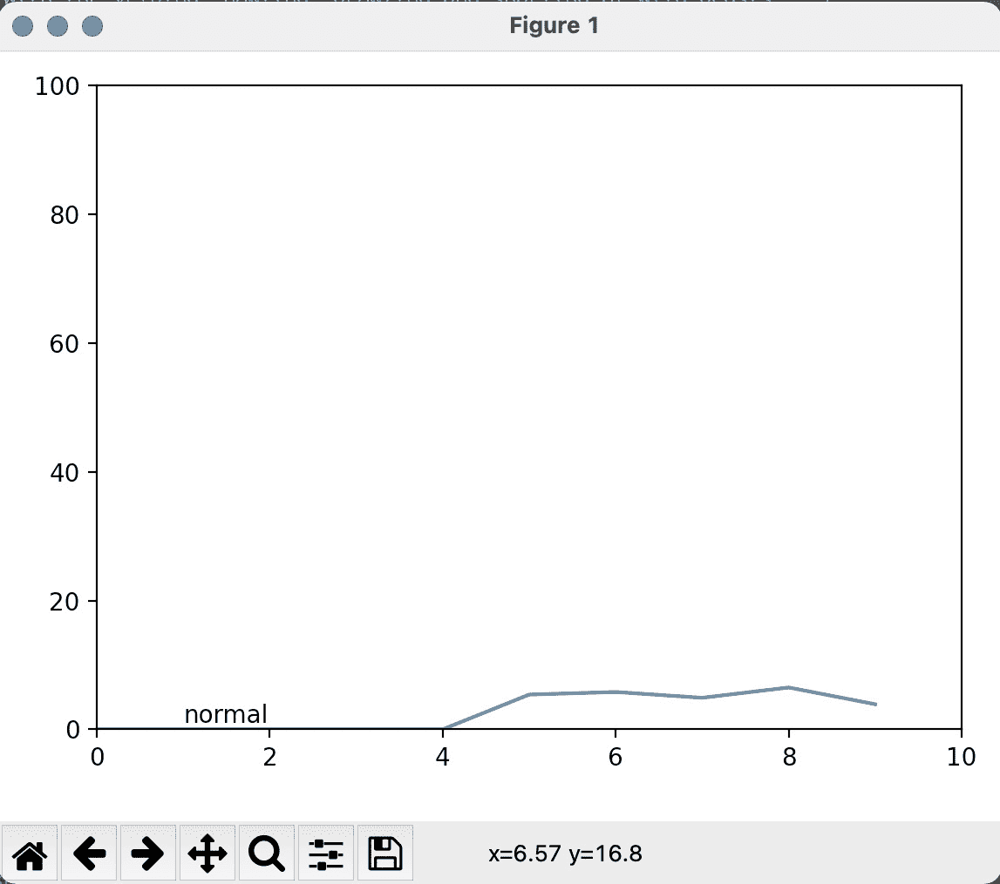

# *第七章*：实现并发

到目前为止，我们已经探讨了如何通过巧妙的算法和更高效的机器代码来减少**中央处理单元**（**CPU**）执行的操作数量，从而提高程序的性能。在本章中，我们将把重点转向那些大部分时间都花在等待比 CPU 慢得多的资源（如持久存储和网络资源）的程序。

**异步编程**是一种编程范式，有助于处理慢速和不可预测的资源（如用户），并且广泛用于构建响应式服务和**用户界面**（**UIs**）。在本章中，我们将向您展示如何使用协程和响应式编程等技术以异步方式在 Python 中进行编程。我们将看到，这些技术的成功应用将使我们能够加快程序的速度，而无需使用特殊的数据结构或算法。

在本章中，我们将涵盖以下主题：

+   异步编程

+   `asyncio`框架

+   响应式编程

# 技术要求

本章的代码可以在[`github.com/PacktPublishing/Advanced-Python-Programming-Second-Edition/tree/main/Chapter07`](https://github.com/PacktPublishing/Advanced-Python-Programming-Second-Edition/tree/main/Chapter07)找到。

# 异步编程

异步编程是一种处理慢速和不可预测资源的方法。与其无所事事地等待资源可用，异步程序可以同时高效地处理多个资源。以异步方式编程可能具有挑战性，因为必须处理可能以任何顺序到达、可能花费可变的时间或可能不可预测地失败的外部请求。在本节中，我们将通过解释主要概念和术语以及异步程序的工作方式来介绍这个主题。

## 等待输入/输出

现代计算机使用不同类型的内存来存储数据和执行操作。一般来说，计算机拥有一种组合，即能够高效且便宜地操作的昂贵内存，以及更丰富的、较慢的内存，用于存储更多的数据。

内存层次结构如下所示：


图 7.1 – 内存层次结构的说明

在内存层次结构的顶部是 CPU **寄存器**。这些与 CPU 集成，用于存储和执行机器指令。在寄存器中访问数据通常需要一钟周期。这意味着如果 CPU 以 3 **千兆赫兹**（**GHz**）的速度运行，那么访问 CPU 寄存器中的一个元素所需的时间大约是 0.3 纳秒。

在寄存器层下面，你可以找到 CPU 的**缓存**，它由多个级别组成，并与处理器集成。缓存的操作速度略慢于寄存器，但处于同一**数量级**（**OOM**）。

层次结构中的下一个项目是主存储器（**随机存取存储器**，或**RAM**），它存储的数据更多，但比缓存慢。从内存中检索一个项目可能需要几百个时钟周期。

在最底层，你可以找到持久**存储**，例如旋转磁盘（**硬盘驱动器**（**HDDs**））和**固态驱动器**（**SSDs**）。这些设备存储的数据最多，比主存储器慢几个数量级。一个 HDD 可能需要几毫秒来定位和检索一个项目，而一个 SSD 则快得多，只需几分之一毫秒。

为了将每种内存类型的相对速度置于适当的视角，如果你有一个大约 1 秒的 CPU 时钟速度，寄存器访问将相当于从桌子上拿起一支笔。缓存访问将相当于从书架上拿起一本书。向更高层次移动，RAM 访问将相当于洗衣服（比缓存慢 20 倍）。当我们转向持久存储时，情况就完全不同了。从 SSD 检索一个元素将相当于进行一次 4 天的公路旅行，而从 HDD 检索一个元素可能需要长达 6 个月！如果我们将访问网络资源，持续时间可能会进一步延长。

总体而言，与 CPU 相比，从存储和其他**输入/输出**（**I/O**）设备访问数据要慢得多；因此，非常重要的是要妥善处理这些资源，以确保 CPU 不会无目的地等待。这可以通过精心设计的软件来实现，该软件能够同时管理多个正在进行中的请求。这就是并发或并发编程的概念。

## 并发

**并发**是实现能够同时处理多个请求的系统的途径。其理念是，我们可以在等待资源可用时继续处理其他资源。并发通过将任务分割成可以无序执行的小子任务来实现，这样多个任务可以部分推进，而无需等待前一个任务完成。

作为第一个例子，我们将描述如何实现对慢速网络资源的并发访问；本例的代码包含在`第七章/example1.py`中。假设我们有一个网络服务，它接受一个数字的平方，并且从我们的请求到响应的时间大约为 1 秒。我们可以实现一个`network_request`函数，它接受一个数字并返回一个包含操作成功信息和结果的字典。我们可以使用`time.sleep`函数来模拟此类服务，如下所示：

```py
    import time
    def network_request(number):
        time.sleep(1.0)
        return {"success": True, "result": number ** 2}
```

我们还将编写一些额外的代码来执行请求，验证请求是否成功，并打印结果。在以下代码片段中，我们定义了`fetch_square`函数，并使用它通过调用`network_request`来计算数字 2 的平方：

```py
    def fetch_square(number):
        response = network_request(number)
        if response["success"]:
            print("Result is: \
              {}".format(response["result"]))
    fetch_square(2)
    # Output:
    # Result is: 4
```

由于网络速度慢，从网络获取一个数字将花费 1 秒钟。如果我们想计算多个数字的平方呢？我们可以调用`fetch_square`，它将在前一个请求完成后立即启动网络请求。其用法在以下代码片段中说明：

```py
    fetch_square(2)
    fetch_square(3)
    fetch_square(4)
    # Output:
    # Result is: 4
    # Result is: 9
    # Result is: 16
```

这段代码按原样运行大约需要 3 秒钟，但这并不是我们能做的最好的。请注意，2 的平方的计算与 3 的平方的计算是独立的，同样，这两个计算又都是独立的，与计算 4 的平方无关。因此，如果我们能够在技术上同时提交多个请求并等待它们，那么在继续下一个数字之前等待前一个结果完成是不必要的。

在以下图中，三个任务被表示为方框。CPU 处理和提交请求的时间用橙色表示，而等待时间用蓝色表示。您可以看到，大部分时间都花在等待资源上，而我们的机器闲置，什么也不做：


图 7.2 – 独立计算执行时间的说明

理想情况下，我们希望在等待已提交的任务完成的同时开始另一个新的任务。在下面的屏幕截图中，您可以看到，当我们提交`fetch_square(2)`请求后，我们可以立即开始准备`fetch_square(3)`，依此类推。这使我们能够减少 CPU 的等待时间，并在结果可用时立即开始处理：


图 7.3 – 执行独立计算的一种更有效的方法

同样，这种策略得以实现是因为这三个请求是完全独立的，我们不需要等待前一个任务的完成就开始下一个任务。此外，请注意单个 CPU 如何轻松地处理这种场景。虽然将工作分配到多个 CPU 可以进一步提高执行速度，但如果等待时间与处理时间相比很大，那么速度提升将是微不足道的。

要实现并发，有必要以不同的方式思考我们的程序及其设计；在接下来的章节中，我们将展示技术和最佳实践来实施健壮的并发应用程序，从一个新的概念开始：回调。

## 回调

我们迄今为止看到的代码会阻塞程序执行，直到资源可用。负责等待的调用是`time.sleep`。为了使代码开始处理其他任务，我们需要找到一种方法来避免阻塞程序流程，这样程序的其他部分就可以继续执行这些其他任务。

实现这种行为的最简单方法之一是通过回调。策略与我们请求出租车时所做的非常相似。想象一下，你在一个餐厅里，已经喝了几杯酒。外面在下雨，你宁愿不去坐公交车；因此，你要求出租车，并让他们在你外面时打电话给你，这样你就可以出来，不必在雨中等待。在这种情况下，你所做的是要求出租车（即慢速资源），但你不是在外面等到出租车到来，而是提供你的号码和指示（回调），这样他们准备好时你可以出来，然后回家。

我们现在将展示这个机制如何在代码中工作。我们将比较`time.sleep`的阻塞代码与`threading.Timer`的等效非阻塞代码。

对于这个例子，它在`example2.py`中实现，我们将编写一个名为`wait_and_print`的函数，该函数将阻塞程序执行 1 秒钟，然后打印一条消息，如下所示：

```py
    def wait_and_print(msg):
        time.sleep(1.0)
        print(msg)
```

如果我们想以非阻塞的方式编写相同的函数，我们可以使用`threading.Timer`类。我们可以通过传递我们想要等待的时间量和`Timer.start`方法来初始化一个`threading.Timer`实例来激活定时器：

```py
    import threading
    def wait_and_print_async(msg):
        def callback():
            print(msg)
        timer = threading.Timer(1.0, callback)
        timer.start()
```

`wait_and_print_async`函数的一个重要特性是，没有任何语句会阻塞程序的执行流程。

`threading.Timer`如何能够在不阻塞的情况下等待？

`threading.Timer`使用的策略涉及启动一个新的线程，该线程可以并行执行代码。如果这让你感到困惑，不要担心，因为我们在接下来的章节中将详细探讨线程和并行编程。

这种在特定事件发生时注册回调以执行的技术通常被称为*好莱坞原则*。这是因为，在好莱坞试镜电影或电视角色后，你可能会被告知*别给我们打电话，我们会给你打电话*，这意味着他们不会立即告诉你是否选择了你，但如果他们选择了你，他们会给你打电话。

为了突出显示`wait_and_print`的阻塞和非阻塞版本之间的差异，我们可以测试和比较两个版本的执行。在输出注释中，等待期用`<wait...>`表示，如下面的代码片段所示：

```py
    # Synchronous
    wait_and_print("First call")
    wait_and_print("Second call")
    print("After call")
    # Output:
    # <wait...>
    # First call  
    # <wait...>
    # Second call
    # After call
    # Asynchronous
    wait_and_print_async("First call async")
    wait_and_print_async("Second call async")
    print("After submission")
    # Output:
    # After submission 
    # <wait...>
    # First call
    # Second call
```

同步版本的行为非常熟悉，符合预期。代码等待一秒钟，打印`First call`，然后等待另一秒钟，并打印`Second call`和`After call`消息。

在异步版本中，`wait_and_print_async` *提交*（而不是*执行*）这些调用，并立即继续。你可以通过注意到“提交后”消息立即打印出来，来看到这个机制在起作用。

在这个前提下，我们可以通过重新编写我们的`network_request`函数使用回调来探索一个稍微复杂的情况。在`example3.py`中，我们定义了一个`network_request_async`函数，如下所示：

```py
    def network_request_async(number, on_done):
        def timer_done():
            on_done({"success": True, \
                     "result": number ** 2})
        timer = threading.Timer(1.0, timer_done)
        timer.start()
```

`network_request_async`与其阻塞版本之间最大的区别是`network_request_async` *不返回任何内容*。这是因为我们在调用`network_request_async`时只是提交了请求，但值只有在请求完成时才可用。

如果我们不能返回任何内容，我们如何传递请求的结果？我们不会返回值，而是将结果作为参数传递给`on_done`回调。函数的其余部分包括提交一个回调（称为`timer_done`）到`threading.Timer`类，当它准备好时将调用`on_done`。

`network_request_async`的使用与`threading.Timer`非常相似；我们只需要传递我们想要平方的数字和一个当它准备好时将接收结果的回调。这在下面的代码片段中得到了演示：

```py
    def on_done(result):
        print(result)
    network_request_async(2, on_done)
```

现在，如果我们提交多个网络请求，我们会注意到调用是并发执行的，并且不会阻塞代码，如下面的代码片段所示：

```py
    network_request_async(2, on_done)
    network_request_async(3, on_done)
    network_request_async(4, on_done)
    print("After submission")
```

为了在`fetch_square`中使用`network_request_async`，我们需要修改代码以利用异步构造。在下面的代码片段中，我们通过定义和传递`on_done`回调到`network_request_async`来修改`fetch_square`：

```py
    def fetch_square(number):
        def on_done(response):
            if response["success"]:
                print("Result is: \
                  {}".format(response["result"]))
        network_request_async(number, on_done)
```

你可能已经注意到，异步代码比其同步版本要复杂得多。这是因为每次我们需要检索某个结果时，我们必须编写和传递一个回调，导致代码变得嵌套且难以理解。

幸运的是，我们接下来要检查的并发编程中的一个基本概念，即期货，将有助于简化问题。

## 期货

期货是一个更方便的模式，可以用来跟踪异步调用的结果。在先前的代码片段中，我们看到我们不是返回值，而是接受回调，并在它们准备好时传递结果。值得注意的是，到目前为止，还没有简单的方法来跟踪资源的状态。

`concurrent.futures.Future`类。可以通过不带参数调用其构造函数来创建`Future`实例，如下面的 IPython 代码片段所示：

```py
    from concurrent.futures import Future
    fut = Future()
    # Result:
    # <Future at 0x7f03e41599e8 state=pending>
```

期货代表一个尚未可用的价值。你可以看到它的字符串表示报告了结果当前的状态，在我们的例子中，它仍然是待定的。为了使结果可用，我们可以使用`fut.set_result`方法，如下所示：

```py
    fut.set_result("Hello")
    # Result:
    # <Future at 0x7f03e41599e8 state=finished returned 
      str>
    fut.result()
    # Result:
    # "Hello"
```

你可以看到，一旦我们设置了结果，`Future`实例将报告任务已完成，并且可以使用`fut.result`方法访问。也可以订阅一个回调到 future 上，以便结果一可用，回调就会被执行。为了附加一个回调，只需将一个函数传递给`fut.add_done_callback`方法。当任务完成时，该函数将以`Future`实例作为其第一个参数被调用，并且可以使用`future.result()`方法检索结果，如下面的代码片段所示：

```py
    fut = Future()
    fut.add_done_callback(lambda future: 
      print(future.result(), flush=True))
    fut.set_result("Hello")
    # Output:
    # Hello
```

为了理解如何在实践中使用 future，我们将修改`network_request_async`函数，在`example4.py`中使用 future。这次，我们不是返回空值，而是返回一个将为我们跟踪结果的`Future`实例。请注意以下两点：

+   我们不需要接受一个`on_done callback`，因为回调可以在之后通过`fut.add_done_callback`方法连接。此外，我们将通用的`fut.set_result`方法作为`threading.Timer`的回调。

+   这次，我们能够返回一个值，从而使代码与前面章节中看到的阻塞版本更加相似，如下所示：

    ```py
        from concurrent.futures import Future
        def network_request_async(number):
            future = Future()
            result = {"success": True, "result": number  \
              ** 2}
            timer = threading.Timer(1.0, lambda:  \
              future.set_result(result))
            timer.start()
            return future
        fut = network_request_async(2)
    ```

    注意

    尽管在这些例子中我们直接实例化和管理 future，但在实际应用中，future 是由框架处理的。

如果你执行前面的代码，将不会发生任何事，因为代码只包含准备和返回一个`Future`实例。为了使未来的结果能够进一步操作，我们需要使用`fut.add_done_callback`方法。在下面的代码片段中，我们将`fetch_square`函数修改为使用 future：

```py
    def fetch_square(number):
        fut = network_request_async(number)
        def on_done_future(future):
            response = future.result()
            if response["success"]:
                print("Result is: \
                  {}".format(response["result"]))

        fut.add_done_callback(on_done_future)
```

如你所见，代码仍然看起来与回调版本非常相似，但当调用`fetch_square`时，相应的 future 将被处理，并将打印出结果字符串。

总体而言，future 是处理回调的一种不同且稍微方便的方法。future 还有优势，因为它们可以跟踪资源状态，取消（取消调度）计划中的任务，并更自然地处理异常。

## 事件循环

到目前为止，我们使用**操作系统**（**OS**）线程来实现并行性。然而，在许多异步框架中，并发任务的协调是由**事件循环**管理的。

事件循环背后的思想是持续监控各种资源的状态（例如，网络连接和数据库查询），并在特定事件发生时（例如，资源就绪或定时器到期）触发回调的执行。

为什么不就坚持使用线程呢？

事件循环有时更受欢迎，因为每个执行单元永远不会同时运行另一个，这可以简化处理共享变量、数据结构和资源。

作为`example5.py`中的第一个示例，我们将实现一个无线程版本的`threading.Timer`。我们可以定义一个`Timer`类，它将接受一个超时并实现`Timer.done`方法，该方法在计时器过期时返回`True`。代码在下面的代码片段中展示：

```py
    class Timer:

        def __init__(self, timeout):
            self.timeout = timeout
            self.start = time.time()

        def done(self):
            return time.time() - self.start > self.timeout
```

要确定计时器是否已过期，我们可以编写一个循环，通过调用`Timer.done`方法连续检查计时器状态。当计时器过期时，我们可以打印一条消息并退出循环。代码在下面的代码片段中展示：

```py
    timer = Timer(1.0)

    while True:
        if timer.done():
            print("Timer is done!")
            break
```

通过这种方式实现计时器，执行流程永远不会被阻塞，原则上我们可以在`while`循环内部做其他工作。

忙等待

通过循环连续轮询等待事件发生通常被称为**忙等待**。

理想情况下，我们希望附加一个自定义函数，当计时器触发时执行，就像我们在`threading.Timer`中做的那样。为此，我们可以在`example6.py`中实现一个`Timer.on_timer_done`方法，该方法将接受一个回调，当计时器触发时执行，如下所示：

```py
    class Timer:
       # ... previous code 
       def on_timer_done(self, callback):
            self.callback = callback
```

注意，`on_timer_done`仅仅存储了对回调的引用。监控事件并执行回调的是循环。这一概念如下所示。而不是使用`print`函数，当适当的时候，循环将调用`timer.callback`：

```py
    timer = Timer(1.0)
    timer.on_timer_done(lambda: print("Timer is done!"))
    while True:
        if timer.done():
            timer.callback()
            break
```

如你所见，异步框架正在开始形成。我们在循环外部所做的只是定义计时器和回调，而循环负责监控计时器和执行相关的回调。我们可以通过实现多个计时器的支持来进一步扩展我们的代码。

实现多个计时器的自然方式是将几个`Timer`实例添加到一个列表中，并修改我们的事件循环以定期检查所有计时器，并在需要时调度回调。在下面的代码片段中，我们定义了两个计时器，并将回调附加到每个计时器上。这些计时器被添加到列表`timers`中，该列表由我们的事件循环持续监控。一旦计时器完成，我们就执行回调并将事件从列表中删除：

```py
    timers = []
    timer1 = Timer(1.0)
    timer1.on_timer_done(lambda: print("First timer is  \
      done!"))
    timer2 = Timer(2.0)
    timer2.on_timer_done(lambda: print("Second timer is  \
      done!"))
    timers.append(timer1)
    timers.append(timer2)
    while True:
        for timer in timers:
            if timer.done():
                timer.callback()
                timers.remove(timer)
        # If no more timers are left, we exit the loop 
        if len(timers) == 0:
            break
```

事件循环的主要限制是，由于执行流程由一个持续运行的循环管理，因此在循环内部调用`time.sleep`（），你可以想象事件监控和回调调度将停止，直到阻塞调用完成。

为了避免这种情况，我们不是使用阻塞调用如`time.sleep`，而是让事件循环在资源准备好时检测并执行回调。通过不阻塞执行流程，事件循环可以以并发方式监控多个资源。

事件循环如何通知事件？

事件通知通常通过操作系统调用（如 Unix 工具`select`）实现，这些调用将在事件准备好时（与忙等待相反）恢复程序的执行。

Python 标准库包括一个非常方便的事件循环并发框架 `asyncio`，它将是下一节的主题。

# asyncio 框架

在这一点上，我们已经了解了并发是如何工作的，以及如何使用回调和未来。现在我们可以继续学习如何使用自 Python 3.4 版本以来就存在于标准库中的 `asyncio` 包。我们还将探索 `async`/`await` 语法，以非常自然的方式处理异步编程。

作为第一个例子，我们将看到如何使用 `asyncio` 获取和执行一个简单的回调。可以通过调用 `asyncio.get_event_loop()` 函数来获取 `asyncio` 循环。我们可以使用 `loop.call_later` 来安排一个回调执行，它接受秒数延迟和一个回调。我们还可以使用 `loop.stop` 方法来停止循环并退出程序。要开始处理安排的调用，必须启动循环，这可以通过 `loop.run_forever` 完成。以下 `example7.py` 代码示例通过安排一个将打印消息并停止循环的回调来演示这些基本方法的用法：

```py
    import asyncio
    loop = asyncio.get_event_loop()
    def callback():
        print("Hello, asyncio")
        loop.stop()
    loop.call_later(1.0, callback)
    loop.run_forever()
```

此代码安排了一个回调，该回调将打印一条消息然后停止循环。回调的一个主要问题是它们要求你将程序执行分解成小函数，这些函数将在某个事件发生时被调用。正如我们在前面的章节中看到的，回调可以很快变得繁琐。在下一节中，我们将看到如何使用协程，就像使用未来一样，简化并发编程的许多方面。

## 协程

**协程**是另一种，可能更自然的方法，可以将程序执行分解成块。它们允许程序员编写类似于同步代码的代码，但将以异步方式执行。你可以将协程想象为一个可以被停止和恢复的函数。协程的一个基本例子是生成器。

在 Python 中，可以使用函数内的 `yield` 语句定义生成器。在以下 `example8.py` 代码示例中，我们实现了 `range_generator` 函数，该函数从 `0` 到 `n` 生成并返回值。我们还添加了一个 `print` 语句来记录生成器的内部状态：

```py
    def range_generator(n):
        i = 0
        while i < n:
            print("Generating value {}".format(i))
            yield i
            i += 1
```

当我们调用 `range_generator` 函数时，代码不会立即执行。请注意，当执行以下代码片段时，不会打印任何内容到输出。相反，返回了一个 `generator` 对象：

```py
    generator = range_generator(3)
    generator
    # Result:
    # <generator object range_generator at 0x7f03e418ba40>
```

为了开始从生成器中提取值，必须使用 `next` 函数，如下所示：

```py
    next(generator)
    # Output:
    # Generating value 0
    next(generator)
    # Output:
    # Generating value 1
```

注意，每次我们调用`next`时，代码会运行直到遇到下一个`yield`语句，并且必须发出另一个`next`语句来恢复生成器的执行。你可以把`yield`语句看作是一个断点，在这里我们可以停止和恢复执行（同时保持生成器的内部状态）。这种停止和恢复执行的能力可以被事件循环利用，以允许并实现并发。

通过`yield`语句，也可以在生成器中*注入*（而不是*提取*）值。在`example9.py`中的以下代码示例中，我们声明了一个`parrot`函数，该函数将重复发送的每条消息：

```py
    def parrot():
        while True:
            message = yield
            print("Parrot says: {}".format(message))
    generator = parrot()
    generator.send(None)
    generator.send("Hello")
    generator.send("World")
```

要允许生成器接收一个值，你可以将`yield`赋值给一个变量（在我们的例子中，它是`message = yield`）。要在生成器中插入值，我们可以使用`send`方法。在 Python 世界中，既能接收值又能发送值的生成器被称为**基于生成器的协程**。

注意，在我们开始发送消息之前，我们还需要发出一个`generator.send(None)`请求；这是为了启动函数执行并带我们到第一个`yield`语句。此外，注意`parrot`内部有一个无限循环；如果我们不使用生成器来实现这个循环，我们将陷入无限循环的困境！

在这种情况下，你可以想象事件循环如何在不阻塞整个程序执行的情况下部分地推进这些生成器，以及生成器何时在某个资源准备好时才被推进，从而消除了回调的需要。

使用`yield`语句在`asyncio`中实现协程是可能的。然而，Python 支持使用更直观的语法定义强大的协程。要使用`asyncio`定义协程，你可以使用`async def`语句，如下所示：

```py
    async def hello():
        print("Hello, async!")
    coro = hello()
    coro
    # Output:
    # <coroutine object hello at 0x7f314846bd58>
```

如你所见，如果我们调用`hello`函数，函数体不会立即执行，而是返回一个`coroutine object`实例。`asyncio`协程不支持`next`，但它们可以很容易地在`asyncio`事件循环中使用`run_until_complete`方法运行，如下所示：

```py
    import asyncio
    loop = asyncio.get_event_loop()
    loop.run_until_complete(coro)
```

原生协程

使用`async def`语句定义的协程也被称为**原生协程**。

`asyncio`模块提供了资源（称为`await`语法。例如，在`example10.py`中，如果我们想等待一段时间然后执行一个语句，我们可以使用`asyncio.sleep`函数，如下所示：

```py
    async def wait_and_print(msg):
        await asyncio.sleep(1)
        print("Message: ", msg)
    loop = asyncio.get_event_loop()
    loop.run_until_complete(wait_and_print("Hello"))
```

结果是美丽、干净的代码。我们正在编写功能齐全的异步代码，而没有回调的所有丑陋之处！

事件循环的断点

你可能已经注意到了`await`如何为事件循环提供一个断点，这样在等待资源的同时，事件循环可以继续运行并并发管理其他协程。

更好的是，协程也是 `awaitable` 的，我们可以使用 `await` 语句来异步地链式调用协程。在以下示例中，我们重写了之前定义的 `network_request` 函数，将 `time.sleep` 的调用替换为 `asyncio.sleep`：

```py
    async def network_request(number):
         await asyncio.sleep(1.0)
         return {"success": True, "result": number ** 2}
```

我们可以通过重新实现 `fetch_square` 来跟进，如下面的代码片段所示。如您所见，我们直接等待 `network_request`，无需额外的未来或回调：

```py
    async def fetch_square(number):
         response = await network_request(number)
         if response["success"]:
             print("Result is: \
              {}".format(response["result"]))
```

可以使用 `loop.run_until_complete` 单独执行协程，如下所示：

```py
    loop.run_until_complete(fetch_square(2))
    loop.run_until_complete(fetch_square(3))
    loop.run_until_complete(fetch_square(4))
```

使用 `run_until_complete` 运行任务可以作为测试和调试的演示。然而，我们的程序大多数情况下将以 `loop.run_forever` 启动，并且我们需要在循环已经运行时提交我们的任务。

`asyncio` 提供了 `ensure_future` 函数，该函数用于调度协程（以及未来）的执行。`ensure_future` 可以通过简单传递我们想要调度的协程来使用。以下 `example11.py` 中的代码片段将调度多个对 `fetch_square` 的调用，这些调用将并发执行：

```py
    asyncio.ensure_future(fetch_square(2))
    asyncio.ensure_future(fetch_square(3))
    asyncio.ensure_future(fetch_square(4))
    loop.run_forever()
    # Hit Ctrl-C to stop the loop
```

作为额外的好处，当传递一个协程时，`asyncio.ensure_future` 函数将返回一个 `Task` 实例（它是 `Future` 的子类），这样我们就可以利用 `await` 语法，而无需放弃常规未来的资源跟踪能力。

## 将阻塞代码转换为非阻塞代码

虽然 `asyncio` 支持以异步方式连接到资源，但在某些情况下需要使用阻塞调用。例如，当第三方 `asyncio`。以下是步骤：

1.  处理阻塞代码的有效策略是在单独的线程中运行它。线程在操作系统级别实现，允许并行执行阻塞代码。为此，Python 提供了 `Executor` 接口，用于在单独的线程中运行任务，并使用未来来监控它们的进度。

1.  您可以通过从 `concurrent.futures` 模块导入它来初始化 `ThreadPoolExecutor` 实例。执行器将启动一组线程（称为工作者），它们将等待执行我们抛给它们的任何任务。一旦提交了一个函数，执行器将负责将其执行调度到可用的工作者线程，并跟踪结果。可以使用 `max_workers` 参数来选择线程数。

注意，一旦任务完成，执行器不会销毁线程。这样做可以减少与线程创建和销毁相关的成本。

1.  在以下 `example12.py` 代码示例中，我们创建了一个具有三个工作者的 `ThreadPoolExecutor` 实例，并提交了一个 `wait_and_return` 函数，该函数将阻塞程序执行 1 秒并返回一个消息字符串。然后我们使用 `submit` 方法来调度其执行：

    ```py
        import time
        from concurrent.futures import ThreadPoolExecutor
        executor = ThreadPoolExecutor(max_workers=3)
        def wait_and_return(msg):
            time.sleep(1)
            return msg
        print(executor.submit(wait_and_return, "Hello. \
          executor"))
        # Result:
        # <Future at 0x7ff616ff6748 state=running>
    ```

1.  `executor.submit` 方法立即安排函数并返回一个 future。可以使用 `loop.run_in_executor` 方法来管理 `asyncio` 中的任务执行，它的工作方式与 `executor.submit` 非常相似。以下代码片段展示了这一点：

    ```py
        fut = loop.run_in_executor(executor, \
          wait_and_return, "Hello, asyncio executor")
        # <Future pending ...more info...>
    ```

1.  `run_in_executor` 方法还将返回一个 `asyncio.Future` 实例，可以从其他代码中等待。主要区别在于，future 不会运行，直到我们开始循环。我们可以使用 `loop.run_until_complete` 运行并获取响应，如下面的代码片段所示：

    ```py
        loop.run_until_complete(fut)
        # Result:
        # 'Hello, executor'
    ```

1.  作为实际示例，我们可以使用这项技术来实现多个网页的并发获取。为此，我们将导入流行的（阻塞的）`requests` 库，并在 `example13.py` 中的执行器中运行 `requests.get` 函数，如下所示：

    ```py
        import requests
        async def fetch_urls(urls):
            responses = []
            for url in urls:
                responses.append(await \
                  loop.run_in_executor(executor, \
                    requests.get, url))
            return responses
        responses = loop.run_until_complete(
          fetch_urls(
            [
          'http://www.google.com', 
          'http://www.example.com',
          'http://www.facebook.com'
            ]
          )
        )
        print(response)
        # Result
        # [<Response [200]>, <Response [200]>, <Response 
          [200]>] 
    ```

1.  这个版本的 `fetch_url` 不会阻塞执行，并允许 `asyncio` 中的其他协程运行；然而，它并不理想，因为该函数不会获取 `asyncio.ensure_future` 或使用 `asyncio.gather` 便利函数，该函数将一次性提交所有协程并收集结果。`asyncio.gather` 的使用在 `example14.py` 中演示如下：

    ```py
        def fetch_urls(urls):
            return asyncio.gather(
              *[loop.run_in_executor(executor, \
                 requests.get, url) for url in urls])
    ```

    线程数量的上限

    使用这种方法可以并行获取的 URL 数量将取决于您拥有的工作线程数量。为了避免这种限制，您应该使用原生的非阻塞库，例如 `aiohttp`。

到目前为止，我们已经看到了如何使用回调、futures 和协程等核心概念在 Python 中处理并发程序。在本章剩余部分，我们将讨论一种更简洁的编程范式来实现并发。

# 反应式编程

**反应式编程**是一种旨在构建更好的并发系统的范式。反应式应用程序旨在符合反应式宣言中例示的以下要求：

+   **响应式**：系统立即响应用户。

+   **弹性**：系统能够处理不同级别的负载，并能适应不断增长的需求。

+   **弹性**：系统能够优雅地处理故障。这是通过模块化和避免存在**单点故障**（**SPOF**）来实现的。

+   **消息驱动**：系统不应阻塞并利用事件和消息。消息驱动应用程序有助于实现所有先前要求。

反应式系统的要求相当合理但抽象，这引出了一个问题：反应式编程究竟是如何工作的？在本节中，我们将通过使用 **Reactive Extensions for Python**（**RxPY**）库来了解反应式编程的原则。

其他信息

`RxPY` 库是 ReactiveX ([`reactivex.io/`](http://reactivex.io/)) 的一部分，这是一个实现多种语言反应式编程工具的项目。

要安装库，只需运行`pip install rx`。

注意，以下代码使用的是`RxPY` v3，其语法与`RxPY` v1 相当不同。如果你熟悉`RxPY` v1 以及本书前版本的讨论，请注意语法的变化！

## 可观察对象

正如其名所示，响应式编程的主要思想是*响应*事件。在前一节中，我们通过回调示例看到了这个想法的一些例子；你订阅它们，一旦事件发生，回调就会立即执行。

在响应式编程中，如果我们将事件视为数据流，这个想法就会得到扩展。这可以通过在`RxPY`中展示此类数据流的示例来体现。可以使用 IPython 中的`from_iterable`方法从迭代器创建数据流，如下所示：

```py
    from rx import from_iterable
    obs = from_iterable(range(4))
```

为了从`obs`接收数据，我们可以使用`Observable.subscribe`方法，该方法将为数据源发出的每个值执行我们传递的函数。此方法在以下代码片段中显示：

```py
    obs.subscribe(print)
    # Output:
    # 0
    # 1
    # 2
    # 3
```

你可能已经注意到，可观察者是类似于列表或更一般地说，迭代器的有序集合。这并非巧合。

术语*可观察*来自观察者和可迭代的组合。一个*观察者*是一个对它观察的变量的变化做出反应的对象，而一个*可迭代*是一个可以产生并跟踪迭代器的对象。

在 Python 中，迭代器是定义了`__next__`方法的对象，并且可以通过调用`next`来提取其元素。通常，我们可以通过使用`iter`从集合中获取迭代器；然后，我们可以使用`next`或`for`循环来提取元素。一旦从迭代器中消耗了一个元素，我们就无法回到之前的位置。我们可以通过从列表创建迭代器来演示其用法，如下所示：

```py
    collection = list([1, 2, 3, 4, 5])
    iterator = iter(collection)
    print("Next")
    print(next(iterator))
    print(next(iterator))
    print("For loop")
    for i in iterator:
         print(i)
    # Output:
    # Next
    # 1
    # 2
    # For loop
    # 3
    # 4
    # 5
```

你可以看到，每次我们调用`next`或迭代时，迭代器都会产生一个值并前进。从某种意义上说，我们是从迭代器中*拉取*结果。

迭代器与生成器

迭代器听起来很像生成器；然而，它们更通用。在 Python 中，生成器是由使用`yield`表达式的函数返回的。正如我们所见，生成器支持`next`；因此，它们是迭代器的一个特殊类。

现在，你可以欣赏迭代器和可观察对象之间的对比。可观察对象在准备好时将数据流推给我们，但这并非全部。可观察对象还可以告诉我们何时发生错误以及何时没有更多数据。实际上，我们可以将更多的回调注册到`Observable.subscribe`方法。

在以下 IPython 示例中，我们创建了一个可观察对象，并注册了回调，当有下一个项目可用时使用`on_next`调用，当没有更多数据时使用`on_completed`参数：

```py
    obs = from_iterable(range(4))
    obs.subscribe(on_next=lambda x: print("Next item:", x),
                  on_completed=lambda: print("No more  \
                    data"))
    # Output:
    # Next element: 0
    # Next element: 1
    # Next element: 2
    # Next element: 3
    # No more data
```

话虽如此，可观察对象和迭代器之间的相似性更为重要，因为我们可以使用与迭代器相同的技巧来处理事件流。

`RxPy` 提供了可以用来创建、转换、过滤和分组的操作符。响应式编程的强大之处在于，这些操作返回其他可观察量，可以方便地链接和组合在一起。为了快速演示，我们将接下来检查 `take` 操作符的用法。

给定一个可观察量，`take` 将返回一个新的可观察量，该可观察量将在 `n` 个项目后停止。其用法很简单，如下所示：

```py
    from rx.operators import take

    op = take(4)
    obs = from_iterable(range(1000))
    op(obs).subscribe(print)
    # Output:
    # 0
    # 1
    # 2
    # 3
```

在 `RxPy` 中实现的操作集合多样且丰富，可以使用这些操作符作为构建块来构建复杂的应用程序。

## 有用的操作符

在本小节中，我们将探讨以某种方式转换源可观察量元素的运算符。这个家族中最突出的成员是熟悉的 `map` 操作符，它在对源可观察量的元素应用函数后发射这些元素。

例如，我们可以使用 `map` 来计算数字序列的平方，如下所示：

```py
    from rx.operators import map
    map(lambda x: x**2)(from_iterable(range(4))). \
        subscribe(print)
    # Output:
    # 0
    # 1
    # 4
    # 9
```

操作符可以用马赛克图表示，这有助于我们更好地理解操作符的工作原理，特别是考虑到元素可以在一段时间内发射。在马赛克图中，数据流（在我们的情况下，是可观察量）由一条实线表示。一个圆圈（或另一个形状）标识可观察量发射的值，一个 *X* 符号表示错误，一条垂直线表示流的结束。

在这里，我们可以看到 `map` 的马赛克图：


图 7.4 – 马赛克图说明平方数字的过程

源可观察量放置在图的最上方，变换放置在中间，结果可观察量放置在底部。

另一个变换的例子是 `group_by`，它根据键将项目排序到组中。`group_by` 操作符接受一个函数，当给定一个元素时提取一个键，并为每个键及其相关元素生成一个可观察量。

使用马赛克图可以更清楚地表达 `group_by` 操作。在以下图中，你可以看到 `group_by` 发射了两个可观察量。此外，项目在发射后立即动态地排序到组中：


图 7.5 – 马赛克图说明分组

我们可以通过一个简单的例子进一步了解 `group_by` 的工作原理。假设我们想要根据数字是偶数还是奇数来分组。我们可以通过传递 `lambda x: x % 2` 表达式作为键函数来实现这一点，该函数将返回 `0`（如果数字是偶数）或 `1`（如果数字是奇数），如下所示：

```py
    from rx.operators import group_by
    obs = group_by(lambda x: x %  \
      2)(from_iterable(range(4)))
```

到目前为止，如果我们订阅并打印 `obs` 的内容，实际上会打印出两个可观察量，如下面的代码片段所示：

```py
    obs.subscribe(print)
    # <rx.linq.groupedobservable.GroupedObservable object 
      at 0x7f0fba51f9e8>
    # <rx.linq.groupedobservable.GroupedObservable object 
      at 0x7f0fba51fa58>
```

您可以使用`key`属性来确定组密钥。为了提取所有偶数，我们可以取第一个可观察项（对应于等于 0 的密钥）并订阅它。在下面的代码片段中，我们展示了它是如何工作的：

```py
    obs.subscribe(lambda x: print("group key: ", x.key))
    # Output:
    # group key:  0
    # group key:  1
    take(1)(obs).subscribe(lambda x: x.subscribe(print))
    # Output:
    # 0
    # 2
```

使用`group_by`，我们引入了一个发出其他可观察项的可观察项。这实际上是响应式编程中相当常见的一种模式，并且有一些函数允许你组合不同的可观察项。

一个用于组合可观察项的有用工具是`merge_all`，它接受多个可观察项并产生一个包含两个可观察项元素的单一可观察项，这些元素按照它们发出的顺序排列。以下是一个使用宝石图的示例，如下所示：


图 7.6 – 说明合并的宝石图

为了演示其用法，我们可以将操作应用于`group_by`返回的可观察项的可观察项，如下所示：

```py
    from rx.operators import merge_all
    merge_all()(obs).subscribe(print)
    # Output
    # 0
    # 1
    # 2
    # 3
```

使用`merge_all`，项目将按照它们最初出现的顺序返回（记住`group_by`按两个组中的元素出现的顺序发出元素）。

小贴士

`RxPy`还提供了`merge`操作，可以用来组合单个可观察项。

## 热和冷可观察项

在前面的章节中，我们学习了如何使用`from_iterable`方法创建可观察项。`RxPy`提供了许多其他工具来创建更有趣的事件源。

`interval`接受以秒为单位的时间间隔`period`，并创建一个在每次周期通过时发出值的可观察项。以下代码可以用来定义一个名为`obs`的可观察项，它将从零开始每秒发出一个数字。我们使用`take`操作符将计时器限制为四个事件：

```py
    from rx import interval
    from rx.operators import take

    take(4)(interval(1)).subscribe(print)
    # Output:
    # 0
    # 1
    # 2
    # 3
```

关于`interval`的一个非常重要的事实是，计时器不会在我们订阅之前启动。我们可以通过打印从计时器启动定义时的索引和延迟来观察这一点，如下所示：

```py
    import time
    start = time.time()
    obs = map(lambda a: (a, time.time() - \
      start))(interval(1))
    # Let's wait 2 seconds before starting the subscription
    time.sleep(2)
    take(4)(obs).subscribe(print)
    # Output:
    # (0, 3.003735303878784)
    # (1, 4.004871129989624)
    # (2, 5.005947589874268)
    # (3, 6.00749135017395)
```

如您所见，第一个元素（对应于`0`索引）在 3 秒后产生，这意味着计时器在我们发出`subscribe(print)`方法时启动。

如`interval`这样的可观察项被称为*懒加载*，因为它们只有在被请求时才开始产生值（想想看它们就像自动售货机，除非我们按下按钮，否则不会分发食物）。在 Rx 术语中，这类可观察项被称为**冷可观察项**。冷可观察项的一个特性是，如果我们附加两个订阅者，间隔计时器将被多次启动。这可以从以下示例中清楚地看出。在这里，我们在第一个订阅后 0.5 秒添加一个新的订阅，你可以看到两个订阅的输出在时间上有所不同：

```py
    start = time.time()
    obs = map(lambda a: (a, time.time() - \
      start))(interval(1))
    # Let's wait 2 seconds before starting the subscription
    time.sleep(2)
    take(4)(obs).subscribe(lambda x: print("First \
      subscriber: {}".format(x)))
    time.sleep(0.5)
    take(4)(obs).subscribe(lambda x: print("Second  \
      subscriber: {}".format(x)))
    # Output:
    # First subscriber: (0, 3.0036110877990723)
    # Second subscriber: (0, 3.5052847862243652)
    # First subscriber: (1, 4.004414081573486)
    # Second subscriber: (1, 4.506155252456665)
    # First subscriber: (2, 5.005316972732544)
    # Second subscriber: (2, 5.506817102432251)
    # First subscriber: (3, 6.0062034130096436)
    # Second subscriber: (3, 6.508296489715576)
```

有时，我们可能不希望这种行为，因为我们可能希望多个订阅者订阅相同的数据源。为了使可观察项产生相同的数据，我们可以延迟数据生产，并确保所有订阅者都将获得相同的数据，使用`publish`方法。

`publish` 将我们的可观察对象转换为 `ConnectableObservable`，它不会立即开始推送数据，而只有在我们调用 `connect` 方法时才会。`publish` 和 `connect` 的用法在下面的代码片段中演示：

```py
    from rx.operators import publish
    start = time.time()
    obs = publish()(map(lambda a: (a, time.time() - \
    start))(interval(1)))
    take(4)(obs).subscribe(lambda x: print("First \
      subscriber: {}".format(x)))
    obs.connect() # Data production starts here
    time.sleep(2)
    take(4)(obs).subscribe(lambda x: print("Second \
      subscriber: {}".format(x)))
    # Output:
    # First subscriber: (0, 1.0016899108886719)
    # First subscriber: (1, 2.0027990341186523)
    # First subscriber: (2, 3.003532648086548)
    # Second subscriber: (2, 3.003532648086548)
    # First subscriber: (3, 4.004265308380127)
    # Second subscriber: (3, 4.004265308380127)
    # Second subscriber: (4, 5.005320310592651)
    # Second subscriber: (5, 6.005795240402222)
```

在这个例子中，你可以看到我们首先发出 `publish`，然后订阅第一个订阅者，最后发出 `connect`。当发出 `connect` 时，计时器将开始产生数据。第二个订阅者晚些时候加入，实际上它不会收到前两条消息，而是从第三条开始接收数据，依此类推。注意，这次，订阅者共享完全相同的数据。这种独立于订阅者产生数据的数据源被称为 **热**。

与 `publish` 类似，你可以使用 `replay` 方法，该方法将为每个新的订阅者从开始处产生数据。以下示例说明了这一点，它与前面的示例相同，只是我们将 `publish` 替换为 `replay`：

```py
    from rx.operators import replay
    start = time.time()
    obs = replay()(map(lambda a: (a, time.time() - start) \
      ( interval(1)))
    take(4)(obs).subscribe(lambda x: print("First  \
     subscriber: {}".format(x)))
    obs.connect()
    time.sleep(2)
    take(4)(obs).subscribe(lambda x: print("Second  \
      subscriber: {}".format(x)))
    First subscriber: (0, 1.0008857250213623)
    First subscriber: (1, 2.0019824504852295)
Second subscriber: (0, 1.0008857250213623)
    Second subscriber: (1, 2.0019824504852295)
    First subscriber: (2, 3.0030810832977295)
    Second subscriber: (2, 3.0030810832977295)
    First subscriber: (3, 4.004604816436768)
    Second subscriber: (3, 4.004604816436768)
```

注意，尽管第二个订阅者晚些时候到达聚会，但它仍然得到了迄今为止已经分发出去的所有项目。

创建热可观察对象的另一种方式是通过 `Subject` 类。`Subject` 很有趣，因为它既能接收数据也能推送数据，因此它可以用来手动 *推送* 项目到一个可观察对象。使用 `Subject` 非常直观；在下面的代码片段中，我们创建一个 `Subject` 实例并订阅它。稍后，我们使用 `on_next` 方法向它推送值；一旦这样做，订阅者就会被调用：

```py
    from rx.subject import Subject
    s = Subject()
    s.subscribe(lambda x: print("Subject emitted value: \
      {}".format(x)))
    s.on_next(1)
    # Subject emitted value: 1
    s.on_next(2)
    # Subject emitted value: 2
```

注意，`Subject` 是另一个热可观察对象的例子。

## 构建 CPU 监视器

现在我们已经掌握了主要的响应式编程概念，我们可以实现一个示例应用程序：一个将给我们提供关于我们的 CPU 使用情况的实时信息，并且可以检测尖峰的监视器。

注意

CPU 监视器的完整代码可以在 `cpu_monitor.py` 文件中找到。

作为第一步，让我们实现一个数据源。我们将使用 `psutil` 模块，该模块提供了一个函数 `psutil.cpu_percent`，它返回最新的 CPU 使用率作为百分比（并且不会阻塞）。代码如下所示：

```py
    import psutil
    psutil.cpu_percent()
    # Result: 9.7
```

由于我们正在开发一个监视器，我们希望在不同时间间隔内采样这些信息。为了实现这一点，我们可以使用熟悉的 `interval` 可观察对象，然后是 `map`，就像我们在前面的部分中所做的那样。此外，我们希望使这个可观察对象成为 *热*，因为对于这个应用程序，所有订阅者都应该接收单一的数据源；为了使 `interval` 成为热，我们可以使用 `publish` 和 `connect` 方法。创建 `cpu_data` 可观察对象的完整代码如下所示：

```py
    cpu_data = publish()(map(lambda x: \
      psutil.cpu_percent())(interval(0.1)))
    cpu_data.connect() # Start producing data
```

我们可以通过打印四个项目的样本来测试我们的监视器，如下所示：

```py
    take(4)(cpu_data).subscribe(print)
    # Output:
    # 12.5
    # 5.6
    # 4.5
    # 9.6
```

现在我们已经建立了主要数据源，我们可以使用`matplotlib`实现一个监控可视化。想法是创建一个包含固定数量测量的绘图，当新数据到达时，我们包括最新的测量值并移除最旧的测量值。这通常被称为*移动窗口*，通过一个示意图可以更好地理解。在以下图中，我们的`cpu_data`流被表示为数字列表。第一个绘图是在我们获得前四个数字时产生的，每次新数字到达时，我们通过一个位置移动窗口并更新绘图：



图 7.7 – 移动窗口的示意图

为了实现这个算法，我们可以编写一个名为`monitor_cpu`的函数，该函数将创建并更新我们的绘图窗口。该函数将执行以下操作：

+   初始化一个空绘图并设置正确的绘图限制。

+   将我们的`cpu_data`可观察对象转换为返回数据移动窗口。这可以通过使用`buffer_with_count`运算符来实现，它将窗口中的点数`npoints`作为参数，并将偏移量设置为`1`。

+   订阅这个新的数据流，并使用传入的数据更新绘图。

函数的完整代码在`cpu_monitor.py`中实现，并在此处展示，如您所见，它非常紧凑。如果您还没有在环境中安装`matplotlib`，请使用`pip install matplotlib`进行安装。

花些时间运行函数并调整参数。您可以在以下位置查看代码：

```py
    from rx.operators import buffer_with_count
    import numpy as np
    import pylab as plt
    def monitor_cpu(npoints):
        lines, = plt.plot([], [])
        plt.xlim(0, npoints) 
        plt.ylim(0, 100) # 0 to 100 percent
        cpu_data_window = buffer_with_count(npoints, \ 
          1)(cpu_data)
        def update_plot(cpu_readings):
            lines.set_xdata(np.arange(len(cpu_readings)))
            lines.set_ydata(np.array(cpu_readings))
            plt.draw()
        cpu_data_window.subscribe(update_plot)
        plt.show()
```

我们可能还想开发一个功能，当 CPU 在一段时间内保持高负载时，会触发一个警报，因为这可能表明我们机器中的某些进程正在非常努力地工作。这可以通过结合`buffer_with_count`和`map`来实现。我们可以获取 CPU 流和窗口，并在`map`函数中测试所有项的值是否高于 20%的使用率（在一个四核 CPU 中，这相当于一个处理器以 100%的工作状态运行）。如果窗口中的所有点使用率都高于 20%，我们将在我们的绘图窗口中显示一个警告。

新可观察对象的实现可以编写如下，并将产生一个可观察对象，如果 CPU 使用率高，则发出`True`，否则发出`False`：

```py
    alertpoints = 4    
    high_cpu = map(lambda readings: all(r > 20 for r in \
      readings))(
        buffer_with_count(alertpoints, 1)(cpu_data)
    )
```

现在，`high_cpu`可观察对象已经准备好了，我们可以创建一个`matplotlib`标签并订阅它以获取更新，如下所示：

```py
    label = plt.text(1, 1, "normal")
    def update_warning(is_high):
        if is_high:
            label.set_text("high")
        else:
            label.set_text("normal")
    high_cpu.subscribe(update_warning)
```

从您的终端运行程序，将打开一个交互式窗口以实时显示您的 CPU 使用数据。以下是我们的程序输出的截图：



图 7.8 – 监控 CPU 使用率

在这里，蓝色曲线表示 CPU 使用率，它保持在正常阈值以下。

虽然这个例子相对简单，但它包含了反应性程序的核心组件，并且可以使用这个作为蓝图构建充分利用`RxPY`功能的更复杂的应用程序。

# 摘要

当我们的代码处理慢速且不可预测的资源时，如 I/O 设备和网络，异步编程非常有用。在本章中，我们探讨了并发和异步编程的基本概念，以及如何使用`asyncio`和`RxPy`库编写并发代码。

在处理多个相互关联的资源时，`asyncio`协程是一个很好的选择，因为它们通过巧妙地避免回调，极大地简化了代码逻辑。反应性编程在这些情况下也非常好，但它真正在处理实时应用程序和 UI 中常见的流数据时大放异彩。

# 问题

1.  异步编程如何帮助程序以更高的速度运行？

1.  异步编程中回调和未来之间主要区别是什么？

1.  反应性应用程序的核心特性/要求是什么？

# 进一步阅读

+   迁移到`RxPY` v3: [`rxpy.readthedocs.io/en/latests/migration.html`](https://rxpy.readthedocs.io/en/latests/migration.html)
