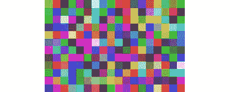
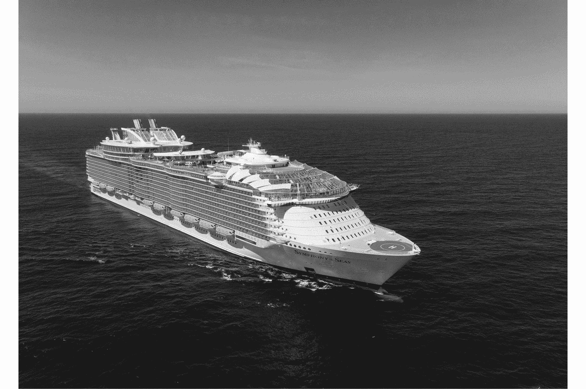
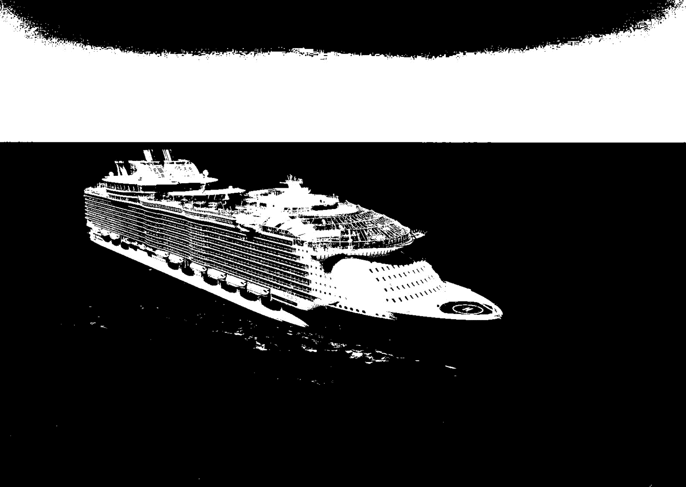
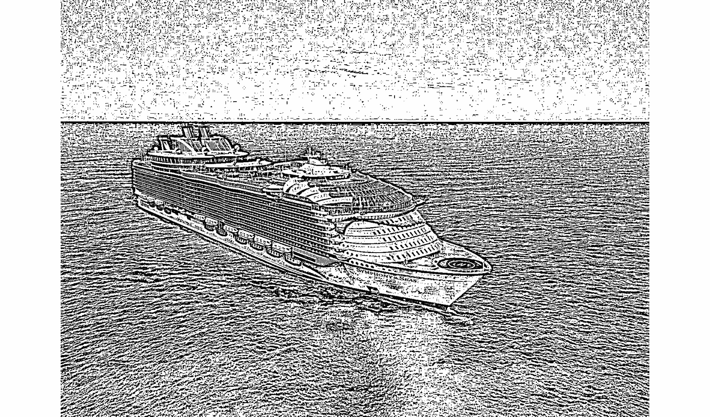
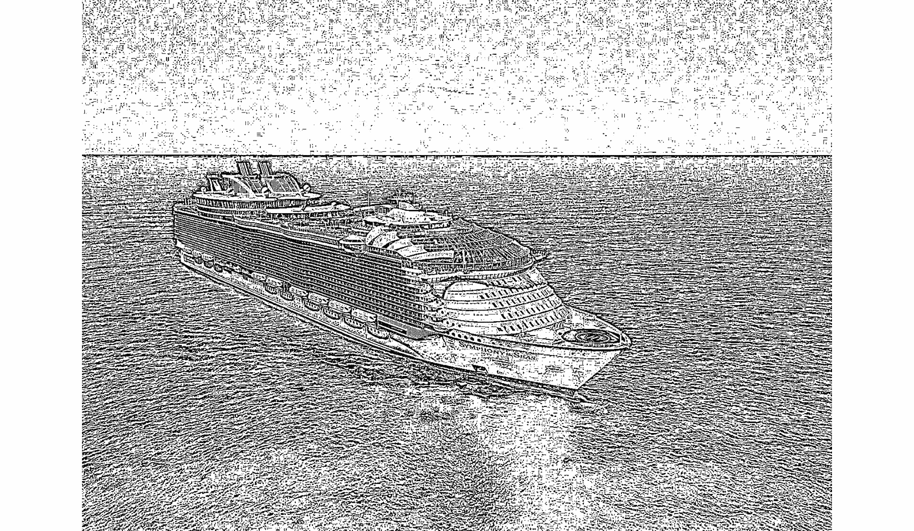
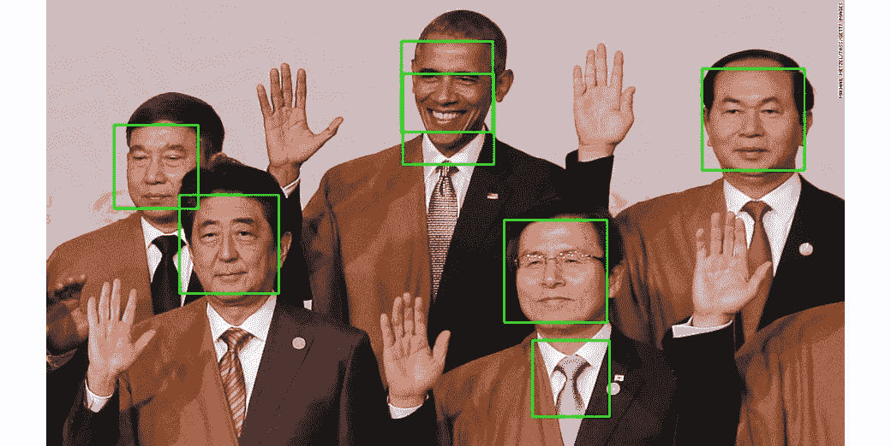

# *第十章*：并发图像处理

本章讨论了通过并发编程处理和操作图像的任务，特别是多进程。由于图像是独立处理的，因此并发编程是实现显著加速的有吸引力的选择。本章概述了图像处理技术背后的基础知识，说明了并发编程提供的改进，并概述了一些在图像处理应用中使用的一些最佳实践。这次讨论将巩固我们如何利用 Python 中的并发和并行处理工具的知识。

本章将涵盖以下主题：

+   图像处理基础

+   将并发应用于图像处理

+   良好的并发图像处理实践

# 技术要求

以下为本章的先决条件列表：

+   您必须在您的计算机上安装 Python 3。

+   您必须为您的 Python 3 发行版安装 OpenCV 和 NumPy。

本章的代码可以在以下 GitHub 仓库中找到：[`github.com/PacktPublishing/Advanced-Python-Programming-Second-Edition/tree/main/Chapter10`](https://github.com/PacktPublishing/Advanced-Python-Programming-Second-Edition/tree/main/Chapter10)。

# 图像处理基础

**数字/计算图像处理**（从现在起我们将称之为**图像处理**）在现代社会变得如此流行，以至于它存在于我们日常生活的许多方面。当您使用相机或手机拍摄照片并使用不同的滤镜时，就会涉及到图像处理和操作，例如使用高级图像编辑软件如 Adobe Photoshop，或者简单地使用 Microsoft Paint 编辑图像。

许多在图像处理中使用的技术和算法是在 20 世纪 60 年代初为各种目的开发的，如医学成像、卫星图像分析、字符识别等。然而，这些图像处理技术需要大量的计算能力，而当时可用的计算机设备无法满足快速数值计算的需求，这减缓了图像处理的使用。

快进到未来，当强大的计算机和快速的多核处理器被开发出来时，图像处理技术变得更加容易获取，并且对图像处理的研究显著增加。如今，许多图像处理应用正在积极开发和研究中，包括模式识别、分类、特征提取等。一些利用并发和并行编程的特定图像处理技术，否则将极其耗时，包括**隐马尔可夫模型**、**独立成分分析**，甚至**神经网络模型**。

以下是最简单的图像处理形式之一，我们将全彩图像转换为灰度图像。这个过程被称为 **灰度化**：


图 10.1 – 图像处理的一个示例应用 – 灰度化

在本章的后面部分，我们将看到如何使用 Python 来实现灰度化以及其他处理技术。为此，我们必须安装必要的库和包。

## Python 作为图像处理工具

正如我们在本书的多个地方所提到的，Python 编程语言正在成为最受欢迎的编程语言。这在计算图像处理领域尤其如此，因为大多数时候，它需要快速原型设计和设计，以及显著的自动化能力。

在下一节中，我们将了解到数字图像是以二维和三维矩阵的形式表示的，这样计算机可以轻松处理它们。因此，大多数情况下，数字图像处理涉及矩阵计算。多个 Python 库和模块不仅提供了高效的矩阵计算选项，而且与其他处理图像读取/写入的库无缝交互。

正如我们所知道的，自动化任务和使它们并发是 Python 的强项。这使得 Python 成为实施图像处理应用的理想选择。对于本章，我们将使用两个主要的 Python 库：**OpenCV**（代表 **开源计算机视觉**），这是一个提供 C++、Java 和 Python 中图像处理和计算机视觉选项的库，以及 NumPy，正如我们所知，它是最受欢迎的 Python 模块之一，执行高效且可并行化的数值计算。让我们看看我们如何安装这些库。

### 安装 OpenCV 和 NumPy

要使用 `pip` 软件包管理器为你的 Python 发行版安装 NumPy，请运行以下命令：

```py
pip install numpy
```

如果你正在使用 Anaconda/Miniconda 来管理你的包，你必须运行以下命令：

```py
conda install numpy
```

安装 OpenCV 可能会更复杂，这取决于你的操作系统。最简单的方法是让 Anaconda 通过遵循安装 Anaconda ([`www.anaconda.com/download/`](https://www.anaconda.com/download/)) 后的指南在 [`anaconda.org/conda-forge/opencv`](https://anaconda.org/conda-forge/opencv) 处理安装过程来处理安装过程。然而，如果你没有使用 Anaconda，安装 OpenCV 的主要选项是遵循其官方文档指南，该指南可在 [`docs.opencv.org/master/df/d65/tutorial_table_of_content_introduction.html`](https://docs.opencv.org/master/df/d65/tutorial_table_of_content_introduction.html) 找到。在成功安装 OpenCV 后，打开 Python 解释器并尝试导入库，如下所示：

```py
>>> import cv2
>>> print(cv2.__version__)
4.5.2
```

我们将使用名称`cv2`导入 OpenCV，这是 Python 中 OpenCV 的库别名。成功消息表示已下载的 OpenCV 库版本（4.5.2）。

## 计算机图像基础

在我们深入处理和操作数字图像文件之前，我们需要讨论这些文件的基本知识以及计算机如何解释它们的数据。具体来说，我们需要了解图像文件中关于单个像素的颜色和坐标的数据是如何表示的，以及如何使用 Python 提取它。

### RGB 值

RGB 值是数字表示颜色的基础。代表**红色**、**绿色**和**蓝色**（**RGB**），这些值是基于所有颜色都可以由红色、绿色和蓝色的特定组合生成的这一事实构建的。因此，RGB 值是一个包含三个整数数字的元组，每个数字的范围从 0（表示完全没有颜色）到 255（表示该特定颜色的最深色调）。

例如，红色对应于元组（255，0，0）；在这个元组中，只有红色的最大值，其他颜色的值都没有，所以整个元组代表纯红色。同样，蓝色由（0，0，255）表示，而绿色由（0，255，0）表示。黄色是红色和绿色的等量混合的结果，因此由（255，255，0）表示（最大量的红色和绿色，没有蓝色）。白色是三种颜色的组合，因此是（255，255，255），而黑色是白色的对立面，因此没有颜色，由（0，0，0）表示。

这由以下图表说明：


图 10.2 – RGB 值的说明

### 像素和图像文件

因此，RGB 值表示特定的颜色，但我们如何将其与计算机图像联系起来呢？如果我们要在电脑上查看一张图片并尽可能放大，我们会观察到，当我们越来越深入地放大，图像将开始分解成越来越容易辨认的彩色方块。这些方块被称为像素，它们是计算机显示或数字图像中最小的颜色单位：



图 10.3 – 数字图像中像素的示例

一组以表格格式（像素的行和列）排列的不同像素组成计算机图像。每个像素，反过来，是一个 RGB 值；换句话说，一个像素是一个包含三个整数的元组。这意味着计算机图像只是一个二维数组，其边长对应于图像的大小。例如，一个 128 x 128 的图像有 128 行和 128 列的 RGB 元组来表示其数据。

### 图像内部的坐标

就像索引二维数组一样，数字图像像素的坐标是一对两个整数，表示该像素的 *x* 和 *y* 坐标；*x* 坐标表示从左侧开始的像素在水平轴上的位置，而 *y* 坐标表示从顶部开始的像素在垂直轴上的位置。

在这里，我们可以看到当涉及到图像处理时，通常涉及大量的计算密集型处理过程，因为每个图像都是一个整数元组的矩阵。这也表明，借助 NumPy 库和并发编程，我们可以显著提高 Python 图像处理应用程序的执行时间。

按照 NumPy 中二维数组的索引惯例，像素的位置仍然是一对整数，但第一个数字表示包含像素的行的索引，这对应于 *y* 坐标，同样，第二个数字表示像素的 *x* 坐标。

## OpenCV API

在 Python 中，有大量用于读取、执行图像处理和显示数字图像文件的方法。然而，OpenCV 提供了一些最简单、最直观的选项来完成这些任务。关于 OpenCV，有一点需要注意，即它在解释图像时将 RGB 值反转成 BGR 值。因此，图像矩阵中的元组将按照蓝色、绿色和红色的顺序表示，而不是按照红色、绿色和蓝色的顺序。

让我们来看一个在 Python 中与 OpenCV 交互的例子：

```py
import cv2
im = cv2.imread('input/ship.jpg')
cv2.imshow('Test', im)
cv2.waitKey(0) # press any key to move forward here
print(im)
print('Type:', type(im))
print('Shape:', im.shape)
print('Top-left pixel:', im[0, 0])
print('Done.')
```

在此脚本中使用了几个 OpenCV 的方法，我们需要讨论一下：

+   `cv2.imread()`: 此方法接受一个图像文件的路径（兼容的文件扩展名包括 `.jpeg`, `.jpg`, `.png` 等）并返回一个图像对象，正如我们稍后将会看到的，这个图像对象由一个 NumPy 数组表示。

+   `cv2.imshow()`: 此方法接受一个字符串和一个图像对象，并在一个单独的窗口中显示它。窗口的标题由传入的字符串指定。此方法应始终跟在 `cv2.waitKey()` 方法之后。

+   `cv2.waitKey()`: 此方法接受一个数字并阻塞程序，直到经过相应数量的毫秒数，除非传入的数字是 `0`，在这种情况下，它将无限期地阻塞，直到用户按下键盘上的任意键。此方法应始终跟在 `cv2.imshow()` 方法之后。

在输入子文件夹中的 `ship.jpg` 文件上调用 `cv2.imshow()` 之后，以便从 Python 解释器中显示它，程序将停止，直到按下任意键，此时将执行程序的其余部分。如果成功运行，脚本将显示以下输出：


图 10.4 – 使用 OpenCV 显示图像

在按下任意键关闭显示的图片后，主程序的其余部分也应输出以下内容：

```py
> python example1.py
[[[199 136 86]
  [199 136 86]
  [199 136 86]
  ..., 
  [198 140 81]
  [197 139 80]
  [201 143 84]]
[...Truncated for readability...]
 [[ 56 23 4]
  [ 59 26 7]
  [ 60 27 7]
  ..., 
  [ 79 43 7]
  [ 80 44 8]
  [ 75 39 3]]]
Type: <class 'numpy.ndarray'>
Shape: (1118, 1577, 3)
Top-left pixel: [199 136 86]
Done.
```

输出确认了我们之前讨论的一些内容：

+   首先，当我们打印出`cv2.imread()`函数返回的图像对象时，我们得到了一个数字矩阵。

+   使用 Python 的`type()`方法，我们发现这个矩阵的确是 NumPy 数组类型：`numpy.ndarray`。

+   调用数组的`shape`属性，我们可以看到图像是一个形状为(`1118`, `1577`, `3`)的三维矩阵，这对应于一个有`1118`行和`1577`列的表格，每个元素都是一个像素（一个包含三个数字的元组）。行和列的数字也对应于图像的大小。

+   我们关注矩阵的左上角像素（第一行第一个像素；即`im[0, 0]`），我们得到了 BGR 值为(`199`, `136`, `86`) – `199`代表蓝色，`136`代表绿色，`86`代表红色。通过任何在线转换器查找这个 BGR 值，我们可以看到这是一种浅蓝色，对应于天空，这是图像的上方部分。

## 图像处理技术

我们已经看到了一些 OpenCV 提供的 Python API，用于从图像文件中读取数据。在我们能够使用 OpenCV 执行各种图像处理任务之前，让我们讨论一下图像处理中常用的一些技术的理论基础。

### 灰度化

我们在本章前面看到了一个灰度化的例子。可以说，灰度化是应用最广泛的一种图像处理技术。灰度化是通过仅考虑每个像素的强度信息来降低图像像素矩阵的维度，这种强度信息由可用的光量表示。

因此，灰度图像的像素不再包含三维信息（红色、绿色和蓝色），而只有一维的黑白数据。这些图像仅由灰度色调组成，黑色表示最弱的光强度，白色表示最强的光强度。

灰度化在图像处理中发挥着许多重要作用。首先，正如我们之前提到的，它通过将传统的三维颜色数据映射到一维灰度数据来降低图像像素矩阵的维度。因此，我们不需要分析和处理三层颜色数据，图像处理程序只需要用灰度图像完成三分之一的任务。此外，仅使用一个光谱来表示颜色，图像中的重要模式更有可能仅通过黑白数据被识别。

将颜色转换为灰度的算法有多种：色度转换、亮度编码、单通道等。幸运的是，我们不需要自己实现，因为 OpenCV 库提供了一个将普通图像转换为灰度图像的一行方法。仍然使用之前例子中的船的图像，让我们看看另一个例子：

```py
import cv2
im = cv2.imread('input/ship.jpg')
gray_im = cv2.cvtColor(im, cv2.COLOR_BGR2GRAY)
cv2.imshow('Grayscale', gray_im)
cv2.waitKey(0) # press any key to move forward here
print(gray_im)
print('Type:', type(gray_im))
print('Shape:', gray_im.shape)
cv2.imwrite('output/gray_ship.jpg', gray_im)
print('Done.')
```

在这个例子中，我们使用了 OpenCV 的`cvtColor()`方法将我们的原始图像转换为灰度图像。运行此脚本后，以下输出应显示在您的计算机上：



图 10.5 – 灰度化输出

通过按任意键解除程序阻塞，您应该获得以下输出：

```py
> python example2.py
[[128 128 128 ..., 129 128 132]
 [125 125 125 ..., 129 128 130]
 [124 125 125 ..., 129 129 130]
 ..., 
 [ 20 21 20 ..., 38 39 37]
 [ 19 22 21 ..., 41 42 37]
 [ 21 24 25 ..., 36 37 32]]
Type: <class 'numpy.ndarray'>
Shape: (1118, 1577)
Done.
```

在这里，我们可以看到我们的灰度图像对象的结构与我们看到的原始图像对象不同。尽管它仍然由 NumPy 数组表示，但现在它是一个从 0（黑色）到 255（白色）的整数二维数组。然而，像素表仍然由`1118`行和`1577`列组成。

在这个例子中，我们还使用了`cv2.imwrite()`方法，它将图像对象保存到您的本地计算机上。这意味着灰度图像可以在本章节文件夹的输出子文件夹中找到，如我们的代码中指定。

### 阈值化

图像处理中的另一个重要技术是**阈值化**。目的是将数字图像中的每个像素分类到不同的组（也称为**图像分割**），阈值化提供了一种快速直观的方法来创建二值图像（仅包含黑色和白色像素）。

阈值化的基本思想是将图像中的每个像素替换为白色像素，如果像素的强度大于先前指定的阈值，或者替换为黑色像素，如果像素的强度小于该阈值。与灰度化的目标相似，阈值化放大了高强度和低强度像素之间的差异，从而可以识别和提取图像中的重要特征和模式。

回想一下，灰度化将全彩图像转换为只有不同灰度版本的图像；在这种情况下，每个像素的值是一个介于 0 到 255 之间的整数。从灰度图像中，阈值化可以将其转换为全黑白色图像，每个像素现在只能是 0（黑色）或 255（白色）。因此，在执行图像的阈值化之后，该图像的每个像素只能持有两种可能值，从而进一步降低了我们图像数据的复杂性。

因此，有效阈值化过程的关键是找到一个合适的阈值，以便图像中的像素以某种方式分割，使得图像中的不同区域变得更加明显。最简单的阈值化形式是使用一个常数阈值来处理整个图像中的所有像素。让我们考虑一个这种方法的例子：

```py
import cv2
im = cv2.imread('input/ship.jpg')
gray_im = cv2.cvtColor(im, cv2.COLOR_BGR2GRAY)
ret, custom_thresh_im = cv2.threshold(gray_im, 127, 255, \
  cv2.THRESH_BINARY)
cv2.imwrite('output/custom_thresh_ship.jpg', \
  custom_thresh_im)
print('Done.')
```

在这个例子中，我们在将我们一直在使用的船只图像转换为灰度图之后，调用了 OpenCV 中的`threshold(src, thresh, maxval, type)`函数，该函数接受以下参数：

+   `src`：此参数接受输入/源图像。

+   `thresh`：这是在整个图像中使用的常数阈值。在这里，我们使用`127`，因为它简单地位于 0 和 255 之间的中间点。

+   `maxval`：原始值大于常数阈值的像素在阈值化过程后将取此值。我们传递 255 来指定这些像素应该是完全白色的。

+   `type`：这个值表示 OpenCV 使用的阈值化类型。我们正在进行简单的二值阈值化，因此我们传递`cv2.THRESH_BINARY`。

运行脚本后，你应该能够在输出中找到名为`custom_thresh_ship.jpg`的以下图像：



图 10.6 – 简单阈值化输出

在这里，我们可以看到，使用简单的阈值（`127`），我们已经获得了一个突出显示图像中不同区域的图像：天空、船只和海洋。然而，这种简单的阈值化方法存在几个问题，其中最常见的是找到合适的常数阈值。由于不同的图像有不同的色调、光照条件等，因此在不同图像中使用静态值作为它们的阈值是不理想的。

自适应阈值化方法解决了这个问题，这些方法使用不同阈值，其值根据图像的小区域动态确定。这个过程允许阈值根据输入图像进行调整，而不是完全依赖于静态值。让我们考虑两种自适应阈值化方法的例子，即**自适应均值阈值化**和**自适应高斯阈值化**：

```py
import cv2
im = cv2.imread('input/ship.jpg')
im = cv2.cvtColor(im, cv2.COLOR_BGR2GRAY)
mean_thresh_im = cv2.adaptiveThreshold(im, 255, 
  cv2.ADAPTIVE_THRESH_MEAN_C, cv2.THRESH_BINARY, 11, 2)
cv2.imwrite('output/mean_thresh_ship.jpg', mean_thresh_im)
gauss_thresh_im = cv2.adaptiveThreshold(im, 255, 
  cv2.ADAPTIVE_THRESH_GAUSSIAN_C, cv2.THRESH_BINARY, 11, 2)
cv2.imwrite('output/gauss_thresh_ship.jpg', \
  gauss_thresh_im)
print('Done.')
```

与我们之前使用的`cv2.threshold()`方法类似，这里，我们将原始图像转换为灰度版本，然后将其传递给 OpenCV 的`adaptiveThreshold()`方法。此方法接受与`cv2.threshold()`方法类似的参数，除了它接受一个用于自适应方法的参数。我们分别使用了`cv2.ADAPTIVE_THRESH_MEAN_C`和`cv2.ADAPTIVE_THRESH_GAUSSIAN_C`。

第二个到最后一个参数指定了进行阈值化操作的窗口大小；这个数字必须是一个奇数正整数。具体来说，我们在示例中使用了 11，因此对于图像中的每个像素，算法将考虑周围的像素（在一个以原始像素为中心的 11x11 正方形内）。最后一个参数指定了在最终输出中对每个像素进行调整。这两个参数再次帮助定位图像的不同区域的阈值，从而使阈值化过程更加动态，正如其名称所暗示的，具有适应性。

运行脚本后，你应该能够在输出中找到以下图像，名称分别为`mean_thresh_ship.jpg`和`gauss_thresh_ship.jpg`。`mean_thresh_ship.jpg`的输出如下：



图 10.7 – 均值阈值处理的输出

`gauss_thresh_ship.jpg` 的输出如下：



图 10.8 – 高斯阈值处理的输出

在这里，我们可以看到，通过自适应阈值处理，特定区域的细节将在最终输出图像中被阈值化并突出显示。当我们需要在图像中识别小细节时，这些技术非常有用，而简单的阈值处理则适用于我们只想提取图像的大区域时。

我们已经讨论了很多关于图像处理的基础知识和一些常见的图像处理技术。我们还知道为什么图像处理是一个繁重的数值计算任务，以及并发和并行编程可以应用于加速独立处理任务。在下一节中，我们将探讨一个具体的示例，展示如何实现一个可以处理大量输入图像的并发图像处理应用程序。

# 将并发应用于图像处理

首先，前往本章代码所在的当前文件夹。在 `input` 文件夹中，有一个名为 `large_input` 的子文件夹，其中包含我们将用于此示例的 400 张图像。这些图片是我们原始船图像的不同区域的图片，并且它们是通过使用 NumPy 为切片 OpenCV 图像对象提供的 *array-indexing* 和 *-slicing* 选项从其中裁剪出来的。如果你对这些图像是如何生成的感到好奇，可以查看 `generate_input.py` 文件。

在本节中，我们的目标是实现一个程序，该程序可以使用阈值处理并发处理这些图像。为此，让我们看看 `example5.py` 文件：

```py
from multiprocessing import Pool
import cv2

import sys
from timeit import default_timer as timer

THRESH_METHOD = cv2.ADAPTIVE_THRESH_GAUSSIAN_C
INPUT_PATH = 'input/large_input/'
OUTPUT_PATH = 'output/large_output/'

n = 20
names = ['ship_%i_%i.jpg' % (i, j) for i in range(n) \
for j in range(n)]

def process_threshold(im, output_name, thresh_method):
    gray_im = cv2.cvtColor(im, cv2.COLOR_BGR2GRAY)
    thresh_im = cv2.adaptiveThreshold(
      gray_im, 255, thresh_method, \
        cv2.THRESH_BINARY, 11, 2
    )

    cv2.imwrite(OUTPUT_PATH + output_name, thresh_im)

if __name__ == '__main__':

    for n_processes in range(1, 7):
        start = timer()

        with Pool(n_processes) as p:
            p.starmap(
              process_threshold, 
              [(
                cv2.imread(INPUT_PATH + name), \
                name,THRESH_METHOD) 
                  for name in names
              ],
            )

        print('Took %.4f seconds with %i process(es). \
              ' % (timer() - start, n_processes))

    print('Done.')
```

在这个例子中，我们使用 `multiprocessing` 模块中的 `Pool` 类来管理我们的进程。作为一个复习，`Pool` 对象提供了方便的选项，使用 `Pool.map()` 方法将输入序列映射到不同的进程。然而，在我们的例子中，我们使用 `Pool.starmap()` 方法来将多个参数传递给目标函数。

在我们程序的开始阶段，我们进行了几个维护性赋值：执行图像自适应阈值处理的阈值方法、输入和输出文件夹的路径，以及要处理的图像名称。`process_threshold()` 函数是我们用来处理图像的；它接受一个图像对象、图像处理版本的名称以及要使用的阈值方法。再次强调，这就是为什么我们需要使用 `Pool.starmap()` 方法而不是传统的 `Pool.map()` 方法。

在主程序中，为了展示顺序处理和并行图像处理之间的性能差异，我们希望用不同的进程数运行我们的程序，具体是从一个单独的进程到六个不同的进程。在`for`循环的每次迭代中，我们初始化一个`Pool`对象，并将每个图像的必要参数映射到`process_threshold()`函数，同时记录处理和保存所有图像所需的时间。

运行脚本后，处理过的图像可以在我们当前章节文件夹下的`output/large_output/`子文件夹中找到。你应该得到以下类似的结果：

```py
> python example5.py
Took 0.6590 seconds with 1 process(es).
Took 0.3190 seconds with 2 process(es).
Took 0.3227 seconds with 3 process(es).
Took 0.3360 seconds with 4 process(es).
Took 0.3338 seconds with 5 process(es).
Took 0.3319 seconds with 6 process(es).
Done.
```

当我们从单个进程变为两个独立进程时，我们可以看到执行时间的显著差异。然而，从两个进程增加到更多进程后，速度提升可以忽略不计，甚至可能是负提升。一般来说，这是因为相对于相对较低的数量输入，实现许多独立进程的重叠开销很大。

到目前为止，我们已经看到并发编程可以为图像处理应用提供显著的加速。然而，如果我们看一下先前的程序，我们可以看到我们可以进行一些额外的调整来进一步改善执行时间。具体来说，在先前的程序中，我们使用以下行中的列表解析按顺序读取图像：

```py
with Pool(n_processes) as p:
    p.starmap(process_threshold, [(
        cv2.imread(INPUT_PATH + name), \
          name,THRESH_METHOD)
         for name in names])
```

理论上，如果我们使读取不同图像文件的过程并发，我们也可以通过我们的程序获得额外的加速。这在处理大型输入文件的图像处理应用中尤其如此，在这些应用中，大量时间用于等待读取输入。考虑到这一点，让我们考虑以下示例，我们将实现并发输入/输出处理：

```py
from multiprocessing import Pool
import cv2

import sys
from functools import partial
from timeit import default_timer as timer

THRESH_METHOD = cv2.ADAPTIVE_THRESH_GAUSSIAN_C
INPUT_PATH = 'input/large_input/'
OUTPUT_PATH = 'output/large_output/'

n = 20
names = ['ship_%i_%i.jpg' % (i, j) for i in range(n) for \
  j in range(n)]

def process_threshold(name, thresh_method):
    im = cv2.imread(INPUT_PATH + name)
    gray_im = cv2.cvtColor(im, cv2.COLOR_BGR2GRAY)
    thresh_im = cv2.adaptiveThreshold( \
      gray_im, 255, thresh_method, cv2.THRESH_BINARY, 11, 2 \
     )

    cv2.imwrite(OUTPUT_PATH + name, thresh_im)

if __name__ == '__main__':

    for n_processes in range(1, 7):
        start = timer()

        with Pool(n_processes) as p:
            p.map(partial(process_threshold, \
              thresh_method=THRESH_METHOD), names)

        print('Took %.4f seconds with %i process(es).' % \
          (timer() - start, n_processes))

    print('Done.')
```

这个程序的结构与上一个类似。然而，我们不是在`process_threshold()`函数外部准备要处理的必要图像和其他相关输入信息，而是在该函数内部实现它们，现在该函数只接受输入图像的名称，并处理读取图像本身。

作为旁注，我们在主程序中使用 Python 的内置`functools.partial()`方法传递部分参数（因此得名），即`thresh_method`，到`process_threshold()`函数，因为这个参数在所有图像和进程中都是固定的。更多关于这个工具的信息可以在[`docs.python.org/3/library/functools.html`](https://docs.python.org/3/library/functools.html)找到。

运行脚本后，你应该得到以下类似的结果：

```py
> python example6.py
Took 0.5300 seconds with 1 process(es).
Took 0.4133 seconds with 2 process(es).
Took 0.2154 seconds with 3 process(es).
Took 0.2147 seconds with 4 process(es).
Took 0.2213 seconds with 5 process(es).
Took 0.2329 seconds with 6 process(es).
Done.
```

与我们之前的输出相比，这个应用程序的实现给我们带来了显著更好的执行时间！

# 良好的并发图像处理实践

到目前为止，您可能已经意识到图像处理是一个相当复杂的过程，而在图像处理应用程序中实现并发和并行编程可能会给我们的工作增加更多复杂性。然而，在开发我们的图像处理应用程序时，有一些良好的实践可以引导我们走向正确的方向。以下几节将讨论我们应该牢记的一些最常见实践。

## 选择正确的方法（众多方法中的一种）

我们在学习阈值处理时简要提到了这种实践。图像处理应用程序如何处理和加工其图像数据在很大程度上取决于它应该解决的问题，以及将要输入的数据类型。因此，在处理图像时选择特定参数时存在很大的可变性。

例如，正如我们之前所看到的，有各种方法可以对图像进行阈值处理，每种方法都会产生非常不同的输出：如果您只想关注图像中的大而明显的区域，**简单的常量阈值处理**将比**自适应阈值处理**更有益；然而，如果您想突出图像细节中的微小变化，自适应阈值处理将显著更好。

让我们考虑另一个例子，我们将看到调整图像处理函数的特定参数如何导致更好的输出。在这个例子中，我们使用一个简单的 **Haar Cascade 模型**来检测图像中的面部。我们不会深入探讨模型如何处理和加工其数据，因为它已经内置在 OpenCV 中；再次强调，我们只是在高级别上使用这个模型，通过改变其参数来获得不同的结果。

导航到本章文件夹中的 `example7.py` 文件。该脚本旨在检测我们输入文件夹中的 `obama1.jpeg` 和 `obama2.jpg` 图像中的面部：

```py
import cv2

face_cascade = cv2.CascadeClassifier \
  ('input/haarcascade_frontalface_default.xml')

for filename in ['obama1.jpeg', 'obama2.jpg']:
    im = cv2.imread('input/' + filename)
    gray_im = cv2.cvtColor(im, cv2.COLOR_BGR2GRAY)
    faces = face_cascade.detectMultiScale(im)

    for (x, y, w, h) in faces:
        cv2.rectangle(im, (x, y), (x + w, y + h), \
          (0, 255, 0), 2)

    cv2.imshow('%i face(s) found' % len(faces), im)
    cv2.waitKey(0)

print('Done.')
```

首先，程序使用 `cv2.CascadeClassifier` 类从 `input` 文件夹中加载预训练的 Haar Cascade 模型。对于每个输入图像，脚本将其转换为灰度图像，并将其输入到预训练模型中。然后脚本在图像中找到的每个面部周围绘制一个绿色矩形，并在单独的窗口中显示它。

运行程序；您将看到以下标题为 `5 face(s) found` 的图像：


图 10.9 – 正确的面部检测

看起来我们的程序到目前为止运行得很好。按任意键继续。您应该会看到以下标题为 `7 face(s) found` 的图像：



图 10.10 – 错误的面部检测

现在，我们的程序错误地将一些其他对象误认为是实际的人脸，导致出现两个误报。背后的原因涉及到预训练模型是如何创建的。具体来说，Haar Cascade 模型使用了一个包含特定（像素）大小图像的训练数据集，当包含不同大小的人脸的输入图像（这在是群体照片时很常见，其中一些人靠近相机，而其他人远离相机）被输入到这个模型中时，它会导致输出中出现误报。

`cv2.CascadeClassifier`类中的`detectMultiScale`方法的`scaleFactor`参数解决了这个问题。这个参数会在尝试预测输入图像的不同区域是否包含人脸之前将其缩小——这样做消除了人脸大小可能存在的差异。为了实现这一点，将传递给模型的输入图像的行更改为以下内容，以指定`scaleFactor`参数为`1.2`：

```py
faces = face_cascade.detectMultiScale(im, scaleFactor=1.2)
```

运行程序；这次，您将看到，我们的应用程序可以正确地检测出输入图像中的所有人脸，而不会产生任何误报。

从这个例子中，我们可以看出，了解输入图像在执行过程中可能对您的图像处理应用程序造成的潜在挑战非常重要，同时尝试在处理方法中尝试不同的方法或参数，以实现最佳结果。

## 启动适当数量的进程

在我们的并发图像处理示例中，我们注意到启动进程的任务需要相当长的时间。因此，如果可用于分析数据的进程数量与输入量相比过高，那么增加工作进程数量所获得的执行时间改进将减少，有时甚至变为负数。

然而，除非我们同时考虑其输入图像，否则没有具体的方法来判断一个特定数量的独立进程是否适合一个程序。例如，如果输入图像是相对较大的文件，并且程序从存储中加载它们需要相当长的时间，那么拥有更多的进程可能会有所帮助；当一些进程正在等待它们的图像加载时，其他进程可以继续对它们的图像进行处理。换句话说，拥有更多的进程将允许加载和处理时间之间有一定的重叠，这将导致更好的加速效果。

简而言之，测试您图像处理应用程序可用的不同进程对于确定可扩展性的最佳数量非常重要。

## 并发处理输入/输出

我们看到，以顺序方式加载输入图像可能会损害图像处理应用程序的执行时间，这与允许单独的进程加载它们的输入相反。这特别适用于图像文件非常大时，因为单独进程的加载时间可能会与其他进程的加载/处理时间重叠。将输出图像写入文件也是如此。

# 摘要

图像处理是分析并操作数字图像文件以创建图像的新版本或从中提取重要数据的任务。这些数字图像由像素表表示，像素是 RGB 值，本质上是一组数字。因此，数字图像仅仅是多维数字矩阵，这导致图像处理任务通常归结为大量的数值计算。

由于在图像处理应用程序中，图像可以独立于彼此进行分析和处理，因此并发和并行编程——特别是多进程——为我们提供了一种方法，可以显著提高应用程序的执行时间。此外，在实现并发图像处理程序时，还有一些好的实践需要遵循。

我们已经看到如何应用并行编程来加速图像处理任务。本章的练习使我们能够检查工作流程的各个方面以及它们如何被并行化，从而增强我们在 Python 中实现并发应用程序的信心。

在下一章中，我们将进行类似的练习，目标是使用异步编程来建立通信通道。

# 问题

1.  什么是图像处理任务？

1.  数字成像的最小单位是什么？它在计算机中是如何表示的？

1.  什么是灰度化？这项技术有什么作用？

1.  阈值化是什么？这项技术有什么作用？

1.  为什么图像处理应该实现并发？

1.  并发图像处理有哪些好的实践？

# 进一步阅读

+   *用 Python 自动化无聊的事情：面向完全初学者的实用编程*，Al Sweigart，No Starch Press，2015。

+   *使用 OpenCV 学习图像处理*，Garcia, Gloria Bueno，等，Packt Publishing Ltd，2015。

+   *数字图像处理计算导论*，Alasdair McAndrew，Chapman and Hall/CRC，2015。

+   Howse, J., P. Joshi, and M. Beyeler. OpenCV: *计算机视觉项目与 Python*。Packt Publishing Ltd, 2016。
