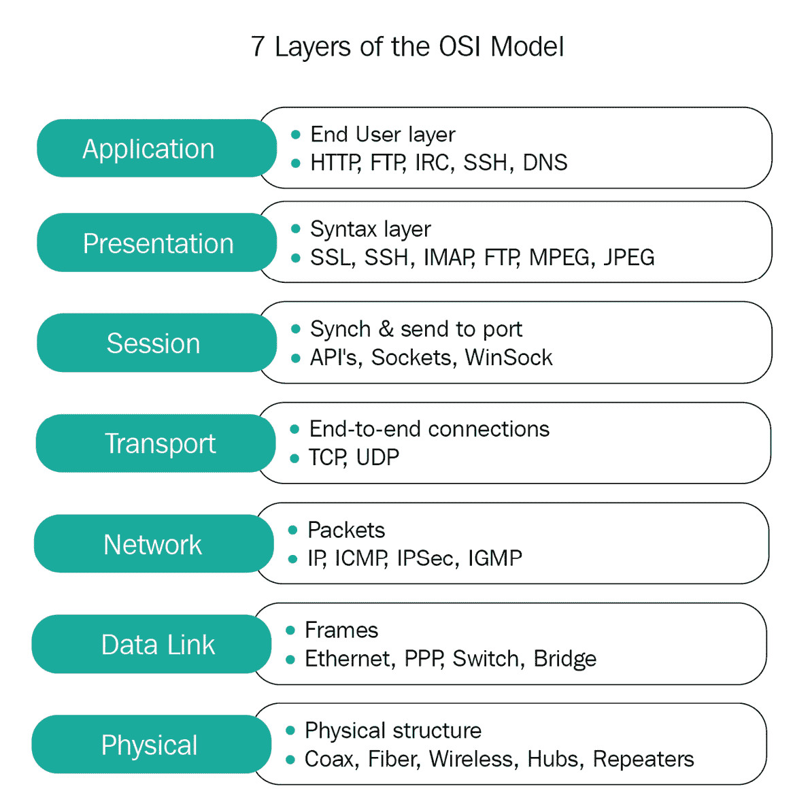
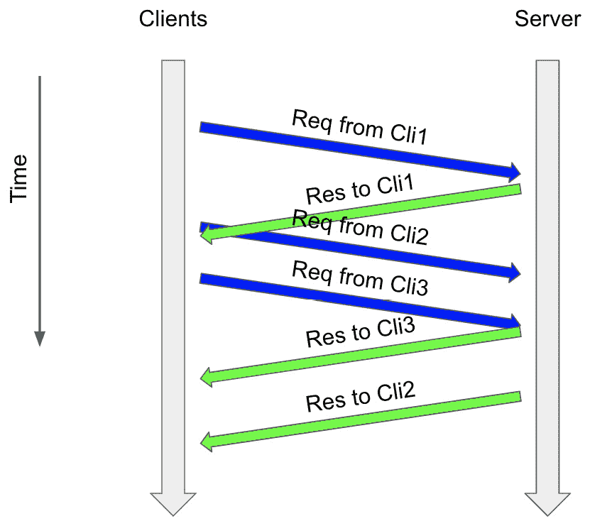
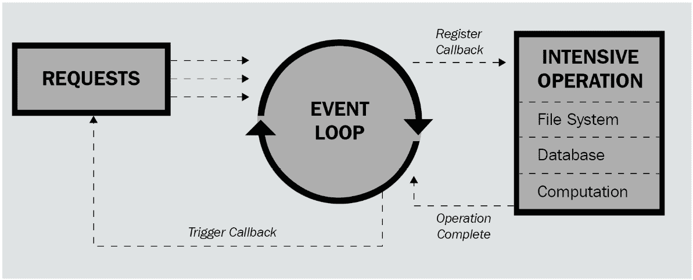

# *第十一章*：使用 asyncio 构建通信通道

通信通道是计算机科学领域应用并发的重要组成部分。在本章中，我们将介绍传输的基本理论，这些理论是由`asyncio`模块提供的类，用于抽象各种形式的通信通道。我们还将通过 Python 实现一个简单的回声服务器-客户端逻辑，以进一步说明`asyncio`和并发在通信系统中的应用。本章将帮助我们构建在通信通道的实际应用中关于异步编程的知识框架，我们使用的代码将作为更复杂应用的基础。

本章将涵盖以下主题：

+   通信通道的生态系统

+   Python 和 Telnet 入门

+   使用`aiohttp`的客户端通信

# 技术要求

本章的代码文件可以通过此链接访问：

[`github.com/PacktPublishing/Advanced-Python-Programming-Second-Edition/tree/main/Chapter11`](https://github.com/PacktPublishing/Advanced-Python-Programming-Second-Edition/tree/main/Chapter11)

# 通信通道的生态系统

术语*通信通道*用于表示不同系统之间的物理布线连接以及促进计算机网络的数据逻辑通信。在本章中，我们只关注后者，因为它与计算相关，并且更贴近异步编程的概念。

首先，在本节中，我们将讨论通信通道的一般结构，以及该结构中两个与异步编程特别相关的特定元素。第一个元素是通信协议层。

## 通信协议层

大多数通过通信通道完成的数据传输过程都是以**开放系统互联**（**OSI**）模型协议层的形式进行的。OSI 模型概述了系统间通信过程中的主要层和主题。

下图展示了 OSI 模型的一般结构：



图 11.1 – OSI 模型结构

如所示，在数据传输过程中，存在七个主要的通信层，这些层具有不同的计算级别和特定性。我们不会深入探讨每一层的具体目的和功能，但了解媒体和主机层背后的基本概念仍然很重要。

三个底层包含与通信通道底层过程交互的低级操作。物理层和数据链路层的操作包括编码方案、接入方案、低级错误检测和纠正、位同步等。这些操作用于实现和指定在传输之前处理和准备数据的逻辑。另一方面，网络层通过确定接收者的地址和选择数据传输路径，在计算机网络中将一个系统（例如，服务器）的数据包转发到另一个系统（例如，客户端）。

另一方面，最顶层处理高级数据通信和处理。在这些层级中，我们将重点关注传输层，因为它在实现通信通道时直接被`asyncio`模块利用。这一层通常被视为媒体层和主机层（例如，客户端和服务器）之间的概念过渡，负责在不同系统之间通过**端到端**（**E2E**）连接发送数据。此外，由于数据包（由网络层准备）在传输过程中可能会因为网络错误而丢失或损坏，传输层还负责通过错误检测代码中的方法检测这些错误。

其他主机层实现处理、解释和提供来自另一个系统的数据的机制。在从传输层接收数据后，会话层处理身份验证、授权和会话恢复过程。表示层随后将相同的数据转换并重新组织成可解释的表示形式。最后，应用层以用户友好的格式显示这些数据。考虑到这一点，让我们看看我们如何将异步编程框架应用于通信通道。

## 通信通道的异步编程

异步编程模型很好地补充了促进通信通道的过程。例如，在**超文本传输协议**（**HTTP**）通信中，服务器可以异步地同时处理多个客户端：当它等待特定客户端发起 HTTP 请求时，它可以切换到另一个客户端并处理该客户端的请求。同样，如果客户端需要向多个服务器发起 HTTP 请求并且必须等待某些服务器的大响应，它可以考虑更轻量级的响应，这些响应已经处理并发送回客户端。以下图表展示了服务器和客户端如何在 HTTP 请求中异步交互的示例：



图 11.2 – 异步、交错 HTTP 请求

总体而言，异步编程是一个构建通信通道的有吸引力的框架。因此，我们将看到如何使用 `asyncio` 模块来实现这一点。

## asyncio 中的传输和协议

`asyncio` 模块提供了几个不同的传输类。本质上，这些类是前面章节中讨论的传输层功能的实现。由于传输层在通信通道中扮演着至关重要的角色，传输类为 `asyncio`（以及开发者）提供了更多控制我们自己的通信通道实现过程的能力。

`asyncio` 模块结合了传输的抽象与异步程序实现的实现。具体来说，尽管传输是通信通道的核心元素，但为了利用传输类和其他相关通信通道工具，我们需要启动并调用事件循环，这是一个 `asyncio.AbstractEventLoop` 类的实例。然后，事件循环本身将创建传输并管理低级通信过程。

重要的是要注意，在 `asyncio` 中已建立的通信通道中的 `transport` 对象始终与 `asyncio.Protocol` 类的实例相关联。正如其名称所暗示的，`Protocol` 类指定了通信通道使用的底层协议；对于与另一个系统建立的每个连接，都会从这个类中创建一个新的协议对象。在紧密与 `transport` 对象协作时，协议对象可以调用来自 `transport` 对象的各种方法；这就是我们可以实现通信通道特定内部工作方式的地方。

因此，在构建连接通道时，我们通常需要关注 `asyncio.Protocol` 子类的实现及其方法。换句话说，我们使用 `asyncio.Protocol` 作为父类来派生一个满足我们通信通道需求的子类。为此，我们在自己的自定义协议子类中重写了以下来自 `asyncio.Protocol` 基类的方法：

+   `Protocol.connection_made(transport)`: 当另一个系统建立连接时，此方法会自动调用。`transport` 参数包含与连接关联的 `transport` 对象。同样，每个 `transport` 对象都需要与一个协议配对；我们通常在 `connection_made()` 方法中将此 `transport` 对象存储为特定协议对象的属性。

+   `Protocol.data_received(data)`: 当我们连接的系统发送其数据时，此方法会自动调用。请注意，包含发送信息的 `data` 参数通常以字节表示，因此在进一步处理 `data` 之前，应使用 Python 的 `encode()` 函数。

接下来，让我们考虑`asyncio`传输类中的其他重要方法。所有传输类都继承自父传输类`asyncio.BaseTransport`，对于它我们有以下常用方法：

+   `BaseTransport.get_extra_info()`: 如其名称所示，此方法返回调用`transport`对象的附加通道特定信息。结果可以包括有关套接字、管道和与该传输相关的子进程的信息。在本章的后面部分，我们将调用`BaseTransport.get_extra_info('peername')`以获取传输所经过的远程地址。

+   `BaseTransport.close()`: 此方法用于关闭调用`transport`对象，之后不同系统之间的连接将被停止。传输的相应协议将自动调用其`connection_lost()`方法。

在众多传输类实现中，我们将重点关注`asyncio.WriteTransport`类，它再次从`BaseTransport`类继承方法，并额外实现了用于简化只写传输功能的其他方法。在这里，我们将使用`WriteTransport.write()`方法，该方法将写入我们希望发送到通过`transport`对象与之通信的其他系统的数据。作为`asyncio`模块的一部分，此方法不是一个阻塞函数；相反，它以异步方式缓冲并发送写入的数据。

在我们深入 Python 中的工作示例之前，让我们简要讨论一下我们试图实现的大致情况——换句话说，我们程序的一般结构。

## asyncio 的服务器客户端的大致情况

如前所述，我们需要实现`asyncio.Protocol`的子类来指定我们通信通道的底层组织结构。每个异步程序的核心都有一个事件循环，因此我们还需要在协议类之外创建一个服务器，并在我们程序的事件循环中启动该服务器。这个过程将设置我们整个服务器的异步架构，可以通过`asyncio.create_server()`方法完成，我们将在接下来的示例中查看。

最后，我们将使用`AbstractEventLoop.run_forever()`方法无限期地运行我们异步程序的事件循环。类似于实际的真实服务器，我们希望我们的服务器一直运行，直到遇到问题，在这种情况下，我们将优雅地关闭服务器。以下图表说明了整个过程：



图 11.3 – 通信通道中的异步程序结构

有了这些，我们就准备好从下一节开始构建我们的应用程序了。

# Python 和 Telnet 入门

让我们看看一个具体的 Python 示例，该示例实现了一个促进异步通信的服务器。

## 启动服务器

让我们看看 `EchoServerClientProtocol` 类，如下所示：

```py
import asyncio
class EchoServerClientProtocol(asyncio.Protocol):
    def connection_made(self, transport):
        peername = transport.get_extra_info('peername')
        print('Connection from {}'.format(peername))
        self.transport = transport
    def data_received(self, data):
        message = data.decode()
        print('Data received: {!r}'.format(message))
```

在这里，我们的 `EchoServerClientProtocol` 类是 `asyncio.Protocol` 的子类。正如我们之前讨论的，在这个类内部，我们需要实现 `connection_made(transport)` 和 `data_received(data)` 方法。在 `connection_made()` 方法中，我们简单地通过 `get_extra_info()` 方法（使用 `'peername'` 参数）获取已连接系统的地址，使用该信息打印一条消息，并最终将 `transport` 对象存储在类的属性中。为了在 `data_received()` 方法中打印出类似的消息，我们再次使用 `decode()` 方法从字节数据中获取字符串对象。

让我们继续到脚本的主体程序，如下所示：

```py
loop = asyncio.get_event_loop()
coro = loop.create_server(EchoServerClientProtocol, \
  '127.0.0.1', 8888)
server = loop.run_until_complete(coro)
# Serve requests until Ctrl+C is pressed
print('Serving on {}'.format(server.sockets[0] \
  .getsockname()))
try:
    loop.run_forever()
except KeyboardInterrupt:
    pass
# Close the server
server.close()
loop.run_until_complete(server.wait_closed())
loop.close()
```

我们正在使用熟悉的 `asyncio.get_event_loop()` 函数为我们的异步程序创建一个事件循环。然后，我们通过让该事件循环调用 `create_server()` 方法来创建我们的通信服务器；此方法接受来自 `asyncio.Protocol` 类的子类，我们的服务器地址（在这种情况下，它是我们的本地主机：`127.0.0.1`），以及最后，该地址的端口号（通常为 `8888`）。

注意，此方法本身并不创建服务器；它仅初始化异步创建服务器的过程，并返回一个将完成该过程的协程。因此，我们需要将方法返回的协程存储在一个变量中（在我们的例子中是 `coro`），并让事件循环运行该协程。在通过我们的服务器对象的 `sockets` 属性打印出一条消息后，我们将无限期地运行事件循环，以保持服务器运行，除非引发 `KeyboardInterrupt` 异常。

最后，在程序结束时，我们将处理脚本的清理部分，即优雅地关闭服务器。这通常是通过让服务器对象调用 `close()` 方法（以启动服务器的关闭过程）并使用事件循环在服务器对象上运行 `wait_closed()` 方法来完成的，以确保服务器被正确关闭。最后，我们关闭事件循环。

## 安装 Telnet

在我们能够运行我们的示例 Python 程序之前，我们必须安装 Telnet 程序以正确模拟客户端和服务器之间的连接通道。Telnet 是一个提供终端命令的程序，这些命令促进了双向、交互式、面向文本通信的协议。如果您已经在您的计算机上运行了 Telnet，请直接跳到下一节；否则，请在本节中查找适合您系统的信息。

在 Windows 系统中，Telnet 已经安装，但可能未启用。要启用它，您可以通过使用 **“启用或关闭 Windows 功能”** 窗口并确保 **“Telnet 客户端”** 复选框被勾选，或者运行以下命令：

```py
dism /online /Enable-Feature /FeatureName:TelnetClient
```

Linux 系统通常预装了 Telnet，所以如果你拥有 Linux 系统，只需继续到下一节。

在 macOS 系统中，Telnet 可能已经安装在你的计算机上。如果没有，你需要通过 Homebrew 软件包管理工具来安装，如下所示：

```py
brew install telnet
```

注意，macOS 系统确实预装了 Telnet 的替代品，名为 Netcat。如果你不想在 macOS 计算机上安装 Telnet，只需在以下示例中使用 `nc` 命令代替 `telnet`，你将获得相同的效果。

## 模拟连接通道

运行以下服务器示例有多个步骤。首先，我们需要运行脚本以启动服务器，你将获得以下输出：

```py
> python example1.py
Serving on ('127.0.0.1', 8888)
```

注意，程序将一直运行，直到你调用 *Ctrl* + *C* 键组合。当程序在一个终端（这是我们服务器终端）中运行时，打开另一个终端并连接到指定端口（`8888`）的服务器（`127.0.0.1`），如图所示；这将作为我们的客户端终端：

```py
telnet 127.0.0.1 8888
```

现在，你将在服务器和客户端终端中看到一些变化。很可能是你的客户端终端会有以下输出：

```py
> telnet 127.0.0.1 8888
Trying 127.0.0.1...
Connected to localhost.
```

这是从 Telnet 程序的界面来的，表示我们已经成功连接到本地服务器。更有趣的输出在我们的服务器终端上，它将类似于以下内容：

```py
> python example1.py
Serving on ('127.0.0.1', 8888)
Connection from ('127.0.0.1', 60332)
```

回想一下，这是我们 `EchoServerClientProtocol` 类中实现的一个信息消息——具体来说，是在 `connection_made()` 方法中。同样，当服务器与一个新客户端建立连接时，此方法将自动调用以启动通信。从输出消息中，我们知道客户端正在从服务器 `127.0.0.1` 的端口 `60332` 发出请求（由于它们都是本地的，所以这与运行中的服务器相同）。

我们在 `EchoServerClientProtocol` 类中实现的一个新功能是在 `data_received()` 方法中。具体来说，我们打印从客户端发送的解码数据。要模拟这种类型的通信，只需在客户端终端中输入一条消息并按 *Return* (*Enter*，对于 Windows) 键。你不会在客户端终端输出中看到任何变化，但服务器终端应该会打印出一条消息，正如我们协议类中的 `data_received()` 方法所指定的。

例如，这是我从客户端终端发送消息 `Hello, World!` 时我的服务器终端的输出：

```py
> python example1.py
Serving on ('127.0.0.1', 8888)
Connection from ('127.0.0.1', 60332)
Data received: 'Hello, World!\r\n'
```

`\r`和`\n`字符仅仅是消息字符串中包含的回车字符。根据我们当前的协议，你可以向服务器发送多条消息，甚至可以有多个客户端向服务器发送消息。要实现这一点，只需打开另一个终端并再次连接到本地服务器。你将从服务器终端看到，一个不同的客户端（来自不同的端口）已连接到服务器，而我们的服务器与旧客户端的原始通信仍在进行中。这是异步编程带来的另一个结果，允许多个客户端无缝地与同一服务器通信，而不使用线程或进程。

## 发送消息回客户端

因此，在我们的当前示例中，我们的异步服务器可以接收、读取和处理来自客户端的消息。然而，为了使我们的通信通道有用，我们还想从服务器向客户端发送消息。在本节中，我们将更新我们的服务器为回显服务器，根据定义，它将把从特定客户端接收到的所有数据发送回该客户端。

要做到这一点，我们将使用`asyncio.WriteTransport`类的`write()`方法。考虑以下`EchoServerClientProtocol`类的`data_received()`方法：

```py
import asyncio
class EchoServerClientProtocol(asyncio.Protocol):
    def connection_made(self, transport):
        peername = transport.get_extra_info('peername')
        print('Connection from {}'.format(peername))
        self.transport = transport
    def data_received(self, data):
        message = data.decode()
        print('Data received: {!r}'.format(message))
        self.transport.write(('Echoed back: {}'.format \
          (message)).encode())
loop = asyncio.get_event_loop()
coro = loop.create_server(EchoServerClientProtocol, \
  '127.0.0.1', 8888)
server = loop.run_until_complete(coro)
# Serve requests until Ctrl+C is pressed
print('Serving on {}'.format(server.sockets[0] \
  .getsockname()))
try:
    loop.run_forever()
except KeyboardInterrupt:
    pass
# Close the server
server.close()
loop.run_until_complete(server.wait_closed())
loop.close()
```

在从`transport`对象接收数据并打印出来后，我们向`transport`对象写入一条相应的消息，该消息将返回到原始客户端。通过运行此脚本并模拟我们在上一个示例中用 Telnet 或 Netcat 实现的相同通信，你将看到在客户端终端中输入一条消息后，客户端从服务器接收到了回显消息。这是我在启动通信通道并输入`Hello, World!`消息后的输出：

```py
> telnet 127.0.0.1 8888
Trying 127.0.0.1...
Connected to localhost.
Hello, World!
Echoed back: Hello, World!
```

从本质上讲，这个例子说明了我们可以通过自定义`asyncio.Protocol`类实现的双向通信通道的能力。在运行服务器时，我们可以获取连接到服务器的各个客户端发送的数据，处理数据，并最终将所需的结果发送回适当的客户端。

## 关闭传输

有时，我们可能需要强制关闭通信通道中的传输。例如，即使使用异步编程和其他并发形式，你的服务器也可能因为来自多个客户端的持续通信而超负荷。另一方面，当服务器达到最大容量时，完全处理一些已发送的请求并立即拒绝其余请求是不理想的。

因此，我们可以在我们的协议中指定，在成功通信后关闭每个连接到服务器的客户端。我们将通过使用`BaseTransport.close()`方法强制关闭调用`transport`对象来实现这一点，这将停止服务器与特定客户端之间的连接。再次强调，我们正在修改`EchoServerClientProtocol`类的`data_received()`方法，如下所示：

```py
import asyncio
class EchoServerClientProtocol(asyncio.Protocol):
    def connection_made(self, transport):
        peername = transport.get_extra_info('peername')
        print('Connection from {}'.format(peername))
        self.transport = transport
    def data_received(self, data):
        message = data.decode()
        print('Data received: {!r}'.format(message))
        self.transport.write(('Echoed back: \
          {}'.format(message)).encode())
        print('Close the client socket')
        self.transport.close()
loop = asyncio.get_event_loop()
coro = loop.create_server(EchoServerClientProtocol, \
  '127.0.0.1', 8888)
server = loop.run_until_complete(coro)
# Serve requests until Ctrl+C is pressed
print('Serving on {}'.format(server.sockets[0].getsockname()))
try:
    loop.run_forever()
except KeyboardInterrupt:
    pass
# Close the server
server.close()
loop.run_until_complete(server.wait_closed())
loop.close()
```

运行脚本，连接到指定的服务器，并输入一些消息以查看我们实现的变化。根据我们当前的设置，在客户端连接并发送消息到服务器后，它将收到一个回显消息，并且与服务器之间的连接将被关闭。这是我在使用我们当前协议实现模拟此过程后获得的输出（再次，来自 Telnet 程序的界面）：

```py
> telnet 127.0.0.1 8888
Trying 127.0.0.1...
Connected to localhost.
Hello, World!
Echoed back: Hello, World!
Connection closed by foreign host.
```

到目前为止，我们已经介绍了使用`asyncio`模块实现异步通信通道的示例，主要从通信过程的客户端角度进行；换句话说，我们一直在处理和外部系统发送的请求。然而，这仅仅是方程式的一方面，我们还需要探索通信的客户端。在下一节中，我们将讨论如何将异步编程应用于向服务器发送请求。

# 使用 aiohttp 进行客户端通信

如你所猜测，这个过程的目标是高效地从外部系统异步请求数据。我们将回顾网络爬虫的概念，这是自动化 HTTP 请求到各种网站并从它们的**超文本标记语言**（**HTML**）源代码中提取特定信息的过程。如果你还没有阅读*第九章*，*并发 Web 请求*，我强烈建议你在继续本节之前阅读它，因为该章节涵盖了网络爬虫和其他相关、重要的概念。

在本节中，你还将了解到另一个支持异步编程选项的模块：`aiohttp`（代表`asyncio`模块，以方便异步编程）。

## 安装 aiohttp 和 aiofiles

`aiohttp`模块不是 Python 发行版预安装的；然而，与其他包类似，你可以通过使用`pip`或`conda`命令轻松安装该模块。我们还将安装另一个模块`aiofiles`，它支持异步文件写入。如果你使用`pip`作为包管理器，只需运行以下命令：

```py
pip install aiohttp
pip install aiofiles
```

如果你使用 Anaconda，请运行以下命令：

```py
conda install aiohttp
conda install aiofiles
```

如往常一样，为了确认你已成功安装了包，打开你的 Python 解释器并尝试导入该模块。在这种情况下，运行以下代码：

```py
>>> import aiohttp
>>> import aiofiles
```

如果包已成功安装，将不会出现错误信息。

## 获取网站的 HTML 代码

首先，让我们看看如何使用 `aiohttp` 从单个网站发起请求并获取其 HTML 源代码。请注意，即使只有一个任务（一个网站），我们的应用程序仍然是异步的，异步程序的结构仍然需要按照以下方式实现：

```py
import aiohttp
import asyncio
async def get_html(session, url):
    async with session.get(url, ssl=False) as res:
        return await res.text()
async def main():
    async with aiohttp.ClientSession() as session:
        html = await get_html(session, ' \
          http://packtpub.com')
        print(html)
loop = asyncio.get_event_loop()
loop.run_until_complete(main())
```

让我们先考虑 `main()` 协程。我们在上下文管理器中初始化 `aiohttp.ClientSession` 类的一个实例；请注意，我们还在这个声明前放置了 `async` 关键字，因为整个上下文块本身也将被视为协程。在这个块内部，我们调用并等待 `get_html()` 协程进行处理并返回。

将注意力转向 `get_html()` 协程，我们可以看到它接受一个会话对象和一个 `GET` 请求，并将服务器响应存储到 `res` 变量中。最后，我们返回存储在响应中的 HTML 源代码。由于响应是从 `aiohttp.ClientSession` 类返回的对象，其方法是异步函数，因此当我们调用 `text()` 函数时，需要指定 `await` 关键字。

当你运行程序时，Packt 网站的整个 HTML 源代码将被打印出来。例如，以下是我输出的部分内容：

```py
<!doctype html>
<html lang="en">
<head>
<script>
    var BASE_URL = 'https://www.packtpub.com/';
    var require = {
        "baseUrl": "https://www.packtpub.com/static
          /version1611744644/frontend/Packt/default/en_GB"
    };
</script>
<meta charset="utf-8" />
<meta name="title" content="Packt | Programming Books, eBooks 
&amp; Videos for Developers" />
<meta name="description" content="Packt is the online 
library and learning platform for professional developers. 
Learn Python, JavaScript, Angular and more with eBooks, 
videos and courses" />
<meta name="robots" content="INDEX,FOLLOW" />
<meta name="viewport" content="width=device-width, initial-
scale=1, maximum-scale=1, user-scalable=1, shrink-to-
fit=no" />
<meta name="" content="charset=utf-8" />
<title>Packt | Programming Books, eBooks &amp
…
```

到目前为止，我们可以通过向多个网站异步发送请求来收集数据，并打印出响应的 HTML。大多数时候，仅仅打印出 HTML 是不合适的；相反，我们希望将返回的 HTML 代码写入输出文件。本质上，这个过程是异步下载，这也在流行的下载管理器的底层架构中实现。为此，我们将使用 `aiofiles` 模块，结合 `aiohttp` 和 `asyncio`。

## 异步写入文件

首先，我们将编写一个 `download_html()` 协程，如下所示：

```py
async def download_html(session, url):
    async with session.get(url, ssl=False) as res:
        filename = f'output/{os.path.basename(url)}.html'
        async with aiofiles.open(filename, 'wb') as f:
            while True:
                chunk = await res.content.read(1024)
                if not chunk:
                    break
                await f.write(chunk)
        return await res.release()
```

这是上一个例子中 `get_html()` 协程的更新版本。我们不再使用 `aiohttp.ClientSession` 实例来发起 `GET` 请求并打印出返回的 HTML 代码，而是现在使用 `aiofiles` 模块将 HTML 代码写入文件。例如，为了便于异步文件写入，我们使用 `aiofiles` 的异步 `open()` 函数在上下文管理器中读取文件。此外，我们使用 `read()` 函数异步地以块的形式读取响应返回的 HTML；这意味着在读取当前响应的 `1024` 字节后，执行流程将返回到事件循环，并发生任务切换事件。

`main()` 协程和本例中的主程序与上一个例子中的相对相同，正如我们在这里可以看到的：

```py
async def main(url):
    async with aiohttp.ClientSession() as session:
        await download_html(session, url)
urls = [
    'http://packtpub.com',
    'http://python.org',
    'http://docs.python.org/3/library/asyncio',
    'http://aiohttp.readthedocs.io',
    'http://google.com'
]
loop = asyncio.get_event_loop()
loop.run_until_complete(
    asyncio.gather(*(main(url) for url in urls))
)
```

`main()` 协程接收一个 URL 并将其传递给 `download_html()` 协程，同时传递一个 `aiohttp.ClientSession` 实例。最后，在我们的主程序中，我们创建一个事件循环并将指定列表中的每个 URL 传递给 `main()` 协程。运行程序后，你的输出应该看起来像这样，尽管程序运行所需的时间可能会有所不同：

```py
> python3 example5.py
Took 0.72 seconds.
```

此外，一个名为 `output` 的子文件夹（位于 `Chapter18` 文件夹内）将被填充从我们的 URL 列表中的每个网站下载的 HTML 代码。同样，这些文件是通过我们之前讨论的 `aiofiles` 模块的功能异步创建和写入的。正如你所见，为了比较这个程序及其对应的同步版本的速度，我们也在跟踪整个程序运行所需的时间。

现在，前往 `Chapter11/example6.py` 文件。这个脚本包含了我们当前程序同步版本的代码。具体来说，它按顺序对单个网站进行 HTTP `GET` 请求，文件写入过程也是顺序实现的。这个脚本产生了以下输出：

```py
> python3 example6.py
Took 1.47 seconds.
```

虽然它达到了相同的结果（下载 HTML 代码并将其写入文件），但我们的顺序程序比其异步版本花费了更多的时间。

# 摘要

异步编程可以提供补充高效促进通信通道过程的功能。与 `aiohttp` 模块一起，`asyncio` 在客户端通信过程中提供了效率和灵活性。可以与另外两个异步编程模块协同工作的 `aiofiles` 模块，也有助于促进异步的文件读写。

我们现在已经探讨了并发编程中三个最大、最重要的主题：线程、多进程和异步编程。我们展示了它们如何应用于各种编程问题，并在速度上提供了显著的改进。本章中我们开发的代码可以作为构建更复杂应用程序的基础，它很容易修改。

在本书的下一章中，我们将开始讨论并发编程通常向开发者和程序员提出的问题，首先是死锁。

# 问题

1.  通信通道是什么？它与异步编程有什么联系？

1.  OSI 模型协议层的两个主要部分是什么？它们各自有什么作用？

1.  传输层是什么？为什么它对通信通道至关重要？

1.  `asyncio` 如何促进服务器端通信通道的实现？

1.  `asyncio` 如何促进客户端通信通道的实现？

1.  `aiofiles` 是什么？

# 进一步阅读

更多信息，您可以参考以下链接：

+   *物联网系统和通信通道*（br`idgera.com/iot-communication-channels/`），由 *Bridgera* 编著

+   *用 Python 自动化无聊的事情：适合完全初学者的实用编程*，*Al Sweigart*，*No Starch Press*

+   *传输和协议* (`docs.python.org/3/library/asyncio-protocol`), Python 文档
