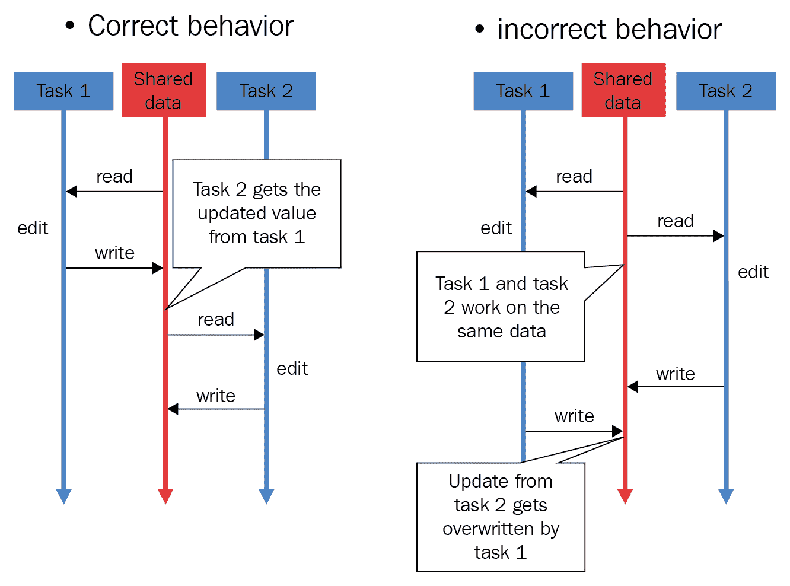
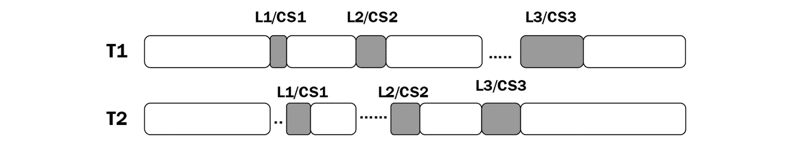
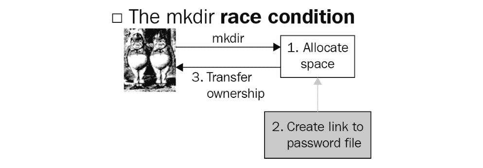

# *第十四章*：竞态条件

在本章中，我们将讨论**竞态条件**的概念及其在并发环境中的潜在原因。还将涵盖与竞态条件和并发编程高度相关的临界区概念。我们将使用一些 Python 示例代码来模拟竞态条件及其常用的解决方案。最后，还将讨论处理竞态条件的现实生活应用。

在本章中，我们将涵盖以下主题：

+   竞态条件的概念

+   在 Python 中模拟竞态条件

+   锁作为解决竞态条件的方法

+   生活中的竞态条件

本章，与前面两章类似，更深入地探讨了并发编程中可能出错的地方，并介绍了如何避免和预防这些问题的多种方法。在本章中，我们的重点将放在竞态条件上。

# 技术要求

本章的代码可以在以下 GitHub 仓库中找到：[`github.com/PacktPublishing/Advanced-Python-Programming-Second-Edition/tree/main/Chapter14`](https://github.com/PacktPublishing/Advanced-Python-Programming-Second-Edition/tree/main/Chapter14)。

# 竞态条件的概念

通常，**竞态条件**被定义为一种现象，在此现象中，系统的输出既是不确定的，又依赖于调度算法以及任务被调度和执行的顺序。当数据在此过程中被错误处理或损坏时，竞态条件就变成了系统中的错误。鉴于这个问题本质，在并发系统中发生竞态条件是很常见的，这强调了调度和协调独立任务的重要性。

竞态条件可能发生在电子硬件系统和软件应用中；在本章中，我们只讨论软件开发背景下的竞态条件——特别是**并发软件应用**。本节将涵盖竞态条件的理论基础及其根本原因，以及*临界区*的概念。

## 临界区

**临界区**指的是在并发应用程序中由多个进程或线程访问的共享资源，这些资源可能导致意外甚至错误的行为。我们已经了解到，有多种方法可以保护这些资源中包含的数据的完整性，我们将这些受保护的区域称为*临界区*。

如您所想象，当这些临界区中的数据被并发或并行交互和修改时，可能会被错误处理或损坏。这尤其当与之交互的线程和进程在协调和调度方面做得不好时更为明显。因此，合乎逻辑的结论是不允许多个代理同时进入临界区。我们称这个概念为**互斥**。

在下一小节中，我们将讨论临界区与竞态条件原因之间的关系。

## 竞态条件是如何发生的

让我们考虑一个简单的并发程序，以便了解什么可能导致竞态条件：

1.  假设程序有一个共享资源，并且有两个独立的线程（*线程 1* 和 *线程 2*）将访问并交互这个资源。具体来说，共享资源是一个数字，并且根据它们各自的执行指令，每个线程都应该读取这个数字，将其增加 1，最后，使用增加后的数字更新共享资源的值。

1.  接下来，假设共享的数字最初是 2，然后线程 1 访问并交互这个数字；共享资源将变为 3。

1.  在线程 1 成功修改并退出资源后，线程 2 开始执行其指令，共享资源（一个数字）被更新为 4。在整个过程中，原始的数字 2 被两次增加（每次由不同的线程增加），最终保持了一个值为 4。在这种情况下，共享数字没有被不当处理或损坏。

1.  然后，想象一个场景，共享的数字在开始时仍然是 2，但两个线程同时访问这个数字。现在，每个线程从共享资源中读取数字 2；它们各自将数字 2 增加到 3，然后将数字 3 写回共享资源。尽管线程两次访问并交互了共享资源，但在整个过程中，共享资源最终只保持了一个值为 3 的值。

这是一个并发程序中发生竞态条件的例子：由于第二个访问共享资源的线程在第一个线程完成其执行之前（换句话说，在将新值写入共享资源之前）进行操作，第二个线程未能获取更新的资源值。这导致当第二个线程写入资源时，被第一个线程处理和更新的值被覆盖。在两个线程执行结束时，从技术上讲，共享资源只被第二个线程更新。

以下图表进一步说明了正确数据处理过程与涉及竞态条件的情况之间的对比：



图 14.1 – 处理共享数据不当

直观上看，我们可以看到竞态条件会导致数据的错误处理和损坏。在先前的例子中，我们可以看到竞态条件仅在两个独立的线程访问公共资源时发生，导致共享资源被错误地更新，并在程序结束时持有错误值。我们理解，大多数现实生活中的并发应用程序包含大量线程和进程，以及额外的共享资源，并且与共享资源交互的线程/进程越多，发生竞态条件的可能性就越大。

在我们讨论可以实施的解决方案来解决竞态条件问题之前，让我们尝试在 Python 中模拟这个问题。

# 在 Python 中模拟竞态条件

如果你已经从 GitHub 页面下载了这本书的代码，请继续导航到`Chapter14`文件夹。

为了模拟竞态条件，首先，我们需要一个公共资源。在这种情况下，它是一个计数器变量以及可以同时访问它的多个线程。让我们看一下`Chapter14/example1.py`文件——特别是以下`update()`函数：

```py
import random
import time
def update():
    global counter
    current_counter = counter # reading in shared resource
    time.sleep(random.randint(0, 1)) # simulating heavy 
    calculations
    counter = current_counter + 1 # updating shared 
    resource
```

上述`update()`函数的目的是增加一个名为`counter`的全局变量，它将由我们脚本中的另一个线程调用。在函数内部，我们正在与共享资源交互——在这种情况下，`counter`。然后，我们将`counter`的值赋给另一个局部变量，称为`current_counter`（这是为了模拟从更复杂的数据结构中读取共享资源数据的过程）。

接下来，我们将使用`time.sleep()`方法暂停函数的执行。程序暂停的持续时间是伪随机选择的，介于`0`和`1`之间，由`random.randint(0, 1)`函数调用生成。因此，程序将暂停一秒钟或根本不暂停。最后，我们将新计算的`current_counter`值（即它的增量）赋给原始共享资源（`counter`变量）。

现在，我们可以继续我们的主程序：

```py
import threading
counter = 0
threads = [threading.Thread(target=update) for i in \
  range(20)]
for thread in threads:
    thread.start()
for thread in threads:
    thread.join()
print(f'Final counter: {counter}.')
print('Finished.')
```

在这里，我们正在使用一组`threading.Thread`对象初始化`counter`全局变量，以便并发执行`update()`函数；我们初始化了 20 个`thread`对象，以便将我们的共享计数器增加 20 次。在启动并加入我们所有的线程之后，我们最终可以打印出我们共享的`counter`变量的最终值。

从理论上讲，一个设计良好的并发程序将总共成功增加共享计数器 20 次，由于它的原始值是`0`，程序结束时的计数器最终值应该是`20`。然而，当你运行这个脚本时，你获得的`counter`变量很可能不会持有`20`的最终值。以下是我运行脚本得到的输出：

```py
> python3 example1.py
Final counter: 9.
Finished.
```

前面的输出表明计数器只成功增加了九次。这是由我们的并发程序中的竞态条件直接导致的。这种竞态条件发生在特定线程花费时间读取和处理共享资源中的数据（具体来说，使用`time.sleep()`方法持续一秒钟）时，而另一个线程读取了当前的`counter`变量值，此时该值尚未被第一个线程更新，因为它尚未完成其执行。

有趣的是，如果一个线程不花费任何时间处理数据（换句话说，当伪随机`random.randint()`方法选择`0`时），共享资源的值可能刚好在下一个线程读取和处理它的时候被更新。这一现象可以通过程序运行中计数器最终值的变化来体现。例如，以下是我运行脚本三次后得到的输出。第一次运行的输出如下：

```py
> python3 example1.py
Final counter: 9.
Finished.
```

第二次运行的输出如下：

```py
> python3 example1.py
Final counter: 12.
Finished.
```

第三次运行的输出如下：

```py
> python3 example1.py
Final counter: 5.
Finished.
```

再次强调，计数器的最终值取决于花费一秒钟暂停的线程数量以及完全未暂停的线程数量。由于这两个数字反过来又依赖于`random.randint()`方法，因此计数器的最终值在不同的程序运行中会有所不同。尽管如此，我们的程序仍然会存在竞态条件，除非我们能确保计数器的最终值总是`20`（也就是说，计数器总共成功增加了 20 次）。

在下一节中，我们将讨论解决竞态条件最常用的方法：锁。

# 锁作为解决竞态条件的方法

直观来说，因为我们观察到的竞态条件是在多个线程或进程同时访问和写入共享资源时出现的，所以解决竞态条件的关键思想是隔离不同线程/进程的执行，尤其是在与共享资源交互时。具体来说，我们需要确保一个线程/进程只有在任何其他线程/进程与该资源完成交互后才能访问共享资源。

使用锁，我们可以将并发程序中的共享资源转变为临界区，其数据的完整性将得到保证。我们将在接下来的操作中看到这一点。

## 锁的有效性

一个临界区保证了共享资源的互斥访问，并且不能被多个进程或线程同时访问；这将防止任何受保护的数据被带有冲突信息的更新或修改，这些冲突信息是由竞态条件引起的。

在以下图中，`var`通过一个**互斥锁（mutex）**。这是因为**线程 A**已经正在访问资源：


图 14.2 – 锁防止同时访问临界区

现在，我们将指定，为了在并发程序中访问临界区，一个线程或进程需要获取与临界区相关联的锁对象；同样，该线程或进程在离开临界区时也需要释放该锁。这种设置将有效地防止对临界区的多次访问，从而防止竞态条件。以下图表展示了多个线程与多个临界区交互的执行流程，其中实现了锁：



图 14.3 – 多线程中的锁和临界区

如前图所示，线程**T1**和**T2**在其各自的执行指令中都与三个临界区交互：**CS1**、**CS2**和**CS3**。在这里，**T1**和**T2**几乎同时尝试访问**CS1**。此外，由于**CS1**被锁**L1**保护，只有**T1**可以获取锁**L1**，因此可以访问/交互临界区。相比之下，**T2**必须等待**T1**退出临界区并释放锁后才能访问该区域。同样，对于临界区**CS2**和**CS3**，尽管两个线程同时需要访问临界区，但只有一个可以处理它，而另一个必须等待获取与临界区相关的锁。

现在，让我们使用*Python*来实现这个解决方案。

## Python 实现

导航到`Chapter14/example2.py`文件，并考虑以下我们修正后的`update()`函数：

```py
import random
import time
def update():
    global counter
    with count_lock:
        current_counter = counter # reading in shared 
        resource
        time.sleep(random.randint(0, 1)) # simulating heavy 
        calculations
        counter = current_counter + 1
```

在这里，你可以看到`update()`函数中指定的线程的所有执行指令都在名为`count_lock`的锁对象的作用域内。因此，每次调用线程运行该函数时，它必须首先获取锁对象，然后才能执行任何指令。在我们的主程序中，我们简单地创建锁对象，如下所示：

```py
import threading
counter = 0
count_lock = threading.Lock()
threads = [threading.Thread(target=update) for i in \
  range(20)]
for thread in threads:
    thread.start()
for thread in threads:
    thread.join()
print(f'Final counter: {counter}.')
print('Finished.')
```

运行程序。你的输出应该类似于以下内容：

```py
> python3 example2.py
Final counter: 20.
Finished.
```

在这里，你可以看到计数器成功增加了 20 次，并在程序结束时保持了正确的值。此外，无论脚本执行多少次，计数器的最终值始终将是**20**。这是在并发程序中使用锁实现临界区的优势。

## 锁的缺点

在*第十二章* *死锁*中，我们介绍了一种有趣的现象，即锁的使用可能导致不希望的结果。具体来说，我们发现，在并发程序中实现了足够的锁之后，整个程序可以变成顺序的。让我们用我们当前的程序来分析这个概念。考虑以下`Chapter14/example3.py`文件：

```py
import threading
import random; random.seed(0)
import time
def update(pause_period):
    global counter
    with count_lock:
        current_counter = counter # reading in shared 
        resource
        time.sleep(pause_period) # simulating heavy 
        calculations
        counter = current_counter + 1 # updating shared 
        resource
pause_periods = [random.randint(0, 1) for i in range(20)]
###############################################################
counter = 0
count_lock = threading.Lock()
start = time.perf_counter()
for i in range(20):
    update(pause_periods[i])
print('--Sequential version--')
print(f'Final counter: {counter}.')
print(f'Took {time.perf_counter() - start : .2f} seconds.')
###############################################################
counter = 0
threads = [threading.Thread(target=update, \
  args=(pause_periods[i],)) for i in range(20)]
start = time.perf_counter()
for thread in threads:
    thread.start()
for thread in threads:
    thread.join()
print('--Concurrent version--')
print(f'Final counter: {counter}.')
print(f'Took {time.perf_counter() - start : .2f} seconds.')
###############################################################
print('Finished.')
```

此脚本的目标是比较我们当前并发程序与其顺序版本的速度。在这里，我们仍然使用相同的带有锁的`update()`函数，并运行 20 次，既顺序运行又并发运行，就像我们之前做的那样。此外，我们创建了一个确定的暂停周期列表：

```py
pause_periods = [random.randint(0, 1) for i in range(20)]
```

这样做是为了确保在模拟顺序版本和并发版本时这些周期是一致的（因此，`update()`函数现在接受一个参数，指定每次调用时暂停的周期）。

这是我们需要模拟具有许多锁的程序**顺序性**的设置，我们将在下一小节中亲自看到。

### 将并发程序转换为顺序程序

在这里，我们只是在`for`循环中调用`update()`函数，进行 20 次迭代，并跟踪循环完成所需的时间。请注意，尽管这是为了模拟程序的顺序版本，但`update()`函数仍然需要事先创建锁对象，因此我们在这里初始化它：

```py
counter = 0
count_lock = threading.Lock()
start = time.perf_counter()
for i in range(20):
    update(pause_periods[i])
print('--Sequential version--')
print(f'Final counter: {counter}.')
print(f'Took {time.perf_counter() - start : .2f} seconds.')
```

最后一步是重置计数器并运行我们已实现的并发版本程序。同样，我们需要在初始化每个运行`update()`函数的线程时传入相应的暂停期。此外，我们正在跟踪此并发版本程序运行所需的时间：

```py
counter = 0
threads = [threading.Thread(target=update, \
args=(pause_periods[i],)) for i in range(20)]
start = time.perf_counter()
for thread in threads:
    thread.start()
for thread in threads:
    thread.join()
print('--Concurrent version--')
print(f'Final counter: {counter}.')
print(f'Took {time.perf_counter() - start : .2f} seconds.')
```

现在，在你运行脚本之后，你会观察到我们的程序顺序版本和并发版本运行所需的时间相同。具体来说，以下是我获得的结果；在这种情况下，它们都大约花费了 12 秒。你的程序实际所需的时间可能不同，但两个版本的速度应该仍然相等：

```py
> python3 example3.py
--Sequential version--
Final counter: 20.
Took 12.03 seconds.
--Concurrent version--
Final counter: 20.
Took 12.03 seconds.
Finished.
```

因此，我们的并发程序花费的时间与其顺序版本相同，这否定了实现程序并发的一个最大目的：*提高速度*。但为什么具有相同指令和元素集的并发和传统顺序应用程序也会有相同速度？并发程序是否总是应该比顺序程序产生更快的速度？

记住，在我们的程序中，临界区是由锁对象保护的，并且没有多个线程可以同时访问它。由于程序的执行（计数器增加 20 次）依赖于一个线程访问临界区，因此在临界区放置锁对象意味着在任何给定时间只能有一个线程在执行。根据这个规范，任何两个线程的执行都不能相互重叠，并且从这个并发实现的并发性中无法获得额外的速度。

这是我们分析死锁问题时遇到的现象：如果在并发程序中放置足够的锁，该程序将完全变为顺序执行。这就是为什么锁有时不是并发编程中解决问题的理想解决方案。然而，这种情况只会在并发程序的每次执行都依赖于与临界区交互时发生。大多数时候，读取和操作共享资源的数据只是整个程序的一部分；因此，并发仍然为我们提供了预期的额外速度。

锁的另一个方面是它们实际上并没有锁定任何东西。我们将在下一节更详细地讨论这一点。

### 锁并不能锁定任何东西

只有当线程和进程与特定共享资源交互时，锁对象才会被利用。换句话说，如果那些线程和进程选择在访问和修改共享资源之前不检查锁，锁对象本身无法阻止他们这样做。

在我们的示例中，你已经发现，为了实现锁对象的获取/释放过程，线程或进程的指令需要被锁上下文管理器包装起来；这个规范依赖于*线程/进程执行逻辑*的实现，而不是资源。这是因为我们所看到的锁对象与它们应该保护的资源没有任何联系。所以，如果线程/进程执行逻辑不需要与与共享资源相关的锁对象进行任何交互，那么该线程或进程可以轻松地访问资源，可能造成*不当操作*和数据损坏。

这不仅适用于单个并发程序中存在多个线程和进程的范围。假设我们有一个由多个组件组成的并发系统，这些组件都相互作用并操作系统共享的资源，并且这个资源与一个锁对象相关联；因此，如果这些组件中的任何一个未能与该锁交互，它就可以简单地绕过锁实现的保护并访问共享资源。更重要的是，锁的这一特性对并发程序的安全性也有影响。如果外部恶意代理连接到系统（例如，恶意客户端与服务器交互）并意图破坏系统共享的数据，那么该代理可以被指示简单地忽略锁对象并以侵入的方式访问这些数据。

认为锁无法锁定任何东西的观点是由 Python 核心开发者 Raymond Hettinger 普及的，他在 Python 并发编程中负责实现各种元素。有人认为，仅使用锁对象并不能保证并发数据结构和系统的安全实现。锁需要具体地与它们应该保护的资源相联系，并且没有任何东西能够在首先获取与其相关的锁之前访问资源。或者，其他并发同步工具，如原子消息队列，可以提供解决这个问题的方案。

现在，你已经了解了竞态条件的概念，知道了它们在并发系统中是如何产生的，以及如何有效地防止它们。在下一节中，我们将提供一个关于竞态条件如何在计算机科学的各个子领域中实际发生的总体观点。

# 生活中的竞态条件

尤其是我们将讨论安全、文件管理和网络等主题。竞态条件不仅存在于关于全局计数器的简单、最小化代码示例中。它们存在于许多重要任务中，如安全、文件管理和网络。在本节中，我们将从理论角度简要讨论这些示例可能的样子。

## 安全性

并发编程在涉及所讨论系统的安全性方面可能具有重大影响。回想一下，竞态条件出现在读取和修改资源数据的进程之间；在认证系统中，竞态条件可能导致在**检查时间**（检查代理凭证的时间）和**使用时间**（代理可以利用资源的时间）之间的数据损坏。这个问题也被称为**检查到使用时间**（**TOCTTOU**）错误，这对安全系统无疑是破坏性的。

在处理竞态条件时对共享资源的粗心保护，正如我们在上一节中简要提到的，可能会让外部代理获得访问那些本应受保护资源的权限。这些代理随后可以更改资源的数据以创建**权限提升**（简单来说，让自己非法访问更多共享资源），或者他们可以简单地破坏数据，导致整个系统出现故障。

有趣的是，竞态条件也可以用于实现计算机安全。由于竞态条件是由多个线程/进程对共享资源的无序访问引起的，因此竞态条件发生的具体规范具有很大的随机性。例如，在我们的 Python 示例中，你了解到，在模拟竞态条件时，计数器的最终值在不同的程序执行中会有所不同；这（部分）是因为多个线程运行并访问共享资源的情况具有不可预测性。（我说部分，因为随机性也源于我们在程序每次执行中生成的随机暂停期。）因此，有时会故意引发竞态条件，而当竞态条件发生时获得的信息可以用于生成安全过程的数字指纹——再次强调，这些信息具有很大的随机性，因此对于安全目的来说非常有价值。

## 操作系统

在操作系统的文件和内存管理上下文中，当两个不同的程序尝试访问同一资源，如内存空间时，可能会发生竞态条件。想象一下，两个来自不同程序的过程已经运行了相当长的时间，尽管它们在内存空间方面最初是分开初始化的，但已经积累了足够的数据，一个进程的执行栈现在与另一个进程的栈发生了碰撞。这可能导致两个进程共享同一部分的内存空间，并最终可能导致不可预测的后果。

竞态条件的复杂性方面另一个例子是 Unix 操作系统版本 7——具体来说，是在`mkdir`命令中。通常，`mkdir`命令用于在 Unix 操作系统中创建新目录；这是通过调用`mknod`命令来创建实际目录和`chown`命令来指定该目录的所有者来完成的。因为有两个独立的命令需要运行，并且在第一个命令完成和第二个命令调用之间存在一个明确的间隔，这可能导致竞态条件。

在两个命令之间的间隔期间，如果有人删除了由`mknod`命令创建的新目录并将引用链接到另一个文件，当运行`chown`命令时，该文件的所属权将发生变化。以下图表进一步说明了这种利用：



图 14.4 – mkdir 竞态条件

通过利用这个漏洞，理论上，某人可以更改操作系统中任何文件的所有权，以便某人可以创建一个新的目录。

## 网络

在网络中，竞态条件可能表现为在网络中赋予多个用户独特的权限。具体来说，假设一个服务器应该恰好只有一个拥有管理员权限的用户。如果有两个用户，他们都符合成为服务器管理员的条件，同时请求访问这些权限，那么他们都有可能获得这些权限。这是因为，当两个用户请求同时被服务器接收时，还没有任何用户被授予管理员权限，服务器认为管理员权限仍然可以分配。

当网络高度优化以进行并行处理（例如，非阻塞套接字）时，这种形式的竞态条件相当常见，而没有任何仔细考虑网络间共享的资源。

总体而言，竞态条件可以在计算机科学和工程中的许多重要任务中表现出来，例如安全、操作系统，正如我们刚才看到的，还有网络。这要求并发工程师对其程序的正确性保持额外的警惕。

# 摘要

当两个或更多线程/进程同时访问和修改共享资源时，就会发生竞态条件，导致数据处理不当和数据损坏。竞态条件在现实生活应用中也具有重大影响，例如安全、操作系统和网络。

在本章中，我们学习了如何隔离不同线程/进程的执行以应对多种形式的竞态条件。我们探讨了如何使用锁将共享资源转换为临界区以保护其数据的完整性。此外，我们还讨论了使用锁时的许多实际缺点。

在下一章中，我们将考虑 Python 并发编程中最大的问题之一：臭名昭著的**全局解释器锁**（**GIL**）。您将了解 GIL 的基本理念、其目的以及如何在并发 Python 应用程序中有效地与之合作。

# 问题

1.  什么是临界区？

1.  竞态条件是什么，为什么它在并发程序中不受欢迎？

1.  竞态条件的根本原因是什么？

1.  锁如何解决竞态条件的问题？

1.  为什么在并发程序中有时锁是不受欢迎的？

1.  在现实生活和应用系统中，竞态条件有什么重要性？

# 进一步阅读

如需更多信息，请参考以下资源：

+   《*Python 并行编程*》，作者 Jan Palach，Packt Publishing Ltd，2014 年。

+   《*Python 并行编程食谱*》，作者 Giancarlo Zaccone，Packt Publishing Ltd，2015 年。

+   *竞争条件与临界区* (tutorials.jenkov.com/java-concurrency/race-conditions-and-critical-sections)，作者：Jakob Jenkov。

+   *竞争条件、文件和安全漏洞；或者龟兔赛跑再续*，作者：Matt Bishop，技术报告 CSE-95-98（1995）。

+   *计算机与信息安全*，第十一章，软件漏洞与恶意软件 1 说明（slideplayer.com/slide/10319860/）。
