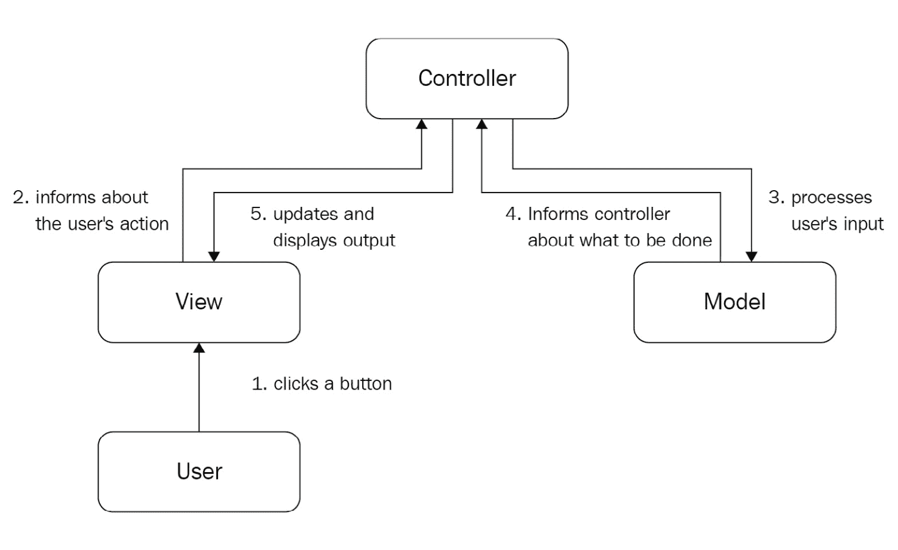

# *第二十三章*：其他结构模式

除了我们在前几章中介绍的模式之外，我们还可以介绍其他一些结构模式：**享元模式**、**模型-视图-控制器模式（MVC**）和**代理模式**。这些模式与前面章节中讨论的模式不同。享元模式是一种适用于最小化内存使用的优化设计模式。另一方面，MVC 模式在面向对象编程中很受欢迎，旨在分离大型应用程序的不同部分。最后，代理模式用于维护对重要对象执行的操作。

这三个模式将完成我们对结构模式的讨论。

在本章中，我们将介绍以下主题：

+   实现享元模式

+   实现模型-视图-控制器模式

+   应用代理模式

到本章结束时，我们将对各种结构模式及其用例有一个全面的了解。

# 技术要求

本章的代码文件可以在[`github.com/PacktPublishing/Advanced-Python-Programming-Second-Edition/tree/main/Chapter23`](https://github.com/PacktPublishing/Advanced-Python-Programming-Second-Edition/tree/main/Chapter23)找到。

# 实现享元模式

*什么是享元模式？* 面向对象系统可能会因为对象创建的开销而面临性能问题。性能问题通常出现在资源有限的嵌入式系统中，例如智能手机和平板电脑。它们也可能出现在需要创建大量对象（以及可能用户）的大型和复杂系统中，这些对象需要同时共存。享元模式教导程序员如何通过尽可能多地共享相似对象来最小化内存使用。

每当我们创建一个新的对象时，都需要分配额外的内存。虽然虚拟内存从理论上为我们提供了无限的内存，但现实情况却不同。如果一个系统的所有物理内存都用完了，它将开始与二级存储（通常是一个**硬盘驱动器（HDD**））交换页面，这在大多数情况下是不可接受的，因为主内存和 HDD 之间的性能差异很大。**固态硬盘（SSD**）通常比 HDD 有更好的性能，但并不是每个人都期望使用 SSD。因此，SSD 不太可能在不久的将来完全取代 HDD。

除了内存使用之外，性能也是一个考虑因素。图形软件，包括计算机游戏，应该能够非常快速地渲染 3D 信息（例如，有成千上万树木的森林，满是士兵的村庄，或者有很多汽车的城区）。如果 3D 地形中的每个对象都是单独创建的，并且没有使用数据共享，性能将是不可接受的。

作为软件工程师，我们应该通过编写更好的软件来解决软件问题，而不是强迫客户购买额外的或更好的硬件。享元设计模式是一种技术，通过在相似对象之间引入数据共享来最小化内存使用并提高性能（[`j.mp/wflyw`](http://j.mp/wflyw)）。享元是一个包含状态无关、不可变（也称为**内在的**）数据的共享对象。状态相关、可变（也称为**外在的**）数据不应成为享元模式的一部分，因为这种信息不能共享，因为它在每个对象中都是不同的。如果享元模式需要外在数据，它应该由客户端代码明确提供。

一个例子可以帮助阐明如何实际使用享元模式。假设我们正在创建一个性能关键的游戏，例如一款**第一人称射击游戏**（**FPS**）。在 FPS 游戏中，玩家（士兵）共享一些状态，例如表示和行为。例如，在《反恐精英》中，同一队的所有士兵（反恐分子与恐怖分子）看起来都一样（表示）。在同一个游戏中，所有士兵（两队）都有一些共同的动作，如**跳跃**、**蹲下**等等（行为）。这意味着我们可以创建一个享元来包含所有这些共同的数据。当然，士兵们也有许多不同的数据，这些数据对于每个士兵来说是独特的，并且不会成为享元的一部分，例如武器、健康和位置。

*享元模式的其他现实世界示例有哪些？* 我们将在下一节中讨论。

## 现实世界示例

享元是一种优化设计模式。因此，很难找到一个好的非计算示例。我们可以将享元视为现实生活中的缓存。例如，许多书店都有专门的货架，存放最新和最受欢迎的出版物。这是一个缓存：首先，你可以查看专门的货架寻找你想要的书籍，如果你找不到，你可以请书店老板协助你。

*Exaile*音乐播放器使用享元来重用具有相同 URL 标识的对象（在这种情况下，是音乐曲目）。如果它与现有对象具有相同的 URL，就没有必要创建新的对象，因此可以重用相同的对象以节省资源。

*Peppy*，一个类似于 XEmacs 的 Python 实现编辑器，使用享元模式来存储主要模式状态栏的状态。这是因为，除非用户修改它们，否则所有状态栏都共享相同的属性。

## 用例

享元完全是关于提高性能和内存使用。所有嵌入式系统（手机、平板电脑、游戏机、微控制器等等）和性能关键的应用程序（游戏、3D 图形处理、实时系统等等）都可以从中受益。

*四人帮*（*GoF*）书籍列出了以下需要满足的要求，以有效地使用享元模式：

+   应用程序需要使用许多对象。

+   有如此多的对象，存储/渲染它们太昂贵了。一旦移除了可变状态（因为如果需要，它应该由客户端代码显式传递给享元模式），许多不同的对象组可以被相对较少的共享对象所替代。

+   对象标识对于应用程序来说并不重要。我们不能依赖于对象标识，因为对象共享会导致标识比较失败（对客户端代码看起来不同的对象最终具有相同的标识）。

现在，让我们看看我们对享元模式的实际实现。

## 实现

让我们看看我们如何将本节介绍中简要提到的示例实现应用于区域内的汽车。我们将创建一个小型停车场来阐述这个想法，确保整个输出可以在单个终端页面上阅读。然而，无论停车场有多大，内存分配保持不变。

在深入代码之前，让我们花一点时间来指出记忆化和享元模式之间的区别。**记忆化**是一种优化技术，它使用缓存来避免在早期执行步骤中已经计算过的结果的重新计算。记忆化并不专注于特定的编程范式，如**面向对象编程**（**OOP**）。在 Python 中，记忆化可以应用于方法和简单函数。享元是面向对象编程特定的优化设计模式，它专注于共享对象数据。

首先，我们需要一个`Enum`参数来描述停车场中的三种不同类型的汽车：

```py
CarType = Enum('CarType', 'subcompact compact suv')
```

然后，我们将定义实现的核心类：`Car`。`pool`变量是对象池（换句话说，我们的缓存）。请注意，`pool`是一个类属性（一个由所有实例共享的变量）。

使用在`__init__()`之前被调用的特殊方法`__new__()`，我们将`Car`类转换为一个支持自引用的元类。这意味着`cls`引用了`Car`类。当客户端代码创建`Car`的实例时，它将汽车类型作为`car_type`传递。汽车类型用于检查是否已经创建了相同类型的汽车。如果是这样，则返回先前创建的对象；否则，将新的汽车类型添加到池中并返回：

```py
class Car: 
    pool = dict() 

    def __new__(cls, car_type): 
        obj = cls.pool.get(car_type, None) 
        if not obj: 
            obj = object.__new__(cls) 
            cls.pool[car_type] = obj 
            obj.car_type = car_type 
        return obj
```

`render()`方法将用于在屏幕上渲染汽车。注意所有未知于享元的信息都需要由客户端代码显式传递。在这种情况下，每个汽车使用随机颜色和位置坐标（*x, y*形式）。

此外，请注意，为了使`render()`函数更加有用，必须确保没有汽车渲染在彼此之上。把这当作一个练习：如果你想使渲染更有趣，你可以使用 Tkinter、Pygame 或 Kivy 等图形工具包。

`render()`方法定义如下：

```py
    def render(self, color, x, y):
        type = self.car_type
        msg = f'render a car of type {type} and color \
          {color} at ({x}, {y})'
        print(msg)
```

`main()`函数展示了我们如何使用 flyweight 模式。汽车的颜色是从预定义的颜色列表中随机选择的值。坐标使用`1`到`100`之间的随机值。正如我们很快就会看到的，尽管渲染了 18 辆汽车，但只分配了 3 个内存。输出中的最后一行，我们稍后会看到，证明了在使用 flyweight 时，我们不能依赖于对象身份。

`id()`函数返回对象的内存地址。在 Python 中，这并不是默认行为，因为默认情况下，`id()`为每个对象返回一个唯一的 ID（对象的内存地址作为整数）。在我们的例子中，即使两个对象看起来不同，如果它们属于同一个 flyweight 家族（在这种情况下，家族由`car_type`定义），它们仍然具有相同的身份。当然，对于不同家族的对象，仍然可以使用不同的身份比较，但这只有在客户端知道实现细节的情况下才可能。

我们的示例`main()`函数的代码如下：

```py
def main():
    rnd = random.Random() 
    colors = 'white black silver gray red blue brown \
      beige yellow green'.split()
    min_point, max_point = 0, 100 
    car_counter = 0 

    for _ in range(10): 
        c1 = Car(CarType.subcompact) 
        c1.render(random.choice(colors), 
                  rnd.randint(min_point, max_point), 
                  rnd.randint(min_point, max_point)) 
        car_counter += 1 

    ...

    print(f'cars rendered: {car_counter}') 
    print(f'cars actually created: {len(Car.pool)}') 

    c4 = Car(CarType.subcompact) 
    c5 = Car(CarType.subcompact) 
    c6 = Car(CarType.suv) 
    print(f'{id(c4)} == {id(c5)}? {id(c4) == id(c5)}') 
    print(f'{id(c5)} == {id(c6)}? {id(c5) == id(c6)}')
```

这里是完整的代码列表（`flyweight.py`文件），以展示如何实现和使用 flyweight 模式：

1.  首先，我们需要导入一些模块：

    ```py
    import random 
    from enum import Enum
    ```

1.  这里展示了汽车类型的`Enum`：

    ```py
    CarType = Enum('CarType', 'subcompact compact suv')
    ```

1.  然后，我们有`Car`类，它具有`pool`属性和`__new__()`和`render()`方法：

    ```py
    class Car: 
        pool = dict() 

        def __new__(cls, car_type): 
            obj = cls.pool.get(car_type, None) 
            if not obj: 
                obj = object.__new__(cls) 
                cls.pool[car_type] = obj 
                obj.car_type = car_type 
            return obj 

        def render(self, color, x, y):
            type = self.car_type
            msg = f'render a car of type {type} and  \
              color {color} at ({x}, {y})'
            print(msg)
    ```

1.  在`main`函数的第一部分，我们定义了一些变量并渲染了一组`subcompact`类型的汽车：

    ```py
    def main(): 
        rnd = random.Random() 
        colors = 'white black silver gray red blue \
          brown beige yellow green'.split()
        min_point, max_point = 0, 100 
        car_counter = 0 

        for _ in range(10): 
            c1 = Car(CarType.subcompact) 
            c1.render(random.choice(colors), 
                      rnd.randint(min_point, max_point), 
                      rnd.randint(min_point, max_point)) 
            car_counter += 1  
    ```

1.  `main`函数的第二部分如下，这次渲染了另一组`compact`类型的汽车：

    ```py
    for _ in range(3): 
        c2 = Car(CarType.compact) 
        c2.render(random.choice(colors), 
                  rnd.randint(min_point, max_point), 
                  rnd.randint(min_point, max_point)) 
        car_counter += 1 
    ```

1.  `main`函数的第三部分如下，这次是`SUV`汽车：

    ```py
    for _ in range(5):   c3 = Car(CarType.suv) 
            c3.render(random.choice(colors), 
                      rnd.randint(min_point, max_point), 
                      rnd.randint(min_point, max_point)) 
            car_counter += 1 

        print(f'cars rendered: {car_counter}') 
        print(f'cars actually created: {len(Car.pool)}')
    ```

1.  最后，这里是`main`函数的第四部分，其中我们创建了三种类型的另外三辆汽车：

    ```py
    c4 = Car(CarType.subcompact)
    c5 = Car(CarType.subcompact)
    c6 = Car(CarType.suv)
    print(f'{id(c4)} == {id(c5)}? {id(c4) == id(c5)}')
    print(f'{id(c5)} == {id(c6)}? {id(c5) == id(c6)}')  
    ```

1.  我们没有忘记我们常用的`__name__ == '__main__'`技巧和良好的实践，如下所示：

    ```py
    if __name__ == '__main__':
         main()
    ```

执行 Python `flyweight.py`命令显示了渲染对象的类型、随机颜色和坐标，以及同一/不同家族的 flyweight 对象之间的身份比较结果：

```py
render a car of type CarType.subcompact and color yellow at 
(57, 51)
render a car of type CarType.subcompact and color blue at 
(10, 61)
render a car of type CarType.subcompact and color gray at 
(65, 74)
render a car of type CarType.subcompact and color red at 
(10, 19)
render a car of type CarType.subcompact and color green at 
(89, 5)
render a car of type CarType.subcompact and color green at 
(88, 76)
render a car of type CarType.subcompact and color black at 
(0, 18)
render a car of type CarType.subcompact and color silver at 
(43, 12)
render a car of type CarType.subcompact and color red at 
(25, 71)
render a car of type CarType.subcompact and color blue at 
(68, 38)
render a car of type CarType.compact and color white at 
(79, 48)
render a car of type CarType.compact and color green at 
(18, 93)
render a car of type CarType.compact and color brown at 
(71, 43)
render a car of type CarType.suv and color silver at 
(2, 71)
render a car of type CarType.suv and color blue at (70, 42)
render a car of type CarType.suv and color silver at 
(100, 98)
render a car of type CarType.suv and color gray at (83, 49)
render a car of type CarType.suv and color brown at (77, 2)
cars rendered: 18
cars actually created: 3
140569248959360 == 140569248959360? True
140569248959360 == 140569298067216? False
```

不要期望看到相同的输出，因为颜色和坐标是随机的，并且对象身份取决于内存映射。

这个程序标志着我们对 flyweight 模式的讨论结束。在下一节中，我们将学习 MVC 模式。

# 实现模型-视图-控制器（MVC）模式

MVC 模式主要在应用程序开发中很有用，它帮助开发者通过避免将业务逻辑与用户界面混合来提高应用程序的可维护性。

与软件工程相关的其中一个设计原则是**关注点分离**（SoC）原则。SoC 原则背后的思想是将应用程序分割成不同的部分，每个部分解决一个单独的关注点。这样的关注点的例子包括分层设计中使用的层（数据访问层、业务逻辑层、表示层等等）。使用 SoC 原则简化了软件应用程序的开发和维护。

MVC 模式不过是将 SoC 原则应用于面向对象编程。模式的名称来源于用于分割软件应用程序的三个主要组件：**模型**、**视图**和**控制器**。MVC 被认为是一种架构模式，而不是设计模式。架构模式和设计模式之间的区别在于前者比后者具有更广泛的范围。尽管如此，MVC 的重要性不容忽视。即使我们永远不需要从头开始实现它，我们也需要熟悉它，因为所有常见的框架都使用 MVC 或其略微不同的版本（稍后将有更多介绍）。

模型是核心组件。它代表知识。它包含并管理应用程序的（业务）逻辑、数据、状态和规则。视图是模型的视觉表示。视图的例子包括计算机 GUI、计算机终端的文本输出、智能手机应用程序 GUI、PDF 文档、饼图、柱状图等等。视图只显示数据；它不处理数据。控制器是模型和视图之间的链接/粘合剂。模型和视图之间的所有通信都通过控制器进行。

一个使用 MVC 的应用程序的典型用例，在用户初始屏幕渲染后如下：

1.  用户通过点击（输入、触摸等）按钮来触发视图。

1.  视图通知控制器用户的行为。

1.  控制器处理用户输入并与模型交互。

1.  模型执行所有必要的验证和状态更改，并通知控制器应该做什么。

1.  控制器根据模型给出的指令，指示视图适当地更新并显示输出。

这在以下图中进行了总结：



图 23.1 — 典型计算机程序的 MVC 图

*你可能想知道，控制器部分为什么是必要的？我们不能跳过它吗？* 我们可以，但那样我们就会失去 MVC 提供的一个大优势：能够在不修改模型的情况下使用多个视图（甚至如果需要，同时使用）。为了在模型及其表示之间实现解耦，每个视图通常都需要一个控制器。如果模型直接与特定的视图通信，我们就无法使用多个视图（或者至少，不能以一种干净和模块化的方式使用）。

现在，让我们看看 MVC 模式在现实世界中的应用。

## 现实世界的例子

如我们之前提到的，MVC 是将 SoC 原则应用于 OOP。SoC 原则在现实生活中被广泛使用。例如，如果你建造一栋新房子，你通常会指派不同的专业人士来完成以下工作：

+   安装管道和电路

+   油漆房屋

另一个例子是餐厅。在餐厅里，服务员接收订单并为顾客上菜，但饭菜是由厨师烹制的。

在 Web 开发中，几个框架使用了 MVC 思想：

+   **Web2py** 框架([`j.mp/webtopy`](http://j.mp/webtopy))是一个轻量级的 Python 框架，它采用了 MVC 模式。如果你从未尝试过 Web2py，我鼓励你试试，因为它安装起来极其简单。许多示例演示了如何在项目的网页上使用 Web2py 中的 MVC 模式。

+   **Django** 也是一个 MVC 框架，尽管它使用了不同的命名约定。控制器被称为视图，而视图被称为**模板**。Django 使用**模型-模板-视图**（**MTV**）的名称。根据 Django 的设计师，视图描述了用户看到的数据，因此它使用“视图”作为特定 URL 的 Python 回调函数。Django 中的“模板”术语用于将内容与其表示分离。它描述了数据是如何被用户看到的，而不是用户看到了哪些数据。

在下一节中，我们将详细介绍 MVC 模式的具体用例。

## 用例

MVC 是一个非常通用且有用的设计模式。所有流行的 Web 框架（Django、Rails 和 Symfony 或 Yii）以及应用程序框架（iPhone SDK、Android 和 QT）都使用了 MVC 或其变体——**模型-视图-适配器**（**MVA**）、**模型-视图-表示器**（**MVP**）等等。然而，即使我们不使用这些框架，由于它提供的优势，我们自己实现这个模式也是有意义的，这些优势如下：

+   视图和模型之间的分离使得图形设计师可以专注于 UI 部分，程序员可以专注于开发，而不会相互干扰。

+   由于视图和模型之间的松散耦合，每个部分都可以在不影响其他部分的情况下进行修改/扩展。例如，添加一个新的视图是微不足道的——只需为它实现一个新的控制器即可。

+   由于责任明确，维护每个部分都更容易。

当您从头开始实现 MVC 时，请确保您创建智能模型、瘦控制器和愚视图。

一个模型被认为智能，因为它执行以下操作：

+   包含所有验证/业务规则/逻辑

+   处理应用程序的状态

+   有权访问应用程序数据（数据库、云等）

+   不依赖于 UI

一个控制器被认为瘦，因为它执行以下操作：

+   当用户与视图交互时更新模型

+   当模型更改时更新视图

+   在必要时在将数据交付给模型/视图之前处理数据

+   不显示数据

+   不直接访问应用程序数据

+   不包含验证/业务规则/逻辑

一个视图被认为是无脑的，因为它执行以下操作：

+   显示数据

+   允许用户与之交互

+   只进行最小处理，通常由模板语言提供（例如，使用简单的变量和循环控制）

+   不存储任何数据

+   不直接访问应用程序数据

+   不包含验证/业务规则/逻辑

如果您从头开始实现 MVC 并想了解您是否做得正确，您可以尝试回答一些关键问题：

+   *如果您的应用程序有 GUI，它是可定制的吗？您有多容易改变它的外观和感觉？您能否在运行时让用户更改应用程序的外观？* 如果这些任务不容易完成，则意味着您的 MVC 实现出了问题。

+   *如果您的应用程序没有 GUI（例如，如果它是一个终端应用程序），添加 GUI 支持有多难？或者，如果添加 GUI 不相关，是否容易添加视图以在图表（饼图、条形图等）或文档（PDF、电子表格等）中显示结果？* 如果这些更改不是微不足道的（只需创建一个新的控制器并将其附加到视图上，而不修改模型），则 MVC 没有得到正确实现。

如果您确保这些条件得到满足，与不使用 MVC 的应用程序相比，您的应用程序将更加灵活和易于维护。我们将在下一节中通过实现一个用于维护引言集合的应用程序来查看这个例子。

## 实现

我可以使用任何常见的框架来演示如何使用 MVC，但我感觉这样会不完整。因此，我决定向您展示如何使用一个非常简单的示例从头开始实现 MVC：一个引言打印机。这个想法非常简单。用户输入一个数字，然后看到与该数字相关的引言。引言存储在 `quotes` 元组中。这是通常存在于数据库、文件等中的数据，并且只有模型可以直接访问它。

让我们考虑以下代码示例：

```py
quotes = 
(
  'A man is not complete until he is married. Then he is \
    finished.',
  'As I said before, I never repeat myself.',
  'Behind a successful man is an exhausted woman.',
  'Black holes really suck...',
  'Facts are stubborn things.'
)
```

模型是最简的；它只有一个 `get_quote()` 方法，该方法根据索引 *n* 返回 `quotes` 元组的引言（字符串）。请注意，*n* 可以小于或等于 `0`，这是由于 Python 中索引工作方式的原因：

```py
class QuoteModel:
     def get_quote(self, n):
         try:
             value = quotes[n]
         except IndexError as err:
             value = 'Not found!'
         return value
```

视图有三种方法：

+   `Show()`，用于在屏幕上打印引用（或消息；即“未找到！”）。

+   `error()`，用于在屏幕上打印错误消息。

+   `select_quote()`，用于读取用户的选项。

这可以在以下代码中看到：

```py
class QuoteTerminalView:
     def show(self, quote):
         print(f'And the quote is: "{quote}"')

     def error(self, msg):
         print(f'Error: {msg}')

     def select_quote(self):
         return input('Which quote number would you like  \
           to see? ')
```

控制器负责协调。`__init__()`方法初始化模型和视图。`run()`方法验证用户给出的引用索引，从模型获取引用，并将其传递回视图以显示，如下面的代码所示：

```py
class QuoteTerminalController:
     def __init__(self):
         self.model = QuoteModel()
         self.view = QuoteTerminalView()

     def run(self):
         valid_input = False
         while not valid_input:
             try:
                 n = self.view.select_quote()
                 n = int(n)
                 valid_input = True
             except ValueError as err:
                 self.view.error(f"Incorrect index '{n}'")
         quote = self.model.get_quote(n)
         self.view.show(quote)
```

最后但同样重要的是，`main()`函数初始化并启动控制器，如下面的代码所示：

```py
def main():
     controller = QuoteTerminalController()
     while True:
         controller.run()
```

以下是这个示例的完整工作流程（`mvc.py`文件）：

1.  我们首先定义一个用于引用列表的变量。

1.  我们实现模型类，`QuoteModel`。

1.  然后，我们实现视图类，`QuoteTerminalView`。

1.  最后，我们实现控制器类，`QuoteTerminalController`。

1.  在我们的示例代码的`main()`函数结束时，我们初始化并运行控制器。

以下 Python `mvc.py`命令的示例执行显示了程序如何为用户打印引用：

```py
Which quote number would you like to see? 2
And the quote is: "Behind a successful man is an exhausted 
woman."
Which quote number would you like to see? 4
And the quote is: "Facts are stubborn things."
Which quote number would you like to see? 1
And the quote is: "As I said before, I never repeat 
myself."
Which quote number would you like to see? 6
And the quote is: "Not found!"
Which quote number would you like to see? 3
And the quote is: "Black holes really suck..."
Which quote number would you like to see? 0
And the quote is: "A man is not complete until he is 
married. Then he is finished."
Which quote number would you like to see?   
```

在这里，我们可以看到一切都在按预期工作！

有了这些，我们将继续本章的最后一个主题：代理模式。

# 应用代理模式

在某些应用程序中，我们希望在访问对象之前执行一个或多个重要操作。这就是**代理模式**的用武之地。一个例子是访问敏感信息。在我们允许任何用户访问敏感信息之前，我们想确保用户有足够的权限。这个重要操作不一定与安全问题相关。**延迟初始化**（[`j.mp/wikilazy`](http://j.mp/wikilazy)）是另一个例子；我们希望在用户第一次需要使用它时才创建计算密集型对象。代理模式的想法是在访问实际对象之前帮助执行此类操作。

代理设计模式的名字来源于**代理**（也称为**替代者**）对象，它在访问实际对象之前执行重要操作。有四种不同的知名代理类型（[`j.mp/proxypat`](http://j.mp/proxypat)）。它们如下：

+   一种**远程代理**，作为存在于不同地址空间（例如，网络服务器）的对象的本地表示。

+   一种**虚拟代理**，使用延迟初始化来推迟计算密集型对象的创建，直到需要时。

+   一种**保护/防护代理**，用于控制对敏感对象的访问。

+   一种**智能（引用）代理**，在访问对象时执行额外操作。此类操作的示例包括引用计数和线程安全检查。

我发现虚拟代理非常有用，所以让我们看看如何在 Python 中实现它们的例子。在本节的 *实现* 子节中，你将学习如何创建保护代理。

在 Python 中创建虚拟代理有许多方法，但我总是喜欢专注于惯用/Pythonic 的实现。这里展示的代码基于 Cyclone 的优秀回答，Cyclone 是以下网站的用户：[`stackoverflow.com/`](http://stackoverflow.com/) ([`j.mp/solazyinit`](http://j.mp/solazyinit))。为了避免混淆，我应该明确指出，在本节中，术语 *属性*、*变量* 和 *属性* 是可以互换使用的。

首先，我们必须创建一个 `LazyProperty` 类，它可以作为装饰器使用。当它装饰一个属性时，`LazyProperty` 会延迟加载属性（在第一次使用时），而不是立即加载。`__init__()` 方法创建了两个变量，这些变量用作初始化属性的方法的别名。`method` 变量是实际方法的别名，而 `method_name` 变量是方法名的别名。为了更好地理解这两个别名是如何使用的，可以将它们的值打印到输出（取消以下代码中的两行注释）：

```py
class LazyProperty:
    def __init__(self, method):
        self.method = method
        self.method_name = method.__name__
        # print(f"function overriden: {self.fget}")
        # print(f"function's name: {self.func_name}")
```

`LazyProperty` 类是一个描述符 ([`j.mp/pydesc`](http://j.mp/pydesc)). 描述符是在 Python 中推荐使用的机制，用于覆盖其属性访问方法的默认行为：`__get__()`, `__set__()` 和 `__delete__()`。`LazyProperty` 类仅覆盖 `__set__()`，因为这是它需要覆盖的唯一访问方法。换句话说，我们不必覆盖所有访问方法。`__get__()` 方法访问底层方法想要分配的属性的值，并使用 `setattr()` 手动进行分配。

`__get()__` 所做的非常巧妙：它用值替换了方法！这意味着属性不仅会延迟加载，而且只能设置一次。我们将在稍后看到这意味着什么。再次提醒，取消以下代码中的注释行以获取更多信息：

```py
def __get__(self, obj, cls):
    if not obj:
        return None
    value = self.method(obj)
    # print(f'value {value}')
    setattr(obj, self.method_name, value)
    return value
```

`Test` 类展示了我们如何使用 `LazyProperty` 类。有三个属性：`x`、`y` 和 `_resource`。我们希望 `_resource` 变量能够延迟加载；因此，我们必须将其初始化为 `None`，如下所示：

```py
class Test:
    def __init__(self):
        self.x = 'foo'
        self.y = 'bar'
        self._resource = None
```

`resource()` 方法被 `LazyProperty` 类装饰。为了演示目的，`LazyProperty` 类将 `_resource` 属性初始化为一个元组，如下所示。通常，这会是一个缓慢/昂贵的初始化过程（数据库、图形等）：

```py
@LazyProperty
def resource(self):
    print(f'initializing self._resource which is: \
      {self._resource}')        
    self._resource = tuple(range(5)) # expensive
    return self._resource
```

如下所示的 `main()` 函数展示了延迟初始化的行为：

```py
def main():     
     t = Test()
     print(t.x)
     print(t.y)
     # do more work...
     print(t.resource)
     print(t.resource)
```

注意，覆盖 `__get()__` 访问方法使得将 `resource()` 方法视为一个简单的属性成为可能（我们可以使用 `t.resource` 而不是 `t.resource()`）。

在此例的执行输出（`lazy.py` 文件）中，我们可以看到以下内容：

+   `_resource`变量不是在创建`t`实例时初始化，而是在我们第一次使用`t.resource`时初始化。

+   第二次使用`t.resource`时，变量不会被再次初始化。这就是为什么初始化`self._resource`的初始化字符串只显示一次的原因。

这里是我们执行 Python `lazy.py`命令时得到的输出：

```py
foo
bar
initializing self._resource which is: None
(0, 1, 2, 3, 4)
(0, 1, 2, 3, 4)  
```

在面向对象编程中，存在两种基本的、不同的懒加载初始化方式。具体如下：

+   **在实例级别**：这意味着对象的属性是懒加载初始化的，但属性具有对象作用域。同一类的每个实例（对象）都有自己的（不同的）属性副本。

+   **在类或模块级别**：在这种情况下，我们不希望每个实例都有一个不同的副本，而是所有实例共享同一个属性，该属性是懒加载初始化的。这种情况在本章中没有涉及。如果你对此感兴趣，可以将其视为练习。

现在，让我们看看遵循代理模式的现实世界中的例子。

## 现实世界中的例子

**Chip**（也称为**Chip and PIN**）卡（[`j.mp/wichpin`](http://j.mp/wichpin)）是现实生活中如何使用保护代理的一个很好的例子。借记卡/信用卡包含一个需要由 ATM 或读卡器读取的芯片。一旦芯片被验证，就需要密码（PIN）来完成交易。这意味着，如果没有物理出示卡片并知道 PIN，就无法进行任何交易。

银行支票，用于代替现金进行购买和交易，是远程代理的一个例子。支票可以访问银行账户。

在软件中，Python 的`weakref`模块包含一个`proxy()`方法，它接受一个输入对象并返回一个智能代理。弱引用是向对象添加引用计数支持的推荐方式。

## 用例

由于至少有四种常见的代理类型，因此代理设计模式有许多用例，如下所示：

+   它用于创建使用私有网络或云的分布式系统。在分布式系统中，一些对象存在于本地内存中，而其他对象存在于远程计算机的内存中。如果我们不希望客户端代码意识到这些差异，我们可以创建一个远程代理来隐藏/封装它们，使应用程序的分布式特性透明。

+   当我们的应用程序由于早期创建昂贵的对象而遭受性能问题时，使用虚拟代理在需要时才创建对象可以实现显著的性能提升。

+   它用于检查用户是否有足够的权限访问某些信息。如果我们的应用程序处理敏感信息（例如，医疗数据），我们希望确保尝试访问/修改这些信息的用户被允许这样做。保护/保护代理可以处理所有与安全相关的操作。

+   当我们的应用程序（或库、工具包、框架等）使用多个线程，并且我们希望将线程安全的问题从客户端代码转移到应用程序时，会用到它。在这种情况下，我们可以创建一个智能代理来隐藏线程安全的复杂性，不让客户端看到。

+   **对象关系映射**（**ORM**）API 也是如何使用远程代理的一个例子。许多流行的 Web 框架，包括 Django，使用 ORM 来提供面向对象的数据库访问。ORM 充当一个代理，可以位于任何地方，无论是本地还是远程服务器。

现在，让我们应用代理模式来构建一个简单的接口，该接口提供示例用户的详细信息。

## 实现

为了演示代理模式，我们将实现一个简单的保护代理来查看和添加用户。该服务提供两种选项：

+   **查看用户列表**：此操作不需要特殊权限。

+   **添加新用户**：此操作需要客户端提供一条特殊的秘密信息。

`SensitiveInfo` 类包含我们想要保护的信息。`users` 变量包含现有用户的列表。`read()` 方法打印用户列表。`add()` 方法将新用户添加到列表中。

让我们考虑以下代码：

```py
class SensitiveInfo:
     def __init__(self):
         self.users = ['nick', 'tom', 'ben', 'mike']

     def read(self):
         nb = len(self.users)
         print(f"There are {nb} users: {' ' \
           .join(self.users)}")

     def add(self, user):
         self.users.append(user)
         print(f'Added user {user}')
```

`Info` 类是 `SensitiveInfo` 的保护代理。`secret` 变量是客户端代码添加新用户时需要知道/提供的消息。请注意，这只是一个例子。在现实中，你永远不应该做以下事情：

+   在源代码中存储密码

+   以明文形式存储密码

+   使用弱（例如，MD5）或自定义形式的加密

在以下代码中，`Info` 类中，`read()` 方法是对 `SensitiveInfo.read()` 的包装，而 `add()` 方法确保只有当客户端代码知道秘密信息时，才能添加新用户：

```py
class Info:  
     '''protection proxy to SensitiveInfo'''

     def __init__(self):
         self.protected = SensitiveInfo()
         self.secret = '0xdeadbeef'

     def read(self):
         self.protected.read()

     def add(self, user):
         sec = input('what is the secret? ')
         self.protected.add(user) if sec == self.secret \
           else print("That's wrong!")
```

`main()` 函数展示了客户端代码如何使用代理模式。客户端代码创建 `Info` 类的一个实例，并使用显示的菜单来读取列表、添加新用户或退出应用程序。让我们考虑以下代码：

```py
def main():
     info = Info()

     while True:
         print('1\. read list |==| 2\. add user |==| 3\. \
           quit')
         key = input('choose option: ')
         if key == '1':
             info.read()
         elif key == '2':
             name = input('choose username: ')
             info.add(name)
         elif key == '3':
             exit()
         else:
             print(f'unknown option: {key}')
```

以下是在执行 Python `proxy.py` 命令时程序的样本输出：

```py
1\. read list |==| 2\. add user |==| 3\. quit
choose option: 1
There are 4 users: nick tom ben mike
1\. read list |==| 2\. add user |==| 3\. quit
choose option: 2
choose username: bill
what is the secret? 12345
That's wrong!
1\. read list |==| 2\. add user |==| 3\. quit
choose option: 2
choose username: bill
what is the secret? 0xdeadbeef
Added user bill
1\. read list |==| 2\. add user |==| 3\. quit
choose option: 1
There are 5 users: nick tom ben mike bill
1\. read list |==| 2\. add user |==| 3\. quit
```

*你已经发现了可以改进我们代理示例的缺陷或缺失功能吗？* 我有几个建议。如下：

+   这个例子有一个很大的安全漏洞。没有任何东西阻止客户端代码通过直接创建`SensitiveInfo`实例来绕过应用程序的安全。改进这个例子以防止这种情况。一种方法是通过使用`abc`模块禁止直接实例化`SensitiveInfo`。*在这种情况下还需要进行哪些代码更改？*

+   一个基本的安全规则是我们永远不应该存储明文密码。只要我们知道使用哪些库，安全地存储密码并不难（[`j.mp/hashsec`](http://j.mp/hashsec)）。如果你对安全感兴趣，尝试实现一种安全的方式来外部存储秘密信息（例如，在文件或数据库中）。

+   *应用程序仅支持添加新用户，但如何删除现有用户呢？* 添加一个`remove()`方法。

# 摘要

在本章中，我们介绍了三种其他结构设计模式：飞跃模式、MVC 模式和代理模式。在本章中，我们了解了这些模式与其他我们已经讨论过的结构模式之间的区别。然后，我们在实际示例中实现了这些模式。正如我们所看到的，飞跃模式是为了最小化内存使用而设计的，MVC 模式维护应用程序不同部分之间的逻辑组织，而代理模式通常用于访问敏感信息时。

在下一章中，我们将开始探索行为设计模式。行为模式处理对象之间的交互和算法。我们将要介绍的第一个行为模式是责任链模式。

# 问题

1.  飞跃模式的主要动机是什么？

1.  MVC 模式的主要动机是什么？

1.  代理模式的主要动机是什么？
