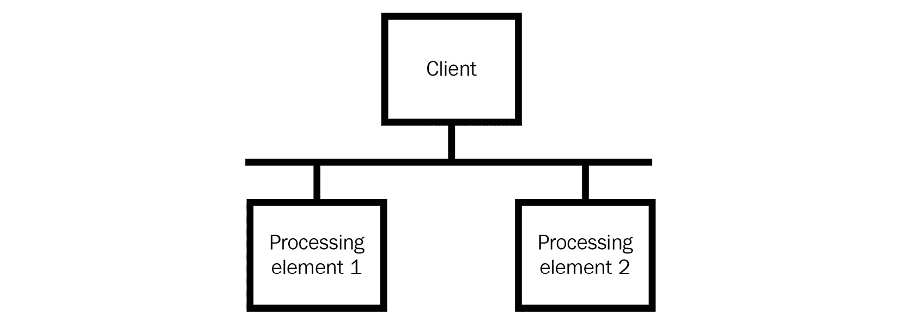
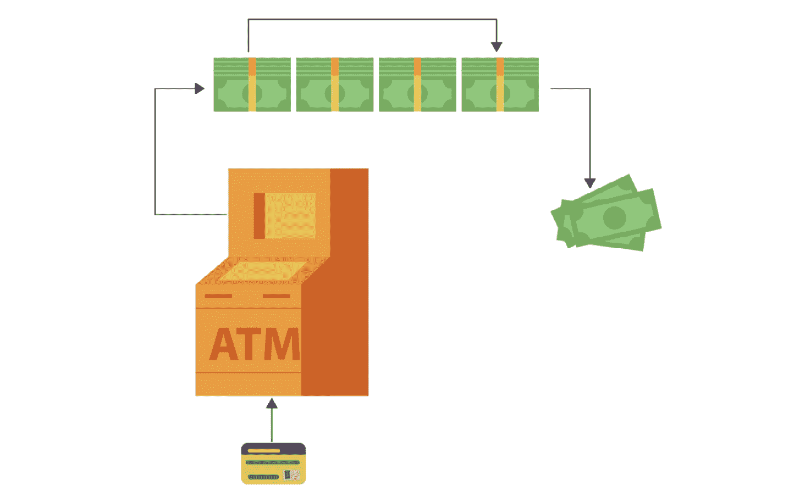
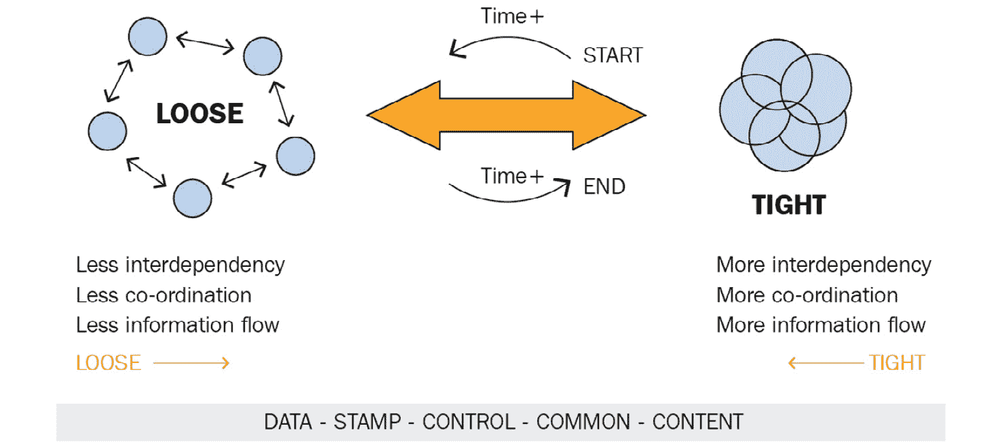
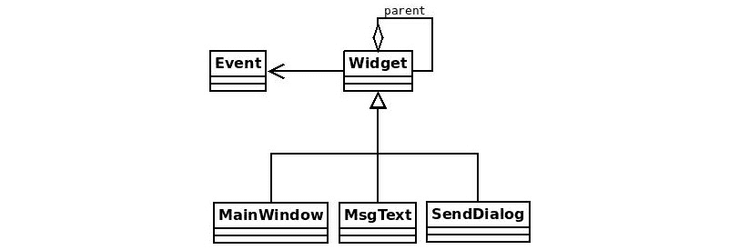

# *第二十四章*：责任链模式

现在我们来介绍**责任链设计模式**，当我们需要支持未知数量和类型的请求/事件时，应该使用这个模式。虽然这听起来可能有些模糊，但这种模式在广泛的应用场景中都是很有用的，例如基于事件的系统、购买系统和运输系统。

在本章中，我们将学习责任链模式（Chain of Responsibility pattern）是什么，它的好处，以及——一如既往地——如何在实际的 Python 示例中实现它。我们将讨论以下主题：

+   理解责任链模式

+   现实世界的例子

+   用例

+   实现

# 技术要求

本章的代码文件可以通过以下链接访问：

[`github.com/PacktPublishing/Advanced-Python-Programming-Second-Edition/tree/main/Chapter24`](https://github.com/PacktPublishing/Advanced-Python-Programming-Second-Edition/tree/main/Chapter24)

# 理解责任链模式

在开发应用程序时，大多数时候，我们事先就知道哪个方法应该满足特定的请求。然而，情况并不总是如此。例如，想想任何广播计算机网络，如原始的以太网实现。在广播计算机网络中，所有请求都发送到所有节点（为了简单起见，排除广播域），但只有对发送请求感兴趣的节点才会处理它。

参与广播网络的计算机都通过一个共同的中介连接在一起，例如连接所有节点的电缆。如果一个节点不感兴趣或不知道如何处理请求，它可以执行以下操作：

+   忽略请求并什么都不做

+   将请求转发到下一个节点

节点对请求的反应方式是实现细节。然而，我们可以使用广播计算机网络的类比来理解责任链模式的核心。当我们要给多个对象机会满足单个请求，或者我们事先不知道哪个对象（从对象链中）应该处理特定请求时，就会使用责任链模式。

为了说明这个原则，想象一个对象链（链表、树或其他方便的数据结构）和以下流程：

1.  我们首先向链中的第一个对象发送请求。

1.  对象决定是否应该满足请求。

1.  对象将请求转发到下一个对象。

1.  这个过程会一直重复，直到我们到达链的末尾。

在应用层面，我们不再谈论电缆和网络节点，而是可以关注对象和请求的流动。以下图表显示了客户端代码如何向应用程序的所有处理元素发送请求：



图 24.1 – 客户端代码发送请求

注意，客户端代码只知道第一个处理元素，而不是所有处理元素的引用，每个处理元素只知道其直接的下一位邻居（称为**后继者**），而不是其他所有处理元素。这通常是一种单向关系，在编程术语中意味着**单链表**，与**双链表**相对。单链表不允许双向导航，而双链表允许。这种链式组织有很好的理由。它实现了发送者（客户端）和接收者（处理元素）之间的解耦。

我们将在下一节中看到这个模式的一些实际例子。

# 实际例子

**自动柜员机**（**ATMs**）以及一般而言，任何接受/退还纸币或硬币的机器（例如，零食自动售货机）都使用了责任链模式。

如下图中所示，所有纸币都有一个单独的插槽，这是由*SourceMaking*提供的（[www.sourcemaking.com](http://www.sourcemaking.com)）：



图 24.2 – 自动柜员机有一个用于所有纸币的单个插槽

当纸币被投入时，它会路由到相应的容器。当它被退回时，它会从相应的容器中取出。我们可以将单个插槽视为共享通信介质，而不同的容器视为处理元素。结果包含来自一个或多个容器的现金。例如，在上面的图中，我们看到当我们从自动柜员机请求**美元**（**USD**）$175 时会发生什么。

在软件中，Java 的 servlet 过滤器是在**超文本传输协议**（**HTTP**）请求到达目标之前执行的代码片段。当使用 servlet 过滤器时，存在一个过滤器链。每个过滤器执行不同的操作（用户认证、日志记录、数据压缩等），要么将请求转发到下一个过滤器，直到链耗尽，要么在出现错误时（例如，认证连续三次失败）中断流程——[j.mp/soservl](http://j.mp/soservl)。

作为另一个软件示例，苹果的 Cocoa 和 Cocoa Touch 框架使用责任链来处理事件。当一个**视图**收到它不知道如何处理的事件时，它会将事件转发给其**父视图**。这个过程会一直进行，直到有一个**视图**能够处理该事件或**视图链**耗尽（[j.mp/chaincocoa](http://j.mp/chaincocoa)）。

这个设计模式在何时有用？我们将在下一节中讨论这个问题。

# 用例

通过使用责任链模式，我们为多个不同的对象提供了满足特定请求的机会。当我们事先不知道哪个对象应该满足请求时，这很有用。一个例子是采购系统。在采购系统中，有许多审批权限。一个审批权限可能能够批准价值达到一定数额的订单——比如说 100 美元。如果订单价值超过 100 美元，订单就会被发送到链中的下一个审批权限，该权限可以批准价值达到 200 美元的订单，以此类推。

责任链模式在另一种情况下也很有用，即当我们知道可能需要多个对象来处理单个请求时。这就是基于事件编程中发生的情况。一个单一的事件，比如左键点击，可以被多个监听器捕获。

重要的是要注意，如果所有请求都可以由单个处理元素处理，除非我们真的不知道是哪个元素，否则责任链模式并不是非常有用。这种模式的价值在于它提供的解耦。而不是在客户端和所有处理元素之间（以及处理元素和其他所有处理元素之间的关系）存在多对多的关系，客户端只需要知道如何与链的起始（头部）元素通信。

以下图表说明了**紧密**耦合和**松散**耦合之间的区别：



图 24.3 – 松散耦合与紧密耦合

松散耦合系统的理念是简化维护，并使我们更容易理解它们的运作方式（[j.mp/loosecoup](http://j.mp/loosecoup)）。

我们将在下一节中看到这一点，我们将实现一个基于事件的系统。

# 实现

在 Python 中实现责任链模式有许多方法，但我最喜欢的实现是 Vespe Savikko 的（[`legacy.python.org/workshops/1997-10/proceedings/savikko.html`](https://legacy.python.org/workshops/1997-10/proceedings/savikko.html)）。Vespe 的实现使用 Python 风格的动态分派来处理请求（[`j.mp/ddispatch`](http://j.mp/ddispatch)）。

让我们以 Vespe 的实现为指导，实现一个简单的基于事件的系统。以下是基于事件的系统的**统一建模语言**（**UML**）类图：



图 24.4 – 基于事件的系统的 UML 类图

`Event`类描述了一个事件。我们将保持简单，所以在这种情况下，一个事件只有一个`name`，如下面的代码片段所示：

```py
class Event:
     def __init__(self, name):
         self.name = name

     def __str__(self):
         return self.name
```

`Widget` 类是应用程序的核心类。`parent` 对象，按照惯例，我们假设它是一个 `Widget` 实例。请注意，然而，根据继承规则，`Widget` 的任何子类的实例（例如，`MsgText` 的实例）也是 `Widget` 的实例。`parent` 的默认值是 `None`，如下面的代码片段所示：

```py
class Widget:
     def __init__(self, parent=None):
         self.parent = parent
```

`handle()` 方法通过 `hasattr()` 和 `getattr()` 使用动态分派来决定谁是一个特定请求（事件）的处理者。如果请求处理事件的控件不支持它，有两种后备机制。如果控件有父控件，那么执行父控件的 `handle()` 方法。如果控件没有父控件但有 `handle_default()` 方法，则执行 `handle_default()`，如下面的代码片段所示：

```py
def handle(self, event):
    handler = f'handle_{event}'
    if hasattr(self, handler):
    method = getattr(self, handler)
    method(event)
    elif self.parent is not None:
    self.parent.handle(event)
    elif hasattr(self, 'handle_default'):
    self.handle_default(event)
```

到这个时候，你可能已经意识到为什么在 UML 类图中 `Widget` 和 `Event` 类只是关联（没有聚合或组合关系）。这种关联用于表示 `Widget` 类知道 `Event` 类，但没有对其有严格的引用，因为事件只需要作为参数传递给 `handle()`。

`MainWindow`、`MsgText` 和 `SendDialog` 都是具有不同行为的控件。并不是所有这三个控件都期望能够处理相同的事件，即使它们可以处理相同的事件，它们的行为也可能不同。`MainWindow` 只能处理 `close` 和 `default` 事件，如下面的代码片段所示：

```py
class MainWindow(Widget):
     def handle_close(self, event):
         print(f'MainWindow: {event}')

     def handle_default(self, event):
         print(f'MainWindow Default: {event}')
```

`SendDialog` 只能处理 `paint` 事件，如下面的代码片段所示：

```py
class SendDialog(Widget):
     def handle_paint(self, event):
         print(f'SendDialog: {event}')
```

最后，`MsgText` 只能处理 `down` 事件，如下面的代码片段所示：

```py
class MsgText(Widget):
     def handle_down(self, event):
         print(f'MsgText: {event}')
```

`main()` 函数展示了我们如何创建一些控件和事件以及控件如何对这些事件做出反应。所有事件都发送到所有控件。注意每个控件的父母关系。`sd` 对象（`SendDialog` 的实例）的父母是 `mw` 对象（`MainWindow` 的实例）。然而，并不是所有对象都需要有一个 `MainWindow` 实例作为其父控件。例如，`msg` 对象（`MsgText` 的实例）的父母是 `sd` 对象，如下面的代码片段所示：

```py
def main():
     mw = MainWindow()
     sd = SendDialog(mw)
     msg = MsgText(sd)

     for e in ('down', 'paint', 'unhandled', 'close'):
         evt = Event(e)
         print(f'Sending event -{evt}- to MainWindow')
         mw.handle(evt)
         print(f'Sending event -{evt}- to SendDialog')
         sd.handle(evt)
         print(f'Sending event -{evt}- to MsgText')
         msg.handle(evt)
```

执行 `python chain.py` 命令会给出以下输出：

```py
Sending event -down- to MainWindow
MainWindow Default: down
Sending event -down- to SendDialog
MainWindow Default: down
Sending event -down- to MsgText
MsgText: down
Sending event -paint- to MainWindow
MainWindow Default: paint
Sending event -paint- to SendDialog
SendDialog: paint
Sending event -paint- to MsgText
SendDialog: paint
Sending event -unhandled- to MainWindow
MainWindow Default: unhandled
Sending event -unhandled- to SendDialog
MainWindow Default: unhandled
Sending event -unhandled- to MsgText
MainWindow Default: unhandled
Sending event -close- to MainWindow
MainWindow: close
Sending event -close- to SendDialog
MainWindow: close
Sending event -close- to MsgText
MainWindow: close
```

我们可以在输出中看到一些有趣的事情。例如，向 `MainWindow` 发送 `down` 事件最终会被默认的 `MainWindow` 处理器处理。另一个很好的例子是，尽管 `SendDialog` 和 `MsgText` 无法直接处理 `close` 事件，但所有 `close` 事件最终都会被 `MainWindow` 正确处理。这就是使用 *父关系* 作为后备机制的美妙之处。

如果你想在事件示例上花费更多富有创意的时间，你可以替换掉愚蠢的`print`语句，并为列出的事件添加一些实际的行为。当然，你不仅限于列出的事件。只需添加你喜欢的任何事件，并让它做一些有用的事情！

另一个练习是在运行时添加一个具有`MainWindow`作为父级的`MsgText`实例，并为事件做同样的事情（向现有小部件添加一个新事件）。

# 摘要

在本章中，我们介绍了链式责任设计模式。当处理者和/或事件的数量和类型事先未知时，此模式有助于对请求进行建模和处理事件。

总体而言，我们已经学会了如何使用这种设计模式来促进发送者和接收者之间的松耦合。我们看到的某些特别有益的例子包括 Java 的 servlet 和 Apple 的 Cocoa 框架。

链式责任模式的内容到此结束。在下一章中，我们将介绍命令模式。

# 问题

以下问题的答案可以在本书末尾的*评估*部分找到。

1.  链式责任模式的最高级好处是什么？

1.  我们考虑的事件驱动系统的 Python 示例中，链式责任模式是如何实现的？

1.  在什么情况下，链式责任模式不是很有用？
