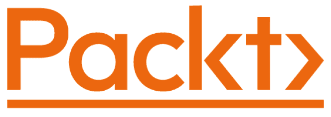

[Packt.com](http://Packt.com)

订阅我们的在线数字图书馆，全面访问超过 7,000 本书籍和视频，以及行业领先的工具，帮助您规划个人发展并推进您的职业生涯。更多信息，请访问我们的网站。

# 为什么订阅？

+   使用来自超过 4,000 位行业专业人士的实用电子书和视频，节省学习时间，多花时间编码

+   通过为您量身定制的技能计划提高您的学习效果

+   每月免费获得一本电子书或视频

+   完全可搜索，便于快速访问关键信息

+   复制粘贴、打印和收藏内容

您知道吗？Packt 为每本书都提供电子书版本，包括 PDF 和 ePub 文件。您可以在[packt.com](http://Packt.com)升级到电子书版本，并且作为印刷书客户，您有权获得电子书副本的折扣。如需更多详情，请联系我们 customercare@packtpub.com。

在[www.packt.com](http://www.packt.com)，您还可以阅读一系列免费技术文章，订阅各种免费通讯，并享受 Packt 书籍和电子书的独家折扣和优惠。

# 您可能还会喜欢的其他书籍

如果您喜欢这本书，您可能对 Packt 的其他书籍也感兴趣：

**Python for Geeks**

Muhammad Asif

ISBN: 9781801070119

+   理解如何设计和管理复杂的 Python 项目

+   在 Python 中制定测试驱动开发（TDD）策略

+   探索 Python 中的多线程和多进程

+   使用 Apache Spark 和 Google Cloud Platform (GCP)用 Python 进行数据处理

+   在公共云（如 GCP）上部署无服务器程序

+   使用 Python 构建 Web 应用程序和应用程序编程接口

+   将 Python 应用于网络自动化和无服务器函数

+   学习使用 Python 进行数据分析和机器学习

**Expert Python Programming - 第四版**

Michał Jaworski, Tarek Ziadé

ISBN: 9781801071109

+   探索设置可重复和一致 Python 开发环境的现代方法

+   有效地打包 Python 代码以供社区和生产使用

+   学习 Python 编程的现代语法元素，如 f-strings、枚举和 lambda 函数

+   使用元类揭秘 Python 中的元编程

+   在 Python 中编写并发代码

+   将 Python 与用 C 和 C++编写的代码扩展和集成

# Packt 正在寻找像您这样的作者

如果您有兴趣成为 Packt 的作者，请访问[authors.packtpub.com](http://authors.packtpub.com)并申请。我们已与数千名开发人员和科技专业人士合作，就像您一样，帮助他们将见解分享给全球科技社区。您可以提交一般申请，申请我们正在招募作者的特定热门话题，或提交您自己的想法。

# 分享您的想法

现在您已经完成了《高级 Python 编程》，我们非常想听听您的想法！如果您在亚马逊购买了这本书，请[点击此处直接跳转到该书的亚马逊评论页面](https://packt.link/r/1801814015)并分享您的反馈或在该购买网站上留下评论。

您的评论对我们和科技社区都非常重要，它将帮助我们确保我们提供的是高质量的内容。
