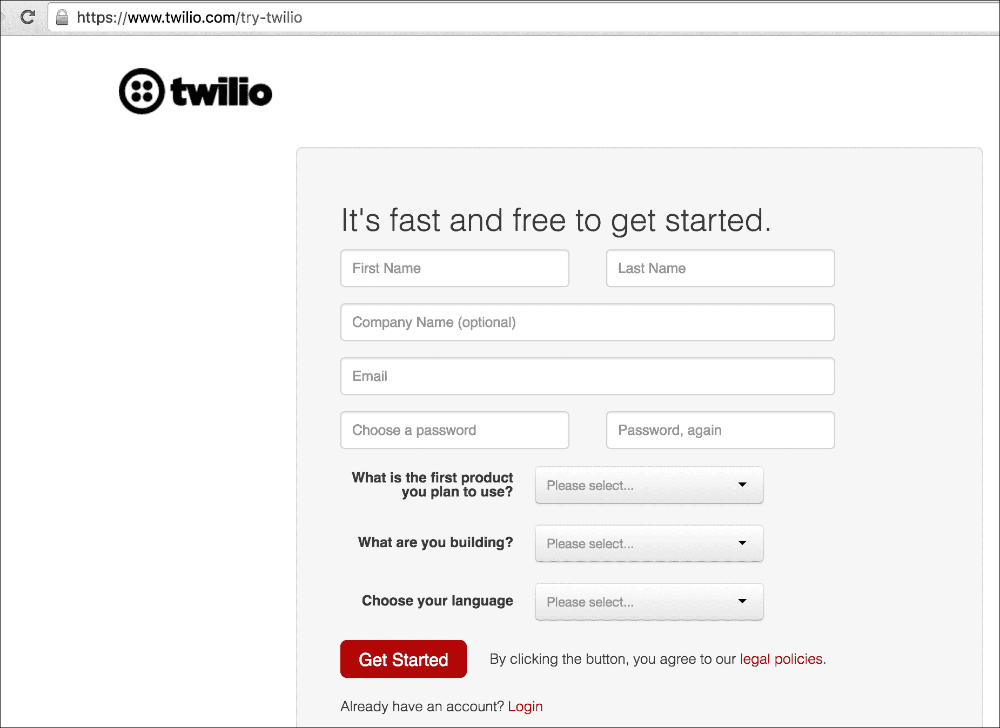
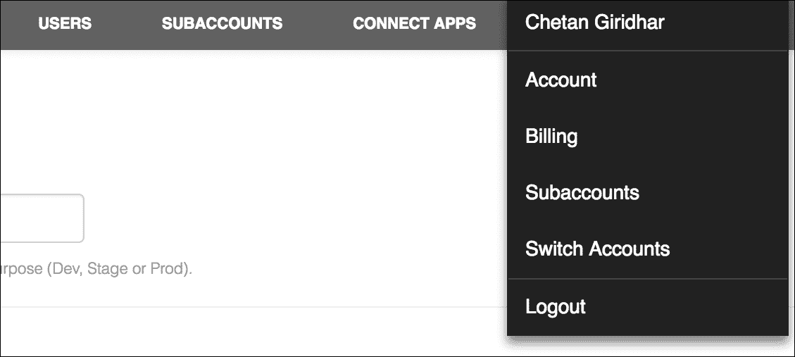
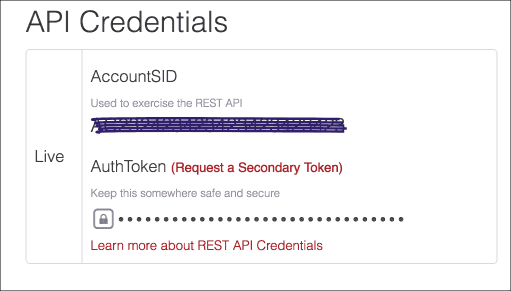
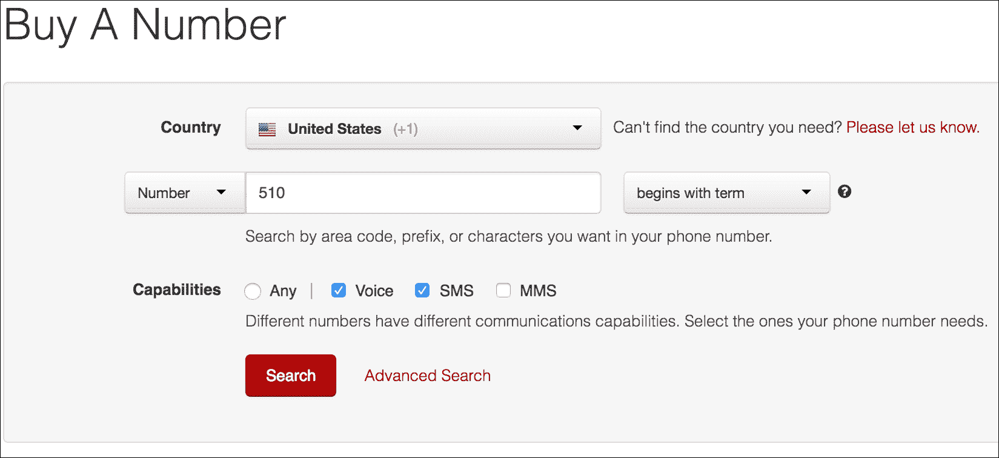
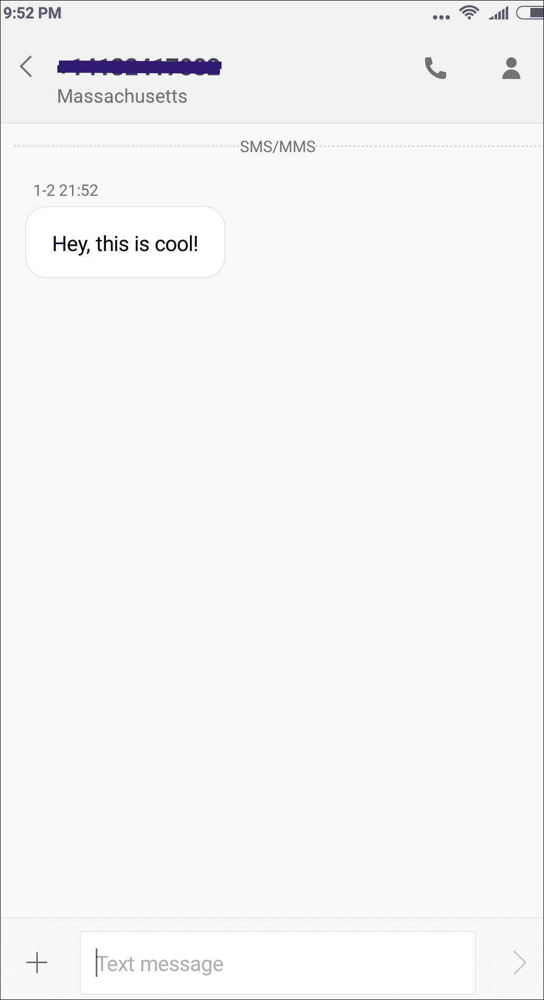
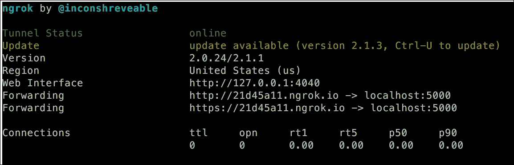
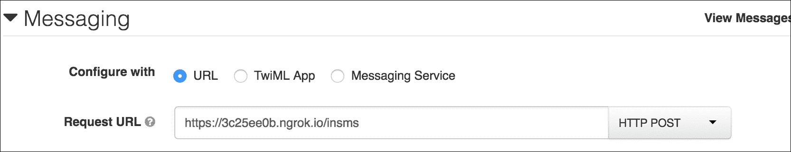
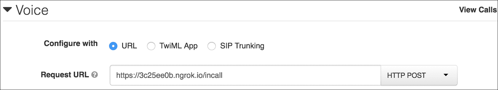
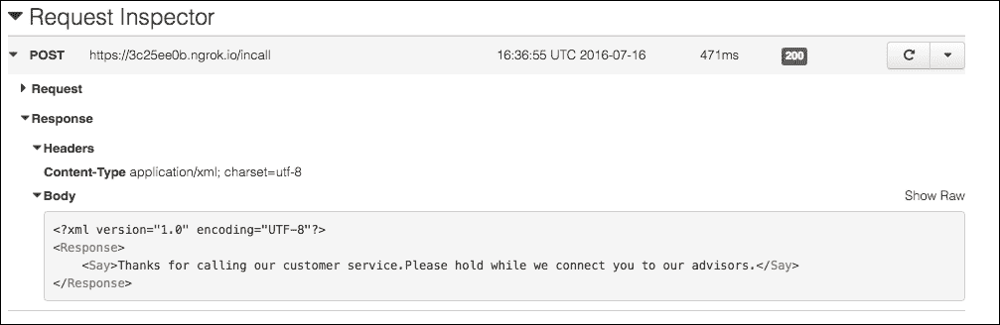
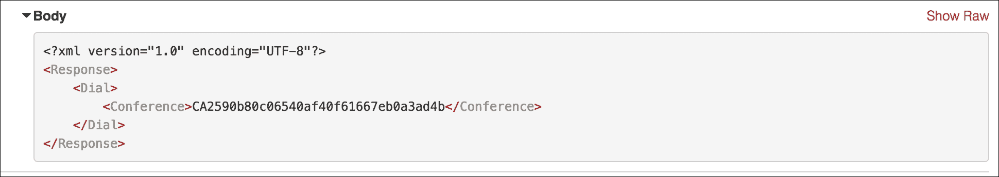

# 第四章. 玩转短信和语音通知

云电话是将您的电话系统迁移到云的技术。这确保了我们现在可以探索使用短信和语音通知自动化的可能性。本章从云电话的介绍开始，并涵盖使用 Python 在文本和语音消息中自动化业务用例。

本章将涵盖以下食谱：

+   在云电话服务提供商处注册

+   发送短信

+   接收短信消息

+   Domino's 的短信工作流程

+   发送语音消息

+   接收语音通话

+   构建自己的客户服务软件

# 简介

在前几章中，我们探讨了处理纯文本和**逗号分隔值**（**CSV**）文件的方法，然后我们扩展了我们的范围，学习如何处理 Excel 工作表、Word 文档和 PDF 文件。Excel、Word 和 PDF 文件以二进制格式提供，并支持数学运算、表格、图表和其他许多操作。我们还探讨了可以用 Python 自动化的有趣业务用例。

在本章中，我们将探讨一个有趣的云电话世界。随着互联网的出现，企业也将他们的通信系统迁移到了云端。基于互联网的托管电话已经取代了传统的电话设备，如 PBX。这为使用云电话解决业务需求打开了可能性，而且还是在 Python 中。使用云电话为您的业务提供让您能够同时进行多个通话和短信的服务。呼叫转移、录音、批量短信是云电话可以利用的一些令人惊叹的功能。云电话确保在不影响质量、成本的情况下管理业务需求，而且无需投资任何额外的基础设施。

本章中的食谱将专注于帮助我们发送/接收短信和语音通话的 Python 模块。我们将学习如何注册云电话服务提供商，使用 Python API，并自动化有趣的业务流程。具体来说，我们将与[Twilio](https://www.twilio.com/)电话服务提供商合作，并在本章中使用以下 Python 模块：

+   `Flask` ([`flask.pocoo.org/`](http://flask.pocoo.org/))

+   `twilio` ([`pypi.python.org/pypi/twilio`](https://pypi.python.org/pypi/twilio))

### 注意

虽然我们将学习 Twilio 云电话服务提供商，但还有其他提供商。每个提供商都有一套优秀的 API，并且与 Python 库兼容。如果您选择实现自己的解决方案，您可以在[`www.capterra.com/telephony-software/`](http://www.capterra.com/telephony-software/)查看其中的一些。

# 在云电话服务提供商处注册

要使用基于云的电话服务，我们需要在电话服务提供商处注册一个账户。你可以在网上搜索时找到一些流行的云提供商。对于这一章，我们使用 Twilio ([`www.twilio.com/`](https://www.twilio.com/))。让我们看看如何注册一个账户。

## 准备工作

为了使用云电话 API，我们需要在 Twilio 注册一个账户，以便我们能够获取**AccountSID**和**AuthToken**。我们还需要为短信和语音部分的食谱租用号码。让我们在这个食谱中学习如何使用 Twilio API。

## 如何操作...

1.  在你的电脑上，打开你喜欢的浏览器并浏览到[`www.twilio.com/try-twilio`](https://www.twilio.com/try-twilio)：

1.  一旦你创建了一个账户，登录并从你的账户仪表板上的下拉菜单中的**账单**页面添加一些资金。如果你已经登录，也可以直接浏览到[`www.twilio.com/user/billing`](https://www.twilio.com/user/billing)的**账单**页面：

1.  要进行 Twilio API 调用，我们需要**AccountSID**和**AuthToken**。我们可以通过在下拉菜单中点击**账户**部分或直接浏览到[`www.twilio.com/user/account/settings`](https://www.twilio.com/user/account/settings)来获取这些详细信息。在这个页面上，你会看到以下截图所示的 API 凭证。现在不用担心双因素认证，但请确保你的账户启用了**SSL 证书验证**：

1.  好的，那很好。现在，让我们通过直接浏览到[`www.twilio.com/user/account/phone-numbers/search`](https://www.twilio.com/user/account/phone-numbers/search)来租用一个电话号码。

1.  一旦你点击**购买号码**，你将看到一个页面，你可以根据国家、前缀或区号来租用一个号码。在这里，我选择了国家为**美国**，前缀为`510`。我还在租用一个能够处理**短信**和**语音**通话的号码：

1.  现在，点击页面底部的**高级搜索**选项以获取所有选项，如下截图所示。你可以使用默认设置**全部**或选择租用**本地**或**免费电话**号码。根据地区或国家的当地规则，租用号码可能需要你提供地址证明，但你不一定需要所有这些，可以选择**任何**选项。**测试号码**是从特定国家新添加到 Twilio 的号码，用于支持一系列国家。在这个食谱中，我们不需要关心这个选项，所以保持空白：

1.  当您点击 **搜索** 时，此页面将带您到结果屏幕，您可以选择购买任何可用的号码。请确保您购买了一个同时启用了 **语音** 和 **短信** 的号码。免费电话号码成本较高，因此最好为此练习购买一个 **本地** 号码：

1.  太棒了！如果您已经完成了这些，那么恭喜您！现在您已经准备好开始学习如何使用 Python API 来使用短信和语音通话了。

## 工作原理...

如前所述，要使用 Twilio API，我们需要注册一个账户。Twilio 会为我们创建一个账户，并为我们提供一个唯一的 **AccountSID** 和 **AuthToken**，这些信息将验证我们的请求，并确保我们的账户为所进行的 API 调用付费。

Twilio 中的电话号码用作主叫 ID 来发送短信或语音通话。主叫 ID（也称为来电号码识别）是显示在被叫方设备（固定电话或手机）上的来电号码。在这种情况下，我们将使用我们从 Twilio 租用的号码作为主叫 ID。

## 更多内容...

我们已经了解了如何创建账户、获取 **AccountSID** 和 **AuthToken** 以及使用 Twilio 生成电话号码。现在，让我们在下一个菜谱中使用这些信息。

# 发送短信

让我们看看我们关于处理短信的第一个菜谱。在这个菜谱中，我们将通过 SMS 向收件人发送消息。请注意，您可能现在还需要为执行下一组操作向您的账户收费。

## 准备工作

我们首先使用 Twilio API 发送短信。让我们在本节中看看如何操作。在这样做之前，让我们按照以下步骤创建一个 Python 虚拟环境，并使用 `pip` 安装 `flask` 和 `twilio` 模块。

注意，我们将使用 `flask` 来托管一个简单的 Web 服务，该服务将由电话服务提供商 Twilio 调用。然后，*flask* 应用程序将根据 Twilio 的回调执行所需的企业操作。当我们查看菜谱时，我们将了解更多关于此的信息。

设置虚拟环境并安装模块需要在您的计算机命令行中完成。我们使用 Python `pip` 来安装 `flask` 和 `twilio` 模块：

```py
virtualenv ~/book/ch05/
source ~/book/ch05/
pip install flask
Collecting flask==0.10.1
 Downloading Flask-0.10.1.tar.gz (544kB)
 100% |████████████████████████████████| 544kB 774kB/s 
Collecting Werkzeug>=0.7 (from flask==0.10.1)
 Downloading Werkzeug-0.11.10-py2.py3-none-any.whl (306kB)
 100% |████████████████████████████████| 307kB 1.5MB/s 
Collecting Jinja2>=2.4 (from flask==0.10.1)
 Downloading Jinja2-2.8-py2.py3-none-any.whl (263kB)
 100% |████████████████████████████████| 266kB 2.4MB/s 
Collecting itsdangerous>=0.21 (from flask==0.10.1)
 Downloading itsdangerous-0.24.tar.gz (46kB)
 100% |████████████████████████████████| 49kB 6.2MB/s 
Collecting MarkupSafe (from Jinja2>=2.4->flask==0.10.1)
 Downloading MarkupSafe-0.23.tar.gz
Building wheels for collected packages: flask, itsdangerous, MarkupSafe
 Running setup.py bdist_wheel for flask
 Stored in directory: /Users/chetan/Library/Caches/pip/wheels/b6/09/65/5fcf16f74f334a215447c26769e291c41883862fe0dc7c1430
 Running setup.py bdist_wheel for itsdangerous
 Stored in directory: /Users/chetan/Library/Caches/pip/wheels/fc/a8/66/24d655233c757e178d45dea2de22a04c6d92766abfb741129a
 Running setup.py bdist_wheel for MarkupSafe
 Stored in directory: /Users/chetan/Library/Caches/pip/wheels/a3/fa/dc/0198eed9ad95489b8a4f45d14dd5d2aee3f8984e46862c5748
Successfully built flask itsdangerous MarkupSafe
Installing collected packages: Werkzeug, MarkupSafe, Jinja2, itsdangerous, flask
Successfully installed Jinja2-2.8 MarkupSafe-0.23 Werkzeug-0.11.10 flask-0.10.1 itsdangerous-0.24

```

接下来，使用以下命令安装 `twilio`：

```py
pip install Twilio
Collecting twilio
 Downloading twilio-5.4.0.tar.gz (193kB)
 100% |████████████████████████████████| 196kB 2.2MB/s 
Collecting httplib2>=0.7 (from twilio)
 Downloading httplib2-0.9.2.zip (210kB)
 100% |████████████████████████████████| 212kB 2.0MB/s 
Collecting six (from twilio)
 Downloading six-1.10.0-py2.py3-none-any.whl
Collecting pytz (from twilio)
 Downloading pytz-2016.6.1-py2.py3-none-any.whl (481kB)
 100% |████████████████████████████████| 483kB 1.0MB/s 
Building wheels for collected packages: twilio, httplib2
 Running setup.py bdist_wheel for twilio
 Stored in directory: /Users/chetan/Library/Caches/pip/wheels/91/16/85/2ea21326cf1aad3e32f88d9e81723088e1e43ceb9eac935a9b
 Running setup.py bdist_wheel for httplib2
 Stored in directory: /Users/chetan/Library/Caches/pip/wheels/c7/67/60/e0be8ccfc1e08f8ff1f50d99ea5378e204580ea77b0169fb55
Successfully built twilio httplib2
Installing collected packages: httplib2, six, pytz, twilio
Successfully installed httplib2-0.9.2 pytz-2016.6.1 six-1.10.0 twilio-5.4.0

```

## 如何操作...

1.  让我们从创建一个包含我们的 Twilio **AccountSID** 和 **AuthToken** 的配置文件开始。我们还将我们的租用号码作为主叫 ID 添加到配置中，并添加要发送消息的定制号码。您可以在该字段中添加自己的号码以查看它是否适合您。

1.  我们的配置文件如下所示，我们将其存储为 `config.py`：

    ```py
            TWILIO_ACCOUNT_SID = 'Account SID' 
            TWILIO_AUTH_TOKEN = 'Auth Token' 
            CALLERID = '+Rented Number' 
            MYNUMBER = '+Your Number' 

    ```

1.  现在，让我们编写我们的应用程序，它将实际发送这条消息。我们将它存储为 `send_sms.py` 并从 `config.py` 中导入配置：

    ```py
            import config 
            from flask import Flask 
            from twilio.rest import TwilioRestClient 

            app = Flask(__name__) 
            client = TwilioRestClient(config.TWILIO_ACCOUNT_SID, 
                                      config.TWILIO_AUTH_TOKEN) 

            message = client.messages.create( 
                to=config.MYNUMBER, 
                from_=config.CALLERID, 
                body="Hey, this is cool!") 

    ```

1.  我们通过进入终端或从你喜欢的编辑器运行此代码来运行此代码。检查你的手机，你应该会收到一条来自你租用号码的消息，**嘿，这很酷！** 确实，这很酷！你的消息可能需要 2-3 分钟才能到达，具体取决于你的运营商和网络拥堵，所以请耐心等待。查看以下截图以查看收到的消息：

## 它是如何工作的...

首先，我们创建了一个配置文件，并填充了所有必需的字段。在 `send_sms.py` 文件中，我们通过导入 `config.py` 来导入这个配置文件，同时也导入了所需的模块，如 `flask` 和 `twilio` Python 模块。

我们随后通过使用从 `twilio.rest` 模块导入的类 `TwilioRestClient` 创建了 `twilio` 对象，名为 `client`。使用 **AccountSID** 和 **AuthToken** 创建了一个对象。

然后，我们使用 `client.messages` 类的 `create()` 方法发送一条消息。在这里，`to` 是接收消息的电话号码，`from_` 是主叫 ID，而 `body` 是要发送的文本。为什么是 `from_` 而不是 `from`？嗯，那是因为 `from` 会与 Python 的 `from` 关键字冲突，该关键字用于导入模块。

## 还有更多...

简单吧？！向我们的号码发送短信轻而易举。现在，你能编写你自己的应用程序吗？让我们看看你能想到什么。可能的话，给我发条消息邀请我参加你的生日派对！

但是，如果我们不知道如何接收传入的消息，那还有什么乐趣呢？让我们在下一节学习如何做到这一点。

# 接收短信消息

当你在思考发送短信的各种用例时，你肯定觉得接收短信的能力同样重要。所以，让我们通过一个自动响应消息应用来看看这一点。

## 准备中

对于这个菜谱，我们将使用 **ngrok** 软件。ngrok ([`ngrok.com/`](https://ngrok.com/)) 软件可以帮助你将本地机器连接到互联网。这意味着你可以将位于 NAT 或防火墙后面的本地服务器暴露给互联网。这是一个真正强大的实用工具！对于下一个菜谱，下载 ngrok ([`ngrok.com/download`](https://ngrok.com/download)) 并在终端中使用命令在端口 5000 上运行它。如果你连接到互联网，你应该会看到一个实例正在为你运行：

```py
./ngrok http 5000

```

以下截图显示了 ngrok 如何使你的应用对互联网可见，并在 URL `https://<uuid>.ngrok.io/` 上：



### 注意

还不要启动 ngrok，我们将在我们的菜谱中启动 ngrok。

## 如何操作...

1.  让我们从编写我们的服务器以接收短信开始。我们将称之为 `recv_sms.py`。服务器的代码如下所示：

    ```py
            from flask import Flask
            import twilio.twiml
            app = Flask(__name__)
            @app.route("/insms", methods=['GET', 'POST'])
            def respond_sms():
                resp = twilio.twiml.Response()
                resp.message("Thanks for your query. We will
                              get back to you soon")
            return str(resp)
            if __name__ == "__main__":
            app.run(debug=True)
    ```

1.  使用以下命令从你的终端使用 Python 运行服务器：

    ```py
     python recv_sms.py

    ```

1.  使用以下命令启动 ngrok：

    ```py
     ./ngrok http 5000

    ```

1.  很好，我们的服务器已经运行起来了。让我们通过添加 **请求 URL** 来配置我们的 Twilio 号码。为此，请登录到 Twilio，转到 **电话号码** 部分，然后点击你的租用号码。在这里，转到消息部分，并输入如以下截图所示的 **请求 URL**。确保 URL 指向在上一步骤中启动的 ngrok 实例：

我们完成了！所以，当有人向你的租用号码发送消息时，他们将收到一个自动回复，说 **感谢您的查询。我们将尽快回复您**。

太棒了！这太好了，但嘿，它是如何工作的？

## 它是如何工作的...

接收传入消息的服务器是用 `Flask` 编写的，并运行在端口 5000 上。这使得服务器在本地机器上运行。为了使其在互联网上可用，我们启动 `ngrok` 并使其在 Flask 服务器相同的端口（5000）上运行。

我们配置 Twilio 电话号码，将传入的消息路由到我们的 Flask 服务器。为了实现这一点，我们将请求 URL 添加到 Twilio。因此，每当有人向租用的号码发送消息时，它将通过 ngrok 路由到我们的 Flask 服务器。在我们的应用程序中，我们将其路由到 `https://<ngrokId>.ngrok.io/insms`。

如果你看看我们的 Flask 服务器，我们已经有了一个配置了 URL 的路由，`/insms`。这个路由从 Twilio 服务器（多亏了 **请求 URL** 设置）接收 `POST` 请求，然后回复消息，**感谢您的查询。我们将尽快回复您**。

## 还有更多...

你已经学习了如何使用 Twilio 发送和接收短信。我知道你已经在思考你的用例以及如何利用短信来解决这些问题。让我们看看食品零售行业的一个例子。

# Domino's 的 SMS 工作流程

美国的多米诺比萨店老板约翰正在寻找提高比萨饼销售的方法。提高销售的一种方法是将重点放在简化订购比萨饼的过程上。他还希望自动化工作流程，以便他可以随时更新顾客的订单和配送状态。他还觉得虽然互联网很棒，但顾客可能也希望在网络信号弱的地方订购比萨饼。你认为他必须做什么？

## 准备就绪

让我们考虑一下用例，并写下我们需要的所有内容？以下是我能想到的一些事情：

+   接收传入消息的能力

+   维护和查询订单状态

+   发送出站状态消息

## 如何操作...

让我们看看解决方案，然后了解它是如何为多米诺比萨店工作的。

以下代码片段分为三个主要方面：使用 `flask` 路由接收传入的消息、维护查询订单的顾客的订单状态，以及从 *Flask* 应用程序发送出站消息的能力：

```py
        from flask import Flask, request 
        import twilio.twiml 

        class Pizza: 
            def __init__(self): 
                self.status = None 

            def setStatus(self, status): 
                self.status = status 

            def getStatus(self): 
                return self.status 

         app = Flask(__name__) 
        @app.route("/insms", methods=['GET', 'POST']) 
        def respond_sms(): 
            content = request.POST['Body'] 
            resp = twilio.twiml.Response() 
            if content == 'ORDER': 
                resp.message("Thanks! We're already on your order!") 
                pizza = Pizza() 
                pizza.setStatus('complete') 
                return str(resp) 

            if content == 'STATUS': 
                pizza = Pizza() 
                status = pizza.getStatus() 
                if status == 'complete': 
                    resp.message("Your order is ready!") 
                    return str(resp) 
                else: 
                    resp.message("Sorry! could not locate your order!") 
                    return str(resp) 

                else: 
                    resp.message("Sorry! Wrong selection") 
                    return str(resp)         

        if __name__ == "__main__": 
                app.run(debug=True) 

```

## 它是如何工作的...

我们已经有了接收传入消息的应用程序。因此，我们使用这个应用程序并扩展它以满足我们的需求。我们租用的号码变成了多米诺比萨的号码，它被闪现在他们的广告牌上：

+   在我们的用例中，我们决定使用两个关键词，`ORDER`和`STATUS`，多米诺比萨的客户可以使用。

+   当客户发送`ORDER`消息到多米诺比萨时，他们可以为他们的选择订购披萨。披萨店积极回应订单，表示他们已经在处理了。

+   当客户想要了解他们订单的状态时，他们可以通过发送`STATUS`文本来检查。在我们的案例中，当客户查询他们的订单时，他们从披萨店得到一个回复，说他们的订单已经准备好了。想象一下客户在阅读这个回复时的满意度。

+   客户觉得下订单和了解其状态非常简单。他们肯定会开始订购更多！嗯，至少我会。

+   约翰非常高兴，他决定给他的 IT 经理加薪，而巧合的是，那个人就是你！酷，不是吗？

## 还有更多...

现在，如果你注意到的消息是由或发送到比萨店的，它们是发送到租用的号码。把消息发送到像**DOMP**（多米诺比萨的缩写）这样的自定义代码怎么样？是的，你可以使用短信短码来实现这一点；它们不是免费的，你需要以高昂的价格购买。

## 参见

+   我们已经完成了所有短信消息的菜谱。希望您学到了一些东西，并将其中的一些应用到您的实际中。你能尝试发送 MMS 消息，比如带有多米诺比萨标志的优惠信息吗？这是你可以探索的事情。

+   在下一个菜谱中，我们将开始处理语音通话，并欣赏它们能提供的内容。我们能用语音信息做一些酷炫的事情吗？让我们在下一组菜谱中看看。

# 发送语音消息

你听说过 VoIP 吗？是的，**互联网协议语音**。**VoIP**（缩写）是一组用于在互联网协议网络上（如互联网本身）传输语音和多媒体的技术，例如 Skype 和 Google Talk 等提供消费者和企业领域的通信解决方案的产品。VoIP 为互联网上的通信开辟了一个全新的世界。

电信 API 提供商，如 Twilio，也使用 VoIP 协议发送语音消息。在本节中，你将学习如何使用 Twilio API 进行或接收语音通话。所以，让我们跳进去，开始使用 API 吧！

## 准备工作

在这个菜谱中，我们使用`twilio`和`flask`模块，就像我们在之前的短信菜谱中使用的那样。所以，本节不需要新的安装。

## 如何做...

1.  我们首先创建我们的配置文件。发送语音消息就像发送短信一样简单。我们在这里也需要 Twilio 的**AccountSID**和**AuthToken**。我们还需要呼叫 ID 和发送语音消息的号码。这是我们的配置看起来像：

    ```py
            TWILIO_ACCOUNT_SID = '<Account SID>' 
            TWILIO_AUTH_TOKEN = '<Auth Token>' 
            CALLERID = '<Rented Number>' 
            MYNUMBER = '<Number to call>'   

    ```

1.  让我们现在开始编写我们的 Flask 服务器代码。以下代码帮助我们使用 Twilio Python API 进行语音通话。我们将文件保存为`voice_outbound.py`：

    ```py
            import config 
            from flask import Flask, Response, request 
            from twilio import twiml 
            from twilio.rest import TwilioRestClient 

            app = Flask(__name__) 
            client = TwilioRestClient(config.TWILIO_ACCOUNT_SID, 
                                      config.TWILIO_AUTH_TOKEN) 

            @app.route('/call', methods=['POST']) 
            def outbound_call(): 
                response = twiml.Response() 
                call = client.calls.create( 
                    to=config.MYNUMBER, 
                    from_=config.CALLERID, 
                    record='true', 
                ) 
                return Response(str(response), 200,
            mimetype="application/xml") 

            if __name__ == '__main__': 
            app.run(debug=True) 

    ```

1.  使用以下命令运行 Flask 服务器。这将使我们的 Flask 服务器在默认端口 5000 上运行：

    ```py
     python voice_outbound.py

    ```

1.  使用以下命令在端口 5000 上启动 ngrok。这将确保我们的服务器通过 ngrok 提供的隧道设施在互联网上可用。复制 ngrok 正在运行的 URL。它将是以下格式，`https://<ngrokid>.ngrok.io/`，就像我们在前面的章节中看到的那样：

    ```py
     ./ngrok http 5000

    ```

    我们的服务器现在已准备好拨打电话，所以请继续向`https://<ngrokid>.ngrok.io/call`发送`POST`请求，你应该会接到配置文件中添加的电话。

    哇，这太酷了！但是当你接起电话时会发生什么？你的电话会被断开。为什么？那是因为在 Twilio 中，每个语音电话都伴随着一个回调 URL，一旦电话被接起，就会执行下一组指令。这在我们代码中没有定义，因此电话会因为错误而断开。让我们来修复这个问题。

1.  那么，让我们添加回答回调 URL 并完成我们的服务器代码：

    ```py
            import config 
            from flask import Flask, Response, request 
            from twilio import twiml 
            from twilio.rest import TwilioRestClient 

            app = Flask(__name__) 
            client = TwilioRestClient(config.TWILIO_ACCOUNT_SID, 
                                      config.TWILIO_AUTH_TOKEN) 

            @app.route('/call', methods=['POST']) 
            def outbound_call(): 
                response = twiml.Response() 
                call = client.calls.create( 
                    to=config.MYNUMBER, 
                    from_=config.CALLERID, 
                    record='true', 
                    url=config.BASE_URL + '/answer_url', 
                ) 
                return Response(str(response), 200,
                                mimetype="application/xml") 

            @app.route('/answer_url', methods=['POST']) 
            def answer_url(): 
                response = twiml.Response() 
                response.addSay("Hey! You are awesome. Thanks for answering.") 
                return Response(str(response), 200,
                                mimetype="application/xml") 

            if __name__ == '__main__': 
                app.run(debug=True) 

    ```

1.  如果你查看`outbound_call()`方法中的`url`参数，它指向`BASE_URL`。这与 ngrok URL 后缀为`/answer_url`的 URL 相同。现在，如果你向`https://<ngrokid>.ngrok.io/call`发送`POST`请求，你的号码将收到电话。一旦你接起电话，就会向`https://<ngrokid>.ngrok.io/answer_url`发送一个回调`POST`请求，你将听到消息“*嘿！你太棒了。感谢你接听*”。哇！

1.  这里是服务器日志的示例：

    ```py
            * Detected change in '/Users/chetan/book/ch05/app.py',
              reloading 
            * Restarting with stat 
            * Debugger is active! 
            * Debugger pin code: 608-057-122 

            127.0.0.1 - - [16/Jul/2016 21:35:14] "POST 
                           /call HTTP/1.1" 200 - 
            127.0.0.1 - - [16/Jul/2016 21:35:22] "POST 
                           /answer_url HTTP/1.1" 200 - 

    ```

## 它是如何工作的...

那么，它是如何工作的？在完成短信部分后，这部分应该很容易理解。我们将一步一步地通过代码来讲解：

1.  我们首先使用`twilio.rest`模块中的`TwilioRestClient`类创建一个名为`client`的`twilio`对象。

1.  我们在 Flask 应用中定义了一个路由，`/call`，它接受`POST`方法调用。这个路由会给我们自己的号码拨打电话。

1.  实际的电话是通过`outbound_call()`路由方法，利用`client.calls`类的`create()`方法来拨打的。

1.  在`create()`调用中，我们定义了参数，例如：

    +   `to`：这是被拨打的手机/固定电话号码

    +   `from_`：这是从 Twilio 租用的号码

    +   `record`：这将决定电话是否应该被录音

    +   `url`：这是当语音电话被接听时被调用的回调`url`

1.  在 Flask 应用中，我们还定义了一个新的路由，`/answer_url`，当电话被接起时会被调用。现在，这很有趣，需要理解。Twilio 基于 TwiML（也称为 Twilio 标记语言）的哲学。如果你查看标记，它基本上是一个 XML 标记。TwiML 是一组指令，可以用来告诉 Twilio 如何处理传入的短信或语音电话。所以，`addSay()`方法与以下相同：

    ```py
            <?xml version="1.0" encoding="UTF-8"?> <Response>
            <Say>Hey! You are awesome. Thanks for answering</Say>
            </Response> 

    ```

## 还有更多...

因此，我们学习了如何向特定号码发送语音电话，以及当电话被接听时，答案回调 URL 如何被调用。现在，让我们学习如何处理来电。

# 接收语音电话

接收语音电话是使用云电话开发应用程序的一个重要方面。许多业务案例（正如你所想象的）都依赖于来电。让我们看看如何使用 Twilio API 处理来电。

## 准备工作

在这个菜谱中，我们使用 `twilio` 和 `flask` 模块，就像我们在之前的 SMS 菜谱中使用的那样。因此，本节不需要进行新的安装。

## 如何操作...

1.  我们首先创建配置文件。我们在这里也需要 Twilio 的 **AccountSID** 和 **AuthToken**。在这种情况下，我们不需要任何来电者 ID，因为租用的号码本身就是来电者 ID。

1.  现在，让我们看看我们的 Flask 服务器，其代码如下所示。我们将其称为 `voice_inbound.py`：

    ```py
            from flask import Flask, Response, request 
            from twilio import twiml 
            from twilio.rest import TwilioRestClient 

            app = Flask(__name__) 
            client = TwilioRestClient(config.TWILIO_ACCOUNT_SID, 
                                      config.TWILIO_AUTH_TOKEN) 

            @app.route('/incall', methods=['POST']) 
            def inbound_call(): 
                response = twiml.Response() 
                response.addSay("Thanks for calling our customer 
                                 service." "Please hold while we 
                                 connect you to our advisors.") 
                return Response(str(response), 200,
                                mimetype="application/xml") 

            if __name__ == '__main__': 
                app.run(debug=True) 

    ```

1.  使用以下命令运行 Flask 服务器。这将使我们的 Flask 服务器在默认端口 5000 上运行：

    ```py
     python voice_outbound.py

    ```

1.  使用以下命令在端口 5000 上启动 ngrok。这将确保我们的服务器通过 ngrok 提供的隧道设施在互联网上可用。复制 ngrok 运行的 URL。它将是 `https://<ngrokid>.ngrok.io/` 的格式，就像我们在上一节中看到的那样：

    ```py
     ./ngrok http 5000

    ```

1.  现在，登录到 Twilio 并为来电配置租用的号码。我们将 **请求 URL** 配置为指向 ngrok URL。查看以下截图了解如何将 **请求 URL** 添加到你的租用号码：

1.  一旦你在 Twilio 上启动了服务器并配置了设置，就可以通过 Skype 或 Google Talk 向你租用的号码打电话。这将向我们的 Flask 服务器发送一个 `POST` 请求，然后服务器会以 TwiML 响应回复，内容为：“感谢您拨打我们的客服电话。请稍候，我们将为您连接顾问。”

## 如何工作...

接收传入消息的服务器是用 Flask 编写的，并在端口 5000 上运行。这是本地于我们的机器上，为了使其在互联网上可用，我们使用 ngrok 创建隧道。

现在，当任何人拨打租用的号码时，Twilio 会查找 **请求 URL** 并向该 URL 发送请求，表明租用号码有来电。

我们的 Flask 服务器定义了一个路由 `/incall`（用于匹配 **请求 URL**），当我们的租用号码收到来电时会被调用。`/incall` 路由反过来创建一个 TwiML 响应，向 `<Response>` 标记添加 `<Say>`，通话者会听到 `<Say>` XML 中添加的消息。

以下截图显示了 Twilio 中的 TwiML 响应外观。顺便说一下，接收或发送的每个电话或短信都可以在 Twilio 界面中看到：



# 构建自己的客户服务软件

保罗负责他公司的客户服务。公司有一个看起来很漂亮的网站，它有一个通过聊天接收客户投诉或问题的功能。保罗经常收到客户的反馈，说聊天系统对他们来说没有用，因为他们希望在遇到产品问题时能够联系到公司的人，并希望这些问题能够迅速得到解决。你能让保罗的生活变得更轻松吗？

## 准备就绪

让我们考虑一下用例，并写下我们需要的所有内容？以下是我能想到的一些事情：

+   接收来电的能力

+   将电话转接到客户支持工程师

## 如何做到...

让我们看看解决方案，然后理解它对保罗是如何工作的。

在这个代码片段中，我们将添加接收租用号码来电的能力，并添加通话转接的功能：

```py
        import config 
        from flask import Flask, Response, request 
        from twilio import twiml 
        from twilio.rest import TwilioRestClient 

        app = Flask(__name__) 
        client = TwilioRestClient(config.TWILIO_ACCOUNT_SID, 
                                  config.TWILIO_AUTH_TOKEN) 

        @app.route('/call', methods=['POST']) 
        def inbound_call(): 
            call_sid = request.form['CallSid'] 
            response = twiml.Response() 
            response.dial().conference(call_sid) 
            call = client.calls.create(to=config.MYNUMBER, 
                                       from_=config.CALLERID, 
                                       url=config.BASE_URL + 
                                       '/conference/' + call_sid) 
            return Response(str(response), 200,
                            mimetype="application/xml") 

        @app.route('/conference/<conference_name>', 
                    methods=['GET', 'POST']) 
        def conference_line(conference_name): 
            response = twiml.Response() 
        response.dial(hangupOnStar=True).conference(
                          conference_name) 
            return Response(str(response), 200,
                            mimetype="application/xml") 

        if __name__ == '__main__': 
            app.run(debug=True) 

```

## 如何工作...

我们已经创建了一个接收来电的应用程序。我们将此应用程序扩展到我们的用例中，以便当客户拨打租用的号码时，会向`/call`路由（由`inbound_call()`方法定义）发起一个`POST`调用。

我们的`flask`路由通过 TwiML 指令集将入站电话添加到会议中。正如你所知，会议是一组彼此桥接的通话。

`response.dial().conference(conference_name)`方法是帮助我们向会议添加通话腿的方法。这就是 TwiML 的样子；你可以看到在`<Response>`标签下我们有`<Dial>`和`<Conference>`标签：



`flask`路由确保它向客户支持工程师（通过`MYNUMBER`识别）发起一个出站电话。出站电话到客户支持工程师配置了`url`参数（就像我们在出站语音电话部分看到的答案 URL）。因此，当支持工程师接起电话时，回调答案 URL 会被调用，工程师通话腿也会被添加到与入站通话腿相同的会议中。

两个通话腿，来自客户的来电和打给支持工程师的出站电话，现在都在一个会议中，可以进行对话。客户的问题很快得到解决，保罗也很高兴。太酷了！

## 还有更多...

你学习了如何通过使用云电话 API 构建自己的短信和语音应用程序。然而，如果你真的对利用已经构建的解决方案来满足你的需求感兴趣，你可以查找一些标准软件应用程序，例如 CallHub（[`callhub.io/`](https://callhub.io/)），这可以帮助你以合理的成本高效地自动化你的用例。你也可以使用他们的 API 构建自己的呼叫中心解决方案。那么，你接下来要构建什么呢？

我相信你们喜欢这一章；让我们在下一章中继续享受乐趣！让我们看看我们准备了些什么！
