# 第五章。电子邮件的乐趣

在过去几十年中，电子邮件已成为信息交换的主要模式。您每天都会处理电子邮件，出于多种原因。但您是否曾想过可以用 Python 操作您的收件箱？

在本章中，我们将介绍以下食谱：

+   发送电子邮件消息

+   电子邮件加密

+   使用 MIME 消息美化电子邮件消息

+   带附件的电子邮件消息

+   连接到您的收件箱

+   获取和阅读电子邮件消息

+   标记电子邮件消息

+   清除收件箱中的电子邮件消息

+   使用电子邮件响应自动化客户支持流程

# 简介

嗨，朋友们！希望你们今天过得愉快。在本章中，我们将讨论电子邮件以及我们可以使用 Python 实现的众多电子邮件操作。我们还将通过实际业务用例了解如何利用电子邮件自动化业务流程。

那么，我们还在等什么呢？让我们开始，了解一下电子邮件的历史及其技术实现。

实际上，电子邮件无需介绍；当然，它们是用户之间交换数字消息的方法。电子邮件在互联网上的计算机网络上进行信息交换。您可以登录您喜欢的电子邮件客户端，开始处理存储在电子邮件服务器上的消息。最广泛使用的网络客户端是 Gmail。

电子邮件有着非常有趣的历史。在过去，电子邮件需要发送者和接收者同时在线才能成功进行通信。这难道没有意义吗？随着时间的推移，电子邮件服务器变得智能，开始采用存储和转发哲学。今天，电子邮件消息异步存储在服务器上，以便接收者可以在方便的时候查看。因此，电子邮件服务器能够提供接受、转发和标记消息等服务。

电子邮件最初只使用 ASCII 字符，后来通过**多用途互联网邮件扩展**（**MIME**）扩展为支持富文本和附件。从协议的角度来看，电子邮件最初使用**文件传输协议**（**FTP**）在计算机之间发送消息，但如您所知，**简单邮件传输协议**（**SMTP**）是目前最广泛使用的电子邮件处理协议。

### 备注

请注意，本书不涵盖电子邮件服务器的设置。如果你在网上搜索，你会找到更多可以帮助你入门的资源。本章的目的是让你了解使用 Python 程序可以做什么。我们使用 Gmail 网络客户端作为例子，这样你可以快速尝试代码示例，并欣赏使用 Python 自动化电子邮件任务而不必设置自己的电子邮件服务器的强大功能。虽然我们以 Gmail 为例，但这些代码片段也可以适用于任何其他支持 SMTP 发送电子邮件和 IMAP 检索电子邮件的电子邮件服务器。

在本章中，我们将学习如何使用 Python 处理电子邮件。我们还将使用以下列出的多个 Python 模块来对电子邮件消息执行各种操作：

+   `smtplib` ([`docs.python.org/2/library/smtplib.html`](https://docs.python.org/2/library/smtplib.html))

+   `email` ([`docs.python.org/2/library/email.html`](https://docs.python.org/2/library/email.html))

+   `imaplib` ([`docs.python.org/2/library/imaplib.html`](https://docs.python.org/2/library/imaplib.html))

+   `gmail` ([`github.com/charlierguo/gmail`](https://github.com/charlierguo/gmail))

### 注意

当涉及到使用 Python 处理电子邮件时，你需要的是一个帮助你构建消息的模块，一个可以发送电子邮件的模块，以及一个帮助你检索和更新消息的模块。

# 发送电子邮件消息

你可能首先想要通过电子邮件客户端实现的是向你的朋友或同事的电子邮件地址发送消息。让我们继续看看在 Python 中我们如何实现这一点。

## 准备工作

为了发送电子邮件，我们需要拥有 Python 的`smtplib`模块。正如其名所示，这个库使用 SMTP 协议来发送电子邮件。我们可以使用我们喜欢的`pip`工具通过以下命令安装`smtplib`。但 Python 的默认安装应该已经包含了这个模块：

```py
pip install smtplib

```

## 如何操作...

1.  在你的电脑上，打开你最喜欢的编辑器并添加以下代码片段。让我们称这个为`config.py`。配置文件包含登录详细信息，如电子邮件地址、密码以及需要发送电子邮件的电子邮件地址：

    ```py
            fromaddr = "abc@gmail.com"
            password = "xyz@123"
            toaddr = "abc@gmail.com"
    ```

1.  现在，让我们编写代码来使用这个配置文件发送电子邮件：

    ```py
            import smtplib
            import config server = smtplib.SMTP('smtp.gmail.com', 587)
            server.starttls()
            server.login(config.fromaddr, config.password)
            msg = "Some nice msg"
            server.sendmail(config.fromaddr, config.toaddr, msg) 
            server.quit()
    ```

1.  将前面的代码保存为`basic_email.py`，并使用以下命令运行代码：

    ```py
     python basic_email.py 

    ```

1.  如果你运行前面的代码，你会看到带有`SMTPAuthenticationError`的异常，并且你的程序将因为退出代码`1`而失败。你的异常将如下所示：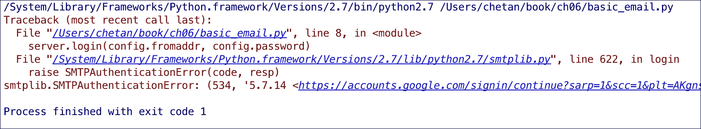

1.  好吧，这很糟糕，但相反，这也很好！异常表明服务器登录是正常的，但 Gmail 阻止了您发送消息。现在，如果您登录 Gmail，您应该会看到一封电子邮件建议检测到来自不安全应用的注册。真的吗？！是的，这是因为我们尝试从我们的 Python 程序访问 Gmail 账户。这就是为什么我们收到了来自 Google 的电子邮件，建议如果我们的账户有恶意活动，可能存在安全漏洞。Google 的电子邮件消息可以在以下截图中查看：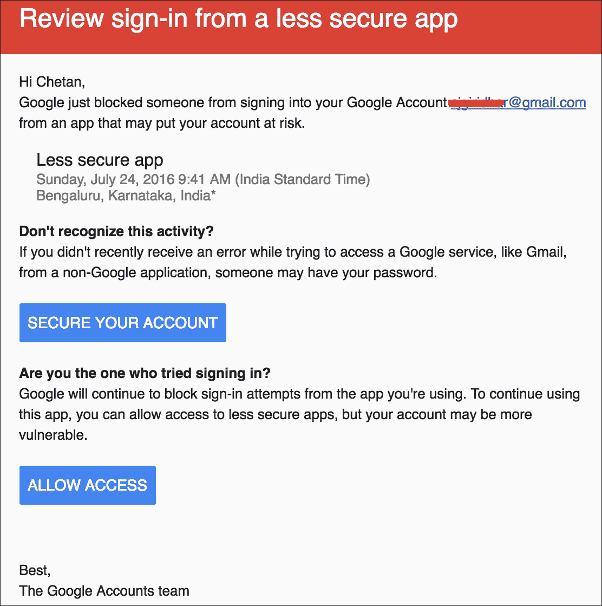

1.  但显然，这是一个合法尝试使用 Gmail 账户，所以让我们向 Google 确认这一点。打开来自 Google 的电子邮件消息，点击**允许访问**。您将被带到**不安全应用**页面，在那里您可以开启此设置，如下面的截图所示：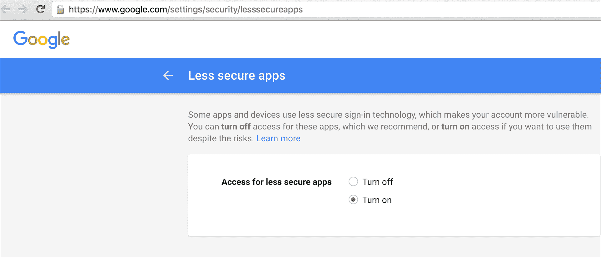

1.  现在，请从 Gmail 网页客户端登出并再次登录，以便让设置对您的账户生效。如果一切顺利，您将收到来自 Google 的电子邮件，告知**不安全应用的访问已开启**。Google 的确认电子邮件将类似于以下截图：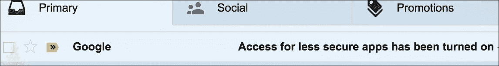

    现在，如果您再次运行 Python 程序，它应该会成功运行，并且您将在收件箱中收到一封电子邮件：

    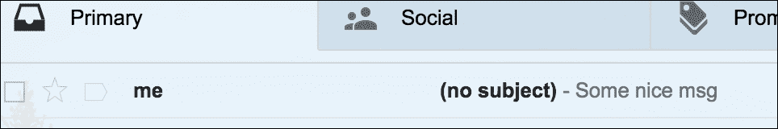

1.  太棒了！注意，消息内容与我们添加到代码片段中的内容相同。此外，由于*发件人*和*收件人*地址相同，邮件是从您那里发出的，但它没有任何主题，这并不理想。我们将在下一个菜谱中解决这个问题。

## 它是如何工作的...

如前所述，SMTP 用于发送电子邮件消息。我们使用 Python 模块`smtplib`来完成这个目的。

如果您查看前面的代码片段，我们使用构造函数`smtplib.SMTP()`来配置 Gmail 的 SMTP 设置并获取对电子邮件服务器的访问权限。Gmail 的 SMTP 服务器运行在`smtp.gmail.com`上，端口为 587。

一旦我们有了服务器对象`server`，我们就使用它来用我们的用户名和密码登录 Gmail。请注意，在前面代码中我们还有另一行：`server.starttls()`；我们将在本章后面讨论这个问题。

我们创建了一个测试消息并将其存储在变量`msg`中，然后使用`sendmail`方法`('fromaddr', 'toddr', msg)`发送。

最后，我们使用`server.quit()`关闭与电子邮件服务器的连接。

## 还有更多...

我们探讨了如何使用 SMTP 协议和 Python 的`smptlib`库登录 Gmail 并发送基本电子邮件。虽然这个菜谱让我们开始了，但还有一些细节我们将在下一个菜谱中深入探讨。让我们来看看它们。

# 电子邮件加密

电子邮件容易泄露信息。目前大多数电子邮件都是以明文格式传输的。电子邮件加密涉及加密或伪装电子邮件的内容，以便只有预期的收件人可以阅读。始终记住，在处理电子邮件时，安全性是最重要的。让我们看看如何使用 Python 加密电子邮件。

## 准备工作

在之前的菜谱中，我们看到了如何发送基本的电子邮件，但`starttls()`方法是什么？电子邮件加密是如何工作的？我们将在这部分得到这些问题的答案。

## 如何做...

1.  让我们先打开我们最喜欢的编辑器，并输入以下代码片段：

    ```py
            import smtplib
            server = smtplib.SMTP('smtp.gmail.com', 587)
            try:
                server.set_debuglevel(True)
                print "Sending ehlo"
                server.ehlo()
                if server.has_extn('STARTTLS'):
                   print "Starting TLS Session"
                   server.starttls()
                   print "Sending ehlo again"
                   server.ehlo()
            finally:
                server.quit()
    ```

1.  现在，让我们运行 Python 代码并查看它打印的内容。我们有三个不同的输出段。第一个是我们向电子邮件服务器发送`ehlo()`消息时：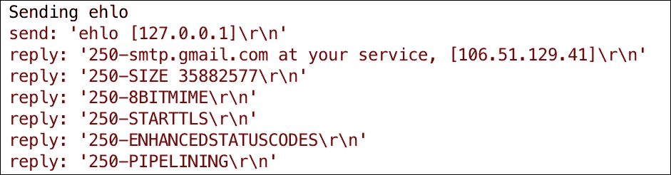

1.  第二种情况是我们对服务器对象调用`starttls()`方法。查看以下截图：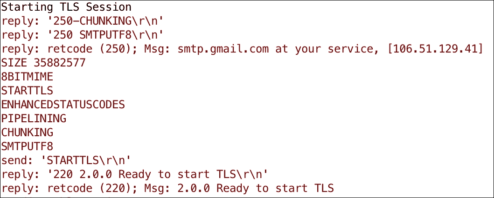

1.  第三个是我们再次使用`ehlo()`连接到电子邮件服务器时：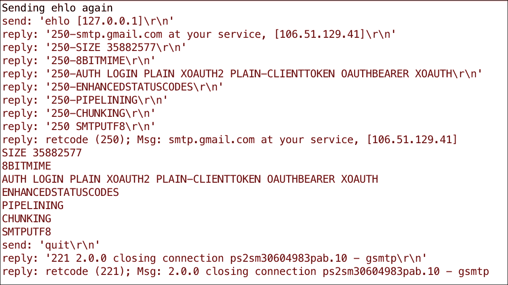

## 它是如何工作的...

让我们从基础知识开始。电子邮件加密意味着保护电子邮件消息不被除预期当事人之外的其他人阅读。电子邮件通常以明文发送，可以被第三方嗅探。为了避免这种情况，我们在协议层加密电子邮件；这可能包括身份验证。

SMTP 服务器通常使用 SSL/TLS 协议在端口 25 上发送电子邮件。然而，随着 STARTTLS（位于 SMTP 之上的一层）的出现以及使用端口 587 进行消息提交，像 Gmail 这样的电子邮件客户端使用 STARTTLS 和端口 587 来发送电子邮件。Gmail 还实现了身份验证；记住我们使用`server.login (username, password)`登录到 Gmail 服务器。

为了让 STARTTLS 在服务器和客户端之间使用，客户端首先需要知道服务器是否支持此协议。当我们发出`server.ehlo()`时，程序会向 SMTP 服务器发送一个`EHLO`消息以建立通信。服务器会以消息和允许的扩展响应，如第一张截图所示。

现在，从代码中，我们使用`server.has_extn('STARTTLS')`检查服务器是否支持`STARTTLS`扩展。正如我们在第一张截图中所见，SMTP 服务器响应了`STARTTLS`扩展；这证实了 Gmail 支持`STARTTLS`协议层，这真是太棒了。

现在，我们使用`server.starttls()`与服务器通信。服务器通过发送消息`Ready to start TLS`来响应。这样，我们就加密了我们的会话。如果你现在查看第三张截图，当我们发送`server.ehlo()`时，我们通过 TLS 会话重新向服务器确认身份。这也表明服务器实现了身份验证扩展。

最后，我们使用 `server.quit()` 退出 SMTP 会话，服务器响应为 `closing connection`，如第三张截图所示。

## 还有更多...

好吧，这相当详细。花点时间理解它。实际上，了解简单电子邮件发送背后的过程很有趣。但不用担心太多；让我们开始有趣的部分，并探索更多示例。

# 使用 MIME 美化电子邮件消息

在前几个菜谱中，我们以简单的纯文本格式发送了电子邮件消息。MIME 互联网标准帮助我们构建包含非 ASCII 字符、multipart 消息和图像的消息。它还帮助处理附件和其他许多任务。这样，我们可以构建丰富的电子邮件消息。让我们看看 MIME 格式在这个菜谱中的应用。

## 准备工作

对于这个菜谱，我们将使用相同的模块 `smtplib` 来发送电子邮件消息。我们还将介绍另一个模块 `email`，它将帮助我们使用 MIME 格式构建更好的电子邮件消息。`email` 模块随 Python 安装而来；因此，我们不需要进行任何新的模块或安装。在本节中，我们将探讨如何使用 MIME 属性发送外观更好的电子邮件。

## 如何做到这一点...

1.  让我们先导入我们需要的所有模块：

    ```py
            import smtplib
            from email.mime.multipart import MIMEMultipart
            from email.mime.text import MIMEText
            import config
            import email.utils
    ```

1.  现在，让我们使用 MIME 模块构建我们的电子邮件消息。以下代码创建了消息：

    ```py
            fromaddr = config.fromaddr
            toaddr = config.toaddr
            msg = MIMEMultipart()
            msg['Subject'] = "Hello from the Author of Automate It!"
            msg['To'] = email.utils.formataddr(('Recipient', toaddr))
            msg['From'] = email.utils.formataddr(('Author',
            fromaddr))
            body = "What a wonderful world!"
            msgBody = MIMEText(body, 'plain')
            msg.attach(msgBody)
    ```

1.  因此，现在我们有了要发送电子邮件消息的收件人详细信息。我们已使用 MIME 格式构建了电子邮件消息。我们还在等什么呢？让我们使用以下代码发送它：

    ```py
            server = smtplib.SMTP('smtp.gmail.com', 587)
            server.starttls()
            server.login(fromaddr, config.password)
            text = msg.as_string()
            print "Text is:", text
            server.sendmail(fromaddr, toaddr, text)
            server.quit()
    ```

    收到的电子邮件如下所示：

    

太棒了！太好了，但是...它是怎么工作的？

## 工作原理...

在前面的例子中，我们导入配置文件，从中我们获得了 `fromaddress` 和 `password` 以登录 SMTP 服务器，以及 `toaddress` 以发送电子邮件消息。

现在，在发送消息之前，我们使用 `email.mime.multipart` 模块中的 `MIMEMultipart()` 类构建一个新的 MIME 消息对象。对于那些不知道的人来说，MIME multipart 消息意味着在单个电子邮件中既有 HTML 内容又有文本内容。因此，在这段代码中，我们创建了一个新的 multipart MIME 消息，并将其文本内容添加到其中。

文本内容，即电子邮件的正文，是通过 `email.mime.text` 模块中的 `MIMEText()` 构造函数创建的，然后使用 `attach()` 方法将其附加到 multipart 消息中。

构建的 MIME 消息如下截图所示，其中内容类型为 multipart，MIME 版本为 1.0，**主题**、**收件人**和**发件人**的详细信息符合预期，电子邮件正文包含预期的文本：

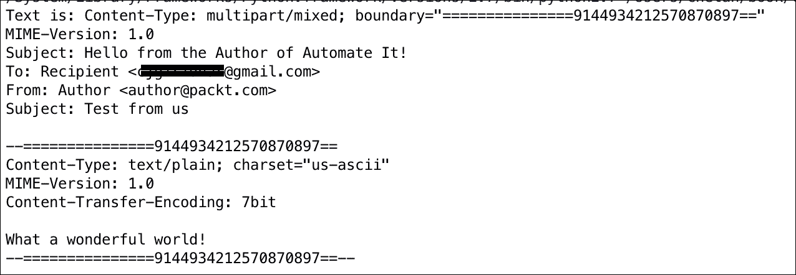

一旦我们有了消息和收件人详细信息，我们就可以像往常一样使用 `SMTP.sendmail()` 方法发送电子邮件。

# 带有附件的电子邮件消息

电子邮件中最常用且简单的用例之一是能够向你的电子邮件消息中添加附件。在本节中，我们将学习如何在 Python 中给我们的电子邮件添加附件。

## 准备工作

我们在这个例子中使用了相同的 `smtplib` 和 `email` 模块。所以，不必担心要安装的模块。让我们继续进行。

## 如何操作...

1.  让我们先快速创建一个小的文本文件。我们将称之为 `attach.txt`，其内容如下截图所示：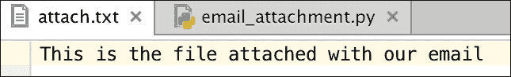

1.  让我们看看将附件添加到我们的电子邮件中的代码：

    ```py
            import smtplib
            from email.mime.multipart import MIMEMultipart
            from email.mime.text import MIMEText
            from email.mime.base import MIMEBase
            from email import encoders
            import config

            fromaddr = config.fromaddr
            toaddr = config.toaddr

            msg = MIMEMultipart()

            msg['From'] = fromaddr
            msg['To'] = toaddr
            msg['Subject'] = "Email with an attachment"

            body = "Click to open the attachment"

            msg.attach(MIMEText(body, 'plain'))

            filename = "attach.txt"
            attachment = open(filename, "rb")

            part = MIMEBase('application', 'octet-stream') 
            part.set_payload((attachment).read())
            encoders.encode_base64(part)
            part.add_header('Content-Disposition', "attachment;
                            filename= %s" % filename)
            msg.attach(part)
            server = smtplib.SMTP('smtp.gmail.com', 587)
            server.starttls()
            server.login(fromaddr, config.password)
            text = msg.as_string()
            server.sendmail(fromaddr, toaddr, text)
            server.quit()
    ```

1.  当你运行前面的代码时，你将在你的收件箱中收到电子邮件，其外观类似于以下截图：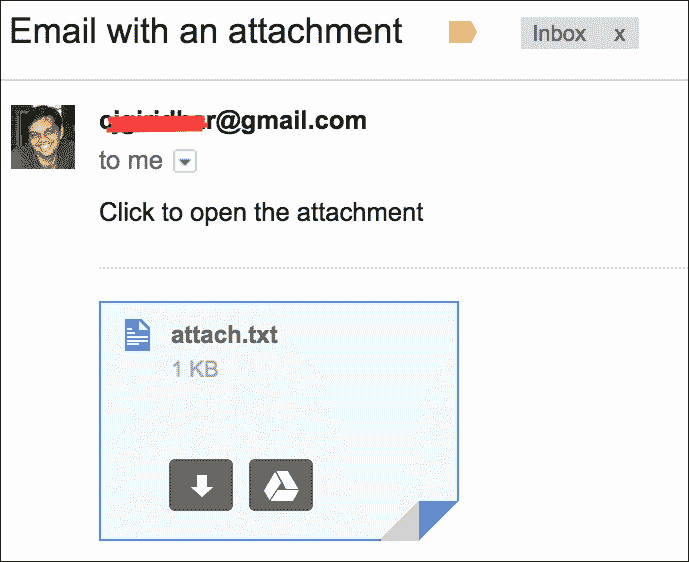

## 工作原理...

我们已经熟悉了创建 MIME 消息对象。因此，在这段代码中，我们创建了一个多部分消息对象 `msg`。然后我们使用 `msg.attach()` 向其中添加一条文本消息。文本正文说“点击打开附件”。

在这个食谱中，我们使用了来自 `email` 模块的新类 `MIMEBase`，它将被用来附加文本文件。记住，我们已经创建了 `attach.txt` 文件，我们使用 Python 的 `open()` 方法打开文件，并获取文件句柄 `attachment`。然后我们创建一个 `MIMEBase` 对象 `part`，并将文件的 内容作为有效载荷分配给此对象。文件内容通过 `attachment.read()` 获取，有效载荷通过 `set_payload()` 方法设置。

为了附加文件，`MIMEBase` 对象必须被编码为 base64，并且需要将 `Content-Disposition` 标头添加到 `part` 对象中。现在我们有了 `part` 对象，它可以像我们为正文文本所做的那样，使用 `attach()` 方法附加到多部分对象 `msg` 上。

很酷，所以我们已经有了完整的 MIME 消息以及发送消息给谁的具体信息。那么，我们就继续发送带有附件的电子邮件。这正是我们想要达成的目标。

# 连接到你的收件箱

在本章中，我们一直在谈论使用 Python 发送电子邮件。然而，在某些时候，你也可能想要扫描你的收件箱并阅读收到的消息。那么，你该如何做呢？让我们在本食谱中理解和学习它。

## 准备工作

在这个食谱中，我们使用了一个新的 Python 模块，它将帮助我们从收件箱中检索消息。我们使用的是 Python 模块 `imaplib`，它是默认 Python 安装的一部分。酷，那么让我们开始吧。

## 如何操作...

1.  我们首先使用配置文件，这是我们之前创建的用于存储我们的电子邮件和密码的文件，来登录服务器。然后我们添加我们的代码来创建一个处理或对象来处理我们的收件箱。代码如下所示：

    ```py
             import config, imaplib
             M = imaplib.IMAP4_SSL("imap.gmail.com", 993)
             M.login(config.fromaddr, config.password)
             print "Inbox:", M
             M.logout()
    ```

    如果你运行前面的代码片段，你将得到以下输出：

    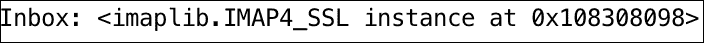

1.  默认情况下，当我们登录到 Gmail 时，默认收件箱会被选中，但如果我们还创建了其他收件箱，我们可以通过添加一小段代码来获取列表。现在，从所有标签中，如果我们特别想选择 `Inbox`，这也可以实现。请看以下代码示例：

    ```py
            import config, imaplib
            M = imaplib.IMAP4_SSL("imap.gmail.com", 993)
            M.login(config.fromaddr, config.password)
            print M.list()
            M.select('INBOX')
            print "Inbox:", M
            M.logout()
    ```

    上述代码片段的输出显示在以下屏幕截图中。尽管我已经创建了多个标签，但我使用较少标签的屏幕截图：

    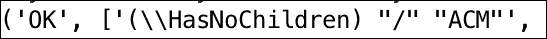

## 它是如何工作的...

如本章开头所述，我们有三项主要协议用于处理电子邮件。我们大量使用 SMTP 发送电子邮件，但在阅读电子邮件时，我们可以使用 POP 或 IMAP 从电子邮件服务器检索消息。我们将逐步分析代码。

Python 的 `imaplib` 库帮助我们使用 **互联网消息访问协议**（**IMAP**）连接到我们的邮箱。Gmail 服务器配置为 IMAP，服务器运行在 `imap.gmail.com` 上，端口为 '993'。

在我们的代码示例中，我们使用构造函数 `IMAP4_SSL("imap.gmail.com", 993)` 创建了一个类型为 `imaplib` 的对象；我们称这个对象为 `M`。

关于加密，我们使用 `IMAP4_SSL` 连接到服务器，因为它在 SSL 套接字上使用加密通信。我们避免使用 `IMAP4` 类，它内部使用明文套接字。

现在，使用对象 `M`，我们可以使用我们的用户名和密码登录到 Gmail 并连接到我们的收件箱。

当我们在对象 `M` 上调用 `list()` 方法时，它会返回您已经创建的所有标签。现在，在我的情况下，我已经创建了 `ACM` 标签（用于我的与 ACM 的工作），因此它出现在我的标签列表中。

如果你看代码示例，我们可以使用 `select()` 方法明确连接到 `INBOX`。一旦连接到收件箱，我们就可以开始从收件箱获取电子邮件消息。

最后，我们使用 `M.logout()` 方法关闭与收件箱的连接。酷！这很简单。

## 还有更多...

因此，我们在这个食谱中学习了如何连接到我们的收件箱，但我们可能还想阅读消息、标记它们并在它们上执行有趣的操作。让我们看看如何在下一个食谱中执行消息操作。

# 获取和阅读电子邮件消息

使用 `imaplib` 获取电子邮件消息也很容易实现。在本食谱中，我们将学习如何使用 Python 代码来完成这项操作。在本食谱中，我们将搜索具有特定主题行的电子邮件，并从符合预定义标准的收件箱中获取最新消息。

## 准备工作

我们继续使用 `imaplib` 模块来读取电子邮件消息，因此不需要为本食谱进行新安装。

## 如何做...

1.  我们利用配置文件并导入 `fromaddress`、`password` 和 `toaddress` 来登录到服务器。一旦登录，我们选择默认收件箱，获取电子邮件消息并阅读它们。让我们看看完整的代码：

    ```py
            import config, imaplib
            M = imaplib.IMAP4_SSL("imap.gmail.com", 993) 
            M.login(config.fromaddr, config.password)
            M.select("INBOX")
            typ, data = M.search(None, 'SUBJECT', 
                                 "Email with an attachment")
            typs, msg = M.fetch(data[0].split()[-1], '(RFC822)')
            print "Message is ", msg[0][1]
            M.close()
            M.logout()
    ```

1.  将前面的文件保存为 `inbox_search.py` 并使用以下命令运行代码：

    ```py
     python inbox_search.py 

    ```

1.  前面代码片段的输出显示在以下截图：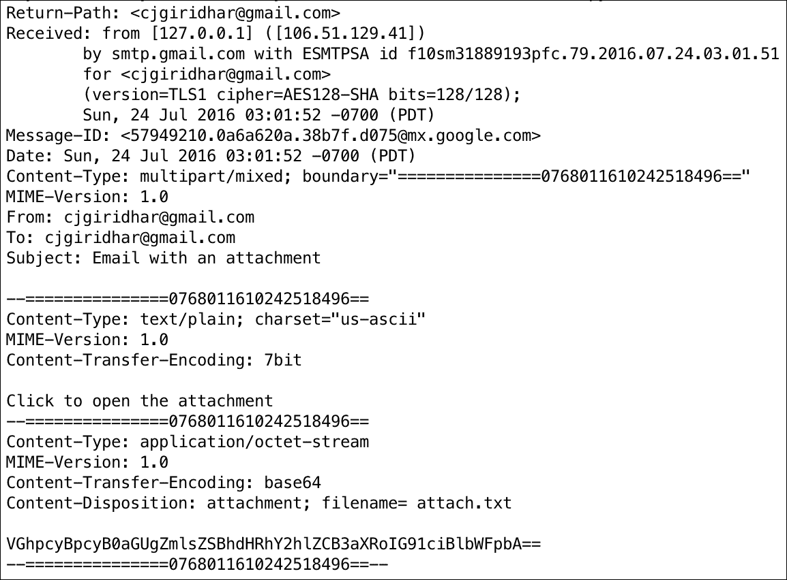

## 如何工作...

在前面的代码片段中，我们首先使用适当的 IMAP 设置创建了一个 `IMAP_SSL4()` 对象。然后，我们借助 IMAP 对象，使用配置文件中的凭据登录到客户端。接着，我们选择我们的 `INBOX` 以便在其上执行搜索操作。

在 IMAP 对象上调用 `M.search()` 方法可以帮助我们搜索主题为 *带附件的电子邮件* 的电子邮件。`search()` 方法返回一个与搜索标准匹配的消息数组。

现在，如果我们需要获取特定的消息，并且由于我们必须读取符合我们标准的最新的电子邮件，我们使用 `M.fetch()` 方法。`fetch()` 方法需要一个给定的消息对象和您想要获取的消息部分。因此，在这个代码示例中，我们传递符合标准的最新电子邮件对象，并传递 `RFC822`，这表示我们想要以 RFC 822 格式获取电子邮件正文。

当我们打印从 `fetch()` 获取的消息时，我们得到与搜索匹配的最新电子邮件的电子邮件正文内容。

现在，你还记得看到电子邮件的内容吗？嗯，这正是我们在之前的菜谱中发送的同一封电子邮件，当时我们用它来演示电子邮件附件。

## 还有更多...

好的！所以，现在我们可以搜索一条消息并获取它。在我们的收件箱中还有许多更细粒度的操作，比如标记我们想要执行的操作。让我们在下一个菜谱中看看它们。

# 标记电子邮件消息

在之前的菜谱中，我们看了获取和读取消息。这不是太复杂了吗？在进行像搜索或读取这样的简单操作时，我们必须注意这么多细节吗？在本节中，我们将看看另一个可以帮助我们不仅更好地搜索或读取，还可以在我们的电子邮件上执行各种操作的库。

## 准备中

对于本节，我们将安装 `gmail` 模块。您可以通过终端使用 `pip` 命令安装此模块，如下所示：

```py
pip install gmail 

```

让我们看看如何使用 `gmail` API 搜索和读取电子邮件。这将使我们开始使用 `gmail` 模块。以下代码片段搜索在 2016 年 7 月 22 日之后收到的电子邮件。然后我们取最新的消息并获取它。一旦我们获取了消息，我们就可以继续读取电子邮件的正文：

```py
import gmail, config
from datetime import date
g = gmail.login(config.fromaddr, config.password)
mails = g.inbox().mail(after=date(2016, 7, 22))
mails[-1].fetch()
print "Email Body:\n", mails[-1].body
g.logout()
```

前面代码的输出显示在以下截图。看起来我可能收到了来自 Quora 的电子邮件摘要！

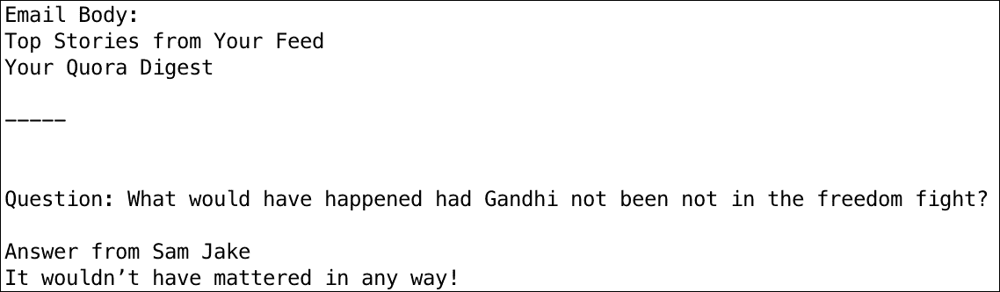

这里是我的收件箱的截图：


这不是太简单了吗？顺便说一下，`gmail`模块是在`imaplib`之上编写的，但提供了更好的 API，所以让我们利用这个模块做一些惊人的操作。

## 如何操作...

1.  让我们打开收件箱，寻找符合特定标准的未读邮件，并将其标记为已读。以下代码可以轻松完成此操作：

    ```py
            import gmail, config
            g = gmail.login(config.fromaddr, config.password)
            mails = g.inbox().mail(unread=True,
            sender='noreply@glassdoor.com')
            mails[-1].fetch()
            mails[-1].read()
            g.logout()
    ```

    在运行此程序之前，我在收件箱中有一封来自[`glassdoor.com`](https://glassdoor.com)的未读电子邮件。在我的收件箱中它看起来是这样的：

    

    运行代码片段后，它将这封电子邮件识别为符合来自`noreply@glassdoor.com`的未读邮件标准，并将我的邮件标记为已读。所以现在在我的收件箱中看起来是这样的。Gmail 会取消粗体显示已读邮件，这就是我在收件箱中看到的情况：

    

    很好！

1.  让我们看看另一个例子。从 2016 年 1 月开始，我收到了来自 Amazon Now 的大量促销电子邮件。我的邮箱看起来是这样的：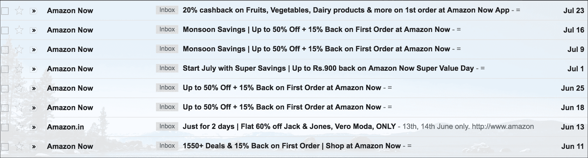

1.  现在，我想将它们全部标记为`read`，并将它们分配到单个标签`AMAZON`下。我该如何操作？以下代码执行了这个操作：

    ```py
            import gmail, config
            from datetime import date
            g = gmail.login(config.fromaddr, config.password)
            mails = g.inbox().mail(unread=True, 
                                   sender='store-news@amazon.in',
                                   after=date(2016, 01, 01))
           for email in mails:
               email.read()
               email.add_label("AMAZON")
               g.logout()
    ```

1.  运行此代码后，您的收件箱中会出现一个新的标签，名为`AMAZON`。现在，如果您在收件箱中搜索所有带有标签`AMAZON`的电子邮件，您会看到所有这些电子邮件都已标记为已读。请看以下截图，我正在搜索带有标签`AMAZON`的电子邮件：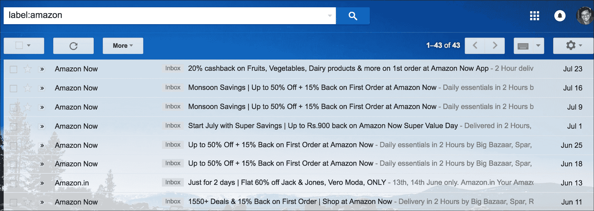

## 工作原理...

在第一步中，我们通过登录 Gmail 服务器创建了一个名为`g`的对象。请注意，我们没有传递任何参数（如 IMAP 设置或端口）来创建对象。`gmail`模块内部处理这些。

现在，使用这个对象，我们开始搜索收件箱中未读且由`noreply@glassdoor.in`发送的电子邮件，所有符合这个标准的邮件对象都存储在`mails`中。

之后，我们使用`fetch()`方法获取最新记录，并使用`read()`方法将此邮件标记为已读。

同样，在第二个菜谱中，我们遍历所有未读的电子邮件，这些电子邮件是由`store-news@amazon.in`发送的，并且是在今年发送给我的。

每封邮件随后都会使用`read()`方法标记为已读，并添加到标签`AMAZON`中。操作起来就像微风一样，太棒了！

## 还有更多...

我们查看了一些可以在我们的电子邮件上执行的操作。还有很多。使用`gmail`模块，您可以标记邮件为未读，甚至用星号标记它们为重要。让我们看看一个可以清理我们收件箱的例子。

# 清除收件箱中的电子邮件

最后但同样重要的是，这个菜谱将向您展示如何从收件箱中删除电子邮件。正如您所期望的，通过编程删除电子邮件非常直接。

### 注意

即使你从电子邮件客户端删除了消息，电子邮件服务器仍然可以选择存储它们。所以，当你删除你的消息时，你只是在标记它们以隐藏在你的收件箱中，而它们可以根据服务器实现继续留在你的电子邮件服务器上。

## 准备工作

我们继续使用 `imaplib` 模块来删除电子邮件消息，因此不需要为这个配方安装任何新软件。

## 如何操作...

1.  让我们利用配置文件并导入 `fromaddress`、`password` 和 `toaddress` 来登录到服务器。

1.  这就是完整的代码看起来像什么：

    ```py
            import gmail, config
            g = gmail.login(config.fromaddr, config.password)
            emails = g.inbox().mail(sender='junk@xyz.com')
            if emails:
               for mail in emails:
                   mail.delete()
    ```

1.  将前面的文件保存为 `inbox_delete.py` 并使用以下命令运行代码：

    ```py
     python inbox_delete.py 

    ```

## 它是如何工作的...

与我们之前看到的例子类似，我们首先使用配置文件中的登录凭证登录到 Gmail。

我们然后连接到我们的收件箱并搜索来自 `junk@xyz.com` 的电子邮件。如果我们找到符合这个标准的任何电子邮件，我们希望删除它们。

因此，我们遍历邮件对象并对它们执行 `delete()` 操作，就是这样！我们的收件箱现在已经没有我们认为的垃圾邮件了。 :)

## 还有更多...

太好了！所以，现在我们知道了如何发送电子邮件消息，添加附件，以及获取和读取它们。我们还学会了如何将我们的消息标记为已读，添加适当的标签，并在需要时删除这些消息。掌握了这些知识，我们能为凯利做些什么吗？

# 使用电子邮件响应自动化客户支持流程

客户支持部经理凯利手头有一个问题。她的大部分支持工程师最终都在处理一级支持请求，这些请求是客户在网站上已经可以找到信息的。客户只是简单地发送电子邮件给支持部门，而没有尝试自己搜索。

这一系列事件对客户和支持工程师来说都是低效的。客户只是等待信息，而不是直接在网站上获取信息，支持工程师手动将网站上的**常见问题解答**（**FAQ**）部分的指针发送给客户。凯利认为这是一个改进的机会，并希望通过自动化这个流程来减少在支持上花费的时间。我们能做些什么来帮助她？

## 准备工作

当然，这是一个更大的问题，但至少我们可以做一些事情来自动化流程。每当支持团队通过电子邮件收到新的工单时，我们可以自动回复工单，确认已收到工单，并从公司网站上发送 FAQ 部分的链接。这样，客户就可以浏览并从 FAQ 部分查找他们所需的信息。这也减轻了支持工程师的负担，因为自动回复的电子邮件已经迅速解决了客户的查询。

那么，我们现在到底需要什么呢？我们需要监控我们的支持收件箱，查看任何新的客户查询，然后使用我们的模板电子邮件自动回复。

## 如何操作...

1.  让我们直接跳到我们的解决方案。创建一个 Python 文件，并将以下代码片段复制到其中。它正好完成了我们需要自动化支持流程的工作：

    ```py
            from email.mime.multipart import MIMEMultipart
            from email.mime.text import MIMEText
            from email.mime.image import MIMEImage
            import config, time, gmail

            def send_email(strTo):
                strFrom = config.fromaddr
                msgRoot = MIMEMultipart('related')
                msgRoot['Subject'] = 'Thanks for your ticket'
                msgRoot['From'] = strFrom
                msgRoot['To'] = strTo

                msgRoot.preamble = 'This is a multi-part message 
                                    in MIME format.'
                msgAlternative = MIMEMultipart('alternative')
                msgRoot.attach(msgAlternative)
                msgText = MIMEText('This is the alternative plain
                                    text message.')
                msgAlternative.attach(msgText)
                msgText = MIMEText('Hi there, <br><br>Thanks for your 
                                    query with us today.'
                                   ' You can look at our 
                                   <a href="https://google.com">FAQs</a>'
                                   ' and we shall get back to you 
                                     soon.<br><br>'
                                   'Thanks,<br>Support Team<br><br>
                                   ', 'html')
                msgAlternative.attach(msgText)
                fp = open('google.png', 'rb')
                msgImage = MIMEImage(fp.read())
                fp.close()
                msgImage.add_header('Content-ID', '<image1>')
                msgRoot.attach(msgImage)

                import smtplib
                server = smtplib.SMTP('smtp.gmail.com', 587)
                server.starttls()
                server.login(config.fromaddr, config.password)
                server.sendmail(config.fromaddr, config.toaddr, 
                                msgRoot.as_string())
                server.quit()

                while True:
                      g = gmail.login(config.fromaddr, config.password)
                      mails = g.inbox().mail(unread=True)
                      mails[-1].fetch()
                      from_ = mails[-1].fr
                      send_email(from_)
                      time.sleep(60)
    ```

1.  使用 Python 运行前面的代码，你会观察到程序仍在运行。实际上，它正在等待新的电子邮件，在这种情况下，是客户对支持工程师的请求。

1.  如果你现在给客户支持发送电子邮件，你将收到我们 Python 程序的自动回复。

    ### 注意

    在这种情况下，支持收件箱是我的电子邮件地址，但你可以轻松地为你的公司设置一个电子邮件账户，以便客户请求被导向这个账户。

    这就是自动回复电子邮件的样子：

    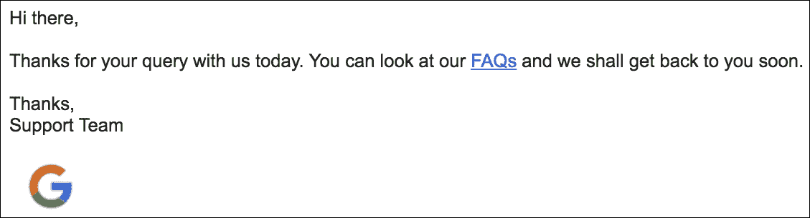

## 它是如何工作的...

我们从一个每分钟运行一次（60 秒）的`while`循环开始。每次迭代都会读取支持收件箱并搜索未读电子邮件。

如果`while`循环发现任何未读电子邮件，它将获取该电子邮件并获取`fr`属性。`fr`属性让你获取电子邮件消息的`from`字段。`from`字段是请求支持工程师信息的客户电子邮件地址。

一旦我们有了客户的电子邮件地址，我们就会从我们的收件箱向客户发送自动回复。前面的截图显示了自动回复的确切样子。太酷了，所以现在当客户通过发送电子邮件向客户支持工程师提问时，他们将会收到一个带有常见问题解答部分链接的自动电子邮件回复。

这样，客户可以快速地从常见问题解答链接中获取所需信息。此外，由于支持工程师不需要手动回复日常支持请求，因此他们的工作负担也得到了减轻。

我相信凯莉会对这个改进感到高兴。她明白客户支持流程已经自动化到一定程度，并希望很快看到生产力的提升！

## 还有更多...

太棒了！你还可以用电子邮件做很多事情。尝试下载电子邮件附件了吗？想试试看？我们会让你亲自尝试。下章再见！
