# 第八章. 与机器人对话

哇，机器人？！真的吗？我会学习如何为娱乐或商业用途构建机器人吗？当然，本章将带你进入使用 Python 的全新机器人世界。

在本章中，我们将涵盖以下内容：

+   构建一个情绪化的 Telegram 机器人

+   不同类型的机器人：无状态、有状态和智能型

+   拥有人工智能的智能机器人

+   使用机器人自动化业务流程

# 引言

过去的几十年是数字转型和自动化的时代。如今，大多数企业更倾向于选择线上销售模式，而不是传统的实体销售方式。

网站不仅帮助公司扩大了其影响力，还降低了他们销售产品的成本（没有固定的成本，如租金）。一个响应式的**图形用户界面**（**GUI**），结合实时技术的力量，使得销售过程变得更加容易；现在高管们可以直接与潜在客户聊天，并引导他们购买产品，从而提高转化率。

随着人工智能（**AI**）和语言处理技术的进步，企业正在缓慢但稳步地采用对话界面来自动化他们的业务流程。对话用户界面是指具有自由文本的自然语言界面。通过对话界面和自然语言处理技术，企业认为机器可以通过分析上下文来响应某些客户查询。在当今世界，这些机器被称为**聊天机器人**。

在本章中，你将了解不同类型的机器人，学习如何开发简单的聊天机器人，以及了解机器人如何用于自动化业务流程。此外，请注意，在本章中提到机器人时，我们指的是聊天机器人或基于文本的机器人。

## 机器人是什么？

好的，让我们来看一个简单的例子。假设你想要在下个周末和朋友们的聚会上订购必胜客的披萨。通常情况下，你会去必胜客的网站，花时间寻找你喜欢的某种披萨或特定的配料，然后下单。很多时候，你其实已经知道你想要订购什么；那么真正的问题其实是，为什么还要在必胜客网站上费劲去找呢？

别再担心了！只需登录**Facebook**并使用 Facebook Messenger 聊天机器人从必胜客购买你需要的东西。不仅如此，聊天机器人还会告诉你必胜客的最新优惠和更新。所以聊天机器人可以给你在最喜欢的社交网络平台上访问网站的同一种体验。看看[`blog.pizzahut.com/press-center/pizza-hut-announces-new-social-ordering-platform/`](http://blog.pizzahut.com/press-center/pizza-hut-announces-new-social-ordering-platform/)上的公告，[必胜客](http://blog.pizzahut.com/press-center/pizza-hut-announces-new-social-ordering-platform/)宣布与 Facebook Messenger 合作。

你可能会说：“是的，我们理解了使用场景，但聊天机器人到底是什么？”

聊天机器人是由规则和人工智能驱动的服务，作为客户，你可以通过聊天（文本）界面与之互动。机器人执行半智能或日常任务，并以软件应用的形式运行。聊天机器人可以提供多种服务，并且可以在**Facebook**、**Telegram**、**Slack**等社交平台上运行。聊天机器人仍在积极研究中，是一个新兴的计算机科学领域。

## 机器人是如何工作的？

根据我们迄今为止的讨论，你可能正在想：“这些机器人是如何工作的？它们如何理解人类的语言或情感？它们如何理解上下文？”那么，这就是答案。通常有两种类型的聊天机器人：

+   **基于规则引擎的机器人**：这种类型的机器人理解某些词语或命令（可以说是这样的）并且行为非常有限。它非常直接：如果*x*是输入，那么*y*应该是输出。它们在存在固定问题集或问题作为查询的情况下非常有用。例如，CNN 聊天机器人可以帮助你获取那一刻的头条新闻，而且你还可以选择询问有关特定主题（如**政治**或**商业**）的头条新闻。！（太好了！那么我为什么还要去 CNN 网站呢？）看看我从我的 Facebook Messenger 应用中拍摄的关于我与 CNN 聊天机器人交互的一些截图。第一个屏幕要求你点击**GET STARTED**，当你这样做时，机器人会带你到下一个屏幕，在那里它给你一个查看头条新闻的选项：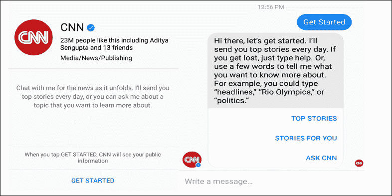

    当你点击**TOP STORIES**时，它会显示**Yahoo**新闻，并询问你是否对某些主题感兴趣，例如**政治**：

    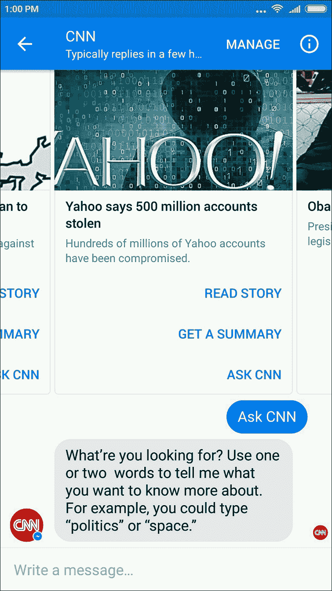

+   **一个基于机器学习的智能机器人**：智能机器人利用人工智能和情感分析来理解对话的上下文，并响应语言语义。因此，它们适用于复杂的使用场景，例如购买产品或回答客户支持查询。更重要的是，这些机器人可以从过去的交互中学习。这不是很神奇吗？

### 注意

情感分析也被称为意见挖掘，旨在从可用的文本中识别和提取主观信息，并确定作者的情绪，同时注意文本的上下文属性。

## 为什么现在要使用机器人？

你可能会问，“世界已经谈论机器学习有一段时间了，聊天功能也已经存在很长时间了，那么为什么机器人现在变得如此重要？”这是因为以下原因：

+   **使用模式**：公司已经发现，用户在聊天平台上花费的时间比在社交媒体平台或网站上更多。因此，企业可以通过聊天平台以更好的方式与用户互动。

+   **成本效益**：不需要人力——听起来似乎没有成本！企业正在利用机器人来自动化流程，如客户服务，而不需要人力资源投资。

+   **规模**：通过 Facebook 或 Telegram 等作为机器人分发渠道的社交平台，很容易接触到数百万用户。这样，企业可以在不考虑人力成本的情况下，尽可能多地吸引潜在客户。

+   **高效技术**：人工智能或**自然语言处理（NLP**）的增长使得将这些算法插入这些机器人变得更加容易。算法会随着时间的推移而成熟，并将更好地服务于客户。

好的，太棒了！既然我们已经更好地理解了机器人和它们的实用性，那就让我们动手开发自己的机器人吧。

# 构建一个情绪化的 Telegram 机器人

在我们开始开发机器人之前，我们应该清楚我们的目标：我的机器人将要做什么？我们以创建一个根据用户情绪返回表情的机器人为例。它之所以被称为情绪化机器人，是因为它代表了用户的情绪。听起来像是一个有趣的用例？让我们试试吧！

在这个菜谱中，我们将使用`python-telegram-bot` ([`github.com/python-telegram-bot/`](https://github.com/python-telegram-bot/)) 库来开发 Telegram 机器人。所以，让我们首先使用我们最喜欢的工具，即 python `pip`来安装`python-telegram-bot`模块：

```py
(bots)chetans-MacBookPro:ch09 Chetan$ pip install python-telegram-bot --upgrade 

Collecting python-telegram-bot 
  Downloading python_telegram_bot-5.1.0-py2.py3-none-any.whl (134kB) 
    100% |████████████████████████████████| 135kB 681kB/s  
Collecting certifi (from python-telegram-bot) 
  Downloading certifi-2016.8.31-py2.py3-none-any.whl (379kB) 
    100% |████████████████████████████████| 380kB 612kB/s  
Collecting future>=0.15.2 (from python-telegram-bot) 
  Downloading future-0.15.2.tar.gz (1.6MB) 
    100% |████████████████████████████████| 1.6MB 251kB/s  
Collecting urllib3>=1.10 (from python-telegram-bot) 
  Downloading urllib3-1.17-py2.py3-none-any.whl (101kB) 
    100% |████████████████████████████████| 102kB 1.2MB/s  
Building wheels for collected packages: future 
  Running setup.py bdist_wheel for future 
  Stored in directory: /Users/chetan/Library/Caches/pip/wheels/11/c5/d2/ad287de27d0f0d646f119dcffb921f4e63df128f28ab0a1bda 
Successfully built future 
Installing collected packages: certifi, future, urllib3, python-telegram-bot 
Successfully installed certifi-2016.8.31 future-0.15.2 python-telegram-bot-5.1.0 urllib3-1.17

```

我们还安装了`emoji` ([`github.com/carpedm20/emoji`](https://github.com/carpedm20/emoji)) 库来处理表情符号，这样我们就可以根据用户的情绪返回适当的表达：

```py
(bots)chetans-MacBookPro:ch09 Chetan$ pip install emoji --upgrade 

Collecting emoji 
  Downloading emoji-0.3.9.tar.gz 
Building wheels for collected packages: emoji 
  Running setup.py bdist_wheel for emoji 
  Stored in directory: /Users/chetan/Library/Caches/pip/wheels/94/fc/67/441fb0ca2ed262d6db44d9ac2dfc953e421f57730004dff44d 
Successfully built emoji 
Installing collected packages: emoji 
Successfully installed emoji-0.3.9

```

你已经安装了模块吗？太酷了！让我们继续前进。

## 如何操作...

1.  要开发自己的机器人，首先在手机上下载 Telegram 应用。注册一个账户并验证你的手机号码。假设你已经这样做，恭喜你！你离创建一个 Telegram 机器人又近了一步。

1.  现在，你需要做的下一件事是联系另一个名为**BotFather**的机器人。在你的 Telegram 应用中搜索**BotFather**并点击它，开始与之对话（或他？）。它看起来是这样的：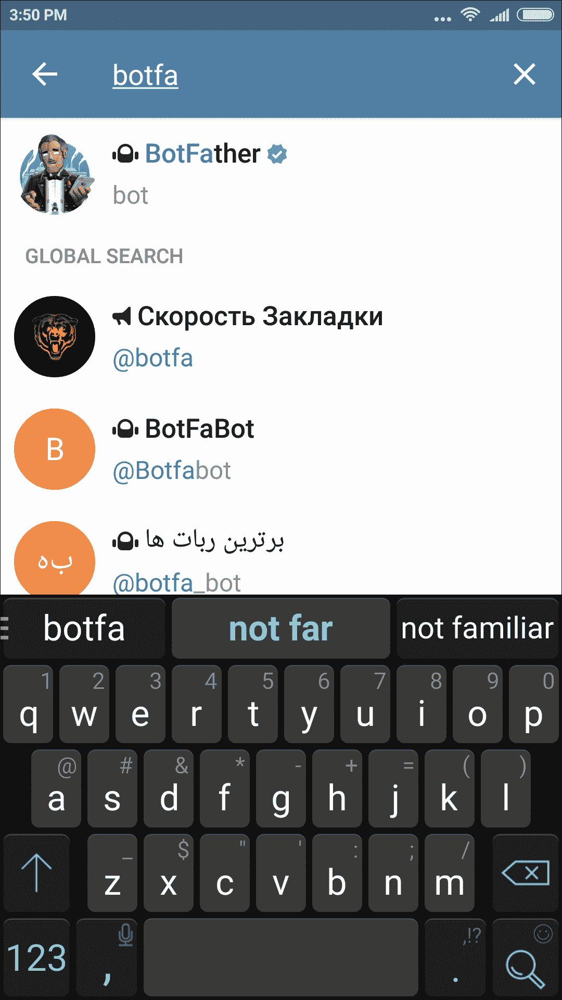

1.  一旦你与**BotFather**开始对话，按照步骤操作，并使用如`/newbot`或`/enable`等命令来配置你的机器人。仔细遵循步骤，你将创建一个新的机器人。以下截图将指导你完成创建新机器人的过程：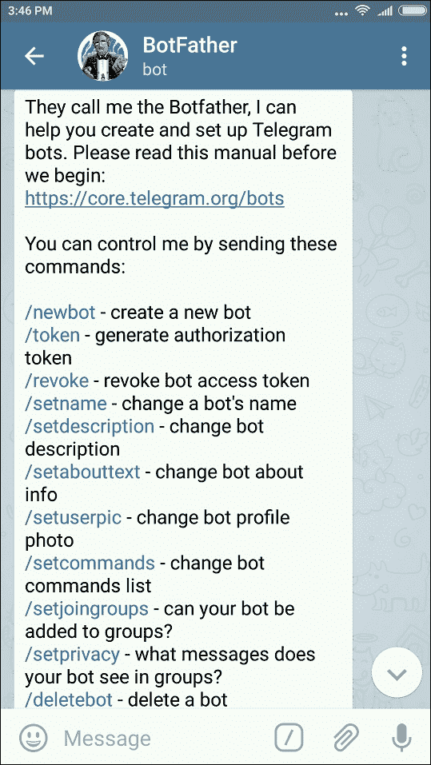

1.  当你创建一个新的机器人时，你会得到一个特定于你的机器人的令牌。请妥善保管并安全地保存它；不要与任何人分享。以下截图显示了**BotFather**的工作方式和令牌的外观：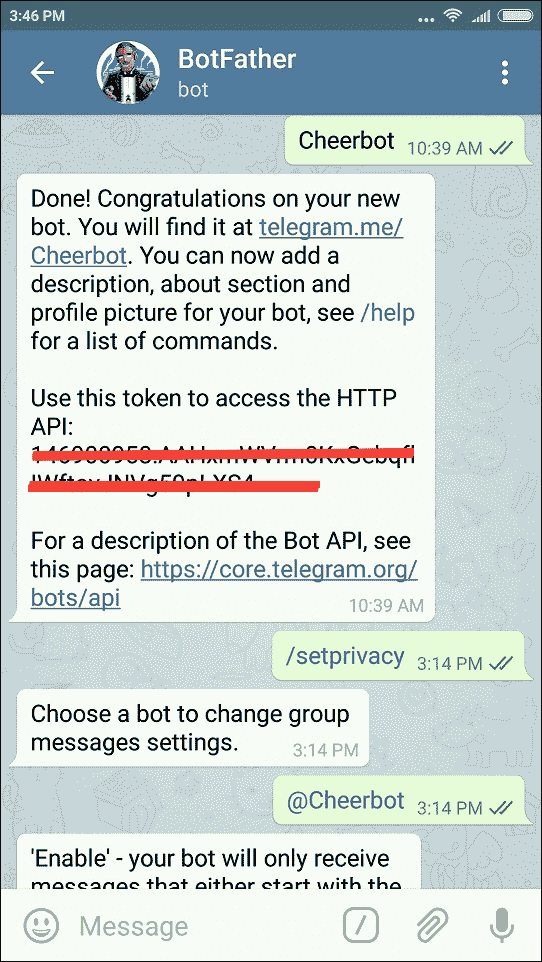

1.  很好！所以你已经创建了自己的机器人。但机器人目前还没有功能，也没有做什么引人注目的东西。让我们按照菜谱开头计划的那样，让它做一些酷的事情。创建一个名为`bot.py`的文件，并将以下代码复制到其中。同时，确保将**令牌**更改为你的机器人令牌 ID：

    ```py
            import logging 
            from telegram import InlineKeyboardButton, 
              InlineKeyboardMarkup 
            from telegram.ext import Updater,  
              CommandHandler, CallbackQueryHandler 
            import emoji 

            logging.basicConfig(format='%(asctime)s  
              - %(name)s - %(levelname)s - %(message)s', 
            level=logging.INFO) 

            def start(bot, update): 
                keyboard = [ 
                    [InlineKeyboardButton("Happy", callback_data='1'), 
                    InlineKeyboardButton("Whatever", callback_data='2')], 
                    [InlineKeyboardButton("Sad", callback_data='3')]] 

                reply_markup = InlineKeyboardMarkup(keyboard) 

                update.message.reply_text('Hey there!  
                  How do you feel today?', reply_markup=reply_markup) 

            def button(bot, update): 
                query = update.callback_query 
            if query.data == "1": 
                    em = emoji.emojize(':smile:', use_aliases=True) 
                    bot.editMessageText(text="Oh wow! %s " % em, 
            chat_id=query.message.chat_id, 
            message_id=query.message.message_id) 

            if query.data == "2": 
                    em = emoji.emojize(':expressionless:', use_aliases=True) 
                    bot.editMessageText(text="Does it matter? %s " % em, 
            chat_id=query.message.chat_id, 
            message_id=query.message.message_id) 

            if query.data == "3": 
                em = emoji.emojize(':disappointed:', use_aliases=True) 
                bot.editMessageText(text="Oh man! %s " % em, 
            chat_id=query.message.chat_id, 
            message_id=query.message.message_id) 

            def help(bot, update): 
                update.message.reply_text("Use /start to test this bot.") 

            def error(bot, update, error): 
                logging.warning('Update "%s" caused error "%s"' % (update,
                error)) 

            # Create the Updater and pass it your bot's token. 
            updater = Updater('Token') 

            updater.dispatcher.add_handler( 
              CommandHandler('start', start)) 
            updater.dispatcher.add_handler( 
              CallbackQueryHandler(button)) 
            updater.dispatcher.add_handler( 
              CommandHandler('help', help)) 
            updater.dispatcher.add_error_handler(error) 

            # Start the Bot 
            updater.start_polling() 

            # Run the bot until the user presses Ctrl-C  
              or the process receives SIGINT, 
            # SIGTERM or SIGABRT 
            updater.idle() 

    ```

1.  好的，太棒了！我们现在已经为我们机器人添加了所需的功能，并期待它能良好运行。但我们如何测试它呢？首先，使用以下命令运行 Python 文件：

    ```py
    python bot.py

    ```

1.  我们接下来搜索我们的机器人，并与之开始对话。在我的情况下，这个机器人叫做**Chetbot**，我使用标准的`/start`命令与之开始了对话：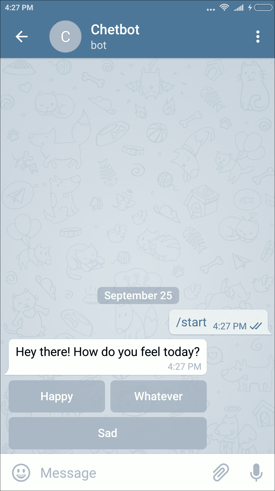

1.  在前面的截图中，当我开始与我的机器人对话时，它询问我当天的情绪，并给了我三个选项。这三个选项是**快乐**、**随便**和**悲伤**。

1.  真不错！但当我点击这些选项之一时会发生什么？哇！它会返回我当天的情绪表情符号。太棒了！！如何操作...

1.  注意，如果我需要再次开始对话，我需要重新输入`/start`命令来与机器人交谈。在以下截图中，机器人识别了启动命令，并再次询问我的情绪。不错，对吧？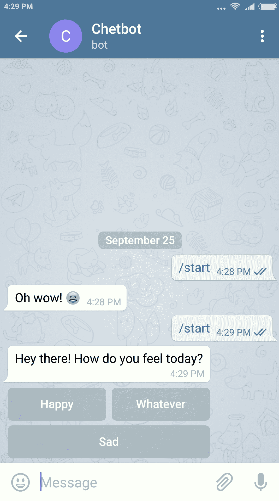

## 它是如何工作的...

`python-telegram-bot`模块基于标准的事件驱动哲学。一个机器人可以被视为一个单线程的事件循环，它持续轮询事件。事件循环也与命令处理器（也称为分发器）注册。一旦事件被触发，回调就会处理事件并返回给用户期望的响应。

在前面的代码片段中，我们注册了两个命令处理器：`start()`和`help()`。当用户与机器人开始对话（`/start`命令）或请求帮助（`/help`命令）时，会调用`start()`方法。

我们还添加了一个带有`button()`作为回调方法的回调查询处理器；当用户对机器人的选项做出响应时，它会调用这个方法。

因此，最初，机器人正在运行，等待输入。当用户说`/start`时，请求会被分发到`start()`方法，该方法反过来会询问用户**嗨，你今天感觉怎么样？**并展示一个内联键盘，有三个选项：**快乐**、**随便**或**悲伤**。

当用户选择任何一个选项时，会生成一个事件，该事件由`button()`回调方法处理。回调方法预先加载了数据，根据选择的选项进行操作。根据用户的选择，机器人会向用户发送正确的情绪。通过包含所有表情的`emoji`库，表情符号被发送回用户。

## 还有更多...

太棒了！你已经创建了自己的机器人了吗？你能想到其他简单的例子，说明 Telegram 机器人会有用吗？有很多 Python 模块可以用来开发 Telegram 机器人，例如`telepot`([`github.com/nickoala/telepot`](https://github.com/nickoala/telepot))或`twx.botapi`([`github.com/datamachine/twx.botapi`](https://github.com/datamachine/twx.botapi))；两者都很好。你可以使用其中任何一个来让你的机器人启动并运行。为什么不试试看它们能提供什么？

# 不同的机器人类型

从我们自己构建机器人的自信中汲取力量，让我们更进一步，看看机器人可以如何分类。

在上一个菜谱中我们开发的机器人可能被标记为不智能。这里的“不智能”是指它会质疑用户，并根据选项以表情符号的形式做出回应。但是当用户再次输入`/start`时，机器人会提出同样的问题。这有帮助吗？

那么设想一下这样的场景：机器人会记住你的之前的选项，并尝试通过一些美好的文章或你可以在城市中去的地点来激励你？只是为了改变你的心情？或者实际上提高你的幸福感？

为了使前面的讨论更有意义，根据实现方式，机器人可以分为三类：

+   **无状态**机器人：这些也可以被称为“不记得任何东西”的机器人。它们不持续信息；也就是说，对于它们来说，每一次交互都是一个新会话，并且它们会独立处理每一个问题。例如，一个新闻机器人可以持续提供最新故事的更新，或者总是返回政治类别的头条新闻；然而，如果它不记得对话的状态，它将被视为无状态的，并且不会被认为是有用的。大多数今天构建的机器人都属于这一类别，这也是它们提供的价值非常有限的原因。

+   **有状态**机器人：我们在前面讨论了新闻机器人。如果新闻机器人能记住用户感兴趣的新闻类别，并据此推荐更多过去的故事，用户可能会觉得有趣，那么我们现在就进入正题了。这样，我们可以让用户与机器人保持更长时间的互动。

    这种机器人会跟踪用户的身份，并持续记录当前和之前的会话信息。例如，这些机器人可能会存储今天和过去搜索的新闻类别，然后可以推荐与搜索类别匹配的新闻源。

    这样的机器人很有用，但它们并不聪明；它们不理解上下文和语言语义。

+   **智能机器人**：智能机器人插入了多个电池。它们使用机器学习，理解语言语义，并可以根据它们拥有的数据构建预测算法。

    让我们以尿布和啤酒的著名例子为例。据说，如果你分析购买模式，啤酒和尿布的购买之间存在高度相关性，这意味着购买尿布的人或多或少肯定会购买啤酒。智能机器人可以持续数据并找出这样的模式，从而对对话产生有意义的见解。让我们再举一个语言语义的例子。想想看“*脏得要命*”这个短语；现在，脏意味着肮脏，而“要命”是一个非常积极的词。智能机器人将理解这些短语，并能更好地理解用户的上下文。

根据前面的分类，决定我们为特定用例开发哪种类型的机器人就取决于我们了。在需要远比人类互动更人性化、更复杂的场合，例如客户支持，通常需要智能机器人，但想象一下企业通过使用智能机器人可以获得的效率提升。

# 拥有人工智能的智能机器人

在上一节中了解了不同类型的机器人之后，让我们尝试编写一个使用 Python 中的人工智能和情感分析的机器人。但在那之前，让我们简要了解这两个领域。

**人工智能**（**AI**）是计算机科学的一个领域，强调创建能够像人类一样反应的机器。本质上，人工智能与能够感知其上下文并采取与内容相关的行动以最大化成功机会的机器相关。例如，机器可以根据某些规则和上下文做出决策，以最大化决策的结果。

**情感分析**，另一方面，是关于识别和分类一段文本，以确定涉及人员的观点或态度是对产品或事件的正面、中性还是负面。它指的是使用自然语言处理算法进行文本分析并提取内容的主观信息，或情感。

我想，到现在为止，你一定已经开始思考如何将人工智能和情感分析用于我们的机器人以满足各种需求了。在这个菜谱中，让我们构建一个拥有这些技术的智能机器人。

### 注意

智能机器人可以建立在多种技术之上，如预测智能、人工智能、自然语言处理等；然而，完全取决于你决定使用哪种技术来满足你的目标。此外，机器人不需要在网络上或应用中；它们可以是简单的基于命令行的机器人。一个 Web 用户界面、命令行界面或移动应用可以用作机器人的分发渠道，但这并不是构建机器人的必要条件。

## 准备工作

要在我们的机器人中包含人工智能，我们将使用一个名为 `aiml` 的知名 Python 模块。**AIML** 代表 **人工智能标记语言**，但它本质上是一个 XML 文件。AIML 是一种 XML，它定义了匹配模式和确定响应的规则。因此，让我们开始安装 `aiml` 模块：

```py
chetans-MacBookPro:ch09 Chetan$ source bots/bin/activate 
(bots)chetans-MacBookPro:ch09 Chetan$  
(bots)chetans-MacBookPro:ch09 Chetan$ pip install aiml 

Collecting aiml 
Installing collected packages: aiml 
Successfully installed aiml-0.8.6

```

## 如何操作...

1.  作为第一步，我们首先创建 AIML 文件。前往你喜欢的编辑器并创建一个 AIML 文件，就像一个普通的 XML 文件一样，内容如下：

    ```py
            <aiml version="1.0.1" encoding="UTF-8"> 
            <!-chat.aiml à 

              <category> 
                <pattern>HELLO</pattern> 
                <template> 
                    Hi, hello! 
                </template> 
              </category> 

              <category> 
                <pattern>WHO ARE *</pattern> 
                <template> 
                  <random> 
                    <li>I'm a bot!</li> 
                    <li>Bad guy!</li> 
                    <li>My name is superman!</li> 
                  </random> 
                </template> 
              </category> 

              <category> 
                <pattern>AWESOME *</pattern> 
                <template> 
                    You're nice too! J 
                </template> 
              </category> 

            </aiml> 

    ```

1.  接下来，我们创建一个启动 XML 文件，该文件将加载 AIML 文件；这也会加载我们添加到前面 AIML 文件中的人工智能。让我们称这个文件为 `init.xml`：

    ```py
            <aiml version="1.0.1" encoding="UTF-8">
                <!-- init.xml -->

                <!-- Category is an atomic AIML unit -->
                <category>

                    <!-- Pattern to match in user input -->
                    <!-- If user enters "LOAD AIML B" -->
                    <pattern>LOAD AIML B</pattern>

                    <!-- Template is the response to the pattern -->
                    <!-- This learn an aiml file -->
                    <template>
                        <learn>chat.aiml</learn>
                        <!-- You can add more aiml files here -->
                        <!--<learn>more_aiml.aiml</learn>-->
                    </template>

                </category>

            </aiml> 

    ```

1.  现在，让我们开发运行我们的聊天机器人的 Python 代码。以下代码正好是我们需要的。我们称这个文件为 `aibot.py`：

    ```py
            import aiml 

            # Create the kernel and learn AIML files 
            kernel = aiml.Kernel() 
            kernel.learn("init.xml") 
            kernel.respond("load aiml b") 

            # Press CTRL-C to break this loop 
            while True: 
                print kernel.respond(raw_input("Enter your message >>")) 

    ```

1.  如果我们使用 `python aibot.py` 命令运行这个机器人，它会显示一个输入屏幕，等待用户的输入。查看以下截图以了解其工作原理：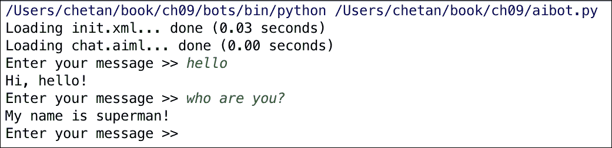

## 它是如何工作的...

上述 Python 代码模拟了一个基于人工智能的典型机器人。当我们运行 Python 代码时，`amil.Kernel()` 将加载 AI 内核。

一旦内核被加载，`kernel.learn()` 将调用启动 `xml` 文件。当向内核发送 `load aiml b` 命令时，AIML 规则引擎被加载。

一旦引擎被加载到内核中，我们就可以自由地与机器人聊天。

在前面的截图中，当我们说 **你好** 时，机器人理解它（来自 `chat.aiml` 文件）并以配置在 `chat.aiml` 中的 **嗨，你好** 响应。

在第二种情况下，当用户询问 **你是谁** 时，AI 机器人会匹配 `WHO ARE *` 模式；该模式再次在 `chat.aiml` 中定义。

如果你观察，`WHO ARE *` 模式在 `chat.aiml` 文件中配置为多个响应，因此，在运行时，机器人会随机选择一个响应并返回 **我的名字是超人！**。

# 使用机器人自动化业务流程

到目前为止，在本章中，你已经学习了什么是机器人，它们是如何构建的，以及一些简单的机器人使用案例。让我们看看我们如何利用我们至今为止的知识来解决杰伊的问题，也许还能更多地了解如何构建机器人。

杰伊是一家著名图书出版公司的市场营销经理，在 *MyBooks* 公司。他的任务是想出图书推广电子邮件。他觉得他发送的推广电子邮件太通用，没有有效地针对读者。例如，关于 Python 学习路径的电子邮件可能不会鼓励 Java 开发者花钱。他认为，如果他了解受众的兴趣并使他的互动更加相关，他可以做得更好；读者更有可能以这种方式购买书籍。他还觉得很多读者（潜在买家）在 Facebook 上，但出版社目前还没有接触到他们。我们能帮杰伊解决这个问题吗？

## 准备工作

是的，让我们通过开发一个出色的机器人来帮助 Jay。如果你研究 Jay 的问题，他需要了解受众（在这种情况下，对购买书籍感兴趣的读者）并根据他们的兴趣向他们推荐书籍。因此，我们的机器人应该足够智能，能够从读者那里获取相关信息。

此外，由于读者已经在 Facebook 上，我们可以创建一个 MyBooks Facebook 页面并构建一个 Facebook Messenger 机器人，以便联系读者。让我们看看如何操作。

在我们开始构建机器人之前，让我们安装一些将在这个练习中需要的 Python 模块。我们使用 Python 的`pip`安装`flask`和`requests`模块：

```py
(bots)chetans-MacBookPro:ch09 Chetan$ pip install flask 

Collecting flask 
  Using cached Flask-0.11.1-py2.py3-none-any.whl 
Collecting click>=2.0 (from flask) 
Collecting itsdangerous>=0.21 (from flask) 
Collecting Werkzeug>=0.7 (from flask) 
  Downloading Werkzeug-0.11.11-py2.py3-none-any.whl (306kB) 
    100% |████████████████████████████████| 307kB 1.4MB/s  
Collecting Jinja2>=2.4 (from flask) 
  Using cached Jinja2-2.8-py2.py3-none-any.whl 
Collecting MarkupSafe (from Jinja2>=2.4->flask) 
Installing collected packages: click, itsdangerous, Werkzeug, MarkupSafe, Jinja2, flask 
Successfully installed Jinja2-2.8 MarkupSafe-0.23 Werkzeug-0.11.11 click-6.6 flask-0.11.1 itsdangerous-0.24 

(bots)chetans-MacBookPro:ch09 Chetan$ pip install requests 

Collecting requests 
  Using cached requests-2.11.1-py2.py3-none-any.whl 
Installing collected packages: requests 
Successfully installed requests-2.11.1

```

## 如何操作...

1.  要开发一个 Facebook Messenger 机器人，首先创建一个 Facebook 账号（谁没有 Facebook 账号呢？）。登录您的账号，并前往[`www.facebook.com/pages/create/`](https://www.facebook.com/pages/create/)创建一个新的页面。

1.  在我们的案例中，因为我们正在为 MyBook 公司建立一个页面，我们可以将我们的页面命名为**MyBooks**，并选择一个合适的组织类型，即**媒体/新闻公司**。以下是页面的样子：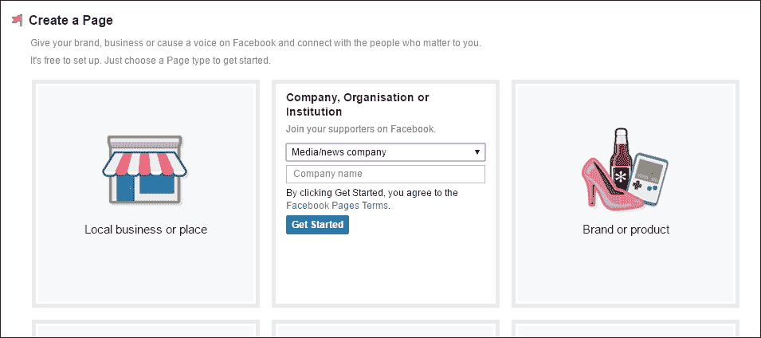

1.  创建 Facebook 页面的第二步是填写 Facebook 请求的其他详细信息，如下面的截图所示。我们为我们的页面提供了一个很好的描述：“获取我们最新书籍的更新”：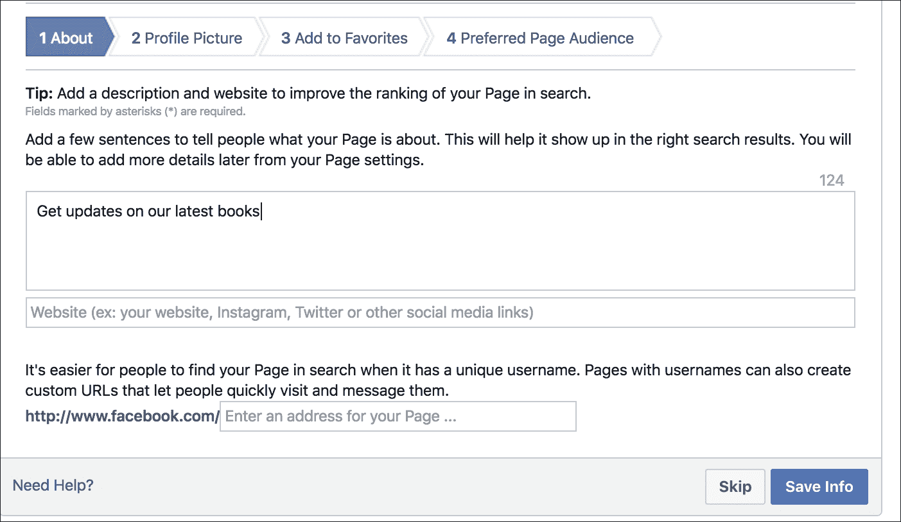

1.  我们已经为 Jay 填写了所有详细信息，MyBooks 的 Facebook 页面已经准备好，看起来很棒：

    现在，这是一个良好的开始。读者们将开始关注这个页面，但我们真的需要添加让我们的读者通过 Facebook 页面进行交流的能力；我们通过 Facebook Messenger 机器人来实现这一点。所以，让我们继续工作，解决我们解决方案的这个方面。

1.  要创建一个 Facebook Messenger 机器人，我们需要一个 Facebook 应用。我们将通过导航到[`developers.facebook.com/quickstarts/?platform=web`](https://developers.facebook.com/quickstarts/?platform=web)并点击**跳过并创建 App ID**来创建一个应用，如下面的截图所示：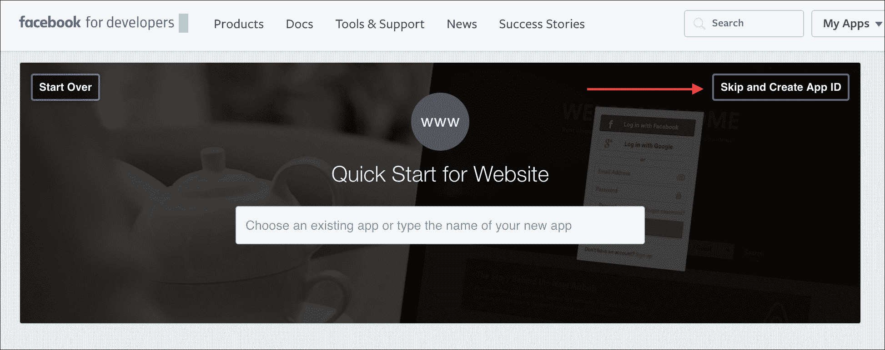

1.  我们现在填写所需的详细信息，并点击**创建 App ID**按钮来创建应用。以下截图显示了创建应用时添加的详细信息：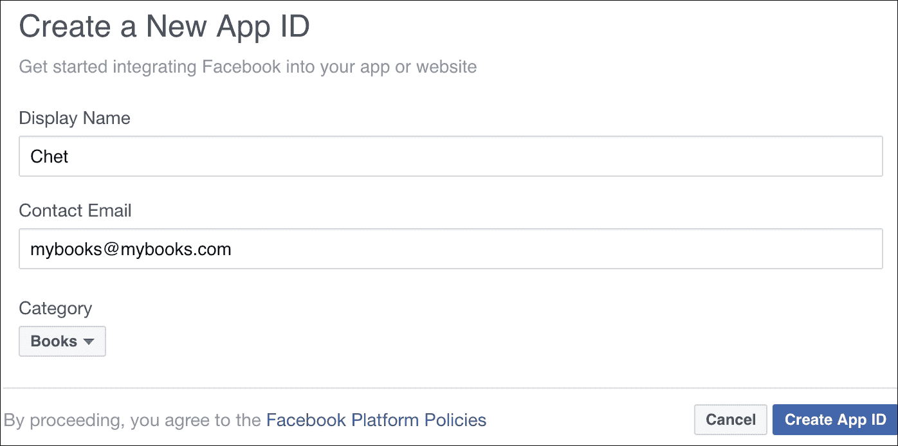

1.  一旦我们填写了详细信息并点击**创建 App ID**，就会为我们创建一个新的应用。这个 Facebook 应用是为我们的机器人准备的。我们在页面的右上角可以看到应用 ID，但要与机器人关联，我们需要向下滚动并点击**开始**部分中的**Get Started**：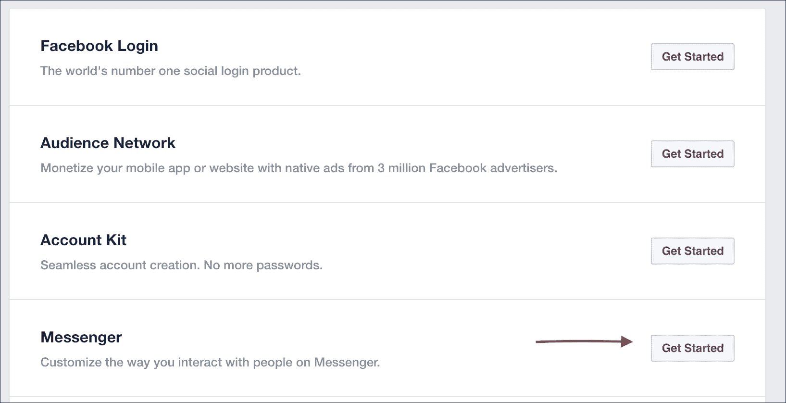

1.  为了让机器人访问 Messenger，我们将生成**页面访问令牌**，如下面的截图所示。

    ### 小贴士

    请妥善保管此令牌，不要与任何人分享。

1.  此令牌用于响应从**MyBooks** Facebook 页面与机器人开始对话的读者：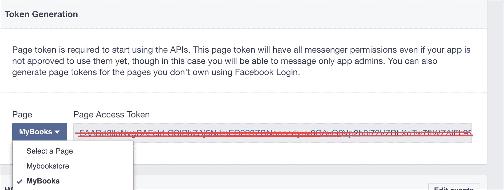

1.  好的，还有最后一件事待办。我们还需要接收读者的消息；只有在这种情况下，我们才能回应他们。为此，我们进入**Webhooks**部分并添加一些设置：

    +   **回调 URL**：这是我们的服务器链接，我们通过 Facebook 页面从读者那里接收消息

    +   **验证令牌**：这里可以使用任何一组字符，比如`token`

    +   **订阅字段**：我们选择**消息**作为我们机器人的订阅字段（这可以在以后更改）

    如你所见，我们需要有一个回调 URL。这将由 Facebook 用来验证我们的回调 URL 是否设置正确。为此，我们创建一个 Flask 服务器并配置用于**回调 URL**的路由。以下代码创建了一个名为`/bot`的路由，用作**回调 URL**进行验证：

    ```py
            from flask import Flask 
            from flask import request 
            import sys, requests, json, os 

            app = Flask(__name__) 

            @app.route("/bot/", methods=['GET', 'POST']) 
            def hello(): 
            if request.method == 'GET': 
            return request.args.get('hub.challenge') 

    ```

    如果我们在 5000 端口运行服务器，并且也使用`ngrok`在相同端口运行，我们将得到一个可以放置在**Webhook**设置中的回调 URL。这是回调 URL 的样式：

    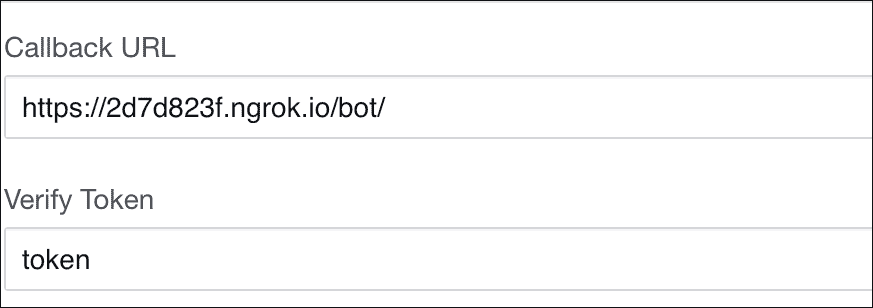

    可以通过点击按钮来验证和保存设置，如下面的截图所示：

    

    当我们验证并保存设置时，会向我们的 Flask 服务器发送一个带有`hub.challenge`代码的`GET`请求。我们从`flask`路由返回此代码给 Facebook，并验证**Webhook**设置：

    ```py
     /Users/chetan/book/ch09/bots/bin/python  
            /Users/chetan/book/ch09/bookbot.py 
             * Running on http://127.0.0.1:5000/ 
              (Press CTRL+C to quit) 

            127.0.0.1 - - [01/Oct/2016 10:17:43] "GET  
            /bot/?hub.mode=subscribe&hub 
            .challenge=1742124657&hub.verify_token= 
            token HTTP/1.1" 200 -

    ```

    为了让机器人正常工作，我们还需要确保 Facebook 页面允许某些事件，如阅读或回显消息。我们在**Webhooks**部分启用这些设置：

    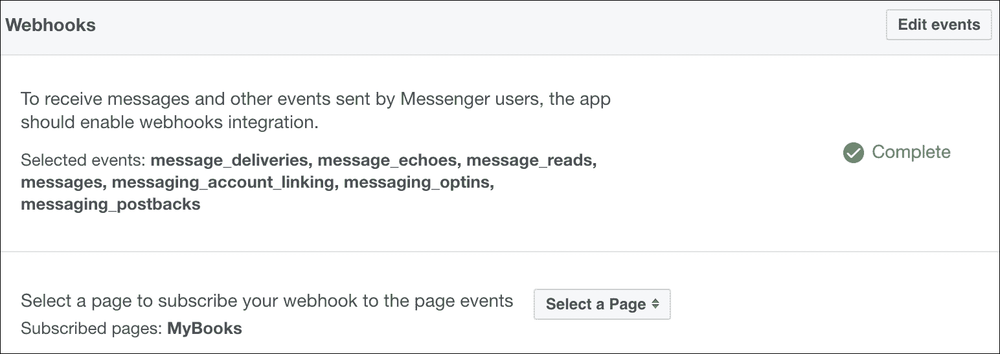

1.  太好了！所以现在我们已经准备好了一个**Webhook**来接收读者的消息，并且还有一个访问令牌来回应用户。如果你意识到，**Webhook**将成为我们的机器人服务器！让我们继续让我们的机器人做更智能的事情。以下代码将使我们的机器人完成 Jay 需要的所有伟大事情：

    ```py
            from flask import Flask 
            from flask import request 
            import requests, json

            app = Flask(__name__) 

            def send_weburl(payload, recipient_id): 
                headers = { 
                   "Content-Type": "application/json" 
                } 
                token = { 
                   "access_token": 
                   "TOKEN" 
                 } 

            if payload == 'Python': 
              data = json.dumps({ 
                "recipient": { 
                  "id": recipient_id 
                }, 
                "message":{ 
                  "attachment":{ 
                    "type":"template", 
                    "payload":{ 
                      "template_type":"generic", 
                      "elements":[ 
                      { 
                        "title":"Learn Python Design Patterns: Chetan
                        Giridhar", 
                        "item_url":"https://www.amazon.com/Learning-Python-
                        Design-Patterns-Second/dp/178588803X", 
                        "image_url":"https://images-na.ssl-images-
                        amazon.com/images/I/51bNOsKpItL._SX404_BO1,
                        204,203,200_.jpg", 
                        "subtitle":"Python Book for software architects and
                        developers", 
                        "buttons":[ 
                        { 
                          "type":"web_url", 
                          "url":"https://www.amazon.com/Learning-Python-
                          Design-Patterns-Second/dp/178588803X", 
                          "title":"Buy", 
                          "webview_height_ratio":"full" 
                        } 
                        ] 
                      } 
                      ] 
                  } 
                } 
                } 
              }) 

            if payload == 'Java': 
              data = json.dumps({ 
                "recipient": { 
                  "id": recipient_id 
                }, 
                "message":{ 
                  "attachment":{ 
                  "type":"template", 
                  "payload":{ 
                    "template_type":"generic", 
                    "elements":[ 
                    { 
                      "title":"RESTful Java Patterns and Best 
                      Practices: Bhakti Mehta", 
                      "item_url":"https://www.amazon.com/RESTful-Java-
                      Patterns-Best-Practices/dp/1783287969", 
                      "image_url":"https://images-na.ssl-images-
                      amazon.com/images/I/51YnSP6uqeL._SX403_BO1,
                      204,203,200_.jpg", 
                      "subtitle":"Python Book for software architects and 
                      developers", 
                      "buttons":[ 
                        { 
                          "type":"web_url", 
                          "url":"https://www.amazon.com/RESTful-Java-
                          Patterns-Best-Practices/dp/1783287969", 
                          "title":"Buy", 
                          "webview_height_ratio":"full" 
                        } 
                      ] 
                    } 
                    ] 
                  } 
                  } 
                } 
              }) 

            r = requests.post("https://graph.facebook.com/v2.6/me/messages", 
            params=token, headers=headers, data=data) 

            def send_postback(recipient_id): 
              headers = { 
                "Content-Type": "application/json" 
              } 
              token = { 
                "access_token": 
                  "TOKEN" 
              } 

            data = json.dumps({ 
              "recipient": { 
                "id": recipient_id 
              }, 
              "message": { 
                "attachment": { 
                  "type": "template", 
                  "payload": { 
                    "template_type": "button", 
                    "text": "Hey there, Welcome to MyBooks.  
                    What are you interested in?", 
                    "buttons": [ 
                    { 
                      "type":"postback", 
                      "title":"Java", 
                      "payload":"Java" 
                    }, 
                    { 
                      "type":"postback", 
                      "title":"Python", 
                      "payload":"Python" 
                    } 
                    ] 
                  } 
                } 
              } 
            }) 

            r = requests.post("https://graph.facebook.com/v2.6/me/messages", 
            params=token, headers=headers, data=data) 

            @app.route("/bot/", methods=['GET', 'POST']) 
            def hello(): 
              print request.data 
            if request.method == 'GET': 
              return request.args.get('hub.challenge') 

            data = request.get_json() 
            if data["object"] == "page": 
              for entry in data["entry"]: 
                for messaging_event in entry["messaging"]: 
                  if messaging_event.get("postback"): 
                    sender_id = messaging_event["sender"]["id"] 
                    payload = messaging_event["postback"]["payload"] 
                    send_weburl(payload, sender_id) 

                  if messaging_event.get("message"):  # readers send us a
                  message 
                    sender_id = messaging_event["sender"]["id"] 
                    send_postback(sender_id) 

                    return "ok", 200 

                   if __name__ == "__main__": 
                     app.run() 

    ```

1.  我们运行前面的 Flask 服务器来激活我们的机器人。现在，让我们通过导航到 Facebook 页面来看看机器人是如何工作的。在 Facebook 页面上，如果我们点击**消息**，我们就可以在**MyBooks**页面上与机器人开始聊天：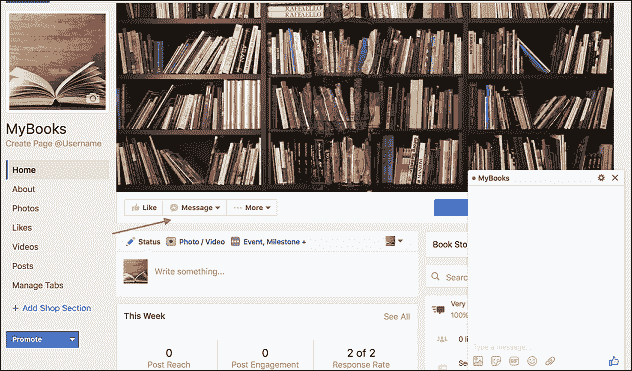

1.  让我们用简单的`Hi`消息开始与机器人的对话。机器人会向我们提出关于我们是否需要有关 Python 或 Java 书籍信息的问题。太棒了！！如何操作...

1.  现在，如果我们点击**Python**，机器人会推荐一本用 Python 编写的架构书籍，并鼓励读者购买。当读者点击**Java**时，也会发生这种情况。请看以下截图：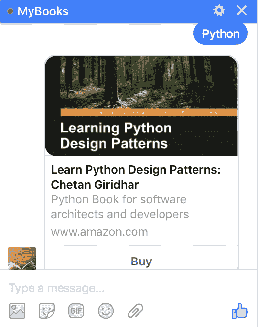

    以下截图演示了一个 Java 示例，其中当用户选择**Java**时，推荐了**RESTful Java Patterns and Best Practices**这本书：

    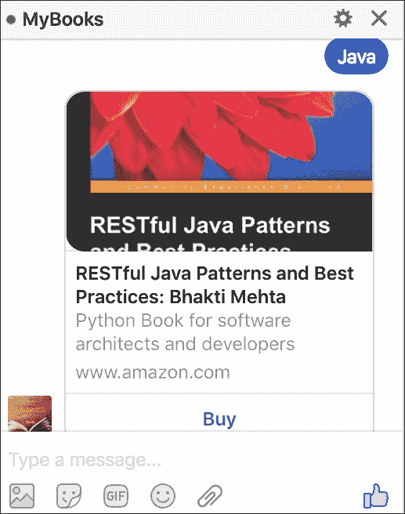

1.  太酷了，对吧？这正是 Jay 所需要的。所以，当读者到达**MyBooks**页面时，他们可以与机器人交谈，机器人根据他们的兴趣推荐一本书。由于机器人提出的建议与读者的相关性比通用促销电子邮件要高得多，读者购买书籍的可能性也更高。太棒了！

## 它是如何工作的...

我们首先为 Jay 的出版社创建了一个 Facebook 页面：MyBooks。然后我们将一个 Facebook Messenger 机器人与这个页面关联起来，并获得了**访问令牌**，以便向与机器人聊天的读者发送消息。我们还设置了**Webhooks**，以便我们的机器人能够接收读者的消息，并使用**访问令牌**向他们发送消息。在这里，**Webhook**是机器人的大脑。

当读者到达**MyBooks**页面时，他们点击**消息传递者**与机器人开始对话。当他或她说`Hi`时，HTTP 的`POST`请求会发送到**Webhook** [`https://2d7d823f.ngrok.io/bot/`](https://2d7d823f.ngrok.io/bot/)，并带有消息。

机器人读取读者的消息，并向读者发送带有`postback`选项的**通用模板**消息。机器人使用 Facebook 的 Graph APIs 发送此消息。

### 注意

Facebook 有模板消息用于发送`postback`消息、按钮、图片、URL 和音频/视频媒体文件。

当读者选择**Python**时，机器人收到这条消息，并根据有效载荷返回书籍的图片以及 URL，以便用户购买。用户然后可以点击**购买**按钮，进入书籍的 URL 并从那里购买书籍，这正是 Jay 所希望的！

## 更多...

在本章中，我们基于 CLI、Web UI 和移动应用构建机器人。这些机器人可以驻留在其他聊天系统中，例如拥有良好 API 集的 Slack。你可能想尝试编写一个。如果你写了，请把链接发给我；我很乐意尝试它们。

### 注意

你可以通过 Twitter 联系我，或者直接给我发消息，我会回复你。
