# 第十章 数据分析和可视化

你有如此多的数据，它们只是随意地躺在那里？你是否想过如何轻松地分析数据并生成见解？对数据分析过程好奇吗？那么，你就在正确的位置！

在本章中，我们将涵盖以下内容：

+   使用可视化阅读、选择和解释数据

+   使用数据过滤和聚合生成见解

+   为企业自动化社交媒体分析

# 简介

> *我们信仰上帝。其他人必须带来数据  - W. Edwards Demming，统计学家*

现在，企业严重依赖数据来了解客户的需求，他们将通过哪些渠道购买，等等。这样，企业可以就推出新产品或提出新优惠做出明智的决策。但企业是如何实现这一点的？决策实际上涉及什么？

基于数据的决策制定是指数据检查、清洗或清理、数据转换以及在数据之上生成模型的过程，目的是生成见解、发现有用信息并得出结论。例如，一家电子商务公司会使用这个过程来分析消费者购买模式，并为选定的一组产品提出促销优惠的适当时间。实际上，企业分析静态或实时数据用于多个目的，例如生成趋势、建立预测模型或简单地从原始数据中提取结构化信息。数据分析具有多个方面和方法，可以简要地归类为商业智能、预测分析和文本挖掘。

**商业智能**（**BI**）能够处理大量结构化和有时非结构化的数据，以便轻松解释这些大量数据。基于对数据的洞察力识别新机会可以为业务提供竞争优势和稳定性。

**预测分析**包括应用各种统计模型，如机器学习，来分析历史数据和当前趋势，以便对未来或未知事件做出预测。它涉及生成模型并捕捉数据特征之间的关系，以进行风险评估和决策制定。

**文本分析**是从结构化或非结构化文本数据中提取质量信息的过程。文本分析涉及语言、统计和上下文技术，以提取和分类信息，为商业提供支持。

然而，基于数据的决策并不容易，也不能一蹴而就。基于数据的决策制定是一个涉及多个操作的逐步过程。让我们在下一节中详细了解整个过程。

## 基于数据的决策制定步骤

在高层次上，这个过程可以分为以下阶段。当然，你可以根据你的目标定制这个过程：

+   **定义假设和数据需求**：在开始这个过程之前，你应该对自己的业务目标有清晰的认识——它们应该是**具体、可衡量、可接受、相关和及时**的（**SMART**）。你不希望在不清楚要解决的问题的情况下开始收集数据。尽可能明确地提出问题陈述，例如：“过去三个季度消费者领域的移动销售趋势是什么？”或者某种未来性的问题，例如：“这个冬天我能否以 150%的利润率销售电子产品？”你能为你公司提出这样的陈述吗？

+   **数据来源**：你也应该清楚你的数据来源。你是依赖你自己的公司数据库来进行数据分析吗？你也在依赖任何第三方市场研究或趋势作为分析的基础吗？如果你使用第三方数据，你计划如何从源（可能通过 API）提取数据并将其放入你的数据存储中？

+   **数据收集**：现在你已经清楚了你想要从中获得洞察力的内容，下一步就是以所需格式收集数据。例如，如果你想了解移动销售的趋势，你应该收集影响移动销售的因素的数据，如新产品推出（产品）、优惠（价格）、支付选项和购买日期/时间，以及其他相关因素。此外，你应该有一个可接受或标准的存储数据的方式；例如，我可能以美元为单位存储每单位的移动销售，而不是欧元，或者我可能以天为单位存储销售，而不是小时。在这种情况下，确定一个代表性的样本非常有用。代表性的样本能够准确反映整个群体，并肯定有助于分析。

+   **数据转换**：现在你知道了从哪里以及以什么格式收集数据，是时候决定你希望将数据加载到何处了。它可能是一个普通的 CSV 文件或一个 SQL 数据库；你事先需要知道这一点，以便以最佳方式组织数据并准备好分析。这一步可以被称为转换，因为它涉及到从源数据系统提取数据到目标数据系统。在大规模情况下，数据存储在数据仓库系统中。

+   **数据清洗**：一旦数据被处理和组织，就需要检查数据的合理性。转换后的数据可能不兼容，包含重复项，或者至少包含测量、采样和数据输入错误。数据清洗涉及删除不准确的数据，为缺失数据添加默认值，移除异常值，并解决任何其他数据不一致问题。在移除异常值时，你必须非常小心；你应该决定你想要如何移除它们——是简单地删除记录，还是用其他观察值的平均值/众数来填充？在这种情况下，你是最棒的决策者。

+   **数据分析**：一旦数据被清洗并准备好使用，就到了进行深入分析的时候了。你可以使用诸如逻辑回归等统计技术来分析数据以生成商业智能，或者生成预测模型。你还可以在上面进行文本分析，以生成洞察并做出决策。

+   **数据可视化**：一旦完成分析，就可以以多种格式报告，以便有效地将分析传达给受众。数据可视化使用信息展示，如表格和图表，来帮助传达数据中包含的关键信息。可视化还有助于用户解释他们的假设，并从分析中生成有意义的见解。

+   **数据解释和反馈**：这一阶段帮助你回答三个主要问题。分析是否回答了你最初提出的问题？它是否帮助你验证你的假设，即接受或拒绝你的假设？你是否需要更多数据来改进你的模型或结论？只有当你的结论能够反馈回系统中，这个过程才算完整。反馈循环确保预测模型在未来的使用中得到丰富和良好的训练。

好的，这是一个不错的开始！我想你一定对整个过程有了相当的了解：从数据收集到生成洞察。你会意识到其中的一些步骤，如定义目标、数据收集和数据转换，是特定于市场环境和要解决的问题的。

在本章中，我们将关注一些通用方面，例如收集实时数据、读取数据、执行数据分析以及数据可视化。我们将探讨一些流行的 Python 模块，这些模块将帮助我们高效地读取数据并分析数据以生成洞察。你还将了解帮助解释数据和生成可视化（图表）的 Python 模块。

在本章结束时，我们还将探讨一个典型的业务流程，该流程可以使用本章中涵盖的食谱所构建的知识进行自动化。本章将帮助你开始作为数据科学家的旅程，但并不涵盖广泛的主题，如统计技术或预测建模。

在本章的进行过程中，我们将使用以下 Python 模块：

+   `pandas` ([`pandas.pydata.org/pandas-docs/version/0.15.2/tutorials.html`](http://pandas.pydata.org/pandas-docs/version/0.15.2/tutorials.html))

+   `numpy` ([`www.numpy.org/`](http://www.numpy.org/))

+   `matplotlib` ([`matplotlib.org/`](http://matplotlib.org/))

+   `seaborn` ([`pypi.python.org/pypi/seaborn/`](https://pypi.python.org/pypi/seaborn/))

# 使用可视化读取、选择和解释数据

在这个菜谱中，我们将使用一个已知的数据集。我们将使用 TechCrunch 的美国大陆 CSV 文件，其中包含 1,460 家公司融资轮次的列表。它看起来是这样的。它包含数据点，例如公司名称、员工人数、融资日期、筹集的资金金额和融资类型（A 轮或天使投资）：

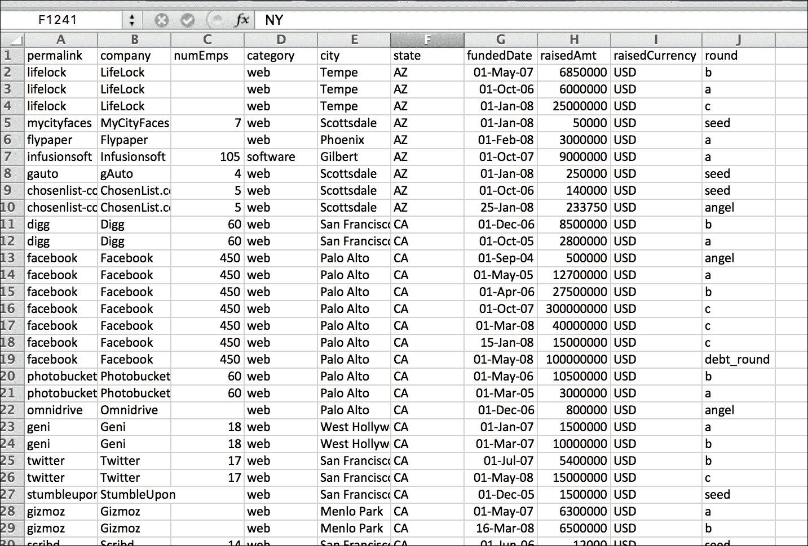

1.  现在，让我们安装我们将用于从该 CSV 文件读取和选择数据的模块。在这样做之前，我们将设置一个虚拟环境并激活它：

    ```py
    chetans-MacBookPro:ch11 Chetan$ virtualenv analyze
    New python executable in analyze/bin/python2.7
    Also creating executable in analyze/bin/python
    Installing setuptools, pip, wheel...done.
    chetans-MacBookPro:ch11 Chetan$ source analyze/bin/activate
    (analyze)chetans-MacBookPro:ch11 Chetan$

    ```

1.  好的，太棒了！现在，让我们来安装 `pandas`。我们将使用 `pandas` 来读取我们的 CSV 文件并选择数据进行分析。我们使用我们最喜欢的工具 `python-pip` 来安装 `pandas`。以下是我 Mac OSX 上安装 `pandas` 的日志：

    ```py
    (analyze)chetans-MacBookPro:ch11 Chetan$ pip install pandas
    Collecting pandas
    Collecting pytz>=2011k (from pandas)
     Using cached pytz-2016.7-py2.py3-none-any.whl
    Collecting python-dateutil (from pandas)
     Using cached python_dateutil-2.6.0-py2.py3-none-any.whl
    Collecting numpy>=1.7.0 (from pandas)
    Collecting six>=1.5 (from python-dateutil->pandas)
     Using cached six-1.10.0-py2.py3-none-any.whl
    Installing collected packages: pytz, six, 
            python-dateutil, numpy, pandas
    Successfully installed numpy-1.11.2 pandas-0.19.1 
            python-dateutil-2.6.0 pytz-2016.7 six-1.10.0

    ```

    ### 注意

    安装 `pandas` 模块也自动安装了 `numpy` 模块。实际上，我之前已经在我的机器上安装了这些模块；因此，许多这些模块都是从缓存中获取的。在您的机器上，安装日志可能会有所不同。

1.  接下来，让我们安装 `matplotlib` 和 `seaborn`；这些库将用于我们的可视化。以下是我机器上的安装日志，首先是 `matplotlib`：

    ```py
    (analyze)chetans-MacBookPro:ch11 Chetan$ pip install matplotlib
    Collecting matplotlib
    Requirement already satisfied (use --upgrade to upgrade):
              numpy>=1.6 in ./analyze/lib/python2.7/site-packages 
              (from matplotlib)
    Requirement already satisfied (use --upgrade to upgrade):
              pytz in ./analyze/lib/python2.7/site-packages 
              (from matplotlib)
    Requirement already satisfied (use --upgrade to upgrade):
              python-dateutil in ./analyze/lib/python2.7/site-packages
              (from matplotlib)
    Collecting cycler (from matplotlib)
     Using cached cycler-0.10.0-py2.py3-none-any.whl
    Collecting pyparsing!=2.0.0,!=2.0.4,!=2.1.2,>=1.5.6
            (from matplotlib)
     Using cached pyparsing-2.1.10-py2.py3-none-any.whl
    Requirement already satisfied (use --upgrade to upgrade):
            six>=1.5 in ./analyze/lib/python2.7/site-packages 
            (from python-dateutil->matplotlib)
    Installing collected packages: cycler, pyparsing, 
            matplotlib
    Successfully installed cycler-0.10.0 
            matplotlib-1.5.3 pyparsing-2.1.10

    ```

    如您所见，这些模块已安装在我的机器上，因此您在第一次在自己的机器上安装这些模块时，安装日志可能会有所不同。以下是 seaborn 的日志：

    ```py
    (analyze)chetans-MacBookPro:ch11 Chetan$ pip install seaborn
    Collecting seaborn
    Collecting scipy (from seaborn)
    Requirement already satisfied (use --upgrade to upgrade):
            numpy>=1.7.1 in ./analyze/lib/python2.7/site-packages
            (from scipy->seaborn)
    Installing collected packages: scipy, seaborn
    Successfully installed scipy-0.18.1 seaborn-0.7.1

    ```

## 如何做到这一点...

1.  首先，让我们从 [`support.spatialkey.com/spatialkey-sample-csv-data/`](http://samplecsvs.s3.amazonaws.com/TechCrunchcontinentalUSA.csv) 下载 CSV 文件。TechCrunch 文件的直接下载链接是 [`samplecsvs.s3.amazonaws.com/TechCrunchcontinentalUSA.csv`](http://samplecsvs.s3.amazonaws.com/TechCrunchcontinentalUSA.csv)。您可以使用以下 `wget` 命令下载此文件：

    ```py
    (analyze)chetans-MacBookPro:ch11 Chetan$ 
              wget http://samplecsvs.s3.amazonaws.com/
              TechCrunchcontinentalUSA.csv
    --2016-11-20 16:01:57--
              http://samplecsvs.s3.amazonaws.com/
              TechCrunchcontinentalUSA.csv
    Resolving samplecsvs.s3.amazonaws.com... 54.231.97.224
    Connecting to samplecsvs.s3.amazonaws.com
              |54.231.97.224|:80... connected.
    HTTP request sent, awaiting response... 200 OK
    Length: 93536 (91K) [application/x-csv]
    Saving to: 'TechCrunchcontinentalUSA.csv'
    TechCrunchcontinentalUSA.csv              100%
            [=======================================================
             =========================================>]
                                         91.34K  20.3KB/s   in 4.5s 
    2016-11-20 16:02:03 (20.3 KB/s) - 
            'TechCrunchcontinentalUSA.csv' saved [93536/93536]

    ```

1.  现在，让我们开始编写我们的第一段 Python 代码来读取 CSV 文件。我们读取 CSV 文件并打印前五行：

    ```py
          import pandas as pd

          pd.set_option('display.line_width', 5000)
          pd.set_option('display.max_columns', 60)

          df = pd.read_csv('TechCrunchcontinentalUSA.csv')
          print "First five rows:\n", df[:5]

    ```

    在前面的代码示例中，我们读取了 CSV 文件的前五条记录：

    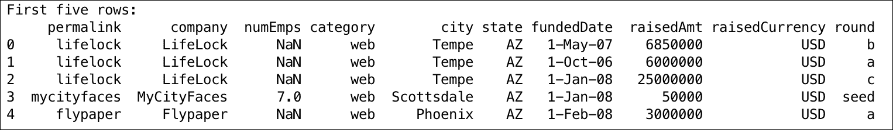

1.  `pandas` 模块读取文件内容并将其转换为行和列的数据框。现在，如果您查看前面代码的输出，您会注意到文件内容中添加了一个索引列。使用 `pandas`，很容易解析日期，判断我们 CSV 文件中的日期是先月后日（英国或美国格式），并将日期列设置为索引列：

    ```py
            import pandas as pd 

            pd.set_option('display.line_width', 5000) 
            pd.set_option('display.max_columns', 60) 

            df = pd.read_csv('TechCrunchcontinentalUSA.csv',
                      index_col='fundedDate', \ 
                      parse_dates=['fundedDate'], dayfirst=True,) 
            print "Top five rows:\n", df[:5] 

    ```

    如果你运行前面的代码片段，你应该能够看到索引列 **fundedDate**，如下面的屏幕截图所示：

    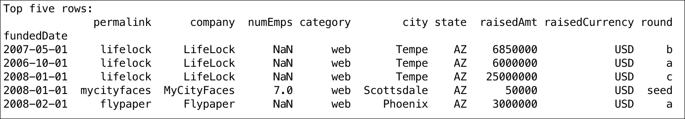

1.  真不错！现在，我们能够读取数据了，但如何选择一些数据以便我们可以在其上进行一些分析呢。让我们选择描述公司筹集资金金额的列（**raisedAmt** 列）：

    ```py
            import pandas as pd 

            pd.set_option('display.line_width', 5000) 
            pd.set_option('display.max_columns', 60) 
            df = pd.read_csv('TechCrunchcontinentalUSA.csv', 
                      index_col='fundedDate', \ 
                      parse_dates=['fundedDate'], dayfirst=True,) 

            raised = df['raisedAmt'][:5] 
            print "Funding Raised by Companies over time:\n", raised 

    ```

    注意，在下面的屏幕截图中，我们打印了获得资助的公司的前五条记录：

    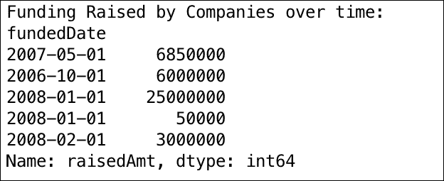

1.  好的，酷！所以我们可以选择我们想要的列并获取我们想要分析的数据。让我们看看我们是否可以为它生成一些漂亮的可视化。下面的方法基于筹集的金额（*y* 轴）为所有年份报告的融资轮次生成一个折线图（*x* 轴）：

    ```py
            import pandas as pd 
            from matplotlib import pyplot as plt 
            import seaborn as sns 

            plt.style.use('default') 
            pd.set_option('display.line_width', 5000) 
            pd.set_option('display.max_columns', 60) 

            df = pd.read_csv('TechCrunchcontinentalUSA.csv') 
            print "First five rows:\n", df[:5] 

            df = pd.read_csv('TechCrunchcontinentalUSA.csv', 
                      index_col='fundedDate', \ 
                      parse_dates=['fundedDate'], dayfirst=True,) 
            print "Top five rows:\n", df[:5] 
            raised = df['raisedAmt'][:5] 
            print "Funding Raised by Companies over time:\n", raised 

            sns.set_style("darkgrid") 
            sns_plot = df['raisedAmt'].plot() 
            plt.ylabel("Amount Raised in USD");
            plt.xlabel("Funding Year") 
            plt.savefig('amountRaisedOverTime.pdf') 

    ```

    在下面的屏幕截图中，看看资助率（或报告率）是如何增加的，随之，筹集的资金也稳步增加！

    

1.  太棒了！我知道你已经开始喜欢我们在这里做的事情了。让我们继续前进，看看我们是否可以从 CSV 文件中选择多个列。在下面的示例中，我们获取了 50 行数据，列名为 **company**、**category** 和 **fundedDate**：

    ```py
          import pandas as pd 
          from matplotlib import pyplot as plt 
          plt.style.use('default') 
          pd.set_option('display.line_width', 5000) 
          pd.set_option('display.max_columns', 60) 

          fundings = pd.read_csv('TechcrunchcontinentalUSA.csv') 
          print "Type of funding:\n", fundings[:5]['round'] 

          # Selecting multiple columns 
          print "Selected company, category and date of 
                 funding:\n",\ 
          fundings[['company', 'category', 
                'fundedDate']][600:650] 

    ```

    前一个代码片段的输出如下：

    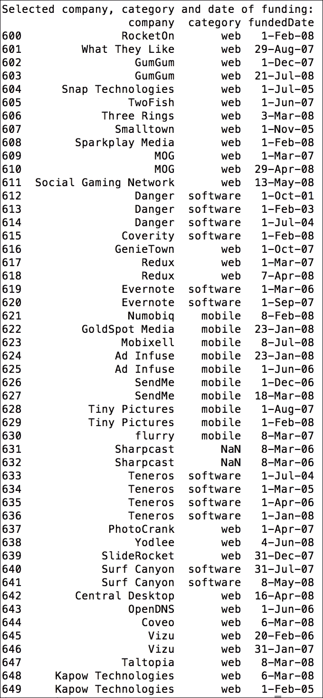

1.  好的，太好了！现在让我们选择这些列中的一个，并在此基础上进行一些分析。在下面的代码示例中，我们选择了 **category** 列，它给出了所有报告的融资轮次的类别。然后我们处理所选列以获取获得资助的公司最常见的类别：

    ```py
            import pandas as pd 
            from matplotlib import pyplot as plt 
            plt.style.use('default') 

            pd.set_option('display.line_width', 5000) 
            pd.set_option('display.max_columns', 60) 

            fundings = pd.read_csv('TechcrunchcontinentalUSA.csv') 
            print "Type of funding:\n", fundings[:5]['round'] 

            # Selecting multiple columns 
            print "Selected company, category and date of funding:\n",\ 
                fundings[['company', 'category', 'fundedDate']][600:650] 

            # Most common category of company that got funded 
            counts = fundings['category'].value_counts() 
            print "Count of common categories of company 
                   that raised funds:\n", \ 
                   counts 

    ```

    前一个代码片段的输出是：

    ```py
    Count of common categories of company that raised funds:
    web           1208
    software       102
    mobile          48
    hardware        39
    other           16
    cleantech       14
    consulting       5
    biotech          4
    Name: category, dtype: int64

    ```

1.  数据和数字提供了很多信息，但实际的影响实际上只能通过可视化来看到。让我们看看我们是否可以将上述数据绘制为水平条形图。下面的方法为我们完成了这项工作：

    ```py
            import pandas as pd 
            from matplotlib import pyplot as plt 
            plt.style.use('default') 
            pd.set_option('display.line_width', 5000) 
            pd.set_option('display.max_columns', 60) 

            fundings = pd.read_csv('TechcrunchcontinentalUSA.csv') 
            print "Type of funding:\n", fundings[:5]['round'] 

            # Selecting multiple columns 
            print "Selected company, category and date of funding:\n",\ 
                fundings[['company', 'category', 'fundedDate']][600:650] 

            # Most common category of company that got funded 
            counts = fundings['category'].value_counts() 
            print "Count of common categoris of company 
                   that raised funds:\n", \ 
                   counts 
            counts.plot(kind='barh') 
            plt.xlabel("Count of categories") 

            plt.savefig('categoriesFunded.pdf') 

    ```

    在 *y* 轴上，我们有获得资助的公司的类别，而 *x* 轴是给定类别中公司的总数。此外，我们将绘制的图表保存为名为 `categoriesFunded.pdf` 的 PDF 文件：

    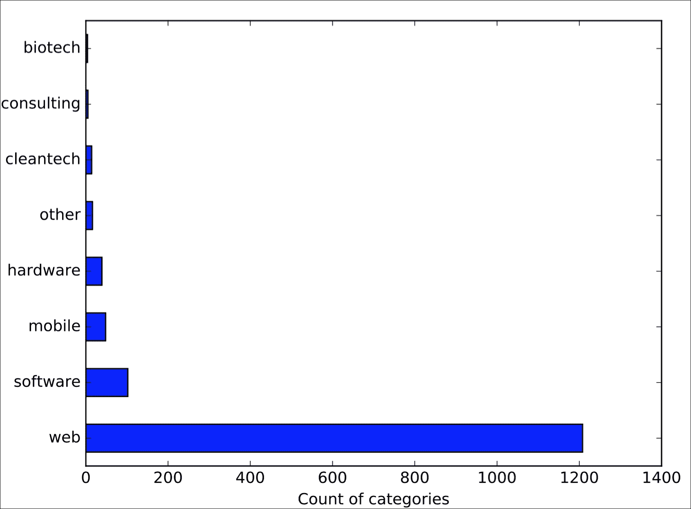

哇！这么多网络公司获得了资助？太棒了！我也应该开始创办一家网络公司——这增加了获得资助的机会。

## 它是如何工作的...

在本节中，我们处理了数据分析的两个主要方面。首先，我们介绍了如何从 CSV 文件中读取数据集并从我们的数据集中选择适当的数据（行或列）。

在第一个代码片段中，我们使用 `pandas` 模块的帮助来读取 CSV 文件。在 `pandas` 中，我们有 `read_csv(csv_file)` 方法，它接受 CSV 文件路径作为参数。`pandas` 模块读取文件并将文件内容存储为数据框。数据框是一个二维、内存中标记的数据结构，具有可能不同类型的列。它模仿了电子表格、SQL 表或系列对象字典的结构。它有一套很好的方法和属性来选择、索引和过滤数据。在我们的第一个食谱中，我们读取了 CSV 文件并生成了一个 DataFrame 对象 `df`。使用 `df` 我们选择了 CSV 文件的头五行，使用 `df[:5]`。看看使用 `pandas` 选择 CSV 文件行是多么简单。

我们可以使用 `read_csv()` 方法做更多的事情。默认情况下，`pandas` 会为我们的数据集添加另一个索引列，但我们可以指定 CSV 文件中的哪一列应该用于索引我们的数据。我们通过将 `index_col` 参数传递给 `read_csv()` 方法实现了这一点。我们还使用 `parse_dates` 参数将 CSV 文件中 **fundedDate** 列的字符串日期转换为 datetime 格式，并通过 `dayfirst` 参数指定日期格式，其中日期的第一部分是日期。

在获取 DataFrame 并使用 **fundedDate** 作为索引后，我们使用 `df['raisedAmt'][:5]` 来选择 **raisedAmt** 列并打印前五行。然后我们使用 `seaborn` 库通过 `sns.set_style("darkgrid")` 设置了我们的绘图风格，并使用 `plot()` 方法生成了条形图。`seaborn` 库用于生成漂亮的可视化效果，并基于 `matplotlib` 实现。

使用 `matplotlib` 库，我们创建了一个对象 `plt`，然后使用 `ylabel()` 和 `xlabel()` 方法来标记我们的图表。`plt` 对象还用于最终使用 `savefig()` 方法将生成的图表保存为 PDF 格式。

在第二个示例中，我们使用 `fundings[['company', 'category' and 'fundedDate']]` 选择了多个列。我们一行代码中从 CSV 文件中选择了三个列。然后我们使用 `plot()` 方法绘制了一个水平条形图，并使用 `kind=barh` 指定了图表类型。最后，我们使用 `xlabel()` 方法通过 `matplotlib` 库标记了 *x* 轴，并使用 `savefig()` 方法保存了图表。正如你所看到的，我们不需要使用 `seaborn` 库来绘制图表；我们可以简单地使用 `matplotlib` 来完成。

# 使用数据过滤和聚合生成洞察

使用 `pandas` 读取 CSV 文件并选择多个列非常简单。在本节中，我们将探讨如何切片和切块数据，本质上就是使用 `pandas` 过滤数据。

## 准备工作

在本节中，我们将使用与之前食谱中相同的库集合（以下列出的库）：

+   `pandas` 用于过滤和分析数据

+   使用`matplotlib`和`seaborn`来绘制图表并将数据保存到 PDF 文件中

## 如何操作...

1.  让我们从导入所需的库和读取 CSV 文件使用`read_csv()`方法开始。以下代码执行了这些操作：

    ```py
            import pandas as pd 

            from matplotlib import pyplot as plt 
            import seaborn as sns 

            plt.style.use('default') 

            pd.set_option('display.line_width', 5000) 
            pd.set_option('display.max_columns', 60) 

            fundings = pd.read_csv(
                       'TechcrunchcontinentalUSA.csv', 
                       index_col='fundedDate', \ 
                       parse_dates=['fundedDate'], dayfirst=True) 

    ```

1.  现在，让我们在数据框上应用筛选，并使用多个列来筛选数据。比如说，我们根据融资类别、州和州内选定的城市来筛选融资记录。这可以通过以下代码片段实现：

    ```py
            import pandas as pd 
            from matplotlib import pyplot as plt 
            import seaborn as sns 

            plt.style.use('default') 

            pd.set_option('display.line_width', 5000) 
            pd.set_option('display.max_columns', 60) 

           funding = pd.read_csv(
                      'TechcrunchcontinentalUSA.csv', 
                      index_col='fundedDate', \ 
                      parse_dates=['fundedDate'], dayfirst=True) 

           #Web fundings in CA 
           web_funding = funding['category'] == 'web' 
           in_CA = funding['state'] == 'CA' 
           in_city = funding['city'].isin(['Palo Alto',
                             'San Francisco', 'San Mateo', 
                             'Los Angeles', 'Redwood City']) 

    ```

    上述代码返回了加州（CA）州帕洛阿尔托、旧金山、圣马特奥、洛杉矶和雷德伍德城的所有网络公司的所有融资记录。以下是一个输出截图的部分：

    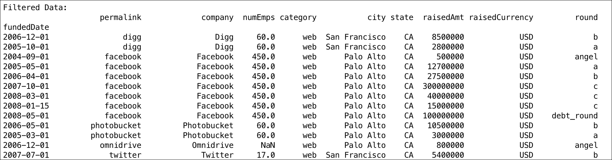

1.  好极了，现在让我们看看我们是否可以通过城市名称来获取网络类别公司的融资次数。以下代码将为我们提供所需详细信息：

    ```py
            web_funding = funding[web_funding & in_CA & in_city] 
            web_counts = web_funding['city'].value_counts() 
            print "Funding rounds for companies in 'web' 
                       category by cities in CA:\n", web_counts 

    ```

    上述代码的输出是选定城市中**网络**类别公司收到的融资轮次数量：

    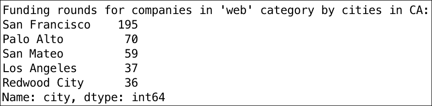

    哇！前面的分析非常有用；你了解到旧金山的网络公司已经收到了 195 次（根据我们的数据）的融资。看起来如果你是旧金山的网络公司，你所有的融资担忧都已经结束了。嗯，这听起来合乎逻辑且简单。

1.  但是等等，这个信息不是不完整吗？我们为什么不收集所有类别（包括**网络**）公司的数据，然后以所有类别的百分比来表示**网络**类别中的公司数据呢？这样我们就可以知道你是否应该将你的公司在“旧金山”或其他任何城市。好的，那么让我们统计一下 CA 州所有类别（包括**网络**）中所有选定城市的融资轮次。以下代码将为我们提供所需的信息：

    ```py
            total_funding = funding[in_CA & in_city] 
            total_counts = total_funding['city'].value_counts() 
            print "Funding rounds for companies in 'all' 
                   categories by cities in CA:\n",total_counts 

    ```

    以下是上述代码片段的输出：

    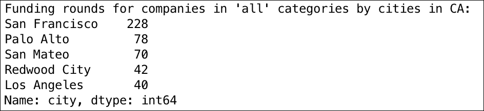

1.  太好了！现在，让我们获取 CA 州选定城市中**网络**类别公司占所有类别公司的百分比数据。我们可以通过简单地将**网络**类别的数据除以所有类别并乘以 100 来表示为百分比。以下代码片段将帮助我们完成这项工作：

    ```py
            sns.set_style("darkgrid") 
            sns_plot = (web_counts*100/total_counts.astype(
                                  float)).plot(kind='barh') 

    ```

1.  现在，让我们用以下代码将此数据绘制成水平条形图：

    ```py
            plt.xlabel("(Funding Rounds in Web Category) / (
                  Funding Rounds in All Categories) * (100)") 
            plt.savefig('webFundedByCity.pdf') 

    ```

    以下截图帮助我们比较了网络公司与所有其他类别公司和加州各城市融资轮次的情况：

    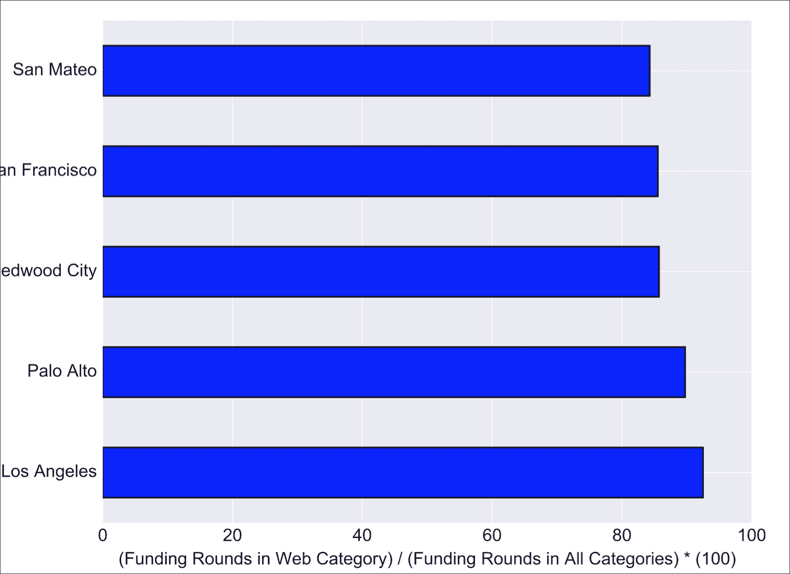

    分析之后，你有什么发现？你仍然想在旧金山设立公司吗？如果你是洛杉矶的互联网公司，尽管资金轮次有限，但你获得资金的机会（0.925）比在旧金山（0.855）要高，至少从我们的数据点来看。

现在，让我们看看另一个例子。假设我们想分析我们的数据，看看哪些月份历史上比其他月份筹集的资金更多。此外，我们还能否将此与资金轮次（如 A 轮或天使投资）联系起来？这是一个有趣的思考！但我们如何做到这一点？`pandas`模块支持对数据进行分组和聚合，这将帮助我们进行这项分析。让我们一步一步解决这个问题：

1.  首先，让我们读取 CSV 文件并选择两列：**筹集金额**和**轮次**。我们还将添加另一个列，`month`作为数据框的索引列。以下代码为后续分析准备好了数据框：

    ```py
            import pandas as pd 
            from matplotlib import pyplot as plt 
            import seaborn as sns 

            plt.style.use('default') 

            pd.set_option('display.line_width', 5000) 
            pd.set_option('display.max_columns', 60) 

            df = pd.read_csv('TechCrunchcontinentalUSA.csv',
                         index_col='fundedDate', \ 
                         parse_dates=['fundedDate'], dayfirst=True,) 

            funds = df[['raisedAmt', 'round']] 
            funds['month'] = funds.index.month 
            print "Funding Rounds with Month Index:\n", funds 

    ```

1.  现在我们需要根据月份获取筹集资金的数据。以下代码正好做了我们需要的：

    ```py
            funding_by_month = funds.groupby('month').aggregate('sum') 
            funding_by_month.index = ['Jan', 'Feb', 'Mar',
                                      'Apr', 'May', 'June', 'July', \ 
                                      'Aug', 'Sept', 'Oct', 'Nov', 'Dec'] 
            print "Funding Rounds Grouped By Month:\n", funding_by_month 

    ```

1.  现在，如果我们绘制用于此分析的数据，我们将看到我们拥有的所有年份数据中，资金在每月是如何波动的：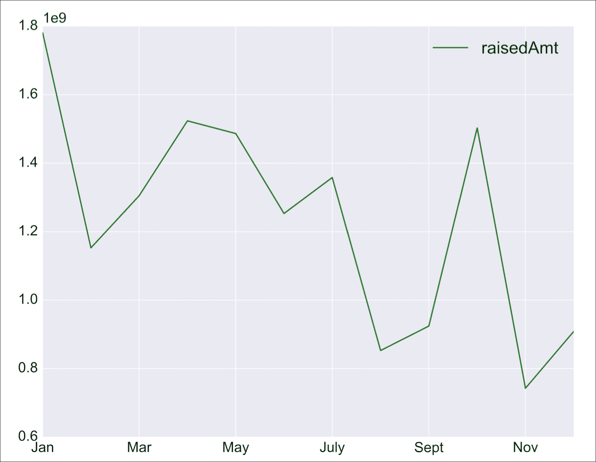

    很酷，看起来一月份申请资金会更好。也许，投资者在圣诞节和新年假期之后心情不错；你怎么看？

1.  现在，如果你想分析和建立年度月份、筹集金额和资金轮次之间的相关性，我们可以用以下代码片段获取数据：

    ```py
            funds['month'] = funds.index.month 
            funding_by_stage = funds.groupby(['month', 
                               'round']).aggregate('sum') 
            print funding_by_stage 

    ```

    前一段代码片段的输出是一个按照以下截图所示的数据框。数据按照资金**月份**和**轮次**列进行分组，并且**筹集金额**相应地汇总：

    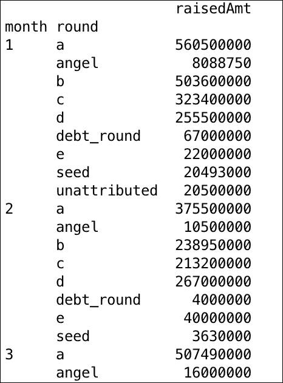

## 它是如何工作的...

对于第一个问题，我们使用`read_csv()`方法将数据从 CSV 文件加载为数据框。然后，我们根据多个因素过滤数据，其中州是`CA`，公司类别是`web`，城市是`Palo Alto`、`San Francisco`、`San Mateo`、`Los Angeles`和`Redwood City`。过滤是一个基于列的操作，相当直接；它应用了标准后，会得到相关的数据框。

然后，我们使用`value_counts()`方法按城市计算了**网络**公司资金轮次的数量。我们也对所有类别公司的资金轮次进行了同样的练习，包括**网络**。

最后，我们简单地划分了数据，并得到了作为所有类别数据百分比的**网络**公司数据。`pandas`模块为我们无缝地处理了这个操作。它使用了相同城市的分析数据点，甚至我们都不用担心这一点。

最后，我们使用`plot()`方法绘制了水平条形图，分别描绘了每个城市的百分比，并获得了我们寻求的洞察。

在第二个示例中，我们首先通过选择多个列：**筹集金额**和**轮次**来获取数据框。我们还向**月份**数据框添加了一个新列，并将其作为索引列。

然后，我们借助**groupby()**方法根据**月份**对数据进行分组。然后我们汇总了资金金额，以获取基于**月份**筹集的资金总额。为了获取总资金，我们使用了**聚合()**方法并将数据点添加到所需信息中。

此外，为了建立关于**月份**和**轮次**筹集资金的关联，我们将数据框按**月份**和**轮次**分组，然后再次对**筹集金额**进行了聚合。

## 还有更多...

在前面的两个示例中，我们学习了数据分析与可视化，并在我们的示例中广泛使用了`pandas` Python 模块。`pandas`模块是一个非常全面的库，具有处理时间序列、高级索引技术、合并和连接对象以及处理不同数据集（如 JSON 和 Excel）等功能。我强烈建议您查阅`pandas` API 参考，以了解更多关于这个令人惊叹的库的信息。

在下一个示例中，让我们看看我们是否可以应用本章到目前为止所获得的知识，通过帮助 Judy 自动化她的任务。

# 自动化企业级社交媒体分析

Judy 是伦敦一家领先杂志的专栏作家。作为一名作家，她总是对时事感兴趣。她收集数据并分析它，以产生对读者有吸引力的见解。

目前，Judy 对苹果 iPhone 和三星 Note 之间的竞争感兴趣，并计划在她的杂志上发表文章。她计划通过在街头与人交谈和阅读博客文章来收集数据，但她知道她将从社交媒体中获得大量的信息。她意识到，如今人们倾向于在 Twitter 上表达他们对产品使用时的喜悦或失望，并在社交媒体上向朋友推荐产品。然而，她担心她必须处理如此大量的社交媒体数据来撰写她的文章。

你是一位数据科学家，也是 Judy 的同事。你能帮助 Judy 满足她的需求吗？这是一个展示你数据技能的机会！

让我们从分析 Judy 的问题开始。首先，Judy 需要从不断增长的社会媒体平台，如 Twitter 收集数据。其次，她需要分析这些数据以生成有趣的见解。因此，我们应该能够构建一个满足她这两个问题的系统。此外，你可能想构建一个只解决她当前需求的系统，但她应该能够将其用于未来的任何项目。

## 准备工作

让我们安装所有我们将需要用于解决这个问题的模块。我们已经有`pandas`、`matplotlib`和`seaborn`安装好了。对于这个问题，我们还将安装`tweepy`，这是一个用于处理 Twitter 数据的模块。让我们使用我们自己的`python-pip`来安装 tweepy：

```py
(analyze)chetans-MacBookPro:ch11 Chetan$ pip install tweepy
You are using pip version 7.1.0, however version 9.0.1 is available.
You should consider upgrading via the 'pip install --upgrade pip' command.
Collecting tweepy
 Downloading tweepy-3.5.0-py2.py3-none-any.whl
Collecting requests>=2.4.3 (from tweepy)
 Downloading requests-2.12.1-py2.py3-none-any.whl (574kB)
 100% |████████████████████████████████| 577kB 161kB/s 
Requirement already satisfied (use --upgrade to upgrade): six>=1.7.3 in ./analyze/lib/python2.7/site-packages (from tweepy)
Collecting requests-oauthlib>=0.4.1 (from tweepy)
 Downloading requests_oauthlib-0.7.0-py2.py3-none-any.whl
Collecting oauthlib>=0.6.2 (from requests-oauthlib>=0.4.1->tweepy)
 Downloading oauthlib-2.0.0.tar.gz (122kB)
 100% |████████████████████████████████| 122kB 345kB/s 
Building wheels for collected packages: oauthlib
 Running setup.py bdist_wheel for oauthlib
 Stored in directory: /Users/chetan/Library/Caches/pip/wheels/e4/e1/92/68af4b20ac26182fbd623647af92118fc4cdbdb2c613030a67
Successfully built oauthlib
Installing collected packages: requests, oauthlib, requests-oauthlib, tweepy
Successfully installed oauthlib-2.0.0 requests-2.12.1 requests-oauthlib-0.7.0 tweepy-3.5.0

```

## 如何操作...

好的，现在我们已经有了所有模块。那么，让我们开始从 Twitter 收集数据吧。Twitter 有一个惊人的集合，即流式 API，它帮助开发者实时收集推文。我们也将使用这个库来满足我们的数据收集需求。

1.  以下代码使用 Twitter 流式 API 收集数据，并将每条推文以 JSON 格式存储在文本文件中。我们寻找包含两个关键词的推文，即`iPhone 7`和`Note 5`。对于这一章，我运行了大约 5 分钟，但对于 Judy 来说，可能需要运行数小时甚至数天来收集尽可能多的数据以生成准确的见解：

    ```py
            from tweepy import Stream
            from tweepy import OAuthHandler
            from tweepy.streaming import StreamListener
            import json

            #consumer key, consumer secret, access token, access secret.
            ckey="<>"
            csecret="<>"
            atoken="<>"
            asecret="<>"

            tweets_data_path = 'twitter_data.txt'
            f = open(tweets_data_path, "w")

            class listener(StreamListener):

                def on_data(self, data):
                    print data
                    f.write(data)
                    #all_data = json.loads(data)
                    #tweet = all_data["text"]
                    #lang = all_data["lang"]
                    #username = all_data["user"]["screen_name"]
                    #print "username:%s, tweet:%s, 
                         language:%s" %(username, tweet, lang)
                    return True

                def on_error(self, status):
                    print "Error:", status

            auth = OAuthHandler(ckey, csecret)
            auth.set_access_token(atoken, asecret)

            twitterStream = Stream(auth, listener())
            twitterStream.filter(track=["iPhone 7","Note 5"])
            f.close()

    ```

    好的，现在我们已经从 Twitter 收集到了数据流，让我们编写代码来分析这些数据，看看我们是否能找到一些有趣的内容可以与 Judy 分享，用于她的文章。

1.  苹果 iPhone 和三星 Note 是全球范围内如此受欢迎的产品，以至于人们从世界各地都在谈论这些产品。找到消费者在 Twitter 上讨论这些产品所使用的不同语言将非常有趣。以下代码正是我们想要用 Twitter 数据做的。它遍历存储的推文，确定所有推文的语言，并将它们分组以绘制出前四种语言：

    ```py
            import json
            import pandas as pd
            import matplotlib.pyplot as plt
            import seaborn as sns

            tweets = []
            fh = open("twitter_data.txt", "r")
            for data in fh:
                try:
                    tweets.append(json.loads(data))
                except:
                    continue

            tweet_df = pd.DataFrame()
            tweet_df['lang'] = map(lambda x: x['lang'], tweets)
            tweets_by_lang = tweet_df['lang'].value_counts()

            fig, axis = plt.subplots()
            sns.set_style("darkgrid")
            axis.set_xlabel('Languages', fontsize=15)
            axis.set_ylabel('Tweets' , fontsize=15)
            clrs = ['green', 'blue', 'red', 'black']
            sns_plot = tweets_by_lang[:4].plot(ax=axis, kind='bar', color=clrs)
            plt.savefig('language.pdf')

    ```

    如果我们运行前面的代码片段，它将绘制出人们用于讨论 iPhone 7 和 Note 5 的顶级语言的柱状图。

    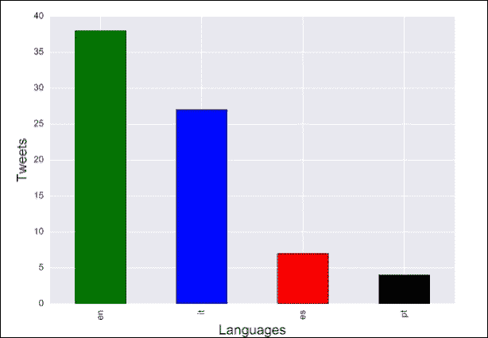

    太棒了！我想 Judy 会喜欢这个分析的。尽管预期中最常用的语言是英语（**en**），但看到其他三种语言是意大利语（**it**）、西班牙语（**es**）和葡萄牙语（**pt**）也非常有趣。这将是一个很酷的素材供她的文章使用。

    你从这个练习中获得的结果将取决于你运行数据收集程序的时间。例如，如果你在格林威治标准时间凌晨 2 点到 8 点之间运行它，你将看到更多来自中国或日本的推文，因为这些国家是白天。顺便说一句，分析人们发推文的最佳时间是否有趣？你可能会发现一些相关性。

1.  让我们更进一步，用这些数据做一些更酷的事情。我们是否可以对推文进行基于文本的分析，以获取消费者对这些产品的情感？这里的情感是指，推文是否在诅咒这些产品，赞赏产品的某个特性，或者只是随意的评论？但是等等；我们能否获取这类数据？是的，绝对可以。以下代码使用基于 Python 的 NTLK API 对推文（文本）进行情感分析，以确定其极性：正面、负面或中性情感。然后，它将数据分组以用条形图表示，并将其保存为 PDF 文件：

    ```py
            import json 
            import pandas as pd 
            import matplotlib.pyplot as plt 
            import seaborn as sns 
            import requests 

            tweets = [] 
            fh = open("twitter_data.txt", "r") 
            for data in fh: 
                try: 
                    tweets.append(json.loads(data)) 
                except: 
                    continue 

            probablities = pd.DataFrame() 
            prob = [] 
            for tweet in tweets: 
                text = tweet['text'] 
                r = requests.post(url="http://text-processing.com/api/sentiment/", 
                                  data={"text":text},) 
                print r.text 
                if r.status_code == 200: 
                    ans = json.loads(r.text) 
                    prob.append(ans["label"]) 
            probablities['data'] = map(lambda x: x, prob) 
            p_df = probablities['data'].value_counts() 

            fig, axis = plt.subplots() 
            sns.set_style("darkgrid") 
            axis.set_xlabel('Sentiments', fontsize=15) 
            axis.set_ylabel('Tweets' , fontsize=15) 
            clrs = ['green', 'yellow', 'red'] 
            sns_plot = p_df.plot(ax=axis, kind='bar', color=clrs) 
            plt.savefig('sentiments.pdf') 

    ```

    如果你运行前面的代码块，你将得到一个包含所有存储推文的情感数据的条形图。只需看一眼图表，你就能知道消费者普遍对这两个产品持正面评价：

    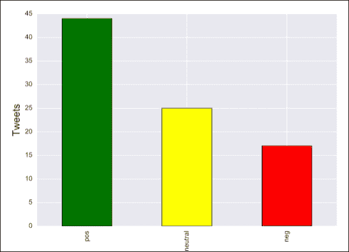

    关于它们有一些投诉，因此有负面极性的情感，但也有一些中性的评论，可能是产品推荐或对产品的评论。真不错！

虽然这很好，但你认为 Judy 可能想知道有多少负面推文是关于 iPhone 或 Note 的吗？我会把这个留给你；我相信你一定会为 Judy 解决这个问题。

## 它是如何工作的...

对于第一个问题，我们首先收集了分析所需的数据。Twitter 的流式 API 帮助我们实时收集这些信息。要使用流式 API，你需要注册一个 Twitter 开发者应用并收集你的消费者密钥、消费者密钥、认证令牌和认证密钥。这是一个简单的过程，可以在[`dev.twitter.com`](https://dev.twitter.com)上轻松查找。因此，在数据收集示例（这个菜谱中的第一个示例）中，我们实例化了`OAuthHandler`类以获取 Twitter 的授权对象`auth`，然后使用它通过`set_access_token()`方法设置授权令牌和密钥。Twitter 流式 API 的`Stream`类绑定到`listener`类，并返回`twitterStream`对象。`listener`类继承自`StreamListener`类，它将在`on_data()`方法中监控传入的推文并对到达的推文采取行动。推文的过滤是通过`twitterStream.filter()`方法完成的。

现在，我们知道传入的推文在`on_data()`方法中可用；我们将其挂钩以将推文存储在`twitter_data.txt`文件中。为此，我们以写入（`w`）模式打开文件，并使用`write()`方法将推文以 JSON 格式写入文件。这样，我们就完成了第一个菜谱，并收集了 Judy 所需的数据。现在，是时候进行分析了。

对于获取语言的第一个洞察，我们首先以读取（`r`）模式打开了`twitter_data.txt`文件。我们阅读了所有的推文（JSON 格式）并将它们追加到`tweets`数组中。使用`pandas`，我们创建了一个空的 DataFrame 对象`tweet_df`，使用`pd.DataFrame()`。通过 Python 的`map()`方法，我们对`tweets`数组进行了操作，并在我们的空 DataFrame 中添加了一个新的列`lang`。然后使用`value_counts()`方法获取分析推文下所有语言的计数，并存储在变量`tweets_by_lang`中。

代码的其他部分与往常一样，我们创建了一个`plt`对象，并使用`plot()`方法通过`seaborn`库生成条形图。我们使用`set_xlabel()`和`set_ylabel()`方法设置轴标签，并使用颜色`green`、`blue`、`red`和`black`来表示不同的语言。最后，我们使用`savefig()`方法将图表保存为 PDF 文件。

对于涉及情感分析的第二个洞察，我们首先阅读了`twitter_data.txt`中的所有推文，并将它们存储到`tweets`数组中。然后我们创建了一个空的数据框，`probabilities`，对所有的推文进行了情感分析，并将分析结果存储在`prob`数组中。接着，我们使用`prob`数组上的`map()`方法，为我们的空数据框添加了一个名为`text`的列。

我们的数据框`probabilities['text']`现在包含了所有我们分析的推文的情感。按照常规的操作步骤，我们得到了分析推文的`positive`、`negative`和`neutral`情感值的集合，并将它们绘制为条形图。

如果你查看这个食谱中的所有示例，我们将数据收集和分析的任务分为单独的程序。如果我们的可视化很大，我们甚至可以将它们分开。这确保了朱迪可以使用数据收集 Python 程序在未来为她文章的关键词集合收集信息。

她还可以通过修改我们的程序中的分析和可视化参数，对她的数据集进行分析。因此，对于她未来的所有文章，我们已经为她自动化了数据收集、分析和可视化过程。

我已经看到朱迪脸上露出了笑容。我希望你喜欢这一章。我坚信你在这一章中获得的知识将帮助你进入数据和可视化的世界。

## 还有更多...

在前面的食谱中，我们只是触及了基于文本的情感分析表面。情感分析涉及文本分类、分词、语义推理以及更多有趣的内容。我强烈建议你阅读一本关于 NLTK 的书，以了解更多关于在 Python 中使用文本的知识。[`www.nltk.org/book/`](http://www.nltk.org/book/)。
