# 第十一章 时间在时区中

时间计算既有趣又有趣味性，同时也令人厌烦。当你第一次学会读时间时很有趣，当你了解夏令时时很有趣，当客户抱怨无法通过你的 Web 应用程序安排跨时区的会议时就很烦人。

在本章中，我们将涵盖以下食谱：

+   处理时间、日期和日历

+   比较和组合日期，以及日期算术

+   日期的格式化和解析

+   处理时区计算

+   基于时区自动处理发票

# 简介

> "如果你热爱生命，就不要浪费时间，因为生命就是由时间构成的。" —— 李小龙*

时间是衡量一切的标准。我们生活中有很多事情要做，然而讽刺的是，我们手头的时间却如此之少。如今，我们直观地规划时间：我应该什么时间出行以避开交通，这项任务的截止日期是什么，以及其他许多事情。企业甚至在日历开始之前就计划了全年的活动。

时间计算无处不在。你想和你的澳大利亚同事安排会议吗？确保时区正确，找到一个对你和你的同事都合适的时间，然后安排它。你想编写代码在正确的时间为客户执行任务吗？管理数据库中的时间对象并跟踪所有用户的任务。即使在好莱坞电影《国家宝藏》中，尼古拉斯·凯奇也必须依赖时区计算来找到让他更接近宝藏的下一个线索。

实际上，无论你在哪里做什么，都无法逃避时间计算。在本章中，我们将使用 Python 中的`date`和`time`对象。我们还将学习如何在日期上执行算术运算以及处理时区计算。我们还将学习如何根据用户的时区自动处理业务流程。

在本章的整个过程中，我们将主要使用内置的 Python 模块。本章将使用以下内置模块：

+   `datetime` ([`docs.python.org/2/library/datetime.html`](https://docs.python.org/2/library/datetime.html))

+   `calendar` ([`docs.python.org/2/library/calendar.html`](https://docs.python.org/2/library/calendar.html))

我们还将使用这个外部模块来处理时区：

+   `pytz` ([`pytz.sourceforge.net/`](http://pytz.sourceforge.net/))

`pytz` 库将 Olson 时区数据库引入 Python。它允许在 Python 2 中进行准确和跨平台的时区计算。它还有助于进行夏令时的计算。

在我们进入食谱之前，让我们检查一下我们的 Python 安装中是否有相关的模块，以及在本章中安装我们需要的模块。我们首先为这一章创建一个虚拟环境并激活它：

```py
chetans-MacBookPro:ch12 Chetan$ virtualenv date
New python executable in date/bin/python2.7
Also creating executable in date/bin/python
Installing setuptools, pip, wheel...done.
chetans-MacBookPro:ch12 Chetan$ source date/bin/activate
(date)chetans-MacBookPro:ch12 Chetan$ 

```

现在，让我们使用 Python 的 `pip` 在我们的虚拟环境中安装 `pytz` 模块。一旦我们安装了模块，我们将继续进行第一个菜谱，并开始处理 `time` 和 `date` 对象：

```py
(date)chetans-MacBookPro:ch12 Chetan$ pip install pytz
Collecting pytz
 Using cached pytz-2016.7-py2.py3-none-any.whl
Installing collected packages: pytz
Successfully installed pytz-2016.7 

```

# 处理时间、日期和日历

在这个菜谱中，我们将使用内置的 Python 模块，我们不需要明确安装任何东西。所以让我们开始吧。

## 如何做...

1.  前往您最喜欢的编辑器，创建一个名为 `time_ex.py` 的文件，并在 Python 文件中编写以下代码：

    ```py
            import datetime 
            time_obj = datetime.time(13, 2, 23) 
            print "Time object is:", time_obj 
            print 'Hour  :', time_obj.hour 
            print 'Minute:', time_obj.minute 
            print 'Second:', time_obj.second 
            print 'Microsecond:', time_obj.microsecond 

    ```

    如果我们运行前面的 Python 代码，我们将看到以下输出。观察我们是如何使用 Python 创建给定的时间对象，并检索给定时间对象的 *小时、分钟、秒* 和 *微秒* 详细信息：

    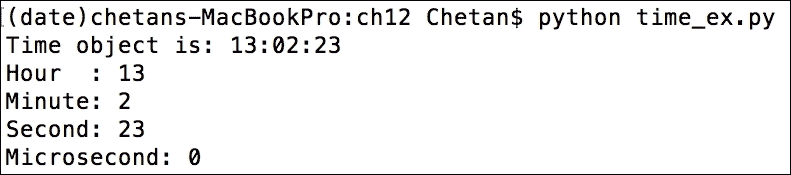

1.  Python 的 `Time` 类有一些可以用于时间计算的属性。例如，在以下代码片段中，我可以获取给定一天的有效时间范围：

    ```py
            import datetime 
            print "Time Attributes are:" 
            print "Earliest time of the day :", datetime.time.min 
            print "Latest time of the day :", datetime.time.max
    ```

    前一个代码片段的输出可以在以下截图中看到。观察我们是如何获取一天中最早和最晚可用时间：

    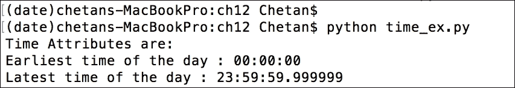

1.  棒极了！现在，让我们看看 `date` 对象。以下 Python 代码为您获取今天的日期。我们还可以使用以下代码检索 `year`、`month` 和 `day` 属性：

    ```py
            import datetime 
            today = datetime.date.today() 
            print 'Date object:', today 
            print 'Year:', today.year 
            print 'Mon :', today.month 
            print 'Day :', today.day
    ```

    前一个代码片段的输出显示在以下截图：

    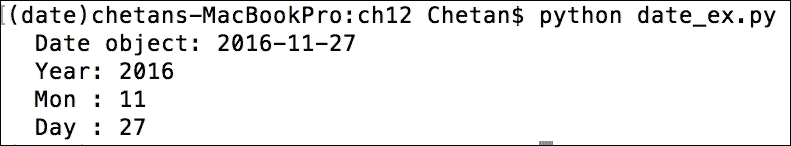

1.  好的，酷！我们还可以使用 Python 的 `date()` 和 `replace()` 方法创建一个新的 `date` 对象或修改现有的一个。以下代码演示了如何使用这些方法：

    ```py
            import datetime 
            date_1 = datetime.date(2011, 12, 31) 
            print '  Date is:', date_1 
            date_2 = date_1.replace(year=2012, month=1) 
            print '  New Date is:', date_2
    ```

    前一个代码片段的输出如下：

    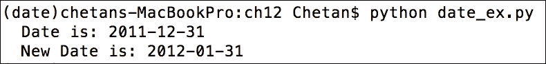

1.  太棒了！让我们继续前进，看看我们是否可以处理月份甚至年份。使用 Python，处理整个日历非常容易。以下代码在控制台上打印出整年的日历。在这种情况下，它返回 2017 年的日历。让我检查一下我的生日...哦，今年我的生日在星期二，我必须去办公室：

    ```py
            import calendar 
            from calendar import TextCalendar 
            cal = TextCalendar() 
            cal.pryear(2017) 
            cal.prmonth(2017, 11)
    ```

    前一个代码片段的输出显示在以下截图。第一个截图返回了 2017 年的完整日历：

    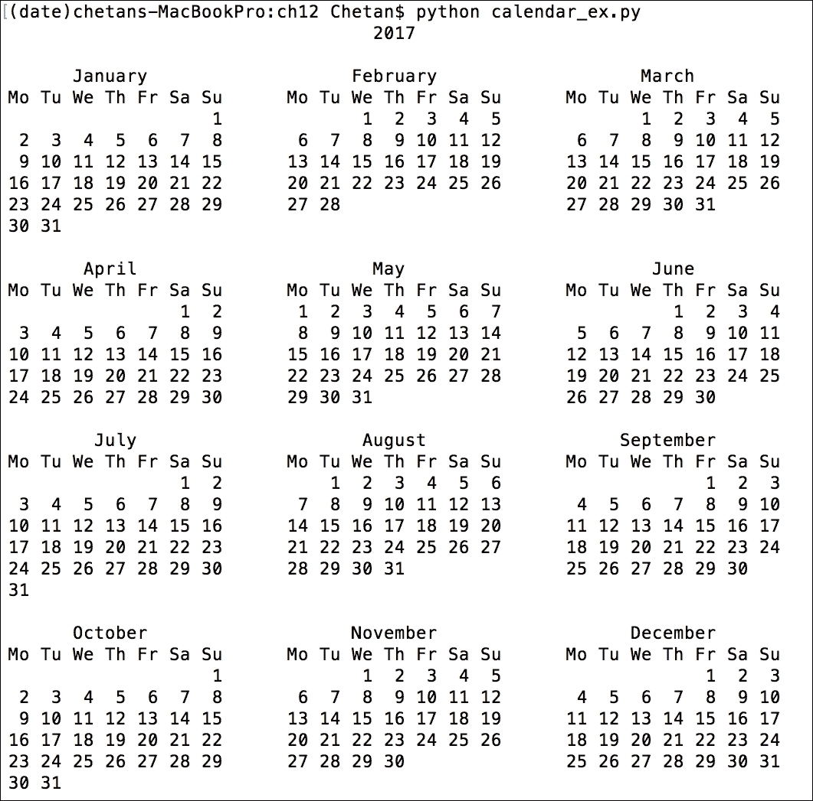

    以下截图仅返回 2017 年的第 11 个月份的日历，即 2017 年 11 月：

    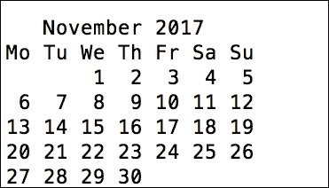

## 工作原理...

在这个菜谱中，我们开始处理 `time` 对象。我们使用 `datetime.time()` 方法创建了一个 `time` 对象，该方法接受小时、分钟和秒作为输入参数。我们还通过 `hour`、`minute` 和 `second` 属性读取时间对象，并使用 `datetime.time.min` 和 `datetime.time.max` 属性获取一天中的最早和最晚时间。

接下来，我们使用 `datetime.date()` 方法开始处理日期。我们使用 `datetime.date()` 方法获取今天的日期，并使用 `today.year`、`today.month` 和 `today.day` 属性打印今天的年、月和日。

我们还使用 `datetime.date()` 方法通过传递 `year`、`month` 和 `day` 作为参数创建了一个新的日期。一旦有了 `date` 对象，我们就使用 `replace()` 方法来获取新的日期。我们将 `year` 和 `month` 作为参数传递给 `replace()` 方法来创建新的 `date` 对象。

在本节中，我们还处理了 `calendar` 对象。我们使用 Python 安装中可用的 `calendar` 模块来完成此目的。首先，我们实例化了 `TextCalendar` 类来创建一个文本日历对象。然后，我们使用这个对象通过 `pryear()` 方法在控制台上打印 2017 年的日历。

我们还可以使用 `prmonth()` 方法仅显示 2017 年 11 月的日历。太棒了！

# 比较和组合日期和时间对象，以及日期算术

创建 `date` 对象并使用它们是很好的，但我们需要执行的业务用例中的任务通常与比较或计算日期和时间对象的差异有关。在这个菜谱中，我们将学习如何在 Python 中执行这些操作。然而，需要注意的是，在这个菜谱中我们将看到一个主要的变化。在上一个菜谱中，我们独立地处理时间和日期对象。但 Python 的 `datetime` 模块提供了很大的便利，从某种意义上说，我们可以处理包含日期和时间属性的多个对象。你将在“如何做”部分看到这个差异。

## 准备工作

在这个菜谱中，我们将使用 `datetime` Python 模块，这是我们之前几个示例中使用的。对于这个菜谱，我们不需要进行任何新的安装。

## 如何做...

1.  让我们先获取两个 datetime 对象之间的差异。以下代码执行此操作并计算两个 `datetime` 对象之间的差异。尽管这个操作只告诉你秒数的差异，但你也可以使用这些来获取月份或年份的差异。在下面的屏幕截图中，注意 `datetime.now()` 返回一个包含今天日期和当前时间的字符串。重要的是要理解我们正在处理一个包含日期和时间属性的多个对象。如果你这么想，在现实世界中，当我们需要计算两个事件之间的时间差异时，同时处理日期和时间对象将对我们最有用。即使我们独立地处理日期对象或时间对象，我们最终也会执行与使用 datetime 对象相同的计算，所以想象一下这种方法带来的好处：

    ```py
            from datetime import datetime 
            import time 
            now_1 = datetime.now() 
            print "  Time Now", now_1 
            time.sleep(5) 
            now_2 = datetime.now() 
            print "  Time Now", now_2 
            print "  Difference in the times is:", (now_2 - now_1).seconds 

    ```

    前一个代码片段的输出显示在下面的屏幕截图中。看看我们是如何获取两个 datetime 对象之间的秒数的差异：

    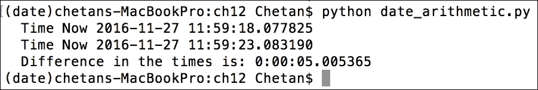

1.  这很好，但你可能会问，如果`datetime`对象之间的差异是负数会发生什么。在这个例子中，如果我们计算`now_1 - now_2`，我们会得到一个很大的数字，而不是实际的差异。为此，我们有一个很好的技巧来获取两个`datetime`对象之间的差异。我们可以使用`(now_1 - now_2).total_seconds()`来获取负值，即`-5`秒。

1.  好的，现在让我们继续对`datetime`对象进行更多计算。例如，从过去或未来获取时间怎么样？以下代码帮助我们执行这些操作；看看我们是如何获取当前日期和时间的，以及如何返回明天的日期和时间：

    ```py
            from datetime import datetime, timedelta 
            now = datetime.now() 
            print "  Time Now is:", now 
            one_day_later = now + timedelta(days=1) 
            print "  Tomorrow is:", one_day_later
    ```

    上一段代码的输出如下：

    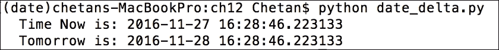

1.  如果我们想要获取过去的时间，我们可以用以下代码片段中的方式来做：

    ```py
            from datetime import datetime, timedelta 
            now = datetime.now() 
            print "  Time Now is:", now 
            days_in_past = now - timedelta(days=365, hours=1) 
            print "  Last year:", days_in_past
    ```

    上一段代码的输出在以下屏幕截图中展示。注意，我们请求的是一个过去的日期，即 365 天前。然而，它显示的是 2015 年 11 月 28 日。为什么？难道不应该显示同一天吗？哦，当然，2016 年是闰年！

    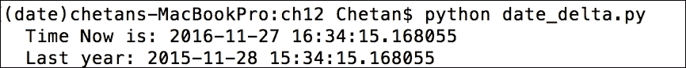

1.  好的，现在我们熟悉了如何获取`date`和`time`对象之间的差异或添加时间。但我们也经常需要比较时间，对吧？让我们通过一个代码片段来学习这一点。以下 Python 代码分别比较了`time`和`date`对象：

    ```py
            import datetime 

            time_1 = datetime.time(8, 9, 10) 
            print "  Time 1:", time_1 
            time_2 = datetime.time(13, 19, 50) 
            print "  Time 2:", time_2 
            print "  Comparing times: time_2 > time_1?", time_2 > time_1 

            date_1 = datetime.date.today() 
            print "  Date 1:", date_1 
            date_2 = date_1 + datetime.timedelta(days=2) 
            print "  Date 2:", date_2 
            print "  Comparing dates: date_1 > date_2?", date_1 > date_2 

    ```

    上一段代码的输出可以在以下屏幕截图中看到：

    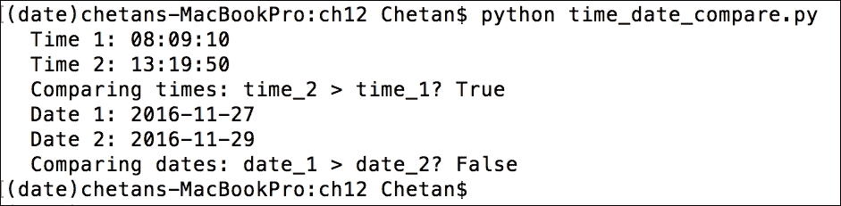

1.  正如我们在前面的菜谱中看到的，你也觉得需要将你的`time`对象与`date`对象结合起来。例如，你为某个用例开发了你的程序，你想要比较`time`对象并采取一些行动。但你也可能最终需要进行日期比较，因为你要比较的`time`对象在不同的日期上。既然你已经知道如何轻松地处理`datetime`对象，你可能想要将你的`time`和`date`对象组合成一个单一的`datetime`对象，并轻松地处理它们。我们可以很容易地在 Python 中实现这一点；以下代码演示了如何将独立的时间和日期组合到`datetime`对象中：

    ```py
            import datetime 

            time_1 = datetime.time(13, 44, 55) 
            time_2 = datetime.time(13, 44, 55) 
            print "  Times:", time_1, time_2 

            date_1 = datetime.date.today() 
            date_2 = date_1 + datetime.timedelta(days=1) 
            print "  Dates:", date_1, date_2 

            datetime_1 = datetime.datetime.combine(date_1, time_1) 
            datetime_2 = datetime.datetime.combine(date_2, time_2) 
            print "  Datetime Difference:", datetime_2 - datetime_1
    ```

    上一段代码的输出如下：

    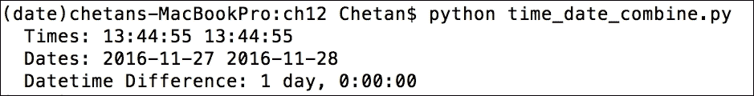

## 它是如何工作的...

在上一节中，我们独立地处理了`time`、`date`和`calendar`对象。在本菜谱中，我们开始处理完整的`datetime`对象。

在本菜谱的第一个代码示例中，我们计算了`datetime`对象之间的差异。我们可以用我们熟悉的相同减法(`-`)运算符轻松做到这一点。这意味着`__sub__()`方法已被`datetime`类覆盖。

然后，在第二个和第三个代码片段中，我们使用了`timedelta()`方法来获取未来的`datetime`对象或移动到过去。`timedelta()`方法支持方便命名的属性，如`days`或`hours`，可以将当前的`datetime`对象移动到过去或未来。我们使用`- timedelta()`到达过去，使用`+ timedelta()`操作前进。

接下来，我们了解了如何比较`datetime`对象。这同样像任何其他 Python 对象一样简单完成。在 Python 中，我们使用`<`和`>`运算符分别检查一个整数是否小于或大于另一个整数。对于`datetime`对象也是如此。我们只需使用这些运算符来比较即使是`datetime`对象。

最后，我们探讨了需要处理`date`和`time`对象以获取差异或比较它们的使用场景。为此，我们编写了 Python 代码来组合`date`和`time`对象，并使用了`datetime.combine()`方法。这确保了比较或差异操作可以轻松地在`datetime`对象上执行，而不是在单独的`date`或`time`对象上执行然后合并结果。

# 日期和时间的格式化与解析

在迄今为止的所有菜谱中，我们对`date`或`time`对象执行了多次操作。但对象本身是以特定格式表示的。例如，默认情况下，`date()`对象以 YYYY-MM-DD 格式表示，而`time()`对象以 HH:MM:SS 格式表示。虽然这些表示方式很好，但我们不能总是使用这些格式来向用户在网站上表示数据或从网页安排会议。

在本节中，我们快速查看`date`和`time`对象可以呈现给用户的不同格式。

## 准备工作

对于这个菜谱，我们最终使用了与默认 Python 安装捆绑的相同`datetime`模块。

## 如何实现...

1.  让我们从我们已知的内容开始。以下 Python 代码将以 ISO 格式打印日期和时间。这种格式是全球最常用的格式，并且被普遍接受：

    ```py
            import datetime 
            today = datetime.datetime.today() 
            print "  ISO datetime: ", today 

    ```

1.  然而，正如你可能已经想象到的，这种格式并不太易读。例如，它以数字形式读取月份（11 代表 11 月）并返回时间，甚至精确到微秒（我认为这并不非常有用）。那么，有没有格式可以解决这些问题，使日期更易读呢？是的，我们可以通过以下代码片段轻松实现这一点。在这个代码中，借助某些格式说明符，例如`'%b'`，我们成功使月份变得可读：

    ```py
            import datetime 
            today = datetime.datetime.today() 
            print "  ISO datetime: ", today 

            format = "%a %b %d %H:%M:%S %Y" 
            string_format = today.strftime(format) 
            print "  Datetime in String format:", string_format 

    ```

1.  你一定见过一些使用 Unix 时间戳或纪元的 Web 应用程序来存储时间。尽管这是一种存储对象的好方法，但你仍然需要以用户理解的方式表示实际的时间或日期。

1.  Unix 时间，也称为 POSIX 时间或纪元时间，是一种描述时间的系统，定义为自 1970 年 1 月 1 日星期四 00:00:00 UTC 以来经过的秒数。Unix 时间戳很有用，因为它们代表与时区无关的时间。例如，Unix 时间可以表示伦敦的下午 1:00 和纽约的上午 8:00。

    以下代码片段展示了如何将时间戳转换为 `datetime` 对象，反之亦然：

    ```py
            import datetime 
            import time 

            time_1 = time.time() 
            print "  Datetime from unix timestamp:",
            datetime.datetime.fromtimestamp(1284101485) 

            date_1 = datetime.datetime(2012,4,1,0,0) 
            print "  Unix timestamp", date_1.strftime('%s')  

    ```

1.  `datetime` 对象的另一种有趣表示方式是显示从世界开始以来的第 *n* 天的日期。例如，你能打印出 0001 年 1 月 1 日之后的第 1000 天的日期吗？这是与儒略日历相对应的日期，其中 01/01/01 的序数为 1：

    ```py
            import datetime 
            date_1 = datetime.date.fromordinal(1000) 
            print "  1000th day from 1 Jan 0001: ", date_1 

    ```

    如果您运行前面的 Python 代码片段，您将能够看到如下截图中的所需对象：

    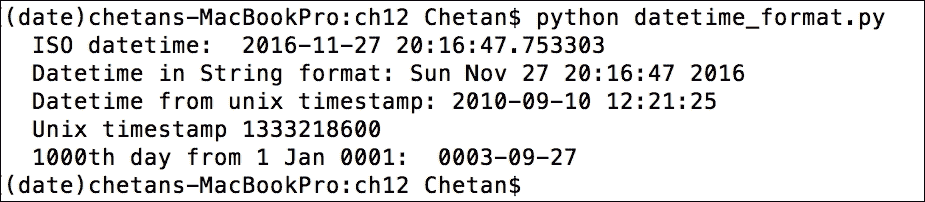

## 它是如何工作的...

在这个菜谱中，我们探讨了表示 `datetime` 对象的各种方法。在第一个示例中，我们以 ISO 格式打印了日期和时间。这是最常用的格式，您可以在 [`en.wikipedia.org/wiki/ISO_8601`](https://en.wikipedia.org/wiki/ISO_8601) 上了解更多关于 ISO 格式的信息。如您所见，我们不需要使用新方法来表示这一点；我们只是简单地使用 `datetime.today()` 来获取 ISO 格式的日期。

在第二个示例中，我们探讨了定义字符串格式中表示日期的自定义格式。我们使用了格式说明符，如 `%a`、`%b` 和 `%d` 来处理日期，以及 `%H`、`%M` 和 `%S` 来处理时间。我们在 `format` 变量中指定了格式，并使用它将其传递给 `strftime()` 方法，该方法将 ISO `datetime` 对象格式化为我们的自定义字符串格式。

下两个示例帮助我们将 Unix 时间戳或纪元转换为 `datetime` 对象，反之亦然。对于第一个用例，我们使用 `datetime.fromtimestamp(<unixtimestamp>)` 方法将 Unix 时间戳转换为 `datetime` 对象，在随后的示例中，我们使用 `strftime()` 方法将 `datetime` 对象转换为 Unix 时间戳。本例中使用的 Unix 时间（1284101485）是自 1970 年 1 月 1 日以来的秒数。

在最后一个有趣示例中，我们使用 `fromordinal()` 方法获取公历日历的日期和时间。您很可能不会使用此方法，但我将其包含在本章中，以便您了解一个有趣的日期格式。

# 处理时区计算

你在`date`或`time`对象上必须执行的最复杂的计算之一就是涉及时区的计算。你的同事在旧金山工作，而你则在悉尼，你打算如何安排电话会议？当你安排会议时，你应该意识到你同事的时区，否则你可能会为悉尼时间晚上 8 点安排会议，而对你同事在旧金山来说，这已经是午夜之后了。时区计算通常很繁琐，在开发商业应用程序时需要谨慎处理。让我们看看 Python 如何在这方面帮助我们。

## 准备工作

对于这个菜谱，我们将使用我们在本章开头安装的`pytz`模块。实际上，Python 标准库没有时区库，但我们可以完全依赖 Python 社区贡献的模块来满足我们的需求。

## 如何做到这一点...

你需要执行以下步骤：

1.  让我们从获取 UTC 时间的简单操作开始。**UTC**代表**通用时间转换器**，是全球调节时钟和时间测量的标准。UTC 也普遍被称为格林尼治标准时间（GMT）。

    ```py
            from datetime import datetime, timedelta 
            now = datetime.now() 
            print "  Local time now is:", now 
            utcnow = datetime.utcnow() 
            print "  UTC time now is:", utcnow
    ```

    上一段代码片段的输出显示在下述屏幕截图中。看看我的本地时间比协调世界时（UTC）快 5 小时 30 分钟：

    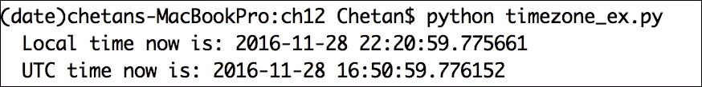

1.  好的，这很好。所以，你可以将你的本地时间转换为 UTC，但这并不总是足够的。你的客户（为你的应用程序开发）可能来自世界各地。他们的账户也需要根据他们的时区和本地时间进行管理。让我们看看我们如何确定给定时区的用户本地时间：

    ```py
            from pytz import timezone 
            import pytz 
            utc = pytz.utc 
            print "  Selected time zone:", utc 
            eastern = timezone('US/Eastern') 
            print "  Switched to time zone:", eastern 
            loc_dt = datetime(2016, 11, 27, 12, 0, 0, tzinfo=pytz.utc) 
            est = loc_dt.astimezone(eastern) 
            fmt = '%Y-%m-%d %H:%M:%S %Z%z' 
            print "  Local time in Eastern time zone:", est.strftime(fmt)
    ```

    上一段代码的输出显示在下述屏幕截图中。观察我们是如何通过获取东部时区将本地 UTC 时间转换为**东部标准时间**（**EST**）的。实际上，UTC 是跨时区转换时间的最佳方式：

    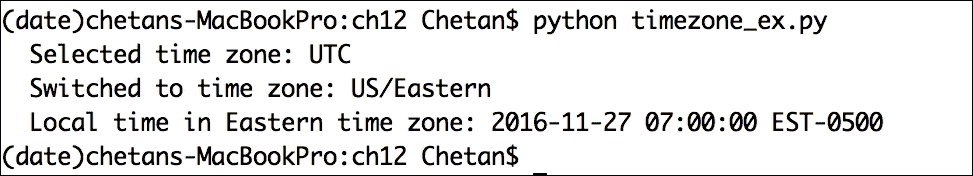

1.  在 Python 中对带有时区信息的`datetime`对象执行算术计算也是简单的。看看以下代码，看看我们是如何在`date`对象上执行算术运算的：

    ```py
            from datetime import datetime, timedelta 
            au_tz = timezone('Australia/Sydney') 
            local = datetime(2002, 10, 27, 6, 0, 0, tzinfo=au_tz) 
            print "  Local time in Sydney:", local 
            past = local - timedelta(minutes=10) 
            print "  10 minutes before time was:", past 
            future = local + timedelta(hours=18) 
            print "  18 hours later it is:", future
    ```

    现在，如果我们在这个 Python 解释器上运行这段代码，我们会得到以下输出：

    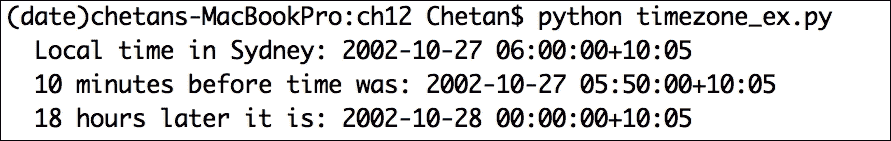

1.  我们在讨论时区时，如果不真正谈论这一点，怎么能算完成呢？对吧？是的，我们如何在时区计算中处理夏令时？感谢本杰明·富兰克林为世界带来的夏令时礼物。让我们通过一个代码示例来理解这一点：

    ```py
            eastern = timezone('US/Eastern') 
            dt = datetime(2016, 11, 06, 1, 30, 0) 
            dt1 = eastern.localize(dt, is_dst=True) 
            print "  Date time 1 with day light savings:", dt1.strftime(fmt) 
            dt2 = eastern.localize(dt, is_dst=False) 
            print "  Date time 2 without day light savings:", dt2.strftime(fmt)
    ```

    如果你运行代码片段，你会看到两个以字符串格式表示的`datetime`对象。第一个考虑了夏令时，而第二个则不考虑。2016 年 11 月 6 日是今年东部时区结束夏令时，时钟往回拨：

    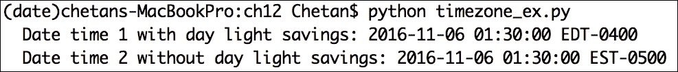

1.  最后，`pytz` 模块中还有一些有用的辅助方法，例如，根据 ISO 国家代码获取给定国家的时区，或者简单地从 ISO 国家代码中获取国家名称。让我们看看以下示例：

    ```py
            tz_au = '\n  '.join(pytz.country_timezones['au']) 
            print "  Time zones in Australia:", tz_au 
            country_gb, country_fr = pytz.country_names['gb'], 
                                    pytz.country_names['fr'] 
           print "\n  Country names are:\n", "  ", 
           country_gb, "\n  ", "  ", country_gb, "\n  ", country_fr
    ```

    上述代码片段的输出可以在以下屏幕截图中进行查看：

    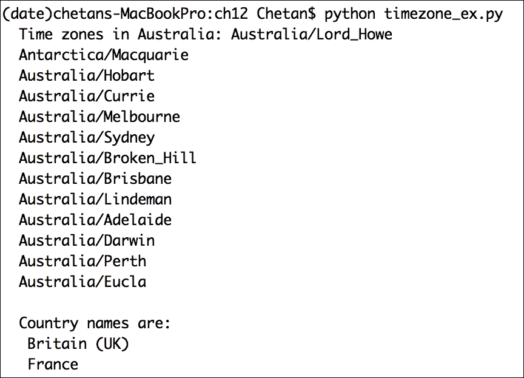

## 它是如何工作的...

在这个配方中，我们探讨了处理时区的各种方法，这对于日期时间计算至关重要。在这个配方的第一个代码示例中，我们使用 `datetime.now()` 计算当前本地时间，然后使用 `datetime.utcnow()` 获取相同的 UTC 本地时间。`utcnow()` 方法在需要将日期时间对象存储到数据库以进行进一步处理时（例如安排事件）变得非常有用。

接下来，我们探讨了如何切换到不同的时区并检索该时区的本地时间。`pytz` 类有一个简单的属性 `utc`，用于将时区设置为 UTC；我们使用它将当前时区设置为 UTC。稍后，我们使用 `pytz` 模块的 `timezone()` 方法通过 `timezone('US/Eastern')` 切换到东部时区。

在此之前的所有配方中，我们都是使用 `datetime()` 方法创建 `datetime` 对象；在这个配方中，我们也使用了 `datetime` 方法，但这次使用了 `tzinfo` 参数，如下所示：`datetime(YYYY, MM, DD, HH, MM, SS, tzinfo=<timezone>)`。`tzinfo` 参数确保将时区信息添加到 `datetime` 对象中，这在跨时区进行计算时非常重要。

`datetime` 类还有一个方便的方法，可以将 `datetime` 对象表示为我们选择的时区：`astimezone()` 方法。使用此方法，我们使用以下代码将 UTC `datetime` 对象转换为东部时间：`loc_dt.astimezone(eastern)`。

最后，我们使用 `strftime(format)` 方法创建了一个自定义字符串格式来表示东部时间。

我们还可以在时区计算中添加或删除时间/天数，就像我们在 `datetime` 对象中所做的那样。在这个配方的第三个代码示例中，我们切换到澳大利亚/悉尼时区并创建了一个该时区的 `datetime` 对象；这个操作返回了悉尼的本地时间。借助 `timedelta()` 方法，我们随后从本地时间中减去十分钟，使用 `local - timedelta(mins=10)`，并且通过 `local + timedelta(hours=18)` 向时间中添加了 18 小时。这样，我们就可以访问过去或未来的时间。把它想象成时间旅行。

在第四个代码片段中，我们了解了如何处理夏令时。为了理解这一点，我们创建了一个没有任何时区信息的`datetime`对象，并将其分配给`dt`变量。我们还使用代码`eastern = timezone('US/Eastern')`创建了一个东部时区的时区对象。然后我们使用时区对象的`localize()`方法将`dt`对象转换为东部时间。在这里，我们向`localize(is_dst=<True/False>)`方法添加了另一个参数`is_dst`，以返回东部时区的本地时间，考虑或不考虑夏令时。

在 2016 年，11 月 6 日是时钟在凌晨 2 点倒回的那一天。所以，在我们的例子中，当我们用`is_dst=True`查询东部时间 1:30 am 时，它返回的是**东部夏令时**（**EDT**），比**协调世界时**（UTC-0400 小时）慢四小时。当我们用`is_dst=False`查询同一时间时，它返回的是 EST，即 UTC-0500 小时。

在这个菜谱的最后一个例子中，我们查看了一些`pytz`模块提供的有用辅助方法。例如，`pytz.country_timezones['au']`返回了在澳大利亚（Au）中所有可用的时区，而`pytz.country_names['gb']`根据 ISO 国家代码`gb`返回了国家名称，即英国（UK）。当你实际解决一些时区问题时，你会意识到这些库的实用性。

# 根据用户时区自动化发票

雅各布是北美安齐公司（Anzee Corporation）的财务经理，负责客户发票工作。安齐公司为其客户提供**软件即服务**（**SaaS**）平台，并按平台使用情况向客户收费。安齐的客户对错误的月度发票提出了投诉。他们表示，“*上个月的发票在次月的 1 号可用，这没问题，但我们的部分使用情况没有被计入。这搞砸了我们的会计工作。*”

目前，雅各布通过从平台数据库记录中获取客户支付和平台使用数据来手动生成发票。随着每月客户数量的增加，雅各布意识到手动流程将会非常耗时费力。他还希望有人能关注客户投诉的问题。我们能帮助雅各布吗？

## 准备工作

在这个菜谱中，我们将使用在之前菜谱中用过的所有内置 Python 模块，以及安装`fpdf`模块来生成 PDF 发票，以满足雅各布为客户准备发票的自动化需求。我们使用 Python `pip`来安装该模块：

```py
 (date)chetans-MacBookPro:ch12 Chetan$ pip install fpdf 
        You are using pip version 7.1.0, however version 9.0.1 is
        available. 
        You should consider upgrading via the 
            'pip install --upgrade pip' command. 
        Collecting fpdf 
        Downloading fpdf-1.7.2.tar.gz 
        Building wheels for collected packages: fpdf 
        Running setup.py bdist_wheel for fpdf 
        Stored in directory: /Users/chetan/Library/Caches/pip/wheels/
        c9/22/63/16731bdbcccd4a91f5f9e9bea98b1e51855a678f2c6510ae76 
        Successfully built fpdf 
        Installing collected packages: fpdf 
        Successfully installed fpdf-1.7.2

```

## 如何操作...

1.  让我们从查看数据库记录开始。安齐公司使用 MongoDB 来存储客户支付和月度费用的记录。在这个例子中，假设安齐公司的支付记录以 JSON 格式存储。

1.  我们使用一个`users`文档，其中包含所有用户的列表，具有`id`、`name`、`city`和`timezone`等字段，就像任何其他用户表一样。它还在`payments`中维护用户的所有支付记录，其中包含为平台服务付费的用户 ID、支付金额和支付金额的日期。

1.  所有支付的日期时间戳都是 UTC 格式。像支付一样，它还维护了`usage`记录，这些记录再次包含使用该平台的人的用户 ID、她因使用而支付的费用以及她被收费的时间：

    ```py
            users = [{"id":12, "name":"John", "city":"New York",
                      "timezone":"US/Eastern"}, 
                     {"id":13, "name":"Johny", "city":"Indiana",
                      "timezone":"US/Central"}] 

            #All time stamps are in UTC 
            payments = [{"id":12, "amount":12.00, 
                         "created_at":"2016-11-29T11:46:07.141Z"}, 
                        {"id":13, "amount":22.00, 
                         "created_at":"2016-11-30T23:46:07.141Z"}, 
                        {"id":12, "amount":5.00, 
                         "created_at":"2016-12-01T01:00:00.141Z"}] 

            usage = [{"id":12, "charge":5.00, 
                      "created_at":"2016-11-29T11:46:07.141Z"}] 

    ```

1.  好的，很酷，现在我们有了所有数据，让我们着手编写生成我们发票的代码。我们首先编写方法来获取给定月份用户的支付和用量。以下代码片段为我们完成这项任务：

    ```py
            user_ids = [] 
            user_names = [] 
            for usr in users: 
            user_ids.append(usr["id"]) 
            user_names.append(usr["name"]) 

            def get_payments(user_id, month):
                tz = [ x for x in users if x["id"] == user_id] 
                tot_payment = 0.00 
                for p in payments: 
                    dt = datetime.strptime(p["created_at"], 
                                           '%Y-%m-%dT%H:%M:%S.%fZ') 
                    if p["id"] == user_id and dt.month == month: 
                       tot_payment += p["amount"] 
                return tot_payment 

            def get_usage(user_id, month): 
            tz = [ x for x in users if x["id"] == user_id]
                tot_usage = 0.00 
                for u in usage: 
                  dt = datetime.strptime(u["created_at"], 
                                         '%Y-%m-%dT%H:%M:%S.%fZ') 
                  if u["id"] == user_id and dt.month == month: 
                     tot_usage += u["charge"] 
                return tot_usage 

    ```

1.  接下来，让我们编写代码以自动生成 PDF 发票，正如雅各布为他自己的平台所希望的那样。我们为此目的使用`fpdf`模块。以下代码生成了发票：

    ```py
            def get_invoice(user_name, user_id, month): 
                html = """ 
            <p>Anzee Corporation</p><br> 
            <b><p>Account Name: """ + user_name + """</p> 
            <p>Invoice for month of: """ + 
               str(calendar.month_name[month]) + """</p></b> 
            <br><br> 
            <p><b>Payments and Usage:</b></p> 
            <table align="center" width="50%"> 
              <thead> 
                <tr> 
                  <th align="left" width="50%">Charge Type</th> 
                  <th align="right" width="50%">Amount</th> 
                </tr> 
              </thead> 
              <tbody> 
                <tr> 
                  <td>Payments Done</td> 
                  <td align="right">$""" + str(get_payments
                                   (user_id, month)) + """</td> 
                </tr> 
                <tr> 
                  <td>Total Usage</td> 
                  <td align="right">$""" + str(get_usage
                                   (user_id, month)) + """</td> 
                </tr> 
              </tbody> 
            </table> 
            <br><br> 
              """ 
              return html 

            class MyFPDF(FPDF, HTMLMixin): 
            pass 

            html = get_invoice("John", 12, 11) 
            pdf=MyFPDF() 
            pdf.add_page() 
            pdf.write_html(html) 
            pdf.output('invoice.pdf','F')  

    ```

1.  如果我们完整地运行前面的代码片段，我们将得到生成的发票，其外观如下所示：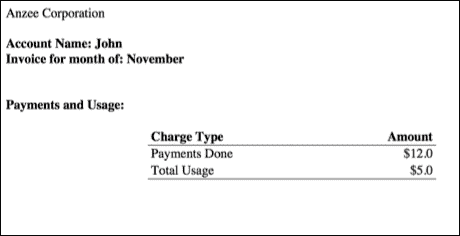

1.  好的，这很酷！我们能够像雅各布期望的那样生成发票。我们现在能够通过自动化整个过程为他节省大量时间。但随后他希望我们查看有关发票不包含准确信息的客户投诉。让我们看看可能发生了什么。

1.  现在，Anzee 公司存储所有交易和用量时间戳为 UTC，这样他们就可以很容易地检索时间并根据用户的时区向用户展示。因此，当我们查找该月的所有记录以获取发票中的交易时，我们查看的是 UTC 时间戳，而不是用户的时区时间。

1.  例如，如果你深入查看 JSON 数据，会提到约翰（John）用户 ID 为 12 的另一次支付，其`created_at`时间戳为`2016-12-01T01:00:00.141Z`。从 UTC 的角度来看，这个时间可能不属于 11 月份，但进行支付的用户属于美国/东部时区。因此，2016 年 12 月 1 日凌晨 1 点 UTC 实际上是 11 月 30 日下午 8 点东部时区。显然，用户没有在他的发票中看到他的支付。

1.  以下代码片段通过根据用户时区生成发票来解决该问题：

    ```py
            from datetime import datetime 
            import pytz 
            from pytz import timezone 
            from fpdf import FPDF, HTMLMixin 
            import calendar 

            users = [{"id":12, "name":"John", 
                      "city":"New York", "timezone":"US/Eastern"}, 
                     {"id":13, "name":"Johny", 
                      "city":"Indiana", "timezone":"US/Central"}] 

            #All time stamps are in UTC 
            payments = [{"id":12, "amount":12.00, 
                         "created_at":"2016-11-29T11:46:07.141Z"}, 
                        {"id":13, "amount":22.00, 
                         "created_at":"2016-11-30T23:46:07.141Z"}, 
                        {"id":12, "amount":5.00, 
                         "created_at":"2016-12-01T01:00:00.141Z"}] 
            usage = [{"id":12, "charge":5.00, 
                      "created_at":"2016-11-29T11:46:07.141Z"}] 

            user_ids = [] 
            user_names = [] 
            for usr in users: 
                user_ids.append(usr["id"]) 
            user_names.append(usr["name"]) 

            def get_payments(user_id, month): 
                tz = [ x for x in users if x["id"] == user_id] 
                tot_payment = 0.00 
                for p in payments: 
                    dt = datetime.strptime(p["created_at"], 
                                   '%Y-%m-%dT%H:%M:%S.%fZ') 
                    dt = dt.replace(tzinfo=pytz.UTC) 
                    dt = dt.astimezone(timezone(tz[0]["timezone"])) 
                    if p["id"] == user_id and dt.month == month: 
                       tot_payment += p["amount"] 
                return tot_payment 

            def get_usage(user_id, month): 
                tz = [ x for x in users if x["id"] == user_id] 
                tot_usage = 0.00 
                for u in usage: 
                    dt = datetime.strptime(u["created_at"], 
                                   '%Y-%m-%dT%H:%M:%S.%fZ') 
                    dt = dt.replace(tzinfo=pytz.UTC) 
                    dt = dt.astimezone(timezone(tz[0]["timezone"])) 
                    if u["id"] == user_id and dt.month == month: 
                       tot_usage += u["charge"] 
            return tot_usage 

            def get_invoice(user_name, user_id, month): 
              html = """ 
            <p>Anzee Corporation</p><br> 
            <b><p>Account Name: """ + user_name + """</p> 
            <p>Invoice for month of: """ + 
               str(calendar.month_name[month]) + """</p></b> 
            <br><br> 
            <p><b>Payments and Usage:</b></p> 
            <table align="center" width="50%"> 
              <thead> 
                <tr> 
                  <th align="left" width="50%">Charge Type</th> 
                  <th align="right" width="50%">Amount</th> 
                </tr> 
              </thead> 
              <tbody> 
                <tr> 
                  <td>Payments Done</td> 
                  <td align="right">$""" + str(get_payments(
                                 user_id, month)) + """</td> 
                </tr> 
                <tr> 
                  <td>Total Usage</td> 
                  <td align="right">$""" + str(get_usage(
                              user_id, month)) + """</td> 
                </tr> 
              </tbody> 
            </table> 
            <br><br> 
              """ 
              return html 

            class MyFPDF(FPDF, HTMLMixin): 
                  pass 

            html = get_invoice("John", 12, 11) 
            pdf=MyFPDF() 
            pdf.add_page() 
            pdf.write_html(html) 
            pdf.output('invoice.pdf','F') 

    ```

    前面代码片段的输出显示在以下屏幕截图。看看现在支付列如何反映了正确的数据，并包括 2016 年 11 月 30 日下午 8 点进行的 5 美元支付，总额达到*$12 + $5 = $17*：

    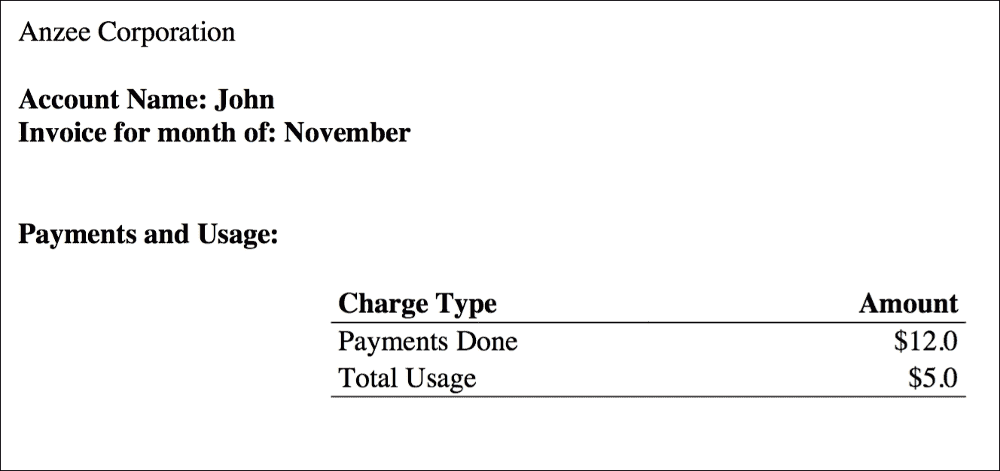

## 它是如何工作的...

我们首先研究了为雅各布自动化发票生成的方法。我们解析了所有用户的 JSON 数据，并计算了 11 月份所有用户的支付和用量。

我们开发了`get_payments(user_id, month)`和`get_usage(user_id, month)`函数，用于遍历`payments`和`usage`记录，并选择了 11 月份的记录。我们通过处理`created_at` JSON 字符串并将它们转换为日期/时间对象来实现这一点，使用`dt = datetime.strptime(u["created_at"], '%Y-%m-%dT%H:%M:%S.%fZ')`。

但正如我们在上一节中理解的，仅仅将字符串转换为时间戳并没有帮助，因为我们没有考虑到用户的时区。为此，我们使用日期/时间对象`dt`，通过`dt.replace(tzinfo=pytz.UTC)`将其转换为 UTC 时区，然后使用`dt.astimezone(timezone(<>))`方法将`dt`转换为反映用户时区的时间。这样，我们就可以获取用户时区的支付时间，并且发票数据正确反映了 11 月份的数据。

接下来，我们通过添加适当的用户名、发票时间和存储在`html`变量中，创建了发票的 HTML 内容。随后，我们创建了一个名为`MyFPDF`的类，它从`fpdf`模块继承了`FPDF`和`HTMLMixin`类。然后，我们使用`MyFPDP`类创建了一个`pdf`对象，它代表了一个空的 PDF 文件对象。我们使用`add_page()`方法向`pdf`对象添加了一页，并使用`write_html(html)`方法用 HTML 内容（我们的发票内容）更新了它。最终，我们使用`output(<filename>)`方法将包含所有数据的`pdf`对象输出到磁盘上。

## 还有更多...

在 Python 中，有许多其他有趣的用例涉及时间和时区操作。如果不正确使用，可能会变得复杂，正如我们在上一个示例中看到的那样。作为一个一般性的指导原则，我建议您：

+   总是使用时区感知的`datetime`对象。这种方法永远不会出错。它将始终作为您的提醒。

+   以 ISO 格式返回给定对象的时区信息。

希望您喜欢这一章，并享受了这些示例！请继续关注。
