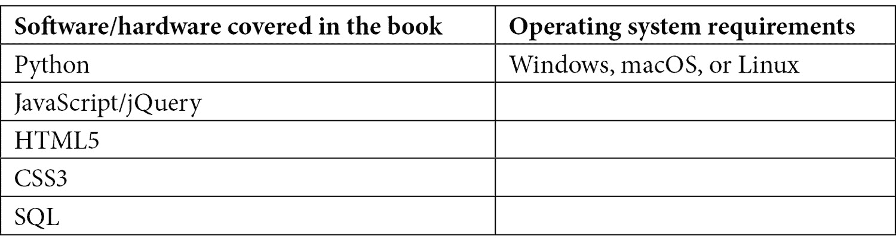

# 前言

Django 是一个内置了前端工具的后端框架，旨在帮助开发者快速轻松地构建应用。它旨在减少 Web 开发的繁琐工作，以便开发者可以更多地关注他们正在构建的功能，而不是他们面临的问题。Django 内置了数十种工具，并与无数的第三方 Python 包相结合，提供了许多开箱即用的功能和组件。

Django 框架在设计时考虑了可扩展性和多功能性。随着需求和流量的增长，您的项目也可以相应增长。这使得开发者可以轻松地构建到现有系统中。安全性也是 Django 非常重视的方面，它通过在其框架中直接构建许多不同的安全措施来帮助开发者避免在安全性方面犯常见错误。它甚至拥有自己的用户认证系统，以帮助管理您的用户。

在本书中，我们将学习 Django 框架的基本组件以及它与 Web 开发的关系。从小型网站到大型企业级应用，本书将深入探讨构建任何规模网站或应用的基本组件。

# 本书面向的对象

本书专注于全栈企业级应用开发。如果您想构建一个 Web 应用、API 或网站或维护现有项目，这本书适合您。本书假设您对 Python 编程语言有中级水平的知识，并且已经为那些刚开始接触 Django 框架的人精心调整。无论您是 Web 开发的新手还是有多年使用其他技术的经验，这本书都适合您。

# 本书涵盖的内容

*第一章*，*启动一个大型项目*，为您讲解如何为大项目做准备。

*第二章*，*项目配置*，介绍了虚拟环境、托管和部署。

*第三章*，*模型、关系和继承*，介绍了数据库表结构。

*第四章*，*URL、视图和模板*，介绍了如何使用 Django 渲染 HTML。

*第五章*，*Django 表单*，介绍了如何使用 Django 渲染 HTML 表单。

*第六章*，*探索 Django 管理站点*，探讨了 Django 内置的管理站点。

*第七章*，*使用消息、电子邮件通知和 PDF 报告工作*，介绍了如何使用 Django 发送电子邮件和创建文档。

*第八章*，*使用 Django REST 框架工作*，介绍了如何使用 Django 构建 API。

*第九章*，*Django 测试*，介绍了如何使用 Django 编写测试脚本。

*第十章*，*数据库管理*，涵盖了优化数据库查询。

# 为了充分利用本书

您需要 Python 的最新版本。本书中的所有代码示例均已在 Windows 11 上使用 Django 4.0 测试过，Python 版本为 3.9。然而，它们也应该适用于未来的版本发布。



随着本书的进展，每个章节将提供额外的安装和配置说明，例如在 *第二章**，项目配置* 中，当我们安装可选的集成开发环境软件套件时，或者在 *第九章**，Django 测试* 中，当我们安装生产力和测试工具时。

**如果您正在使用本书的数字版，我们建议您亲自输入代码或从本书的 GitHub 仓库（下一节中提供链接）获取代码。这样做将帮助您避免与代码复制粘贴相关的任何潜在错误。**

# 下载示例代码文件

您可以从 GitHub 在 https://github.com/PacktPublishing/Becoming-an-Enterprise-Django-Developer 下载本书的示例代码文件。如果代码有更新，它将在 GitHub 仓库中更新。

我们还在 https://github.com/PacktPublishing/ 提供了其他丰富的代码包。请查看它们！

本书 GitHub 仓库中提供的代码包括每一章的每个示例。大部分代码都被注释掉了，除了每章的第一个练习。如果您使用本书提供的代码，它旨在随着您在书中的进度注释和取消注释代码。如果您跳过前面，可能需要取消注释跳过的必要代码，以便项目能够运行。每个章节都已被组织到整个项目中的单独章节应用中。项目应用将在 *第二章**，项目配置* 中介绍和讨论。

# 代码在行动

本书“代码在行动”视频可在 [`bit.ly/3HQDP9Z`](https://bit.ly/3HQDP9Z) 查看。

# 下载彩色图像

我们还提供了一份包含本书中使用的截图和图表彩色图像的 PDF 文件。您可以从这里下载：[`static.packt-cdn.com/downloads/9781801073639_ColorImages.pdf`](https://static.packt-cdn.com/downloads/9781801073639_ColorImages.pdf)。

# 使用的约定

本书使用了一些文本约定。

`文本中的代码`：表示文本中的代码单词、数据库表名、文件夹名、文件名、文件扩展名、路径名、虚拟 URL、用户输入和 Twitter 账号。以下是一个示例：“确保也将此应用包含在 `settings.py` 文件中的 `INSTALLED_APPS` 变量中。”

代码块设置如下：

```py
# /becoming_a_django_entdev/chapter_5/forms.py
```

```py
from django.forms 
```

```py
import Form
```

```py
class ContactForm(Form):
```

```py
    pass
```

当我们希望引起您对代码块中特定部分的注意时，相关的行或项目将以粗体显示：

```py
# /becoming_a_django_entdev/chapter_5/forms.py
```

```py
from django.forms 
```

```py
import Form, ModelForm
```

```py
class VehicleForm(ModelForm):
```

```py
    pass
```

任何命令行输入或输出都按照以下方式编写：

```py
RuntimeError: Conflicting 'vehicle' models in application 'chapter_3':
```

**粗体**: 表示新术语、重要单词或屏幕上出现的单词。例如，菜单或对话框中的单词会以粗体显示。以下是一个例子：“我们可以在前面的屏幕截图中看到**chapter_3_engine**和**chapter_3_practice_engine**表。”

小贴士或重要注意事项

看起来是这样的。

# 联系我们

我们始终欢迎读者的反馈。

**一般反馈**: 如果您对本书的任何方面有疑问，请通过 customercare@packtpub.com 给我们发邮件，并在邮件主题中提及书名。

**作者**: 如果您想直接联系作者，您可以在 LinkedIn 上找到并给他发消息，链接如下[`www.linkedin.com/in/mikedinder/`](https://www.linkedin.com/in/mikedinder/)。

**勘误**: 尽管我们已经尽一切努力确保内容的准确性，但错误仍然可能发生。如果您在这本书中发现了错误，我们将不胜感激，如果您能向我们报告这个错误。请访问[www.packtpub.com/support/errata](http://www.packtpub.com/support/errata)并填写表格。

**盗版**: 如果您在互联网上以任何形式遇到我们作品的非法副本，如果您能提供位置地址或网站名称，我们将不胜感激。请通过版权@packt.com 与我们联系，并提供材料的链接。

**如果您有兴趣成为作者**: 如果您在某个主题上具有专业知识，并且您有兴趣撰写或为书籍做出贡献，请访问[authors.packtpub.com](http://authors.packtpub.com)。

# 分享您的想法

一旦您阅读了《成为企业级 Django 开发者》，我们很乐意听听您的想法！请[点击此处直接进入此书的亚马逊评论页面](https://packt.link/r/1801073635)并分享您的反馈。

您的评论对我们和科技社区都很重要，并将帮助我们确保我们提供高质量的内容。
